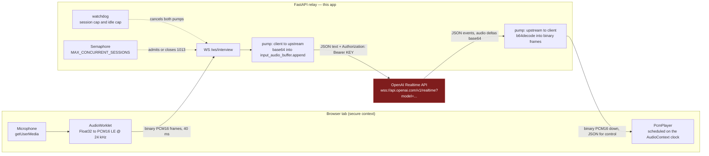
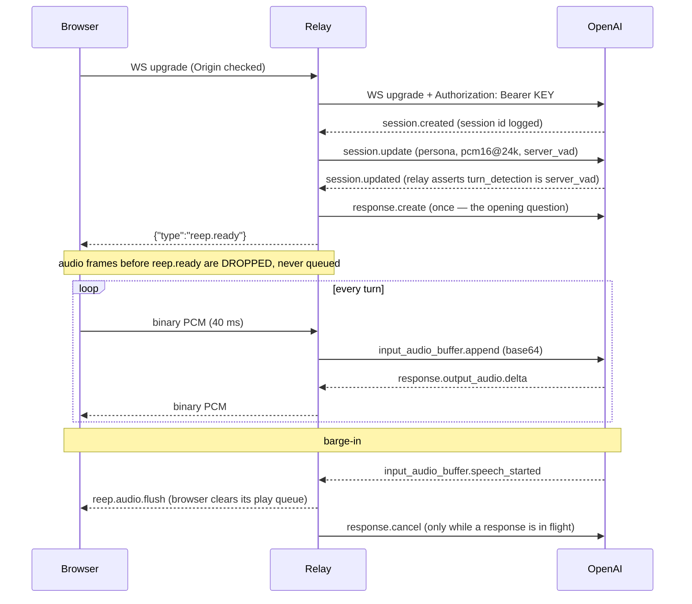

# REEP — real-time AI mock interviewer

A standalone **FastAPI** service that relays a student's microphone to the **OpenAI Realtime API**
and the model's voice back, over one WebSocket per interview. There is no Node.js anywhere in this
app: the browser talks to FastAPI, FastAPI talks to OpenAI with the `websockets` library.

**Why a relay at all.** The `OPENAI_API_KEY` is used on exactly one socket — this server's outbound
connection to `api.openai.com`. It is never sent downstream, never echoed inside an error the
browser can see, and never logged. A browser that connected to OpenAI directly would have to hold
that key, and a key in a browser is a key on the internet.

The interviewer's persona is fixed in code and sent verbatim in the single `session.update`:

> You are a strict yet constructive AI Mock Interviewer. Your goal is to prepare students for
> corporate and technical job placements. Ask one clear question at a time. Do not interrupt the
> student while they are speaking. After they finish answering, provide a 1-sentence micro-feedback
> critique focusing on their structure (STAR method), pacing, or vocabulary, then seamlessly
> transition to the next logical interview question.

---

## Where this sits in the REEP stack

This is an **additional process**, independent of the four in the root `AGENTS.md` (Postgres, the
FastAPI API on `:3300`, the Angular SPA on `:4200`, the optional LiveKit voice worker). It has its
own virtualenv and its own port, and nothing else in REEP fails if it is not running. It reads
`apps/api-py/.env` first — so a key entered once for the main API is picked up — then its own
`.env`, which wins.

```
apps/interview-realtime/
  app/config.py      pydantic-settings Settings (env vars -> snake_case fields)
  app/server.py      the FastAPI app: /health, static client, WS /ws/interview
  public/index.html  the bundled test client (served same-origin by this process)
  public/app.js      capture + playback + the Start/End state machine
  requirements.txt   runtime pins, `==`, matching the house rule in apps/api-py
  .env.example       copy to .env
  src/               NOT served and NOT built: an unwired voice-orb visualiser
                     (VoiceVisualizer.ts) and its preview harness. There is no
                     package.json or tsconfig.json in this repo by design — the
                     backend here is FastAPI only — so nothing compiles these
                     today and the interview client does not use them.
```

There is no `app/types.py`. Realtime events are matched against the frozenset
allowlists at the top of `app/server.py`; nothing outside those sets is forwarded
to the browser.

---

## Requirements

* **Python 3.11 or newer.** The relay uses `asyncio.TaskGroup`, `except*` exception groups and
  `asyncio.timeout` — all 3.11 features. Anything from 3.11 to 3.14 works; the examples below use
  3.12 because this repo already installs it for the LiveKit voice worker.
* An OpenAI API key on an account entitled to a Realtime model.
* A browser on a **secure context** — `https://`, or `http://localhost` / `http://127.0.0.1`.
  `navigator.mediaDevices` is `undefined` on any other `http://` origin, so opening the page at
  `http://192.168.x.x:8080` from a phone silently removes the microphone API.

---

## Setup and run — Windows (PowerShell)

From `apps\interview-realtime`:

```powershell
py -3.12 -m venv .venv
.venv\Scripts\python -m pip install --upgrade pip
.venv\Scripts\pip install -r requirements.txt

Copy-Item .env.example .env
notepad .env                      # paste OPENAI_API_KEY, save

.venv\Scripts\python -m uvicorn app.server:app --host 127.0.0.1 --port 8080
```

Then open <http://127.0.0.1:8080/>.

`py -0` lists the interpreters you actually have; substitute any 3.11+ version if 3.12 is absent.

**Do not use `--reload` on Windows.** As documented in the root `AGENTS.md` for the API, the
reloader has repeatedly left a stale worker holding the port here: the code you are editing keeps
running and the change appears to do nothing. Stop the process and start it again instead.

To free a wedged port:

```powershell
Get-NetTCPConnection -LocalPort 8080 -State Listen | ForEach-Object { Stop-Process -Id $_.OwningProcess -Force }
```

## Setup and run — POSIX (macOS / Linux)

From `apps/interview-realtime`:

```bash
python3.12 -m venv .venv
.venv/bin/python -m pip install --upgrade pip
.venv/bin/pip install -r requirements.txt

cp .env.example .env
${EDITOR:-nano} .env              # paste OPENAI_API_KEY, save

.venv/bin/python -m uvicorn app.server:app --host 127.0.0.1 --port 8080
```

Then open <http://127.0.0.1:8080/>.

`--reload` is safe here, and `uvicorn[standard]` additionally installs `uvloop`, which the service
picks up automatically.

**Production shape** (either OS): drop `--reload`, bind `0.0.0.0`, terminate TLS in front, and scale
with workers rather than with `MAX_CONCURRENT_SESSIONS` — see [Scaling](#scaling).

```bash
.venv/bin/python -m uvicorn app.server:app --host 0.0.0.0 --port 8080 --workers 4
```

---

## Architecture



The API key exists only on the arrow from `UP` to `OAI`. Nothing on the browser side of `WS` ever
carries it, including error text: upstream `error.message` can quote request content, so the browser
receives a coded control event instead of the raw message.

**Wire format.** Upstream from the browser: **binary** frames of raw PCM16 LE mono @ 24 kHz, which
the relay base64-encodes into `input_audio_buffer.append`. Downstream: **binary** frames of decoded
PCM for audio, **JSON text** frames for control. Not JSON-everywhere — that would cost an extra
base64 encode and decode per frame per direction, at 25 frames/s/session. WebSocket preserves
ordering across binary and text frames on one connection, so control events stay correctly
interleaved with audio.

### Session lifecycle



Two design points a reviewer should see confirmed in `app/server.py`:

* **Server VAD does the committing.** With `turn_detection.create_response = true` the API commits
  the buffer and creates the response itself, so in the steady state the relay sends exactly one
  kind of event: `input_audio_buffer.append`. Sending `commit` or `response.create` per turn
  double-commits and produces a stuttering interviewer nobody can reproduce on a quiet machine.
* **Both API generations are accepted.** The beta surface emits `response.audio.delta`, GA emits
  `response.output_audio.delta`, with byte-identical payloads. The relay matches against a frozenset
  of both names, so a model change upstream cannot silently mute the interviewer.

### Backpressure

There is no queue the relay owns, therefore none it can overflow. Each direction is a single task
doing `recv → transform → await send`; a slow browser blocks that `await`, the upstream receive
queue (bounded, 32 frames) fills, and TCP backpressures OpenAI. Memory stays flat. The only
module-level mutable object is one `asyncio.Semaphore` — a counter, not a map keyed by connection,
so nothing accumulates per session and a second worker needs no shared state.

---

## Guardrails

Every limit closes **both** sockets — downstream with an explicit code and a human-readable reason,
upstream via its context manager — and cancels every task and timer on the way out.

| Limit | Env var | Default | Close code | Reason sent to the browser |
|---|---|---|---|---|
| Total session length | `SESSION_MAX_SECONDS` | 900 (15 min) | `4009` | `Session limit of 15 minutes reached` |
| No inbound client audio | `IDLE_MAX_SECONDS` | 120 (2 min) | `4008` | `No audio received for 2 minutes` |
| Concurrent sessions per worker | `MAX_CONCURRENT_SESSIONS` | 100 | `1013` | `Too many interviews in progress` |
| Key missing, or upstream 401 | `OPENAI_API_KEY` | — | `4001` | `Voice service not configured` |
| Upstream 403 / 404 / 429 / 5xx | — | — | `4002` | `Voice service unavailable, try again shortly` |
| Normal end (student pressed End) | — | — | `1000` | `Interview complete` |
| Anything unexpected | — | — | `1011` | `Internal error` |

Notes that matter in practice:

* **The session cap is a cost ceiling**, not just a UX one. Audio tokens bill per second of a
  session that a forgotten browser tab would otherwise hold open indefinitely. 15 minutes is below
  OpenAI's own session limit, so ours binds first and the student always gets a readable reason
  rather than an unexplained upstream hang-up.
* **The idle cap watches inbound audio, not the socket.** A backgrounded mobile tab keeps the
  WebSocket alive while the OS suspends microphone capture; only "no audio" catches it.
* The idle watchdog compares monotonic timestamps on a coarse tick instead of resetting a timer per
  audio frame — resetting would be 25 timer operations per second per session to enforce a 120 s
  threshold.
* **Close reasons are truncated to 123 bytes** (RFC 6455). Over that is a protocol error, not a
  truncation, and the browser then reports a bare `1006` with no reason at all — the opposite of the
  intent.
* **Barge-in** is not a guardrail but behaves like one: on `input_audio_buffer.speech_started` the
  relay flushes the browser's play queue *first* (every millisecond before the flush is audible),
  then sends `response.cancel` upstream — only if a response is actually in flight, since cancelling
  outside that window is answered with an `error` event that is noise indistinguishable from a real
  failure. Audio deltas whose `response_id` no longer matches the active response are dropped, so
  the browser can never receive audio it has already flushed.
* **Origin is checked at the handshake.** Browsers do not apply the same-origin policy to WebSocket
  upgrades — they only attach an `Origin` header — and CORS middleware never sees a socket upgrade.
  `WEB_ORIGIN` is that check. Without it, any page on the internet could open a billed session
  against your key.

---

## Smoke test

Five checks, in order. Anything that fails here fails the same way for a student.

1. **Process is up:** `curl http://127.0.0.1:8080/health` → a JSON body reporting configured/ready.
2. **Startup log is clean:** no `OPENAI_API_KEY is not set` warning, no uvicorn `--ws` warning.
3. **Page loads:** <http://127.0.0.1:8080/> paints with **Start Interview** enabled and **End
   Interview** disabled.
4. **Full call:** press Start, allow the microphone, and confirm — the interviewer speaks first
   within a couple of seconds; talking over it stops its voice almost immediately; a pause of about
   0.7 s ends your turn and the reply begins with a one-sentence critique.
5. **Clean teardown:** press End. The browser's recording indicator goes dark, and the server logs a
   close with code `1000`.

Use **headphones**. On speakers you are also testing the browser's echo canceller, and a failure
there looks exactly like a VAD misconfiguration.

Repeat step 4 after any dependency bump — that is what the `requirements.txt` header means by
"run a real end-to-end call".

---

## Troubleshooting

### "Voice service not configured" / the socket closes instantly with 4001

The key is missing or blank. At startup the process logs, once:

```
WARNING  OPENAI_API_KEY is not set (looked in ...\apps\api-py\.env and ...\apps\interview-realtime\.env)
```

The relay deliberately still boots — it serves `/health` and the page so an operator can *see* the
problem in the browser — but every interview closes with `4001`.

Check, in this order:

1. The `.env` exists **in one of the two paths the warning names**, not in the repo root and not in
   `app/`.
2. The line is `OPENAI_API_KEY=sk-...` with no quotes, no spaces around `=`, no `export ` prefix.
3. `apps/interview-realtime/.env` **wins** over `apps/api-py/.env`. A blank `OPENAI_API_KEY=` in the
   local file overrides a perfectly good key in the shared one — a genuinely confusing failure.
4. A key present but **rejected** is a different symptom: the process starts without the warning and
   the *handshake* fails, logging `HTTP 401`, which also closes `4001`. That means revoked, wrong
   project, or a stray character. Whitespace is stripped before use, so a trailing newline is not
   the cause.

Verify the key without this app (it never prints the key, only a status):

```bash
curl -s -o /dev/null -w "%{http_code}\n" https://api.openai.com/v1/models -H "Authorization: Bearer $OPENAI_API_KEY"
```

```powershell
(Invoke-WebRequest -Uri https://api.openai.com/v1/models -Headers @{ Authorization = "Bearer $env:OPENAI_API_KEY" }).StatusCode
```

`200` = good key, `401` = bad key.

### Wrong model name — the handshake fails with 404 or 403

`OPENAI_REALTIME_MODEL` goes into the query string, `?model=<value>`. The relay logs the real status
code and closes `4002`:

```
ERROR  OpenAI Realtime handshake refused: HTTP 404 for model URL wss://api.openai.com/v1/realtime?model=gpt-realtime-preview
```

| Status | Meaning | Fix |
|---|---|---|
| `404` | No such model id — usually an invented dated snapshot, or a typo | Use `gpt-realtime`, or a snapshot id you have verified exists |
| `403` | The model exists but your organisation is not entitled to it | Enable Realtime on the account, or use a model that appears in the list below |
| `429` | Concurrent-session or rate cap hit — **not** a model-name problem | Lower `MAX_CONCURRENT_SESSIONS`, or check the account's Realtime limits |

List what your account actually has, and do not guess:

```bash
curl -s https://api.openai.com/v1/models -H "Authorization: Bearer $OPENAI_API_KEY" | grep -o '"id": *"[^"]*realtime[^"]*"'
```

```powershell
(Invoke-RestMethod https://api.openai.com/v1/models -Headers @{ Authorization = "Bearer $env:OPENAI_API_KEY" }).data.id | Where-Object { $_ -like "*realtime*" }
```

A **blank or whitespace-only** `OPENAI_REALTIME_MODEL` is not an error: it falls back to
`gpt-realtime`, because an empty `?model=` is a 404 that reads like an outage.

### The `websockets` version trap — `extra_headers` vs `additional_headers`

This is the failure that survives CI and breaks the first real call.

`websockets` **≥ 14.0 renamed** the `connect()` keyword `extra_headers=` to `additional_headers=`.
The relay is written against `websockets==15.0.1` and uses `additional_headers=`. The pin and the
keyword move together — changing one without the other is a runtime `TypeError` raised at *connect*
time, not import time, so nothing catches it until a student presses Start:

```
TypeError: connect() got an unexpected keyword argument 'extra_headers'
```

...if someone downgraded the library below 14 while leaving the modern keyword in place, or:

```
TypeError: connect() got an unexpected keyword argument 'additional_headers'
```

...if an environment resolved an old `websockets` (this is the common one — some other package
pinning `websockets<14` in the same venv).

Diagnose and fix:

```bash
.venv/bin/pip show websockets            # Version: must be 15.0.1
.venv/bin/pip install -r requirements.txt --upgrade
```

```powershell
.venv\Scripts\pip show websockets
.venv\Scripts\pip install -r requirements.txt --upgrade
```

Two related traps in the same area:

* **`uvicorn[standard]` also depends on `websockets`** for the *server* side of the browser socket,
  so this single pin governs both directions. After any bump, start uvicorn and confirm it logs no
  `--ws` implementation warning, then run the [smoke test](#smoke-test).
* **Do not install this service into the `apps/api-py` venv.** That environment has its own
  dependency graph; the separate `.venv` here is what keeps the pin honest.

### Connects, transcribes, and plays no sound

The two API generations use different audio event names (`response.audio.delta` on beta,
`response.output_audio.delta` on GA). The relay accepts both, so if this happens the cause is
upstream of the names — check the logs for a `response.done` carrying `status: "failed"`, whose
cause is in `status_details.error` and which does **not** produce a top-level `error` event. Code
that watches only `error` events reports a healthy session that made no noise.

If a `session.update` was rejected (`error` with `param: "session...."`), the session silently
continues on defaults — wrong persona, possibly wrong VAD. That is what `OPENAI_REALTIME_BETA_HEADER`
is for: blank selects the GA session shape, `realtime=v1` selects the flat beta shape. Set it to
match the surface your model actually serves.

### Other quick ones

| Symptom | Cause |
|---|---|
| Browser console: `navigator.mediaDevices is undefined` | Insecure context — use `localhost`/`127.0.0.1` or real HTTPS, not a LAN IP over `http://` |
| Handshake rejected before any log line about OpenAI | `Origin` not in `WEB_ORIGIN`; add the exact origin, no trailing slash |
| Closes with `1013` immediately | `MAX_CONCURRENT_SESSIONS` reached on this worker — add workers, do not just raise the number |
| Interviewer cuts the student off mid-answer | Raise `VAD_SILENCE_DURATION_MS` (700 → 900); it is above the API default for exactly this reason |
| VAD triggers on room noise | Raise `VAD_THRESHOLD` toward 0.6; do not lower it |
| The interviewer talks over itself / duplicated questions | Something is sending `commit` or `response.create` per turn on top of server VAD |
| Everything sounds pitch-shifted by exactly 2× | A sample-rate path is wrong — the browser context is at 48 kHz and the resampling fallback is not engaged |

---

## Scaling

Per session: ~48 kB/s of inbound PCM plus ~48 kB/s outbound, with ~33 % base64 inflation on the two
OpenAI-facing legs — roughly 96 kB/s of payload and ~25 audio frames/s each needing a base64 encode
and a socket write. One CPython process will not carry a thousand of those.

What the code guarantees instead is that it scales **horizontally**: no global keyed state, no
in-process session registry a second worker would not see, nothing sticky beyond the WebSocket
itself. `MAX_CONCURRENT_SESSIONS` is therefore a **per-worker** number — start near 100, measure,
and add workers behind a WebSocket-aware load balancer.

Before load-testing, check the account's own concurrent-Realtime-session cap and current audio
pricing. That ceiling can bind long before the hardware does, and it surfaces as a `429` at the
handshake, which students see as `4002`.

---

## Privacy — house rule 1

`AGENTS.md` rule 1: any path that sends a student's private records to a model must go through
`student_data_egress_allowed(...)` in `apps/api-py/app/ai/llm.py`. `wss://api.openai.com` is not
loopback.

As built, this service sits outside that gate on purpose: `instructions` is the fixed persona
constant and contains no student record, and the only student content on the wire is their own voice,
sent knowingly when they press Start — the same posture as the existing LiveKit voice path.

That changes the moment anyone personalises the session: putting a branch, CGPA, backlog count,
target company or resume into `instructions` is marks-and-attendance data in a prompt to a remote
model. If that is added, route the decision through `student_data_egress_allowed(...)` and degrade to
the generic persona when it refuses, the same shape as `/student/resume/generate` falling back to
`used_ai=false`. Raise it with the architecture reviewer rather than deciding it inside the relay.
