# REEP — Complete Architecture & Tech Stack

> Generated from the code in this repository, not from a whiteboard. Every version,
> port, table, close code and environment variable below was read out of
> `apps/api-py`, `apps/web`, `docker-compose*.yml` and `.github/workflows/ci.yml`.
>
> Companion: `AGENTS.md` (the operating rules), `docs/interview-engine-v3.md`,
> `docs/google-sign-in.md`, `docs/deployment-env.md`.

---

## 0. One-paragraph summary

REEP is a college placement-readiness dashboard: an **Angular 22 SPA** talking over
same-origin HTTP + WebSocket to a **Python 3.14 / FastAPI** monolith, on
**PostgreSQL 17 with pgvector**. The API is the only process that holds credentials —
it relays the browser's microphone to the **OpenAI Realtime API** for the mock
interviewer, brokers **LiveKit** tokens for the (retained, UI-less) voice stack, verifies
**Google OIDC** ID tokens for sign-in, and fronts a provider-agnostic LLM adapter
behind a hard **student-data egress gate**. An optional **fourth process** (Python 3.12)
runs the LiveKit voice agent cascade. Everything else — auth, RBAC, retention,
uploads, resume PDF rendering, the knowledge base — lives in the one API process.

---

## 1. Process & deployment topology

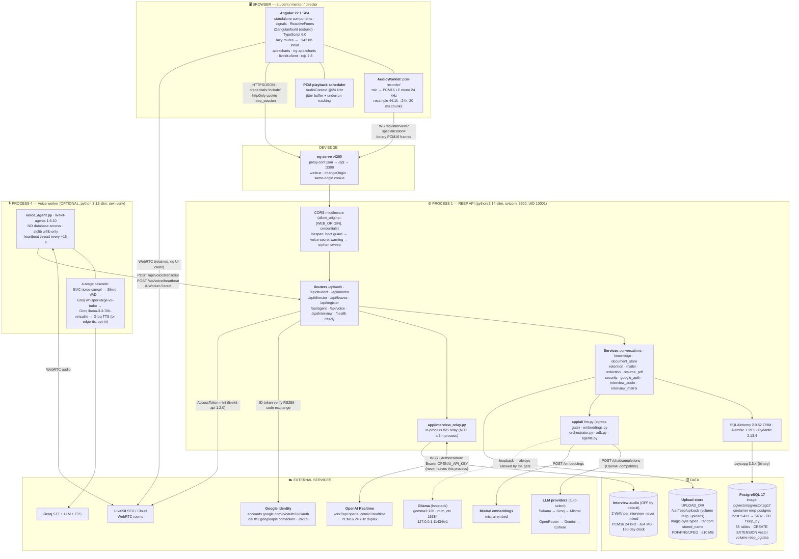

**Process count is a fact people get wrong, so state it plainly:**

| # | Process | Runtime | Required? | Notes |
|---|---------|---------|-----------|-------|
| 1 | PostgreSQL 17 + pgvector | container | **yes** | `docker compose up -d`, host port **5433** |
| 2 | FastAPI API (`uvicorn app.main:app --port 3300`) | Python **3.14**, `.venv` | **yes** | includes the interview relay |
| 3 | Angular dev server (`npx ng serve`) | Node 22, npm 11.16 | dev only | prod serves the built bundle statically |
| 4 | LiveKit voice worker (`voice_agent.py`) | Python **3.12**, `.venv-voice` | optional | `livekit-agents` requires `<3.15` |

The mock interviewer is **not** a fifth process. It runs inside process 2.

---

## 2. Front end — micro detail

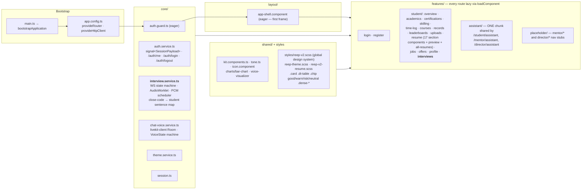

| Concern | Detail |
|---|---|
| Framework | Angular **22.1**, standalone components, **signals**, ReactiveForms |
| Build | `@angular/build:application` (esbuild), TypeScript **~6.0.2**, SCSS |
| Bundle budget | initial **warn 250 kB / error 400 kB**; anyComponentStyle 16 kB / 32 kB; `outputHashing: all` |
| Why lazy | every route was once `component:` → one **1.23 MB** `main` chunk; now **~142 kB** initial. One static import fails CI. |
| API access | `fetch(\`${environment.apiBase}/...\`, { credentials: 'include' })`, `apiBase = '/api'` |
| Dev proxy | `proxy.conf.json`: `/api` → `http://localhost:3300`, `ws: true`, `changeOrigin: true` |
| Charts | apexcharts 6.8 / ng-apexcharts 3.0 |
| Realtime audio | `AudioContext({ sampleRate: 24000 })`, AudioWorklet `pcm-recorder`, `MAX_UPLINK_BUFFERED_BYTES = 24000` backpressure |
| Test / lint | vitest 4, jsdom 28, prettier 3.8, `npx ng test --watch=false` |
| Status colour rule | status is **text + colour together**, never colour alone |

---

## 3. Back end — module map

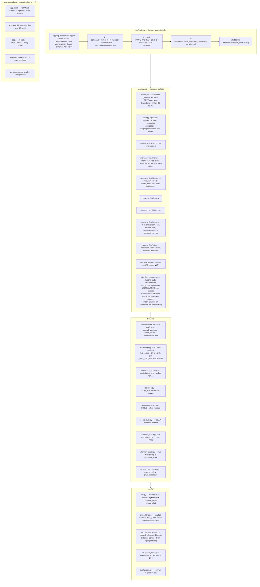

### Runtime pins (`requirements.txt`, exact `==`)

| Package | Version | Why it is pinned here |
|---|---|---|
| fastapi | 0.141.1 | app framework |
| uvicorn[standard] | 0.52.3 | ASGI server; `--timeout-graceful-shutdown 110` in the image |
| **websockets** | **15.0.1** | relay uses `additional_headers=` (renamed in ≥14) and the asyncio client API |
| sqlalchemy | 2.0.52 | ORM, `Mapped[...]` style |
| alembic | 1.19.1 | migrations |
| pydantic | 2.13.4 | schemas |
| pydantic-settings | 2.15.0 | `Settings` |
| psycopg[binary] | 3.3.4 | Postgres driver (`postgresql+psycopg://`) |
| pgvector | 0.5.0 | `vector` column + SQLAlchemy adapter |
| pyjwt[crypto] | 2.13.0 | HS256 session **and** RS256 Google ID token |
| cryptography | 50.0.0 | pinned directly — was only transitive |
| python-multipart | 0.0.32 | uploads |
| httpx | 0.28.1 | LLM calls, OAuth token exchange, JWKS |
| reportlab | 5.0.0 | local resume PDF (no network → gate N/A) |
| google-adk | 2.7.0 | agent framework |
| litellm | 1.96.2 | ADK → non-Gemini providers |
| livekit-api | 1.2.0 | mints voice room tokens |

`requirements-dev.txt` = `-r requirements.txt` + **pytest 9.1.1**, and nothing else.
The Dockerfile installs `requirements.txt` **alone** — no test runner in a production image.

### Voice worker pins (`requirements-voice.txt`, Python 3.12)

`livekit-agents==1.6.10` · `livekit-plugins-groq==1.6.10` · `livekit-plugins-silero==1.6.10` ·
`livekit-plugins-noise-cancellation==0.3.0` · `edge-tts==7.2.8` (opt-in only).
No HTTP client: stdlib `urllib`. No DB driver: it never touches Postgres.

---

## 4. Data layer

```mermaid
erDiagram
    users ||--o| students : "1:1 (role STUDENT)"
    users ||--o| mentors : "1:1 (role MENTOR)"
    mentors ||--o{ students : "mentor group — scope for rule 2"
    cohorts ||--o{ students : ""
    students ||--o{ semester_results : ""
    semester_results ||--o{ subject_marks : ""
    students ||--o{ attendance_records : ""
    students ||--o{ student_profiles : ""
    students ||--o{ resume_profiles : ""
    students ||--o{ resumes : ""
    students ||--o{ uploads : "magic-byte typed files"
    students ||--o{ skill_claims : ""
    students ||--o{ student_skills : ""
    skills ||--o{ student_skills : ""
    students ||--o{ job_applications : ""
    jobs ||--o{ job_applications : ""
    job_import_runs ||--o{ jobs : ""
    students ||--o{ placement_offers : ""
    students ||--o{ registrations : ""
    registration_rules ||--o{ registrations : ""
    students ||--o{ leave_requests : ""
    students ||--o{ mentor_notes : ""
    students ||--o{ alerts : ""
    alert_rule_configs ||--o{ alerts : ""
    students ||--o{ swoc_entries : ""
    students ||--o{ mock_attempts : ""
    students ||--o{ lab_sessions : ""
    students ||--o{ time_sheet_entries : ""
    students ||--o{ certification_progress : ""
    certifications ||--o{ certification_progress : ""
    courses ||--o{ enrollments : ""
    students ||--o{ enrollments : ""
    students ||--o{ academic_qualifications : ""
    students ||--o{ academic_gaps : ""
    students ||--o{ schedule_items : ""
    users ||--o{ conversations : "one active per owner"
    conversations ||--o{ messages : "channel = text | voice | interview"
    conversations ||--o{ assistant_feedback : ""
    agent_runs ||--o{ assistant_feedback : "(no new rows — superseded)"
    knowledge_documents ||--o{ knowledge_chunks : "embedding vector (pgvector)"
    students ||--o{ interview_consents : "3 booleans, versioned"
    interview_consents ||--o{ interview_sessions : "consent_id pins the exact grant"
    interview_sessions ||--o{ interview_turns : ""
    interview_sessions ||--o| interview_evaluations : "nullable scores"
    mail_logs ||--|| mail_logs : "unique dedupe_key = send-exactly-once"
```

**55 tables**, all defined in `apps/api-py/app/models/` (source of truth) and
registered in `models/__init__.py` so Alembic autogenerate sees them:

```
academic_gaps · academic_qualifications · agent_runs · alert_rule_configs ·
alerts · assistant_feedback · attendance_records · certification_progress ·
certifications · cohorts · conversations · courses · email_verifications ·
english_baseline_sections · english_baselines · enrollments ·
interview_consents · interview_evaluations · interview_sessions ·
interview_turns · job_applications · job_import_runs · jobs · knowledge_chunks ·
knowledge_documents · lab_sessions · leave_requests · login_days · mail_logs ·
mentor_notes · mentors · messages · mock_attempts · placement_criteria ·
placement_offers · registration_rules · registrations · resume_profiles ·
resumes · schedule_items · semester_results · skill_claims · skills ·
student_milestones · student_profiles · student_skills · students ·
subject_marks · swoc_entries · time_ledger_cells · time_ledger_days ·
time_sheet_entries · uploads · users · voice_worker_heartbeats
```

**Alembic enum gotchas** (hit repeatedly, so they are written down):
1. adding an enum *column* to an existing table does **not** auto-`CREATE TYPE` — create it first;
2. a *new table* reusing an *existing* enum must use `postgresql.ENUM(..., name='x', create_type=False)` — autogenerate emits a bare `sa.Enum` that errors "type already exists";
3. two columns sharing one enum reuse a **single** `Enum` instance.

**Knowledge base = pgvector.** `KnowledgeChunk.embedding` is a *dimensionless* `vector`.
Retrieval is hybrid: Postgres full-text (`ts_rank` over `to_tsvector('english', …)`)
blended `0.5 / 0.5` with pgvector cosine (`embedding <=> :query_vec`), and a vector
match only counts when its cosine **distance ≤ 0.32** — otherwise an off-topic query
would always drag in a nearest neighbour instead of hitting the honest
"no approved answer" fallback. **No embedder configured ⇒ full-text only**, so the KB
never stops working. KB text is APPROVED PUBLIC POLICY, which is why embedding it is
outside the student-data egress gate.

---

## 5. Authentication & authorization

```mermaid
sequenceDiagram
    autonumber
    participant B as Browser
    participant A as FastAPI /api/auth
    participant G as Google Identity
    participant DB as Postgres users

    B->>A: GET /api/auth/sso/status
    A-->>B: {available, reason} — blank client id ⇒ button renders disabled
    B->>A: GET /api/auth/sso/google
    A-->>B: 302 → accounts.google.com  (+ single-use state cookie, nonce)
    B->>G: consent
    G-->>A: 302 /api/auth/sso/google/callback?code&state
    A->>A: state cookie matches? (key derived from AUTH_SECRET)
    A->>G: POST oauth2.googleapis.com/token  (client_id + secret + code)
    G-->>A: id_token (RS256)
    A->>G: GET JWKS
    A->>A: verify signature · aud == GOOGLE_CLIENT_ID · iss == accounts.google.com<br/>· not expired · email_verified == true · nonce matches
    A->>DB: SELECT * FROM users WHERE lower(email) = lower(claims.email)
    alt no row
        A-->>B: 302 /login?error=sso_not_enrolled  (nothing self-provisions)
    else row found
        A->>A: create_session_token(userId,email,name,role,studentId?,mentorId?)
        A-->>B: Set-Cookie reep_session=<HS256 JWT>; HttpOnly; SameSite; Secure(prod); 12 h
    end
```

| Element | Detail |
|---|---|
| Cookie | `reep_session`, **httpOnly**, `Secure` on every non-dev `ENV`, 12-hour HS256 JWT |
| Claims | `userId, email, name, role, studentId?, mentorId?` + `iat/exp` + token version |
| Signing | `AUTH_SECRET` — the *same* secret also derives the OAuth flow-cookie key |
| Passwords | `scrypt:<salt_hex>:<digest_hex>`, N=16384 r=8 p=1 dklen=64, salt as a **hex string** — byte-compatible with Node `scryptSync`, so hashes migrated without a reset |
| Revocation | `users.token_version` rides in the token; `AUTH_REVOCATION_CACHE_SECONDS` (default **60**) bounds how long a logged-out token still works. DB read failure **admits** the session (fails open) and logs. |
| Password login | `POST /api/auth/login` **kept**, refused with 403 when `settings.password_login_allowed` is false. That is an **allowlist of dev/CI env names**, not `not is_prod` — an unrecognised `ENV` ("staging", "uat", blank) shuts the door rather than opening it. |
| Roster | `python -m app.seed_roster` derives `1MP25MDM01` → `1mp25mdm01@bgscet.ac.in` (`ROSTER_EMAIL_DOMAIN`, alias `COLLEGE_EMAIL_DOMAIN`, `--rekey-domain` to move a batch) |
| Allowlist | the `users` table itself. `GOOGLE_ALLOWED_DOMAIN` is a **label, not a fence**. |

### Rule 2 — staff scope is decided by role, never by a missing field

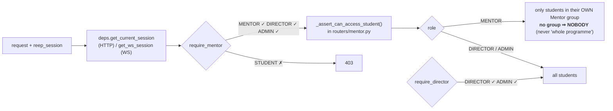

---

## 6. Rule 1 — the student-data egress gate

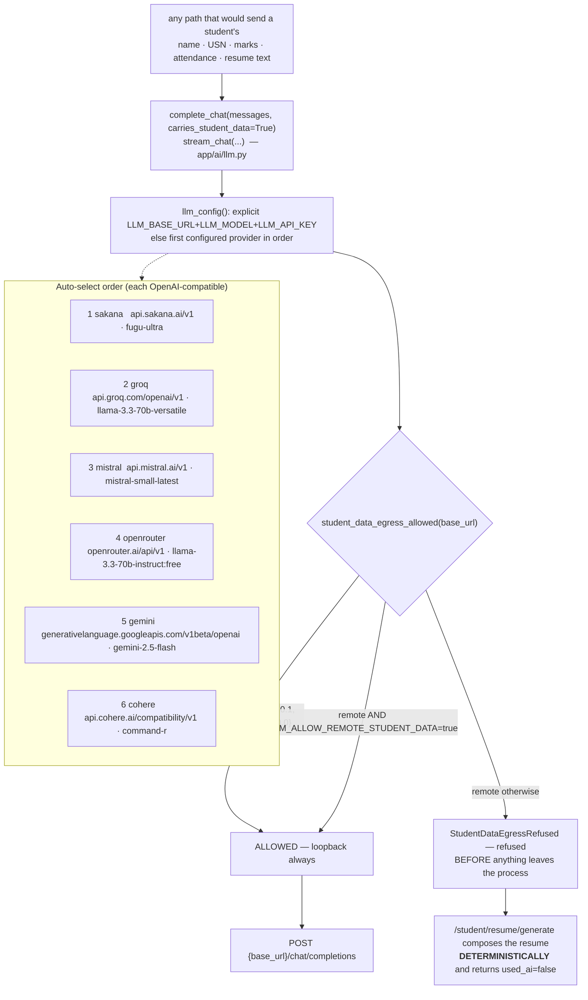

`LLM_BASE_URL` is a URL, **not a promise** — it may point at a free tier that trains on
submissions. Public data (a job posting, an approved KB chunk) does not need the gate;
a resume brief does. Route every *new* student-PII-to-model path through it.
`resume_pdf.py` is local ReportLab rendering — no network, so the gate does not apply,
and nothing remote may be added to that module.

---

## 7. The mock interviewer (Interview Engine v3) — the deep detail

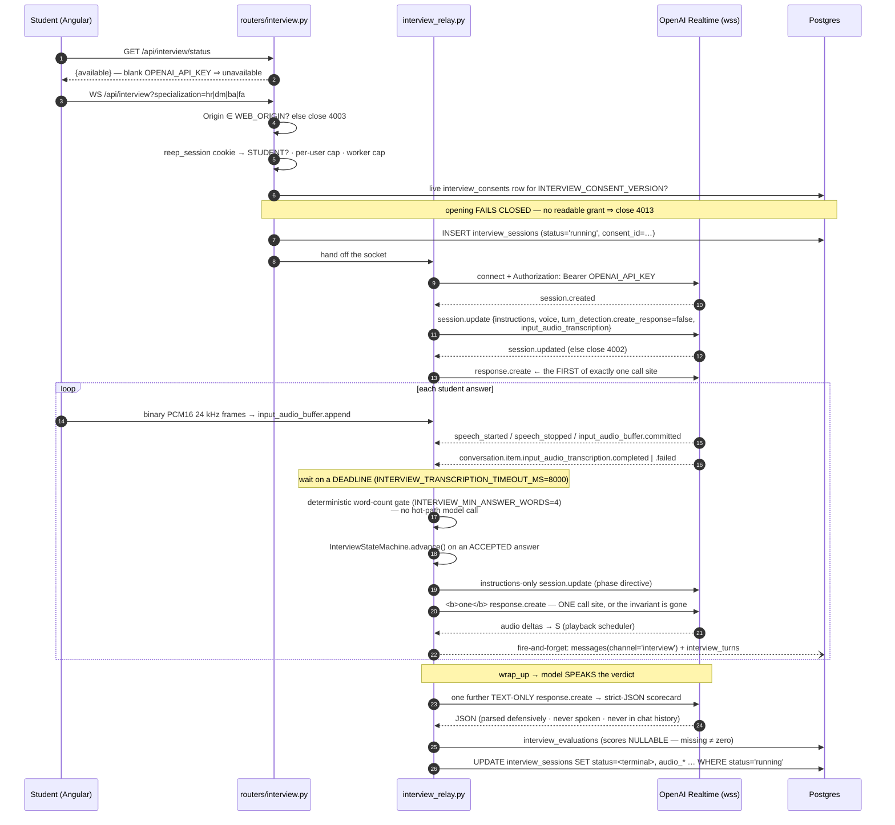

### Phase machine (`app/interview_matrix.py`)

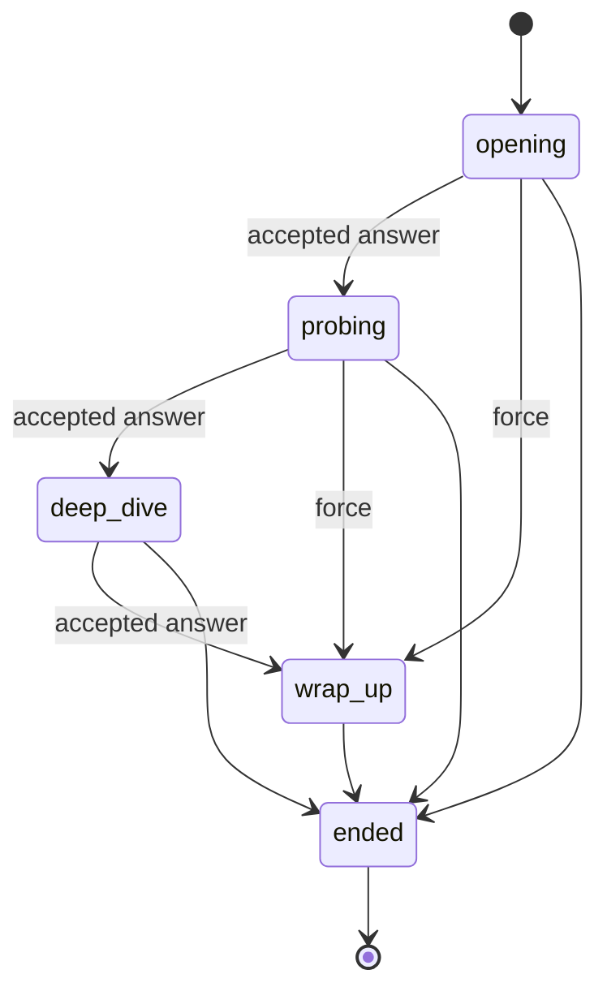

Specializations, from the matrix — an unknown key is **refused (4010)**, and *no*
`?specialization=` runs the generic interview, which never reaches wrap-up and so
never produces a report:

| key | label | persona |
|---|---|---|
| `hr` | Human Resources (HR) | senior HR / people-function interviewer |
| `dm` | Digital Marketing (DM) | a growth-oriented, data-driven CMO |
| `ba` | Business Analytics (BA) | a highly technical, problem-solving Director of Analytics |
| `fa` | Financial Analytics (FA) | a sharp, risk-conscious Managing Director / CFO |

### WebSocket close-code vocabulary (one list the client mirrors)

| Code | Meaning |
|---|---|
| 1000 | interview complete |
| 1001 | server shutting down |
| 1011 | unexpected error on our side |
| 1012 | ASGI server restarting (client has a sentence for it) |
| 1013 | per-worker concurrency cap (`INTERVIEW_MAX_SESSIONS`, default 100) |
| 4001 | not configured / upstream 401 |
| 4002 | upstream 403/429/5xx/handshake failure |
| 4003 | Origin not in `WEB_ORIGIN` |
| 4008 | idle — no inbound audio (`INTERVIEW_IDLE_SECONDS`, 120) |
| 4009 | hard wall-clock cap (`INTERVIEW_MAX_SECONDS`, 900) |
| 4010 | unknown `?specialization=` |
| 4011 | turn stalled — *our* `response.create` never acknowledged (deliberately not 4002) |
| 4012 | this student already holds `INTERVIEW_MAX_SESSIONS_PER_USER` (2) — deliberately not 1013 |
| 4013 | no live consent row → refused **before anything is written** |
| 4014 | consent revoked mid-interview → heartbeat notices within a minute |

### Three finalization layers, one idempotency predicate

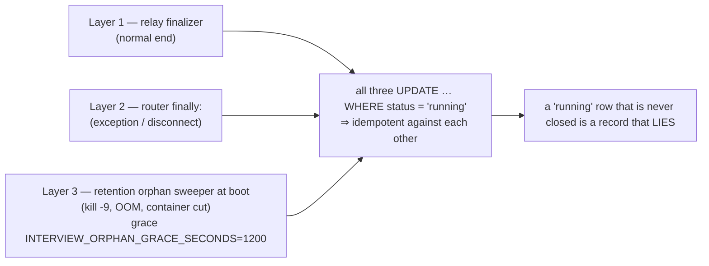

### Consent — a row, three booleans, two fail directions

`interview_consents` carries **three separate booleans** (live AI · store transcript ·
store audio) because they are three different disclosures and one boolean makes
"they consented" unfalsifiable. `interview_sessions.consent_id` pins the exact grant,
so *"was this student consented, to what wording, at the time of interview X"* stays
answerable after revocation. **Opening fails closed; the mid-interview check fails
open** — "we could not check whether they agreed" must never *start* an interview, and
a database hiccup must never *end* one a real grant authorised.

### Audio — off, and "off" is two independent switches

`INTERVIEW_RECORDING_ENABLED=true` **and** a live grant with `scope_store_audio`.
Neither is true in a default deployment. Then `app/interview_audio.py` writes
**two WAV files per interview, one per speaker, never mixed** (the directions are not
time-aligned) — RIFF/WAVE around the PCM16 LE mono 24 kHz already crossing the relay,
stdlib `wave`, no encoder, no transcode. Capped at `INTERVIEW_RECORDING_MAX_BYTES`
(64 MB) with a **truncation flag rather than a silent cut**. Retrievable only by
DIRECTOR/ADMIN. Deleted on the same **180-day** clock (`INTERVIEW_RETENTION_DAYS`).
**Branch on `interview_sessions.audio_recorded`, never on `audio_path IS NOT NULL`** —
a NULL path collapses four different facts into one.

### Interview record tables — *in addition to* `messages`, never instead

| Table | Holds |
|---|---|
| `interview_sessions` | terminal status, `terminal_reason`, `final_phase`, `answers_accepted`, **`turns_emitted` vs `turns_persisted`**, `close_code`, `conn_id`, `upstream_session_id`, `consent_id`, five `audio_*` columns, `started_at/heartbeat_at/ended_at`, `retention_until`, `deleted_at` |
| `interview_turns` | `seq`, `speaker`, **`phase`**, `content` (empty is legal), `transcription_status`, `answer_quality`, **`counted_as_answer`**, `is_partial`, `provider_turn_id`, `message_id` |
| `interview_evaluations` | `report_status`, **nullable** `overall/communication/domain/structure` scores, `strengths`/`improvements` (JSONB), `drill`, `summary`, `raw_response`, `model` |
| `interview_consents` | the versioned three-boolean grant |

---

## 8. Voice stack (retained, mounted, **no UI caller**)

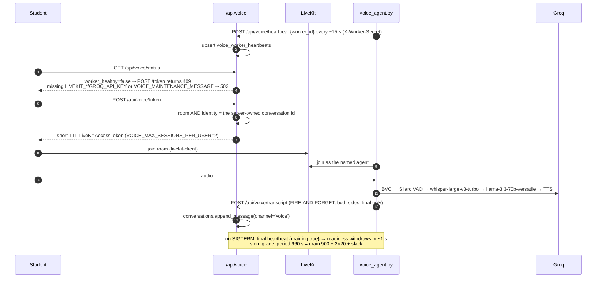

**The runbook everyone needs.** The worst failure in this stack is silent: the call
sounds perfect and the database is empty, because transcript POSTs are *deliberately*
fire-and-forget so a bad write can never kill a live call.

```sql
select channel, count(*), max(created_at) from messages group by channel;
```

No `voice` rows (or a stale `max(created_at)`) means turns are being dropped:

1. **`VOICE_WORKER_SECRET` differs** between API and worker → every POST 401s. The
   worker still connects and answers normally, so nothing looks wrong from outside.
2. **`REEP_API_URL` is wrong** (usually `localhost` from inside a container) → the
   POSTs never arrive.

Both now log `ERROR POST /api/voice/transcript -> HTTP 401: …` **with the status code**.
The same query answers the interview question — group by `channel` and look for
`interview`; its drops log as `Dropped interview turn`.

**Knock-on effects of the supersession, no longer silent:**
`AGENT_RUNS_COLLECTED = False` in `app/routers/agent.py` gates a **404** on
`POST /api/agent/feedback` naming the supersession, and `collected: false` on
`GET /api/agent/metrics`, so a frozen history is not read as a live zero.
Flip that one constant back to `True` on rollback — no second edit. `voice_turns`
(off `Message.channel`) keeps working.

---

## 9. Configuration surface (`app/config.py`, `pydantic-settings`)

| Group | Keys |
|---|---|
| Core | `DATABASE_URL` · `AUTH_SECRET` · `WEB_ORIGIN` (default `http://localhost:4200`) · `ENV` (default `dev`) · `DOCS_ENABLED` · `AUTH_REVOCATION_CACHE_SECONDS` (60) · `UPLOAD_DIR` |
| Google | `GOOGLE_CLIENT_ID` · `GOOGLE_CLIENT_SECRET` · `GOOGLE_REDIRECT_URI` · `GOOGLE_ALLOWED_DOMAIN` · `ROSTER_EMAIL_DOMAIN` |
| LLM | `LLM_BASE_URL` · `LLM_MODEL` · `LLM_API_KEY` · `LLM_TIMEOUT_MS` (300000) · **`LLM_ALLOW_REMOTE_STUDENT_DATA`** |
| Provider keys | `SAKANA_API_KEY` · `GROQ_API_KEY` · `MISTRAL_API_KEY` · `OPENROUTER_API_KEY` · `GEMINI_API_KEY` · `COHERE_API_KEY` |
| Embeddings | `EMBEDDING_BASE_URL` · `EMBEDDING_MODEL` · `EMBEDDING_API_KEY` |
| LiveKit / voice | `LIVEKIT_URL` · `LIVEKIT_API_KEY` · `LIVEKIT_API_SECRET` · `VOICE_WORKER_SECRET` · `VOICE_MAINTENANCE_MESSAGE` · `VOICE_MAX_SESSIONS_PER_USER` (2) · `VOICE_MAX_CALL_SECONDS` (900) · `VOICE_TTS` (worker, default `groq`) · `REEP_API_URL` (worker) |
| Interview | `OPENAI_API_KEY` · `OPENAI_REALTIME_MODEL` · `OPENAI_REALTIME_BASE_URL` · `OPENAI_REALTIME_VOICE` (`alloy`) · `OPENAI_REALTIME_BETA_HEADER` · `INTERVIEW_MAX_SECONDS` (900) · `INTERVIEW_IDLE_SECONDS` (120) · `INTERVIEW_MAX_SESSIONS` (100) · `INTERVIEW_MAX_SESSIONS_PER_USER` (2) · `INTERVIEW_VAD_THRESHOLD` (0.5) · `INTERVIEW_VAD_PREFIX_PADDING_MS` (300) · `INTERVIEW_VAD_SILENCE_DURATION_MS` (700) · `INTERVIEW_TRANSCRIPTION_MODEL` · `INTERVIEW_TRANSCRIPTION_TIMEOUT_MS` (8000) · `INTERVIEW_RESPONSE_CREATE_TIMEOUT_MS` (10000) · `INTERVIEW_MIN_ANSWER_WORDS` (4) · `INTERVIEW_MAX_CLARIFICATIONS_PER_QUESTION` (1) · `INTERVIEW_REPORT_TIMEOUT_MS` (20000) · `INTERVIEW_RECORDING_ENABLED` (false) · `INTERVIEW_RECORDING_MAX_BYTES` (64000000) · `INTERVIEW_RETENTION_DAYS` (180) · `INTERVIEW_ORPHAN_GRACE_SECONDS` (1200) · `INTERVIEW_CONSENT_VERSION` (`2026-08`) |

### The production boot guard

`Settings.production_boot_failures()` is raised from `main.py`'s lifespan, so **uvicorn
never binds a port** and the log names every problem it found. It fires on:

- `AUTH_SECRET` blank, still the value published in this repo / `.env.example`, an
  obvious placeholder, or **shorter than 32 characters**;
- `DATABASE_URL` still carrying this repo's dev password.

It is a **refusal, not a warning**: `AUTH_SECRET` signs `reep_session`, so a production
host on the repo default is one forged `{"role":"DIRECTOR"}` cookie away from every
student's marks, attendance and USN — no login, no database row involved. On every
development `ENV` it returns nothing at all, and `tests/test_boot_guard.py` pins that
as hard as it pins the refusal: **a guard that trips on a laptop gets deleted by
whoever is trying to ship that afternoon.**

Three more fail-closed switches keyed on the same dev-env allowlist:
`password_login_allowed` · `insecure_cookies_allowed` · `worker_auth_optional`.
`docs_exposed` mounts `/docs`, `/redoc`, `/openapi.json` in dev and **off in production**
unless `DOCS_ENABLED` is set deliberately — the endpoints stay authenticated either
way; what an open schema hands out is the **map**.

---

## 10. Build, test & CI

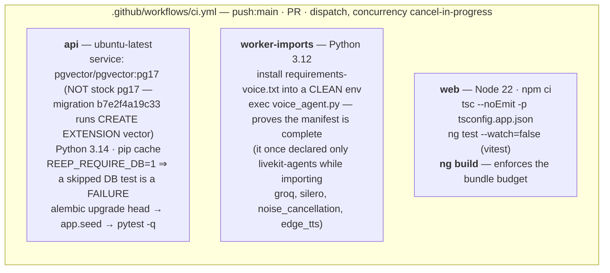

Local commands:

```bash
docker compose up -d                                   # Postgres 17 + pgvector on :5433
cd apps/api-py
.venv/Scripts/pip install -r requirements-dev.txt
.venv/Scripts/python -m alembic upgrade head
.venv/Scripts/python -m app.seed                       # refuses when ENV=prod
.venv/Scripts/python -m uvicorn app.main:app --port 3300
.venv/Scripts/python -m pytest                         # 33 test modules

cd ../web && npx ng serve                              # :4200, proxies /api
cd ../web && npx ng build                              # budget gate
```

**Windows note:** `uvicorn --reload` has wedged a stale worker here — after editing
backend files, kill port 3300 and restart rather than relying on `--reload`.

Backend test modules pin the invariants this document describes:
`test_boot_guard` · `test_egress_gate` · `test_auth_rbac` · `test_sso_contract` ·
`test_google_callback` · `test_seed_guard` · `test_interview_relay` ·
`test_interview_consent_gate` · `test_interview_write_path` · `test_interview_audio` ·
`test_interview_records` · `test_interview_access` · `test_interview_matrix` ·
`test_voice_gates` · `test_voice_transcript` · `test_voice_worker_source` ·
`test_knowledge` · `test_retention` · `test_conversations` · `test_orchestrator` ·
`test_assistant_eval` · `test_metrics` · `test_mailer` · `test_resume_pdf` ·
`test_registration_rules` · `test_feedback` · `test_voice` · `test_voice_worker_core`.

---

## 11. Production composition (`docker-compose.prod.yml`)

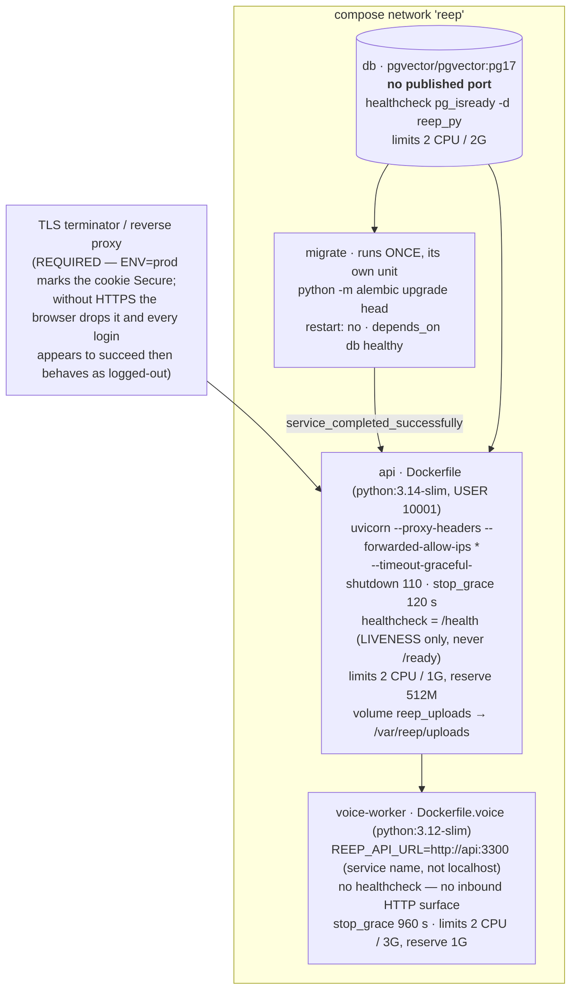

Every value without a default uses `${VAR:?set VAR}` — compose fails loudly on a
missing one rather than starting a half-configured stack. **Migrations never run from
the API entrypoint**: every replica running `alembic upgrade head` on boot races on the
version table, and the loser can leave the schema half-applied. Health-checking `/ready`
instead of `/health` would restart every API container during a brief Postgres wobble
and turn a recoverable blip into an outage.

---

## 12. Cross-cutting invariants — the short list

| # | Invariant | Enforced by |
|---|---|---|
| 1 | Student PII never reaches a remote model unbidden | `student_data_egress_allowed()` in `app/ai/llm.py`; `/student/resume/generate` degrades to `used_ai=false` |
| 2 | Staff scope is role-decided; a MENTOR with no group sees **nobody** | `require_mentor` / `require_director` / `_assert_can_access_student` |
| 3 | Exactly **one** `response.create` call site after the handshake | `app/interview_relay.py` — a second site kills "one open question at a time" and no test would notice |
| 4 | No student transcript is ever composed into model instructions | relay builds persona + specialization block + phase directive **only** |
| 5 | A `running` interview row is always closed | three idempotent layers, one `AND status='running'` predicate |
| 6 | Conversations have exactly one writer | `app/conversations.py`; `app/memory.py` is a tombstone, do not use |
| 7 | Uploads are typed by **magic bytes**, stored under random names | `app/document_store.py` |
| 8 | A mail with a given `dedupe_key` is sent at most once | unique index; the losing racer catches `IntegrityError` |
| 9 | Routes are lazy | `loadComponent` everywhere; the budget in `angular.json` fails CI otherwise |
| 10 | Production refuses repo credentials at boot | `production_boot_failures()` raised from the lifespan |

---

## 13. Migrated away — ignore any lingering reference

Next.js · React · NestJS · Prisma · `server-only` · `apps/api`. That stack was fully
migrated and deleted. `apps/interview-realtime/` — the superseded standalone prototype
with no authentication and no database — was deleted in 2026-09 along with `ollama/`
and `tools/cascade`; the in-process relay is the only interviewer.
