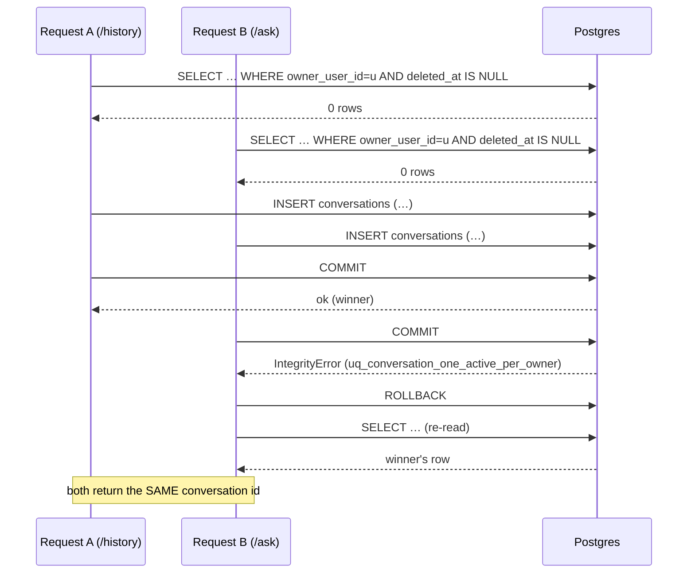
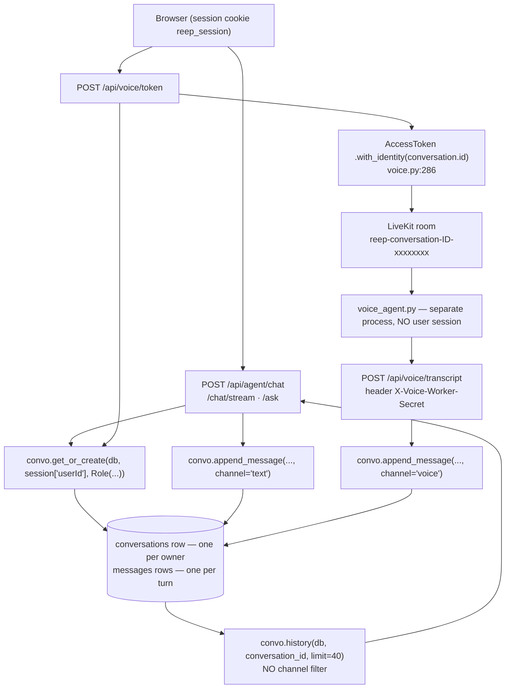
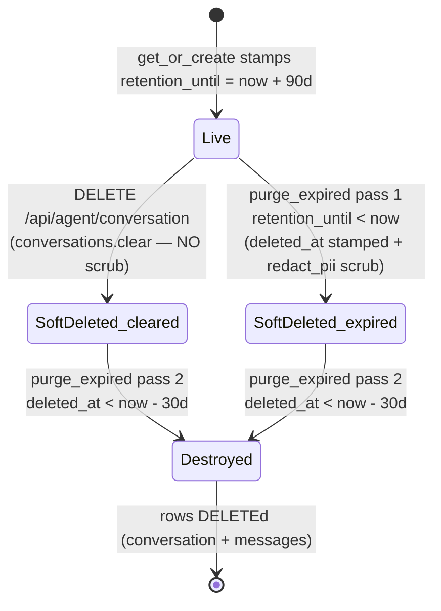
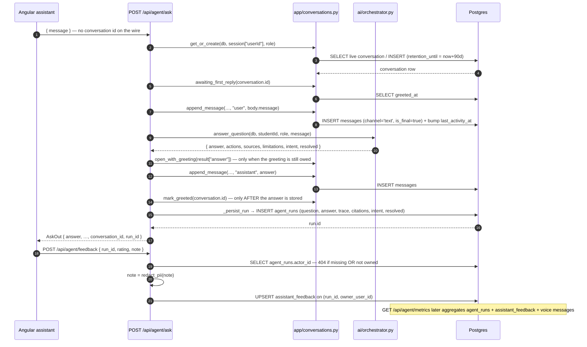

# Chapter 9 — Conversations, Memory & Governance

*Server-owned state, retention, redaction and feedback*

After this chapter you will be able to open any assistant surface in REEP — typed chat, the SSE stream, the structured `/ask` path, or a live voice call — and say exactly where its conversation came from, which row each turn became, what text is stored raw and what is scrubbed, when (and whether) any of it is ever deleted, and how a director would find out whether the assistant is doing any good. You will be able to add a new assistant endpoint without reintroducing the **P0** — the team's label for a top-severity security defect — that this design was built to close: any signed-in student could read *and append to* another student's assistant thread by substituting their own user id into a client-chosen key. And you will know which of the governance promises in this codebase are enforced by Postgres, which are enforced by convention, and which are — today — enforced by nothing at all.

**In scope.** The `Conversation`/`Message` grain and the service that owns it (`app/conversations.py`); the one-active-conversation-per-owner invariant and the DDL behind it; the per-message channel that lets one thread carry both typed and spoken turns; the tombstone that used to be the memory module (`app/memory.py`); PII redaction (`app/redaction.py`); the retention sweep (`app/retention.py`); the answer-feedback loop and its model; the director metrics endpoint; `AgentRun` as the audit trail; the golden-set eval gate (`app/eval/golden.py`); and the four test suites that pin all of it.

**Deferred elsewhere.** Chapter 3 documents `conversations`, `messages`, `agent_runs` and `assistant_feedback` column by column — this chapter goes after *lifecycle and computation*, not the column list. Chapter 4 treats migration `6afb55d18ed8` as a case study; the DDL is reproduced here because the retention story depends on it. Chapter 5 owns the `require_*` guards. Chapter 7 owns the request/response contracts of `/api/agent/feedback` and `/api/agent/metrics` as HTTP endpoints. Chapter 8 owns the model call, the Rule 1 egress gate and the orchestrator that produces `intent`/`resolved`. Chapter 10 owns Knowledge-Base retrieval. Chapter 11 owns the voice worker, the LiveKit token and the state machine. Where those chapters and this one touch, this chapter takes the state side of the boundary.

---

## 1. Why conversation state is server-owned

### The failure being designed against

The single most important sentence in this area of the codebase is not in `conversations.py`; it is in the model that backs it. Here is the module docstring in full:

```python
"""Server-owned assistant conversations (Assistant V2 Phase A).

The security spine of the assistant: a conversation belongs to exactly one user
(owner_user_id) and is ALWAYS resolved from the authenticated session — never
from a client-chosen id. This is what closes the P0 where the client picked
`assistant-${userId}` and could read/write another user's thread.

Conversation reuses the existing `role` PG enum (create_type=False). Messages
carry a per-turn channel (text|voice) so one thread can mix chat and voice, and
an optional provider_turn_id so a streaming/voice provider's retries dedup.
"""
```

— [app/models/conversation.py:1-11](apps/api-py/app/models/conversation.py#L1-L11), restated in the router at [app/routers/agent.py:3-6](apps/api-py/app/routers/agent.py#L3-L6).

> **Why it is like this.** In the pre-V2 design the *browser* composed the conversation key as the string `assistant-${userId}`. Because the key travelled on the wire, any signed-in user could substitute another user's id and both read that thread's history and append turns to it. The tombstone that replaced the old memory module states the cause in two sentences: "Historically this was a local SQLite bank keyed by a client-chosen session_id. That was the P0: whoever named the session owned the thread." ([app/memory.py:3-4](apps/api-py/app/memory.py#L3-L4)). The deleted implementation makes the "whoever named the session" part concrete — recoverable only from git, at commit `f9caa98`, where `app/memory.py` created `chat_history (id INTEGER PRIMARY KEY AUTOINCREMENT, session_id TEXT NOT NULL, role TEXT NOT NULL, content TEXT NOT NULL, timestamp TEXT NOT NULL DEFAULT (datetime('now')))` with an index on `(session_id, id)`, **no owner column and no foreign key of any kind**. Nothing in that schema could have told two students apart.

The V2 answer is not *validation* of the supplied id. It is **removal of the id from the wire**. Every write and every read resolves the conversation from `session["userId"]`, so cross-user access is impossible by construction rather than by a check that a future endpoint might forget. That distinction matters when you extend the code: there is no "did I remember to check ownership?" step to get wrong, because there is nothing to check.

Four things would go wrong if the client supplied its own history instead.

**Trust.** History is replayed to the model as context ([app/routers/agent.py:166-167](apps/api-py/app/routers/agent.py#L166-L167)). A client-supplied transcript is client-controlled prompt content, so a student could fabricate an "earlier turn" in which the assistant agreed to anything. Server-owned history means the only text the model sees as prior context is text the server itself wrote.

**Cost and bounds.** The server caps the replay at `HISTORY_LIMIT = 40` turns — "Keep the replayed context bounded so a long session can't blow the token window" ([app/routers/agent.py:54-55](apps/api-py/app/routers/agent.py#L54-L55)). A client-supplied history has no such ceiling.

**Duplicate turns.** A speech provider labels each finalised turn with an identifier of its own — that value travels to REEP as `provider_turn_id` — and the *same* turn can legitimately arrive twice. The transcript endpoint's docstring names the cause it actually expects: "a repeated `provider_turn_id` (the provider re-emitting the same turn) is a no-op" ([app/routers/voice.py:416-417](apps/api-py/app/routers/voice.py#L416-L417)); a second comment guards the race in which "two workers (or one worker retrying)" both pass the read-then-insert check before either commits ([voice.py:460-465](apps/api-py/app/routers/voice.py#L460-L465)). Be precise about that second one, because it describes a possibility rather than shipped behaviour: **the worker as written never re-POSTs.** `_persist_turn` issues exactly one `_post` per turn and, when it fails for any reason other than a 404, only logs `transcript NOT persisted (%s, %d chars) — POST failed` and returns ([voice_agent.py:340-366](apps/api-py/voice_agent.py#L340-L366)) — there is no retry and no reconnect-replay path anywhere in the file. The database constraint `uq_message_provider_turn` on `(conversation_id, provider_turn_id)` ([app/models/conversation.py:106-108](apps/api-py/app/models/conversation.py#L106-L108)) makes the second arrival a no-op. But a uniqueness rule can only be enforced against **one** authoritative store, which a client-held transcript is not: two browser tabs holding their own copies have nothing to compare against.

**Two writers, one thread.** This is the decisive one. A browser and an out-of-process voice worker must append to the *same* conversation. The worker has no user session at all — it is authenticated by a shared secret ([app/routers/voice.py:406](apps/api-py/app/routers/voice.py#L406)) — so there is no client-side place where a shared thread identity could honestly live. It has to be a server-issued row. §3 draws the join.

### The grain

Two tables. A **`Conversation`** is one thread owned by one user; a **`Message`** is one turn within it. Every column that matters to this chapter:

| Column | Type | Meaning |
|---|---|---|
| `conversations.owner_user_id` | FK → `users.id`, `ON DELETE CASCADE` | The only thing that decides whose thread this is |
| `conversations.role` | PG enum `role`, `create_type=False` | The owner's role stamped at creation |
| `conversations.last_activity_at` | timestamptz | Bumped on every appended turn; orders `current_conversation` |
| `conversations.retention_until` | timestamptz, nullable | Deadline written once at creation (§6) |
| `conversations.deleted_at` | timestamptz, nullable | Soft-clear marker; also the predicate of the one-active-per-owner unique index (§2) |
| `conversations.greeted_at` | timestamptz, nullable | When the compulsory greeting was delivered on the **text** surface |
| `messages.sender` | `String` | `'user'` \| `'assistant'` — comment-documented, not an enum |
| `messages.channel` | `String`, default `'text'` | `'text'` \| `'voice'` — see §3 |
| `messages.is_final` | `Boolean`, default `true` | Only final turns are replayed |
| `messages.provider_turn_id` | `String`, nullable | Dedup key, unique per conversation |

The `Conversation.messages` relationship declares `cascade="all, delete-orphan"` ([app/models/conversation.py:97-99](apps/api-py/app/models/conversation.py#L97-L99)) and the FK declares `ondelete="CASCADE"` ([app/models/conversation.py:112-114](apps/api-py/app/models/conversation.py#L112-L114)). These are **not** duplicates of each other, and the difference decides a real outcome in §6. The first is executed by SQLAlchemy's unit of work: when you `db.delete(conv)` an ORM object it has loaded, SQLAlchemy walks the loaded `messages` collection and issues a `DELETE` per child row itself. The second is executed by Postgres, on *any* `DELETE` that reaches the table, whether SQLAlchemy knows about the children or not. A SQLAlchemy **Core** bulk statement — `db.execute(delete(Conversation).where(...))` — never loads objects and therefore never runs the ORM cascade; only the Postgres constraint fires. §6 shows exactly where that matters.

One detail in the model repays attention, because it is the reason history reads coherently at all:

```python
def _now() -> datetime:
    # Python-side default so every row gets a distinct, microsecond-precise
    # timestamp — messages within one request order deterministically.
    return datetime.now(timezone.utc)
```

— [app/models/conversation.py:38-41](apps/api-py/app/models/conversation.py#L38-L41). Every **NOT NULL** `DateTime` column on these two models — `Conversation.created_at` ([:75-77](apps/api-py/app/models/conversation.py#L75-L77)), `Conversation.last_activity_at` ([:78-80](apps/api-py/app/models/conversation.py#L78-L80)) and `Message.created_at` ([:124-126](apps/api-py/app/models/conversation.py#L124-L126)) — carries **both** `default=_now` (Python-side, applied on ORM inserts) and `server_default=func.now()` (DDL-level, applied to raw SQL inserts that name no value). The three *nullable* lifecycle stamps carry neither: `retention_until` ([:81-83](apps/api-py/app/models/conversation.py#L81-L83)), `deleted_at` ([:84-86](apps/api-py/app/models/conversation.py#L84-L86)) and `greeted_at` ([:93-95](apps/api-py/app/models/conversation.py#L93-L95)) are plain `mapped_column(DateTime(timezone=True), nullable=True)`, and the migration agrees — `retention_until` and `deleted_at` are emitted with no server default at all ([c4e4c58eac29:30-31](apps/api-py/migrations/versions/c4e4c58eac29_conversations_messages.py#L30-L31)). Those three are written *only* by application code: `retention_until` by `get_or_create`, `deleted_at` by `clear` (and by `purge_expired` pass 1), `greeted_at` by `mark_greeted`. §6's whole argument depends on that.

What is the Python-side default actually protecting against? The comment's concern is deterministic ordering *within one request*: `history()` orders on `created_at` alone with no `id` tiebreaker, so two turns sharing a timestamp could be replayed to the model in either order — the reply possibly preceding the question it answered. Postgres's `now()` is **transaction-start** time, identical for every statement in one transaction, so a pair of raw inserts in a single transaction would collide. Be precise about the reachability, though: `append_message` calls `db.commit()` on every *inserting* invocation ([app/conversations.py:128](apps/api-py/app/conversations.py#L128)) — a dedup hit returns at [:112](apps/api-py/app/conversations.py#L112) and never reaches the commit — and text turns never pass a `provider_turn_id`, so the user turn and the assistant turn of one request are two separate transactions today and would receive two different `now()` values even without the Python default. The Python default is the belt to that braces. It becomes load-bearing the moment a future caller batches both inserts into one transaction, or inserts rows by raw SQL.

### `app/conversations.py`, function by function

The module is 197 lines, has no logging, no settings dependency and no router. It is pure service code. It declares exactly two module-level constants — `RETENTION_DAYS = 90` ([:20](apps/api-py/app/conversations.py#L20)) and `GREETING = "Jai Shri Gurudev"` ([:148](apps/api-py/app/conversations.py#L148), placed mid-file, immediately above the greeting trio it governs) — plus one private helper, the clock `_now()` ([:23-24](apps/api-py/app/conversations.py#L23-L24)). Everything else in the file is one of nine public functions.

**`current_conversation(db: Session, user_id: str) -> Conversation | None`** ([:27-37](apps/api-py/app/conversations.py#L27-L37)) — "The user's most-recent non-deleted conversation, or None." One `SELECT` filtered on `owner_user_id` and `deleted_at IS NULL`, ordered `last_activity_at DESC LIMIT 1`. It commits nothing and returns `None` rather than raising, which is exactly why `GET /api/agent/history` can answer `{"conversation_id": "", "turns": []}` for a caller who has never chatted ([app/routers/agent.py:343-345](apps/api-py/app/routers/agent.py#L343-L345)). Since migration `6afb55d18ed8` the `ORDER BY … LIMIT 1` is belt-and-braces: the partial unique index guarantees at most one row can satisfy the predicate.

**`get_or_create(db: Session, user_id: str, role: Role) -> Conversation`** ([:40-73](apps/api-py/app/conversations.py#L40-L73)) — the single entry point every surface uses. It returns the existing live thread untouched, or inserts a new one stamping `created_at`, `last_activity_at` and `retention_until = now + 90 days`. It does **not** pass `id`, `channel`, `consent_state` or `greeted_at`, which take their column defaults. It commits, and it handles its own concurrency (§2). Because it commits, callers must treat it as their first DB operation of the request — the rollback in its race branch would otherwise discard other pending work.

There are **five** production call sites, all spelling the call identically as `convo.get_or_create(db, session["userId"], Role(session["role"]))`: [agent.py:160](apps/api-py/app/routers/agent.py#L160) (`/chat`), [agent.py:211](apps/api-py/app/routers/agent.py#L211) (`/chat/stream`), [agent.py:289](apps/api-py/app/routers/agent.py#L289) (`/ask`), the LiveKit token endpoint at [voice.py:270](apps/api-py/app/routers/voice.py#L270) — and, easy to miss, `voice_consent` at [voice.py:367](apps/api-py/app/routers/voice.py#L367), immediately before it writes `consent_state` at [:368](apps/api-py/app/routers/voice.py#L368). That fifth one has a lifecycle consequence §6 needs: a student who merely presses "I understand" on the voice consent panel and then closes the tab **already owns a live conversation row with a 90-day `retention_until` and zero messages**.

**`assert_owner(db: Session, conversation_id: str, user_id: str) -> Conversation`** ([:76-89](apps/api-py/app/conversations.py#L76-L89)) — the guard for any id that must travel in a URL:

```python
    conv = db.get(Conversation, conversation_id)
    if (
        conv is None
        or conv.owner_user_id != user_id
        or conv.deleted_at is not None
    ):
        raise HTTPException(
            status_code=status.HTTP_404_NOT_FOUND, detail="Conversation not found."
        )
```

Three distinct causes — missing, not-owned, soft-deleted — collapse into one identical 404 with one identical detail string. That collapsing *is* the security property: a 403 for "not yours" against a 404 for "unknown" would let an attacker enumerate which conversation ids exist.

> **Verified finding — pre-positioned, not dead.** `assert_owner` has **no production caller**. A repo-wide grep across `apps/api-py` returns its definition ([conversations.py:76](apps/api-py/app/conversations.py#L76)), one mention in the module docstring ([:6](apps/api-py/app/conversations.py#L6)), and nine lines in `tests/test_conversations.py` (7, 242, 245, 254, 259, 264, 269, 274, 280). This is not a defect; it is the design succeeding. Because no endpoint accepts a conversation id, the guard that would check one has nothing to guard. The single place an id does arrive from outside — `POST /api/voice/transcript` — cannot use it, because that request has no user session at all, so [voice.py:454-458](apps/api-py/app/routers/voice.py#L454-L458) open-codes an equivalent-shaped existence-and-soft-delete check *without* the owner comparison. Report it as pre-positioned, but know that removing it today would break no caller.

**`append_message(db: Session, conversation_id: str, sender: str, content: str, channel: str = "text", is_final: bool = True, provider_turn_id: str | None = None) -> Message`** ([:92-130](apps/api-py/app/conversations.py#L92-L130)) — appends a turn and bumps `last_activity_at`, in this order: (1) if `provider_turn_id` is given, look for an existing row on `(conversation_id, provider_turn_id)` and **return it immediately** if found — a dedup hit is a total no-op, not even an activity bump; (2) construct and `db.add` the `Message`; (3) `db.get` the conversation and, *only if it is not None*, set `last_activity_at = _now()`; (4) one `db.commit()` covering both; (5) `db.refresh(msg)`.

It deliberately does **not** catch `IntegrityError`. The pre-check in step 1 is a read-then-insert and therefore only a check; the guarantee is the `uq_message_provider_turn` constraint, and the *caller* handles the race. [voice.py:460-465](apps/api-py/app/routers/voice.py#L460-L465) says why:

> "The read-then-insert above is a CHECK, not a guarantee: two workers (or one worker retrying) can both pass it before either commits, and the unique index on (conversation_id, provider_turn_id) then raises. Losing that race is not an error — the turn IS stored, just by the other writer — so treat it as the idempotent no-op the caller expects rather than surfacing a 500 to a worker that did nothing wrong."

Note the asymmetry, because it is a trap for a future contributor: `get_or_create` handles its race *internally*; `append_message` pushes its race to the caller. A second, non-voice caller that passes `provider_turn_id` would inherit an unhandled 500 on the losing side.

**`history(db: Session, conversation_id: str, limit: int = 40) -> list[dict]`** ([:133-145](apps/api-py/app/conversations.py#L133-L145)) — selects `is_final` messages ordered `created_at DESC`, applies the limit, then returns `[{"role": m.sender, "content": m.content} for m in reversed(rows)]`. The DESC-then-`reversed()` idiom is what makes `limit` mean "the newest N" while the output reads oldest-first; a naive `ASC + LIMIT` would freeze the model's context at the *start* of a long thread. The output key is `role`, not `sender`, so the list splices straight into an OpenAI-shaped array — which is precisely what [agent.py:167](apps/api-py/app/routers/agent.py#L167) does: `messages = [{"role": "system", "content": SYSTEM_PROMPT}, *turns]`.

**The greeting trio** — `awaiting_first_reply(db: Session, conversation_id: str) -> bool` ([:151-169](apps/api-py/app/conversations.py#L151-L169)), `mark_greeted(db: Session, conversation_id: str) -> None` ([:172-179](apps/api-py/app/conversations.py#L172-L179)) and `open_with_greeting(answer: str) -> str` ([:182-188](apps/api-py/app/conversations.py#L182-L188)) — is covered in §2, since it hangs off `greeted_at`.

**`clear(db: Session, user_id: str) -> None`** ([:191-197](apps/api-py/app/conversations.py#L191-L197)) — resolves via `current_conversation` (so it is session-scoped and cannot target anyone else's thread), sets `deleted_at = _now()`, commits. It never hard-deletes and never touches messages.

**Naming conventions established here.** Non-router service functions take `db: Session` as the **first positional** parameter and never open their own session. Module-private helpers are leading-underscore and duplicated per module rather than shared (`_now()` exists independently in `conversations.py` and `models/conversation.py`; `_utcnow()` again in `retention.py`). Predicates read as English assertions and return `bool` (`awaiting_first_reply`); mutators read as imperatives and return `None` (`mark_greeted`, `clear`). Policy numbers are `UPPER_SNAKE` constants defined next to the code they govern, with the unit in the name (`RETENTION_DAYS`, `SOFT_DELETE_GRACE_DAYS`, `HISTORY_LIMIT`, `MAX_TRANSCRIPT_CHARS`). Routers import the module under a short alias so call sites read as a namespaced verb: `from .. import conversations as convo` ([agent.py:30](apps/api-py/app/routers/agent.py#L30)), then `convo.get_or_create(...)`, `convo.append_message(...)`.

---

## 2. One active conversation per owner

### The DDL

```python
def upgrade() -> None:
    # ### commands auto generated by Alembic - please adjust! ###
    op.create_index('uq_conversation_one_active_per_owner', 'conversations', ['owner_user_id'], unique=True, postgresql_where=sa.text('deleted_at IS NULL'))
    # ### end Alembic commands ###
```

— [migrations/versions/6afb55d18ed8_one_active_conversation_per_owner.py:19-22](apps/api-py/migrations/versions/6afb55d18ed8_one_active_conversation_per_owner.py#L19-L22). The model mirrors it in `__table_args__` ([app/models/conversation.py:56-61](apps/api-py/app/models/conversation.py#L56-L61)).

It is a **partial** unique index. A partial index is one the database applies only to the rows matching a `WHERE` clause, so uniqueness is enforced over that subset alone rather than over the whole table — and the predicate here is the whole trick. Compiling the model's own `Index` object against the PostgreSQL dialect emits:

```sql
CREATE UNIQUE INDEX uq_conversation_one_active_per_owner ON conversations (owner_user_id) WHERE deleted_at IS NULL
```

A user may therefore accumulate unboundedly many `deleted_at IS NOT NULL` rows — the history of every thread they ever cleared — while only ever having one live one. A plain `UNIQUE(owner_user_id)` would have made "clear and start again" impossible.

Note the portability consequence carefully, because it is easy to get backwards. `postgresql_where` is a **dialect-scoped keyword argument**: SQLAlchemy passes it to the PostgreSQL compiler and silently drops it everywhere else. It does not drop the index. Compiling the identical object against the SQLite dialect emits:

```sql
CREATE UNIQUE INDEX uq_conversation_one_active_per_owner ON conversations (owner_user_id)
```

— the predicate vanishes and the constraint becomes **stricter**, not absent: one conversation per owner for all time, soft-deleted rows still occupying the slot. Under that DDL `clear()` followed by `get_or_create()` would raise `IntegrityError` and the "clear and start again" flow this predicate exists to preserve would fail outright. (SQLite itself supports partial indexes perfectly well; it is the `postgresql_`-prefixed kwarg, not the engine, that discards the `WHERE`.) The invariant as designed is PostgreSQL-only, and the product depends on that.

The naming is deliberate: `uq_` announces an invariant even though the object is an `Index` rather than a `UniqueConstraint`, in contrast with the sibling `ix_conversation_owner_activity` and `ix_message_conversation_created`. It has to be an `Index`, because a `WHERE` predicate cannot be expressed on a table-level `UNIQUE` constraint in Postgres at all — which is also why the invariant cannot be read off the table definition and has to be looked for among the indexes.

The `Create Date` stamps in the three migration headers are evidence in themselves — `c4e4c58eac29` created both tables on 2026-08-15, `d989bec4286d` added `greeted_at` on 2026-08-16, and `6afb55d18ed8` added this index on 2026-08-17. The index is a **hardening pass responding to an observed race**, not part of the original design.

### How the code obtains the active conversation, and what happens under a race

```python
    existing = current_conversation(db, user_id)
    if existing is not None:
        return existing
    now = _now()
    conv = Conversation(
        owner_user_id=user_id,
        role=role,
        created_at=now,
        last_activity_at=now,
        retention_until=now + timedelta(days=RETENTION_DAYS),
    )
    db.add(conv)
    try:
        db.commit()
    except IntegrityError:
        # Another request won the race and created it a moment ago.
        db.rollback()
        winner = current_conversation(db, user_id)
        if winner is None:  # pragma: no cover — index violated for another reason
            raise
        return winner
    db.refresh(conv)
    return conv
```

— [app/conversations.py:51-73](apps/api-py/app/conversations.py#L51-L73).

Under concurrency: requests A and B both run the `SELECT` and both see zero rows (the select takes no lock and, under READ COMMITTED, cannot see the other's uncommitted insert); both insert; the first to commit wins; the second's commit hits the unique index and Postgres raises, surfacing as `sqlalchemy.exc.IntegrityError`. The loser rolls back — **mandatory**, because the session is in a failed-transaction state and any further statement would raise `PendingRollbackError` — re-reads, sees the winner's committed row, and returns it. **Both requests return the same conversation id.**



The concrete trigger is named twice in the codebase: the SPA mounting and firing `/history` and `/ask` together ([conversations.py:44-45](apps/api-py/app/conversations.py#L44-L45); [models/conversation.py:50](apps/api-py/app/models/conversation.py#L50)).

**What breaks if the constraint were dropped.** The damage is spelled out **word for word in two places** — [conversations.py:48-50](apps/api-py/app/conversations.py#L48-L50) and [tests/test_conversations.py:346-348](apps/api-py/tests/test_conversations.py#L346-L348) — as "the user ends up with two live threads, their turns split across both, and the greeting re-armed on whichever one lost", and **paraphrased a third time** in the model's own comment ([models/conversation.py:51-53](apps/api-py/app/models/conversation.py#L51-L53)): "The user then owns two live threads and their turns split across them — including the greeting flag, which would re-arm on whichever thread lost." Mechanically: `current_conversation`'s `ORDER BY last_activity_at DESC` would flip-flop between the two rows as each got a turn, shredding one coherent conversation across two threads; and because `greeted_at` lives on the *row*, the student would be greeted a second time. The model comment supplies the design philosophy in one sentence: "A partial unique index makes that outcome impossible rather than unlikely."

One honest gap: nothing distinguishes the one-active-per-owner violation from any *other* integrity violation on that insert (say an `owner_user_id` FK failure). Such a failure would be re-raised only via the `winner is None` fallthrough — which is exactly what the `# pragma: no cover — index violated for another reason` comment acknowledges.

### What `greeted_at` is for

The column arrived in a bare one-line migration — `op.add_column('conversations', sa.Column('greeted_at', sa.DateTime(timezone=True), nullable=True))` ([d989bec4286d:21](apps/api-py/migrations/versions/d989bec4286d_conversation_greeted_at.py#L21)) — nullable with no server default, so every pre-existing conversation was retro-actively marked "greeting still owed". For live threads at deploy time that means one extra greeting, which is the benign direction.

REEP's assistant opens with a compulsory greeting, `"Jai Shri Gurudev"`. The question is how the server knows it is still owed, and the answer is the richest rationale block in the module — quoted here entire, because the reasoning is the point:

```python
def awaiting_first_reply(db: Session, conversation_id: str) -> bool:
    """True when the compulsory greeting is still owed on the TEXT surface.

    Reads an explicit stamp rather than counting assistant rows. Counting looks
    equivalent and is not: the voice worker's spoken greeting reaches this DB
    through a fire-and-forget POST /api/voice/transcript whose failures are
    deliberately swallowed so a bad write can never kill a live call. Lose that
    write and the student HEARS the greeting but the row is missing, so their
    first typed message greets again; land it and their first typed message is
    silently ungreeted. Neither is acceptable for something described as
    compulsory, so the text surface owns its own flag.

    Voice is intentionally NOT gated on this: a spoken call opens with a
    greeting every time, the way answering a phone does.

    Clearing soft-deletes the conversation, so the next one starts unstamped and
    the greeting is due again."""
    conv = db.get(Conversation, conversation_id)
    return conv is not None and conv.greeted_at is None
```

— [app/conversations.py:151-169](apps/api-py/app/conversations.py#L151-L169).

`greeted_at` is written by exactly one function and read by exactly one function. `mark_greeted` ([:172-179](apps/api-py/app/conversations.py#L172-L179)) re-checks `greeted_at is None` before stamping, so a double call never moves the stamp, and its docstring pins the ordering rule: "Called only AFTER the greeted reply has been persisted, so a failed turn does not consume the greeting." `open_with_greeting(answer)` ([:182-188](apps/api-py/app/conversations.py#L182-L188)) takes no `db` at all — a pure string function that short-circuits when the answer already opens with the phrase, case-insensitively and after `lstrip()`, because "the voice agent speaks the greeting itself, and a model told about it may lead with it too — this must not double up."

All three text surfaces follow the identical order: read the flag → produce the answer → prefix → **persist** → stamp. In `chat` that is lines [164](apps/api-py/app/routers/agent.py#L164), [178-183](apps/api-py/app/routers/agent.py#L178-L183); in `ask`, [290](apps/api-py/app/routers/agent.py#L290) and [302-308](apps/api-py/app/routers/agent.py#L302-L308), where the comment notes that `result["answer"]` is the single choke point through which every orchestrator branch returns, "so greeting here cannot be missed by a path, and a future branch inherits it for free."

The streaming path is the hard case. The greeting is emitted as the *first* SSE delta and pushed into `chunks` "so the persisted turn matches exactly what was displayed — otherwise the transcript and the screen disagree about what the assistant said" ([agent.py:222-229](apps/api-py/app/routers/agent.py#L222-L229)). The persist decision then has to exclude that injected chunk:

```python
        model_said_something = outcome == AgentRunStatus.ANSWERED and any(
            c for c in chunks[1:] if c.strip()
        ) if first_reply else bool(reply.strip())
```

— [agent.py:245-247](apps/api-py/app/routers/agent.py#L245-L247), guarding the failure named right above it: "a provider outage on the very first turn leaves `chunks` holding nothing but 'Jai Shri Gurudev! ' — a bare greeting persisted as the answer, replayed to the model as context on the next turn, and the student never greeted again."

> **Doc drift worth flagging.** [agent.py:161-163](apps/api-py/app/routers/agent.py#L161-L163) still explains the ordering with "(the predicate counts assistant turns)". That parenthetical has been false since `d989bec4286d`: `awaiting_first_reply` counts nothing, and `conversations.py:154-155` explicitly argues *against* counting. The surrounding code is correct; only the justification is stale — and it is precisely the reasoning a future reader would consult before reordering those lines.

---

## 3. The channel dimension

### There is no channel enum — flag this before you write a query against it

The AGENTS.md voice runbook says to group `messages` by `channel` and expect a `voice` value. The runbook is correct. But the premise that there is an enum member to name is not:

```python
    channel: Mapped[str] = mapped_column(
        String, default="text", server_default="text"
    )  # 'text' | 'voice'
```

— [app/models/conversation.py:116-118](apps/api-py/app/models/conversation.py#L116-L118); the DDL agrees: `sa.Column('channel', sa.String(), server_default='text', nullable=False)` ([c4e4c58eac29:40](apps/api-py/migrations/versions/c4e4c58eac29_conversations_messages.py#L40)). There is no Python `enum.Enum`, no PG `CREATE TYPE`, and no `CHECK` constraint. The permitted vocabulary lives only in a trailing comment. (`models/conversation.py` does `import enum` at line 13 and never uses it — a leftover from a design where these *were* enums. The only real enum on the table is `Conversation.role`, which reuses the existing PG `role` type with `create_type=False` — AGENTS.md's Alembic gotcha (b), applied correctly.)

**The exact stored value for a spoken turn is the lowercase string literal `'voice'`**, written in exactly one place in production code: [voice.py:472](apps/api-py/app/routers/voice.py#L472), `channel="voice"` inside `voice_transcript`. It is read back in exactly one place: [agent.py:558-563](apps/api-py/app/routers/agent.py#L558-L563), the `voice_turns` figure of `GET /api/agent/metrics`. Everything else takes `append_message`'s default parameter `channel: str = "text"` ([conversations.py:97](apps/api-py/app/conversations.py#L97)).

Because the column is a free string, a typo in a future writer (`'Voice'`, `'audio'`) would insert cleanly and then vanish from `voice_turns`, which filters on the exact literal `"voice"` and would simply stop counting the affected rows. The runbook query below is the safer instrument precisely because it **groups rather than filters**: a stray `'Voice'` shows up as an extra group, so the SQL surfaces the typo the metric hides. Today only `text` and `voice` are ever written, but that is convention, unenforced by the database — worth stating plainly, because it is exactly the class of silent failure the runbook exists to catch.

### The runbook query, and how to read it

```sql
select channel, count(*), max(created_at) from messages group by channel;
```

As the code stands today it returns two groups, `text` and `voice`. **No `voice` rows at all, or a `max(created_at)` that has stopped advancing, means spoken turns are being dropped** — and the reason you cannot see this from the outside is that transcript POSTs are deliberately fire-and-forget so a bad write can never kill a live call. The conversation is perfect in the room and empty in the database. AGENTS.md names the two causes in order of likelihood: a `VOICE_WORKER_SECRET` that differs between the API and the worker (every POST 401s while the call itself sounds fine), or a wrong `REEP_API_URL` (usually `localhost` from inside a container). Note for later: if the retention sweep of §6 is ever scheduled, hard-deleting old conversations would *also* lower the `voice` count and move `max(created_at)`, giving that heuristic a second, benign cause.

`GET /api/agent/metrics`'s `voice_turns` is the same fact in HTTP form — a staff-visible equivalent of the runbook's SQL, reading the identical literal.

### Why one conversation carries both channels

The discriminator lives on the **message**, not the conversation, so mixing is the natural state rather than a special mode. The join between the two writers is made by the LiveKit token endpoint, which resolves the caller's conversation with the very same call every text surface uses — `convo.get_or_create(db, session["userId"], Role(session["role"]))` ([voice.py:270](apps/api-py/app/routers/voice.py#L270)) — and then sets the LiveKit **participant identity to the conversation id** ([voice.py:286](apps/api-py/app/routers/voice.py#L286)), so the worker can read it back and name the same Postgres row when it posts each final turn. (The *room* name is deliberately salted per call, `f"reep-conversation-{conversation.id}-{uuid.uuid4().hex[:8]}"` at [voice.py:280](apps/api-py/app/routers/voice.py#L280), for a LiveKit reason that belongs to Chapter 11.)

That is the mechanism worth a picture, because the two writers reach one row over completely different authentication:



The consequence for memory is direct: `history()` does not filter on channel, so **spoken turns are replayed to the text model as context and typed turns are available to voice** — one memory bank across both surfaces. Two asymmetries follow, and both are deliberate: voice greets every call and never stamps `greeted_at`, while text greets once per conversation; and the voice write path has no user session, so it does its own existence and soft-delete check instead of `assert_owner`.

> **Dead field.** `Conversation.channel` — as distinct from `Message.channel` — is declared with the vocabulary `# 'text' | 'voice' | 'mixed'` ([models/conversation.py:69-71](apps/api-py/app/models/conversation.py#L69-L71)), but a repo-wide grep finds **no code that ever assigns it and none that reads it**. It is permanently `'text'`, including on threads that are purely voice. `'mixed'` is written by nothing. The real mixing signal is the per-message column. (`Conversation.consent_state` is in a similar position: written only by `POST /api/voice/consent` at [voice.py:368](apps/api-py/app/routers/voice.py#L368) and read back only by that same handler's response and by `tests/test_voice.py`; the handler's own docstring says "This writes consent_state ('voice' | 'none') and nothing else consumes it" — [voice.py:346](apps/api-py/app/routers/voice.py#L346).)

---

## 4. Durable memory — and the tombstone where it used to live

Open `app/memory.py` expecting a memory subsystem and you will find a 45-line file whose entire executable content is a constant and two functions that raise. Here is the first three-quarters of it — docstring and constant — because the file's prose *is* its function:

```python
"""DEPRECATED — do not use. Kept only as a tombstone; scheduled for deletion.

Historically this was a local SQLite bank keyed by a client-chosen session_id.
That was the P0: whoever named the session owned the thread. Memory now lives in
Postgres as Conversation/Message rows (app/conversations.py), keyed by a
server-issued conversation_id that only the owning user's session can resolve.

Its docstring then advertised itself as the voice worker's entry point, which is
no longer true: the worker is DB-free and posts turns over HTTP to
POST /api/voice/transcript. It has NO importers anywhere in app/, tests/ or
voice_agent.py.

Why it is a hazard rather than merely dead code: save_message() opened its own
SessionLocal and wrote straight into append_message, bypassing every rule the
routers enforce — the compulsory opening greeting, transcript length limits,
final-only policy, provider dedup, and worker authentication. It was the obvious
place a future out-of-request assistant turn would get written, silently
skipping all of it.

If you need to append a turn:
  * inside a request  -> app.conversations.append_message(db, ...)
  * from the worker   -> POST /api/voice/transcript (policy lives on the server)
"""

from __future__ import annotations

from typing import NoReturn

_REPLACEMENT = (
    "app.memory is deprecated. Use conversations.append_message(db, ...) inside a "
    "request, or POST /api/voice/transcript from an out-of-process worker — those "
    "paths enforce the greeting, length limits, final-only policy, dedup and "
    "worker auth that this module bypassed."
)
```

— [app/memory.py:1-34](apps/api-py/app/memory.py#L1-L34). And the rest of it:

```python
def save_message(*_args: object, **_kwargs: object) -> NoReturn:
    """Removed. Raises rather than writing, so a caller finds out at once instead
    of quietly persisting a turn that skipped every policy check."""
    raise NotImplementedError(_REPLACEMENT)


def get_history(*_args: object, **_kwargs: object) -> NoReturn:
    """Removed. Use conversations.history(db, ...) or GET /api/agent/history."""
    raise NotImplementedError(_REPLACEMENT)
```

— [app/memory.py:37-45](apps/api-py/app/memory.py#L37-L45). The `*_args, **_kwargs` signatures accept *any* call shape on purpose, so an old caller reaches the raise rather than dying on a `TypeError` that would look like an unrelated bug.

The "two doors" block above (`inside a request` / `from the worker`) is where this chapter's rulebook rule in §11 comes from — it is written in the repository, not invented here.

This is also the clearest statement in the codebase of *why policy must live above `append_message` rather than inside it*. `append_message` is intentionally dumb: it enforces only dedup and the activity bump. Every other rule — the greeting ([conversations.py:151-188](apps/api-py/app/conversations.py#L151-L188)), the 4000-character transcript cap (`MAX_TRANSCRIPT_CHARS = 4000` at [voice.py:383](apps/api-py/app/routers/voice.py#L383), applied as a Pydantic `max_length` at [voice.py:391](apps/api-py/app/routers/voice.py#L391)), final-only ([voice.py:422-424](apps/api-py/app/routers/voice.py#L422-L424)), worker auth ([voice.py:406](apps/api-py/app/routers/voice.py#L406)), the soft-delete refusal ([voice.py:454-458](apps/api-py/app/routers/voice.py#L454-L458)) — is enforced by the router that calls it. Anything reaching `append_message` by another route bypasses all of them. (Chapter 2 §1.4 reads the same tombstone from the "a private `SessionLocal` is a route around every policy in the request path" angle.)

The module's own claim of zero importers is currently true: a repo-wide grep for `app.memory`, `save_message` and `get_history` across `apps/api-py` (excluding the virtualenvs) returns only the file itself and two already-written Bible chapters.

### So what *is* memory today?

A memory is a **`messages` row**, and a memory bank is **one live `conversations` row per user**. Memory is scoped to a *user* (via `Conversation.owner_user_id`), never to a student record and never to a client-named session. It enters a prompt through exactly three lines:

```python
    convo.append_message(db, conversation.id, "user", body.message)
    turns = convo.history(db, conversation.id, limit=HISTORY_LIMIT)
    messages = [{"role": "system", "content": SYSTEM_PROMPT}, *turns]
```

— [agent.py:165-167](apps/api-py/app/routers/agent.py#L165-L167), repeated for the stream at [agent.py:214-216](apps/api-py/app/routers/agent.py#L214-L216) **with one deliberate difference**: the streaming version addresses the pre-captured plain string `conversation_id`, assigned at [agent.py:212](apps/api-py/app/routers/agent.py#L212) (`conversation_id = conversation.id`), rather than the ORM attribute `conversation.id`. The reason is stated at [agent.py:209-210](apps/api-py/app/routers/agent.py#L209-L210): the generator runs *after* the request's injected `Session` has been torn down, and touching an attribute on an ORM object whose session is gone hits a detached instance. Settling the id into a local string before the generator starts is the same manoeuvre `_persist_run` makes with a fresh `SessionLocal()` in §9.

Note the order of the three lines: the *current* question is persisted first and then read back, so it reaches the model through the same path as the history rather than as a separate append. `messages` then goes to `complete_chat(messages, max_tokens=1024)` or `stream_chat(...)` with `carries_student_data` left at its default `False` — per the router docstring, "this is a general conversational assistant… wire it True on any path that injects a student's private records" ([agent.py:14-16](apps/api-py/app/routers/agent.py#L14-L16)).

### What memory does not do

This is the most correctable misreading in the chapter, so it is worth being blunt.

- **No summarisation, no embedding, no semantic recall, no fact extraction, no long-term profile.** "Memory" here means literally *the last 40 final turns of this user's one open thread, replayed verbatim*. Semantic retrieval does exist in REEP, but it is a different subsystem over approved public policy text (Chapter 10), and it never indexes conversation turns.
- **`/api/agent/ask` does not replay history at all.** It appends the user turn and then calls `orchestrator.answer_question(db, session.get("studentId"), session.get("role"), body.message)` with the single current message ([agent.py:291-295](apps/api-py/app/routers/agent.py#L291-L295)). The grounded assistant is stateless per question even though its turns are stored; only `/chat` and `/chat/stream` are conversational.
- **No cross-conversation recall.** `current_conversation` reads only `deleted_at IS NULL`, so a cleared thread is invisible to every read path, forever.
- **Interim turns never enter memory.** `history()` filters `is_final IS TRUE`, and the transcript endpoint refuses to persist non-final turns upstream anyway.
- **No content-level deduplication.** Dedup is by `provider_turn_id` only, and only when one is supplied — `append_message` skips the dedup select entirely when it is `None`, which is every text turn.

---

## 5. Redaction — `app/redaction.py` in full

The file is 49 lines. Here are all of them:

```python
"""Best-effort PII redaction for free-text we persist (Assistant V2 Phase D).

The assistant's feedback note is a product signal, not a data store — a student
might paste an email, a phone number, or a USN into it. ``redact_pii`` strips the
obvious cases before the note is written so we don't quietly accumulate PII in a
low-attention table. It is deliberately conservative (better to leave an odd
token than to mangle useful feedback) and is reused by later Phase-D work.

Not a security boundary — the egress gate (app/ai/llm.py) is. This is hygiene on
stored free text.
"""

from __future__ import annotations

import re

REDACTED = "[redacted]"

# Emails: local@domain.tld — matched first so their local part isn't chewed up
# by the phone/USN passes.
_EMAIL = re.compile(r"\b[\w.+-]+@[\w-]+\.[\w.-]+\b")

# Phone numbers: an optional +CC / 0 prefix then 10 digits, tolerating spaces or
# hyphens between groups (e.g. "+91 98765 43210", "9876543210", "080-1234-5678").
_PHONE = re.compile(
    r"(?<!\w)(?:\+?\d{1,3}[\s-]?)?(?:\d[\s-]?){9,12}\d(?!\w)"
)

# USN: a VTU-style 10-character alnum id (e.g. "1BG21CS001"). Require both a
# letter and a digit so ordinary 10-letter words are left alone.
_USN = re.compile(r"(?<![A-Za-z0-9])(?=[A-Za-z0-9]{10}(?![A-Za-z0-9]))[A-Za-z0-9]{10}")


def _redact_usn(match: re.Match) -> str:
    tok = match.group(0)
    if any(c.isalpha() for c in tok) and any(c.isdigit() for c in tok):
        return REDACTED
    return tok


def redact_pii(text: str | None) -> str | None:
    """Return ``text`` with obvious emails, phone numbers and 10-char USNs
    replaced by ``[redacted]``. ``None``/empty passes straight through."""
    if not text:
        return text
    out = _EMAIL.sub(REDACTED, text)
    out = _USN.sub(_redact_usn, out)
    out = _PHONE.sub(REDACTED, out)
    return out
```

— [app/redaction.py:1-49](apps/api-py/app/redaction.py#L1-L49).

Three patterns, and it is worth decomposing all three rather than trusting their names.

`_USN` is a lookahead-anchored *exact-length* match: a left boundary of non-alphanumeric `(?<![A-Za-z0-9])`, then `(?=[A-Za-z0-9]{10}(?![A-Za-z0-9]))` asserting exactly ten alphanumerics followed by a non-alphanumeric, then consuming those ten. The `_redact_usn` callback is where the docstring's promised conservatism actually lives: a ten-character token is redacted only when it mixes letters *and* digits, so ordinary ten-letter words survive.

`_PHONE` is the greedy one, and its bound is derivable rather than magic. Read it as an optional 1–3-digit country or trunk prefix `(?:\+?\d{1,3}[\s-]?)?`, then `(?:\d[\s-]?){9,12}\d` — nine to twelve digits, *each optionally followed by a space or a hyphen*, plus one closing digit, i.e. 10 to 13 digits in the body. With the prefix that is **10 to 16 digits in total**, and the separators are invisible to the count. Verified against the shipped module: a bare run of 9 digits is left alone, runs of 10, 13 and 16 are all redacted, and runs of 17 and 18 are left alone. That derivation explains both false positives below — a 16-digit card-like number is in range, and ten space-separated single digits satisfy the same pattern because the separators do not break the run.

`_EMAIL` is the ordinary shape, `\b[\w.+-]+@[\w-]+\.[\w.-]+\b`, and it runs first for a reason given in the next paragraph.

**The pass order is load-bearing, and I proved it.** Running the shipped module: `redact_pii('1bg21cs042@bgscet.ac.in')` returns `'[redacted]'`, but running the USN and phone passes *without* the email pass first returns `'[redacted]@bgscet.ac.in'` — the local part is eaten and the domain survives. That matters specifically at BGSCET, where the college address *is* the USN. USN-before-phone is the safe order for a different reason: a bare ten-digit phone number is ten alphanumeric characters and matches `_USN`'s shape, but `_redact_usn` declines it (digits only, no letter) so it falls through to `_PHONE` intact.

Measured against the shipped module, for calibration. Redacted: `'reach me at ravi.kumar@gmail.com or 9876543210, USN 1BG21CS042'` → `'reach me at [redacted] or [redacted], USN [redacted]'`; `'080-1234-5678'` → `'[redacted]'`. Left intact: `'this answer was helpful'`; `'I scored 85 in 2026 semester 5'`; `'ABCDEFGHIJ is ten letters'`; `'1BG21CS0011 eleven'` (eleven characters — the USN pattern is strictly length-10, so a non-VTU-length id passes through). Two false positives worth knowing: `'order 1234567890123456 was placed'` → `'order [redacted] was placed'` (sixteen digits is inside `_PHONE`'s range, so an order number or a bank reference goes too — arguably desirable), and `'scores: 1 2 3 4 5 6 7 8 9 0 done'` → `'scores: [redacted] done'`. The "deliberately conservative" claim holds for the USN rule; `_PHONE` is the greedy one.

### Where it actually runs — answered from the call sites

Repo-wide, `redact_pii` has exactly **two** production call sites.

**Call site 1 — before persistence.** [agent.py:467](apps/api-py/app/routers/agent.py#L467), inside `POST /api/agent/feedback`: `note = redact_pii(body.note)` runs *after* the ownership check and *before* either the update branch (`existing.note = note`) or the insert branch (`AssistantFeedback(…, note=note)`). The redacted value is the only value that ever reaches the ORM object; the raw string exists solely as the in-memory `body.note` for the life of the request.

**Call site 2 — after persistence.** [retention.py:77](apps/api-py/app/retention.py#L77), inside `purge_expired`: a scrub-in-place over `messages.content` for conversations being transitioned to soft-deleted. This rewrites rows that have already lived in Postgres for the full retention window. It is not a write filter.

Everything else is test-only.

**Neither is on an egress path.** The proof is the prompt assembly quoted in §4: `body.message` is stored raw in `messages.content`, read back raw by `history()`, and handed raw to `complete_chat`/`stream_chat`. The audit trail is raw too — `_persist_run` ([agent.py:105-140](apps/api-py/app/routers/agent.py#L105-L140)) stores `question=question, answer=answer` with no redaction call anywhere in the function. A student who types "my USN is 1BG21CS001, am I placement-ready?" into the chat box has that string persisted verbatim in `messages.content` *and* in `agent_runs.question`, and transmitted verbatim to whichever provider `llm_config()` selected. Redaction touched none of it.

### Connecting it to Rule 1: independent concern, not a backstop

The module says so itself:

> "Not a security boundary — the egress gate (app/ai/llm.py) is. This is hygiene on stored free text."

— [app/redaction.py:9-10](apps/api-py/app/redaction.py#L9-L10).

The two mechanisms are disjoint in data, in direction and in failure mode. The Rule 1 gate (Chapter 8) is an **outbound, all-or-nothing refusal** on server-assembled student records — it blocks the whole call. `redact_pii` is an **inbound, best-effort transform** on user-typed free text destined for a database column — it never blocks anything and never inspects a destination. They do not even cover the same data: the gate protects marks, attendance and USN that the *server* injected into a prompt; redaction protects an email, phone or USN that a *student* typed into a feedback box. Crucially, redaction **cannot** function as a second line of defence behind the gate, because it is not in the outbound path at all: if the gate were removed tomorrow, `redact_pii` would catch nothing.

The honest characterisation for this book: redaction is a **data-minimisation measure on a low-attention table**, sized to the risk that nobody ever looks at `assistant_feedback` again. The column comment says as much — `note: Mapped[str | None] = mapped_column(String, nullable=True)  # PII-redacted` ([models/feedback.py:62](apps/api-py/app/models/feedback.py#L62)).

---

## 6. Retention — the sweep, and the caller it does not have

`app/retention.py` is 136 lines and contains exactly three callables: `_utcnow()`, `purge_expired` and `redact_expired_runs`. Its model imports declare the whole blast radius — `AgentRun`, `Conversation`, `Message`, `REDACTED`, `redact_pii` ([retention.py:28-30](apps/api-py/app/retention.py#L28-L30)). Three tables are touched. `assistant_feedback` is never touched by either function, and **no production path anywhere in this repository ever deletes an `AgentRun` row** — the only `AgentRun` deletes in the tree are test teardown, at [tests/test_conversations.py:93](apps/api-py/tests/test_conversations.py#L93) and [tests/test_retention.py:73](apps/api-py/tests/test_retention.py#L73) and [:82-84](apps/api-py/tests/test_retention.py#L82-L84).

### The thresholds, and where they are configured

Three numbers govern the lifecycle, and **all three are hard-coded Python literals**. There is no `Settings` field and no environment variable for any of them; changing a window in production is a code edit and a redeploy.

| Window | Value | Where | Applied by |
|---|---|---|---|
| Conversation retention | 90 days | `RETENTION_DAYS = 90` ([conversations.py:20](apps/api-py/app/conversations.py#L20)) | Stamped into `retention_until` at creation ([conversations.py:60](apps/api-py/app/conversations.py#L60)) |
| Soft-delete grace | 30 days | `SOFT_DELETE_GRACE_DAYS = 30` ([retention.py:34](apps/api-py/app/retention.py#L34)) | `purge_expired` pass 2 |
| AgentRun text redaction | 90 days | `older_than_days: int = 90` — a **default parameter** ([retention.py:108](apps/api-py/app/retention.py#L108)) | `redact_expired_runs` |

Both public functions use the injectable-clock idiom — `now: datetime | None = None` resolved with `now = now or _utcnow()` on the first line — which is what lets the tests pin time without freezegun.

### `purge_expired` — soft delete, scrub, then destroy

Pass 1 ([retention.py:62-80](apps/api-py/app/retention.py#L62-L80)) selects conversations where `retention_until IS NOT NULL AND retention_until < now AND deleted_at IS NULL`, stamps `deleted_at = now`, and then — per conversation — walks its messages and applies `redact_pii`, incrementing `messages_redacted` **only when the scrub actually changed something**:

```python
        for msg in db.scalars(
            select(Message).where(Message.conversation_id == conv.id)
        ).all():
            scrubbed = redact_pii(msg.content)
            if scrubbed != msg.content:
                msg.content = scrubbed
                summary["messages_redacted"] += 1
```

Pass 2 is the half that destroys data, so it is quoted rather than described:

```python
    # --- 2) Hard-delete conversations soft-deleted past the grace window. ------
    doomed_ids = db.scalars(
        select(Conversation.id).where(
            Conversation.deleted_at.is_not(None),
            Conversation.deleted_at < grace_cutoff,
        )
    ).all()
    if doomed_ids:
        summary["messages_deleted"] = (
            db.query(Message)
            .filter(Message.conversation_id.in_(doomed_ids))
            .count()
        )
        db.execute(
            delete(Message).where(Message.conversation_id.in_(doomed_ids))
        )
        db.execute(
            delete(Conversation).where(Conversation.id.in_(doomed_ids))
        )
        summary["hard_deleted"] = len(doomed_ids)
```

— [retention.py:82-101](apps/api-py/app/retention.py#L82-L101). Note what is *absent* from that `WHERE`: there is no `retention_until` clause, so pass 2 reaps conversations soft-deleted by **any** route, including a student pressing "Clear conversation". It counts the doomed messages *before* deleting (it must — afterwards the count is zero), then issues two Core `DELETE`s, children first. One `db.commit()` at [line 103](apps/api-py/app/retention.py#L103) makes soft-delete, scrub and destruction a single atomic step. The deletion in pass 2 is **hard** — true SQL `DELETE`, no tombstone, unrecoverable.

The explicit child delete is not redundant even though the FK declares `ondelete='CASCADE'`. Look at the form of the statements: `db.execute(delete(Message).where(...))` is a SQLAlchemy **Core** bulk statement, not an ORM object deletion. Core bulk DML never loads the parent objects, so SQLAlchemy's unit of work never walks the `Conversation.messages` collection and the `cascade="all, delete-orphan"` declared at [models/conversation.py:97-99](apps/api-py/app/models/conversation.py#L97-L99) does not fire at all — this is the distinction §1 set up. Only the Postgres `ON DELETE CASCADE` would clean up the children, and issuing the child delete explicitly makes the behaviour independent of that DDL surviving a future migration, as well as making `messages_deleted` deterministic.

The two passes cannot collide within one run: pass 1 stamps `deleted_at = now`, and `now > grace_cutoff` by construction, so a row soft-deleted in pass 1 can never be selected by pass 2 in the same pass. The grace window is genuinely honoured.



### `redact_expired_runs` — the audit half

```python
    stale = db.scalars(
        select(AgentRun).where(
            AgentRun.created_at < cutoff,
            AgentRun.question != REDACTED,  # idempotent: skip already-redacted
        )
    ).all()

    for run in stale:
        run.question = REDACTED
        run.answer = REDACTED
        run.trace = []
        run.citations = []

    if stale:
        db.commit()
    return len(stale)
```

— [retention.py:121-136](apps/api-py/app/retention.py#L121-L136). Note that this is **not** `redact_pii`: it does not attempt to strip PII from the question, it replaces the whole field with the literal sentinel. The audit trail's free text is destroyed wholesale after 90 days while a conversation transcript is only pattern-scrubbed. The docstring pins the split precisely — "Kept: status, intent, resolved, duration_ms, steps, model, timestamps. Cleared: question -> sentinel, answer -> sentinel, trace -> [], citations -> []" ([retention.py:113-115](apps/api-py/app/retention.py#L113-L115)) — and §8 shows why every one of those kept columns matters. The commit is conditional (`if stale:`), an asymmetry with `purge_expired`, which commits unconditionally even on a fully no-op pass.

### Does an AgentRun outlive its Message? Yes — by design and on a separate clock

`agent_runs` has **no relationship to `conversations` whatsoever**: no `conversation_id` column, no FK ([app/models/agent_run.py:30-54](apps/api-py/app/models/agent_run.py#L30-L54)). So `purge_expired` cannot touch runs. When a conversation is hard-deleted at day 120 its `messages` vanish, but the `AgentRun` rows recording the same questions and answers survive with their free text fully intact until the independently-invoked `redact_expired_runs` runs — and even then only the text is blanked; the row itself persists, because as established above no production path deletes one. `AssistantFeedback.run_id` is FK'd to `agent_runs` with `ON DELETE CASCADE` ([models/feedback.py:53-55](apps/api-py/app/models/feedback.py#L53-L55)), so ratings would cascade away if a run were ever deleted — since production never deletes one, feedback is effectively permanent too.

### Two lifecycle facts that nothing documents

**"Clear conversation" hides but never scrubs.** `conversations.clear` sets `deleted_at` and nothing else. `purge_expired`'s pass 1 — the only place message content is ever scrubbed — filters on `deleted_at IS NULL`, so it can never revisit a conversation the user already cleared. A user-cleared thread's messages therefore sit verbatim for 30 days and are then destroyed, never redacted at any point. Conversely, a thread that reaches `retention_until` while still live *is* scrubbed at the transition and then sits scrubbed for 30 more days. The author was aware of the shape of this: [voice.py:440-445](apps/api-py/app/routers/voice.py#L440-L445) justifies refusing transcript writes to a cleared thread precisely because "`retention.purge_expired` would not **re-scrub** them, so a student's spoken words survived the one action the product offers for removing them." The word *re-scrub* is the giveaway that the `deleted_at IS NULL` filter is deliberate.

**Retention keys off creation, not activity.** `retention_until` is written in exactly one place — the `Conversation(...)` constructor inside `get_or_create` ([conversations.py:60](apps/api-py/app/conversations.py#L60)) — and never recomputed; `append_message` bumps `last_activity_at` and leaves it untouched. So the 90 days run from **creation**: a thread a student has used every day for three months is due for soft-deletion on day 90 regardless. This directly contradicts a test docstring in the voice suite — "Retention keys off last_activity_at. A conversation used heavily by voice and never typed into must not look abandoned, or it can be aged out from under the student who was using it" ([tests/test_voice_transcript.py:75-79](apps/api-py/tests/test_voice_transcript.py#L75-L79)). The behaviour that test asserts (a voice turn bumps `last_activity_at`) is real and passes; the *rationale* it states is false against `retention.py` as written. I could not determine from the code whether the docstring is stale from an earlier design or `purge_expired` is missing an intended clause, so it is flagged rather than resolved.

### FINDING — the retention sweep has no producer

I grepped the entire repository for `purge_expired`, `redact_expired_runs`, `from .retention`, `app.retention`, `apscheduler`, `celery`, `cron`, `BackgroundTasks`, `repeat_every` and `on_startup`, across `apps/api-py` (including `voice_agent.py`), `.github/workflows/`, both compose files, both Dockerfiles and `docs/`. **The complete set of call sites in the repository is seven lines in `tests/test_retention.py`** (lines 109, 146, 181, 222, 225, 230, 231), **plus two explanatory prose comments** ([voice.py:444](apps/api-py/app/routers/voice.py#L444) and a test docstring at [tests/test_voice.py:375](apps/api-py/tests/test_voice.py#L375)).

- No router imports `retention`.
- No CLI entry point. The repo's convention for a management command is an `if __name__ == "__main__":` block inside the `app` package, invoked as `python -m app.<name>`, and grep finds exactly **two** such blocks in the package — [app/seed.py:562](apps/api-py/app/seed.py#L562) and [app/seed_kb.py:302](apps/api-py/app/seed_kb.py#L302). (`voice_agent.py:877` has one too, but it is a separate top-level process run in its own `.venv-voice` as `python voice_agent.py dev` — not a package management command, and not evidence of this convention.) `retention.py` has no such block, so `python -m app.retention` does nothing at all.
- No startup hook: `app/main.py`'s `lifespan` ([main.py:31-55](apps/api-py/app/main.py#L31-L55), wired in at [main.py:58](apps/api-py/app/main.py#L58) via `lifespan=lifespan`) logs one warning about a blank `VOICE_WORKER_SECRET` and then `yield`s. It starts no background task.
- No compose service, no Dockerfile `CMD`, no CI step, and no mention in `docs/deployment-env.md`, `apps/api-py/README.md` or `AGENTS.md`.

The consequence, stated plainly: on any deployment of this repo as committed, `retention_until` is written on every new thread and **never read**; `deleted_at` is written by "Clear conversation" and never acted on beyond hiding the row; message content is never scrubbed; and `agent_runs.question`/`answer` retain every student question and answer verbatim, forever, with an `ix_agentrun_actor_created` index ([models/agent_run.py:33](apps/api-py/app/models/agent_run.py#L33)) making them trivially queryable per student. The 90-day retention window and the 30-day grace window are documentation.

This is the same class of finding [FINDINGS.md](docs/codebase-bible/FINDINGS.md) already records for alerting — a complete, tested surface with nothing driving it — with one mitigating difference: **this module declares its own gap.**

> "Both are IDEMPOTENT (a second pass is a no-op) and pure functions of ``now`` so a test can pin the clock. They are intended to be driven from a scheduled job or a management call — NOT wired to a cron here; wiring them is a deployment concern."

— [retention.py:16-18](apps/api-py/app/retention.py#L16-L18). It is a documented deferral rather than an unnoticed dead end. But the operational effect is identical, no committed document tells an operator the sweep exists or how to run it, and unlike a missing feature this one is an **unkept data-retention commitment** — which is the kind of thing a privacy review asks about. Anyone extending this is writing the scheduler, not configuring one.

Three smaller notes for whoever does write it. There is no `LIMIT`, no batching and no advisory lock anywhere: `purge_expired` materialises every expired conversation, runs one message `SELECT` per conversation (an N+1), and builds a single `IN (…)` list of every doomed id. Because nothing has ever scheduled these, the first real run would be against a backlog of everything ever stored. Second, `retention_until IS NOT NULL` is a hard precondition for pass 1 — any conversation created by a path that bypasses `get_or_create` has a NULL deadline and is invisible to the sweep forever; `get_or_create` being the sole writer of that column is an unenforced convention, and the column carries neither a Python nor a server default to fall back on (§1). Third, remember the fifth `get_or_create` call site: consent-only conversations with zero messages are in the sweep's population too, and will be soft-deleted at day 90 exactly like a used thread.

---

## 7. The feedback loop

### The model

`AssistantFeedback` ([app/models/feedback.py](apps/api-py/app/models/feedback.py)) is seven columns and two table args. The docstring states the unit of feedback precisely, and it is the reason the table exists at all:

> "One thumbs-up / thumbs-down / report per (run, owner): a student rates the exact assistant turn (``AgentRun``) they were shown, so the metrics endpoint can report a real helpful/not-helpful signal instead of guessing from resolution alone."

— [models/feedback.py:3-5](apps/api-py/app/models/feedback.py#L3-L5). `AgentRun.resolved` already gives a machine-generated *grounding* signal; the team explicitly did not want to conflate "the answer was grounded" with "the answer was useful".

The vocabulary is ternary and closed:

```python
class FeedbackRating(str, enum.Enum):
    HELPFUL = "HELPFUL"
    NOT_HELPFUL = "NOT_HELPFUL"
    REPORT = "REPORT"
```

— [models/feedback.py:38-41](apps/api-py/app/models/feedback.py#L38-L41). The `str` mixin matters twice: Pydantic coerces the bare wire string, and the metrics handler can key a dict by the member. There is no numeric scale and no `UNSURE`. `REPORT` is the escalation member and the one the UI pairs with a free-text note — but note that **nothing in the backend treats `REPORT` differently**: it is stored identically, counted identically, and there is no alerting, no mailer hook and no staff review queue behind it.

Two `__table_args__` carry the invariants: `UniqueConstraint("run_id", "owner_user_id", name="uq_feedback_run_owner")` — commented "One feedback row per (run, owner) — a re-vote UPSERTs onto this row" — and `Index("ix_feedback_run", "run_id")` ([models/feedback.py:46-50](apps/api-py/app/models/feedback.py#L46-L50)). `updated_at` carries `onupdate=func.now()` ([:66-68](apps/api-py/app/models/feedback.py#L66-L68)), which is SQLAlchemy-side, so it re-stamps on an ORM update (exactly how the re-vote path works) but not on raw SQL. Both FKs are `ON DELETE CASCADE`.

The DDL applies AGENTS.md's explicit-`CREATE TYPE` discipline and says so in a comment — though strictly it matches neither lettered gotcha, since it creates a *new* table carrying a *brand-new* enum, rather than adding an enum column to an existing table (gotcha (a)) or reusing an already-existing type in a new table (gotcha (b)); the migration's own comment cites AGENTS.md generically, "feedbackrating is a BRAND-NEW enum. Per AGENTS.md, CREATE TYPE it explicitly BEFORE the table" ([f2b8d05e6a11:18-20](apps/api-py/migrations/versions/f2b8d05e6a11_assistant_feedback.py#L18-L20)). A module-level `postgresql.ENUM('HELPFUL', 'NOT_HELPFUL', 'REPORT', name='feedbackrating')` ([f2b8d05e6a11:21-23](apps/api-py/migrations/versions/f2b8d05e6a11_assistant_feedback.py#L21-L23)) is `.create(op.get_bind(), checkfirst=True)`d at [:27](apps/api-py/migrations/versions/f2b8d05e6a11_assistant_feedback.py#L27), **before** `op.create_table` at [:28](apps/api-py/migrations/versions/f2b8d05e6a11_assistant_feedback.py#L28), and the column re-declares the same type with `create_type=False` ([:33-40](apps/api-py/migrations/versions/f2b8d05e6a11_assistant_feedback.py#L33-L40)); `downgrade()` drops the index, then the table, then the type last ([:52-55](apps/api-py/migrations/versions/f2b8d05e6a11_assistant_feedback.py#L52-L55)).

### The handler

`POST /api/agent/feedback` ([agent.py:446-487](apps/api-py/app/routers/agent.py#L446-L487)) takes `FeedbackIn(run_id: str, rating: FeedbackRating, note: str | None = Field(default=None, max_length=2000))` and always returns the constant `{"ok": true}` — deliberately carrying no echo of what was stored. Auth is the plain session dependency; there is no role guard, so staff may rate their own runs. The steps are: fetch the run by primary key → the combined existence-and-ownership check → redact → hand-rolled upsert (select, then update-or-insert) → commit.

`owner_user_id` is always written from the session; there is no wire field by which a caller could name a different owner, so the unique constraint's owner half cannot be spoofed. One behavioural detail: the re-vote branch overwrites `note` unconditionally with the new (possibly `None`) value at [agent.py:476](apps/api-py/app/routers/agent.py#L476), so **re-voting without a note erases the previous note**.

### The security note, quoted

```python
    """Rate the assistant turn identified by `run_id`.

    The caller MUST own the run (AgentRun.actor_id == the session user) — a run
    owned by anyone else is reported as 404, identical to a run that doesn't
    exist, so feedback can't be used to probe whether another user's run id is
    real. …
    """
    run = db.get(AgentRun, body.run_id)
    if run is None or run.actor_id != session["userId"]:
        # No existence leak: not-found and not-owned look the same.
        raise HTTPException(
            status_code=status.HTTP_404_NOT_FOUND, detail="Run not found."
        )
```

— [agent.py:452-465](apps/api-py/app/routers/agent.py#L452-L465), the docstring truncated at the ellipsis (it continues to line 459).

**The attack it prevents.** `AgentRun.id` is a 32-hex-character `uuid4().hex` ([models/agent_run.py:19-20, 37](apps/api-py/app/models/agent_run.py#L19-L20)), so brute-forcing the space is infeasible. But run ids leak in practice: one is handed to the client in `AskOut.run_id`, and it would appear in any shared screenshot, log excerpt or bug report. Had the handler distinguished the cases the natural way — 404 for a missing run, 403 for someone else's — then any authenticated user could turn this endpoint into an **oracle**: submit a candidate id, and 403 means "this is a real assistant turn belonging to somebody else" while 404 means "this does not exist". That confirms a named student consulted the assistant, converts a leaked id into proof of activity, and across a harvested set lets an attacker sort the live ids from the dead — all without reading a single answer. Collapsing both arms into one 404 with one identical detail string makes the two states indistinguishable from outside. `test_feedback_on_another_users_run_is_404_no_leak` asserts not only the status code but `r_foreign.json() == r_missing.json()` — byte-identical bodies ([tests/test_feedback.py:87-90](apps/api-py/tests/test_feedback.py#L87-L90)).

> **Gap.** The upsert is a non-atomic select-then-write, and `routers/agent.py` neither imports nor catches `sqlalchemy.exc.IntegrityError` — a grep across `apps/api-py/app` finds that exception handled only in `conversations.py:65`, `mailer.py:60` and `voice.py:476`. Two rapid clicks on the thumbs-up button can both miss the select and both attempt the insert; the loser's commit hits `uq_feedback_run_owner` and surfaces as a 500. The constraint still does its job — no duplicate row is ever created — so this is 500-noise rather than a data-integrity defect, and the fix is the same `except IntegrityError: db.rollback()` + re-read that its three neighbours already use. No test exercises it, and I did not execute the race; this is inferred from the code structure and the absence of any handler.

**Which turns can be rated?** A run id reaches the client through two routes, and the difference matters for the oracle analysis above. The one the UI uses is `AskOut.run_id`, commented "the AgentRun id for THIS turn — attach feedback to it" ([agent.py:102](apps/api-py/app/routers/agent.py#L102)) — `/chat` returns no run id, and the stream's opening frame carries only `conversation_id` and `model` ([agent.py:221](apps/api-py/app/routers/agent.py#L221)). But `GET /api/agent/runs` ([agent.py:362-394](apps/api-py/app/routers/agent.py#L362-L394)) additionally lists **the caller's own** run ids as `RunOut.id`, scoped by `AgentRun.actor_id == session["userId"]`, so a student could in principle rate an old `/chat` run even though no UI offers it. What no endpoint ever hands out is *someone else's* run id — which is why the 404-collapse is the whole defence. In practice, free-form chat turns are audited but unrated, which means the `feedback` tallies in `/metrics` describe the structured `/ask` surface only, while `total_runs` mixes all three.

---

## 8. The metrics endpoint

`GET /api/agent/metrics` ([agent.py:493-589](apps/api-py/app/routers/agent.py#L493-L589), under the section banner at [agent.py:490](apps/api-py/app/routers/agent.py#L490)) is the DIRECTOR/ADMIN assistant-health view. It is the only **JSON-returning** endpoint in this router with no `response_model` — the two others that declare none are `POST /chat/stream` ([agent.py:188-193](apps/api-py/app/routers/agent.py#L188-L193)), which returns a `StreamingResponse`, and `DELETE /conversation` ([agent.py:352-355](apps/api-py/app/routers/agent.py#L352-L355)), which returns a 204 `Response`; both have a legitimate reason. `/metrics` is annotated only `-> dict`, so FastAPI performs no response validation on it and publishes no useful schema for it in `/docs`.

**Who may call it.** An inline check, not the shared `require_director` dependency:

```python
    role = session.get("role")
    if role not in (Role.DIRECTOR.value, Role.ADMIN.value):
        raise HTTPException(
            status_code=status.HTTP_403_FORBIDDEN,
            detail="Assistant metrics are available to directors and admins.",
        )
```

— [agent.py:508-513](apps/api-py/app/routers/agent.py#L508-L513). The admissible set is identical to `require_director`'s, so a MENTOR is 403 — but because the check is duplicated rather than reused, it must be kept in sync by hand. That matters more than it looks: the endpoint aggregates over **every** user's runs with no actor scoping, so admitting MENTOR would hand a mentor installation-wide telemetry covering students outside their group — a Rule 2 violation.

**The single most important fact about every figure: there is no time window.** Not one query carries a `created_at` predicate. Every number is a lifetime, installation-wide aggregate, and since no production path ever deletes an `AgentRun`, all of them are permanently diluted by test traffic. Not by the seed: neither `app/seed.py` nor `app/seed_kb.py` mentions `AgentRun` at all, so a fresh install starts at zero. It is the suite that leaves rows behind — `_add_run` ([tests/test_metrics.py:30-34](apps/api-py/tests/test_metrics.py#L30-L34)), the two hand-built runs in [tests/test_retention.py:160](apps/api-py/tests/test_retention.py#L160) and [:203](apps/api-py/tests/test_retention.py#L203), and every `/ask` and `/chat` driven through the TestClient — against whichever database the suite was pointed at.

| Field | Computation | Notes |
|---|---|---|
| `total_runs` | `count(*)` over `AgentRun` | Every run ever written by `/chat`, `/chat/stream` and `/ask` |
| `resolution_rate` | `resolved_true / total_runs`, rounded to 4dp | `resolved_true` counts `AgentRun.resolved IS TRUE` |
| `refusal_rate` | `1 - resolved_true / resolved_known`, rounded to 4dp | `resolved_known` counts `resolved IS NOT NULL` |
| `avg_duration_ms` | `avg(duration_ms)`, `round(float(...), 1)` | PG `avg()` returns `numeric`, hence the explicit `float()` |
| `by_intent` | `GROUP BY intent WHERE intent IS NOT NULL` | NULLs excluded, so buckets sum to `resolved_known` |
| `by_model` | `GROUP BY model`, key coalesced to `"unknown"` in Python | NULLs **not** excluded, so this sums to `total_runs` |
| `by_status` | `GROUP BY status`, keys `st.value.lower()` | `"answered"`, `"failed"`, … |
| `voice_turns` | `count(*)` over `Message WHERE channel == "voice"` | A **messages** count, not a runs count |
| `feedback` | `GROUP BY rating`, flattened to three lower-case keys | `.get(..., 0)` guarantees all three keys always present |

The response shape, with **illustrative values — this is not a captured payload**; no consumer of this endpoint exists to capture one (see the finding below). The numbers are invented, but they are made to obey the rules in the table above so that a reader who checks them is rewarded rather than confused:

```json
{
  "total_runs": 412,
  "resolution_rate": 0.4078,
  "refusal_rate": 0.082,
  "avg_duration_ms": 843.7,
  "by_intent": {"readiness": 96, "policy": 60, "general": 27},
  "by_model": {"groq:llama-3.3-70b-versatile": 350, "deterministic": 62},
  "by_status": {"answered": 401, "failed": 11},
  "voice_turns": 88,
  "feedback": {"helpful": 24, "not_helpful": 5, "report": 1}
}
```

Read the arithmetic back: `by_model` and `by_status` each sum to `total_runs` = 412; `by_intent` sums to 183, which *is* `resolved_known`; `resolved_true` = 168, giving `resolution_rate` = 168/412 = 0.4078 and `refusal_rate` = 1 − 168/183 = 0.082. Note the tension that produces — 412 runs but only 183 carrying any grounding signal at all. The next paragraph is about exactly that.

### How a director should read it — and one trap

The docstring supplies one metric-literacy caveat itself: "TTFT (time-to-first-token) is a STREAMING-path metric; /ask is non-streaming, so `avg_duration_ms` here is the compose-latency proxy (full request duration), not TTFT" ([agent.py:504-506](apps/api-py/app/routers/agent.py#L504-L506)).

Here is the trap it does *not* mention. **The two rates use different denominators.** `resolution_rate` divides by every run; `refusal_rate` divides only by runs where `resolved` is non-NULL. Since only the `/ask` path stamps `resolved` (compare `_persist_run`'s call at [agent.py:309-321](apps/api-py/app/routers/agent.py#L309-L321) with those at [173](apps/api-py/app/routers/agent.py#L173), [184](apps/api-py/app/routers/agent.py#L184) and [255](apps/api-py/app/routers/agent.py#L255), which pass no `intent`/`resolved`), every free-form chat turn inflates `total_runs` while contributing nothing to `resolved_true`. So `resolution_rate` is **mechanically deflated by chat traffic** and drifts toward zero as `/chat` usage grows, even if every `/ask` answer is perfectly grounded. Worked example: 100 chat runs plus 10 fully-grounded ask runs gives `resolution_rate = 10/110 = 0.0909` alongside `refusal_rate = 1 - 10/10 = 0.0` — a dashboard reading "9% resolved, 0% refused" for a system in which nothing was refused. **The two figures are not complements and must never be read as summing to 1.** Nothing in the code, the docstring or the tests flags this; `test_resolved_and_refused_runs_move_resolution_rate` re-derives the endpoint's own formulas ([tests/test_metrics.py:120-121](apps/api-py/tests/test_metrics.py#L120-L121)), so it pins the implementation rather than an independent expectation and would not detect a change of intent either way. I cannot tell whether the asymmetry was deliberate — a case can be made that "what fraction of *all* assistant turns were grounded" is the honest number — so it is documented, not called a bug.

Two more reading notes. `by_status` will never contain `"exhausted"` or `"refused"`: grepping `EXHAUSTED|REFUSED` across `apps/api-py/app` returns the enum declaration ([models/agent_run.py:25-26](apps/api-py/app/models/agent_run.py#L25-L26)) and one unrelated string in an error message at [app/seed.py:63](apps/api-py/app/seed.py#L63) — no `_persist_run` call site passes either member; all four pass `ANSWERED` or `FAILED`. An orchestrator refusal is persisted as `status=ANSWERED` with `resolved=False`, so **refusal lives entirely in the `resolved` column and `by_status` is blind to it**. And `voice_turns` counts both speakers and does not exclude messages belonging to soft-deleted conversations, so a student pressing "Clear conversation" does not decrement it.

> **FINDING — the metrics endpoint has no consumer.** Grepping `agent/metrics` across the repository (excluding `node_modules`) returns `tests/test_metrics.py`, four earlier Bible chapters (02, 05, 07, 08), and **nothing in `apps/web/src`**; grepping the bare word `metrics` across `apps/web/src/app` returns zero matches. The DIRECTOR/ADMIN dashboard the docstring names is a fully built, fully tested backend surface with no screen: every figure above is reachable only by curl or `/docs`. This is the alerting pattern inverted — there the reads existed and nothing produced the data; here the data is produced abundantly and nothing reads it. By contrast the *feedback* surface is wired end to end, from the Angular rating control ([apps/web/src/app/features/assistant/assistant.component.ts:292](apps/web/src/app/features/assistant/assistant.component.ts#L292)) down to the row.

### The eval gate — the other way answer quality is measured

Feedback is the human signal and `resolved` is the machine signal; the third measurement is a regression gate. `app/eval/golden.py` holds `GOLDEN`, a hand-written list of exactly 12 cases spanning lines [27-118](apps/api-py/app/eval/golden.py#L27-L118), each fixing an expected intent, an expected grounding outcome, and optionally the source type the answer must cite — the schema is spelled out in the module docstring at [app/eval/golden.py:1-19](apps/api-py/app/eval/golden.py#L1-L19). It deliberately pins the *contract* of `orchestrator.answer_question` — routed intent, grounding, citation type — and never a provider's wording.

`tests/test_assistant_eval.py` runs every case against the real orchestrator over the seeded DB and asserts those three things hold, printing a pass rate for visibility while the asserts are the gate ([tests/test_assistant_eval.py:1-14](apps/api-py/tests/test_assistant_eval.py#L1-L14)). Determinism comes from stubbing `llm_config` to `None` — so the student-data builders skip the optional polish and the deterministic tool result *is* the answer — and stubbing `complete_chat` so policy/general phrasing is fixed. A separate pure test guards the gate itself from shrinking: `assert len(GOLDEN) >= 12` and every one of the eight intents must be represented ([test_assistant_eval.py:66-70](apps/api-py/tests/test_assistant_eval.py#L66-L70)). The orchestrator behind it is Chapter 8's.

---

## 9. `AgentRun` as the audit trail

The purpose is stated in four lines:

> "One row per question: the scope it was allowed to read (stamped at run time), the outcome, and the trace — so 'the assistant cannot read another student's record' is verifiable after the fact."

— [app/models/agent_run.py:1-4](apps/api-py/app/models/agent_run.py#L1-L4).

A row is written by exactly one function, `_persist_run` ([agent.py:105-140](apps/api-py/app/routers/agent.py#L105-L140)), from four call sites: `/chat` on LLM failure ([agent.py:173](apps/api-py/app/routers/agent.py#L173) — `FAILED`, empty answer), `/chat` on success ([agent.py:184](apps/api-py/app/routers/agent.py#L184) — `ANSWERED`, no grounding signal), `/chat/stream` after the generator drains ([agent.py:255](apps/api-py/app/routers/agent.py#L255)) — from a **fresh `SessionLocal()`**, because "the injected request scope is already gone by now" ([agent.py:249-250](apps/api-py/app/routers/agent.py#L249-L250)) — and `/ask` ([agent.py:309-321](apps/api-py/app/routers/agent.py#L309-L321)), the only site that passes `trace`, `citations`, `intent` and `resolved`.

The table has fifteen columns ([models/agent_run.py:37-54](apps/api-py/app/models/agent_run.py#L37-L54)). Chapter 3 documents them all; what matters here is which ones `_persist_run` writes and what later reads them:

| Column | Written by `_persist_run` as | Read later by |
|---|---|---|
| `id` | *not passed* — `default=_uuid` (`uuid4().hex`) | Returned as `AskOut.run_id`; FK target of `assistant_feedback.run_id` |
| `actor_id` | `session["userId"]` | The `/feedback` ownership check ([agent.py:461](apps/api-py/app/routers/agent.py#L461)); `GET /runs` scoping |
| `role` | `Role(session["role"])` | Nothing — a historical record of the actor's role *at run time* |
| `scope` | `"self" if role == "STUDENT" else "programme"` ([agent.py:123](apps/api-py/app/routers/agent.py#L123)) | Exposed in `RunOut.scope`; the Rule 2 audit claim in the docstring |
| `question` | the raw user message | `RunOut.question`; **cleared to the sentinel** by `redact_expired_runs` |
| `answer` | the final assistant text | **cleared to the sentinel** by `redact_expired_runs` |
| `status` | `AgentRunStatus.ANSWERED` or `.FAILED` | `by_status` in `/metrics`; `RunOut.status` |
| `trace` | `/ask`'s action cards, else `[]` | **emptied** by `redact_expired_runs` |
| `citations` | `/ask`'s sources, else `[]` | **emptied** by `redact_expired_runs` |
| `model` | `f"{cfg.provider}:{cfg.model}"`, or `"deterministic"` on `/ask` with no provider | `by_model` in `/metrics`; `RunOut.model` |
| `intent` | `/ask` only; NULL from `/chat` and `/chat/stream` | `by_intent` in `/metrics` |
| `resolved` | `/ask` only; NULL from `/chat` and `/chat/stream` | `resolution_rate` and `refusal_rate` |
| `steps` | *never passed* — always the column default `0` | Asserted to survive redaction by `tests/test_retention.py:195`; nothing else |
| `duration_ms` | computed inline from `started` ([agent.py:136](apps/api-py/app/routers/agent.py#L136)) | `avg_duration_ms` in `/metrics`; `RunOut.duration_ms` |
| `created_at` | *not passed* — `server_default=func.now()` | The `ix_agentrun_actor_created` index; `redact_expired_runs`' cutoff |

`duration_ms` is full end-to-end handler wall time, not model latency. Two things on this table are inert: `steps` is never assigned by any production path (the only place a non-zero value appears anywhere in the repo is the fixture at [tests/test_retention.py:172](apps/api-py/tests/test_retention.py#L172)), and the `EXHAUSTED`/`REFUSED` members of `AgentRunStatus` are never written.

**What `intent` and `resolved` mean.** Both were added later, both nullable, under the comment "Both nullable — existing rows (and chat/stream runs) leave them null" ([e1a7c9d34f20:19](apps/api-py/migrations/versions/e1a7c9d34f20_agent_run_intent_resolved.py#L19)). `intent` is one of eight lower-case constants produced by the orchestrator's rule-based classifier — `readiness`, `gaps`, `jobs`, `skills`, `profile`, `deadlines`, `policy`, `general`. `resolved` means **grounded** — true only when the answer came from a read-only student tool or an approved Knowledge-Base chunk — and never "correct" or "satisfying". That is the precise gap `AssistantFeedback` exists to fill. Chapter 8 owns the branches that set them; what matters here is that every return path of `orchestrator.answer_question` carries both keys, so `/ask` always stamps the pair and a non-NULL `intent` with a NULL `resolved` cannot occur.

Note the naming: `trace` holds *action cards* (`{label, route, reason}`) and `citations` holds *sources* (`{label, type}`). The column names are inherited from the Prisma-era schema and do **not** describe a tool-call execution log — there is no step-by-step trace anywhere in this table, which is also why `steps` stayed 0.

### The full lifecycle of one turn



`run_id` is the thread through all three layers: it is the primary key of the audit row, the only identifier returned alongside an answer (`AskOut.run_id`), the foreign key the rating hangs from, and — via `AgentRun.resolved` and `AssistantFeedback.rating` — the join between the machine's opinion of a turn and the student's. (`GET /api/agent/runs` also lists the caller's own run ids as `RunOut.id`; see §7.)

---

## 10. What the tests pin

Four suites, 898 lines (`tests/test_conversations.py` 367, `tests/test_retention.py` 233, `tests/test_feedback.py` 177, `tests/test_metrics.py` 121) — the densest concentration of behavioural tests in this chapter's territory, though not in the repository: the five voice suites of Chapter 11 total 1,449 lines over a comparable surface.

Every DB-backed test carries `@requires_db`, a `skipif` on Postgres reachability — and `tests/conftest.py` records exactly why that convenience is dangerous: "That convenience is a LIE IN CI. Almost every test that covers conversations, voice, retention and RBAC is @requires_db, so a pipeline without Postgres prints a green 'N passed' having verified essentially nothing about the product" ([conftest.py:8-12](apps/api-py/tests/conftest.py#L8-L12)). `REEP_REQUIRE_DB=1`, which CI sets, turns an unreachable database into a `pytest.UsageError` at *collection* ([conftest.py:40-46](apps/api-py/tests/conftest.py#L40-L46)).

### `tests/test_conversations.py` — 12 tests, ownership and lifecycle

Its `stub_llm` fixture monkeypatches **`app.routers.agent`'s own namespace** — `agent.llm_config` and `agent.complete_chat` ([test_conversations.py:45-51](apps/api-py/tests/test_conversations.py#L45-L51)) — because they are from-imported there; patching `app.ai.llm.complete_chat` would not take effect, since the router already holds its own reference to the original function object. Its `make_student` factory calls `client.cookies.clear()` after login so that "ONLY the explicit per-request Cookie header decides the caller — essential when two users are exercised in one test" ([test_conversations.py:82-84](apps/api-py/tests/test_conversations.py#L82-L84)).

**The no-client-id contract (4 tests).** `test_chat_body_has_only_message` — the only test with no `@requires_db` — asserts `set(ChatIn.model_fields) == {"message"}`, so adding a `conversation_id` field fails here immediately rather than in a security review. `test_history_and_delete_declare_no_id_parameters` reads `/openapi.json` and asserts both the read and clear paths declare `parameters == []`. `test_two_users_get_different_conversation_ids` pins that ids never collide. And the flagship, `test_stray_conversation_id_cannot_reach_another_users_thread`: A chats "secret from A", then B posts `{"message": …, "conversation_id": conv_a, "session_id": conv_a}` and B's returned id is still B's own; B then repeats the attack via query parameters on `/history` and gets their own thread with `"secret from A" not in` the contents. Note precisely what this pins: a **silent-ignore** contract (200, extra fields dropped by Pydantic's default `extra='ignore'`), not a rejection contract.

**Lifecycle (2 tests).** `test_chat_then_history_returns_the_turn` pins the empty shape `{"conversation_id": "", "turns": []}`, that the first reply equals `f"{GREETING}! {STUB_REPLY}"`, the exact oldest-first turns list with `role`/`content` keys, that the *persisted* assistant text is the greeted text, and that a second message is bare — "the greeting opens a conversation, it is not a prefix on every turn." `test_delete_conversation_starts_a_fresh_thread` pins 204 → empty history → a genuinely new id → **greeting owed again**, because `greeted_at` lives on the row and the old row was soft-deleted.

**`assert_owner` (2 tests).** A stranger gets 404; an unknown `uuid4().hex` gets 404; and after `clear()`, **even the owner** gets 404 for the id they just held — soft-delete is a full revocation, not a listing filter.

**The greeting (3 tests).** `test_greeting_is_not_duplicated_when_answer_already_opens_with_it` names the bad output in its docstring: `'Jai Shri Gurudev! Jai Shri Gurudev!'`. `test_greeted_flag_is_per_conversation_not_per_message` chats once, then appends a `channel="voice"` assistant turn directly and re-asserts `awaiting_first_reply(...) is False` — pinning that a later spoken turn cannot re-arm the text greeting, which is exactly the row-counting bug the explicit stamp was introduced to kill.

**The invariant (1 test).** `test_only_one_active_conversation_per_owner` constructs a second `Conversation` for the same owner inside `pytest.raises(IntegrityError)`, rolls back, asserts `get_or_create` still resolves the single live thread, then `clear()`s and asserts the next `get_or_create` yields a different id — pinning that soft-delete frees the partial index's slot.

> **Verified defect — one of these tests fails, and the invariant it guards is therefore unguarded.** I ran `.venv/Scripts/python -m pytest tests/test_conversations.py -q` against the live dev Postgres. Eleven pass; **`test_greeting_survives_a_failed_first_turn` FAILS.** Mechanism: pytest caches fixture instances per test item, so the `monkeypatch` requested by `stub_llm` and the one requested by the test signature are the *same* `MonkeyPatch` object. `monkeypatch.undo()` at [line 305](apps/api-py/tests/test_conversations.py#L305) therefore reverses **all** recorded setattrs — including `stub_llm`'s two — not merely the `boom` patch it intends to lift. The recovery request then invokes the real adapter; on this machine that reaches `https://api.groq.com/openai/v1/chat/completions`, returns 404, `resp.raise_for_status()` raises at [app/ai/llm.py:153](apps/api-py/app/ai/llm.py#L153), the router converts it to a 502, and `assert ok.status_code == 200` fails. The traceback confirms both hops in order. The correct fix is to re-install the stub explicitly rather than call `undo()`. Two consequences worth stating: the test makes a **real outbound LLM call from the unit suite** (on a keyless CI machine it would fail with 503 instead), and the behaviour it means to pin — that `chat` raises the 502 at [line 174](apps/api-py/app/routers/agent.py#L174) *before* reaching `mark_greeted` at [line 183](apps/api-py/app/routers/agent.py#L183), so a failed first turn never consumes the greeting — is genuinely implemented but currently verified by nothing.

### `tests/test_retention.py` — 4 tests

Its `_a_user_id` helper — a **plain module-level function** taking `db`, not a fixture, called inline as `owner_user_id=_a_user_id(db)` ([test_retention.py:30](apps/api-py/tests/test_retention.py#L30)) — mints a throwaway user, and its docstring records a real past failure:

> "These tests used to borrow `db.query(User).first()` — whichever seeded user happened to sort first — and hand the same id to every test. That was always fragile (the fixture depended on unrelated seed data) and became a hard failure once the DB started enforcing one active conversation per owner: a borrowed user with a real conversation open made these inserts a unique violation."

— [test_retention.py:33-38](apps/api-py/tests/test_retention.py#L33-L38). A schema hardening in one part of the system broke an unrelated test file, and the fix was to stop sharing state with the seed. The file's one actual fixture is `cleanup` ([test_retention.py:56-89](apps/api-py/tests/test_retention.py#L56-L89)), which deletes everything the test created "so the suite's metrics/counts are not polluted by retention fixtures" — necessary because `/metrics` aggregates over whole tables with no window.

The four tests pin: (1) crossing `retention_until` is a **soft** delete — the row must still exist, with `deleted_at` set; (2) a conversation soft-deleted 40 days ago is **hard**-deleted together with its messages, with `hard_deleted >= 1` and `messages_deleted >= 2` (`>=` rather than `==` because the sweep is global over a shared dev DB); (3) a 120-day-old run has `question`, `answer`, `trace`, `citations` blanked while `status`, `intent`, `resolved`, `duration_ms`, `steps` and `model` are asserted **field by field** to survive ([test_retention.py:186-196](apps/api-py/tests/test_retention.py#L186-L196)); (4) both jobs are idempotent — the second `redact_expired_runs` returns exactly `0`, and the second `purge_expired` reports `soft_deleted == 0` and `hard_deleted == 0`.

**What is not pinned.** Test 2's PII-laden message (`"my email is test@bgscet.ac.in"`, [test_retention.py:136](apps/api-py/tests/test_retention.py#L136)) is never actually scrubbed by the run — the conversation is already soft-deleted, so pass 1 skips it and pass 2 destroys it. So the suite has **no test asserting `messages_redacted` is ever non-zero**, and no coverage at all of the pass-1 scrub path with real messages present. That is the one genuine coverage gap in the file. Also unpinned: that the sweep is ever invoked by anything (§6), and the creation-time-versus-activity question (§6).

### `tests/test_feedback.py` — 7 tests

Five DB-backed, two pure. `_ask_run_id` monkeypatches `orch.llm_config` to `lambda: None` — "No provider => deterministic student-data answer (no polish, no network)" ([test_feedback.py:28-29](apps/api-py/tests/test_feedback.py#L28-L29)) — a surgically precise patch that disables only the optional polish step.

Pinned: 401 before any run lookup (an unauthenticated caller cannot even probe ids); a stored row with `{"ok": True}` as the literal body, verified from a **separate session** so the assertion proves the handler committed; the no-leak contract (identical status *and* identical body for a foreign run and a nonexistent one, plus zero rows written); the upsert ("a re-vote must update the single row, not duplicate it", with both `rating` and `note` reflecting the second vote); and end-to-end redaction of a note containing an email, a phone number and a USN in one string. The two pure `redact_pii` checks — which run with no Postgres — cover a `+tag` dotted local part, a space-separated international phone number, a USN, and the passthrough cases including "an ordinary sentence with no PII is left intact."

**Not pinned:** the concurrent double-vote 500. And note that this suite performs no cleanup, so every run leaves `AgentRun` and `AssistantFeedback` rows permanently in the dev database — which the next suite then aggregates over.

### `tests/test_metrics.py` — 4 tests

Pinned: 401 unauthenticated; 403 for a STUDENT; a **superset** shape check (so a tenth figure will not break it) combined with an **exact** check that `set(body["feedback"]) == {"helpful", "not_helpful", "report"}` — a useful tripwire, since a fourth `FeedbackRating` member would fail here; both rates within `[0.0, 1.0]`; and that three directly-inserted runs move `total_runs` by exactly 3, appear in `by_intent` and `by_model`, and that the endpoint's rates equal a direct count over the `resolved` column, "proving the grounding signal drives resolution/refusal, not a guess."

**Not pinned:** that a MENTOR is 403 — the more interesting negative given Rule 2, and covered by the same inline check but untested. Not pinned either: the denominator asymmetry of §8, since the test re-derives the endpoint's own formulas.

This suite is order- and isolation-sensitive by construction: it reads whole-table counts, so it assumes serial execution and no concurrent writer. And unlike `tests/test_retention.py` it declares **no cleanup fixture at all**, so its three inserted `AgentRun` rows persist in the dev database permanently and inflate every later reading of `total_runs`. Nothing in the file says whether that is deliberate; there is no comment either way, so treat it as an observed property rather than a stated intent.

Note too the pattern the retention suite explicitly abandoned surviving here: `_a_user_id()` at [tests/test_metrics.py:25-29](apps/api-py/tests/test_metrics.py#L25-L29) still does `db.query(User).first()`, so this suite's `_add_run` rows are attached to whichever seeded user happens to sort first — the very fixture-fragility whose docstring is quoted two subsections above.

---

## 11. The state and governance rulebook

**Never trust client-supplied history or a client-supplied thread id.** No endpoint may accept a conversation id to decide whose data is read or written. Structurally: `ChatIn` and `AskIn` declare only `message`; `GET /api/agent/history` and `DELETE /api/agent/conversation` declare zero parameters; every write path calls `convo.get_or_create(db, session["userId"], Role(session["role"]))`. If you add an endpoint that must take an id in a URL, route it through `assert_owner` — that is what it is pre-positioned for. Violate this and the original P0 returns: a signed-in student reading and writing another student's thread by editing one string.

**Always resolve the active conversation server-side, and let the database enforce uniqueness.** One live conversation per owner is a Postgres **partial** unique index — unique over the rows where `deleted_at IS NULL` only — not application logic. `get_or_create`'s read-then-insert is *expected* to lose races; the recovery is rollback-then-re-read, and the rollback is mandatory or the next statement raises `PendingRollbackError`. The predicate is expressed with `postgresql_where`, so this invariant does not survive a change of database engine in the shape you expect: another dialect gets the index with the predicate stripped, which is stricter, and breaks "clear and start again".

**Turns are appended through exactly two doors** — the two `app/memory.py` names in its own tombstone. Inside a request: `app.conversations.append_message(db, ...)`. From out of process: `POST /api/voice/transcript` ("policy lives on the server"). `append_message` is intentionally dumb — every other rule (greeting, 4000-character cap, final-only, dedup, worker auth, soft-delete refusal) lives in the router above it. `app/memory.py` raises rather than being deleted precisely so this cannot be forgotten.

**The compulsory greeting is stamped only after the greeted reply is durably persisted**, and the decision is read from an explicit `greeted_at` stamp — never by counting assistant rows, because voice writes land through a best-effort cross-process POST whose failures are swallowed. `open_with_greeting` must never stack, and a streaming turn that produced no model output must neither be persisted nor consume the greeting.

**What must be redacted, and when.** Free text a *user typed into a low-attention product-signal field* is redacted **before** it is assigned to any ORM object — today that is exactly `assistant_feedback.note`, at `agent.py:467`, after the ownership check. The pass order `EMAIL → USN → PHONE` is load-bearing and must not be reordered. Redaction is **not** a security boundary and **not** a backstop for Rule 1: it sits on no egress path, and the egress gate in `app/ai/llm.py` is the only thing standing between student records and a provider. If you add a new low-attention free-text column, route it through `redact_pii`; if you add a new path that sends student PII to a model, route it through the gate — these are different problems with different tools.

**What retention actually guarantees today: nothing.** The code promises a 90-day conversation window, a 30-day recovery grace before destruction, and 90-day blanking of audit free text. `purge_expired` and `redact_expired_runs` implement all three correctly, idempotently and with a pinnable clock — and **nothing in this repository ever calls them.** Until a scheduler exists, `retention_until` is written and never read, "Clear conversation" only hides, message content is never scrubbed, and `agent_runs` accumulates every question every student has ever asked, verbatim and indefinitely. Anyone extending this is writing the scheduler, not configuring one. And when you write it: retention keys off *creation*, not activity, which contradicts a test docstring in the voice suite and should be settled with the author before it ships.

**The standing rule.** *A governance function that nothing schedules is a promise the product is not keeping.* Retention is the second instance of this pattern in the book (alerting was the first) and metrics is a third in mirror image — a fully built read surface with no reader. When you add a policy function, add the thing that runs it in the same change, or record its absence somewhere an operator will read: in `AGENTS.md`, in `docs/deployment-env.md`, or in a compose service. A docstring admitting the gap is more honest than silence, but it is not an operational control.

**Naming conventions established in these modules.**

| Convention | Examples |
|---|---|
| Flat, lowercase, singular module names for concerns; no `services/` or `utils/` package | `app/conversations.py`, `app/redaction.py`, `app/retention.py`, `app/memory.py` |
| `db: Session` is the first positional parameter of every non-router function; nothing opens its own session | `get_or_create(db, user_id, role)`, `purge_expired(db, now=None)` |
| Private helpers are leading-underscore and duplicated per module rather than shared | `_now()`, `_utcnow()`, `_uuid()`, `_redact_usn()`, `_persist_run()` |
| Injectable clock as a defaulted parameter resolved on the first line | `now: datetime \| None = None` → `now = now or _utcnow()` |
| Policy numbers are `UPPER_SNAKE` next to the code they govern, with the unit in the name | `RETENTION_DAYS`, `SOFT_DELETE_GRACE_DAYS`, `HISTORY_LIMIT`, `MAX_TRANSCRIPT_CHARS` |
| Function names describe the state transition, not the SQL | `purge_expired`, `redact_expired_runs`, `mark_greeted`, `assert_owner` |
| Tables snake_case, *usually* plural — but not reliably, so read the `__tablename__`; timestamps `<verb>_at`; a deadline is `_until`; the owner column is spelled `<role>_user_id` | `conversations`, `messages`, `agent_runs` — yet singular `assistant_feedback` ([models/feedback.py:45](apps/api-py/app/models/feedback.py#L45)); `greeted_at`, `retention_until`, `owner_user_id` |
| `ix_` for plain indexes, `uq_` when the name announces an invariant — even for a unique *index* | `ix_message_conversation_created`, `uq_conversation_one_active_per_owner`, `uq_feedback_run_owner` |
| Python enums subclass `(str, enum.Enum)`, members equal their own value; PG type names are inconsistent and must be pinned by `name=` | `FeedbackRating` → `feedbackrating`; `AgentRunStatus` → `agent_run_status`; `Role` → `role` |
| Low-cardinality vocabularies that are *not* enums are plain `String` with the values in a trailing `#` comment | `Message.channel  # 'text' \| 'voice'`, `AgentRun.scope  # "self" \| "programme"` |
| Router schemas are declared inline as `<Noun>In`/`<Noun>Out` under an ASCII section banner | `FeedbackIn`/`FeedbackOut` under `# --- Feedback ---` |
| Wire shape renames `sender` → `role` at the boundary, so history splices into any chat SDK | `[{"role": m.sender, "content": m.content}]` |
| Enum values are UPPER_SNAKE in Python **and on the wire**, but lower-cased for metrics keys and in the Angular client — map explicitly at the boundary | `FeedbackRating.NOT_HELPFUL` → wire `"NOT_HELPFUL"` → metrics key `"not_helpful"` ([agent.py:573-577](apps/api-py/app/routers/agent.py#L573-L577)) → UI type `'not_helpful'` ([chat-voice.service.ts:44](apps/web/src/app/core/chat-voice.service.ts#L44)), mapped with `rating.toUpperCase()` under a comment saying exactly this ([chat-voice.service.ts:317-322](apps/web/src/app/core/chat-voice.service.ts#L317-L322)) |
| Test names are full sentences describing the pinned behaviour | `test_stray_conversation_id_cannot_reach_another_users_thread`, `test_old_agent_run_is_redacted_but_metrics_survive` |
| Throwaway test users carry a per-suite email prefix plus a uuid slice | `convtest-…@bgscet.ac.in`, `retention-…@bgscet.ac.in`, `voicetest-…@bgscet.ac.in` |

---

## Where this chapter is uncertain

- **Whether `retention_until` being fixed at creation is deliberate.** Nothing in any docstring or comment addresses it, and it directly contradicts the rationale in `tests/test_voice_transcript.py:75-79`. Because the sweep has no production caller, the behaviour has presumably never been observed. Both readings — a stale docstring, or a missing `last_activity_at` clause — are consistent with everything committed.
- **Whether the `resolution_rate` / `refusal_rate` denominator asymmetry is intended.** No comment addresses it, and `test_metrics.py` reproduces the implementation's own formulas rather than an independent expectation, so the test would not detect a change of intent either way.
- **The concurrent double-vote 500 in the feedback handler is inferred, not executed.** I verified that `routers/agent.py` neither imports nor catches `IntegrityError` and that the upsert is a non-atomic select-then-write; I did not fire two simultaneous requests to observe the 500.
- **Whether `tests/test_metrics.py`'s absent cleanup is deliberate.** The file simply has no teardown; unlike `tests/test_retention.py`, whose `cleanup` fixture states its purpose in a docstring, there is nothing to cite either way. The *effect* — three permanent `AgentRun` rows per run of the suite — is certain; the intent is not.
- **The `test_greeting_survives_a_failed_first_turn` failure was reproduced on this machine**, and its root cause (the shared `MonkeyPatch` instance) is environment-invariant. The observed *symptom* is not: here a configured Groq endpoint returns 404 → 502; on a keyless machine the same test would fail with 503 instead, and on a machine with a working provider key it might pass by making a genuine LLM call (still undesirable in a unit suite).
- **"No scheduler exists" is a claim about this repository as committed** on branch `harden/voice-stack-architecture-review`. An external crontab, a Kubernetes CronJob or a systemd timer outside version control would not appear in any grep. What is definite: nothing in this repository schedules or exposes the sweep, and no committed document instructs an operator to run it.
- **`assert_owner` and `Conversation.channel` are reported as having no production caller and no writer** on the strength of repo-wide greps of `apps/api-py` plus `voice_agent.py`. Neither is reachable from the Angular client — one is a Python function, the other is never serialised onto any response model I read — but I did not grep `apps/web` for them.
- **The claim that only `'text'` and `'voice'` ever appear in `messages.channel`** rests on the single writer of `"voice"` plus `append_message`'s default parameter, not on observed production data. Because the column is an unconstrained `varchar`, a third value inserted by future code would be accepted silently.
- **The SQLite behaviour of the partial index was established by compiling the model's own `Index` object against both dialects**, not by running the application on SQLite. The emitted DDL is quoted exactly; the downstream consequence (`clear()` then `get_or_create()` raising) follows from that DDL rather than from an executed test.
