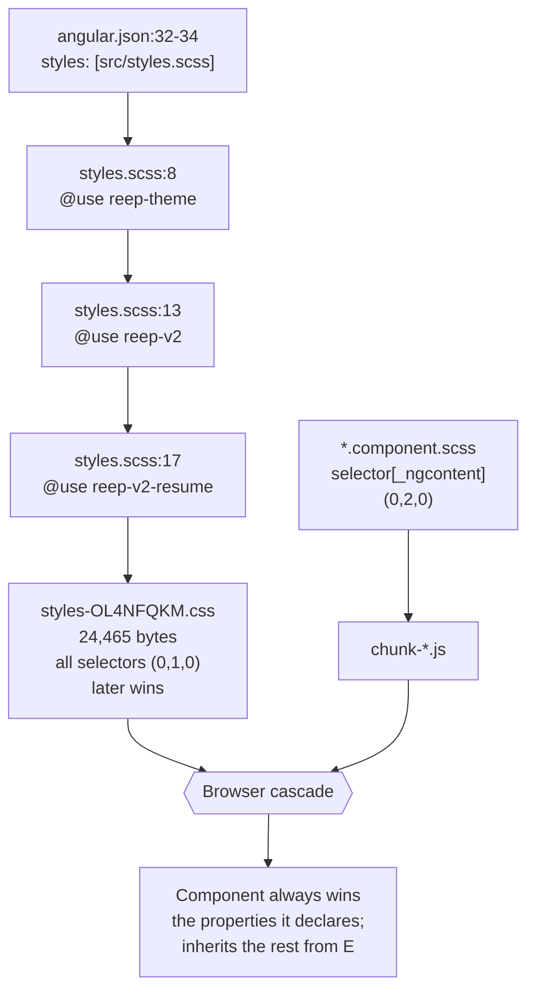
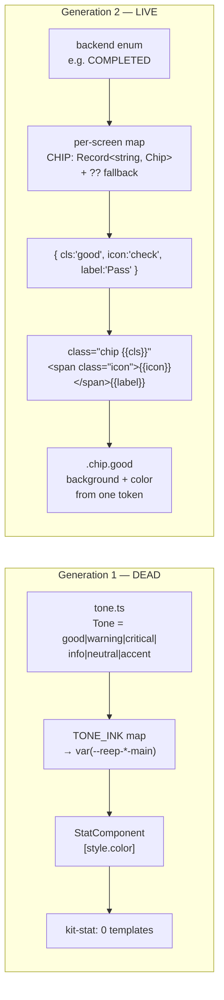

# Chapter 14 — The Design System: `reep-v2`, the Tone Vocabulary, and the Colour-Plus-Text Rule

> After this chapter you should be able to open a blank component, write markup that looks
> native to REEP without inventing a single new CSS class, and — given any class name you
> find in a template — say immediately which of the four stylesheet layers owns it and who
> wins when two of them disagree. You should also be able to state, and defend, the one
> accessibility rule the whole visual layer exists to enforce: **status is always text and
> colour together, never colour alone.**

**In scope:** the four stylesheet layers (`styles.scss` and the three sheets it loads, plus
Angular's per-component layer), every CSS custom property, every global class, the print and
motion rules, the resume stylesheet, and a line-by-line audit of the two claims AGENTS.md
makes about this layer.

**Deferred:** the *code* of the shared kit — `tone.ts`, `kit.components.ts`,
`icon.component.ts`, `bar-chart.component.ts` — belongs to
[Chapter 12, §8](12-frontend-architecture.md). This chapter cites their API and goes deep on
the CSS instead. Which screen uses which class is [Chapter 13](13-frontend-features.md). The
PDF renderer's *mechanics* are [Chapter 2](02-backend-core.md); §7 here compares only its
**layout** against the on-screen preview. The lazy-route rule and the bundle budget are
[Chapter 12, §2](12-frontend-architecture.md); §6 here asks only whether the CSS honours the
constraint that motivated them.

---

## 1. The stylesheet map

### One entry point, three sheets, and a fourth layer nobody registers

The Angular build registers exactly **one** global stylesheet
([apps/web/angular.json:32-34](apps/web/angular.json#L32-L34)):

```json
"styles": [
  "src/styles.scss"
]
```

That is the whole global surface. Anything else reaching the browser arrives either *through*
that file or as a component stylesheet. And `src/styles.scss` is 17 lines of which three do
any work — it is a manifest, not a stylesheet
([apps/web/src/styles.scss:8-17](apps/web/src/styles.scss#L8-L17)):

```scss
@use './styles/reep-theme';

/* REEP v2 design system — the exact tokens and component classes from
 * docs/design-v2/student-app.html, global and unscoped. Loaded after
 * reep-theme so the v2 body/typography rules win where the two overlap. */
@use './styles/reep-v2';

/* Resume Builder component classes (docs/design-v2/resume-builder.html) that
 * reep-v2 does not already define. Loaded LAST so it wins on equal specificity. */
@use './styles/reep-v2-resume';
```

Sass emits `@use`d files in load order, so the concatenated global sheet is
**reep-theme → reep-v2 → reep-v2-resume**, and it ships as one file:
`dist/web/browser/styles-OL4NFQKM.css`, 24,465 bytes minified.

Read those two comments again, because they are not decoration. They say the load order is a
**deliberate conflict-resolution mechanism**. All three sheets write bare single-class
selectors — specificity `(0,1,0)` — so when two of them name the same class, nothing decides
the winner except which one Sass emitted last. The comments are the design intent; source
order is the enforcement; nothing tests it.

| Sheet | Lines | Transcribed from | Role |
|---|---:|---|---|
| [`styles/reep-theme.scss`](apps/web/src/styles/reep-theme.scss) | 285 | the deleted Next.js app's `src/theme.ts` (MUI) | Generation 1. `--reep-*` tokens, the `.reep-*` type scale, `.btn--*`, the universal focus ring, the only `@media print` block |
| [`styles/reep-v2.scss`](apps/web/src/styles/reep-v2.scss) | 706 | `docs/design-v2/student-app.html` | Generation 2, current. The `--ink/--paper/--amber` tokens, the base reset, `.card`, `.chip`, `.dt-*`, the shell, the CSS charts |
| [`styles/reep-v2-resume.scss`](apps/web/src/styles/reep-v2-resume.scss) | 638 | `docs/design-v2/resume-builder.html` | Generation 2, second half. `.btn`, `.ctrl`, `.chip.neutral`, `.entry`, `.tbl`, `.preview` |

The split is by **provenance, not by scope**. Every selector in all three files is a bare
global class. `reep-v2-resume.scss` is *not* a resume-only stylesheet — it happens to be the
half of the v2 system that was transcribed from the second mockup, and two of the most
load-bearing bases in the entire app live in it. `class="btn"` appears in 23 files across
assistant, login, registration, academics, certifications, courses, jobs, offers, overview,
profile, time-log and uploads; `class="ctrl"` appears in 16, one of which is
`jobs.component.html`. A reader who follows AGENTS.md literally and looks for `.btn` in
`reep-v2.scss` will not find it.

### The fourth layer: view encapsulation beats all three

No component in the repo sets `encapsulation:` — grepping `app/` for the word returns nothing
— so every component runs on Angular's default `ViewEncapsulation.Emulated`. Angular rewrites
each simple selector in a component stylesheet by appending an attribute, which you can read
out of the shipped chunks:

```css
.vpanel__pulse[_ngcontent-%COMP%]{width:10px;height:10px;border-radius:50%;...}
```

That attribute is not cosmetic. A component rule `.card { … }` compiles to `.card[_ngcontent-x]`,
specificity `(0,2,0)`, which unconditionally outranks the global `.card` at `(0,1,0)` — no
matter which sheet defined it and no matter what order the sheets loaded in. This is the
mechanism that makes "globals define, components tweak" work at all. It is also the mechanism
behind three of the defects in this chapter, because a component that *accidentally* reuses a
global name wins silently, and inherits every property it did not declare.



### Is `reep-theme.scss` legacy? Yes — and it cannot be deleted

It is unambiguously the older generation: its header calls itself a transcription of a file
that no longer exists in this repo
([reep-theme.scss:1-18](apps/web/src/styles/reep-theme.scss#L1-L18)), and the v2 sheets do not
reference a single one of its tokens. But it still carries live surface that nothing else
supplies:

- **`*:focus-visible`** ([reep-theme.scss:180-184](apps/web/src/styles/reep-theme.scss#L180-L184)) — the app's *only* universal focus ring. Delete the file and keyboard focus disappears everywhere except the handful of controls that re-specify it.
- **`body { font-size: 0.9375rem; line-height: 1.6 }`** ([:165-172](apps/web/src/styles/reep-theme.scss#L165-L172)) — reep-v2 sets neither, so the document's base type size is still the MUI-era 15px/1.6 (see §8).
- **`.btn` / `.btn--primary` / `.btn--outlined` / `.btn--small`** ([:208-247](apps/web/src/styles/reep-theme.scss#L208-L247)) — used by login, assistant, academics and offers.
- **`.reep-h1` … `.reep-caption`, `.tabular`, `.no-print`** and roughly nineteen `--reep-*` tokens consumed by those four screens plus `shared/kit/` and `tone.ts`.

Four screens still render on generation 1: `login`, `assistant`, `academics`, `offers`. Two of
those — academics and offers — are routed but absent from the sidebar
([app-shell.component.html:16-57](apps/web/src/app/layout/app-shell.component.html#L16-L57)
lists twelve destinations and neither is among them), which is the most plausible reason
they were never converted.

The file *could* be reduced to roughly a third: the glass, neumorphic, bloom and cell-well
token groups are dead (§2), the entire `:root[data-theme='dark']` block is unreachable (§3),
and `.reep-h2`, `.reep-body1`, `.reep-subtitle2`, `.reep-glass`, `.reep-neu`, `.reep-ambient`
and `.skip-link` have zero usages in `app/`. But that is a refactor, not a deletion. **A
stylesheet nobody can delete is worth documenting as such** — treat `reep-theme.scss` as
frozen legacy that four screens are pinned to, not as dead weight.

---

## 2. The token layer

Two generations of custom property coexist. Their names are disjoint, so nothing overrides
anything — they simply both exist, and each screen reads whichever set its class vocabulary
belongs to.

### Generation 2 — `reep-v2.scss`, the one to use in new code

The whole token block is 29 lines
([reep-v2.scss:19-47](apps/web/src/styles/reep-v2.scss#L19-L47)):

```scss
:root {
  --ink-900: #1c1810;
  --ink-800: #2a231a;
  --ink-700: #443c2d;
  --ink-500: #5a5142;
  --ink-400: #847a67;
  --paper-0: #efe9dd;
  --paper-1: #f8f4ec;
  --paper-2: #fffdf8;
  --amber-700: #6b4413;
  --amber-600: #8a5a1e;
  --amber-500: #a8752f;
  --amber-400: #c99a4e;
  --amber-300: #e8c48c;
  --line: rgba(28, 24, 16, 0.12);
  --good: #5c7a3a;
  --warn: #a8752f;
  --risk: #8b3a2e;
  --radius-lg: 20px;
  --radius-md: 14px;
  --radius-sm: 10px;
  --shadow-lift: 0 4px 10px rgba(28, 24, 16, 0.08), 0 16px 40px rgba(28, 24, 16, 0.1);
  /* tactile depth (v2 full-bleed) — soft warm shadow, edge highlight, pressed well, focus ring */
  --shadow-soft: 0 1px 2px rgba(28, 24, 16, 0.05), 0 2px 8px rgba(28, 24, 16, 0.04);
  --edge-hi: inset 0 1px 0 rgba(255, 253, 248, 0.6);
  --press: inset 0 1px 3px rgba(28, 24, 16, 0.1);
  --ring: 0 0 0 3px rgba(168, 117, 47, 0.18);
  --font: 'Inter', system-ui, -apple-system, 'Segoe UI', sans-serif;
}
```

Everything above the comment on line 41 is a verbatim transcription of the `:root` block in
`docs/design-v2/student-app.html`. The four tokens *below* it are the one deliberate
extension, flagged in the source as such — the "tactile depth" set that gives the full-bleed
Angular shell its carved-in inputs and lifted buttons (§9).

| Token | Value | Group | Used by |
|---|---|---|---|
| `--ink-900` | `#1c1810` | colour · text | body colour, `.dt-btn.primary`, `.btn.primary`, `.desktop-titlebar`, `.lb-row.me`, `.taginput .chipx`, `.step-item.active`, `.ctrl` text |
| `--ink-800` | `#2a231a` | colour · text | 2 references; the `.desktop-nav a.active` gradient uses the literal `#2a231a` instead |
| `--ink-700` | `#443c2d` | colour · text | `.entry .org`, `.entry .desc`, `.check` |
| `--ink-500` | `#5a5142` | colour · text | the universal secondary ink — `.dt-sub`, `.dense-stat .lbl`, `.dt-table th`, `.chip.neutral`, `.empty`, `.step-item` |
| `--ink-400` | `#847a67` | colour · text | `.sec-label`, `.step-group`, `.badge.locked .ico`, `.entry .tools button` |
| `--paper-0` | `#efe9dd` | colour · surface | page ground (`body`), `.dt-table th`, `.tbl th`, `.chip.neutral`, `.ctrl:disabled`, `.tag`, `.field .lock` |
| `--paper-1` | `#f8f4ec` | colour · surface | default card/control surface, and the *text* colour on every dark fill |
| `--paper-2` | `#fffdf8` | colour · surface | raised surfaces — `.card` gradient top stop, `.reg-frame`, `.entry`, `.taginput`, `.tbl`, `.iconbtn`, `.btn`, `.preview` |
| `--amber-700` | `#6b4413` | colour · accent | `.badge .ico` gradient end, `.meter i` fill end, `.notice.info` ink |
| `--amber-600` | `#8a5a1e` | colour · accent | the accent — `.donut` arc, `.streak-day.on`, `.psec`, `.addlink`, `.btn.accent`, `.btn.ghost`, `.res-card.default` border |
| `--amber-500` | `#a8752f` | colour · accent | focus border on controls, `.lb-avatar`, `.step-dot.partial`, `.meter i` fill start |
| `--amber-400` | `#c99a4e` | colour · accent | `.bar-chart .bar` gradient start, `.badge .ico` gradient start, `.empty .icon` |
| `--amber-300` | `#e8c48c` | colour · accent | 1 reference (a time-sheet segment) |
| `--line` | `rgba(28,24,16,0.12)` | colour · hairline | every border and divider in the v2 system, plus the "empty" state of `.streak-day`, `.step-dot`, `.match-bar` and `.meter` |
| `--good` | `#5c7a3a` | colour · status | `.chip.good`, `.swoc-s`, `.match-fill`, `.step-dot.done`, `.tag.evi`, `.notice.evi`, `.evi-tag`, `.autofill-note` |
| `--warn` | `#a8752f` | colour · status | `.chip.warn`, `.swoc-o`, `.reg-approval.flag` — identical in value to `--amber-500` |
| `--risk` | `#8b3a2e` | colour · status | `.chip.risk`, `.swoc-w`, `.field label .req`, `.iconbtn:hover` |
| `--radius-lg` | `20px` | radius | **zero references** — dead |
| `--radius-md` | `14px` | radius | `.card`, `.dropzone` |
| `--radius-sm` | `10px` | radius | 2 references |
| `--shadow-lift` | `0 4px 10px …, 0 16px 40px …` | shadow | `.reg-frame` only |
| `--shadow-soft` | `0 1px 2px …, 0 2px 8px …` | shadow | `.card`, `.dt-btn`, `.btn` |
| `--edge-hi` | `inset 0 1px 0 rgba(255,253,248,0.6)` | shadow | the warm top highlight on `.card`, `.dt-btn`, `.btn` |
| `--press` | `inset 0 1px 3px rgba(28,24,16,0.1)` | shadow | the carved well inside every form control; also the `:active` button state |
| `--ring` | `0 0 0 3px rgba(168,117,47,0.18)` | shadow | the control focus ring |
| `--font` | `'Inter', system-ui, -apple-system, 'Segoe UI', sans-serif` | typography | `body`, `button`, `.field input`, `.ctrl` (via the element normaliser), `.ts-cell input` |

There is **no motion token at all** — no duration, no easing variable. The two motion values
in the codebase are literals (§9).

> **Naming convention.** Gen-2 tokens are short, unprefixed, and organised as *named ramps
> with numeric steps*: `--ink-*`, `--paper-*`, `--amber-*`. Note that the ramps do not run in
> the same direction: `--ink-900` is the **darkest** ink and `--ink-400` the lightest, but
> `--paper-0` is the **darkest** paper and `--paper-2` the lightest, while `--amber-700` is
> darkest again. There is deliberately no `--ink-600`, `--ink-300` or `--paper-3` — the ramps
> carry only the steps the design actually uses. Semantic one-offs (`--line`, `--good`,
> `--warn`, `--risk`, `--font`) have no numeric step at all.

### Generation 1 — `reep-theme.scss`, `--reep-*`

Forty-one tokens under a namespace prefix, all transcribed from the deleted `theme.ts`
([reep-theme.scss:25-83](apps/web/src/styles/reep-theme.scss#L25-L83)). The palette group:

| Token | Light value | Note |
|---|---|---|
| `--reep-primary-main` / `-light` / `-dark` / `-contrast` | `#1c1810` / `#443c2d` / `#100d08` / `#f8f4ec` | primary is *ink*, not a brand hue |
| `--reep-secondary-main` / `-light` / `-dark` / `-contrast` | `#8a5a1e` / `#a8752f` / `#6b4413` / `#f8f4ec` | the accent; `-main` is also the focus-ring colour |
| `--reep-success-main` | `#8b5f1c` | **a brown** |
| `--reep-warning-main` | `#62471f` | **a brown** |
| `--reep-error-main` | `#3a301f` | **a brown** |
| `--reep-info-main` | `#8a5a1e` | identical to `--reep-secondary-main`; zero references |
| `--reep-bg-default` / `-paper` | `#efe9dd` / `#f8f4ec` | |
| `--reep-text-primary` / `-secondary` / `-disabled` | `#1c1810` / `#5a5142` / `#6d6353` | |
| `--reep-divider` | `rgba(28,24,16,0.12)` | |
| `--reep-action-hover` / `-selected` | `rgba(28,24,16,0.04)` / `rgba(138,90,30,0.10)` | |
| `--reep-radius` / `-control` / `-chip` | `8px` / `7px` / `6px` | all three unreferenced |
| `--font-inter` | `'Inter'` | consumed by `--reep-font-stack` ([:143-145](apps/web/src/styles/reep-theme.scss#L143-L145)) |

Then three surface groups, all "verbatim from theme.ts": **glass** (five `--reep-glass-*`
tokens, a translucent frosted panel), **neumorphic** (five `--reep-neu-*`, a soft-shadow
extruded surface), **bloom** (three `--reep-bloom-a/b/c`, ambient background glows), plus
`--reep-chip-good` / `--reep-chip-accent` and three `--reep-cell-well-*`.

**Twenty-two of the forty-one `--reep-*` tokens have zero `var()` references outside their own
definition** — every glass, neu, bloom and cell-well token, both chip tokens, all three radii,
`--reep-info-main`, `--reep-primary-dark`, `--reep-primary-light` and `--reep-secondary-light`.
The glass/neumorphic/bloom visual language did not survive the v2 rewrite; the classes that
would have consumed it (`.reep-glass`, `.reep-neu`, `.reep-ambient`) appear in no template.

### Which generation to use

**Generation 2, always.** The rule is not aesthetic preference — it is that gen 1 has no green
and no red (see §3), so a status built on `--reep-error-main` renders as near-black brown.
Concretely, in new code:

- reach for `--ink-*` / `--paper-*` / `--amber-*` / `--line`, never `--reep-*`;
- reach for `--good` / `--warn` / `--risk`, never `--reep-success-main` and friends;
- if you are editing `login`, `assistant`, `academics` or `offers`, you are inside the gen-1
  island and should follow its local convention rather than mixing the two mid-file.

There is one trap worth naming. `assistant.component.scss` reads three tokens that **are
defined nowhere in the repo** — `--reep-surface` (lines 110, 148, 248, 318),
`--reep-warning-bg` (126, 373) and `--reep-success-bg` (368). Every one of the seven uses supplies a
fallback, so the fallback is what always paints. `--reep-surface`'s four fallbacks are benign
(`#fff`, `transparent`, and twice `var(--reep-action-hover)`), but the other two are not:
`--reep-warning-bg` falls back to `rgba(178,106,0,0.1)` and `--reep-success-bg` to
`rgba(46,125,50,0.1)` — a cool orange and a cool green that belong to no REEP palette at all,
painted into a warm-brown app. Whether they are leftovers from another design system or tokens
someone meant to add, I could not determine.

---

## 3. The warm paper palette

### How the theme is constructed

REEP is a **warm monochrome with one accent family**. There is no blue anywhere in the shipped
token set; there is no cool grey. The construction has three moves:

1. **Ink is brown-black, not black.** `--ink-900: #1c1810` is a very dark warm brown. Every
   lighter ink step keeps the same warmth, so text never reads as a cold slate against paper.
2. **Paper is off-white, and inverted from the usual convention.** The page ground
   (`--paper-0: #efe9dd`) is the *darkest* of the three, and surfaces get lighter as they rise:
   cards sit on `--paper-1: #f8f4ec` / `--paper-2: #fffdf8`. A REEP card does not have a
   shadow because it is floating over white — it is genuinely lighter than what is behind it,
   and the shadow only sharpens the edge.
3. **The accent is a single amber ramp**, `--amber-700` through `--amber-300`, doing every job
   a brand colour would: active states, chart fills, meter fills, section rules, links.

### The surface hierarchy

| Level | Token | Hex | Where it appears |
|---|---|---|---|
| Page ground | `--paper-0` | `#efe9dd` | `body` background; `.desktop-frame`; the bottom stop of `.desktop-main`'s gradient; table headers (`.dt-table th`, `.tbl th`) — i.e. a header is *sunken* relative to its own table body |
| Default surface | `--paper-1` | `#f8f4ec` | `.dense-stat`, `.dt-table`, `.lb-row:not(.me)`, `.ts-cell`, `.stepper`, `.main-head`, `.footbar`, `.res-card`, and the `background` of every form control |
| Raised surface | `--paper-2` | `#fffdf8` | `.reg-frame`, `.entry`, `.taginput`, `.tbl`, `.iconbtn`, `.btn`, `.preview`, `.completeness`, `.swoc-c`, and the top stop of the `.card` gradient |
| Sunken | `var(--press)` | `inset 0 1px 3px rgba(28,24,16,0.1)` | not a colour — the "sunken" level is expressed as an inset shadow on every `.ctrl` and `.field input`, so a control reads as carved into its card rather than painted on it |

The `.card` is the clearest statement of the hierarchy
([reep-v2.scss:400-407](apps/web/src/styles/reep-v2.scss#L400-L407)):

```scss
.card {
  background: linear-gradient(180deg, var(--paper-2), var(--paper-1));
  border: 1px solid rgba(28, 24, 16, 0.08);
  border-radius: var(--radius-md);
  padding: 18px;
  margin-bottom: 16px;
  box-shadow: var(--shadow-soft), var(--edge-hi);
}
```

A vertical gradient from the raised paper to the default paper, a border that is *lighter than
the general hairline* (0.08 alpha against `--line`'s 0.12) so cards do not draw as hard as
tables, and two shadows: a soft warm drop plus `--edge-hi`, an inset white line along the top
edge that simulates light catching a raised lip. That is the entire "REEP looks like paper"
effect, in six declarations.

### Swatches

| Swatch | Hex | Semantic role |
|---|---|---|
| ⬛ | `#1c1810` | `--ink-900` — primary text; the "dark fill" for active/selected surfaces |
| ⬛ | `#2a231a` | `--ink-800` — second stop of the active nav gradient |
| ⬛ | `#443c2d` | `--ink-700` — body prose inside entry cards |
| ⬛ | `#5a5142` | `--ink-500` — secondary text, labels, table headers, neutral chips |
| ⬛ | `#847a67` | `--ink-400` — micro-labels, disabled/locked glyphs |
| ⬜ | `#efe9dd` | `--paper-0` — page ground, sunken header cells |
| ⬜ | `#f8f4ec` | `--paper-1` — default surface; also the text colour on any dark fill |
| ⬜ | `#fffdf8` | `--paper-2` — raised surface |
| 🟫 | `#6b4413` | `--amber-700` — deepest accent (gradient ends, notice ink) |
| 🟫 | `#8a5a1e` | `--amber-600` — the accent proper |
| 🟧 | `#a8752f` | `--amber-500` — focus borders, avatars, partial state |
| 🟧 | `#c99a4e` | `--amber-400` — chart fills, empty-state glyphs |
| 🟨 | `#e8c48c` | `--amber-300` — lightest accent |
| 🟩 | `#5c7a3a` | `--good` — olive green; pass, verified, complete, on-track |
| 🟧 | `#a8752f` | `--warn` — amber; watch, pending, partial (identical to `--amber-500`) |
| 🟥 | `#8b3a2e` | `--risk` — brick red; fail, ineligible, below threshold, destructive |

### The one real divergence between the generations

Set the two palettes side by side and they are the *same colours under two names* — with one
exception that matters enormously:

| Gen 2 | Gen 1 | Shared hex |
|---|---|---|
| `--paper-0` | `--reep-bg-default` | `#efe9dd` |
| `--paper-1` | `--reep-bg-paper`, `--reep-primary-contrast`, `--reep-secondary-contrast` | `#f8f4ec` |
| `--ink-900` | `--reep-primary-main`, `--reep-text-primary` | `#1c1810` |
| `--ink-700` | `--reep-primary-light` | `#443c2d` |
| `--ink-500` | `--reep-text-secondary` | `#5a5142` |
| `--amber-700` / `-600` / `-500` | `--reep-secondary-dark` / `-main` / `-light` | `#6b4413` / `#8a5a1e` / `#a8752f` |
| `--line` | `--reep-divider` | `rgba(28,24,16,0.12)` |
| **`--good` / `--warn` / `--risk`** | **`--reep-success-main` / `--reep-warning-main` / `--reep-error-main`** | **`#5c7a3a` / `#a8752f` / `#8b3a2e`** vs **`#8b5f1c` / `#62471f` / `#3a301f`** |

Gen 1's three "semantic" colours are **three browns**. Measured against each other with the
WCAG 2.x relative-luminance formula, success-vs-warning is **1.54:1**, warning-vs-error
**1.50:1**, success-vs-error **2.31:1**. Against the paper they read fine individually (5.10,
7.84 and 11.80:1) — but against *one another* they are the same colour. Status in generation 1
was encoded by ink *weight*, not hue.

This is the single strongest argument in the codebase for why the colour-plus-text rule is
load-bearing rather than decorative: on four screens, the colour channel is carrying almost no
information at all, and only the text is keeping the status legible.

### Dark mode: defined, and unreachable

`reep-theme.scss` contains a complete dark palette
([:85-136](apps/web/src/styles/reep-theme.scss#L85-L136)) under `:root[data-theme='dark']` —
inverted ink, `--reep-bg-default: #14120d`, and every glass/neu/bloom token flipped. The file
header explains the design ([:15-17](apps/web/src/styles/reep-theme.scss#L15-L17)): the
attribute is "the same attribute MUI's own variables switch on, so a theme toggle flips both
the palette and the effect tokens together."

**None of it can run.** Three independent facts each individually kill it:

1. [`index.html:2`](apps/web/src/index.html#L2) hardcodes `<html lang="en" data-theme="light">`.
2. The only writer of that attribute is `core/theme.service.ts:33`, and grepping `ThemeService`
   across `app/` returns **only its own declaration** — nothing injects it, no UI calls
   `toggle()`. (Chapter 12, §7 documents the service itself.)
3. Even if the attribute flipped, `reep-v2.scss` defines `--ink-*`, `--paper-*`, `--amber-*`,
   `--line`, `--good`, `--warn` and `--risk` **once, on bare `:root`, with no dark
   counterpart**. Those tokens drive essentially every shipped screen. Flipping the attribute
   today would darken login, assistant, academics and offers, and leave the shell, cards,
   chips, tables and the resume builder on warm paper — a half-dark app.

So: **REEP is a light-only product.** Say so plainly in any new component; do not write
`@media (prefers-color-scheme: dark)` blocks against tokens that have no dark values.

---

## 4. The colour-plus-text rule

### Why the rule exists

AGENTS.md states it in one line: *"Status is always shown as **text + colour together**, never
colour alone."* The reasons are specific to this product, not generic accessibility boilerplate:

- **Colour-vision deficiency.** Roughly one in twelve male students has a red-green deficiency.
  REEP's own `--good` `#5c7a3a` and `--warn` `#a8752f` sit **1.22:1** apart in luminance —
  for a deuteranope they are near-identical swatches. A student who cannot distinguish "Pass"
  from "Watch" cannot use the dashboard for the one thing it exists for.
- **Monochrome printing.** A student prints their records page for a mentor meeting. Browsers
  default to `print-color-adjust: economy` and drop background paint unless the user ticks
  "Background graphics" — and the repo contains no `print-color-adjust: exact` anywhere. Every
  chip tint vanishes. The word must survive.
- **Screenshots in a placement report.** A director pastes an attendance panel into a
  departmental report that is photocopied, faxed, or rendered at 30% width in a slide deck. The
  chip is 12px tall. Its hue is gone; its label is not.

The stylesheet argues the same case in its own words, in the longest rationale comment in the
repo — the reduced-motion block at
[reep-v2.scss:680-698](apps/web/src/styles/reep-v2.scss#L680-L698):

> **Why it is like this.** *"The assistant's voice panel runs several INFINITE pulse
> animations (live dot, status pulse, typing indicator). An indefinitely looping animation is a
> vestibular-disorder trigger and, for some users, a migraine one; the whole point of
> prefers-reduced-motion is that it must not be re-litigated per component. […] This costs no
> information: REEP always states status as text AND colour together (never colour alone, and
> never motion alone), so removing the animation removes decoration only."*

Read that carefully: the codebase uses the colour-plus-text invariant as the **justification
for being allowed to delete an animation**. If the invariant is false anywhere, the
reduced-motion rule stops being lossless there. §4.4 shows exactly one place where that is the
case.

### The mechanism: `.chip`

The rule is implemented structurally in nine lines
([reep-v2.scss:184-207](apps/web/src/styles/reep-v2.scss#L184-L207)):

```scss
.chip {
  display: inline-flex;
  align-items: center;
  gap: 5px;
  padding: 5px 10px;
  border-radius: 8px;
  font-size: 12px;
  font-weight: 700;
}
.chip.good { background: rgba(92, 122, 58, 0.12);  color: var(--good); }
.chip.warn { background: rgba(168, 117, 47, 0.14); color: var(--warn); }
.chip.risk { background: rgba(139, 58, 46, 0.12);  color: var(--risk); }
.chip .icon { font-size: 14px; }
```

Three properties of that snippet do the work.

**First, the base rule declares no colour and no background.** A chip with no tone modifier — or
with a *misspelled* one — renders as plain bold text on the surface behind it. The degradation
is silent and harmless: you lose the hue, you keep the word. This is the codebase's only
structural safeguard on the whole rule, and it is arguably accidental.

**Second, each tone sets `background` and `color` from the same hue.** The tint is the ink at
12–14% alpha. It is therefore impossible to apply a tone as a background wash without also
recolouring the text inside it — the two channels cannot drift apart at the class level.

**Third, `.chip .icon { font-size: 14px }` exists**, which tells you the expected markup
contains a glyph. The house pattern is three redundant channels — hue, glyph shape, and word —
in one element ([jobs.component.html:112-114](apps/web/src/app/features/student/jobs/jobs.component.html#L112-L114)):

```html
<span class="chip good"><span class="icon">check_circle</span>Applied</span>
<span class="chip neutral"><span class="icon">radio_button_unchecked</span>Not applied</span>
```

The fourth tone, `.chip.neutral`, is **not** in `reep-v2.scss` — it lives in the last-loaded
sheet ([reep-v2-resume.scss:518-522](apps/web/src/styles/reep-v2-resume.scss#L518-L522)) with a
comment naming the gap. This is the direct cause of the duplication defect in §5.

### How a domain value becomes a tone

There are two paths. **Only one of them ships.**

**The `tone.ts` path — dead.** [`shared/kit/tone.ts`](apps/web/src/app/shared/kit/tone.ts) is
eighteen lines and declares the *other* status vocabulary
([tone.ts:8-17](apps/web/src/app/shared/kit/tone.ts#L8-L17)):

```ts
export type Tone = 'good' | 'warning' | 'critical' | 'info' | 'neutral' | 'accent';

export const TONE_INK: Record<Tone, string> = {
  good: 'var(--reep-success-main)',
  warning: 'var(--reep-warning-main)',
  critical: 'var(--reep-error-main)',
  info: 'var(--reep-secondary-main)',
  neutral: 'var(--reep-text-primary)',
  accent: 'var(--reep-secondary-main)',
};
```

Six names, five distinct colours (`info` and `accent` are the same token), all pointing at the
gen-1 browns. Its only consumer is `kit.components.ts`, which uses it in `StatComponent` to set
an inline `[style.color]` — never a class. And `kit-stat` appears in **zero templates**;
grepping `app/` for it returns only its own declaration. `TONE_INK` is imported by no other
file. **`tone.ts` is dead code in the shipped app**, and Chapter 12, §8 documents its API for
completeness rather than because anything reads it.

**The live path is a hand-written string literal per screen**, interpolated straight into the
class attribute:

```html
<span class="chip {{ chip.cls }}">
  <span class="icon">{{ chip.icon }}</span>{{ chip.label }}
</span>
```
— [records.component.html:135-137](apps/web/src/app/features/student/records/records.component.html#L135-L137)

Because `tone.ts` is unused, **the union is re-declared locally on nine screens, in three
different shapes**: `type Tone = 'good' | 'warn' | 'risk' | 'neutral'` in `jobs.component.ts`
and `records.component.ts`; `interface Chip { cls; icon; label }` in `certifications`,
`courses`, `records` and `all-resumes`; `interface StatusChip` in `jobs`, `overview` and
`skilling`; `interface StatusMeta` with the field named `tone` rather than `cls` in `uploads`
and `attachments`. Two of them (`courses.component.ts`, `skilling.component.ts`) widen `cls` to
bare `string`, so a typo compiles.



> **Naming convention.** The tone field is called `cls` when it will be interpolated into a
> `class=` attribute and `tone` when it will not. Status maps are frozen `Record<string, Chip>`
> constants keyed by the backend's SCREAMING_SNAKE enum, and **every lookup terminates in a
> `?? fallback`** that supplies a valid tone and a human label — e.g.
> `CHIP[r.status] ?? { cls: 'warn', icon: 'help', label: r.status }`. Tone-deriving methods are
> nouns ending in `Chip` or `Tone`: `attendanceChip(percent)` returns the whole
> `{cls, icon, label}`, `attendanceTone(percent)` returns just the class string for a bar fill,
> and the two share one threshold ladder so a bar and its chip can never disagree.

### The audit: where colour carries meaning alone

I grepped every template under `app/features` and `app/layout` for `class="chip`, and inspected
every primitive whose only state channel is a colour. The rule is **kept far more often than it
is broken** — but it is broken, in five places, and one of them is on the highest-traffic
student workflow in the product.

#### Violation 1 — the resume-builder step dots

[resume-builder.component.html:41-58](apps/web/src/app/features/student/resume/resume-builder.component.html#L41-L58):

```html
<div class="step-item" [class.active]="step() === s.key" (click)="step.set(s.key)">
  <span
    class="step-dot"
    [class.done]="stepStates()[s.key] === 'done'"
    [class.partial]="stepStates()[s.key] === 'partial'"
    [attr.title]="… 'Complete' … 'Partly filled' … 'Not started'"
  ></span>
  {{ s.label }}
</div>
```

The CSS ([reep-v2-resume.scss:134-146](apps/web/src/styles/reep-v2-resume.scss#L134-L146)) makes
`.step-dot` an 8px circle whose only modifiers are `background: var(--good)` and
`background: var(--amber-500)`. Three states — Complete / Partly filled / Not started —
encoded in eight pixels by **hue alone**. The visible text beside the dot is the section *name*,
not its state. There is no glyph difference, no size difference, no `role`, no `aria-label`; the
`title` is hover-only, unreachable on touch, and not reliably announced on a non-interactive
`<span>`. Measured: done-vs-partial **1.22:1**; done-vs-empty **3.50:1**.

What makes this the worst case is that the state is computed with real care —
`stepStates()` classifies each of fifteen sections `done`/`partial`/`empty` by counting filled
leaves — and then every non-colour channel is discarded at the point of display.

#### Violation 2 — the login-streak cells

[student-overview.component.html:225-230](apps/web/src/app/features/student/overview/student-overview.component.html#L225-L230):

```html
<div class="streak-row">
  @for (on of streakCells(); track $index) {
    <div class="streak-day" [class.on]="on"></div>
  }
</div>
<div class="dt-sub" style="margin-top:10px">Current {{ s.current }} day… · Longest {{ s.longest }} · {{ s.days_active }} active days</div>
```

Seven empty divs; `--line` versus `--amber-600` (**4.23:1**, at least a visible difference) with
no text, title, glyph or ARIA per cell. Mitigating: the aggregate *is* stated in the `.dt-sub`
line immediately below, and again in a header chip. The widget is decorative and asserts less
than it appears to — `streakCells()` carries no per-day date — but an individual day's on/off
state is conveyed by colour alone.

#### Violation 3 — the time-sheet stacked bar

[time-log.component.html:55-70](apps/web/src/app/features/student/time-log/time-log.component.html#L55-L70)
is a `role="img"` bar whose segments carry only `[style.background]="s.color"`, decoded by a
legend of 10px swatches. The five colours
([time-log.component.ts:44-50](apps/web/src/app/features/student/time-log/time-log.component.ts#L44-L50))
are `--ink-400`, `--amber-300`, `--amber-400`, `--amber-600` and `--good`. Pairwise:

| Pair | Contrast |
|---|---:|
| amber-300 / amber-400 | 1.55:1 |
| amber-400 / ink-400 | 1.66:1 |
| amber-400 / good | 1.91:1 |
| amber-600 / ink-400 | 1.39:1 |
| **amber-600 / good** (Coursework vs Skilling) | **1.21:1** |
| **ink-400 / good** (Sleeping vs Skilling) | **1.15:1** |

Four of the five are within 2:1 of each other. The two the screen most wants a student to
compare are 1.15:1 apart. Mitigating: the legend states every value in words and hours
(`Sleeping · 8h`), so no *number* is lost; what is lost is the mapping from a visual segment
back to its activity. And note that the same file gets the harder case right — the 24-hour
boundary marker is a firm ink line, not a colour change, with a comment saying so.

#### Violation 4 — the sidebar's current page

Every nav item is `<a routerLink="…" routerLinkActive="active">`
([app-shell.component.html:16-57](apps/web/src/app/layout/app-shell.component.html#L16-L57)), and
`.desktop-nav a.active` ([reep-v2.scss:281-285](apps/web/src/styles/reep-v2.scss#L281-L285)) is a
dark-fill inversion and nothing else. **Grepping the whole of `app/` for `aria-current` and
`ariaCurrentWhenActive` returns zero occurrences.** Angular's `routerLinkActive` does not emit
`aria-current` unless you pass `ariaCurrentWhenActive`. So a screen-reader user gets no
indication of which of twelve destinations they are on, and a sighted user gets only a
background inversion. This is the most structural colour-only state in the app, and the cheapest
to fix.

#### Violation 5 — the assistant's live-audio dot

[assistant.component.html:23](apps/web/src/app/features/assistant/assistant.component.html#L23):

```html
<span class="voice__dot" [class.voice__dot--live]="audioPlaying()"></span>
{{ voiceLabel() }}
```

`voiceLabel()` does not change when audio starts, so "the agent is speaking now" is signalled by
**animation plus colour**, with no text. Under `prefers-reduced-motion` the global block strips
the animation — and `.voice__dot--live` is the *first selector it names* — leaving colour alone:
`--reep-text-disabled` `#6d6353` versus `--reep-error-main` `#3a301f`, **2.19:1**, on an 8px dot.
The reduced-motion comment's claim that removal "costs no information" is true for
`.vpanel__pulse`, which is paired with a text label inside `role="status" aria-live="polite"`
— and false for the very first thing it lists.

#### Minor: icon-only chips, and tone-without-meaning

[preview.component.html:153-156](apps/web/src/app/features/student/resume/views/preview.component.html#L153-L156)
renders four evidence rows as `<span class="chip good"><span class="icon">check</span></span>`
with the sentence *outside* the chip — the only place in the app a `.chip` ships with no text.
The glyph differs (`check` vs `remove`) and the prose states the polarity, so it reads; but the
Material Symbols ligature is literal DOM text with no `aria-hidden`, so a screen reader may
announce the string "check".

The inverse failure also exists.
[profile.component.html:193](apps/web/src/app/features/student/profile/profile.component.html#L193)
renders each of a student's skills as `<span class="chip good">{{ s }}</span>` — a green
"good" chip on a plain skill name that has no status at all. That dilutes the vocabulary: a
reader who has learned green = verified will read a mere skill name as verified. Similarly,
`certifications.component.html:73` uses `chip warn` for the neutral fact "Unlocks: …" while
`courses.component.html:79` renders the same concept as `chip neutral`, and
`all-resumes.component.html:52` uses `chip warn` for "Default", which is a good state.

#### Where the rule is honoured — the pattern to copy

Every progress meter pairs its fill with a number **and** an ARIA progressbar
([records.component.html:139-148](apps/web/src/app/features/student/records/records.component.html#L139-L148)):

```html
<div class="meter" role="progressbar"
     [attr.aria-valuenow]="att.overall_percent"
     aria-valuemin="0" aria-valuemax="100" aria-label="Overall attendance">
  <div class="meter__fill {{ attendanceTone(att.overall_percent) }}" [style.width.%]="att.overall_percent"></div>
</div>
```

The same pattern repeats in `courses`, `certifications` and `profile`. The overview's CSS bar
charts label every bar **twice** (a value caption above, a category label below). The donut
carries its percentage as text inside the hole. Locked skill badges add a visible
`<span class="icon">lock</span>Locked` caption. The leaderboard's inverted "this is you" row
adds a literal `You` pill. Jobs and Leaderboards wrap their `.tabs-row` in `role="tablist"` with
`role="tab"` and `[attr.aria-selected]` on every button — so **the app knows the right pattern**;
the resume builder's tabs and step rows simply do not use it.

#### Verdict on the AGENTS.md claim

**Substantially true, and worth keeping — but enforced by nothing mechanical.** There is no lint
rule, no type, no test and no build check. The rule propagates by *comment*: at least nine files
restate it in prose — `records.component.ts:12`, `student-overview.component.ts:153`,
`certifications.component.ts:44` and `:93`, `resume-builder.component.html:102`,
`resume-builder.component.ts:247`, `profile.component.scss:35`, `time-log.component.scss:44`,
`assistant.component.scss:170` ("Colour + text together — never colour alone."), and
`reep-v2.scss:691`. **Every one of those comments sits on a file that complies. None of the five
violating sites carries one.** The rule propagates exactly as far as the comments do.

Provenance matters for the two worst cases: `docs/design-v2/student-app.html` and
`docs/design-v2/resume-builder.html` contain the `.streak-day` and `.step-dot` colour-only
patterns verbatim, while the mockups' own *chips* are compliant. The pattern is consistent —
wherever the Angular port invented markup it applied the rule and often added ARIA the mockup
lacked; wherever it transcribed the mockup literally, the decoration came along unchanged.

---

## 5. The component class vocabulary

This is the reference. Every global class, what it renders, its modifiers, the markup it
expects. Unless stated otherwise, everything here is in `reep-v2.scss`; §7 covers the resume
sheet's additions in the same detail.

> **Naming convention.** Global v2 classes are **flat, lowercase, hyphenated and
> area-prefixed** — the prefix names a screen family or widget family, never an Angular
> component: `reg-*` (registration), `desktop-*` (shell), `dt-*` ("desktop" page furniture),
> `dense-*` (compact stats), `ts-*` (time sheet), `lb-*` (leaderboard), `swoc-*`, `reco-*`,
> `bar-*`, `res-*`. **Modifiers are separate co-classes on the base, never BEM double-hyphen**:
> `.chip.good`, `.dt-btn.primary`, `.lb-row.me`, `.badge.locked`, `.streak-day.on`,
> `.tabs-row button.active`. Generation-1 globals do the opposite — namespace prefix or BEM
> modifier: `.reep-h1`, `.btn--primary`, `.btn--small`. And **component-local** classes inside
> encapsulated sheets use full BEM: `.voice__dot--live`, `.vpanel__pulse`, `.field__label`,
> `.intro__title`. So BEM survives at component scope while the global layer is flat.

### `.card` — the single most-used class

`class="card"` appears **106 times** across the templates. Defined at
[reep-v2.scss:400-407](apps/web/src/styles/reep-v2.scss#L400-L407) (quoted in §3). Its one
child rule is the reason so much markup looks the way it does
([:408-414](apps/web/src/styles/reep-v2.scss#L408-L414)):

```scss
.card h4 {
  font-size: 13.5px;
  font-weight: 700;
  margin-bottom: 12px;
  display: flex;
  justify-content: space-between;
}
```

The card heading is a **flex row with `space-between`**, which is why templates write a heading
and a trailing chip in one element and get the chip pushed to the right edge for free:

```html
<h4>Skills <span class="chip warn"><span class="icon">lock</span>From Skilling</span></h4>
```
— [profile.component.html:189](apps/web/src/app/features/student/profile/profile.component.html#L189)

**Modifiers:** none globally. Screens add their own as co-classes — `.card.opp` /
`.card.opp.ineligible` (jobs), `.card.err` (certifications). The resume sheet adds two child
rules, `.card > h3` and `.card > .desc`, using the **child combinator** deliberately so they
cannot fight the descendant `.card h4` (§7).

**Markup contract:** a block element, usually `<div>`, optionally opening with an `<h4>` (v2
screens) or `<h3>` (resume screens). `margin-bottom: 16px` is built in — do not add your own
vertical rhythm between stacked cards.

### `.chip` and its tones

Covered mechanically in §4. Reference form:

| Class | Background | Ink | Meaning |
|---|---|---|---|
| `.chip` | none | inherited | base: inline-flex pill, 12px/700, 5px gap |
| `.chip.good` | `rgba(92,122,58,0.12)` | `--good` | pass, verified, applied, complete, eligible |
| `.chip.warn` | `rgba(168,117,47,0.14)` | `--warn` | watch, pending, under review, partial |
| `.chip.risk` | `rgba(139,58,46,0.12)` | `--risk` | fail, ineligible, below threshold |
| `.chip.neutral` | `--paper-0` | `--ink-500` | informational, no polarity — **defined in `reep-v2-resume.scss:519`** |
| `.chip .icon` | — | — | shrinks the 20px global glyph to 14px |

Measured contrast at 12px/700 (which is *not* WCAG "large text" — that needs 18.66px bold — so
the threshold is 4.5:1), tint composited over `--paper-1`:

| Tone | Ink on composited tint | Ratio | AA at 12px/700 |
|---|---|---:|---|
| `.chip.good` | `#5c7a3a` on `#e5e5d7` | 3.84:1 | ✗ |
| `.chip.warn` | `#a8752f` on `#ede2d2` | 3.13:1 | ✗ |
| `.chip.risk` | `#8b3a2e` on `#ebded5` | 5.81:1 | ✓ |
| `.chip.neutral` | `#5a5142` on `#efe9dd` | 6.46:1 | ✓ |

The two most common tones fail AA. This does not break the colour-plus-text rule — the words are
still there — but it means the colour channel on `good` and `warn` is the *weakest* of the three
channels, not the strongest.

### `.dt-*` — the page-furniture family

`dt` is short for "desktop". These are the classes every routed screen opens with.

| Class | Lines | Renders |
|---|---|---|
| `.dt-header` | [305-310](apps/web/src/styles/reep-v2.scss#L305-L310) | flex row, `space-between`, `align-items:center`, 18px bottom — title block left, toolbar right |
| `.dt-title` | [311-314](apps/web/src/styles/reep-v2.scss#L311-L314) | 19px/800 — the page H1 |
| `.dt-sub` | [315-319](apps/web/src/styles/reep-v2.scss#L315-L319) | `--ink-500`, 13px, 3px top — the universal secondary line, and the house empty-state text |
| `.dt-toolbar` | [320-323](apps/web/src/styles/reep-v2.scss#L320-L323) | flex, 8px gap — the right-hand button cluster |
| `.dt-btn` | [168-178](apps/web/src/styles/reep-v2.scss#L168-L178) | `9px 16px`, radius 8, `1px solid var(--line)`, `--paper-1`, 13px/600, inline-flex with 6px gap |
| `.dt-btn.primary` | [179-183](apps/web/src/styles/reep-v2.scss#L179-L183) | the dark fill: `--ink-900` ground, `--paper-1` text, matching border |
| `.dt-table` | [348-357](apps/web/src/styles/reep-v2.scss#L348-L357) | 100% width, `border-collapse: collapse`, `--paper-1`, bordered, radius 10 with `overflow:hidden` so the radius clips the header, 12.6px |
| `.dt-table th` | [358-367](apps/web/src/styles/reep-v2.scss#L358-L367) | left-aligned `9px 13px` on `--paper-0`, `--ink-500`, 700, 10.8px, uppercase, `.04em` |
| `.dt-table td` | [368-372](apps/web/src/styles/reep-v2.scss#L368-L372) | `9px 13px`, `border-top: 1px solid var(--line)`, `vertical-align: middle` |

Note the `td` rule uses `border-top`, so the **first** row has no rule above it — the header cell
supplies that separation. `.dt-table` expects a real `<table>`; there is no div-grid variant.

There is **no `.dt-btn.sm`** in the global sheet, which is why four screens invented one (§5.7).
And `.dt-btn` has **no `:hover` and no `:focus-visible`** globally, which is why three screens
re-add a focus ring (§9).

### `.chip`-adjacent status widgets

| Class | Lines | Renders | Markup |
|---|---|---|---|
| `.match-bar` | [598-607](apps/web/src/styles/reep-v2.scss#L598-L607) | 60×6 pill on `--line`, `inline-block`, `overflow:hidden`, `vertical-align:middle` | wraps `.match-fill` |
| `.match-fill` | [608-611](apps/web/src/styles/reep-v2.scss#L608-L611) | `height:100%`, `background: var(--good)` | width set inline by the template |
| `.streak-row` / `.streak-day` / `.streak-day.on` | [585-597](apps/web/src/styles/reep-v2.scss#L585-L597) | 6px-gap flex of 26px squares, radius 7, `--line` → `--amber-600` | bare `<div>`s (see §4 violation 2) |
| `.badge-row` / `.badge` / `.badge .ico` / `.badge.locked .ico` | [543-568](apps/web/src/styles/reep-v2.scss#L543-L568) | wrapping row of 64px tiles; each `.ico` is a 52px rounded square with an amber `135deg` gradient and a white glyph; `.locked` flattens it to `--line`/`--ink-400` | `<div class="badge"><div class="ico"><span class="icon">…</span></div>Label</div>` |
| `.reco-row` / `.reco-rank` | [569-584](apps/web/src/styles/reep-v2.scss#L569-L584) | hairline-separated 12.5px rows, `:last-child` drops the rule; the rank is a 20px 800-weight amber column | **`.reco-rank` has zero template usages — the one dead class in this sheet** |
| `.lb-row` / `.lb-row.me` / `.lb-row:not(.me)` / `.lb-rank` / `.lb-avatar` | [612-644](apps/web/src/styles/reep-v2.scss#L612-L644) | leaderboard rows; `.me` inverts to `--ink-900`/`--paper-1`, everything else gets `--paper-1` + hairline; a 22px centred rank and a 30px amber initials square | the inversion is positional, and the template adds a literal `You` pill |

### `.dense-*` — the compact statistic strip

```scss
.dense-grid { display: grid; grid-template-columns: repeat(4, 1fr); gap: 12px; margin-bottom: 18px; }
.dense-stat { background: var(--paper-1); border: 1px solid var(--line); border-radius: 10px; padding: 14px; }
.dense-stat .lbl { font-size: 11px; color: var(--ink-500); font-weight: 600; text-transform: uppercase; letter-spacing: 0.04em; }
.dense-stat .val { font-size: 22px; font-weight: 800; margin-top: 4px; }
```
— [reep-v2.scss:324-347](apps/web/src/styles/reep-v2.scss#L324-L347)

Markup is `<div class="dense-grid"><div class="dense-stat"><div class="lbl">…</div><div class="val">…</div></div>…</div>`. Four fixed columns, no breakpoint (§6). `.lbl` and `.val` are
generic child names and only work *inside* `.dense-stat`.

### Form controls

There are **two** control vocabularies, and they are not interchangeable.

`.field` is the registration/profile form ([reep-v2.scss:119-141](apps/web/src/styles/reep-v2.scss#L119-L141)):
a `margin-bottom: 14px` wrapper; `.field label` is 12px/700 `--ink-500` uppercase with `.03em`
tracking, `display:block`; and `.field input, .field textarea, .field select` get full width,
`10px 12px`, radius 8, `1px solid var(--line)`, `--paper-1`, 13.5px.

`.ctrl` is the resume-builder / jobs-filter control — a single class applied *directly to the
input*, defined at [reep-v2-resume.scss:276-294](apps/web/src/styles/reep-v2-resume.scss#L276-L294)
with `.ctrl:disabled` and `textarea.ctrl { min-height: 88px; resize: vertical }`. It appears in a `class`
attribute 106 times across 16 files — fifteen of them under
`app/features/student/resume/`, plus `jobs.component.html`, whose filter inputs are therefore
styled by the resume stylesheet.

Both get the same carved-in treatment from the tactile-depth block (§9). Use `.field` when you
need a labelled form row; use `.ctrl` when the control is bare or lives in a table cell.

`.dropzone` ([:142-156](apps/web/src/styles/reep-v2.scss#L142-L156)) is a `2px dashed var(--line)`
centred well at `--radius-md`, whose `.icon` child is enlarged to 28px `--amber-600` and set to
`display: block` so it stacks above the label. The resume sheet adds `.dropzone small` as a
trailing hint line.

`.autofill-note` ([:157-167](apps/web/src/styles/reep-v2.scss#L157-L167)) is a green inline
success banner; `.reg-approval` with `.ok` / `.flag` ([:208-224](apps/web/src/styles/reep-v2.scss#L208-L224))
is the registration verdict block, tinted green or amber.

### The shell

Documented as markup in Chapter 12, §7; here is what each class *paints*.

| Class | Lines | Key declarations |
|---|---|---|
| `.desktop-frame` | [227-238](apps/web/src/styles/reep-v2.scss#L227-L238) | `width:100%; max-width:none; height:100vh; border:none; border-radius:0; box-shadow:none; overflow:hidden`, flex column. The four `none`/`0` values are explicit *resets* of the mockup's framed-window look — the visible history of the full-bleed conversion |
| `.desktop-titlebar` | [239-249](apps/web/src/styles/reep-v2.scss#L239-L249) | `flex: 0 0 auto`, `--ink-900` on `--paper-1` text, 12px, inset top hairline + drop shadow |
| `.desktop-shell` | [250-254](apps/web/src/styles/reep-v2.scss#L250-L254) | `display:flex; flex:1; min-height:0` — the `min-height:0` is what lets the inner column scroll instead of stretching the parent |
| `.desktop-nav` | [255-262](apps/web/src/styles/reep-v2.scss#L255-L262) | hard `flex: 0 0 220px`, own `overflow-y:auto`, vertical paper gradient, right hairline |
| `.desktop-nav a` / `a.active` | [268-285](apps/web/src/styles/reep-v2.scss#L268-L285) | 12px-gap flex rows at 13px/600; active is `linear-gradient(180deg, var(--ink-900), #2a231a)` with a carved inset shadow. **There are no `:hover` rules on nav links anywhere** |
| `.desktop-nav .sec-label` | [286-293](apps/web/src/styles/reep-v2.scss#L286-L293) | 10.5px/700 uppercase `.08em` `--ink-400` — the nav group headers |
| `.desktop-main` | [294-301](apps/web/src/styles/reep-v2.scss#L294-L301) | `flex:1; min-width:0; height:100%; overflow-y:auto`, and the app's only responsive mechanism: `padding: clamp(24px,3vw,40px) clamp(30px,7vw,180px)` |
| `.panel` | [302-304](apps/web/src/styles/reep-v2.scss#L302-L304) | `display: block` — deliberately inert |

> **Why it is like this.** The file header ([reep-v2.scss:14-16](apps/web/src/styles/reep-v2.scss#L14-L16))
> explains `.panel`: *"The prototype toggled panels with `display:none` / `.panel.active`;
> Angular's router renders exactly one screen at a time, so the toggle is gone."* Re-porting the
> mockup's `.panel` rules would have hidden every routed screen.

Line 282 carries the **one hard-coded colour left in the sheet** — `#2a231a` where
`var(--ink-800)` exists and holds exactly that value.

### Tabs

```scss
.tabs-row { display: flex; gap: 6px; margin-bottom: 16px; border-bottom: 1px solid var(--line); }
.tabs-row button { padding: 10px 14px; font-size: 13px; font-weight: 700; color: var(--ink-500); border-bottom: 2px solid transparent; }
.tabs-row button.active { color: var(--ink-900); border-color: var(--ink-900); }
```
— [reep-v2.scss:373-389](apps/web/src/styles/reep-v2.scss#L373-L389)

The child selector is `button`, not `a` — tabs must be buttons. The compliant usage adds ARIA
([jobs.component.html:9-13](apps/web/src/app/features/student/jobs/jobs.component.html#L9-L13)):

```html
<div class="tabs-row" role="tablist" aria-label="Jobs sections">
  <button role="tab"
    [attr.aria-selected]="subtab() === 'opportunities'"
    [class.active]="subtab() === 'opportunities'"
    (click)="setSubtab('opportunities')">
```

Copy that, not the bare version.

### Charts, entirely in CSS

The section is commented, without irony, `/* fake charts */`
([reep-v2.scss:453](apps/web/src/styles/reep-v2.scss#L453)). The ApexCharts component documented
in Chapter 12, §8 renders nowhere; **all shipped charts are these primitives.**

- **`.bar-chart`** ([454-476](apps/web/src/styles/reep-v2.scss#L454-L476)) — a 120px flex row aligned to `flex-end`. Each `.bar` is `flex:1` with a `180deg` `--amber-400`→`--amber-600` gradient and a top-only radius; its height comes from the template as `[style.height.%]`. `.bar span` is absolutely positioned at `top:-18px`, full width, centred — the value caption floating above each bar.
- **`.bar-labels`** ([477-487](apps/web/src/styles/reep-v2.scss#L477-L487)) — a *parallel* flex row of `flex:1` centred 10px labels. The axis is a second element that must repeat the same list in the same order, which is why the overview iterates its data twice with two `@for` loops.
- **`.donut`** ([488-508](apps/web/src/styles/reep-v2.scss#L488-L508)) — a 110px circle whose default `conic-gradient(var(--amber-600) 0% 62%, var(--line) 62% 100%)` is a mockup placeholder; templates override it wholesale via `[style.background]`. `.donut span` is a 74px `--paper-1` disc centred inside — the hole — carrying the percentage as 16px/800 text.
- **`.swoc-grid` / `.swoc-box`** ([509-542](apps/web/src/styles/reep-v2.scss#L509-L542)) — a 2×2 grid of tinted 12px boxes with a `.swoc-box b` block heading at 11px uppercase. Four tones: `.swoc-s` (green/`--good`), `.swoc-w` (red/`--risk`), `.swoc-o` (amber/`--warn`), `.swoc-c` (`--paper-2` + `--ink-500` + hairline). SWOC = Strengths / Weaknesses / Opportunities / Challenges.

Every bar in `.bar-chart` uses the **same** gradient. That is a design rule, not an oversight:
one hue, magnitude does the work, so no series is ever distinguished by colour. It is also the
reason the bar chart is compliant with §4 for free.

### Time sheet

`.ts-grid` is `repeat(5, 1fr)`; `.ts-cell` is a `--paper-1` card at radius 12 with 14px padding
and centred text; `.ts-cell .icon` is a 24px amber block glyph; `.ts-cell input` is a 60px
centred numeric field; `.ts-cell small` is an 11px caption
([reep-v2.scss:645-678](apps/web/src/styles/reep-v2.scss#L645-L678)). Note `.ts-cell input`
appears in the tactile-depth selector lists, so it is one of the four control types that get the
carved well and the amber focus ring.

### Registration frame

`.reg-frame` is an 820px `max-width:100%` `--paper-2` card at radius 16 with `--shadow-lift` and
40px padding; `.reg-frame h2` is 22px/800; `.reg-sub` is the 13.5px `--ink-500` deck; `.reg-grid`
is a fixed two-column grid ([reep-v2.scss:95-118](apps/web/src/styles/reep-v2.scss#L95-L118)).
This is the standalone, shell-less frame used by the registration screen.

### Empty states, badges, notices

`.empty` lives in the resume sheet ([reep-v2-resume.scss:433-446](apps/web/src/styles/reep-v2-resume.scss#L433-L446)) —
centred, `44px 20px`, `--ink-500`, with a 34px `--amber-400` block `.icon` and a 13px `<p>`. It
is consumed by assistant, leaderboards, records, uploads and `shared/kit/kit.components.ts`, so
it is a *general* empty state despite living in the resume file. `.notice` with `.info` / `.evi`
is covered in §7; note there is **no `.notice.risk`**, which is why the resume preview renders a
genuine fetch failure inside `<div class="notice info">` — an error painted amber.

**Skeletons: there are none.** No `.skeleton`, no shimmer, no placeholder class exists in any of
the three sheets. Loading is expressed as text — the `.dt-sub` three-state ladder documented in
Chapter 12, §9, Rule 7.

### The seven duplication defects

The design system is meant to be defined once. It is not, in seven measurable places. All of
these work only because emulated encapsulation makes the local copy `(0,2,0)`:

| Class | Copies | Divergence |
|---|---|---|
| `.chip.neutral` | global [reep-v2-resume.scss:519](apps/web/src/styles/reep-v2-resume.scss#L519), plus [courses.component.scss:123](apps/web/src/app/features/student/courses/courses.component.scss#L123), [records.component.scss:278](apps/web/src/app/features/student/records/records.component.scss#L278), [uploads.component.scss:401](apps/web/src/app/features/student/uploads/uploads.component.scss#L401) | courses and records use `rgba(28,24,16,0.06)`; global and uploads use `var(--paper-0)`. **Two different greys for one tone.** All three local comments claim the global does not exist |
| `.dt-btn.sm` | [jobs:18](apps/web/src/app/features/student/jobs/jobs.component.scss#L18), [overview:18](apps/web/src/app/features/student/overview/student-overview.component.scss#L18), [courses:116](apps/web/src/app/features/student/courses/courses.component.scss#L116), [certifications:129](apps/web/src/app/features/student/certifications/certifications.component.scss#L129) | three different sizes: `5px 10px`/11.5px, `7px 12px`/12px, `6px 12px`/12px |
| `.icon` | [certifications.component.scss:135](apps/web/src/app/features/student/certifications/certifications.component.scss#L135) | redefines the *global glyph size* to 15px for a whole screen |
| `.card` | [certifications.component.scss:9](apps/web/src/app/features/student/certifications/certifications.component.scss#L9) | adds `color` and `font-size` to every card on that screen |
| `.btn`, `.field`, `.panel` | [login.component.scss:217](apps/web/src/app/features/login/login.component.scss#L217) ff. | a deliberate gen-1 island |
| `.badge` | [offers.component.scss:35](apps/web/src/app/features/student/offers/offers.component.scss#L35) | a small `[data-status]` status pill — **a total name collision** with the 64px achievement tile |
| `.stepper`, `.preview` | [uploads.component.scss:11](apps/web/src/app/features/student/uploads/uploads.component.scss#L11), [:255](apps/web/src/app/features/student/uploads/uploads.component.scss#L255) | accidental collisions with the resume sheet, with live visual consequences — see §7 |

Two of those comments deserve quoting, because they are fingerprints of the load-order fragility:

```scss
// Neutral chip tone, in case the global sheet load order changes.
.chip.neutral { background: rgba(28, 24, 16, 0.06); color: var(--ink-500); }
```
— [records.component.scss:277-281](apps/web/src/app/features/student/records/records.component.scss#L277-L281)

```scss
/* Visual language comes from the global reep-v2 classes … Only the progress-plan
 * layout and the progress bar — which have no global equivalent (.meter is not
 * defined globally) — are scoped here. */
```
— [certifications.component.scss:1-4](apps/web/src/app/features/student/certifications/certifications.component.scss#L1-L4)

`.meter` **is** defined globally, at `reep-v2-resume.scss:96`. Both comments are stale in the
same way, and for the same reason: the author looked in `reep-v2.scss`, as AGENTS.md tells them
to, and did not look in the third sheet.

#### Verdict on the AGENTS.md claim

AGENTS.md says the design system is *"global CSS classes in `apps/web/src/styles/reep-v2.scss`
(`.card`, `.dt-table`, `.chip good/warn/risk/neutral`, `.dense-*`, …) — reuse them; don't
redefine globals in a component."*

**The intent is right and it is the dominant practice.** Six component sheets open with an
explicit contract restating it — `uploads.component.scss:1-4`, `registration.component.scss:1-6`,
`app-shell.component.scss:1-4`, `student-overview.component.scss:1-4`,
`jobs.component.scss:5-6`, and the resume sheet's own header. The redefinitions that occur are
mostly *additive modifiers on a global base*, which is the intended pattern.

**But the sentence is materially incomplete, and the claim has drifted in seven places.** Two
corrections belong in AGENTS.md:

1. **The system spans three sheets, not one.** `.btn`, `.ctrl`, `.chip.neutral`, `.meter`,
   `.empty`, `.tbl`, `.entry`, `.notice` and `.preview` are all in `reep-v2-resume.scss`. The
   parenthetical in AGENTS.md even lists `.chip … neutral` as a `reep-v2.scss` class — it is not.
2. **Nothing enforces "don't redefine".** There is no linter, no CSS-module boundary, no naming
   prefix on component-local classes. Encapsulation means a redefinition always wins locally and
   drifts silently; you only find out by comparing two screens side by side.

### The `.btn` cascade defect

This one is verified in the shipped bundle, and it is the strongest possible argument for the
rulebook in §10.

`.btn` is declared **three times globally**: `reep-theme.scss:208` (the MUI port),
`reep-v2.scss:439-442` (a box-shadow decoration), and `reep-v2-resume.scss:211-222` (a completely
different button). All are `(0,1,0)`. The last one wins, per property. Extracted verbatim from
`dist/web/browser/styles-OL4NFQKM.css`, in order:

```css
.btn{...background:transparent;color:var(--reep-text-primary);...transition:background-color .12s ease,...}
.btn:hover{background:var(--reep-action-hover)}
.btn:disabled{opacity:.55;cursor:default}
.btn--primary{background:var(--reep-secondary-main);color:var(--reep-secondary-contrast)}
.btn--small{min-height:32px;padding:0 12px;font-size:.8125rem}
.btn{box-shadow:var(--shadow-soft),var(--edge-hi)}
.btn{padding:9px 15px;border-radius:9px;border:1px solid var(--line);background:var(--paper-2);font-size:12.8px;font-weight:600;...color:var(--ink-900)}
```

**`class="btn btn--primary"` therefore renders with `--paper-2` (near-white) and `--ink-900`
text, not the amber fill the modifier asks for.** `.btn--small`'s padding and font-size are
likewise overwritten (only its `min-height: 32px` survives), and `.btn:disabled` loses
`opacity:.55` to `opacity:.45`.

Who is affected: `academics.component.html`, `offers.component.html` and
`assistant.component.html` all use `btn--primary` / `btn--outlined` / `btn--small`, and none of
their stylesheets declares `.btn`. **`login.component.scss` is the only component in the repo
that redefines `.btn` locally** ([:217-238](apps/web/src/app/features/login/login.component.scss#L217-L238)),
re-declaring `.btn--primary` with the amber fill — which, being encapsulated at `(0,2,0)`,
restores it for login and login only. I could not determine whether that block was written as a
deliberate fix or is simply screen styling that happens to mask the bug. Note also that login's
`.btn` declares no `background` and no `padding-block`, so a *non-primary* login button still
picks up `--paper-2` and 9px vertical padding from the resume sheet.

---

## 6. Layout and responsiveness

### There are no global breakpoints

Grep `src/styles/` for `@media` and you get exactly **three hits, none of them dimensional**:

| File:line | Query |
|---|---|
| [reep-theme.scss:257](apps/web/src/styles/reep-theme.scss#L257) | `(prefers-reduced-transparency: reduce)` |
| [reep-theme.scss:267](apps/web/src/styles/reep-theme.scss#L267) | `print` |
| [reep-v2.scss:699](apps/web/src/styles/reep-v2.scss#L699) | `(prefers-reduced-motion: reduce)` |

Global responsiveness is carried by exactly **two** declarations. The first
([reep-v2.scss:58-69](apps/web/src/styles/reep-v2.scss#L58-L69)):

```scss
body {
  ...
  /* Only the horizontal axis is locked (setting overflow-x makes overflow-y
     compute to auto). The full-bleed shell contains its OWN vertical scroll via
     .v2-stage/.desktop-main; pages OUTSIDE the shell (login, register) must
     still scroll the document, so we must not hide the body's vertical axis. */
  overflow-x: hidden;
}
```

> **Why it is like this.** That comment records a real breakage. Hiding *both* axes on `body`
> broke scrolling on the two shell-less screens — login and register — which are not inside
> `.desktop-main` and therefore have no inner scroller of their own. The comment also names the
> non-obvious CSS fact that makes the one-axis version work: setting `overflow-x` forces
> `overflow-y` to compute to `auto` rather than staying `visible`.

The second is the fluid gutter on the content column
([reep-v2.scss:300](apps/web/src/styles/reep-v2.scss#L300)):

```scss
padding: clamp(24px, 3vw, 40px) clamp(30px, 7vw, 180px);
```

At 1000px viewport the horizontal gutter is 70px; at 1600px it is 112px; above ~2570px it pins at
180px. That is the entire adaptive behaviour of the shipped layout.

### Every grid is a fixed track count

| Class | Tracks | Collapses? |
|---|---|---|
| `.dense-grid` | `repeat(4, 1fr)` | no |
| `.grid-3` | `1fr 1fr 1fr` | no |
| `.grid-2` | `1.4fr 1fr` (asymmetric, main column left) | no |
| `.reg-grid` | `1fr 1fr` | no |
| `.ts-grid` | `repeat(5, 1fr)` | no |
| `.swoc-grid` | `1fr 1fr` | no |
| `.grid2` / `.grid3` / `.grid4` (resume sheet) | equal `1fr` × 2/3/4 | no |
| `.res-grid` | `1fr 1fr` | no |

And `.desktop-nav` is a hard `flex: 0 0 220px`. **The design is desktop-only by construction.
There is no mobile layout.**

### The five ad-hoc breakpoints

Every dimensional media query in the front end is component-local:

| File:line | Query | Purpose |
|---|---|---|
| [login.component.scss:364](apps/web/src/app/features/login/login.component.scss#L364) | `(min-width: 600px)` | MUI's `sm` |
| [login.component.scss:376](apps/web/src/app/features/login/login.component.scss#L376) | `(min-width: 1200px)` | MUI's `lg` — reveals the dark brand panel |
| [time-log.component.scss:139](apps/web/src/app/features/student/time-log/time-log.component.scss#L139) | `(max-width: 620px)` | |
| [records.component.scss:283](apps/web/src/app/features/student/records/records.component.scss#L283) | `(max-width: 640px)` | |
| [preview.component.scss:25](apps/web/src/app/features/student/resume/views/preview.component.scss#L25) | `(max-width: 900px)` | collapses the preview's `1.55fr 1fr` grid to one column |

**600 / 620 / 640 / 900 / 1200** — five values, no shared scale, no Sass mixin, no variables, two
directions. Login's header explains its two:
*"measurements are the MUI original: 8px spacing unit, lg 1200px, sm 600px"*
([login.component.scss:1-2](apps/web/src/app/features/login/login.component.scss#L1-L2)). The
other three are one-offs.

### Desktop-first or mobile-first? Answered from the code

**Neither, strictly — but functionally desktop-only.** A mobile-first system writes base rules
for the narrow case and adds `min-width` queries; a desktop-first system writes base rules for
the wide case and adds `max-width` queries. REEP writes base rules for the wide case and adds
**almost no queries at all**: three of the five are `max-width` (desktop-first), two are
`min-width` (mobile-first), and they live on different screens. There is no house direction to
follow because there is no house pattern.

### The student-on-a-phone constraint, and whether the CSS honours it

Chapter 12, §2 documents the lazy-route rule and the failure that produced it: every screen once
landed in a single 1.23 MB `main` chunk, so *"a student on a phone was downloading the mentor and
director UIs, plus the resume builder and the assistant, before the login form could paint."*
The production budget ([angular.json:38-49](apps/web/angular.json#L38-L49)) now enforces the
result: `initial` at 250 kB warn / 400 kB error, and `anyComponentStyle` at 16 kb warn / 32 kb
error.

Does the CSS honour it?

**On weight, yes.** The global bundle is 24,465 bytes minified. There is no `bundle`-type budget
on it — it counts only inside `initial` — but at 24 kB it is not the constraint. The largest
component stylesheet is `assistant.component.scss` at 13,209 bytes raw, under the 16 kb warning
with limited headroom. (That headroom matters: the practical fix for the reduced-motion defect in
§9 is to add a block inside that very sheet.)

**On layout, no.** The student who prompted the lazy-route rule downloads a fast bundle and then
sees a 220px fixed sidebar plus a four-column stat grid on a 390px screen. The two constraints
were solved independently — one by the build config, one not at all. That is a legitimate product
decision if REEP is a desktop product; it is worth stating plainly rather than leaving a reader to
infer that the responsiveness matches the performance work.

---

## 7. The resume stylesheet

### Why 638 lines

The honest answer is **not** that the resume needs a private visual language. It is that the v2
design system was transcribed from two mockup files, and this sheet is the second one. Its header
is explicit ([reep-v2-resume.scss:1-22](apps/web/src/styles/reep-v2-resume.scss#L1-L22)):

```scss
/**
 * REEP v2 Resume Builder — global component classes.
 *
 * A port of the resume-builder-specific rules in the `<style>` block of
 * docs/design-v2/resume-builder.html. Loaded AFTER reep-v2.scss (see
 * src/styles.scss) so, where the two touch, these win on equal specificity.
 *
 * Only the classes that reep-v2.scss does NOT already define live here. …
 *   - `.field` and `.field label` base rules are left to reep-v2 (registration
 *     depends on them). Only the genuinely new `.field label .req` and
 *     `.field .lock` are added here.
 *   - `.frame` / `.titlebar` / `.shell` / `.meta-*` demo chrome is omitted …
 *   - `.panel` stays a plain block (reep-v2 already made it one); no display
 *     toggle is reintroduced.
 * New additions layered on top of existing globals: `.chip.neutral`,
 * `.card > h3`, `.card > .desc`, `.dropzone small`, `.right`.
 */
```

> **Why it is like this.** Each "deliberate skip" names a regression it was avoiding. Porting the
> mockup's full `.field` rules would have re-skinned the **registration form**, which depends on
> reep-v2's versions. Porting `.panel` would have hidden every routed screen. Porting the
> `.frame`/`.titlebar` chrome would have double-framed the app inside the shell. The port was
> surgically thinned rather than pasted, and the header is the record of that reasoning.

I audited the no-duplication claim by diffing the top-level class selectors of all three sheets.
**It holds for `.card`, `.chip`, `.ctrl`, `.dropzone` and `.field`** — the overlaps are genuinely
additive, and `.card > h3` / `.card > .desc` use a child combinator specifically so they cannot
fight reep-v2's descendant `.card h4`. **It does not hold for `.btn`**, the one three-way
collision (§5), and the header does not mention it.

### The complete class inventory

Beyond the bases already covered (`.btn`, `.ctrl`, `.chip.neutral`, `.empty`, `.meter`):

**Element normaliser** ([25-29](apps/web/src/styles/reep-v2-resume.scss#L25-L29)) —
`input, select, textarea { font-family: var(--font) }`, the only element-level rule in the file,
because "the mockup's `.ctrl` carries no font-family of its own".

**App rail** ([33-61](apps/web/src/styles/reep-v2-resume.scss#L33-L61)) — `.rail`, `.rail .brand`,
`.rail a`, `.rail a.active`: a 56px icon column. **Zero usages**, and the file says why: *"in the
spec class list; the Angular shell uses `.desktop-nav`, kept global for parity with the mockup"*.

**Stepper sidebar** ([64-157](apps/web/src/styles/reep-v2-resume.scss#L64-L157)) — `.stepper`
(250px, `--paper-1`, right hairline, `flex:0 0 auto`, own `overflow:auto`); `.completeness` with
`.top` / `.pct` / `.lbl` / `small`; `.meter` + `.meter i`; `.step-item` with `:hover` and
`.active`; `.step-dot` with `.done` / `.partial` and a light outline when the row is active;
`.step-group`.

**Main column** ([160-208](apps/web/src/styles/reep-v2-resume.scss#L160-L208)) — `.main`,
`.main-head` (+ `h2`, `.sub`), `.head-actions`, `.body`, `.footbar` (+ `.hint`).

**Buttons** ([211-244](apps/web/src/styles/reep-v2-resume.scss#L211-L244)) — `.btn` and
`.btn .icon` / `.btn.primary` / `.btn.accent` (amber fill, white text) / `.btn.ghost`
(transparent, amber ink — **zero usages**) / `.btn:disabled`.

**Form primitives** ([247-302](apps/web/src/styles/reep-v2-resume.scss#L247-L302)) — `.grid2` /
`.grid3` / `.grid4`; `.field label .req` (`color: var(--risk)`, the required asterisk);
`.field .lock`, which must reset `letter-spacing: 0` because reep-v2's `.field label` sets
uppercase + `.03em` that would otherwise bleed into the 10px badge; `.ctrl` family; `.inline` and
`.inline .code` (the 110px country-code slot).

**Card head and row helpers** ([305-361](apps/web/src/styles/reep-v2-resume.scss#L305-L361)) —
`.card > h3`, `.card > .desc`, `.addlink` ("+ Add another"), `.rowline` + `.rowline .ctrl`,
`.iconbtn` with a destructive `:hover` to `--risk`, `.right { margin-left: auto }` (the file's one
utility class), `.dropzone small`.

**Entry cards** ([364-446](apps/web/src/styles/reep-v2-resume.scss#L364-L446)) — `.entry`
(`position: relative`, which is load-bearing: `.entry .tools` is absolutely positioned inside it),
`.entry .tools` + `button` + `:hover`, `.entry h4` / `.org` / `.meta` / `.desc`; `.tag` with
`.tag.evi` and `.tag.lock`; `.empty` + `.icon` + `p`.

**Tag input** ([449-483](apps/web/src/styles/reep-v2-resume.scss#L449-L483)) — `.taginput`,
`.taginput .chipx`, `.chipx .icon`, `.taginput input`. **Note the name `chipx`** — an `x` suffix
deliberately chosen so a removable tag pill does not inherit the global tone-chip's rules.

**Tables** ([486-516](apps/web/src/styles/reep-v2-resume.scss#L486-L516)) — `.tbl`, a second table
style on a `--paper-2` ground (against `.dt-table`'s `--paper-1`), with `.tbl td .ctrl` tightened
for in-cell editing and `.tbl .num { width: 110px }`.

**Notices** ([525-546](apps/web/src/styles/reep-v2-resume.scss#L525-L546)) — `.notice` +
`.notice .icon` + `.notice.info` (amber) + `.notice.evi` (green). **There is no risk tone.**

**Radio / check** ([549-568](apps/web/src/styles/reep-v2-resume.scss#L549-L568)) and
**resume list** ([571-600](apps/web/src/styles/reep-v2-resume.scss#L571-L600)) — `.res-grid`,
`.res-card`, `.res-card.default` (amber border plus `box-shadow: 0 0 0 1px var(--amber-600) inset`,
a doubled ring), `.res-card h4` / `.meta`, `.res-actions`.

**The resume surface** ([603-638](apps/web/src/styles/reep-v2-resume.scss#L603-L638)) — `.preview`
(`--paper-2`, 28px padding, 12.4px/1.6), `.preview h2` (19px), `.preview .psub` (**zero usages**),
`.preview .psec`, `.evi-tag` (**zero usages** — the only references anywhere are two comments
claiming the class is reused).

### The two accidental collisions

Both are in `uploads.component.scss`, whose header ([:1-4](apps/web/src/app/features/student/uploads/uploads.component.scss#L1-L4))
asserts *"Layout primitives (.card, .dropzone, .chip, .dt-btn, .dt-header) come from the global
reep-v2.scss and are not redefined"* — true of those five, and false further down the same file.

**`.stepper`.** [uploads.component.html:9](apps/web/src/app/features/student/uploads/uploads.component.html#L9)
writes `<ol class="stepper" aria-label="Upload steps">` and
[uploads.component.scss:11-19](apps/web/src/app/features/student/uploads/uploads.component.scss#L11-L19)
restyles it as a horizontal wrapping row. It declares `list-style`, `display`, `align-items`,
`gap`, `margin`, `padding` and `flex-wrap` — but **not** `width`, `background`, `border-right`,
`flex` or `overflow`. Those five inherit from the resume sheet's 250px sidebar, so the uploads
step row is a 250px-wide `--paper-1` band with a stray right-hand hairline.

**`.preview`.** [uploads.component.scss:255-266](apps/web/src/app/features/student/uploads/uploads.component.scss#L255-L266)
reuses the name for a 46×46 upload thumbnail and never declares `padding`. With
`* { box-sizing: border-box }`, the inherited 28px padding on all sides plus a 1px border exceeds
the 46px width, so the content box floors at zero — and `.preview__img { width:100%; height:100% }`
resolves to 0×0. **An image upload's success thumbnail renders as an empty rounded square.** (The
PDF branch still paints, because `.preview__icon` is flex-centred and clipped only at the padding
edge.)

Neither would exist if the resume sheet's generic names — `.main`, `.body`, `.right`, `.tag`,
`.check`, `.inline`, `.entry`, `.notice`, `.tbl`, `.empty` — were prefixed. They are not, and each
is a dormant landmine for the next component author who picks an obvious word.

### Print rules: there are none for the resume

I grepped the entire repo — `apps/web/src` and `docs` — for `@media print`, `@page`,
`page-break`, `break-inside`, `break-after`, `print-color-adjust` and `window.print`.

- **`@media print`: one hit**, [reep-theme.scss:267-285](apps/web/src/styles/reep-theme.scss#L267-L285).
- **`@page`: zero. `page-break-*`: zero. `break-inside` / `break-after`: zero. `print-color-adjust`: zero. `window.print`: zero.**

The one print block hides `.no-print`, sets `body { background: #fff }`, and flattens
`.reep-glass` / `.reep-neu` / `.reep-ambient`. **Three of those four hooks have zero usages
anywhere in `app/`**; `.no-print` appears in four places, none of them on a resume screen. For the
resume path the block is effectively inert — only `body { background: #fff }` applies.

So what happens when a student presses Ctrl+P on the preview? The resume renders inside a
fixed-viewport, overflow-clipped flex frame: `.desktop-frame` is `height: 100vh; overflow: hidden`,
`.desktop-main` is `height: 100%; overflow-y: auto`, and `.body` inside the resume view is
`flex: 1; overflow: auto`. Consequences, all traceable to those declarations:

- the 220px sidebar and the dark titlebar print on every page;
- the two `100vh` / `overflow:hidden` ancestors bound the output to roughly one viewport rather than paginating the document, so content below the fold is clipped;
- nothing carries `.no-print`, so the generate bar, title input, head-action buttons and footbar all print;
- there is no `@page`, so the browser default (Letter or A4 with ~0.5in margins) applies, which does not match the PDF's A4 / 18 mm × 16 mm geometry;
- there is no `break-inside: avoid` on `.psec`, `.pline`, `.card` or `.entry`, so nothing protects a section heading from being orphaned;
- with backgrounds off by default and no `print-color-adjust: exact`, every white-on-ink surface loses its ground and keeps its near-white text: `.step-item.active`, `.btn.primary`, `.taginput .chipx`, `.desktop-nav a.active`, `.desktop-titlebar`, `.lb-row.me` all become invisible `#f8f4ec` text on white paper.

**The intended print path is not the browser page.** `download()` opens
`/student/resume/{id}/pdf` in a new tab, which returns `Content-Disposition: inline`, so the PDF
opens in the browser's own viewer where Ctrl+P prints the ReportLab geometry faithfully. Nothing
in the UI tells the student that printing the page and printing the PDF are different acts.

### Where the preview and the PDF can diverge

Both renderers consume **the same string** — the markdown composed by `_compose_resume_markdown`,
persisted on the `Resume` row, returned in the JSON body *and* re-read by the PDF endpoint. So
**section order and content cannot diverge.** Chapter 2 owns the rendering mechanics; here is the
layout comparison.

| | On screen (`reep-v2-resume.scss` + `preview.component.scss`) | In the PDF ([resume_pdf.py:32-48](apps/api-py/app/resume_pdf.py#L32-L48)) |
|---|---|---|
| Typeface | Inter, via `var(--font)` | ReportLab's built-in Helvetica — **there is no `registerFont` / `TTFont` anywhere in `apps/api-py/app`** (grep returns 0) |
| Body | 12.4px / 1.6 on `--paper-2` | 10pt / 14 leading (`ResumeBody`) |
| Page | a bordered 12px-radius card, 28px padding, **no page geometry at all** | A4, `leftMargin=rightMargin=18*mm`, `topMargin=bottomMargin=16*mm` ([:97-105](apps/api-py/app/resume_pdf.py#L97-L105)) |
| `# Name` | `.preview h2`, 19px, inherited `--ink-900`, **no rule beneath** | `ResumeName` (20pt, `TA_LEFT` because ReportLab's `Title` is centred by default) followed by an `HRFlowable` in `#1a3c5e` |
| `## Section` | `.psec` — **10.6px, weight 800, UPPERCASE, `.07em` tracking, `--amber-600`, with a bottom hairline** | `ResumeSection` — **12pt, title case, `#1a3c5e` navy, no rule** |
| Bullets | `.pline` flex rows with a literal `•` in `--amber-600` | `ListFlowable(bulletType='bullet', start='•', leftIndent=12)` |

Two things stand out. First, **`#1a3c5e` is a navy that appears nowhere in the REEP token set** —
`reep-v2.scss`'s `:root` has no blue at all. Second, `text-transform: uppercase` does not change
the DOM text, so a heading reads **SKILLS** on screen and **Skills** in the PDF.

And the parsers disagree on specific inputs — which matters because the LLM-polish branch can
emit arbitrary markdown:

| Input | Angular `parseMarkdown()` | `render_resume_pdf` |
|---|---|---|
| `### Heading` | [preview.component.ts:82](apps/web/src/app/features/student/resume/views/preview.component.ts#L82) maps it to `kind: 'section'` — an amber `.psec` | only `# ` and `## ` are tested ([resume_pdf.py:75,80](apps/api-py/app/resume_pdf.py#L75-L80)), so it falls through and prints **`### Heading` literally as 10pt body text** |
| `* item` | only `- ` is matched — renders as a paragraph starting with `*` | `line.lstrip().startswith(("- ", "* "))` — a proper bullet |
| unpaired `**` | splits on `**` and bolds odd runs, swallowing the stray delimiter | `re.sub(r"\*\*(.+?)\*\*")` needs a closing pair — shows the literal `**` |
| empty markdown | `blocks()` is `[]` → a blank `.preview` card | guards insert the fallback title and `"No resume content."` |

There is no shared fixture and no contract test between the two — `tests/test_resume_pdf.py` has
three tests, all pure-logic, and none asserts layout, section order or parity. Also worth flagging:
`.psec` is the only heading with a rule under it on screen, and the PDF puts its rule under the
*name* instead; `resume_pdf.py` sets no `KeepTogether` and no `keepWithNext`, so a `## Section`
heading can land at the foot of one page with its bullets on the next — and the on-screen card,
having no page boundary, cannot show a student where that break will fall.

---

## 8. Typography

### The stack, and what happens with no webfont

```scss
--font: 'Inter', system-ui, -apple-system, 'Segoe UI', sans-serif;  /* reep-v2.scss:46 */
--reep-font-stack: var(--font-inter), system-ui, -apple-system, 'Segoe UI', sans-serif;  /* reep-theme.scss:144 */
```

They are the same stack under two names (`--font-inter` is `'Inter'`). `body` resolves to `--font`
because reep-v2 loads later. If Inter fails to load the app falls back to `system-ui` — Segoe UI on
Windows, San Francisco on macOS — which is a graceful, near-invisible degradation.

**The icon font is a different story.** `.icon`
([reep-v2.scss:71-77](apps/web/src/styles/reep-v2.scss#L71-L77)):

```scss
.icon {
  font-family: 'Material Symbols Rounded';
  font-variation-settings: 'opsz' 24, 'wght' 400, 'FILL' 0, 'GRAD' 0;
  font-size: 20px;
  line-height: 1;
  vertical-align: middle;
}
```

**No fallback stack, and the glyphs are ligature-substituted** — the DOM literally contains the
words. `<span class="icon">check_circle</span>` appears **260 times**. If the font is blocked,
offline, or simply not yet loaded, buttons read "download Download PDF", the trace chip reads
"bolt Deterministic draft", and the icon-only evidence chips from §4 become coloured pills reading
"check" and "remove". This also means screen readers may announce the raw ligature — none of these
spans carries `aria-hidden`.

`index.html` loads **four** Google Fonts stylesheets behind two `preconnect` hints
([index.html:9-18](apps/web/src/index.html#L9-L18)): Inter 400–600, Material Symbols **Outlined**,
and a combined Inter 400–800 + Material Symbols **Rounded**. Links 1 and 3 overlap and link 3
supersedes — v2 needs 700 and 800 for `.dt-title`, `.card h4`, `.dense-stat .val` and `.chip`.
The comment on line 10 (*"The weight range stops at 600, exactly as theme.ts specifies"*) is
therefore stale, contradicted eight lines below it. And the **Outlined** face exists solely for
`shared/icon.component.ts`, which no template uses (Chapter 12, §8) — so the app pays for two icon
fonts and renders one.

At build time Angular's critters inlines the Google CSS into `dist/web/browser/index.html` as
`@font-face` blocks; the woff2 files still fetch from `fonts.gstatic.com`. The global
`styles-*.css` bundle contains **zero** `@font-face` rules. Note that `ng serve` defaults to the
development configuration with `optimization: false`, so in dev the raw `<link>` tags are used
and fonts can render differently from production.

### The scale

There are **two** scales, and they do not share a unit.

**Generation 1 is rem-based**, a class-per-variant ladder
([reep-theme.scss:147-155](apps/web/src/styles/reep-theme.scss#L147-L155)):

| Class | Size | Weight | Tracking | Line height |
|---|---|---|---|---|
| `.reep-h1` | 1.625rem | 600 | −0.021em | 1.25 |
| `.reep-h2` | 1.3125rem | 600 | −0.017em | 1.3 |
| `.reep-h3` | 1.0625rem | 600 | −0.011em | 1.4 |
| `.reep-h4` | 0.9375rem | 600 | −0.006em | inherited |
| `.reep-subtitle1` / `2` | 0.9375 / 0.8125rem | 500 | — | — |
| `.reep-body1` / `2` | 0.9375 / 0.8125rem | — | — | 1.6 |
| `.reep-caption` | 0.75rem | — | — | 1.5 |

> **Why it is like this.** *"Kept as classes rather than element selectors: MUI's Typography maps
> variant to element by config, not by tag, so `h1` here is the visual scale, applied wherever the
> React app wrote `variant="h1"`."*
> ([reep-theme.scss:139-141](apps/web/src/styles/reep-theme.scss#L139-L141)) — the classes are a
> *visual* scale decoupled from the semantic tag, exactly as MUI decoupled them.

**Generation 2 is fractional-pixel and per-class.** There is no scale variable, no `rem`, no ladder
— every class carries its own literal, and the fractions are the fingerprint of a verbatim mockup
port: 22px (`.reg-frame h2`, `.dense-stat .val`, `.completeness .pct`), 20px (`.main-head h2`,
`.icon`), 19px (`.dt-title`, `.preview h2`), 16px (`.desktop-nav .brand`, `.donut span`), 14px
(`.entry h4`, `.res-card h4`, `.card > h3`), 13.5px (`.reg-sub`, `.field input`, `.card h4`),
13.3px (`.ctrl`), 13px (`.dt-btn`, `.dt-sub`), 12.8px (`.btn`, `.step-item`), 12.6px (`.dt-table`,
`.tbl`), 12.5px, 12.4px, 12.3px, 12px, 11.8px, 11.5px, 11px, 10.8px, 10.6px, 10.5px, 10px, 9.6px.

**How headings map to hierarchy.** They largely do not — the v2 system styles by *class*, and
`reep-v2.scss:79-85` zeroes the margin on `h1, h2, h3, h4, p` so the tags carry no visual weight of
their own. The mapping is by convention: `.dt-title` is the page heading (usually on a `<div>`),
`.card h4` is the card heading, `.card > h3` is the resume card heading (14px/800 — *larger* than
the `h4` it sits alongside, which is confusing but consistent within its own screen), `.preview h2`
is the resume subject's name. Semantic level and visual size are decoupled; pick the tag for the
document outline and the class for the look.

### Base type, and the one thing reep-theme still wins

reep-v2's `body` block sets `font-family`, `background` and `color` but **not** `font-size` or
`line-height`. Those survive from reep-theme
([:165-172](apps/web/src/styles/reep-theme.scss#L165-L172)): **`0.9375rem` (15px) at
`line-height: 1.6`**. So the document's base type is still MUI-era, on every screen, including the
v2 ones. Note also that reep-v2 uses the `background` *shorthand*, which resets reep-theme's
`background-color` too.

> **Naming convention.** Uppercase micro-labels always pair `text-transform: uppercase` with an
> explicit `letter-spacing`, and the tracking value encodes the label's rank: `.03em` on
> `.field label`; `.04em` on `.dense-stat .lbl`, `.dt-table th` and `.swoc-box b`; `.05em` on
> `.completeness .lbl` and `.tbl th`; `.07em` on `.preview .psec`; `.08em` on `.sec-label` and
> `.step-group`. Never write an uppercase label without tracking — at 10–12px it becomes
> unreadable.

---

## 9. Motion and state

### Motion

**The global layer contains exactly one transition and one transform.**

The transition is generation 1's: `.btn { transition: background-color 120ms ease, border-color 120ms ease }`
([reep-theme.scss:224](apps/web/src/styles/reep-theme.scss#L224)). Because `reep-v2-resume.scss`
never declares `transition`, this survives on every v2 button — one of several properties the
newer `.btn` inherits from the older one (§5).

The transform is the tactile-depth press
([reep-v2.scss:443-447](apps/web/src/styles/reep-v2.scss#L443-L447)):

```scss
.dt-btn:active,
.btn:active {
  transform: translateY(1px);
  box-shadow: var(--press);
}
```

A button drops 1px and swaps its lift for the pressed inset. **There is no `transition` on it, so
it snaps.** That is arguably correct — a press should feel instantaneous — but it is worth knowing
it is not an oversight you should "fix" by adding easing.

All keyframe animation lives in components: `@keyframes pulse` and `@keyframes blink` in
`assistant.component.scss` (`blink` at line 600, `pulse` at 610), and an `.icon.spin` rotation
in `profile` and
`resume-builder`.

### Hover

**`reep-v2.scss` contains zero `:hover` rules.** None. `.card`, `.dt-btn`, `.chip`, `.dt-table tr`
and the entire sidebar have no hover affordance by default. `reep-theme.scss` has three
(`.btn:hover`, `.btn--primary:hover:not(:disabled)`, `.skip-link:focus`) and
`reep-v2-resume.scss` has three (`.step-item:hover`, `.iconbtn:hover` → `--risk`,
`.entry .tools button:hover`). A handful more are component-local.

The practical consequence: hovering any v2 button swaps its `--paper-2` ground for
`var(--reep-action-hover)` — a token from the retired MUI palette — because that is the surviving
`.btn:hover` rule. Nothing in the v2 sheets replaced it.

### Focus

The app has one universal focus ring
([reep-theme.scss:178-184](apps/web/src/styles/reep-theme.scss#L178-L184)):

```scss
/* One focus ring, everywhere — the accent at 2px with a 2px offset, exactly as
   the React app's `*:focus-visible` rule draws it. */
*:focus-visible {
  outline: 2px solid var(--reep-secondary-main);
  outline-offset: 2px;
  z-index: 1;
}
```

reep-v2 then carves out form controls
([:430-438](apps/web/src/styles/reep-v2.scss#L430-L438)):

```scss
.ctrl:focus,
.field input:focus,
.field select:focus,
.field textarea:focus,
.ts-cell input:focus {
  outline: none;
  border-color: var(--amber-500);
  box-shadow: var(--press), var(--ring);
}
```

Two things to notice. It is **`:focus`, not `:focus-visible`** — so a mouse click raises the ring
too, not just keyboard focus. And its specificity (`.field input:focus` is `(0,2,1)`) outranks
`*:focus-visible` at `(0,1,0)`, so the `outline: none` genuinely removes the universal ring on
controls and replaces it with a 3px, 18%-alpha amber glow — a materially **weaker** cue than the
2px solid outline it displaces.

Because `.dt-btn` has no global focus treatment, three screens re-add one locally, all with the
same replacement pattern — e.g.
[certifications.component.scss:139-144](apps/web/src/app/features/student/certifications/certifications.component.scss#L139-L144):

```scss
/* visible keyboard focus on the interactive CTA */
.dt-btn:focus-visible {
  outline: none;
  border-color: var(--amber-500);
  box-shadow: var(--press), var(--ring);
}
```

`courses` and `profile` do the same; the assistant adds `:focus-visible` on three of its button
groups. **If you write a control that sets `outline: none`, you must supply a replacement, and
`box-shadow: var(--press), var(--ring)` is the house one.**

### `prefers-reduced-motion` — honoured in intent, defeated in practice

The global block ([reep-v2.scss:699-706](apps/web/src/styles/reep-v2.scss#L699-L706)), confirmed
verbatim in the shipped bundle:

```css
@media (prefers-reduced-motion:reduce){
  .voice__dot--live,.vpanel__pulse,.vpanel__status[data-state] .vpanel__pulse,.msg__bubble--typing span{animation:none}
}
```

Its rationale (quoted in §4) is the best-reasoned comment in the codebase: infinite animation as a
vestibular and migraine trigger, scoped globally *"so the next component with a pulse is covered
before anyone remembers to think about it"*, and an explicit rejection of `animation: none !important`
on `*` because that would also kill the finite transitions reduced-motion users generally still
want.

**It does not work.** The animations it targets are declared in `assistant.component.scss`
(lines 90, 173, 177, 184, 190, 535), which is view-encapsulated. The shipped chunk contains:

```css
.vpanel__pulse[_ngcontent-%COMP%]{background:var(--reep-success-main, #2e7d32);animation:_ngcontent-%COMP%_pulse 1.4s ease-in-out infinite}
```

Specificity, pair by pair:

| Global selector | Specificity | Component selector | Specificity | Winner |
|---|---|---|---|---|
| `.voice__dot--live` | (0,1,0) | `.voice__dot--live[_ngcontent]` | (0,2,0) | component |
| `.vpanel__pulse` | (0,1,0) | `.vpanel__pulse[_ngcontent]` | (0,2,0) | component |
| `.vpanel__status[data-state] .vpanel__pulse` | (0,3,0) | same + two `[_ngcontent]` | (0,5,0) | component |
| `.msg__bubble--typing span` | (0,1,1) | + two `[_ngcontent]` | (0,3,1) | component |

**A media query adds no specificity.** The component wins every pairing, so the pulses keep running
under reduced motion. `.vpanel__pulse--live` (`assistant.component.scss:189-191`, another infinite
pulse) is not even named in the list.

The counter-example is instructive: the two **component-local** reduced-motion blocks *do* work,
because they sit inside the same encapsulated sheet as the animation they disable, so both the
`@media` rule and the `animation` it cancels carry the same `[_ngcontent]` attribute
([resume-builder.component.scss:74-78](apps/web/src/app/features/student/resume/resume-builder.component.scss#L74-L78)):

```scss
@media (prefers-reduced-motion: reduce) {
  .save-chip .icon.spin {
    animation: none;
  }
}
```

`profile.component.scss` does the same for its own spinner, against its own class name —
`.save-state .icon.spin`
([:103-107](apps/web/src/app/features/student/profile/profile.component.scss#L103-L107)) — which
is itself worth noting: the two save indicators are called `.save-chip` and `.save-state`, one
concept under two component-local names.

This is the concrete refutation of the global block's own premise. With emulated encapsulation,
reduced motion **must** be re-litigated per component — or the global rule must use `!important`,
which the comment explicitly and reasonably rejects. **The correct fix is a
`@media (prefers-reduced-motion: reduce)` block inside `assistant.component.scss`** (which has
~3 kB of headroom under the 16 kb `anyComponentStyle` budget), leaving the global block as a
belt-and-braces default for un-encapsulated markup.

### Transparency and print preferences (generation 1 only)

```scss
@supports not ((backdrop-filter: blur(1px)) or (-webkit-backdrop-filter: blur(1px))) {
  .reep-glass { background: var(--reep-glass-solid) !important; }
}
@media (prefers-reduced-transparency: reduce) { … }
```
— [reep-theme.scss:252-266](apps/web/src/styles/reep-theme.scss#L252-L266), prefaced by
*"Translucency is a preference, not a requirement — the same fallbacks the React app declares, so a
browser that cannot blur, or a reader who asked it not to, gets an opaque surface rather than
unreadable text."*

Excellent reasoning, entirely inert: `.reep-glass`, `.reep-neu` and `.reep-ambient` have zero
usages in `app/`. The v2 sheets add no transparency and no print rules at all, so v2 screens print
with their gradients and shadows intact.

---

## 10. The design-system rulebook

The standing rules of this layer, each with the mechanism that enforces it (or the admission that
nothing does) and the failure it prevents.

### R1 — Reuse a global class; never redefine one in a component

*Enforced by:* convention plus header comments in six component sheets. **No linter, no test, no
CSS-module boundary.**
*Breaks if violated:* emulated encapsulation makes the local copy `(0,2,0)` against the global's
`(0,1,0)`, so a redefinition always wins locally and drifts invisibly. Already happened seven times
(§5), including two silent rendering bugs in `uploads` (§7).
*What you may do instead:* add **modifier co-classes on a global base** (`.dt-btn.sm`,
`.card.err`, `.chip.unlocks`) and screen-specific layout. That is the intended pattern and it is
the dominant practice.

### R2 — Never put a colour literal in a component stylesheet

*Enforced by:* convention. `styles.scss:5-6` asserts *"Everything visual is built on those tokens;
nothing hard-codes a colour."*
*Honest status:* the claim is already slightly false in the globals themselves —
`reep-v2.scss:282` uses the literal `#2a231a` where `var(--ink-800)` holds that exact value, and
`.card`'s border is a literal `rgba(28,24,16,0.08)`.
*And a deeper caveat:* **every tone tint is a hand-expanded `rgba()` of a token's hex, not a
reference.** `.chip.good`'s `rgba(92,122,58,0.12)` is `--good` `#5c7a3a` written out by hand; the
same is true of `.chip.warn`, `.chip.risk`, `.swoc-s/w/o`, `.reg-approval.ok/.flag`,
`.autofill-note`, `.notice.info/.evi`, `.tag.evi`, `.evi-tag` and `.iconbtn:hover`. **Change a hex
in `:root` and every tint keeps the old hue, silently, with no build error.** If you retune a
status colour, grep for its rgb triple and retune the tints in the same commit.

### R3 — Always pair colour with text

*Enforced by:* the `.chip.{tone}` rules structurally (each sets `background` and `color` from one
token, so a tone can never be a background-only wash) plus markup convention. Nothing automated.
*The concrete standard:* a status element must contain a human-readable label; a meter must carry a
number **and** `role="progressbar"` with `aria-valuenow` / `aria-valuemin` / `aria-valuemax` /
`aria-label`; a tab or step must carry `role="tab"` + `aria-selected` or `aria-current`. Copy
[records.component.html:135-148](apps/web/src/app/features/student/records/records.component.html#L135-L148)
and [jobs.component.html:9-13](apps/web/src/app/features/student/jobs/jobs.component.html#L9-L13).
*A hover-only `title` is not a substitute for visible text.*
*Corollary — do not use a tone where there is no status.* A skill name in a `chip good` teaches the
reader that green means nothing.

### R4 — Load order is load-bearing; never reorder `styles.scss`

*Enforced by:* three `@use` lines and two comments. Nothing else.
*Breaks if violated:* reep-theme's `body` font-family and background would beat v2's, and
`reep-v2-resume`'s `.btn`, `.ctrl`, `.chip.neutral`, `.card > h3` and `.card > .desc` would lose to
whatever came after — flipping the look of every button in 23 files. `records.component.scss:277`
already hedges against exactly this.
*Corollary:* keep `angular.json`'s `styles` array at **one** entry. A second entry introduces a
second, independently ordered block.

### R5 — Naming

- **Global class:** flat, lowercase, hyphenated, area-prefixed — `dt-*`, `desktop-*`, `reg-*`, `dense-*`, `ts-*`, `lb-*`, `res-*`. Modifiers are separate co-classes (`.chip.good`), never `--`.
- **Component-local class:** full BEM — `block__element--modifier` — e.g. `.vpanel__pulse`, `.field--invalid`, `.intro__title`. The BEM shape is itself the signal that a class is component-scoped, which is the closest thing this codebase has to a namespace.
- **Never reuse a global name for a different thing.** `.stepper`, `.preview`, `.badge`, `.main`, `.body`, `.right`, `.tag`, `.check`, `.empty`, `.notice`, `.inline`, `.num`, `.meta`, `.desc` are all taken. Grep the three sheets before you name a component-local class with an ordinary English word — or, better, give it a BEM block name so the question cannot arise.
- **Angular selectors:** `app-` for app components, `kit-` for the shared kit, `rb-` for resume-builder pieces. **Stylesheet files:** kebab-case under `src/styles/`, named `reep-<generation>[-<scope>].scss`; a component's sheet mirrors its component filename.
- **Icon glyphs** are Material Symbols ligature names written as element text content, snake_case: `check_circle`, `radio_button_unchecked`, `hourglass_top`, `workspace_premium`.

### R6 — Tokens: use generation 2

`--ink-*`, `--paper-*`, `--amber-*`, `--line`, `--good/--warn/--risk`, `--radius-*`,
`--shadow-soft`, `--edge-hi`, `--press`, `--ring`, `--font`. Do not introduce a new `--reep-*`
token; do not use one in a v2 screen. And do not write a dark-mode block — the v2 tokens have no
dark values (§3).

### R7 — When a new global class is justified, and where it goes

A class earns global status when **three or more unrelated screens** need the identical thing and
it is a *primitive* rather than a layout. `.chip`, `.card`, `.dt-btn`, `.empty` and `.ctrl` all
qualify. A two-column grid for one screen does not — that is component-local.

**Where it goes:** `styles/reep-v2.scss`, in the section its family belongs to. Do **not** add to
`reep-v2-resume.scss` — that file's charter is "the resume-builder mockup's rules that reep-v2 does
not already define", and it is already the source of the `.btn` collision and the two `uploads`
collisions. Do **not** add to `reep-theme.scss`, which is frozen legacy.

**Checklist for adding one:**

1. **Grep all three sheets and every component `.scss` for the name.** If anything already defines it, you are extending, not adding — use a modifier co-class or a child combinator.
2. **Check the modifier form.** Bare adjective as a second class (`.thing.good`), never `--`.
3. **Every colour is a `var(--token)`.** If you need a tint, write the token's rgb triple with alpha *and* leave a comment naming the token it derives from.
4. **If it encodes status, it must have room for a label** — no bare coloured dots, bars or squares. Add the glyph slot (`.thing .icon { font-size: … }`) if the family carries icons.
5. **Give it a state that is not colour** if it has states: a glyph, a weight, an outline, a size.
6. **Declare a focus treatment** if it is interactive, or leave `*:focus-visible` alone — do not write a bare `outline: none`.
7. **Do not add a `@media (min-width:)`** unless you are also willing to add the missing four. There is no breakpoint scale to join.
8. **Write the section comment.** Every family in these sheets is introduced by a `/* --- name --- */` line; the file is navigable because of it.
9. **Re-run `ng build`** and check both budgets — `initial` (250 kB warn) and `anyComponentStyle` (16 kb warn).

### R8 — Motion and reduced motion

The global `prefers-reduced-motion` block cannot reach component-scoped animations (§9). **If you
add a looping animation to a component, add the `@media (prefers-reduced-motion: reduce)` block to
that same component stylesheet.** Do not rely on the global list, and do not rely on the argument
that removing motion is lossless unless the state is *also* stated in text.

### R9 — The design references are references, not sources of truth

`docs/design-v2/student-app.html` and `docs/design-v2/resume-builder.html` are what these
stylesheets were transcribed from; where the port deviated it says so in a comment. **A third
generation exists and is not implemented**: `docs/design-v3/index.html` defines a cooler,
higher-contrast palette — `--bg: #faf9f7`, `--surface: #ffffff`, `--ink: #1b1a17`,
`--accent: #b45309`, `--good: #2e7d32`, `--risk: #b3261e`, paired with `*-soft` tints. Grepping
`design-v3` across `apps/web/src` returns nothing.

**Note the hazard:** v3 reuses the names `--line`, `--good`, `--warn` and `--risk` at *different
values*. Adopting any part of it piecemeal — a single copied `:root` line — would silently
recolour every v2 screen. If v3 is ever adopted, it must be adopted wholesale, with the tone
vocabulary and the tint literals migrated together.

---

## Where this chapter is uncertain

- **Every contrast ratio here I computed myself** from the literal hex and rgba values in the stylesheets, using the WCAG 2.x relative-luminance formula, compositing semi-transparent tints over `--paper-1` `#f8f4ec` (the light stop of the `.card` gradient). Over `--paper-2` the ratios are marginally better and over `--paper-0` marginally worse. The `.chip.good` 3.84:1 and `.chip.warn` 3.13:1 figures are approximate but not close to the 4.5:1 threshold in either direction. I did not measure anything in a browser.
- **The reduced-motion specificity analysis is derived, not observed.** I read the `[_ngcontent-%COMP%]` selectors out of the shipped chunks and applied the specificity rules; I did not force `prefers-reduced-motion: reduce` in a live browser. The derivation is straightforward — a media query adds no specificity and every component selector carries one more attribute — but it is inference.
- **The print behaviour in §7 is inferred from the CSS.** The CSS facts are verified (two `100vh`/`overflow:hidden` ancestors, zero `@page` / `page-break` / `print-color-adjust` rules anywhere, no `.no-print` on any resume element). How aggressively a given engine clips a fixed-height overflow-hidden ancestor when printing varies by browser; treat "clipped to roughly one viewport" as expected rather than measured.
- **I could not determine intent for the `.btn` / `.btn--primary` collision.** The cascade outcome is verified in the shipped bundle. Whether `login.component.scss`'s local `.btn--primary` was written as a deliberate fix or is coincidental screen styling that masks the bug, nothing in the repo says. I did not screenshot academics, offers or assistant to see what those buttons look like today.
- **The uploads `.preview` box maths** (46px width, 28px inherited padding, `border-box` → zero-width content box → a 0×0 `.preview__img`) is derived from the CSS spec and the two rules as written. I am confident the image is squeezed to zero; I did not verify the element's exact painted size, and there may be a later declaration in that file I did not read.
- **`--reep-surface`, `--reep-warning-bg` and `--reep-success-bg`** are read in `assistant.component.scss` and defined nowhere in the repo. I verified both halves of that by grep. I could not tell whether they are leftovers from a different design system or tokens someone intended to add.
- **The dead-code claims rest on grep** of `app/` for class names, selectors and `var()` references. A class applied dynamically through a string-built binding would not be caught, though nothing in this codebase does that beyond the `class="chip {{ cls }}"` interpolation pattern, which I accounted for.
- **I did not read `docs/design-v2/*.html` or `docs/design-v3/index.html` in full** — I diffed the v2 `:root` block against `reep-v2.scss` and read v3's token block. My provenance claims cover those specific patterns and are not an exhaustive mockup-versus-shipped diff.
- **Whether `reep-theme.scss` should be deleted** depends on a judgement I can state but not decide: four screens plus `shared/kit/` still consume it, and two of those four are unlinked from the sidebar. If the intent is to finish migrating academics and offers to v2, the answer changes. I found no plan document stating that intent.
