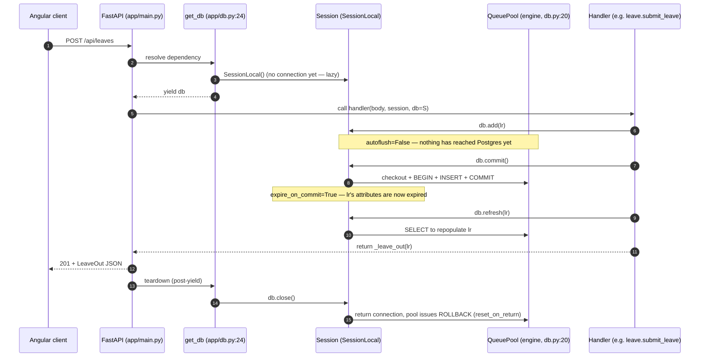
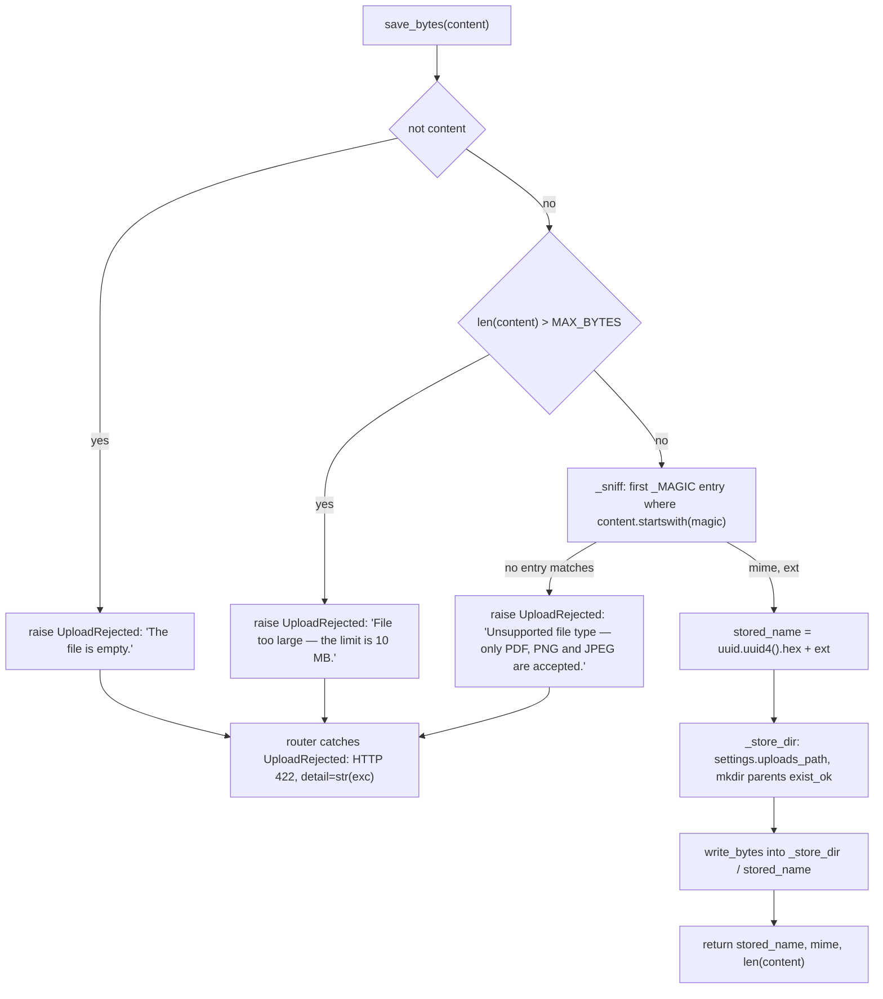
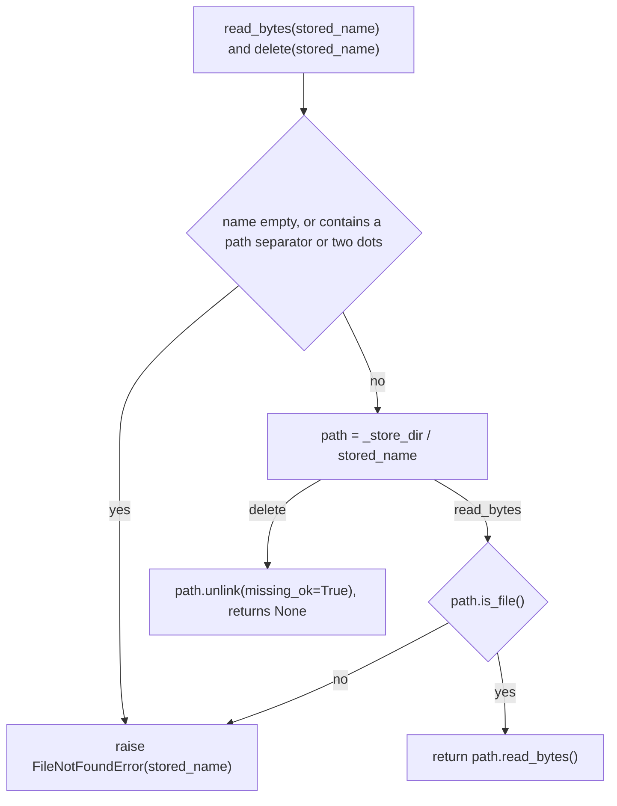
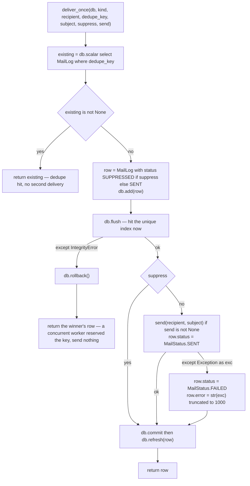

# Chapter 2 — Backend Core: Persistence, Storage, Mail, PDF and the Module Conventions

After this chapter you will be able to open any of the 69 Python modules under
`apps/api-py/app/` and know, before you read a line of its logic, where its database
session came from and who is responsible for committing it; whether a helper is private
by convention or by accident; what a `404` in this codebase actually means; which
Pydantic model belongs in a router and which belongs in `app/schemas/`; and what will
break if you add a model file and forget one line in a registry. You will also be able to
write a new backend module that reads as though the same person wrote it as the other
sixty-eight — because the conventions here are conventions, not lint rules, and nothing
in the toolchain will tell you when you have broken one.

**In scope.** `app/db.py` end to end; `app/models/__init__.py` as Alembic's input;
`app/document_store.py`; `app/mailer.py` and `app/models/mail.py`; `app/resume_pdf.py`;
the shape of `app/schemas/` and the inline-schema convention across the nine routers;
`HTTPException` and status-code semantics; logging; `tests/conftest.py`; and the backend
naming rulebook.

**Deferred.** Process topology, `config.py`'s full `Settings` table and `main.py`'s router
mounting and CORS belong to [Chapter 1](01-stack-architecture.md) — see Chapter 1 §2, §4
and §5, cross-referenced rather than repeated here. The tables and columns themselves are
Chapter 3. The 38 Alembic revisions and the enum gotchas are Chapter 4. `scrypt`, the
HS256 cookie and the `require_*` guards' *security* argument are Chapter 5 — this chapter
names only where they plug into the module shape. The AI layer and the egress gate are
Chapter 8.

---

## 1. The persistence layer: `app/db.py`

Everything the backend does to Postgres flows through **thirty lines** that have not been
edited since the scaffold commit. `git log --oneline -- apps/api-py/app/db.py` returns a
single revision, `73a901b` ("feat(api-py): FastAPI backend scaffold + auth slice (migration
Phase 1)"). The Assistant-V2 build-out, the pgvector Knowledge Base and the entire voice
stack were all
built on top of this file without changing it, which is the strongest evidence available
that its shape is right.

Besides its imports — `collections.abc.Iterator`, three names from SQLAlchemy, and
`from .config import settings`
([apps/api-py/app/db.py:8-13](../../apps/api-py/app/db.py#L8-L13)) — the file contains
four things and nothing else: a docstring, the declarative base, two module-level
objects, and one generator function. That last import is the hinge for §1.2: the engine
never sees `DATABASE_URL`, it sees a value `config.py` has already rewritten.

### 1.1 The declarative base

```python
class Base(DeclarativeBase):
    pass
```

— [apps/api-py/app/db.py:16-17](../../apps/api-py/app/db.py#L16-L17)

This is SQLAlchemy 2.0's `DeclarativeBase` class, not the legacy `declarative_base()`
factory. The consequence is visible in every model file: columns are declared with the
annotation style `id: Mapped[str] = mapped_column(String, primary_key=True, default=_uuid)`
([apps/api-py/app/models/mail.py:44](../../apps/api-py/app/models/mail.py#L44)) rather than
the 1.x `id = Column(String, primary_key=True)`.

`Base` carries no `metadata` override and no `naming_convention`. Nothing anywhere in
`app/` constructs a `MetaData` or passes a naming convention. That matters for one reason
only, and it is a reason you will meet in Chapter 4: a constraint the models declare
*implicitly* — `mapped_column(ForeignKey("users.id"), unique=True)` — arrives in the
database with a name PostgreSQL invented, a name that exists nowhere in the repository.
The house rule that keeps the rest of the schema safe is that explicit constraints are
always given explicit names, as with `Index("ix_maillog_kind_sent", "kind", "sent_at")`
([apps/api-py/app/models/mail.py:40](../../apps/api-py/app/models/mail.py#L40)).

### 1.2 The engine, and why the URL is rewritten first

```python
engine = create_engine(settings.sqlalchemy_url, pool_pre_ping=True, future=True)
```

— [apps/api-py/app/db.py:20](../../apps/api-py/app/db.py#L20)

Two things deserve unpacking: the argument, and the two keywords.

The argument is **not** `settings.database_url`. It is a derived property,
`Settings.sqlalchemy_url`
([apps/api-py/app/config.py:119-149](../../apps/api-py/app/config.py#L119-L149)), which
does exactly two transformations before SQLAlchemy ever sees the string.

**One: it forces the driver.** If the URL begins with the literal `postgresql://` it is
rewritten to `postgresql+psycopg://`
([apps/api-py/app/config.py:137-138](../../apps/api-py/app/config.py#L137-L138)).
SQLAlchemy's default DBAPI for the bare `postgresql` dialect is **psycopg2**, and this
project installs psycopg 3 only. A hand-written or platform-supplied `postgresql://…` URL
would therefore die at connect time with `ModuleNotFoundError: No module named 'psycopg2'`.
The docstring says so in one line: "so a plain `postgresql://` does not fall back to
psycopg2" ([apps/api-py/app/config.py:123-124](../../apps/api-py/app/config.py#L123-L124)).

**Two: it strips exactly three query parameters and no others.**

```python
    # Query params that belong to Prisma and mean nothing to libpq. Only these
    # are stripped — see sqlalchemy_url.
    _PRISMA_ONLY_PARAMS = frozenset({"schema", "connection_limit", "pgbouncer"})
```

— [apps/api-py/app/config.py:115-117](../../apps/api-py/app/config.py#L115-L117)

The URL is split on the first `?`, each `&`-separated pair is kept unless the text before
its `=` is one of those three names, and the survivors are re-joined; if nothing survives,
the bare base URL is returned
([apps/api-py/app/config.py:140-149](../../apps/api-py/app/config.py#L140-L149)). Those
three are Prisma's, from the deleted Next.js stack, and libpq rejects them as unknown
keywords. Everything else — most importantly `sslmode` — passes through untouched.

> **Why it is like this.** The property's own docstring records the incident that produced
> the allow-list, and it is the most valuable comment in the configuration file:
>
> "It drops ONLY those. This used to end `return url.split("?", 1)[0]`, discarding the
> entire query string — which silently threw away `sslmode`. Every managed Postgres (Neon,
> RDS, Supabase, Cloud SQL) hands you `...?sslmode=require`, so the connection fell back to
> libpq's default `prefer`: TLS opportunistic, server certificate never verified, nothing
> logged and nothing failed. An operator who set sslmode=require in the secret had every
> reason to believe it applied while student records crossed the network on an
> unauthenticated channel."
> — [apps/api-py/app/config.py:127-134](../../apps/api-py/app/config.py#L127-L134)
>
> Note the shape of the fix. It would have been easy to write a general parser; instead the
> code strips a closed set of three known-bad names and preserves everything it does not
> recognise. Where a config value is a security control you cannot see failing, the safe
> default is *pass through*, not *sanitise*.

The same URL-normalisation hazard has a twin about a hundred lines earlier **in the same
file**: `_ENV_FILE` is pinned to `Path(__file__).resolve().parent.parent / ".env"`
([apps/api-py/app/config.py:14](../../apps/api-py/app/config.py#L14)) because a bare
`.env` resolves against the process CWD, and run from the repo root that was the old
Prisma `.env` — whose URL was both wrong-driver *and* carried `?schema=public`. One
historical file, both failure modes.

Now the keywords. `pool_pre_ping=True` makes every connection checkout issue a cheap
liveness probe and transparently replace a dead connection. On this stack the practical
purchase is surviving `docker compose restart db`, a laptop resuming from sleep, or a
managed-Postgres failover without the next request dying on *server closed the connection
unexpectedly*. `future=True` is a SQLAlchemy 1.4-era vestige: under 2.0 the 2.0-style
engine is the only engine, so the flag is accepted and inert.

Everything else is a SQLAlchemy default, and four of those defaults are worth knowing
because they are not configurable here, and because §1.4 and §1.5 both lean on them.
Introspecting the constructed engine (`engine.pool`) reports a `QueuePool` with
`pool_size=5`, `_max_overflow=10`, `_recycle=-1` and
`_reset_on_return=ResetStyle.reset_rollback`. What each of those *does*:

- **`pool_size=5`** is how many live connections the pool keeps open and hands out again.
  A sixth concurrent request does not queue — it triggers overflow.
- **`max_overflow=10`** is how many *extra* connections may be opened on demand above the
  pool size. An overflow connection is closed outright when it is handed back, not kept.
  Five plus ten is a hard ceiling of **fifteen concurrent connections per API process**;
  a sixteenth concurrent checkout blocks until one is released.
- **`pool_recycle=-1`** means connections are never proactively retired by age. `-1`
  disables recycling; a positive value would be a maximum lifetime in seconds.
- **`reset_on_return`** is what the pool does to a connection the moment it is handed
  back. Its default, `rollback`, issues a `ROLLBACK` on that connection. **This is the
  single fact that makes `get_db` safe**, and §1.4 is mostly a consequence of it.

There is no `pool_size`, `max_overflow` or `pool_recycle` setting anywhere in
`apps/api-py`; tuning any of them requires editing `db.py`. Fifteen is also the number an
operator must reconcile against the database's `max_connections` if the API is ever run
with multiple replicas.

### 1.3 The session factory, and the two defaults it does and does not change

```python
SessionLocal = sessionmaker(bind=engine, autoflush=False, autocommit=False, future=True)
```

— [apps/api-py/app/db.py:21](../../apps/api-py/app/db.py#L21)

`autocommit=False` is stated for documentation; in SQLAlchemy 2.0 it is effectively the
only legal value. `future=True` is inert here for the same reason as on the engine. The
one argument that genuinely changes how you must write code is **`autoflush=False`**,
because SQLAlchemy's default is `True`.

A *flush* is the moment pending ORM changes become real SQL statements on the connection —
distinct from a *commit*, which ends the transaction. With autoflush on, a `SELECT` issued
on a session that has pending `add()`s quietly flushes them first, so a read-after-write
inside a single request sees the pending row. With it off — as here — it does not. That is
why explicit flushes in this codebase are few and deliberate. There are exactly five
`.flush()` call sites in `app/`: one in the mailer and four in the seed. The mailer's is
the instructive one:

```python
    db.add(row)
    try:
        db.flush()  # hit the unique index now, before doing any real work
```

— [apps/api-py/app/mailer.py:57-59](../../apps/api-py/app/mailer.py#L57-L59)

The flush exists to force a unique-index violation to surface *before* the mail driver is
invoked. Without it the INSERT would not reach Postgres until commit — that is, after a
potentially slow SMTP conversation — widening the race window to the duration of a network
round trip. Set against those five flushes are **72** `db.commit()` call sites across
`app/`. The working assumption everywhere is: build the object graph, then commit once.

The argument that is *not* passed is `expire_on_commit`, so it keeps its default of `True`.
Every attribute of every persistent object is expired at commit, and touching one
afterwards emits a fresh `SELECT`. That is the whole reason for the recurring
`db.commit(); db.refresh(obj); return ...` triple — for example
[apps/api-py/app/mailer.py:75-76](../../apps/api-py/app/mailer.py#L75-L76),
[apps/api-py/app/routers/leave.py:62-64](../../apps/api-py/app/routers/leave.py#L62-L64)
and
[apps/api-py/app/routers/student.py:1386-1388](../../apps/api-py/app/routers/student.py#L1386-L1388).
Delete the `refresh` and the response model is built from an object whose attributes are
either re-loaded by a surprise query at serialisation time or, once `get_db` has closed the
session, not loadable at all.

### 1.4 `get_db`: what it does, and the far larger set of things it does not

```python
def get_db() -> Iterator[Session]:
    """FastAPI dependency: one session per request, always closed."""
    db = SessionLocal()
    try:
        yield db
    finally:
        db.close()
```

— [apps/api-py/app/db.py:24-30](../../apps/api-py/app/db.py#L24-L30)

A dependency written as a **generator** — a function containing `yield` — is run by FastAPI
in two halves, and the split is what makes this seven-line function work at all. Before it
calls your endpoint, FastAPI advances the generator up to the `yield`: that is the moment
`SessionLocal()` runs and a `Session` object exists. It passes the yielded value in as the
endpoint's `db` argument. Only after the response has been produced does it come back and
resume the generator, running everything after the `yield` — here just `db.close()`.
FastAPI holds the half-finished generator on a per-request stack of pending cleanups, so
if a handler depends on several such generators they are resumed in reverse order of the
opens. Chapter 1 §4 walks the surrounding request lifecycle; what matters here is what
this function *omits*.

**It never commits.** A handler that mutates ORM state and forgets `db.commit()` discards
its work with no error anywhere: `Session.close()` returns the connection to the pool,
whose `reset_on_return` is `reset_rollback` (§1.2), so the open transaction is rolled back,
the response is a clean `200`, and nothing is written. Every router therefore commits by
hand — that is what the 72 call sites are.

**It never rolls back explicitly, and that is safe only by way of the pool.** When a
handler raises partway through a unit of work, `get_db` does not roll back; `close()`
returns a connection carrying an open transaction and the pool rolls it back. Nothing is
committed by accident.

**But it cannot rescue a session that has already failed.** After an `IntegrityError` a
session is in a pending-rollback state and any further use raises `PendingRollbackError`.
So the three places that catch an `IntegrityError` and then keep using the session all call
`db.rollback()` first, by hand:

- [apps/api-py/app/conversations.py:63-71](../../apps/api-py/app/conversations.py#L63-L71) —
  the one-live-conversation-per-owner race; rolls back and re-reads the winner's row, and
  re-raises if the re-read finds nothing ("index violated for another reason").
- [apps/api-py/app/routers/voice.py:460-465](../../apps/api-py/app/routers/voice.py#L460-L465)
  carries the reasoning — "The read-then-insert above is a CHECK, not a guarantee … Losing
  that race is not an error — the turn IS stored, just by the other writer — so treat it as
  the idempotent no-op the caller expects rather than surfacing a 500 to a worker that did
  nothing wrong" — and
  [apps/api-py/app/routers/voice.py:466-478](../../apps/api-py/app/routers/voice.py#L466-L478)
  is the `try: convo.append_message(...) / except IntegrityError: db.rollback(); return
  TranscriptOut(stored=False)` that implements it.
- [apps/api-py/app/mailer.py:60-64](../../apps/api-py/app/mailer.py#L60-L64) — the
  `dedupe_key` race; rolls back and defers to the other worker's row.

**And it cannot outlive the handler.** The cleanup runs when the handler *returns*, not
when a streaming response body finishes. `POST /api/agent/chat/stream` returns a
`StreamingResponse` whose generator runs long afterwards, so it must open its own session:

```python
        # Fresh session: the injected request scope is already gone by now.
        with SessionLocal() as fresh:
```

— [apps/api-py/app/routers/agent.py:249-250](../../apps/api-py/app/routers/agent.py#L249-L250)

The handler's docstring states the rule directly: the turn is saved "from a fresh Session,
since the request's own session is torn down when this handler returns and the generator
keeps running"
([apps/api-py/app/routers/agent.py:196-198](../../apps/api-py/app/routers/agent.py#L196-L198)).
The user turn is deliberately persisted *before* returning, on the injected `db`
([apps/api-py/app/routers/agent.py:211-214](../../apps/api-py/app/routers/agent.py#L211-L214)),
so the conversation id is settled before the generator starts.

`agent.py` is the only router that imports **both** names — `from ..db import SessionLocal,
get_db` ([apps/api-py/app/routers/agent.py:34](../../apps/api-py/app/routers/agent.py#L34)).
`health.py` is the mirror case: it imports `SessionLocal` and never `get_db`
([apps/api-py/app/routers/health.py:22](../../apps/api-py/app/routers/health.py#L22)). The
remaining seven routers — `auth`, `director`, `leave`, `mentor`, `registration`, `student`,
`voice` — import `get_db` alone.

The general rule, worth carrying into every future module: **anything that outlives the
request handler opens its own `SessionLocal()`; anything inside it uses the injected one.**

That rule has exactly one deliberate exception, and `health.py` is it. `/ready` runs
entirely inside an ordinary request handler and still opens its own session:

```python
    # Hard dependency: every meaningful request reads Postgres.
    try:
        with SessionLocal() as db:
            db.execute(text("SELECT 1"))
        checks["database"] = "ok"
```

— [apps/api-py/app/routers/health.py:44-48](../../apps/api-py/app/routers/health.py#L44-L48)

The reason is structural. A readiness probe's job is to *report* which dependency broke —
the docstring says it reports "each dependency separately so a failing probe says WHICH one
broke instead of just 'not ready'"
([apps/api-py/app/routers/health.py:35-36](../../apps/api-py/app/routers/health.py#L35-L36)).
An injected `get_db` session cannot give it that. `SessionLocal()` does not connect
eagerly, so the failure would surface on the probe's first `execute` — but wrapping it means
the probe owns the `try`. Owning the connection is what lets the handler turn an
`OperationalError` into a JSON field (`checks["database"] = "error: OperationalError"`,
§7.4) and a `503` status, instead of letting an exception escape as an opaque `500` with no
per-dependency breakdown. Applying the general rule literally here and "fixing" `health.py`
to take `db: Session = Depends(get_db)` would take the diagnosis away.

The rule's complement is stated in the mailer: "Keep this module free of request/`get_db`
concerns so a background worker can call it with its own Session"
([apps/api-py/app/mailer.py:11-12](../../apps/api-py/app/mailer.py#L11-L12)) — non-router
modules take a `Session` as a parameter, they do not reach for `SessionLocal` themselves.
`app/retention.py`, `app/conversations.py` and `app/mailer.py` all obey this.

> **Why it is like this.** `app/memory.py` survives as a deliberate tombstone whose two
> public functions raise `NotImplementedError`, and its docstring explains why deleting it
> was judged less safe than keeping it: "save_message() opened its own SessionLocal and
> wrote straight into append_message, bypassing every rule the routers enforce — the
> compulsory opening greeting, transcript length limits, final-only policy, provider dedup,
> and worker authentication. It was the obvious place a future out-of-request assistant
> turn would get written, silently skipping all of it."
> — [apps/api-py/app/memory.py:13-18](../../apps/api-py/app/memory.py#L13-L18)
>
> A private session is not a performance choice. It is a route around every policy that
> lives in the request path. Note how that squares with `health.py`: the probe opens its own
> session precisely because it enforces no policy and writes nothing.

### 1.5 The session lifecycle against the request lifecycle



Mermaid's `autonumber` numbers **messages only** — the two `Note over` lines are not
steps — so the diagram has fifteen numbered arrows: `db.commit()` is **7**, the pool
round-trip that actually writes the row is **8**, `db.refresh(lr)` is **9**, the
repopulating `SELECT` is **10**, `db.close()` is **14** and the pool's `ROLLBACK` is **15**.

Two failure branches are worth holding in mind.

If the handler **raises** before `commit()`, steps 7 through 10 never happen; the exception
propagates, FastAPI still runs the cleanup half of `get_db`, and the pool's `ROLLBACK` at
step 15 is what discards the work. Nothing partial survives.

If the handler **forgets** `commit()`, what happens depends on whether it also refreshes.
In `submit_leave` as written, `db.refresh(lr)` on an object that was never flushed raises
`InvalidRequestError: Instance '<LeaveRequest …>' is not persistent within this Session`
(verified by execution against this codebase's models) — a `500`, loud and immediate. In
the far more common shape, a handler that mutates and returns *without* a refresh, steps 7
and 8 are simply absent from the diagram: the client receives its `201`, the response body
is built from in-memory attributes that look correct, and step 15 quietly throws the row
away. That is the failure mode `get_db`'s "never commits" property makes possible, and the
only defence is the convention that every mutating handler commits by hand.

---

## 2. The model registry: `app/models/__init__.py`

`app/models/` holds 31 model modules plus `__init__.py`. The `__init__.py` is a pure
side-effect registry — two lines of comment and 31 lines of import, one module per line,
alphabetically ordered, every one in the identical form. It is 33 short lines and the whole
file *is* the point, so here it is entire:

```python
# Importing the model modules registers them on Base.metadata (for create_all
# and Alembic autogenerate). Add new model modules here as the schema grows.
from . import academic_history  # noqa: F401
from . import academics  # noqa: F401
from . import agent_run  # noqa: F401
from . import alert  # noqa: F401
from . import attendance  # noqa: F401
from . import certification  # noqa: F401
from . import cohort  # noqa: F401
from . import conversation  # noqa: F401
from . import course  # noqa: F401
from . import feedback  # noqa: F401
from . import job  # noqa: F401
from . import job_import_run  # noqa: F401
from . import knowledge  # noqa: F401
from . import lab  # noqa: F401
from . import leave  # noqa: F401
from . import mail  # noqa: F401
from . import mentor_note  # noqa: F401
from . import mock  # noqa: F401
from . import offer  # noqa: F401
from . import placement_criteria  # noqa: F401
from . import profile  # noqa: F401
from . import registration  # noqa: F401
from . import resume  # noqa: F401
from . import resume_profile  # noqa: F401
from . import schedule  # noqa: F401
from . import skill  # noqa: F401
from . import swoc  # noqa: F401
from . import timesheet  # noqa: F401
from . import upload  # noqa: F401
from . import user  # noqa: F401
from . import voice_worker  # noqa: F401
```

— [apps/api-py/app/models/\_\_init\_\_.py:1-33](../../apps/api-py/app/models/__init__.py#L1-L33)

That list is also the only place in the repository where the backend's 31 domain concepts
appear together, which is why §10.1's model-module naming rule ("snake_case nouns, one
concept per file") can be checked against it directly: `academic_history`, `job_import_run`,
`placement_criteria`, `resume_profile` and `voice_worker` are the multi-word cases. The
naming is singular with two exceptions, both visible in that list: `placement_criteria`
(`criteria` is the plural of *criterion*; the mapped class is `PlacementCriteria`) and the
single-word `academics`. Alphabetical order is likewise verifiable on the page rather than
asserted.

The `# noqa: F401` on every line suppresses "imported but unused", which is exactly the
point: **the import is the effect.**

### 2.1 The mechanism

A mapped class registers its `Table` on `Base.metadata` at *class definition time* — that
is, the first time its module is imported. A module nobody imports contributes no table.
Alembic's autogenerate compares `target_metadata` against the live database:

```python
import app.models  # noqa: F401  — registers every model on Base.metadata
...
target_metadata = Base.metadata
```

— [apps/api-py/migrations/env.py:8](../../apps/api-py/migrations/env.py#L8) and
[:19](../../apps/api-py/migrations/env.py#L19)

`env.py:8` is the only place in the repository that names the package *explicitly*. It is
not, however, the only thing that runs the registry — and the difference matters, because
the naive reading ("nothing at runtime imports `app.models`, so `Base.metadata` is
incomplete in a live process") is wrong about Python itself.

**Importing a submodule always executes its parent package's `__init__.py` first.** When
`app/routers/student.py` runs `from ..models.upload import Upload`, Python must first
import the package `app.models` — which executes the 31 lines above — before it can reach
`app.models.upload`. So every router is an implicit consumer of the registry. Verified by
execution in `apps/api-py`:

```
$ .venv/Scripts/python -c "import sys, app.routers.student; from app.db import Base; \
    print(len(Base.metadata.tables), len([m for m in sys.modules if m.startswith('app.models.')]))"
46 31
```

Importing a single router loads all 31 model modules and leaves `Base.metadata` holding all
**46** tables. `Base.metadata` inside a live uvicorn process is therefore **complete**, not
partial. (`import app.models.mail` alone gives the identical result, for the same reason.)

So why does the explicit import in `env.py` exist at all? Because **Alembic imports nothing
else from the application.** `migrations/env.py` imports `app.models`, `app.config` and
`app.db` and stops there
([apps/api-py/migrations/env.py:8-10](../../apps/api-py/migrations/env.py#L8-L10)); it
never loads `app.main` or a router. Without line 8, `Base.metadata` in the Alembic process
would hold only whatever `app.db` itself pulls in — nothing. The registry is not there to
make the runtime work; it is there so that the one process which *emits DDL* sees the whole
schema.

The practical corollary is sharper than "keep the list tidy": a model module missing from
`__init__.py` is fully registered in the running app (some router imports it, so its class
body executes) and completely invisible to Alembic. The two processes disagree, and only
one of them writes migrations.

### 2.2 What breaks when a line is missing

Nothing, at runtime. That is the hazard. The module still imports, the router still works,
the tests still pass, and lint has nothing to say. The damage appears at the *next*
`alembic revision --autogenerate`: the table exists in the database but not in
`target_metadata`, and with no `include_object` filter configured
([apps/api-py/migrations/env.py:41-45](../../apps/api-py/migrations/env.py#L41-L45))
autogenerate resolves the difference in the obvious direction and emits an `op.drop_table`
for it. A data-destroying migration that looks correct in review.

**The convention for adding a model, in full.** Create `app/models/<concept>.py` with a
snake_case singular filename. Define the mapped class PascalCase-singular with a
snake_case-plural `__tablename__`. Add exactly one line to `app/models/__init__.py`, in
alphabetical position, in the form `from . import <concept>  # noqa: F401`. Then generate
the migration. There is no automated check that the directory listing and the import list
agree; the discipline is visible only in the git history, where the file is touched in
lockstep with every model-adding commit.

### 2.3 A stale line in `db.py`'s own docstring

`db.py` opens with:

```
The fresh Python schema is defined on this Base (see app/models). Alembic will
own migrations; `Base.metadata.create_all` is used only by the dev seed so the
app can run before the migration tooling is wired.
```

— [apps/api-py/app/db.py:3-5](../../apps/api-py/app/db.py#L3-L5)

A grep for `create_all` across `apps/api-py` excluding `.venv` returns two hits: that
docstring line and the word inside the registry's comment. (The `.venv/` tree lives inside
the repository directory and carries ~70 further hits from SQLAlchemy, Alembic and
`google.adk` — none of them this application's code.) There is no `create_all` call in
`app/`, `tests/`,
`migrations/` or `voice_agent.py`. The seed says the opposite and is the accurate one:
"Data only — Alembic owns the schema."
([apps/api-py/app/seed.py:18](../../apps/api-py/app/seed.py#L18)). The migration tooling has
been wired since the first revision; `db.py` has simply not been touched since the scaffold
commit that predates it. This is not pedantry — several model modules assume the enum types
already exist, so acting on that docstring and calling `create_all` on a fresh database
would fail, not merely be redundant. Treat the sentence as historical.

---

## 3. File storage: `app/document_store.py`

77 lines, one exception class, and **five functions** — three public (`save_bytes`,
`read_bytes`, `delete`) and two private (`_sniff`, `_store_dir`) — with no database import
at all. The contract is symmetrical and small: bytes in ⇒ `(stored_name, mime, size)` out;
`stored_name` in ⇒ bytes out.



The read side is deliberately duller, and shares one guard between two functions:



### 3.1 The two rules the module exists to enforce

The docstring states them, and attributes them to the retired Next.js store:

```
- The type is decided by MAGIC BYTES, not the client-sent name or Content-Type.
  A ".pdf" that is actually an executable is rejected; the recorded mime is what
  the bytes actually are.
- The name written to disk is random, so a crafted filename can never traverse
  the store or overwrite another file. Reads reject any separator in the name.
```

— [apps/api-py/app/document_store.py:7-11](../../apps/api-py/app/document_store.py#L7-L11)

### 3.2 Type detection

```python
_MAGIC: list[tuple[bytes, str, str]] = [
    (b"%PDF", "application/pdf", ".pdf"),
    (bytes([0x89, 0x50, 0x4E, 0x47, 0x0D, 0x0A, 0x1A, 0x0A]), "image/png", ".png"),
    (bytes([0xFF, 0xD8, 0xFF]), "image/jpeg", ".jpg"),
]
```

— [apps/api-py/app/document_store.py:24-28](../../apps/api-py/app/document_store.py#L24-L28)

`_sniff` iterates this list and returns on the first `content.startswith(magic)`, raising
`UploadRejected("Unsupported file type — only PDF, PNG and JPEG are accepted.")` when none
matches ([apps/api-py/app/document_store.py:37-41](../../apps/api-py/app/document_store.py#L37-L41)).
The comment above the table — "Order matters only in that each signature is unambiguous" —
is accurate: no signature is a prefix of another, so first-match iteration is
order-independent.

Two properties follow. The signature must sit at byte 0, which is stricter than the PDF
specification (which tolerates a preamble) and means a small number of real PDFs are
rejected — in exchange, nothing can smuggle a signature past an offset. And the list is
closed: GIF, WebP, TIFF, SVG, ZIP-family formats and HEIC are all refused. The client's
declared `Content-Type` is never read by this module or by any caller.

### 3.3 Size, emptiness and the order of the checks

```python
MAX_BYTES = 10 * 1024 * 1024  # 10 MB
...
def save_bytes(content: bytes) -> tuple[str, str, int]:
    """Validate and store; return (stored_name, sniffed_mime, size_bytes)."""
    if not content:
        raise UploadRejected("The file is empty.")
    if len(content) > MAX_BYTES:
        raise UploadRejected("File too large — the limit is 10 MB.")
    mime, ext = _sniff(content)
    stored_name = uuid.uuid4().hex + ext
    (_store_dir() / stored_name).write_bytes(content)
    return stored_name, mime, len(content)
```

— [apps/api-py/app/document_store.py:30](../../apps/api-py/app/document_store.py#L30) and
[:50-59](../../apps/api-py/app/document_store.py#L50-L59)

All three rejections raise the single exception type
`class UploadRejected(ValueError)`
([apps/api-py/app/document_store.py:33-34](../../apps/api-py/app/document_store.py#L33-L34)). The
order is deliberate: because size precedes sniff, a 200 MB file gets the size message
rather than a type message. The comparison is `>`, so exactly 10,485,760 bytes is accepted.

Note the register of the messages. They are end-user prose — sentence-cased, em-dashed,
full-stopped — because they are surfaced verbatim to the student. The router does
`detail=str(exc)`
([apps/api-py/app/routers/student.py:1372-1373](../../apps/api-py/app/routers/student.py#L1372-L1373)),
and the Angular uploads screen renders the server's detail directly. **Rewording an
`UploadRejected` message changes user-visible UI copy with no frontend commit.** The
docstring's "Max 10 MB, matching the UI copy"
([apps/api-py/app/document_store.py:14](../../apps/api-py/app/document_store.py#L14)) is a real
cross-stack contract held together by nothing but two constants agreeing.

### 3.4 Where files land

```python
def _store_dir() -> Path:
    d = settings.uploads_path
    d.mkdir(parents=True, exist_ok=True)
    return d
```

— [apps/api-py/app/document_store.py:44-47](../../apps/api-py/app/document_store.py#L44-L47)

This is the only place in the module that forms a path, and it is called fresh on every
save, read and delete — so the directory is created lazily on first use and silently
re-created if something removes it in between. There is no startup check that the path is
writable; a bad `UPLOAD_DIR` fails at the first upload, not at boot.

`settings.uploads_path` is a read-only property: `Path(self.upload_dir)` when `UPLOAD_DIR`
is non-blank — unresolved, so a relative value is relative to the process CWD — otherwise
`apps/api-py/var/uploads`
([apps/api-py/app/config.py:104-109](../../apps/api-py/app/config.py#L104-L109)). Chapter 1
§5 lists the setting; what belongs here is the deployment consequence, which the repository
states four separate times, most sharply in the Dockerfile:

> **Why it is like this.** "UPLOAD_DIR must be a MOUNTED volume in production. Left blank,
> config.py resolves to /app/var/uploads INSIDE the container layer, so every redeploy
> silently destroys student uploads. This ENV only relocates it somewhere mountable — it is
> not a substitute for actually mounting it."
> — [apps/api-py/Dockerfile:39-42](../../apps/api-py/Dockerfile#L39-L42)
>
> Nothing in code enforces it. The database keeps rows pointing at bytes that no longer
> exist, and the download endpoint then returns `404 "Stored file is missing."` forever.

### 3.5 The security invariants, stated explicitly

1. **The stored type is decided by the bytes, never by the client.** `mime_type` on the row
   is the sniffed value ([apps/api-py/app/routers/student.py:1382](../../apps/api-py/app/routers/student.py#L1382));
   `UploadFile.content_type` is read nowhere. This is the invariant that makes it safe to
   serve files back with `Content-Disposition: inline` and the stored media type, because
   `app/main.py` installs no `X-Content-Type-Options: nosniff` header and only one
   middleware (CORS, [apps/api-py/app/main.py:61](../../apps/api-py/app/main.py#L61)).
   Admitting `image/svg+xml` to `_MAGIC` would convert the uploads endpoint into stored XSS.
2. **The disk name is server-generated randomness.** `uuid.uuid4().hex + ext` — 32 lowercase
   hex characters plus a sniff-derived extension. The client's filename never touches the
   write path; it is kept only as the metadata column `original_name`, set from
   `file.filename or stored_name`
   ([apps/api-py/app/routers/student.py:1380](../../apps/api-py/app/routers/student.py#L1380)).
   Traversal on the *write* path is therefore structurally impossible: there is no user
   input in the path.

   **But `original_name` is not inert.** `download_upload` interpolates it, unescaped, into
   a quoted response-header value:
   `headers={"Content-Disposition": f'inline; filename="{upload.original_name}"'}`
   ([apps/api-py/app/routers/student.py:1411](../../apps/api-py/app/routers/student.py#L1411)).
   Nothing sanitises, quotes or ASCII-folds it anywhere between the multipart parse and that
   f-string. Two consequences, both verified by execution against the installed Starlette
   and h11:
   - A filename containing a double quote (`a"; x="b.pdf`) closes the quoted string early
     and produces `inline; filename="a"; x="b.pdf"` — a malformed but not obviously
     exploitable header. A filename containing CRLF is *not* a response-splitting hole here:
     Starlette latin-1-encodes it into `raw_headers` without complaint, but uvicorn's h11
     layer refuses it with `LocalProtocolError: Illegal header value`. The protection comes
     from a dependency, not from this code.
   - A filename outside Latin-1 — `履歴書.pdf`, and every Devanagari or Kannada filename a
     student here might realistically use — raises `UnicodeEncodeError` inside
     `Response.__init__` when Starlette encodes the header. That is an unhandled `500` on
     download, for a file that uploaded and stored perfectly.

   The magic-byte and random-name invariants do not cover this. Traversal on the write path
   is structurally impossible; header hygiene on the read path is enforced nowhere. The
   fix — RFC 6266's `filename*=UTF-8''<percent-encoded>`, or simply serving
   `stored_name` — is a one-line change that nothing currently forces.
3. **Reads and deletes refuse any separator.** Both `read_bytes` and `delete` carry a
   byte-identical guard, `if not stored_name or "/" in stored_name or "\\" in stored_name
   or ".." in stored_name: raise FileNotFoundError(stored_name)`
   ([apps/api-py/app/document_store.py:64-65](../../apps/api-py/app/document_store.py#L64-L65),
   [:75-76](../../apps/api-py/app/document_store.py#L75-L76)). It is duplicated, not factored,
   so a fix to one must be hand-applied to the other. `read_bytes` additionally requires
   `path.is_file()` before reading; `delete` calls `.unlink(missing_ok=True)` and so
   "silently ignores a file that is already gone"
   ([apps/api-py/app/document_store.py:73-74](../../apps/api-py/app/document_store.py#L73-L74)).
4. **Only non-empty PDF/PNG/JPEG at most 10,485,760 bytes is ever stored.**
5. **A student reads or deletes only their own upload**, enforced one layer up as a `404`
   rather than a `403` — see §7.

That third guard is a blacklist, and it is load-bearing rather than decorative, because
`stored_name` is not in practice written only by `save_bytes`: the dev seed inserts three
`Upload` rows with hand-written names — `"up_photo_0001.jpg"`, `"up_cert_0002.pdf"`,
`"up_resume_0003.pdf"` — for files that were never written to disk
([apps/api-py/app/seed.py:451-461](../../apps/api-py/app/seed.py#L451-L461)). On a freshly
seeded dev database the uploads screen therefore shows three cards whose previews all `404`.
A containment check (`path.resolve().is_relative_to(_store_dir().resolve())`) would be
strictly stronger than a substring blacklist.

### 3.6 What the API returns for each failure

| Condition | Raised by | HTTP result | Detail string |
|---|---|---|---|
| `kind` not a member of `UploadKind` | `student.create_upload` | `422` | `Unknown upload kind.` |
| Empty body | `document_store.save_bytes` | `422` | `The file is empty.` |
| Over 10 MB | `document_store.save_bytes` | `422` | `File too large — the limit is 10 MB.` |
| Unrecognised magic bytes | `document_store._sniff` | `422` | `Unsupported file type — only PDF, PNG and JPEG are accepted.` |
| Upload id absent **or** owned by another student | `student.download_upload` / `delete_upload` | `404` | `Upload not found.` |
| Row exists, bytes absent | `document_store.read_bytes` → `FileNotFoundError` | `404` | `Stored file is missing.` |
| Caller has no `studentId` in session | `student._require_student` | `403` | `Not a student account.` |

Sources: [apps/api-py/app/routers/student.py:1362-1373](../../apps/api-py/app/routers/student.py#L1362-L1373),
[:1398-1407](../../apps/api-py/app/routers/student.py#L1398-L1407),
[:1423-1426](../../apps/api-py/app/routers/student.py#L1423-L1426),
[apps/api-py/app/routers/student.py:118-122](../../apps/api-py/app/routers/student.py#L118-L122).

One ordering detail in `delete_upload` is stated in its docstring and is the safe one: "the
stored bytes then the row"
([apps/api-py/app/routers/student.py:1421-1422](../../apps/api-py/app/routers/student.py#L1421-L1422)).
If the commit then fails, the row survives pointing at absent bytes and the download
degrades to a clean `404`; the reverse order would leave orphan bytes with nothing left in
the database to identify them.

**A gap worth naming.** `document_store.py` has no tests. `apps/api-py/tests/` contains **18**
test modules (plus `conftest.py`, which is not one) and none of them imports it. Nothing
asserts that an executable named `.pdf` is rejected, that 10 MB + 1 byte is refused, or that
`read_bytes("../../etc/passwd")` raises. This is the inverse of the risk profile: the
lower-risk PDF renderer has three tests, the security-critical store has zero. It is also
the cheapest gap in this chapter to close — the module is pure logic and needs only a
temporary directory.

---

## 4. Mail: `app/mailer.py`

### 4.1 There is no transport, and that is the design

`app/mailer.py` is 77 lines and imports nothing that can send an email: no `smtplib`, no
HTTP client, no provider SDK. Its docstring draws the boundary explicitly — "The catalogue
of messages and the actual SMTP/API driver are out of scope here (no mail transport is
configured in this environment)"
([apps/api-py/app/mailer.py:3-5](../../apps/api-py/app/mailer.py#L3-L5)). `config.py`
declares no `MAIL_*` or `SMTP_*` field of any kind.

The transport is a caller-supplied callable:

```python
# A driver takes (recipient, subject) and raises on failure. None = no-op stub
# that records the intent without a transport (dev/default).
Driver = Callable[[str, str | None], None]
```

— [apps/api-py/app/mailer.py:23-25](../../apps/api-py/app/mailer.py#L23-L25)

What the module *does* port from the deleted Next.js mailer is the guarantee: "a message
with a given `dedupe_key` is delivered at most once, no matter how many times the sending
job is re-run or how many workers race. The unique index on `dedupe_key` is the arbiter"
([apps/api-py/app/mailer.py:5-9](../../apps/api-py/app/mailer.py#L5-L9)).

### 4.2 `deliver_once`, step by step

Its signature is keyword-only after `db`:

```python
def deliver_once(
    db: Session,
    *,
    kind: str,
    recipient: str,
    dedupe_key: str,
    subject: str | None = None,
    suppress: bool = False,
    send: Driver | None = None,
) -> MailLog:
```

— [apps/api-py/app/mailer.py:28-37](../../apps/api-py/app/mailer.py#L28-L37)

That bare `*` is a safety feature: `recipient` and `dedupe_key` are both unvalidated `str`,
and transposing them positionally would key the ledger on the address and address the mail
to the key — silently defeating the whole guarantee.

The body ([apps/api-py/app/mailer.py:46-77](../../apps/api-py/app/mailer.py#L46-L77)) has
four exits, and the branching is easier to see than to read:



In prose, the same six steps:

1. `SELECT` by `dedupe_key`. A hit returns that row immediately — `return existing  # dedupe
   hit — no second delivery`.
2. Construct the row with its terminal status set optimistically:
   `status=MailStatus.SUPPRESSED if suppress else MailStatus.SENT`.
3. `db.add(row)` then `db.flush()` — reserving the key before any real work (§1.3).
4. On `IntegrityError`: `db.rollback()`, re-`SELECT`, and return the winner's row. "A
   concurrent worker reserved the key between our read and flush; defer to their row and
   send nothing."
5. If not suppressed, call the driver (when one was given) and set `SENT`; on any exception
   set `FAILED` and `row.error = str(exc)[:1000]`.
6. `db.commit()`, `db.refresh(row)`, `return row`.

**Sends block.** `deliver_once` is a plain `def`, the driver is invoked inline on the
calling thread, and there is no `BackgroundTasks`, thread pool or queue anywhere in
`apps/api-py`. This is theoretical today — the mailer's only production-code caller is the
seed ([apps/api-py/app/seed.py:544-550](../../apps/api-py/app/seed.py#L544-L550)); no router
imports it — but it is what the "callable off a cron" framing anticipates.

**A hazard nothing warns about:** `deliver_once` commits and, on the race path, rolls back a
`Session` it did not create. The commit commits the caller's *entire* transaction; the
rollback discards everything the caller had pending. A future route that mutated ORM objects
and then called `deliver_once` would have those mutations force-committed early or
non-deterministically thrown away. The seed happens to comply by committing first.

### 4.3 The failure record is a row, not a log line

`mailer.py` does not import `logging` and emits no log line on any path — not on a dedupe
hit, not on the race, not on a driver exception. The record *is* the `MailLog` row: status
`FAILED` plus the first 1000 characters of `str(exc)` in `error`. The truncation is silent —
no ellipsis, no marker — and the number is unexplained.

The only reader is `GET /api/director/mail`
([apps/api-py/app/routers/director.py:169-193](../../apps/api-py/app/routers/director.py#L169-L193)),
which returns the 100 most recent rows newest-first behind `require_director`, with the
`error` string projected through `MailLogOut`. Its docstring is carefully worded: "Ops audit
view: what the mailer was asked to send, most recent first." *Asked to send*, not *sent* —
and the distinction is real, because with the default `send=None` the driver call is skipped
and the row is written `SENT` regardless. On a deployment with no driver configured, every
row in that view reads `SENT` and none of those messages reached a mailbox.

### 4.4 The `MailLog` record

Table `mail_logs`
([apps/api-py/app/models/mail.py:37-56](../../apps/api-py/app/models/mail.py#L37-L56)):

| Column | Type | Notes |
|---|---|---|
| `id` | `String` PK | `default=_uuid` — `uuid.uuid4().hex`, 32 hex chars |
| `kind` | `String` | free text, e.g. `"job-alert"` |
| `recipient` | `String` | unbounded, unvalidated |
| `dedupe_key` | `String`, **`unique=True`** | the arbiter of the whole guarantee |
| `subject` | `String \| None` | |
| `status` | `Enum(MailStatus, name="mail_status")` | `default=MailStatus.SENT`, `server_default="SENT"` |
| `error` | `String \| None` | "The driver's complaint, when status is FAILED." |
| `sent_at` | `DateTime(timezone=True)` | `server_default=func.now()` |

`MailStatus` is `SENT | FAILED | SUPPRESSED`
([apps/api-py/app/models/mail.py:30-34](../../apps/api-py/app/models/mail.py#L30-L34)),
subclassing `(str, enum.Enum)` so `server_default="SENT"` interoperates without conversion.
Two composite indexes are declared: `ix_maillog_kind_sent` on `(kind, sent_at)`, which
exactly serves the director endpoint's filter-and-order, and `ix_maillog_recipient_sent` on
`(recipient, sent_at)`, which no current query uses.

> **Why it is like this.** The model docstring names the failure the table defends against,
> and it is not data corruption: "'Weekly job alert' means one email on Monday, but the
> sending job can be re-run by a retry, a second worker, or an operator unsure the first run
> worked — each of those another email to a student who now ignores all of them. The caller
> builds a key from the message and its period (`job-alert:<studentId>:2026-W32`) and the
> unique index turns the second attempt into a caught conflict instead of a delivery."
> — [apps/api-py/app/models/mail.py:4-9](../../apps/api-py/app/models/mail.py#L4-L9)
>
> The same docstring explains why `kind` is a bare string: "the catalogue of messages grows
> with the product, and a new template should not need a migration to be sent."

One documentation defect to know about. The comment on `SUPPRESSED` reads "Suppressed on
purpose — a dedupe hit, or a recipient who has opted out."
([apps/api-py/app/models/mail.py:33](../../apps/api-py/app/models/mail.py#L33)). The mailer
never writes a `SUPPRESSED` row for a dedupe hit — a hit returns the *existing* row and
writes nothing. `SUPPRESSED` appears only from an explicit `suppress=True`. Anyone reading
`select status, count(*) from mail_logs` on the strength of that comment will draw the wrong
conclusion; suppression events leave no trace at all.

### 4.5 What `tests/test_mailer.py` pins

Three tests, all `@requires_db`, each opening its own `with SessionLocal() as db:` — the
mailer is exercised as a library, not through HTTP, consistent with its design. Each mints
`key = f"test:{uuid.uuid4().hex}"`, and the module docstring says why: it "uses a unique
dedupe_key per run so it never collides with prior data"
([apps/api-py/tests/test_mailer.py:1-3](../../apps/api-py/tests/test_mailer.py#L1-L3)). The
rows are never cleaned up, so `mail_logs` accumulates one `test:` row per test per run.

- `test_first_send_then_dedupe_hit` asserts `first.status is MailStatus.SENT`, then re-calls
  with the same key and asserts `again.id == first.id` — **row identity**, which is the real
  guarantee, not merely an equal status
  ([apps/api-py/tests/test_mailer.py:14-23](../../apps/api-py/tests/test_mailer.py#L14-L23)).
- `test_suppressed_records_without_sending` pins `suppress=True` ⇒ `SUPPRESSED`
  ([apps/api-py/tests/test_mailer.py:26-31](../../apps/api-py/tests/test_mailer.py#L26-L31)).
- `test_driver_failure_recorded_not_raised` passes a driver that raises
  `RuntimeError("SMTP 550")` and asserts `row.status is MailStatus.FAILED` and
  `"550" in row.error`
  ([apps/api-py/tests/test_mailer.py:34-44](../../apps/api-py/tests/test_mailer.py#L34-L44)).
  The assertion that matters is the one you cannot see: the exception does not escape.

Two gaps: nothing exercises the `IntegrityError` race branch (it needs two concurrent
sessions), and nothing asserts that a *successful* driver was actually invoked — a stubbed
`send` that silently did nothing would pass.

---

## 5. Resume PDF rendering: `app/resume_pdf.py`

107 lines, ReportLab only, and a standing instruction in the docstring:

```
Runs entirely on this machine — no network, no model — so the student-data
egress gate does not apply here: the student's PII is turned into bytes locally
and streamed straight back to the authenticated owner. Keep it that way; do not
add any remote call to this module.
```

— [apps/api-py/app/resume_pdf.py:3-6](../../apps/api-py/app/resume_pdf.py#L3-L6)

That is a Rule 1 statement (Chapter 1 §6): the module is *outside* the egress gate precisely
because it cannot leave the machine, and the endpoint's docstring repeats the claim —
"Local render (no model, no network), so the egress gate does not apply — but ownership does"
([apps/api-py/app/routers/student.py:1047-1049](../../apps/api-py/app/routers/student.py#L1047-L1049)).
Add one HTTP call here and both claims become false on a path that never calls
`student_data_egress_allowed`.

### 5.1 The document model

Imports are drawn entirely from ReportLab's high-level *platypus* flowable layer —
`HRFlowable, ListFlowable, ListItem, Paragraph, SimpleDocTemplate, Spacer`
([apps/api-py/app/resume_pdf.py:21](../../apps/api-py/app/resume_pdf.py#L21)) — never
`reportlab.pdfgen.canvas`. A *flowable* is a self-contained piece of content that knows how
to draw and measure itself; you describe a *story*, a flat list of flowables, and the
document template lays it out and paginates. There is no coordinate arithmetic anywhere.

The input grammar is fixed by the docstring: "`# Name`, `## Section`, `- bullet`, and plain
paragraphs, with simple `**bold**` inline emphasis. Anything richer degrades gracefully to
plain text."
([apps/api-py/app/resume_pdf.py:8-10](../../apps/api-py/app/resume_pdf.py#L8-L10)).

### 5.2 Escaping — the whole injection defence, in two lines

```python
def _inline(md: str) -> str:
    """Minimal inline markdown -> ReportLab mini-HTML. Escape first so a stray
    '<' in the data can never inject markup, then re-introduce only <b>."""
    escaped = html.escape(md)
    # **bold** -> <b>bold</b>
    return re.sub(r"\*\*(.+?)\*\*", r"<b>\1</b>", escaped)
```

— [apps/api-py/app/resume_pdf.py:24-29](../../apps/api-py/app/resume_pdf.py#L24-L29)

`Paragraph` does not take plain text: it parses a small HTML-like markup language, so `<b>`
in its input is a tag, not characters. The **order** here is the mechanism. `html.escape`
neutralises `&`, `<`, `>` and (with its default `quote=True`) quotes, but leaves asterisks
alone — so the bold substitution still finds its delimiters afterwards, while any `<b>` that
arrived *in the data* is now the literal text `&lt;b&gt;`. After `_inline`, the only markup
that can reach ReportLab's mini-HTML parser is the `<b>` this function itself emitted.

This is not paranoia about student typing. `Resume.markdown` may have been written by a
remote model during the AI-polish step, so `_inline` is the boundary that stops
model-generated angle brackets from reaching a parser that would raise on them. Every branch
of the render loop routes its text through it — lines 77, 82, 84, 87 and 91.

### 5.3 Styles

`_styles()` derives four `ParagraphStyle`s from `getSampleStyleSheet()` and returns them
keyed by short role names
([apps/api-py/app/resume_pdf.py:32-48](../../apps/api-py/app/resume_pdf.py#L32-L48)):

| Key | Style id | Parent | Notable |
|---|---|---|---|
| `name` | `ResumeName` | `Title` | `fontSize=20`, `leading=24`, `alignment=TA_LEFT` — the override matters, ReportLab's stock `Title` is centred |
| `section` | `ResumeSection` | `Heading2` | `fontSize=12`, `textColor="#1a3c5e"`, `spaceBefore=10` |
| `body` | `ResumeBody` | `BodyText` | `fontSize=10`, `leading=14` |
| `bullet` | `ResumeBullet` | `body` | `spaceAfter=1` — tighter than body, so bullets group visually |

It is called on every invocation, so the stylesheet is rebuilt per document. That avoids the
classic ReportLab bug where a mutated module-level stylesheet leaks between renders.

### 5.4 Composition: one pass, one bullet accumulator

`render_resume_pdf(markdown: str, *, fallback_title: str = "Resume") -> bytes`
([apps/api-py/app/resume_pdf.py:51](../../apps/api-py/app/resume_pdf.py#L51)) builds a
`story` list plus a `pending_bullets` buffer, with an inner closure `flush_bullets()` that
emits one `ListFlowable` per bullet group and then `.clear()`s the buffer — mutation, so no
`nonlocal` is needed
([apps/api-py/app/resume_pdf.py:57-67](../../apps/api-py/app/resume_pdf.py#L57-L67)).

The loop over `(markdown or "").splitlines()` — the `or ""` is what makes `None` safe —
dispatches on literal prefixes in this order
([apps/api-py/app/resume_pdf.py:70-88](../../apps/api-py/app/resume_pdf.py#L70-L88)):

- blank line → `flush_bullets()`, continue. A blank line *ends* a bullet group, so two
  blank-separated groups become two separate `ListFlowable`s.
- `"# "` → flush; append the name `Paragraph` **and** an `HRFlowable` rule; set `saw_name`.
- `"## "` → flush; append a section `Paragraph`.
- `"- "` or `"* "` after `lstrip()` → append to `pending_bullets`. **No flush** — this is
  what accumulates a group, and the `lstrip()` is what makes indented bullets work.
- anything else → flush; append a body `Paragraph`.

A final `flush_bullets()` after the loop catches a document ending mid-list.

Because the dispatch is literal, degradation is precise and worth knowing: `### Subsection`
does *not* match `"## "` (its third character is `#`, not a space) and renders as literal
body text. Ordered lists, blockquotes, `---` rules, tables, links, inline code and fenced
blocks all render verbatim. `*italic*` is unsupported. The docstring's "degrades gracefully
to plain text" is exactly true and exactly this — the failure is cosmetic and silent, which
is why the AI-polish path is the one most likely to produce an ugly export.

### 5.5 The two safety nets, and why their order is load-bearing

```python
    if not saw_name:
        story.insert(0, Paragraph(_inline(fallback_title), styles["name"]))
    if len(story) <= 1:
        story.append(Paragraph("No resume content.", styles["body"]))
        story.append(Spacer(1, 4 * mm))
```

— [apps/api-py/app/resume_pdf.py:90-94](../../apps/api-py/app/resume_pdf.py#L90-L94)

ReportLab will happily build an empty story — `SimpleDocTemplate(io.BytesIO()).build([])`
returns normally and produces a valid 931-byte PDF (verified by execution with the pinned
ReportLab). So these two guards are not there to prevent a crash; they are there so the
student never downloads a blank page. The `saw_name` insert guarantees a heading, and the
`len(story) <= 1` check adds a visible "No resume content." line when that heading is all
there is.

The insert must run **first**, and that is the whole trick: for empty input the story is
then exactly one flowable, so the length check fires and the placeholder is added. Reverse
the two and the length check would see an empty story, still fire, and then the heading
would be inserted at position 0 — the same output by luck; but for the more interesting case
of a document with exactly one body paragraph and no `# Name`, running the check first would
see `len(story) == 1` and append a spurious "No resume content." under real content. The
placeholder can never fire when a `# Name` *was* seen, because that branch appends two
flowables (the `Paragraph` and the `HRFlowable`).

### 5.6 Page setup

```python
    buf = io.BytesIO()
    doc = SimpleDocTemplate(
        buf,
        pagesize=A4,
        title=fallback_title,
        leftMargin=18 * mm,
        rightMargin=18 * mm,
        topMargin=16 * mm,
        bottomMargin=16 * mm,
    )
    doc.build(story)
    return buf.getvalue()
```

— [apps/api-py/app/resume_pdf.py:96-107](../../apps/api-py/app/resume_pdf.py#L96-L107)

A4 rather than Letter, correct for the Indian audience; with 18 mm side margins the text
width is 174 mm. `title=` sets the PDF `/Title` metadata, so an inline browser preview shows
the resume title in its tab. Nothing is written to disk — the document is built into an
`io.BytesIO` and the caller gets bytes.

There is **no pagination control whatsoever** — no `PageBreak`, no `KeepTogether`, no
`onFirstPage`/`onLaterPages` callbacks — so no headers, no footers, no page numbers, and
nothing constrains the output to one page. The docstring's "one-page-ish" is honest: a long
story simply flows onto page two. No font is registered anywhere in `app/`, so the document
uses ReportLab's stock Type 1 faces under WinAnsiEncoding; a name written in a
non-Latin-1 script has no glyph and is silently substituted rather than raising.

### 5.7 Coupling to the resume data model

`resume_pdf.py` imports no model, opens no session and touches no ORM attribute. Its
parameters are two strings. **If a resume field is renamed, nothing in this module breaks.**
What breaks is its single caller:

```python
    pdf = render_resume_pdf(resume.markdown or "", fallback_title=resume.title or "REEP Resume")
    filename = f"resume-v{resume.version}.pdf"
```

— [apps/api-py/app/routers/student.py:1054-1055](../../apps/api-py/app/routers/student.py#L1054-L1055)

Three attributes — `markdown`, `title`, `version` — read as plain attributes. Renaming any
of them yields an `AttributeError` → `500` at runtime, not at import or build, and no test
would catch it: the three PDF tests never construct a `Resume`.

The download filename here is **server-generated** (`resume-v3.pdf`) and interpolated into
`Content-Disposition: inline; filename="{filename}"`
([apps/api-py/app/routers/student.py:1059](../../apps/api-py/app/routers/student.py#L1059)),
so the header value is always ASCII and always well-formed. The uploads download at
[apps/api-py/app/routers/student.py:1411](../../apps/api-py/app/routers/student.py#L1411)
uses the identical f-string shape with `upload.original_name` — a client-supplied string —
and that asymmetry is the one place in the upload path where client-controlled text reaches
a response header. §3.5 invariant 2 finishes that thought: it is unescaped, a quote in the
filename malforms the header, and a non-Latin-1 filename `500`s the download. Two endpoints,
one line apart in shape, and only one of them is safe by construction.

The deeper coupling is one level further out, in `_compose_resume_markdown`
([apps/api-py/app/routers/student.py:901-915](../../apps/api-py/app/routers/student.py#L901-L915)),
which reads `StudentProfile.career_summary/email/phone/linkedin_url/city`, skill names,
the latest CGPA and each academic qualification. Its output uses only the four constructs
the renderer understands — and its `**Contact:**` line
([apps/api-py/app/routers/student.py:909](../../apps/api-py/app/routers/student.py#L909)) is
precisely why `_inline`'s bold substitution exists.

### 5.8 What `tests/test_resume_pdf.py` pins

Thirty-five lines, three tests, and a `SAMPLE` that exercises all four constructs
([apps/api-py/tests/test_resume_pdf.py:7-16](../../apps/api-py/tests/test_resume_pdf.py#L7-L16)):

- `test_renders_valid_pdf_bytes` — `pdf.startswith(b"%PDF-")`, `b"%%EOF" in pdf`,
  `len(pdf) > 800`. A smoke floor, not a layout assertion.
- `test_empty_markdown_still_valid_pdf` — locks the `""` path and therefore §5.5.
- `test_angle_brackets_do_not_break_render` — feeds
  `"# X\n- uses <b>C++</b> & <script>alert(1)</script>\n"` with the comment "A
  '<script>'-looking token in the data must not raise or inject markup."
  ([apps/api-py/tests/test_resume_pdf.py:32-35](../../apps/api-py/tests/test_resume_pdf.py#L32-L35)).
  This is the regression guard for `_inline`'s escape-then-substitute order.

None of the three needs a database or a network, which is why the conftest docstring lists
"resume PDF" among the suites that always run. What they do not assert: that the escaped
text actually appears in the output, the section colour, the page count, or any non-Latin
input.

---

## 6. Pydantic schema conventions

### 6.1 The package is almost empty, and its one occupant is the exception that proves the rule

`app/schemas/` contains two files. `__init__.py` is **zero bytes** — a namespace marker that
exports nothing. `auth.py` holds two models and 408 bytes:

```python
"""Request/response models for auth. Field names mirror the Next.js session
payload (camelCase) so the Angular client is unchanged across the cutover."""

from pydantic import BaseModel


class LoginRequest(BaseModel):
    email: str
    password: str


class SessionUser(BaseModel):
    userId: str
    email: str
    name: str
    role: str
    studentId: str | None = None
    mentorId: str | None = None
```

— [apps/api-py/app/schemas/auth.py:1-18](../../apps/api-py/app/schemas/auth.py#L1-L18)

Those are the **only camelCase Pydantic field names in the backend**. Every other model uses
snake_case. The camelCase is not drift; it is a frozen wire contract with
`apps/web/src/app/core/session.ts`'s `SessionPayload`, and it is the same dict the JWT is
minted from. Renaming `userId` to `user_id` breaks the Angular session type and login for
the whole app. Both models are imported by exactly one module,
`app/routers/auth.py`.

### 6.2 The rule: shared only when an outside contract dictates the field names

Counting `class X(BaseModel)` declarations: `student.py` 44, `agent.py` 12 (plus the single
subclass `class AskOut(AssistantResponse)`
[apps/api-py/app/routers/agent.py:99](../../apps/api-py/app/routers/agent.py#L99)),
`mentor.py` 11, `director.py` 7, `voice.py` 7, `registration.py` 4, `leave.py` 3, `auth.py`
0, `health.py` 0 — **88 inline in routers against 2 in `app/schemas/`.**

So the observable rule is: **a model lives in `app/schemas/` only when its field names are
dictated by something outside the router.** Everything else is declared inline in the router
file, immediately above the endpoint that uses it, and is never imported across module
boundaries. Cross-cutting behaviour is shared as *functions*, not schemas — `require_mentor`
and `require_director` live in `routers/mentor.py` and are imported by `director.py`,
`leave.py` and `registration.py`.

A consequence of declaring inline is that duplicate class names coexist harmlessly at the
Python level: `class DecisionIn(BaseModel)` exists independently in `mentor.py` and
`registration.py`, and `leave.py` has its own `LeaveDecisionIn`, each with the same inline
comment `# "APPROVE" | "REJECT"`
([apps/api-py/app/routers/leave.py:101-103](../../apps/api-py/app/routers/leave.py#L101-L103)).

### 6.3 The v2 idioms in use — and the much larger set that is absent

**Present**, verified across the routers:

- `Field(...)` constraints, so validation and policy cannot drift:
  `reason: str = Field(min_length=1, max_length=2000)`
  ([apps/api-py/app/routers/leave.py:27](../../apps/api-py/app/routers/leave.py#L27)).
  Where a cap is also a policy number, the constraint references the shared constant rather
  than a literal — `text: str = Field(max_length=MAX_TRANSCRIPT_CHARS)`
  ([apps/api-py/app/routers/voice.py:391](../../apps/api-py/app/routers/voice.py#L391),
  with `MAX_TRANSCRIPT_CHARS = 4000` at
  [:383](../../apps/api-py/app/routers/voice.py#L383)).
- `Literal` unions for closed string sets — `speaker: Literal["user", "assistant"]`
  ([apps/api-py/app/routers/voice.py:390](../../apps/api-py/app/routers/voice.py#L390)).
- A Python enum used directly as a field type, letting Pydantic do the membership check.
- Model inheritance, used exactly once: `class AskOut(AssistantResponse)`.
- Mutable literal defaults (`actions: list[ActionOut] = []`,
  [apps/api-py/app/routers/agent.py:94](../../apps/api-py/app/routers/agent.py#L94)), safe
  in Pydantic because they are deep-copied per instance.

**Absent**, verified by grep across all of `apps/api-py/app/`: zero `ConfigDict` or
`model_config` on any schema, zero `from_attributes`, zero `model_validate`, zero
`from_orm`, zero `@field_validator`, zero `@model_validator`, zero field aliases. The only
`model_config` in the codebase is `SettingsConfigDict(env_file=_ENV_FILE, extra="ignore")`
([apps/api-py/app/config.py:18](../../apps/api-py/app/config.py#L18)), which is
pydantic-settings, not a schema.

### 6.4 The consequence of no ORM mode

`from_attributes` (Pydantic v2's name for what v1 called ORM mode) is what lets a model be
built directly from an object's attributes. Because no response model sets it, **every
ORM→JSON conversion is hand-written field by field.** There are two shapes. Inline in the
endpoint, for a one-off aggregate; or, when more than one endpoint returns the same shape, a
module-private builder named `_<thing>_out`:

```python
def _leave_out(lr: LeaveRequest) -> LeaveOut:
    return LeaveOut(
        id=lr.id,
        from_date=lr.from_date,
        to_date=lr.to_date,
        reason=lr.reason,
        status=lr.status.value,
    )
```

— [apps/api-py/app/routers/leave.py:38-45](../../apps/api-py/app/routers/leave.py#L38-L45)

Note `lr.status.value`. **Enums are flattened to plain strings at exactly this boundary**,
which is why response models declare `status: str` rather than the enum type and why **no
enum reaches the OpenAPI schema from the response side**. It does reach it from the request
side: `app.openapi()` carries exactly two enum schemas in `components.schemas` —
`DegreeLevel` (`['UG','PG']`) and `FeedbackRating` (`['HELPFUL','NOT_HELPFUL','REPORT']`) —
both arriving through the `In` models named in §6.3,
`RegisterIn.degree_level: DegreeLevel = DegreeLevel.PG`
([apps/api-py/app/routers/registration.py:71](../../apps/api-py/app/routers/registration.py#L71))
and `FeedbackIn.rating: FeedbackRating`
([apps/api-py/app/routers/agent.py:438](../../apps/api-py/app/routers/agent.py#L438)). The
asymmetry is the point: an enum on the way *in* buys a free membership check, while an enum
on the way *out* would publish an internal vocabulary as a contract. The same flattening
appears in
`_upload_row` — `kind=u.kind.value`, `status=u.status.value`
([apps/api-py/app/routers/student.py:1338](../../apps/api-py/app/routers/student.py#L1338),
[:1344](../../apps/api-py/app/routers/student.py#L1344)).

Two invariants fall out, and they cut in opposite directions. **Adding a column to a
SQLAlchemy model adds nothing to the API** — it appears nowhere until a builder is edited.
And **adding a *required* field to an `Out` model without updating its builder raises a
`ValidationError`** — but not, as one might assume, while FastAPI serialises the response.
Because these responses are hand-built, the error fires at the point the builder
*constructs* the model, inside `_leave_out` at
[apps/api-py/app/routers/leave.py:39](../../apps/api-py/app/routers/leave.py#L39), which is
in the handler body. In `submit_leave` that call sits after `db.commit()`
([apps/api-py/app/routers/leave.py:62-64](../../apps/api-py/app/routers/leave.py#L62-L64)),
so the outcome is still a `500` at runtime *after* the request's database work has already
committed — and never an error at import or type-check time. A field given a default does
not fire at all; it silently ships the default.

---

## 7. Errors and status codes

### 7.1 There is no global exception handler

Grepping `exception_handler` across `apps/api-py/app/` returns nothing. The only
`add_middleware` call is CORS
([apps/api-py/app/main.py:61](../../apps/api-py/app/main.py#L61)); see Chapter 1 §4. Three
consequences a reader must hold:

1. Request-body validation errors are FastAPI's stock `RequestValidationError` → `422` with
   a `{"detail": [{"loc": …, "msg": …, "type": …}]}` **list**, a different payload shape from
   every hand-raised `HTTPException` (`{"detail": "<sentence>"}`) at the same status code.
   The suite does not paper over this, and it is worth being precise about how. Tests assert
   the status code first — `assert r.status_code == 422, r.text` — and, where the body is a
   hand-built `Out` model, its JSON as well: `assert r2.json() == {"stored": False}`
   ([apps/api-py/tests/test_voice.py:116](../../apps/api-py/tests/test_voice.py#L116)),
   `assert r.json()["role"] == "STUDENT"`
   ([apps/api-py/tests/test_auth_rbac.py:17](../../apps/api-py/tests/test_auth_rbac.py#L17)),
   `assert r.json()["used_ai"] is False`
   ([apps/api-py/tests/test_auth_rbac.py:78](../../apps/api-py/tests/test_auth_rbac.py#L78)).
   There are 29 body assertions across the suite, and exactly one pins an *error* detail:
   `assert tk.json()["detail"] == st["reason"]`
   ([apps/api-py/tests/test_voice_gates.py:354](../../apps/api-py/tests/test_voice_gates.py#L354)),
   which locks the `/token` detail-forwarding described in §7.3. What no test asserts is the
   shape of a stock `RequestValidationError` body — the one payload in the API that the
   codebase does not author. The two `422` shapes are therefore never compared, and a client
   that assumed `detail` is always a string would not be caught here.
2. Any unhandled exception is an uncaught `500` from Starlette with a traceback in the server
   log and no structured body.
3. There is no request id, no correlation header and no access-log customisation.

### 7.2 The status-code vocabulary

Counts are occurrences of `status.HTTP_*` across `app/`:

| Code | Count | Means, in this codebase |
|---|---|---|
| `404` | 25 | "You may not see this" — absent **or** not yours. The workhorse |
| `422` | 15 | A value that parsed but is not a legal member (enum/decision/kind) |
| `409` | 10 | Legal request, wrong state |
| `403` | 9 | Role refusal, and only role |
| `201` | 6 | Resource created (decorator argument) |
| `503` | 4 | A dependency is not configured |
| `204` | 4 | Deleted, no body (decorator argument) |
| `401` | 3 | Missing or invalid credentials |
| `400` | 2 | The outlier — see below |
| `502` | 1 | A provider call failed at runtime |
| `500` | 1 | Deliberate fail-closed on a misconfiguration |

**`404` doubles as the authorisation-denial code** wherever admitting existence would leak
information. `_assert_can_access_student` returns `404 "Student not in your mentor group."`
for a student that certainly exists
([apps/api-py/app/routers/mentor.py:80-84](../../apps/api-py/app/routers/mentor.py#L80-L84));
the student router uses the compound `if X is None or X.student_id != student_id:` → `404`
at six separate sites, so absence and non-ownership are indistinguishable; and the agent
router's feedback path carries the reasoning as a comment — "No existence leak: not-found and
not-owned look the same."
([apps/api-py/app/routers/agent.py:462](../../apps/api-py/app/routers/agent.py#L462)). A
`403` there would confirm that a given id is real and let a signed-in user enumerate other
users' objects. `403` is reserved strictly for refusals where the caller's own role is the
only fact disclosed: `"Staff access required."`, `"Director access required."`
([apps/api-py/app/routers/mentor.py:31-34](../../apps/api-py/app/routers/mentor.py#L31-L34),
[:233-238](../../apps/api-py/app/routers/mentor.py#L233-L238)),
`"Not a student account."`
([apps/api-py/app/routers/student.py:118-122](../../apps/api-py/app/routers/student.py#L118-L122)).

`422` for domain validation comes in two constructs, and it is worth knowing which one you
are looking at. The first is **parse, catch `ValueError`, raise** — used wherever the value
has a real enum behind it, at seven of the fifteen
`status.HTTP_422_UNPROCESSABLE_ENTITY` sites in `app/`
([apps/api-py/app/routers/director.py:250-261](../../apps/api-py/app/routers/director.py#L250-L261)
— two in a row, `AlertRuleKey` then `AlertSeverity` —
[mentor.py:142-147](../../apps/api-py/app/routers/mentor.py#L142-L147),
[student.py:709-717](../../apps/api-py/app/routers/student.py#L709-L717),
[:877-882](../../apps/api-py/app/routers/student.py#L877-L882),
[:1228-1234](../../apps/api-py/app/routers/student.py#L1228-L1234),
[:1363-1368](../../apps/api-py/app/routers/student.py#L1363-L1368)), plus one structurally
identical site that catches `UploadRejected` instead
([student.py:1370-1373](../../apps/api-py/app/routers/student.py#L1370-L1373)):

```python
    try:
        upload_kind = UploadKind(kind)
    except ValueError:
        raise HTTPException(
            status_code=status.HTTP_422_UNPROCESSABLE_ENTITY, detail="Unknown upload kind."
        )
```

— [apps/api-py/app/routers/student.py:1363-1368](../../apps/api-py/app/routers/student.py#L1363-L1368)

The second construct is a **plain membership or format test** that constructs no enum and
catches nothing, at the remaining seven sites. Two shapes recur: a guard clause
(`if decision not in ("APPROVE", "REJECT"):` —
[apps/api-py/app/routers/leave.py:123-127](../../apps/api-py/app/routers/leave.py#L123-L127);
`if board not in _BOARDS:` —
[student.py:1700-1703](../../apps/api-py/app/routers/student.py#L1700-L1703); `if "@" not in
email or …` —
[registration.py:114-116](../../apps/api-py/app/routers/registration.py#L114-L116)); and an
`if`/`elif`/`else` over decision strings where the `422` is the `else` arm and each accepted
branch *assigns* the enum rather than parsing it
([mentor.py:301-308](../../apps/api-py/app/routers/mentor.py#L301-L308),
[:457-464](../../apps/api-py/app/routers/mentor.py#L457-L464),
[:581-586](../../apps/api-py/app/routers/mentor.py#L581-L586),
[registration.py:195-202](../../apps/api-py/app/routers/registration.py#L195-L202)). The
split is not arbitrary: the parse form is available only where the accepted strings *are*
the enum's members, and `"APPROVE"`/`"REJECT"` are not — `OfferStatus` spells them
`APPROVED`/`REJECTED`, and `mentor.py:457-464` accepts five spellings
(`VERIFY`/`VERIFIED`/`APPROVE`, `REJECT`/`REJECTED`) for two outcomes.

`decide_leave` is the single best sample of the whole vocabulary, hitting four codes in one
handler ([apps/api-py/app/routers/leave.py:106-163](../../apps/api-py/app/routers/leave.py#L106-L163)):
`404` for an unknown id; `400 "You cannot approve your own leave."`; `422 "decision must be
APPROVE or REJECT."`; `409 "You gave the first signature; a different approver must give the
second."`; and `409 f"Leave is {lr.status.value}; no decision possible."`.

**The two `400`s are the clearest inconsistency in the backend.** By the conventions above,
`"You cannot approve your own leave."` reads as a `409` (a legal request against a state that
forbids it) and `mentor.py`'s `"Only a mentor (with a Mentor profile) can author notes."`
reads as a `403`. Nothing enforces the vocabulary — there is no shared helper — so drift of
this kind is possible and has happened twice.

### 7.3 Detail strings

There is no error-code vocabulary, no `{"code": …}` envelope and no i18n key. The string *is*
the message, and it is written for the person who will read it in the UI: a complete
sentence, sentence-cased, ending in a full stop, naming nothing internal.
`"Sign in required."`, `"Invalid email or password."`, `"Leave request not found."`,
`"Upload not found."`, `"Stored file is missing."`, `"Voice worker authentication is not
configured."` The login failure is deliberately one message for both branches — never reveal
which of email or password was wrong.

Two documented exceptions to "never forward an internal string". `detail=str(exc)` at
[apps/api-py/app/routers/student.py:1373](../../apps/api-py/app/routers/student.py#L1373)
forwards `UploadRejected`'s own message — safe, because those three strings were written as
user-facing sentences in the first place (§3.3). And the voice `/token` endpoint forwards a
computed status reason, which is the one place a detail names environment variables to a
browser; that forwarding is exactly what
[apps/api-py/tests/test_voice_gates.py:354](../../apps/api-py/tests/test_voice_gates.py#L354)
pins, so the refusal a student sees at `/token` is guaranteed identical to the one
`/status` already showed them.

### 7.4 Containment boundaries

There are **ten** `except Exception` sites in `app/`. Six carry a comment naming what they
swallow:

| Site | Comment |
|---|---|
| [app/mailer.py:71](../../apps/api-py/app/mailer.py#L71) | `# driver failure — recorded, never raised to the caller` |
| [app/routers/agent.py:171](../../apps/api-py/app/routers/agent.py#L171) | `# network / provider / quota — never 500 the UI, never leak` |
| [app/routers/agent.py:234](../../apps/api-py/app/routers/agent.py#L234) | `# provider/network/quota — reported in-band, never leaked` |
| [app/routers/health.py:49](../../apps/api-py/app/routers/health.py#L49) | `# noqa: BLE001 — the reason is the useful part` |
| [app/ai/orchestrator.py:236](../../apps/api-py/app/ai/orchestrator.py#L236) | `# a tool/DB fault must never 500 the assistant` |
| [app/routers/student.py:974](../../apps/api-py/app/routers/student.py#L974) | `# keep the deterministic draft on any failure` |

The other four are all in the AI layer and carry no comment —
[app/ai/embeddings.py:97](../../apps/api-py/app/ai/embeddings.py#L97),
[app/ai/orchestrator.py:475](../../apps/api-py/app/ai/orchestrator.py#L475),
[:523](../../apps/api-py/app/ai/orchestrator.py#L523) and
[:578](../../apps/api-py/app/ai/orchestrator.py#L578) — relying instead on the
`log.exception(...)` line immediately beneath each, whose message names the failure
("embedding call failed", "policy grounding LLM call failed", "general assistant LLM call
failed", "optional polish failed"). So the convention is dominant, not universal: 60 % of
the sites document themselves in a comment, the rest in the log message.

What *is* universal is the outcome. All ten convert the failure into a friendly message, a
deterministic fallback value or a recorded row, and none leaks the cause to the client:

```python
        except Exception:  # provider/network/quota — reported in-band, never leaked
            log.exception("agent stream LLM call failed (conversation=%s)", conversation_id)
            outcome = AgentRunStatus.FAILED
            yield f"data: {json.dumps({'error': FRIENDLY_ERROR})}\n\n"
```

— [apps/api-py/app/routers/agent.py:234-237](../../apps/api-py/app/routers/agent.py#L234-L237)

The streaming variant *cannot* raise — the response headers are already sent — so it must
yield an error frame instead. The readiness probe's is the sharpest: it catches everything
and reports only the exception's **type name**, never its message.

```python
    except Exception as exc:  # noqa: BLE001 — the reason is the useful part
        checks["database"] = f"error: {type(exc).__name__}"
```

— [apps/api-py/app/routers/health.py:49-50](../../apps/api-py/app/routers/health.py#L49-L50)

A psycopg connection error embeds host, user and database name, and `/ready` is
unauthenticated. Note that this handler is standing on the self-opened session of §1.4 —
that is precisely what lets it own the `try` and turn the failure into a field.

---

## 8. Logging

Four loggers exist in the whole backend, and there are only two levels in practice.

| Logger | Bound name | Module | Purpose |
|---|---|---|---|
| `logging.getLogger(__name__)` | `log` | [apps/api-py/app/routers/agent.py:42](../../apps/api-py/app/routers/agent.py#L42) | provider failures on `/chat` and `/chat/stream` |
| `logging.getLogger(__name__)` | `log` | [apps/api-py/app/ai/orchestrator.py:51](../../apps/api-py/app/ai/orchestrator.py#L51) | orchestrator tool/DB faults, plus policy-grounding, general-assistant and optional-polish LLM failures |
| `logging.getLogger(__name__)` | `log` | [apps/api-py/app/ai/embeddings.py:31](../../apps/api-py/app/ai/embeddings.py#L31) | embedding-call failures and a mid-batch re-embed degradation |
| `logging.getLogger("reep.startup")` | `log` | [apps/api-py/app/main.py:28](../../apps/api-py/app/main.py#L28) | the single lifespan warning |

Conventions, all uniform: the binding is always the one-letter `log`, never `logger`; module
loggers use `__name__` (the dotted module path) and the one named logger is dotted
(`reep.startup`); the separate voice-worker process uses `reep-voice`.

**Levels.** Seven `log.exception(...)` calls, all for a caught provider or tool failure
(agent.py:172 and :235, orchestrator.py:237, :476, :524 and :579, embeddings.py:98), and two
`log.warning(...)` calls — which are *not* the same kind of event, and the difference is the
point:

- [apps/api-py/app/main.py:49](../../apps/api-py/app/main.py#L49) warns that
  `VOICE_WORKER_SECRET` is blank in production, so `/api/voice/heartbeat` and
  `/api/voice/transcript` are unauthenticated. That is a **deployment misconfiguration**: a
  human must change an environment variable, and the lifespan docstring says the warning
  exists so "the operator learns at deploy rather than from a confused student"
  ([apps/api-py/app/main.py:45-46](../../apps/api-py/app/main.py#L45-L46)).
- [apps/api-py/app/ai/embeddings.py:126](../../apps/api-py/app/ai/embeddings.py#L126) —
  `log.warning("reembed_all: embedder returned no/mismatched vectors, stopping")` — is a
  **runtime provider degradation** discovered partway through a batch. Nothing is
  misconfigured; a provider returned unusable vectors, so `reembed_all` breaks out of the
  loop and returns the count it managed. The operator should see it, but no request fails
  and the Knowledge Base falls back to full-text (Chapter 8).

There is **no `log.info`, `log.debug` or `log.error` anywhere in `app/`.**

Messages use `%s` lazy formatting with identifying context arguments — `log.exception("agent
stream LLM call failed (conversation=%s)", conversation_id)` — never an f-string into the
log call.

**The API configures no logging at all.** There is no `logging.basicConfig` and no
`dictConfig` in `app/`; format and level are whatever uvicorn sets up. (The voice worker,
being a standalone process, does call `basicConfig` — see Chapter 11.)

### 8.1 The standing rule: a failure names its cause and its status code

AGENTS.md records the runbook version of this rule for the voice path: transcript-POST
failures now appear as `ERROR POST /api/voice/transcript -> HTTP 401: …` in the worker's log,
*with the status code*, and "They used to be a WARNING that folded every cause into one
line." The two causes — a mismatched `VOICE_WORKER_SECRET` and a wrong `REEP_API_URL` — are
indistinguishable from outside the process, so a log line that says only "transcript post
failed" costs an operator the entire diagnosis.

Generalised: **a log line for a failure must carry the cause and, where there is one, the
status code — not a category.** The `/ready` probe follows the same principle in a different
medium, reporting each dependency separately so that a failing probe says *which* one broke.

### 8.2 Auditing is rows, not lines

The near-absence of application logging is less of a gap than it first looks, because where
another codebase would log, REEP writes a table: `AgentRun` (one row per assistant question),
`MailLog` (§4), `JobImportRun`, `VoiceWorkerHeartbeat`, `LoginDay`. That is why
`GET /api/agent/metrics`, `GET /api/director/mail` and `GET /api/director/job-imports` can
compute entirely from SQL — and why moving any of it into logs would delete an endpoint.

---

## 9. The test harness: `tests/conftest.py`

112 lines, and it is the *entire* shared test infrastructure. There is no `tests/__init__.py`
(deliberately — its absence is what puts the `tests/` directory on `sys.path`, which is why
every module can write the bare `from conftest import requires_db`), no fixtures package and
no factory library.

Configuration is six lines of `pytest.ini`, and it is worth reading them rather than
paraphrasing:

```ini
[pytest]
testpaths = tests
addopts = -q
filterwarnings =
    # The Starlette TestClient httpx-deprecation notice is environment noise.
    ignore::DeprecationWarning
```

— [apps/api-py/pytest.ini:1-6](../../apps/api-py/pytest.ini#L1-L6)

The comment attributes the filter to one specific notice, but the directive it introduces is
unqualified: `ignore::DeprecationWarning` with no module or message qualifier silences
**every** `DeprecationWarning` the run raises, including any emitted by SQLAlchemy 2.x or
Pydantic from inside `app/`. Given that this chapter's closing argument is that comments are
the enforcement mechanism here, this is the one place not to take a comment at face value:
the blast radius is the whole suite, not one library.

`requirements-dev.txt` is `-r requirements.txt` plus `pytest==9.1.1` — **no linter, no
formatter, no type checker**. That is worth knowing before you read a `# noqa`: those
comments document intent, they do not suppress a tool anyone currently runs.

### 9.1 How a test database is obtained: it is not

There is no test database and no transactional-rollback fixture. Tests import the production
`SessionLocal` ([apps/api-py/tests/conftest.py:22](../../apps/api-py/tests/conftest.py#L22))
and write to the real seeded dev database `reep_py`, cleaning up by hand. Reachability is
probed once, at import time:

```python
def _db_reachable() -> bool:
    try:
        with SessionLocal() as db:
            db.execute(text("select 1"))
        return True
    except Exception:
        return False


DB_UP = _db_reachable()
REQUIRE_DB = os.getenv("REEP_REQUIRE_DB", "").strip().lower() in {"1", "true", "yes"}
```

— [apps/api-py/tests/conftest.py:28-38](../../apps/api-py/tests/conftest.py#L28-L38)

`REEP_REQUIRE_DB` accepts three truthy spellings case-insensitively after stripping
whitespace. When it is set and the probe failed, conftest raises at import time — which
pytest reports as a **collection error**, aborting the run before a single test executes:

```python
if REQUIRE_DB and not DB_UP:
    raise pytest.UsageError(
        "REEP_REQUIRE_DB is set but Postgres is not reachable. The DB-backed "
        "tests (conversations, voice, retention, RBAC) would have been SKIPPED "
        "and the suite would have reported success without exercising them. "
        "Start Postgres (docker compose up -d) or unset REEP_REQUIRE_DB."
    )

# Decorator for tests that require the seeded Postgres dev DB.
requires_db = pytest.mark.skipif(not DB_UP, reason="Postgres reep_py not reachable")
```

— [apps/api-py/tests/conftest.py:40-49](../../apps/api-py/tests/conftest.py#L40-L49)

`requires_db` is a plain module-level attribute, not a registered pytest marker, which is why
every test module imports it by name.

> **Why it is like this.** "That convenience is a LIE IN CI. Almost every test that covers
> conversations, voice, retention and RBAC is @requires_db, so a pipeline without Postgres
> prints a green 'N passed' having verified essentially nothing about the product. Set
> REEP_REQUIRE_DB=1 (CI does) and an unreachable database becomes a hard collection error
> instead of a silent skip."
> — [apps/api-py/tests/conftest.py:8-12](../../apps/api-py/tests/conftest.py#L8-L12)
>
> The skip is a developer convenience with a real cost, and the fix is not to remove the
> skip but to make the *environment that must not skip* fail loudly. That is a pattern worth
> stealing: a default that is kind locally and fatal where it matters.

### 9.2 The three fixtures

**`client`** — session-scoped, and it defers both imports into the function body so that
merely importing conftest does not construct the FastAPI app. It yields inside a `with`
block, so the app's lifespan actually runs for the suite
([apps/api-py/tests/conftest.py:52-59](../../apps/api-py/tests/conftest.py#L52-L59)). One
client for the whole session means **one cookie jar** for the whole session.

**`login`** — function-scoped, returning a closure `_login(email, password) -> dict` that
POSTs to `/api/auth/login`, asserts `r.status_code == 200, r.text`, and returns
`{"Cookie": r.headers.get("set-cookie", "")}`
([apps/api-py/tests/conftest.py:62-71](../../apps/api-py/tests/conftest.py#L62-L71)). That
trailing `, r.text` — the response body as the assertion message — is the house idiom on
essentially every status assertion in the suite.

**`make_user`** — the throwaway-account factory
([apps/api-py/tests/conftest.py:74-112](../../apps/api-py/tests/conftest.py#L74-L112)). It
mints `f"voicetest-{label}-{uuid.uuid4().hex[:8]}@bgscet.ac.in"`, inserts a `User` with a
real `hash_password`, `db.flush()`es to obtain `user.id` before building the dependent
`Student(user_id=user.id)` — an explicit flush, required because `autoflush=False` (§1.3) —
commits, logs in through the real endpoint, then calls `client.cookies.clear()` and returns a
`types.SimpleNamespace(email=…, user_id=…, headers=…)`.

That `client.cookies.clear()` is deliberate and load-bearing: because `client` is
session-scoped, a login leaves a live `reep_session` cookie for the rest of the run, and
clearing the jar makes the explicit per-request `Cookie` header the only thing deciding who
the caller is. The `login` fixture does **not** clear, so a "requires auth" assertion written
after any login can silently pass as an authenticated request unless the test clears first.

Teardown deletes, per created user id and in this order: `Conversation` by `owner_user_id`,
`LoginDay` by `user_id`, `Student` by `user_id`, `User` by `id`
([apps/api-py/tests/conftest.py:106-112](../../apps/api-py/tests/conftest.py#L106-L112)). The
order is dictated by the schema and half of it is redundant: `conversations.owner_user_id`
cascades, so that delete is belt-and-braces, while `students.user_id` and `login_days.user_id`
are plain foreign keys with no `ondelete` — those two deletes are the only reason the final
`User` delete succeeds.

### 9.3 Naming conventions in the suite

Test modules are `test_<subject>.py` where the subject is the module or the feature, never
the endpoint. The full inventory is eighteen files:

| Module | Subject |
|---|---|
| `test_assistant_eval.py` | "Golden-set regression gate for the tool-backed assistant (Phase D)" |
| `test_auth_rbac.py` | login, session and role refusals |
| `test_conversations.py` | server-owned conversations and history |
| `test_egress_gate.py` | `student_data_egress_allowed` — pure, no DB |
| `test_feedback.py` | answer feedback and `redact_pii` |
| `test_knowledge.py` | the pgvector/full-text Knowledge Base |
| `test_mailer.py` | `deliver_once` (§4.5) |
| `test_metrics.py` | "GET /api/agent/metrics — the DIRECTOR/ADMIN assistant-health dashboard" |
| `test_orchestrator.py` | "The tool-backed orchestrator + POST /api/agent/ask" |
| `test_registration_rules.py` | `_rule_matches`, "pure … so it needs no DB" |
| `test_resume_pdf.py` | the PDF renderer (§5.8) — pure, no DB |
| `test_retention.py` | `purge_expired` |
| `test_seed_guard.py` | "`app.seed` must never create demo credentials on a production host" |
| `test_voice.py` | consent, transcript store, worker status |
| `test_voice_gates.py` | `/status` and `/token` refusal parity |
| `test_voice_transcript.py` | "Transcript ingest semantics — the dedup and one-memory contract" |
| `test_voice_worker_core.py` | the worker's two parsing adapters, `_extract_turn` and `_resolve_conversation_id` |
| `test_voice_worker_source.py` | "Source-level guard on the voice worker's privacy boundary (AGENTS.md rule 1)" |

That is **five** voice files split by concern, not four: `test_voice.py`,
`test_voice_gates.py` and `test_voice_transcript.py` cover the API side, and
`test_voice_worker_core.py` and `test_voice_worker_source.py` cover the separate worker
process (Chapter 11). `conftest.py` sits alongside them and is not a test module.

Test *functions* are full sentences in snake_case describing the asserted behaviour, and they
are deliberately long: `test_first_send_then_dedupe_hit`,
`test_driver_failure_recorded_not_raised`, `test_empty_markdown_still_valid_pdf`,
`test_angle_brackets_do_not_break_render`,
`test_stray_conversation_id_cannot_reach_another_users_thread`,
`test_seed_guard_fires_before_touching_the_database`.

Fixtures are bare nouns (`client`, `login`) or `make_*` factories (`make_user`,
`make_student`); autouse setup fixtures take a leading underscore (`_ensure_kb`); test-local
helpers are `_`-prefixed plain functions, not fixtures; and module constants are
SCREAMING_SNAKE (`SAMPLE`, `FORBIDDEN_DB_ACCESS`).

The **dominant** import block has an unusual ordering: stdlib, blank, third-party, blank,
**`from conftest import requires_db`**, blank, `from app...`. Placing conftest between
third-party and first-party is the reverse of what an import sorter would emit, and it holds
across the DB-heavy modules —
[tests/test_voice.py:15-27](../../apps/api-py/tests/test_voice.py#L15-L27),
[tests/test_conversations.py:15-30](../../apps/api-py/tests/test_conversations.py#L15-L30),
[tests/test_retention.py:16-27](../../apps/api-py/tests/test_retention.py#L16-L27),
[tests/test_knowledge.py:15-26](../../apps/api-py/tests/test_knowledge.py#L15-L26),
[tests/test_voice_gates.py:14-24](../../apps/api-py/tests/test_voice_gates.py#L14-L24),
[tests/test_feedback.py:15-21](../../apps/api-py/tests/test_feedback.py#L15-L21) and
[tests/test_metrics.py:14-22](../../apps/api-py/tests/test_metrics.py#L14-L22).

It is dominant, not universal. `tests/test_mailer.py` — a `@requires_db` module this chapter
dissects at length in §4.5 — puts conftest **last**:

```python
import uuid

from app.db import SessionLocal
from app.mailer import deliver_once
from app.models.mail import MailStatus

from conftest import requires_db
```

— [apps/api-py/tests/test_mailer.py:5-11](../../apps/api-py/tests/test_mailer.py#L5-L11)

Follow the majority in a new module; do not treat the minority form as a bug.

---

## 10. The naming rulebook for the backend

Everything below is observable in the files this chapter covers. Chapter 15 collects the
book's conventions; this is the backend's contribution, in context.

### 10.1 Modules and packages

| Rule | Example |
|---|---|
| Service modules at `app/` top level are flat, `lower_snake`, and name the **artefact**, not the layer. There is no `services/` or `utils/` package | `app/document_store.py`, `app/mailer.py`, `app/resume_pdf.py`, `app/retention.py`, `app/redaction.py`, `app/conversations.py` |
| Router modules are singular and named for the **audience or domain noun** — never `*_router` or `*_api` | `app/routers/student.py`, `mentor.py`, `director.py`, `leave.py`, `voice.py`, `health.py` |
| Model modules are `snake_case` nouns, **singular with two exceptions**, one concept per file, matching the registry import line exactly | `app/models/user.py`, `academic_history.py`, `job_import_run.py`, `voice_worker.py`; the exceptions are `academics.py` and `placement_criteria.py` (`criteria` is the plural of *criterion*, and the mapped class is `PlacementCriteria`) — the full list is quoted in §2 |
| A package `__init__.py` is either a side-effect registry or empty — never a re-export façade | `app/models/__init__.py` (31 imports) vs `app/routers/__init__.py` and `app/schemas/__init__.py` (both **0 bytes**) |

The models/routers contrast is a rule in itself and generalises badly if you learn only half
of it. Models **must** be imported for their metadata side effect — and, as §2.1 shows, one
router's `from ..models.x import Y` is enough to run the whole registry. Routers **must
not**: they are registered only by an explicit `include_router` in `main.py` (Chapter 1 §4),
so a new router file that is imported but never mounted serves nothing, passes lint and
produces no warning.

### 10.2 Functions

| Rule | Example |
|---|---|
| Public functions are unprefixed; module-private helpers take a **single leading underscore**, and the convention is honoured with one exception — `app/ai/adk.py:14` imports the underscore-prefixed `_PROVIDERS` from `app/ai/llm.py:61` (used at `adk.py:24`), the only cross-module import in `app/` that targets a private name | public: `save_bytes`, `read_bytes`, `delete`, `deliver_once`, `render_resume_pdf`, `get_db`, `purge_expired`, `redact_pii` · private: `_sniff`, `_store_dir`, `_inline`, `_styles`, `_uuid`, `_utcnow`, `_leave_out` |
| **Dependency providers — anything that appears inside `Depends(...)` — take a `get_` prefix and are public (unprefixed) names** | `get_db` ([apps/api-py/app/db.py:24](../../apps/api-py/app/db.py#L24)), `get_current_session` (every router signature, e.g. [apps/api-py/app/routers/leave.py:51](../../apps/api-py/app/routers/leave.py#L51)); the same prefix carries to the get-or-create idiom `convo.get_or_create(db, session["userId"], Role(session["role"]))` ([apps/api-py/app/routers/agent.py:211](../../apps/api-py/app/routers/agent.py#L211)) |
| Three guard prefixes encode three **return contracts** | `require_mentor(session) -> dict` (returns the session) · `_require_student(session) -> str` (returns the resolved `student_id`) · `_assert_can_access_student(session, student_id, db) -> None` (returns nothing) |
| ORM→schema builders are `_<thing>_out(row, *extras) -> ThingOut` | `_leave_out` ([leave.py:38](../../apps/api-py/app/routers/leave.py#L38)), `_alert_rule_out` ([director.py:205](../../apps/api-py/app/routers/director.py#L205)), `_note_out` / `_alert_out` / `_upload_out` / `_claim_out` (`mentor.py`), `_offer_out` / `_profile_out` (`student.py`); `_upload_row` ([student.py:1335](../../apps/api-py/app/routers/student.py#L1335)) where the shape is a table row; bare `_out` in [registration.py:91](../../apps/api-py/app/routers/registration.py#L91), which has only one output shape |
| A "now" helper is a private one-liner so a caller can pin the clock | `_utcnow()` at [retention.py:37](../../apps/api-py/app/retention.py#L37), `_now()` in `conversations.py` and `voice.py` |
| Testability idiom: injectable clock as a defaulted parameter | `def purge_expired(db: Session, now: datetime \| None = None)` then `now = now or _utcnow()` |
| The FastAPI session parameter is always named `db`, typed `Session`, injected last | `db: Session = Depends(get_db)` |
| Non-router helper functions take `db: Session` as their **first positional parameter** | `deliver_once(db, *, kind, …)`, `get_or_create(db, user_id, role)`, `purge_expired(db, now=None)` |
| Import aliasing is used only to dodge a collision, and the alias names the source module | `from ..document_store import UploadRejected, delete as document_store_delete, read_bytes, save_bytes` ([student.py:14](../../apps/api-py/app/routers/student.py#L14)) — avoids clashing with SQLAlchemy's `delete()` |

Persistence-layer symbols specifically: the engine is lowercase (`engine`), the session
factory is PascalCase because it is used as a class (`SessionLocal`), and the declarative
base is `Base`.

### 10.3 Constants

| Rule | Example |
|---|---|
| Module constants are `UPPER_SNAKE`, **public** when a test must import them, `_`-prefixed when purely internal | public: `MAX_BYTES`, `REDACTED`, `SOFT_DELETE_GRACE_DAYS`, `MAX_TRANSCRIPT_CHARS`, `HISTORY_LIMIT` · private: `_MAGIC`, `_STAFF`, `_DIRECTORS`, `_PRISMA_ONLY_PARAMS`, `_EMAIL` |
| Every constant carries a comment giving the **reason for the number**, not a restatement | `MAX_BYTES = 10 * 1024 * 1024  # 10 MB`, and the module docstring's "Max 10 MB, matching the UI copy" |
| A cap that is also a policy is referenced by name in the schema, never re-typed as a literal | `Field(max_length=MAX_TRANSCRIPT_CHARS)` ([voice.py:391](../../apps/api-py/app/routers/voice.py#L391)) |

### 10.4 Settings fields versus environment variables

Settings fields are `snake_case` and map case-insensitively to `SCREAMING_SNAKE` environment
variables — `database_url` ← `DATABASE_URL`, `upload_dir` ← `UPLOAD_DIR`,
`voice_worker_secret` ← `VOICE_WORKER_SECRET`
([apps/api-py/app/config.py:3](../../apps/api-py/app/config.py#L3)). A **derived** value is
never a second field; it is a read-only `@property` with no environment variable of its own:
`sqlalchemy_url`, `uploads_path`, `is_prod`, `allow_remote_student_data`, `livekit_ready`,
`gemini_key_present`, `voice_model_key_present`. Boolean-ish settings are stored as `str` so a
blank value is legal, with the coercion in the property
([apps/api-py/app/config.py:33-34](../../apps/api-py/app/config.py#L33-L34),
[:112-113](../../apps/api-py/app/config.py#L112-L113)).

### 10.5 Pydantic model suffixes

`<Thing>In` for a request body, `<Thing>Out` for anything named in `response_model=`; the
endpoint parameter for a body is always called `body`. `LeaveIn`/`LeaveOut`/`LeaveDecisionIn`,
`RegisterIn`/`RegistrationOut`, `NoteIn`/`NoteOut`, `UploadReviewIn`/`UploadOut`,
`ChatIn`/`ChatOut`, `TranscriptIn`/`TranscriptOut`, `UploadRowOut`.

Three documented departures: a shared base envelope is `<X>Response` (`AssistantResponse`,
because it is a base class rather than an endpoint's return type); some nested element types
drop the suffix (`KnowledgeHit` inside `KnowledgeSearchOut.results`, `LeaderRow` inside
`LeaderboardOut.rows`) although `ActionOut` and `SourceOut` are also nested and keep it — so
that one is a tendency, not a rule; and `LoginRequest`/`SessionUser` follow neither, being
pinned by the external session contract (§6.1).

### 10.6 Domain exceptions

Noun plus past participle, subclassing a stdlib exception, carrying an **end-user-readable**
message: `class UploadRejected(ValueError)` with `"Unsupported file type — only PDF, PNG and
JPEG are accepted."` The docstring states the *conditions*, not the name:
`"""The bytes are not an accepted file (bad type, empty, or too large)."""`
([apps/api-py/app/document_store.py:33-34](../../apps/api-py/app/document_store.py#L33-L34)).

### 10.7 Loggers

`log = logging.getLogger(__name__)` bound to the one-letter name `log`, never `logger`. The
single app-level named logger is dotted (`reep.startup`). Messages use `%s` lazy formatting
with context arguments.

### 10.8 Tests

`tests/test_<subject>.py`; `test_<behaviour_in_words>` functions; `@requires_db` imported
from `conftest` on anything touching Postgres; fixtures as bare nouns or `make_*` factories;
autouse setup fixtures `_`-prefixed; module constants SCREAMING_SNAKE; the assertion message
idiom `assert r.status_code == 200, r.text`.

### 10.9 The ordering convention inside a module

Uniform across `app/`, and it is **not** "all models, then all routes":

1. **Module docstring** — a design brief, not a summary. It states the rule the module
   enforces, the failure it defends against, and often an indented endpoint block.
   `document_store.py`'s two bullet rules, `mailer.py`'s at-most-once guarantee and
   `health.py`'s liveness-versus-readiness table are all this shape.
2. **Imports** — stdlib, blank, third-party (`fastapi` → `pydantic` → `sqlalchemy`), blank,
   relative `..` app imports, then relative `.` sibling imports. (`student.py` and
   `director.py` each break this; they are the exceptions.)
3. **Module-level singletons** — `router = APIRouter(prefix=…, tags=[…])` on one line, or
   the module's `Driver` type alias, or `engine`/`SessionLocal`.
4. **Constants**, `UPPER_SNAKE`, each with its justifying comment.
5. **Private helpers**, `_`-prefixed, declared before first use.
6. **Public API**, last.

In a router this repeats per feature — schema, mapper, handler; schema, mapper, handler — so
the file reads top to bottom as a sequence of self-contained blocks.

Long modules separate those blocks with comment banners, and there are **three distinct
shapes** in the repository — copy the right one:

| Shape | Where | Example |
|---|---|---|
| Titled rule: `# --- Title ` then hyphens to column 79 | most of `app/` | `# --- Metrics (DIRECTOR/ADMIN) ---…` ([agent.py:490](../../apps/api-py/app/routers/agent.py#L490)); `# --- Leaderboards ---…` ([student.py:1593](../../apps/api-py/app/routers/student.py#L1593)) overruns to 81 |
| Boxed: a `# ---…--- #` rule, a numbered title line padded to a trailing `#`, then the rule again | `app/routers/voice.py` only | [voice.py:96-98](../../apps/api-py/app/routers/voice.py#L96-L98) |
| Untitled 75-hyphen rule (`# ` + 75 hyphens = 77 columns) sandwiching a plain title line | the test files | [tests/test_voice.py:30-33](../../apps/api-py/tests/test_voice.py#L30-L33), [tests/test_conversations.py:36-38](../../apps/api-py/tests/test_conversations.py#L36-L38) |

The titled form does also appear once in the suite
([tests/test_feedback.py:156](../../apps/api-py/tests/test_feedback.py#L156)), so the split
is a strong tendency rather than a hard boundary — but "75-hyphen banner" describes the test
files, not the routers, and a new router should use the titled rule.

A last convention, harder to name but visible everywhere: **when a rule is unenforceable,
write down the failure it prevents.** `config.py`'s `sslmode` paragraph, `mailer.py`'s
recipient-fatigue argument, `memory.py`'s tombstone, `health.py`'s outage amplifier and the
Dockerfile's mounted-volume warning are all the same move. In a codebase with no linter, no
type checker and no formatter, the comments are the enforcement mechanism — which is why
deleting one is a real change.

---

## Where this chapter is uncertain

- **`MailLog.error`'s 1000-character truncation** ([apps/api-py/app/mailer.py:73](../../apps/api-py/app/mailer.py#L73))
  has no test and no comment explaining the number. The column is an unbounded `String` in
  both the model and the migration, so the limit does not correspond to a database
  constraint. Whether it was chosen for a reason is not recoverable from the code.
- **The `SUPPRESSED` comment/implementation disagreement** (§4.4) is verified as a fact about
  the current code. Whether the comment describes intended future behaviour, behaviour the
  deleted Next.js mailer had, or an inaccuracy, I could not determine — the original is gone.
- **The mailer's `IntegrityError` branch returns `db.scalar(...)`, whose static type is
  `MailLog | None`, through a signature annotated `-> MailLog`**
  ([apps/api-py/app/mailer.py:64](../../apps/api-py/app/mailer.py#L64)). Under Postgres the
  second INSERT blocks until the winner commits, so the re-read should always find a row; I
  reasoned this through rather than reproducing it with two concurrent sessions, and no test
  covers the branch.
- **The `Content-Disposition` behaviour described in §3.5 and §5.7** was verified by
  executing Starlette's `Response` constructor and h11's response validator directly with
  hostile filenames on this host. I did **not** drive a real upload-then-download through a
  running uvicorn with such a filename, so the end-to-end status code for the non-Latin-1
  case is inferred (an unhandled `UnicodeEncodeError` inside the handler ⇒ `500`) rather than
  observed over the wire.
- **The claim that the API relies entirely on uvicorn for logging configuration** rests on
  the absence of `basicConfig`/`dictConfig` in `app/` and of any logging config file in
  `apps/api-py`. A `--log-config` flag supplied at deployment would change that and would not
  be visible in `app/`.
- **`# noqa: BLE001` and `# noqa: F401`** are ruff codes. `requirements-dev.txt` installs no
  linter and `apps/api-py` holds no ruff or flake8 configuration, so I describe them as
  documentary. I did not check for a repository-root linter configuration or a pre-commit
  hook; if one exists, they are live.
- **`document_store.py`'s traversal guard and Windows drive prefixes.** A council reader verified
  on this Windows host that `Path("var/uploads") / "C:evil.txt"` evaluates to `"C:evil.txt"`
  — a name containing none of `/`, `\` or `..` — so the guard would not catch it. It is
  Windows-specific (the container deploys on Linux, where a colon is an ordinary filename
  character) and I found no path through the running application that puts such a value in
  `Upload.stored_name`. Recorded as a defence-in-depth gap, not an exploitable hole.
