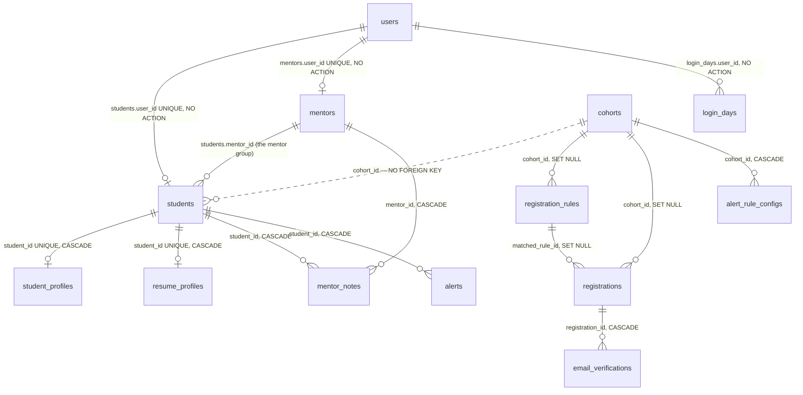
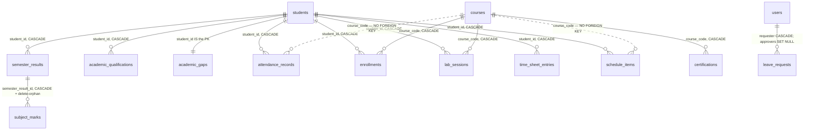
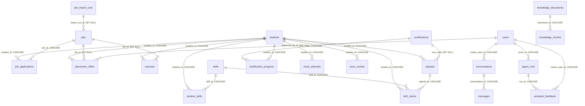

# Chapter 3 — The Data Model: Every Table, Column, Enum and Relationship

After this chapter you will be able to open a `psql` prompt against `reep_py` and write a
correct query against any of the 46 tables without opening a model file: you will know
what each table's grain is (one row per *what*), which column is the authoritative source
for any fact about a student, which values a status column can legally hold, what happens
to a row when its parent is deleted, and which columns are inert scaffolding that no code
ever writes. You will also know the modelling conventions precisely enough to add a new
model that looks like it was always part of the schema — the primary-key idiom, the
timestamp idiom, the enum idiom, the constraint-naming idiom, and the one registration
step that, if skipped, makes your table silently invisible to the migration tooling.

**In scope.** Every module in [`apps/api-py/app/models/`](../../apps/api-py/app/models) — all 31
of them, including the ones that declare a single table — the tables they declare, every
column, every enum, every index and constraint, and the invariants the database itself
enforces.

**Deferred.** The declarative `Base`, the engine and the session lifecycle belong to
Chapter 2 (`db.py`); this chapter uses `Base` but does not re-explain it. Alembic
mechanics — revision chains, autogenerate discipline, the `create_type` gotchas as a
*migration* practice — belong to Chapter 4; migration DDL is cited here only as evidence
of what a column's real nullability and server default are. The endpoints that read and
write these tables belong to Chapters 6 and 7; they appear here only where a rule lives in
the router rather than in the schema, which is more often than you would like. The trust
rules themselves are Chapter 1, §6 — this chapter shows the columns they are decided on.

**One word you will meet immediately.** REEP used to be a Next.js application with a
NestJS API, and its schema lived in a **Prisma** schema file — Prisma being the ORM that
stack used. That stack has been deleted; the Prisma schema is no longer anywhere in the
tree. But the port kept the model names, and most modules in `app/models/` open with a
docstring saying which Prisma model they came from (`ported from Prisma
\`TimeSheetEntry\``). Those docstrings are now the *only* surviving record of what a
column originally meant, which is why this chapter quotes so many of them.

---

## 1. How a model is written in this codebase

### The base, and what its bareness implies

Every model in REEP inherits from a single declarative base, and the whole of it is two
lines:

```python
class Base(DeclarativeBase):
    pass
```

— [app/db.py:16-17](../../apps/api-py/app/db.py#L16-L17). This is SQLAlchemy 2.0 declarative
style, and it is deliberately bare: there is no
`metadata = MetaData(naming_convention=...)`. That absence is load-bearing for everything
you will read below, so it is worth knowing what was declined.

SQLAlchemy lets you hang a `naming_convention` dict on the `MetaData` object that a `Base`
carries. It is a set of templates — `"ix": "ix_%(column_0_label)s"`,
`"uq": "uq_%(table_name)s_%(column_0_name)s"`, and so on — and SQLAlchemy applies them to
derive a name for any index or constraint you declare *without* one. Set it once and every
future constraint is named consistently, forever, without anybody typing a name.

REEP's `Base` has no such dict. So an unnamed constraint falls back to whatever SQLAlchemy
or Postgres computes for it: `ix_users_email` for an inline `index=True` on
`users.email`, `students_user_id_key` for a bare column `unique=True`. Those names are
*predictable*, but they are not *chosen* — nobody decided them, and nothing stops a future
column rename from silently changing them. The codebase's response is to choose instead:
**every multi-column index and every named constraint spells its name out** in a
`__table_args__` tuple — an index as the first positional argument to `Index(...)`, a
constraint as the `name=` keyword. When you see `Index("ix_mentornote_student_meeting", …)`
you are looking at a compensation for a `MetaData` that was left plain.

### The package shape and the one rule that must not be skipped

Model modules live in `app/models/` as one module per domain slice — 31 modules, some
holding a single table, some holding four. `app/models/__init__.py` is not a convenience
re-export; it is a **registry**:

```python
# Importing the model modules registers them on Base.metadata (for create_all
# and Alembic autogenerate). Add new model modules here as the schema grows.
from . import academic_history  # noqa: F401
```

— [app/models/\_\_init\_\_.py:1-3](../../apps/api-py/app/models/__init__.py#L1-L3), followed by
30 more identical lines in alphabetical order, ending at
[line 33](../../apps/api-py/app/models/__init__.py#L33).

The mechanism is worth spelling out, because the failure it prevents is silent. A model
class only lands on `Base.metadata` when the module that defines it is *executed* —
declaring `class TimeSheetEntry(Base)` is what registers the table, and that statement
only runs on import. Other modules do import individual slices directly (`from
.models.academics import SemesterResult` at
[app/seed.py:30](../../apps/api-py/app/seed.py#L30); `from .models.conversation import
Conversation, Message` at [app/assistant/conversations.py:17](../../apps/api-py/app/assistant/conversations.py#L17);
the same in `app/assistant/knowledge_base.py`, `app/platform/mailer.py`, `app/retention.py` and every router). And
because importing *any* submodule of a package runs that package's `__init__.py` first,
any one of those imports drags in all 31 modules. That is the trick: this file is the
single door, and every entrance leads through it.

Alembic walks through that door deliberately.
[migrations/env.py:8](../../apps/api-py/migrations/env.py#L8) is
`import app.models  # noqa: F401  — registers every model on Base.metadata`, and
[line 19](../../apps/api-py/migrations/env.py#L19) is `target_metadata = Base.metadata`. Those
two lines are the whole connection between this registry and the migration tooling.

A new model module that is *not* listed in the registry therefore never executes, never
registers, and is absent from the metadata Alembic diffs against the live database. Its
table is never created by `alembic revision --autogenerate` — and worse, because
autogenerate compares metadata against what actually exists, an unregistered module whose
table already exists in the database can produce a migration that **drops** it. The
`# noqa: F401` comments are therefore not lint noise to be tidied away; they are what
stops a linter from deleting the registry.

> **Why it is like this.** The registry comment's mention of `create_all` is stale — grep
> the repo and `Base.metadata.create_all` appears only in that comment and in the docstring
> at [app/db.py:4](../../apps/api-py/app/db.py#L4). No call site exists anywhere in `app/`,
> `tests/` or `migrations/`. Alembic is the sole DDL path in this repo, which matters for
> the enum discussion in §6: model-level DDL never runs, so model-level DDL flags never
> take effect.

Chapter 2 owns this registry as a *discipline*; §9 below restates it as a rule with its
failure mode.

### The canonical model

Here is one complete module, reproduced byte for byte, because it exhibits every
convention at once:

```python
"""Time sheet — minutes per calendar day per activity bucket (ported from Prisma
`TimeSheetEntry`). One row per (student, day, activity); the day is a date, not
an instant, so a bucket can't shift across a timezone change.
"""

import enum
import uuid
from datetime import date, datetime

from sqlalchemy import (
    Date,
    DateTime,
    Enum,
    ForeignKey,
    Index,
    Integer,
    String,
    UniqueConstraint,
    func,
)
from sqlalchemy.orm import Mapped, mapped_column

from ..db import Base


def _uuid() -> str:
    return uuid.uuid4().hex


class DayActivity(str, enum.Enum):
    SLEEPING = "SLEEPING"
    LEISURE = "LEISURE"
    LECTURES = "LECTURES"
    COURSEWORK = "COURSEWORK"
    SKILLING = "SKILLING"


class TimeSheetEntry(Base):
    __tablename__ = "time_sheet_entries"
    __table_args__ = (
        UniqueConstraint("student_id", "day", "activity", name="uq_timesheet"),
        Index("ix_timesheet_student_day", "student_id", "day"),
    )

    id: Mapped[str] = mapped_column(String, primary_key=True, default=_uuid)
    student_id: Mapped[str] = mapped_column(ForeignKey("students.id", ondelete="CASCADE"))
    day: Mapped[date] = mapped_column(Date)
    activity: Mapped[DayActivity] = mapped_column(Enum(DayActivity, name="day_activity"))
    minutes: Mapped[int] = mapped_column(Integer)
    created_at: Mapped[datetime] = mapped_column(DateTime(timezone=True), server_default=func.now())
    updated_at: Mapped[datetime] = mapped_column(
        DateTime(timezone=True), server_default=func.now(), onupdate=func.now()
    )
```

— [app/models/timesheet.py:1-53](../../apps/api-py/app/models/timesheet.py#L1-L53), the whole
file, including the one-import-name-per-line style of the `from sqlalchemy import (…)`
block at [lines 10-20](../../apps/api-py/app/models/timesheet.py#L10-L20). Read it as a
skeleton, in order:

1. **A docstring that states the grain and one rationale.** "One row per (student, day,
   activity)" is the grain. "the day is a date, not an instant, so a bucket can't shift
   across a timezone change" is the rationale — an entry logged at 23:00 IST must not
   migrate to the previous day's bucket when read as UTC. Most modules also name the
   Prisma model they were ported from, which is the fastest way to trace a column back to
   its pre-migration meaning; since the Prisma schema itself is gone from the tree, the
   docstring is the only record left.
2. **A flat import of only the SQLAlchemy constructs used**, one name per line when the
   list is long enough to wrap, then `from ..db import Base`.
3. **A module-private `_uuid()`.** It is redefined, verbatim, in every one of the 31
   modules. There is no shared helper.
4. **Enums**, declared in the module that first needs them.
5. **The model class**, with `__tablename__` then `__table_args__` then columns.

### Primary keys: 32 hex characters, generated in Python

Every primary key in REEP except three is:

```python
id: Mapped[str] = mapped_column(String, primary_key=True, default=_uuid)
```

Three facts follow that a query author must internalise.

**First, the value is `uuid.uuid4().hex`** — 32 lowercase hex characters, **no dashes** —
stored in an unbounded `VARCHAR`, not a Postgres `uuid` column. Postgres therefore does no
format validation, and ids compare as text rather than as a 16-byte integer. Why a text
column rather than the native `uuid` type is not explained anywhere in the repo; see the
uncertainty section at the end of this chapter.

**Second, `default=_uuid` is a Python-side default evaluated at flush** — and "flush" is
the word carrying the whole mechanism, so: a *flush* is the moment SQLAlchemy turns the
pending objects sitting in a session into actual `INSERT` statements on the database
connection. It happens when you call `db.flush()`, and automatically just before
`db.commit()` or before any query that might be affected by pending changes. Python-side
defaults are evaluated at that moment, not at `Model(...)` construction time. So a freshly
constructed object has `id is None`. And because no migration emits a server default for
`id`, a raw `INSERT` that omits `id` fails the NOT NULL check outright — the ORM is the
only thing filling it in.

**Third, because the id does not exist before the flush, code that needs a parent's id to
build a child must flush between them** — which is why the seed reads

```python
            db.add(user)
            db.flush()
            stu = Student(user_id=user.id)
            db.add(stu)
```

at [app/seed.py:96-99](../../apps/api-py/app/seed.py#L96-L99). Note that `Student` is
constructed with nothing but the foreign key: every other student fact hangs off a later
flush. The test fixture does the identical dance at
[tests/conftest.py:90-93](../../apps/api-py/tests/conftest.py#L90-L93), creating the `Student`
only when the role is `STUDENT`.

The three exceptions are natural or borrowed keys: `Course.code`
([course.py:55](../../apps/api-py/app/models/course.py#L55), e.g. `22MBA11`),
`Certification.code` ([certification.py:34](../../apps/api-py/app/models/certification.py#L34),
e.g. `CERT-22MBA11-LEAD`), and `AcademicGap.student_id`, where the foreign key *is* the
primary key:

```python
    # One row per student — student_id IS the primary key.
    student_id: Mapped[str] = mapped_column(
        ForeignKey("students.id", ondelete="CASCADE"), primary_key=True
    )
```

— [academic_history.py:50-53](../../apps/api-py/app/models/academic_history.py#L50-L53). That
choice makes `db.get(AcademicGap, student_id)` the canonical lookup and makes a second gap
row structurally impossible.

### Nullability, defaults and timestamps

Nullability is expressed through the **type annotation**, not through `nullable=`:
`Mapped[str]` is NOT NULL, `Mapped[str | None]` is nullable. Where the author wants it
obvious at a glance, the redundant `nullable=True` is passed as well — e.g.
[user.py:63](../../apps/api-py/app/models/user.py#L63).

Timestamps are uniformly `DateTime(timezone=True)` (`TIMESTAMPTZ`) and follow a two-part
idiom: `created_at` carries `server_default=func.now()`, and a row that can be edited also
carries `updated_at` with `server_default=func.now(), onupdate=func.now()`. The
`onupdate` is **not** a database trigger — it is a SQLAlchemy clause appended to the SET
list of UPDATE statements the ORM emits. A `psql` fixup of `student_profiles` leaves
`updated_at` stale and nothing in the schema notices.

Two tables deliberately break the timestamp idiom. `LoginDay` has no timestamp at all —
its `day: Mapped[date] = mapped_column(Date)` *is* the time dimension
([user.py:87-101](../../apps/api-py/app/models/user.py#L87-L101)). And `Conversation`/`Message`
add a **Python-side** default on top of the server default:

```python
def _now() -> datetime:
    # Python-side default so every row gets a distinct, microsecond-precise
    # timestamp — messages within one request order deterministically.
    return datetime.now(timezone.utc)
```

— [conversation.py:38-41](../../apps/api-py/app/models/conversation.py#L38-L41).

> **Why it is like this.** `func.now()` is the *statement* timestamp: every row inserted
> in one transaction shares it. A user turn and the assistant turn answering it are
> written in one request, so with only a server default `ORDER BY created_at` could
> replay them in either order. The Python default gives each row a distinct microsecond.

### Foreign keys and `ondelete`

FKs are declared inline on the column, never in `__table_args__`:

```python
    student_id: Mapped[str] = mapped_column(ForeignKey("students.id", ondelete="CASCADE"))
```

The house policy is sharp and nearly exceptionless:

- **`ondelete="CASCADE"`** for a child that has no meaning without its parent. Every
  `student_id` FK in the schema cascades, so deleting a `students` row destroys that
  student's entire record — results, marks, attendance, enrolments, sessions, timesheets,
  uploads, claims, offers, resumes.
- **`ondelete="SET NULL"`** for a reference to a *person* or an optional peer, so history
  survives the deletion of the thing it pointed at: `mock_attempts.evaluator_user_id`,
  `swoc_entries.author_user_id`, `placement_offers.approved_by_id`,
  `leave_requests.first_approver_user_id` / `second_approver_user_id`,
  `jobs.import_run_id`, `placement_offers.job_id`, `resumes.job_id`, `uploads.cert_code`,
  `registrations.cohort_id`, `registrations.matched_rule_id`,
  `registration_rules.cohort_id`.
- **No `ondelete` at all** — meaning Postgres `NO ACTION` — on four FKs, all in
  `user.py`: `students.user_id`, `mentors.user_id`, `login_days.user_id` and
  `students.mentor_id` ([user.py:61,65,82,98](../../apps/api-py/app/models/user.py#L61-L98)).
  Deleting a `users` row that still has any satellite raises a foreign-key violation. The
  test teardown is written to respect exactly this ordering —
  `Conversation`, then `LoginDay`, then `Student`, then `User`
  ([tests/conftest.py:106-112](../../apps/api-py/tests/conftest.py#L106-L112)). Delete a `User`
  first and the transaction aborts.

A third category exists and matters: the **plain-String soft reference**, a column that
holds another row's id but carries no FK. Two distinct reasons are given in the code. The
first is auditing: `uploads.reviewed_by_id` is annotated "A plain column (audit stamp),
not a relation — the row is never queried by reviewer"
([upload.py:67-68](../../apps/api-py/app/models/upload.py#L67-L68)), and the same phrasing
recurs on `skill_claims.reviewed_by_id`, `job_import_runs.uploaded_by_id`
([job_import_run.py:8-9](../../apps/api-py/app/models/job_import_run.py#L8-L9)) and
`registrations.reviewed_by_id`. An FK would either block deleting a staff account or null
out the record of who approved an admission. The second reason is deliberate decoupling —
`registrations.approved_student_id` is "A string, not a relation"
([registration.py:111-112](../../apps/api-py/app/models/registration.py#L111-L112)) so that
deleting a provisioned student cannot resurrect a pending application.

### Relationships are rare, and that is a decision

Across all 31 modules there are exactly **thirteen** `relationship()` declarations, in five
modules: `user.py` (six), `academics.py` (two), `conversation.py` (two), `knowledge.py`
(two), `skill.py` (one). Every one except `StudentSkill.skill`
([skill.py:67](../../apps/api-py/app/models/skill.py#L67), which is a bare
`relationship()` with no reverse side) uses `back_populates` on both ends. `backref`
appears nowhere. The rule is stated in a docstring:

> No ORM relationship back to Student is declared on purpose: callers resolve a
> profile by student_id directly, which keeps the cross-module mapper simple.

— [profile.py:4-5](../../apps/api-py/app/models/student_profile.py#L4-L5). That is why 26 of the 31
modules declare no relationships at all despite having foreign keys: every caller writes
an explicit `select(X).where(X.student_id == student_id)`. In particular **`Mentor` has no
`students` collection** — the mentee set is only ever reached through the raw column
`Student.mentor_id`.

Four of the thirteen are *collections* (one-to-many). Three of the four carry
`cascade="all, delete-orphan"` — an ORM-side delete layered on top of the database-side
`ON DELETE CASCADE` — and the fourth carries no `cascade=` at all:

| Collection | Declared at | Extra arguments |
|---|---|---|
| `SemesterResult.subjects` | [academics.py:47-51](../../apps/api-py/app/models/academics.py#L47-L51) | `cascade="all, delete-orphan"`, `order_by="SubjectMark.subject_code"` |
| `Conversation.messages` | [conversation.py:97-99](../../apps/api-py/app/models/conversation.py#L97-L99) | `cascade="all, delete-orphan"` |
| `KnowledgeDocument.chunks` | [knowledge.py:74-78](../../apps/api-py/app/models/knowledge.py#L74-L78) | `cascade="all, delete-orphan"`, `passive_deletes=True` |
| `User.login_days` | [user.py:54](../../apps/api-py/app/models/user.py#L54) | **none** — a bare `relationship(back_populates="user")` |

`User.login_days` is the outlier worth remembering, and the two omissions compound: the
relationship passes no `cascade=`, so it keeps SQLAlchemy's default (`save-update, merge`)
and never issues a `DELETE` of its own, *and* `login_days.user_id`
([user.py:98](../../apps/api-py/app/models/user.py#L98)) carries no `ondelete`, so the
database will not remove the children either — deleting a `users` row that still has login
days is refused outright, as the deletion order in §8 records.

`delete-orphan` means: if you remove a child from the parent's Python list, SQLAlchemy
issues a `DELETE` for it even though nobody deleted the parent. `passive_deletes=True` —
used only on `KnowledgeDocument.chunks`, the single occurrence in the schema
([knowledge.py:77](../../apps/api-py/app/models/knowledge.py#L77)) — tells SQLAlchemy *not* to
load the child rows into memory in order to delete them one by one, and to let the
database's own `ON DELETE CASCADE` do the work. Without it, deleting a document with a
thousand chunks issues a `SELECT` for all thousand and then a thousand `DELETE`s.

### The skeleton for a new model

```python
"""<Thing> — <one line saying what it records and its grain>.
<One paragraph of rationale: why it is shaped this way, or what it must not do.>
"""

import enum
import uuid
from datetime import datetime

from sqlalchemy import DateTime, Enum, ForeignKey, Index, String, UniqueConstraint, func
from sqlalchemy.orm import Mapped, mapped_column

from ..db import Base


def _uuid() -> str:
    return uuid.uuid4().hex


class ThingStatus(str, enum.Enum):
    DRAFT = "DRAFT"


class Thing(Base):
    __tablename__ = "things"
    __table_args__ = (
        UniqueConstraint("student_id", "code", name="uq_thing"),
        Index("ix_thing_student_created", "student_id", "created_at"),
    )

    id: Mapped[str] = mapped_column(String, primary_key=True, default=_uuid)
    student_id: Mapped[str] = mapped_column(ForeignKey("students.id", ondelete="CASCADE"))
    status: Mapped[ThingStatus] = mapped_column(
        Enum(ThingStatus, name="thing_status"), default=ThingStatus.DRAFT, server_default="DRAFT"
    )
    created_at: Mapped[datetime] = mapped_column(DateTime(timezone=True), server_default=func.now())
```

(Wrap the `from sqlalchemy import (…)` list one name per line if it grows past the line
limit, as `timesheet.py`, `skill.py`, `job.py`, `course.py`, `certification.py`,
`conversation.py`, `feedback.py`, `knowledge.py` and `academics.py` all do.)

…and then add `from . import thing  # noqa: F401` to `models/__init__.py`, in alphabetical
position.

---

## 2. Identity and organisation

Eleven tables carry who a person is and how they are grouped: `users`, `students`,
`mentors` and `login_days` (all in `user.py`), `student_profiles`, `resume_profiles`,
`cohorts`, `mentor_notes`, and the sign-up cluster `registrations` / `registration_rules`
/ `email_verifications`.

### The role enum, and why a role is not an identity

```python
class Role(str, enum.Enum):
    STUDENT = "STUDENT"
    MENTOR = "MENTOR"
    DIRECTOR = "DIRECTOR"
    ADMIN = "ADMIN"
```

— [user.py:23-27](../../apps/api-py/app/models/user.py#L23-L27), PG type `role`. Alongside it
sits `Stage` (PG type `stage`) whose docstring reads "The REEP developmental stages, in
order": REBOOT, EXCEL, EXCEL_ADVANCED, ELEVATE
([user.py:30-36](../../apps/api-py/app/models/user.py#L30-L36)).

The crucial modelling fact: **`users.role` and the satellite rows are independent facts.**
`Student` and `Mentor` are each a 1:1 satellite of `users` via a UNIQUE `user_id`. A user
with `role='MENTOR'` and no `mentors` row is perfectly representable, as is
`role='STUDENT'` with no `students` row — the seed and tests create the satellite
explicitly and conditionally
([tests/conftest.py:90-93](../../apps/api-py/tests/conftest.py#L90-L93) creates the `Student`
only when the role is STUDENT).

### How a mentor group is expressed — the substrate of Rule 2

**A mentor group is not a table.** There is no `mentor_groups`, no association table, and
no `Mentor.students` relationship. The group of mentor `M` is exactly the set
`{s ∈ students : s.mentor_id == M.id}` — the reverse of one nullable column,
`students.mentor_id`, which is an FK to `mentors.id` with no `ondelete` and, notably,
**no index**.

Login materialises the link into the session JWT: `_payload_for(user)` always sets
`userId/email/name/role`, and adds `studentId` only when `user.student is not None` and
`mentorId` only when `user.mentor is not None`
([api/account/sign_in.py:29-40](../../apps/api-py/app/api/account/sign_in.py#L29-L40)). `get_current_session`
merely decodes that cookie ([app/platform/identity.py:8-13](../../apps/api-py/app/platform/identity.py#L8-L13)), so the
whole scope decision runs off a payload **frozen at login**: creating a `mentors` row for
an already-signed-in MENTOR grants no scope until they sign in again.

Rule 2 is then decided in the mentor router on exactly these columns:

```python
    if session["role"] == "MENTOR":
        mentor_id = session.get("mentorId")
        if not mentor_id:
            return []  # no Mentor group => nobody (never the whole programme)
        query = query.where(Student.mentor_id == mentor_id)
```

— [api/mentor/mentees.py:52-56](../../apps/api-py/app/api/mentor/mentees.py#L52-L56), with the per-row
form in `_assert_can_access_student`
([mentor.py:72-84](../../apps/api-py/app/api/mentor/mentees.py#L72-L84)), which refuses with **404**
— not 403 — so an out-of-group student id cannot be probed for existence. Note the two
distinct "sees nobody" states that collapse to the same outcome: a MENTOR-role user with
no `mentors` row (no `mentorId` in the session, early `return []`), and a MENTOR *with* a
row that no student points at (the WHERE matches nothing). See Chapter 1, §6 for the rule
itself and Chapter 5 for the guard functions.

### Table-by-table reference

**`users`** — [user.py:39-54](../../apps/api-py/app/models/user.py#L39-L54)

| Column | Type | Null | Default | Notes |
|---|---|---|---|---|
| `id` | VARCHAR | no | `_uuid` (Python) | PK |
| `email` | VARCHAR | no | — | `unique=True, index=True` → unique index `ix_users_email` |
| `name` | VARCHAR | no | — | |
| `role` | `role` enum | no | `Role.STUDENT` (Python only) | **no server default** — a raw INSERT omitting it fails |
| `password_hash` | VARCHAR | no | — | `"scrypt:<salt_hex>:<digest_hex>"` — byte-compatible with the retired Next.js app "so migrated hashes verify without a reset" ([user.py:46-47](../../apps/api-py/app/models/user.py#L46-L47)) |
| `last_login_at` | TIMESTAMPTZ | yes | — | |
| `created_at` | TIMESTAMPTZ | no | `now()` | |

Relationships: `student`, `mentor` (both `uselist=False`), `login_days`. No
`__table_args__`; the only index is the inline one on `email`.

**`students`** — [user.py:57-75](../../apps/api-py/app/models/user.py#L57-L75)

| Column | Type | Null | Default | Notes |
|---|---|---|---|---|
| `id` | VARCHAR | no | `_uuid` | PK |
| `user_id` | VARCHAR | no | — | FK `users.id`, **UNIQUE**, no `ondelete` |
| `usn` | VARCHAR | yes | — | UNIQUE |
| `cohort_id` | VARCHAR | yes | — | **plain String, not an FK** — `# FK to Cohort later` |
| `mentor_id` | VARCHAR | yes | — | FK `mentors.id`, no `ondelete`, **no index**; the FK itself is hand-named `fk_students_mentor` in [9ac9f4696b0d:45](../../apps/api-py/migrations/versions/9ac9f4696b0d_student_core_fields_usn_stage_semester.py#L45) |
| `current_stage` | `stage` enum | no | `EXCEL` / `'EXCEL'` | note: not the first member, REBOOT |
| `current_semester` | INTEGER | no | `1` / `'1'` | |
| `enrolled_at` | TIMESTAMPTZ | no | `now()` | |
| `weekly_hour_target` | DOUBLE | no | `12` / `'12'` | read by `GET /student/timesheet` |

> **Why it is like this.** The comment above `usn` reads "Nullable / server-defaulted so
> the column adds cleanly onto existing rows"
> ([user.py:62](../../apps/api-py/app/models/user.py#L62)). The entire block from `usn` to
> `weekly_hour_target` was added to a live `students` table by `op.add_column`, and every
> column in it is either nullable or server-defaulted for that reason alone.

**`mentors`** — [user.py:78-84](../../apps/api-py/app/models/user.py#L78-L84): `id` (VARCHAR
NOT NULL, PK, `_uuid`) and `user_id` (VARCHAR NOT NULL, FK `users.id` with no `ondelete`,
**UNIQUE**) and nothing else. No `__table_args__`, no indexes beyond the implicit unique.
A Mentor row carries **no data of its own**; it exists purely as an identity anchor that
`students.mentor_id` can point at and that the session can stamp as `mentorId`.

**`login_days`** — [user.py:87-101](../../apps/api-py/app/models/user.py#L87-L101): `id`
(VARCHAR NOT NULL, PK); `user_id` (VARCHAR NOT NULL, FK `users.id`, no `ondelete`); `day`
(**`DATE`** NOT NULL — a true calendar date, not a timestamp). Constraint:
`UniqueConstraint("user_id", "day", name="uq_login_day")`. No indexes.

> **Why it is like this.** "The day is the local calendar date (matching the Next.js app),
> so an evening sign-in is not bucketed onto the next UTC day."
> ([user.py:90-91](../../apps/api-py/app/models/user.py#L90-L91)) The claim is executed at
> [api/account/sign_in.py:56-58](../../apps/api-py/app/api/account/sign_in.py#L56-L58), which deliberately
> uses naive `datetime.now()` for the streak bucket — three lines after using
> `datetime.now(timezone.utc)` for `last_login_at` at
> [auth.py:54-55](../../apps/api-py/app/api/account/sign_in.py#L54-L55).

**`student_profiles`** — [profile.py:22-56](../../apps/api-py/app/models/student_profile.py#L22-L56).
One row per student, enforced by `student_id` (VARCHAR NOT NULL, FK CASCADE, `unique=True`).
Then:

- **Seven nullable VARCHARs**: `phone`, `email`, `linkedin_url`, `github_url`,
  `portfolio_url`, `city`, `career_summary`. Note that `email` here is a *contact* address
  distinct from `users.email` and carries no unique constraint.
- **Four NOT NULL Booleans**, three of them under the comment "Placement policy:
  placement_eligible is ADMIN-set (read-only to the student); the interest flags are the
  student's own": `placement_eligible`, `interested_in_jobs`, `interested_in_internships`
  all default `True` ([profile.py:40-42](../../apps/api-py/app/models/student_profile.py#L40-L42)), and
  `leaderboard_opt_out` defaults `False`
  ([profile.py:52](../../apps/api-py/app/models/student_profile.py#L52)). None has a `server_default`.
- **Five NOT NULL JSONB list columns**, each `default=list`: `education`, `experience`,
  `projects`, `skills`, `achievements`
  ([profile.py:45-49](../../apps/api-py/app/models/student_profile.py#L45-L49)).
- `photo_upload_id` (VARCHAR, nullable — a plain String id, **not** an FK).
- `updated_at` (TIMESTAMPTZ NOT NULL, `server_default=func.now()`, `onupdate=func.now()`).

No `__table_args__`; the only index is the implicit unique on `student_id`.

Two traps. First, **nine of those columns are NOT NULL with a Python-side default only** —
the four Booleans and the five JSONB lists. The migration declares each of them
`nullable=False` with no DEFAULT
([4e4ac34a89a7_student_profiles.py:31-38](../../apps/api-py/migrations/versions/4e4ac34a89a7_student_profiles.py#L31-L38)
for the first eight, and
[line 40](../../apps/api-py/migrations/versions/4e4ac34a89a7_student_profiles.py#L40) for
`leaderboard_opt_out`; line 39 in between is `photo_upload_id`, which *is* nullable). So a
raw `INSERT` or bulk load that omits any of the nine fails.

Second, the "ADMIN-set" rule on `placement_eligible` is enforced **by omission, not by a
constraint**: `ProfileUpdateIn`
([api/student/self_service.py:793-807](../../apps/api-py/app/api/student/self_service.py#L793-L807)) simply does
not declare the field — the handler's own docstring says "placement_eligible is admin-set
and intentionally absent from the editable set"
([student.py:815-816](../../apps/api-py/app/api/student/self_service.py#L815-L816)) — and the update
applies `model_dump(exclude_unset=True)` via `setattr`. Add the field to that schema and
any student can mark themselves placement-eligible. (`skills` is likewise absent from
`ProfileUpdateIn`, though nothing documents that omission as deliberate.)

**`cohorts`** — [cohort.py:20-32](../../apps/api-py/app/models/cohort.py#L20-L32): `id` (VARCHAR
NOT NULL, PK); `code` (VARCHAR NOT NULL, **UNIQUE**, `# e.g. MBA-2026-B`); `name` (VARCHAR
NOT NULL); `batch_label` (VARCHAR NOT NULL, `# e.g. 2024-26`); `degree_level` (the shared
`degree_level` enum, NOT NULL); `start_date` and `end_date` (both NOT NULL and both
**`DateTime(timezone=True)` despite the `_date` suffix**); `created_at` (TIMESTAMPTZ NOT
NULL, `now()`). No relationships, no `__table_args__`, no indexes.

The structural gap here is worth naming plainly: **`students.cohort_id` is not a foreign
key.** No migration ever adds one. Deleting a cohort therefore orphans student rows with
no error. And because `Student.cohort_id` is nullable, the leaderboard roster query
`where(Student.cohort_id == me.cohort_id)`
([api/student/self_service.py:1721](../../apps/api-py/app/api/student/self_service.py#L1721)) renders as
`WHERE students.cohort_id IS NULL` for a cohort-less student — pooling every unassigned
student into one pseudo-cohort ranked against each other.

**`registration_rules`** — [registration.py:45-72](../../apps/api-py/app/models/registration.py#L45-L72).
Index: `ix_regrule_enabled_priority` on `(enabled, priority)`. Columns: `id` (VARCHAR NOT
NULL, PK); `name` (VARCHAR NOT NULL); `enabled` (BOOLEAN NOT NULL, default/server `true`);
`email_domain` (VARCHAR, nullable — "Null means 'any domain'"); `usn_pattern` (VARCHAR,
nullable — a regex); `degree_level` (enum, **nullable**); `cohort_id` (VARCHAR, nullable,
FK `cohorts.id` SET NULL); `auto_approve` (BOOLEAN NOT NULL, default/server `false`);
`priority` (INTEGER NOT NULL, default/server `100`); `created_at` (TIMESTAMPTZ NOT NULL,
`now()`).

> **Why it is like this.** "The conditions live in data so the admissions office can
> change them between intakes without a deploy. All populated conditions must match; the
> lowest `priority` among the matches decides."
> ([registration.py:46-49](../../apps/api-py/app/models/registration.py#L46-L49)) And on
> `auto_approve`: "False means 'matched, and still send it to a human' — a rule can route
> and label an application without approving it."
> ([registration.py:67-68](../../apps/api-py/app/models/registration.py#L67-L68))

**`registrations`** — [registration.py:75-117](../../apps/api-py/app/models/registration.py#L75-L117).
Index: `ix_registration_status_created` on `(status, created_at)`. Columns: `id` (VARCHAR
NOT NULL, PK); `name` (VARCHAR NOT NULL); `email` (VARCHAR NOT NULL, **UNIQUE** — one
application per address); `usn` and `phone` (VARCHAR, both nullable); `degree_level` (enum
NOT NULL, server default `'PG'`); `cohort_id` (VARCHAR, nullable, FK SET NULL — "an
applicant may not know; a rule or a reviewer assigns it"); `status` (`registration_status`
enum NOT NULL, server default `'DRAFT'`); `matched_rule_id` (VARCHAR, nullable, FK
`registration_rules.id` SET NULL); `decision_reason` (VARCHAR, nullable);
`email_verified_at` (TIMESTAMPTZ, nullable); `reviewed_by_id` (VARCHAR, nullable — a plain
audit stamp, no FK); `reviewed_at` (TIMESTAMPTZ, nullable); `review_note` (VARCHAR,
nullable); `approved_student_id` (VARCHAR, nullable — a plain String); `created_at` and
`updated_at` (TIMESTAMPTZ NOT NULL, `now()`, the latter with `onupdate`).

> **Why it is like this.** The module docstring is the densest rationale in the schema:
> "`Registration` has NO foreign key to `Student`. A Student cannot exist until a cohort
> is decided — which is the very thing approval decides — so the applicant lives in its
> own table until then, and the created student's id is written back to
> `approved_student_id` as a plain string breadcrumb (deleting the student must not
> resurrect a pending application)."
> ([registration.py:5-9](../../apps/api-py/app/models/registration.py#L5-L9))

**`email_verifications`** — [registration.py:120-137](../../apps/api-py/app/models/registration.py#L120-L137).
Index: `ix_emailverif_registration` on `(registration_id)`
([registration.py:128](../../apps/api-py/app/models/registration.py#L128)). Columns: `id`
(VARCHAR NOT NULL, PK); `registration_id` (VARCHAR NOT NULL, FK `registrations.id`
CASCADE); `token_hash` (VARCHAR NOT NULL, **UNIQUE**); `expires_at` (TIMESTAMPTZ NOT
NULL, no default); `consumed_at` (TIMESTAMPTZ, nullable); `created_at` (TIMESTAMPTZ NOT
NULL, `now()`).

> **Why it is like this.** "Only the hash of the token is stored — the token itself exists
> in the email and nowhere else, so a leaked dump of this table cannot confirm anybody's
> address. `consumed_at` is kept rather than the row deleted, so a second click can be
> told apart from an expired link and given the right message."
> ([registration.py:121-125](../../apps/api-py/app/models/registration.py#L121-L125))

**Unwired parts of this cluster, flagged.** `EmailVerification` is referenced by no router,
service or test — there is no endpoint that issues or consumes a verification token, and
`registrations.email_verified_at` is never written. `approved_student_id` is read back on
`RegistrationOut` but never written by any code. Two of the six `RegistrationStatus`
members are unreachable at runtime: `submit()` only assigns `PENDING_REVIEW` or
`AUTO_APPROVED`, `decide()` only `APPROVED` or `REJECTED`, leaving `DRAFT` as the column
default and `PENDING_VERIFICATION` assigned nowhere. The router states the omission is
deliberate — "Provisioning the actual Student (User row, cohort seat) is a deliberate
follow-up step, not done here"
([api/account/registration.py:10-13](../../apps/api-py/app/api/account/registration.py#L10-L13)) — so
there is currently **no code path that turns an approved Registration into a
`users`+`students` pair**. Outside the test fixtures (which build both directly at
[tests/conftest.py:84-93](../../apps/api-py/tests/conftest.py#L84-L93)), the only creator of
those rows is `app/seed.py`.

**`mentor_notes`** — [mentor_note.py:27-42](../../apps/api-py/app/models/mentor_note.py#L27-L42).
Indexes: `ix_mentornote_student_created` on `(student_id, created_at)` and
`ix_mentornote_student_meeting` on `(student_id, meeting_at)`
([mentor_note.py:30-31](../../apps/api-py/app/models/mentor_note.py#L30-L31)) — two indexes with
the same leading column, one per timestamp, because the notes list can be ordered either
way. Columns: `id` (VARCHAR NOT NULL, PK); `mentor_id` (VARCHAR NOT NULL, FK `mentors.id`
CASCADE); `student_id` (VARCHAR NOT NULL, FK `students.id` CASCADE); `note_text` (VARCHAR
NOT NULL, unbounded in the DB — the 4000-char ceiling is Pydantic-only); `linked_action`
(`mentor_action` enum NOT NULL, server default `'NONE'`); `meeting_at` (TIMESTAMPTZ NOT
NULL, `server_default=func.now()`); `created_at` (TIMESTAMPTZ NOT NULL, `now()`).

> **Why it is like this.** "meeting_at (when it happened) is distinct from created_at
> (when it was typed), since notes are often written up later."
> ([mentor_note.py:2-3](../../apps/api-py/app/models/mentor_note.py#L2-L3)) Both FKs cascade, so
> a note is treated as belonging to the mentor-student pair rather than as an audit
> artefact — the deliberate opposite of `Registration.reviewed_by_id`.

**`resume_profiles`** — [resume_profile.py:29-40](../../apps/api-py/app/models/resume_profile.py#L29-L40):
`id` (VARCHAR NOT NULL, PK); `student_id` (VARCHAR NOT NULL, FK CASCADE, **UNIQUE**);
`data` (JSONB NOT NULL, `default=dict, server_default="{}"`); `updated_at` (TIMESTAMPTZ
NOT NULL, `now()` + `onupdate`). Four columns, no `__table_args__`, and its docstring is
the clearest statement of the repo's blob-versus-columns rule: "the resume builder is
presentational, per-student, and never queried by inner field, so a blob keeps it flexible
(new sections need no migration) and the completeness score is computed on read.
Structured domain facts the builder also shows — semester results, certifications, uploads
— are NOT copied here."
([resume_profile.py:7-12](../../apps/api-py/app/models/resume_profile.py#L7-L12))

---

## 3. Academics

Eleven tables record what a student has studied and how they turned up.

### Where marks actually live, and what is derived

`semester_results` is one row per **(student, semester)**, and `subject_marks` is one row
per **(semester result, subject code)**. The split is the point:

> **Why it is like this.** "Internal and external are kept separate, not folded into
> total, because the diagnostic lives in the split."
> ([academics.py:2-3](../../apps/api-py/app/models/academics.py#L2-L3)) A student at 45 internal
> / 20 external has a completely different problem from 25/40, and a single `total` would
> erase it.

The one ORM collection in this whole area lives here:

```python
    subjects: Mapped[list["SubjectMark"]] = relationship(
        back_populates="semester_result",
        cascade="all, delete-orphan",
        order_by="SubjectMark.subject_code",
    )
```

— [academics.py:47-51](../../apps/api-py/app/models/academics.py#L47-L51). So `result.subjects`
is always sorted by subject code, and orphaned marks are deleted ORM-side on top of the
DB-side CASCADE.

Note what is **stored but not enforced**: `total` and `passed` are independent columns.
Nothing recomputes `total` from `internal + external`, there is no CHECK constraint tying
them, and no ingest path validates them. The seed happens to be consistent
(42+40=82, 38+36=74 at [seed.py:181-198](../../apps/api-py/app/seed.py#L181-L198)); that is
convention, not enforcement.

**Attendance percentage is never stored.** There is no percent column on
`attendance_records` and no cached aggregate on `students`. It is recomputed at read time
in three independent places: `GET /student/attendance` folds `(course_code, present)` into
a per-course `[present, total]` counter
([student.py:174-206](../../apps/api-py/app/api/student/self_service.py#L174-L206)); `GET /student/dashboard`
inlines its own version ([student.py:218-247](../../apps/api-py/app/api/student/self_service.py#L218-L247));
and `_attendance_pct(db, student_id)`
([student.py:1772-1779](../../apps/api-py/app/api/student/self_service.py#L1772-L1779)) is a third copy
whose docstring says it is "the same computation the dashboard/attendance uses". All three
return `0.0` when there are no records — never null — which is the hostile direction: a
brand-new student scores 0% and fails the attendance readiness factor.

**Prior-qualification percentage is likewise derived, twice, differently.**
`academic_qualifications` stores `marks` and `max_marks`, and
`GET /student/academics` computes `round(100 * q.marks / q.max_marks, 1)`
([student.py:518](../../apps/api-py/app/api/student/self_service.py#L518)) while the resume composer
computes `round(100 * q.marks / q.max_marks)` — integer rounding — at
[student.py:913](../../apps/api-py/app/api/student/self_service.py#L913).

**Gap months are stored explicitly and summed on read.** `academic_gaps` holds four
integer columns and no total; both readers sum them inline, and a student with **no**
`academic_gaps` row is treated as zero gap, never as unknown — so an undeclared gap passes
every gap gate.

> **Why it is like this.** "A gap over the criteria threshold is a common placement
> disqualifier, modelled explicitly rather than inferred."
> ([academic_history.py:3-4](../../apps/api-py/app/models/academic_history.py#L3-L4)) The team
> refused to compute gap months by subtracting qualification years: a declared gap is an
> auditable fact, an inferred one is a guess.

### Table-by-table reference

| Table | Grain — one row per… | Key columns | Constraints & indexes |
|---|---|---|---|
| `semester_results` | (student, semester) | `student_id` (FK CASCADE, `index=True`), `semester`, `sgpa`, `cgpa` (both **nullable**), `closed_backlogs`, `live_backlogs` (both NOT NULL, `default=0`, **no server default**), `marksheet_upload_id` (plain String, never read), `result_class` (free text, nullable), `published_on` (TIMESTAMPTZ, nullable) | `uq_semester_result(student_id, semester)`; `ix_semester_results_student_id` (Alembic-generated from the inline `index=True`) |
| `subject_marks` | (semester result, subject_code) | `semester_result_id` (FK CASCADE), `subject_code`, `subject_name`, `credits` (`default=4`), `internal` (`# out of 50 (VTU CBCS)`), `external` (`# out of 50`), `total`, `passed` — the last five all NOT NULL with **Python-only** defaults | `uq_subject_mark(semester_result_id, subject_code)`; no index |
| `academic_qualifications` | (student, prior qualification) | `student_id` (FK CASCADE), `level` (`qualification_level`), `institution`, `board` (nullable), `year`, `marks`, `max_marks` (`default=100`, server `'100'`), `medium`, `location`, `subjects` (free text, nullable) | `ix_acadqual_student_level` — **non-unique**: two TENTH rows are legal |
| `academic_gaps` | student (PK **is** the FK) | `twelfth_to_grad_mo`, `diploma_to_grad_mo`, `grad_to_pg_mo`, `other_mo` (all NOT NULL, `default=0, server_default="0"`) | PK on `student_id`; no timestamps, no indexes |
| `attendance_records` | (student, course_code, session_no) | `student_id` (FK CASCADE), `course_code` (**plain String, no FK**), `session_date` (TIMESTAMPTZ despite the `_date` suffix), `session_no`, `present` (BOOLEAN NOT NULL, `default=True` with **no server default** — see §8) | `uq_attendance(student_id, course_code, session_no)`, `ix_attendance_student_date`. No `created_at`. |
| `courses` | course in the curriculum | `code` **PK** (`# e.g. 22MBA11`), `name`, `stage` (reused `stage` enum), `dimension`, `semester`, `teaching_hours`, `self_learning_hours_required`, `model_type`, `duration_weeks`, `description` (nullable) | `ix_courses_stage` |
| `enrollments` | (student, course) | `student_id`, `course_code` (**real FK** to `courses.code`, CASCADE), `status` (`progress_status`, default **IN_PROGRESS**), `teaching_hours_attended`, `self_learning_hours_logged`, `lectures_attended`, `lectures_total`, `started_at`, `completed_at` (nullable) | `uq_enrollment`, `ix_enrollment_course` |
| `lab_sessions` | one check-in → check-out block | `student_id`, `course_code` (real FK), `module`, `activity`, `activity_note`, `mode`, `source`, `check_in_at`, `check_out_at`, `duration_min` (**null while open**), three `progress_*` floats, `mentor_confirmed`, `notes`, `created_at` | `ix_labsession_student_checkin`, `ix_labsession_course`; **no unique constraint** |
| `time_sheet_entries` | (student, day, activity) | `student_id`, `day` (**`Date`**), `activity` (`day_activity`), `minutes` (no default at all), `created_at`, `updated_at` | `uq_timesheet`, `ix_timesheet_student_day` |
| `leave_requests` | one leave request | `requester_user_id` (FK **users**, CASCADE), `from_date`, `to_date` (both real **`Date`**), `reason`, `status`, then two symmetric approver blocks `first_*` / `second_*` (`approver_user_id` FK SET NULL, `decision`, `decided_at`, `note` — all nullable), `created_at`, `updated_at` | `ix_leave_status_created`, `ix_leave_requester` |
| `schedule_items` | one calendar entry | `student_id`, `course_code` (**plain String**, nullable), `type` (shadows the builtin), `title`, `starts_at`, `location` (nullable) | `ix_schedule_student_starts` |

Three notes a query author needs.

**`courses.model_type` is named `model_type`, not `model`** — and no comment in the repo
gives the reason. A Pydantic `model_` protected-namespace collision is the obvious guess,
but it is only a guess, and `agent_runs.model`
([agent_run.py:46](../../apps/api-py/app/models/agent_run.py#L46)) is a plain column named
exactly `model`, which shows a bare `model` is not forbidden in this schema. Flagged in
the uncertainty section; do not repeat the rationale as fact.

**`lab_sessions.duration_min` is derived at check-out and then stored** —
`POST /student/checkout/{id}` sets `check_out_at` and `duration_min` together, guarded by
a 409 if the session is already closed.

**`lab_sessions.source` is decided by the server**: `POST /student/checkin` hard-codes
`CheckInSource.SELF_REPORTED` ([student.py:1241](../../apps/api-py/app/api/student/self_service.py#L1241))
so a client cannot forge a BADGE or LAB_PC check-in — which is the entire reason that enum
exists.

### The leave state machine

`leave_requests` is the only table in the schema that carries a multi-step workflow in the
row rather than in a child table:

> **Why it is like this.** "A request needs two distinct signatures: SUBMITTED ->
> FIRST_APPROVED (first approver) -> APPROVED (second). A rejection at either stage ->
> REJECTED. LeaveDecision has no PENDING: a null decision already says the approver has
> not looked yet." ([leave.py:2-5](../../apps/api-py/app/models/leave.py#L2-L5))

That last sentence is a modelling principle worth stealing: **nullability IS the pending
state**, so there is no redundant PENDING member that can drift out of step with a NULL.
The two-distinct-approver invariant lives entirely in
[api/mentor/leave.py](../../apps/api-py/app/api/mentor/leave.py) — the schema permits
`first_approver_user_id == second_approver_user_id`. The asymmetric `ondelete` is
deliberate: the requester CASCADEs (delete the account, delete their requests) while both
approvers SET NULL (a mentor leaving the institution must not erase the record of what was
approved). `LeaveStatus.CANCELLED` is declared and never assigned — there is no cancel
endpoint.

### What is actually writable

Of these eleven tables, only three are writable through the API: `lab_sessions`
(check-in/check-out/confirm), `time_sheet_entries` (`POST /student/timesheet`, an
upsert that **replaces** rather than accumulates), and `leave_requests`. Semester results,
subject marks, attendance records, enrolments, qualifications, gaps and schedule items are
created **only** by `python -m app.seed`. This matters because the eligibility engine's
most consequential inputs — CGPA, live backlogs, attendance — have no production write
path at all today, which in turn means a raw `COPY` is the realistic ingest route for
them, which in turn makes the Python-only defaults in §8 a live hazard rather than a
curiosity. The records screen states the intended policy: per-semester CGPA and
backlogs are "staff-imported and shown read-only, so they cannot mark their own backlogs
cleared to slip past an eligibility gate"
([academics.component.ts:6-8](../../apps/web/src/app/features/student/academics/academics.component.ts#L6-L8)).

---

## 4. Placement and career

Fifteen tables carry the jobs board, the offer funnel, and the artefacts a student
accumulates.

### The one thing that does not exist: an application status

You will look for an application status and not find one. **There is no application
status.** `job_applications` has six columns and none of them tracks progression:

```python
class JobApplication(Base):
    __tablename__ = "job_applications"
    __table_args__ = (
        UniqueConstraint("student_id", "job_id", name="uq_job_application"),
        Index("ix_jobapp_job", "job_id"),
    )

    id: Mapped[str] = mapped_column(String, primary_key=True, default=_uuid)
    student_id: Mapped[str] = mapped_column(ForeignKey("students.id", ondelete="CASCADE"))
    job_id: Mapped[str] = mapped_column(ForeignKey("jobs.id", ondelete="CASCADE"))
    applied_at: Mapped[datetime] = mapped_column(DateTime(timezone=True), server_default=func.now())
    self_reported: Mapped[bool] = mapped_column(Boolean, default=True, server_default="true")
    notes: Mapped[str | None] = mapped_column(String, nullable=True)
```

— [job.py:64-76](../../apps/api-py/app/models/job.py#L64-L76), the whole class. Applying is a
**boolean fact**: a row exists or it does not. There is no shortlisted/interviewed/rejected
progression anywhere in the schema. The only funnel state after "applied" is a
separately-created `PlacementOffer`, which the student records themselves and which
carries no link back to the application. `self_reported` is never set to anything but its
default, because no employer-side or import-side path creates an application.

### The eligibility verdict, and where each input comes from

`GET /student/jobs` ([student.py:545-631](../../apps/api-py/app/api/student/self_service.py#L545-L631))
is the single most consequential read in the product, and it is worth knowing exactly
which column each of its five inputs comes from:

| Input | Source | Derivation |
|---|---|---|
| skill match % | `skills.slug` joined through `student_skills` | `len(held & required) / len(required)`, or **100.0** when `required` is empty |
| latest CGPA | `semester_results.cgpa` | the row with the **highest `semester`** — `published_on` is never consulted |
| live backlogs | `semester_results.live_backlogs` | `coalesce(sum(...), 0)` **across all semesters**, inlined in the endpoint itself ([student.py:567-574](../../apps/api-py/app/api/student/self_service.py#L567-L574)) — `GET /student/jobs` does *not* call the `_live_backlogs` helper at [student.py:1792-1800](../../apps/api-py/app/api/student/self_service.py#L1792-L1800), which is the same query written a second time for the readiness / next-actions endpoints |
| gap months | `academic_gaps.*_mo` | the four columns summed inline; a missing row is 0 |
| the thresholds | `jobs.min_cgpa` / `max_live_backlogs`, else `placement_criteria` | per-posting override wins |

The override rule and the null rule are both written out:

```python
        # Per-posting override wins; else fall back to the active criteria.
        min_cgpa = j.min_cgpa if j.min_cgpa is not None else (crit.min_cgpa if crit else None)
        ...
        # A null CGPA is unassessed (not blocking); only an actual below-cutoff blocks.
        if min_cgpa is not None and latest_cgpa is not None and latest_cgpa < min_cgpa:
```

— [student.py:598-608](../../apps/api-py/app/api/student/self_service.py#L598-L608). Note `is not None`
rather than truthiness: `min_cgpa = 0.0` and `max_live_backlogs = 0` are the most common
real values, and truthiness would silently make a strict posting permissive. Note also
that `max_gap` comes only from the criteria — a job has no gap override
([student.py:605](../../apps/api-py/app/api/student/self_service.py#L605)).

`required_skills` on `jobs` is a Postgres **`varchar[]`** holding canonical `skills.slug`
values, denormalised on purpose. Note the type carefully before you hand-write a cast: the
column is declared `ARRAY(String)`
([job.py:49](../../apps/api-py/app/models/job.py#L49)) and emitted by the migration as
`sa.ARRAY(sa.String())`
([01c7bb72b68d:30](../../apps/api-py/migrations/versions/01c7bb72b68d_jobs_job_applications.py#L30)),
and a `String` with no length renders on PostgreSQL as `VARCHAR`, not `TEXT` — so the
declared type is `character varying[]`, and `::text[]` is a cast rather than the column's
own type.

> **Why it is like this.** "required_skills is denormalised onto the row (canonical
> Skill.slug values) so the match percentage is one query, not a fan-out."
> ([job.py:2-4](../../apps/api-py/app/models/job.py#L2-L4))

Nothing in the database enforces that the array holds real slugs — there is no FK from an
array element and no CHECK — so a typo in an imported sheet makes the posting match nobody,
silently and permanently.

### The offer lifecycle — the only real state machine on this path

```python
class OfferStatus(str, enum.Enum):
    DRAFT = "DRAFT"
    PENDING_APPROVAL = "PENDING_APPROVAL"
    APPROVED = "APPROVED"
    REJECTED = "REJECTED"
```

— [offer.py:40-44](../../apps/api-py/app/models/offer.py#L40-L44), PG type `offer_status`. Three
legal transitions, each guarded:

1. **DRAFT** — `POST /student/offers` constructs with an explicit `status=OfferStatus.DRAFT`
   even though that is the column default.
2. **DRAFT → PENDING_APPROVAL** — `POST /student/offers/{id}/submit`, 404 if not yours,
   409 "Only a draft offer can be submitted."
3. **PENDING_APPROVAL → APPROVED | REJECTED** — `POST /mentor/offers/{id}/decision`,
   guarded by `require_director` (not `require_mentor`), 409 "Only a pending offer can be
   decided.", and it writes `status`, `approved_by_id`, `decided_at` and `decision_note`
   as one unit ([api/mentor/mentees.py:285-318](../../apps/api-py/app/api/mentor/mentees.py#L285-L318)).

APPROVED and REJECTED are terminal, and there is **no offer-edit endpoint at all** — so
the offers screen's claim that a submitted draft is locked because "the backend refuses
edits after, so a report never reads a figure changed post-approval"
([offers.component.ts:6-7](../../apps/web/src/app/features/student/offers/offers.component.ts#L6-L7))
is true only because nothing was ever written to refuse. An APPROVED offer is also the
definition of "placed": `GET /director/overview` computes
`placed = count(distinct student_id) where status == APPROVED`
([api/director/programme_dashboard.py:65-72](../../apps/api-py/app/api/director/programme_dashboard.py#L65-L72)). Nothing else
sets a placed flag on `Student`.

### `placement_offers` — the widest table in the schema

[offer.py:47-91](../../apps/api-py/app/models/offer.py#L47-L91). One row per recorded offer,
**24 columns**, four of them enums. Because it is the biggest table on this path and the
one a placement report is built from, here it is in full:

| Column | Type | Null | Default | Notes |
|---|---|---|---|---|
| `id` | VARCHAR | no | `_uuid` | PK |
| `student_id` | VARCHAR | no | — | FK `students.id` **CASCADE** |
| `job_id` | VARCHAR | yes | — | FK `jobs.id` **SET NULL** — an off-campus offer has no posting |
| `role_type` | `offer_role_type` | no | — | FULL_TIME / FULL_TIME_PLUS_INTERNSHIP / INTERNSHIP |
| `job_title` | VARCHAR | no | — | free text, not a link to `jobs.title` |
| `organisation` | VARCHAR | no | — | free text, not a link to `jobs.company` |
| `channel` | `offer_channel` | no | `ON_CAMPUS` / `'ON_CAMPUS'` | |
| `joining_date` | TIMESTAMPTZ | yes | — | `_date` suffix, TIMESTAMPTZ type |
| `work_mode` | `offer_work_mode` | no | `ONSITE` / `'ONSITE'` | |
| `location` | VARCHAR | yes | — | |
| `ctc_inr` | INTEGER | no | `0` / `'0'` | whole rupees — never a Decimal |
| `fixed_gross_inr` | INTEGER | no | `0` / `'0'` | whole rupees |
| `bonuses` | JSONB | no | `list` (Python only) | **no server default** |
| `offer_letter_upload_id` | VARCHAR | yes | — | plain String, **not** an FK to `uploads` |
| `loi_upload_id` | VARCHAR | yes | — | plain String, **not** an FK to `uploads` |
| `job_description` | VARCHAR | yes | — | |
| `bond_details` | VARCHAR | yes | — | |
| `other_benefits` | VARCHAR | yes | — | |
| `status` | `offer_status` | no | `DRAFT` / `'DRAFT'` | the state machine above |
| `approved_by_id` | VARCHAR | yes | — | FK `users.id` **SET NULL** — the director who decided |
| `decided_at` | TIMESTAMPTZ | yes | — | written with `status` as one unit |
| `decision_note` | VARCHAR | yes | — | |
| `created_at` | TIMESTAMPTZ | no | `now()` | |
| `updated_at` | TIMESTAMPTZ | no | `now()` + `onupdate` | |

Index: `ix_offer_student_status` on `(student_id, status)`
([offer.py:49](../../apps/api-py/app/models/offer.py#L49)) — the shape of both "my offers" and
"pending decisions for this student". There is no unique constraint, so a student may
record two APPROVED offers; `GET /director/overview` counts `distinct student_id` for
exactly that reason.

The three other offer enums are `OfferRoleType` (FULL_TIME, FULL_TIME_PLUS_INTERNSHIP,
INTERNSHIP), `OfferChannel` (ON_CAMPUS, OFF_CAMPUS, POOL, REFERRAL) and `OfferWorkMode`
(REMOTE, ONSITE, HYBRID).

### Evidence, review and the skill promotion path

Three tables interlock. `uploads` holds file **metadata only**:

> **Why it is like this.** "Bytes live on disk under `stored_name`; only metadata is in
> the database, so the table stays small and the file store can move without a migration.
> A mentor reviews each one — PENDING_REVIEW -> VERIFIED / REJECTED — which is what makes
> a certificate proof or a profile photo count."
> ([upload.py:1-5](../../apps/api-py/app/models/upload.py#L1-L5))

`mime_type` and `size_bytes` are **server-determined** — sniffed from magic bytes by
`_sniff()` and measured with `len(content)` in
[app/platform/document_store.py:37-59](../../apps/api-py/app/platform/document_store.py#L37-L59) — so they are trustworthy
columns, unlike a client-supplied Content-Type. `stored_name` is a random `uuid4().hex +
ext` and UNIQUE: "Filename on disk. Random, so an uploaded name can never traverse a path"
([upload.py:57](../../apps/api-py/app/models/upload.py#L57)). See Chapter 2 for the document_store
itself.

`skill_claims` is the review workflow that turns evidence into a verified skill. It
**reuses** the `upload_status` PG enum rather than declaring a parallel one, and its
`upload_id` is NOT NULL — a claim without evidence is structurally impossible. Granting a
claim upserts `student_skills` at the granted level and points
`student_skills.evidence_upload_id` at the same upload
([api/mentor/mentees.py:537-597](../../apps/api-py/app/api/mentor/mentees.py#L537-L597)) — that path is
the **only** code outside `app/seed.py` that sets `student_skills.verified = True`, on
either branch of the upsert ([mentor.py:573](../../apps/api-py/app/api/mentor/mentees.py#L573)
for the insert, [mentor.py:579](../../apps/api-py/app/api/mentor/mentees.py#L579) for the
update). The seed is the one other writer: it hands the demo student a pre-verified `excel`
skill at [seed.py:265](../../apps/api-py/app/seed.py#L265), so a verified row on a seeded
database is not evidence that any claim was ever reviewed.

### Table-by-table reference

| Table | Grain | Notable columns | Constraints & indexes |
|---|---|---|---|
| `jobs` | one posting | `source_ref` UNIQUE nullable (import idempotency key), `title`, `company`, `degree_level`, `location`, `apply_url`, `description` (default `""`), `required_skills` `varchar[]` (`ARRAY(String)`, NOT NULL, Python-only default), `posted_on` (**no default at all**), `closes_on`, `min_cgpa`, `max_live_backlogs`, `import_run_id` (FK SET NULL), `created_at`, `updated_at` | none — no `__table_args__` |
| `job_applications` | (student, job) | `id`, `student_id`, `job_id`, `applied_at`, `self_reported`, `notes` | `uq_job_application`, `ix_jobapp_job` |
| `job_import_runs` | one bulk import | `file_name`, `uploaded_by_id` (plain audit stamp), `started_at`, `finished_at`, `rows_seen`/`rows_created`/`rows_updated`, `errors` JSONB `[{row, column, message}]` | `ix_jobimport_started` |
| `placement_criteria` | one rule set | `name` ("Default"), `active`, `min_reep_completion_pct` (80), `require_core_certs` (true), `min_attendance_pct` (85), `min_cert_completion_pct` (75), `min_cgpa` (6.0), `max_live_backlogs` (0), `max_gap_months` (24), `updated_at` | **none** — no index, and no constraint that at most one row is `active` |
| `placement_offers` | one recorded offer | 24 columns — see the dedicated table above | `ix_offer_student_status` |
| `resumes` | one generated version | `version` (1), `title` ("REEP Resume"), `target_role`, `target_industry`, `job_description` (all three nullable Strings), `job_id` (FK SET NULL), `status`, `content` JSONB (NOT NULL, Python-only default), `markdown` (default `""`), `evidence` JSONB (nullable), `scoring` JSONB (nullable), `model` (nullable), `generated_by` (default `"fallback"`), `created_at`, `updated_at` — [resume.py:32-54](../../apps/api-py/app/models/resume.py#L32-L54) | `ix_resume_student_created`; **no** unique on `(student_id, version)` |
| `resume_profiles` | student | `data` JSONB blob | UNIQUE `student_id`; no index |
| `skills` | one catalogue entry | `slug` UNIQUE (`# stable machine key`), `name`, `category`, `aliases` `varchar[]` (`ARRAY(String)` at [skill.py:44](../../apps/api-py/app/models/skill.py#L44), NOT NULL, Python-only default), `created_at` | `ix_skills_category` |
| `student_skills` | (student, skill) | `level` 1–5 (default 3), `verified` (default false), `evidence_upload_id` (plain String), `added_at`, `updated_at` | `uq_student_skill`, `ix_student_skills_skill` |
| `skill_claims` | one claim | `upload_id` (FK CASCADE, **NOT NULL**), `claimed_level` (default 3), `status` (`upload_status`, reused), `reviewed_by_id` / `reviewed_at` / `review_note`, `created_at` | three indexes: `ix_skillclaim_student_status`, `ix_skillclaim_status`, `ix_skillclaim_skill` |
| `certifications` | one certification | `code` **PK**, `course_code` (FK CASCADE), `name`, `provider` ("Coursera"), `required_hours` (10), `link` (nullable), `is_optional` (false), `due_week` (12) | `ix_cert_course` |
| `certification_progress` | (student, certification) | `status` (`progress_status`, reused, default NOT_STARTED), `progress_pct`, `hours_logged`, `due_date` (**TIMESTAMPTZ, NOT NULL, no default**), `started_at`, `completed_at`, `last_synced_at` (all nullable), `self_reported` (true) | `uq_cert_progress`, `ix_certprog_student_status` |
| `mock_attempts` | one rehearsal | `type` (GD/INTERVIEW/APTITUDE), `taken_on` (TIMESTAMPTZ, no default), `score`/`max_score` (both **nullable**), `evaluator_user_id` (FK SET NULL), `notes`, `created_at` | `ix_mock_student_taken`, `ix_mock_type_taken` |
| `swoc_entries` | one observation | `source` (PLACEMENT/MENTOR/PM), `kind`, `text`, `weight` 1–5 (default 3), `author_user_id` (FK SET NULL), `recorded_at` | `ix_swoc_student_kind`, `ix_swoc_student_source` |
| `uploads` | one file | `kind`, `cert_code` (FK `certifications.code` SET NULL), `title`, `original_name`, `stored_name` UNIQUE, `mime_type`, `size_bytes`, `status`, `reviewed_by_id`/`reviewed_at`/`review_note`, `uploaded_at` | `ix_upload_student_kind`, `ix_upload_cert`, `ix_upload_status` |

> **Why it is like this — SWOC, not SWOT.** "The board is deliberately un-averaged:
> disagreement between viewpoints is itself the finding, so every entry keeps its source."
> ([swoc.py:3-4](../../apps/api-py/app/models/swoc.py#L3-L4)) `SwocKind` ends in `CHALLENGE`,
> not THREAT, which is what makes this SWOC.

> **Why it is like this — `generated_by` on `resumes`.** "generated_by records whether a
> model wrote it or the deterministic composer did — the latter is what happens when the
> configured model is remote and student data may not leave the machine."
> ([resume.py:2-4](../../apps/api-py/app/models/resume.py#L2-L4)) That column is the durable
> audit trail of Rule 1 (Chapter 1, §6): when the egress gate refuses, the resume is
> composed deterministically and the row records `generated_by='fallback'`, `model=NULL`.

**Read-only in practice.** Of these fifteen tables, six are writable by a student
(`job_applications`, `placement_offers`, `resumes`, `resume_profiles`, `uploads`,
`skill_claims`) and three have staff-writable columns (offer decision, upload review,
claim review plus the `student_skills` upsert it triggers). `jobs`, `job_import_runs`,
`placement_criteria`, `skills`, `certifications`, `certification_progress`,
`mock_attempts` and `swoc_entries` are written **only** by `app/seed.py`. There is no job
importer, no criteria editor, and no certification-progress writer — which is why
`ProgressStatus.OVERDUE` is never *written* by any code path (dead branches at
[student.py:1163](../../apps/api-py/app/api/student/self_service.py#L1163),
[student.py:1855](../../apps/api-py/app/api/student/self_service.py#L1855) and
[student.py:2174](../../apps/api-py/app/api/student/self_service.py#L2174) sit waiting for a value
nothing produces), why `certification_progress.last_synced_at` appears nowhere outside its
model line and its migration, and why `job_import_runs` is an audit table for an import
that no endpoint performs.

---

## 5. AI, assistant and system tables

Ten tables, in seven modules, carry the assistant, the knowledge base, alerting, mail and
worker liveness.

### The conversation grain, and the channel value the runbook depends on

`conversations` is one row per **owner's live thread**; `messages` is one row per **turn**.
The security spine is stated at the top of the module:

> **Why it is like this.** "a conversation belongs to exactly one user (owner_user_id) and
> is ALWAYS resolved from the authenticated session — never from a client-chosen id. This
> is what closes the P0 where the client picked `assistant-${userId}` and could read/write
> another user's thread."
> ([conversation.py:3-6](../../apps/api-py/app/models/conversation.py#L3-L6))

`Message.channel` is a plain `VARCHAR` with server default `'text'`, **not** a PG enum —
there is no `message_channel` type. The literal stored for a spoken turn is the lowercase
string `"voice"`, written at
[api/legacy/voice_assistant.py:472](../../apps/api-py/app/api/legacy/voice_assistant.py#L472) and read back at
[api/legacy/text_assistant.py:560](../../apps/api-py/app/api/legacy/text_assistant.py#L560). That is what makes the
`AGENTS.md` voice runbook query work:

```sql
select channel, count(*), max(created_at) from messages group by channel;
```

— it returns rows keyed `text` and `voice`. If you ever change that literal, the runbook
silently returns nothing and every operator concludes voice is broken.

Two conversation columns are effectively inert, and a reader must know it.
`conversations.channel` (documented `'text' | 'voice' | 'mixed'`) is **never written** by
any code path, so every row holds `'text'` forever. `conversations.consent_state` *is*
written by `POST /api/voice/consent`, but nothing reads it; the endpoint's own docstring
warns it is "NOT AN ENFORCED RUNTIME CONTROL" and "scaffolding for a record-aware voice
mode that does not exist yet"
([api/legacy/voice_assistant.py:344-349](../../apps/api-py/app/api/legacy/voice_assistant.py#L344-L349)).

[conversation.py:13](../../apps/api-py/app/models/conversation.py#L13) imports `enum` and the
module declares no enum class — a dead import, and the only hint that `sender`, `channel`
and `consent_state` may once have been planned as PG types. Nothing in the repo confirms
that: the §1 module skeleton opens with `import enum` in most modules, so the leftover may
be nothing more than copy-paste from that skeleton. Treat it as a curiosity, not evidence.

### Table-by-table reference

**`conversations`** — [conversation.py:44-99](../../apps/api-py/app/models/conversation.py#L44-L99)

| Column | Type | Null | Default | Notes |
|---|---|---|---|---|
| `id` | VARCHAR | no | `_uuid` | also the LiveKit participant identity and room seed |
| `owner_user_id` | VARCHAR | no | — | FK `users.id` CASCADE |
| `role` | `role` enum | no | — | reuses the enum from `user.py`, `create_type=False` |
| `channel` | VARCHAR | no | `'text'` | `'text' \| 'voice' \| 'mixed'` — never written |
| `consent_state` | VARCHAR | no | `'none'` | `'none' \| 'text' \| 'voice'` — written, never read |
| `created_at`, `last_activity_at` | TIMESTAMPTZ | no | `_now` **and** `now()` | Python default plus server default |
| `retention_until` | TIMESTAMPTZ | yes | — | set to `now + 90d` at creation ([conversations.py:60](../../apps/api-py/app/assistant/conversations.py#L60)) |
| `deleted_at` | TIMESTAMPTZ | yes | — | `# soft-clear`; also the partial-index predicate |
| `greeted_at` | TIMESTAMPTZ | yes | — | when the compulsory opening greeting landed |

Indexes: `ix_conversation_owner_activity(owner_user_id, last_activity_at)` — the owner and
activity columns `current_conversation` filters and orders on
([app/assistant/conversations.py:29-37](../../apps/api-py/app/assistant/conversations.py#L29-L37)); note that its
*third* predicate, `deleted_at IS NULL`, is **not** in this index, so the index narrows the
scan but does not fully cover the query. And the partial unique index
`uq_conversation_one_active_per_owner`, covered in §8, which is the one that carries
`deleted_at`.

> **Why `greeted_at` is a column and not a count.** "An explicit stamp, not a count of
> assistant rows: the voice worker's greeting reaches the DB through a best-effort
> cross-process POST whose failures are swallowed, so row-counting makes the text greeting
> nondeterministic — lose that write and the student is greeted twice, land it and their
> first typed message is silently ungreeted."
> ([conversation.py:88-92](../../apps/api-py/app/models/conversation.py#L88-L92))

**`messages`** — [conversation.py:102-128](../../apps/api-py/app/models/conversation.py#L102-L128):
`id` (VARCHAR PK); `conversation_id` (VARCHAR NOT NULL, FK CASCADE); `sender` (VARCHAR NOT
NULL, `# 'user' | 'assistant'`); `channel` (VARCHAR NOT NULL, server `'text'`); `content`
(VARCHAR NOT NULL); `is_final` (BOOLEAN NOT NULL, default/server true); `provider_turn_id`
(VARCHAR, nullable); `created_at` (TIMESTAMPTZ NOT NULL, `_now` + `now()`).
Constraints and indexes: `ix_message_conversation_created(conversation_id, created_at)`
and `uq_message_provider_turn(conversation_id, provider_turn_id)`. Because Postgres treats
NULLs as distinct in a unique constraint, unlimited rows with a NULL `provider_turn_id`
coexist — text turns, which never set it, are unaffected by the dedup.

**`agent_runs`** — [agent_run.py:30-54](../../apps/api-py/app/models/agent_run.py#L30-L54).
One row per assistant question:

> **Why it is like this.** "the scope it was allowed to read (stamped at run time), the
> outcome, and the trace — so 'the assistant cannot read another student's record' is
> verifiable after the fact."
> ([agent_run.py:1-4](../../apps/api-py/app/models/agent_run.py#L1-L4))

| Column | Type | Notes |
|---|---|---|
| `id` | VARCHAR | PK, `_uuid` |
| `actor_id` | VARCHAR | FK `users.id` CASCADE |
| `role` | `role` enum | reused, `create_type=False` |
| `scope` | VARCHAR | `"self" \| "programme"` — computed, not passed: `"self" if role == "STUDENT" else "programme"` ([agent.py:123](../../apps/api-py/app/api/legacy/text_assistant.py#L123)) |
| `question` | VARCHAR | NOT NULL, no default; redacted to `[redacted]` by `redact_expired_runs` |
| `answer` | VARCHAR | NOT NULL, default/server `""`; redacted the same way |
| `status` | `agent_run_status` | ANSWERED / EXHAUSTED / REFUSED / FAILED — **only ANSWERED and FAILED are ever written** |
| `trace`, `citations` | JSONB | `default=list`, **no server default**; both cleared to `[]` on redaction ([retention.py:128-132](../../apps/api-py/app/retention.py#L128-L132)) |
| `model` | VARCHAR | nullable; `f"{provider}:{model}"`, or the literal `"deterministic"` |
| `intent` | VARCHAR | nullable; one of eight lowercase strings from `ai/orchestrator.py` |
| `resolved` | BOOLEAN | nullable; true iff grounded in a student tool or an approved policy chunk |
| `steps` | INTEGER | NOT NULL, default/server `0` — never assigned outside `tests/test_retention.py`, so always 0 |
| `duration_ms` | INTEGER | NOT NULL, default/server `0` |
| `created_at` | TIMESTAMPTZ | NOT NULL, `now()` |

Indexes: `ix_agentrun_actor_created(actor_id, created_at)` — the per-user history read —
and `ix_agentrun_status(status)`, which is the index behind the `/metrics` status rollup
([agent_run.py:33-34](../../apps/api-py/app/models/agent_run.py#L33-L34)).

> **Why `intent` and `resolved` are nullable.** "chat/stream runs and pre-Phase-D rows
> leave them null" ([agent_run.py:48-49](../../apps/api-py/app/models/agent_run.py#L48-L49)) —
> only `POST /api/agent/ask` populates them. Consequently `/metrics` reports
> `resolution_rate` over *all* runs but `refusal_rate` only over rows with a known signal;
> the two are not complements.

**`assistant_feedback`** — [feedback.py:44-68](../../apps/api-py/app/models/feedback.py#L44-L68):
`id`; `run_id` (FK `agent_runs.id` CASCADE); `owner_user_id` (FK `users.id` CASCADE);
`rating` (`feedbackrating`: HELPFUL, NOT_HELPFUL, REPORT); `note` (VARCHAR nullable,
`# PII-redacted`); `created_at`; `updated_at` (with `onupdate`). Constraints and indexes:
`uq_feedback_run_owner(run_id, owner_user_id)` — "a re-vote UPSERTs onto this row"
([feedback.py:47-48](../../apps/api-py/app/models/feedback.py#L47-L48)) — and
`ix_feedback_run(run_id)`. The note is passed through `redact_pii`
([app/platform/redaction.py:41](../../apps/api-py/app/platform/redaction.py#L41)) before storage because "the note
is a product signal, not a place to accumulate student PII"
([feedback.py:9-10](../../apps/api-py/app/models/feedback.py#L9-L10)).

**`knowledge_documents`** — [knowledge.py:47-78](../../apps/api-py/app/models/knowledge.py#L47-L78):
`id`; `title`; `source_type` (`'policy' | 'faq' | 'course_guide' | 'placement_guide'`, a
free string, NOT NULL); `source_url` (nullable); `version` (a **String**, default `'1'`);
`status` (`knowledge_status`: DRAFT / APPROVED / ARCHIVED, default **DRAFT**); `audience`
(`'student' | 'mentor' | 'director' | 'all'`, default `'student'`); `published_at`
(nullable); `owner_role` (a free string, nullable, **not** the `role` enum); `created_at`.
Indexes: `ix_knowledge_doc_status_audience(status, audience)` — exactly the retrieval
filter — and `ix_knowledge_doc_source_type(source_type)`
([knowledge.py:53-54](../../apps/api-py/app/models/knowledge.py#L53-L54)). The `DRAFT` default
is a real gate: retrieval hard-filters `status == APPROVED`.

> **Why the KB is a separate world.** "A KnowledgeDocument holds APPROVED policy / FAQ /
> guidance text only — never a student's marks, eligibility, attendance or any other live
> record… Keeping the two apart is what lets the KB text be embedded and even sent to a
> remote embedder (it is public policy) while student PII stays behind the egress gate."
> ([knowledge.py:3-9](../../apps/api-py/app/models/knowledge.py#L3-L9)) These two tables have no
> FK to `students` or `users`, so there is no join by which a student record could arrive.

**`knowledge_chunks`** — [knowledge.py:81-121](../../apps/api-py/app/models/knowledge.py#L81-L121):
`id`; `document_id` (FK CASCADE); `chunk_text` (`Text` — the only `Text` column in the
schema, and the full-text index target); `section_title` and `anchor` (both nullable);
`embedding`; `metadata_json` JSONB (`default=dict, server_default="{}"`); `created_at`.
The embedding column is the one to understand:

```python
    embedding: Mapped[list[float] | None] = mapped_column(Vector(), nullable=True)
```

— [knowledge.py:117](../../apps/api-py/app/models/knowledge.py#L117). `Vector()` is called with
**no dimension argument**, so the DDL is a bare `vector` with no typmod.

> **Why it is dimensionless.** "the KB is small and curated, so an exact cosine scan over
> a few chunks is instant and no ivfflat/hnsw index is needed — and any embedding model's
> dimension fits without a schema change (all rows + the query share one provider, so
> `<=>` dims line up). `reembed_all` rewrites every row when the provider changes."
> ([knowledge.py:89-93](../../apps/api-py/app/models/knowledge.py#L89-L93)) Nullability is
> equally deliberate — "nullable so the KB works before any embeddings exist" — because
> retrieval degrades to full-text alone when no embedder is configured.

This table has two indexes. The first is ordinary:
`ix_knowledge_chunk_document(document_id)`
([knowledge.py:97](../../apps/api-py/app/models/knowledge.py#L97)), which serves the
document → chunks fan-out. The second is an **expression** index, declared in the model so
the metadata matches the database, and created in the migration by hand:

```python
        Index(
            "ix_knowledge_chunk_fts",
            text("to_tsvector('english', chunk_text)"),
            postgresql_using="gin",
        ),
```

— [knowledge.py:101-105](../../apps/api-py/app/models/knowledge.py#L101-L105). Alembic cannot
autogenerate a functional index; Chapter 4 covers the `op.execute` that creates it, and
Chapter 10 covers the hybrid retrieval that uses both columns.

**`alerts`** — [alert.py:39-56](../../apps/api-py/app/models/alert.py#L39-L56): `id`;
`student_id` (FK **`students`**, CASCADE — the only table in this cluster that points at
`students` rather than `users`); `rule_triggered` (`alert_rule_key`); `severity`
(`alert_severity`, default WARNING); `message` (VARCHAR NOT NULL); `context` JSONB
(nullable — "context snapshots the values that fired the rule, for auditability",
[alert.py:2-3](../../apps/api-py/app/models/alert.py#L2-L3)); `triggered_at` (TIMESTAMPTZ NOT
NULL, `now()`); `resolved_at` (nullable); `resolved_by` (a bare String user id, nullable,
no FK). "Open" is expressed as `resolved_at IS NULL`, not a boolean — which is exactly
what `GET /director/overview` queries
([director.py:73-74](../../apps/api-py/app/api/director/programme_dashboard.py#L73-L74)).

Indexes: `ix_alert_student_resolved(student_id, resolved_at)` — precisely the shape of the
open-alerts-for-a-student query — and `ix_alert_rule(rule_triggered)`
([alert.py:42-43](../../apps/api-py/app/models/alert.py#L42-L43)).

**`alert_rule_configs`** — [alert.py:59-79](../../apps/api-py/app/models/alert.py#L59-L79):
`id`; `cohort_id` (FK `cohorts.id` CASCADE); `rule_key` and `severity`, both **reusing**
the enums above with `create_type=False`; `enabled` (default/server true); `params` JSONB
with **no default at all** — a config row must carry its thresholds. Constraint:
`uq_alertrule_cohort_key(cohort_id, rule_key)`. No indexes beyond that constraint.

> **Why it is like this.** "Admin-configurable thresholds, per cohort. Never hard-coded —
> the mentor office edits `params` between intakes without a deploy."
> ([alert.py:60-62](../../apps/api-py/app/models/alert.py#L60-L62)) Note that `params` keys are
> **camelCase** inside the JSONB (`{"days": 5}`, `{"minAttendancePct": 75}`,
> `{"deviationPct": 25}` — [alert.py:73](../../apps/api-py/app/models/alert.py#L73)) while every
> SQL column is snake_case. A Prisma carry-over; see §9 for the full list of camelCase
> islands.

**Flagged:** nothing in the repo evaluates these rules. `Alert(` is constructed exactly
once, at [app/seed.py:160](../../apps/api-py/app/seed.py#L160), so every alert a mentor sees is
seed data. `alert_rule_configs` is a working CRUD surface over an engine that does not
exist yet.

**`mail_logs`** — [mail.py:37-56](../../apps/api-py/app/models/mail.py#L37-L56): `id`; `kind`
(free text VARCHAR NOT NULL); `recipient` (NOT NULL); `dedupe_key` (NOT NULL, **UNIQUE**);
`subject` (nullable); `status` (`mail_status`: SENT / FAILED / SUPPRESSED, default SENT);
`error` (nullable — "The driver's complaint, when status is FAILED"); `sent_at`
(TIMESTAMPTZ NOT NULL, `now()`). Indexes `ix_maillog_kind_sent(kind, sent_at)` and
`ix_maillog_recipient_sent(recipient, sent_at)`, both ordered to serve the
`ORDER BY sent_at DESC` ops view.

> **Why it is like this.** "`dedupe_key` is the whole point of the table. 'Weekly job
> alert' means one email on Monday, but the sending job can be re-run by a retry, a second
> worker, or an operator unsure the first run worked — each of those another email to a
> student who now ignores all of them. The caller builds a key from the message and its
> period (`job-alert:<studentId>:2026-W32`) and the unique index turns the second attempt
> into a caught conflict instead of a delivery."
> ([mail.py:4-9](../../apps/api-py/app/models/mail.py#L4-L9)) And on the type choice: "`kind` is
> free text, not an enum, on purpose: the catalogue of messages grows with the product, and
> a new template should not need a migration to be sent."
> ([mail.py:11-12](../../apps/api-py/app/models/mail.py#L11-L12))

**`voice_worker_heartbeats`** — [voice_worker.py:23-31](../../apps/api-py/app/models/voice_worker.py#L23-L31),
the simplest table in the repo: three columns — `id` (VARCHAR PK, `_uuid`), `worker_id`
(VARCHAR NOT NULL, **UNIQUE**), `last_seen` (TIMESTAMPTZ NOT NULL, `server_default=func.now()`).
No `__table_args__`, no indexes beyond the unique. "No enums — a plain liveness row."

> **Why it exists.** "The real-time voice worker (voice_agent.py) runs as a SEPARATE
> process. It has no inbound HTTP surface the API can poll, so it pushes a heartbeat
> instead: one row per worker_id, its last_seen bumped on POST /api/voice/heartbeat. GET
> /api/voice/status reads it back and calls voice 'healthy' only when some worker has
> checked in within the last 30 seconds."
> ([voice_worker.py:3-7](../../apps/api-py/app/models/voice_worker.py#L3-L7))

Three behaviours you cannot infer from the schema and must know before querying it: the
row is **upserted** on each beat; every beat also **reaps** rows older than one hour
(because `worker_id` is random per process by default, so the table would otherwise grow
by one permanent row per restart); and a worker shutting down **deletes** its row rather
than merely going quiet, so `/token` stops dispatching students into a room nobody will
join. Chapter 11 covers the mechanism.

---

## 6. Every enum in the schema

Thirty-two Python enum classes map to thirty-two Postgres types. Every one is
`class X(str, enum.Enum)` with the member **name identical to its value**, which is what
lets routers write `row.status.value` and get the wire string back verbatim, and lets
input parsing be `DayActivity(body.activity)` inside a `try/except ValueError → 422`. No
enum uses `values_callable` or `native_enum`, so SQLAlchemy persists by **name** — harmless
only because name == value everywhere.

| Python class | Module | PG type | Members | Columns using it |
|---|---|---|---|---|
| `Role` | user.py:23 | `role` | STUDENT, MENTOR, DIRECTOR, ADMIN | `users.role`; **reused**: `conversations.role`, `agent_runs.role` |
| `Stage` | user.py:30 | `stage` | REBOOT, EXCEL, EXCEL_ADVANCED, ELEVATE | `students.current_stage`; **reused**: `courses.stage` |
| `DegreeLevel` | job.py:33 | `degree_level` | UG, PG | `jobs.degree_level`; **reused**: `cohorts.degree_level`, `registrations.degree_level`, `registration_rules.degree_level` |
| `QualificationLevel` | academic_history.py:20 | `qualification_level` | TENTH, TWELFTH, DIPLOMA, UNDERGRAD, POSTGRAD | `academic_qualifications.level` |
| `Dimension` | course.py:31 | `dimension` | PROFESSIONAL, THINKING, TECHNICAL, METAPHYSICAL | `courses.dimension` |
| `CourseModel` | course.py:38 | `course_model` | TEACHING_PLUS_SELF_LEARN, SUPERVISED_SELF_LEARN, INSTRUCTOR_LED | `courses.model_type` |
| `ProgressStatus` | course.py:44 | `progress_status` | NOT_STARTED, IN_PROGRESS, COMPLETED, OVERDUE | `enrollments.status`; **reused**: `certification_progress.status` |
| `ActivityType` | lab.py:20 | `activity_type` | LECTURE, SUPERVISED_LAB, ONLINE_COURSE, PRACTICE_PROBLEMS, GROUP_STUDY, ASSIGNMENT, PROJECT_WORK, READING, REVISION, MOCK_INTERVIEW, PRESENTATION_PREP, APTITUDE_PREP, INDUSTRY_VISIT, MENTOR_MEETING, OTHER | `lab_sessions.activity` |
| `LearningMode` | lab.py:38 | `learning_mode` | INSTRUCTOR_LED, SUPERVISED_LAB, INDEPENDENT | `lab_sessions.mode` |
| `CheckInSource` | lab.py:44 | `check_in_source` | BADGE, LAB_PC, MANUAL, SELF_REPORTED | `lab_sessions.source` |
| `DayActivity` | timesheet.py:30 | `day_activity` | SLEEPING, LEISURE, LECTURES, COURSEWORK, SKILLING | `time_sheet_entries.activity` |
| `LeaveStatus` | leave.py:22 | `leave_status` | SUBMITTED, FIRST_APPROVED, APPROVED, REJECTED, CANCELLED | `leave_requests.status` |
| `LeaveDecision` | leave.py:30 | `leave_decision` | APPROVED, REJECTED | `leave_requests.first_decision` **and** `second_decision` — one shared `Enum` instance |
| `ScheduleType` | schedule.py:20 | `schedule_type` | LAB_SESSION, LECTURE, CERT_DEADLINE, MENTOR_MEETING | `schedule_items.type` |
| `RegistrationStatus` | registration.py:31 | `registration_status` | DRAFT, PENDING_VERIFICATION, PENDING_REVIEW, AUTO_APPROVED, APPROVED, REJECTED | `registrations.status` |
| `MentorAction` | mentor_note.py:20 | `mentor_action` | NONE, FLAGGED, NUDGE_SENT, ONE_ON_ONE_SCHEDULED | `mentor_notes.linked_action` |
| `OfferRoleType` | offer.py:21 | `offer_role_type` | FULL_TIME, FULL_TIME_PLUS_INTERNSHIP, INTERNSHIP | `placement_offers.role_type` |
| `OfferChannel` | offer.py:27 | `offer_channel` | ON_CAMPUS, OFF_CAMPUS, POOL, REFERRAL | `placement_offers.channel` |
| `OfferWorkMode` | offer.py:34 | `offer_work_mode` | REMOTE, ONSITE, HYBRID | `placement_offers.work_mode` |
| `OfferStatus` | offer.py:40 | `offer_status` | DRAFT, PENDING_APPROVAL, APPROVED, REJECTED | `placement_offers.status` |
| `ResumeStatus` | resume.py:22 | `resume_status` | DRAFT, GENERATED, FINALISED | `resumes.status` — only GENERATED is ever written |
| `UploadKind` | upload.py:25 | `upload_kind` | CERTIFICATE_PROOF, RESUME, PROFILE_PHOTO, DOCUMENT | `uploads.kind` |
| `UploadStatus` | upload.py:32 | `upload_status` | PENDING_REVIEW, VERIFIED, REJECTED | `uploads.status`; **reused**: `skill_claims.status` |
| `MockType` | mock.py:19 | `mock_type` | GD, INTERVIEW, APTITUDE | `mock_attempts.type` |
| `SwocSource` | swoc.py:21 | `swoc_source` | PLACEMENT, MENTOR, PM | `swoc_entries.source` |
| `SwocKind` | swoc.py:27 | `swoc_kind` | STRENGTH, WEAKNESS, OPPORTUNITY, CHALLENGE | `swoc_entries.kind` |
| `AgentRunStatus` | agent_run.py:23 | `agent_run_status` | ANSWERED, EXHAUSTED, REFUSED, FAILED | `agent_runs.status` |
| `KnowledgeStatus` | knowledge.py:41 | `knowledge_status` | DRAFT, APPROVED, ARCHIVED | `knowledge_documents.status` |
| `FeedbackRating` | feedback.py:38 | **`feedbackrating`** | HELPFUL, NOT_HELPFUL, REPORT | `assistant_feedback.rating` |
| `AlertRuleKey` | alert.py:25 | `alert_rule_key` | NO_CHECKIN_N_DAYS, PACE_BELOW_THRESHOLD, ATTENDANCE_BELOW_THRESHOLD, CERT_OVERDUE, LOW_FOCUS_QUALITY | `alerts.rule_triggered`; **reused**: `alert_rule_configs.rule_key` |
| `AlertSeverity` | alert.py:33 | `alert_severity` | INFO, WARNING, CRITICAL | `alerts.severity`; **reused**: `alert_rule_configs.severity` |
| `MailStatus` | mail.py:30 | `mail_status` | SENT, FAILED, SUPPRESSED | `mail_logs.status` |

**The naming outlier.** Every PG type name is the snake_case of its Python class except
one: `FeedbackRating` maps to `feedbackrating`, with no underscore
([feedback.py:60](../../apps/api-py/app/models/feedback.py#L60)). It is consistent between the
model and its migration, so it is a wart rather than a bug — but a reader writing
`::feedback_rating` in a hand-rolled cast will get a type-does-not-exist error.

### Where two columns share one enum instance

`AGENTS.md` gotcha (c) — "two columns sharing one enum reuse a single `Enum` instance" —
is applied in exactly two places, and both are visible in the source:

```python
# One shared Enum instance for both decision columns, so the PG type is created
# exactly once (two separate Enum(...) would each try to CREATE TYPE).
_LEAVE_DECISION = Enum(LeaveDecision, name="leave_decision")
```

— [leave.py:35-37](../../apps/api-py/app/models/leave.py#L35-L37), used at
[:59](../../apps/api-py/app/models/leave.py#L59) and
[:66](../../apps/api-py/app/models/leave.py#L66). And:

```python
# One shared instance so the (already-existing) degree_level type is referenced
# consistently by both the required column here and the nullable one on the rule.
_DEGREE_LEVEL = Enum(DegreeLevel, name="degree_level", create_type=False)
```

— [registration.py:40-42](../../apps/api-py/app/models/registration.py#L40-L42), used on the
nullable rule column at [:62](../../apps/api-py/app/models/registration.py#L62) and the NOT NULL
registration column at [:85-87](../../apps/api-py/app/models/registration.py#L85-L87).

### Two footnotes on those comments (skip this on a lookup)

Both comments overstate slightly. Neither is a live defect, and neither changes the
convention — but a reader who repeats them will be repeating something false, so here is
the check for each, reproducible against the pinned SQLAlchemy **2.0.52**.

**1. `create_type=False` on a generic `sqlalchemy.Enum` is silently discarded.** The
generic type accepts the keyword without error and then has no such attribute; the
Postgres implementation it adapts to still reports `create_type` as true. Only
`sqlalchemy.dialects.postgresql.ENUM` actually carries the flag:

```pycon
>>> import sqlalchemy as sa, enum
>>> from sqlalchemy.dialects import postgresql
>>> class E(str, enum.Enum): A = "A"
...
>>> t = sa.Enum(E, name="degree_level", create_type=False)
>>> hasattr(t, "create_type")
False
>>> t.dialect_impl(postgresql.dialect()).create_type
True
>>> postgresql.ENUM(E, name="degree_level", create_type=False).create_type
False
```

Every model that passes the kwarg to a generic `Enum` —
[cohort.py:28](../../apps/api-py/app/models/cohort.py#L28),
[registration.py:42](../../apps/api-py/app/models/registration.py#L42),
[course.py:57](../../apps/api-py/app/models/course.py#L57),
[certification.py:55](../../apps/api-py/app/models/certification.py#L55),
[skill.py:91](../../apps/api-py/app/models/skill.py#L91),
[conversation.py:68](../../apps/api-py/app/models/conversation.py#L68),
[agent_run.py:39](../../apps/api-py/app/models/agent_run.py#L39),
[alert.py:70,76](../../apps/api-py/app/models/alert.py#L70-L76) — is documenting intent, not
enforcing it. **This does not contradict `AGENTS.md`**, which correctly says the fix
belongs "in the migration"; it is the model docstrings that overstate. And it is inert:
no code calls `create_all`, so model-level DDL never runs, and the migrations do use
`postgresql.ENUM(..., create_type=False)` correctly.

**2. The `leave.py` comment's stated mechanism is narrower than written.** Declaring two
same-named generic `Enum` instances on one table emits exactly **one** `CREATE TYPE`,
because SQLAlchemy's DDL runner memoises `(schema, name)` within a single run — you can
watch it with a mock engine:

```pycon
>>> m = sa.MetaData()
>>> t = sa.Table("t", m,
...     sa.Column("a", sa.Enum(D, name="leave_decision")),
...     sa.Column("b", sa.Enum(D, name="leave_decision")))
>>> m.create_all(mock_engine)
CREATE TYPE leave_decision AS ENUM ('APPROVED', 'REJECTED')
CREATE TABLE t (a leave_decision, b leave_decision)
```

The failure the comment describes is real for the case `AGENTS.md` actually warns about —
the same PG type created across **separate** `op.create_table` calls in separate
migrations, which are separate DDL runs with separate memos. The convention is right; the
one-table justification is not.

---

## 7. Relationship map

Three diagrams, because one would be unreadable. Every box is a real `__tablename__` and
every edge is a real column.

### Identity and organisation



The dotted edge is the one that will surprise you: `students.cohort_id` looks like a
foreign key, is named like one, and is not one. Cohort membership is a string comparison.

### Academics and curriculum



### Placement, artefacts and the assistant



`placement_criteria`, `mail_logs` and `voice_worker_heartbeats` appear in no diagram
because they have no foreign keys at all. That is not an oversight: the criteria row is a
programme-wide singleton, a mail log is keyed by a synthetic string, and a heartbeat is
keyed by a worker process id.

### The joins that surprise

**Direction reversal on the mentor group.** You would expect `mentors` to own a collection
of students. It does not; `students.mentor_id` points *up*. Every mentee query is
therefore `where(Student.mentor_id == mentor_id)`, and there is **no index on that
column** — only the FK.

**`skills` reaches a student two ways, and they mean different things.**
`student_skills` is the holding (what the student has, at what level, verified or not);
`skill_claims` is the request to be granted a holding. A skill can appear in both, and the
claim is what flips `student_skills.verified`.

**`uploads` is referenced six times, but only once by a foreign key.**
`skill_claims.upload_id` ([skill.py:86](../../apps/api-py/app/models/skill.py#L86)) is a real FK
with CASCADE. The other five are plain Strings:

| Column | Declared at |
|---|---|
| `student_skills.evidence_upload_id` | [skill.py:61](../../apps/api-py/app/models/skill.py#L61) |
| `placement_offers.offer_letter_upload_id` | [offer.py:73](../../apps/api-py/app/models/offer.py#L73) |
| `placement_offers.loi_upload_id` | [offer.py:74](../../apps/api-py/app/models/offer.py#L74) |
| `student_profiles.photo_upload_id` | [profile.py:51](../../apps/api-py/app/models/student_profile.py#L51) |
| `semester_results.marksheet_upload_id` | [academics.py:43](../../apps/api-py/app/models/academics.py#L43) |

Deleting an upload therefore cascades away its claims and leaves those five columns
pointing at a dead id, with no error and no check in `DELETE /student/uploads/{id}`.

There is a strong circumstantial explanation, and it is worth walking because it also
shows how to read the revision chain. `5d48c6c2ffdd_uploads` is the 24th migration in the
linear chain from `f65867efe738` (the initial auth slice). **All four tables that hold
those five plain-String columns were created earlier**: `student_profiles` (#2,
`4e4ac34a89a7`), `semester_results` (#3, `5b3419986605`), `student_skills` (#8,
`76bc4771604c`) and `placement_offers` (#14, `d58ecdf6a93c`). You cannot declare a foreign
key to a table that does not exist yet. And the one table created *after* uploads —
`skill_claims` (#29, `6111de4784aa`) — is precisely the one that got a real FK. No comment
states the causation, so treat it as a very well-supported inference rather than a
documented decision.

**`certifications` is reached from `uploads` by a *code*, not an id**, and
`uploads.cert_code` is SET NULL rather than CASCADE — deleting a certification blanks the
link on its proofs rather than destroying the student's file.

**`agent_runs.actor_id` points at `users`, not `students`.** The assistant's audit trail is
person-scoped, because staff use it too; the *scope* they were allowed to read is the
separate `scope` column.

---

## 8. Constraints and invariants the database enforces

### Unique constraints

| Name | Table | Columns | What breaks without it |
|---|---|---|---|
| `uq_login_day` | `login_days` | `user_id, day` | The streak double-counts a day with two sign-ins |
| `uq_semester_result` | `semester_results` | `student_id, semester` | Every "latest CGPA" read is `order_by(semester.desc()).limit(1)`; two rows for one semester make the winner arbitrary, so the dashboard, the jobs gate and the readiness factor could each pick a different row in one request cycle |
| `uq_subject_mark` | `subject_marks` | `semester_result_id, subject_code` | Two near-identical rows on the records screen with no way to tell which split is authoritative |
| `uq_attendance` | `attendance_records` | `student_id, course_code, session_no` | Attendance % is a straight row count, so a duplicated session moves a student across the 75%/85% thresholds |
| `uq_enrollment` | `enrollments` | `student_id, course_code` | The course appears twice with two progress bars |
| `uq_timesheet` | `time_sheet_entries` | `student_id, day, activity` | The upsert becomes an append and a client retry doubles the minutes |
| `uq_job_application` | `job_applications` | `student_id, job_id` | Two concurrent POSTs both pass the pre-check and insert duplicates, double-counting applications |
| `uq_student_skill` | `student_skills` | `student_id, skill_id` | The review upsert duplicates instead of updating; the skills leaderboard double-counts |
| `uq_cert_progress` | `certification_progress` | `student_id, cert_code` | `_cert_completion_pct` counts rows, so a duplicate silently reweights the readiness score |
| `uq_alertrule_cohort_key` | `alert_rule_configs` | `cohort_id, rule_key` | Two thresholds for one rule in one cohort, nondeterministically applied |
| `uq_feedback_run_owner` | `assistant_feedback` | `run_id, owner_user_id` | A re-vote becomes a second row; "changed my mind" is indistinguishable from two students agreeing |
| `uq_message_provider_turn` | `messages` | `conversation_id, provider_turn_id` | A provider re-emitting a voice turn doubles it in the transcript and in every later prompt |

Column-level uniques (declared `unique=True` rather than in `__table_args__`):
`users.email`, `students.usn`, `students.user_id`, `mentors.user_id`, `cohorts.code`,
`registrations.email`, `email_verifications.token_hash`, `jobs.source_ref`, `skills.slug`,
`uploads.stored_name`, `mail_logs.dedupe_key`, `voice_worker_heartbeats.worker_id`, plus
the one-row-per-student uniques on `student_profiles.student_id` and
`resume_profiles.student_id`.

Two of those deserve a sentence. **`uploads.stored_name`** is unique *and* random, which is
what makes path traversal and cross-student overwrite structurally impossible rather than
merely guarded. **`mail_logs.dedupe_key`** is the reservation that
`mailer.deliver_once` ([app/platform/mailer.py:28](../../apps/api-py/app/platform/mailer.py#L28)) flushes against
**before** invoking any driver — the ordering is what prevents a crash between "send" and
"insert" producing a duplicate on the next run.

### Every index in the schema

47 indexes are declared explicitly inside `__table_args__` — each with a hand-chosen name
passed as the **first positional argument** to `Index(...)`, never as a `name=` keyword
(`Index("ix_courses_stage", "stage")`) — and exactly two more are created implicitly by an
inline `index=True`. That is the whole set; nothing else
in the schema creates an index except the unique constraints listed above (Postgres backs
each of those with an index of its own).

| Index | Table | Columns / expression | Declared at |
|---|---|---|---|
| `ix_acadqual_student_level` | `academic_qualifications` | `student_id, level` | [academic_history.py:30](../../apps/api-py/app/models/academic_history.py#L30) |
| `ix_agentrun_actor_created` | `agent_runs` | `actor_id, created_at` | [agent_run.py:33](../../apps/api-py/app/models/agent_run.py#L33) |
| `ix_agentrun_status` | `agent_runs` | `status` | [agent_run.py:34](../../apps/api-py/app/models/agent_run.py#L34) |
| `ix_alert_student_resolved` | `alerts` | `student_id, resolved_at` | [alert.py:42](../../apps/api-py/app/models/alert.py#L42) |
| `ix_alert_rule` | `alerts` | `rule_triggered` | [alert.py:43](../../apps/api-py/app/models/alert.py#L43) |
| `ix_attendance_student_date` | `attendance_records` | `student_id, session_date` | [attendance.py:23](../../apps/api-py/app/models/attendance.py#L23) |
| `ix_cert_course` | `certifications` | `course_code` | [certification.py:32](../../apps/api-py/app/models/certification.py#L32) |
| `ix_certprog_student_status` | `certification_progress` | `student_id, status` | [certification.py:48](../../apps/api-py/app/models/certification.py#L48) |
| `ix_conversation_owner_activity` | `conversations` | `owner_user_id, last_activity_at` | [conversation.py:47](../../apps/api-py/app/models/conversation.py#L47) |
| `uq_conversation_one_active_per_owner` | `conversations` | `owner_user_id` UNIQUE **WHERE `deleted_at IS NULL`** | [conversation.py:56-61](../../apps/api-py/app/models/conversation.py#L56-L61) |
| `ix_message_conversation_created` | `messages` | `conversation_id, created_at` | [conversation.py:105](../../apps/api-py/app/models/conversation.py#L105) |
| `ix_courses_stage` | `courses` | `stage` | [course.py:53](../../apps/api-py/app/models/course.py#L53) |
| `ix_enrollment_course` | `enrollments` | `course_code` | [course.py:71](../../apps/api-py/app/models/course.py#L71) |
| `ix_feedback_run` | `assistant_feedback` | `run_id` | [feedback.py:49](../../apps/api-py/app/models/feedback.py#L49) |
| `ix_jobapp_job` | `job_applications` | `job_id` | [job.py:68](../../apps/api-py/app/models/job.py#L68) |
| `ix_jobimport_started` | `job_import_runs` | `started_at` | [job_import_run.py:28](../../apps/api-py/app/models/job_import_run.py#L28) |
| `ix_knowledge_doc_status_audience` | `knowledge_documents` | `status, audience` | [knowledge.py:53](../../apps/api-py/app/models/knowledge.py#L53) |
| `ix_knowledge_doc_source_type` | `knowledge_documents` | `source_type` | [knowledge.py:54](../../apps/api-py/app/models/knowledge.py#L54) |
| `ix_knowledge_chunk_document` | `knowledge_chunks` | `document_id` | [knowledge.py:97](../../apps/api-py/app/models/knowledge.py#L97) |
| `ix_knowledge_chunk_fts` | `knowledge_chunks` | GIN on `to_tsvector('english', chunk_text)` | [knowledge.py:101-105](../../apps/api-py/app/models/knowledge.py#L101-L105) |
| `ix_labsession_student_checkin` | `lab_sessions` | `student_id, check_in_at` | [lab.py:54](../../apps/api-py/app/models/lab.py#L54) |
| `ix_labsession_course` | `lab_sessions` | `course_code` | [lab.py:55](../../apps/api-py/app/models/lab.py#L55) |
| `ix_leave_status_created` | `leave_requests` | `status, created_at` | [leave.py:43](../../apps/api-py/app/models/leave.py#L43) |
| `ix_leave_requester` | `leave_requests` | `requester_user_id, created_at` | [leave.py:44](../../apps/api-py/app/models/leave.py#L44) |
| `ix_maillog_kind_sent` | `mail_logs` | `kind, sent_at` | [mail.py:40](../../apps/api-py/app/models/mail.py#L40) |
| `ix_maillog_recipient_sent` | `mail_logs` | `recipient, sent_at` | [mail.py:41](../../apps/api-py/app/models/mail.py#L41) |
| `ix_mentornote_student_created` | `mentor_notes` | `student_id, created_at` | [mentor_note.py:30](../../apps/api-py/app/models/mentor_note.py#L30) |
| `ix_mentornote_student_meeting` | `mentor_notes` | `student_id, meeting_at` | [mentor_note.py:31](../../apps/api-py/app/models/mentor_note.py#L31) |
| `ix_mock_student_taken` | `mock_attempts` | `student_id, taken_on` | [mock.py:28](../../apps/api-py/app/models/mock_test.py#L28) |
| `ix_mock_type_taken` | `mock_attempts` | `type, taken_on` | [mock.py:29](../../apps/api-py/app/models/mock_test.py#L29) |
| `ix_offer_student_status` | `placement_offers` | `student_id, status` | [offer.py:49](../../apps/api-py/app/models/offer.py#L49) |
| `ix_regrule_enabled_priority` | `registration_rules` | `enabled, priority` | [registration.py:52](../../apps/api-py/app/models/registration.py#L52) |
| `ix_registration_status_created` | `registrations` | `status, created_at` | [registration.py:77](../../apps/api-py/app/models/registration.py#L77) |
| `ix_emailverif_registration` | `email_verifications` | `registration_id` | [registration.py:128](../../apps/api-py/app/models/registration.py#L128) |
| `ix_resume_student_created` | `resumes` | `student_id, created_at` | [resume.py:30](../../apps/api-py/app/models/resume.py#L30) |
| `ix_schedule_student_starts` | `schedule_items` | `student_id, starts_at` | [schedule.py:29](../../apps/api-py/app/models/schedule.py#L29) |
| `ix_skills_category` | `skills` | `category` | [skill.py:38](../../apps/api-py/app/models/skill.py#L38) |
| `ix_student_skills_skill` | `student_skills` | `skill_id` | [skill.py:52](../../apps/api-py/app/models/skill.py#L52) |
| `ix_skillclaim_student_status` | `skill_claims` | `student_id, status` | [skill.py:78](../../apps/api-py/app/models/skill.py#L78) |
| `ix_skillclaim_status` | `skill_claims` | `status` | [skill.py:79](../../apps/api-py/app/models/skill.py#L79) |
| `ix_skillclaim_skill` | `skill_claims` | `skill_id` | [skill.py:80](../../apps/api-py/app/models/skill.py#L80) |
| `ix_swoc_student_kind` | `swoc_entries` | `student_id, kind` | [swoc.py:37](../../apps/api-py/app/models/swoc.py#L37) |
| `ix_swoc_student_source` | `swoc_entries` | `student_id, source` | [swoc.py:38](../../apps/api-py/app/models/swoc.py#L38) |
| `ix_timesheet_student_day` | `time_sheet_entries` | `student_id, day` | [timesheet.py:42](../../apps/api-py/app/models/timesheet.py#L42) |
| `ix_upload_student_kind` | `uploads` | `student_id, kind` | [upload.py:41](../../apps/api-py/app/models/upload.py#L41) |
| `ix_upload_cert` | `uploads` | `cert_code` | [upload.py:42](../../apps/api-py/app/models/upload.py#L42) |
| `ix_upload_status` | `uploads` | `status` | [upload.py:43](../../apps/api-py/app/models/upload.py#L43) |
| `ix_users_email` | `users` | `email` (UNIQUE) — **inline `index=True`** | [user.py:43](../../apps/api-py/app/models/user.py#L43) |
| `ix_semester_results_student_id` | `semester_results` | `student_id` — **inline `index=True`** | [academics.py:33](../../apps/api-py/app/models/academics.py#L33) |

Twelve tables carry **no index at all** beyond their primary key and unique constraints —
enumerating `Base.metadata`, these are the tables holding zero `Index` objects:
`academic_gaps`, `alert_rule_configs`, `cohorts`, `jobs`, `login_days`, `mentors`,
`placement_criteria`, `resume_profiles`, `student_profiles`, **`students`**,
`subject_marks`, `voice_worker_heartbeats`. (`users` and `semester_results` are *not* on
that list: each carries exactly one index, the inline `index=True` one at the bottom of the
table above.) Three are worth noticing. The jobs board is scanned in full on every
`GET /student/jobs`, and `placement_criteria` likewise. And `students` is the one this
chapter keeps circling back to: `students.mentor_id` — the column every mentee query in
`api/mentor/mentees.py` filters on, and the whole substrate of Rule 2 — has no index behind it,
only the FK.

### The one partial index — one active conversation per owner

This is the only partial index in the schema, and it is declared as an `Index` with
`unique=True` despite carrying a `uq_` name:

```python
        Index(
            "uq_conversation_one_active_per_owner",
            "owner_user_id",
            unique=True,
            postgresql_where=text("deleted_at IS NULL"),
        ),
```

— [conversation.py:56-61](../../apps/api-py/app/models/conversation.py#L56-L61). A
`UniqueConstraint` cannot carry a predicate; only an index can. The `uq_` prefix is
deliberate naming that says what it *means*, not what it *is*.

> **Why it is like this.** "get_or_create does read-then-insert, so two concurrent first
> requests (the classic case: the page loads and fires /history and /ask together) can both
> miss and both insert. The user then owns two live threads and their turns split across
> them — including the greeting flag, which would re-arm on whichever thread lost. A
> partial unique index makes that outcome impossible rather than unlikely; the loser gets
> an IntegrityError that get_or_create resolves by re-reading."
> ([conversation.py:48-55](../../apps/api-py/app/models/conversation.py#L48-L55))

The resolution is written to match:

```python
    try:
        db.commit()
    except IntegrityError:
        # Another request won the race and created it a moment ago.
        db.rollback()
        winner = current_conversation(db, user_id)
        if winner is None:  # pragma: no cover — index violated for another reason
            raise
        return winner
```

— [app/assistant/conversations.py:63-71](../../apps/api-py/app/assistant/conversations.py#L63-L71). The predicate
`deleted_at IS NULL` is also what makes "clear my conversation" work: clearing
soft-deletes the row, which drops it out of the index and frees the owner to open a fresh
thread — which then starts unstamped and is greeted again.

### Check constraints

**There are none.** Grep the models and the migrations: not a single `CheckConstraint` or
`sa.CheckConstraint` exists. Every range and consistency rule that a reader might expect at
the database level lives in Pydantic or in a router instead, and a direct SQL write bypasses
all of them:

- `student_skills.level` and `skill_claims.claimed_level` are documented as 1–5
  ([skill.py:58](../../apps/api-py/app/models/skill.py#L58)) and bounded by
  `Field(ge=1, le=5)` in the API. A direct write of level 9 is accepted.
- `swoc_entries.weight` is "1-5, how strongly the author holds this"
  ([swoc.py:46](../../apps/api-py/app/models/swoc.py#L46)) with no DB bound.
- `time_sheet_entries.minutes` is bounded `ge=0, le=1440` **per bucket** by `TimeSheetLogIn`
  ([student.py:866](../../apps/api-py/app/api/student/self_service.py#L866)), and the *sum* of the
  five buckets describing one day is bounded **nowhere at all** — not in the database, not
  in Pydantic, and not in the Angular client either. The client's clamp is per-bucket and
  numerically identical to the server's:
  `Math.min(1440, Math.max(0, Math.round((h[b.activity] || 0) * 60)))`
  ([time-log.component.ts:212](../../apps/web/src/app/features/student/time-log/time-log.component.ts#L212)).
  A day over 24 h only sets `overDay`
  ([time-log.component.ts:105](../../apps/web/src/app/features/student/time-log/time-log.component.ts#L105)),
  which paints a `chip risk` reading "Over a full day — check your hours"
  ([time-log.component.html:84-87](../../apps/web/src/app/features/student/time-log/time-log.component.html#L84-L87));
  `save()` ([time-log.component.ts:197](../../apps/web/src/app/features/student/time-log/time-log.component.ts#L197))
  is not gated on it, and the Save button's `[disabled]` is
  `saving() || loading() || (!dirty() && !!savedAt())`
  ([time-log.component.html:10](../../apps/web/src/app/features/student/time-log/time-log.component.html#L10))
  — `overDay()` does not appear in it. So 1440 minutes in each of five buckets for one day
  — a 120-hour day — stores cleanly from a direct API caller *and* from the UI; the warning
  chip is the whole of the enforcement.
- `subject_marks.total` is not tied to `internal + external`, and `passed` is not tied to
  either.
- `uploads.cert_code` is meaningful only when `kind == CERTIFICATE_PROOF`
  ([upload.py:50](../../apps/api-py/app/models/upload.py#L50)); nothing links the two, and
  `create_upload` accepts a `cert_code` with any kind.
- `placement_criteria.active` has no partial unique index, so **two rows can be active at
  once**. All three readers compensate identically with
  `.where(active.is_(True)).order_by(updated_at.desc()).limit(1)`
  ([student.py:581-586](../../apps/api-py/app/api/student/self_service.py#L581-L586),
  [student.py:2042-2047](../../apps/api-py/app/api/student/self_service.py#L2042-L2047),
  [director.py:136-141](../../apps/api-py/app/api/director/programme_dashboard.py#L136-L141)). A fourth consumer
  written without that `order_by`+`limit` would get a nondeterministic gate or a
  `MultipleResultsFound`.

### Cascade behaviour, stated as a deletion order

- **Delete a `students` row** and its entire academic and career record goes with it —
  results (and their marks, twice over: DB cascade plus ORM `delete-orphan`), attendance,
  qualifications, the gap row, enrolments, lab sessions, timesheets, schedule items,
  profile, resume profile, resumes, applications, offers, uploads (and their claims),
  skills, claims, certification progress, mocks, SWOC entries, alerts and mentor notes.
- **Delete a `users` row** and Postgres refuses while any `students`, `mentors` or
  `login_days` row still points at it. Its `conversations` (and their `messages`),
  `agent_runs` (and their `assistant_feedback`), `assistant_feedback` and `leave_requests`
  (as requester) cascade; its `placement_offers.approved_by_id`,
  `mock_attempts.evaluator_user_id`, `swoc_entries.author_user_id` and both leave-approver
  columns null out.
- **Delete a `mentors` row** and Postgres refuses while any student still points at it;
  its `mentor_notes` would cascade.
- **Delete a `courses` row** and its enrolments, lab sessions and certifications cascade —
  but its `attendance_records` and `schedule_items` survive, orphaned, because those
  `course_code` columns are not foreign keys.
- **Delete a `knowledge_documents` row** and its chunks cascade in the database, with
  SQLAlchemy deliberately staying out of the way (`passive_deletes=True`).

### Defaults that exist only in Python

A recurring hazard: several NOT NULL columns carry `default=` with no `server_default=`,
so only the ORM fills them. A raw `INSERT`, a `COPY`, or a data-fix script fails NOT NULL
on every one of these — a full sweep of `default=` without `server_default=` across
`app/models/` yields exactly this set:

| Table | Columns |
|---|---|
| `student_profiles` | the nine boolean/JSONB columns: `placement_eligible`, `interested_in_jobs`, `interested_in_internships`, `leaderboard_opt_out`, `education`, `experience`, `projects`, `skills`, `achievements` |
| `users` | `role` |
| `semester_results` | `closed_backlogs`, `live_backlogs` |
| `subject_marks` | `credits`, `internal`, `external`, `total`, `passed` |
| `attendance_records` | `present` ([attendance.py:31](../../apps/api-py/app/models/attendance.py#L31)) |
| `jobs` | `required_skills` |
| `skills` | `aliases` |
| `placement_offers` | `bonuses` |
| `resumes` | `content` |
| `agent_runs` | `trace`, `citations` |

`attendance_records.present` is the one on that list most likely to bite, because §3
establishes that attendance rows have no production write path and are seeded — so a
`COPY` from a staff spreadsheet is the realistic ingest route, and it is the route that
fails.

---

## 9. The modelling rulebook

Everything below is a convention observed across all 31 modules, with a real example and
every place it is broken. Chapter 15 collects these alongside the rest of the codebase's
conventions; this section is the authoritative statement for the data layer.

**Module names.** Lowercase singular noun for the *domain slice*, not the table. One module
may hold several related classes. `models/academics.py` holds `SemesterResult` and
`SubjectMark`; `models/user.py` holds four classes; `models/timesheet.py` holds one. Two
words are joined with an underscore: `academic_history.py`, `job_import_run.py`,
`mentor_note.py`, `placement_criteria.py`, `resume_profile.py`, `voice_worker.py`. Note
that `timesheet.py` drops the internal capital of `TimeSheetEntry` while the table keeps it
as a word boundary (`time_sheet_entries`).

**Class names.** PascalCase singular: `User`, `Student`, `SemesterResult`,
`AcademicQualification`, `LabSession`, `PlacementOffer`, `VoiceWorkerHeartbeat`.

**Table names.** Snake_case **plural** of the class name, always — `users`, `students`,
`login_days`, `student_profiles`, `registration_rules`, `email_verifications`,
`semester_results`, `time_sheet_entries`, `lab_sessions`, `placement_offers`,
`swoc_entries`, `knowledge_chunks`, `voice_worker_heartbeats`. Three principled exceptions:
`placement_criteria` (already plural in Latin), `certification_progress` (a mass noun), and
`assistant_feedback` (a mass noun).

**Column names.** Snake_case, always, even where the wire vocabulary is camelCase. There
are exactly **three camelCase islands** in the backend:

1. The **JWT session payload** (`userId`, `studentId`, `mentorId`), minted at
   [api/account/sign_in.py:29-40](../../apps/api-py/app/api/account/sign_in.py#L29-L40).
2. The **`SessionUser` Pydantic schema that mirrors it** —
   [app/schemas/auth.py:12-18](../../apps/api-py/app/schemas/auth.py#L12-L18), fields `userId`,
   `email`, `name`, `role`, `studentId`, `mentorId`. It is the `response_model` of both
   `POST /auth/login` ([auth.py:43](../../apps/api-py/app/api/account/sign_in.py#L43)) and `GET
   /auth/me` ([auth.py:80](../../apps/api-py/app/api/account/sign_in.py#L80)), so it is the very first
   schema a reader of the auth flow meets. The module docstring gives the reason: "Field
   names mirror the Next.js session payload (camelCase) so the Angular client is unchanged
   across the cutover" ([schemas/auth.py:1-2](../../apps/api-py/app/schemas/auth.py#L1-L2)).
3. The keys *inside* `alert_rule_configs.params` JSONB
   ([alert.py:73](../../apps/api-py/app/models/alert.py#L73)).

Every other Pydantic schema, and every SQL column without exception, is snake_case.

Columns carry their unit or semantic as a suffix so a reader never guesses. Note carefully
which suffixes tell you the **type** and which only tell you the **meaning**:

| Suffix | Means | Examples |
|---|---|---|
| `_id` | a foreign key or soft reference | `student_id`, `semester_result_id`, `matched_rule_id`, `evidence_upload_id` |
| `_code` | a foreign key onto a natural key | `course_code`, `cert_code` |
| `_at` | an instant (TIMESTAMPTZ) — reliable | `created_at`, `check_in_at`, `reviewed_at`, `greeted_at`, `last_activity_at`, `meeting_at` |
| `_on` | a day-grained event, but **stored as TIMESTAMPTZ, not `Date`** | `posted_on`, `closes_on`, `taken_on`, `published_on` — all four are `DateTime(timezone=True)` |
| `_date` | a calendar date — **but the type varies**. Genuinely `Date`: `leave_requests.from_date` / `to_date` ([leave.py:49-50](../../apps/api-py/app/models/leave.py#L49-L50)). TIMESTAMPTZ despite the name: `certification_progress.due_date` ([certification.py:61](../../apps/api-py/app/models/certification.py#L61)), `cohorts.start_date` / `end_date` ([cohort.py:30-31](../../apps/api-py/app/models/cohort.py#L30-L31)), `attendance_records.session_date` ([attendance.py:29](../../apps/api-py/app/models/attendance.py#L29)), `placement_offers.joining_date`. The suffix does not tell you the type; check the column. | |
| `day` (bare) | a real `Date` column, the row's time dimension | `login_days.day`, `time_sheet_entries.day` — both `Date` |
| `_mo` | months | `twelfth_to_grad_mo`, `grad_to_pg_mo`, `other_mo` |
| `_min` | minutes | `duration_min` |
| `_pct` / `_percent` | percentages | `progress_pct`, `min_attendance_pct`, `progress_delta_pct` |
| `_hours` | hours | `teaching_hours`, `required_hours`, `self_learning_hours_logged` — but `students.weekly_hour_target` ([user.py:73](../../apps/api-py/app/models/user.py#L73)) is also in hours and ends `_target`, so the unit is not guaranteed by the suffix here |
| `_inr` / `_bytes` | currency and size units | `ctc_inr`, `fixed_gross_inr`, `size_bytes` |
| `_no` | an ordinal | `session_no` |
| `_url` | an absolute URL, always a nullable String | `source_url`, `apply_url`, `linkedin_url`, `github_url`, `portfolio_url` |
| `_hash` | a digest, never the secret itself | `password_hash`, `token_hash` |
| `_key` | an application-generated lookup key | `dedupe_key`, `rule_key` |
| `_name` | a human-readable or filesystem name | `file_name`, `original_name`, `stored_name`, `subject_name` |
| `_text` | free-form body copy, unbounded | `note_text`, `chunk_text` (the only `Text` column) |
| `_json` | a JSONB blob whose shape is not modelled | `metadata_json` |
| `min_` / `max_` prefix | a threshold | `min_cgpa`, `max_live_backlogs`, `max_gap_months` |

Boolean columns are bare adjectives or participles with **no `is_` prefix** —
`placement_eligible`, `interested_in_jobs`, `leaderboard_opt_out`, `auto_approve`,
`enabled`, `verified`, `present`, `passed`, `mentor_confirmed`, `self_reported`,
`active`. Two exceptions: `is_optional` on `certifications` and `is_final` on `messages`.

**Foreign-key column naming.** `<singular target>_id`, or `<target>_code` when the target's
PK is a natural code. Where the *role* matters more than the target, the role wins:
`requester_user_id`, `first_approver_user_id`, `owner_user_id`, `actor_id`,
`evaluator_user_id`, `author_user_id`, `approved_by_id`, `reviewed_by_id`,
`uploaded_by_id`, `resolved_by`.

**Enum classes and PG type names.** `class X(str, enum.Enum)`, PascalCase, members
SCREAMING_SNAKE with the value repeated verbatim. The PG type name is passed **explicitly**
as `name=` and is the snake_case singular of the class: `Role → "role"`,
`RegistrationStatus → "registration_status"`, `CheckInSource → "check_in_source"`,
`AgentRunStatus → "agent_run_status"`. The single break is `FeedbackRating →
"feedbackrating"`. Enums are declared in the module that **first** needs them; a module
that reuses one imports it (`from .job import DegreeLevel`,
`from .user import Stage`, `from .course import ProgressStatus`,
`from .upload import UploadStatus`) and passes `create_type=False` — documentary, per §6.

**Values that are deliberately *not* enums.** Where the vocabulary is expected to grow, the
column is a lowercase free string with a trailing comment listing the current values. This
is a stated pattern, not an oversight: `messages.sender` (`# 'user' | 'assistant'`),
`messages.channel` and `conversations.channel`, `conversations.consent_state`,
`knowledge_documents.source_type` and `audience`, `agent_runs.scope`
(`# "self" | "programme"`), `agent_runs.intent`, and `mail_logs.kind` — the last with its
reason spelled out: "the catalogue of messages grows with the product, and a new template
should not need a migration to be sent."

**Relationship attribute naming.** The attribute is the *thing on the other end*, singular
for many-to-one (`user`, `document`, `semester_result`, `conversation`, `skill`) and plural
for one-to-many (`login_days`, `subjects`, `chunks`, `messages`). Both sides always name
each other with `back_populates` — `backref` appears nowhere — with the sole exception of
`StudentSkill.skill`, a bare `relationship()` with no reverse side (and, being lazy by
default, one extra SELECT per row in `GET /student/skills`). Forward references are string
literals inside `Mapped["..."]` when the class is defined later in the module.

**Index naming.** `ix_<shortened table>_<shortened intent>`, always spelled out explicitly
in `__table_args__`. Note the syntax: an index name is the **first positional argument** to
`Index(...)` — `Index("ix_courses_stage", "stage")` — and no `Index(...)` in
`app/models/` passes a `name=` keyword at all; `name=` is the constraint idiom
(`UniqueConstraint("user_id", "day", name="uq_login_day")`), not the index one.
**Both halves of the name are hand-shortened, not copied.**

The *table* half is usually abbreviated, singularised, or both:

- abbreviated and de-underscored: `academic_qualifications → acadqual`,
  `lab_sessions → labsession`, `time_sheet_entries → timesheet`,
  `certification_progress → certprog`, `job_applications → jobapp`,
  `job_import_runs → jobimport`, `mentor_notes → mentornote`,
  `registration_rules → regrule`, `email_verifications → emailverif`,
  `mail_logs → maillog`, `agent_runs → agentrun`, `skill_claims → skillclaim`
- singularised (and sometimes truncated) only: `alerts → alert`,
  `certifications → cert`, `conversations → conversation`, `messages → message`,
  `enrollments → enrollment`, `leave_requests → leave`, `mock_attempts → mock`,
  `placement_offers → offer`, `registrations → registration`, `resumes → resume`,
  `schedule_items → schedule`, `swoc_entries → swoc`, `uploads → upload`,
  `attendance_records → attendance`, `assistant_feedback → feedback`
- **shortened but keeping an internal underscore** — a break in the de-underscoring rule:
  `knowledge_documents → knowledge_doc` (`ix_knowledge_doc_status_audience`,
  `ix_knowledge_doc_source_type`) and `knowledge_chunks → knowledge_chunk`
  (`ix_knowledge_chunk_document`, `ix_knowledge_chunk_fts`)
- **copied whole, plural and all** — a break in the shortening rule, in exactly three
  hand-written cases: `ix_courses_stage` ([course.py:53](../../apps/api-py/app/models/course.py#L53)),
  `ix_skills_category` ([skill.py:38](../../apps/api-py/app/models/skill.py#L38)) and
  `ix_student_skills_skill` ([skill.py:52](../../apps/api-py/app/models/skill.py#L52), which also
  keeps its internal underscore). The Alembic-generated `ix_semester_results_student_id` is
  a fourth, but nobody chose that one.

The *column* half is shortened to the reader's word for the thing, not the column name:
`ix_conversation_owner_activity` sits on `(owner_user_id, last_activity_at)`
([conversation.py:47](../../apps/api-py/app/models/conversation.py#L47)),
`ix_alert_student_resolved` on `(student_id, resolved_at)`. Where the columns are already
short the two coincide (`ix_skillclaim_student_status` on `(student_id, status)`). One
index names a *purpose* rather than columns, because it has no columns to name:
`ix_knowledge_chunk_fts`, over the expression `to_tsvector('english', chunk_text)`.

**Most single-column indexes are still named explicitly** in `__table_args__` —
`ix_upload_status`, `ix_upload_cert`, `ix_skills_category`, `ix_agentrun_status`,
`ix_alert_rule`, `ix_courses_stage`, `ix_enrollment_course`, `ix_labsession_course`,
`ix_jobapp_job`, `ix_cert_course`, `ix_feedback_run`, `ix_jobimport_started`,
`ix_emailverif_registration`, `ix_knowledge_doc_source_type`, `ix_knowledge_chunk_document`,
`ix_skillclaim_status`, `ix_skillclaim_skill`, `ix_student_skills_skill` are all
single-column. Only **two columns in the entire schema** take the inline `index=True`
shortcut and inherit an Alembic-generated name: `users.email`
([user.py:43](../../apps/api-py/app/models/user.py#L43) → `ix_users_email`) and
`semester_results.student_id`
([academics.py:33](../../apps/api-py/app/models/academics.py#L33) →
`ix_semester_results_student_id`). Adding a new single-column index inline, rather than
naming it, is the break to avoid.

**Constraint naming.** `uq_<singular thing being uniquified>` — singular even though the
table is plural: `uq_login_day`, `uq_semester_result`, `uq_subject_mark`, `uq_attendance`,
`uq_enrollment`, `uq_timesheet`, `uq_job_application`, `uq_student_skill`,
`uq_cert_progress`, `uq_alertrule_cohort_key`, `uq_feedback_run_owner`,
`uq_message_provider_turn`. The one partial *index* also takes the `uq_` prefix
(`uq_conversation_one_active_per_owner`) because it expresses a uniqueness rule. Foreign
keys are almost never named — they are inline on the column — with one hand-named
exception created in a later migration, `fk_students_mentor`
([9ac9f4696b0d:45](../../apps/api-py/migrations/versions/9ac9f4696b0d_student_core_fields_usn_stage_semester.py#L45)),
which had to be named because `op.create_foreign_key` requires one.

**Module-private helpers** carry a single leading underscore and are defined per module
rather than shared: `_uuid()` in all 31 modules, `_now()` in `conversation.py`,
`_LEAVE_DECISION` in `leave.py`, `_DEGREE_LEVEL` in `registration.py`. The duplication of
`_uuid()` is deliberate isolation, not an oversight — but it does mean 31 copies of one
line, and changing the id scheme would mean 31 edits.

**The registration rule.** Every new model module must be added to
[`app/models/__init__.py`](../../apps/api-py/app/models/__init__.py) as
`from . import <module>  # noqa: F401`, in alphabetical position. Nothing automates it;
nothing warns when it is missed. The failure is silent and asymmetric: autogenerate emits
no DDL for the new table, and — if the table already exists in the database — may emit a
`DROP` for it.

---

## Where this chapter is uncertain

- **The semantics of summing `live_backlogs`.** Both eligibility readers compute
  `SUM(live_backlogs)` over *every* `semester_results` row
  ([student.py:1792-1800](../../apps/api-py/app/api/student/self_service.py#L1792-L1800)). A live backlog
  is a point-in-time fact, so if an importer records a subject failed in semester 1 as live
  in both the semester-1 and semester-2 rows, the sum double-counts and the student is over
  the default `max_live_backlogs = 0` gate forever. If instead each row means "newly
  incurred this semester", the sum is exactly right. There is no importer in the repo and
  the model comment ([academics.py:39-40](../../apps/api-py/app/models/academics.py#L39-L40))
  does not disambiguate. Flagged, not resolved.
- **Why primary keys are `VARCHAR` holding `uuid4().hex` rather than Postgres' native
  `uuid` type.** A native `uuid` column is narrower (16 bytes against 32 characters),
  format-validated by the database, and faster to compare. Nothing in the repo explains the
  choice. What *can* be established is that it is inherited: the retired Prisma schema keyed
  rows with `String` ids, and the port kept the byte-compatible wire format so migrated rows
  and the session payload would still match (the same reasoning `user.py:46-47` gives for
  the password hash). Whether that was a decision or an inheritance nobody revisited, the
  code does not say.
- **Why `courses.model_type` is not called `model`.** No comment in `course.py` or its
  migration gives a reason. The module docstring
  ([course.py:1-4](../../apps/api-py/app/models/course.py#L1-L4)) does three other things —
  it names the Prisma origin and the primary key ("Course is keyed by its code (e.g.
  22MBA11)"), records the reused `stage` PG enum with `create_type=False`, and lists the
  three enums the module adds, "Dimension / CourseModel / ProgressStatus". So it names
  `CourseModel`, the very enum the column carries, and still says nothing about why the
  column is `model_type` rather than `model`. A collision with Pydantic's protected
  `model_` namespace is the likely cause, but
  it is nowhere stated — and `agent_runs.model`
  ([agent_run.py:46](../../apps/api-py/app/models/agent_run.py#L46)) is a plain column named
  exactly `model`, which shows a bare `model` is not forbidden here.
- **`create_type=False` on a generic `sa.Enum`.** Verified against SQLAlchemy 2.0.52 that
  the kwarg is discarded and only `postgresql.ENUM` honours it (§6 shows the check). Nobody
  ran `Base.metadata.create_all()` against a real empty database to observe the runtime
  path — which is moot, since no code calls it, but the observation is narrower than a full
  end-to-end test.
- **Why five upload references are plain Strings.** All four tables holding those five
  columns (`student_profiles`, `semester_results`, `student_skills`, `placement_offers`)
  were created by migrations that precede `5d48c6c2ffdd_uploads` in the linear revision
  chain, and the one table created after it (`skill_claims`) *does* have a real FK — an
  established fact and a strong pattern. That the ordering *caused* the missing FKs is
  still inference; no comment says so, and the repo elsewhere gives a different reason for
  plain columns ("the row is never queried by reviewer").
- **`Cohort.start_date` / `end_date` typed as `DateTime(timezone=True)` despite `_date`
  names.** A grep finds no consumer at all — only the model, the migration and the seed —
  so whether the timestamp typing is deliberate or a leftover from the Prisma port cannot
  be determined. **`attendance_records.session_date` belongs in the same unread group**: a
  repo-wide grep finds it only in the model
  ([attendance.py:29](../../apps/api-py/app/models/attendance.py#L29)), the
  `ix_attendance_student_date` index, its migration, and the seed's writer
  ([seed.py:216](../../apps/api-py/app/seed.py#L216)) — nothing in `app/` ever selects it.
  All three attendance readers project only the columns they count:
  `(course_code, present)` at
  [student.py:179-183](../../apps/api-py/app/api/student/self_service.py#L179-L183), `present` alone
  at [student.py:234-236](../../apps/api-py/app/api/student/self_service.py#L234-L236) and
  [student.py:1774-1776](../../apps/api-py/app/api/student/self_service.py#L1774-L1776). The one
  `_date` column that genuinely *is* read is `certification_progress.due_date` — ordered on
  and returned by the certifications list and the next-actions builder
  ([student.py:1177](../../apps/api-py/app/api/student/self_service.py#L1177),
  [1183](../../apps/api-py/app/api/student/self_service.py#L1183),
  [1200](../../apps/api-py/app/api/student/self_service.py#L1200),
  [1852](../../apps/api-py/app/api/student/self_service.py#L1852),
  [2177](../../apps/api-py/app/api/student/self_service.py#L2177)) — so the same question about its
  TIMESTAMPTZ typing has real consequences, where the others' does not.
- **The stray `import enum` in `conversation.py`.** [Line 13](../../apps/api-py/app/models/conversation.py#L13)
  imports `enum` and the module declares no enum class. It is consistent with `sender`,
  `channel` and `consent_state` having once been planned as PG types, but the §1 module
  skeleton opens with `import enum` in most modules, so it may be nothing but copy-paste.
  Nothing in the repo settles it.
- **`SwocSource.PM`.** The abbreviation is expanded nowhere in the codebase or docs.
  "Programme manager" is a guess from context and is not asserted here as fact.
- **AGENTS.md says a DIRECTOR "reads every student's marks, attendance and USN."** USN is
  exposed to staff by `GET /mentor/mentees`. Marks and attendance are not: `api/mentor/mentees.py`
  and `api/director/programme_dashboard.py` import none of `SemesterResult`, `SubjectMark`,
  `AttendanceRecord`, `AcademicQualification` or `Enrollment`, and no endpoint returns
  another student's marks or attendance. The only academic row that crosses the
  student/staff boundary today is `LabSession`, via `GET /mentor/students/{id}/focus`. The
  AGENTS.md sentence may describe intended or historical Next.js behaviour; this chapter
  reports what the routers actually expose. **This is a real disagreement between the house
  document and the code, stated rather than smoothed over.**
- **Unwired schema.** The following are declared and never written by any code path outside
  `app/seed.py` or tests: `EmailVerification` (entirely — no endpoint issues or consumes a
  token), `registrations.approved_student_id`, `registrations.email_verified_at`,
  `RegistrationStatus.DRAFT` and `PENDING_VERIFICATION`, `LeaveStatus.CANCELLED`,
  `AgentRunStatus.EXHAUSTED` and `REFUSED`, `agent_runs.steps`, `ResumeStatus.DRAFT` and
  `FINALISED`, `ProgressStatus.OVERDUE` (read in three branches, written nowhere),
  `certification_progress.last_synced_at`, `resumes.evidence` and `resumes.scoring`
  (`resumes.content` is the near-miss: `POST /student/resume/generate` *does* write it, but
  only ever as the literal empty dict `content={}` at
  [student.py:992](../../apps/api-py/app/api/student/self_service.py#L992), so the column is
  populated on every generated resume and still holds nothing),
  `semester_results.marksheet_upload_id` and `published_on`, the three
  `lab_sessions.progress_*` columns plus `activity_note` and `notes`,
  `courses.duration_weeks` and `description`, `enrollments.started_at` and
  `completed_at`, `skills.aliases`, `conversations.channel`, and
  `placement_criteria.min_reep_completion_pct` and `require_core_certs`. Several routers
  describe the gaps as deliberate future work; for the rest I could not determine whether
  the omission is tracked or forgotten.
