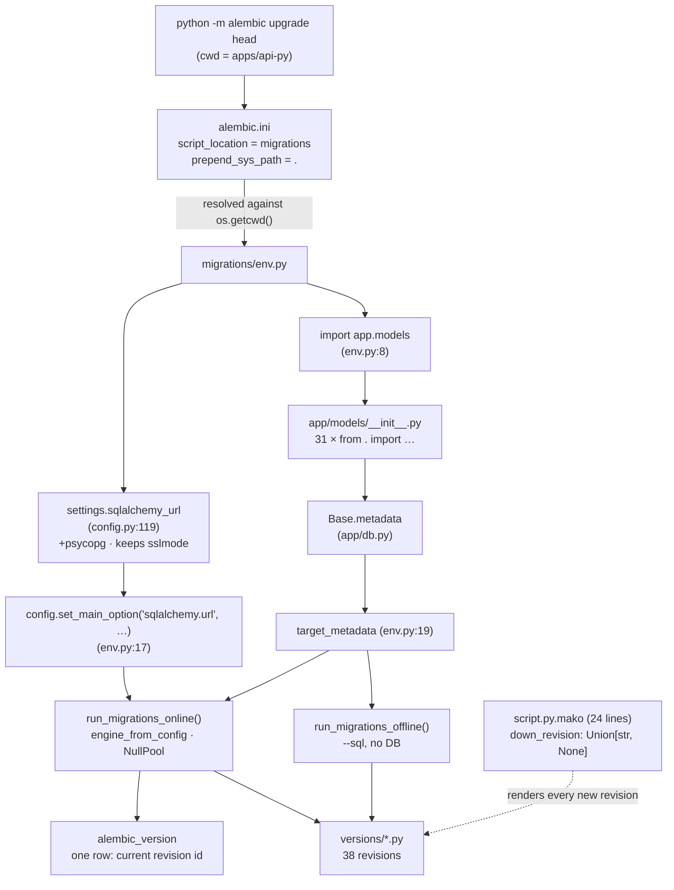
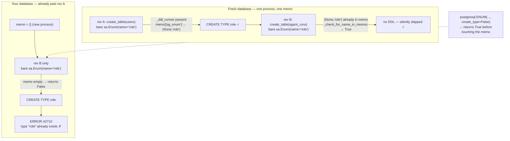
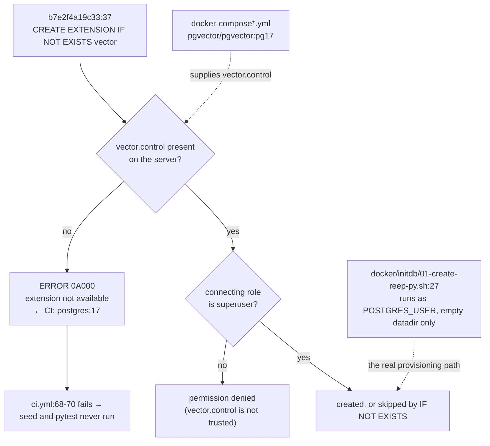

# Chapter 4 — Migrations & Alembic: How the Schema Got Here and How to Change It

After this chapter you will be able to add a migration to REEP that applies cleanly on a
fresh clone, on a colleague's half-built dev database and on the live server; you will
know which of Alembic's defaults this project relies on and which it deliberately does not
configure; you will be able to read any of the 38 revision files in `apps/api-py/migrations/versions/`
and say why it is shaped the way it is; and — the part that actually costs teams days —
you will recognise the three PostgreSQL enum failures this codebase hit repeatedly, know
the exact error text each produces, and know the exact edit that prevents it.

**In scope:** the Alembic wiring (`alembic.ini`, `migrations/env.py`, `script.py.mako`), the
complete revision graph, the anatomy and conventions of a revision file, the three enum
gotchas with their mechanisms, the pgvector conversion as a worked case study, the commands
for running and generating migrations, how migrations execute in CI and in Docker, and the
migration rulebook.

**Deferred:** the declarative `Base`, the engine and session, and the `models/__init__.py`
import registry are Chapter 2, §2 — this chapter depends on that registry and cross-references
it rather than re-explaining it. The column-by-column schema reference (what every table and
enum *means*) is [Chapter 3](03-data-model.md); where this chapter lists columns it is only to
show what a given revision established. Process topology, ports and configuration are
[Chapter 1](01-stack-architecture.md), §2 and §5. Ops, the two seeds and the test suite are
Chapter 16; this chapter covers only their ordering relationship to `alembic upgrade head`.

> **A correction up front.** [docs/codebase-mahabharath/README.md:28](README.md) bills this chapter
> as covering "All 40 revisions". There are **38**. I counted the directory and, independently,
> parsed `revision` and `down_revision` out of every file and walked the resulting graph: it
> visits exactly 38 nodes. Every count in this chapter is against 38, and the book's index
> line is the thing that needs correcting.

---

## 0. The vocabulary, before anything else

Four terms recur on every page below. If you have never used Alembic, read this first; nothing
after it will make sense otherwise.

A **revision** is one Python file in `apps/api-py/migrations/versions/`. It declares its own
id (`revision`), the id of the revision that must run before it (`down_revision`), and two
functions: `upgrade()`, which moves the schema forward one step, and `downgrade()`, which
undoes exactly that step.

The **revision graph** is what you get by following `down_revision` from file to file. In the
general case it is a tree that can fork (a *branch*) and re-join (a *merge*). In REEP it is a
straight line, and §2 shows why that is load-bearing rather than incidental.

**`alembic_version`** is the bookkeeping table Alembic creates in your database. It has one
column and, in a linear history like this one, exactly one row: the id of the revision the
database currently sits at. Every `upgrade` or `downgrade` reads that id, computes the path
from it to the target, runs each step's function in order, and rewrites the row at the end.
Three consequences run through the whole chapter: `alembic stamp` (§9) rewrites the row
*without running any DDL*, which is why it is the one command that can silently desynchronise
a schema from its history; two API replicas both running `upgrade head` at boot race on that
single row, which is why production runs migrations as their own one-shot service (§9, In
Docker); and a database built by `Base.metadata.create_all()` has no `alembic_version` row at
all, so the next `upgrade head` starts from the base revision and dies on the first
`CREATE TABLE` (§10, standing rule 1).

**Autogenerate** is `alembic revision --autogenerate`. It connects to your database, reads
the real schema, compares it against `Base.metadata` (the schema your Python model classes
describe), and writes a revision file containing the difference. It is a good first draft and
never a finished migration — §5 is entirely about one thing it gets wrong every single time.

---

## 1. How Alembic is wired here

Alembic has three moving parts: an **ini file** telling it where the scripts live, an
**environment script** (`env.py`) that it imports and executes on every invocation, and a
directory of **revision files**. REEP customises all three — the ini to remove a second source
of truth for the database URL, `env.py` to supply that URL and the model metadata, and even
the revision template, which is not the stock one.

### The ini file is thin on purpose, and its first three lines say why

[apps/api-py/alembic.ini](../../apps/api-py/alembic.ini) opens with the rationale rather than
with configuration:

```ini
# Alembic config. The DB URL is injected from app.config in migrations/env.py
# (so it honours apps/api-py/.env and the psycopg-driver normalisation), not set
# here.
[alembic]
script_location = migrations
prepend_sys_path = .
path_separator = os
```

That is the whole of the `[alembic]` section — three keys, and conspicuously **no
`sqlalchemy.url`** ([alembic.ini:1-7](../../apps/api-py/alembic.ini#L1)). The remaining
thirty-three lines are Python logging config: `root` at `WARN`, `sqlalchemy.engine` at `WARN`
(so a migration run does not echo every SQL statement it emits), `alembic` at `INFO` (so you
do get the `Running upgrade x -> y` lines), one `StreamHandler` on `sys.stderr`, and the
formatter `%(levelname)-5.5s [%(name)s] %(message)s`
([alembic.ini:9-41](../../apps/api-py/alembic.ini#L9)).

Each of the three keys earns its place:

| Key | Value | What it does |
|---|---|---|
| `script_location` | `migrations` | Where the revision directory is. Resolved **relative to the process working directory**, not to the ini file. `ScriptDirectory.from_config` hands the raw string to `coerce_resource_to_filename` (`alembic/script/base.py:181` → `alembic/util/pyfiles.py:52`), which — for a relative name with no colon in it — returns `Path("migrations")` completely unchanged, and every later filesystem call resolves that against `os.getcwd()`. That is why every documented invocation runs with the working directory set to `apps/api-py`, and why `-c apps/api-py/alembic.ini` from the repo root is *not* a substitute (see §9). |
| `prepend_sys_path` | `.` | The listed paths are spliced onto the front of `sys.path` before `env.py` is imported. Here that is the literal string `.`, which Python resolves against the working directory — which is what makes `import app.models` and `from app.config import settings` resolve without the package being pip-installed. |
| `path_separator` | `os` | How Alembic splits the multi-valued path options (`prepend_sys_path`, `version_locations`). `os` maps to `os.pathsep` — `;` on Windows, `:` on POSIX. It is the modern replacement for `version_path_separator`, and it is not optional in spirit: omit it and Alembic emits a deprecation warning and falls back to legacy splitting — and the legacy rule is not the same for the two options. For `prepend_sys_path` it splits on spaces, commas **and colons** (`alembic/config.py:606-611`, regex `, *\|(?: +)\|\:`); for `version_locations` it splits on spaces and commas only, never colons (`config.py:574-580`, regex `, *\|(?: +)`). |

> **The `%(here)s` token, and why its absence matters.** Alembic ships an interpolation token
> specifically so that a path *can* be made ini-relative: `%(here)s` "refers to the location of
> the .ini and/or .toml file" (`alembic/config.py`, docstrings at lines 106 and 446). If
> relative paths were already resolved against the ini, that token would have nothing to do.
> This ini does not use it, so both `script_location` and `prepend_sys_path` are
> working-directory-relative. This is not a reconstruction: running
> `python -m alembic -c apps/api-py/alembic.ini history` from the repo root fails with
> `FAILED: Path doesn't exist: migrations.`

Everything *not* set is as consequential as what is. There is no `file_template`, so revision
filenames use Alembic's default `%(rev)s_%(slug)s`. There is no `truncate_slug_length`, so the
slug is cut at Alembic's default of 40 characters (§10 gives the exact truncation rule, which
is not a plain slice). There is no `version_table` override, so the bookkeeping table is the
default `alembic_version` described in §0. There is no `[post_write_hooks]`, so no formatter
runs over a generated file — what autogenerate writes is what lands in the diff.

### env.py: where the database URL actually comes from

[apps/api-py/migrations/env.py](../../apps/api-py/migrations/env.py) is 53 lines. Four of them
carry the design.

```python
import app.models  # noqa: F401  — registers every model on Base.metadata
from app.config import settings
from app.db import Base
```
— [env.py:8-10](../../apps/api-py/migrations/env.py#L8)

Line 8 is the single line that makes autogenerate see anything at all. Importing `app.models`
executes [app/models/__init__.py](../../apps/api-py/app/models/__init__.py), whose 31
`from . import <module>  # noqa: F401` lines each import a module that defines `Base`
subclasses, and *defining* a declarative class is what registers its `Table` on
`Base.metadata`. The file's own comment states the obligation:

```python
# Importing the model modules registers them on Base.metadata (for create_all
# and Alembic autogenerate). Add new model modules here as the schema grows.
```
— [app/models/__init__.py:1-2](../../apps/api-py/app/models/__init__.py#L1)

This is the registry discipline established in Chapter 2, §2, and it is why that discipline
is not merely tidy. A model module you forget to add to that list is not in `Base.metadata`,
so `env.py` never sees it, so autogenerate emits nothing for it and says nothing about it.
Worse: once the table exists in the database but not in the metadata, the *next* autogenerate
run reads that as drift in the other direction and proposes a `DROP TABLE`.

```python
# Inject the normalised (psycopg3) URL rather than hard-coding it in alembic.ini.
config.set_main_option("sqlalchemy.url", settings.sqlalchemy_url)

target_metadata = Base.metadata
```
— [env.py:16-19](../../apps/api-py/migrations/env.py#L16)

Line 17 writes the URL into the in-memory copy of the ini, filling the hole the ini file
deliberately left. The value comes from `Settings.sqlalchemy_url`, a derived property rather
than a raw environment read ([app/config.py:119-149](../../apps/api-py/app/config.py#L119)),
and it does two normalisations. It rewrites a leading `postgresql://` to `postgresql+psycopg://`
so SQLAlchemy selects psycopg 3 rather than falling back to psycopg2, which is not installed.
And it strips *only* the three query parameters in
`_PRISMA_ONLY_PARAMS = frozenset({"schema", "connection_limit", "pgbouncer"})`
([config.py:117](../../apps/api-py/app/config.py#L117)), keeping everything else.

> **Why it is like this.** The property's docstring records what the second rule replaced:
> "This used to end `return url.split("?", 1)[0]`, discarding the entire query string — which
> silently threw away `sslmode`. Every managed Postgres (Neon, RDS, Supabase, Cloud SQL) hands
> you `...?sslmode=require`, so the connection fell back to libpq's default `prefer`: TLS
> opportunistic, server certificate never verified, nothing logged and nothing failed. An
> operator who set sslmode=require in the secret had every reason to believe it applied while
> student records crossed the network on an unauthenticated channel."
> ([config.py:127-134](../../apps/api-py/app/config.py#L127))

That is the whole argument for the empty `sqlalchemy.url` in the ini. The migration runner and
the running API get their connection string from the *same* property — `app/db.py` builds its
engine from `settings.sqlalchemy_url` too — so they cannot drift apart in database, driver or
TLS posture. A URL typed into `alembic.ini` would be a second source of truth that nothing
keeps honest.

Line 19 points `target_metadata` at the app's declarative `Base.metadata`. That object is what
autogenerate diffs the live database against; it is the "what the code says the schema should
be" half of the comparison.

### Online and offline mode

Alembic can either connect to a database and run DDL (**online**), or render the DDL as a SQL
script to stdout without a database (**offline**, `--sql`). Both are implemented, and the file
ends by dispatching between them:

```python
if context.is_offline_mode():
    run_migrations_offline()
else:
    run_migrations_online()
```
— [env.py:50-53](../../apps/api-py/migrations/env.py#L50)

The offline path passes the URL straight to `context.configure(url=settings.sqlalchemy_url, ...)`
with `literal_binds=True` and `dialect_opts={"paramstyle": "named"}`
([env.py:22-31](../../apps/api-py/migrations/env.py#L22)) — it never reads the ini back. The
online path builds an engine from the ini section that line 17 just populated, with
`poolclass=pool.NullPool` ([env.py:34-39](../../apps/api-py/migrations/env.py#L34)): a migration
run is one short-lived connection, so pooling it would only hold a connection open after the
process is logically finished. It then configures against that live connection and runs inside
`context.begin_transaction()` ([env.py:40-47](../../apps/api-py/migrations/env.py#L40)).

Note that line 17 runs unconditionally, at import, *before* the dispatch — so it executes in
both modes even though offline mode does not need it.

Offline mode is worth knowing about for a reason nothing in the repo mentions: it renders the
entire DDL script for the whole chain with no database attached, which makes it the cheapest
way to see exactly what a migration will emit — including a `CREATE TYPE` you did not intend.

### The autogenerate knobs, and the ones that are absent

Both `context.configure` calls pass exactly one explicit autogenerate option:
`compare_type=True` ([env.py:28](../../apps/api-py/migrations/env.py#L28),
[env.py:44](../../apps/api-py/migrations/env.py#L44)). On the pinned `alembic==1.19.1` that
**restates the library default rather than changing it**: the signature reads
`compare_type: bool | CompareType = True` (`alembic/runtime/environment.py:432`), the docstring
records ".. versionchanged:: 1.12.0 The default value of
:paramref:`.EnvironmentContext.configure.compare_type` has been changed to ``True``"
(`environment.py:579-580`), and the value is read back as `opts.get("compare_type", True)`
(`alembic/runtime/migration.py:178`). The behaviour is the same with or without the line — a
column changing from `String` to `Text`, or `ARRAY(Float)` to `vector`, is detected — so read
these two lines as documentation of an assumption, not as a setting being turned on. (They would
become load-bearing only if the pin ever moved *back* below 1.12.0, where the default was
`False`.) What is *not* configured matters just as much, and three absences have practical
consequences:

- **No `naming_convention` on the metadata.** Chapter 2 showed `Base` is a bare
  `class Base(DeclarativeBase): pass`. With no convention, SQLAlchemy cannot derive constraint
  names, so every index, unique constraint and named foreign key in this schema is a hand-typed
  string — `uq_students_usn`, `fk_students_mentor`, `uq_login_day`, `ix_conversation_owner_activity`.
  Revisions 1 and 3 contain the only exceptions: `op.f('ix_users_email')`
  ([f65867efe738:31](../../apps/api-py/migrations/versions/f65867efe738_auth_slice_users_students_mentors_login_.py#L31))
  and `op.f('ix_semester_results_student_id')`
  ([5b3419986605:36](../../apps/api-py/migrations/versions/5b3419986605_semester_results_subject_marks.py#L36)).
  (Revision 2, `4e4ac34a89a7_student_profiles.py`, contains no `op.f` — a grep for `op.f(` over
  `versions/` returns four hits and they live in those two files only, twice each, once in the
  upgrade and once in the matching downgrade.) `op.f()` marks a name as already-final so Alembic
  will not re-run it through a convention; those two came from `index=True` on a column rather
  than from an explicit `Index(...)`. Read `op.f(...)` as a provenance marker, not a different
  kind of object.
- **No `compare_server_default`** (it defaults to `False`). This schema is full of
  `server_default` values — `'EXCEL'`, `'0'`, `sa.text('now()')`, `'{}'`, `'[]'`. Change one in
  a model and autogenerate will not notice; the database keeps the old `DEFAULT`, and rows
  inserted outside the ORM silently get the stale value. Server-default changes must be
  hand-written as an `op.alter_column`.
- **No `include_object`, no `render_as_batch`, no `process_revision_directives`.** Nothing
  filters what autogenerate sees, nothing rewrites what it emits. In particular there is no
  `render_item` hook — which, as §5 explains, is the reason the enum fixes have to be applied
  by hand rather than automated.

### script.py.mako is *not* stock, and the difference is the linearity rule

[apps/api-py/migrations/script.py.mako](../../apps/api-py/migrations/script.py.mako) is 24
lines: the docstring block, the `alembic`/`sqlalchemy` imports, the four module-level
variables, and the `upgrade()`/`downgrade()` stubs. It is a *trimmed fork* of the upstream
Alembic generic template, not a copy of it. Diffing it against the template the pinned
`alembic==1.19.1` actually ships
(`.venv/Lib/site-packages/alembic/templates/generic/script.py.mako`) returns five differences.

Four are cosmetic. The repo's copy removes the blank line before the docstring's closing `"""`;
removes the `# revision identifiers, used by Alembic.` comment above the four variables; and
removes the `"""Upgrade schema."""` and `"""Downgrade schema."""` stub docstrings inside the
two functions.

The fifth is semantic, and it is the most under-appreciated line in the whole migration
directory:

```diff
-down_revision: Union[str, Sequence[str], None] = ${repr(down_revision)}
+down_revision: Union[str, None] = ${repr(down_revision)}
```

Upstream types `down_revision` as possibly a **sequence** because that is precisely how Alembic
expresses a *merge* revision — one file with more than one parent, the thing you write when two
branches of the graph rejoin. This repo narrowed the annotation to a single optional string.
The template therefore states, in the type system, that a revision here has at most one parent:
the "one base, one head, no merges" property §2 verifies empirically is *encoded in the
generator*, so every file Alembic writes from now on will carry the same narrowed annotation. A
merge revision generated from this template would be handed a tuple by Alembic and would carry
an annotation contradicting its own value.

Nothing enforces the annotation at runtime — Python does not check it, and Alembic reads the
value, not the type. But it is why all 38 files agree (§2), and it is the first line to change
if REEP ever genuinely needs a merge.

The template's other interesting property is that
`${upgrades if upgrades else "pass"}` ([script.py.mako:20](../../apps/api-py/migrations/script.py.mako#L20))
and `${downgrades if downgrades else "pass"}` ([script.py.mako:24](../../apps/api-py/migrations/script.py.mako#L24))
are the only two sources of a bare `pass` in a revision body. No file in `versions/` contains
one — `grep -rn "^\s*pass\s*$" versions/*.py` returns nothing — which is the mechanical proof
that neither half of any migration in this repo is an empty stub.



---

## 2. The revision graph

### It is a straight line, and that is verified

I parsed `revision` and `down_revision` out of all 38 files and checked the graph four ways.
Exactly one revision has `down_revision = None` (`f65867efe738`). Exactly one revision is never
named as anybody's parent (`6afb55d18ed8`). No revision id appears as the `down_revision` of two
different files, so there are **zero branch points**. No `down_revision` names an id that has no
file, so there are **zero dangling parents**. Walking from the base and following the single
child at each step visits 38 distinct nodes and terminates at `6afb55d18ed8`.

**One base, one head, no branches, no merges, no orphans.** `alembic heads` prints a single row
— I ran it; it prints `6afb55d18ed8 (head)` — so `alembic upgrade head` is unambiguous. Every
file also carries `branch_labels: Union[str, Sequence[str], None] = None` and
`depends_on: … = None` — I checked all 38 and found no exception — so no revision uses a branch
label or a cross-branch dependency.

Nothing *enforces* this at runtime. There is no test asserting a single head and no
`alembic branches` check in CI. It holds for two reasons: every author generated against an
up-to-date working tree, and the template (§1) cannot express a second parent without
contradicting its own annotation. §5 explains why a branch would be more dangerous here than in
a typical project.

### The chain, base to head

`Autogen` records whether the file carries Alembic's `# ### commands auto generated by Alembic - please adjust! ###`
banner. Thirty-three do; five do not, and each of those five exists because autogenerate could
not produce the right thing. The five are `9ac9f4696b0d`, `b7e2f4a19c33`, `d2f7a1c9e4b0`,
`e1a7c9d34f20` and `f2b8d05e6a11` — `grep -L 'commands auto generated by Alembic' versions/*.py`
returns exactly that set, and no other. Keep it in mind: §5 hangs a table off it.

The "What it did" column names created objects **in the order the file creates them**, which is
not always the order the revision's own message names them.

| # | Revision | Down revision | Slug | What it did | Autogen |
|---|---|---|---|---|---|
| 1 | `f65867efe738` | *(none)* | auth_slice_users_students_mentors_login_ | `users` (+ the `role` enum), `login_days`, `mentors`, `students` | yes |
| 2 | `4e4ac34a89a7` | f65867efe738 | student_profiles | `student_profiles` | yes |
| 3 | `5b3419986605` | 4e4ac34a89a7 | semester_results_subject_marks | `semester_results`, `subject_marks` | yes |
| 4 | `047481d26bbd` | 5b3419986605 | attendance_records | `attendance_records` | yes |
| 5 | `9ac9f4696b0d` | 047481d26bbd | student_core_fields_usn_stage_semester | 7 columns onto `students` + the `stage` enum, `uq_students_usn`, `fk_students_mentor` | **no** |
| 6 | `442f409fe2b2` | 9ac9f4696b0d | swoc_entries | `swoc_entries` | yes |
| 7 | `7b9f0d2b94c9` | 442f409fe2b2 | mock_attempts | `mock_attempts` | yes |
| 8 | `76bc4771604c` | 7b9f0d2b94c9 | skills_student_skills | `skills`, `student_skills` | yes |
| 9 | `89c58184d2c4` | 76bc4771604c | time_sheet_entries | `time_sheet_entries` | yes |
| 10 | `bd74d3af53de` | 89c58184d2c4 | academic_qualifications_academic_gaps | `academic_gaps`, then `academic_qualifications` (the message names them the other way round) | yes |
| 11 | `617fc28a1a31` | bd74d3af53de | mentor_notes | `mentor_notes` | yes |
| 12 | `efa345768652` | 617fc28a1a31 | alerts | `alerts` (+ `alert_rule_key`, `alert_severity`) | yes |
| 13 | `01c7bb72b68d` | efa345768652 | jobs_job_applications | `jobs` (+ `degree_level`), `job_applications`; `jobs.import_run_id` as a bare column | yes |
| 14 | `d58ecdf6a93c` | 01c7bb72b68d | placement_offers | `placement_offers` | yes |
| 15 | `a80068bf03da` | d58ecdf6a93c | leave_requests | `leave_requests` (`leave_decision` on two columns) | yes |
| 16 | `1aecd2178ccd` | a80068bf03da | schedule_items | `schedule_items` | yes |
| 17 | `cd202d22b107` | 1aecd2178ccd | resumes | `resumes` | yes |
| 18 | `fdf358b2dc69` | cd202d22b107 | courses_enrollments | `courses` (reuses `stage`; creates `dimension` and `course_model`), `enrollments` (+ `progress_status`) | yes |
| 19 | `8dc0602056e9` | fdf358b2dc69 | certifications_certification_progress | `certifications`, `certification_progress` (reuses `progress_status`) | yes |
| 20 | `69d81a708980` | 8dc0602056e9 | lab_sessions | `lab_sessions` | yes |
| 21 | `fea4515cdba5` | 69d81a708980 | cohorts | `cohorts` (reuses `degree_level`) | yes |
| 22 | `2b3f9aa4b8f2` | fea4515cdba5 | placement_criteria | `placement_criteria` | yes |
| 23 | `094277ababc9` | 2b3f9aa4b8f2 | agent_runs | `agent_runs` (reuses `role`) | yes |
| 24 | `5d48c6c2ffdd` | 094277ababc9 | uploads | `uploads` (+ `upload_kind`, `upload_status`) | yes |
| 25 | `9ecfa486074d` | 5d48c6c2ffdd | registrations | `registration_rules`, `registrations`, `email_verifications` (the message names only the middle one) | yes |
| 26 | `3fd5bf464c0b` | 9ecfa486074d | mail_logs | `mail_logs` | yes |
| 27 | `b73e107ffbc2` | 3fd5bf464c0b | alert_rule_configs | `alert_rule_configs` (reuses both alert enums) | yes |
| 28 | `496d83735a1d` | b73e107ffbc2 | job_import_runs | `job_import_runs` + the deferred FK `fk_jobs_import_run` | yes |
| 29 | `6111de4784aa` | 496d83735a1d | skill_claims | `skill_claims` (reuses `upload_status`) | yes |
| 30 | `3c8af3d95253` | 6111de4784aa | resume_profiles | `resume_profiles` | yes |
| 31 | `c4e4c58eac29` | 3c8af3d95253 | conversations_messages | `conversations` (reuses `role`), `messages` | yes |
| 32 | `d2f7a1c9e4b0` | c4e4c58eac29 | voice_worker_heartbeats | `voice_worker_heartbeats` | **no** |
| 33 | `1aa19fa788e9` | d2f7a1c9e4b0 | knowledge_base_documents_chunks | `knowledge_documents`, `knowledge_chunks` + the hand-written GIN index | yes* |
| 34 | `e1a7c9d34f20` | 1aa19fa788e9 | agent_run_intent_resolved | `agent_runs.intent`, `agent_runs.resolved` (both nullable) | **no** |
| 35 | `f2b8d05e6a11` | e1a7c9d34f20 | assistant_feedback | `assistant_feedback` + the `feedbackrating` enum | **no** |
| 36 | `b7e2f4a19c33` | f2b8d05e6a11 | kb_embedding_pgvector | `CREATE EXTENSION vector`; `knowledge_chunks.embedding` → `vector` | **no** |
| 37 | `d989bec4286d` | b7e2f4a19c33 | conversation_greeted_at | `conversations.greeted_at` (nullable) | yes |
| 38 | `6afb55d18ed8` | d989bec4286d | one_active_conversation_per_owner | Partial unique index `uq_conversation_one_active_per_owner` (**HEAD**) | yes |

\* `1aa19fa788e9` is a hybrid. Its `upgrade()` keeps the autogenerated block and appends
hand-written SQL *after* the `# ### end Alembic commands ###` marker; its `downgrade()` is less
careful and puts the matching hand-written SQL *inside* the banner. §8 shows both and explains
why the difference matters.

### The chain order is also the creation order

Reading the `Create Date` header along the chain gives a strictly increasing sequence:
`2026-08-14 23:00:15` at the base, then a long run through `2026-08-15` from `03:12:56` to
`23:12:00`, then `2026-08-16 10:20:00`, `2026-08-16 23:19:52`, and finally
`2026-08-17 00:12:37`. Nothing was ever re-parented or reordered after the fact — a useful
sanity property, because a chain whose timestamps zig-zag is usually one where someone
rewrote a `down_revision` by hand.

It also tells the project's story, and the split reconciles exactly with the 38 total:

| Date | Revisions | What it was |
|---|---|---|
| 2026-08-14 | 1 (`f65867efe738`) | the auth slice — the first thing the new stack had to do |
| 2026-08-15 | **34** (`4e4ac34a89a7` 03:12:56 → `f2b8d05e6a11` 23:12:00, positions 2–35) | the Phase-2 domain port: one model, one migration, one endpoint, repeated |
| 2026-08-16 | 2 (`b7e2f4a19c33`, `d989bec4286d`) | pgvector, then the greeting flag |
| 2026-08-17 | 1 (`6afb55d18ed8`) | the concurrency corollary of the greeting flag |

1 + 34 + 2 + 1 = 38.

Four timestamps are suspiciously round — `21:45:00.000000`, `23:10:00.000000`,
`23:12:00.000000`, `10:20:00.000000` — and they belong to four of the five files with no
autogenerate banner (`d2f7a1c9e4b0`, `e1a7c9d34f20`, `f2b8d05e6a11`, `b7e2f4a19c33`). That is a
strong signal those revisions were typed rather than generated. The fifth banner-less file,
`9ac9f4696b0d`, carries an ordinary `03:29:02.166884` — see the uncertainty note at the end of
the chapter.

```mermaid
flowchart LR
    subgraph A["Auth foundation · 14 Aug"]
        R1["f65867efe738<br/>users · role enum"]
    end
    subgraph B["Student core · 15 Aug am"]
        R2["4e4ac34a89a7 … 047481d26bbd"] --> R5["9ac9f4696b0d<br/>stage enum column"] --> R6["442f409fe2b2 … bd74d3af53de"]
    end
    subgraph C["Mentoring, alerts, jobs · 15 Aug"]
        R11["617fc28a1a31 … cd202d22b107"]
    end
    subgraph D["Curriculum & cohorts · 15 Aug"]
        R18["fdf358b2dc69 … 2b3f9aa4b8f2"]
    end
    subgraph E["Agent runs & operations · 15 Aug"]
        R23["094277ababc9 … 3c8af3d95253"]
    end
    subgraph F["Assistant V2 · 15 Aug pm"]
        R31["c4e4c58eac29"] --> R32["d2f7a1c9e4b0"] --> R33["1aa19fa788e9"] --> R34["e1a7c9d34f20"] --> R35["f2b8d05e6a11"]
    end
    subgraph G["pgvector & conversation hardening · 16–17 Aug"]
        R36["b7e2f4a19c33"] --> R37["d989bec4286d"] --> R38["6afb55d18ed8 (HEAD)"]
    end
    R1 --> R2
    R6 --> R11 --> R18 --> R23 --> R31
    R35 --> R36
```



### What the whole chain does, and does not, do

Across all 38 revision **files** the operation vocabulary is startlingly narrow. The counts
below are for the whole file, split by which half of it they live in — a distinction the
earlier draft of this chapter blurred, and which matters because it is what makes the
"every downgrade is a real mirror" claim checkable:

| Operation | Total | In `upgrade()` | In `downgrade()` | Files |
|---|---|---|---|---|
| `op.create_table` | 46 | 46 | 0 | 33 |
| `op.drop_table` | 46 | 0 | 46 | 33 |
| `op.create_index` | 48 | 48 | 0 | 28 |
| `op.drop_index` | 48 | 0 | 48 | 28 |
| `op.add_column` | 12 | 11 | 1 | 4 |
| `op.drop_column` | 12 | 1 | 11 | 4 |
| `op.create_foreign_key` | 2 | 2 | 0 | 2 |
| `op.create_unique_constraint` | 1 | 1 | 0 | 1 |
| `op.drop_constraint` | 3 | 0 | 3 | 2 |
| `op.execute` | 3 | 2 | 1 | 2 |
| `op.get_bind` | 7 | 2 | 5 | 3 |
| `op.f` | 4 | 2 | 2 | 2 |
| `op.alter_column` | **0** | 0 | 0 | 0 |

The create/drop columns are the same four files in both directions: `9ac9f4696b0d` (7 adds, 7
drops), `b7e2f4a19c33` (2 and 2), `e1a7c9d34f20` (2 and 2), `d989bec4286d` (1 and 1). The one
`drop_column` that is *not* a downgrade mirror is `b7e2f4a19c33`'s drop of
`knowledge_chunks.embedding` in `upgrade()`, and the one `add_column` that is not a forward
step is that same file's re-add of the old `ARRAY(Float)` column in `downgrade()` — §7 is the
case study.

The `drop_table` and `drop_index` rows are worth stating explicitly rather than leaving implied:
46 tables created, 46 dropped; 48 indexes created, 48 dropped. Those two pairings are the
arithmetic behind "downgrades are real".

There is **no `op.alter_column` anywhere in the history**, no `op.rename_table`, no
`op.bulk_insert`, no batch mode, and — verified by reading all three `op.execute` arguments,
which are `CREATE EXTENSION IF NOT EXISTS vector`, the `CREATE INDEX … USING gin` and the
matching `DROP INDEX IF EXISTS` — no `INSERT`, `UPDATE` or `DELETE`. **Every migration in this
repo is pure DDL.** Nothing in this chain has ever rewritten a row.

That is a deliberate boundary, stated twice in the code. `app/seed.py`'s docstring says "Data
only — Alembic owns the schema"
([app/seed.py:18](../../apps/api-py/app/seed.py#L18)), and where a reader would most expect a
backfill — `b7e2f4a19c33`, which changes a column's type — the docstring instead names an
application function: "`app.ai.embeddings.reembed_all` then backfills it from the configured
provider"
([b7e2f4a19c33:15](../../apps/api-py/migrations/versions/b7e2f4a19c33_kb_embedding_pgvector.py#L15)).
Schema changes go in a migration; data changes go in a seed or in runtime code.

---

## 3. The anatomy of a migration file

Every revision file in this repo has the same skeleton, straight from the (trimmed) template of
§1. `f2b8d05e6a11_assistant_feedback.py` is the best specimen — it is short enough to read
whole, and it demonstrates the docstring convention, the four variables, a module-level enum
handle, and a downgrade that is a genuine mirror rather than a token. It is also one of the five
files with **no autogenerate banner**, which is exactly why the body reads so cleanly.

```python
"""assistant_feedback (+ feedbackrating enum)

Revision ID: f2b8d05e6a11
Revises: e1a7c9d34f20
Create Date: 2026-08-15 23:12:00.000000
"""
from typing import Sequence, Union

from alembic import op
import sqlalchemy as sa
from sqlalchemy.dialects import postgresql

revision: str = 'f2b8d05e6a11'
down_revision: Union[str, None] = 'e1a7c9d34f20'
branch_labels: Union[str, Sequence[str], None] = None
depends_on: Union[str, Sequence[str], None] = None

# feedbackrating is a BRAND-NEW enum. Per AGENTS.md, CREATE TYPE it explicitly
# BEFORE the table and reference it with create_type=False in create_table, so
# the table build does not try to CREATE TYPE a second time ("already exists").
feedbackrating = postgresql.ENUM(
    'HELPFUL', 'NOT_HELPFUL', 'REPORT', name='feedbackrating'
)


def upgrade() -> None:
    feedbackrating.create(op.get_bind(), checkfirst=True)
    op.create_table(
        'assistant_feedback',
        sa.Column('id', sa.String(), nullable=False),
        sa.Column('run_id', sa.String(), nullable=False),
        sa.Column('owner_user_id', sa.String(), nullable=False),
        sa.Column(
            'rating',
            postgresql.ENUM(
                'HELPFUL', 'NOT_HELPFUL', 'REPORT',
                name='feedbackrating', create_type=False,
            ),
            nullable=False,
        ),
        sa.Column('note', sa.String(), nullable=True),
        sa.Column('created_at', sa.DateTime(timezone=True), server_default=sa.text('now()'), nullable=False),
        sa.Column('updated_at', sa.DateTime(timezone=True), server_default=sa.text('now()'), nullable=False),
        sa.ForeignKeyConstraint(['run_id'], ['agent_runs.id'], ondelete='CASCADE'),
        sa.ForeignKeyConstraint(['owner_user_id'], ['users.id'], ondelete='CASCADE'),
        sa.PrimaryKeyConstraint('id'),
        sa.UniqueConstraint('run_id', 'owner_user_id', name='uq_feedback_run_owner'),
    )
    op.create_index('ix_feedback_run', 'assistant_feedback', ['run_id'], unique=False)


def downgrade() -> None:
    op.drop_index('ix_feedback_run', table_name='assistant_feedback')
    op.drop_table('assistant_feedback')
    feedbackrating.drop(op.get_bind(), checkfirst=True)
```
— [f2b8d05e6a11_assistant_feedback.py:1-55](../../apps/api-py/migrations/versions/f2b8d05e6a11_assistant_feedback.py#L1)

**The docstring.** For a revision Alembic generated, the first line is the `-m` message verbatim
and the filename slug is derived from that same message (§10 gives the derivation), so the two
agree by construction. Alembic then appends the revision id, the parent, and the creation
timestamp.

The house convention for that first line is a lowercase, space-separated statement of what the
revision adds: for a table-creating revision it is the table names (`conversations messages`,
`semester_results subject_marks`, `certifications certification_progress`); for a revision that
alters rather than creates it is a short phrase naming the target
(`conversation greeted_at`, `agent_run intent + resolved grounding signal`,
`one active conversation per owner`).

> **The exception nobody documents.** For a *hand-written* revision the docstring and the slug
> were chosen independently, and three of the five diverge:
>
> | Revision | Docstring first line | Slug |
> |---|---|---|
> | `b7e2f4a19c33` | ``knowledge_chunks.embedding -> pgvector `vector` (+ CREATE EXTENSION vector)`` | `kb_embedding_pgvector` |
> | `f2b8d05e6a11` | `assistant_feedback (+ feedbackrating enum)` | `assistant_feedback` |
> | `e1a7c9d34f20` | `agent_run intent + resolved grounding signal` | `agent_run_intent_resolved` |
>
> The other two hand-written files (`9ac9f4696b0d`, `d2f7a1c9e4b0`) happen to keep them in step.
> If you hand-write a revision, keep them in step too — a reader who greps for a filename by its
> docstring should find it.

Extended prose after the header is rare: exactly one revision has it (`b7e2f4a19c33`, whose
docstring runs to line 19 where every other file's closes at line 6), and §7 is about that one.

**The four variables.** They are always present, always in this order, always with these exact
annotations: `revision: str`, `down_revision: Union[str, None]`,
`branch_labels: Union[str, Sequence[str], None]`, `depends_on: Union[str, Sequence[str], None]`.
Those annotations come from *this repo's* `script.py.mako`, not from stock Alembic — §1 showed
that upstream 1.19.1 writes `down_revision: Union[str, Sequence[str], None]`. No file deviates,
which is why a mechanical regex over all 38 files parses them without exception.
`branch_labels` and `depends_on` are `None` everywhere.

**The module-level enum handle.** When a migration must create or drop a Postgres enum type
explicitly, it declares the handle *between* the four variables and `upgrade()`, at module scope,
named after the type it wraps in lowercase. Two files do this: `feedbackrating` here, and
`stage_enum` in
[9ac9f4696b0d:22](../../apps/api-py/migrations/versions/9ac9f4696b0d_student_core_fields_usn_stage_semester.py#L22).
Module scope rather than function scope is what lets both `upgrade()` and `downgrade()` refer
to the same object.

**The upgrade/downgrade pair.** Both functions are annotated `-> None`. Autogenerated bodies
are wrapped in `# ### commands auto generated by Alembic - please adjust! ###` and
`# ### end Alembic commands ###`; hand-written ones have no banner. That difference is the
reliable tell for which files were generated, and §2 lists the five banner-less files by name.
Where a file keeps the banner but the contents have obviously been edited — an enum switched to
`postgresql.ENUM(..., create_type=False)`, say — you are looking at a hand-fix applied inside a
generated body, and the banner's own "please adjust!" is the instruction that was followed.

**Downgrades are real.** All 38 files define exactly one `downgrade()`, and a grep for a bare
`pass` statement across the whole `versions/` directory returns nothing. Spot-checking the hard
ones confirms they are ordered mirrors rather than gestures:
`9ac9f4696b0d` unwinds foreign key → unique constraint → seven columns → enum type
([9ac9f4696b0d:49-58](../../apps/api-py/migrations/versions/9ac9f4696b0d_student_core_fields_usn_stage_semester.py#L49));
`496d83735a1d` drops the cross-table constraint `fk_jobs_import_run` off `jobs` *before* dropping
`job_import_runs` itself
([496d83735a1d:40-42](../../apps/api-py/migrations/versions/496d83735a1d_job_import_runs.py#L40));
`1aa19fa788e9` drops the hand-written GIN index before the autogenerated ones.

One caveat the chapter owes you: written is not the same as tested. No CI step and no test ever
executes a downgrade, and §7 and §8 both note a way in which a full `downgrade base` is a
one-way door on a given database.

---

## 4. Enum gotcha 1 — adding an enum COLUMN does not CREATE TYPE

### The mechanism

A PostgreSQL enum is a *type* in the database catalogue, created by `CREATE TYPE x AS ENUM (...)`,
and separate from any column that uses it. So any migration that introduces an enum column must
somehow get that `CREATE TYPE` emitted. With `op.create_table`, Alembic does it for you. With
`op.add_column`, it does not. That asymmetry surprises everyone, and it is not a Postgres quirk
or a SQLAlchemy type-compilation quirk — it is a two-method difference inside Alembic that you
can read in eighteen lines of library source.

`CREATE TYPE` is never part of the compiled `CREATE TABLE` string. It is emitted by a SQLAlchemy
event listener: attaching an `Enum` to a table's column registers a `before_create` hook on that
table (`NamedType._on_table_create`). `DefaultImpl.create_table` fires the table's
`before_create` and `after_create` dispatch around the `CreateTable` statement —

```python
def create_table(self, table: Table, **kw: Any) -> None:
    table.dispatch.before_create(
        table, self.connection, checkfirst=False, _ddl_runner=self
    )
    self._exec(schema.CreateTable(table, **kw))
```

— so the hook runs and the type is created first. `DefaultImpl.add_column` does one thing: it
calls `self._exec(base.AddColumn(...))`. There is no dispatch, so no hook, so no `CREATE TYPE`.

(Both methods are `DefaultImpl.create_table` at `alembic/ddl/impl.py:430` and
`DefaultImpl.add_column` at `alembic/ddl/impl.py:374`, in the pinned `alembic==1.19.1` —
[requirements.txt:18](../../apps/api-py/requirements.txt#L18). The hook is
`NamedType._on_table_create` at `sqlalchemy/dialects/postgresql/named_types.py:99`, in
`sqlalchemy==2.0.52` — [requirements.txt:17](../../apps/api-py/requirements.txt#L17). These are
library internals rather than repo code and are not in git, so I name file and line rather than
linking them; every line number was read in this project's own `.venv`.)

The consequence is that the `ALTER TABLE ... ADD COLUMN current_stage stage` goes out against a
type the database has never heard of, and Postgres answers:

```
ERROR:  42704: type "stage" does not exist
```

SQLSTATE `42704` is `undefined_object`. Crucially, **nothing you write on the column changes
this** — `create_type` is a flag that can only *suppress* type creation, never cause it from an
`add_column` path.

### The correct pattern

Create the type explicitly as the first statement of `upgrade()`, then reference it from the
column with `create_type=False` so nothing tries to create it twice. Drop it as the *last*
statement of `downgrade()`, after every column that uses it is gone.

[9ac9f4696b0d_student_core_fields_usn_stage_semester.py](../../apps/api-py/migrations/versions/9ac9f4696b0d_student_core_fields_usn_stage_semester.py)
is the only migration in this repo that adds an enum column to an existing table, and it carries
the explanation at module level:

```python
# Adding an enum COLUMN to an existing table does not auto-create the PG type
# (unlike create_table), so create it explicitly and reference it with
# create_type=False on the column.
stage_enum = postgresql.ENUM("REBOOT", "EXCEL", "EXCEL_ADVANCED", "ELEVATE", name="stage")


def upgrade() -> None:
    stage_enum.create(op.get_bind(), checkfirst=True)
```
— [9ac9f4696b0d:19-26](../../apps/api-py/migrations/versions/9ac9f4696b0d_student_core_fields_usn_stage_semester.py#L19)

and then the column itself:

```python
    op.add_column(
        'students',
        sa.Column(
            'current_stage',
            postgresql.ENUM(
                "REBOOT", "EXCEL", "EXCEL_ADVANCED", "ELEVATE", name="stage", create_type=False
            ),
            server_default='EXCEL',
            nullable=False,
        ),
    )
```
— [9ac9f4696b0d:30-40](../../apps/api-py/migrations/versions/9ac9f4696b0d_student_core_fields_usn_stage_semester.py#L30)

Three details worth taking away.

`op.get_bind()` returns the connection Alembic is currently running on, which is what
`.create()` needs to execute. `checkfirst=True` makes the call probe `pg_type` first and skip if
the type is already there, so the migration is safe to re-run after a partial failure.

The drop mirrors it and must come last:

```python
    op.drop_column('students', 'usn')
    stage_enum.drop(op.get_bind(), checkfirst=True)
```
— [9ac9f4696b0d:57-58](../../apps/api-py/migrations/versions/9ac9f4696b0d_student_core_fields_usn_stage_semester.py#L57)

Postgres refuses to drop a type that a column still references, so `DROP TYPE` after the
**seven** `drop_column` calls at
[9ac9f4696b0d:51-57](../../apps/api-py/migrations/versions/9ac9f4696b0d_student_core_fields_usn_stage_semester.py#L51)
(`weekly_hour_target`, `enrolled_at`, `current_semester`, `current_stage`, `mentor_id`,
`cohort_id`, `usn`) is not stylistic ordering — it is the only order that works. Only one of
those seven columns actually uses the type, but `stage_enum.drop` has to come after *that* one,
and the file simply puts it after all of them.

And every column this migration adds is either nullable or carries a `server_default` —
`current_stage` gets `'EXCEL'`
([:37](../../apps/api-py/migrations/versions/9ac9f4696b0d_student_core_fields_usn_stage_semester.py#L37)),
then `current_semester` `'1'`, `enrolled_at` `sa.text('now()')` and `weekly_hour_target` `'12'`
([:41-43](../../apps/api-py/migrations/versions/9ac9f4696b0d_student_core_fields_usn_stage_semester.py#L41)).
The model records the reason in a comment beside the same fields: "Nullable / server-defaulted
so the column adds cleanly onto existing rows"
([app/models/user.py:62](../../apps/api-py/app/models/user.py#L62)). A `NOT NULL` column with no
default cannot be added to a table that already has rows. This is a standing rule with no
counterexample in the 38 files.

The pgvector migration solves the same class of problem for a different kind of type: before
adding a `vector` column, it must make the `vector` *extension* exist, which is the moral
equivalent of the `CREATE TYPE` — see §7.

---

## 5. Enum gotcha 2 — a new table reusing an existing enum

### What autogenerate emits, and why it is wrong

When you add a model whose column reuses an enum some other table already declares, autogenerate
renders the type from the Python class's `repr()`. A generic `sqlalchemy.Enum` renders as
`sa.Enum('A', 'B', name='x')` — a bare declaration, indistinguishable from the one that first
created the type. Dropped into an `op.create_table`, that bare `sa.Enum` fires the same
`before_create` hook §4 described, so the migration emits `CREATE TYPE x AS ENUM (...)` for a
type that already exists in the catalogue, and Postgres answers:

```
ERROR:  42710: type "role" already exists
```

Through the toolchain it surfaces as
`sqlalchemy.exc.ProgrammingError: (psycopg.errors.DuplicateObject) type "role" already exists`
with `[SQL: CREATE TYPE role AS ENUM ('STUDENT', 'MENTOR', 'DIRECTOR', 'ADMIN')]`. SQLSTATE
`42710` is `duplicate_object`.

### The memo: the mechanism that makes this trap intermittent

There is a subtlety that makes this trap much worse than it first looks, and it is worth naming
its parts precisely, because three later claims in this chapter rest on it.

One `alembic upgrade head` invocation creates **one** `MigrationContext`
(`alembic/runtime/migration.py`), and that context creates **one** dialect-specific
`DefaultImpl` subclass instance at line 190 of that file. `DefaultImpl.__init__` gives it a
plain dictionary:

```python
self.memo: dict = {}
```
— `alembic/ddl/impl.py:127`

`MigrationContext.run_migrations` then iterates every revision step in the upgrade path against
that same impl (`for step in self._migrations_fn(heads, self)`,
`alembic/runtime/migration.py:609`), and the per-run hook `DefaultImpl.start_migrations()`
(`alembic/ddl/impl.py:683`) has an empty body. So the memo is created once per **process
invocation** and never reset between revisions.

The memo is written by SQLAlchemy, not Alembic. Recall from §4 that `DefaultImpl.create_table`
passes `_ddl_runner=self` into the `before_create` dispatch. The enum's hook reaches into that
runner:

```python
if not self.create_type:
    return True
if "_ddl_runner" in kw:
    ddl_runner = kw["_ddl_runner"]
    type_name = f"pg_{self.__visit_name__}"
    if type_name in ddl_runner.memo:
        existing = ddl_runner.memo[type_name]
    else:
        existing = ddl_runner.memo[type_name] = set()
    present = (self.schema, self.name) in existing
    existing.add((self.schema, self.name))
    return present
else:
    return False
```
— `NamedType._check_for_name_in_memos`, `sqlalchemy/dialects/postgresql/named_types.py:84-97`

Read the four facts out of that, because each one is load-bearing further down:

1. The key is `f"pg_{self.__visit_name__}"`, which for a PostgreSQL `ENUM` evaluates to
   `"pg_enum"`, and the value is a **set of `(schema, name)` tuples**. Deduplication is by
   **type name**, never by Python object identity. That is the whole of §6.
2. `if not self.create_type: return True` fires *before* anything is recorded. So an instance
   carrying `create_type=False` reports "already handled" and **never seeds the memo** for
   anyone else.
3. `else: return False` — with no `_ddl_runner` in the keyword arguments there is no memo to
   consult, and the caller proceeds to emit DDL.
4. A direct `enum.create(bind)` does not enter this function at all: `NamedType.create`
   (`named_types.py:41-56`) calls `bind._run_ddl_visitor(self.DDLGenerator, self, checkfirst=...)`
   and nothing more. An explicit `.create()` therefore leaves the memo untouched.

Now the trap. On a **from-scratch** run — one process, one memo — the revision that first
created the type populates `memo["pg_enum"]` with `(None, 'role')`, and the bare `sa.Enum` in a
later revision of the *same run* finds it already present, so nothing fails. On **any database
that is already past the revision that created the type** — that is, every real dev, staging and
production database — the process starts with an empty memo, only the later revision runs, the
`CREATE TYPE` goes out, and it fails. **A migration that passes on your colleague's freshly
created database can fail on yours**, and that is exactly what [AGENTS.md:80](../../AGENTS.md#L80)
is describing when it says autogenerate "emits a bare `sa.Enum` that errors 'type already
exists'".



### The fix, and where this repo applies it

Declare the reused type as `postgresql.ENUM(..., name='x', create_type=False)`. The
`create_type` parameter exists only on the PostgreSQL dialect's `ENUM`, not on the generic
`sqlalchemy.Enum`, and setting it `False` makes the hook take branch 2 above — report the type
as already handled, emit neither `CREATE TYPE` nor `DROP TYPE` for that instance, and leave the
memo alone. The type then has to come from somewhere else: either an earlier revision's
`create_table`, or an explicit `.create()` call.

That also means adding `from sqlalchemy.dialects import postgresql` to the file's imports, which
autogenerate does not do for you when it rendered a bare `sa.Enum`. You can see the seam of that
hand-edit preserved in the tree:
[094277ababc9:11-12](../../apps/api-py/migrations/versions/094277ababc9_agent_runs.py#L11)
contains the import twice, back to back.

`create_type=False` appears at **twelve call sites across ten revision files**. Ten of those
twelve borrow a type an *earlier* revision created, and they are spread over **eight**
revisions. Each of those eight still carries its autogenerate banner, so what you are reading is
a generated body that was adjusted:

| Revision | Line(s) | Column(s) | Enum reused | First created by |
|---|---|---|---|---|
| `fdf358b2dc69` | [25](../../apps/api-py/migrations/versions/fdf358b2dc69_courses_enrollments.py#L25) | `courses.stage` | `stage` | `9ac9f4696b0d` (explicit `.create()`) |
| `8dc0602056e9` | [39](../../apps/api-py/migrations/versions/8dc0602056e9_certifications_certification_progress.py#L39) | `certification_progress.status` | `progress_status` | `fdf358b2dc69:40` (bare `sa.Enum`) |
| `fea4515cdba5` | [27](../../apps/api-py/migrations/versions/fea4515cdba5_cohorts.py#L27) | `cohorts.degree_level` | `degree_level` | `01c7bb72b68d` (`jobs`) |
| `094277ababc9` | [25](../../apps/api-py/migrations/versions/094277ababc9_agent_runs.py#L25) | `agent_runs.role` | `role` | `f65867efe738:25` (`users`) |
| `9ecfa486074d` | [28](../../apps/api-py/migrations/versions/9ecfa486074d_registrations.py#L28), [43](../../apps/api-py/migrations/versions/9ecfa486074d_registrations.py#L43) | `registration_rules.degree_level`, `registrations.degree_level` | `degree_level` | `01c7bb72b68d` |
| `b73e107ffbc2` | [24](../../apps/api-py/migrations/versions/b73e107ffbc2_alert_rule_configs.py#L24), [27](../../apps/api-py/migrations/versions/b73e107ffbc2_alert_rule_configs.py#L27) | `alert_rule_configs.rule_key`, `.severity` | `alert_rule_key`, `alert_severity` | `efa345768652` (`alerts`) |
| `6111de4784aa` | [28](../../apps/api-py/migrations/versions/6111de4784aa_skill_claims.py#L28) | `skill_claims.status` | `upload_status` | `5d48c6c2ffdd` (`uploads`) |
| `c4e4c58eac29` | [25](../../apps/api-py/migrations/versions/c4e4c58eac29_conversations_messages.py#L25) | `conversations.role` | `role` | `f65867efe738:25` |

The remaining two call sites are a different case and belong to the next two subsections. Both
name a type the *same* revision creates:
[9ac9f4696b0d:35](../../apps/api-py/migrations/versions/9ac9f4696b0d_student_core_fields_usn_stage_semester.py#L35)
is §4's enum-column pattern, and
[f2b8d05e6a11:37](../../apps/api-py/migrations/versions/f2b8d05e6a11_assistant_feedback.py#L37)
is the brand-new-enum variant below. Neither of those two files has an autogenerate banner —
both were written by hand — so all twelve call sites are now accounted for. Note that a literal
`grep -rn create_type=False versions/*.py` returns **fourteen lines**, not twelve: the extra two
are comment text describing the rule rather than calls, at
[9ac9f4696b0d:21](../../apps/api-py/migrations/versions/9ac9f4696b0d_student_core_fields_usn_stage_semester.py#L21)
and [f2b8d05e6a11:19](../../apps/api-py/migrations/versions/f2b8d05e6a11_assistant_feedback.py#L19).

Here is the hand-fixed line in context — an otherwise ordinary autogenerated `create_table`:

```python
    op.create_table('courses',
    sa.Column('code', sa.String(), nullable=False),
    sa.Column('name', sa.String(), nullable=False),
    sa.Column('stage', postgresql.ENUM('REBOOT', 'EXCEL', 'EXCEL_ADVANCED', 'ELEVATE', name='stage', create_type=False), nullable=False),
    sa.Column('dimension', sa.Enum('PROFESSIONAL', 'THINKING', 'TECHNICAL', 'METAPHYSICAL', name='dimension'), nullable=False),
```
— [fdf358b2dc69:22-26](../../apps/api-py/migrations/versions/fdf358b2dc69_courses_enrollments.py#L22)

Note both forms sitting side by side. `stage` already exists, so it is the dialect `ENUM` with
`create_type=False`. `dimension` is brand new in this revision, so it is left as the bare
`sa.Enum` and the `create_table` dispatch creates it. That contrast is the whole rule in four
lines.

### The brand-new-enum variant, and why it also needs the flag

`f2b8d05e6a11` (quoted in full in §3) creates a type that has never existed and *still* writes
`create_type=False` on the column. That looks redundant until you apply fact 4 from the memo
listing above: an explicit `enum.create(op.get_bind(), ...)` never enters
`_check_for_name_in_memos`, so it does **not** populate the memo. Had the column been left as a
bare `sa.Enum`, the subsequent `create_table` would have found an empty memo, emitted a second
`CREATE TYPE feedbackrating` in the same run, and failed — on a virgin database as much as on an
existing one. The comment names the rule and the error:

```python
# feedbackrating is a BRAND-NEW enum. Per AGENTS.md, CREATE TYPE it explicitly
# BEFORE the table and reference it with create_type=False in create_table, so
# the table build does not try to CREATE TYPE a second time ("already exists").
```
— [f2b8d05e6a11:18-20](../../apps/api-py/migrations/versions/f2b8d05e6a11_assistant_feedback.py#L18)

The model repeats the pointer from the other end: `feedbackrating` "is a NEW PG enum: its
migration CREATEs the type before the table (autogenerate emits a bare `sa.Enum` — hand-fixed,
per AGENTS.md)"
([app/models/feedback.py:12-13](../../apps/api-py/app/models/feedback.py#L12)).

### Why this cannot be automated away from the model side

The obvious question is why the models do not simply declare `postgresql.ENUM(..., create_type=False)`
so autogenerate renders the right thing. Two reasons, both structural.

First, `create_type` is not part of `repr()` for either the generic or the dialect `ENUM`, and
autogenerate renders a type by its `repr()`. Switching a model to the dialect class would change
the rendered prefix from `sa.` to `postgresql.` and nothing else — the flag would still be
absent from the generated migration.

Second, the escape hatch that *would* work is a `render_item` hook in `env.py`, and this project
installs none: `env.py` configures `target_metadata`, `compare_type=True` and the URL, and
nothing else. So AGENTS.md's instruction to "hand-fix it" is not laziness; it is the only
available remedy short of writing that hook. If anyone ever wants to automate this area, that is
the single place to do it.

### This is why a branch in the graph would be dangerous

`6111de4784aa` writes `create_type=False` for `upload_status`, which only exists because
`5d48c6c2ffdd` ran first. `8dc0602056e9` depends the same way on `fdf358b2dc69`. **Ten such
column references, spread over eight revisions, exist and not one of the dependencies is
declared** — `depends_on` is `None` in all 38 files. The single linear chain is the only thing
that guarantees the ordering, which makes "keep the graph linear" a correctness rule here rather
than a matter of taste, and which is why §1's narrowed `down_revision` annotation in the
template is worth defending.

---

## 6. Enum gotcha 3 — two columns sharing one enum

**Read the verdict first, because the code disagrees with AGENTS.md.**
[AGENTS.md:80](../../AGENTS.md#L80) lists a third enum gotcha — "two columns sharing one enum
reuse a single `Enum` instance" — alongside the two genuine correctness rules of §4 and §5. It
is not one of them. On the pinned toolchain the failure it describes **cannot happen**, and this
repo's own tree contains the disproof. The convention is still worth following, for reasons that
are about legibility rather than DDL. Here is the code, then the disproof, then the honest rule.

The convention is real and is implemented deliberately, on the model side rather than in a
migration:

```python
# One shared Enum instance for both decision columns, so the PG type is created
# exactly once (two separate Enum(...) would each try to CREATE TYPE).
_LEAVE_DECISION = Enum(LeaveDecision, name="leave_decision")
```
— [app/models/leave.py:35-37](../../apps/api-py/app/models/leave.py#L35)

`_LEAVE_DECISION` is then consumed by both decision columns of the same table:

```python
    first_decision: Mapped[LeaveDecision | None] = mapped_column(_LEAVE_DECISION, nullable=True)
```
— [app/models/leave.py:59](../../apps/api-py/app/models/leave.py#L59), with `second_decision`
at [:66](../../apps/api-py/app/models/leave.py#L66)

The same convention is applied across two *tables* in
[app/models/registration.py](../../apps/api-py/app/models/registration.py), where
`_DEGREE_LEVEL = Enum(DegreeLevel, name="degree_level", create_type=False)`
([registration.py:42](../../apps/api-py/app/models/registration.py#L42)) is shared by
`RegistrationRule.degree_level` and `Registration.degree_level`, under a comment that states the
purpose as consistency rather than as a fix: "One shared instance so the (already-existing)
degree_level type is referenced consistently by both the required column here and the nullable
one on the rule" ([:40-41](../../apps/api-py/app/models/registration.py#L40)).

Now the disproof. §5 showed the memo keys on `(schema, name)` tuples — a **type name**, never a
Python object identity. Two separate `Enum` instances carrying the same `name=` therefore
collapse to one `CREATE TYPE`, exactly as if they were the same object. The pinned versions are
`sqlalchemy==2.0.52` ([requirements.txt:17](../../apps/api-py/requirements.txt#L17)) and
`alembic==1.19.1` ([:18](../../apps/api-py/requirements.txt#L18)).

And the repo proves it. The migration generated for `leave_requests` was **not** hand-fixed and
spells out two entirely independent instances —

```python
    sa.Column('first_decision', sa.Enum('APPROVED', 'REJECTED', name='leave_decision'), nullable=True),
```
— [a80068bf03da:29](../../apps/api-py/migrations/versions/a80068bf03da_leave_requests.py#L29),
with the identical construction for `second_decision` at
[:33](../../apps/api-py/migrations/versions/a80068bf03da_leave_requests.py#L33)

— and it applies cleanly, emitting one `CREATE TYPE leave_decision`. A council reader tested the
same shape four ways (two instances on one table, two instances across two tables, both through
`metadata.create_all` and through `op.create_table`) and every one emitted a single
`CREATE TYPE`.

So the honest statement of gotcha (c) is: **it is a legibility convention, not a correctness
rule.** Sharing one instance costs nothing, makes "these two columns are the same type" visible
at a glance, and gives you exactly one place to change if the type is ever renamed. But an
autogenerated migration that spells the enum out twice is not broken, and you should not
hand-edit one on the strength of the comment alone. Gotchas (a) and (b) are correctness rules
and will break your migration; (c) will not, on this toolchain.

### The `create_type=False` annotations in the models are decorative

One related defect is worth recording because it is invisible. **Nine columns across eight model
files** write `create_type=False` on the **generic** `sqlalchemy.Enum` — for example
`Enum(Role, name="role", create_type=False)` at
[app/models/agent_run.py:39](../../apps/api-py/app/models/agent_run.py#L39) — and the generic
class has no such parameter. The nine call sites are
[agent_run.py:39](../../apps/api-py/app/models/agent_run.py#L39),
[alert.py:70](../../apps/api-py/app/models/alert.py#L70) and
[:76](../../apps/api-py/app/models/alert.py#L76) (that file has two),
[certification.py:55](../../apps/api-py/app/models/certification.py#L55),
[cohort.py:28](../../apps/api-py/app/models/cohort.py#L28),
[conversation.py:68](../../apps/api-py/app/models/conversation.py#L68),
[course.py:57](../../apps/api-py/app/models/course.py#L57),
[registration.py:42](../../apps/api-py/app/models/registration.py#L42) and
[skill.py:91](../../apps/api-py/app/models/skill.py#L91). A grep over `app/models/` also returns
**nine further hits that are prose in module docstrings rather than calls** —
[agent_run.py:4](../../apps/api-py/app/models/agent_run.py#L4),
[alert.py:7](../../apps/api-py/app/models/alert.py#L7),
[certification.py:3](../../apps/api-py/app/models/certification.py#L3),
[cohort.py:3](../../apps/api-py/app/models/cohort.py#L3),
[conversation.py:8](../../apps/api-py/app/models/conversation.py#L8),
[course.py:3](../../apps/api-py/app/models/course.py#L3),
[registration.py:12](../../apps/api-py/app/models/registration.py#L12),
[skill.py:8](../../apps/api-py/app/models/skill.py#L8) and
[upload.py:8](../../apps/api-py/app/models/upload.py#L8), the last of which reads "no
`create_type=False` dance". So the raw grep returns eighteen lines over `app/models/`; nine are
calls and nine are documentation.

The generic `Enum` accepts and silently discards unknown keyword arguments, and when the
PostgreSQL dialect adapts the type it does not carry the flag across. Two lines in this
project's own interpreter show both halves:

```python
>>> g = sa.Enum('A', 'B', name='role', create_type=False)
>>> hasattr(g, 'create_type')
False
>>> g.dialect_impl(postgresql.dialect()).create_type
True
```

Those annotations are documentation, not behaviour. This is harmless today because nothing in
the app emits DDL from the models — Alembic owns all schema — but it would become a live
duplicate-`CREATE TYPE` bug the day anyone reintroduces `Base.metadata.create_all()`, for
instance as a fast test bootstrap.

---

## 7. Case study — `b7e2f4a19c33`, the pgvector conversion

This is the most instructive file in the repo. It is the only revision with an extended
docstring, the only one that changes a column's type, the only one that touches a PostgreSQL
extension, and the one that exposes a confirmed CI defect. Read it whole
([b7e2f4a19c33_kb_embedding_pgvector.py](../../apps/api-py/migrations/versions/b7e2f4a19c33_kb_embedding_pgvector.py)),
then take the four decisions in turn.

### What it does

```python
def upgrade() -> None:
    # Idempotent: the extension may already exist (it is enabled out-of-band on
    # the live DB); on a fresh clone this is where it gets created.
    op.execute("CREATE EXTENSION IF NOT EXISTS vector")
    # All-NULL before pgvector -> no cast needed; drop + re-add as `vector`.
    op.drop_column("knowledge_chunks", "embedding")
    op.add_column(
        "knowledge_chunks",
        sa.Column("embedding", Vector(), nullable=True),
    )
```
— [b7e2f4a19c33:34-43](../../apps/api-py/migrations/versions/b7e2f4a19c33_kb_embedding_pgvector.py#L34)

Three statements. The column had been created as `sa.ARRAY(sa.Float())` — the sixth column of
`knowledge_chunks` in the Knowledge-Base revision
([1aa19fa788e9:42](../../apps/api-py/migrations/versions/1aa19fa788e9_knowledge_base_documents_chunks.py#L42));
it is now a pgvector `vector`, so cosine distance can be computed inside Postgres with the `<=>`
operator rather than in Python.

### Decision 1 — drop and re-add rather than cast

The textbook conversion would be `ALTER TABLE knowledge_chunks ALTER COLUMN embedding TYPE vector USING embedding::vector`.
The docstring justifies not doing that as a fact about the data, not a preference:

> "The column was ARRAY(Float) and was NEVER populated before pgvector (retrieval ran on
> Postgres full-text), so it is entirely NULL at this point — a drop + re-add as `vector` is a
> clean, cast-free conversion with no data to migrate. `app.ai.embeddings.reembed_all` then
> backfills it from the configured provider."
> — [b7e2f4a19c33:12-15](../../apps/api-py/migrations/versions/b7e2f4a19c33_kb_embedding_pgvector.py#L12)

That claim is checkable against the chain and it holds: between `1aa19fa788e9` and this
revision, no migration writes to the column — §2 established that no migration anywhere writes
data at all. Because the column is entirely NULL, a cast would convert nothing, and the drop is
therefore not destructive. It is also faster and cannot fail on a malformed value.

The important structural point is that the *repopulation* is not the migration's job. It is
delegated to `app.ai.embeddings.reembed_all`, which is called by `app/seed_kb.py` when an
embedder is configured. So `alembic upgrade head` on a fresh database leaves
`knowledge_chunks.embedding` entirely NULL — and `app/assistant/knowledge_base.py` is written to work in
exactly that state, guarding the vector branch so retrieval degrades to full-text rather than
failing. (Chapter 10 owns retrieval; this is only the migration-side half.)

### Decision 2 — the vector is dimensionless

`Vector()` is called with no argument, so the DDL is `vector` with no type modifier, not
`vector(1024)`. The docstring:

> "The `vector` column is DIMENSIONLESS (no typmod): the KB is small and curated, so
> an exact cosine scan is instant and any provider's dimension fits without a
> schema change."
> — [b7e2f4a19c33:16-18](../../apps/api-py/migrations/versions/b7e2f4a19c33_kb_embedding_pgvector.py#L16)

The model spells out what follows from that
([app/models/knowledge.py:89-93](../../apps/api-py/app/models/knowledge.py#L89)): "no ivfflat/
hnsw index is needed — and any embedding model's dimension fits without a schema change (all rows
+ the query share one provider, so `<=>` dims line up). `reembed_all` rewrites every row when
the provider changes."

Two consequences a reader should carry away. First, there is deliberately **no ANN index** on
`embedding`, in the migration or in `__table_args__` — which is coherent, because pgvector's
`ivfflat` and `hnsw` index types require a fixed dimension anyway, and the plan for a small
curated corpus is an exact sequential scan. Second, and less comfortable: because there is no
typmod, the database will happily store rows of *mixed* dimension. Nothing in the schema stops
one provider's vectors coexisting with another's. The only thing preventing it is the operational
rule "re-embed when you change providers", enforced by convention and by `seed_kb.py`, never by
the database.

### Decision 3 — what `CREATE EXTENSION IF NOT EXISTS` does and does not protect against

`IF NOT EXISTS` suppresses exactly one error: `extension "vector" already exists`. That is the
case the comment is written for — the extension "is enabled out-of-band on the live DB", by
[docker/initdb/01-create-reep-py.sh:26-28](../../docker/initdb/01-create-reep-py.sh#L26), so a
re-run must not fail.

It does **not** protect against the extension's files being absent from the server. When there is
no `vector.control` on the filesystem, Postgres raises regardless of the guard:

```
ERROR:  0A000: extension "vector" is not available
DETAIL: Could not open extension control file ".../vector.control": No such file or directory.
HINT:   The extension must first be installed on the system where PostgreSQL is running.
```

SQLSTATE `0A000`, `feature_not_supported`. `IF NOT EXISTS` is a guard on the catalogue entry, not
on availability.

It also does not protect against insufficient privilege. The initdb script explains why that
matters here, and this comment is the load-bearing one for anyone deploying REEP:

> "`vector.control` is not marked `trusted = true`, so CREATE EXTENSION needs superuser — which
> is exactly what this script runs as, and is why the KB migration cannot create it itself when
> the app connects as an unprivileged role."
> — [docker/initdb/01-create-reep-py.sh:10-13](../../docker/initdb/01-create-reep-py.sh#L10)

So the migration's `CREATE EXTENSION` is a **best-effort convenience for a fresh developer clone**,
where the container's `reep` role happens to be a superuser. The real provisioning path is the
initdb script — which itself only runs on an empty data directory, as its own capitalised CAVEAT
warns ([:15-18](../../docker/initdb/01-create-reep-py.sh#L15)): an existing `reep_pgdata` volume
never re-runs it, and you must run the two statements by hand once.

### Decision 4 — the downgrade deliberately leaves the extension installed

```python
def downgrade() -> None:
    op.drop_column("knowledge_chunks", "embedding")
    op.add_column(
        "knowledge_chunks",
        sa.Column("embedding", postgresql.ARRAY(sa.Float()), nullable=True),
    )
    # The `vector` extension is left installed on downgrade — dropping it could
    # break anything else that came to depend on it, and an unused extension is
    # harmless.
```
— [b7e2f4a19c33:46-54](../../apps/api-py/migrations/versions/b7e2f4a19c33_kb_embedding_pgvector.py#L46)

(A small detail worth noticing: the re-add spells the type `postgresql.ARRAY(sa.Float())` where
`1aa19fa788e9` wrote `sa.ARRAY(sa.Float())`. Those compile to the same `double precision[]`
DDL on PostgreSQL; the dialect class exists to expose PG-specific options this call does not use.
It is a cosmetic difference, not a semantic one.)

The asymmetry is correct, and the reasoning generalises: **a migration should only undo what it
solely owns.** This revision is not the sole creator of the extension — the initdb script also
creates it, and a DBA may have — so a `DROP EXTENSION` here would reach outside its own blast
radius. Without `CASCADE` it would fail if any other object used the type; with `CASCADE` it
would silently destroy those objects. Leaving an unused extension installed costs nothing.

Do note this downgrade is data-destructive by construction: any embeddings written since the
upgrade go with the column and are not recoverable by re-upgrading, only by re-running
`reembed_all`.

### The runtime dependency this creates

Line 26 is `from pgvector.sqlalchemy import Vector`, a **module-scope import in a migration
file**. Alembic imports every file in `versions/` when it builds its script directory, so if
`pgvector` is missing, `alembic history`, `alembic current` and every unrelated migration break
too — not just this one. That is why `pgvector==0.5.0` is pinned in
[requirements.txt:24](../../apps/api-py/requirements.txt#L24), the runtime-only file the
Dockerfile installs, and not in `requirements-dev.txt`.

### The CI defect

This is [FINDINGS.md](FINDINGS.md)'s first confirmed defect and it is established; what follows
is the mechanism, not a re-litigation.

[.github/workflows/ci.yml:26](../../.github/workflows/ci.yml#L26) provisions the service
container from `image: postgres:17` — stock upstream Postgres, which ships no `vector.control`.
[ci.yml:68-70](../../.github/workflows/ci.yml#L68) runs `python -m alembic upgrade head` as a
required step of the `api` job. So the chain reaches revision 36 of 38 and dies on
`CREATE EXTENSION IF NOT EXISTS vector` with the `0A000` error above, for exactly the reason
§7/Decision 3 gives: the guard suppresses "already exists", not "not available".

The knock-on is worse than one red step. The two steps behind it —
`Seed the dev dataset` ([:72-74](../../.github/workflows/ci.yml#L72)) and
`Run tests` ([:76-78](../../.github/workflows/ci.yml#L76)) — never execute. And the workflow's
whole purpose is defeated: `REEP_REQUIRE_DB: "1"` is set at
[ci.yml:46](../../.github/workflows/ci.yml#L46) under the comment "The point of this workflow:
skipping DB tests is a FAILURE here", a guard implemented in `tests/conftest.py` that raises at
collection when the database is unreachable. That guard never gets a chance to fire, because the
job dies two steps before pytest is invoked.

Every other place in the repo got this right:
[docker-compose.yml:7](../../docker-compose.yml#L7) and
[docker-compose.prod.yml:14](../../docker-compose.prod.yml#L14) both use
`pgvector/pgvector:pg17`, and the compose file's comment records that the accompanying
alpine→debian base change was "a libc/collation change only — remediated with REINDEX +
REFRESH COLLATION VERSION, data preserved", so the existing volume mounted unchanged. CI is the
one file that was not updated when pgvector landed. **The fix is one line:**
`image: pgvector/pgvector:pg17` at `ci.yml:26`.

Worth adding for anyone who applies that fix: it makes CI pass, but CI would still be creating
the extension as a superuser, so it still would not exercise the unprivileged-role failure the
initdb script warns about.



---

## 8. Other migrations worth studying individually

### `6afb55d18ed8` — one active conversation per owner (the head)

The entire `upgrade()` is one statement:

```python
    op.create_index('uq_conversation_one_active_per_owner', 'conversations', ['owner_user_id'], unique=True, postgresql_where=sa.text('deleted_at IS NULL'))
```
— [6afb55d18ed8:21](../../apps/api-py/migrations/versions/6afb55d18ed8_one_active_conversation_per_owner.py#L21)

That is a **partial unique index**: `CREATE UNIQUE INDEX ... ON conversations (owner_user_id) WHERE deleted_at IS NULL`.
At most one row per owner may have `deleted_at IS NULL`; any number of soft-deleted rows may
accumulate. Note the `uq_` prefix on an object created with `create_index` — deliberate, because
PostgreSQL cannot express a *partial* unique **constraint** (`ADD CONSTRAINT ... UNIQUE` admits
no `WHERE`), so a partial unique index is the only way to say this, and the name advertises the
semantics rather than the DDL verb.

The reason this is non-routine is not the SQL; it is that it moves an invariant from application
code into the database. The explanation lives in the model, and it is the most valuable comment
in this area:

> "ONE active conversation per user, enforced by the database. `get_or_create` does
> read-then-insert, so two concurrent first requests (the classic case: the page loads and fires
> /history and /ask together) can both miss and both insert. The user then owns two live threads
> and their turns split across them — including the greeting flag, which would re-arm on
> whichever thread lost. A partial unique index makes that outcome impossible rather than
> unlikely; the loser gets an IntegrityError that `get_or_create` resolves by re-reading."
> — [app/models/conversation.py:48-55](../../apps/api-py/app/models/conversation.py#L48)

The migration and the model declare the same index, and that pairing is required: the model
declaration is what keeps autogenerate from proposing to drop it as drift on the next run
([conversation.py:56-61](../../apps/api-py/app/models/conversation.py#L56)).

It is also worth noticing what its immediate parent did. `d989bec4286d` added
`conversations.greeted_at` — the very column the comment says would "re-arm on whichever thread
lost". The two revisions landed 52 minutes apart, at `2026-08-16 23:19:52.299733` and
`2026-08-17 00:12:37.011849` — 52m 45s: a greeting bug and its concurrency corollary fixed in one
sitting.

### `f65867efe738` — the foundational auth slice

The base of the chain, `down_revision = None`
([f65867efe738:14](../../apps/api-py/migrations/versions/f65867efe738_auth_slice_users_students_mentors_login_.py#L14)),
creating four tables (`users`, `login_days`, `mentors`, `students`, in that order) and one enum.
`users` carries the `role` enum inline —

```python
    sa.Column('role', sa.Enum('STUDENT', 'MENTOR', 'DIRECTOR', 'ADMIN', name='role'), nullable=False),
```
— [f65867efe738:25](../../apps/api-py/migrations/versions/f65867efe738_auth_slice_users_students_mentors_login_.py#L25)

— and that bare `sa.Enum` inside `create_table` is the half of §4's asymmetry that *works*: the
`CREATE TYPE role AS ENUM (...)` is emitted for you. Every later revision that needs `role` must
therefore use `create_type=False`, which is exactly what `094277ababc9:25` and `c4e4c58eac29:25`
do.

Three other things make this revision instructive as a foundation. `login_days` carries
`sa.UniqueConstraint('user_id', 'day', name='uq_login_day')`
([:38](../../apps/api-py/migrations/versions/f65867efe738_auth_slice_users_students_mentors_login_.py#L38))
— one row per user per calendar day, which is what makes the login streak countable rather than
inferred. `mentors` and `students` are each nothing but `id`, `user_id` and a uniqueness
constraint: 1:1 role sidecars with no domain fields at all, because at this revision the goal was
only to authenticate and mint the same session payload the previous stack did. And its three
foreign keys carry no `ondelete` clause, unlike nearly every FK added later
(`ondelete='CASCADE'` or `'SET NULL'`) — a stylistic difference you can date to revision one.

Its `downgrade()` drops the four tables and the email index but **not** the `role` type
([:57-64](../../apps/api-py/migrations/versions/f65867efe738_auth_slice_users_students_mentors_login_.py#L57)),
which brings us to a trap that deserves its own paragraph.

### The enum-drop asymmetry, and why `downgrade base` is a one-way door

The schema defines **32 distinct PostgreSQL enum types**. Only three revisions drop the ones they
created: `9ac9f4696b0d:58` (`stage`), `f2b8d05e6a11:55` (`feedbackrating`), and
`fdf358b2dc69:62-64`, which uses a neat idiom worth stealing — a value-less `ENUM` used purely as
a drop handle, legal because `DROP TYPE` only needs the name:

```python
    postgresql.ENUM(name='progress_status').drop(op.get_bind(), checkfirst=True)
    postgresql.ENUM(name='course_model').drop(op.get_bind(), checkfirst=True)
    postgresql.ENUM(name='dimension').drop(op.get_bind(), checkfirst=True)
```
— [fdf358b2dc69:62-64](../../apps/api-py/migrations/versions/fdf358b2dc69_courses_enrollments.py#L62)

Note what it does *not* drop: `stage`, which it merely borrowed with `create_type=False`. The
ownership discipline is respected — you drop only the types you created.

Every other revision that created an enum inside `create_table` simply calls `op.drop_table` and
leaves the type behind. That is 32 types minus the five those three revisions drop, so the
consequence is concrete, reproducible and arithmetically exact: `alembic downgrade base`
succeeds, but leaves **27** orphaned enum types in the database, and the following
`alembic upgrade head` then fails on the very first revision with
`(psycopg.errors.DuplicateObject) type "role" already exists`. **A full downgrade is therefore a
one-way door on a given database.** Recovering a clean database means dropping the database (or
the orphaned types), not round-tripping the chain. `downgrade -1` and back up is fine; going all
the way to base is not.

### `496d83735a1d` — the deferred foreign key

`jobs.import_run_id` was created as a plain nullable column in revision 13
([01c7bb72b68d:35](../../apps/api-py/migrations/versions/01c7bb72b68d_jobs_job_applications.py#L35)),
because the table it points at did not exist yet. Fifteen revisions later, `job_import_runs` is
created and the constraint is attached in the same file:

```python
    op.create_foreign_key('fk_jobs_import_run', 'jobs', 'job_import_runs', ['import_run_id'], ['id'], ondelete='SET NULL')
```
— [496d83735a1d:34](../../apps/api-py/migrations/versions/496d83735a1d_job_import_runs.py#L34)

and its `downgrade()` drops the constraint off `jobs` before dropping the table it references
([:40-42](../../apps/api-py/migrations/versions/496d83735a1d_job_import_runs.py#L40)). That is the
template for a forward reference: create the column bare, add the constraint in the revision that
creates the target, unwind in the reverse order.

**And it is the template a sibling column never got.** `students.cohort_id` was added as a bare
nullable `String` in `9ac9f4696b0d:28` — `cohorts` does not arrive until revision 21 — and no
migration ever adds the constraint. The model records the debt in a trailing comment:

```python
    cohort_id: Mapped[str | None] = mapped_column(String, nullable=True)  # FK to Cohort later
```
— [app/models/user.py:64](../../apps/api-py/app/models/user.py#L64)

"Later" has not arrived. A grep for `op.create_foreign_key` across all 38 files finds exactly two
calls: `fk_students_mentor` and `fk_jobs_import_run`. So `students.cohort_id` is referentially
unenforced — deleting a cohort leaves student rows pointing at a vanished id, with no error and
no cascade — and because the *model* declares no `ForeignKey`, autogenerate will never propose
the constraint either. Chapter 3 owns the schema consequence; the migration-side mechanism is
here.

### `1aa19fa788e9` — the hand-written expression index (and the one place it slips)

This is the only revision that appends real SQL after the autogenerate banner, and it says why:

```python
    # ### end Alembic commands ###

    # Postgres full-text GIN index over the chunk text — backs the PRIMARY
    # retrieval path in app/assistant/knowledge_base.py (ts_rank over to_tsvector('english', ...)).
    # Hand-written because Alembic can't autogenerate a functional/expression index.
    op.execute(
        "CREATE INDEX ix_knowledge_chunk_fts "
        "ON knowledge_chunks USING gin (to_tsvector('english', chunk_text))"
    )
```
— [1aa19fa788e9:49-57](../../apps/api-py/migrations/versions/1aa19fa788e9_knowledge_base_documents_chunks.py#L49)

Three things to take from this file, two to copy and one to improve on.

**Copy the placement — in the upgrade.** The `op.execute` sits *outside* the
`# ### end Alembic commands ###` marker (which is at line 49; the `op.execute` starts at 54), so
regenerating the autogenerated block does not touch it.

**But do not copy the downgrade.** The mirror is less careful. The hand-written
`op.execute("DROP INDEX IF EXISTS ix_knowledge_chunk_fts")` at
[1aa19fa788e9:62](../../apps/api-py/migrations/versions/1aa19fa788e9_knowledge_base_documents_chunks.py#L62)
sits *inside* the banner, between `# ### commands auto generated` at line 61 and
`# ### end Alembic commands ###` at line 68 — so a regeneration of the downgrade block would eat
it. This file is simultaneously the exemplar for the pattern and the counterexample for the
discipline. Put hand-written SQL outside the banner in **both** halves. (`DROP INDEX IF EXISTS`
rather than `op.drop_index` is correct, though, and for a different reason: a hand-created index
is not something Alembic tracks, so `op.drop_index` would be asserting knowledge it does not
have.)

**Copy the model mirror.** The identical index is declared in the model's `__table_args__`
([app/models/knowledge.py:98-105](../../apps/api-py/app/models/knowledge.py#L98)) — the comment
at lines 98-100 and the `Index(...)` at 101-105 — under the note "Declared here so metadata
matches the DB; the migration creates the identical expression index via op.execute". Without
that mirror, the next autogenerate would see an index in the database that is not in the metadata
and propose to drop it.

This index is also the mechanical reason AGENTS.md can claim "no embedder configured ⇒ full-text
only (the KB always works)": the full-text path has a real index behind it, independent of
pgvector.

### `e1a7c9d34f20` and `d989bec4286d` — nullable as a semantic choice

```python
def upgrade() -> None:
    # Both nullable — existing rows (and chat/stream runs) leave them null.
    op.add_column('agent_runs', sa.Column('intent', sa.String(), nullable=True))
    op.add_column('agent_runs', sa.Column('resolved', sa.Boolean(), nullable=True))
```
— [e1a7c9d34f20:18-21](../../apps/api-py/migrations/versions/e1a7c9d34f20_agent_run_intent_resolved.py#L18)

One comment, two reasons. The mechanical one: `agent_runs` already has rows, so a `NOT NULL`
column with no default cannot be added. The semantic one is more interesting — NULL here does not
mean "not yet backfilled", it means "this run was not the kind of run that has an intent or a
resolution". That is why `resolved` is a nullable `Boolean` rather than
`Boolean NOT NULL DEFAULT false`: a metric that read NULL as `false` would report every streaming
turn as unresolved. `d989bec4286d`'s `conversations.greeted_at` is the same pattern — NULL means
"not yet greeted", not "unknown".

Together with `9ac9f4696b0d` (which adds `NOT NULL` columns to a populated table and therefore
*must* supply `server_default` on each), these three revisions are the complete worked set for
"adding a column to an existing table": nullable when NULL is a meaningful state, server-defaulted
when it is not, never `NOT NULL` bare. They are also — with `b7e2f4a19c33` — the only four files
in the chain that contain `op.add_column` at all.

### `d2f7a1c9e4b0` — the smallest instructive migration

One table, no indexes beyond the primary key, no foreign keys, thirty-one lines total. What makes
it worth reading is the shape:

```python
        sa.Column('last_seen', sa.DateTime(timezone=True), server_default=sa.text('now()'), nullable=False),
        sa.PrimaryKeyConstraint('id'),
        sa.UniqueConstraint('worker_id', name='uq_voice_worker_heartbeat_worker_id'),
```
— [d2f7a1c9e4b0:24-26](../../apps/api-py/migrations/versions/d2f7a1c9e4b0_voice_worker_heartbeats.py#L24)

Uniqueness on `worker_id` is what makes the heartbeat an **upsert per worker** rather than an
append-only log. The router reads the row for the incoming `worker_id` and either updates
`last_seen` on it or inserts one
([app/api/legacy/voice_assistant.py:134-143](../../apps/api-py/app/api/legacy/voice_assistant.py#L134)); the constraint is
what makes "one row per worker" an invariant the database holds rather than a hope. The same
handler then reaps rows whose `last_seen` is older than `HEARTBEAT_REAP_AFTER`
([voice.py:152-156](../../apps/api-py/app/api/legacy/voice_assistant.py#L152)), and the comment above it
records why:

> "Every worker process gets a fresh random `worker_id` at startup (`VOICE_WORKER_ID` default),
> so without this the table grows by one permanent row per restart, redeploy, crash and local dev
> run — unbounded, and eventually the thing readiness scans on every /status call."
> — [voice.py:145-149](../../apps/api-py/app/api/legacy/voice_assistant.py#L145)

Between the constraint and the reaper, the table stays roughly one row per live worker — which
is what lets `GET /api/voice/status` answer with a single bounded existence query rather than an
aggregate over history:

```python
def _worker_healthy(db: Session) -> bool:
    cutoff = _now() - timedelta(seconds=HEARTBEAT_FRESH_SECONDS)
    fresh = db.scalar(
        select(VoiceWorkerHeartbeat)
        .where(VoiceWorkerHeartbeat.last_seen >= cutoff)
        .limit(1)
    )
    return fresh is not None
```
— [voice.py:174-181](../../apps/api-py/app/api/legacy/voice_assistant.py#L174)

And the table has no foreign key to anything, because the voice worker is a separate OS
process in a separate virtual environment (Chapter 1, §3) with no user identity — there is nothing
to reference. This is the table behind AGENTS.md's "`worker_healthy: false` / 409" story.

---

## 9. Running migrations

### The commands

The house form is `python -m alembic`, never the bare `alembic` console script, and locally
always through the venv's interpreter by explicit path. **All of these require the working
directory to be `apps/api-py`.** As §1 established, `script_location` and `prepend_sys_path` are
resolved against the *current working directory*, not against the ini file, so passing `-c` from
the repo root is not enough — Alembic fails with `FAILED: Path doesn't exist: migrations.`

| Task | Command (from `apps/api-py`) |
|---|---|
| Apply everything | `.venv/Scripts/python -m alembic upgrade head` |
| Apply one step | `.venv/Scripts/python -m alembic upgrade +1` |
| Roll back one step | `.venv/Scripts/python -m alembic downgrade -1` |
| Roll back everything | `.venv/Scripts/python -m alembic downgrade base` — see §8; one-way on a given DB |
| Generate a revision | `.venv/Scripts/python -m alembic revision --autogenerate -m "<message>"` |
| Mark as applied, run no DDL | `.venv/Scripts/python -m alembic stamp head` |
| Where am I? | `.venv/Scripts/python -m alembic current` |
| Is there exactly one head? | `.venv/Scripts/python -m alembic heads` |
| The whole chain | `.venv/Scripts/python -m alembic history` |
| Detect model↔DB drift without writing a file | `.venv/Scripts/python -m alembic check` |
| Render the DDL without a database | `.venv/Scripts/python -m alembic upgrade head --sql` |

`stamp` deserves a sentence, because it is the one command that can quietly wreck a database. Per
§0, `alembic_version` holds one row naming the revision the database sits at; `stamp` rewrites
that row and executes **no DDL**. It is the right tool when a schema already matches a revision by
some other route and you need Alembic to agree; it is the wrong tool for anything else, because a
stamped-but-not-migrated database looks migrated to every subsequent command.

`alembic check` is the highest-value pre-commit command in this area and it is currently green
against head — I ran it while writing this chapter and it reports
`No new upgrade operations detected.` Note that nothing in the repo mentions it and nothing in CI
runs it; recommending it is an inference from the tooling, not repo guidance.

### What to check in a generated file before committing

The `# ### commands auto generated by Alembic - please adjust! ###` banner means what it says.
Before committing, read the whole body and confirm:

1. **Enums.** Every enum in the file: is the type new or existing? Existing → rewrite the bare
   `sa.Enum` as `postgresql.ENUM(..., name='x', create_type=False)` and add the dialect import.
   New but created explicitly → same flag, plus the `.create(op.get_bind(), checkfirst=True)`
   ahead of the table and the matching `.drop()` at the end of `downgrade()`. Autogenerate gets
   this wrong every single time.
2. **New columns on existing tables** are nullable or carry a `server_default`.
3. **Expression, functional and partial indexes** are not autogenerated correctly (or at all) —
   hand-write them with `op.execute` outside the banner *in both `upgrade()` and `downgrade()`*,
   mirror them in the model's `__table_args__`, and drop them with `IF EXISTS`.
4. **The `downgrade()` body**, read line by line rather than trusted. It is where the mistakes in
   this repo's chain live — `1aa19fa788e9:62` is the worked example.
5. **`down_revision`** points at what was head before your file, and `alembic heads` still prints
   exactly one row afterwards.
6. **Server defaults** you changed in the model produced an `op.alter_column` — because
   `compare_server_default` is off, they will not have.
7. **Enum member additions** produced nothing at all, because autogenerate cannot see them. §10
   has the hand-written form.
8. Then actually **apply it** against a scratch database, run `alembic check`, and round-trip
   `downgrade -1` / `upgrade head`.

### In CI

[.github/workflows/ci.yml](../../.github/workflows/ci.yml)'s `api` job runs **six** steps. The
first two carry no `working-directory`: `actions/checkout@v4`
([:49](../../.github/workflows/ci.yml#L49)) and `actions/setup-python@v5`
([:51-57](../../.github/workflows/ci.yml#L51)), whose pip cache is keyed on *both*
`apps/api-py/requirements.txt` and `apps/api-py/requirements-dev.txt`
([:55-57](../../.github/workflows/ci.yml#L55)) — the two-file split of Chapter 1 showing up in the
cache key. The remaining four all run with `working-directory: apps/api-py`: install
`requirements-dev.txt` ([:62-66](../../.github/workflows/ci.yml#L62)), then
`python -m alembic upgrade head` ([:68-70](../../.github/workflows/ci.yml#L68)), then
`python -m app.seed` ([:72-74](../../.github/workflows/ci.yml#L72)), then `python -m pytest -q`
([:76-78](../../.github/workflows/ci.yml#L76)). Migrations run once, as a plain shell step, with
the connection string supplied through the job's `DATABASE_URL`
([:42](../../.github/workflows/ci.yml#L42)) and normalised by `settings.sqlalchemy_url` inside
`env.py`.

Each link in that order is load-bearing. `ENV: dev` ([:44](../../.github/workflows/ci.yml#L44)) is
not decoration — `app/seed.py` exits 1 under `ENV=prod`, so flipping it would fail the seed step.
The seed step is mandatory because the test suite logs in as the seeded demo accounts and
`tests/conftest.py` builds **no schema** of its own — it creates no tables and runs no migrations,
so it inherits whatever the two preceding steps left in the database. Its three fixtures all
assume that: `client` wraps the app in a `TestClient`
([tests/conftest.py:52-59](../../apps/api-py/tests/conftest.py#L52)), `login` POSTs to
`/api/auth/login` and returns the cookie header
([:62-71](../../apps/api-py/tests/conftest.py#L62)), and `make_user` inserts a throwaway
`User` (plus a `Student` row for a STUDENT) through `SessionLocal`, logs it in, and deletes the
rows again at teardown ([:74-112](../../apps/api-py/tests/conftest.py#L74)) — which needs the
tables to exist already. And `REEP_REQUIRE_DB: "1"`
([:46](../../.github/workflows/ci.yml#L46)) turns an unreachable database from a silent skip into
a hard collection error. Note what is **not** in the pipeline: no `alembic check`, no
`alembic branches`, no downgrade smoke test. Nothing in CI would notice a model change that was
never migrated, or a downgrade that does not work.

### In Docker

The API image copies exactly what Alembic needs:

```dockerfile
COPY app ./app
COPY migrations ./migrations
COPY alembic.ini ./
```
— [apps/api-py/Dockerfile:27-29](../../apps/api-py/Dockerfile#L27)

but its `CMD` runs uvicorn only, and the comment above it states the rule and the failure it
avoids:

> "Migrations are deliberately NOT run here: this entrypoint runs in every replica, and
> concurrent `alembic upgrade head` across replicas races on the version table. Run them once, as
> a separate job/init container."
> — [apps/api-py/Dockerfile:51-53](../../apps/api-py/Dockerfile#L51)

Production is where that separate unit lives. `docker-compose.prod.yml` defines a one-shot
`migrate` service built from the *same* Dockerfile as `api`, with `restart: "no"`, gated on the
database being healthy, under a comment that repeats the same rationale from the other side
("Every API replica running `alembic upgrade head` on boot races on the version table, and the
loser can fail in ways that leave the schema half-applied",
[docker-compose.prod.yml:36-37](../../docker-compose.prod.yml#L36)):

```yaml
  migrate:
    build:
      context: ./apps/api-py
      dockerfile: Dockerfile
    restart: "no"
    depends_on:
      db: { condition: service_healthy }
    environment:
      DATABASE_URL: ${DATABASE_URL:?set DATABASE_URL}
      AUTH_SECRET: ${AUTH_SECRET:?set AUTH_SECRET}
      ENV: prod
    command: ["python", "-m", "alembic", "upgrade", "head"]
```
— [docker-compose.prod.yml:38-49](../../docker-compose.prod.yml#L38)

and the API service then declares
`migrate: { condition: service_completed_successfully }`
([docker-compose.prod.yml:58](../../docker-compose.prod.yml#L58)).

The resulting boot order is **db → migrate (must exit 0) → api → voice-worker**, and it is not a
reconstruction: it is written down at
[docs/deployment-env.md:96-105](../../docs/deployment-env.md#L96), which lists all four steps and
then repeats the rationale ("**Migrations run once, as their own service.** Running them from the
API entrypoint means every replica races on the Alembic version table on boot, and the loser can
fail in ways that leave the schema half-applied"). That file and
`apps/api-py/Dockerfile:51-53` state the same rule from opposite ends — the doc prescribes the
order, the Dockerfile comment explains why the entrypoint must not do it — and the compose file
is where the two meet. If you change one, change all three.

The dev composition is different and it is worth not being surprised by: `docker-compose.yml`
declares only the `db` service. There is no API container in development, so
`docker compose up -d` starts Postgres and you run Alembic from the host venv.

### When autogenerate produces a diff you did not expect

Work through these in order; each corresponds to a mechanism this chapter has established.

- **A `DROP TABLE` for a table you know you need.** The model module is missing from
  `app/models/__init__.py`, so it is not on `Base.metadata` and autogenerate reads its table as
  orphaned. Add the import; regenerate.
- **A `CREATE INDEX` for an index that already exists.** A hand-written expression or partial
  index has no counterpart in the model's `__table_args__`. Add the mirror declaration; the diff
  disappears.
- **A bare `sa.Enum` for a type you know exists.** Expected — §5. Hand-fix it.
- **Nothing at all, when you changed a `server_default`.** Also expected —
  `compare_server_default` is off. Write the `op.alter_column` yourself.
- **Nothing at all, when you added a member to an enum.** Also expected, and for a separate
  reason: `compare_type=True` does not diff enum *members*. I checked this on the pinned
  toolchain — `PostgresqlImpl.compare_type` given an inspected `ENUM('A','B')` and a metadata
  `ENUM('A','B','C')` under the same name returns `False`, i.e. "no difference". §10 has the
  hand-written form.
- **A wholesale diff against everything.** You are pointed at the wrong database. Check
  `DATABASE_URL` in `apps/api-py/.env`, and remember `env.py` reads that file specifically —
  Chapter 1, §5 covers why it is pinned to the app's own directory.
- **The migration is empty.** Either there genuinely is no drift, or the working database is
  behind head — run `alembic upgrade head` before generating, always.

If you want to see precisely what a revision will emit before you run it against anything,
`alembic upgrade head --sql` renders the full DDL script with no database attached. It is the
fastest way to catch an unintended `CREATE TYPE`.

---

## 10. The migration rulebook

A checklist to follow line by line. Everything here is established above; this is the summary a
developer can work from.

### Naming and file conventions

- **Revision id**: 12 lowercase hex characters. Generated ids come from Alembic
  (`f65867efe738`, `6afb55d18ed8`); the hand-written revisions carry readable-looking hex
  (`b7e2f4a19c33`, `d2f7a1c9e4b0`, `e1a7c9d34f20`, `f2b8d05e6a11`) alongside round `.000000`
  timestamps. Accepting the generated id is the default; there is no rule requiring a hand-picked
  one.
- **Filename**: `<revision>_<slug>.py`, Alembic's default `%(rev)s_%(slug)s`. The slug is the
  `-m` message reduced to `\w+` tokens, joined by underscores and lowercased. If the result
  exceeds 40 characters (the default `truncate_slug_length`), Alembic does **not** simply slice
  it: it takes `slug[:40]`, trims back to the last complete word with `rsplit("_", 1)[0]`, and
  re-appends a trailing `_`. That is where the base revision's
  `f65867efe738_auth_slice_users_students_mentors_login_.py` comes from — the full slug was
  `auth_slice_users_students_mentors_login_days` (44 characters), `days` was trimmed off, and the
  trailing underscore is Alembic's own, not a cut mid-word. Do not rename the file.
- **Message (`-m`)**: lowercase, space-separated. For a revision that creates tables, name the
  tables (`courses enrollments`, `conversations messages`) — and prefer the order the file
  creates them in, which `bd74d3af53de` does not do. For a revision that alters, name the
  target (`conversation greeted_at`) or the behaviour (`one active conversation per owner`).
- **Docstring**: for a generated revision the first line is the `-m` message verbatim, and the
  slug derives from that same message, so the two agree. For a hand-written revision they were
  chosen independently and three of the five diverge (§3) — keep yours in step. Alembic appends
  revision id, parent and create date. Extended prose is reserved for revisions whose *decisions*
  need explaining — `b7e2f4a19c33` is the only one, and it earns it.
- **Module-level enum handle**: lowercase, named after the Postgres type, declared between the
  four variables and `upgrade()`. `stage_enum`, `feedbackrating`. No leading underscore —
  migrations are scripts, not modules with an API. (Shared enum instances in *models* do take a
  leading underscore and SCREAMING_SNAKE: `_LEAVE_DECISION`, `_DEGREE_LEVEL`.)
- **Postgres enum type names**: `snake_case`, singular, always passed explicitly as `name=`.
  Members are `SCREAMING_SNAKE_CASE`. The one exception among the 32 types in the schema is
  `feedbackrating`, which has no underscore — it is exactly what SQLAlchemy would auto-derive
  from the class name `FeedbackRating`, written out and never normalised. Do not copy it; new
  types should be `snake_case`.
- **Constraint and index names**, hand-typed at the call site because there is no
  `naming_convention`: `ix_<abbreviated_entity>_<columns>` (`ix_conversation_owner_activity`,
  `ix_agentrun_actor_created`, `ix_certprog_student_status`), `uq_<...>` for uniqueness
  (`uq_students_usn`, `uq_message_provider_turn`, `uq_feedback_run_owner`), `fk_<table>_<target>`
  for explicitly created foreign keys (`fk_students_mentor`, `fk_jobs_import_run`). A partial
  unique *index* still takes the `uq_` prefix, because the name should advertise the semantics —
  `uq_conversation_one_active_per_owner`.
- **Table names** are plural `snake_case` (`login_days`, `knowledge_chunks`,
  `voice_worker_heartbeats`); mass nouns stay singular (`certification_progress`,
  `assistant_feedback`). **Column names** are `snake_case`; foreign keys are
  `<referent-singular>_id` (`student_id`, `owner_user_id`, `document_id`).
- **Temporal columns.** Every `sa.DateTime` in the chain is `DateTime(timezone=True)` — all 41
  distinct names, without exception. A value that is a calendar day rather than an instant is
  `sa.Date` instead, and there are exactly **four such columns across three tables**:
  `login_days.day`
  ([f65867efe738:35](../../apps/api-py/migrations/versions/f65867efe738_auth_slice_users_students_mentors_login_.py#L35)),
  `time_sheet_entries.day`
  ([89c58184d2c4:24](../../apps/api-py/migrations/versions/89c58184d2c4_time_sheet_entries.py#L24)),
  and `leave_requests.from_date`/`to_date`
  ([a80068bf03da:24-25](../../apps/api-py/migrations/versions/a80068bf03da_leave_requests.py#L24)).
  On naming, `_at` is the rule for a recorded *event*
  (`created_at`, `enrolled_at`, `last_activity_at`, `greeted_at`) and it covers 30 of the 41
  names — but it is not universal, and the eleven exceptions are deliberate and readable rather
  than sloppy: a business date or deadline takes `_on`, `_date` or `_until` (`jobs.posted_on`,
  `jobs.closes_on`, `semester_results.published_on`, `mock_attempts.taken_on`,
  `certification_progress.due_date`, `attendance_records.session_date`,
  `placement_offers.joining_date`, `cohorts.start_date`, `cohorts.end_date`,
  `conversations.retention_until`), and a liveness marker takes a verb participle
  (`voice_worker_heartbeats.last_seen`). Prefer `_at` for anything that records when an event
  happened; reach for the others only when the column really is a deadline, a boundary or a
  liveness stamp.
- **JSON columns are named for their content, not their storage.** All 16 JSONB columns in the
  chain are `postgresql.JSONB`, and fifteen of them carry a plain domain name — `trace`,
  `citations`, `params`, `errors`, `context`, `data`, `content`, `evidence`, `scoring`,
  `bonuses`, `education`, `experience`, `projects`, `skills`, `achievements`. The single `_json`
  suffix in the whole schema is `knowledge_chunks.metadata_json`
  ([knowledge.py:118](../../apps/api-py/app/models/knowledge.py#L118)), and it exists because
  `metadata` is unusable as an attribute name on a declarative class: SQLAlchemy raises
  `InvalidRequestError: Attribute name 'metadata' is reserved when using the Declarative API`
  (I reproduced this in the project venv). **Do not read `_json` as a convention** — it is one
  collision workaround, and copying it would make the schema less legible, not more consistent.
- **Inline `sa.ForeignKeyConstraint` inside `create_table` is left unnamed** (Postgres derives
  it); only FKs added later with `op.create_foreign_key` are named. `op.f(...)` appears only where
  a name came from `index=True` on a model column — read it as provenance, not as a different
  object.

### Before you generate

- [ ] The new model module is imported in
      [app/models/__init__.py](../../apps/api-py/app/models/__init__.py). Nothing checks this and
      the failure is silent.
- [ ] Your working database is at head (`alembic upgrade head`), or the generated diff will be
      nonsense.
- [ ] Working directory is `apps/api-py` — not "pass `-c`", which does not work (§1, §9).

### Reviewing the generated file

- [ ] Every **existing** enum referenced from a new table or column is rewritten as
      `postgresql.ENUM(<values>, name='x', create_type=False)`, and
      `from sqlalchemy.dialects import postgresql` is present exactly once.
- [ ] Every **brand-new** enum you are creating explicitly has `.create(op.get_bind(), checkfirst=True)`
      as the first statement of `upgrade()`, `create_type=False` on its columns, and
      `.drop(op.get_bind(), checkfirst=True)` as the *last* statement of `downgrade()`.
- [ ] Every enum column added to an **existing table** is preceded by an explicit `CREATE TYPE` —
      `add_column` never emits one, and the migration would die with `type "x" does not exist`.
- [ ] **Adding a member to an existing enum** is hand-written, because autogenerate never proposes
      it (§9 — `compare_type` does not diff members). The form is
      `op.execute("ALTER TYPE <name> ADD VALUE IF NOT EXISTS 'NEW_MEMBER'")`. Two caveats to put in
      a comment beside it: PostgreSQL has **no `DROP VALUE`**, so `downgrade()` cannot mirror it —
      say so explicitly rather than leaving a silent asymmetry; and PostgreSQL will not let the
      new label be *used* by other statements in the same transaction, which is the transaction
      Alembic runs your migration in. No revision in this repo does this yet, so there is no
      in-tree example to copy — this checklist item is the specification.
- [ ] Enum drops in `downgrade()` come after every column and table that references them.
- [ ] You drop only the types **this revision created**. Never drop a type you borrowed with
      `create_type=False`.
- [ ] Every new column on a populated table is nullable or carries a `server_default`. Prefer
      nullable when NULL is a meaningful state, not merely a placeholder.
- [ ] Expression, functional and partial indexes are hand-written with `op.execute` **outside** the
      autogenerate banner **in both halves of the file**, mirrored identically in the model's
      `__table_args__`, and dropped with `DROP INDEX IF EXISTS`. `1aa19fa788e9` gets the upgrade
      right and the downgrade wrong ([:62](../../apps/api-py/migrations/versions/1aa19fa788e9_knowledge_base_documents_chunks.py#L62));
      copy the upgrade.
- [ ] A `server_default` you changed in a model has a hand-written `op.alter_column`;
      autogenerate will not have noticed.
- [ ] A forward-referencing foreign key is added in the revision that creates its target, and
      dropped before that target in `downgrade()`.
- [ ] `down_revision` is the previous head; `alembic heads` prints exactly one row.

### When a downgrade may be a stub

Never, in this codebase. All 38 downgrades are written, and a bare `pass` appears nowhere in
`versions/`. If a downgrade genuinely cannot restore state — as `b7e2f4a19c33`'s cannot restore
dropped embeddings — write the schema-level inverse anyway and say in a comment what is lost.
Where a migration touches something it does not solely own (an extension, a type another revision
created), leave it alone on the way down and say so, as `b7e2f4a19c33:52-54` does.

### Standing rules

1. **Alembic owns the schema.** No application code creates tables. `app/seed.py` says "Data only
   — Alembic owns the schema" ([app/seed.py:18](../../apps/api-py/app/seed.py#L18)), and nothing
   calls `Base.metadata.create_all`. A `create_all`-built database has no `alembic_version` row
   (§0), so the next `upgrade head` starts from the base revision and dies on the first
   `CREATE TABLE`. (`app/db.py`'s docstring still claims `create_all` "is used only by the dev
   seed" — [db.py:3-5](../../apps/api-py/app/db.py#L3); Chapters 2 and 3 established that sentence
   is stale, and acting on it causes exactly this.)
2. **Migrate before you seed.** `alembic upgrade head`, then `python -m app.seed` (dev) or
   `python -m app.seed_kb` (production-safe, no accounts). The repo states the order at
   [apps/api-py/README.md:46-47](../../apps/api-py/README.md#L46) — "Alembic owns the schema.
   Migrate FIRST — app.seed inserts data only and will fail against an empty database" — and again
   in `app.seed`'s own docstring ([app/seed.py:1-4](../../apps/api-py/app/seed.py#L1)). Nothing
   *automates* the order, but nothing needs to: seeding an unmigrated database dies loudly on a
   missing relation rather than half-seeding or corrupting anything.
3. **Migrations run exactly once per deploy**, as their own job or init container — never from the
   API entrypoint, because every replica would race on the `alembic_version` row. Stated in three
   places that must stay in agreement: `docs/deployment-env.md:96-105`,
   `apps/api-py/Dockerfile:51-53`, `docker-compose.prod.yml:36-49`.
4. **Keep the graph linear.** One base, one head, no branch labels, no `depends_on`. **Ten
   `create_type=False` column references, across eight revisions**, depend on an earlier revision
   having run, and only the linear chain guarantees that ordering. The repo's `script.py.mako`
   backs this up by typing `down_revision` as `Union[str, None]` rather than upstream's
   `Union[str, Sequence[str], None]` (§1).
5. **A new model module must be registered** in `app/models/__init__.py` before autogenerate can
   see it — Chapter 2, §2.
6. **Never write the database URL into `alembic.ini`.** It comes from
   `settings.sqlalchemy_url`, which forces the psycopg-3 driver and preserves `sslmode`.
7. **`pgvector` stays a runtime dependency.** A revision imports it at module scope, so Alembic
   cannot even build its script directory without it.
8. **Wherever `alembic upgrade head` runs, the Postgres image must carry pgvector.** Currently
   true of `docker-compose.yml` and `docker-compose.prod.yml`, and false of
   `.github/workflows/ci.yml` — the one-line defect in §7.
9. **Ship the model, the migration, the tests and any requirements pin in one commit.** The
   pgvector work (`87d3981`) did exactly that and still broke CI, because it did not also touch
   the workflow file. If your revision depends on a database image, an extension or a privilege,
   check `.github/workflows/ci.yml` too.

---

## Where this chapter is uncertain

- **The revision count.** [README.md:28](README.md) says "All 40 revisions"; the tree has **38**,
  verified twice (directory listing and a programmatic walk of the graph). The book's index needs
  correcting, not this chapter.
- **AGENTS.md gotcha (c) versus the code.** [AGENTS.md:80](../../AGENTS.md#L80) presents "two
  columns sharing one enum reuse a single `Enum` instance" alongside two genuine correctness
  rules, and [app/models/leave.py:36](../../apps/api-py/app/models/leave.py#L36) states that "two
  separate `Enum(...)` would each try to CREATE TYPE". The memo keys on `(schema, name)`
  (`sqlalchemy/dialects/postgresql/named_types.py:93`), which makes that failure impossible on
  `sqlalchemy==2.0.52`, and the repo's own autogenerated migration for the very table in question
  ([a80068bf03da:29,33](../../apps/api-py/migrations/versions/a80068bf03da_leave_requests.py#L29))
  uses two separate instances and applies cleanly. I have recorded it as style rather than
  correctness. It is possible this bit an author on an older SQLAlchemy, where the deduplication
  behaved differently; I could not establish that either way.
- **Whether the five banner-less files were hand-written from scratch.** The evidence is the
  absent autogenerate banner and, for four of the five, round `.000000` `Create Date` values.
  `9ac9f4696b0d` is the odd one out: no banner, but an ordinary `03:29:02.166884` timestamp and
  flat, autogenerate-style `op.add_column` calls with a hand-added enum preamble — most likely
  generated and then edited with the banner stripped, but I cannot distinguish that from fully
  hand-written without the git history of each file.
- **The exact Postgres error strings.** The SQLSTATEs (`42704` undefined_object, `42710`
  duplicate_object, `0A000` feature_not_supported) are stable; the accompanying message and
  `LOCATION` text were captured on PostgreSQL 17 and can differ on other major versions.
- **The `ALTER TYPE ... ADD VALUE` guidance in §10.** No revision in this repo does it, so the
  form given is derived from PostgreSQL's documented behaviour and from my own verification that
  Alembic will not autogenerate it (`PostgresqlImpl.compare_type` returns `False` for an ENUM
  whose members differ). The in-transaction restriction — that the new label cannot be *used* by
  other statements in the same transaction — is documented PostgreSQL behaviour that I have not
  reproduced against this schema.
- **The `alembic check` recommendation.** The command works and is currently clean (I ran it), but
  it is wired into nothing and mentioned in no repo document. Recommending it in §9 is my
  inference from the available tooling, not repo guidance.
- **The autogenerate command string.** `python -m alembic revision --autogenerate -m "<message>"`
  appears in no repo file. It is reconstructed from the artefacts — the autogenerate banners and
  the `<rev>_<slug>.py` filenames — rather than quoted from documentation.
- **Why `script.py.mako` diverges from the installed template.** I verified the diff byte for byte
  against `alembic==1.19.1`'s generic template, and the narrowed `down_revision` annotation is
  real and consequential. What I could not establish is *intent*: the file may have been vendored
  from an older Alembic whose template already read `Union[str, None]` and simply never updated,
  or it may have been narrowed deliberately. The effect is the same either way and is what §1
  describes; the motive is not recorded anywhere in the repo.
- **The `downgrade base` breakage.** A council reader reproduced this end to end on a throwaway
  database (27 orphaned enum types after `downgrade base`, then `DuplicateObject: type "role"
  already exists` on the re-upgrade). I have not re-run it while writing this chapter; the
  underlying facts — that the schema defines 32 enum types, that only three revisions drop the
  five they created, and that a bare `sa.Enum` in `create_table` emits an unguarded `CREATE TYPE`
  — are directly visible in the files and give exactly 27.
- **A latent defect in `env.py:17` that I am reporting, not asserting as a live failure.**
  `config.set_main_option` forwards to `ConfigParser.set`, which performs pyformat interpolation,
  so a raw `%` in the value must be escaped as `%%`. `env.py` passes `settings.sqlalchemy_url`
  through unescaped. A council reader reproduced the underlying failure in isolation with this
  project's interpreter — `ConfigParser().set('alembic', 'sqlalchemy.url', 'postgresql+psycopg://reep:p%40ss@h/db')`
  raises `ValueError: invalid interpolation syntax`. Percent-encoding is the documented way to put
  a special character in a database password, and managed providers hand out such URLs routinely.
  It cannot fire with the current dev `.env` (that password contains no `%`), and the failure
  would be asymmetric and confusing: the FastAPI app would start normally, because it feeds the
  same URL straight to `create_engine` with no ConfigParser involved, while `alembic upgrade head`
  would die at *import* of `env.py`, before any revision runs, with a `ValueError` naming neither
  Alembic nor the database — and with the full URL, password included, in the traceback. The
  one-line remedy would be `.replace("%", "%%")` on line 17. This is not recorded anywhere in the
  repo, and I have not run Alembic end to end against a deliberately percent-encoded URL.
