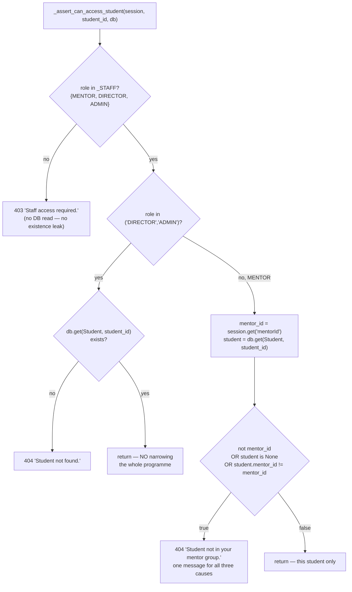

# Chapter 5 — Auth & RBAC: Passwords, Sessions, and Who Is Allowed to See a Student

When you finish this chapter you will be able to read a stored REEP password byte by byte
and say which scrypt parameters produced it; trace a login from the POST body through the
HS256 token to the `Set-Cookie` header and back into a handler's `session` dict; name every
guard function in the backend, what it admits and what status code it raises; walk
`_assert_can_access_student` branch by branch and explain precisely what a MENTOR with no
Mentor group can see (nothing) and why the tempting alternative reading is a full-cohort
data breach; say which of those decisions a test actually pins and which are one careless
edit from silently regressing; and add a new endpoint with the right guard on the first
line of its body, because that first line *is* the security control in this codebase.

**In scope.** `app/platform/credentials.py`, `app/schemas/auth.py`, `app/api/account/sign_in.py`, `app/platform/identity.py`,
the guard family in `app/api/mentor/mentees.py`, `app/api/student/self_service.py` and
`app/api/legacy/voice_assistant.py`, the auth-relevant slice of `app/config.py` and `app/seed.py`,
`tests/test_auth_rbac.py`, and the client-side session model — three files,
`apps/web/src/app/core/session.ts`, `core/auth.service.ts` and `core/auth.guard.ts`.

**Deferred.** Process topology and the dev proxy are Chapter 1 §2; the request lifecycle and
the CORS middleware are Chapter 1 §4 — this chapter cross-references them rather than
restating them. (Chapter 1 §6, "The trust boundaries", states Rules 1 and 2 as rules; §6 of
*this* chapter is their mechanism.) `get_db` and the repo-wide status-code conventions are
Chapter 2. The `users`, `students` and `mentors` columns are described column by column in
Chapter 3; here they appear only where a scope decision reads them. The rest of the mentor,
director, voice and agent surfaces — what those endpoints *do* once you are past the guard —
are Chapters 6, 7 and 11. Rule 1, the student-data egress gate, is Chapter 8. Two further
files under `apps/web/src/app/core/` are out of scope here and are not swept:
`core/chat-voice.service.ts` (and its spec) belongs to Chapter 11, and `core/theme.service.ts`
to the frontend chapter.

**A note on subsection numbers.** Every `###` heading below carries an explicit number
(§2.5, §6.3, …) so that cross-references inside the chapter resolve to something you can
actually navigate to. Where this chapter says "§2.6" it means the sixth subsection of
section 2, by that number, printed in its heading.

---

## 1. Password storage: `scrypt:salt:digest`, and why it is shaped like Node

### 1.1 The stored string

A REEP password hash is one line of ASCII with exactly three colon-separated segments:

```
scrypt:9f3c1e0b7a4d6250e8c1b39f04a7d612:5c8e…(128 hex chars)…a91f
└─────┘└──────────── 32 hex chars ────────────┘└─── 128 hex chars ───┘
 scheme                 salt                          digest
```

Total length is always 168 characters: `scrypt` (6) + `:` + 32 + `:` + 128. The scheme tag
is the literal lowercase word `scrypt`; both variable segments are lowercase hex. The
column that holds it is a plain `String` with the format repeated as a comment on the model
itself ([apps/api-py/app/models/user.py:46-48](apps/api-py/app/models/user.py#L46-L48)):

```python
    # Format: "scrypt:<salt_hex>:<digest_hex>" — identical to the Next.js app,
    # so migrated hashes verify without a reset.
    password_hash: Mapped[str] = mapped_column(String)
```

Note what the string does **not** carry: no cost parameters. Modular-crypt and PHC formats
encode them (`$scrypt$ln=14,r=8,p=1$…`) so that a hash written under old parameters can
still be verified after the parameters change. REEP's format cannot do that. The parameters
live in exactly one place in the process — §1.2 shows where — and §1.4 plus rulebook item 14
explain why that single location is load-bearing.

### 1.2 The parameters

```python
# Node scryptSync defaults: N=16384, r=8, p=1, keylen here=64. maxmem must exceed
# 128 * N * r (= 16 MiB); give it headroom.
_SCRYPT = dict(n=16384, r=8, p=1, dklen=64, maxmem=64 * 1024 * 1024)
```

— [apps/api-py/app/platform/credentials.py:23-25](apps/api-py/app/platform/credentials.py#L23-L25).

scrypt is a *key derivation function*: it turns a password into a fixed-length key, slowly
and using a lot of memory, so that an attacker who steals the database cannot try billions
of candidate passwords per second on a GPU. `n=16384` is its CPU/memory cost (2^14), `r=8`
the block size, `p=1` the parallelisation factor, `dklen=64` the derived-key length in bytes
(hence 128 hex characters), and `maxmem` an OpenSSL guard rail that must be larger than the
memory the derivation will actually claim. The comment's arithmetic is right — 128 × 16384 ×
8 = 16,777,216 bytes, 16 MiB — and worth reading as a note to a future editor rather than as
a scar: 16 MiB is already below OpenSSL's own default ceiling that `hashlib.scrypt`'s
`maxmem=0` selects, so the explicit 64 MiB is headroom, not a fix for an observed crash.
What it buys is that raising `n` later will not immediately blow the default ceiling.

`_SCRYPT` is a module-private dict (leading underscore — the repo's marker for anything not
meant to leave its file) and it is splatted into **both** the hash path and the verify path.
That is the only mechanism keeping the two in step; there is no per-hash record to compare
against.

### 1.3 The two functions, in full

Both are short enough that the whole function is the point
([apps/api-py/app/platform/credentials.py:28-42](apps/api-py/app/platform/credentials.py#L28-L42)):

```python
def hash_password(password: str) -> str:
    salt = secrets.token_hex(16)
    digest = hashlib.scrypt(password.encode(), salt=salt.encode(), **_SCRYPT).hex()
    return f"scrypt:{salt}:{digest}"


def verify_password(password: str, stored: str) -> bool:
    parts = stored.split(":")
    if len(parts) != 3:
        return False
    scheme, salt, digest = parts
    if scheme != "scrypt" or not salt or not digest:
        return False
    derived = hashlib.scrypt(password.encode(), salt=salt.encode(), **_SCRYPT).hex()
    return hmac.compare_digest(derived, digest)
```

`hash_password`, line by line. `secrets.token_hex(16)` draws 16 bytes (128 bits) from the
OS CSPRNG and returns them as a 32-character hex *string*. `hashlib.scrypt` then derives 64
bytes and `.hex()` renders them as 128 characters. The f-string assembles the three
segments. There is no pepper, no iteration counter, no versioning.

`verify_password`, line by line. `stored.split(":")` is unbounded, so a stored value with a
fourth colon yields four parts and the length guard returns `False` — the function fails
closed rather than parsing partially. The scheme is compared by exact string equality, and
empty salt or digest is rejected, so the degenerate `"scrypt::"` can never verify. The
derivation repeats the write path exactly, using the salt as stored. The comparison is
`hmac.compare_digest`, not `==`.

A free consequence of those two guards worth knowing before you meet it in a test fixture
([apps/api-py/tests/test_retention.py:44](apps/api-py/tests/test_retention.py#L44) creates a
`User` with `password_hash="x"`): a sentinel like that is not an error condition anywhere. It
splits into one part, hits the `len(parts) != 3` guard, returns `False`, and the account is
simply permanently unloginnable behind the normal "Invalid email or password." message. No
exception, no log line, no 500.

I confirmed the shapes by running the real functions in the project venv: three parts,
scheme `scrypt`, salt segment 32 characters, digest segment 128, total length 168;
`verify_password('pw', h)` → `True`; wrong password → `False`; `verify_password('pw', 'x')` →
`False`; `verify_password('pw', 'scrypt::')` → `False`.

### 1.4 The salt-as-hex-string trick — the detail that looks like a bug

Read `salt=salt.encode()` carefully. `salt` is a 32-character hex *string*, and `.encode()`
turns those 32 ASCII characters into 32 bytes. The KDF is therefore salted with the
characters `9`, `f`, `3`, `c`… — **not** with the 16 raw bytes those characters represent.
A reviewer who has hashed passwords before will reach for `bytes.fromhex(salt)`. Doing so
would invalidate every password in the database.

> **Why it is like this.** The module docstring states the contract in its first five lines
> ([apps/api-py/app/platform/credentials.py:1-9](apps/api-py/app/platform/credentials.py#L1-L9)):
>
> ```
> Password:  "scrypt:<salt_hex>:<digest_hex>", scrypt(N=16384, r=8, p=1, dklen=64)
>            with the salt passed as its hex STRING (exactly what node:crypto's
>            scryptSync does), so hashes migrate across without a reset.
> ```
>
> REEP used to be a Next.js app with a NestJS API (see AGENTS.md, and Chapter 1 §1).
> Node's `crypto.scryptSync(password, salt, keylen)` converts a JavaScript string salt to a
> Buffer as UTF-8, so the Node implementation also salted with the 32 ASCII characters.
> Python's `str.encode()` defaults to UTF-8, so the two agree byte for byte and a hash
> written by the retired stack verifies here untouched. The alternative was a forced
> password reset for every user in the college at cutover.

The redundancy costs nothing in strength: the salt is still a 16-byte CSPRNG draw, merely
transported as 32 bytes of text. The commit that created this file — `73a901b feat(api-py):
FastAPI backend scaffold + auth slice (migration Phase 1)`, the only commit `git log
--follow` reports for `platform/credentials.py`, `schemas/auth.py` and `api/account/sign_in.py` — says the
format was "cross-verified Node->Python". No fixture or test preserves that check today;
§8.3 records it as a coverage gap.

### 1.5 Is the comparison constant-time?

Yes, and deliberately. `hmac.compare_digest(derived, digest)` compares in time independent
of where the first differing byte falls; `hmac` is imported at
[apps/api-py/app/platform/credentials.py:12](apps/api-py/app/platform/credentials.py#L12) for this single call. Both
operands are `str`, which `compare_digest` accepts provided both are ASCII-only — hex always
is. Swapping in `==` would reintroduce a byte-wise early-exit timing oracle: `==` on two
strings stops at the first differing character, so the time it takes leaks how many leading
characters the attacker guessed correctly. The practical exploitability here is weak (an
attacker would have to invert scrypt to turn digest-timing knowledge into a password), but it
is exactly the kind of "simplification" that passes review unnoticed, and this one call is
the whole defence.

The same standard is not applied everywhere. `require_voice_worker` compares its shared
secret with a plain `!=` ([apps/api-py/app/api/legacy/voice_assistant.py:89](apps/api-py/app/api/legacy/voice_assistant.py#L89)),
in a different module of the same package — `hmac.compare_digest` is used once in the whole
backend, at [platform/credentials.py:42](apps/api-py/app/platform/credentials.py#L42), and the voice guard does not
reach for it. That is an internal inconsistency worth knowing about, not a demonstrated
vulnerability — see §7.

### 1.6 Where hashes are created

Only one module in application code calls `hash_password`: the dev seed, which imports it at
[apps/api-py/app/seed.py:52](apps/api-py/app/seed.py#L52) and creates exactly three —
`director123` ([seed.py:80](apps/api-py/app/seed.py#L80)), `student123`
([seed.py:94](apps/api-py/app/seed.py#L94)) and `mentor123`
([seed.py:119](apps/api-py/app/seed.py#L119)). Each sits behind an existence check, which is
what makes re-seeding idempotent: an existing account is never re-hashed and never
overwritten. The whole module refuses to run under `ENV=prod`
([seed.py:61-69](apps/api-py/app/seed.py#L61-L69)) with no override flag, because a DIRECTOR
account behind a password printed in AGENTS.md must never exist on a production host.
Chapter 16 covers that guard and its three tests; it matters here only because those three
hashes are the ones every test in `tests/test_auth_rbac.py` authenticates against.

There is **no password-change or password-reset endpoint anywhere in the backend** — no
router calls `hash_password` — so in the current codebase the only way a password comes into
existence is the seed, and the only way one changes is a direct database write.

---

## 2. Session issuance: the HS256 JWT

### 2.1 Minting

```python
def create_session_token(payload: dict) -> str:
    now = datetime.now(timezone.utc)
    claims = {**payload, "iat": now, "exp": now + timedelta(seconds=SESSION_TTL_SECONDS)}
    return jwt.encode(claims, settings.auth_secret, algorithm="HS256")
```

— [apps/api-py/app/platform/credentials.py:45-48](apps/api-py/app/platform/credentials.py#L45-L48). The library is
PyJWT (`import jwt`, [platform/credentials.py:16](apps/api-py/app/platform/credentials.py#L16)), pinned
`pyjwt==2.13.0` in [apps/api-py/requirements.txt:25](apps/api-py/requirements.txt#L25). The
algorithm is HS256 — HMAC-SHA256, symmetric, one secret for both signing and verification.

**What a JWT physically is, because the rest of this chapter depends on it.** A JWT is three
base64url segments joined by dots — header, claims, signature — and only the third is
cryptographic. The claims are *encoded*, not encrypted. I decoded the middle segment of a
freshly minted token with nothing but a base64 decoder:

```
{"userId":"u1","email":"a@b.c","name":"N","role":"STUDENT","iat":1786991523,"exp":1787034723}
```

Anyone who obtains the cookie can read that student's name, email, role and `studentId` in
one command. HS256 guarantees only that they cannot *change* any of it without `AUTH_SECRET`:
tamper-evidence, not confidentiality. That is the real reason the cookie is `HttpOnly` and
never handed to JavaScript (§3.1) — not to hide the token's existence, but because the token
is a readable identity document and every script on the page would otherwise hold a copy.

`SESSION_TTL_SECONDS = 60 * 60 * 12` ([platform/credentials.py:21](apps/api-py/app/platform/credentials.py#L21)) is
43,200 seconds: **twelve hours**, expressed as arithmetic so the intent is readable.

The merge order is the safe one. `{**payload, "iat": …, "exp": …}` spreads the caller's
payload *first*, so a caller who passed their own `exp` would have it overwritten by the
computed one rather than overriding it. `iat` and `exp` go in as timezone-aware `datetime`
objects and PyJWT converts registered date claims to integer UNIX seconds during encode.

### 2.2 The claim set

`_payload_for(user)` decides what goes in
([apps/api-py/app/api/account/sign_in.py:29-40](apps/api-py/app/api/account/sign_in.py#L29-L40)):

```python
def _payload_for(user: User) -> dict:
    payload = {
        "userId": user.id,
        "email": user.email,
        "name": user.name,
        "role": user.role.value,
    }
    if user.student is not None:
        payload["studentId"] = user.student.id
    if user.mentor is not None:
        payload["mentorId"] = user.mentor.id
    return payload
```

| Claim | Type | Always present? | Source |
|---|---|---|---|
| `userId` | str | yes | `User.id` (uuid4 hex) |
| `email` | str | yes | `User.email` |
| `name` | str | yes | `User.name` |
| `role` | str | yes | `user.role.value` — `"STUDENT"`/`"MENTOR"`/`"DIRECTOR"`/`"ADMIN"` |
| `studentId` | str | only when the user has a `Student` row | `user.student.id` |
| `mentorId` | str | only when the user has a `Mentor` row | `user.mentor.id` |
| `iat` | int | yes | added by `create_session_token` |
| `exp` | int | yes | `iat + 43200` |

There is deliberately no `sub`, no `jti`, no `iss`, no `aud`, no `nbf`. `role` takes
`.value` off the `Role` enum ([app/models/user.py:23](apps/api-py/app/models/user.py#L23))
so the wire carries a plain string rather than an enum repr.

**Convention (and an invariant several later sections lean on): `Role` is a `str` enum whose
values are identical to their names.**

```python
class Role(str, enum.Enum):
    STUDENT = "STUDENT"
    MENTOR = "MENTOR"
    DIRECTOR = "DIRECTOR"
    ADMIN = "ADMIN"
```

— [apps/api-py/app/models/user.py:23-27](apps/api-py/app/models/user.py#L23-L27). Because
`Role.STUDENT.value == "STUDENT"`, code that writes `session.get("role") != Role.STUDENT.value`
and code that writes `session.get("role") not in {"MENTOR", "DIRECTOR", "ADMIN"}` are testing
the same strings. §5.6 shows both spellings live in the codebase; this invariant is why the
split is harmless today and why silently changing an enum *value* away from its name would
break the bare-literal call sites and nothing else.

Two structural properties follow and both are load-bearing later. First, `studentId` and
`mentorId` are **added conditionally, not set to `None`** — the key is absent from the token
when the row does not exist, which is why every consumer in the backend reads
`session.get("mentorId")` rather than `session["mentorId"]`. Second, `user.student` and
`user.mentor` are the one-to-one relationships at
[app/models/user.py:52-53](apps/api-py/app/models/user.py#L52-L53) (`uselist=False`), so the
claim is a snapshot of the database at the instant of login.

I decoded a freshly minted token to confirm the header and the exact claim set: header
`{'alg': 'HS256', 'typ': 'JWT'}`; claim keys `['email', 'exp', 'iat', 'name', 'role',
'userId']` for a payload without student or mentor rows; `exp - iat` exactly 43200.

### 2.3 The camelCase island

`userId`, `studentId`, `mentorId` are camelCase in a backend that is otherwise uniformly
snake_case (`student_id`, `worker_id`, `password_hash`). This is the single deliberate
exception in the Python codebase, and the justification lives on the schema module's
docstring — not on the model it justifies
([apps/api-py/app/schemas/auth.py:1-2](apps/api-py/app/schemas/auth.py#L1-L2)):

```python
"""Request/response models for auth. Field names mirror the Next.js session
payload (camelCase) so the Angular client is unchanged across the cutover."""
```

The convention runs end to end across three files with nothing mechanical enforcing it:
JWT claim → the Pydantic response model `SessionUser`
([schemas/auth.py:12-18](apps/api-py/app/schemas/auth.py#L12-L18)) → the TypeScript
interface `SessionPayload`
([apps/web/src/app/core/session.ts:10-18](apps/web/src/app/core/session.ts#L10-L18)), whose
own docstring says it was "ported verbatim so a token minted by the backend carries exactly
the fields the UI already expects". **Convention: session/JWT payload keys are camelCase;
every other request and response body field in the backend is snake_case.** If you find
yourself writing `session["student_id"]`, you have the wrong dictionary.

### 2.4 Verifying, and what fails how

```python
def verify_session_token(token: str) -> dict | None:
    try:
        return jwt.decode(token, settings.auth_secret, algorithms=["HS256"])
    except jwt.PyJWTError:
        return None
```

— [apps/api-py/app/platform/credentials.py:51-55](apps/api-py/app/platform/credentials.py#L51-L55). Two things
matter here.

`algorithms=["HS256"]` is an explicit allow-list, and it is the defence against algorithm
confusion — the family of attacks in which the *attacker* gets to choose how their own token
is verified, by writing an algorithm name into the token's own header. Without the
allow-list, two forgeries open up. First, a token whose header says `alg: none` carries no
signature at all, and a verifier that trusts the header accepts it as valid. Second, if this
deployment ever moved to an asymmetric algorithm (RS256, where a private key signs and a
*public* key verifies), an attacker could flip the header back to `HS256` and sign the token
using that published public key as the HMAC secret; a verifier that trusts the header's `alg`
would then verify with the same public value and pass. Pinning `algorithms=["HS256"]` means
the header's claim about itself is never consulted — the server decides the algorithm, not
the token.

Because the claim payload *is* the authorisation decision in this app — `role`, `studentId`,
`mentorId` are never re-read from the database (§5.1) — accepting a forged algorithm would be
complete impersonation of any role, DIRECTOR included.

`except jwt.PyJWTError` catches PyJWT's exception **base class**. `InvalidSignatureError`,
`ExpiredSignatureError`, `DecodeError` and every sibling collapse into the same `None`. The
code therefore cannot distinguish "expired" from "tampered" from "garbage", and nothing is
logged at any level. That is deliberate opacity toward the caller; it also means an operator
debugging "why am I being signed out" gets no signal from the server. PyJWT's decode
defaults apply: signature verification on, `exp` enforced with zero leeway, no audience or
issuer requirement because none are passed. I confirmed the tamper path empirically —
mutating the last two characters of a valid token makes `verify_session_token` return `None`.

**A token signed with a different `AUTH_SECRET` fails signature verification and is
therefore indistinguishable from a forgery: `None`, then 401.** That is also the app's only
revocation mechanism. See §2.5.

### 2.5 What the secret is, and the hole under it

`auth_secret` is a `Settings` field mapping case-insensitively to the `AUTH_SECRET`
environment variable, and it **ships with a working default**
([apps/api-py/app/config.py:21-22](apps/api-py/app/config.py#L21-L22)):

```python
    # Shared with the Next.js app so sessions verify on both sides during cutover.
    auth_secret: str = "reep-dev-secret-change-me-in-production-0123456789abcdef"
```

So the API boots and mints perfectly valid sessions with a secret published in this
repository, and there is **no startup guard**: `lifespan` in
[apps/api-py/app/main.py:31-55](apps/api-py/app/main.py#L31-L55) checks
`VOICE_WORKER_SECRET` and nothing else. The consequence is stated in prose in exactly two
places — [apps/api-py/README.md:121-122](apps/api-py/README.md#L121-L122) ("shipping it lets
anyone forge a session cookie for any user") and
[docs/deployment-env.md:30](docs/deployment-env.md#L30) ("anyone who has read this repo mint a
valid session cookie for any user, including a DIRECTOR"). **`.env.example` is not one of
them**, which is worth knowing because it is the file an operator actually copies: its only
comment on this setting ([apps/api-py/.env.example:9-10](apps/api-py/.env.example#L9-L10)) is
"MUST match the Next.js app's AUTH_SECRET so sessions are interoperable during the cutover
(same HS256 secret => tokens verify on both sides). >= 32 chars." — interoperability and
length, not forgeability. The same file *does* spell out the analogous consequence for
`VOICE_WORKER_SECRET` at [:79-81](apps/api-py/.env.example#L79-L81) ("BLANK IS OPEN: anyone
who can reach the API could forge a heartbeat…", the text §7 cites), so the omission is an
inconsistency within one file rather than a house style. It is enforced mechanically in
exactly one place: [docker-compose.prod.yml:47](docker-compose.prod.yml#L47) and
[:63](docker-compose.prod.yml#L63) use `AUTH_SECRET: ${AUTH_SECRET:?set AUTH_SECRET}`, whose
`:?` form makes compose refuse to start. A deployment that runs the image any other way —
bare `uvicorn`, plain `docker run`, a PaaS — boots happily on the published secret with no
symptom until the breach. CI sets a throwaway value rather than relying on the default
([.github/workflows/ci.yml:43](.github/workflows/ci.yml#L43)).

Rotating `AUTH_SECRET` invalidates every outstanding token at once, because every one of them
now fails signature verification. That is the whole revocation story, and §2.6 explains what
it has to compensate for.

### 2.6 Staleness: what a token is authoritative about, and for how long

Because `_payload_for` snapshots `role`, `studentId` and `mentorId` at login, and because
nothing on any request path re-reads the `users` table (§5.1), a session is authoritative for
its full twelve hours regardless of what happens to the row behind it. Promoting a MENTOR to
DIRECTOR, demoting an account, deleting a `Student` row, reassigning a mentee, or deleting
the `User` outright has **no effect** on an issued token. There is no `jti`, no denylist, no
session table and no version column compared at decode time. Rotating `AUTH_SECRET` is the
only kill switch, and it logs everybody out at once.

The most common benign manifestation: a new MENTOR whose `Mentor` row is created *after*
they signed in holds a token with no `mentorId`, so they see zero mentees until they log in
again — and the UI cannot distinguish that from "you genuinely have no mentees" (§6.4).

---

## 3. The cookie

### 3.1 The `Set-Cookie` call

```python
    response.set_cookie(
        SESSION_COOKIE,
        token,
        httponly=True,
        samesite="lax",
        secure=settings.is_prod,
        path="/",
        max_age=SESSION_TTL_SECONDS,
    )
```

— [apps/api-py/app/api/account/sign_in.py:68-76](apps/api-py/app/api/account/sign_in.py#L68-L76), with
`SESSION_COOKIE = "reep_session"` at
[apps/api-py/app/platform/credentials.py:20](apps/api-py/app/platform/credentials.py#L20). **Convention: the cookie
name and the REEP-specific environment variables are product-prefixed** — `reep_session`,
`REEP_REQUIRE_DB`, `REEP_API_URL` — so they never collide with another app on the same host.

| Attribute | Value | Set where | Notes |
|---|---|---|---|
| name | `reep_session` | `platform/credentials.py:20` | one constant, imported by name, never re-typed |
| `HttpOnly` | always | `auth.py:71` | JavaScript can never read the session |
| `SameSite` | `lax` | `auth.py:72` | sent on same-site requests and top-level navigations |
| `Secure` | `settings.is_prod` | `auth.py:73` | **the only environment-dependent attribute** |
| `Path` | `/` | `auth.py:74` | the whole origin, including `/api` |
| `Max-Age` | `43200` | `auth.py:75` | matches the JWT `exp` |
| `Domain` | *omitted* | — | host-only cookie; no subdomain sharing |
| `Expires` | *omitted* | — | lifetime governed by `Max-Age` alone |

`is_prod` is a derived property, not a field
([apps/api-py/app/config.py:100-102](apps/api-py/app/config.py#L100-L102)):

```python
    @property
    def is_prod(self) -> bool:
        return self.env.lower() == "prod"
```

so `ENV=prod`, `ENV=PROD` and `ENV=Prod` all count. **Convention: derived booleans are
read-only `@property` values phrased as predicates** — `is_prod`, `livekit_ready`,
`allow_remote_student_data` — never stored fields.

In dev the header Starlette emits is
`reep_session=<jwt>; HttpOnly; Max-Age=43200; Path=/; SameSite=lax`; in prod the same with
`; Secure` appended.

> **Why it is like this.** `ENV=prod` is not a cosmetic flag. The README states the
> operational consequence ([apps/api-py/README.md:118-119](apps/api-py/README.md#L118-L119)):
> "`ENV=prod` — marks the session cookie `Secure` (so **TLS is required**, or every login
> silently behaves as logged-out)". Behind a load balancer that terminates TLS and then
> speaks plain HTTP to the app without the browser seeing HTTPS, the browser refuses to
> store the cookie: login returns 200 with a full session body, and the very next request is
> anonymous. Nothing errors. That is the failure to recognise on sight.

### 3.2 Same-origin, cross-origin, cross-site: three different thresholds

The client never sees the token. The only way it reaches the API is the browser attaching a
cookie. That is why `environment.apiBase` is the *relative* string `'/api'`
([apps/web/src/environments/environment.ts:8-11](apps/web/src/environments/environment.ts#L8-L11)),
with the reasoning written into the file:

```ts
  /// The FastAPI API runs on 3300 (uvicorn). The dev proxy (proxy.conf.json)
  /// forwards /api -> http://localhost:3300 so this stays same-origin in the
  /// browser and the http-only session cookie is carried without CORS friction.
  apiBase: '/api',
```

Chapter 1 §4 covers the proxy hop and the CORS middleware. The auth-relevant summary: in
dev the browser only ever talks to `localhost:4200`, so every `/api/...` request is
same-origin and the cookie rides along; the `CORSMiddleware` with
`allow_origins=[settings.web_origin], allow_credentials=True`
([apps/api-py/app/main.py:60-67](apps/api-py/app/main.py#L60-L67)) exists for the deployment
where they are separate origins, and the comment above it — "Credentials are sent (the
session cookie), so the origin must be explicit, not `*`" — records the rule that a wildcard
origin is illegal with credentials.

Now define the two terms, because they are not synonyms and confusing them sends you after
the wrong attribute.

- **Origin** = scheme + host + **port**. `http://localhost:4200` and `http://localhost:3300`
  are *different origins*. This is what CORS is judged on.
- **Site** = the registrable domain (roughly, the name you can buy: `example.com`,
  `localhost`). **Ports are irrelevant to it, and cookies are not scoped by port at all.**
  This is what `SameSite` is judged on.

So the two deployments you are most likely to try are **same-site**:

| Front end | API | Same origin? | Same site? | Is `reep_session` sent? |
|---|---|---|---|---|
| `localhost:4200` (dev proxy) | `/api` → `localhost:3300` | yes | yes | yes |
| `localhost:4200` calling `localhost:3300` directly | different port | **no** | yes | **yes** — Lax does not care about ports |
| `app.example.com` | `api.example.com` | no | yes (`example.com`) | yes |
| front end on one vendor | API on another registrable domain | no | **no** | **no** |

In rows 2 and 3, `SameSite=lax` still sends the cookie, and the thing you must get right is
**CORS**: the exact `allow_origins` value at
[app/main.py:60-67](apps/api-py/app/main.py#L60-L67) must equal the front end's origin
character for character, and every call must set `credentials: 'include'` (§9.4). A wildcard
will not work, because the CORS specification forbids `Access-Control-Allow-Origin: *`
together with credentials.

Row 4 — genuinely different registrable domains, a front end on one vendor against an API on
another — is where `SameSite=lax` withholds the cookie, and **there the failure is the
confusing one.** The login POST succeeds and returns a 200 with the full session body, so the
client sets its signal and routes to the dashboard; but the cookie is not attached to the
subsequent cross-site XHRs, so every data call 401s. The screen renders signed-in and empty.
There is no `Authorization`-header fallback anywhere in this codebase — a repo-wide search of
the client finds no occurrence of the string `Authorization` — so there is nothing to fall
back to. Fixing *that* requires `SameSite=None; Secure` on the cookie *and* an exact
(non-wildcard) CORS origin *and* `credentials: 'include'` on every call: three coordinated
changes, which is precisely why the dev proxy exists instead.

### 3.3 The login round trip, end to end

The pieces are spread across §1.3, §2.1, §3.1 and §5.1 because that is where the code lives.
Here they are in one sequence, with the real identifiers:

```mermaid
sequenceDiagram
    autonumber
    participant B as Browser (Angular SPA)
    participant A as FastAPI — api/account/sign_in.py
    participant S as app/platform/credentials.py
    participant D as Postgres

    B->>A: POST /api/auth/login {email, password}
    A->>D: select(User).where(User.email == email.strip().lower())
    D-->>A: User row (or None)
    A->>S: verify_password(body.password, user.password_hash)
    S-->>A: True / False
    Note over A: False (or user is None) ⇒ 401 "Invalid email or password."
    A->>D: user.last_login_at = now; LoginDay upsert; db.commit()
    A->>A: payload = _payload_for(user)
    A->>S: create_session_token(payload)
    S-->>A: HS256 JWT (iat, exp = iat + 43200)
    A-->>B: 200 SessionUser + Set-Cookie: reep_session=<jwt>;<br/>HttpOnly; Max-Age=43200; Path=/; SameSite=lax

    Note over B,A: …later, any authenticated request…
    B->>A: GET /api/mentor/mentees (cookie attached by the browser)
    A->>A: get_current_session(request)  [identity.py:8]
    A->>S: verify_session_token(cookie)
    alt signature valid and not expired
        S-->>A: claims dict
        A->>A: require_mentor(session)  — first statement of the body
        A-->>B: 200
    else missing / malformed / tampered / expired
        S-->>A: None
        A-->>B: 401 "Sign in required."
    end
```

The single most important thing this picture shows: after the login exchange, **no arrow
touches Postgres for identity**. `get_current_session` issues no query, and `require_mentor`
reads a dictionary. That is the mechanism behind §2.6.

---

## 4. The auth endpoints

### 4.1 The router, and the conventions around it

The router is declared once at module level
([apps/api-py/app/api/account/sign_in.py:26](apps/api-py/app/api/account/sign_in.py#L26)) as
`router = APIRouter(prefix="/auth", tags=["auth"])` and mounted with the shared prefix at
[apps/api-py/app/main.py:77](apps/api-py/app/main.py#L77), so the live paths are
`/api/auth/login`, `/api/auth/me`, `/api/auth/logout`.

**Convention: a router module defines exactly one module-level `router` with a bare domain
prefix and a single-element `tags` list; the `/api` prefix is applied once at include time.**
There are three exceptions, and they are all visible in `main.py`:

- `agent.py` and `voice.py` carry `/api` in their own prefix
  (`APIRouter(prefix="/api/agent", …)` at [agent.py:44](apps/api-py/app/api/legacy/text_assistant.py#L44),
  `APIRouter(prefix="/api/voice", …)` at [voice.py:39](apps/api-py/app/api/legacy/voice_assistant.py#L39))
  and are included without one ([main.py:72-73](apps/api-py/app/main.py#L72-L73));
- `health.py` declares a bare `router = APIRouter()` — **no prefix and no `tags` at all**
  ([health.py:24](apps/api-py/app/api/system/health.py#L24)) — and is mounted unprefixed
  ([main.py:69-70](apps/api-py/app/main.py#L69-L70)), because `/health` and `/ready` are
  infra probes, not a domain area, and must not sit under `/api`.

**Convention: path-operation function names are the bare action or noun — `login`, `me`,
`logout` — because the URL supplies the context.** ("Path operation" is FastAPI's name for a
route handler: the function decorated with `@router.get(...)` / `@router.post(...)`.)

**Convention: Pydantic request models are named `<Noun>In` and response models `<Noun>Out`.**
The mentor router is the clearest example — `NoteIn` ([mentor.py:95](apps/api-py/app/api/mentor/mentees.py#L95))
/ `NoteOut` ([:87](apps/api-py/app/api/mentor/mentees.py#L87)), `UploadReviewIn`
([:433](apps/api-py/app/api/mentor/mentees.py#L433)) / `UploadOut`
([:375](apps/api-py/app/api/mentor/mentees.py#L375)), `SkillClaimReviewIn`
([:531](apps/api-py/app/api/mentor/mentees.py#L531)) / `SkillClaimReviewOut`
([:477](apps/api-py/app/api/mentor/mentees.py#L477)), `DecisionIn`
([:280](apps/api-py/app/api/mentor/mentees.py#L280)), `MenteeOut`
([:37](apps/api-py/app/api/mentor/mentees.py#L37)), `AlertOut`
([:161](apps/api-py/app/api/mentor/mentees.py#L161)) — and voice follows it too (`HeartbeatIn` at
[voice.py:101](apps/api-py/app/api/legacy/voice_assistant.py#L101), `StatusOut` at
[voice.py:166](apps/api-py/app/api/legacy/voice_assistant.py#L166)). **`app/schemas/auth.py` is the
deliberate exception**: `LoginRequest` and `SessionUser` keep the names the retired stack
used, alongside the camelCase fields, so the client contract is unchanged. Note also that
most schemas are declared *inside the router that uses them*; `app/schemas/` holds only the
shapes shared across modules.

There are three endpoints and one private helper.

### 4.2 `POST /api/auth/login`

Request model ([apps/api-py/app/schemas/auth.py:7-9](apps/api-py/app/schemas/auth.py#L7-L9)):

```python
class LoginRequest(BaseModel):
    email: str
    password: str
```

Plain `str`, not `EmailStr` — there is no address-format validation — and no minimum or
maximum password length. Pydantic v2's default `extra='ignore'` means unknown body keys are
dropped silently, which is not hypothetical: the Angular client POSTs a third key, `next`,
whenever the visitor arrived via the guard's redirect
([apps/web/src/app/core/auth.service.ts:32](apps/web/src/app/core/auth.service.ts#L32)
declares `login(email, password, next?)` and
[:36](apps/web/src/app/core/auth.service.ts#L36) sends `{ email, password, next }`), and the
server discards it without a 422. On a *direct* visit to `/login` the client's `safeNext`
getter returns `undefined` ([login.component.ts:60-62](apps/web/src/app/features/login/login.component.ts#L60-L62)),
and `JSON.stringify` drops keys whose value is `undefined`, so exactly two keys go on the
wire. Both shapes are accepted identically.

Response model — quoted in full because it is the wire contract every later section refers
back to ([apps/api-py/app/schemas/auth.py:12-18](apps/api-py/app/schemas/auth.py#L12-L18)):

```python
class SessionUser(BaseModel):
    userId: str
    email: str
    name: str
    role: str
    studentId: str | None = None
    mentorId: str | None = None
```

The 200 body for the seeded director is therefore, literally (I dumped the model to confirm
the null handling):

```json
{"userId": "…", "email": "director@bgscet.ac.in", "name": "Director (seed)",
 "role": "DIRECTOR", "studentId": null, "mentorId": null}
```

Note the asymmetry with §2.2: the **JWT omits** `studentId`/`mentorId` when there is no row,
while the **HTTP body sends explicit `null`**, because Pydantic fills the declared default
and FastAPI does not exclude `None` by default. §9.6 explains why that matters on the client.

The handler ([apps/api-py/app/api/account/sign_in.py:43-52](apps/api-py/app/api/account/sign_in.py#L43-L52)):

```python
@router.post("/login", response_model=SessionUser)
def login(body: LoginRequest, response: Response, db: Session = Depends(get_db)) -> SessionUser:
    email = body.email.strip().lower()
    user = db.scalar(select(User).where(User.email == email))
    # One message for both cases — never reveal which of email/password was wrong.
    if user is None or not verify_password(body.password, user.password_hash):
        raise HTTPException(
            status_code=status.HTTP_401_UNAUTHORIZED,
            detail="Invalid email or password.",
        )
```

Three things deserve attention.

**It is a synchronous `def`, not `async def`.** FastAPI inspects the handler's signature: a
handler declared `async def` is awaited directly on the single-threaded event loop, while a
plain `def` handler is dispatched to a background worker thread (anyio's threadpool). Since
scrypt here burns ~16 MiB and real CPU time, the sync signature is what keeps that work *off*
the loop. Changing it to `async def` would stall every concurrent request in the process for
the duration of each password check, and nothing in the code, comments or tests would warn
you. (Flagged: this is my reading of framework behaviour, not a documented decision in the
repo.)

**The email is normalised on input only.** `body.email.strip().lower()` is compared with a
plain equality predicate against a plain unique-indexed `String` column — no `citext`, no
functional index, no validator on write. It holds today only because every creation site
writes a lowercase literal. A user row created with an uppercase character in its email can
never log in.

**A failed login does not distinguish unknown-user from wrong-password.** The condition is
a single `or`, and both halves raise the same 401 with the same detail string,
`"Invalid email or password."`. The comment above it says why: over a college roster, a
"no such account" message is an enumeration oracle. Be precise about the limit of the
protection, though: the *response* is uniform, the *timing* is not. Python's `or`
short-circuits, so an unknown email returns after one indexed SELECT while a known email
additionally pays the full scrypt cost. There is no dummy-hash comparison on the miss path
to level it, so enumeration by response time remains possible.

On success the handler records two things
([auth.py:54-64](apps/api-py/app/api/account/sign_in.py#L54-L64)): `user.last_login_at` in UTC, and
a `LoginDay` row keyed on the **local** calendar date, guarded by a SELECT-then-INSERT and
committed together.

> **Why it is like this.** The mixed clocks look like sloppiness and are not. The `LoginDay`
> model docstring explains ([apps/api-py/app/models/user.py:88-92](apps/api-py/app/models/user.py#L88-L92)):
> "The day is the local calendar date (matching the Next.js app), so an evening sign-in is
> not bucketed onto the next UTC day." In IST, UTC bucketing would credit every sign-in
> after 17:30 to tomorrow, and a student's daily streak — a visible product feature — would
> break for anyone who studies in the evening.

One race worth recording: the SELECT-then-INSERT is not atomic, and `login_days` carries
`UniqueConstraint("user_id", "day", name="uq_login_day")`
([models/user.py:95](apps/api-py/app/models/user.py#L95)). Two genuinely concurrent first
logins of a day can both see `already is None`; the loser's `db.commit()` raises
`IntegrityError` and a valid login becomes a 500. There is no `ON CONFLICT DO NOTHING` and
no `try/except` around the commit. The window is narrow and I did not reproduce it.

**Status codes:** 200 on success; 401 on either credential failure; 422 from FastAPI's own
validation when `email` or `password` is missing or non-string; 500 on an unexpected DB
error.

### 4.3 `GET /api/auth/me`

```python
@router.get("/me", response_model=SessionUser)
def me(session: dict = Depends(get_current_session)) -> SessionUser:
    return SessionUser(**session)
```

— [apps/api-py/app/api/account/sign_in.py:80-82](apps/api-py/app/api/account/sign_in.py#L80-L82). 200 with
the same `SessionUser` body as login, or 401 `"Sign in required."` from the dependency.
**There is no database read**: `/auth/me` reflects the token, never the current row, which is
the mechanism behind the staleness property in §2.6. The splat works only because the session
dict is the raw decoded JWT and still carries `iat` and `exp`; Pydantic v2's default
`extra='ignore'` drops them. Setting `extra='forbid'` on `SessionUser` would turn every
`/auth/me` call into a 500 (the two extra keys would raise inside the handler), and setting it
on `LoginRequest` would turn every *guard-redirected* login from the SPA into a 422 — a direct
login would still work, which is exactly what makes that regression easy to miss by hand-test.

### 4.4 `POST /api/auth/logout`

```python
@router.post("/logout")
def logout(response: Response) -> dict:
    response.delete_cookie(SESSION_COOKIE, path="/")
    return {"ok": True}
```

— [apps/api-py/app/api/account/sign_in.py:85-88](apps/api-py/app/api/account/sign_in.py#L85-L88). No
`response_model`, no session dependency: an unauthenticated caller gets a harmless 200. The
body is always `{"ok": true}`.

Starlette's `delete_cookie` delegates to `set_cookie` with `max_age=0, expires=0` and its
own defaults `secure=False, httponly=False, samesite="lax"`. Because this call passes only
`path="/"`, the *clearing* cookie carries neither `HttpOnly` nor `Secure` even under
`ENV=prod`. Deletion still works — browsers match a cookie for replacement by name, domain
and path, not by flags — but the emitted header is not attribute-faithful to the one it
replaces.

The larger point: **logout is purely client-side.** The JWT is stateless with no `jti`,
there is no denylist and nothing on the server is invalidated, so a token captured before
logout remains valid for the remainder of its twelve hours.

### 4.5 Registration: the fourth public endpoint

`POST /api/register` is a different thing entirely and does not mint a session. It is public
by design — the docstring at
[apps/api-py/app/api/account/registration.py:112](apps/api-py/app/api/account/registration.py#L112)
reads "Public: submit an application. No auth — the applicant is not a user yet."

Its shapes, since it is one of the four endpoints this section owns. The request model is
`RegisterIn` ([registration.py:64-71](apps/api-py/app/api/account/registration.py#L64-L71)):

```python
class RegisterIn(BaseModel):
    name: str = Field(min_length=1, max_length=200)
    # A plain string with a light shape check (avoids the email-validator dep);
    # the domain is what the rule engine actually keys on.
    email: str = Field(min_length=3, max_length=200)
    usn: str | None = Field(default=None, max_length=32)
    phone: str | None = Field(default=None, max_length=32)
    degree_level: DegreeLevel = DegreeLevel.PG
```

The response model is `RegistrationOut`
([registration.py:74+](apps/api-py/app/api/account/registration.py#L74)), and the route is
declared `status_code=status.HTTP_201_CREATED`
([registration.py:110](apps/api-py/app/api/account/registration.py#L110)). Its status codes:

| Code | When | Detail |
|---|---|---|
| **201** | application stored | the `RegistrationOut` body |
| **422** | `"@" not in email` or the part after the last `@` has no dot ([registration.py:114-117](apps/api-py/app/api/account/registration.py#L114-L117)) | `"A valid email is required."` |
| **409** | an application with that email already exists ([registration.py:118-122](apps/api-py/app/api/account/registration.py#L118-L122)) | `"An application with this email already exists."` |

That 422 is worth pausing on next to §4.2: **this is the only email-format check in the
backend.** `LoginRequest.email` is a bare `str` with no validation at all, so a malformed
address fails login as a lookup miss (401), while the same address fails registration as a
validation error (422). The comment in `RegisterIn` says why the check is hand-rolled rather
than `EmailStr` — it avoids pulling in the `email-validator` dependency, and the rule engine
only keys on the domain anyway.

Approval only stamps a decision; provisioning the actual `User` and `Student` is a deliberate
follow-up step outside that router, so **no path in `registration.py` ever calls
`hash_password`**. The three staff routes in the same module call `require_director`, imported
from the mentor router at [registration.py:27](apps/api-py/app/api/account/registration.py#L27):
`GET /api/register/pending` ([:163](apps/api-py/app/api/account/registration.py#L163)),
`POST /api/register/{registration_id}/decision` ([:186](apps/api-py/app/api/account/registration.py#L186))
and `GET /api/register/rules` ([:229](apps/api-py/app/api/account/registration.py#L229)). Chapter 6
covers the flow and the rule engine.

### 4.6 Rate limiting and lockout: there is none

State this plainly. A case-insensitive search of `apps/api-py` for
`rate.?limit|RateLimit|slowapi|limiter|throttl` returns zero matches. There is no
middleware, no per-IP or per-account counter, no lockout after N failures, no CAPTCHA and no
`Retry-After`. Nothing records failed attempts either — `last_login_at` is written only on
success and the `users` table has no `failed_attempts` or `locked_until` column
([apps/api-py/app/models/user.py:39-54](apps/api-py/app/models/user.py#L39-L54)). The only
brake on online guessing is the intrinsic cost of one scrypt derivation per attempt,
amplified by FastAPI's default threadpool cap — which also makes this endpoint the natural
saturation point of the process under a login burst. Any real deployment must put rate
limiting in a reverse proxy; nothing in this repo supplies it.

---

## 5. The dependency family

### 5.1 `identity.py` contains one function, and no `require_*` at all

AGENTS.md says "`require_*` dependencies in `apps/api-py/app/platform/identity.py` / the routers read the
session". **The code disagrees with the first half of that sentence, and the disagreement
matters for anyone grepping.** `apps/api-py/app/platform/identity.py` is thirteen lines end to end and
defines exactly one function
([apps/api-py/app/platform/identity.py:1-13](apps/api-py/app/platform/identity.py#L1-L13)):

```python
"""Request dependencies: read the session from the reep_session cookie."""

from fastapi import HTTPException, Request, status

from .security import SESSION_COOKIE, verify_session_token


def get_current_session(request: Request) -> dict:
    token = request.cookies.get(SESSION_COOKIE)
    payload = verify_session_token(token) if token else None
    if not payload:
        raise HTTPException(status_code=status.HTTP_401_UNAUTHORIZED, detail="Sign in required.")
    return payload
```

Every `require_*` guard lives in the router that owns its role area: `require_mentor` and
`require_director` in `mentor.py`, `require_voice_worker` in `voice.py`, and the private
`_require_student` in `student.py`. `director.py`, `leave.py` and `registration.py` import
the mentor router's guards rather than redefining them. Chapter 1 §6 flags the same drift;
the practical consequence is that **`mentor.py` is the single home of the staff-scope
vocabulary**.

Mechanically, `get_current_session` reads the cookie and nothing else: no `Authorization`
header path, no bearer fallback, no query parameter. A caller holding a perfectly valid JWT
but no cookie is anonymous. It takes no `db` and issues no query, so the identity it returns
was true at login time and is not revalidated. Missing cookie, malformed cookie, wrong
signature and expired token all collapse into one 401 with `detail="Sign in required."` —
the SPA cannot tell "never signed in" from "session expired" from the status and detail
alone.

What it returns is the **raw decoded JWT dict**, not a Pydantic model. Handlers type the
parameter `session: dict = Depends(get_current_session)` and index into it. `SessionUser` is
a response model only.

### 5.2 What `Depends` actually does

Before the table, define the one piece of FastAPI vocabulary the rest of this section turns
on. **A parameter whose default value is `Depends(f)` is FastAPI's injection marker.** Before
the handler body runs, FastAPI calls `f` — passing it the `Request`, or whatever `f`'s own
parameters ask for — lets any exception `f` raises propagate as the response, and binds `f`'s
return value to that parameter. So in

```python
def me(session: dict = Depends(get_current_session)) -> SessionUser:
```

`session` is never `Depends(...)` at runtime; it is the dict `get_current_session` returned,
and if that function raised 401 the body never executed at all.

Two properties follow from the fact that this lives in the **signature**:

- FastAPI *knows about it*: it is a node in the resolved dependency graph, so it can be
  replaced in tests through `app.dependency_overrides[get_current_session] = fake`.
- It runs before the first statement of the body, unconditionally.

Being a real dependency does **not**, by itself, put anything in the OpenAPI schema — only a
dependency's *declared request parameters* are documented, and `get_current_session` declares
only `request: Request` ([identity.py:8](apps/api-py/app/platform/identity.py#L8)), which FastAPI excludes. I
generated the schema in the project venv:
`app.openapi()['paths']['/api/auth/me']['get']` has keys `['tags', 'summary', 'operationId',
'responses']` — no `parameters`, no `security` — and `components.securitySchemes` is absent
entirely. **Authentication is therefore exactly as invisible to `/openapi.json` as the role
check is.** The one guard that *does* appear is `require_voice_worker`, because it declares a
`Header(...)` parameter (§7): `POST /api/voice/heartbeat` carries
`{"name": "x-voice-worker-secret", "in": "header", "required": false}` in its `parameters`.

A guard invoked as an ordinary statement *inside* the body — `require_mentor(session)` — has
neither of the two properties above. §5.6 is entirely about what follows from that difference.

`Depends` is also how the database session arrives (`db: Session = Depends(get_db)`, Chapter
2), which is why the pattern is everywhere in this codebase: 80 handler signatures across
`app/routers/` declare `Depends(get_current_session)`.

### 5.3 The family, side by side

| Guard | File | Real `Depends`? | Reads | Returns | Admits | Rejects | Raises |
|---|---|---|---|---|---|---|---|
| `get_current_session` | [identity.py:8](apps/api-py/app/platform/identity.py#L8) | yes | `reep_session` cookie | decoded claims dict | any valid unexpired signature | missing / malformed / expired / wrong-signature | **401** `"Sign in required."` |
| `require_mentor` | [mentor.py:31](apps/api-py/app/api/mentor/mentees.py#L31) | **no** | `session.get("role")` | the same dict | MENTOR, DIRECTOR, ADMIN | STUDENT, absent or unknown role | **403** `"Staff access required."` |
| `require_director` | [mentor.py:233](apps/api-py/app/api/mentor/mentees.py#L233) | **no** | `session.get("role")` | the same dict | DIRECTOR, ADMIN | STUDENT **and MENTOR** | **403** `"Director access required."` |
| `_assert_can_access_student` | [mentor.py:72](apps/api-py/app/api/mentor/mentees.py#L72) | **no** | `role`, `mentorId`, a `Student` row | `None` | DIRECTOR/ADMIN for any existing student; MENTOR for `Student.mentor_id == mentorId` | everyone else | **403** via `require_mentor`; **404** `"Student not found."`; **404** `"Student not in your mentor group."` |
| `_require_student` | [student.py:118](apps/api-py/app/api/student/self_service.py#L118) | **no** | `session.get("studentId")` | the student id (str) | any session with a truthy `studentId` | sessions without one | **403** `"Not a student account."` |
| `require_voice_worker` | [voice.py:65](apps/api-py/app/api/legacy/voice_assistant.py#L65) | yes | `X-Voice-Worker-Secret` header | `None` | exact secret match; anything when the secret is blank and `ENV != prod` | mismatched/absent header when the secret is set; everything when blank under `ENV=prod` | **401** `"Invalid voice worker secret."` / **500** `"Voice worker authentication is not configured."` |

**Convention: a `get_` prefix names a dependency that provides a value (`get_current_session`,
`get_db`); a `require_` prefix names a checker that raises. A leading underscore marks a
module-private helper, and `_assert_` specifically marks one that returns `None` and exists
only to raise. Rejection `detail` strings are complete sentences ending in a full stop,
phrased for a human, and never name the mechanism that refused.**

### 5.4 The two staff gates, quoted

```python
_STAFF = {"MENTOR", "DIRECTOR", "ADMIN"}


def require_mentor(session: dict) -> dict:
    if session.get("role") not in _STAFF:
        raise HTTPException(status_code=status.HTTP_403_FORBIDDEN, detail="Staff access required.")
    return session
```

— [apps/api-py/app/api/mentor/mentees.py:28-34](apps/api-py/app/api/mentor/mentees.py#L28-L34).

```python
_DIRECTORS = {"DIRECTOR", "ADMIN"}


def require_director(session: dict) -> dict:
    if session.get("role") not in _DIRECTORS:
        raise HTTPException(
            status_code=status.HTTP_403_FORBIDDEN, detail="Director access required."
        )
    return session
```

— [apps/api-py/app/api/mentor/mentees.py:230-238](apps/api-py/app/api/mentor/mentees.py#L230-L238),
defined mid-file after the alert endpoints rather than beside its sibling.

The hierarchy is worth stating exactly, because "hierarchy" overstates the mechanism. These
are **two independent set-membership tests**, not an inheritance chain: `require_director`
does not call `require_mentor`, and ADMIN is admitted by both only because the string is
written into both literals. `.get("role")` returns `None` for a session with no role claim,
and `None` is in neither set, so a claim-less token fails both gates. Adding a fifth role
means editing two set literals in one file. **Convention: role sets are module-private
SCREAMING_SNAKE plurals declared immediately above the guard that uses them.** Note what the
convention does *not* include: these are ordinary mutable `set` literals, not `frozenset`s —
the leading underscore is the whole of the protection, and the repo's only `frozenset`s are
`Settings._PRISMA_ONLY_PARAMS` ([config.py:117](apps/api-py/app/config.py#L117)) and
`STUDENT_DATA_INTENTS` ([ai/orchestrator.py:66](apps/api-py/app/ai/orchestrator.py#L66)).

Both guards `return session`, and no caller anywhere uses the return value — every call site
is the bare statement `require_mentor(session)`. The return exists so the function *could* be
used as a dependency; it never is.

### 5.5 `_require_student`, quoted — the one guard that hands something back

```python
def _require_student(session: dict) -> str:
    student_id = session.get("studentId")
    if not student_id:
        raise HTTPException(status_code=status.HTTP_403_FORBIDDEN, detail="Not a student account.")
    return student_id
```

— [apps/api-py/app/api/student/self_service.py:118-122](apps/api-py/app/api/student/self_service.py#L118-L122).

Three deliberate differences from its siblings. It keys on the **presence of a claim**, not on
a role string: `not student_id` is the whole test, so a STUDENT-role account with no `Student`
row is refused exactly like a director is. It **returns the id**, so the caller gets its scope
key from the same expression that authorised it — 38 of the file's 40 handlers open with
`_require_student(session)`, and 37 of those bind it (`student_id = _require_student(session)`),
which is why no student handler ever has to reach into the session dict a second time and
mistype the key. And it raises **403, not 401**: the caller *is* authenticated (they got past
`get_current_session`), they are simply not a student, so "sign in" would be useless advice.

Two handlers do not call it. `my_streak` ([student.py:384](apps/api-py/app/api/student/self_service.py#L384))
legitimately scopes by `session["userId"]` instead, because `LoginDay` hangs off the user, not
the student. `my_profile` ([student.py:66](apps/api-py/app/api/student/self_service.py#L66)) is the
interesting one — it inlines the guard's body rather than calling it:

```python
    student_id = session.get("studentId")
    if not student_id:
        raise HTTPException(
            status_code=status.HTTP_403_FORBIDDEN, detail="Not a student account."
        )
```

— [student.py:69-73](apps/api-py/app/api/student/self_service.py#L69-L73). Not a character-for-character
copy — compare the two quotations: `_require_student` raises on a single line
([student.py:121](apps/api-py/app/api/student/self_service.py#L121)) while `my_profile` splits the same
call across three ([student.py:71-73](apps/api-py/app/api/student/self_service.py#L71-L73)). Same
semantics, same status, same detail string, no shared helper. It is harmless today and it is a
copy that will drift; rulebook item 3 says to call the helper.

### 5.6 The mechanism point: these are not FastAPI dependencies

`Depends(require_...)` appears exactly twice in the entire backend, both for
`require_voice_worker` ([voice.py:114](apps/api-py/app/api/legacy/voice_assistant.py#L114) and
[:406](apps/api-py/app/api/legacy/voice_assistant.py#L406)), and `dependencies=[...]` — the router-level
or decorator-level dependency list — appears **nowhere** (grep-verified across
`apps/api-py/app`). `require_mentor(session)` and `require_director(session)` are ordinary
function calls written as the first statement of a handler body, as at
[mentor.py:49](apps/api-py/app/api/mentor/mentees.py#L49) and
[director.py:40](apps/api-py/app/api/director/programme_dashboard.py#L40).

Three consequences, all of them things you will trip over:

1. **The role check is invisible to OpenAPI.** `/docs` and `/openapi.json` describe a
   director-only endpoint identically to a student one. So does authentication (§5.2), so the
   generated schema is no guide to either: the only auth credential documented anywhere in it
   is `require_voice_worker`'s `x-voice-worker-secret` header.
2. **`app.dependency_overrides` cannot stub it.** Tests cannot inject a role; they must log
   in as a real seeded user.
3. **Forgetting the call is completely silent.** The endpoint compiles, runs, and returns
   200 to any signed-in student. No test, type check or lint catches it.

The only structural control is `Depends(get_current_session)` in the signature, and — per
§5.2 — that establishes *that* the caller is signed in, nothing about *who* they are. Every
role decision in this application is a hand-written line inside a handler. That is the single
most important operational fact in this chapter after Rule 2 itself.

A few endpoints skip the helpers and inline the role literal instead — `/api/agent/knowledge/search`
(STUDENT-only, [agent.py:424-428](apps/api-py/app/api/legacy/text_assistant.py#L424-L428)),
`/api/agent/metrics` (DIRECTOR/ADMIN,
[agent.py:508-513](apps/api-py/app/api/legacy/text_assistant.py#L508-L513)) and the three voice routes
(`if session.get("role") != Role.STUDENT.value`,
[voice.py:220](apps/api-py/app/api/legacy/voice_assistant.py#L220),
[:252](apps/api-py/app/api/legacy/voice_assistant.py#L252),
[:361](apps/api-py/app/api/legacy/voice_assistant.py#L361)). Note these compare through the `Role` enum
while `mentor.py` compares bare string literals; both work because of the str-enum invariant
in §2.2 — `Role.STUDENT.value` *is* the string `"STUDENT"` — and I found no comment explaining
the split.

### 5.7 The endpoints with no session dependency at all

Seven application routes have no `session: dict = Depends(get_current_session)` in their
signature, and every one of them is deliberate. I enumerated them by walking every
`@router.<method>` handler in `app/routers/` and checking its signature block.

Five carry no authentication at all:

- `GET /health` ([health.py:28](apps/api-py/app/api/system/health.py#L28)) and `GET /ready`
  ([health.py:34](apps/api-py/app/api/system/health.py#L34)) — infra probes, mounted unprefixed
  at [main.py:69-70](apps/api-py/app/main.py#L69-L70);
- `POST /api/auth/login` ([auth.py:44](apps/api-py/app/api/account/sign_in.py#L44)) — necessarily
  public;
- `POST /api/auth/logout` ([auth.py:86](apps/api-py/app/api/account/sign_in.py#L86)) — harmless, it
  only clears a cookie;
- `POST /api/register` ([registration.py:111](apps/api-py/app/api/account/registration.py#L111)) —
  the applicant is not a user yet.

The remaining two — `POST /api/voice/heartbeat`
([voice.py:111](apps/api-py/app/api/legacy/voice_assistant.py#L111)) and `POST /api/voice/transcript`
([voice.py:403](apps/api-py/app/api/legacy/voice_assistant.py#L403)) — are authenticated by
`require_voice_worker` instead of a session, as a real `Depends` in the signature. They are
machine endpoints; §7 is about them.

Separately, `/docs`, `/redoc` and `/openapi.json` are served unconditionally —
[main.py:58](apps/api-py/app/main.py#L58) constructs `FastAPI(...)` with no `docs_url=None` /
`openapi_url=None` and no environment branch. Whether a reverse proxy blocks them in
production cannot be determined from this repo.

---

## 6. Rule 2 in full: `_assert_can_access_student`

This is the section the chapter exists for. Chapter 1 §6 states the rule; this is the
mechanism, every branch, and the breach the rule prevents.

### 6.1 What a "mentor group" actually is

There is no group table. `Mentor` has exactly two columns
([apps/api-py/app/models/user.py:78-84](apps/api-py/app/models/user.py#L78-L84)) — an `id`
and a `user_id` that is `unique=True` — and the group is the *inverse* of one nullable
column on the student side
([apps/api-py/app/models/user.py:65](apps/api-py/app/models/user.py#L65)):

```python
    mentor_id: Mapped[str | None] = mapped_column(ForeignKey("mentors.id"), nullable=True)
```

So "mentor X's group" means literally `select * from students where mentor_id = <Mentor.id>`.
Three facts follow mechanically. A `Student` with `mentor_id IS NULL` — the default —
belongs to no group and is visible only to DIRECTOR/ADMIN. Membership is single-valued, so
there is no many-to-many join to get wrong. And **`Mentor.id` is a different identity from
the `User.id` of the same person**: the scope key in the session is the mentors-table
primary key, not the user id, and confusing the two would silently match nothing. Chapter 3
covers both tables in full.

The seed wires an example end to end: it creates `Mentor(user_id=mentor_user.id)` at
[seed.py:123](apps/api-py/app/seed.py#L123) and then assigns the seeded student into the
group at [seed.py:141-142](apps/api-py/app/seed.py#L141-L142).

### 6.2 How `mentorId` reaches the session, and why that is fail-closed

From §2.2: `_payload_for` adds `mentorId` **only** `if user.mentor is not None`. A
MENTOR-role user with no `mentors` row therefore holds a token in which the key is simply
absent, and every reader uses `session.get("mentorId")`, which yields `None`. That is the
entire mechanism behind "a MENTOR with no group sees nobody": the scope key is missing, and
every consumer treats missing as *empty*, never as *unconstrained*.

The claim is signed, so a mentor cannot edit their own cookie to widen their group; forging
one requires `AUTH_SECRET` (§2.5). And nothing re-reads `students.mentor_id` per request, so
a reassignment does not take effect until the token expires or the user logs in again (§2.6).

`session.get("mentorId")` occurs in exactly six places in the whole backend, all in
`mentor.py`: the four list narrowings (§6.4), the helper itself
([mentor.py:79](apps/api-py/app/api/mentor/mentees.py#L79)), and `add_note`
([:136](apps/api-py/app/api/mentor/mentees.py#L136), §6.6). There is no seventh reader anywhere.

### 6.3 The function, entire

```python
def _assert_can_access_student(session: dict, student_id: str, db: Session) -> None:
    """Staff only, and a MENTOR only for a student in their own group."""
    require_mentor(session)
    if session["role"] in ("DIRECTOR", "ADMIN"):
        if db.get(Student, student_id) is None:
            raise HTTPException(status_code=status.HTTP_404_NOT_FOUND, detail="Student not found.")
        return
    mentor_id = session.get("mentorId")
    student = db.get(Student, student_id)
    if not mentor_id or student is None or student.mentor_id != mentor_id:
        raise HTTPException(
            status_code=status.HTTP_404_NOT_FOUND, detail="Student not in your mentor group."
        )
```

— [apps/api-py/app/api/mentor/mentees.py:72-84](apps/api-py/app/api/mentor/mentees.py#L72-L84).

**Line 74, `require_mentor(session)`.** A STUDENT — or any non-staff role — is rejected 403
*before a single row is read*. The function therefore never leaks the existence of anything
to a non-staff caller.

**Line 75, `session["role"]`.** Bracket access, which would `KeyError`, is safe only because
line 74 already proved the claim is present and in `_STAFF`. **Convention: guards read
`session.get("role")`; post-guard code may read `session["role"]`. The ordering is
load-bearing** — a bracket read on a claim-less session would be an unhandled 500 instead of
a clean 403.

**Lines 75-78, the DIRECTOR/ADMIN branch.** The *only* check is that the row exists. If it
does, the function returns having applied no narrowing whatsoever. This is the code that
implements "DIRECTOR/ADMIN see all". Note that it short-circuits **before** `mentorId` is
ever read, so a DIRECTOR who also happens to hold a `Mentor` row is not accidentally
narrowed to their own mentees. Note also the tuple literal `("DIRECTOR", "ADMIN")` — a third
copy of the director set, not `_DIRECTORS`.

**Lines 79-84, the MENTOR branch, and line 81 in particular.** The predicate is a single
disjunction with three terms:

- `not mentor_id` — fires on a missing key, `None`, or an empty string;
- `student is None` — the id does not exist;
- `student.mentor_id != mentor_id` — the student exists and belongs to someone else.

All three raise **the same 404 with the same message**. A mentor probing student ids learns
nothing: they cannot distinguish "no such student" from "that student is not yours", and
therefore cannot enumerate the roster. The DIRECTOR/ADMIN branch's distinct message
(`"Student not found."`) is not a leak, because a director is permitted to know the whole
roster anyway.

And the point of the whole rule: **the first disjunct fires unconditionally.** There is no
`else` in which an ungrouped mentor falls through to an unfiltered lookup. A MENTOR with no
group gets 404 for every student id in the database, including ids that exist.



### 6.4 The tempting wrong reading

Compare the code as written with the version a reasonable engineer writes on autopilot:

```python
# WRONG — do not write this.
mentor_id = session.get("mentorId")
if mentor_id:
    query = query.where(Student.mentor_id == mentor_id)
```

That shape is idiomatic everywhere else in a codebase: apply the filter *if you have
something to filter by*. Here it inverts the security rule. "No mentor group" becomes "no
`WHERE` clause", and a staff account nobody ever assigned a single mentee to receives **the
entire programme**: every student's name, USN, stage, semester, alerts, uploads and skill
claims. The list endpoint returns 200 with a full roster and looks, from every angle, like a
working feature. AGENTS.md states the prohibition — "Never read 'no mentor group' as 'whole
programme'" — and the module docstring states it in code
([apps/api-py/app/api/mentor/mentees.py:1-7](apps/api-py/app/api/mentor/mentees.py#L1-L7)):

```python
"""Mentor area — staff (MENTOR / DIRECTOR / ADMIN) views of their mentees.

Scope rule (mirrors mentorScope()/menteeWhere() in the Next.js app, and the
AGENTS.md guidance): a MENTOR sees only students in their Mentor group;
DIRECTOR/ADMIN see all. A MENTOR with NO Mentor group (no mentorId in the
session) sees NOBODY — never the whole programme.
"""
```

The provenance clause matters: `mentorScope()` and `menteeWhere()` were named helpers in the
retired Next.js app. The rule predates this stack and was carried across the migration
deliberately.

The correct shape — an **early return of an empty list, never a skipped `WHERE`** — appears
at four sites, verified by grepping `return []` across `app/routers/`, which returns exactly
these four and nothing in any other router. The canonical one is `mentees`
([mentor.py:49-57](apps/api-py/app/api/mentor/mentees.py#L49-L57)):

```python
    require_mentor(session)
    query = select(Student, User.name).join(User, Student.user_id == User.id)

    if session["role"] == "MENTOR":
        mentor_id = session.get("mentorId")
        if not mentor_id:
            return []  # no Mentor group => nobody (never the whole programme)
        query = query.where(Student.mentor_id == mentor_id)
    # DIRECTOR / ADMIN: no narrowing — the whole programme.
```

The same three statements are repeated in `alerts`
([mentor.py:199-203](apps/api-py/app/api/mentor/mentees.py#L199-L203)), `pending_uploads`
([mentor.py:424-428](apps/api-py/app/api/mentor/mentees.py#L424-L428)) and
`pending_skill_claims` ([mentor.py:522-526](apps/api-py/app/api/mentor/mentees.py#L522-L526)) —
but not byte for byte. Only `pending_uploads` kept the guiding comment; at
[mentor.py:202](apps/api-py/app/api/mentor/mentees.py#L202) and
[:525](apps/api-py/app/api/mentor/mentees.py#L525) it is a bare `return []`. That the explanatory
comment survived one copy out of three is itself the tell of hand-copying. Three hand-copied
duplicates of the canonical block, with no shared helper, is a real maintenance hazard: a
fifth list endpoint written by copy-paste is one dropped `return []` away from a breach.

Note the shape of the failure: **a mentorless MENTOR gets HTTP 200 with an empty list, not a
403.** That is deliberate. It reads as "you have no mentees", which is true, rather than as a
permission error somebody might "fix" by widening the query.

### 6.5 Every call site of the helper

Seven, all in `mentor.py`, in two shapes. (Grep-verified: `_assert_can_access_student` occurs
eight times in `app/` — the definition at [mentor.py:72](apps/api-py/app/api/mentor/mentees.py#L72)
plus these seven calls. No other module imports it.)

**Student id in the path — the helper is the only guard needed**, because it calls
`require_mentor` itself: `list_notes` ([:117](apps/api-py/app/api/mentor/mentees.py#L117)),
`add_note` ([:135](apps/api-py/app/api/mentor/mentees.py#L135)) and `student_focus`
([:349](apps/api-py/app/api/mentor/mentees.py#L349)), each the first statement of the body.

**Object id in the path — the student id is derived from the fetched row.** The uniform
sequence is role gate → fetch by the object's own id → 404 if absent → scope-check the row's
`student_id` → business rules → mutate. `resolve_alert`
([:214-218](apps/api-py/app/api/mentor/mentees.py#L214-L218)), `confirm_focus`
([:364-368](apps/api-py/app/api/mentor/mentees.py#L364-L368)), `review_upload`
([:447-451](apps/api-py/app/api/mentor/mentees.py#L447-L451)) and `review_skill_claim`
([:547-551](apps/api-py/app/api/mentor/mentees.py#L547-L551)). The client never supplies a
student id on these, which removes any chance of a mismatched pair — passing your own
mentee's id while acting on another group's alert.

Three plus four is seven, and §6.7's audit says the same.

Two ordering details in that sequence are security decisions.

*Role before fetch.* The explicit `require_mentor(session)` at lines 214, 364, 447 and 547 is
textually redundant with the one inside `_assert_can_access_student` — but the helper runs
*after* `db.get`, so without the early call a STUDENT would get 404 `"Alert not found."` for
a fake id and 403 for a real one: an existence oracle for non-staff. (Flagged: this rationale
is my inference from statement ordering; no comment states it, and a tidy-up that deleted the
"redundant" lines would reopen it.)

*Scope before state.* `review_upload` checks scope at line 451 and only then the workflow
state at line 452 ([mentor.py:451-455](apps/api-py/app/api/mentor/mentees.py#L451-L455));
`review_skill_claim` does the same at 551-552. Reversing them would leak workflow state
("Only a pending upload can be reviewed.") about another group's records.

One residual asymmetry worth recording: on those four endpoints a MENTOR *can* tell a real
object id from a fake one, because a missing row yields `"Alert not found."` / `"Upload not
found."` / `"Claim not found."` / `"Session not found."` while an out-of-group row yields
`"Student not in your mentor group."`. The scope check hides the *student*, not the *object
id*. Ids are uuid4 hex, so this is not practically enumerable, and I found no comment
suggesting the asymmetry was noticed.

### 6.6 The one place a DIRECTOR is narrower than a MENTOR

`add_note` passes `_assert_can_access_student` for a DIRECTOR (who may read any student's
notes), then refuses to write ([mentor.py:136-141](apps/api-py/app/api/mentor/mentees.py#L136-L141)):

```python
    mentor_id = session.get("mentorId")
    if not mentor_id:
        raise HTTPException(
            status_code=status.HTTP_400_BAD_REQUEST,
            detail="Only a mentor (with a Mentor profile) can author notes.",
        )
```

This is a schema constraint, not a policy: `mentor_notes.mentor_id` is a non-nullable foreign
key to `mentors.id`
([apps/api-py/app/models/mentor_note.py:35](apps/api-py/app/models/mentor_note.py#L35) —
`Mapped[str]`, no `| None`, `ondelete="CASCADE"`), so there is literally no value to write for
an author with no `Mentor` row. The 400 is a pre-emptive translation of what would otherwise
be an `IntegrityError` and a 500. It is also the only place in the family where a role-shaped
refusal is reported as 400 rather than 403. Note that the note is stamped with the *session's*
`mentorId` ([mentor.py:149](apps/api-py/app/api/mentor/mentees.py#L149)), never with anything from
the request body — authorship cannot be spoofed.

### 6.7 The audit: is the rule kept everywhere?

Yes, in `mentor.py`. All thirteen routes were checked (thirteen `@router.<method>`
decorators). Seven are scoped through the helper, four narrow inline, and the remaining two —
`pending_offers` ([mentor.py:265-277](apps/api-py/app/api/mentor/mentees.py#L265-L277)) and
`decide_offer` ([mentor.py:285-318](apps/api-py/app/api/mentor/mentees.py#L285-L318)) — return
programme-wide student data with no narrowing and are correct, because both call
`require_director` as their first statement ([:269](apps/api-py/app/api/mentor/mentees.py#L269),
[:292](apps/api-py/app/api/mentor/mentees.py#L292)). A MENTOR calling either gets 403
`"Director access required."` The only surprise is topological: two director-only endpoints
live under the `/mentor` prefix, so a reader auditing by URL would misread them. Audit by the
first line of the handler body, not by the path.

`director.py` never narrows and never needs to. Its docstring says so
([apps/api-py/app/api/director/programme_dashboard.py:1-3](apps/api-py/app/api/director/programme_dashboard.py#L1-L3)) —
"Director dashboard — programme-wide aggregates. Director/admin only; reuses the mentor
router's require_director guard." — it imports the guard rather than redefining it
([director.py:21](apps/api-py/app/api/director/programme_dashboard.py#L21)), calls it as the first statement
of all seven handlers (lines 40, 101, 135, 177, 223, 247, 298), and imports `Student` only for
`func.count` and `group_by`. There is no per-student endpoint in the file. The
forward-looking invariant: **if `director.py` ever grows a `/director/students/{id}/...`
route it must import and call `_assert_can_access_student`**, or it loses even the
existence check the DIRECTOR branch provides.

`student.py` has no staff path at all — a search for `require_mentor`, `require_director`,
`_assert_can_access_student` or `mentorId` across its ~2,200 lines (2,199 exactly) returns
nothing. It scopes purely by self-identity through `_require_student` (§5.5). The assistant is
likewise not a staff read path: the orchestrator computes
`is_student = (role == "STUDENT") and bool(student_id)`
([apps/api-py/app/ai/orchestrator.py:201](apps/api-py/app/ai/orchestrator.py#L201)) and
refuses personalised intents otherwise, and the agent router passes
`session.get("studentId")` — absent for staff — so there is no id a staff member could aim at
another student.

One case I deliberately do **not** call a Rule 2 violation, but flag: `GET /api/leaves/pending`
([apps/api-py/app/api/mentor/leave.py:79-98](apps/api-py/app/api/mentor/leave.py#L79-L98)) calls
`require_mentor` ([leave.py:83](apps/api-py/app/api/mentor/leave.py#L83)) and then returns every
submitted leave request excluding the caller's own, with no `Student.mentor_id` filter
anywhere in the module. Two reasons it is defensible: `LeaveOut` omits requester identity
entirely (id, dates, reason, status — `requester_user_id` exists on the model and is never
serialised), and the module's two-distinct-approver workflow
([leave.py:1-7](apps/api-py/app/api/mentor/leave.py#L1-L7)) would deadlock under group scoping.
What is certain is that the choice is **undocumented**: no comment says the unnarrowed queue
was considered, and the free-text `reason` can self-identify a student.

---

## 7. The machine identity: `require_voice_worker`

The voice worker is a fourth process (AGENTS.md; Chapter 1 §2-3, Chapter 11) that POSTs
heartbeats and transcripts to the API. It has no user, no cookie and no role — only a shared
secret ([apps/api-py/app/api/legacy/voice_assistant.py:65-93](apps/api-py/app/api/legacy/voice_assistant.py#L65-L93)):

```python
def require_voice_worker(
    x_voice_worker_secret: str | None = Header(default=None),
) -> None:
```

It is the only `require_*` guard that is a genuine FastAPI dependency — `get_current_session`
is the other real one in the family (§5.3), but that authenticates a *person* — and it is the
only guard that is header-based and the only one returning `None`. FastAPI derives the wire
header `X-Voice-Worker-Secret` from the snake_case parameter name, and `default=None` means a
missing header is `None` rather than a 422.

**Convention: header dependency parameters are snake_case and FastAPI derives the hyphenated
wire name; the wire name itself follows `X-<Product>-<Thing>` (`X-Voice-Worker-Secret`); and
the unused-but-required dependency parameter at the call site is named `_worker`**
(`_worker: None = Depends(require_voice_worker)`,
[voice.py:114](apps/api-py/app/api/legacy/voice_assistant.py#L114) and
[:406](apps/api-py/app/api/legacy/voice_assistant.py#L406)). The leading underscore on `_worker` says the
same thing it says on a module-level name: nothing reads this, it is here for its effect.

The body is a two-branch decision:

```python
    if not settings.voice_worker_secret:
        if settings.is_prod:
            raise HTTPException(
                status_code=status.HTTP_500_INTERNAL_SERVER_ERROR,
                detail="Voice worker authentication is not configured.",
            )
        return  # dev: open, as documented in .env.example

    if x_voice_worker_secret != settings.voice_worker_secret:
        raise HTTPException(
            status_code=status.HTTP_401_UNAUTHORIZED,
            detail="Invalid voice worker secret.",
        )
```

| Secret configured? | `ENV` | Header | Outcome |
|---|---|---|---|
| yes | any | matches | pass |
| yes | any | wrong or absent | **401** `"Invalid voice worker secret."` |
| blank | `prod` | any | **500** `"Voice worker authentication is not configured."` — *for every caller, the real worker included* |
| blank | anything else | ignored | pass unconditionally |

That `!=` at [voice.py:89](apps/api-py/app/api/legacy/voice_assistant.py#L89) is the comparison §1.5 flags:
it short-circuits on the first differing character, where `verify_password` uses
`hmac.compare_digest`. Two credential comparisons in one codebase, two standards.

> **Why it is like this.** The docstring
> ([voice.py:70-80](apps/api-py/app/api/legacy/voice_assistant.py#L70-L80)) carries three decisions.
> Fail-closed: "A blank VOICE_WORKER_SECRET leaves /heartbeat and /transcript open to anyone
> who can reach the API — they could forge a heartbeat to make voice look available, or write
> fabricated turns into any conversation whose id they can guess or observe. That is
> tolerable on a dev laptop and unacceptable deployed, so with ENV=prod a missing secret is a
> 500 rather than a silent open door." Reject-per-request rather than refuse-to-boot:
> "the API serves the whole dashboard, and a misconfigured voice secret should disable voice
> ingestion, not take the site down." And a pointer to the boot-time counterpart, the
> `lifespan` warning in `main.py`, whose own docstring explains why it warns rather than
> fails: "Most REEP deployments never enable voice, and refusing to boot over an unset
> optional secret would take the whole dashboard down over a feature the operator is not
> using."

**What the blank-secret case actually does in production.** FINDINGS.md records this and the
code confirms it: `main.py`'s lifespan docstring says a blank secret "leaves BOTH worker
endpoints open" in production, but `require_voice_worker` raises 500 *first*. The real prod
effect is therefore **dead ingestion, not an open door**: the legitimate worker's heartbeats
500, no `VoiceWorkerHeartbeat` row is ever written, `_worker_healthy` stays false, and
`POST /api/voice/token` starts returning 409. The forged-heartbeat abuse the docstring
describes is reachable only with a blank secret under `ENV=dev`. See
[docs/codebase-mahabharath/FINDINGS.md](docs/codebase-mahabharath/FINDINGS.md), the "Drift and stale
comments" bullet titled *"The lifespan warning overstates the prod case"*. Chapter 11 covers
the status/token gate.

A whitespace edge the docstrings do not cover: three places test this setting and they
disagree. [voice.py:81](apps/api-py/app/api/legacy/voice_assistant.py#L81) and
[health.py:60](apps/api-py/app/api/system/health.py#L60) test the raw string;
[main.py:48](apps/api-py/app/main.py#L48) tests `.strip()`. With
`VOICE_WORKER_SECRET=" "` and `ENV=prod` the endpoints are genuinely authenticated (the
header must equal `" "`), `/ready` correctly reports `worker_auth_configured: true`, and the
boot log nevertheless emits the "are unauthenticated" warning. The warning and the
enforcement disagree on exactly one input.

The other half of the contract lives in the worker: it reads `VOICE_WORKER_SECRET` from the
same `apps/api-py/.env` ([apps/api-py/voice_agent.py:145](apps/api-py/voice_agent.py#L145))
and sets the header **only when the value is non-blank**
([voice_agent.py:225-226](apps/api-py/voice_agent.py#L225-L226)) — which is exactly the
missing-header case the API turns into a 401 when its own secret is set. That mismatch is
the silent failure AGENTS.md's voice runbook exists for: the call sounds perfect and writes
zero rows.

---

## 8. What the tests pin

### 8.1 The ten tests, and what each one leaves open

`apps/api-py/tests/test_auth_rbac.py` is 78 lines and ten test functions, every one decorated
`@requires_db`. Its docstring claims a strong mandate
([tests/test_auth_rbac.py:1-3](apps/api-py/tests/test_auth_rbac.py#L1-L3)): "The
mentorScope() rule (staff-only, director-only) is the security spine of the whole app, so it
gets first-class coverage."

**Convention: test files are `tests/test_<area>.py`; test functions are
`test_<subject>_<expected outcome>`, often with the status code in the name; DB-backed tests
carry the `@requires_db` marker imported from `conftest`.**

| # | Test | Line | What it pins | What it leaves open |
|---|---|---|---|---|
| 1 | `test_login_success_sets_session_cookie` | [13](apps/api-py/tests/test_auth_rbac.py#L13) | 200; `reep_session` appears in `set-cookie`; body `role == "STUDENT"` | every cookie attribute — dropping `httponly=True` keeps it green |
| 2 | `test_login_wrong_password_401` | [21](apps/api-py/tests/test_auth_rbac.py#L21) | wrong password on an existing email → 401 | the `user is None` half; that both produce the *same* body |
| 3 | `test_me_reflects_session` | [27](apps/api-py/tests/test_auth_rbac.py#L27) | the mint → cookie → verify → `SessionUser` round trip; `role == "DIRECTOR"` | every other claim key, including the camelCase ones |
| 4 | `test_student_can_read_own_dashboard` | [35](apps/api-py/tests/test_auth_rbac.py#L35) | `_require_student` positive path | — |
| 5 | `test_student_forbidden_from_mentor_area` | [41](apps/api-py/tests/test_auth_rbac.py#L41) | STUDENT → `/api/mentor/mentees` → 403 | — |
| 6 | `test_student_forbidden_from_director_area` | [47](apps/api-py/tests/test_auth_rbac.py#L47) | STUDENT → `/api/director/overview` → 403 | — |
| 7 | `test_mentor_forbidden_from_director_only` | [53](apps/api-py/tests/test_auth_rbac.py#L53) | **the `_STAFF`/`_DIRECTORS` seam**: MENTOR 200 on mentees, 403 on `/director/alert-rules` | the *rows* returned — see below |
| 8 | `test_director_can_read_overview` | [61](apps/api-py/tests/test_auth_rbac.py#L61) | `require_director` positive path | ADMIN, everywhere |
| 9 | `test_unauthenticated_is_rejected` | [67](apps/api-py/tests/test_auth_rbac.py#L67) | intended: no cookie → refusal | see §8.2 |
| 10 | `test_resume_generate_respects_egress_gate` | [73](apps/api-py/tests/test_auth_rbac.py#L73) | Rule 1: `used_ai is False` | depends on the ambient `.env`; Chapter 8 |

Only three distinct guarded URLs appear in the whole tests tree: `/api/mentor/mentees`,
`/api/director/overview` and `/api/director/alert-rules` (grep-verified for `/api/mentor/`,
`/api/director/` and `/api/registrations`). Everything in §8.3 follows from that.

Test 7 is the most valuable assertion in the file and also the sharpest illustration of the
gap. It asserts the *status code* of `/api/mentor/mentees`, never the rows. The seeded mentor
has a `Mentor` row and the seeded student is assigned to it, so the response is a one-row
list — but a regression that deleted the narrowing at
[mentor.py:52-56](apps/api-py/app/api/mentor/mentees.py#L52-L56) and returned the whole programme
would still be a 200 and still pass. **The rule the docstring calls the security spine is
tested negatively (staff vs non-staff) and never positively (this mentor's students, not
everyone's).**

### 8.2 Confirmed defect: test 9 is a false pass

The `client` fixture is session-scoped ([conftest.py:52](apps/api-py/tests/conftest.py#L52))
and httpx keeps a cookie jar, so every `client.post('/api/auth/login', ...)` in the file
stores `reep_session` into that jar as well as returning the header. Tests that pass
`headers=h` are unaffected — an explicit `Cookie` header suppresses jar injection. But test 9
sends **no** headers, so the jar supplies whatever the previous test left, which in
definition order is the DIRECTOR session from test 8. Reproduced against the dev database:
after a director login, a header-less `GET /api/student/dashboard` returns **403 `{"detail":
"Not a student account."}`** — that is `_require_student` rejecting an authenticated
director, not `get_current_session` rejecting an anonymous caller. Only after
`client.cookies.clear()` does the same call return **401 `{"detail": "Sign in required."}`**.
The loose assertion `in (401, 403)` makes it green either way.

Three consequences: the unauthenticated-rejection path — the single most important negative
in the auth surface — is not actually pinned by anything; the test's comment ("this app's
convention is 403") contradicts `identity.py:12`, which raises 401, and the loose assertion is
what lets the wrong comment survive; and the test accidentally covers the staff-hits-student-area
403 branch while claiming to cover something else. The fix is `client.cookies.clear()` before
the request — the pattern `make_user` already uses at
[conftest.py:101](apps/api-py/tests/conftest.py#L101) — plus a tight `== 401`.

### 8.3 The gaps, stated plainly

Nothing anywhere in `apps/api-py/tests` exercises:

- **`_assert_can_access_student` at all.** None of its five outcomes — the five terminal nodes
  C/F/G/J/K of the §6.3 flowchart — has a test. A search for
  `/api/mentor/students`, `mentorId` or the function name across the tests tree returns
  nothing. The 404-not-403 anti-enumeration property is pure convention today.
- **The mentorless-MENTOR empty list.** No test creates a MENTOR without a `Mentor` row, so
  the exact misreading AGENTS.md warns against would not be caught by CI.
- **`require_mentor` beyond one call site.** It has nine call sites in `mentor.py` — lines
  49, 74 (the call *inside* `_assert_can_access_student` itself), 191, 214, 364, 417, 447,
  514, 547 — plus two in `leave.py` ([83](apps/api-py/app/api/mentor/leave.py#L83),
  [113](apps/api-py/app/api/mentor/leave.py#L113)): eleven in all, of which only
  `/mentor/mentees` is ever hit. DIRECTOR and ADMIN calling a `/mentor/*` route are untested,
  and **ADMIN is never exercised anywhere in the suite**.
- **`require_director` beyond two routes.** Ten of its twelve call sites are untested: the
  three in `registration.py` ([163](apps/api-py/app/api/account/registration.py#L163),
  [186](apps/api-py/app/api/account/registration.py#L186),
  [229](apps/api-py/app/api/account/registration.py#L229)), the two director-only routes hiding
  under `/api/mentor/offers/` ([mentor.py:269](apps/api-py/app/api/mentor/mentees.py#L269),
  [:292](apps/api-py/app/api/mentor/mentees.py#L292)), and five of the seven in `director.py`.
  Only `/director/overview` ([director.py:40](apps/api-py/app/api/director/programme_dashboard.py#L40), tests
  6 and 8) and `/director/alert-rules`
  ([director.py:223](apps/api-py/app/api/director/programme_dashboard.py#L223), test 7) are ever hit.
- **`_require_student`** — no deliberate test; its 403 branch is reached only by accident
  through the contaminated test 9. Nothing at all covers `my_profile`'s inlined copy of it
  (§5.5).
- **Token handling.** No test feeds a tampered, wrong-secret or expired token. Neither the
  `algorithms=["HS256"]` allow-list nor the 12-hour expiry is pinned.
- **The password primitives.** `hash_password` and `verify_password` are never called
  directly by a test; they appear only as fixture helpers. The three defensive branches of
  `verify_password`, the constant-time comparison, and the Node byte-compatibility claim have
  no coverage — so changing `_SCRYPT` or `salt.encode()` would invalidate every password in
  the database with a green suite.
- **`POST /api/auth/logout`** — no test at all. Nothing verifies the cookie is cleared.
- **Email normalisation** — a regression making login case-sensitive would pass.
- **The unknown-email 401 branch**, and that it is byte-identical to the wrong-password one.
- **`POST /api/register`** — none of its three status codes (201, 422, 409) is asserted in
  `tests/test_auth_rbac.py`.
- **The `lifespan` warning branch** — [docs/codebase-mahabharath/FINDINGS.md](docs/codebase-mahabharath/FINDINGS.md),
  under "Unresolved questions": *"No test covers the lifespan warning branch"* (no `caplog` in
  `tests/`, nothing sets `ENV=prod` at app construction). Confirmed by grep.

`require_voice_worker` is the exception: it is covered, just not here —
[tests/test_voice.py:162-192](apps/api-py/tests/test_voice.py#L162-L192) (secret set, header
missing → 401; correct header → stored),
[test_voice.py:198-215](apps/api-py/tests/test_voice.py#L198-L215) (blank secret, `env="prod"`
→ 500) and
[tests/test_voice_gates.py:395-420](apps/api-py/tests/test_voice_gates.py#L395-L420) (wrong
value → 401), the last with a docstring explaining why the wrong-value case needed its own
test: "the API and the worker are configured separately, and a mismatch has to fail loudly
rather than be treated as absent."

One systemic caveat over all of it
([tests/conftest.py:8-12](apps/api-py/tests/conftest.py#L8-L12)):

> **Why it is like this.** "That convenience is a LIE IN CI. Almost every test that covers
> conversations, voice, retention and RBAC is @requires_db, so a pipeline without Postgres
> prints a green 'N passed' having verified essentially nothing about the product. Set
> REEP_REQUIRE_DB=1 (CI does) and an unreachable database becomes a hard collection error
> instead of a silent skip." The escape hatch is enforced at
> [conftest.py:40-46](apps/api-py/tests/conftest.py#L40-L46), which raises
> `pytest.UsageError` at collection naming the four suites that would have been skipped.

Note also that this file is not hermetic: every login writes `last_login_at` and may insert a
`LoginDay`, and test 10 appends a `Resume` row to the shared dev database with no teardown.

---

## 9. The frontend half

### 9.1 Identity without a token

The cookie is `HttpOnly`, so JavaScript cannot read it. The client's entire identity model is
therefore *ask the server and remember the answer*.
[apps/web/src/app/core/auth.service.ts](apps/web/src/app/core/auth.service.ts) is a
root-provided singleton holding exactly one piece of state
([auth.service.ts:25-27](apps/web/src/app/core/auth.service.ts#L25-L27)):

```ts
  private readonly _session = signal<SessionPayload | null>(null);
  readonly session = this._session.asReadonly();
  readonly isSignedIn = computed(() => this._session() !== null);
```

**Convention (Angular): a private writable signal takes a leading underscore and is
re-exposed publicly without it via `.asReadonly()`; derived state is a `computed()` with an
`is<Predicate>` name.** There is no token field, no `localStorage`, no decode anywhere.
`SessionPayload` ([core/session.ts:10-18](apps/web/src/app/core/session.ts#L10-L18)) is a
plain data shape, not a JWT.

Three methods populate or clear it, all opting into cookies. `login()`
([auth.service.ts:32-42](apps/web/src/app/core/auth.service.ts#L32-L42)) POSTs
`${environment.apiBase}/auth/login` with `{ withCredentials: true }` and sets the signal from
the response body, returning it so the caller can route by role. `refresh()` GETs
`/auth/me` and sets the signal — or, in a bare `catch`, sets it to `null`
([auth.service.ts:55-58](apps/web/src/app/core/auth.service.ts#L55-L58)). `logout()` POSTs
`/auth/logout` and clears the signal.

> **Why it is like this.** The module docstring records the architectural delta from the
> retired stack ([auth.service.ts:4-8](apps/web/src/app/core/auth.service.ts#L4-L8)): "The
> React app signed in through a Server Action that set an http-only cookie; the Angular
> client cannot run server code, so it POSTs credentials to the … backend, which sets the
> same http-only session cookie and returns the session payload. `withCredentials` is what
> carries that cookie back on every later request — the cookie is never read by JavaScript,
> exactly as before."

That bare `catch` has a real cost: a 500, a network failure and an invalid session are
indistinguishable to the client, and all three read as signed-out.

### 9.2 The guard

[apps/web/src/app/core/auth.guard.ts](apps/web/src/app/core/auth.guard.ts) is 25 lines:

```ts
export const authGuard: CanActivateFn = async (_route, state) => {
  const auth = inject(AuthService);
  const router = inject(Router);

  if (auth.isSignedIn()) return true;

  const session = await auth.refresh();
  if (session) return true;

  return router.createUrlTree(['/login'], { queryParams: { next: state.url } });
};
```

The in-memory signal is the fast path; `/auth/me` is the cold path for a first load or a hard
refresh. It is attached to exactly one route — the parent shell at
[apps/web/src/app/app.routes.ts:46-47](apps/web/src/app/app.routes.ts#L46-L47) — and a search
of the client for `canActivate`/`canMatch` finds that single hit. Every authenticated screen
is a child of that route, so one guard covers the app; `login` and `register` sit outside the
guarded subtree.

The `next` query parameter it sets on redirect is the one §4.2 traces back to the third key in
the login body: `?next=/mentor/alerts` on the URL becomes `safeNext` in the login component
becomes `{ email, password, next }` on the wire.

Two things it does **not** do. There is **no role guard of any kind**: a STUDENT can navigate
to `/director/...` and Angular renders the placeholder happily. The server's 403 is the only
enforcement, which is consistent with Rule 2 living entirely in the backend, but it means the
UI has no notion of "forbidden". And because activation guards run only for routes being
activated, navigating between two children of the already-activated shell does not re-run it
(no `runGuardsAndResolvers` is configured) — so once past the guard, the router never
re-checks session validity for the life of the SPA session. (Flagged: reasoned from Angular's
activation semantics, not verified by running the app.)

The guard's docstring says it calls `GET /api/auth/session`. **No such endpoint exists** —
the router declares only `/login`, `/me` and `/logout`, and the code calls `/auth/me`. Stale
comment from the migration.

### 9.3 What happens on a 401 mid-session

Nothing centralised, because **there is no HTTP interceptor**. `app.config.ts` provides
`provideHttpClient(withFetch())` ([app.config.ts:15](apps/web/src/app/app.config.ts#L15)) with
no `withInterceptors(...)`, and a search of the client for
`Interceptor|withInterceptors|HTTP_INTERCEPTORS` returns no matches at all. A search for the
literal `401` returns hits in one file only, the login component
([login.component.ts:96](apps/web/src/app/features/login/login.component.ts#L96) and
[:103](apps/web/src/app/features/login/login.component.ts#L103)).

So when a session expires at the twelve-hour mark, the next request simply fails wherever it
was made, and the house pattern swallows it into a message
([apps/web/src/app/features/student/jobs/jobs.component.ts:191-195](apps/web/src/app/features/student/jobs/jobs.component.ts#L191-L195)):

```ts
      const res = await fetch(`${environment.apiBase}/student/jobs`, { credentials: 'include' });
      if (!res.ok) {
        this.error.set('Could not load the jobs board.');
        return;
      }
```

A 401 and a 500 render the same string; the user is not redirected; `_session` still holds the
stale payload so `isSignedIn()` is still true; the shell keeps rendering the old name and
role. The only route back to `/login` is a full page reload, which re-runs the guard, whose
`refresh()` then 401s and redirects.

### 9.4 Why every call carries credentials

Two call styles coexist and both must opt in explicitly: raw `fetch` with
`credentials: 'include'` (the majority; the house pattern AGENTS.md points at) and
`HttpClient` with `{ withCredentials: true }` (the core services). They are the same flag —
Angular's fetch backend translates one into the other.

It is mandatory because the session lives *only* in the cookie. There is no `Authorization`
header anywhere in the client (grep-verified: zero occurrences of the string in
`apps/web/src`), so a request that omits credentials arrives with no cookie,
`get_current_session` raises 401, and the screen shows its generic error — a bug that looks
like a data problem and is an auth problem. Because there is no interceptor, every new call
must copy the flag by hand. That is the direct cost of the missing interceptor.

### 9.5 The login screen

[apps/web/src/app/features/login/login.component.ts](apps/web/src/app/features/login/login.component.ts)
is standalone, `selector: 'app-login'`. UI state is signals (`showPassword`, `error`,
`pending`); `email` and `password` stay plain `ngModel` fields so the demo buttons can write
them. The private getter `safeNext`
([login.component.ts:60-62](apps/web/src/app/features/login/login.component.ts#L60-L62))
accepts a `?next=` query parameter only when `next.startsWith('/') && !next.startsWith('//')`
— the second clause excludes protocol-relative `//evil.com`, which would otherwise be an open
redirect straight after sign-in — and returns `undefined` otherwise, which is the mechanism
behind §4.2's two-keys-or-three body. `submit()` then routes to
`this.safeNext ?? HOME_FOR_ROLE[session.role]`
([login.component.ts:93-94](apps/web/src/app/features/login/login.component.ts#L93-L94)), so
**the post-login destination is decided client-side from the returned payload's role**, never
by the server. `HOME_FOR_ROLE` is a `Record<Role, string>`
([core/session.ts:21-26](apps/web/src/app/core/session.ts#L21-L26)) in which ADMIN
deliberately aliases the director home — ADMIN has no screens of its own. TypeScript's
`Record<Role, …>` exhaustiveness is what stops a new backend role from silently producing
`navigateByUrl(undefined)`; the same applies to `ROLE_LABEL` in the shell
([app-shell.component.ts:21](apps/web/src/app/layout/app-shell.component.ts#L21)).

The error taxonomy carries the best rationale on the client
([login.component.ts:96-106](apps/web/src/app/features/login/login.component.ts#L96-L106)):
only a real 401 is treated as a credential problem, and its message stays deliberately vague,
never revealing whether the email exists; anything else is reported as a connection problem,
because saying "wrong password" when the API is down "sends the user hunting for the wrong
fault". Two stale facts in that same block: the connection message names port **3200** while
the API runs on **3300**, and the demo-account card (`DEMO_PASSWORD = 'reep2026'`,
[login.component.ts:29](apps/web/src/app/features/login/login.component.ts#L29)) lists four
addresses that **no seed ever creates** — `app/seed.py` creates only
`student@`/`mentor@`/`director@bgscet.ac.in` with `student123`/`mentor123`/`director123`
(§1.6). They are not unique to the login component, though: the design prototype names
`ananya.r@bgscet.ac.in` as "the seeded student"
([docs/prototype/index.html:782](docs/prototype/index.html#L782)) and repeats all four in its
own `DEMO_ACCOUNTS` array, with an added `roleKey`
([:791-796](docs/prototype/index.html#L791-L796)); the checked-in build output
`apps/web/dist/web/browser/chunk-CgGlvOMw.js` carries them as well. Those are mock data and a
stale artefact, not accounts, so the substantive point stands: clicking a demo button fills
credentials that will 401.

### 9.6 One wire-shape mismatch to know

`SessionPayload` declares `studentId?: string` and `mentorId?: string` — optional, i.e.
possibly `undefined`. But `SessionUser` declares them `str | None = None` and FastAPI
serialises them as explicit JSON `null` (§4.2 shows the literal body). So at runtime those
fields are `null`, not absent: a truthiness check is fine, a `=== undefined` check would be
wrong. Today it is latent — both fields are declared in `session.ts` and read nowhere in the
SPA.

### 9.7 The migration diary left in the comments

All four of these files still name the retired stack, in three different ways, and it is
worth being precise about which says what, because the imprecise version sends readers
hunting for text that is not there:

| File | What it still says |
|---|---|
| [core/session.ts:2-5](apps/web/src/app/core/session.ts#L2-L5) | "the **NestJS** backend" *and* "the **React app**'s `src/lib/auth.ts`" |
| [core/auth.service.ts:4-8](apps/web/src/app/core/auth.service.ts#L4-L8) | "the **NestJS** backend" *and* "The **React app** signed in through a Server Action" |
| [app.config.ts:13](apps/web/src/app/app.config.ts#L13) | "the client talks to the **NestJS** backend" — no React reference |
| [core/auth.guard.ts:2](apps/web/src/app/core/auth.guard.ts#L2) | "The guard the **Next middleware** + per-page `requireSession()` did" — Next.js, not NestJS, and no React reference |

Those comments are a migration diary; per AGENTS.md the stacks they name are gone.

---

## 10. The authorisation rulebook

A checklist for adding an endpoint, and for reviewing one. Every item is mechanical enough to
apply to a diff.

### 10.1 Choosing the guard

1. **Does the endpoint need a signed-in caller?** If yes, its signature must include
   `session: dict = Depends(get_current_session)`. This is the *only* structural
   authentication in the app — there is no middleware and no router-level `dependencies=[…]`
   anywhere. Omitting it makes the route fully public, and nothing fails.
2. **Pick the narrowing guard by audience, and call it as the first statement of the body:**
   - staff of any tier → `require_mentor(session)`;
   - directors and admins only → `require_director(session)`;
   - the signed-in student's own data → `student_id = _require_student(session)`;
   - the voice worker → `_worker: None = Depends(require_voice_worker)` in the signature (this
     one *is* a dependency);
   - a new area with a genuinely new audience → add a `require_<role>` beside its role set in
     the router that owns the area, and import it elsewhere rather than redefining it.
3. **Never invent another spelling of "is a student".** The app already has three:
   `_require_student` keys on the presence of a `studentId` claim; `my_profile`
   ([student.py:69-73](apps/api-py/app/api/student/self_service.py#L69-L73)) inlines that same body
   instead of calling it; and the voice and knowledge-search routes key on
   `role != Role.STUDENT.value`. Call `_require_student`, and do not add a fourth.

### 10.2 When `_assert_can_access_student` is mandatory

4. **Any staff endpoint that reads or writes a specific student's data must call
   `_assert_can_access_student(session, student_id, db)`** — including endpoints where the
   student id is *derived* from a row fetched by its own id. Those indirect cases
   (`alert.student_id`, `ls.student_id`, `up.student_id`, `sc.student_id`) are the ones people
   forget, because the handler "looks like" it is about an alert, not a student.
5. **Derive the student id from the fetched row, never from the client**, on row-addressed
   endpoints. Accepting both an object id and a student id lets a caller pair their own
   mentee's id with another group's row.
6. **On row-addressed endpoints, call `require_mentor(session)` explicitly before the
   `db.get(...)`**, even though `_assert_can_access_student` calls it too. The redundancy
   stops a non-staff caller from using the object-not-found 404 as an existence oracle.
7. **Order the checks: role → fetch → scope → workflow state → mutate.** Checking state
   before scope leaks workflow information about another group's records.
8. **A list endpoint cannot use the helper.** Repeat the narrowing pattern exactly, and note
   the shape: an early `return []` for a falsy `mentorId`, then
   `query = query.where(Student.mentor_id == mentor_id)`, then nothing at all for
   DIRECTOR/ADMIN. **Never write `if mentor_id: query = query.where(...)`.**

### 10.3 The standing rules

9. **No mentor group means nobody.** A falsy `mentorId` must produce an empty result or a
   404, never an unnarrowed query. This is Rule 2 and it is the highest-consequence line in
   the backend.
10. **Cross-scope denial is 404, never 403.** A mentor must not be able to confirm that a
    student id exists outside their group.
11. **Never re-derive the scope key from a request body, header or query parameter.**
    `mentorId` and `studentId` are signed claims; taking them from the client would let any
    mentor type another group's id.
12. **Never split the login error message.** Unknown email and wrong password must remain one
    401 with one detail string.
13. **Never widen `algorithms=[...]` in `verify_session_token`**, and never compare a
    credential with `==` where `hmac.compare_digest` belongs.
14. **Never change `_SCRYPT` or the `salt.encode()` call** without a migration plan. There is
    no per-hash parameter record; a change invalidates every password in the database, and
    the suite will stay green.
15. **Never put anything in the JWT you would not put on a postcard.** The claims are
    base64url text, readable by anyone holding the cookie (§2.1); the signature protects
    integrity, not confidentiality.
16. **Any new student-PII path to a model goes through the Rule 1 egress gate** — the two
    rules compose, and Chapter 8 owns the mechanism.

### 10.4 Naming, so a reviewer can spot a deviation

17. `get_<thing>` for a dependency that provides; `require_<role>` for a checker that raises;
    `_` prefix for module-private; `_assert_<thing>` for a raise-only guard returning `None`;
    `_<noun>_out` for a row-to-schema mapper. That last one is aspirational, not descriptive:
    it holds for 8 of the 12 such mappers (`_note_out`, `_alert_out`, `_upload_out`,
    `_claim_out` in `mentor.py`; `_leave_out` [leave.py:38]; `_alert_rule_out`
    [director.py:205]; `_offer_out`/`_profile_out` [student.py:687/771]) and is already
    contradicted by four — `_offer_row` (mentor.py:252 → `PendingOfferOut`), `_focus_row`
    (mentor.py:331 → `FocusRowOut`), `_upload_row` (student.py:1335 → `UploadRowOut`) and
    `_out` (registration.py:91 → `RegistrationOut`, no noun at all). The first two sit in
    `mentor.py` beside four conforming names. Write `_<noun>_out` in new code; do not expect a
    grep for it to find every mapper.
18. Role sets are module-private SCREAMING_SNAKE plurals (`_STAFF`, `_DIRECTORS`) declared
    immediately above the guard that reads them. `Role` is a `str` enum whose values equal
    their names, so `Role.MENTOR.value` and the bare literal `"MENTOR"` are interchangeable —
    keep an enum value identical to its name.
19. Session claim keys are **camelCase** (`userId`, `studentId`, `mentorId`); every other
    request/response body field is snake_case.
20. Pydantic request models are `<Noun>In`, response models `<Noun>Out`
    (`NoteIn`/`NoteOut`, `UploadReviewIn`/`UploadOut`, `HeartbeatIn`/`StatusOut`), declared in
    the router that uses them unless shared. `app/schemas/auth.py` is the deliberate
    exception: `LoginRequest` and `SessionUser` keep the retired stack's names, alongside the
    camelCase fields, so the client contract is unchanged.
21. One module-level `router` per router module, with a bare domain prefix and a
    single-element `tags` list; `/api` is added at include time. `agent.py` and `voice.py`
    carry `/api` themselves; `health.py` carries neither prefix nor tags, because probes are
    infra, not a domain area.
22. Custom wire headers are `X-<Product>-<Thing>` (`X-Voice-Worker-Secret`), declared as a
    snake_case `Header(...)` parameter and let FastAPI derive the hyphenation.
23. Guards read `session.get("role")`; post-guard code may read `session["role"]`.
24. Status codes go through the `status` constants in application code (`status.HTTP_403_FORBIDDEN`),
    with integer literals reserved for test assertions. **Rejection** detail strings — the ones
    a guard raises — are complete sentences ending in a full stop and never name the mechanism
    that refused. That is §5.3's scoped wording and it holds for every guard string in this
    chapter's scope; it is *not* true of detail strings generally, and validation messages are
    the standing exception: `"decision must be APPROVE or REJECT."` (mentor.py:308,
    leave.py:126), `"decision must be VERIFY or REJECT."` (mentor.py:464), `"decision must be
    GRANT or REJECT."` (mentor.py:586) and `"Invalid linked_action."` (mentor.py:146) all name
    the request field, and the first three are lowercase fragments.
25. New tests are `tests/test_<area>.py::test_<subject>_<outcome>`, and a test that intends to
    be unauthenticated **must** call `client.cookies.clear()` first — see §8.2.

### 10.5 What a reviewer should reject on sight

- A handler under `/api/mentor/*` or `/api/director/*` whose first body statement is not a
  guard call.
- `if mentor_id:` wrapping a `where` clause.
- A 403 where the existing code returns 404 for out-of-scope access.
- A new `require_*` defined in a second place rather than imported from `mentor.py`.
- `extra='forbid'` added to `SessionUser` (it 500s every `/auth/me`, because the session dict
  still carries `iat`/`exp`) or to `LoginRequest` (it 422s every login that arrived through
  the guard's redirect, because those carry the extra `next` key — a *direct* login would
  still pass, which is what makes this one easy to miss by hand-test).
- `async def` on `login`.
- Any code path that reads the session cookie's value in JavaScript, or introduces a
  JS-readable token as a second source of truth.

---

## Where this chapter is uncertain

- **The Node cross-verification.** Commit `73a901b` says the scrypt format was
  "cross-verified Node->Python". The Next.js app is deleted, no fixture holds a
  Node-generated hash, and no test asserts the format. The byte-compatibility argument in §1.4
  is reasoning from both implementations' documented UTF-8 handling plus the in-repo
  comments, not from an executed cross-check.
- **The `maxmem` comment.** 128 × N × r = 16 MiB, which is below the ceiling
  `hashlib.scrypt`'s default already selects, so the explicit 64 MiB reads as headroom rather
  than a fix for an observed failure. I found no commit or comment recording an actual
  `maxmem` error. I am flagging the reading, not asserting the history.
- **`def login` versus `async def`.** That the sync signature keeps scrypt off the event loop
  is framework behaviour, not a documented decision — nothing in the repo warns a future
  editor off `async def`. Treat rulebook §10.5's "no `async def` on login" as my inference
  about a real dependency.
- **The "redundant" `require_mentor` calls** at mentor.py:214/364/447/547. My rationale
  (preventing an existence oracle for non-staff) follows from the statement ordering; no
  comment states it, and because `_assert_can_access_student` begins with `require_mentor`
  those lines could plausibly be deleted as dead code.
- **`GET /api/leaves/pending`.** I judged the unnarrowed staff queue defensible because
  `LeaveOut` omits requester identity and the two-distinct-approver workflow would deadlock
  under group scoping — but nothing in the file says the omission was considered, and the
  free-text `reason` can self-identify a student.
- **PyJWT's failure taxonomy.** I confirmed a successful round trip, the header, the exact
  claim set, that the claims segment decodes to readable JSON with a plain base64 decoder, and
  that a tampered token yields `None`. I did not construct an expired token to observe
  `ExpiredSignatureError` specifically; the statement that expiry is verified by default with
  zero leeway comes from PyJWT's documented behaviour.
- **The `LoginDay` race.** The IntegrityError-becomes-500 scenario is inferred from the
  non-atomic SELECT-then-INSERT plus `uq_login_day`; I did not reproduce it.
- **The Angular guard on child-to-child navigation.** Reasoned from Angular's activation
  semantics and the absence of `runGuardsAndResolvers`; not verified by running the app.
- **`credentials: 'include'` in dev.** On a same-origin dev-proxy setup the browser would
  send the cookie regardless, so the flag is design intent and future-proofing; I did not read
  Angular's `FetchBackend` to confirm its defaulting.
- **The cross-site table in §3.2.** The origin/site distinction and the `SameSite=lax`
  behaviour are the specified browser rules, stated from the specifications rather than
  observed in a browser against this deployment; the REEP-specific halves (the relative
  `apiBase`, the CORS configuration, the absence of any `Authorization` header) are read from
  the code.
- **`/docs`, `/redoc` and `/openapi.json` in production.** The app serves them
  unconditionally; whether a reverse proxy blocks them cannot be determined from this repo,
  which describes no production ingress.
- **Two documentation disagreements, recorded rather than resolved.** AGENTS.md places the
  `require_*` dependencies in `app/platform/identity.py`; they are in the routers. And
  [tests/test_auth_rbac.py:68](apps/api-py/tests/test_auth_rbac.py#L68) says the
  unauthenticated convention is 403 while [identity.py:12](apps/api-py/app/platform/identity.py#L12) raises
  401 — Chapter 2 owns the status-code rulebook and should adjudicate the second.
