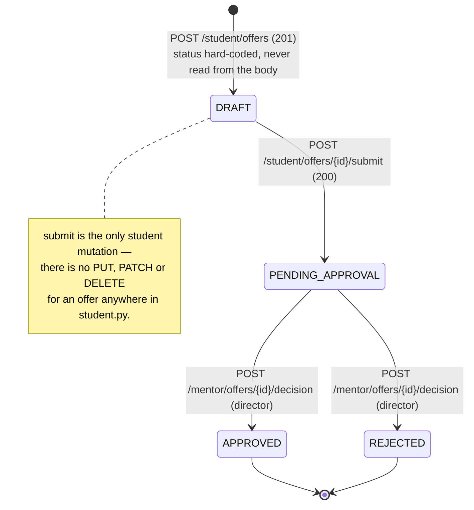
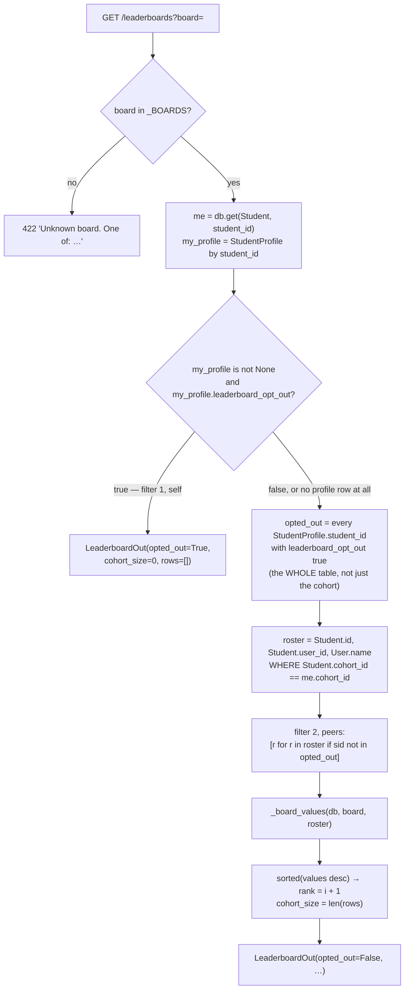
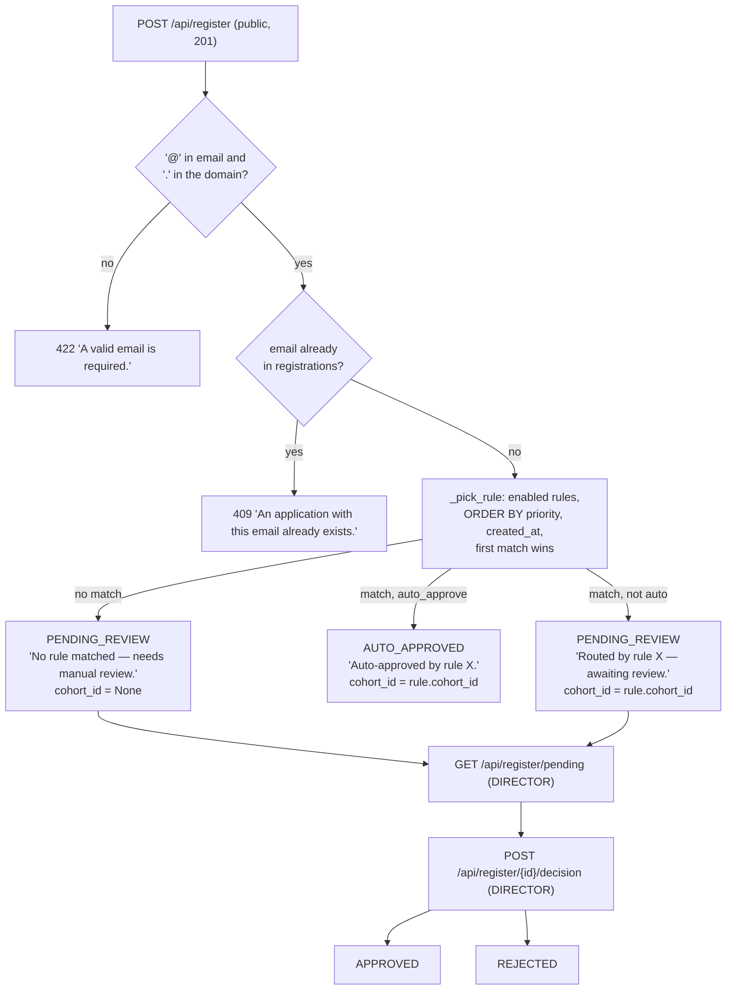
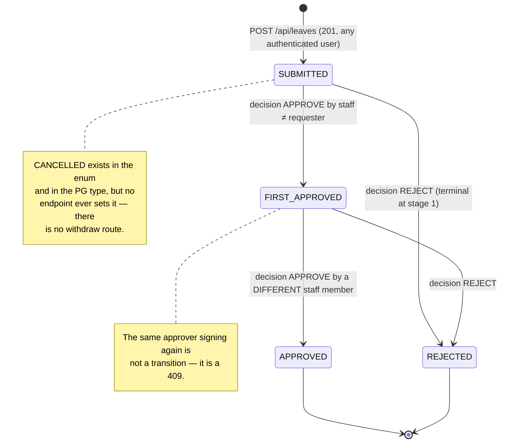

# Chapter 6 — The Student API: Every Endpoint a Student Can Reach

By the end of this chapter you will be able to call any endpoint on the student-facing
HTTP surface correctly — knowing its method, its path, what it accepts, which status codes
it can produce and why — and, for the handful of endpoints that are not CRUD at all but
small rule engines, you will be able to predict the exact number a given student will see
before you run the request. Every response model is enumerated field by field in the
**schema appendix, [§10](#10-schema-appendix-every-model-field-by-field)**; the walkthrough
sections cite into it rather than repeating it. Five endpoints (`/leaderboards`,
`/next-actions`, `/placement-readiness`, `/recommendations`, and the eligibility verdict on
`/jobs`) compute rather than fetch; this chapter extracts their complete rule sets as
tables you could re-implement from.

**In scope.** `apps/api-py/app/routers/student.py` (2,199 lines, 40 route registrations),
`apps/api-py/app/routers/registration.py` (4) and `apps/api-py/app/routers/leave.py` (4) —
48 route registrations in total. **Deferred.** Auth internals — password hashing, the
HS256 session, the cookie, and the `require_*` family — belong to Chapter 5; this chapter
names which guard protects which route and stops there. Column-level schema detail belongs
to [Chapter 3](03-data-model.md); where a default or a constraint is load-bearing for an
endpoint's behaviour it is restated here with a citation, not re-derived. The egress gate's
own mechanism is [Chapter 8](08-ai-layer.md); §4 states its call site precisely and cites
across. The mentor and director halves of the offer, upload and skill-claim workflows are
[Chapter 7](07-api-staff.md). The Angular components that consume these endpoints are
Chapters 12–13.

> **A note on the count.** The book's index summarises this chapter as "All 49
> student-reachable endpoints: `student.py`, `registration.py`, `leave.py`, and the rule
> engines behind readiness, next-actions and leaderboards"
> ([README.md:30](README.md)). The verified count of `@router.*` decorators is **40** in `student.py`, **4**
> in `registration.py` and **4** in `leave.py` — 48. Of those 48, exactly **43** are
> reachable by a student: all 40 student-router routes, plus `POST /api/register` (no auth
> at all), `POST /api/leaves` and `GET /api/leaves/mine` (any authenticated session). The
> other five approval endpoints are staff-gated. The "49" in the index is off by one and
> should be read as "the student surface", not as an exact tally.

---

## 1. The shape of the student surface

### 1.1 One router, mounted once, with no `/api` in its own prefix

Every endpoint in `student.py` hangs off a single router declared at the top of the file:

```python
router = APIRouter(prefix="/student", tags=["student"])
```

— [app/routers/student.py:42](../../apps/api-py/app/routers/student.py#L42). Note what is *not*
there: no `/api`, and no `dependencies=[...]`. The `/api` is added at mount time, under a
comment that explains the whole convention:

```python
# Domain routers mount under a single /api prefix, so the whole surface the
# Angular client calls lives under /api — matching environment.apiBase and the
# dev proxy (apps/web/proxy.conf.json), with no path rewriting.
app.include_router(auth.router, prefix="/api")
app.include_router(student.router, prefix="/api")
```

— [app/main.py:74-78](../../apps/api-py/app/main.py#L74-L78). So every path in this chapter is
reachable at `/api/student/<path>`. The same treatment is given to `mentor`, `director`,
`leave` and `registration` ([app/main.py:79-82](../../apps/api-py/app/main.py#L79-L82)), while
`agent` and `voice` carry `/api` in their own prefixes and are mounted bare
([app/main.py:71-73](../../apps/api-py/app/main.py#L71-L73)), and `health` is unprefixed because
"Health is infra liveness" ([app/main.py:69](../../apps/api-py/app/main.py#L69)). The practical
rule for anyone adding a student route: **never write `/api` inside this router**, or the
path lands at `/api/api/…` and the dev proxy stops reaching it. See Chapter 1, §4 for the
full request lifecycle.

The `tags=["student"]` value is what groups all 40 operations under one heading on the
`/docs` OpenAPI page.

### 1.2 The guard is two layers, applied per handler, never at the router

There is no router-level dependency and there is no `require_student` anywhere in the
codebase. Authorisation is assembled per handler out of two pieces.

**Layer 1 — authentication** is the one function in `identity.py`:

```python
def get_current_session(request: Request) -> dict:
    token = request.cookies.get(SESSION_COOKIE)
    payload = verify_session_token(token) if token else None
    if not payload:
        raise HTTPException(status_code=status.HTTP_401_UNAUTHORIZED, detail="Sign in required.")
    return payload
```

— [app/identity.py:8-13](../../apps/api-py/app/identity.py#L8-L13). Every handler in `student.py` takes
`session: dict = Depends(get_current_session)` — as does every handler in `leave.py`, and
every `registration.py` handler except the public `submit` (§7) — so a missing or invalid
`reep_session` cookie is a **401** before any handler body runs. (Mechanism: Chapter 5, §5.)

If you have not met FastAPI's `Depends(...)` before: it marks a callable that FastAPI runs
**before** the handler body, passing its return value in as that parameter. Two
consequences run through this whole chapter. The 401 raised inside `get_current_session`
always precedes the 403 raised inside the handler, because dependency resolution finishes
before the first line of the body executes. And a handler called *directly* as a Python
function — which `assistant_tools.py` does, §6.7 — bypasses the dependency entirely and
must be handed a session by keyword.

> **Where the `require_*` family actually lives.** AGENTS.md points at
> "`require_*` dependencies in `apps/api-py/app/identity.py` / the routers", which reads as if
> `identity.py` held them. It does not: `identity.py` is 13 lines and contains only
> `get_current_session`. `require_mentor` lives at
> [app/routers/mentor.py:31](../../apps/api-py/app/routers/mentor.py#L31) and `require_director`
> at [app/routers/mentor.py:233](../../apps/api-py/app/routers/mentor.py#L233), which makes
> `mentor.py` a de-facto shared module that `registration.py` and `leave.py` import from
> (§7). The student router uses neither.

**Layer 2 — authorisation** is a module-private helper, and its shape is the single most
important idea in this file:

```python
def _require_student(session: dict) -> str:
    student_id = session.get("studentId")
    if not student_id:
        raise HTTPException(status_code=status.HTTP_403_FORBIDDEN, detail="Not a student account.")
    return student_id
```

— [app/routers/student.py:118-122](../../apps/api-py/app/routers/student.py#L118-L122). It does
not return a boolean. **It returns the row-scoping key.** Every guarded handler opens with
`student_id = _require_student(session)` and then uses that same value in
`.where(X.student_id == student_id)`. The authorisation check and the query filter are
literally the same expression, so they cannot drift apart — you cannot check A and query B.

The `studentId` claim exists only when the user *is* a student. `_payload_for` builds
`{userId, email, name, role}` and adds `studentId` only if `user.student is not None`
([app/routers/auth.py:29-40](../../apps/api-py/app/routers/auth.py#L29-L40)), so a MENTOR,
DIRECTOR or ADMIN session has no such key and gets a 403 from every guarded endpoint here.
That is why Rule 2's `_assert_can_access_student` (mentor.py, Chapter 5 §6) has no
counterpart in this router: **no student endpoint accepts a `student_id` parameter of any
kind**, so there is no cross-student read to scope.

```mermaid
flowchart TD
    R["GET /api/student/results"] --> D["Depends(get_current_session)"]
    D -->|no reep_session cookie<br/>or bad signature| E401["401 'Sign in required.'"]
    D -->|payload| H["handler body"]
    H --> G["_require_student(session)"]
    G -->|session has no studentId<br/>(staff token)| E403["403 'Not a student account.'"]
    G -->|returns student_id| Q["select(...).where(SemesterResult.student_id == student_id)"]
    Q --> OK["200"]
```

### 1.3 Three handlers deviate from that pattern, and all three deviations are real

1. **`GET /profile` inlines the check instead of calling the helper.** `my_profile` reads
   `session.get("studentId")` and raises the identical 403 itself
   ([app/routers/student.py:69-73](../../apps/api-py/app/routers/student.py#L69-L73)). The cause
   is chronological, not semantic: `my_profile` is defined at line 66 and `_require_student`
   only at line 118 — the helper was extracted after the first endpoint was written, and the
   first endpoint was never retrofitted. Behaviour is byte-identical.
2. **`GET /skills/catalogue` calls the helper and throws the return value away**
   ([app/routers/student.py:369](../../apps/api-py/app/routers/student.py#L369)). It needs the 403
   gate but not the id, because the catalogue is global. So a table containing no student
   data at all is nonetheless staff-forbidden.
3. **`GET /streak` never calls it.** `my_streak` keys off `session["userId"]`
   ([app/routers/student.py:390](../../apps/api-py/app/routers/student.py#L390)) because
   `LoginDay` hangs off `users.id`, not `students.id`. **Consequence: any authenticated
   user, including a mentor or director, gets 200 from `GET /api/student/streak` and
   receives their own login streak.** It is not a leak — the rows are scoped to the caller's
   own `userId` — but it is the one endpoint where the `/student` prefix does not imply a
   student caller. Note also the bracket subscript: a session payload lacking `userId` would
   be a `KeyError` → unhandled 500. Every token `_payload_for` mints has it, so the
   invariant holds by construction only.

### 1.4 The inline-Pydantic convention

There is no `schemas/` package for this router. **Every request and response model is
declared immediately above the handler that uses it**, named `<Thing>In` for a request body
and `<Thing>Out` for a response. Nested rows get their own `Out` model, declared just above
the parent:

| Parent | Child rows | Line |
|---|---|---|
| `ProfileOut` / `ProfileUpdateIn` | — | [45](../../apps/api-py/app/routers/student.py#L45), [793](../../apps/api-py/app/routers/student.py#L793) |
| `SemesterResultOut` | `SubjectMarkOut` | [108](../../apps/api-py/app/routers/student.py#L108), [98](../../apps/api-py/app/routers/student.py#L98) |
| `AttendanceSummaryOut` | `CourseAttendanceOut` | [167](../../apps/api-py/app/routers/student.py#L167), [160](../../apps/api-py/app/routers/student.py#L160) |
| `SwocBoardOut` | `SwocItemOut` | [256](../../apps/api-py/app/routers/student.py#L256), [250](../../apps/api-py/app/routers/student.py#L250) |
| `TimeSheetSummaryOut` | `TimeSheetEntryOut` | [420](../../apps/api-py/app/routers/student.py#L420), [414](../../apps/api-py/app/routers/student.py#L414) |
| `AcademicsOut` | `QualificationOut`, `AcademicGapOut` | [482](../../apps/api-py/app/routers/student.py#L482), [461](../../apps/api-py/app/routers/student.py#L461), [474](../../apps/api-py/app/routers/student.py#L474) |
| `LeaderboardOut` | `LeaderRow` | [1684](../../apps/api-py/app/routers/student.py#L1684), [1674](../../apps/api-py/app/routers/student.py#L1674) |
| `NextActionsOut` | `NextActionOut` | [1833](../../apps/api-py/app/routers/student.py#L1833), [1822](../../apps/api-py/app/routers/student.py#L1822) |
| `PlacementReadinessOut` | `ReadinessFactorOut` | [2017](../../apps/api-py/app/routers/student.py#L2017), [2010](../../apps/api-py/app/routers/student.py#L2010) |
| `RecommendationsOut` | `RecommendationOut` | [2130](../../apps/api-py/app/routers/student.py#L2130), [2123](../../apps/api-py/app/routers/student.py#L2123) |

`LeaderRow` is the sole exception to the `Out` suffix — a row schema named for what it is.

The pattern holds across all 40 endpoints, with a handful of local slips worth knowing so
you do not read them as a second convention. Where one handler *pair* shares a schema, the
models are grouped above the **first** of the pair rather than each above its own user:
`SkillClaimIn` sits at [1445](../../apps/api-py/app/routers/student.py#L1445), above
`my_skill_claims` ([1452](../../apps/api-py/app/routers/student.py#L1452)) but used by
`create_skill_claim` ([1480](../../apps/api-py/app/routers/student.py#L1480)); `ResumeProfileIn`
sits at [1545](../../apps/api-py/app/routers/student.py#L1545), above `get_resume_profile`
([1556](../../apps/api-py/app/routers/student.py#L1556)) but used by `put_resume_profile`
([1571](../../apps/api-py/app/routers/student.py#L1571)). `_require_student`
([118-122](../../apps/api-py/app/routers/student.py#L118-L122)) is interposed between
`SemesterResultOut` ([108](../../apps/api-py/app/routers/student.py#L108)) and `my_results`
([126](../../apps/api-py/app/routers/student.py#L126)). And `_upload_row` is defined at
[1335](../../apps/api-py/app/routers/student.py#L1335), *after* the `my_uploads` body that calls
it at [1332](../../apps/api-py/app/routers/student.py#L1332) — legal because a name inside a
function body resolves when the function runs, not when the module is imported.

Four further conventions ride on top:

- **Fields are snake_case. Column-backed fields carry their column's name verbatim**
  (`linkedin_url`, `live_backlogs`, `self_reported`), so for anything stored the JSON is a
  literal transcription of the schema. There is no alias generator anywhere in the API (the
  only `model_config` in `apps/api-py/app` is the settings one at
  [app/config.py:18](../../apps/api-py/app/config.py#L18)), so the wire is snake_case end to end —
  which the client is expected to transcribe literally, though `academics.component.ts` does
  not (§2). **Derived fields are named for their unit instead** and have no column behind
  them at all: `match_percent`, `eligible` and `reasons` on `JobRowOut`
  ([537-539](../../apps/api-py/app/routers/student.py#L537-L539)), `total_mo` on `AcademicGapOut`
  (summed in the handler, [503-507](../../apps/api-py/app/routers/student.py#L503-L507)),
  `progress_pct` / `next_task` / `unlocks` on `CourseOut`, `window_days` on
  `TimeSheetSummaryOut`. The one place a wire name deliberately diverges from its column is
  `PUT /leaderboard-visibility`, whose `hidden` writes `leaderboard_opt_out` (§6.2).
- **Derived-field unit suffixes**: `_percent`/`percent` for 0–100 floats, `_hours` for hour
  floats, `_mo` for month integers, `_minutes` for minutes, `window_days` for a day count.
- **Enums are flattened to `str` at the boundary with an explicit `.value`**, never typed as
  enums in the schema — `type=r.type.value`
  ([312](../../apps/api-py/app/routers/student.py#L312)), `current_stage=stu.current_stage.value`
  ([243](../../apps/api-py/app/routers/student.py#L243)), `status=o.status.value`
  ([698](../../apps/api-py/app/routers/student.py#L698)). No Pydantic enum ever reaches the
  client, so no client needs to know the Python enum classes. **Every enum in scope is a
  `str` enum whose value is spelled identically to its member name** — `ONSITE = "ONSITE"`,
  `PENDING_REVIEW = "PENDING_REVIEW"`
  ([models/offer.py:21-44](../../apps/api-py/app/models/offer.py#L21-L44),
  [models/leave.py:22-32](../../apps/api-py/app/models/leave.py#L22-L32),
  [models/upload.py:32-35](../../apps/api-py/app/models/upload.py#L32-L35),
  [models/course.py:44-48](../../apps/api-py/app/models/course.py#L44-L48),
  [models/timesheet.py:30-35](../../apps/api-py/app/models/timesheet.py#L30-L35),
  [models/registration.py:31-37](../../apps/api-py/app/models/registration.py#L31-L37)). That
  identity is why flattening with `.value` loses nothing, and it is also why a bare string
  comparison such as `by_activity.get("SKILLING", 0)` (§2) or `if status == "COMPLETED"`
  (§5.1) works today: it is matching the member *name* by coincidence of the convention,
  which is exactly why it breaks silently the day someone renames a member.
- **`response_model=` is not documentation.** FastAPI validates the handler's return value
  against that model, coerces types, and **discards any field the model does not declare**
  before serialising — so the *model*, not the handler, is the contract on the wire. It is
  also what `/docs` publishes as the response schema. Two arguments later in this chapter
  only bite because of that filtering: `_offer_out` withholds `decision_note` (§3.3), and
  the student and mentor projections of an `Upload` differ deliberately (§5.5).

**31 of the 40 endpoints declare a `response_model`.** The nine that do not are the six
that return a bare `-> dict` (`/jobs/{id}/apply`, `POST /timesheet`, `/resume/generate`,
`/checkin`, `/checkout/{id}`, `PUT /leaderboard-visibility`) and the three that return a raw
`Response` (`/resume/{id}/pdf`, `/uploads/{id}/file`, `DELETE /uploads/{id}`). The six
dict-returners appear in `/docs` with no schema at all — a real documentation gap, since
`used_ai` on `/resume/generate` is a contract the frontend and a regression test both depend
on.

### 1.5 Reading the queries: three SQLAlchemy accessors

Three session accessors appear throughout this router, and the difference between them
decides how each handler's result is shaped. If you have not used SQLAlchemy 2.0, hold
these before reading §2.

- **`db.get(Model, pk)`** is a **primary-key-only** lookup. It consults the session's
  identity map before touching the database and it cannot filter on any other column. That
  is why `/profile` must use a filtered `select` on `StudentProfile.student_id` — that
  column is a unique FK, not the primary key ([app/models/student_profile.py:25-28](../../apps/api-py/app/models/student_profile.py#L25-L28)) —
  while `/academics` can write `db.get(AcademicGap, student_id)`, because on that table
  `student_id` *is* the primary key, as its own comment says: `# One row per student —
  student_id IS the primary key.`
  ([app/models/academic_history.py:50-53](../../apps/api-py/app/models/academic_history.py#L50-L53)).
- **`db.scalars(select(Model))`** returns ORM **entities**. Relationship attributes can be
  walked afterwards — lazily, which is where the N+1s flagged in §2 come from (`r.subjects`
  on `/results`, `r.skill.slug` on `/skills`).
- **`db.execute(select(A.x, B.y))`** returns **Row tuples**, one per result row. That is why
  `/attendance` writes `for course_code, present in rows`
  ([187](../../apps/api-py/app/routers/student.py#L187)) and why `/dashboard` writes
  `sum(1 for (p,) in att if p)` ([238](../../apps/api-py/app/routers/student.py#L238)) — the
  `(p,)` is a one-element tuple unpack, not a typo, because a single-column `db.execute`
  still yields tuples. `db.scalar(...)` (singular) is the same idea reduced to one value.

### 1.6 The `_x_out` projector convention, and where it is not used

Module-private helpers take a leading underscore — every module-level helper in
`student.py`, `leave.py` and `registration.py` does. The underscore is a convention, not a
boundary, and three such names are in fact read from outside their module:
`app/assistant_tools.py` calls `student_ep._resume_pct`
([assistant_tools.py:159](../../apps/api-py/app/assistant_tools.py#L159), §6.7), and
`tests/test_registration_rules.py` imports `_email_domain` and `_rule_matches` from
`registration.py`
([test_registration_rules.py:8](../../apps/api-py/tests/test_registration_rules.py#L8),
§7.2) — which makes those three effectively public API. Where a row
shape is projected from more than one place, the projection is factored into a
`_<noun>_out` (or `_<noun>_row`) function taking the ORM row and returning the schema:
`_offer_out` ([687](../../apps/api-py/app/routers/student.py#L687)), `_profile_out`
([771](../../apps/api-py/app/routers/student.py#L771)), `_upload_row`
([1335](../../apps/api-py/app/routers/student.py#L1335)).

The sibling routers split on this. `leave.py` follows it — `_leave_out`
([38](../../apps/api-py/app/routers/leave.py#L38)). `registration.py` does not: its projector is
the noun-less `_out` ([91](../../apps/api-py/app/routers/registration.py#L91)), the single place
in these three routers where the `_<noun>_out` rule of [§9](#9-the-endpoint-rulebook) rule 6
is broken. With one projector in the module the bare name is unambiguous; add a second and
it stops being.

> **Why it is like this — and where it went wrong once.** `_profile_out` exists because
> `PUT /profile` needed the projection that `GET /profile` already had. But the GET was
> never refactored onto it: [student.py:77-95](../../apps/api-py/app/routers/student.py#L77-L95)
> and [student.py:771-790](../../apps/api-py/app/routers/student.py#L771-L790) are two
> hand-maintained copies of the same 17-field construction. Add a column to `StudentProfile`
> and wire it into only one of them, and reading and saving the same resource return
> different shapes. This is the concrete argument for the projector convention: use the
> helper *everywhere*, including the first caller.

The other private helpers are pure computation, and they cluster by feature — the complete
list is `_compose_resume_markdown`
([901](../../apps/api-py/app/routers/student.py#L901)), `_prettify_stage`
([1081](../../apps/api-py/app/routers/student.py#L1081)), `_course_next_task`
([1086](../../apps/api-py/app/routers/student.py#L1086)), `_cert_next_task`
([1153](../../apps/api-py/app/routers/student.py#L1153)), `_section_filled` /
`_resume_completeness` ([1527](../../apps/api-py/app/routers/student.py#L1527),
[1538](../../apps/api-py/app/routers/student.py#L1538)), `_initials` / `_board_values`
([1598](../../apps/api-py/app/routers/student.py#L1598),
[1607](../../apps/api-py/app/routers/student.py#L1607)), the five readiness inputs at
[1772-1819](../../apps/api-py/app/routers/student.py#L1772-L1819), and `_readiness_band`
([2024](../../apps/api-py/app/routers/student.py#L2024), §6.4). Module constants are
UPPER_SNAKE with a leading underscore: `_RESUME_SECTIONS`
([1521](../../apps/api-py/app/routers/student.py#L1521)), `_BOARDS`
([1595](../../apps/api-py/app/routers/student.py#L1595)).

Handler names are written from the caller's point of view: **`my_` prefix when the payload
is the caller's own rows** — 16 handlers: `my_profile`, `my_results`, `my_attendance`,
`my_swoc`, `my_mocks`, `my_skills`, `my_streak`, `my_timesheet`, `my_academics`, `my_jobs`,
`my_schedule`, `my_courses`, `my_certifications`, `my_focus`, `my_uploads`,
`my_skill_claims` — and **no prefix when the payload is global, aggregate or a mutation** —
17 handlers: `dashboard`, `skills_catalogue`, `apply_to_job`, `create_offer`,
`submit_offer`, `update_profile`, `log_timesheet`, `generate_resume`, `check_in`,
`check_out`, `create_upload`, `download_upload`, `delete_upload`, `leaderboards`,
`next_actions`, `placement_readiness`, `recommendations`.

**The rule is not total, and Chapter 15 collects it from here, so state the exceptions.**
Those two lists cover 33 of the 40 handlers. The other seven take a verb-first name:
`list_offers` ([739](../../apps/api-py/app/routers/student.py#L739)), `list_resumes`
([1021](../../apps/api-py/app/routers/student.py#L1021)), `resume_pdf`
([1042](../../apps/api-py/app/routers/student.py#L1042)), `create_skill_claim`
([1480](../../apps/api-py/app/routers/student.py#L1480)), `get_resume_profile`
([1556](../../apps/api-py/app/routers/student.py#L1556)), `put_resume_profile`
([1571](../../apps/api-py/app/routers/student.py#L1571)) and `set_leaderboard_visibility`
([1749](../../apps/api-py/app/routers/student.py#L1749)). Three of those are mutations and fit
the second list in spirit. The real counter-examples are the reads: `list_offers`,
`list_resumes` and `get_resume_profile` all return the caller's own rows and none carries
`my_` (`resume_pdf` is a fourth, exporting the caller's own resume by id). New endpoints
should take `my_`; the existing four are not worth renaming, but do not read them as
sanction. The rulebook in [§9](#9-the-endpoint-rulebook) states the intended form.

### 1.7 The module's organisation

`student.py` opens with a one-line docstring that is now an archaeological marker rather
than a description: `"""Student self-service endpoints. First slice: read your own
profile."""` ([student.py:1](../../apps/api-py/app/routers/student.py#L1)). The file grew to
2,199 lines around it. Its layout is feature-ordered, not alphabetical, and roughly
chronological in the order the migration ported each screen: self-service reads (45–526),
jobs and offers (529–768), profile/schedule/timesheet (771–898), resumes (901–1060),
courses and certifications (1063–1210), focus sessions (1213–1304), uploads (1307–1430),
skill claims (1433–1515), resume-builder state (1518–1590), leaderboards (1593–1763), and
the rule engines behind a section banner at
[1766-1769](../../apps/api-py/app/routers/student.py#L1766-L1769).

---

## 2. Endpoint reference: self-service reads

All eleven are `GET`, all are read-only (**no `db.commit()` appears anywhere between
line 1 and line 545**), and all take only the two dependencies unless noted.

| Path | Handler | Response model | Params | Non-200 codes |
|---|---|---|---|---|
| `/profile` | `my_profile` [66](../../apps/api-py/app/routers/student.py#L66) | `ProfileOut` | — | 401, 403, **404** "No profile yet." |
| `/results` | `my_results` [126](../../apps/api-py/app/routers/student.py#L126) | `list[SemesterResultOut]` | — | 401, 403 |
| `/attendance` | `my_attendance` [175](../../apps/api-py/app/routers/student.py#L175) | `AttendanceSummaryOut` | — | 401, 403 |
| `/dashboard` | `dashboard` [219](../../apps/api-py/app/routers/student.py#L219) | `DashboardOut` | — | 401, 403, **404** "Student not found." |
| `/swoc` | `my_swoc` [264](../../apps/api-py/app/routers/student.py#L264) | `SwocBoardOut` | — | 401, 403 |
| `/mocks` | `my_mocks` [301](../../apps/api-py/app/routers/student.py#L301) | `list[MockAttemptOut]` | — | 401, 403 |
| `/skills` | `my_skills` [336](../../apps/api-py/app/routers/student.py#L336) | `list[StudentSkillOut]` | — | 401, 403 |
| `/skills/catalogue` | `skills_catalogue` [365](../../apps/api-py/app/routers/student.py#L365) | `list[SkillCatalogueOut]` | — | 401, 403 |
| `/streak` | `my_streak` [384](../../apps/api-py/app/routers/student.py#L384) | `StreakOut` | — | 401 only |
| `/timesheet` | `my_timesheet` [429](../../apps/api-py/app/routers/student.py#L429) | `TimeSheetSummaryOut` | `?days=` (int, default 7) | 401, 403, 422 |
| `/academics` | `my_academics` [488](../../apps/api-py/app/routers/student.py#L488) | `AcademicsOut` | — | 401, 403 |

**`GET /profile`** returns 17 fields
([45-62](../../apps/api-py/app/routers/student.py#L45-L62)): `student_id`; the seven nullable
strings `phone`, `email`, `linkedin_url`, `github_url`, `portfolio_url`, `city`,
`career_summary`; the four booleans `placement_eligible`, `interested_in_jobs`,
`interested_in_internships` and `leaderboard_opt_out`; and the five bare `list` fields
`education`, `experience`, `projects`, `skills`, `achievements` (bare and un-parameterised
because the columns are JSONB blobs of free shape). Every JSONB field is defensively
coalesced — `education=prof.education or []` — so a legacy NULL renders as `[]`.

`StudentProfile` has twenty columns, so **three are withheld**: the row's own primary key
`id` ([app/models/student_profile.py:25](../../apps/api-py/app/models/student_profile.py#L25)) — the profile
carries a uuid PK distinct from `student_id`, which is exactly why the lookup here is a
filtered `select` on the unique FK rather than `db.get` (§1.5) — plus `photo_upload_id`
([profile.py:51](../../apps/api-py/app/models/student_profile.py#L51)) and `updated_at`
([profile.py:54](../../apps/api-py/app/models/student_profile.py#L54)).

**`GET /results`** orders by `SemesterResult.semester` **ascending** — chronological, and
semester number is the only sort key; `published_on` is never read. Each row carries
`semester`, `sgpa`, `cgpa`, `closed_backlogs`, `live_backlogs`, `result_class` and the
nested `subjects` ([§10](#10-schema-appendix-every-model-field-by-field)). Subject ordering
is not set in the handler at all; it comes from the ORM relationship's own `order_by`
(Chapter 3), so subjects arrive alphabetically by `subject_code`. `r.subjects` is a lazy
relationship access inside the comprehension, so this is an N+1 — one query for the
semesters plus one per semester (§1.5). An empty list, never a 404, for a student with no
results.

**`GET /attendance` computes the percentage; nothing stores it.** `AttendanceRecord` has no
percentage column and there is no summary table, so the endpoint tallies raw session rows on
every request:

```python
per_course: dict[str, list[int]] = defaultdict(lambda: [0, 0])  # code -> [present, total]
present_total = grand_total = 0
for course_code, present in rows:
    per_course[course_code][1] += 1
    grand_total += 1
    if present:
        per_course[course_code][0] += 1
        present_total += 1

def pct(p: int, t: int) -> float:
    return round(100 * p / t, 1) if t else 0.0
```

— [student.py:185-195](../../apps/api-py/app/routers/student.py#L185-L195). The `for course_code,
present in rows` unpack is the `db.execute` Row-tuple shape from §1.5. Three rules fall out
of those eleven lines. **One decimal place**, everywhere. **A zero denominator yields
`0.0`, not `None`** — so a student with no attendance rows is indistinguishable from one
who attended nothing. And **`overall_percent` is session-weighted, not the mean of the
per-course percentages**: it is `pct(present_total, grand_total)`, so a course with many
sessions dominates. `by_course` is built from `sorted(per_course.items())`, i.e.
alphabetical by course code. Because `course_code` is a plain String with no FK
(Chapter 3), a typo'd code silently becomes a new bucket.

**`GET /dashboard`** — docstring "One call for the landing page: REEP stage, latest CGPA,
and attendance %." It aggregates four sources, and each has a wrinkle:

1. **The JWT, not the database**, for the display name: `name=session.get("name", "")`
   ([241](../../apps/api-py/app/routers/student.py#L241)). The name goes stale after a rename
   until the user signs in again; a payload without `name` renders an empty string.
2. **`db.get(Student, student_id)`** for `usn`, `current_stage.value` and
   `current_semester` — and this is the only place in the read set where a missing
   `students` row *itself*, rather than a missing child row, produces a 404: a deleted
   student holding a live cookie gets "Student not found."
   ([225-226](../../apps/api-py/app/routers/student.py#L225-L226)). (`/profile` also 404s, but on
   the absent `student_profiles` row, which is a different absence — see §8.) The stage is
   emitted raw (`REBOOT | EXCEL | EXCEL_ADVANCED | ELEVATE`); `_prettify_stage` exists but
   is used only by `/courses`.
3. **The highest-numbered semester result**, `order_by(SemesterResult.semester.desc())
   .limit(1)`. "Latest" means highest semester *number*, never most recently published.
4. **A third inline copy of the attendance formula**,
   `round(100 * present / total, 1) if total else 0.0`
   ([246](../../apps/api-py/app/routers/student.py#L246)).

> **Why it is like this.** That third copy matters. The same arithmetic exists as `pct()`
> inside `/attendance` ([194-195](../../apps/api-py/app/routers/student.py#L194-L195)), inline
> here, and again as the helper `_attendance_pct`
> ([1772-1779](../../apps/api-py/app/routers/student.py#L1772-L1779)) whose own docstring reads
> "Overall attendance %, same computation the dashboard/attendance uses" — yet neither
> endpoint calls it. The same triplication afflicts the latest-CGPA query
> ([228-233](../../apps/api-py/app/routers/student.py#L228-L233),
> [560-566](../../apps/api-py/app/routers/student.py#L560-L566),
> [1782-1789](../../apps/api-py/app/routers/student.py#L1782-L1789)). Change the rounding or the
> meaning of "latest" in one place and the dashboard, the jobs feed and the readiness score
> will disagree about the same student.

**`GET /swoc`** issues one query ordered `weight.desc()` and fans the rows into four buckets
keyed by `r.kind.value`, so each quadrant comes out strongest-first. Each item exposes
`source` (`PLACEMENT | MENTOR | PM`), `text` and `weight` (1–5). `author_user_id` and
`recorded_at` are withheld: the student sees the *viewpoint*, not the individual author.

> **Why it is like this.** The model says it in as many words: *"The board is deliberately
> un-averaged: disagreement between viewpoints is itself the finding, so every entry keeps
> its source."* ([app/models/swoc.py:3-4](../../apps/api-py/app/models/swoc.py#L3-L4)). That is
> why there is no aggregation step here — the endpoint is a pure fan-out. The cost is a hard
> coupling: `buckets[r.kind.value]` at
> [280](../../apps/api-py/app/routers/student.py#L280) is a bare subscript against a literal
> four-key dict, so adding a fifth `SwocKind` member without adding a key turns this
> endpoint into a `KeyError` → 500 for any student holding such a row.

**`GET /mocks`** is newest-first by `taken_on` and returns `type`, `taken_on`, `score`,
`max_score`, `percent` and `notes`. `percent` is derived, not stored:

```python
percent=(
    round(100 * r.score / r.max_score, 1)
    if (r.score is not None and r.max_score)
    else None
),
```

— [316-320](../../apps/api-py/app/routers/student.py#L316-L320). Read the asymmetry precisely:
`r.score is not None` is an explicit None-test, so a genuine score of `0.0` still computes
0.0%; `r.max_score` is a plain truthiness test, so both `None` and `0.0` yield
`percent=None` rather than a `ZeroDivisionError`. **This is the only derived number in the
router that can express "not scorable" rather than collapsing to `0.0`.** The evaluator's
identity is never exposed.

**`GET /skills`** returns `slug`, `name`, `category`, `level` and `verified` per row. It has
no `order_by` and no eager loading; each `r.skill.slug/.name/.category` access lazily loads
the parent `Skill` — the textbook 1+N that `db.scalars` invites (§1.5). Ordering is done in
Python afterwards, under the comment "`# Grouped by category, strongest first within
each.`": `sorted(out, key=lambda s: (s.category, -s.level))`
([353-354](../../apps/api-py/app/routers/student.py#L353-L354)) — category ascending, level
descending via the negation. `verified` is read-only here; the only writer at runtime is the
mentor's claim-review path (§5.6), though the dev seed also sets it directly
([app/seed.py:265-267](../../apps/api-py/app/seed.py#L265-L267)).

**`GET /skills/catalogue`** returns the whole `skills` table — `id`, `slug`, `name`,
`category` — ordered by `(category, name)`, unpaginated, unfiltered, with no search
parameter. It hands back the primary key of a row the caller does not own a copy of — the
catalogue is global, shared by every student — because `POST /student/skill-claims` takes
that id as `skill_id`
([1446](../../apps/api-py/app/routers/student.py#L1446)).

**That is the router's general pattern for a global catalogue key, not a singularity.**
`JobRowOut.id` ([530](../../apps/api-py/app/routers/student.py#L530), set from `j.id` at
[616](../../apps/api-py/app/routers/student.py#L616)) is the `jobs` primary key
([models/job.py:41](../../apps/api-py/app/models/job.py#L41)) and is handed to every
student so that `POST /jobs/{job_id}/apply` has something to be keyed on — exactly the
relationship `Skill.id` has to `POST /skill-claims`. Two more: `CourseOut.code`
([1115](../../apps/api-py/app/routers/student.py#L1115)) is `courses.code`, a primary key
([models/course.py:55](../../apps/api-py/app/models/course.py#L55)), and
`CertProgressOut.code` ([1193](../../apps/api-py/app/routers/student.py#L1193)) is
`certifications.code`, also a primary key
([models/certification.py:34](../../apps/api-py/app/models/certification.py#L34)) — both
global rows the caller does not own.

Ids of the caller's **own** rows are exposed alongside them, and they are what the by-id
routes of §5 are keyed on: `OfferOut.id`
([675](../../apps/api-py/app/routers/student.py#L675)), `ScheduleItemOut.id`
([831](../../apps/api-py/app/routers/student.py#L831)), `ResumeOut.id`
([1012](../../apps/api-py/app/routers/student.py#L1012)), `FocusSessionOut.id`
([1270](../../apps/api-py/app/routers/student.py#L1270)), `UploadRowOut.id`
([1308](../../apps/api-py/app/routers/student.py#L1308)) and `SkillClaimOut.id` / `skill_id` /
`upload_id` ([1434-1437](../../apps/api-py/app/routers/student.py#L1434-L1437)). The one id
exposure that is neither the caller's own row nor a global catalogue row is peers'
`student_id` on `/leaderboards`, which is a recorded finding — see §6.1.

> **Why it is like this.** The model states the purpose: *"The catalogue exists so 'MS
> Excel' and 'Advanced Excel' match one skill, which is what makes a job-match percentage
> meaningful."* ([app/models/skill.py:3-4](../../apps/api-py/app/models/skill.py#L3-L4)). This
> endpoint is the mechanism that keeps free-text skills out of that arithmetic.

**`GET /streak`.** The docstring states the rule: "Login streak from LoginDay (one row per
active day). Current counts back from today (or yesterday, so an as-yet-unopened today
doesn't break it)." The only *runtime API* writer of `LoginDay` rows is the login handler
([app/routers/auth.py:56-64](../../apps/api-py/app/routers/auth.py#L56-L64)), which buckets
by the server's **local** calendar date under the comment "Local calendar date, matching the
Next.js streak bucketing". (The dev seed inserts them directly too — a five-day run ending
today, [app/seed.py:273-286](../../apps/api-py/app/seed.py#L273-L286) — so a seeded box
shows a streak nobody signed in for.) So a "streak" means **days on which the user signed in** — not
days of activity. A user who stays signed in for a week via the cookie records one
`LoginDay` and the streak collapses.

| Field | Computation | Line |
|---|---|---|
| `longest` | seed `longest = run = 1`; over `zip(days, days[1:])`, `run = run + 1 if cur - prev == timedelta(days=1) else 1`; keep the max | [395-398](../../apps/api-py/app/routers/student.py#L395-L398) |
| `current` | `0` unless `days[-1] in (today, today - timedelta(days=1))`; then seed 1 and walk backwards while consecutive | [400-407](../../apps/api-py/app/routers/student.py#L400-L407) |
| `days_active` | `len(days)` — total distinct sign-in days ever, not windowed | [410](../../apps/api-py/app/routers/student.py#L410) |
| `last_active` | `days[-1]`, or `None` on the empty early return | [393](../../apps/api-py/app/routers/student.py#L393), [410](../../apps/api-py/app/routers/student.py#L410) |

The grace window is exactly **one day**, hard-coded. A single login day yields
`longest=1`; any gap of two or more days resets the run. `date.today()` is the API process's
local date, matching how the login handler wrote the row — self-consistent on one host, and
only on one host.

**`GET /timesheet`** takes one bare query parameter, `days: int = 7`, with no `Query(...)`
validators, so a non-integer is FastAPI's own 422 and any integer is clamped in the body:

```python
window = max(1, min(days, 90))
since = date.today() - timedelta(days=window - 1)
```

— [437-438](../../apps/api-py/app/routers/student.py#L437-L438). The `- 1` makes the window
**inclusive of today**, so `?days=1` means today only. The clamped value is echoed back as
`window_days` so a client knows it was clamped. Aggregation is a plain dict accumulation
over `r.activity.value`, and **buckets with no rows are absent from the dict rather than
zero**. `skilling_hours` is `round(by_activity.get("SKILLING", 0) / 60, 1)` — note the
**literal string**, not `DayActivity.SKILLING.value`, so renaming the enum member would
silently zero this number for everyone with no error
([453](../../apps/api-py/app/routers/student.py#L453)); it works today only because of the
`VALUE == NAME` convention of §1.4. `weekly_hour_target` falls back to a hard-coded `12.0`
when the `Student` row is missing — a second, independent copy of the column default
(Chapter 3), and unlike `/dashboard` a missing row here does not 404. There is **no upper
bound on `day`**, so future-dated rows written by `POST /timesheet` (§3.5) are always
included. And note the unit mismatch the endpoint does not resolve: skilling minutes are
summed over the whole window but compared against a *weekly* target, so at the default
`days=7` the units line up and at `days=30` they do not.

**`GET /academics`** reads qualifications ordered by `year` ascending — the ordering key is
the year, not the `QualificationLevel`, so two qualifications from the same year come back in
arbitrary order — and the gap row by true primary-key lookup, `db.get(AcademicGap,
student_id)`, which is legal here precisely because `academic_gaps.student_id` *is* the
primary key (§1.5). Each `QualificationOut` carries `level`, `institution`, `board`, `year`,
`marks`, `max_marks`, `percent`, `medium`, `location` and `subjects`; `percent` is derived as
`round(100 * q.marks / q.max_marks, 1) if q.max_marks else 0.0`
([518](../../apps/api-py/app/routers/student.py#L518)) — the same one-decimal/zero-guard idiom.
`AcademicGapOut.total_mo` is the plain sum of the other four fields and is not a stored
column. A student with no `academic_gaps` row does **not** 404: every field falls back to 0
via `gap.X if gap else 0`, so "no gap declared" and "zero gap" are indistinguishable. The
`_mo` suffix means months.

> **Confirmed drift: both halves of the academics screen are talking to an endpoint that
> does not exist in the shape the client assumes.**
>
> *The write half has no server at all.* The component implements `save()` as a `PUT` to
> `/student/academics`
> ([academics.component.ts:107-108](../../apps/web/src/app/features/student/academics/academics.component.ts#L107-L108)),
> and no `PUT` or `POST` handler for that path exists in any router — a repo-wide grep over
> `app/routers/` returns only the single `@router.get("/academics", ...)` at
> [student.py:487](../../apps/api-py/app/routers/student.py#L487). Starlette answers a known path
> with an unregistered method as 405, so the student sees the component's error copy every
> time and the edits are lost.
>
> *The read half is drifted too.* `AcademicsOut` returns exactly two keys, `qualifications`
> and `gap` ([student.py:482-484](../../apps/api-py/app/routers/student.py#L482-L484)), and its
> fields are snake_case (`max_marks`, `percent`, `twelfth_to_grad_mo`). The component's
> response type is `interface AcademicsView { qualifications: Qualification[]; gap: Gap;
> semesters: Semester[] }`
> ([academics.component.ts:33](../../apps/web/src/app/features/student/academics/academics.component.ts#L33)),
> whose `Qualification` declares camelCase `maxMarks` and no `percent`
> ([:19-30](../../apps/web/src/app/features/student/academics/academics.component.ts#L19-L30)) and
> whose `Gap` declares `twelfthToGradMo`
> ([:31](../../apps/web/src/app/features/student/academics/academics.component.ts#L31)). `load()`
> then does `this.semesters.set(v.semesters)`
> ([:83](../../apps/web/src/app/features/student/academics/academics.component.ts#L83)) against a
> key the API never sends, feeding a `liveBacklogs` computed that reduces over it
> ([:67](../../apps/web/src/app/features/student/academics/academics.component.ts#L67)). The
> signal is set to `undefined`.

---

## 3. Endpoint reference: jobs, applications, offers, and the small mutations

| Method + path | Handler | Response model | Body / params | Non-200 codes |
|---|---|---|---|---|
| `GET /jobs` | `my_jobs` [546](../../apps/api-py/app/routers/student.py#L546) | `list[JobRowOut]` | — | 401, 403 |
| `POST /jobs/{job_id}/apply` | `apply_to_job` [639](../../apps/api-py/app/routers/student.py#L639) | none (`-> dict`) | `ApplyIn` | 401, 403, **404** "Job not found.", 422 (malformed body), 500 on the duplicate race |
| `POST /offers` → **201** | `create_offer` [703](../../apps/api-py/app/routers/student.py#L703) | `OfferOut` | `OfferIn` | 401, 403, 422 (Pydantic: missing required; handler: "Invalid role_type / channel / work_mode."), 500 on a bad `job_id` |
| `GET /offers` | `list_offers` [739](../../apps/api-py/app/routers/student.py#L739) | `list[OfferOut]` | — | 401, 403 |
| `POST /offers/{offer_id}/submit` | `submit_offer` [752](../../apps/api-py/app/routers/student.py#L752) | `OfferOut` | — | 401, 403, **404** "Offer not found.", **409** "Only a draft offer can be submitted." |
| `PUT /profile` | `update_profile` [811](../../apps/api-py/app/routers/student.py#L811) | `ProfileOut` | `ProfileUpdateIn` | 401, 403, 422 (wrong type on any field) |
| `GET /schedule` | `my_schedule` [840](../../apps/api-py/app/routers/student.py#L840) | `list[ScheduleItemOut]` | `?upcoming=` (bool, default `true`) | 401, 403, 422 (non-boolean `upcoming`) |
| `POST /timesheet` | `log_timesheet` [870](../../apps/api-py/app/routers/student.py#L870) | none (`-> dict`) | `TimeSheetLogIn` | 401, 403, 422 (Pydantic `minutes` bound; handler "Invalid activity."), 500 on the upsert race |

### 3.1 `GET /jobs` — the eligibility engine

`GET /api/student/jobs` takes **no parameters** — no pagination, no filter, no degree
selector — and returns **every row in the `jobs` table**, newest-posted first. The
eligibility verdict is advisory metadata attached to each row, never a filter.

Before the loop the handler runs six reads
([553-592](../../apps/api-py/app/routers/student.py#L553-L592)):

| # | What it fetches | Notable behaviour |
|---|---|---|
| 1 | `Skill.slug` values joined through `StudentSkill` | reads the **slug**, not the name; ignores `level` and `verified` entirely |
| 2 | The highest-semester `SemesterResult` → `latest_cgpa` | may be `None`; `published_on` never consulted |
| 3 | `coalesce(sum(live_backlogs), 0)` **across all semester rows** | a sum, not the latest row's value |
| 4 | The set of `job_id`s already applied to | one query for the whole feed |
| 5 | The active `PlacementCriteria`, `updated_at desc, limit 1` | multiple active rows resolve silently to the most recently touched |
| 6 | `AcademicGap` by PK → `gap_months` = the four buckets summed | no row ⇒ 0, so gap can never block |

Then the verdict, quoted whole
([596-613](../../apps/api-py/app/routers/student.py#L596-L613)):

```python
required = set(j.required_skills or [])
match = round(100 * len(skill_slugs & required) / len(required), 1) if required else 100.0
# Per-posting override wins; else fall back to the active criteria.
min_cgpa = j.min_cgpa if j.min_cgpa is not None else (crit.min_cgpa if crit else None)
max_backlogs = (
    j.max_live_backlogs
    if j.max_live_backlogs is not None
    else (crit.max_live_backlogs if crit else None)
)
max_gap = crit.max_gap_months if crit else None
reasons: list[str] = []
# A null CGPA is unassessed (not blocking); only an actual below-cutoff blocks.
if min_cgpa is not None and latest_cgpa is not None and latest_cgpa < min_cgpa:
    reasons.append(f"CGPA {latest_cgpa} is below the required {min_cgpa}")
if max_backlogs is not None and live_backlogs > max_backlogs:
    reasons.append(f"{live_backlogs} live backlog(s) exceeds the limit of {max_backlogs}")
if max_gap is not None and gap_months > max_gap:
    reasons.append(f"education gap {gap_months}mo exceeds the limit of {max_gap}mo")
```

and `eligible=not reasons` ([624](../../apps/api-py/app/routers/student.py#L624)). **Three gates,
three columns, three comparisons:**

| Gate | Per-posting override | Criteria fallback (column default) | Comparison | Blocks when |
|---|---|---|---|---|
| CGPA | `jobs.min_cgpa` | `placement_criteria.min_cgpa` (6.0) | strict `<` | a cutoff exists **and** a CGPA exists **and** it is below |
| Live backlogs | `jobs.max_live_backlogs` | `placement_criteria.max_live_backlogs` (0) | strict `>` | the **sum over all semesters** exceeds the limit |
| Education gap | *none* | `placement_criteria.max_gap_months` (24) | strict `>` | the four-bucket sum exceeds the limit |

The `is not None` ladders are the override mechanism described in the model comment
"Per-posting eligibility overrides; null => use the default criteria"
([app/models/job.py:52](../../apps/api-py/app/models/job.py#L52)). A posting can tighten or loosen
by setting a value; it cannot say "no CGPA gate at all" while active criteria exist. The gap
gate has no per-posting override — it is criteria-only.

> **Why it is like this.** The comment at
> [student.py:607](../../apps/api-py/app/routers/student.py#L607) — "A null CGPA is unassessed
> (not blocking); only an actual below-cutoff blocks" — is the reason for the double
> `is not None` guard. Without it, every first-semester student with no published result
> would read as ineligible for every posting. Remember this line; §6.4 shows that
> `/placement-readiness` takes the *opposite* view of the same null.

`match_percent` is a set intersection of the student's `Skill.slug` values against
`jobs.required_skills`, a Postgres `ARRAY(String)` denormalised onto the posting
([app/models/job.py:49](../../apps/api-py/app/models/job.py#L49)) so the match is one query rather
than a fan-out. **A posting with no required skills scores 100.0**, read as "nothing
required, therefore fully matched". Matching is exact string equality inside a set, so a
slug typo on a posting silently deflates every student's match to 0 with no error anywhere —
there is no FK and no CHECK on that array.

Four of the seven `PlacementCriteria` gates are **not** read here.
`min_attendance_pct` and `min_cert_completion_pct` are read by `/placement-readiness`
([student.py:2051-2052](../../apps/api-py/app/routers/student.py#L2051-L2052)) and — like
every criteria column — projected straight back to the director by `GET /director/criteria`
([director.py:152](../../apps/api-py/app/routers/director.py#L152),
[:154](../../apps/api-py/app/routers/director.py#L154), declared on `CriteriaOut` at
[125](../../apps/api-py/app/routers/director.py#L125) and
[127](../../apps/api-py/app/routers/director.py#L127)). `min_reep_completion_pct` and
`require_core_certs` are read *only* by that director config screen
([director.py:153](../../apps/api-py/app/routers/director.py#L153),
[:155](../../apps/api-py/app/routers/director.py#L155)) and are consumed by no rule
anywhere. **Attendance never blocks a job listing.**

`JobRowOut` has thirteen fields ([529-542](../../apps/api-py/app/routers/student.py#L529-L542)):
`id`, `title`, `company`, `degree_level` (stringified `UG`/`PG`), `location`, `apply_url`,
`required_skills` (defaulted to `[]`), `match_percent`, `eligible`, `reasons` (human prose,
rendered verbatim by the client), `applied`, and `closes_on` / `posted_on` — hand-serialised
with `.isoformat()` and typed `str | None`, a deliberate deviation from
`ScheduleItemOut.starts_at: datetime` three hundred lines later. Four of those thirteen —
`match_percent`, `eligible`, `reasons`, `applied` — have no column behind them at all; they
are the derived fields of §1.4.

### 3.2 `POST /jobs/{job_id}/apply` — and what it does not check

Body `ApplyIn` is `{notes: str | None = None}`. There is no `response_model`; the handler is
annotated `-> dict`. It performs exactly two checks
([645-658](../../apps/api-py/app/routers/student.py#L645-L658)): a 404 `"Job not found."` when
`db.get(Job, job_id)` misses, and a duplicate lookup that returns
`{"applied": True, "already": True}` — **200, idempotent, not a 409** — when the student has
already applied. Otherwise it inserts and returns
`{"applied": True, "already": False}`.

**It does not re-run the eligibility verdict.** It does not consult `PlacementCriteria`,
does not compare `jobs.closes_on` against now, does not check `degree_level` against the
student's programme, and does not read `StudentProfile.placement_eligible`. The `eligible`
flag from `GET /jobs` is enforced only in the browser — `if (row.applied || !row.eligible)
return;`
([jobs.component.ts:283](../../apps/web/src/app/features/student/jobs/jobs.component.ts#L283)) —
so a `curl` with a valid student cookie can apply to a closed, ineligible, wrong-degree
posting and get `{"applied":true,"already":false}`. If application data is ever treated as
an eligibility record, it is untrustworthy.

The DB backstop is `UniqueConstraint("student_id", "job_id", name="uq_job_application")`
([app/models/job.py:67](../../apps/api-py/app/models/job.py#L67)). Because the app-layer check is
a separate SELECT from the INSERT, two concurrent POSTs can both pass and the loser's
`db.commit()` raises `IntegrityError`, which nothing catches — an unhandled 500 on a
double-click race. `JobApplication.self_reported` defaults to `True` and is never set by
this endpoint, so every application recorded through the API is flagged self-reported.

### 3.3 The offer lifecycle, end to end

`OfferStatus` has four members, and the machine has one entry edge plus three real
transitions — **the student can drive exactly one of them, and staff the other two.**
Creation stamps DRAFT; `submit_offer` moves DRAFT → PENDING_APPROVAL
([765](../../apps/api-py/app/routers/student.py#L765)); and the director's `decide_offer` drives
PENDING_APPROVAL → APPROVED or → REJECTED
([mentor.py:300-309](../../apps/api-py/app/routers/mentor.py#L300-L309), Chapter 7).



> **Why it is like this.** The model docstring states the intent: "A student records an
> offer as a DRAFT; submitting locks it (PENDING_APPROVAL) and routes to a director, who
> APPROVES or REJECTS — the same single-decision shape as leave."
> ([app/models/offer.py:1-3](../../apps/api-py/app/models/offer.py#L1-L3)). The lock is what stops
> a compensation figure changing after a director signed it, so a placement report can never
> quote a number nobody approved.

**`POST /offers`** ([702-735](../../apps/api-py/app/routers/student.py#L702-L735)) is `201`.
`OfferIn` has **ten** fields ([661-671](../../apps/api-py/app/routers/student.py#L661-L671)):
`role_type`, `job_title`, `organisation` (all required); `channel` (default `"ON_CAMPUS"`),
`work_mode` (default `"ONSITE"`), `location`, `ctc_inr` (0), `fixed_gross_inr` (0),
`joining_date`, `job_id`. The three enum-valued fields are typed **`str`, not the enum**, so
Pydantic does not validate them; the handler does, in one combined `try/except` raising a
single conflated 422 that never says which of the three was wrong:

```python
try:
    role = OfferRoleType(body.role_type)
    channel = OfferChannel(body.channel)
    mode = OfferWorkMode(body.work_mode)
except ValueError:
    raise HTTPException(
        status_code=status.HTTP_422_UNPROCESSABLE_ENTITY,
        detail="Invalid role_type / channel / work_mode.",
    )
```

Legal values: `FULL_TIME | FULL_TIME_PLUS_INTERNSHIP | INTERNSHIP`;
`ON_CAMPUS | OFF_CAMPUS | POOL | REFERRAL`; `REMOTE | ONSITE | HYBRID`
([app/models/offer.py:21-37](../../apps/api-py/app/models/offer.py#L21-L37)). `student_id` comes
from the session, never the body, and `status=OfferStatus.DRAFT` is **hard-coded** at
[730](../../apps/api-py/app/routers/student.py#L730) — a student cannot self-approve because
`OfferIn` has no `status` field at all. `body.job_id` is passed straight into an FK column
with no existence check.

**`GET /offers`** is newest-first and projects through `_offer_out` — ten fields only
([674-684](../../apps/api-py/app/routers/student.py#L674-L684)). The row's `joining_date`,
`job_id`, `bonuses`, `job_description`, `bond_details`, `other_benefits`, `decided_at`,
`approved_by_id` and, notably, **`decision_note`** are invisible to the student, because
`response_model=OfferOut` discards anything the model does not declare (§1.4). A rejected
offer's stated reason, written by the director, is unreadable through any student endpoint.

**`POST /offers/{offer_id}/submit`** takes no body, returns 200 with the refreshed
`OfferOut`, and has two failure modes:

```python
if offer is None or offer.student_id != student_id:
    raise HTTPException(status_code=status.HTTP_404_NOT_FOUND, detail="Offer not found.")
if offer.status != OfferStatus.DRAFT:
    raise HTTPException(
        status_code=status.HTTP_409_CONFLICT, detail="Only a draft offer can be submitted."
    )
```

— [759-764](../../apps/api-py/app/routers/student.py#L759-L764). The first line is the idiom
every by-id route over a **student-owned** row uses: **fetch by primary key, then treat *not
found* and *not yours* as the same answer.** Folding the two together means a caller guessing
uuids learns nothing about what exists — a 404 tells them neither "there is no such row" nor
"that row belongs to someone else". §8 tabulates all six sites; this chapter calls it the
*404-folds-ownership* idiom from here on.

The scope of that "student-owned" qualifier is exact. There is a seventh by-id route,
`POST /jobs/{job_id}/apply`, and it does **not** use the idiom: it fetches
`db.get(Job, job_id)` and raises 404 on `None` alone, with no ownership clause at all
([646-648](../../apps/api-py/app/routers/student.py#L646-L648)). That is correct rather than
an omission — a `Job` is a global posting with no `student_id` to compare against, so there
is nothing to fold.

The director side mirrors the 409 symmetrically —
`detail="Only a pending offer can be decided."`
([mentor.py:296-299](../../apps/api-py/app/routers/mentor.py#L296-L299), Chapter 7).

### 3.4 `PUT /profile`

`ProfileUpdateIn` is fourteen all-optional fields
([793-807](../../apps/api-py/app/routers/student.py#L793-L807)). The handler upserts — creating
the row if absent — then applies:

```python
for field, value in body.model_dump(exclude_unset=True).items():
    setattr(prof, field, value)
```

— [823-824](../../apps/api-py/app/routers/student.py#L823-L824). Two invariants ride on that one
line. First, **`exclude_unset=True` means an omitted key is untouched while an explicitly
sent `null` clears the column** — partial updates must omit, not null. Second, **the
Pydantic model is the allow-list for a raw `setattr`**. The docstring says why: "Only the
fields sent are changed; placement_eligible is admin-set and intentionally absent from the
editable set" ([816-817](../../apps/api-py/app/routers/student.py#L816-L817)). There is no runtime
role check anywhere — adding one field name to `ProfileUpdateIn` would let any student
declare themselves placement-eligible. The JSONB `skills` blob is returned by `ProfileOut`
but absent from `ProfileUpdateIn`, so it is read-only over this endpoint. No 404: a missing
profile is created.

### 3.5 `GET /schedule` and `POST /timesheet`

**`GET /schedule`** returns six fields per row
([830-836](../../apps/api-py/app/routers/student.py#L830-L836)): `id`, `type`, `title`,
`starts_at`, `location`, `course_code`. `type` is emitted as `i.type.value`
([853](../../apps/api-py/app/routers/student.py#L853)) — the flattened-enum convention of §1.4 —
while `starts_at` stays a real `datetime`, unlike the jobs feed's ISO strings.

Its single query parameter is `upcoming: bool = True`, declared bare with no `Query(...)`
wrapper, exactly like `/timesheet`'s `days`. FastAPI parses the query string into a `bool`,
so `?upcoming=maybe` is FastAPI's own structured **422** before the body runs. When the
value is true the handler adds
`.where(ScheduleItem.starts_at >= datetime.now(timezone.utc))` — a timezone-aware comparison
against a `DateTime(timezone=True)` column — and orders ascending
([846-849](../../apps/api-py/app/routers/student.py#L846-L849)).

**`?upcoming=false` removes the only bound on the query.** There is no limit, no date floor
and no pagination, so the endpoint then returns every schedule row the student has ever had,
in one response. It belongs on the unpaginated list in §8, and it is the one endpoint there
whose boundedness depends on a parameter the client chooses.

**`POST /timesheet`** is an **upsert of one `(day, activity)` bucket** — docstring: "Upsert
the minutes for one (day, activity) — one row per bucket per day." `TimeSheetLogIn` is
`day: date`, `activity: str`, `minutes: int = Field(ge=0, le=1440)`; the 1440 ceiling is one
day's minutes and is enforced by Pydantic, so out-of-range is FastAPI's structured 422,
while an unknown activity is the handler's own flat 422 `"Invalid activity."`. It
**replaces** (`entry.minutes = body.minutes`), never increments
([896](../../apps/api-py/app/routers/student.py#L896)). It accepts **any date, including future
ones** — no upper bound anywhere — which is what makes the missing upper bound on the
`/timesheet` read window exploitable for inflating totals. The response is a bare dict
echoing the request's values, with no row id.

---

## 4. Endpoint reference: the resume endpoints

| Method + path | Handler | Response model | Body | Non-200 codes |
|---|---|---|---|---|
| `POST /resume/generate` | `generate_resume` [924](../../apps/api-py/app/routers/student.py#L924) | none (`-> dict`) | `ResumeGenerateIn` | 401, 403, 422 (malformed body) |
| `GET /resume` | `list_resumes` [1021](../../apps/api-py/app/routers/student.py#L1021) | `list[ResumeOut]` | — | 401, 403 |
| `GET /resume/{resume_id}/pdf` | `resume_pdf` [1042](../../apps/api-py/app/routers/student.py#L1042) | none (raw `Response`) | — | 401, 403, **404** "Resume not found." |
| `GET /resume-profile` | `get_resume_profile` [1556](../../apps/api-py/app/routers/student.py#L1556) | `ResumeProfileOut` | — | 401, 403 |
| `PUT /resume-profile` | `put_resume_profile` [1571](../../apps/api-py/app/routers/student.py#L1571) | `ResumeProfileOut` | `ResumeProfileIn` | 401, 403, 422 (`data` not a JSON object), 500 on the first-write race |

`/resume-profile` lives at lines 1545–1590 of the file, far from the other two, because it
belongs to the resume *builder* rather than the generator. They are documented together
here because they share a URL prefix — and share nothing else, as §4.1 explains.

### 4.1 `POST /resume/generate` — where Rule 1 lives

The docstring is the rule restated at the call site:

```python
"""Compose a resume from the student's REEP data. The prompt carries student
PII, so a model is used ONLY when it is local or explicitly allowed; otherwise
it composes deterministically and says so (the AGENTS.md egress rule)."""
```

— [student.py:929-931](../../apps/api-py/app/routers/student.py#L929-L931). Body
`ResumeGenerateIn` is `{title, target_role}`, both optional.

The handler gathers the student's name from the **JWT** (`session.get("name", "")`), the
`StudentProfile` row, the `Skill.name` values joined through `StudentSkill`, the
highest-semester CGPA, and all `AcademicQualification` rows ordered by year. It then
**always composes the deterministic markdown first** and initialises the three status
fields pessimistically:

```python
markdown = _compose_resume_markdown(name, profile, skill_names, cgpa, quals)
generated_by, model, used_ai, note = "fallback", None, False, None
```

— [955-956](../../apps/api-py/app/routers/student.py#L955-L956). Only then is the gate consulted:

```python
cfg = llm_config()
if cfg is not None and student_data_egress_allowed(cfg.base_url):
    prompt = (
        "Rewrite this into a crisp one-page markdown resume for an MBA student. "
        "Keep every fact; invent nothing.\n\n" + markdown
    )
    try:
        markdown = complete_chat(
            [
                {"role": "system", "content": "You are a concise resume writer."},
                {"role": "user", "content": prompt},
            ],
            carries_student_data=True,
            max_tokens=1500,
        )
        generated_by, model, used_ai = cfg.provider, cfg.model, True
    except Exception as exc:  # keep the deterministic draft on any failure
        note = f"AI polish failed ({exc}); kept the deterministic draft."
```

— [958-975](../../apps/api-py/app/routers/student.py#L958-L975).

**The gate is consulted twice, deliberately.** The router pre-checks
`student_data_egress_allowed(cfg.base_url)` at
[959](../../apps/api-py/app/routers/student.py#L959), and `complete_chat` checks it again
internally, raising `StudentDataEgressRefused` before any HTTP call
([app/ai/llm.py:130-135](../../apps/api-py/app/ai/llm.py#L130-L135)). The pre-check is not
redundant: it is what lets the endpoint answer with a calm 200 and an explanation instead of
catching an exception, and the belt-and-braces arrangement means the endpoint stays safe
even if someone later deletes the pre-check. The gate itself is
[app/ai/llm.py:105-110](../../apps/api-py/app/ai/llm.py#L105-L110) — loopback always allowed,
anything else requires `LLM_ALLOW_REMOTE_STUDENT_DATA`. **Mechanism: Chapter 8.**

The prompt hard-codes "for an MBA student" and instructs "Keep every fact; invent nothing"
([961-962](../../apps/api-py/app/routers/student.py#L961-L962)) — the anti-hallucination guard for
a document a recruiter will read.

**The refusal branch.** When `cfg is None` (no provider configured) *or* the gate refuses,
the `else` sets a note that names the fix verbatim:

```python
note = (
    "AI generation skipped: the resume carries student data and the configured "
    "model runs off this machine. Composed deterministically. Set "
    "LLM_ALLOW_REMOTE_STUDENT_DATA=true or use a local model to enable AI."
)
```

— [977-981](../../apps/api-py/app/routers/student.py#L977-L981). `used_ai` stays `False` and
`generated_by` stays the literal `"fallback"`. **This is a 200, not an error** — it is the
normal result on a default install, which is why the Angular preview renders the note as a
generation trace rather than a failure.

Note that the copy is only accurate for the *second* cause. One `else` serves two conditions,
and on a box where `cfg is None` there is no model configured at all — yet the student is
still told that "the configured model runs off this machine" and pointed at
`LLM_ALLOW_REMOTE_STUDENT_DATA`, a flag that changes nothing on that box because there is no
`LLM_BASE_URL` for it to permit. Since that is precisely the default-install case, it is the
message most students will see. The two causes want two messages, or one that says *no model
is configured, or the configured one runs off this machine*.

Note also the third branch: if the gate *allows* the call but the HTTP request throws, the
bare `except Exception` keeps the deterministic markdown, names the exception in `note`, and
leaves `used_ai=False` / `generated_by="fallback"`. A provider outage and a policy refusal
are therefore indistinguishable in the two structured fields and distinguishable only in the
free-text note.

**What the deterministic composer writes**
([`_compose_resume_markdown`, 901-915](../../apps/api-py/app/routers/student.py#L901-L915)), in
order: `# {name or 'REEP Student'}`; the `career_summary` paragraph if present; a
`**Contact:** ` line joining `[email, phone, linkedin_url, city]` with ` · ` — note **GitHub
and portfolio URLs are collected on the profile but never emitted**; `## Skills` with a
comma-joined list or an em-dash; `## Academics` with either `- Latest CGPA: {cgpa}` or
`- CGPA: not yet assessed`; then one bullet per qualification,
`- {q.level.value.title()}: {q.institution} ({q.year}) — {pct}%`. It draws **nothing** from
`StudentProfile.experience`/`projects`/`achievements`, and nothing from the `ResumeProfile`
builder state (§4.2) — the generated resume and the resume builder are two disconnected data
paths sharing a URL prefix.

**Persistence and the response.** `version` is a Python-side
`max(version) + 1` per student ([983-985](../../apps/api-py/app/routers/student.py#L983-L985)),
with no unique constraint behind it, so two concurrent generates can mint duplicate version
numbers. The row is written with `status=ResumeStatus.GENERATED`, `content={}` (the
structured JSONB field is never populated by this path) and `target_role` stored but never
fed to the prompt. The response is exactly
`{id, version, generated_by, model, used_ai, note, markdown}`
([1000-1008](../../apps/api-py/app/routers/student.py#L1000-L1008)).

`used_ai` is the field the one regression test asserts:
`test_resume_generate_respects_egress_gate` logs in as the seeded student, POSTs, and
requires `r.status_code == 200` and `r.json()["used_ai"] is False`
([tests/test_auth_rbac.py:72-78](../../apps/api-py/tests/test_auth_rbac.py#L72-L78)).

### 4.2 `GET /resume`, `GET /resume/{resume_id}/pdf`, `GET`/`PUT /resume-profile`

**`GET /resume`** is a listing, newest-first, of six fields: `id`, `version`, `title`,
`status`, `generated_by`, `model`
([1011-1017](../../apps/api-py/app/routers/student.py#L1011-L1017)). It deliberately omits
`markdown`, `content`, `target_role` and `created_at`, and **there is no
`GET /resume/{id}`** — so once the generate response is discarded, the only way to retrieve
a stored resume's body is the PDF endpoint.

**`GET /resume/{resume_id}/pdf`** returns `application/pdf` behind the 404-folds-ownership
idiom of §3.3 (`resume is None or resume.student_id != student_id`,
[1052-1053](../../apps/api-py/app/routers/student.py#L1052-L1053)) and a filename built entirely
server-side:

```python
filename = f"resume-v{resume.version}.pdf"
return Response(
    content=pdf,
    media_type="application/pdf",
    headers={"Content-Disposition": f'inline; filename="{filename}"'},
)
```

— [1055-1060](../../apps/api-py/app/routers/student.py#L1055-L1060). Because `resumes.version` is
an `Integer`, that filename is ASCII by construction. Hold that thought for §5.5, where the
sibling header interpolates a client-supplied string instead. `inline` rather than
`attachment` is what lets the client `window.open(...)` the PDF into a tab.

The handler's docstring states the boundary that keeps this path outside Rule 1: "Local
render (no model, no network), so the egress gate does not apply — but ownership does"
([1047-1049](../../apps/api-py/app/routers/student.py#L1047-L1049)). The renderer itself
(`app/resume_pdf.py`, Chapter 2) carries a standing instruction not to add any remote call
to that module — which is precisely why an ungated PII path is acceptable here.

**`GET /resume-profile`** returns `{data, completeness, updated_at}`. A student with no row
gets a 200 with `data={}` and `updated_at=None`, never a 404
([1561-1567](../../apps/api-py/app/routers/student.py#L1561-L1567)). `completeness` is computed on
every read by calling `_resume_completeness(data)` directly
([1565](../../apps/api-py/app/routers/student.py#L1565)) — rules in §6.6 — and is never accepted
from a client.

**`PUT /resume-profile`** takes `ResumeProfileIn`, a single field `data: dict`, and is a
**whole-blob replace**: `row.data = body.data`
([1583](../../apps/api-py/app/routers/student.py#L1583)). There is no key-wise merge, no
versioning, no `If-Match`. PUTting `{"data": {}}` wipes every section the student has filled
in, and two browser tabs are last-write-wins. That is safe only because the client owns the
merge — the resume-builder service holds the whole map in a singleton signal and always
sends it entire. Validation is effectively nil: Pydantic will 422 a `data` that is not a
JSON object, and that is the whole check — unknown keys are stored and simply never counted,
nesting depth is unbounded, and there is **no size cap**. `db.refresh(row)` after the commit
is necessary here (unlike at `/checkout`) because `updated_at` is populated by a server-side
`onupdate`.

---

## 5. Endpoint reference: artefacts and activity

| Method + path | Handler | Response model | Body / params | Non-200 codes |
|---|---|---|---|---|
| `GET /courses` | `my_courses` [1096](../../apps/api-py/app/routers/student.py#L1096) | `list[CourseOut]` | — | 401, 403 |
| `GET /certifications` | `my_certifications` [1169](../../apps/api-py/app/routers/student.py#L1169) | `list[CertProgressOut]` | — | 401, 403 |
| `POST /checkin` | `check_in` [1221](../../apps/api-py/app/routers/student.py#L1221) | none (`-> dict`) | `CheckInIn` | 401, 403, 422 "Invalid activity or mode.", 500 on an unknown `course_code` |
| `POST /checkout/{session_id}` | `check_out` [1251](../../apps/api-py/app/routers/student.py#L1251) | none (`-> dict`) | — | 401, 403, **404** "Session not found.", **409** "Session already closed." |
| `GET /focus` | `my_focus` [1282](../../apps/api-py/app/routers/student.py#L1282) | `list[FocusSessionOut]` | — | 401, 403 |
| `GET /uploads` | `my_uploads` [1322](../../apps/api-py/app/routers/student.py#L1322) | `list[UploadRowOut]` | — | 401, 403 |
| `POST /uploads` → **201** | `create_upload` [1352](../../apps/api-py/app/routers/student.py#L1352) | `UploadRowOut` | multipart | 401, 403, 422 ×4 (see the chain below), 500 on an unknown `cert_code` |
| `GET /uploads/{upload_id}/file` | `download_upload` [1392](../../apps/api-py/app/routers/student.py#L1392) | none (raw `Response`) | — | 401, 403, **404** "Upload not found." / "Stored file is missing.", 500 on a non-latin-1 filename |
| `DELETE /uploads/{upload_id}` → **204** | `delete_upload` [1416](../../apps/api-py/app/routers/student.py#L1416) | none (raw `Response`) | — | 401, 403, **404** "Upload not found." |
| `GET /skill-claims` | `my_skill_claims` [1452](../../apps/api-py/app/routers/student.py#L1452) | `list[SkillClaimOut]` | — | 401, 403 |
| `POST /skill-claims` → **201** | `create_skill_claim` [1480](../../apps/api-py/app/routers/student.py#L1480) | `SkillClaimOut` | `SkillClaimIn` | 401, 403, **404** "Skill not found." / "Evidence upload not found.", 422 (`claimed_level` outside 1–5) |

### 5.1 `GET /courses`

Joins `Enrollment` to `Course` on `course_code == Course.code`, ordered by
`(Course.semester, Course.code)`, and returns fourteen fields per row
([1063-1078](../../apps/api-py/app/routers/student.py#L1063-L1078)). `lecture_percent` is
`round(100 * enr.lectures_attended / enr.lectures_total, 1) if enr.lectures_total else 0.0`
([1108-1112](../../apps/api-py/app/routers/student.py#L1108-L1112)), and `progress_pct` is set to
**the same value** ([1126](../../apps/api-py/app/routers/student.py#L1126)) — two field names
carrying one number, because progress was defined as lecture attendance when the
progress-plan block was added under the banner
`# --- Progress-plan fields (rule-based; no LLM) ---`
([1075](../../apps/api-py/app/routers/student.py#L1075)).

`next_task` is a three-arm rule table
([1086-1092](../../apps/api-py/app/routers/student.py#L1086-L1092)):

| Condition | Output |
|---|---|
| `status == "COMPLETED"` | `"Completed"` |
| `lectures_attended < lectures_total` | `f"Attend lecture {lectures_attended + 1} of {lectures_total}"` |
| otherwise | `"Finish the coursework / assessment"` |

Note the **string literal** in that first arm rather than `ProgressStatus.COMPLETED.value`;
the handler passes `enr.status.value` in ([1128](../../apps/api-py/app/routers/student.py#L1128)),
so it works only because of the `VALUE == NAME` enum convention of §1.4 — the same
fragility as `/timesheet`'s `"SKILLING"`.

`unlocks` is `f"Progresses your {_prettify_stage(course.stage.value)} stage"`, where
`_prettify_stage` turns `EXCEL_ADVANCED` into `Excel Advanced` by capitalising each
underscore-split word ([1081-1083](../../apps/api-py/app/routers/student.py#L1081-L1083)). The
"rule-based; no LLM" banner is worth taking literally: this endpoint's prose is deterministic
string templating and sits on no AI path.

### 5.2 `GET /certifications`

Joins `CertificationProgress` to `Certification`, ordered by `due_date`, and returns
thirteen fields ([1136-1150](../../apps/api-py/app/routers/student.py#L1136-L1150)).
`est_hours_remaining = max(0.0, cert.required_hours - prog.hours_logged)` — clamped at zero,
so over-logging never reports negative work. It is rounded to 1dp *in the response* while
the **unrounded** value is passed to `_cert_next_task`, which formats it with `:.0f`.
`unlocks` is the fixed string `"Raises your placement readiness (certification
completion)"` ([1207](../../apps/api-py/app/routers/student.py#L1207)) — no templating at all,
unlike `/courses`.

> **Why it is like this.** The due-date arithmetic carries an explicit past-failure comment:
> `# Tolerate a naive due_date (some backends drop tzinfo) by assuming UTC.`
> ([1187](../../apps/api-py/app/routers/student.py#L1187)), followed by
> `if due.tzinfo is None: due = due.replace(tzinfo=timezone.utc)`. Subtracting an aware
> `datetime.now(timezone.utc)` from a naive value raises `TypeError`; somewhere a backend
> returned a naive TIMESTAMPTZ and this endpoint 500ed. Note that the sibling site at
> `/checkout` (§5.4) does the same aware-minus-DB-value subtraction with **no** such guard —
> one path was hardened after a failure and the other was not.

`days_until_due` is `(due - now).days`, which truncates toward negative infinity: a
certification 30 hours overdue reports `-2`, and 23 hours before the deadline reports `0`.
The `due is None` branch is dead against the current schema — the column is NOT NULL and the
response model declares `due_date: datetime` non-optional.

`_cert_next_task` is the five-arm rule table
([1153-1165](../../apps/api-py/app/routers/student.py#L1153-L1165)):

| Status | `self_reported` | Output |
|---|---|---|
| `NOT_STARTED` | — | `"Start the course"` |
| `IN_PROGRESS` | — | `f"Log about {est:.0f} more hours, then take the assessment"` |
| `COMPLETED` | `True` | `"Upload your certificate for verification"` |
| `COMPLETED` | `False` | `"Done — verified"` |
| `OVERDUE` | — | `"Catch up — you're behind the pace to finish in time"` |
| anything else | — | `"Start the course"` (unreachable today) |

`self_reported` defaults to `True` in the model, so the default posture is "claimed, not
proven" — and that third row is the string that routes a student into the upload flow below.

### 5.3 The focus-session flow: `POST /checkin`

Body `CheckInIn` is `course_code`, `module` (both required, no format validation),
`activity` (default `"ONLINE_COURSE"`), `mode` (default `"SUPERVISED_LAB"`). The two
enum-valued fields are again typed `str` and coerced by hand into a single flat 422
`"Invalid activity or mode."` that cannot say which one was wrong
([1228-1234](../../apps/api-py/app/routers/student.py#L1228-L1234)).

The row is built with `source=CheckInSource.SELF_REPORTED` **hard-coded** and
`check_in_at=datetime.now(timezone.utc)` — the client can set neither
([1235-1243](../../apps/api-py/app/routers/student.py#L1235-L1243)). That hard-coding is the whole
reason `CheckInSource` exists: a client cannot forge a `BADGE` or `LAB_PC` check-in, so the
enum remains the only way to tell attested attendance from claimed attendance. The response
is a bare dict `{"id", "check_in_at", "open": True}` — `open` is a computed literal with no
column behind it.

**Nothing prevents two open sessions.** There is no pre-insert query, and `lab_sessions` has
only two non-unique indexes and no partial unique constraint
([app/models/lab.py:54-55](../../apps/api-py/app/models/lab.py#L54-L55)). A caller can POST
`/checkin` arbitrarily many times and accumulate unbounded rows with `check_out_at IS NULL`,
each rendering forever as "open" in `GET /focus` and in the mentor's Focus Log, since nothing
auto-closes a stale session. The docstring — "Open a focus session (self-reported). Close it
with /student/checkout/{id}." — describes an honour-system protocol, not an enforced one.

### 5.4 `POST /checkout/{session_id}` and `GET /focus`

The path parameter `session_id` is the *lab* session id, sitting confusingly next to the
`session: dict` auth parameter on the following line. The sequence is: the 404-folds-ownership
check of §3.3, then the guard that makes `duration_min` trustworthy, then the computation:

```python
if ls.check_out_at is not None:
    raise HTTPException(status_code=status.HTTP_409_CONFLICT, detail="Session already closed.")
now = datetime.now(timezone.utc)
ls.check_out_at = now
ls.duration_min = max(0, int((now - ls.check_in_at).total_seconds() // 60))
```

— [1260-1264](../../apps/api-py/app/routers/student.py#L1260-L1264). Without that 409, a second
checkout would re-stamp `check_out_at` and inflate the duration to "time since check-in",
recording a 1,440-minute study block for a session opened yesterday. Three properties fall
out of the one arithmetic line: `// 60` **floors**, so a 59-second session records 0
minutes; `max(0, ...)` clamps, so clock skew yields 0 rather than a negative; and the
subtraction assumes `ls.check_in_at` comes back timezone-aware, with no naive-tolerance
guard. The response is `{"id", "duration_min", "open": False}`, and there is no `db.refresh`
because the value was computed in Python.

**`GET /focus`** returns all of the caller's sessions, `check_in_at desc`, with **no limit,
no pagination and no date filter**. Each row carries `id`, `course_code`, `module`,
`activity`, `mode`, `check_in_at`, `check_out_at`, `duration_min` and `mentor_confirmed`
([1269-1278](../../apps/api-py/app/routers/student.py#L1269-L1278)); `activity` and `mode` are the
flattened enums. `check_out_at: datetime | None` and `duration_min: int | None` are the pair
that encode "still open"; `mentor_confirmed` is read-only here — its only writer is
`POST /mentor/focus/{session_id}/confirm`
([mentor.py:358](../../apps/api-py/app/routers/mentor.py#L358)), which has no un-confirm path.

### 5.5 The upload chain, and the confirmed defect

The store is `app/document_store.py` (77 lines), and its docstring is the rationale:

```
- The type is decided by MAGIC BYTES, not the client-sent name or Content-Type.
  A ".pdf" that is actually an executable is rejected; the recorded mime is what
  the bytes actually are.
- The name written to disk is random, so a crafted filename can never traverse
  the store or overwrite another file. Reads reject any separator in the name.
```

— [app/document_store.py:7-11](../../apps/api-py/app/document_store.py#L7-L11). Only PDF, PNG and JPEG are
accepted — "the formats a mentor reviews (marksheets, certificates, photos). Max 10 MB,
matching the UI copy" ([document_store.py:13-14](../../apps/api-py/app/document_store.py#L13-L14)). That
last clause is a real cross-stack coupling: `MAX_BYTES = 10 * 1024 * 1024`
([document_store.py:30](../../apps/api-py/app/document_store.py#L30)) is duplicated by hand in the Angular
component — `const MAX_BYTES = 10 * 1024 * 1024; // 10 MB — matches the server cap.`
([uploads.component.ts:69](../../apps/web/src/app/features/student/uploads/uploads.component.ts#L69))
— with a comment instead of a shared constant.

**`POST /uploads`** ([1351-1388](../../apps/api-py/app/routers/student.py#L1351-L1388)) is the
only `async def` in the router, and only because it awaits `file.read()`. It is multipart:
`file: UploadFile = File(...)`, `kind: str = Form("DOCUMENT")`, `title: str = Form("")`,
`cert_code: str | None = Form(None)`. Declared `201` with `response_model=UploadRowOut`. The
validation chain, in order:

| Step | Where | Failure |
|---|---|---|
| `UploadKind(kind)` | [1363-1368](../../apps/api-py/app/routers/student.py#L1363-L1368) | 422 `"Unknown upload kind."` |
| `content = await file.read()` | [1369](../../apps/api-py/app/routers/student.py#L1369) | — (whole body in memory) |
| empty check | [document_store.py:52-53](../../apps/api-py/app/document_store.py#L52-L53) | 422 `"The file is empty."` |
| size check | [document_store.py:54-55](../../apps/api-py/app/document_store.py#L54-L55) | 422 `"File too large — the limit is 10 MB."` |
| magic-byte sniff | [document_store.py:37-41](../../apps/api-py/app/document_store.py#L37-L41) | 422 `"Unsupported file type — only PDF, PNG and JPEG are accepted."` |
| write to disk under a random name | [document_store.py:57-58](../../apps/api-py/app/document_store.py#L57-L58) | — |

Every `UploadRejected` message is passed through verbatim as the API `detail` via
`str(exc)` ([1373](../../apps/api-py/app/routers/student.py#L1373)), and the client renders it as
written. Note that **the size limit is post-hoc**: the whole request body is already
materialised in the API process before `save_bytes` sees its length. The 10 MB rule protects
the disk and the database, not the process's memory. Note also that the extension on disk is
derived from the *sniffed* bytes, so `stored_name` is always `[0-9a-f]{32}.(pdf|png|jpg)` —
which is why the separator guards in `read_bytes` and `delete` can never fire in practice.

The row records server-determined `stored_name`, `mime_type` and `size_bytes`; `title` falls
back through `title.strip() or (file.filename or "Upload")`; `status` is not passed and
defaults to `PENDING_REVIEW`
([app/models/upload.py:62-66](../../apps/api-py/app/models/upload.py#L62-L66)); and
`original_name=file.filename or stored_name`
([1380](../../apps/api-py/app/routers/student.py#L1380)) stores **the client's filename verbatim**.

**`GET /uploads/{upload_id}/file`** resolves by PK, folds ownership into a 404
`"Upload not found."`, catches `FileNotFoundError` from `read_bytes` as a distinct 404
`"Stored file is missing."`, and returns:

```python
return Response(
    content=content,
    media_type=upload.mime_type,
    headers={"Content-Disposition": f'inline; filename="{upload.original_name}"'},
)
```

— [1408-1412](../../apps/api-py/app/routers/student.py#L1408-L1412).

> **Confirmed defect ([FINDINGS.md](FINDINGS.md)): a non-Latin-1
> filename uploads fine and 500s on download.** Starlette encodes header values as latin-1.
> A filename outside that range — Kannada, Hindi, or an emoji — raises `UnicodeEncodeError`
> inside `Response.__init__`, before any handler code can intervene, so the request dies as
> an unhandled 500. The upload succeeded; only fetching it back fails. At a Bengaluru college
> a student naming a file `ಪ್ರಮಾಣಪತ್ರ.pdf` is not a hypothetical. The same line was first
> suspected of being a CRLF header-injection hole and is not: uvicorn's h11 layer rejects
> such a response with `LocalProtocolError`. Response splitting is blocked by a dependency,
> not by this code — the defence is real but borrowed. The fix is RFC 6266: an
> ASCII-sanitised `filename=` plus `filename*=UTF-8''<percent-encoded>`. The sibling site at
> [student.py:1059](../../apps/api-py/app/routers/student.py#L1059) builds its filename
> server-side and is not exposed.

Two mitigations are worth stating: `media_type` is the **sniffed** mime, so it can only ever
be one of three values and `inline` cannot be tricked into rendering attacker-controlled
HTML; and `read_bytes` reports a poisoned `stored_name` as `FileNotFoundError`, so traversal
is indistinguishable from a deleted file.

**`DELETE /uploads/{upload_id}`** is `204` and its docstring states the ordering as a
deliberate choice: "Delete one of the student's own uploads — the stored bytes then the
row." `document_store_delete(upload.stored_name)` runs first, then `db.delete` and `db.commit`
([1427-1429](../../apps/api-py/app/routers/student.py#L1427-L1429)). If the commit fails, the
bytes are gone and the surviving row's `/file` returns "Stored file is missing." — a visible
dead row rather than an invisible orphan file. `document_store.delete` uses
`unlink(missing_ok=True)`, so a double DELETE is idempotent on disk.

Three checks the handler deliberately does **not** make: it ignores `upload.status`, so a
**VERIFIED** upload can be deleted by its owner; it does not look for rows referencing the
upload before deleting it; and there is no soft delete. That middle omission is the one with
teeth. Because `skill_claims.upload_id` is the only real FK to `uploads` and it is
`ON DELETE CASCADE` ([app/models/skill.py:86](../../apps/api-py/app/models/skill.py#L86)),
**deleting the evidence silently deletes the claim**, while
`student_skills.evidence_upload_id` is a plain String with no FK
([app/models/skill.py:61](../../apps/api-py/app/models/skill.py#L61)), so an already-granted
`verified=True` skill is left pointing at a dead id with no error.

**`GET /uploads`** lists the caller's rows newest-first through `_upload_row`, exposing
eleven fields including `review_note` and `reviewed_at` but **not** `stored_name` (the disk
name never leaves the server) and **not** `reviewed_by_id` — the student sees the note, not
which staff member decided. That filtering is `response_model`'s doing, not the handler's
(§1.4). The mentor-side projector *does* include `reviewed_by_id`, which makes the omission
a considered per-audience projection rather than an oversight.

### 5.6 Skill claims

A `SkillClaim` is "A student's claim to a skill level, backed by an uploaded artefact, that a
reviewer grants or reduces" — `(student_id, skill_id, upload_id, claimed_level, status, …)`
with `upload_id` **NOT NULL**, so a claim without evidence is structurally impossible.

**`POST /skill-claims`** takes `SkillClaimIn` — `skill_id`, `upload_id`, and
`claimed_level: int = Field(default=3, ge=1, le=5)`, the only field-level Pydantic validation
in this whole area. Both references are checked in application code before insert, so neither
can become an `IntegrityError`:

```python
skill = db.get(Skill, body.skill_id)
if skill is None:
    raise HTTPException(status_code=status.HTTP_404_NOT_FOUND, detail="Skill not found.")
upload = db.get(Upload, body.upload_id)
if upload is None or upload.student_id != student_id:
    # Never let a claim point at someone else's upload.
    raise HTTPException(
        status_code=status.HTTP_404_NOT_FOUND, detail="Evidence upload not found."
    )
```

— [1487-1495](../../apps/api-py/app/routers/student.py#L1487-L1495). Note that the *skill* lookup
is a bare existence check — the catalogue is global — while the *upload* lookup is the
404-folds-ownership idiom, for the reason the comment gives.

Status is not set, so it defaults to `PENDING_REVIEW` — of **`UploadStatus`**, which
`SkillClaim` deliberately reuses rather than declaring a parallel enum:
`Enum(UploadStatus, name="upload_status", create_type=False)`
([app/models/skill.py:90-94](../../apps/api-py/app/models/skill.py#L90-L94)), with
`create_type=False` because the PG type already exists — the Alembic gotcha of AGENTS.md.
The model says why in its docstring: *"Reuses the Upload review status; reviewer is a plain
audit-stamp column, as on Upload."*
([app/models/skill.py:73-74](../../apps/api-py/app/models/skill.py#L73-L74)). One review
vocabulary covers both artefacts, which is why §6.3's rule 7 reads
`SkillClaim.status == UploadStatus.PENDING_REVIEW` — a line that looks like a category error
until you know the enum is shared.

**There is no duplicate check** — the same `(student, skill, upload)` can be claimed
repeatedly, and all three indexes on the table are non-unique
([app/models/skill.py:78-80](../../apps/api-py/app/models/skill.py#L78-L80)).

**`GET /skill-claims`** joins `Skill` to denormalise `skill_name` into the row, newest-first,
unpaginated, again withholding `reviewed_by_id`.

**Nothing in `student.py` can change a claim's status.** There is no PATCH, DELETE or
withdraw; a student's only way to unmake a claim is to delete its evidence upload and let the
CASCADE take it. The reviewer path is
`POST /mentor/skill-claims/{claim_id}/review`
([mentor.py:537](../../apps/api-py/app/routers/mentor.py#L537), Chapter 7), which grants —
optionally at a reduced level — and upserts a `StudentSkill` with `verified=True` pointing at
the evidence upload. **The claim is how a skill becomes verified**, and `GET /student/skills`
is where the student observes the result.

---

## 6. Endpoint reference: the derived-intelligence endpoints

| Method + path | Handler | Response model | Params | Non-200 codes |
|---|---|---|---|---|
| `GET /leaderboards` | `leaderboards` [1692](../../apps/api-py/app/routers/student.py#L1692) | `LeaderboardOut` | `?board=` (str, default `certificates`) | 401, 403, **422** "Unknown board. One of: …", 500 if the caller has no `students` row, 500 on a NULL peer CGPA (`vtu`) |
| `PUT /leaderboard-visibility` | `set_leaderboard_visibility` [1749](../../apps/api-py/app/routers/student.py#L1749) | none (`-> dict`) | `LeaderboardVisibilityIn` | 401, 403, 422 (missing/non-boolean `hidden`), 500 on the first-write race |
| `GET /next-actions` | `next_actions` [1838](../../apps/api-py/app/routers/student.py#L1838) | `NextActionsOut` | — | 401, 403 |
| `GET /placement-readiness` | `placement_readiness` [2035](../../apps/api-py/app/routers/student.py#L2035) | `PlacementReadinessOut` | — | 401, 403 |
| `GET /recommendations` | `recommendations` [2135](../../apps/api-py/app/routers/student.py#L2135) | `RecommendationsOut` | — | 401, 403 |

**That table is this section's five routes, not the chapter's five rule engines.** Four of
them compute: `/leaderboards`, `/next-actions`, `/placement-readiness` and
`/recommendations`. The fifth, `PUT /leaderboard-visibility`, computes nothing whatever
([1749-1763](../../apps/api-py/app/routers/student.py#L1749-L1763)) — it upserts one boolean
and echoes the request value back — and is documented here only because it is the write half
of the leaderboard opt-out that `/leaderboards` reads. The fifth engine named in the
chapter's opening is the eligibility verdict on `/jobs`, and it lives in §3.1.

The last three — `/next-actions`, `/placement-readiness`
and `/recommendations` — sit behind a section banner that is also a Rule 1 assertion (the
two leaderboard routes sit *above* it, in the `# --- Leaderboards ---` block that opens at
[1593](../../apps/api-py/app/routers/student.py#L1593)):

```python
# --- Rule-based guidance (no LLM): next actions, readiness, recommendations ----
#
# Every value below is computed from the caller's own rows. These endpoints are
# STUDENT-only and never touch a model, so they carry no student-data egress.
```

— [student.py:1766-1769](../../apps/api-py/app/routers/student.py#L1766-L1769). Verified by
reading all three handlers below the banner: none calls `complete_chat`, `stream_chat`,
`llm_config` or `student_data_egress_allowed`. The readiness score is student PII computed
and rendered entirely in-process, which is why it needs no `carries_student_data=True`
treatment. The same is true of the two leaderboard routes, which simply predate the banner.

### 6.1 `GET /leaderboards` — population, privacy, metric, ranking

`GET /api/student/leaderboards?board=<key>`, default `certificates`. The board key is
validated by hand against a module constant, producing a **hand-built 422 whose `detail` is
a plain string, not FastAPI's usual validation-error list**:

```python
_BOARDS = ("certificates", "skills", "vtu", "streak", "mocks")
...
if board not in _BOARDS:
    raise HTTPException(
        status_code=status.HTTP_422_UNPROCESSABLE_ENTITY,
        detail=f"Unknown board. One of: {', '.join(_BOARDS)}.",
    )
```

— [1595](../../apps/api-py/app/routers/student.py#L1595),
[1700-1704](../../apps/api-py/app/routers/student.py#L1700-L1704).

**This is the only endpoint in the student router that returns other students' data.**
`LeaderRow` has seven fields ([1674-1681](../../apps/api-py/app/routers/student.py#L1674-L1681)):
for every visible cohort member it exposes `student_id` (raw uuid hex), full `name`, derived
`initials`, the numeric `value`, a human `value_label`, the 1-based `rank`, and `is_me` —
computed server-side as `sid == student_id`
([1737](../../apps/api-py/app/routers/student.py#L1737)) so the client never has to compare ids
itself. It exposes no USN, no marks, no attendance.

That last point is what makes the peer `student_id` look vestigial rather than load-bearing:
the field the client would need it for — "which row is mine" — is already answered by
`is_me`, and the Angular row interface does not declare `student_id` at all
([leaderboards.component.ts:26-32](../../apps/web/src/app/features/student/leaderboards/leaderboards.component.ts#L26-L32)).

> **Recorded finding ([FINDINGS.md](FINDINGS.md)): `LeaderboardOut`
> ships peers' internal ids.** "`/api/student/leaderboards` includes a `student_id` for every
> cohort peer in the response. The Angular row interface does not declare the field, so it
> appears to be sent and ignored. Exposing other students' primary keys to a student client
> is not obviously intended; whether it is deliberate or vestigial is not settled anywhere in
> the code. Flagged rather than asserted."

**Privacy is reciprocal, and it is two separate pieces of code.** The docstring states it:
"A student who opted out is excluded from every board and — in both directions — sees no
ranks themselves" ([1697-1698](../../apps/api-py/app/routers/student.py#L1697-L1698)).



1. The caller's own opt-out short-circuits before the board is even computed:
   `return LeaderboardOut(board=board, opted_out=True, cohort_size=0, rows=[])`
   ([1709-1710](../../apps/api-py/app/routers/student.py#L1709-L1710)). **An opted-out student does
   not see their own rank.** Hiding costs you sight of your position.
2. Everyone else's opt-out is a set subtraction: the handler selects every
   `StudentProfile.student_id` with `leaderboard_opt_out` true — across the whole table, not
   just the cohort — and filters the roster with `if sid not in opted_out`
   ([1713-1723](../../apps/api-py/app/routers/student.py#L1713-L1723)). Because the exclusion
   happens **before** ranking, a hidden peer occupies no rank slot and does not inflate
   `cohort_size`: rank 4 of 20 becomes rank 3 of 19 when someone above hides.

A student who has never had a `StudentProfile` row is treated as visible (`my_profile is not
None and ...`) — a safe-for-participation default, not a privacy-safe one.

> **Why it is like this.** The opt-out is a **social** control, not an access control. The
> mentor and director routers do not read `leaderboard_opt_out` at all, and the UI says so
> in as many words. Treating it as an access control would let a student-set flag silently
> override the staff-scope decisions of Rule 2.

**Population** is the caller's cohort: `Student.cohort_id == me.cohort_id`
([1721](../../apps/api-py/app/routers/student.py#L1721)). `cohort_id` is nullable with no database
FK (Chapter 3), and `NULL = NULL` is never true in SQL, so **a student with no cohort gets an
entirely empty board — including themselves — with `cohort_size=0` and no explanation**. Only
`app/seed.py` assigns a cohort ([seed.py:436-440](../../apps/api-py/app/seed.py#L436-L440)), so a
fresh non-seeded deployment can put every student in this state.

**The five metrics** (`_board_values`,
[1607-1671](../../apps/api-py/app/routers/student.py#L1607-L1671)). The docstring fixes the
contract that keeps the board dense: "Students with no activity score 0." Every branch
returns a comprehension over the full roster with `.get(sid, 0)`, so a sparse aggregate never
produces a `KeyError` in the ranking lambda.

| `board` | Source | Filter | Value | Label |
|---|---|---|---|---|
| `certificates` | `count(CertificationProgress)` grouped by student | `status == COMPLETED` | the count | `"{n} certs"` |
| `skills` | `count(StudentSkill)` grouped by student | **none** — verified and unverified alike | the count | `"{n} skills"` |
| `mocks` | `count(MockAttempt)` grouped by student | none | the count | `"{n} mocks"` |
| `vtu` | `(student_id, semester, cgpa)` ordered `student_id, semester desc` | first row per student wins | that CGPA | `"CGPA {x:.2f}"` |
| `streak` | `count(LoginDay)` grouped by `user_id`, remapped via the roster | none | the count | `"{n} active days"` |

Two of those deserve emphasis. The **skills** board applies no `verified` filter, so an
unverified self-claim counts exactly as much as a mentor-verified one — while the Angular tab
describes this board as scoring `'verified and held skills'`
([leaderboards.component.ts:59](../../apps/web/src/app/features/student/leaderboards/leaderboards.component.ts#L59)),
which is drift. The **mocks** board counts *attempts*, never scores: `MockAttempt.score` and
`max_score` are not read at all, so the board rewards volume of rehearsals, not performance.

The `vtu` branch has a latent 500: `SemesterResult.cgpa` is nullable, and
[1654](../../apps/api-py/app/routers/student.py#L1654) does `latest[sid] = float(cgpa)` with no
None guard. One cohort peer whose highest-numbered semester row has a NULL `cgpa` — an
ordinary state for a created-but-unpublished semester — makes `float(None)` raise
`TypeError`, and **the VTU board 500s for the whole cohort**. The single-student helper
`_latest_cgpa` propagates the None correctly, and `/jobs` explicitly comments that a null
CGPA is unassessed; only this branch coerces eagerly.

**Ranking** is one line: `ranked = sorted(roster, key=lambda r: values[r[0]][0], reverse=True)`
([1728](../../apps/api-py/app/routers/student.py#L1728)) — descending on every board, no board
ascending. **There is no explicit tie-break.** Python's sort is stable, so ties fall back to
the order the roster query returned, and that query has **no `ORDER BY`**, so Postgres may
return a different order after a vacuum or a plan change. The large block of students tied at
0.0 is therefore in an arbitrary order that can change between refreshes with no data change.
Ranks are **dense and sequential** — `rank=i + 1`
([1731](../../apps/api-py/app/routers/student.py#L1731)) over
`for i, (sid, _uid, _name) in enumerate(ranked)`
([1739](../../apps/api-py/app/routers/student.py#L1739)) — so tied students get *different* ranks;
there is no competition-ranking logic. `cohort_size = len(rows)`, i.e. the **ranked** count
after opt-out removal, carrying the inline comment
`# number of ranked students on the board (for "Rank 8 of N")`
([1687](../../apps/api-py/app/routers/student.py#L1687)).

`_initials` is pure: empty name → `"?"`; one token → its first two characters upper-cased
("Asha" → "AS"); otherwise first character of the first token plus first of the **last**
("Asha R Rao" → "AR") ([1598-1604](../../apps/api-py/app/routers/student.py#L1598-L1604)).

> **Why it is like this — a design refusal worth recording.** Commit `0bf9572`
> ("feat(ux): Phase 6 — leaderboard motivation + privacy (council)"), which shipped
> `cohort_size` and the visibility endpoint, records the refusal in as many words:
> *No fake "movement" field — there's no historical snapshot.* Nothing in the schema stores
> yesterday's rank, so an up/down arrow would have been fabrication. The board ships an
> honest "Updates as records change" explainer instead.

### 6.2 `PUT /leaderboard-visibility`

Body is a single required field, `hidden: bool` — note the **wire field is `hidden` while the
column is `leaderboard_opt_out`**; the names deliberately differ (the one such divergence in
the router, §1.4), and `GET /profile` reports the same state under the column's own name.
The handler upserts, creating the `StudentProfile` row when absent (the docstring calls this
out explicitly), sets the flag, commits, and returns a bare `{"hidden": body.hidden}` —
**echoing the request value, not the re-read row**, and with no `response_model`
([1748-1763](../../apps/api-py/app/routers/student.py#L1748-L1763)). Two concurrent first-time PUTs
would race into an `IntegrityError` against the unique `student_profiles.student_id`
([app/models/student_profile.py:26-28](../../apps/api-py/app/models/student_profile.py#L26-L28)).

### 6.3 `GET /next-actions` — the complete rule set

Docstring: "the top 5 candidate actions drawn from their real certification, course,
profile, resume and skilling state, sorted by urgency (lower priority = more urgent).
Rule-based; no model." Each item is
`{id, title, reason, cta_label, cta_route, status, deadline, priority}`
([1822-1830](../../apps/api-py/app/routers/student.py#L1822-L1830)).

The rules, **in the order the code appends them** (which is load-bearing — see the ordering
note below):

| # | Trigger | `id` | `title` | `reason` | Status | CTA → route | Deadline | Prio |
|---|---|---|---|---|---|---|---|---|
| 1 | every `CertificationProgress` with `status == OVERDUE`, ordered by `due_date` asc | `cert-overdue-{code}` | `Finish {cert.name}` | "Overdue — behind the pace to complete in time" | `Overdue` | Continue → `/student/certifications` | `prog.due_date` | **1** |
| 2 | every cert with `status == IN_PROGRESS`, same ordering | `cert-progress-{code}` | `Finish {cert.name}` | `In progress ({round(prog.progress_pct)}%)` | `In progress` | Continue → `/student/certifications` | `prog.due_date` | **3** |
| 3 | every `Enrollment` with `status == IN_PROGRESS`, ordered `(semester, code)` | `course-{code}` | `Finish {course.name}` | `{attended}/{total} lectures attended`, or "In progress — keep logging your self-learning hours" when `lectures_total` is 0 | `In progress` | Continue → `/student/courses` | `None` | **3** |
| 4 | `not (prof and prof.phone)` | `profile-phone` | "Add your phone number to your placement profile" | "Recruiters need a way to reach you" | `Missing` | Add → `/student/profile` | `None` | **2** |
| 5 | `not (prof and prof.linkedin_url)` | `profile-linkedin` | "Add your LinkedIn URL to your placement profile" | "A LinkedIn profile strengthens your placement record" | `Missing` | Add → `/student/profile` | `None` | **2** |
| 6 | `_resume_pct(...) < 70` | `resume-completeness` | `Complete your resume profile ({pct}%)` | "A fuller resume profile means a stronger auto-generated CV" | `Incomplete` | Complete → `/student/resume` | `None` | **4** |
| 7 | the single most recent `SkillClaim` with `status == PENDING_REVIEW` (`limit 1`) | `skill-claim-pending` | `Your {skill} skill claim is under review` | "A mentor is reviewing your evidence" | `Pending review` | View → `/student/skilling` | `None` | **4** |
| 8 | **else** the single most recently updated `StudentSkill` with `verified is False` (`limit 1`) | `skill-unverified` | `Get your {skill} skill verified` | "Upload evidence so a mentor can verify it" | `Unverified` | Verify → `/student/skilling` | `None` | **4** |

Rules 7 and 8 are an `if`/`else`
([1966-2004](../../apps/api-py/app/routers/student.py#L1966-L2004)), so **at most one skilling
action is ever emitted**, however many unverified skills exist, and the unverified nudge is
**suppressed while anything is already with a mentor**. That suppression is the point: do not
nag a student to submit more evidence while their evidence is in a queue. Rule 7's filter is
`SkillClaim.status == UploadStatus.PENDING_REVIEW`
([1961](../../apps/api-py/app/routers/student.py#L1961)) — the shared review enum explained in
§5.6.

`NOT_STARTED` and `COMPLETED` certifications emit nothing — a never-started certification is
invisible to this list. The two profile rules use the `not (prof and X)` form, so a student
with **no profile row at all** emits both.

> **`cta_route` carries a client route, not an API path.** Every value in the table above is
> a literal **Angular** router path — `/student/certifications`, `/student/courses`,
> `/student/profile`, `/student/resume`, `/student/skilling` — matching the five lazy routes
> declared at [app.routes.ts:58](../../apps/web/src/app/app.routes.ts#L58),
> [:82](../../apps/web/src/app/app.routes.ts#L82),
> [:129](../../apps/web/src/app/app.routes.ts#L129),
> [:104](../../apps/web/src/app/app.routes.ts#L104) and
> [:72](../../apps/web/src/app/app.routes.ts#L72). The two files are coupled by convention and
> nothing enforces it: no constant is shared, no test asserts the pair, and the strings are
> hard-coded on both sides. Renaming a route in the SPA silently produces dead CTAs on
> `/next-actions` and `/recommendations`. The same convention governs `RecommendationOut.cta_route`
> (§6.5).

**Ordering and truncation** are the subtle part:

```python
actions.sort(key=lambda a: a.priority)
return NextActionsOut(actions=actions[:5])
```

— [2006-2007](../../apps/api-py/app/routers/student.py#L2006-L2007). The sort key is **priority
alone** — `deadline` is carried in the payload but never sorted on — and Python's sort is
stable, so the effective total order is `(priority ASC, append order)`:

```mermaid
flowchart LR
    subgraph A["append order (the code's own sequence)"]
        direction TB
        S1["1. cert-overdue-{code}<br/>per OVERDUE cert, due_date asc<br/>prio 1"]
        S2["2. cert-progress-{code}<br/>per IN_PROGRESS cert, due_date asc<br/>prio 3"]
        S3["3. course-{code}<br/>per IN_PROGRESS enrollment, (semester, code)<br/>prio 3"]
        S4["4. profile-phone / profile-linkedin<br/>prio 2"]
        S5["5. resume-completeness (only if &lt; 70%)<br/>prio 4"]
        S6["6. skill-claim-pending XOR skill-unverified<br/>prio 4"]
    end
    A --> SORT["actions.sort(key=priority)<br/>STABLE → ties keep append order"]
    SORT --> ORD["effective order:<br/>prio 1 overdue certs → prio 2 phone, linkedin →<br/>prio 3 in-progress certs, then courses →<br/>prio 4 resume, then the one skilling item"]
    ORD --> CUT["actions[:5]<br/>everything past the 5th is discarded"]
    CUT --> OUT["NextActionsOut.actions"]
```



There is no priority 5. **The `[:5]` truncation starves lower bands deterministically**: a
student with five overdue certifications sees nothing else, and three in-progress certs plus
both profile fields missing pushes every course action off the list.

Two absences are worth naming: **low attendance and live backlogs emit no next-action at
all**, so `/placement-readiness` can say "Not ready" while `/next-actions` offers a to-do
list that cannot move the two heaviest factors.

### 6.4 `GET /placement-readiness` — thresholds, factors, weights, bands

The gate values come from the single most recently updated **active** `PlacementCriteria`
row — the identical three-line idiom `/jobs` uses
([2042-2047](../../apps/api-py/app/routers/student.py#L2042-L2047)). Nothing constrains `active` to
one row, so with two active rows the endpoint silently picks whichever was touched last, and
merely re-saving the other flips every student's score.

Four values are read, each with a hard-coded fallback introduced by
`# Defaults when the director has set no active criteria.`
([2048-2052](../../apps/api-py/app/routers/student.py#L2048-L2052)):

| Value | Router fallback (no criteria row) | Model column default |
|---|---|---|
| `min_cgpa` | 6.0 | 6.0 ✓ |
| `max_live_backlogs` | 0 | 0 ✓ |
| `min_attendance_pct` | **75.0** | **85** ✗ |
| `min_cert_completion_pct` | **50.0** | **75** ✗ |

> **Two of the four fallbacks disagree with the column defaults on the same model, and the
> effect runs the wrong way round.** With **no** criteria row the router requires 75%
> attendance and 50% certification completion
> ([2051-2052](../../apps/api-py/app/routers/student.py#L2051-L2052)). Seed a default row and the
> columns supply **85%** and **75%** instead
> ([app/models/placement_criteria.py:27-28](../../apps/api-py/app/models/placement_criteria.py#L27-L28)).
> Because both factors test `value >= required` —
> `att >= min_att` ([2085](../../apps/api-py/app/routers/student.py#L2085)) and
> `cert_pct >= min_cert` ([2091](../../apps/api-py/app/routers/student.py#L2091)) — **raising the
> required percentage makes the factor harder to meet.** So creating an untouched "default"
> criteria row, which `app/seed.py:444` does, costs some students **4 of the 12 available
> weight** and drops them a readiness band — and the director who merely accepted the
> defaults never touched a single student record. Three further criteria columns
> (`min_reep_completion_pct`, `require_core_certs`, `max_gap_months`) are ignored here
> entirely; the last is used by `/jobs` but not by readiness.

**The six factors**, in this fixed display order
([2062-2111](../../apps/api-py/app/routers/student.py#L2062-L2111)):

| # | `label` | Weight | Input helper | `met` when | Notes |
|---|---|---|---|---|---|
| 1 | `CGPA` | **3** | `_latest_cgpa` (highest-semester `cgpa`) | `cgpa is not None and cgpa >= min_cgpa` | a **null CGPA is UNMET** — the exact opposite of `/jobs`, whose comment calls it "unassessed (not blocking)". The same student can be job-eligible and fail this factor. Detail is three-way: meets / below / "CGPA not yet assessed" |
| 2 | `Live backlogs` | **3** | `_live_backlogs` (**sum over all semesters**) | `backlogs <= max_backlogs` | with the default limit 0, any live backlog anywhere costs 3 of 12 |
| 3 | `Attendance` | **2** | `_attendance_pct` (all sessions ever, session-weighted) | `att >= min_att` | no date window |
| 4 | `Certification completion` | **2** | `_cert_completion_pct` | `cert_pct >= min_cert` | denominator is the student's **assigned** certifications, not the catalogue; a student with none scores 0.0 and fails |
| 5 | `Placement profile` | **1** | `StudentProfile` | `bool(prof and prof.phone and prof.linkedin_url)` | **phone and LinkedIn only** — exactly the pair `/next-actions` nudges for |
| 6 | `Resume profile` | **1** | `_resume_pct` | `resume_pct >= 70` | the 70 is a **literal here**, not criteria-driven, and appears a third time inside the detail string |

**Scoring** ([2113-2118](../../apps/api-py/app/routers/student.py#L2113-L2118)):
`total_weight` is always **12**; `score = round(100 * met_weight / total_weight)`;
`band = _readiness_band(score)`; and the summary is
`f"{score}/100 — {band}. {met_count} of {len(factors)} placement checks met."` — where
`met_count` is an **unweighted** count. So the summary's "3 of 6" and the score's weighting
are two different arithmetics on one line.

**Bands** ([2024-2031](../../apps/api-py/app/routers/student.py#L2024-L2031)) are a four-arm ladder
on the rounded integer: `< 40` → "Not ready"; `< 60` → "Developing"; `< 80` → "On track";
else "Ready". Because the denominator is always 12 and `met_weight` ranges 0–12 inclusive,
**only thirteen scores are reachable**:

| Met weight | 0 | 1 | 2 | 3 | 4 | 5 | 6 | 7 | 8 | 9 | 10 | 11 | 12 |
|---|---|---|---|---|---|---|---|---|---|---|---|---|---|
| Score | 0 | 8 | 17 | 25 | 33 | 42 | 50 | 58 | 67 | 75 | 83 | 92 | 100 |
| Band | Not ready | Not ready | Not ready | Not ready | Not ready | Developing | Developing | Developing | On track | On track | **Ready** | **Ready** | **Ready** |

Two consequences a re-implementer must know. **"Ready" needs at least 10 of 12 weight, which
is unreachable while either weight-3 factor is unmet** — failing CGPA *or* backlogs caps the
score at 75 / "On track", and failing both caps it at 50 / "Developing". Conversely a student
who meets only CGPA and backlogs already reads "Developing" with nothing else done.

The four band strings are a closed set matched by **exact string equality** in the Angular
chip map — `bandChip()` returns `good` for `'Ready'` or `'On track'`, `warn` for
`'Developing'`, and `risk` for anything else
([student-overview.component.ts:223-226](../../apps/web/src/app/features/student/overview/student-overview.component.ts#L223-L226))
— so renaming one silently turns the chip red without any build error.

### 6.5 `GET /recommendations`

Docstring: "Up to three rule-based next-skill (or fallback) recommendations, drawn from the
catalogue skills the student does not yet hold. Never empty when any sensible recommendation
exists. No model." Each item has four fields — `title`, `why`, `cta_label`, `cta_route`
([2123-2127](../../apps/api-py/app/routers/student.py#L2123-L2127)) — and `cta_route` is an
Angular path under the same unenforced convention as §6.3.

**Primary pool**: `held_ids` = every `StudentSkill.skill_id` for the caller (again with **no
`verified` filter**, so an unverified held skill still removes that skill from the pool);
`catalogue` = all `Skill` rows ordered `(category, name)`; `missing` = the difference. The
first three are emitted as `Learn {name}` / `Unlocks your {category} badge` / Start →
`/student/skilling` ([2143-2160](../../apps/api-py/app/routers/student.py#L2143-L2160)).

**The "ranking" is therefore purely alphabetical.** There is no demand signal, no overlap
with `jobs.required_skills`, no difficulty ordering. The same three appear on every refresh
until one is claimed.

**Fallback**, entered only `if not items` — i.e. the student holds every catalogue skill, or
the `skills` table is empty (a real state before `python -m app.seed` runs). The comment
states it plainly ([2162-2163](../../apps/api-py/app/routers/student.py#L2162-L2163)). It appends
up to three in-progress-or-overdue certifications, **soonest due first**, as
`Finish {cert}` / "You have every catalogue skill — completing this certification is your
next win"; then, `if len(items) < 3 and _resume_pct(...) < 100`, one final
"Complete your resume profile" item. The result is truncated to three.

The docstring's "never empty" is **conditional and can fail**: an empty `skills` table, plus
no in-progress or overdue certifications, plus a 100%-complete resume profile, returns
`items=[]`.

### 6.6 `_resume_pct` and `_resume_completeness` — the input two of the engines share

These are **two** functions, and §6.3's rule 6 and §6.4's factor 6 both name the first while
the arithmetic below belongs to the second. `_resume_pct(db, student_id)`
([1817-1819](../../apps/api-py/app/routers/student.py#L1817-L1819)) is the thin database half — it
fetches the caller's `ResumeProfile` row and hands `row.data` (or `{}`) to
`_resume_completeness(data)` ([1538-1542](../../apps/api-py/app/routers/student.py#L1538-L1542)),
which does the section arithmetic on a plain dict and takes no `Session` at all. That split
is why `GET /resume-profile` can call `_resume_completeness` directly on `row.data`
([1565](../../apps/api-py/app/routers/student.py#L1565)) while the rule engines call `_resume_pct`.
The rules below belong to the latter.

```python
_RESUME_SECTIONS = [
    "basic", "contact", "family", "experience", "internship", "projects",
    "publications", "seminars", "por", "other", "references", "policy",
]
```

— [1521-1524](../../apps/api-py/app/routers/student.py#L1521-L1524), under a comment explaining
the scoping decision: education, certifications and attachments are shown by the builder too
but "come from their own endpoints, so they don't count here"
([1518-1520](../../apps/api-py/app/routers/student.py#L1518-L1520)).

`_section_filled` returns `False` for `None, "", [], {}`; recurses into a dict with `any(...)`;
returns `len(value) > 0` for a list; else `True`
([1527-1535](../../apps/api-py/app/routers/student.py#L1527-L1535)). Two behaviours fall out: a
**list is only length-checked, not recursed**, so `[{}]` — the single blank row an "Add
another" button typically creates — counts a whole section as filled; and because the
emptiness test uses `in` (i.e. equality), `0` and `False` are **not** matched and count as
real content.

`_resume_completeness` is `round(100 * filled / len(_RESUME_SECTIONS))` with
`len(_RESUME_SECTIONS) == 12`, so `filled` ranges 0–12 inclusive and the result is a
twelve-step, **thirteen-value** ladder: 0, 8, 17, 25, 33, 42, 50, 58, 67, 75, 83, 92, 100
(the same shape as the readiness ladder in §6.4, and for the same reason). **The 70%
threshold used by both `/next-actions` and `/placement-readiness` is therefore met only at
9 of 12 sections**, since 8/12 renders as 67. Adding or removing a section silently moves
that cut-off to a different number of filled sections. An early `if not data: return 0`
([1539-1540](../../apps/api-py/app/routers/student.py#L1539-L1540)) short-circuits the empty case.

### 6.7 These handlers are called outside FastAPI

`app/assistant_tools.py` does not reproduce any of this logic. It calls the endpoint
functions directly: `completion_gaps` calls `student_ep.next_actions(...)`
([assistant_tools.py:53](../../apps/api-py/app/assistant_tools.py#L53)), `placement_readiness`
calls `student_ep.placement_readiness(...)`
([assistant_tools.py:170](../../apps/api-py/app/assistant_tools.py#L170)), `eligible_jobs` calls
`student_ep.my_jobs(...)` ([assistant_tools.py:88](../../apps/api-py/app/assistant_tools.py#L88)),
and `profile_completion` reaches into the private `student_ep._resume_pct`
([assistant_tools.py:159](../../apps/api-py/app/assistant_tools.py#L159)). The module docstring
states the contract — "Business logic is NOT reproduced here… If a screen's number changes,
these tools change with it" — and the synthetic session helper states the invariant with
teeth:

```python
def _session(student_id: str) -> dict:
    """The minimal session payload the student endpoints read.

    Every endpoint reused below narrows to the caller via
    ``session.get("studentId")`` (``_require_student``); none of them touch
    ``userId``/``name``/``role`` on these read paths, so this is sufficient and
    keeps the tools decoupled from auth."""
    return {"studentId": student_id}
```

— [app/assistant_tools.py:37-44](../../apps/api-py/app/assistant_tools.py#L37-L44). **If any reused
handler ever starts reading `session["userId"]` — as `/streak` already does — the assistant
tool raises `KeyError` at runtime.** It also means these handlers execute outside FastAPI,
with `Depends(...)` defaults bypassed by keyword arguments (§1.2), so any future
router-level dependency would not protect that path.

---

## 7. The approval workflows: `registration.py` and `leave.py`

| Method + path | Handler | Guard | Response model | Non-200 codes |
|---|---|---|---|---|
| `POST /api/register` → **201** | `submit` [registration.py:111](../../apps/api-py/app/routers/registration.py#L111) | **none — public** | `RegistrationOut` | **422** "A valid email is required.", **409** "An application with this email already exists.", 500 on a malformed `usn_pattern` or the duplicate race |
| `GET /api/register/pending` | `pending` [159](../../apps/api-py/app/routers/registration.py#L159) | `require_director` | `list[RegistrationOut]` | 401, 403 |
| `POST /api/register/{registration_id}/decision` | `decide` [178](../../apps/api-py/app/routers/registration.py#L178) | `require_director` | `RegistrationOut` | 401, 403, **404** "Application not found.", **409** "Application already decided.", **422** "decision must be APPROVE or REJECT." |
| `GET /api/register/rules` | `rules` [225](../../apps/api-py/app/routers/registration.py#L225) | `require_director` | `list[RuleOut]` | 401, 403 |
| `POST /api/leaves` → **201** | `submit_leave` [leave.py:49](../../apps/api-py/app/routers/leave.py#L49) | session only | `LeaveOut` | 401, 422 (bad dates or `reason` outside 1–2000) |
| `GET /api/leaves/mine` | `my_leaves` [68](../../apps/api-py/app/routers/leave.py#L68) | session only | `list[LeaveOut]` | 401 |
| `GET /api/leaves/pending` | `pending_leaves` [80](../../apps/api-py/app/routers/leave.py#L80) | `require_mentor` | `list[LeaveOut]` | 401, 403 |
| `POST /api/leaves/{leave_id}/decision` | `decide_leave` [107](../../apps/api-py/app/routers/leave.py#L107) | `require_mentor` | `LeaveOut` | 401, 403, **404** "Leave request not found.", **400** "You cannot approve your own leave.", **422**, **409** ×2 |

Both are request-then-decision flows, both are mounted with `prefix="/api"`
([main.py:81-82](../../apps/api-py/app/main.py#L81-L82)), and both import their role guards from
`mentor.py` rather than `identity.py`. Note the prefixes are inconsistent in number — singular
`/register` ([registration.py:29](../../apps/api-py/app/routers/registration.py#L29)), plural
`/leaves` ([leave.py:21](../../apps/api-py/app/routers/leave.py#L21)) — and the module names invert
that. Both collection routes are declared `@router.post("")`, an empty path, so the route is
exactly `/api/register` / `/api/leaves` with no trailing-slash variant.

**The guards are imperative calls, not dependencies.** `require_director(session)` is the
first statement of each protected registration handler
([163](../../apps/api-py/app/routers/registration.py#L163),
[186](../../apps/api-py/app/routers/registration.py#L186),
[229](../../apps/api-py/app/routers/registration.py#L229)) and `require_mentor(session)` of each
protected leave handler ([83](../../apps/api-py/app/routers/leave.py#L83),
[113](../../apps/api-py/app/routers/leave.py#L113)). Two consequences: the 401 from
`get_current_session` always precedes the 403, because dependency resolution runs before the
body (§1.2); and **the generated OpenAPI schema records no security requirement for these
routes**, so the role restriction is invisible to any client generated from the schema.

Of the eight endpoints, three are student-reachable: `POST /api/register` (no auth
dependency at all — its signature is `def submit(body: RegisterIn, db: Session =
Depends(get_db))`, the one handler in this chapter that never sees a session),
`POST /api/leaves` and `GET /api/leaves/mine`.

### 7.1 Registration: the rule engine



**`POST /api/register`** — `RegisterIn` is `name` (1–200), `email` (3–200, a plain `str` not
`EmailStr`), `usn` (≤32), `phone` (≤32), `degree_level: DegreeLevel = PG`
([registration.py:64-71](../../apps/api-py/app/routers/registration.py#L64-L71)).

> **Why it is like this.** The inline comment explains the deliberately loose email type:
> "A plain string with a light shape check (avoids the email-validator dep); the domain is
> what the rule engine actually keys on"
> ([registration.py:66-67](../../apps/api-py/app/routers/registration.py#L66-L67)). The check
> itself is `if "@" not in email or "." not in email.rsplit("@", 1)[-1]`
> ([114](../../apps/api-py/app/routers/registration.py#L114)) — a shape test, not validation: it
> accepts `@x.com` and `a@b.`.

The email is normalised (`.strip().lower()`) before every subsequent step, and `name` is
stripped, but **`usn` and `phone` are stored verbatim, unstripped**
([144-145](../../apps/api-py/app/routers/registration.py#L144-L145)) — which matters because the
seeded USN regex is anchored, so a leading space silently drops the applicant out of the
auto-admit rule.

**The rule engine is three functions.** `_email_domain(email)` is
`email.rsplit("@", 1)[-1].lower()` — everything after the *last* `@`, lowercased.
`_rule_matches` is the predicate, and its docstring is the rule: "All populated conditions
must hold; an empty condition is a wildcard":

```python
def _rule_matches(rule: RegistrationRule, email: str, usn: str | None, degree: DegreeLevel) -> bool:
    """All populated conditions must hold; an empty condition is a wildcard."""
    if rule.email_domain and _email_domain(email) != rule.email_domain.lower():
        return False
    if rule.usn_pattern:
        if not usn or not re.search(rule.usn_pattern, usn):
            return False
    if rule.degree_level is not None and rule.degree_level != degree:
        return False
    return True
```

— [registration.py:36-45](../../apps/api-py/app/routers/registration.py#L36-L45). Three details a
reader must not guess. It is **`re.search`, not `fullmatch`**, so any stored pattern must
anchor itself or it matches substrings. The degree check uses `is not None` rather than
truthiness — correct, since a str-enum member is always truthy, but the asymmetry with the
two string checks is load-bearing: an empty-string `email_domain` is a wildcard, an enum
member never can be. And **a rule requiring a USN can never match an applicant who supplied
none** — an explicit early exit, not an accident of the regex.

`_pick_rule` selects enabled rules `ORDER BY priority, created_at` and returns the first
match. Lower `priority` integer wins; the docstring gives the tie-break rationale: "ties
broken by creation order, so a rule added later can't silently outrank an equal"
([51-52](../../apps/api-py/app/routers/registration.py#L51-L52)).

**The eligibility rules are data, not thresholds in code.** Nothing in the router encodes an
eligibility threshold; the only numeric constants are Pydantic field bounds and the column
defaults (`enabled` true, `auto_approve` false, `priority` 100). The only rows this repo
ships are the two seeded idempotently at
[app/seed.py:484-485](../../apps/api-py/app/seed.py#L484-L485):

| Name | Priority | `email_domain` | `usn_pattern` | `degree_level` | `cohort_id` | `auto_approve` |
|---|---|---|---|---|---|---|
| MBA 2024-26 auto-admit | 10 | `bgscet.ac.in` | `^1BG2[0-9]MBA[0-9]{3}$` | `PG` | MBA-2026-B | **true** |
| College domain — route to review | 100 | `bgscet.ac.in` | — | — | — | false |

So on a seeded box: a PG applicant on the college domain with a well-formed MBA USN is
auto-approved into MBA-2026-B; anyone else on the domain is routed to the director queue with
a label and no cohort; anyone off the domain matches nothing.

**Note the middle branch of `submit`**: a matched *non-auto* rule still copies
`cohort_id = rule.cohort_id` ([138](../../apps/api-py/app/routers/registration.py#L138)) — a rule
can route and label an application without approving it, pre-assigning the cohort for the
reviewer.

**What the response exposes, and to whom.** `RegistrationOut` is fourteen fields
([registration.py:74-88](../../apps/api-py/app/routers/registration.py#L74-L88)) including
`matched_rule_id`, `cohort_id` and a `decision_reason` that embeds the rule's human name
verbatim — and the *same full object* is returned to an **unauthenticated** submitter. So
submitting throwaway applications enumerates the rule set that `GET /rules` gates behind
DIRECTOR, and the 409-on-duplicate-email is an application-existence oracle for any address.
Neither is commented on in the code.

**`GET /api/register/pending`** (DIRECTOR) returns only `PENDING_REVIEW` rows, oldest first,
unpaginated. AUTO_APPROVED rows never appear — that is the point of auto-approval.

**`POST /api/register/{registration_id}/decision`** (DIRECTOR) takes
`DecisionIn = {decision: str, note: str | None}`
([172-174](../../apps/api-py/app/routers/registration.py#L172-L174)) — a bare `str`, not a
`Literal`, with the comment `# "APPROVE" | "REJECT"`. The check order determines which error
a caller sees: 403 → 404 `"Application not found."` → **409 `"Application already
decided."`** → 422 `"decision must be APPROVE or REJECT."`. Because the 409 precedes the 422,
a garbage decision string sent at a decided row reports 409. `body.decision.upper()` means
lowercase works. On a valid decision it stamps three columns — `reviewed_by_id =
session["userId"]`, `reviewed_at = datetime.now(timezone.utc)`, `review_note = body.note`
([204-206](../../apps/api-py/app/routers/registration.py#L204-L206)) — so **a decision with no note
explicitly NULLs any prior note**. `decision_reason` is written once at submission and never
updated, so an approved row keeps "Routed by rule X — awaiting review." forever.

**The terminal-state guard has a hole.** Line
[190](../../apps/api-py/app/routers/registration.py#L190) blocks only `APPROVED` and `REJECTED` —
**not `AUTO_APPROVED`**. A director who has the id (from the submitter's own 201 response, or
from the database — it never appears in `/pending`) can flip an auto-approved application to
APPROVED or REJECTED, overriding the rule engine. Nothing in the code says whether that is an
intended override or an oversight.

**`GET /api/register/rules`** (DIRECTOR) returns nine fields per rule — `id`, `name`,
`enabled`, `email_domain`, `usn_pattern`, `degree_level`, `cohort_id`, `auto_approve`,
`priority` ([212-221](../../apps/api-py/app/routers/registration.py#L212-L221)) — ordered by **the
same `(priority, created_at)` the engine uses**, which is what the docstring means by "in the
order the engine evaluates it". But the query has **no `enabled` filter**
([230-232](../../apps/api-py/app/routers/registration.py#L230-L232)), so disabled rules come back
too, carrying `enabled: false`. The honest description is "every rule, in evaluation order,
with an enabled flag". There is **no endpoint anywhere to create, edit, reorder, enable or
delete a rule** — `RegistrationRule` is written only by `app/seed.py` and by hand in SQL,
which leaves the model's stated rationale ("so the admissions office can change them between
intakes without a deploy") currently unrealised.

**Two latent failure modes.** `rule.usn_pattern` is fed straight to `re.search` with no
compile-time validation (there is no write path) and no `try/except re.error` — so a
malformed pattern raises inside the **public, unauthenticated** `POST /api/register` and, as
`_pick_rule` iterates in priority order, a broken high-priority rule breaks registration for
everyone; the same channel is a ReDoS surface against applicant-supplied `usn`. And the
duplicate-email 409 is a check-then-insert against a column whose uniqueness is enforced in
the database, so two concurrent identical submissions produce an uncaught `IntegrityError`
and a 500 instead of the intended 409.

**No mail is sent.** Neither router imports `app/mailer.py`; a grep across `app/routers/`
finds `mailer` only in a director docstring. Concretely: an approved or rejected applicant is
never told, and there is no endpoint they could poll — the read routes are director-gated and
re-POSTing returns 409. The `EmailVerification` model, `Registration.email_verified_at` and
`Registration.approved_student_id` are all unwired: nothing in the codebase ever writes them.

> **Why it is like this.** The router docstring says so outright: "Provisioning the actual
> Student (User row, cohort seat) is a deliberate follow-up step, not done here — approval
> only stamps the decision, mirroring the model note that a Student cannot exist until
> approval has decided a cohort"
> ([registration.py:10-13](../../apps/api-py/app/routers/registration.py#L10-L13)). And the model
> explains why `approved_student_id` is a plain string, not an FK: "the created student's id
> is written back to `approved_student_id` as a plain string breadcrumb (deleting the student
> must not resurrect a pending application)"
> ([app/models/registration.py:5-9](../../apps/api-py/app/models/registration.py#L5-L9)). An FK
> with `ON DELETE SET NULL` would null the breadcrumb and make a decided application look
> undecided again.

### 7.2 Leave: the two-approver state machine



**`POST /api/leaves`** is guarded only by `get_current_session`, so **any authenticated user**
— student, mentor, director, admin — may submit. `LeaveIn` is `from_date: date`,
`to_date: date`, `reason: str = Field(min_length=1, max_length=2000)`
([leave.py:24-27](../../apps/api-py/app/routers/leave.py#L24-L27)). `status` is forced to
`SUBMITTED` in the handler ([59](../../apps/api-py/app/routers/leave.py#L59)). **Nothing validates
the dates**: no `from_date <= to_date` check, no past-date check, no maximum duration, no
overlap check, no rate limit. `LeaveOut` is five fields — `id`, `from_date`, `to_date`,
`reason`, `status` ([30-35](../../apps/api-py/app/routers/leave.py#L30-L35)).

**`GET /api/leaves/mine`** filters on `requester_user_id == session["userId"]`, newest first.
Because `LeaveOut` omits every approver field, **a requester can never see who signed, when,
or why**: `first_note` and `second_note` are stored
([app/models/leave.py:61](../../apps/api-py/app/models/leave.py#L61),
[68](../../apps/api-py/app/models/leave.py#L68)) and returned by nothing. Approver notes are
write-only through this API.

**`GET /api/leaves/pending`** (staff) filters in two layers. In SQL:
`status.in_([SUBMITTED, FIRST_APPROVED])` **and** `requester_user_id != uid`, oldest first.
Then in Python, under the comment "Not decidable by me if I already gave the first
signature", a comprehension drops any `FIRST_APPROVED` row whose `first_approver_user_id`
is the caller ([93-98](../../apps/api-py/app/routers/leave.py#L93-L98)). The queue is therefore
exactly the set this caller could act on — the UI never shows a button that would 400 or 409.

> **A divergence from Rule 2 worth stating.** `leave.py` imports only `require_mentor`. It
> does **not** use `_assert_can_access_student`. So a MENTOR with no `Mentor` group — who by
> AGENTS.md Rule 2 sees *no* students at all — nevertheless sees and can decide **every**
> pending leave request in the institution, including those submitted by other staff and by
> the director. The code carries no comment on this. Leave requests are keyed on `users.id`
> rather than `students.id`, so Rule 2's helper does not directly apply, but the practical
> scope is far wider than the rule elsewhere allows.

**`POST /api/leaves/{leave_id}/decision`** takes `LeaveDecisionIn`
([101-103](../../apps/api-py/app/routers/leave.py#L101-L103)) — a second, separately declared copy
of the same shape as registration's `DecisionIn`. Check order again decides which error wins:

| Order | Check | Response |
|---|---|---|
| 1 | `require_mentor` | 403 `"Staff access required."` |
| 2 | `db.get` miss | 404 `"Leave request not found."` |
| 3 | `lr.requester_user_id == uid` | **400** `"You cannot approve your own leave."` (400, not 403) |
| 4 | decision not in `("APPROVE", "REJECT")` after `.upper()` | 422 `"decision must be APPROVE or REJECT."` |
| 5a | `status == SUBMITTED` | stamps `first_*`; APPROVE → `FIRST_APPROVED`, REJECT → `REJECTED` |
| 5b | `status == FIRST_APPROVED` and `first_approver_user_id == uid` | **409** `"You gave the first signature; a different approver must give the second."` |
| 5c | `status == FIRST_APPROVED`, different approver | stamps `second_*`; APPROVE → `APPROVED`, REJECT → `REJECTED` |
| 5d | anything else | 409 `f"Leave is {lr.status.value}; no decision possible."` |

Because the self-check precedes the decision-string check, a staff member sending garbage at
their own request gets 400, not 422. `now = datetime.now(timezone.utc)` is computed once and
used for whichever slot is stamped. **A rejection at either stage is terminal** — the second
approver never sees a first-stage rejection.

> **Why `LeaveDecision` has only two members.** The model docstring: "LeaveDecision has no
> PENDING: a null decision already says the approver has not looked yet"
> ([app/models/leave.py:1-6](../../apps/api-py/app/models/leave.py#L1-L6)).

**Idempotency, in both routers.** Neither decision endpoint is idempotent and neither
pretends to be: a repeat is answered with 409 rather than a replay of current state. Nothing
is ever double-stamped, which is the safe direction — but a client retrying after a network
timeout cannot distinguish "my first call landed" from "someone else decided it". For leave
there is a sharper edge: **a retry from a *different* staff account is not a no-op** — it
advances `FIRST_APPROVED` to `APPROVED`.

**How the two-approver invariant can break.** The distinctness rule rests entirely on the
comparison `lr.first_approver_user_id == uid`
([141](../../apps/api-py/app/routers/leave.py#L141)); there is no database constraint expressing
"first ≠ second". Because `first_approver_user_id` is `ON DELETE SET NULL`
([app/models/leave.py:56](../../apps/api-py/app/models/leave.py#L56)), deleting the first
approver's `User` row nulls that column on every `FIRST_APPROVED` request they signed. From
then on the comparison is `None == uid` → False for everyone, the row reappears in the queue
of the person who already signed it, and it can reach `APPROVED` with one human behind it.

**Test coverage.** `tests/test_registration_rules.py` is 55 lines and six tests —
`test_email_domain_extraction`, `test_empty_rule_is_wildcard`, `test_email_domain_condition`,
`test_usn_pattern_condition`, `test_degree_level_condition`,
`test_all_conditions_must_hold_together` — and it covers **the predicate only**; its
docstring explains the design constraint: "`_rule_matches` is pure (takes a constructed
RegistrationRule and the applicant fields), so it needs no DB." It imports the two
underscore-private helpers by name
([test_registration_rules.py:8](../../apps/api-py/tests/test_registration_rules.py#L8)), which
makes those names effectively public API, and it carries no `@requires_db` marker so it always
runs. What it does **not** cover: `_pick_rule` entirely (the `enabled` filter, the priority
ordering, the creation-order tie-break the docstring specifically worries about), the
`submit` endpoint's three-way branch, both decision endpoints, `/pending`, `/rules`, and the
`re.search`-not-`fullmatch` semantics — every pattern in the fixtures is already anchored, so
an unanchored-pattern regression would pass. **`leave.py` has no test file at all.**

---

## 8. Cross-cutting behaviours

**Student identity is resolved from the session on every request, never from the URL.** The
`studentId` claim is minted at login and read by `_require_student`; **no endpoint in
`student.py` accepts a `student_id` path or query parameter.** That single structural fact is
why Rule 2's mentor-scope helper has no counterpart here — there is no cross-student read to
scope.

**A missing student record degrades three different ways**, and the inconsistency is worth
knowing:

| Endpoint | Missing `students` row | Line |
|---|---|---|
| `/dashboard` | 404 `"Student not found."` | [225-226](../../apps/api-py/app/routers/student.py#L225-L226) |
| `/timesheet` | silently falls back to `weekly_hour_target = 12.0` | [454](../../apps/api-py/app/routers/student.py#L454) |
| `/leaderboards` | `me.cohort_id` on a `None` → `AttributeError` → unhandled 500 | [1705](../../apps/api-py/app/routers/student.py#L1705), [1721](../../apps/api-py/app/routers/student.py#L1721) |

For missing *child* records the convention is uniform and deliberate: **degrade to zeros and
empties, do not 404.** `gap.X if gap else 0`, `prof.education or []`, `data = row.data if row
else {}`, four empty SWOC lists, empty result and mock lists. The only two 404s for absence
are the identity records — `/profile` ("No profile yet.", the `student_profiles` row) and
`/dashboard` ("Student not found.", the `students` row itself). Reversing this would make the
landing page fail for a freshly created student.

**404 vs 403: the API does not leak the existence of other students' resources.** Every
by-id route in `student.py` over a **student-owned** row uses the one idiom named in §3.3 —
fetch by PK, then `if row is None or row.student_id != student_id: raise 404`:

| Route | Detail | Line |
|---|---|---|
| `POST /offers/{id}/submit` | "Offer not found." | [759-760](../../apps/api-py/app/routers/student.py#L759-L760) |
| `GET /resume/{id}/pdf` | "Resume not found." | [1052-1053](../../apps/api-py/app/routers/student.py#L1052-L1053) |
| `POST /checkout/{id}` | "Session not found." | [1258-1259](../../apps/api-py/app/routers/student.py#L1258-L1259) |
| `GET /uploads/{id}/file` | "Upload not found." | [1400-1401](../../apps/api-py/app/routers/student.py#L1400-L1401) |
| `DELETE /uploads/{id}` | "Upload not found." | [1425-1426](../../apps/api-py/app/routers/student.py#L1425-L1426) |
| `POST /skill-claims` (evidence) | "Evidence upload not found." | [1490-1495](../../apps/api-py/app/routers/student.py#L1490-L1495) |

The seventh by-id route in the router is deliberately absent from that table:
`POST /jobs/{job_id}/apply` 404s on `db.get(Job, job_id)` returning `None` and asserts no
ownership ([646-648](../../apps/api-py/app/routers/student.py#L646-L648)), because a `Job` is
a global posting with no owner to compare against (§3.3).

Collapsing "does not exist" into "not yours" means a uuid-guessing probe learns nothing.
Contrast the meanings that *are* distinguished: **401 = not signed in; 403 = signed in but
not a student; 404 = not yours or not there; 409 = the resource is in the wrong state.**
(The one test that touches this asserts `in (401, 403)` with a comment claiming 403 is the
convention — `identity.py:12` raises 401, so the comment is wrong and the loose assertion hides
it: [tests/test_auth_rbac.py:67-69](../../apps/api-py/tests/test_auth_rbac.py#L67-L69).)

**There is no pagination anywhere.** Not one endpoint in these three routers accepts an
offset, a cursor or a page size. `/jobs`, `/focus`, `/uploads`, `/skill-claims`, `/resume`,
`/offers`, `/courses`, `/certifications`, `/results`, `/mocks`, `/skills`,
`/skills/catalogue`, `/swoc`, `/academics`, `/schedule`, `/leaderboards`,
`/register/pending`, `/register/rules`, `/leaves/mine` and `/leaves/pending` all return their
complete result set. Two carry a bound of a kind. `/timesheet`'s `days` parameter is clamped
to 1–90 and is the only real one. `/schedule` is bounded *only while the client asks for it*:
`?upcoming=true` (the default) floors the query at now, and `?upcoming=false` removes that
floor and returns every schedule row the student has ever had, unbounded in both directions
(§3.5).

**Writes and transaction boundaries.** Every mutating handler calls `db.commit()` inline;
there is no unit-of-work wrapper and **no `try/except` around any commit** — and `app/main.py`
registers no `exception_handler`, so any `IntegrityError` surfaces as an unhandled 500. Three
write paths are worth knowing about specifically:

1. **`POST /uploads` writes bytes to disk before the row is inserted, and nothing rolls the
   file back.** `cert_code` is a real FK passed through **unvalidated**
   ([1378](../../apps/api-py/app/routers/student.py#L1378)), so a bogus code raises on commit,
   the caller gets a 500, and the file remains on disk under a `stored_name` no row
   references. There is no orphan sweeper anywhere in the repo.
2. **`POST /checkin` passes `course_code` to another unvalidated FK** with the same
   consequence, minus the file.
3. **Two select-then-insert races** with a database constraint as the only backstop and no
   `ON CONFLICT`: `POST /jobs/{id}/apply` against `uq_job_application`, and `POST /timesheet`
   against `uq_timesheet`. `PUT /resume-profile` and `PUT /leaderboard-visibility` have the
   same shape against their tables' unique `student_id`.

**No logging.** No handler in this chapter uses a logger, so a rejected upload, a 409
double-checkout and the latin-1 500 leave nothing behind but the access log.

**Test coverage is close to absent.** There is no `test_student*.py` and no `test_leave*.py`.
Exactly three tests issue a request to a `student.py` path, all of them in one file:
`test_student_can_read_own_dashboard` ([test_auth_rbac.py:35-37](../../apps/api-py/tests/test_auth_rbac.py#L35-L37)),
`test_unauthenticated_is_rejected` — the one quoted earlier in this section for its wrong
"convention is 403" comment, which hits `/api/student/dashboard` with no cookie
([test_auth_rbac.py:67-69](../../apps/api-py/tests/test_auth_rbac.py#L67-L69)) — and
`test_resume_generate_respects_egress_gate`
([test_auth_rbac.py:72-78](../../apps/api-py/tests/test_auth_rbac.py#L72-L78)). No other
test file mentions `/api/student` or `app.routers.student` at all. **Not one of the
rule tables in §6 is pinned by a test** — not the readiness weights, not the band cut-offs,
not the 70% threshold, not the opt-out reciprocity, not the 422 on an unknown board.

---

## 9. The endpoint rulebook

Adding a student endpoint means following twelve conventions. They are not stylistic; each
one is load-bearing somewhere in this chapter.

1. **Path.** Lowercase, hyphenated for multi-word segments (`/skill-claims`,
   `/resume-profile`, `/next-actions`, `/placement-readiness`, `/leaderboard-visibility`).
   Path parameters are `{snake_case_id}` named `<resource>_id`. **Never write `/api`** — it
   is added at mount time.
2. **Guard.** `session: dict = Depends(get_current_session)` in the signature;
   `student_id = _require_student(session)` as the **first statement of the body**. Use the
   return value, not a re-read of the claim.
3. **Scope.** **Every query must be filtered by the caller's own `student_id`.** Never accept
   a student id from the path, the query string or the body. This is the student-side
   counterpart of AGENTS.md Rule 2, and it is why this router imports no `require_*` guard.
4. **Handler name.** `my_<noun>` when the payload is the caller's own rows; a plain verb
   phrase (`dashboard`, `apply_to_job`, `create_offer`) for a global read, an aggregate or a
   mutation. Four existing reads break this (`list_offers`, `list_resumes`, `resume_pdf`,
   `get_resume_profile`, §1.6); do not read them as sanction.
5. **Schemas.** Declare a `<Thing>In` and/or `<Thing>Out` `BaseModel` **immediately above the
   handler**. snake_case fields; a column-backed field takes its column's name verbatim, a
   derived field is named for its unit. Nested rows get their own `Out`. Always set
   `response_model=` — it is the wire contract and the `/docs` schema, and the six
   dict-returning endpoints in this file are the anti-pattern, not the pattern.
6. **Enums.** Serialise with an explicit `.value`; never type a schema field as a Python
   enum. On the way in, prefer typing the field as the enum so FastAPI produces a structured
   422 — the hand-rolled `try: Enum(body.x) except ValueError` idiom used by `/offers`,
   `/timesheet`, `/checkin` and `/uploads` yields a single flat message that cannot say which
   field was wrong. Never compare against a bare string literal (`== "COMPLETED"`); that
   works only because every enum here spells `VALUE == NAME` (§1.4).
7. **Projection.** If a row shape is emitted from more than one place, factor it into
   `_<noun>_out(row) -> <Thing>Out` and **use it from every caller, including the first**
   (see the `_profile_out` cautionary tale in §1.6). `registration.py`'s bare `_out` is the
   one violation in scope.
8. **Errors.** Always the `status.HTTP_*` constants, never integer literals. Complete
   sentences ending in a full stop, written for a student to read. Use **404** for "not
   yours or not there" via `if row is None or row.student_id != student_id`; **409** for a
   wrong-state transition; **422** for a value the schema could not reject; **403** only via
   `_require_student`.
9. **Derived numbers.** Guard every denominator. Round with `round(x, 1)` for percentages.
   Name the field for its unit (`_percent`, `_hours`, `_mo`, `_minutes`). If the value
   already exists as a helper (`_attendance_pct`, `_latest_cgpa`, `_live_backlogs`,
   `_cert_completion_pct`, `_resume_pct`), **call the helper** rather than inlining a fourth
   copy.
10. **Rule engines.** No LLM. Thresholds that a director owns come from the active
    `PlacementCriteria`; hard-coded fallbacks must match the column defaults (§6.4 shows what
    happens when they do not).
11. **Client routes in payloads.** A `cta_route` value is an **Angular** router path
    (`/student/skilling`), not an API path, and nothing checks that it still exists. If you
    emit one, keep it in step with `apps/web/src/app/app.routes.ts` by hand (§6.3).
12. **Reusability.** If the endpoint is a read that the grounded assistant might want, it may
    only read `session.get("studentId")` — never `session["userId"]`, `name` or `role` — or
    `assistant_tools.py` breaks (§6.7).

The canonical skeleton to copy:

```python
class WidgetOut(BaseModel):
    id: str
    label: str
    kind: str          # enum flattened with .value
    percent: float     # derived; unit in the name


def _widget_out(w: Widget) -> WidgetOut:
    return WidgetOut(
        id=w.id,
        label=w.label,
        kind=w.kind.value,
        percent=round(100 * w.done / w.total, 1) if w.total else 0.0,
    )


@router.get("/widgets", response_model=list[WidgetOut])
def my_widgets(
    session: dict = Depends(get_current_session), db: Session = Depends(get_db)
) -> list[WidgetOut]:
    """One sentence saying what the caller gets and any rule the numbers follow."""
    student_id = _require_student(session)
    rows = db.scalars(
        select(Widget)
        .where(Widget.student_id == student_id)      # ALWAYS scope to the caller
        .order_by(Widget.created_at.desc())
    ).all()
    return [_widget_out(w) for w in rows]


@router.post("/widgets/{widget_id}/submit", response_model=WidgetOut)
def submit_widget(
    widget_id: str,
    session: dict = Depends(get_current_session),
    db: Session = Depends(get_db),
) -> WidgetOut:
    student_id = _require_student(session)
    w = db.get(Widget, widget_id)
    if w is None or w.student_id != student_id:      # 404 folds ownership
        raise HTTPException(status_code=status.HTTP_404_NOT_FOUND, detail="Widget not found.")
    if w.status is not WidgetStatus.DRAFT:           # 409 for wrong state
        raise HTTPException(
            status_code=status.HTTP_409_CONFLICT, detail="Only a draft widget can be submitted."
        )
    w.status = WidgetStatus.PENDING_REVIEW
    db.commit()
    db.refresh(w)
    return _widget_out(w)
```

---

## 10. Schema appendix: every model, field by field

Everything a TypeScript client needs, without opening `student.py`. Types are the Python
annotations as written; `str` fields carrying a flattened enum are marked. All names are
snake_case on the wire (§1.4). Line numbers are the model's declaration range.

### 10.1 `student.py` — response models

| Model | Lines | Fields (name: type) |
|---|---|---|
| `ProfileOut` | [45-62](../../apps/api-py/app/routers/student.py#L45-L62) | `student_id: str`; `phone`, `email`, `linkedin_url`, `github_url`, `portfolio_url`, `city`, `career_summary`: `str \| None`; `placement_eligible`, `interested_in_jobs`, `interested_in_internships`: `bool`; `education`, `experience`, `projects`, `skills`, `achievements`: `list`; `leaderboard_opt_out: bool` — **17** |
| `SubjectMarkOut` | [98-105](../../apps/api-py/app/routers/student.py#L98-L105) | `subject_code: str`, `subject_name: str`, `credits: int`, `internal: int`, `external: int`, `total: int`, `passed: bool` — 7 |
| `SemesterResultOut` | [108-115](../../apps/api-py/app/routers/student.py#L108-L115) | `semester: int`, `sgpa: float \| None`, `cgpa: float \| None`, `closed_backlogs: int`, `live_backlogs: int`, `result_class: str \| None`, `subjects: list[SubjectMarkOut]` — 7 |
| `CourseAttendanceOut` | [160-164](../../apps/api-py/app/routers/student.py#L160-L164) | `course_code: str`, `present: int`, `total: int`, `percent: float` — 4 |
| `AttendanceSummaryOut` | [167-171](../../apps/api-py/app/routers/student.py#L167-L171) | `overall_percent: float` (derived), `present: int`, `total: int`, `by_course: list[CourseAttendanceOut]` — 4 |
| `DashboardOut` | [209-215](../../apps/api-py/app/routers/student.py#L209-L215) | `name: str` (from the JWT), `usn: str \| None`, `current_stage: str` (enum), `current_semester: int`, `latest_cgpa: float \| None`, `attendance_percent: float` (derived) — 6 |
| `SwocItemOut` | [250-253](../../apps/api-py/app/routers/student.py#L250-L253) | `source: str` (enum), `text: str`, `weight: int` — 3 |
| `SwocBoardOut` | [256-260](../../apps/api-py/app/routers/student.py#L256-L260) | `strengths`, `weaknesses`, `opportunities`, `challenges`: `list[SwocItemOut]` — 4 |
| `MockAttemptOut` | [291-297](../../apps/api-py/app/routers/student.py#L291-L297) | `type: str` (enum), `taken_on: datetime`, `score: float \| None`, `max_score: float \| None`, `percent: float \| None` (derived), `notes: str \| None` — 6 |
| `StudentSkillOut` | [327-332](../../apps/api-py/app/routers/student.py#L327-L332) | `slug: str`, `name: str`, `category: str`, `level: int`, `verified: bool` — 5 |
| `SkillCatalogueOut` | [357-361](../../apps/api-py/app/routers/student.py#L357-L361) | `id: str` (the catalogue PK, §2), `slug: str`, `name: str`, `category: str` — 4 |
| `StreakOut` | [376-380](../../apps/api-py/app/routers/student.py#L376-L380) | `current: int`, `longest: int`, `days_active: int`, `last_active: date \| None` — 4 |
| `TimeSheetEntryOut` | [414-417](../../apps/api-py/app/routers/student.py#L414-L417) | `day: date`, `activity: str` (enum), `minutes: int` — 3 |
| `TimeSheetSummaryOut` | [420-425](../../apps/api-py/app/routers/student.py#L420-L425) | `window_days: int` (derived — the clamped window), `by_activity_minutes: dict[str, int]`, `skilling_hours: float` (derived), `weekly_hour_target: float`, `entries: list[TimeSheetEntryOut]` — 5 |
| `QualificationOut` | [461-471](../../apps/api-py/app/routers/student.py#L461-L471) | `level: str` (enum), `institution: str`, `board: str \| None`, `year: int`, `marks: float`, `max_marks: float`, `percent: float` (derived), `medium: str \| None`, `location: str \| None`, `subjects: str \| None` — 10 |
| `AcademicGapOut` | [474-479](../../apps/api-py/app/routers/student.py#L474-L479) | `twelfth_to_grad_mo: int`, `diploma_to_grad_mo: int`, `grad_to_pg_mo: int`, `other_mo: int`, `total_mo: int` (derived sum) — 5 |
| `AcademicsOut` | [482-484](../../apps/api-py/app/routers/student.py#L482-L484) | `qualifications: list[QualificationOut]`, `gap: AcademicGapOut` — 2. **No `semesters` key** (§2) |
| `JobRowOut` | [529-542](../../apps/api-py/app/routers/student.py#L529-L542) | `id: str`, `title: str`, `company: str`, `degree_level: str` (enum), `location: str \| None`, `apply_url: str \| None`, `required_skills: list[str]`, `match_percent: float` (derived), `eligible: bool` (derived), `reasons: list[str]` (derived), `applied: bool` (derived), `closes_on: str \| None` (ISO), `posted_on: str \| None` (ISO) — 13 |
| `OfferOut` | [674-684](../../apps/api-py/app/routers/student.py#L674-L684) | `id: str`, `role_type: str` (enum), `job_title: str`, `organisation: str`, `channel: str` (enum), `work_mode: str` (enum), `location: str \| None`, `ctc_inr: int`, `fixed_gross_inr: int`, `status: str` (enum) — 10. **No `decision_note`** (§3.3) |
| `ScheduleItemOut` | [830-836](../../apps/api-py/app/routers/student.py#L830-L836) | `id: str`, `type: str` (enum), `title: str`, `starts_at: datetime`, `location: str \| None`, `course_code: str \| None` — 6 |
| `ResumeOut` | [1011-1017](../../apps/api-py/app/routers/student.py#L1011-L1017) | `id: str`, `version: int`, `title: str`, `status: str` (enum), `generated_by: str`, `model: str \| None` — 6 |
| `CourseOut` | [1063-1078](../../apps/api-py/app/routers/student.py#L1063-L1078) | `code: str`, `name: str`, `stage: str` (enum), `dimension: str` (enum), `semester: int`, `status: str` (enum), `teaching_hours_attended: float`, `self_learning_hours_logged: float`, `lectures_attended: int`, `lectures_total: int`, `lecture_percent: float` (derived), `progress_pct: float` (derived — identical to `lecture_percent`), `next_task: str` (derived), `unlocks: str` (derived) — 14 |
| `CertProgressOut` | [1136-1150](../../apps/api-py/app/routers/student.py#L1136-L1150) | `code: str`, `name: str`, `provider: str`, `status: str` (enum), `progress_pct: float`, `hours_logged: float`, `required_hours: float`, `due_date: datetime`, `self_reported: bool`, `est_hours_remaining: float` (derived), `days_until_due: int \| None` (derived), `next_task: str` (derived), `unlocks: str` (fixed string) — 13 |
| `FocusSessionOut` | [1269-1278](../../apps/api-py/app/routers/student.py#L1269-L1278) | `id: str`, `course_code: str`, `module: str`, `activity: str` (enum), `mode: str` (enum), `check_in_at: datetime`, `check_out_at: datetime \| None`, `duration_min: int \| None`, `mentor_confirmed: bool` — 9 |
| `UploadRowOut` | [1307-1318](../../apps/api-py/app/routers/student.py#L1307-L1318) | `id: str`, `kind: str` (enum), `cert_code: str \| None`, `title: str`, `original_name: str`, `mime_type: str`, `size_bytes: int`, `status: str` (enum), `review_note: str \| None`, `reviewed_at: datetime \| None`, `uploaded_at: datetime` — 11. **No `stored_name`, no `reviewed_by_id`** (§5.5) |
| `SkillClaimOut` | [1433-1442](../../apps/api-py/app/routers/student.py#L1433-L1442) | `id: str`, `skill_id: str`, `skill_name: str` (joined), `upload_id: str`, `claimed_level: int`, `status: str` (`UploadStatus`, §5.6), `review_note: str \| None`, `reviewed_at: datetime \| None`, `created_at: datetime` — 9 |
| `ResumeProfileOut` | [1549-1552](../../apps/api-py/app/routers/student.py#L1549-L1552) | `data: dict`, `completeness: int` (derived, §6.6), `updated_at: datetime \| None` — 3 |
| `LeaderRow` | [1674-1681](../../apps/api-py/app/routers/student.py#L1674-L1681) | `rank: int` (derived), `student_id: str` (a peer's PK — see the finding in §6.1), `name: str`, `initials: str` (derived), `value: float`, `value_label: str`, `is_me: bool` (derived) — 7 |
| `LeaderboardOut` | [1684-1688](../../apps/api-py/app/routers/student.py#L1684-L1688) | `board: str`, `opted_out: bool`, `cohort_size: int` (ranked count, post-filter), `rows: list[LeaderRow]` — 4 |
| `NextActionOut` | [1822-1830](../../apps/api-py/app/routers/student.py#L1822-L1830) | `id: str` (rule id, §6.3), `title: str`, `reason: str`, `cta_label: str`, `cta_route: str` (an **Angular** path), `status: str` (free text, not an enum), `deadline: datetime \| None`, `priority: int` (1–4) — 8 |
| `NextActionsOut` | [1833-1834](../../apps/api-py/app/routers/student.py#L1833-L1834) | `actions: list[NextActionOut]` (at most 5) — 1 |
| `ReadinessFactorOut` | [2010-2014](../../apps/api-py/app/routers/student.py#L2010-L2014) | `label: str`, `met: bool`, `detail: str`, `weight: int` — 4 |
| `PlacementReadinessOut` | [2017-2021](../../apps/api-py/app/routers/student.py#L2017-L2021) | `score: int` (0–100, thirteen reachable values), `band: str` (one of four), `summary: str`, `factors: list[ReadinessFactorOut]` (always 6) — 4 |
| `RecommendationOut` | [2123-2127](../../apps/api-py/app/routers/student.py#L2123-L2127) | `title: str`, `why: str`, `cta_label: str`, `cta_route: str` (an **Angular** path) — 4 |
| `RecommendationsOut` | [2130-2131](../../apps/api-py/app/routers/student.py#L2130-L2131) | `items: list[RecommendationOut]` (at most 3, can be empty) — 1 |

The nine endpoints with **no** `response_model` return, respectively:
`{"applied": bool, "already": bool}` (`/jobs/{id}/apply`);
`{"day": str, "activity": str, "minutes": int}` (`POST /timesheet`);
`{id, version, generated_by, model, used_ai, note, markdown}` (`/resume/generate`);
`{"id": str, "check_in_at": str, "open": True}` (`/checkin`);
`{"id": str, "duration_min": int, "open": False}` (`/checkout/{id}`);
`{"hidden": bool}` (`PUT /leaderboard-visibility`); and a raw `Response` for
`/resume/{id}/pdf`, `/uploads/{id}/file` and `DELETE /uploads/{id}`.

### 10.2 `student.py` — request models

| Model | Lines | Fields |
|---|---|---|
| `ApplyIn` | [634-635](../../apps/api-py/app/routers/student.py#L634-L635) | `notes: str \| None = None` |
| `OfferIn` | [661-671](../../apps/api-py/app/routers/student.py#L661-L671) | `role_type: str`, `job_title: str`, `organisation: str` (required); `channel: str = "ON_CAMPUS"`, `work_mode: str = "ONSITE"`, `location: str \| None = None`, `ctc_inr: int = 0`, `fixed_gross_inr: int = 0`, `joining_date: datetime \| None = None`, `job_id: str \| None = None` — **10** |
| `ProfileUpdateIn` | [793-807](../../apps/api-py/app/routers/student.py#L793-L807) | all optional, all defaulting to `None`: `phone`, `email`, `linkedin_url`, `github_url`, `portfolio_url`, `city`, `career_summary`, `interested_in_jobs`, `interested_in_internships`, `leaderboard_opt_out`, `education`, `experience`, `projects`, `achievements` — 14. **No `placement_eligible`, no `skills`** |
| `TimeSheetLogIn` | [863-866](../../apps/api-py/app/routers/student.py#L863-L866) | `day: date`, `activity: str`, `minutes: int = Field(ge=0, le=1440)` |
| `ResumeGenerateIn` | [918-920](../../apps/api-py/app/routers/student.py#L918-L920) | `title: str \| None = None`, `target_role: str \| None = None` |
| `CheckInIn` | [1213-1217](../../apps/api-py/app/routers/student.py#L1213-L1217) | `course_code: str`, `module: str`, `activity: str = "ONLINE_COURSE"`, `mode: str = "SUPERVISED_LAB"` |
| `SkillClaimIn` | [1445-1448](../../apps/api-py/app/routers/student.py#L1445-L1448) | `skill_id: str`, `upload_id: str`, `claimed_level: int = Field(default=3, ge=1, le=5)` |
| `ResumeProfileIn` | [1545-1546](../../apps/api-py/app/routers/student.py#L1545-L1546) | `data: dict = Field(default_factory=dict)` |
| `LeaderboardVisibilityIn` | [1744-1745](../../apps/api-py/app/routers/student.py#L1744-L1745) | `hidden: bool` (writes the column `leaderboard_opt_out`, §6.2) |

`POST /uploads` takes no Pydantic body at all — it is multipart form data:
`file: UploadFile = File(...)`, `kind: str = Form("DOCUMENT")`, `title: str = Form("")`,
`cert_code: str | None = Form(None)`
([1352-1358](../../apps/api-py/app/routers/student.py#L1352-L1358)).

### 10.3 `registration.py` and `leave.py`

| Model | Lines | Fields |
|---|---|---|
| `RegisterIn` | [registration.py:64-71](../../apps/api-py/app/routers/registration.py#L64-L71) | `name: str` (1–200), `email: str` (3–200), `usn: str \| None` (≤32), `phone: str \| None` (≤32), `degree_level: DegreeLevel = PG` — 5 |
| `RegistrationOut` | [74-88](../../apps/api-py/app/routers/registration.py#L74-L88) | `id`, `name`, `email`: `str`; `usn: str \| None`; `degree_level: str` (enum); `status: str` (enum); `cohort_id`, `matched_rule_id`, `decision_reason`, `reviewed_by_id`: `str \| None`; `reviewed_at: datetime \| None`; `review_note`, `approved_student_id`: `str \| None`; `created_at: datetime` — **14**, returned in full to an unauthenticated submitter (§7.1) |
| `DecisionIn` | [172-174](../../apps/api-py/app/routers/registration.py#L172-L174) | `decision: str`, `note: str \| None = None` |
| `RuleOut` | [212-221](../../apps/api-py/app/routers/registration.py#L212-L221) | `id: str`, `name: str`, `enabled: bool`, `email_domain: str \| None`, `usn_pattern: str \| None`, `degree_level: str \| None`, `cohort_id: str \| None`, `auto_approve: bool`, `priority: int` — 9 |
| `LeaveIn` | [leave.py:24-27](../../apps/api-py/app/routers/leave.py#L24-L27) | `from_date: date`, `to_date: date`, `reason: str` (1–2000) — 3 |
| `LeaveOut` | [30-35](../../apps/api-py/app/routers/leave.py#L30-L35) | `id: str`, `from_date: date`, `to_date: date`, `reason: str`, `status: str` (enum) — 5. **No approver fields at all** (§7.2) |
| `LeaveDecisionIn` | [101-103](../../apps/api-py/app/routers/leave.py#L101-L103) | `decision: str`, `note: str \| None = None` — a separate declaration of registration's `DecisionIn` shape |

---

## Where this chapter is uncertain

- **The endpoint count.** I verified 40 `@router.*` decorators in `student.py`, 4 in
  `registration.py` and 4 in `leave.py` by direct grep. The book's index says 49. I cannot
  reconstruct what the 49th was meant to be.
- **No request was executed.** Every status code here is read from a `raise HTTPException`
  site or from documented FastAPI/Starlette behaviour, not observed. In particular the **405
  for `PUT /api/student/academics`** is inferred from Starlette's standard handling of a known
  path with an unregistered method; I verified exhaustively that no handler for that path
  exists, but I did not send the request. Nor can I tell whether the handler was deleted,
  never written, or lives on an unmerged branch — someone should check the git history before
  the book states intent.
- **Latent 500s described but not reproduced.** The `float(None)` crash on the VTU board, the
  `AttributeError` on `me.cohort_id`, the `IntegrityError` races on `uq_job_application` /
  `uq_timesheet` / the unique `student_id` columns, the unhandled `re.error` and ReDoS surface
  on a malformed `usn_pattern`, and the `IntegrityError` from an unvalidated `cert_code` or
  `job_id` are all read from the code path. I confirmed that `app/main.py` registers no
  exception handler, but I did not audit every middleware for one.
- **Whether `float(None)` on the VTU board can actually occur** depends on whether a
  `semester_results` row is ever created with a NULL `cgpa` in practice. The column is
  nullable and `/jobs` explicitly handles that case, so the state is anticipated elsewhere;
  the seed data does not produce it.
- **The `live_backlogs` SUM.** `/jobs` and `_live_backlogs` both sum across every semester
  row. Whether that double-counts depends on the ingestion convention: does each row carry
  backlogs still live *as of* that semester, or only newly incurred ones? The model comment
  says only that "The eligibility engine reads live_backlogs… closed_backlogs is history". If
  rows carry a running count, the gate is far stricter than `max_live_backlogs = 0` implies.
- **Timezone agreement.** `date.today()` in `/streak` and `/timesheet` uses the API process's
  local timezone, matching how the login handler writes `LoginDay.day`. The code is
  self-consistent on one host; I did not check what timezone the deployed container runs in.
- **Intent of the AUTO_APPROVED decision hole.** Line 190 of `registration.py` treats only
  APPROVED and REJECTED as terminal. No comment, test, docstring or UI says whether allowing
  a director to re-decide an auto-approved application is a deliberate override or an
  oversight. I describe the behaviour and leave the intent open.
- **`GET /student/streak` returning 200 for staff** is what the code does; I found no comment
  saying whether that is deliberate (a login streak is genuinely a user-level concept) or an
  oversight.
- **The leave migration's duplicate enum literal.** `models/leave.py:35-37` warns that two
  separate `Enum(...)` instances would each try to `CREATE TYPE`, yet the migration emits two
  literals inside one `create_table`. SQLAlchemy memoises enum creation within a DDL run, so
  it plausibly succeeds; I did not run the migration to confirm and will not assert either
  outcome. Chapter 4 owns the migration detail.
- **Frontend claims** in this chapter are limited to the five components I read directly (the
  academics component's PUT and its drifted view type, the jobs component's client-side
  eligibility check, the uploads component's duplicated size constant, the leaderboards
  component's row interface and board labels, and the student-overview component's
  `bandChip` string map, §6.4). Chapters 12–13 own the client.

Two items that used to sit in this list have been resolved rather than left open: the
`LeaderboardOut.student_id` exposure is a **recorded** project finding and now appears as a
callout in §6.1, and the `cta_route` coupling to `app.routes.ts` is stated as a convention in
§6.3 and rule 11 of §9.
