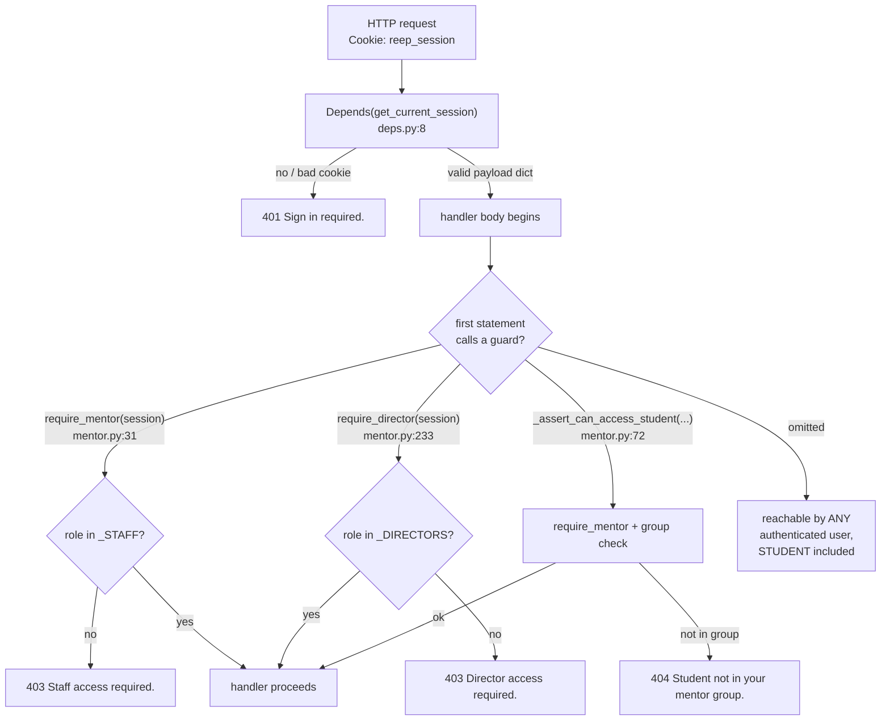
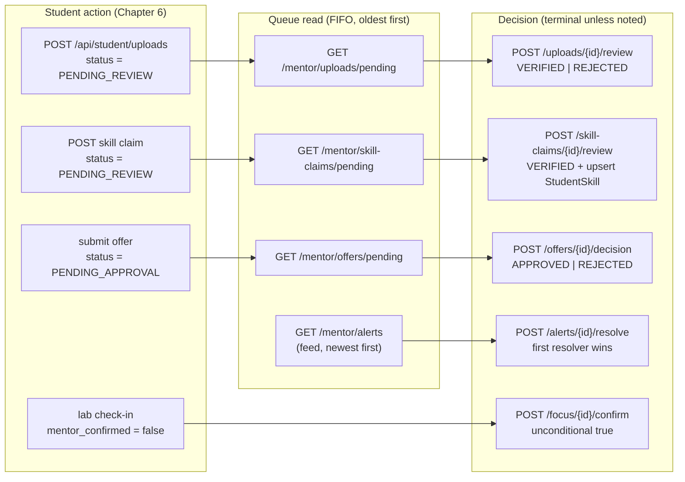
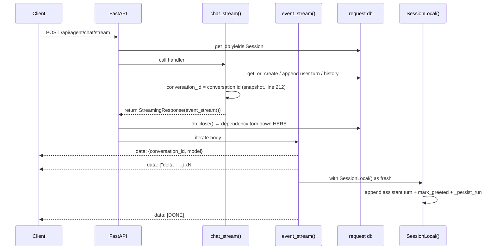
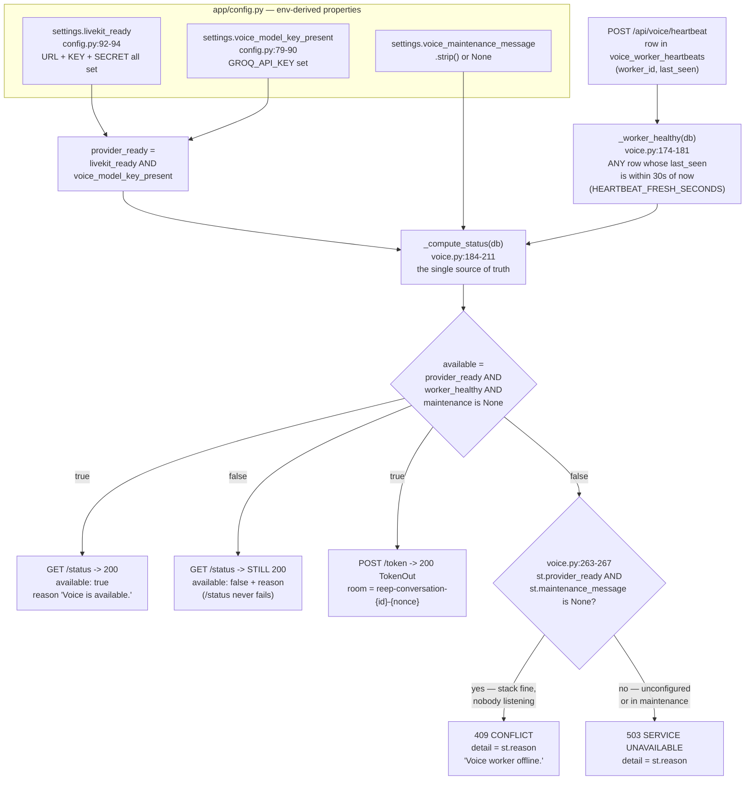

# Chapter 7 — The Staff & Machine API: Mentor, Director, Agent and Voice Endpoints

After this chapter you will be able to call, extend or audit every endpoint in REEP that is
**not** reachable by a student acting on their own records. You will know which of the four
routers owns which path, which of the two staff role tiers guards it, exactly where in each
handler the authorisation check happens (and why "where" is a security property here, not a
style question), what each review queue contains and what a review decision writes, what a
director's programme-wide aggregates actually compute down to the arithmetic, what the
assistant's streaming endpoint emits byte for byte on the wire, and the precise condition
under which `POST /api/voice/token` answers 200, 409 or 503. You will also know which of
these endpoints has no automated test at all — which, on a surface that returns other
people's marks and USNs, is the most operationally useful fact in the chapter.

**In scope:** [`app/routers/mentor.py`](apps/api-py/app/routers/mentor.py) (13 endpoints,
both role tiers), [`app/routers/director.py`](apps/api-py/app/routers/director.py) (7),
[`app/routers/agent.py`](apps/api-py/app/routers/agent.py) (9) and
[`app/routers/voice.py`](apps/api-py/app/routers/voice.py) (5) — 34 endpoints, documented
as HTTP contracts.

**Rule 2, stated once, up front.** "Rule 2" is used throughout this chapter and it is not
jargon you have to hold on trust — it is the scope rule written into `mentor.py`'s own module
docstring, and it is the sentence the whole staff surface exists to honour:

> "a MENTOR sees only students in their Mentor group; DIRECTOR/ADMIN see all. A MENTOR with
> NO Mentor group (no mentorId in the session) sees NOBODY — never the whole programme."
> ([mentor.py:3-6](apps/api-py/app/routers/mentor.py#L3-L6))

Three actors, three answers. A DIRECTOR or ADMIN gets the whole programme. A MENTOR gets the
students whose `mentor_id` matches theirs. A MENTOR whose account was never attached to a
`Mentor` row gets an **empty result** — not an error, and emphatically not the programme.
The last clause is the one that gets broken, because "no filter value" reads to a careless
author as "no filter". Chapter 5 owns *how* the rule is enforced; this chapter shows it
applied, endpoint by endpoint.

**Deferred, deliberately.** The *mechanism* of authentication and of Rule 2 —
`verify_session_token`, the cookie, `require_mentor`'s internals,
`_assert_can_access_student` line by line — belongs to Chapter 5, and this chapter cites it
rather than restating it. *How* the
assistant decides what to answer — intent routing, the deterministic student-data builders,
the polish step and the egress gate around it — is Chapter 8; this chapter stops at
`orchestrator.answer_question(...)` and hands off. The voice **worker process** — the fourth
process, its LiveKit session, its state machine — is Chapter 11; this chapter documents only
the two HTTP endpoints the worker calls and what they enforce. Every column mentioned here
is catalogued in Chapter 3; the mount points and request lifecycle are Chapter 1, §4. The
student surface is Chapter 6.

---

## 1. The staff surface at a glance

### 1.1 Four routers, two mounting styles

Two of these routers get their `/api` prefix at include time and two carry it themselves.
That is not an inconsistency; it is a deliberate split recorded in
[`app/main.py:69-82`](apps/api-py/app/main.py#L69-L82):

```python
# Health is infra liveness — unprefixed at /health.
app.include_router(health.router)
# agent + voice already carry /api in their own prefix (/api/agent, /api/voice).
app.include_router(agent.router)
app.include_router(voice.router)
# Domain routers mount under a single /api prefix, so the whole surface the
# Angular client calls lives under /api — matching environment.apiBase and the
# dev proxy (apps/web/proxy.conf.json), with no path rewriting.
app.include_router(auth.router, prefix="/api")
app.include_router(student.router, prefix="/api")
app.include_router(mentor.router, prefix="/api")
app.include_router(director.router, prefix="/api")
app.include_router(leave.router, prefix="/api")
app.include_router(registration.router, prefix="/api")
```

Six domain routers mount under a single `/api` prefix. Two of them — `leave.py` and
`registration.py` — carry staff endpoints guarded by functions defined in `mentor.py`, which
is the blast-radius point made two paragraphs down.

So `mentor.py` declares `APIRouter(prefix="/mentor", tags=["mentor"])`
([mentor.py:26](apps/api-py/app/routers/mentor.py#L26)) and answers at `/api/mentor/...`,
while `agent.py` declares `APIRouter(prefix="/api/agent", tags=["agent"])`
([agent.py:44](apps/api-py/app/routers/agent.py#L44)) and is included bare. If you add an
endpoint to `agent.py` or `voice.py` and it comes out at `/api/api/agent/...`, this is why.

| Router | File | Router prefix | Included with | Endpoints |
|---|---|---|---|---|
| mentor | `app/routers/mentor.py` | `/mentor` | `prefix="/api"` | 13 |
| director | `app/routers/director.py` | `/director` | `prefix="/api"` | 7 |
| agent | `app/routers/agent.py` | `/api/agent` | *(none)* | 9 |
| voice | `app/routers/voice.py` | `/api/voice` | *(none)* | 5 |

`mentor.py` is more than a feature router: it is the **definition site for the staff
authorisation vocabulary**. `require_mentor` is imported by
[`leave.py:19`](apps/api-py/app/routers/leave.py#L19); `require_director` by
[`director.py:21`](apps/api-py/app/routers/director.py#L21) and
[`registration.py:27`](apps/api-py/app/routers/registration.py#L27). Four routers depend on
two functions defined in one of them, which is why any change to their shape has blast
radius well beyond `mentor.py`.

### 1.2 The two role tiers

There are exactly two staff tiers, expressed as two module-private sets:

```python
_STAFF = {"MENTOR", "DIRECTOR", "ADMIN"}
```
([mentor.py:28](apps/api-py/app/routers/mentor.py#L28))

```python
_DIRECTORS = {"DIRECTOR", "ADMIN"}
```
([mentor.py:230](apps/api-py/app/routers/mentor.py#L230))

`require_mentor` admits the first set; `require_director` the second. Note that
`_DIRECTORS` is **not** grouped with `_STAFF` at the top of the file — it sits at line 230,
immediately above its first user. The file is organised as sequential feature blocks
(schema → mapper → endpoint), not constants-then-code, and the constant follows its block.

The vocabulary itself comes from the `Role` enum
([models/user.py:23](apps/api-py/app/models/user.py#L23)); the guards compare against
**strings**, because a session is a decoded JWT dict and not an ORM object — see Chapter 5,
§2.3 on the camelCase island for why the session payload is shaped the way it is.

Both guards are three lines and both return the session for chaining:

```python
def require_mentor(session: dict) -> dict:
    if session.get("role") not in _STAFF:
        raise HTTPException(status_code=status.HTTP_403_FORBIDDEN, detail="Staff access required.")
    return session
```
([mentor.py:31-34](apps/api-py/app/routers/mentor.py#L31-L34))

**No call site in the codebase uses that return value.** Every one is a bare statement call.
The return exists for a chaining style nobody adopted.

### 1.3 The structural fact: the guards are not dependencies

This is the single most important thing to understand before adding an endpoint here.

FastAPI's `Depends(...)` machinery resolves declared dependencies *before* the handler body
runs, and a dependency that raises aborts the request. `app/deps.py` contains exactly one
function — `get_current_session` — and it **authenticates**: it reads the `reep_session`
cookie, verifies it, and 401s when it is missing or invalid
([deps.py:8-13](apps/api-py/app/deps.py#L8-L13)). It says nothing whatsoever about role.

`require_mentor` and `require_director` are **plain functions**. They take an
already-resolved session dict, so they cannot be used as dependencies without a wrapper, and
they only run because the handler body calls them. Look at the shape:

```python
@router.get("/mentees", response_model=list[MenteeOut])
def mentees(
    session: dict = Depends(get_current_session), db: Session = Depends(get_db)
) -> list[MenteeOut]:
    require_mentor(session)
```
([mentor.py:45-49](apps/api-py/app/routers/mentor.py#L45-L49))

The `Depends(...)` line *looks* like the guard. It is not. Delete line 49 and the endpoint
still compiles, still authenticates, still returns 200 — to a STUDENT, with every student's
name, USN, stage and semester in the body. It would also pass code review, because the line
that appears to protect it is still there.



Audited against the code as written, across **all 25 call sites in all four routers that use
these two guards**: every one calls its guard as the first *executable* statement of the
handler body.
`mentor.py` lines 49, 117, 135, 191, 214, 269, 292, 349, 364, 417, 447, 514, 547 (13
handlers); `director.py` lines 40, 101, 135, 177, 223, 247, 298 (7 handlers);
[`leave.py:83`](apps/api-py/app/routers/leave.py#L83) (`pending_leaves`) and
[`leave.py:113`](apps/api-py/app/routers/leave.py#L113) (`decide_leave`), both
`require_mentor`; [`registration.py:163`](apps/api-py/app/routers/registration.py#L163)
(`pending`), [`186`](apps/api-py/app/routers/registration.py#L186) (`decide`) and
[`229`](apps/api-py/app/routers/registration.py#L229) (`rules`), all `require_director`.
The last five are outside this chapter's endpoint census but inside the guards' blast radius,
so they are audited here rather than left silently unexamined.

"First *executable*" is the precise claim: in **11 of the 25** the body opens with a
docstring and the guard is the line after it — `mentor.py`'s `pending_uploads` (docstring
415-416, guard 417), `review_upload` (445-446 / 447), `pending_skill_claims` (513 / 514) and
`review_skill_claim` (544-546 / 547); `director.py`'s `mail_log` (175-176 / 177),
`alert_rules` (222 / 223), `upsert_alert_rule` (245-246 / 247) and `job_imports` (296-297 /
298); `registration.py`'s `pending` (162 / 163), `decide` (184-185 / 186) and `rules` (228 /
229). A docstring executes nothing, so the security property is unchanged: no database read,
no branch and no response construction precedes the guard in any of the 25.

The code is correct today at all 25. Nothing *makes* it correct: there is no
router-level `dependencies=[...]`, no decorator, and no test that enumerates routes and
asserts the property. A single omitted line is a silent full-programme data leak.
[FINDINGS.md](docs/codebase-mahabharath/FINDINGS.md) records this as the highest-value hardening
available in the repo.

> **Why it is like this.** The scope rule is a *port*, not an invention. `mentor.py`'s
> module docstring names its ancestor explicitly: "Scope rule (mirrors
> `mentorScope()`/`menteeWhere()` in the Next.js app, and the AGENTS.md guidance)"
> ([mentor.py:1-7](apps/api-py/app/routers/mentor.py#L1-L7)). In the deleted Next.js app
> those were helper functions you called inside a resolver, and the port carried the calling
> convention across with the logic. That is how a plain function ended up doing a
> dependency's job.

**One important exception, and a correction.** `require_voice_worker`
([voice.py:65](apps/api-py/app/routers/voice.py#L65)) is often lumped in with the other two
because it also lives in a router rather than in `deps.py`. It is **not** the same shape: it
takes a `Header(default=None)` parameter and is wired through `Depends`, at
[voice.py:114](apps/api-py/app/routers/voice.py#L114) and
[voice.py:406](apps/api-py/app/routers/voice.py#L406):

```python
    _worker: None = Depends(require_voice_worker),
```

It therefore **cannot be forgotten in a handler body** — omitting it changes the function
signature visibly, and a `Header(...)` default only works as a dependency in the first
place. The "must be called by hand" generalisation holds for `require_mentor` and
`require_director` only.

### 1.4 Four guard idioms, not one

Counting honestly, this surface uses exactly **four** ways to express "who may call this".
The numbering below is used as shorthand for the rest of the chapter, so it is worth fixing
now.

| # | Idiom | Where | Shape |
|---|---|---|---|
| 1 | `require_mentor(session)` / `require_director(session)` | `mentor.py`, `director.py`, `leave.py`, `registration.py` | plain function, called in the body; membership test against a module-private set of role strings |
| 2 | `_assert_can_access_student(session, student_id, db)` | `mentor.py` only | plain function, calls `require_mentor` itself, then narrows to one student |
| 3 | inline `Role` comparison, hand-written | `agent.py:424`, `agent.py:509`, `voice.py:220`, `voice.py:252`, `voice.py:361` | compare `session.get("role")` against a `Role` value and `raise HTTPException(403)` inline — **five hand-written copies, no helper** |
| 4 | `Depends(require_voice_worker)` | `voice.py:114`, `voice.py:406` | real FastAPI dependency, machine auth via an `X-Voice-Worker-Secret` header, no user session |

Idiom 3 is not one shape but two, and conflating them misreads the metrics guard badly. Four
of the five copies are an **inequality against STUDENT** — "you must be a student":

```python
    if session.get("role") != Role.STUDENT.value:
```
([agent.py:424](apps/api-py/app/routers/agent.py#L424) — `/knowledge/search`;
[voice.py:220](apps/api-py/app/routers/voice.py#L220) — `/status`;
[voice.py:252](apps/api-py/app/routers/voice.py#L252) — `/token`;
[voice.py:361](apps/api-py/app/routers/voice.py#L361) — `/consent`)

The fifth is a **set-membership test against two director-tier roles** — the inverse
population:

```python
    role = session.get("role")
    if role not in (Role.DIRECTOR.value, Role.ADMIN.value):
```
([agent.py:508-509](apps/api-py/app/routers/agent.py#L508-L509) — `/metrics`)

Note the consequence for Rule 2's vocabulary: `/api/agent/knowledge/search` admits STUDENT
and **only** STUDENT — a DIRECTOR gets 403 there, which is the inverse of the
`require_mentor` widening. Voice is the same: a MENTOR cannot even ask whether voice is up.

**There is no *shared* student guard, and that is why idiom 3 exists in five copies.** One
guard does exist, but it is module-private to another router: `student.py` declares

```python
def _require_student(session: dict) -> str:
    student_id = session.get("studentId")
    if not student_id:
        raise HTTPException(status_code=status.HTTP_403_FORBIDDEN, detail="Not a student account.")
    return student_id
```
([student.py:118-122](apps/api-py/app/routers/student.py#L118-L122))

It is a different question asked in a different way: it refuses on a **missing `studentId`**
rather than on a role value, and it *returns* the id so the handler can use it (see §3.6,
and Chapter 6 for its forty-odd call sites). `agent.py` and `voice.py` need only the role
test and not the id, so they hand-roll the comparison instead of importing it. Both
behaviours are defensible; what is missing is any single place where "who is a student" is
decided.

### 1.5 Every endpoint in this chapter

Guard column shows what the handler actually calls. "Scope" is what a MENTOR sees versus
what a DIRECTOR/ADMIN sees.

| Method | Path | Guard | Scope |
|---|---|---|---|
| GET | `/api/mentor/mentees` | `require_mentor` + inline idiom | MENTOR: own group, `[]` if none. D/A: all |
| GET | `/api/mentor/students/{student_id}/notes` | `_assert_can_access_student` | single student, 404 if outside group |
| POST | `/api/mentor/students/{student_id}/notes` | `_assert_can_access_student` (+400 if no Mentor row) | single student |
| GET | `/api/mentor/students/{student_id}/focus` | `_assert_can_access_student` | single student |
| GET | `/api/mentor/alerts` | `require_mentor` + inline idiom | MENTOR: own group, `[]` if none. D/A: all |
| POST | `/api/mentor/alerts/{alert_id}/resolve` | `require_mentor` → `_assert_can_access_student` | single student |
| GET | `/api/mentor/uploads/pending` | `require_mentor` + inline idiom | MENTOR: own group, `[]` if none. D/A: all |
| POST | `/api/mentor/uploads/{upload_id}/review` | `require_mentor` → `_assert_can_access_student` | single student |
| GET | `/api/mentor/skill-claims/pending` | `require_mentor` + inline idiom | MENTOR: own group, `[]` if none. D/A: all |
| POST | `/api/mentor/skill-claims/{claim_id}/review` | `require_mentor` → `_assert_can_access_student` | single student |
| POST | `/api/mentor/focus/{session_id}/confirm` | `require_mentor` → `_assert_can_access_student` | single student |
| GET | `/api/mentor/offers/pending` | **`require_director`** | whole programme |
| POST | `/api/mentor/offers/{offer_id}/decision` | **`require_director`** | whole programme |
| GET | `/api/director/overview` | `require_director` | whole programme |
| GET | `/api/director/cohorts` | `require_director` | whole programme |
| GET | `/api/director/criteria` | `require_director` | whole programme (one config row) |
| GET | `/api/director/mail` | `require_director` | whole programme, limit 100 |
| GET | `/api/director/alert-rules` | `require_director` | whole programme, unbounded |
| PUT | `/api/director/alert-rules` | `require_director` | whole programme (upsert) |
| GET | `/api/director/job-imports` | `require_director` | whole programme, limit 50 |
| POST | `/api/agent/chat` | `get_current_session` only | caller's own conversation |
| POST | `/api/agent/chat/stream` | `get_current_session` only | caller's own conversation |
| POST | `/api/agent/ask` | `get_current_session` only | caller's own conversation |
| GET | `/api/agent/history` | `get_current_session` only | caller's own conversation |
| DELETE | `/api/agent/conversation` | `get_current_session` only | caller's own conversation |
| GET | `/api/agent/runs` | `get_current_session` only | caller's own runs, limit 50 |
| GET | `/api/agent/knowledge/search` | inline: STUDENT only | approved KB, `audience="student"` |
| POST | `/api/agent/feedback` | inline: ownership of the run | caller's own run |
| GET | `/api/agent/metrics` | inline: DIRECTOR/ADMIN | global, unwindowed |
| GET | `/api/voice/status` | inline: STUDENT only | caller |
| POST | `/api/voice/token` | inline: STUDENT only | caller's own conversation |
| POST | `/api/voice/consent` | inline: STUDENT only | caller's own conversation |
| POST | `/api/voice/heartbeat` | `Depends(require_voice_worker)` | machine; no user session |
| POST | `/api/voice/transcript` | `Depends(require_voice_worker)` | machine; names the conversation directly |

Two things in that table are worth staring at. First, the offer-approval workflow — which is
DIRECTOR work — lives in the **mentor** router. Second, `/api/mentor/offers/pending` is a
path under `/mentor` that a plain MENTOR is 403'd from.

### 1.6 Naming conventions established here

The staff routers follow a consistent set of rules. Chapter 15 collects them; they are
established in this code:

- **Module-private names take one leading underscore** — constants, guards and mappers
  alike: `_STAFF`, `_DIRECTORS`, `_assert_can_access_student`, `_note_out`, `_alert_out`,
  `_offer_row`, `_focus_row`, `_upload_out`, `_claim_out`, `_alert_rule_out`, `_persist_run`,
  `_worker_healthy`, `_compute_status`, `_now`. **The convention is not applied uniformly**:
  `agent.py`'s `SYSTEM_PROMPT` ([46](apps/api-py/app/routers/agent.py#L46)), `HISTORY_LIMIT`
  ([55](apps/api-py/app/routers/agent.py#L55)) and `FRIENDLY_ERROR`
  ([59](apps/api-py/app/routers/agent.py#L59)) are module-private in practice — a repo-wide
  grep finds no importer outside `agent.py` itself — yet carry no underscore, unlike
  `mentor.py`'s `_STAFF`/`_DIRECTORS`. `voice.py`'s bare `HEARTBEAT_FRESH_SECONDS`,
  `TOKEN_TTL`, `VOICE_AGENT_NAME` and `MAX_TRANSCRIPT_CHARS` are *not* counter-examples:
  the voice tests import them, so they are genuinely public.
- **Pydantic schemas are suffixed by direction** — `...Out` for responses, `...In` for
  request bodies, declared immediately above the endpoint that uses them: `MenteeOut`,
  `NoteIn`/`NoteOut`, `DecisionIn`, `UploadReviewIn`, `SkillClaimReviewIn`, `OverviewOut`,
  `AlertRuleIn`/`AlertRuleOut`, `HeartbeatIn`, `TranscriptIn`/`TranscriptOut`,
  `ChatIn`/`ChatOut`. Two carry a state or workflow qualifier rather than the bare entity
  (`PendingOfferOut`, `SkillClaimReviewOut`); one doubles the suffix (`FocusRowOut`).
- **Row-mapper helpers use two competing suffixes for the same job** — `_out` and `_row`,
  with no rule distinguishing them. `_offer_row` and `_focus_row` against `_note_out`,
  `_alert_out`, `_upload_out`, `_claim_out`. This is drift, not a convention; prefer `_out`.
- **Role guards are `require_<role>(session: dict) -> dict`**, singular role noun.
- **Handler names are bare resource nouns for lists and `verb_noun` for actions**, never
  repeating the HTTP method or the prefix: `mentees`, `alerts`, `cohorts`, `criteria` versus
  `resolve_alert`, `decide_offer`, `confirm_focus`, `review_upload`, `review_skill_claim`,
  `upsert_alert_rule`. State-qualified lists take the state as a prefix: `pending_offers`,
  `pending_uploads`, `pending_skill_claims`.
- **URL paths are kebab-case plurals with the action as a trailing verb segment**:
  `/skill-claims/pending`, `/uploads/{upload_id}/review`, `/alerts/{alert_id}/resolve`,
  `/offers/{offer_id}/decision`, `/alert-rules`, `/job-imports`. Path parameters are
  `{<entity>_id}` — with one exception noted in §3.5.
- **`HTTPException` details are one sentence, sentence case, full stop** — except when the
  sentence opens with a field name, which stays lowercase: "Staff access required.",
  "Director access required.", "Student not in your mentor group.", "Only a pending upload
  can be reviewed.", but "decision must be APPROVE or REJECT."
- **Enum values are converted at the mapper boundary with `.value`**, never stored as enums
  in a DTO: `student.current_stage.value`, `alert.severity.value`, `u.kind.value`,
  `r.rule_key.value`.
- **Session-payload keys are camelCase** (`session["userId"]`, `session.get("mentorId")`)
  while every Pydantic field and DB column is snake_case. The two collide inside single
  expressions, e.g. `Student.mentor_id == mentor_id` where `mentor_id` came from
  `session.get("mentorId")` ([mentor.py:56](apps/api-py/app/routers/mentor.py#L56)). Chapter
  5, §2.3 explains the heritage.

---

## 2. Mentor endpoints, group A — reading students

### 2.1 `_assert_can_access_student` is a *complete* guard

Chapter 5 owns this function's mechanism. What matters for reading endpoints is one
structural fact, visible in its first line:

```python
def _assert_can_access_student(session: dict, student_id: str, db: Session) -> None:
    """Staff only, and a MENTOR only for a student in their own group."""
    require_mentor(session)
    if session["role"] in ("DIRECTOR", "ADMIN"):
        if db.get(Student, student_id) is None:
            raise HTTPException(status_code=status.HTTP_404_NOT_FOUND, detail="Student not found.")
        return
    mentor_id = session.get("mentorId")
    student = db.get(Student, student_id)
    if not mentor_id or student is None or student.mentor_id != mentor_id:
        raise HTTPException(
            status_code=status.HTTP_404_NOT_FOUND, detail="Student not in your mentor group."
        )
```
([mentor.py:72-84](apps/api-py/app/routers/mentor.py#L72-L84))

It calls `require_mentor` itself (line 74). A handler whose only guard is this call is fully
guarded — a STUDENT is 403'd inside it before any database work. Three of the thirteen
endpoints rely on that: `list_notes`, `add_note` and `student_focus`.

Two consequences you will not deduce from the name. First, the MENTOR branch compares
`student.mentor_id != mentor_id` against a **nullable** FK
([models/user.py:65](apps/api-py/app/models/user.py#L65)), so a student with `mentor_id =
NULL` fails the comparison for every mentor: **unassigned students are visible only to
DIRECTOR/ADMIN.** Second, the three distinct failures — mentor has no group, student does
not exist, student belongs to someone else — collapse into one 404 with one message. That is
deliberate and is treated as a convention in §9.

### 2.2 Why a list endpoint cannot use the helper

The helper takes a `student_id`. A list endpoint has no single subject to pass it. That is
the whole reason there are two idioms, and it is not a matter of taste: the two questions
are genuinely different.

- *Single-student:* "may this caller touch **this** row?" → a **boolean assertion** that
  either passes or raises. 404 is the right refusal, because the row's existence is the
  thing being hidden.
- *List:* "which rows may this caller see?" → a **filter**, expressed as a `WHERE` clause
  bolted onto the query. There is nothing to refuse; a mentor with no group has an empty
  result, not a forbidden one.

Trying to force the assert helper onto a list would mean fetching every student and testing
them one at a time — the whole programme read into memory before being narrowed, which is
exactly the read the rule exists to prevent. So the four list endpoints repeat this idiom
instead.

Before reading it, you need to know where `mentorId` comes from and why it can be absent,
because that is the entire hinge. It is stamped into the JWT at login, and **only when the
user row actually has a `Mentor` relation**:

```python
    if user.student is not None:
        payload["studentId"] = user.student.id
    if user.mentor is not None:
        payload["mentorId"] = user.mentor.id
```
([auth.py:36-39](apps/api-py/app/routers/auth.py#L36-L39))

A user with `role = MENTOR` but no `Mentor` row therefore logs in successfully, passes
`require_mentor` (which tests the role string and nothing else), and carries a session dict
with **no `mentorId` key at all**. That is not a hypothetical: it is the exact state a
freshly created staff account is in before someone attaches it to a mentor group, and it is
the state the `return []` below exists for. Now the idiom:

```python
    if session["role"] == "MENTOR":
        mentor_id = session.get("mentorId")
        if not mentor_id:
            return []  # no Mentor group => nobody (never the whole programme)
        query = query.where(Student.mentor_id == mentor_id)
    # DIRECTOR / ADMIN: no narrowing — the whole programme.
```
([mentor.py:52-57](apps/api-py/app/routers/mentor.py#L52-L57))

The load-bearing line is `return []`. Without it, a MENTOR whose `Mentor` group was never
assigned would fall through to a query with no `WHERE` — a director-level view of the entire
programme handed to the least-privileged staff account. That is AGENTS.md Rule 2's exact
failure mode: *never read "no mentor group" as "whole programme."*

The idiom is hand-copied four times, at
[mentor.py:52-57](apps/api-py/app/routers/mentor.py#L52-L57) (`/mentees`),
[199-203](apps/api-py/app/routers/mentor.py#L199-L203) (`/alerts`),
[424-428](apps/api-py/app/routers/mentor.py#L424-L428) (`/uploads/pending`) and
[522-526](apps/api-py/app/routers/mentor.py#L522-L526) (`/skill-claims/pending`). Only two
copies carry the explanatory comment; the other two are the same code with the comment
dropped. There is no shared helper, and nothing structural keeps the four in step.

### 2.3 `GET /api/mentor/mentees`

**Guard:** `require_mentor(session)` at line 49, then the inline scope idiom.
**Request:** no body, no query parameters.
**Response:** `list[MenteeOut]`.

| Field | Type | Source |
|---|---|---|
| `student_id` | `str` | `student.id` |
| `name` | `str` | joined `User.name` |
| `usn` | `str \| None` | `student.usn` |
| `current_stage` | `str` | `student.current_stage.value` — `Stage`: REBOOT / EXCEL / EXCEL_ADVANCED / ELEVATE ([models/user.py:30](apps/api-py/app/models/user.py#L30)) |
| `current_semester` | `int` | `student.current_semester` |

The query is `select(Student, User.name).join(User, Student.user_id == User.id)` ordered by
`User.name` — alphabetical by display name, not by USN or stage.

**Status codes:** 200; 403 "Staff access required." from the guard; 401 "Sign in required."
from the session dependency.

**Writes:** nothing. **Pagination:** none, and no server-side cap — an ADMIN on a full
programme receives every student row in one response.

This is one of only **three** endpoints on the whole staff surface touched by any test at all
(the others are `/api/director/overview` and `/api/director/alert-rules`), and what the test
checks is the **role tier**, never the scope. `test_auth_rbac.py:41-43` asserts a STUDENT
gets 403; `:53-57` asserts a MENTOR gets 200 here and 403 on a director path. Tier ("are you
staff?") and scope ("*which* students may you see?") are answered by different code — the
guard versus the inline narrowing — and only the first is exercised. **No test anywhere
exercises the mentor-group narrowing, and none inspects a response body.** See §8.2.

### 2.4 `GET` and `POST /api/mentor/students/{student_id}/notes`

`NoteOut` ([mentor.py:87-92](apps/api-py/app/routers/mentor.py#L87-L92)) is five fields,
built by `_note_out` ([mentor.py:101-108](apps/api-py/app/routers/mentor.py#L101-L108)):

| Field | Type | Source |
|---|---|---|
| `id` | `str` | `note.id` |
| `note_text` | `str` | `note.note_text` |
| `linked_action` | `str` | `note.linked_action.value` — **the `.value` conversion at the mapper boundary**, turning a `MentorAction` enum into a plain string ([mentor.py:105](apps/api-py/app/routers/mentor.py#L105)) |
| `meeting_at` | `datetime` | `note.meeting_at` |
| `created_at` | `datetime` | `note.created_at` |

Note what it does **not** carry: neither `student_id` nor `mentor_id`. A list of notes
therefore has **no authorship** — a director reading a mentee's notes cannot tell which
mentor wrote which.

**`GET`** ([mentor.py:111-123](apps/api-py/app/routers/mentor.py#L111-L123)) is guarded by
`_assert_can_access_student` at line 117 and nothing else. It orders by
`MentorNote.meeting_at.desc()` — newest meeting first — and is unbounded. Status codes: 200,
401, 403, 404.

**`POST`** ([mentor.py:126-158](apps/api-py/app/routers/mentor.py#L126-L158)) returns
`status.HTTP_201_CREATED`. Body `NoteIn`
([mentor.py:95-98](apps/api-py/app/routers/mentor.py#L95-L98)):

| Field | Type | Constraint |
|---|---|---|
| `note_text` | `str` | `Field(min_length=1, max_length=4000)` — the **only** length-validated field in the router |
| `linked_action` | `str` | defaults `"NONE"`; validated by hand against `MentorAction` |
| `meeting_at` | `datetime \| None` | defaults to `now(utc)` when omitted |

The order of checks matters and is worth reading in full:

```python
    _assert_can_access_student(session, student_id, db)
    mentor_id = session.get("mentorId")
    if not mentor_id:
        raise HTTPException(
            status_code=status.HTTP_400_BAD_REQUEST,
            detail="Only a mentor (with a Mentor profile) can author notes.",
        )
```
([mentor.py:135-141](apps/api-py/app/routers/mentor.py#L135-L141))

**A DIRECTOR or ADMIN with no `Mentor` row cannot author a note at all.** They pass the
scope guard — directors see everyone — and are then rejected with a 400. That is not a
policy choice made in the router; it is forced by the schema. `mentor_notes.mentor_id` is a
**non-nullable** FK to `mentors.id`
([models/mentor_note.py:35](apps/api-py/app/models/mentor_note.py#L35)), so the alternative
to this 400 is an `IntegrityError` surfacing as an unhandled 500.

Then the enum check:

```python
    try:
        action = MentorAction(body.linked_action)
    except ValueError:
        raise HTTPException(
            status_code=status.HTTP_422_UNPROCESSABLE_ENTITY, detail="Invalid linked_action."
        )
```
([mentor.py:142-147](apps/api-py/app/routers/mentor.py#L142-L147))

Construction **by value**, therefore **case-sensitive**: `"NONE"` works, `"none"` raises and
422s. The four legal values are `NONE`, `FLAGGED`, `NUDGE_SENT`, `ONE_ON_ONE_SCHEDULED`
([models/mentor_note.py:20-24](apps/api-py/app/models/mentor_note.py#L20-L24)). Contrast the
`decision` fields in §7, which *are* uppercased — the router is inconsistent about case
folding, and this is the one place it is not done.

The insert takes `mentor_id=mentor_id` **from the session**
([mentor.py:149](apps/api-py/app/routers/mentor.py#L149)). `NoteIn` has no mentor field, so
authorship cannot be spoofed by the client.

> **Why it is like this.** `meeting_at` defaults to now but is a separate column from
> `created_at` because, as the model records, "meeting_at (when it happened) is distinct from
> created_at (when it was typed), since notes are often written up later"
> ([models/mentor_note.py:1-4](apps/api-py/app/models/mentor_note.py#L1-L4)). A mentor writing
> up Tuesday's meeting on Friday gets both facts recorded, and the list sorts by the one that
> matters to a reader.

**Status codes:** 201, 400, 401, 403, 404, 422. There is **no update and no delete
endpoint** for a note — through this API, notes are append-only.

### 2.5 `GET /api/mentor/students/{student_id}/focus`

The focus log is the student's lab/study check-in history.
`FocusRowOut` ([mentor.py:321-328](apps/api-py/app/routers/mentor.py#L321-L328)) is seven
fields, built by `_focus_row` ([mentor.py:331-340](apps/api-py/app/routers/mentor.py#L331-L340)):

| Field | Type | Source |
|---|---|---|
| `id` | `str` | `ls.id` |
| `course_code` | `str` | `ls.course_code` |
| `module` | `str` | `ls.module` |
| `activity` | `str` | `ls.activity.value` — the second demonstration of the `.value` convention; one of 15 `ActivityType` members ([mentor.py:336](apps/api-py/app/routers/mentor.py#L336)) |
| `duration_min` | `int \| None` | `ls.duration_min` |
| `check_in_at` | `datetime` | `ls.check_in_at` |
| `mentor_confirmed` | `bool` | `ls.mentor_confirmed` |

`duration_min` is `int | None`, and the null means something specific: per
[models/lab.py:1-3](apps/api-py/app/models/lab.py#L1-L3), "duration_min is null while a
session is still open." A null here is an **open session**, not missing data.

**Guard:** `_assert_can_access_student` at line 349, the only guard.
**Query:** `LabSession` for that student ordered `check_in_at.desc()`, unbounded, with no
date window. There is an index supporting the sort (`ix_labsession_student_checkin`) but no
bound on rows returned.
**Status codes:** 200, 401, 403, 404. **Writes:** nothing.

---

## 3. Mentor endpoints, group B — the review queues

These seven endpoints are the staff working day: three queues, four decisions. Before the
detail, the shape they share.



**Three of the queues sort ascending — oldest first, i.e. FIFO work queues:**
`/offers/pending` by `PlacementOffer.created_at`
([mentor.py:275](apps/api-py/app/routers/mentor.py#L275)), `/uploads/pending` by
`Upload.uploaded_at` ([mentor.py:429](apps/api-py/app/routers/mentor.py#L429)),
`/skill-claims/pending` by `SkillClaim.created_at`
([mentor.py:527](apps/api-py/app/routers/mentor.py#L527)). **Three read surfaces sort
descending — newest first, i.e. feeds:** `/alerts`, `/students/{id}/notes`,
`/students/{id}/focus`. The convention is perfectly consistent and stated in no comment.

**No endpoint in this router accepts `limit`, `offset`, `page` or a date window**, and none
applies a server-side cap. The single query parameter in the whole file is `open_only: bool
= True` on `/alerts` ([mentor.py:187](apps/api-py/app/routers/mentor.py#L187)).

**Nothing here notifies the student.** `mentor.py` imports no mailer and constructs no
`MailLog`; a rejected certificate, a reduced skill grant and an approved offer are all
silent as far as this router is concerned. The student learns by re-reading their own
surface.

### 3.1 Alerts — `GET /api/mentor/alerts`

**What populates the queue:** nothing, in the running system. This is important enough to
state before the contract. Repo-wide, the only place an `Alert` row is ever constructed is
[`app/seed.py:160`](apps/api-py/app/seed.py#L160) — a single hand-written WARNING row. There
is no scheduler, no background task, no lifespan hook and no request-path code that
evaluates a rule and inserts an alert. And because `python -m app.seed` refuses to run when
`ENV=prod` (AGENTS.md), on a production host **this queue is permanently empty**. §4.6
covers the configuration surface that has no engine behind it.

`AlertOut` ([mentor.py:161-169](apps/api-py/app/routers/mentor.py#L161-L169)): `id`,
`student_id`, `student_name`, `rule_triggered`, `severity`, `message`, `triggered_at`,
`resolved`. The last field is **computed, not stored**:

```python
        resolved=alert.resolved_at is not None,
```
([mentor.py:181](apps/api-py/app/routers/mentor.py#L181))

The table has `resolved_at` and `resolved_by`, no boolean
([models/alert.py:55-56](apps/api-py/app/models/alert.py#L55-L56)). The mapper deliberately
withholds three columns: `context` — the JSONB snapshot of the values that fired the rule,
kept for auditability — plus `resolved_at` and `resolved_by`. **The API tells you an alert
is closed but never who closed it or when.**

**Guard:** `require_mentor` at line 191, then the inline idiom at 199-203.
**Query parameter:** `open_only: bool = True`, declared ahead of the two `Depends`
parameters; FastAPI infers a query parameter from a non-path scalar with a default. When
true it appends `Alert.resolved_at.is_(None)` — note `.is_(None)`, which generates `IS
NULL`, not `== None`.
**Query:** a two-hop join, `Alert → Student → User`, because the alert points at a student
and the display name lives on the user.
**Ordering:** `triggered_at.desc()`.
**Status codes:** 200, 401, 403.

### 3.2 `POST /api/mentor/alerts/{alert_id}/resolve`

**Body: none.** Resolving an alert takes no note and no reason, and there is no
`resolve_note` column to put one in.

Guards run in this order: `require_mentor` at line 214 (before any DB read, so a STUDENT is
403'd without causing a lookup); `db.get(Alert, alert_id)` and a 404 "Alert not found."; then
`_assert_can_access_student(session, alert.student_id, db)` at line 218.

The write is guarded, and this is the only one of the five decision endpoints where it is:

```python
    if alert.resolved_at is None:
        alert.resolved_at = datetime.now(timezone.utc)
        alert.resolved_by = session["userId"]
        db.commit()
        db.refresh(alert)
```
([mentor.py:219-223](apps/api-py/app/routers/mentor.py#L219-L223))

**Idempotent by preservation.** A second call finds `resolved_at` non-null, skips the block
entirely — no commit, no refresh — and returns the stored state. The original resolver and
the original timestamp survive.

It is **one of the two** decision endpoints that can never 409, and the two get there for
opposite reasons. This one can never 409 because it *guards the write*: a repeat is a
deliberate no-op. `POST /focus/{session_id}/confirm` (§3.5) can never 409 because it has
**nothing to guard** — no precondition, no stamp to clobber, so it just re-writes `True`.
The three endpoints that take a `decision` body are all terminal and all 409 on a repeat
(§7.4).

> **Why it is like this.** The alternative is unconditional stamping, and the endpoint takes
> no body and cannot conflict, so a duplicate click from a second staff member would silently
> replace `resolved_by` and `resolved_at` — destroying the record of who actually closed the
> alert, with nothing anywhere to show it happened.

**Status codes:** 200, 401, 403, 404. **Columns stamped:** `alerts.resolved_at`,
`alerts.resolved_by` — the latter a plain nullable `String`, **not** a foreign key.

### 3.3 Documents — `GET /api/mentor/uploads/pending` and `POST .../review`

**What populates the queue:** every `Upload` row in `PENDING_REVIEW`. The list endpoint's
own docstring names them: "Documents awaiting review — profile photos, certificate proofs,
offer letters — scoped to the mentor's own group (DIRECTOR/ADMIN see all)"
([mentor.py:415-416](apps/api-py/app/routers/mentor.py#L415-L416)).

`UploadOut` is **14 fields** — the class statement is at
[mentor.py:375](apps/api-py/app/routers/mentor.py#L375) and the fields occupy
[376-389](apps/api-py/app/routers/mentor.py#L376-L389) — built by `_upload_out`
([mentor.py:392-408](apps/api-py/app/routers/mentor.py#L392-L408)):

| Field | Type | Source |
|---|---|---|
| `id` | `str` | `u.id` |
| `student_id` | `str` | `u.student_id` |
| `student_name` | `str` | **joined** `User.name`, passed in by the caller — not a column on `Upload` |
| `kind` | `str` | `u.kind.value` — `.value` at the mapper boundary ([mentor.py:397](apps/api-py/app/routers/mentor.py#L397)) |
| `cert_code` | `str \| None` | `u.cert_code` |
| `title` | `str` | `u.title` |
| `original_name` | `str` | `u.original_name` — the **client-supplied** filename |
| `mime_type` | `str` | `u.mime_type` |
| `size_bytes` | `int` | `u.size_bytes` |
| `status` | `str` | `u.status.value` — `.value` again ([mentor.py:403](apps/api-py/app/routers/mentor.py#L403)) |
| `reviewed_by_id` | `str \| None` | `u.reviewed_by_id`, a raw user id with **no name resolution** |
| `reviewed_at` | `datetime \| None` | `u.reviewed_at` |
| `review_note` | `str \| None` | `u.review_note` |
| `uploaded_at` | `datetime` | `u.uploaded_at` |

It exposes `original_name` but **never `stored_name`**, the random on-disk key that
[models/upload.py:57-58](apps/api-py/app/models/upload.py#L57-L58) describes as "Random, so
an uploaded name can never traverse a path". The storage key stays server-side.

The review handler ([mentor.py:438-474](apps/api-py/app/routers/mentor.py#L438-L474)) runs
four gates in order: `require_mentor` (447) → `db.get` + 404 (448-450) →
`_assert_can_access_student` (451) → the pending precondition:

```python
    if up.status != UploadStatus.PENDING_REVIEW:
        raise HTTPException(
            status_code=status.HTTP_409_CONFLICT, detail="Only a pending upload can be reviewed."
        )
```
([mentor.py:452-455](apps/api-py/app/routers/mentor.py#L452-L455))

**Decision vocabulary** (full treatment in §7): `VERIFY`, `VERIFIED`, `APPROVE` → VERIFIED;
`REJECT`, `REJECTED` → REJECTED; anything else → 422 with a message naming only two of the
five accepted tokens.

**Stamping is unconditional on both branches**
([mentor.py:466-468](apps/api-py/app/routers/mentor.py#L466-L468)): `reviewed_by_id` from
the session, `reviewed_at` from `now(utc)`, `review_note` from the body — set to `None` when
the client omits it, so a re-review that dropped the note would blank it, if a re-review were
possible.

**Not idempotent — terminal.** A repeat call 409s. A decision cannot be corrected through
the API.
**Status codes:** 200, 401, 403, 404, 409, 422.

### 3.4 Skills — `GET /api/mentor/skill-claims/pending` and `POST .../review`

This is the only endpoint in the router that writes a **second table**, and its docstring is
the most load-bearing sentence in the file:

```python
    """Grant (optionally at a reduced level) or reject a skill claim. Granting
    upserts the student's verified StudentSkill at the granted level and points
    it at the evidence upload — the claim is how a skill becomes verified."""
```
([mentor.py:544-546](apps/api-py/app/routers/mentor.py#L544-L546))

The list endpoint is the file's only three-way join — `SkillClaim → Student → User` plus
`SkillClaim → Skill` — because a claim needs both the student's and the skill's display
names ([mentor.py:515-521](apps/api-py/app/routers/mentor.py#L515-L521)). Correspondingly,
`_claim_out` is the only mapper taking **three** arguments
([mentor.py:492](apps/api-py/app/routers/mentor.py#L492)).

`SkillClaimReviewOut` ([mentor.py:477-489](apps/api-py/app/routers/mentor.py#L477-L489)) is
twelve fields, built by `_claim_out`
([mentor.py:492-506](apps/api-py/app/routers/mentor.py#L492-L506)):

| Field | Type | Source |
|---|---|---|
| `id` | `str` | `sc.id` |
| `student_id` | `str` | `sc.student_id` |
| `student_name` | `str` | **joined** `User.name`, passed in |
| `skill_id` | `str` | `sc.skill_id` |
| `skill_name` | `str` | **joined** `Skill.name`, passed in — the second joined argument, which is why this is the only three-argument mapper |
| `upload_id` | `str` | `sc.upload_id` — the evidence document |
| `claimed_level` | `int` | `sc.claimed_level` |
| `status` | `str` | `sc.status.value` — `.value` at the boundary ([mentor.py:501](apps/api-py/app/routers/mentor.py#L501)) |
| `reviewed_by_id` | `str \| None` | `sc.reviewed_by_id` |
| `reviewed_at` | `datetime \| None` | `sc.reviewed_at` |
| `review_note` | `str \| None` | `sc.review_note` |
| `created_at` | `datetime` | `sc.created_at` |

Read that list for what is missing: it reports `claimed_level` and **never the granted
level**. After a reduced grant the response still shows what was asked for; the level
actually granted is observable only on the `StudentSkill` row, via the student surface.

Body `SkillClaimReviewIn`
([mentor.py:531-534](apps/api-py/app/routers/mentor.py#L531-L534)):

| Field | Type | Constraint |
|---|---|---|
| `decision` | `str` | inline comment `# "GRANT" \| "REJECT"`; validated by hand |
| `granted_level` | `int \| None` | `Field(default=None, ge=1, le=5)` — the only numerically bounded field in the router |
| `note` | `str \| None` | unconstrained |

The grant branch:

```python
    if decision in ("GRANT", "APPROVE", "VERIFY"):
        granted = body.granted_level or sc.claimed_level
        sc.status = UploadStatus.VERIFIED
        # Upsert the verified StudentSkill at the granted level.
        existing = db.scalar(
            select(StudentSkill).where(
                StudentSkill.student_id == sc.student_id,
                StudentSkill.skill_id == sc.skill_id,
            )
        )
        if existing is None:
            db.add(
                StudentSkill(
                    student_id=sc.student_id,
                    skill_id=sc.skill_id,
                    level=granted,
                    verified=True,
                    evidence_upload_id=sc.upload_id,
                )
            )
        else:
            existing.level = granted
            existing.verified = True
            existing.evidence_upload_id = sc.upload_id
```
([mentor.py:557-580](apps/api-py/app/routers/mentor.py#L557-L580))

Four things about that block.

**(a) `granted = body.granted_level or sc.claimed_level` is safe only because of `ge=1`.**
The `or` idiom treats `0` as absent. Relax the Pydantic bound to `ge=0` and a client sending
`granted_level=0` would silently be granted the full claimed level — a privilege escalation
dressed as a downgrade. The coupling is between a constraint on line 533 and an `or` on line
558, with no comment linking them.

**(b) It is a hand-rolled read-then-write upsert, not `ON CONFLICT`.** The table carries
`UniqueConstraint("student_id", "skill_id", name="uq_student_skill")`
([models/skill.py:51](apps/api-py/app/models/skill.py#L51)), and the SELECT-then-branch is
what normally keeps it satisfied. Under two concurrent grants for the same (student, skill)
pair, both can see `existing is None`, both INSERT, and the loser's commit raises
`IntegrityError` — an unhandled 500 rather than a clean 409. Low likelihood, unmitigated.

**(c) The else-branch overwrites `level` downward.** A student verified at level 5 from an
earlier claim, granted level 2 on a new claim for the same skill, ends at level 2. The upsert
is last-write-wins, not high-water-mark.

**(d) The REJECT branch touches `StudentSkill` not at all**, so a previously granted skill
survives a later rejection on a different claim.

There is a fifth property that is invisible unless you know where to look. `SessionLocal` is
built with `autoflush=False` ([app/db.py:21](apps/api-py/app/db.py#L21)), and that is
**load-bearing here**: line 559 assigns `sc.status = VERIFIED` and line 561 then issues a
`SELECT`. With autoflush on, that SELECT would flush the pending status change to Postgres
mid-handler. With it off, nothing reaches the database until the single `db.commit()` at line
591 — so the claim flip and the `StudentSkill` upsert land in **one transaction**, and a
failure in the upsert cannot leave a claim marked VERIFIED with no skill granted.

The handler ends with **two** name lookups — the student's via the User/Student join and
`skname = db.scalar(select(Skill.name).where(Skill.id == sc.skill_id))`
([mentor.py:593-596](apps/api-py/app/routers/mentor.py#L593-L596)).

**Terminal, not idempotent.** **Status codes:** 200, 401, 403, 404, 409, 422.

### 3.5 `POST /api/mentor/focus/{session_id}/confirm`

The smallest endpoint in the router, and the one with the least accountability.

```python
    require_mentor(session)
    ls = db.get(LabSession, session_id)
    if ls is None:
        raise HTTPException(status_code=status.HTTP_404_NOT_FOUND, detail="Session not found.")
    _assert_can_access_student(session, ls.student_id, db)
    ls.mentor_confirmed = True
    db.commit()
    db.refresh(ls)
```
([mentor.py:364-371](apps/api-py/app/routers/mentor.py#L364-L371))

**Body: none.** Three consequences:

1. **Idempotent in effect but not in behaviour.** A repeat call re-writes `True` and commits
   again rather than short-circuiting the way `resolve_alert` does. There is no 409.
2. **No reviewer id, no timestamp, no note.** `LabSession` has only the `mentor_confirmed`
   boolean ([models/lab.py:84](apps/api-py/app/models/lab.py#L84)); no confirmer columns
   exist. This is the one review action in the router with **zero audit trail**.
3. **No un-confirm endpoint.** Once true, the API offers no way back.

A readability hazard worth naming, since it will bite the next person: the path parameter is
called `session_id` and sits in the same signature as `session: dict =
Depends(get_current_session)`. `session_id` is a `LabSession.id` and has nothing to do with
the auth session. It is the only path parameter in the router that is not
`{<entity>_id}` for the entity it names.

### 3.6 The evidence gap

`/uploads/{id}/review` and `/skill-claims/{id}/review` both ask a mentor to judge a document,
and the DTOs hand back `original_name`, `mime_type`, `size_bytes` and `upload_id`. But the
only endpoint that streams the bytes is `GET /api/student/uploads/{upload_id}/file`
([student.py:1391](apps/api-py/app/routers/student.py#L1391)), whose first line is:

```python
    student_id = _require_student(session)
```
([student.py:1398](apps/api-py/app/routers/student.py#L1398))

and `_require_student` raises `403 "Not a student account."` whenever the session has no
`studentId` ([student.py:118-122](apps/api-py/app/routers/student.py#L118-L122)) — which is
every MENTOR, DIRECTOR and ADMIN session, because `_payload_for` sets `studentId` only when
`user.student is not None`
([auth.py:36-37](apps/api-py/app/routers/auth.py#L36-L37)). The handler then also checks
`upload.student_id != student_id`.

**There is no route by which a reviewer can fetch the file they are approving.** The review
workflow is metadata-only from the API's side. Recorded as a workflow gap rather than a
defect — a mentor could in principle read the file store directly — but any UI built against
these endpoints will need a mentor-side download to exist first.

---

## 4. Director endpoints

### 4.1 What director scope actually means

Mentor scope is a filter. Director scope is the **absence** of one, and `director.py` is the
deliberate expression of that. There is not one `Student.mentor_id ==` clause, not one
`session.get("mentorId")` read, and no call to `_assert_can_access_student` anywhere in the
file. Every query is a bare programme-wide aggregate over the whole table.

The two optional query parameters in the file — `kind` on `/mail`
([director.py:171](apps/api-py/app/routers/director.py#L171)) and `cohort_id` on
`/alert-rules` ([director.py:218](apps/api-py/app/routers/director.py#L218)) — are caller
conveniences, not security scopes. Nothing checks that the caller is entitled to that cohort,
because at DIRECTOR/ADMIN level there is nothing to check.

The module docstring says exactly this and every word of it is true of the file as written:

```python
"""Director dashboard — programme-wide aggregates. Director/admin only; reuses
the mentor router's require_director guard. Compute-only over existing data.
"""
```
([director.py:1-3](apps/api-py/app/routers/director.py#L1-L3))

"Compute-only" is an accurate promise: six of seven endpoints are pure reads, and the seventh
writes only configuration, never domain data.

The status ladder on every director endpoint is identical: no/invalid cookie → **401** "Sign
in required."; a valid cookie with role STUDENT or MENTOR → **403** "Director access
required."; DIRECTOR or ADMIN → the handler runs.

### 4.2 The offer workflow, which lives in the wrong file

Before `director.py`, two director-only endpoints sitting under `/api/mentor`.

**`GET /api/mentor/offers/pending`**
([mentor.py:265-277](apps/api-py/app/routers/mentor.py#L265-L277)) is guarded by
`require_director` at line 269 — so a plain MENTOR gets 403 on a path under the `/mentor`
prefix. There is **no mentor-scope narrowing at all**, and correctly so: only DIRECTOR/ADMIN
reach it, and they see everything anyway.

`PendingOfferOut` ([mentor.py:241-249](apps/api-py/app/routers/mentor.py#L241-L249)) is eight
fields, built by `_offer_row`
([mentor.py:252-262](apps/api-py/app/routers/mentor.py#L252-L262)):

| Field | Type | Source |
|---|---|---|
| `id` | `str` | `offer.id` |
| `student_id` | `str` | `offer.student_id` |
| `student_name` | `str` | **joined** `User.name`, passed in — **not a column on `PlacementOffer`** |
| `job_title` | `str` | `offer.job_title` |
| `organisation` | `str` | `offer.organisation` |
| `role_type` | `str` | `offer.role_type.value` — `.value` at the boundary ([mentor.py:259](apps/api-py/app/routers/mentor.py#L259)) |
| `ctc_inr` | `int` | `offer.ctc_inr` |
| `status` | `str` | `offer.status.value` ([mentor.py:261](apps/api-py/app/routers/mentor.py#L261)) |

`PlacementOffer` declares **24 mapped columns**
([models/offer.py:51-91](apps/api-py/app/models/offer.py#L51-L91)). Seven of them reach the
director, plus the joined student name. The arithmetic closes: **17 columns are omitted —
`job_id`, `channel`, `joining_date`, `work_mode`, `location`, `fixed_gross_inr`, `bonuses`,
`offer_letter_upload_id`, `loi_upload_id`, `job_description`, `bond_details`,
`other_benefits`, `approved_by_id`, `decided_at`, `decision_note`, `created_at`,
`updated_at`** — and 17 + 7 = 24. A director approving an offer sees title, organisation,
role type and headline CTC, but not the offer letter, not the fixed-gross split, not the bond
terms. The evidence for the decision is not in the payload, and (per §3.6) could not be
fetched anyway.

**`POST /api/mentor/offers/{offer_id}/decision`**
([mentor.py:285-318](apps/api-py/app/routers/mentor.py#L285-L318)). Body `DecisionIn`:

```python
class DecisionIn(BaseModel):
    decision: str  # "APPROVE" | "REJECT"
    note: str | None = None
```
([mentor.py:280-282](apps/api-py/app/routers/mentor.py#L280-L282))

Neither field has a Pydantic constraint — no `min_length`, no `Literal`, no enum — so
validation is entirely hand-rolled, and OpenAPI advertises only `string`.

Gates: `require_director` (292) → 404 "Offer not found." (295) → **409** "Only a pending
offer can be decided." if the status is not `PENDING_APPROVAL` (296-299) → exact-match
decision parsing (300-309).

Stamping is unconditional on both branches:

```python
    offer.approved_by_id = session["userId"]
    offer.decided_at = datetime.now(timezone.utc)
    offer.decision_note = body.note
```
([mentor.py:310-312](apps/api-py/app/routers/mentor.py#L310-L312))

Note that `approved_by_id` is stamped even on a REJECT — the column name lies about its
content. It is also the **only** reviewer stamp anywhere in this chapter backed by a real
foreign key: `ForeignKey("users.id", ondelete="SET NULL")`
([models/offer.py:82-84](apps/api-py/app/models/offer.py#L82-L84)).

**Terminal:** a second call finds APPROVED or REJECTED and 409s. A decision cannot be
reversed or amended through the API.
**Status codes:** 200, 401, 403, 404, 409, 422.

A director looking for "where do I approve an offer" will not find it in `director.py`; that
router only *counts* the same rows.

### 4.3 `GET /api/director/overview`

`OverviewOut` ([director.py:26-34](apps/api-py/app/routers/director.py#L26-L34)) with the
exact computation of each field
([director.py:42-85](apps/api-py/app/routers/director.py#L42-L85)):

| Field | Computation | Note |
|---|---|---|
| `total_students` | `SELECT count(*) FROM students`, `or 0` | **every row ever enrolled** — no cohort, semester, batch or graduation filter |
| `by_stage` | `GROUP BY current_stage` → `{stage.value: count}` | **sparse**: a stage with zero students is *absent*, not `0` |
| `pending_offers` | count of offers with `status == PENDING_APPROVAL` | row count |
| `approved_offers` | count of offers with `status == APPROVED` | **row** count |
| `placed_students` | `count(DISTINCT student_id)` over the same predicate | **student** count |
| `open_alerts` | count of alerts with `resolved_at IS NULL` | programme-wide, all severities |
| `placement_percent` | `round(100 * placed / total, 1) if total else 0.0` | one decimal; zero-guarded |

The `approved_offers` / `placed_students` pair is the one genuinely careful computation in
the file:

```python
    placed = (
        db.scalar(
            select(func.count(func.distinct(PlacementOffer.student_id))).where(
                PlacementOffer.status == OfferStatus.APPROVED
            )
        )
        or 0
    )
```
([director.py:65-72](apps/api-py/app/routers/director.py#L65-L72))

`approved_offers >= placed_students` always, and they diverge exactly when a student holds
more than one approved offer — which the model permits: `ix_offer_student_status` is an
*index* on `(student_id, status)`
([models/offer.py:49](apps/api-py/app/models/offer.py#L49)), not a unique constraint.

Two semantic consequences a reader must carry away. **First**, `placement_percent` uses the
unfiltered `total_students` as its denominator, and `students` accumulates every batch ever
enrolled — so the headline placement rate silently dilutes over time, and there is no
cohort-scoped or batch-scoped placement rate anywhere in this router. **Second**, `by_stage`
is typed `dict[str, int]`, not a fixed-key model, so Pydantic will not fill in the gaps: a
consumer that reads `by_stage["ELEVATE"]` without a default will `KeyError` on a fresh
database.

**Status codes:** 200, 401, 403. No 404 path exists.

### 4.4 `GET /api/director/cohorts`

Two queries, joined in **Python**, never in SQL
([director.py:102-116](apps/api-py/app/routers/director.py#L102-L116)):

```python
    counts = dict(
        db.execute(select(Student.cohort_id, func.count()).group_by(Student.cohort_id)).all()
    )
    rows = db.scalars(select(Cohort).order_by(Cohort.code)).all()
```

then `student_count=counts.get(c.id, 0)` per cohort. `CohortOut` is `id`, `code`, `name`,
`batch_label`, `degree_level` (`c.degree_level.value` — `DegreeLevel`, UG/PG),
`student_count`.

The `counts` map includes a `None` key for every student whose `cohort_id` is null, plus keys
for any stale cohort id — and **neither is ever looked up**. So `sum(student_count)` over
this endpoint does **not** in general equal `total_students` from `/overview`, and nothing in
the response says so.

That is structurally possible because `Student.cohort_id` is a plain `String` column with no
foreign key:

```python
    cohort_id: Mapped[str | None] = mapped_column(String, nullable=True)  # FK to Cohort later
```
([models/user.py:64](apps/api-py/app/models/user.py#L64))

whereas `AlertRuleConfig.cohort_id` **is** a real FK with `ondelete="CASCADE"`
([models/alert.py:68](apps/api-py/app/models/alert.py#L68)). Deleting a cohort therefore
cascades its alert thresholds out of existence while leaving its students silently orphaned
and invisible to this endpoint.

**Status codes:** 200, 401, 403. No pagination.

### 4.5 `GET /api/director/criteria`

The selection rule *is* the endpoint:

```python
    c = db.scalar(
        select(PlacementCriteria)
        .where(PlacementCriteria.active.is_(True))
        .order_by(PlacementCriteria.updated_at.desc())
        .limit(1)
    )
    if c is None:
        raise HTTPException(
            status_code=status.HTTP_404_NOT_FOUND, detail="No active placement criteria set."
        )
```
([director.py:136-145](apps/api-py/app/routers/director.py#L136-L145))

**The most recently updated active row wins.** The table can legally hold many active rows —
there is no unique or partial-unique constraint on `active` — and the tie-break is
`updated_at DESC`, on a column with `onupdate=func.now()`
([models/placement_criteria.py:32-34](apps/api-py/app/models/placement_criteria.py#L32-L34)).
Two active rows both "work", but the effective policy flips whenever either is touched:
editing the *older* row makes it win. Nothing surfaces the ambiguity.

`CriteriaOut` mirrors the model field for field. Every threshold, with the shipped server
defaults from
[models/placement_criteria.py:23-31](apps/api-py/app/models/placement_criteria.py#L23-L31):

| Field | Type | Server default | Read by |
|---|---|---|---|
| `name` | `str` | `'Default'` | — |
| `active` | `bool` | `true` | the selection query |
| `min_cgpa` | `float` | `6.0` | `student.py` job eligibility + readiness |
| `max_live_backlogs` | `int` | `0` | `student.py` job eligibility + readiness |
| `max_gap_months` | `int` | `24` | `student.py` job eligibility only |
| `min_attendance_pct` | `float` | `85` | `student.py` readiness |
| `min_reep_completion_pct` | `float` | `80` | **nothing** |
| `min_cert_completion_pct` | `float` | `75` | `student.py` readiness |
| `require_core_certs` | `bool` | `true` | **nothing** |

Two of the nine knobs this endpoint publishes are evaluated by no code at all. Repo-wide,
`min_reep_completion_pct` and `require_core_certs` appear only in the model, the migration
and the director response builder. The director is shown two dials that turn nothing.

**This endpoint is read-only and there has never been a writer.** There is no POST, PUT or
PATCH on `/director/criteria` and no other admin surface. The only insert in the codebase is
[`seed.py:443-444`](apps/api-py/app/seed.py#L443-L444) — `PlacementCriteria(name="Default",
active=True)`. The "Director-set academic gates" of the model docstring are, as the code
stands, settable only by the dev seed or by hand in SQL. That is the sharpest gap in this
router.

**The same query appears three times and the copies disagree on the missing-row case.** It
is written verbatim — same `select`, same `.where(active.is_(True))`, same
`order_by(updated_at.desc()).limit(1)` — at
[director.py:136-141](apps/api-py/app/routers/director.py#L136-L141),
[student.py:581-586](apps/api-py/app/routers/student.py#L581-L586) (job eligibility) and
[student.py:2042-2047](apps/api-py/app/routers/student.py#L2042-L2047) (placement readiness).
All three ranges are anchored at the same statement boundary, the `db.scalar(` assignment, so
the "verbatim" claim is checkable line for line. There is no shared `_active_criteria(db)`
helper. And the three disagree on what a missing row means:

- `director.py` raises a hard **404**.
- `student.py`'s job-eligibility path consults the **posting's own override first** and falls
  back to the criteria row only when the posting has none:

  ```python
        # Per-posting override wins; else fall back to the active criteria.
        min_cgpa = j.min_cgpa if j.min_cgpa is not None else (crit.min_cgpa if crit else None)
        max_backlogs = (
            j.max_live_backlogs
            if j.max_live_backlogs is not None
            else (crit.max_live_backlogs if crit else None)
        )
        max_gap = crit.max_gap_months if crit else None
  ```
  ([student.py:598-605](apps/api-py/app/routers/student.py#L598-L605))

  So a missing criteria row un-gates only what the posting does not specify. `Job` carries its
  own nullable `min_cgpa` and `max_live_backlogs`
  ([models/job.py:53-54](apps/api-py/app/models/job.py#L53-L54)), and the seed populates them
  ([seed.py:338-339](apps/api-py/app/seed.py#L338-L339)) — such a posting still gates
  normally with no criteria row at all. A posting that sets neither becomes unconditionally
  eligible. And the **education-gap check vanishes entirely**, because `max_gap` at
  [student.py:605](apps/api-py/app/routers/student.py#L605) has no per-posting fallback: it
  is the criteria row or nothing. That is the asymmetry to carry away — two of the three
  cutoffs degrade gracefully, one disappears.
- `student.py`'s readiness path substitutes hard-coded fallbacks
  ([student.py:2048-2052](apps/api-py/app/routers/student.py#L2048-L2052)):

```python
    # Defaults when the director has set no active criteria.
    min_cgpa = crit.min_cgpa if crit else 6.0
    max_backlogs = crit.max_live_backlogs if crit else 0
    min_att = crit.min_attendance_pct if crit else 75.0
    min_cert = crit.min_cert_completion_pct if crit else 50.0
```

Two of those four **do not match the schema's own server defaults**: attendance is `75.0`
against a DB default of `85`, and certification is `50.0` against a DB default of `75`. On a
database with no active criteria row, a student is scored against a measurably laxer policy
than the schema ships — while the director asking `/director/criteria` for that same policy
gets a 404 instead of being shown the effective values.

### 4.6 `GET` and `PUT /api/director/alert-rules`

**`GET`** ([director.py:216-228](apps/api-py/app/routers/director.py#L216-L228)) takes an
optional `cohort_id`, orders by `(cohort_id, rule_key)` and applies **no limit**. The
ordering has a subtlety: `rule_key` is a Postgres `ENUM` column, so it sorts by the type's
declared **label order**, not alphabetically — `NO_CHECKIN_N_DAYS` < `PACE_BELOW_THRESHOLD` <
`ATTENDANCE_BELOW_THRESHOLD` < `CERT_OVERDUE` < `LOW_FOCUS_QUALITY`, matching the Python
declaration order at
[models/alert.py:25-30](apps/api-py/app/models/alert.py#L25-L30). `cohort_id` is opaque
uuid4 hex, so the primary sort groups per cohort in an arbitrary-looking order.

`_alert_rule_out` ([director.py:205-213](apps/api-py/app/routers/director.py#L205-L213)) is
the file's **only** private helper. It was factored out because two endpoints need it — the
GET at [director.py:216](apps/api-py/app/routers/director.py#L216) and the PUT at
[239](apps/api-py/app/routers/director.py#L239). That accounts for two of the router's seven
endpoints; the remaining **five** — `overview` (77-85), `cohorts` (106-116), `criteria`
(146-156), `mail_log` (182-193) and `job_imports` (300-313) — each build their response
inline at the call site, because each is the sole consumer of its own shape.

**`PUT`** ([director.py:239-277](apps/api-py/app/routers/director.py#L239-L277)) is a true
upsert. Body `AlertRuleIn`:

| Field | Type | Default | Validation |
|---|---|---|---|
| `cohort_id` | `str` | required | 404 "Cohort not found." if `db.get(Cohort, ...)` is None |
| `rule_key` | `str` | required | `AlertRuleKey(...)` in try/except → 422 "Unknown rule_key." |
| `params` | `dict` | required | **none whatsoever** |
| `enabled` | `bool` | `True` | — |
| `severity` | `str` | `"WARNING"` | `AlertSeverity(...)` → 422 "Unknown severity." |

The validation order is strict and observable: cohort existence first, then `rule_key`, then
`severity`. A request wrong on all three axes gets the **404**, never the 422.

Four properties of the write itself
([director.py:263-277](apps/api-py/app/routers/director.py#L263-L277)):

1. **True PUT semantics.** `params`, `enabled` and `severity` are all assigned
   unconditionally, so a caller who omits `enabled`/`severity` silently resets an existing
   rule to `enabled=True, severity=WARNING`. There is no PATCH and no partial update, and no
   test covers it.
2. **`params` is replaced wholesale, never merged.**
3. **Read-modify-write with no `ON CONFLICT` and no lock.** Two concurrent PUTs for the same
   `(cohort_id, rule_key)` can both see `None`, both insert, and the second commit raises
   `IntegrityError` on `uq_alertrule_cohort_key` — an unhandled 500 rather than a clean 409.
4. **A PUT that creates a row still returns 200, not 201** — consistent with it being an
   upsert, but worth stating against `add_note`, which does use 201.

> **Why it is like this.** Three separate comments defend the same choice, which is a strong
> signal it was previously hard-coded and hurt. The endpoint docstring: "the config lives in
> data, so tuning it never needs a deploy"
> ([director.py:245-246](apps/api-py/app/routers/director.py#L245-L246)). The model: "Admin-
> configurable thresholds, per cohort. Never hard-coded — the mentor office edits `params`
> between intakes without a deploy. One row per (cohort, rule_key)."
> ([models/alert.py:59-62](apps/api-py/app/models/alert.py#L59-L62)).

**And nothing evaluates any of it.** `params`'s expected shape is documented only by an
inline comment — `# e.g. {"days": 5} or {"deviationPct": 25} or {"minAttendancePct": 75}`
([models/alert.py:73](apps/api-py/app/models/alert.py#L73)) — and by three seeded rows
([seed.py:536-538](apps/api-py/app/seed.py#L536-L538)). A director can `PUT
{"rule_key": "NO_CHECKIN_N_DAYS", "params": {"minAttendancePct": 75}}` and get a clean 200.
Note also that those JSONB keys are **camelCase** (`minAttendancePct`, `deviationPct`,
`graceDays`) while every column and Pydantic field in the codebase is snake_case — a
carry-over from the Prisma original, and a live trap for whoever eventually writes the
evaluator.

**So, to answer the question directly: `director.py` performs no alert-rule *evaluation*. It
performs alert-rule *configuration* only.** The five `AlertRuleKey` values are, in the
running system, labels with no evaluator, and the three `AlertSeverity` values are stored on
two tables and never compared or sorted by anything — `/overview`'s `open_alerts` counts
every unresolved alert regardless of severity, and `/mentor/alerts` orders by time with no
severity weighting.

### 4.7 `GET /api/director/mail`

An ops audit view of the mailer. Optional exact-equality `kind` filter (a Python truthiness
test, so `?kind=` is treated as no filter), ordered `sent_at DESC`, **hard limit 100** with
no offset, no pagination parameter and no total count — the 101st-most-recent mail is
unreachable through this API ([director.py:178-181](apps/api-py/app/routers/director.py#L178-L181)).

`MailLogOut`: `id`, `kind`, `recipient`, `subject`, `status` (`m.status.value` — `MailStatus`
SENT / FAILED / SUPPRESSED), `error`, `sent_at`. **Deliberately not exposed:
`MailLog.dedupe_key`** — which the model docstring calls "the whole point of the table". The
director sees the outcome but not the idempotency key that produced it.

> **Why it is like this.** The model records the failure the table exists to prevent:
> "'Weekly job alert' means one email on Monday, but the sending job can be re-run by a
> retry, a second worker, or an operator unsure the first run worked — each of those another
> email to a student who now ignores all of them"
> ([models/mail.py:4-9](apps/api-py/app/models/mail.py#L4-L9)). Three concrete re-send causes
> and the real cost: a student who tunes the channel out.

A reading hazard this endpoint does not help with: **`SUPPRESSED` is a success**, not a
failure — a dedupe hit or an opted-out recipient. The endpoint does no explaining, and
`error` is populated only when `status` is FAILED.

`kind` being free text is itself deliberate: "the catalogue of messages grows with the
product, and a new template should not need a migration to be sent". Which is exactly why the
`kind` filter here is an unvalidated string.

### 4.8 `GET /api/director/job-imports`

`select(JobImportRun).order_by(JobImportRun.started_at.desc()).limit(50)`
([director.py:299](apps/api-py/app/routers/director.py#L299)) — hard limit 50, no pagination,
backed by `ix_jobimport_started`.

`JobImportRunOut`: `id`, `file_name`, `uploaded_by_id`, `started_at`, `finished_at`,
`rows_seen`, `rows_created`, `rows_updated`, `error_count`. The only computation in the
endpoint is:

```python
            error_count=len(r.errors or []),
```
([director.py:310](apps/api-py/app/routers/director.py#L310))

The null-safe `or []` matters because `errors` is JSONB and could be JSON `null` if written
outside the ORM.

Note what the response **drops**: the `errors` array itself. The model docstring is explicit
about why that array exists — "`errors` is a JSONB list of `{row, column, message}` so a
partly-good sheet still imports and the operator is told exactly which lines were rejected"
([models/job_import_run.py:1-9](apps/api-py/app/models/job_import_run.py#L1-L9)) — and this
endpoint reduces it to an integer. The operator is told **how many** lines were rejected and
never **which**, and there is no `GET /job-imports/{id}` detail endpoint to recover them.

`uploaded_by_id` is a raw user id with no name join, and `finished_at is None` is how both an
in-flight run and a crashed run present; nothing distinguishes them.

### 4.9 What `director.py` does *not* compute

The complete list of computed quantities in the whole file: a table count, a `GROUP BY`
count, two filtered row counts, one filtered `DISTINCT` count, one more filtered row count,
one derived percentage, one per-cohort `GROUP BY` count joined in Python, and one list
length. That is all of it.

**There are no risk bands, no cohort comparisons, no readiness scoring and no rule evaluation
in `director.py`.** Every band and threshold in this backend lives elsewhere: the
placement-readiness score is computed *per student* in
[`student.py:2010-2120`](apps/api-py/app/routers/student.py#L2010-L2120), reachable only by a
STUDENT, with six weighted factors (CGPA 3, live backlogs 3, attendance 2, certification 2,
placement profile 1, resume profile 1; total weight 12) and four bands. Chapter 6 owns that
rule set.

**None of it is aggregated at programme level anywhere.** A director cannot ask this API "how
many of my students are Not ready", "what is the readiness distribution for cohort
MBA-2026-B", or "which cohort is behind". The per-student computation exists; the roll-up
does not. The endpoint that would naturally host it, `/overview`, reports funnel *stage*
counts instead — a different axis entirely.

---

## 5. The assistant HTTP surface — `agent.py`

Nine endpoints. The module docstring lists only five
([agent.py:8-12](apps/api-py/app/routers/agent.py#L8-L12)) — `/ask`, `/knowledge/search`,
`/feedback` and `/metrics` were added in later phases and the header was never updated. Treat
the docstring as history, not as an index.

### 5.1 How a conversation is identified

This is the security property the whole module is built around, and it is stated in the first
paragraph of the file:

```python
"""Text chat with a SERVER-OWNED, persistent conversation.

The conversation is ALWAYS derived from the authenticated session — the client
never sends a session_id or conversation_id for writing or for deciding whose
history to read. This closes the P0 where a client-chosen `assistant-${userId}`
let a signed-in user read/write another user's thread.
"""
```
([agent.py:1-6](apps/api-py/app/routers/agent.py#L1-L6))

> **Why it is like this.** The pre-migration assistant keyed its conversation off a
> client-supplied string of the form `assistant-${userId}`. Any signed-in user could
> substitute someone else's id and read or write their thread.

The defence is **structural, not validating** — there is simply no field to carry an id.
`ChatIn` and `AskIn` declare only `message`; `/history` and `/conversation` declare **zero**
parameters; `/feedback`'s `run_id` is ownership-checked. Every write goes through
`convo.get_or_create(db, session["userId"], Role(session["role"]))`
([agent.py:160](apps/api-py/app/routers/agent.py#L160),
[211](apps/api-py/app/routers/agent.py#L211),
[289](apps/api-py/app/routers/agent.py#L289)); every read through
`convo.current_conversation(db, session["userId"])`. Chapter 9 owns the conversation service;
what matters here is that no `agent.py` endpoint ever calls `convo.assert_owner`, because
none of them accepts an id in the first place. (In fact **no endpoint in the backend** calls
it — see §6.7, where the one surface that does take an id declines to use it.)

The tests pin the **absence** rather than the behaviour:
`test_conversations.py:106` asserts `ChatIn` has only `message`; `:115` asserts the OpenAPI
`parameters` lists for `GET /api/agent/history` and `DELETE /api/agent/conversation` are
empty; `:142` smuggles another user's `conversation_id` and `session_id` into both the body
and the query string and asserts the intruder still lands on their own thread.

### 5.2 Guarding: six endpoints are open to any authenticated user

Six endpoints declare only `Depends(get_current_session)` and stop there: `POST /chat`,
`POST /chat/stream`, `POST /ask`, `GET /history`, `DELETE /conversation`, `GET /runs`. That
is deliberate — staff use the assistant too — and `_persist_run` stamps the caller's reach
into the audit row:

```python
    scope = "self" if session.get("role") == "STUDENT" else "programme"
```
([agent.py:123](apps/api-py/app/routers/agent.py#L123))

The three restricted endpoints use idiom 3 from §1.4 rather than the mentor guards:
`/knowledge/search` is STUDENT-**only** ([agent.py:424-428](apps/api-py/app/routers/agent.py#L424-L428));
`/metrics` is DIRECTOR/ADMIN ([agent.py:508-513](apps/api-py/app/routers/agent.py#L508-L513))
with a different 403 message from `require_director`'s, so the director-only refusal text is
not uniform across the API; `/feedback` restricts by **ownership** rather than role.

### 5.3 `POST /api/agent/chat`

**Body `ChatIn`:** one field, `message: str = Field(min_length=1, max_length=4000)`.
**Response `ChatOut`:** `reply: str`, `conversation_id: str`, `model: str`.

`model` is the exact string `f"{cfg.provider}:{cfg.model}"`
([agent.py:157](apps/api-py/app/routers/agent.py#L157)) — e.g. `groq:llama-3.3-70b-versatile`,
the auto-selected Groq provider's registered default
([llm.py:65](apps/api-py/app/ai/llm.py#L65)) — and the
same string is stored in `AgentRun.model`.

Sequence: `llm_config()` → 503 if None; snapshot `started`; `get_or_create`;
`awaiting_first_reply`; append the **user** turn (which commits immediately);
`convo.history(..., limit=HISTORY_LIMIT)`; prepend the system prompt; `complete_chat(messages,
max_tokens=1024)`; on success apply the greeting if owed, append the **assistant** turn,
`mark_greeted`, `_persist_run(ANSWERED)`.

| Status | Cause |
|---|---|
| 401 | no/invalid `reep_session` cookie |
| 422 | `message` missing, blank, or >4000 chars |
| 503 | `llm_config()` is None — "No LLM provider configured — set a provider key in apps/api-py/.env." |
| 502 | any exception out of `complete_chat` — body is `FRIENDLY_ERROR` |
| 200 | otherwise |

On failure the audit row is written **before** the 502 is raised, with an empty answer:

```python
    except Exception:  # network / provider / quota — never 500 the UI, never leak
        log.exception("agent chat LLM call failed (conversation=%s)", conversation.id)
        _persist_run(db, session, body.message, "", AgentRunStatus.FAILED, model_label, started)
```
([agent.py:171-173](apps/api-py/app/routers/agent.py#L171-L173))

so a failed turn is still auditable. One consequence worth knowing: because the user turn was
already committed, a 502'd turn leaves an **orphan user message** in the conversation with no
assistant reply, and that orphan is replayed to the model as context on the next request.

`HISTORY_LIMIT = 40` carries its reason inline: "Keep the replayed context bounded so a long
session can't blow the token window"
([agent.py:54-55](apps/api-py/app/routers/agent.py#L54-L55)). `FRIENDLY_ERROR` likewise:
"Shown to the client on any provider/network/quota failure. The real cause is logged
server-side — never leaked to the caller"
([agent.py:57-59](apps/api-py/app/routers/agent.py#L57-L59)).

### 5.4 `POST /api/agent/chat/stream` — what actually goes on the wire

It is **Server-Sent Events**, but only the `data:` field is used. There is no `event:`
prefix anywhere, no `id:`, no `retry:`. Every frame is therefore a default `message` event —
a browser `EventSource` receives all of them on `onmessage` and no client can dispatch by
event name.

The frames-on-the-wire half of the generator, quoted from
[agent.py:218-237](apps/api-py/app/routers/agent.py#L218-L237). Its persistence tail — the
`"".join(chunks)`, the `model_said_something` predicate, the fresh session and the terminating
`[DONE]` yield, [agent.py:239-256](apps/api-py/app/routers/agent.py#L239-L256) — is quoted in
§5.5 and §5.6, where it is the point:

```python
    def event_stream():
        chunks: list[str] = []
        outcome = AgentRunStatus.ANSWERED
        yield f"data: {json.dumps({'conversation_id': conversation_id, 'model': model_label})}\n\n"
        # The greeting must reach a STREAMING client too. Emitted as the first
        # delta so the student sees it immediately, and kept in `chunks` so the
        # persisted turn matches exactly what was displayed — otherwise the
        # transcript and the screen disagree about what the assistant said.
        if first_reply:
            opening = f"{convo.GREETING}! "
            chunks.append(opening)
            yield f"data: {json.dumps({'delta': opening})}\n\n"
        try:
            for delta in stream_chat(messages, max_tokens=1024):
                chunks.append(delta)
                yield f"data: {json.dumps({'delta': delta})}\n\n"
        except Exception:  # provider/network/quota — reported in-band, never leaked
            log.exception("agent stream LLM call failed (conversation=%s)", conversation_id)
            outcome = AgentRunStatus.FAILED
            yield f"data: {json.dumps({'error': FRIENDLY_ERROR})}\n\n"
```

The response object:

```python
    return StreamingResponse(
        event_stream(),
        media_type="text/event-stream",
        headers={"Cache-Control": "no-cache", "X-Accel-Buffering": "no"},
    )
```
([agent.py:258-262](apps/api-py/app/routers/agent.py#L258-L262))

`X-Accel-Buffering: no` disables nginx proxy buffering so deltas are not held back until the
response completes.

**The frame sequence, in order:**

| # | Frame | When |
|---|---|---|
| 1 | `data: {"conversation_id": "<hex>", "model": "<provider>:<model>"}` | always, first |
| 2 | `data: {"delta": "Jai Shri Gurudev! "}` | only when the greeting is owed |
| 3…N | `data: {"delta": "<token text>"}` | one per content delta from `stream_chat` |
| — | `data: {"error": "The assistant is temporarily unavailable, please try again."}` | at most once, on a mid-stream failure |
| last | `data: [DONE]` | after every **LLM** outcome, success or failure — but it is yielded at [agent.py:256](apps/api-py/app/routers/agent.py#L256), *after* the persistence block at [250-255](apps/api-py/app/routers/agent.py#L250-L255), so a database failure in `append_message`, `mark_greeted` or `_persist_run` propagates out of the generator and the stream ends with **no terminator** |

Four properties a client must handle.

**(a) The first frame carries no `delta` key.** A client that assumes every frame is text
will produce `undefined` at the head of the reply.

**(b) `[DONE]` is a bare sentinel, not JSON.** A client that blindly `JSON.parse`es every
`data:` payload throws on the terminator; it must be special-cased first. This mirrors the
convention the adapter itself uses when consuming the upstream provider
([app/ai/llm.py](apps/api-py/app/ai/llm.py)).

**(c) The JSON envelope is why embedded newlines are safe.** Frames are JSON objects, not raw
text chunks, so a newline inside a token is escaped by `json.dumps` and cannot break SSE's
`\n\n` framing.

**(d) Once the response object is returned, the HTTP status is 200 and nothing can change
it.** Every subsequent *LLM* failure is in-band: the status stays 200, one `{"error": ...}`
frame carries the generic text, the real cause goes to the server log, `outcome` flips to
`FAILED`, and the stream still terminates with `[DONE]`. A client watching only for `[DONE]`
sees a clean close and must inspect for an `error` key to know the turn failed. Deltas
already emitted are not retracted.

The one failure that is **not** in-band is a database failure in the persistence block, which
runs before the terminator is yielded (§5.5). Nothing catches it, so it propagates out of the
generator and the client sees a truncated body with no `[DONE]` and no `error` frame. A
client that blocks waiting for the terminator hangs until its own timeout. That is the case
to code defensively against, and no test covers it.

The 401 / 422 / 503 pre-flight is identical to `/chat` and happens *before* the response
object exists ([agent.py:199-204](apps/api-py/app/routers/agent.py#L199-L204)).

### 5.5 The yield-dependency subtlety

Three comments in the file flag it. The handler docstring:

> "…The full turn is saved and an AgentRun row is written once the stream ends — **from a
> fresh Session, since the request's own session is torn down when this handler returns and
> the generator keeps running**." ([agent.py:194-198](apps/api-py/app/routers/agent.py#L194-L198))

Then, above the pre-return work:

```python
    # Resolve + persist the user turn on the request's own session, so the
    # conversation id is settled before the generator (with a fresh session) runs.
```
([agent.py:209-210](apps/api-py/app/routers/agent.py#L209-L210))

And inside the generator, the blunt version:

```python
        # Fresh session: the injected request scope is already gone by now.
        with SessionLocal() as fresh:
```
([agent.py:249-250](apps/api-py/app/routers/agent.py#L249-L250))

**The constraint.** `get_db` is a generator dependency —
`db = SessionLocal(); try: yield db; finally: db.close()`
([app/db.py:24-30](apps/api-py/app/db.py#L24-L30)). FastAPI closes dependencies-with-yield
when the **endpoint function returns**, not when the response body finishes being sent. A
`StreamingResponse` returns instantly and Starlette iterates its generator afterwards — so by
the time the first `yield` in `event_stream` executes, `db.close()` has already run.



**What the generator may touch:** only plain Python values captured by the closure —
`conversation_id` (a `str`, deliberately copied off the ORM object at
[agent.py:212](apps/api-py/app/routers/agent.py#L212) while the session was still live),
`first_reply` (`bool`), `messages` (a `list[dict]` of primitives, because `convo.history`
returns plain dicts), `model_label`, `started`, `body` (a Pydantic model), and `session` (a
plain dict decoded from the JWT, never an ORM row).

**What it must not touch:** the injected `db` Session, and any ORM instance bound to it — in
particular the `Conversation` object named `conversation` at line 211. Reading
`conversation.id` *inside* the generator would hit a closed/expired-instance path rather than
a live row. That is precisely why line 212 exists.

There is an operational corollary recorded in
[`docs/deployment-env.md:119`](docs/deployment-env.md#L119): the api container's
`stop_grace_period` is 120s, above uvicorn's `--timeout-graceful-shutdown 110`, "so it drains
first. `/api/agent/chat/stream` persists the assistant turn only after the last delta — a
hard kill mid-stream loses it."

This is also why `_persist_run` takes `db: Session` as its **first** parameter
([agent.py:105-106](apps/api-py/app/routers/agent.py#L105-L106)) instead of opening its own:
`/chat` and `/ask` hand it the request session, the stream hands it `fresh`.

### 5.6 The streaming persistence predicate

```python
        model_said_something = outcome == AgentRunStatus.ANSWERED and any(
            c for c in chunks[1:] if c.strip()
        ) if first_reply else bool(reply.strip())
```
([agent.py:245-247](apps/api-py/app/routers/agent.py#L245-L247))

Python's conditional expression binds looser than `and`, so this parses as
`((outcome == ANSWERED) and any(...)) if first_reply else bool(reply.strip())`. `chunks[1:]`
skips element 0, which in that branch is always the greeting.

> **Why it is like this.** The comment above it names the failure exactly: "A failed turn must
> not be stored as an assistant message OR consume the greeting. Without this, a provider
> outage on the very first turn leaves `chunks` holding nothing but 'Jai Shri Gurudev! ' — a
> bare greeting persisted as the answer, replayed to the model as context on the next turn,
> and the student never greeted again."
> ([agent.py:240-244](apps/api-py/app/routers/agent.py#L240-L244))

| Case | Assistant turn persisted? | `mark_greeted`? | `AgentRun` written? |
|---|---|---|---|
| first turn, success with real content | yes | yes | yes, ANSWERED |
| first turn, failure anywhere | **no** | **no** (greeting still owed) | yes, FAILED |
| first turn, model yields only whitespace | no | no | yes, **ANSWERED**, `answer="Jai Shri Gurudev! "` |
| later turn, any non-blank accumulated text | **yes, even when `outcome == FAILED`** | n/a | yes |

The `AgentRun` row is written unconditionally on both branches
([agent.py:255](apps/api-py/app/routers/agent.py#L255)), outside the `if
model_said_something`. The first-turn/later-turn asymmetry — a partial failure is discarded on
turn one and kept on turn two — follows from the operator precedence, is defensible ("the
transcript must match the screen"), and is stated in no comment.

One divergence worth flagging. `/chat` and `/ask` both apply the greeting through
`convo.open_with_greeting`, which explicitly refuses to stack it
([conversations.py:182-188](apps/api-py/app/conversations.py#L182-L188)). The stream path
emits `f"{convo.GREETING}! "` directly and bypasses that check, so a model whose own first
tokens begin with the greeting would produce it twice on the streaming surface and once on
the others.

### 5.7 `POST /api/agent/ask`

The primary path the Angular client actually uses
([chat-voice.service.ts:257](apps/web/src/app/core/chat-voice.service.ts#L257)), called with
raw `fetch` rather than `HttpClient` so an `AbortController` can cancel it.

**Body `AskIn`:** field-identical to `ChatIn` — `message: str = Field(min_length=1,
max_length=4000)`.

**Response `AskOut(AssistantResponse)`**
([agent.py:92-102](apps/api-py/app/routers/agent.py#L92-L102)):

| Field | Type | From |
|---|---|---|
| `answer` | `str` | `AssistantResponse` |
| `actions` | `list[ActionOut]` = `[]` | each `{label, route, reason}` |
| `sources` | `list[SourceOut]` = `[]` | each `{label, type}`; `type` is a bare `str` with the contract in a comment: `# "student-record" \| "policy"` |
| `limitations` | `list[str]` = `[]` | — |
| `conversation_id` | `str` | the server-owned conversation |
| `model` | `str` | provider label **or the literal `"deterministic"`** |
| `run_id` | `str` | "the AgentRun id for THIS turn — attach feedback to it" |

**Status codes: 401, 422, 200. No 503, no 502.**

```python
    cfg = llm_config()
    model_label = f"{cfg.provider}:{cfg.model}" if cfg else "deterministic"
```
([agent.py:285-286](apps/api-py/app/routers/agent.py#L285-L286))

With no provider configured the endpoint still answers, and stamps the literal string
`"deterministic"` into `AgentRun.model` and onto the wire. The docstring states the rule:
"The orchestrator degrades gracefully on any LLM/provider fault, so this endpoint does not
502" ([agent.py:282](apps/api-py/app/routers/agent.py#L282)).

**The orchestrator call, in full:**

```python
    result = orchestrator.answer_question(
        db, session.get("studentId"), session.get("role"), body.message
    )
```
([agent.py:293-295](apps/api-py/app/routers/agent.py#L293-L295))

Four positional arguments matching
`def answer_question(db: Session, student_id: str | None, role: str, question: str) ->
dict[str, Any]`
([ai/orchestrator.py:186-188](apps/api-py/app/ai/orchestrator.py#L186-L188)). `studentId` is
present in the JWT only when the user has a `Student` row, and `role` is the enum's string
value — which is why the orchestrator tests `role == "STUDENT"` rather than against the enum.
The return is a plain dict with keys `answer`, `actions`, `sources`, `limitations`, `intent`,
`resolved`; it never raises, and every return path sets all six keys, which is what makes
`agent.py`'s unguarded `result["answer"]` subscripts safe. **Everything about *how* that
answer is produced is Chapter 8.**

The greeting is applied at one place, and the comment explains why that place:

```python
    # ONE choke point for the compulsory greeting on this surface. Every
    # orchestrator branch — the six deterministic student-data builders, policy,
    # general, the non-student refusal and the exception fallback — returns
    # through this single `result["answer"]`, so greeting here cannot be missed
    # by a path, and a future branch inherits it for free.
    if first_reply:
        result["answer"] = convo.open_with_greeting(result["answer"])
```
([agent.py:297-303](apps/api-py/app/routers/agent.py#L297-L303))

The audit write folds the structured payload into the generic `AgentRun` columns:
**actions go into `trace`, sources go into `citations`**
([agent.py:317-318](apps/api-py/app/routers/agent.py#L317-L318)), plus `intent` and
`resolved` via `.get()`. `intent` and `resolved` are **stored but deliberately not returned**
— "only the AssistantResponse fields belong on the wire"
([agent.py:323-324](apps/api-py/app/routers/agent.py#L323-L324)).

**The status is hard-coded `ANSWERED`** even when the orchestrator refused a non-student,
found no approved policy chunk, or hit its exception fallback. `AgentRunStatus.REFUSED` and
`AgentRunStatus.EXHAUSTED` exist in the enum
([models/agent_run.py:23-27](apps/api-py/app/models/agent_run.py#L23-L27)) and are written
**nowhere** in `app/` — grep confirms the only writes are FAILED (agent.py:173, 236) and
ANSWERED (agent.py:184, 220, 314). Refusal is expressed through `resolved=False`, not through
`status`. That is precisely why `/metrics` computes its refusal rate from `resolved`.

### 5.8 `GET /api/agent/history` and `DELETE /api/agent/conversation`

**`GET /history`** ([agent.py:336-349](apps/api-py/app/routers/agent.py#L336-L349)) has **no
path or query parameters at all**, and the docstring states the rule: "The CALLER's current
conversation — resolved from the session, no id in. A user can only ever read their own
thread; there is no parameter to name someone else's."

When there is no conversation it returns `HistoryOut(conversation_id="", turns=[])` — an
**empty string** id, not null, not a 404. `test_conversations.py:184-185` pins that exact
body. Otherwise it returns at most `HISTORY_LIMIT` (40) **final** turns, oldest-first, as
`[{"role": <sender>, "content": ...}]`; `convo.history` filters `Message.is_final.is_(True)`
([conversations.py:133-145](apps/api-py/app/conversations.py#L133-L145)), so partial voice
transcripts never appear. Because history is keyed on the conversation and not the channel,
**voice turns written by the worker show up here too** — the one-memory property §6.7 depends
on.

**`DELETE /conversation`** ([agent.py:352-359](apps/api-py/app/routers/agent.py#L352-L359))
is declared `status_code=status.HTTP_204_NO_CONTENT` and returns an explicit body-less
`Response`. It calls `convo.clear(db, session["userId"])`, which **soft-deletes** by setting
`deleted_at` and is a no-op when nothing is open
([conversations.py:191-197](apps/api-py/app/conversations.py#L191-L197)) — so a double DELETE
is still 204.

**Status codes:** both 401 or success.

### 5.9 `GET /api/agent/runs`

`RunOut`: `id`, `scope`, `question`, `status` (`r.status.value`), `model`, `duration_ms`,
`created_at`. Query: the caller's **own** rows only, `created_at DESC`, hard cap 50, no
pagination and no filters ([agent.py:377-382](apps/api-py/app/routers/agent.py#L377-L382)).
The composite index `ix_agentrun_actor_created`
([models/agent_run.py:33](apps/api-py/app/models/agent_run.py#L33)) exists for exactly this
query.

Note what is **not** exposed: `answer`, `trace`, `citations`, `intent`, `resolved`. The audit
body stays server-side; this is a thin "what did I ask" list. A DIRECTOR calling it sees only
their own runs — the cohort view is `/metrics`.

### 5.10 `GET /api/agent/knowledge/search`

**Query parameter `q: str` is required** and has no length constraint; omitting it is a 422,
while a blank `q` reaches `knowledge.search`, which short-circuits to `[]`.

**Guard:** STUDENT only — a MENTOR or DIRECTOR gets 403 "Knowledge search is available to
student accounts." Pinned by `test_knowledge.py:172`.

The call is `knowledge.search(db, q, audience="student", limit=5)` with the audience
**hard-coded**, and the response is built by splatting:

```python
    return KnowledgeSearchOut(results=[KnowledgeHit(**h) for h in hits])
```
([agent.py:430](apps/api-py/app/routers/agent.py#L430))

`KnowledgeHit` is `chunk_text`, `document_title`, `source_type`, `source_url`, `anchor`,
`score` — a six-key coupling to `knowledge.search`'s documented dict shape
([knowledge.py:74-83](apps/api-py/app/knowledge.py#L74-L83)) that `test_knowledge.py:166-168`
pins by asserting the exact key set.

The docstring records both the policy and the intent: "STUDENT-only and scoped to the
'student' audience: this surfaces the 'explain the rules' layer (policy/FAQ/guidance), never
any live student fact. Returns an empty list when nothing approved matches, so the caller can
say 'no approved answer' rather than inventing one"
([agent.py:416-423](apps/api-py/app/routers/agent.py#L416-L423)). It is a building block: the
shipped `/ask` path reaches the same retrieval through the orchestrator's policy branch, not
over HTTP. Chapter 10 owns the retrieval itself.

**Status codes:** 401, 403, 422, 200.

### 5.11 `POST /api/agent/feedback`

**Body `FeedbackIn`:** `run_id: str`; `rating: FeedbackRating` — a real enum, so anything
outside HELPFUL / NOT_HELPFUL / REPORT is a 422
([models/feedback.py:38-41](apps/api-py/app/models/feedback.py#L38-L41)); `note: str | None =
Field(default=None, max_length=2000)`.
**Response `FeedbackOut`:** `{ok: bool}`, always `true` on success.

The ownership check, quoted in full because the comment is the point:

```python
    run = db.get(AgentRun, body.run_id)
    if run is None or run.actor_id != session["userId"]:
        # No existence leak: not-found and not-owned look the same.
        raise HTTPException(
            status_code=status.HTTP_404_NOT_FOUND, detail="Run not found."
        )
```
([agent.py:460-465](apps/api-py/app/routers/agent.py#L460-L465))

**404, never 403** — the same convention `_assert_can_access_student` uses (§9.3).

The note is redacted before storage — `note = redact_pii(body.note)`
([agent.py:467](apps/api-py/app/routers/agent.py#L467)) — and the upsert is done in Python,
not SQL: SELECT on `(run_id, owner_user_id)`, then mutate or insert, then one commit
([agent.py:468-486](apps/api-py/app/routers/agent.py#L468-L486)). The DB backstop is
`UniqueConstraint("run_id", "owner_user_id", name="uq_feedback_run_owner")`
([models/feedback.py:48](apps/api-py/app/models/feedback.py#L48)). Note this read-then-write
is **not** wrapped in an `IntegrityError` handler the way `convo.get_or_create` and the voice
transcript writer are, so two simultaneous votes on one run would surface a 500 rather than a
graceful merge.

**A structural consequence:** `run_id` crosses the wire only from `/ask`
([agent.py:332](apps/api-py/app/routers/agent.py#L332)). `/chat` and `/chat/stream` return no
run id at all, so turns produced on those two surfaces **can never be rated** — any future UI
trying will get a 404.

**Status codes:** 401, 404, 422, 200.

### 5.12 `GET /api/agent/metrics`

**No `response_model`.** The handler is annotated `-> dict`, so its shape is undocumented in
OpenAPI and pinned only by `test_metrics.py:65-86`.

**Guard:** DIRECTOR/ADMIN, inline. **Scope: global** — no time window, no actor filter, no
cohort scoping; every `AgentRun` ever written by every user.

| Key | Computation |
|---|---|
| `total_runs` | `count(*)` over `agent_runs` |
| `resolution_rate` | `resolved_true / total_runs`, else `0.0`, `round(…, 4)` |
| `refusal_rate` | `1 - resolved_true / resolved_known`, else `0.0`, `round(…, 4)` |
| `avg_duration_ms` | `avg(duration_ms)`, `round(float(…), 1)` |
| `by_intent` | `GROUP BY intent`, **excluding nulls** |
| `by_model` | `GROUP BY model`, null mapped to the literal `"unknown"` |
| `by_status` | `GROUP BY status`, key is `st.value.lower()` → `answered`, `failed` |
| `voice_turns` | `count(Message) WHERE channel == "voice"` |
| `feedback` | fixed three keys `{helpful, not_helpful, report}`, `.get(…, 0)` defaults |

**The two rates use different denominators, and that is not a bug you can ignore.**
`resolution_rate` divides by *all* runs; `refusal_rate` divides by runs that carry the
grounding signal at all
([agent.py:532-535](apps/api-py/app/routers/agent.py#L532-L535)). Since `/chat` and
`/chat/stream` never stamp `intent` or `resolved` — nullable by design, "chat/stream runs and
pre-Phase-D rows leave them null"
([models/agent_run.py:47-51](apps/api-py/app/models/agent_run.py#L47-L51)) — **every
free-form chat turn drags `resolution_rate` toward zero while contributing nothing to
`refusal_rate`.** The dashboard reads worse the more free-form chat is used.

Likewise, `by_status` can only ever contain `answered` and `failed`, so anyone reading it as
a health signal will conclude the assistant answers ~100% of questions successfully. The
refusal truth lives in `resolved`.

The docstring carries its own caveat, worth preserving: "TTFT (time-to-first-token) is a
STREAMING-path metric; /ask is non-streaming, so `avg_duration_ms` here is the compose-latency
proxy (full request duration), not TTFT"
([agent.py:504-506](apps/api-py/app/routers/agent.py#L504-L506)).

`voice_turns` is a string comparison against the free-text `channel` column — the same query
the AGENTS.md voice runbook tells you to run by hand.

**Status codes:** 401, 403, 200.

### 5.13 Egress-gate posture on this surface

Stated in the module docstring: "this is a general conversational assistant, so
`carries_student_data` stays False; wire it True on any path that injects a student's private
records" ([agent.py:14-16](apps/api-py/app/routers/agent.py#L14-L16)). Concretely,
`complete_chat(messages, max_tokens=1024)` and `stream_chat(messages, max_tokens=1024)` both
leave the flag at its default, so `student_data_egress_allowed` is never consulted on the
`/chat` and `/chat/stream` paths — what is sent is the system prompt plus the caller's own
typed history, and the system prompt itself tells the model it "do[es] not have direct access
to a student's private records"
([agent.py:46-52](apps/api-py/app/routers/agent.py#L46-L52)).

`/ask` does not call the LLM itself at all: every model call on that path happens inside the
orchestrator, where the gate **is** applied. Chapter 8 owns that; Rule 1's mechanism is
Chapter 1, §6.

---

## 6. The voice HTTP surface — `voice.py`

Five endpoints: three browser-facing (STUDENT-only) and two worker-only. The module docstring
still says "Three endpoints" — consent and transcript were added later
([voice.py:1-18](apps/api-py/app/routers/voice.py#L1-L18)) — but the rule it states still
governs all five: **"the client never names the conversation."**

The worker *process* is Chapter 11. Everything below is the HTTP contract only.

The voice gate is the one genuinely multi-input decision in this chapter: four independent
facts, computed in three functions across two files, collapsed into one boolean and then
re-read by a *different* endpoint to choose between two failure codes. Follow the arrows once
before reading the tables — §6.3 through §6.6 are the same picture in prose.



The single fact worth memorising from that graph: **`/status` and `/token` read the same
`_compute_status(db)`**, so they can never disagree, and the refusal `detail` on `/token` is
byte-identical to the `reason` `/status` already showed. A test pins exactly that pairing
(§6.6).

### 6.1 Worker authentication

```python
def require_voice_worker(
    x_voice_worker_secret: str | None = Header(default=None),
) -> None:
```
([voice.py:65-67](apps/api-py/app/routers/voice.py#L65-L67))

FastAPI's underscore-to-hyphen conversion makes the wire header **`X-Voice-Worker-Secret`**.
As established in §1.3, this one *is* a real dependency.

The logic, in order ([voice.py:81-93](apps/api-py/app/routers/voice.py#L81-L93)):

| Condition | Result |
|---|---|
| `not settings.voice_worker_secret` **and** `settings.is_prod` | **500** "Voice worker authentication is not configured." |
| `not settings.voice_worker_secret` **and** dev | `return` — **open**, "as documented in .env.example" |
| secret set, header `!=` secret (including absent) | **401** "Invalid voice worker secret." |
| secret set, header matches | proceeds |

> **Why it is like this.** Two rationales, both in the docstring. On failing closed: "A blank
> VOICE_WORKER_SECRET leaves /heartbeat and /transcript open to anyone who can reach the API —
> they could forge a heartbeat to make voice look available, or write fabricated turns into
> any conversation whose id they can guess or observe. That is tolerable on a dev laptop and
> unacceptable deployed, so with ENV=prod a missing secret is a 500 rather than a silent open
> door." That final clause is the source's own justification for row 1 of the table above, so
> it is quoted whole rather than cut at the full stop. On rejecting at request time rather
> than at boot: "the API serves the whole dashboard, and a misconfigured voice secret should
> disable voice ingestion, not take the site down."
> ([voice.py:68-80](apps/api-py/app/routers/voice.py#L68-L80))

**What that actually means per environment.** With a blank secret in **dev**, both worker
endpoints are completely open — no header required, any `worker_id` accepted — which is the
configuration in which the forged-heartbeat abuse is reachable. With a blank secret in
**prod**, both endpoints return 500 to *every* caller including the real worker, so
heartbeats never land, `worker_healthy` stays false, and `/token` answers 409 forever. **The
observable prod effect is dead voice ingestion, not an open door.** The lifespan docstring in
`main.py` describes the dev abuse and is easy to misread as a prod claim
([main.py:33-46](apps/api-py/app/main.py#L33-L46)); the boot-time check itself is only a
`log.warning` ([main.py:48-54](apps/api-py/app/main.py#L48-L54)), never a hard failure,
because "most REEP deployments never enable voice, and refusing to boot over an unset
optional secret would take the whole dashboard down over a feature the operator is not
using."

Two smaller facts: the comparison at
[voice.py:89](apps/api-py/app/routers/voice.py#L89) is a plain `!=`, not
`hmac.compare_digest`, so it is not constant-time. And the same field's emptiness is judged
three different ways across the codebase — raw falsiness here, `.strip()` at
[main.py:48](apps/api-py/app/main.py#L48), `bool(...)` in the readiness probe — so a
whitespace-only secret is "configured" to the request-time guard while the boot warning still
fires.

### 6.2 `POST /api/voice/heartbeat`

**Body `HeartbeatIn`** ([voice.py:101-107](apps/api-py/app/routers/voice.py#L101-L107)):
`worker_id: str = Field(min_length=1, max_length=200)` and `draining: bool = False`.
**Dependencies:** `get_db` and the worker guard. **No user session** — a browser cookie is
irrelevant here. **No `response_model`**, and it returns two differently-shaped raw dicts.

**Branch A — draining** ([voice.py:125-132](apps/api-py/app/routers/voice.py#L125-L132)):
`DELETE FROM voice_worker_heartbeats WHERE worker_id = :worker_id`, commit, return
`{"ok": True, "deregistered": True}`. No 404 if the row never existed.

> **Why the flag exists.** "Set once by the worker, after its beat loop has exited on SIGTERM,
> to withdraw readiness IMMEDIATELY rather than waiting out HEARTBEAT_FRESH_SECONDS. Going
> quiet alone would leave /status reporting the worker healthy — and tokens being minted at it
> — for that whole window after it began draining."
> ([voice.py:103-106](apps/api-py/app/routers/voice.py#L103-L106))

**Branch B — normal beat** ([voice.py:134-158](apps/api-py/app/routers/voice.py#L134-L158)):
SELECT by `worker_id`, insert or refresh `last_seen`, then — unconditionally, in the same
transaction — reap every row older than `HEARTBEAT_REAP_AFTER`, and return
`{"ok": True, "last_seen": <ISO-8601 UTC>}`. This is a read-then-write upsert, not `ON
CONFLICT`; two processes sharing a `worker_id` could both miss and one would hit the unique
index, and that `IntegrityError` is neither caught nor tested.

> **Why the reap is here and not in a cron.** "Every worker process gets a fresh random
> worker_id at startup (VOICE_WORKER_ID default), so without this the table grows by one
> permanent row per restart, redeploy, crash and local dev run — unbounded, and eventually the
> thing readiness scans on every /status call. Done opportunistically here rather than as a
> cron: the heartbeat is already the only writer, already runs every 15s, and this keeps the
> cleanup impossible to forget to deploy."
> ([voice.py:145-151](apps/api-py/app/routers/voice.py#L145-L151))

Note the "every 15s" in that comment is stale: the worker's interval is **10 seconds**
(`HEARTBEAT_INTERVAL_SECONDS`, `voice_agent.py`, overridable by
`VOICE_HEARTBEAT_INTERVAL_SECONDS`), lowered from 15 because the POST itself can block for up
to 10s. The 30s freshness window holds either way, so this is comment drift, not a defect —
Chapter 11 covers the worker side.

**Status codes:** 500 (blank secret + prod), 401 (wrong/missing header when a secret is set),
422 (blank or >200-char `worker_id`), 200 otherwise. **There is no 503 path.**

The three tunables, each with its reason inline
([voice.py:41-51](apps/api-py/app/routers/voice.py#L41-L51)):

| Constant | Value | Rationale |
|---|---|---|
| `HEARTBEAT_FRESH_SECONDS` | `30` | "It should heartbeat well inside it (e.g. every 10s) so one missed beat is not an outage." |
| `HEARTBEAT_REAP_AFTER` | `timedelta(hours=1)` | long enough "to be diagnosed ('the worker last checked in 4 minutes ago')… short enough that dead workers never accumulate" |
| `TOKEN_TTL` | `timedelta(minutes=10)` | "the room is joined immediately after minting, so a 10-minute expiry bounds the blast radius of a leaked token" |

An honest gap: that reap rationale promises an operator can say "the worker last checked in 4
minutes ago", but `StatusOut` exposes no `last_seen` field and no endpoint returns one. That
diagnosis is available only via direct SQL.

### 6.3 How `worker_healthy` is computed

Three lines, and every one of them matters:

```python
def _worker_healthy(db: Session) -> bool:
    cutoff = _now() - timedelta(seconds=HEARTBEAT_FRESH_SECONDS)
    fresh = db.scalar(
        select(VoiceWorkerHeartbeat)
        .where(VoiceWorkerHeartbeat.last_seen >= cutoff)
        .limit(1)
    )
    return fresh is not None
```
([voice.py:174-181](apps/api-py/app/routers/voice.py#L174-L181))

- **Table:** `voice_worker_heartbeats`. **Column:** `last_seen`.
- **Window:** 30 seconds. **Comparison:** `>=` against a UTC `datetime.now(timezone.utc)`
  computed in Python.
- **Scope: ANY worker row in the table.** No `worker_id` filter, no ordering, no notion of
  "the worker for this student."

Fleet-wide readiness is correct for a deployment where several workers share the load. It has
two consequences here. Operationally, one forged heartbeat (dev + blank secret) turns
readiness on for **every** student. For tests, a stale row from another test masks the one
under test — which is why both `test_voice_gates.py`'s `_beat` helper and
`test_voice.py:312-314` delete the whole table before asserting, with the comment "a stale row
left by another test would mask this one. Own the table for the duration."

### 6.4 `_compute_status` — the single source of truth

```python
def _compute_status(db: Session) -> StatusOut:
    """Single source of truth for readiness — used by GET /status and reused by
    POST /token to decide whether a token may be issued."""
    provider_ready = settings.livekit_ready and settings.voice_model_key_present
    worker_healthy = _worker_healthy(db)
    maintenance = settings.voice_maintenance_message.strip() or None

    available = provider_ready and worker_healthy and maintenance is None
```
([voice.py:184-191](apps/api-py/app/routers/voice.py#L184-L191))

Note `.strip() or None`: a whitespace-only maintenance message collapses to `None` and does
not block voice, and a real message is returned **stripped**, because it is rendered straight
into the student's UI.

The `reason` string follows a strict precedence chain
([voice.py:193-203](apps/api-py/app/routers/voice.py#L193-L203)):

| Precedence | Condition | `reason` |
|---|---|---|
| 1 | `maintenance is not None` | the stripped maintenance message itself |
| 2 | `not settings.livekit_ready` | "Voice not configured — LIVEKIT_URL / API_KEY / API_SECRET missing." |
| 3 | LiveKit ok, no speech key | "Voice not configured — no GROQ_API_KEY for the speech cascade." |
| 4 | provider ok, worker stale | "Voice worker offline." |
| 5 | all green | "Voice is available." |

The two provider properties live in config: `livekit_ready` is
`bool(livekit_url and livekit_api_key and livekit_api_secret)`
([config.py:92-94](apps/api-py/app/config.py#L92-L94)), and `voice_model_key_present` consults
the raw environment as well as the settings field
([config.py:79-90](apps/api-py/app/config.py#L79-L90)).

> **Why it checks GROQ and not Gemini.** "Voice runs as a cascade (silero VAD -> Groq Whisper
> -> Groq Llama -> TTS), so GROQ_API_KEY is what makes it work. This deliberately does NOT
> check the Gemini key: that was the old native speech-to-speech path, and gating on it would
> report voice 'not configured' on a machine where it runs perfectly — or, worse, report it
> ready on one where it cannot." ([config.py:81-87](apps/api-py/app/config.py#L81-L87))

### 6.5 `GET /api/voice/status` — the whole status-code matrix

**Response `StatusOut`:** `available: bool`, `reason: str`, `worker_healthy: bool`,
`provider_ready: bool`, `maintenance_message: str | None`.

| Order | Condition | Status |
|---|---|---|
| 1 | no `reep_session` cookie, or it fails verification | **401** "Sign in required." |
| 2 | `session.get("role") != "STUDENT"` (MENTOR, DIRECTOR, ADMIN all included) | **403** "Voice is a student feature." |
| 3 | everything else | **200** with `StatusOut` |

**That is the entire matrix. `/status` never returns 503, 409, or any other failure code.**
Every readiness problem — missing LiveKit config, missing speech key, maintenance, no healthy
worker — is a **200 whose body says `available: false`** with the reason.

That asymmetry with `/token` is the key thing to internalise, and the Angular client depends
on it: it GETs `/status` first and, on `!status.available`, renders the server's `reason`
string **verbatim** to the student
([chat-voice.service.ts:417](apps/web/src/app/core/chat-voice.service.ts#L417)). Which is why
the reason strings are written as actionable sentences rather than error codes.

One piece of stale documentation to be aware of:
[config.py:56-57](apps/api-py/app/config.py#L56-L57) claims "The /api/voice endpoints return
503 until all three are set". That is false for `/status` today, and only conditionally true
for `/token`.

### 6.6 `POST /api/voice/token` — 200 vs 409 vs 503

**No request body at all.** That is itself the security property: there is nothing for a
client to name.

The refusal branch:

```python
    st = _compute_status(db)
    if not st.available:
        # 503 when the provider is not configured / maintenance; 409 when the
        # provider is fine but no worker is listening (a transient conflict).
        code = (
            status.HTTP_409_CONFLICT
            if (st.provider_ready and st.maintenance_message is None)
            else status.HTTP_503_SERVICE_UNAVAILABLE
        )
        raise HTTPException(status_code=code, detail=st.reason)
```
([voice.py:259-268](apps/api-py/app/routers/voice.py#L259-L268))

Unrolled, in evaluation order:

| Order | Condition | Status | `detail` |
|---|---|---|---|
| 1 | unauthenticated | **401** | "Sign in required." |
| 2 | role != STUDENT | **403** | "Voice is a student feature." |
| 3 | maintenance message set (whatever else is true) | **503** | the stripped maintenance text |
| 4 | maintenance blank, LiveKit config incomplete | **503** | "Voice not configured — LIVEKIT_URL / API_KEY / API_SECRET missing." |
| 5 | maintenance blank, LiveKit complete, no speech key | **503** | "Voice not configured — no GROQ_API_KEY for the speech cascade." |
| 6 | maintenance blank, provider fully ready, **no heartbeat within 30s** | **409** | "Voice worker offline." |
| 7 | all green | **200** | `TokenOut` |

**409 means "the stack is fine, nobody is listening" — a transient conflict you fix by
starting the fourth process. 503 means "this deployment is not configured for voice, or is
deliberately in maintenance."** That matches AGENTS.md's runbook exactly, which is worth
noting because it is one of the places where the house document and the code agree
precisely.

**Consent is not in this matrix at any position.** `/token` never reads
`conversation.consent_state`. A student who has never called `/consent`, or who set it to
`'none'`, gets a 200 and a working token exactly like anyone else. There is no status code
for "consent not given" anywhere in `voice.py`. See §6.8.

The refusal `detail` is deliberately the *same string* `/status` already showed the student —
pinned by `test_status_available_iff_token_succeeds`, which asserts both `(token 200) is
status.available` and `token.detail == status.reason` on every refusal.

**What the token contains.** After the gate, the conversation is resolved from the session
([voice.py:270](apps/api-py/app/routers/voice.py#L270)), then:

```python
    room = f"reep-conversation-{conversation.id}-{uuid.uuid4().hex[:8]}"
```
([voice.py:280](apps/api-py/app/routers/voice.py#L280))

> **Why the room name carries a nonce.** "The room name must be UNIQUE PER CALL, not per
> conversation. LiveKit applies a token's RoomConfiguration only when the room is first
> created, and a room lingers after the last participant leaves (empty_timeout, 300s by
> default). A stable per-conversation name would therefore have the agent dispatched on the
> first call and SILENTLY DROPPED on any call that re-uses the still-live room — an
> intermittent silent call that looks like a flaky provider."
> ([voice.py:272-279](apps/api-py/app/routers/voice.py#L272-L279))

`TokenOut` is `token`, `url` (`settings.livekit_url`), `room`, `identity` and
`conversation_id` — the last two are the **same string by construction**, which is the
mechanism by which the worker resolves the Postgres conversation. The grants are narrowed
deliberately:

```python
                can_publish_sources=["microphone"],
                can_publish_data=False,
                can_update_own_metadata=False,
```
([voice.py:299-301](apps/api-py/app/routers/voice.py#L299-L301))

"Without these the token also authorises publishing VIDEO and arbitrary DATA messages into
the room — capabilities this product never uses, but which a leaked 10-minute token would
carry."

And the room config carries an explicit `RoomAgentDispatch(agent_name=VOICE_AGENT_NAME)`,
because "Naming an agent opts it OUT of LiveKit's automatic dispatch: a named worker never
joins a room on its own… Without this the student joins, the worker sits idle with no job,
and the call is silence with no error anywhere"
([voice.py:53-58](apps/api-py/app/routers/voice.py#L53-L58)).

### 6.7 `POST /api/voice/transcript`

**Body `TranscriptIn`** ([voice.py:388-395](apps/api-py/app/routers/voice.py#L388-L395)):

| Field | Type | Constraint |
|---|---|---|
| `conversation_id` | `str` | `min_length=1, max_length=64` |
| `speaker` | `Literal["user", "assistant"]` | anything else → 422 |
| `text` | `str` | `max_length=4000` — **no `min_length`**, so an empty final turn validates |
| `is_final` | `bool` | required, no default |
| `provider_turn_id` | `str \| None` | `max_length=200` |

**Response `TranscriptOut`:** `{stored: bool}` — "True only when a NEW final turn was
appended; False for interim turns and for dedup repeats."

**Dependencies:** `get_db` and `Depends(require_voice_worker)`. **No user session, and no
ownership check of any kind** — the worker names the conversation directly and the endpoint
trusts it.

`convo.assert_owner` is the codebase's ownership guard for a conversation named by id:

```python
def assert_owner(db: Session, conversation_id: str, user_id: str) -> Conversation:
    """Fetch a conversation only if `user_id` owns it and it is not soft-deleted.
    Raises 404 for missing, not-owned, or deleted alike — the caller can never
    tell "someone else's" apart from "does not exist" (no existence leak)."""
```
([conversations.py:76-79](apps/api-py/app/conversations.py#L76-L79))

**No endpoint anywhere calls it.** A repo-wide grep for `assert_owner` over `apps/api-py`
returns two matches in `app/conversations.py` — the module-docstring mention at line 6 and
the definition at line 76 — plus nine in `tests/test_conversations.py` (lines 7, 242, 245,
254, 259, 264, 269, 274, 280, of which five are actual calls), and nothing else — not
`/chat`, not `/chat/stream`, not `/ask`, not `/transcript`. That is not an oversight: every *other* conversation-writing
surface derives the conversation from the session and so has no id to check (§5.1), which
leaves `assert_owner` a well-tested unit with no production caller. `/transcript` is the one
surface that *does* take an id — and it is the one that does not check. Its whole defence is
the shared worker secret plus the unguessability of 32-hex `uuid4` conversation ids.

**Four gates and a return, in this exact order**
([voice.py:422-479](apps/api-py/app/routers/voice.py#L422-L479)) — item 5 is the outcome when
all four gates pass, not a fifth gate, and the numbering matters because the ordering
consequence at the end of this section depends on it:

1. **Final-only.** `if not body.is_final: return TranscriptOut(stored=False)` — interim
   transcripts are dropped **before anything touches the database**.
2. **Dedup pre-check.** If `provider_turn_id` is not None, SELECT on
   `(conversation_id, provider_turn_id)`; a hit returns `stored=False`.
3. **Existence + soft-delete.** `db.get(convo.Conversation, ...)`; `if conversation is None or
   conversation.deleted_at is not None: raise 404 "Conversation not found."` — **one 404 for
   both causes.**
4. **Append**, inside `try: … except IntegrityError: db.rollback(); return
   TranscriptOut(stored=False)`.
5. Return `stored=True`.

Gate 2 is technically redundant for *correctness* — `convo.append_message` performs its own
identical dedup and returns the pre-existing `Message` rather than inserting
([conversations.py:104-112](apps/api-py/app/conversations.py#L104-L112)). It exists so the
endpoint can report `stored=False` **truthfully**; relying on `append_message` alone would
report `stored=True` for a dedup hit.

Four rationales are written into this handler and all four are worth carrying:

> **The length cap.** "A spoken turn is a sentence or two. The cap is generous enough that no
> real utterance is ever truncated, and small enough that a compromised or buggy worker cannot
> write unbounded rows into a student's conversation — the text is replayed into later LLM
> prompts and rendered in the UI, so unbounded input is both a storage and a prompt-injection
> surface." ([voice.py:378-383](apps/api-py/app/routers/voice.py#L378-L383)) The same logic is
> why `speaker` is a `Literal`: a stored `system` turn would be an injection vector on every
> subsequent request.

> **Refusing a cleared conversation.** "'Clear conversation' sets deleted_at; without this
> check the worker kept appending turns to the thread the student had just discarded. Those
> rows were invisible in the UI (history reads only live conversations) and
> `retention.purge_expired` would not re-scrub them, so a student's spoken words survived the
> one action the product offers for removing them."
> ([voice.py:440-445](apps/api-py/app/routers/voice.py#L440-L445))

> **404 and not 409.** "from the worker's side 'this thread no longer accepts writes' is one
> situation with one correct response, and the worker treats both by ENDING the call (see
> _persist_turn). That pairing is the whole design — a bare 404 with no worker change would
> silently discard every remaining turn of a live call, because the room and identity stay
> pinned to the dead conversation for the token's full TTL and the worker has no way to
> re-resolve." ([voice.py:447-453](apps/api-py/app/routers/voice.py#L447-L453))

> **The race.** "The read-then-insert above is a CHECK, not a guarantee: two workers (or one
> worker retrying) can both pass it before either commits, and the unique index on
> (conversation_id, provider_turn_id) then raises. Losing that race is not an error — the turn
> IS stored, just by the other writer — so treat it as the idempotent no-op the caller expects
> rather than surfacing a 500 to a worker that did nothing wrong."
> ([voice.py:460-465](apps/api-py/app/routers/voice.py#L460-L465))

**Why the endpoint is so forgiving.** Transcript writes are fire-and-forget by design — a bad
write must never kill a live call — so *any* status other than 200 or 404 is effectively
invisible to the product: the call sounds perfect and `messages` stays empty. That is the
failure AGENTS.md's voice runbook is built around, and it is why interim turns, dedup repeats
and lost insert races all answer 200 with `stored: false` rather than erroring. The two codes
that *do* mean something are wired end to end: **404 ends the call**, and **401** is logged at
ERROR with its status code by the worker.

**Status codes:** 500 (blank secret + prod), 401 (bad/missing secret), 404 (unknown or
cleared conversation), 422 (validation), 200 otherwise.

**One ordering consequence no comment or test covers:** because gate 2 runs *before* gate 3, a
worker retrying a turn it had **already stored** on a since-cleared conversation gets
`200 / stored:false` instead of the 404 that ends the call. The end-of-call signal is
guaranteed only for turn ids the server has not seen.

### 6.8 `POST /api/voice/consent`

**Body:** `{consent: bool}`. **Response:** `{consent_state: str}`.
**Guard:** STUDENT-only, idiom 3.
**Logic:** four lines — resolve the conversation from the session, set `consent_state = "voice"
if body.consent else "none"`, commit, return the new state
([voice.py:361-370](apps/api-py/app/routers/voice.py#L361-L370)). Note the column allows three
values (`'none' | 'text' | 'voice'`) but this endpoint only ever writes two.

**Status codes:** 401, 403, 422, 200.

Its docstring is the most emphatic disclaimer in the codebase and belongs here almost verbatim:

> **⚠️ NOT AN ENFORCED RUNTIME CONTROL — do not read it as one.** "This writes consent_state
> ('voice' | 'none') and nothing else consumes it. The voice worker never fetches it: it runs
> the SAME general prompt either way, and revoking mid-call changes nothing. It is scaffolding
> for a record-aware voice mode that does not exist yet. What actually protects the student
> today is architectural, not this flag: no student record is ever placed in the voice prompt,
> so marks, attendance and CGPA cannot reach Groq or the TTS provider regardless of what is
> stored here. What DOES leave the machine is the student's speech and its transcript — which
> this endpoint does not gate either. If a record-aware mode is ever built, this flag must be
> fetched by the worker at session start AND re-checked on revocation; until then, treat the
> consent panel as a disclosure notice, not a permission gate."
> ([voice.py:342-359](apps/api-py/app/routers/voice.py#L342-L359))

---

## 7. Cross-cutting: the decision-endpoint pattern

Five endpoints in **this chapter's two routers** apply a staff decision to a pending row.
Three of them accept a body field literally named `decision`, upper-case it, and compare it
against a tuple of accepted synonyms; two take no body at all. Two **further** instances of
the same pattern live in `leave.py` and `registration.py` — routers outside this chapter's
endpoint census, but guarded by the very functions §1.2 defines. Counting the whole staff
surface: **five `decision`-body endpoints and two body-less ones.** This is the pattern that
is invisible until it 422s in production, so the census below is exhaustive rather than
scoped.

### 7.1 Every accepted value, at every endpoint

| Endpoint | Guard | Positive tokens → state | Negative tokens → state | 422 message |
|---|---|---|---|---|
| `POST /api/mentor/offers/{id}/decision` | `require_director` | `APPROVE` → `OfferStatus.APPROVED` | `REJECT` → `OfferStatus.REJECTED` | "decision must be APPROVE or REJECT." |
| `POST /api/mentor/uploads/{id}/review` | `_assert_can_access_student` | `VERIFY`, `VERIFIED`, `APPROVE` → `UploadStatus.VERIFIED` | `REJECT`, `REJECTED` → `UploadStatus.REJECTED` | "decision must be VERIFY or REJECT." |
| `POST /api/mentor/skill-claims/{id}/review` | `_assert_can_access_student` | `GRANT`, `APPROVE`, `VERIFY` → `UploadStatus.VERIFIED` (+ upsert) | `REJECT`, `REJECTED` → `UploadStatus.REJECTED` | "decision must be GRANT or REJECT." |
| `POST /api/leaves/{leave_id}/decision` *(Chapter 6)* | `require_mentor` | `APPROVE` → first or second `LeaveDecision.APPROVED` | `REJECT` → `LeaveDecision.REJECTED` | "decision must be APPROVE or REJECT." |
| `POST /api/register/{registration_id}/decision` *(Chapter 6)* | `require_director` | `APPROVE` → `RegistrationStatus.APPROVED` | `REJECT` → `RegistrationStatus.REJECTED` | "decision must be APPROVE or REJECT." |
| `POST /api/mentor/alerts/{id}/resolve` | `_assert_can_access_student` | *(no body)* | — | — |
| `POST /api/mentor/focus/{id}/confirm` | `_assert_can_access_student` | *(no body)* | — | — |

Source lines: offers [mentor.py:300-309](apps/api-py/app/routers/mentor.py#L300-L309),
uploads [mentor.py:456-465](apps/api-py/app/routers/mentor.py#L456-L465), skill claims
[mentor.py:556-587](apps/api-py/app/routers/mentor.py#L556-L587), leave
[leave.py:122-127](apps/api-py/app/routers/leave.py#L122-L127), registration
[registration.py:194-203](apps/api-py/app/routers/registration.py#L194-L203).

Three different vocabularies for what a user experiences as one action. `APPROVE` is the one
token accepted by all five. `REJECTED` is accepted by two of the five — the offers, leave and
registration endpoints reject it, because those branches are exact equality (`if decision ==
"APPROVE"`) or a two-member tuple rather than the wider synonym set. And **each 422 message
names only the canonical pair**, so the synonyms are completely undiscoverable from the error.

**The extra preconditions the two out-of-chapter copies add.** `decide_leave` refuses your
own request with a **400** "You cannot approve your own leave."
([leave.py:118-121](apps/api-py/app/routers/leave.py#L118-L121)) *before* parsing the
decision, and 409s both when the same approver tries to give the second signature
([leave.py:142-145](apps/api-py/app/routers/leave.py#L142-L145)) and when the request is in
any other state ([leave.py:155-159](apps/api-py/app/routers/leave.py#L155-L159)) — it is the
only two-signature decision in the backend. `registration.decide` 404s on an unknown id
([registration.py:188-189](apps/api-py/app/routers/registration.py#L188-L189)) and **409s**
with "Application already decided." ([registration.py:190-193](apps/api-py/app/routers/registration.py#L190-L193))
— the same terminal shape as the three in this chapter.

> **A naming collision worth knowing about.** The request schema for the offers decision is
> `class DecisionIn` ([mentor.py:280-282](apps/api-py/app/routers/mentor.py#L280-L282)). The
> request schema for the registration decision is *also* `class DecisionIn`
> ([registration.py:172-174](apps/api-py/app/routers/registration.py#L172-L174)), with a
> byte-identical body (`decision: str  # "APPROVE" | "REJECT"` and `note: str | None = None`).
> They are distinct classes in distinct modules and nothing breaks, but a grep for
> `DecisionIn` returns two definitions, and FastAPI's OpenAPI generator disambiguates them by
> module path in the schema component names. `leave.py` avoided the collision by qualifying:
> `LeaveDecisionIn` ([leave.py:101-103](apps/api-py/app/routers/leave.py#L101-L103)). That
> qualified spelling is the one to copy — the `...In`/`...Out` suffix convention of §1.6 says
> nothing about uniqueness across modules, and this is where that bites.

### 7.2 Case and whitespace

All five `decision`-body endpoints — the three here plus leave and registration — run
`body.decision.upper()` before comparing, so every one is **case-insensitive**: `"verify"`,
`"Verify"` and `"VERIFY"` all work.

**No handler calls `.strip()`.** `" APPROVE"` or `"REJECT\n"` falls through to the `else`
branch and 422s with a message that names only the canonical tokens. A client that trims
nothing gets an opaque rejection, and because the fields are typed as bare `str` with no
`Literal` and no enum, FastAPI's own validation cannot catch it and OpenAPI advertises only
`string`.

(The one decision-shaped field that is *not* case-folded is `NoteIn.linked_action`, §2.4 —
`MentorAction("none")` raises. Two adjacent conventions in one file.)

### 7.3 What happens on an unknown value

All five body-taking endpoints raise `422 UNPROCESSABLE_ENTITY` from the `else` branch
**before any assignment**. Nothing is stamped and nothing is committed. Note that `get_db`
only calls `db.close()` in its `finally` with no explicit `rollback()`
([app/db.py:24-30](apps/api-py/app/db.py#L24-L30)), so discarding the (empty) transaction
relies on SQLAlchemy's `Session.close()` rolling back implicitly.

### 7.4 Idempotency, in three flavours

| Endpoint | Repeat call | Mechanism |
|---|---|---|
| `/alerts/{id}/resolve` | **preserves** — no-op, 200, original resolver kept | `if alert.resolved_at is None:` wraps the whole mutation |
| `/focus/{id}/confirm` | **overwrites** — re-writes `True` and commits again, 200 | unconditional assignment; there is no stamp to clobber |
| `/offers/{id}/decision`, `/uploads/{id}/review`, `/skill-claims/{id}/review` | **terminal** — 409 CONFLICT | the pending-status precondition no longer holds |

**None of the five decision endpoints in this chapter's routers can be reversed through the
API** — not the three terminal ones, not `/alerts/{id}/resolve` (which has no un-resolve
route), not `/focus/{id}/confirm` (which has no un-confirm route). The same holds for the two
in `leave.py` and `registration.py`. The 409 buys audit integrity — without
it a second POST would overwrite `reviewed_by_id`/`reviewed_at`/`review_note` and re-run the
`StudentSkill` upsert at a new level, silently rewriting the record of who approved what — at
the cost that a mistaken decision must be fixed in SQL.

### 7.5 Audit stamps are named four different ways

The same conceptual action — "a staff member decided this" — is recorded four different ways
across four tables.

| Entity | Reviewer column | Timestamp | Note | FK? |
|---|---|---|---|---|
| `PlacementOffer` | `approved_by_id` | `decided_at` | `decision_note` | **yes** — `users.id ON DELETE SET NULL` |
| `Upload` | `reviewed_by_id` | `reviewed_at` | `review_note` | no — plain `String` |
| `SkillClaim` | `reviewed_by_id` | `reviewed_at` | `review_note` | no — plain `String` |
| `Alert` | `resolved_by` (**no `_id` suffix**) | `resolved_at` | *(none)* | no |
| `LabSession` | *(none)* | *(none)* | *(none)* | — |

> **Why three of them are not relations.** Written down at
> [models/upload.py:67-68](apps/api-py/app/models/upload.py#L67-L68): "Mentor who verified or
> rejected the proof, and why. A plain column (audit stamp), not a relation — the row is never
> queried by reviewer." Repeated at
> [models/skill.py:73-74](apps/api-py/app/models/skill.py#L73-L74): "reviewer is a plain
> audit-stamp column, as on Upload."

The price is already paid: referential integrity on the reviewer exists for exactly one of the
four, so deleting a staff user leaves dangling ids in three tables.

### 7.6 One more repeated shape: the post-write name lookup

Four handlers end with the same three lines, because the write path fetched its entity by
primary key and therefore has no joined `User.name`:

```python
    name = db.scalar(
        select(User.name).join(Student, Student.user_id == User.id).where(Student.id == alert.student_id)
    )
    return _alert_out(alert, name or "")
```
([mentor.py:224-227](apps/api-py/app/routers/mentor.py#L224-L227); identically at
[315-318](apps/api-py/app/routers/mentor.py#L315-L318),
[471-474](apps/api-py/app/routers/mentor.py#L471-L474),
[593-597](apps/api-py/app/routers/mentor.py#L593-L597))

The `or ""` is defensive and load-bearing. `Student.user_id` is a non-nullable unique FK
([models/user.py:61](apps/api-py/app/models/user.py#L61)), so the join cannot legitimately
miss — but the response models declare `student_name: str`, not `str | None`, and a `None`
would raise a Pydantic `ValidationError` **inside FastAPI's response serialisation**: a 500 on
a request whose database write has already been committed. The client would see failure while
the decision is permanently recorded. The `or ""` converts that into a blank name.

Four copies, no shared helper — unlike the `_*_out` mappers, which were factored out.

---

## 8. What the tests pin across this surface

### 8.1 The scoreboard

| Router | Endpoints | Any test at all | Contract tests |
|---|---|---|---|
| `mentor.py` | 13 | **1** (`/mentees`, status codes only) | 0 |
| `director.py` | 7 | **2** (`/overview`, `/alert-rules` — status codes only) | 0 |
| `agent.py` | 9 | **7** (all but `/chat/stream` and `/runs`) | many |
| `voice.py` | 5 | 5 | many |

The agent figure is a count of endpoints reached over HTTP by the suite: `/chat`, `/ask`,
`/history`, `/conversation`, `/knowledge/search`, `/feedback` and `/metrics`. `POST
/api/agent/chat/stream` and `GET /api/agent/runs` are the two with nothing (§8.3).

### 8.2 Mentor and director: two files' worth of endpoints, five assertions

The complete coverage of `/api/mentor/*` and `/api/director/*` in the entire suite is five
lines in [`tests/test_auth_rbac.py`](apps/api-py/tests/test_auth_rbac.py):

```python
    assert client.get("/api/mentor/mentees", headers=h).status_code == 403      # :43  STUDENT
    assert client.get("/api/director/overview", headers=h).status_code == 403   # :49  STUDENT
    assert client.get("/api/mentor/mentees", headers=h).status_code == 200      # :56  MENTOR
    assert client.get("/api/director/alert-rules", headers=h).status_code == 403 # :57 MENTOR
    assert client.get("/api/director/overview", headers=h).status_code == 200   # :63  DIRECTOR
```

The file's docstring calls the scope rule "the security spine of the whole app, so it gets
first-class coverage" ([test_auth_rbac.py:1-3](apps/api-py/tests/test_auth_rbac.py#L1-L3)).
What it actually covers is the **role tier** and nothing else. No body is ever inspected.

**Not covered by any test, at all:**

- The `return []` branch — i.e. **the actual Rule 2 failure mode**. No test creates a MENTOR
  with no `Mentor` group and asserts an empty list rather than the whole programme.
- `_assert_can_access_student`'s 404 for a student outside the caller's group, on any of the
  **seven** endpoints that call it —
  [mentor.py:117](apps/api-py/app/routers/mentor.py#L117) (`list_notes`),
  [135](apps/api-py/app/routers/mentor.py#L135) (`add_note`),
  [218](apps/api-py/app/routers/mentor.py#L218) (`resolve_alert`),
  [349](apps/api-py/app/routers/mentor.py#L349) (`student_focus`),
  [368](apps/api-py/app/routers/mentor.py#L368) (`confirm_focus`),
  [451](apps/api-py/app/routers/mentor.py#L451) (`review_upload`) and
  [551](apps/api-py/app/routers/mentor.py#L551) (`review_skill_claim`). Seven untested Rule 2
  boundaries, not five.
- Every one of the five review/decision endpoints: the vocabularies, the synonyms, the 422
  branch, the 409 preconditions.
- `resolve_alert`'s preservation guard.
- The `StudentSkill` upsert — creation, the reduced-level path, the downward overwrite.
- `add_note`'s 400 for a director with no `Mentor` row, and its case-sensitive
  `linked_action` 422.
- Every arithmetic in `/director/overview`: the `placed` vs `approved` distinction, the sparse
  `by_stage` map, the zero-guard on `placement_percent`.
- `/director/criteria`'s 404, `/cohorts`, `/mail`, `/job-imports`, and the PUT upsert
  including its 404-before-422 ordering and its unconditional `enabled`/`severity` reset.

**Every behaviour in sections 2, 3 and 4 of this chapter is verified by reading the code, not
by a test run.** The commit messages that built the mentor router record manual end-to-end
verification at authoring time (e.g. "re-review 409s", "grant-at-reduced-level flips the claim
to VERIFIED and upserts StudentSkill"), but nothing re-checks it now. An untested staff
endpoint that returns student data is exactly where a Rule 2 regression would hide, and this
surface is almost entirely that.

### 8.3 Agent: the ownership contract is pinned hard, the streaming path not at all

[`tests/test_conversations.py`](apps/api-py/tests/test_conversations.py) pins the defence
against the conversation-hijack bug — "the P0" the module docstring names (§5.1: a
client-chosen `assistant-${userId}` let a signed-in user read and write another user's
thread) — **structurally rather than behaviourally**. That is, the tests assert that the
field which made the attack possible does not exist, rather than trying the attack and
checking it fails. `test_chat_body_has_only_message` (`:106`) asserts
the `ChatIn` field set; `test_history_and_delete_declare_no_id_parameters` (`:115`) asserts
the OpenAPI `parameters` lists are empty;
`test_stray_conversation_id_cannot_reach_another_users_thread` (`:142`) smuggles ids in body
and query string and asserts the intruder lands on their own thread. Also pinned:
`test_greeting_survives_a_failed_first_turn` (`:288`),
`test_only_one_active_conversation_per_owner` (`:343`),
`test_assert_owner_404_after_soft_delete` (`:269`).

[`tests/test_orchestrator.py`](apps/api-py/tests/test_orchestrator.py) is the `/ask`
contract, and it is the file §8 most needs to name: `/ask` is the primary path the Angular
client uses (§5.7), and it is exercised end to end three times. The module docstring states
what the file pins — "STUDENT-DATA intents are composed DETERMINISTICALLY from the read-only
tools and cite a 'student-record' source… POLICY intents are grounded over ONLY approved
knowledge chunks and cite a 'policy' source"
([test_orchestrator.py:1-18](apps/api-py/tests/test_orchestrator.py#L1-L18)) — and the three
HTTP tests are:

- `test_ask_endpoint_returns_structured_readiness` (`:185`) monkeypatches `llm_config` to
  `None` so the orchestrator composes deterministically, then asserts the response carries
  `answer`, `actions`, `sources`, `limitations`, `conversation_id`, `model` and `run_id`
  (`:194-196`), that the answer contains `/100`, and that `sources[0]["type"] ==
  "student-record"`. That is the `AskOut` shape of §5.7 pinned as a key set.
- `test_ask_endpoint_policy_has_policy_source_and_no_student_record` (`:204`) asserts a policy
  question cites **only** `policy` sources and no `student-record` source (`:216-217`) — the
  Rule 1 posture of §5.13 made observable on the wire.
- `test_ask_endpoint_requires_auth` (`:221`) asserts 401 with the cookie cleared (`:224`).

[`test_feedback.py`](apps/api-py/tests/test_feedback.py) reaches `/ask` a fourth time to
obtain a real `run_id` before voting on it, and pins the ownership 404 with no
existence leak (`:70`), the re-vote upsert (`:103`) and the PII redaction (`:131`).
[`test_metrics.py`](apps/api-py/tests/test_metrics.py) pins 401 (`:51`), 403 for a student
(`:58`), the key set (`:65`) and that resolved/refused runs move the rate (`:90`).
[`test_knowledge.py`](apps/api-py/tests/test_knowledge.py) pins the exact six-key hit shape
(`:154`), 403 for a mentor (`:172`) and 401 (`:183`).

**`POST /api/agent/chat/stream` has no test anywhere, and no caller in `apps/web/src`.** A
repo-wide grep for `chat/stream`, `event-stream` and `[DONE]` outside `.venv`/`node_modules`
returns only `agent.py` itself, the LLM adapter's upstream parser, and documentation. So the
endpoint containing the subtlest logic in the module — the closed-session workaround and the
precedence-sensitive `model_said_something` — is the least exercised code on the surface.

`GET /api/agent/history` and `DELETE /api/agent/conversation` are covered only
**incidentally**: no test targets their contract, but the conversation-ownership tests use
them as instruments — `/history` to read back what `/chat` wrote
(`test_conversations.py:184-185`, `:195-200`), `/conversation` to prove a DELETE starts a
fresh thread (`:212`) — so their happy paths do execute.
**`GET /api/agent/runs` has no test at all**: no file in the suite issues a request to that
path. Together with `/chat/stream`, that is the two-endpoint gap the §8.1 scoreboard counts,
and the reason the agent row reads 7 of 9 rather than 9 of 9.

### 8.4 Voice: the best-tested surface in the chapter

[`tests/test_voice_gates.py`](apps/api-py/tests/test_voice_gates.py) exists because "Both had
ZERO tests, and `/token` is the security spine of the voice feature — it is the only thing
that decides which LiveKit room a browser may join and under whose identity." It pins:

- **`/status`** (8 tests): the whole green body including `reason == "Voice is available."`
  (`:75`); missing LiveKit config names `LIVEKIT_URL` (`:92`); missing speech key names
  `GROQ_API_KEY` (`:105`, which must also `delenv` it or a developer's own key masks the
  test); a 60s-old beat is offline (`:128`); a 25s-old beat is still healthy — the **boundary**,
  not just the extremes (`:139`); a maintenance message overrides a perfectly healthy stack and
  is returned **stripped** while `worker_healthy`/`provider_ready` stay honestly true (`:156`);
  403 for a MENTOR (`:178`); 401 unauthenticated (`:186`).
- **`/token`** (6 tests): the decoded JWT's grants — `roomJoin`, `room`, `canPublishData ==
  False`, `canUpdateOwnMetadata == False`, `canPublishSources == ["microphone"]`, and
  `0 < exp - nbf <= TOKEN_TTL` (`:194`) — "the assertion that would fail if someone widened
  VideoGrants for convenience"; the named-agent dispatch (`:230`); **a client-supplied
  `conversation_id` is ignored** (`:248`); a fresh room per call on a stable conversation
  (`:273`); 403 for a DIRECTOR (`:297`); 401 (`:305`).
- **The paired matrix** (`:323`): parametrized green→200, stale worker→409, no provider→503,
  maintenance→503, asserting both `(token 200) is status.available` **and** `detail == reason`.
- **`/heartbeat`** (4 tests): upsert rather than accumulate (`:361`) — "at a beat every 10s,
  inserting instead of updating would add ~8,600 rows per worker per day"; readiness flips on
  (`:381`); a **wrong** secret 401s and the right one 200s (`:395`); a blank `worker_id` 422s
  (`:424`).

[`tests/test_voice.py`](apps/api-py/tests/test_voice.py) adds consent both ways plus its 403
and 401; the four basic transcript behaviours; fail-closed in prod → 500 (`:198`); oversized
text → 422 (`:218`); draining withdraws readiness immediately (`:287`); `draining` defaults to
false so a pre-upgrade worker does not deregister itself (`:342`); and a cleared conversation
404s with nothing written (`:369`).

[`tests/test_voice_transcript.py`](apps/api-py/tests/test_voice_transcript.py) pins the
one-memory policy — its docstring says it "lives here rather than in the worker": voice turns
appear in `GET /api/agent/history` (`:40`, the only test crossing from voice into the agent
surface); a voice turn bumps `last_activity_at` so retention does not treat a spoken-only
conversation as abandoned (`:74`); dedup is scoped **per conversation** (`:104`); a null
`provider_turn_id` never dedups (`:137`); a re-emitted turn **keeps the first text** (`:165`);
an interim turn for an unknown conversation is a quiet no-op, pinning the **gate order**
(`:192`); unknown speakers including `"system"` are 422 (`:216`); a blank `conversation_id` is
422 (`:241`).

**Voice gaps that remain:** the one-hour reap branch is entirely unpinned; the `worker_id`
upper bound, the `conversation_id` 64-char and `provider_turn_id` 200-char caps; the
`IntegrityError → stored:false` race branch; `/transcript` under prod+blank (only `/heartbeat`
is tested for fail-closed, though the docstring names both); the empty-`text` final turn; the
"LiveKit fine but no speech key" case on `/token` specifically; the ADMIN role on any voice
endpoint; and — the actual contract — nothing asserts that `/token` does **not** consult
consent.

Two hygiene notes. `test_draining_heartbeat_withdraws_readiness_immediately` (`:287`) and
`test_heartbeat_draining_defaults_to_false` (`:342`) call `make_user` and `SessionLocal`
without `@requires_db`, so on a machine with no Postgres they **error** rather than skip,
defeating conftest's skip design. And both guard with `if r.status_code == 503:
pytest.skip(...)` (`:318`, `:358`), as does the `in (200, 503)` tolerance at `:215` — there is
**no code path** by which `/api/voice/heartbeat` can return 503 today; that looks like a
leftover from when `config.py:56-57`'s claim was true.

---

## 9. The staff endpoint rulebook

The checklist for adding an endpoint to this surface. Each rule states what enforces it and
what breaks if you skip it.

### 9.1 Call a guard as the **first executable statement** of the handler body
(a docstring may precede it — 11 of the 25 existing call sites do exactly that)

`Depends(get_current_session)` authenticates. It does not authorise. Pick one:

| You are adding… | Call |
|---|---|
| a staff list or action with no single student subject | `require_mentor(session)` |
| a director-only endpoint | `require_director(session)` |
| anything touching **one named student** | `_assert_can_access_student(session, student_id, db)` — it calls `require_mentor` itself, so it is sufficient alone |

*Enforced by:* convention and review only. No router-level `dependencies=[...]`, no decorator,
no test that enumerates routes. *Breaks if violated:* the endpoint is reachable by any
authenticated user including a STUDENT, and looks correct in review because the `Depends(...)`
line is still there.

### 9.2 `_assert_can_access_student` is mandatory for single-student endpoints; the inline
idiom is mandatory for lists

If your handler takes a `student_id` — or derives one from an entity, as
`resolve_alert`/`review_upload`/`review_skill_claim`/`confirm_focus` do from
`alert.student_id`, `up.student_id`, `sc.student_id`, `ls.student_id` — call the helper.

If your handler returns **many** students' rows, the helper is useless: it takes one id.
Copy the idiom instead, and copy it exactly:

```python
    if session["role"] == "MENTOR":
        mentor_id = session.get("mentorId")
        if not mentor_id:
            return []  # no Mentor group => nobody (never the whole programme)
        query = query.where(Student.mentor_id == mentor_id)
```

The `return []` must come **before** the `.where()`. *Breaks if violated:* a MENTOR with no
group falls through to an unnarrowed query — the whole programme's names, USNs, stages,
alerts, uploads and claims. That is AGENTS.md Rule 2's exact failure mode.

### 9.3 Scope refusal is **404**, never 403

Role refusal is 403, because "you are not staff" leaks nothing about data. Scope refusal is
404, because a 403 would confirm that a student id exists outside the caller's group and let a
mentor enumerate the roster by probing. `_assert_can_access_student` collapses three distinct
conditions into one 404 with one message
([mentor.py:81-84](apps/api-py/app/routers/mentor.py#L81-L84)); `/feedback` applies the same
rule to run ids ([agent.py:460-465](apps/api-py/app/routers/agent.py#L460-L465)); and
`convo.assert_owner` encodes it for conversation ids
([conversations.py:76-89](apps/api-py/app/conversations.py#L76-L89)) — though, as §6.7
records, nothing currently calls that one.

One residual shape to be aware of, recorded honestly. Four handlers do the entity lookup
*between* the role check and the scope check, so a MENTOR guessing an id gets "Alert not
found." when it is fake and "Student not in your mentor group." when it is real. **Both are
404**, so the status code leaks nothing, but the `detail` string is an existence oracle across
group boundaries. Ids are 32-hex `uuid4`, so it is not practically enumerable; a new endpoint
can avoid the shape entirely by putting `_assert_can_access_student` first, as `list_notes`,
`add_note` and `student_focus` do.

### 9.4 Follow the decision vocabulary, and consider narrowing it

If your endpoint takes a `decision`: name the field `decision`, `.upper()` it, compare against
a tuple, and 422 from the `else` **before any assignment**. The existing canonical pairs are
APPROVE/REJECT (offers, leave, registration), VERIFY/REJECT (uploads) and GRANT/REJECT (skill
claims). §7.1 is the complete census of all five instances across the staff surface — read it
before adding a sixth, because the accepted-synonym sets are not uniform and the 422 messages
name only the canonical pair. Give your request schema a **qualified** name
(`LeaveDecisionIn`, not a third `DecisionIn`).

Two improvements worth making on a new endpoint rather than copying the drift: **`.strip()`
before `.upper()`** (nothing does today, and untrimmed input 422s opaquely), and **name every
accepted synonym in the 422 detail** (no message does today, so the synonyms are
undiscoverable). Typing the field as a `Literal[...]` would move the whole check into
Pydantic and into OpenAPI, at the cost of losing case-insensitivity.

### 9.5 Guard the decision with a precondition, and choose an idempotency shape deliberately

Terminal review (`409` on a repeat) protects the audit trail at the cost of correctability.
Preservation (`if x is None:`) keeps the first actor. Unconditional overwrite is only
defensible when there is nothing to clobber. Pick one and say which in the docstring — the
existing five are split three ways with no note anywhere explaining the split.

### 9.6 Stamp the reviewer from the session, never from the body

`session["userId"]` and `datetime.now(timezone.utc)`, assigned in the handler. No request
schema in this chapter carries a reviewer field, and none should. Use the trio naming that
already matches your entity (`reviewed_by_id` / `reviewed_at` / `review_note` is the majority
shape); if you add a new reviewed entity, use that trio rather than inventing a fourth
spelling.

### 9.7 Response-model naming

`...Out` for responses, `...In` for request bodies, declared immediately above the endpoint.
Qualify by state or workflow when the bare entity name would mislead (`PendingOfferOut`,
`SkillClaimReviewOut`). Name mapper helpers `_<schema_in_snake_case>` — prefer `_..._out`;
`_offer_row` and `_focus_row` are drift, not precedent. Convert enums with `.value` at the
mapper boundary. If your response declares a non-optional `str` populated by a separate
lookup, give it an `or ""` fallback — a `None` there is a **500 on an already-committed
write**.

### 9.8 Every query that returns student rows must be narrowed for MENTOR

The standing rule, and the one that subsumes the rest. If a new endpoint under
`require_mentor` selects from `students`, or joins to it, or returns anything keyed on a
student, it must carry the narrowing — and `director.py`'s unfiltered query idiom must never
be copied into a `require_mentor`-guarded handler. `director.py` is unfiltered *because* only
DIRECTOR/ADMIN reach it; the absence of a `WHERE` is safe there and catastrophic one router
over.

Two corollaries. **No LLM call may be added here without the egress gate:** nothing in
`mentor.py` or `director.py` imports from `app.ai` today, and any new endpoint that summarises
a mentee with a model must route through `complete_chat(..., carries_student_data=True)` per
Rule 1 (Chapter 1, §6; Chapter 8 for the gate). And **decide consciously about pagination**:
no endpoint in `mentor.py` accepts `limit`, `offset` or a date window, and `/mentees`,
`/alerts?open_only=false` and `/students/{id}/focus` grow without bound.

---

## Where this chapter is uncertain

Everything asserted above was read in the files cited. The following are the points I could
not settle by reading alone, stated so they are not mistaken for verified facts.

1. **`open_only` as a query parameter.** `open_only: bool = True`
   ([mentor.py:187](apps/api-py/app/routers/mentor.py#L187)) is FastAPI's documented inference
   for a non-path scalar with a default, and the commit that added it describes usage as
   `open_only=false`. I did not run the app or inspect the generated OpenAPI document to
   confirm it at runtime.

2. **FastAPI's yield-dependency teardown ordering for `StreamingResponse`.** The claim in §5.5
   rests on the pinned framework version (`fastapi==0.141.1`,
   [requirements.txt:15](apps/api-py/requirements.txt#L15)), on FastAPI's post-0.106 behaviour
   of exiting dependencies-with-yield before the response body is sent, and on the module's
   own three comments asserting it. I did not run an experiment in this venv to observe the
   ordering directly. Chapter 2 documents the same rule.

3. **The first-turn/later-turn asymmetry in `model_said_something`.** §5.6's table follows from
   Python operator precedence, which I reasoned through rather than executed. Specifically: on
   a *non-first* turn with a mid-stream provider failure, accumulated partial text **is**
   persisted with an `AgentRun` status of FAILED, whereas on a first turn it is not. No comment
   or test addresses that case, so I cannot say whether it is intended (it is defensible) or
   incidental.

4. **The missing `[DONE]` on a database failure** (§5.4). The `[DONE]` frame is yielded at
   [agent.py:256](apps/api-py/app/routers/agent.py#L256), after the `with SessionLocal() as
   fresh:` block at [250-255](apps/api-py/app/routers/agent.py#L250-L255), and nothing in the
   generator catches a database exception. I read that ordering off the source rather than
   forcing a write failure and observing a truncated stream. The structural claim — that the
   terminator is downstream of the persistence — is certain; the client-visible consequence is
   inferred.

5. **The streaming double-greeting.** §5.6's note that the stream path bypasses
   `open_with_greeting`'s anti-doubling check is a code-reading inference from two verified
   code paths. There is no test and no consumer, so I could not demonstrate it empirically.

6. **The `/feedback` concurrent-vote race.** The read-then-write upsert at
   [agent.py:468-486](apps/api-py/app/routers/agent.py#L468-L486) is not wrapped in an
   `IntegrityError` handler the way `convo.get_or_create` and `voice_transcript` are. I did not
   reproduce a violation of `uq_feedback_run_owner`; flagged as a gap in an otherwise
   consistent house pattern, not a confirmed bug.

7. **The `StudentSkill` upsert race** (§3.4) is likewise inferred from the read-then-write
   shape plus the unique constraint. Its real-world likelihood depends on transaction isolation
   level, which the repo never configures explicitly.

8. **The 404-detail existence oracle** (§9.3) is derived from guard ordering in four handlers.
   I did not test it against a running server, and because ids are 32-hex `uuid4` it is not
   practically enumerable. Recorded as a shape, not an exploit.

9. **Relative ordering of a 401 from `require_voice_worker` versus a 422 from body validation**
   on `/transcript` is inferred from how FastAPI resolves sub-dependencies before validating
   the operation body. No test pins it. If anything you build depends on that ordering, verify
   it with a live request.

10. **The dead 503 tolerance in the voice tests** (§8.4). I found no code path by which
    `/api/voice/heartbeat` can return 503 today, so the `pytest.skip` guards and the `in (200,
    503)` assertion appear vestigial. I could not determine whether they are leftovers from an
    earlier version or defensive coding against an environment I have not seen.

11. **"No Angular consumer" claims** (§4.9, §8.3) rest on greps of `apps/web/src` for
    `/api/mentor`, `/api/director`, `apiBase}/mentor`, `apiBase}/director`, `chat/stream` and
    `event-stream`, all returning zero. A URL assembled from a variable path fragment would
    evade that grep, though the staff route block in
    [app.routes.ts:134-161](apps/web/src/app/app.routes.ts#L134-L161) corroborates it
    strongly: 15 of its 17 routes are `placeholder(...)` entries (135-140, 146, 149-155,
    161), and the only two real ones — `mentor/assistant` (141-145) and `director/assistant`
    (156-160) — both `loadComponent` the *same* `AssistantComponent` the student surface
    uses, which calls `/api/agent`, not `/api/mentor` or `/api/director`.

12. **"No mentor-facing file download exists"** (§3.6) is based on enumerating the `uploads`
    routes in `student.py` and finding none in `mentor.py`. I did not audit every other router
    for an incidental file-serving endpoint.

13. **"No alert evaluator exists in this repository"** (§3.1, §4.6) is based on repo-wide greps
    for `AlertRuleConfig`, `alert_rule_configs` and `Alert(`. I did not audit external cron or
    systemd units outside the repo, so I state it with high confidence for this codebase but
    cannot rule out an out-of-band job.

14. **Two documentation defects, stated as findings rather than silently corrected.** AGENTS.md
    describes "`require_*` dependencies in `apps/api-py/app/deps.py`"; both halves are wrong —
    `deps.py` holds only `get_current_session`, and `require_mentor`/`require_director` are not
    dependencies (§1.3). Separately, `config.py:56-57` claims the `/api/voice` endpoints "return
    503 until all three are set", which is false for `/status` (§6.5) and only conditionally
    true for `/token` (§6.6). AGENTS.md's own voice runbook — 409 for a missing worker, 503 for
    missing keys or maintenance — is accurate and matches the code exactly.
