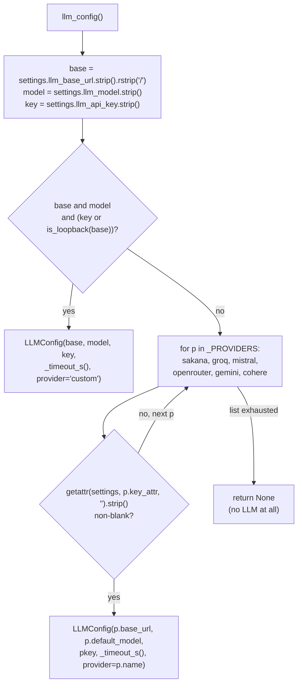
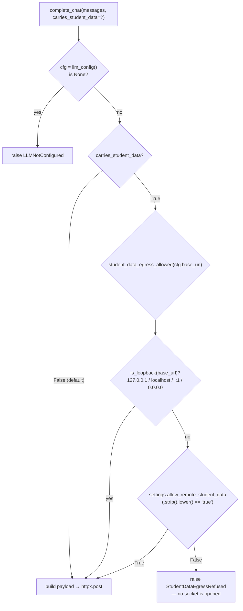
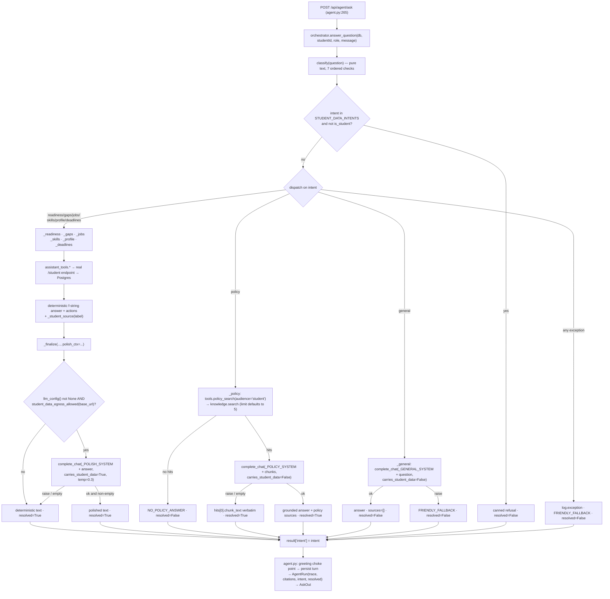

# Chapter 8 — The AI Layer: The Universal Adapter, the Egress Gate, and How an Answer Is Made

After this chapter you will be able to open any file in `apps/api-py/app/ai/` except the
embedder and say exactly what happens when REEP talks to a language model: which provider
was picked and why, what HTTP request went out on the wire, whether a student's private
record was allowed to be part of that request, and — if it was refused — what the student
got instead. You will be able to trace a typed question from `POST /api/agent/ask` through
intent routing, a read-only database tool, an optional model call, and back out as a
cited answer; you will know every branch that produces an honest non-answer instead; and
you will be able to review a colleague's new model call against a checklist that tells
you, in one pass, whether it breaks Rule 1.

**In scope.** `app/ai/llm.py` (the adapter and the egress gate), `app/ai/orchestrator.py`
(the answer pipeline), `app/assistant/tools.py` (the tool surface), `app/ai/adk.py` and
`app/ai/agents.py` (the ADK bridge), `app/eval/golden.py` and the tests that pin all of
it. This chapter owns **Rule 1** — student data must not leave the machine unbidden — at
the level of mechanism.

**Deferred.** The HTTP contracts of `/api/agent/*` and `/student/resume/generate` are
Chapters 7 and 6; this chapter documents what happens *inside* those handlers.
Conversation persistence, memory, retention, redaction and feedback are Chapter 9 —
`conversations.py` is named here only where the orchestrator's output passes through it.
Knowledge-Base retrieval and the embedder — `app/assistant/knowledge_base.py` and `app/ai/embeddings.py`
— are Chapter 10; `knowledge.search()` is treated here as a seam with a documented return
shape, not as an algorithm, and `embeddings.py` is not covered at all (it embeds APPROVED
public policy text, which the gate in this chapter deliberately does not apply to —
[app/ai/embeddings.py:3-6](apps/api-py/app/ai/embeddings.py#L3)). **The voice worker
(`apps/api-py/voice_agent.py`) is a separate process that reaches Groq through the LiveKit
plugins ([voice_agent.py:681-686](apps/api-py/voice_agent.py#L681)), never through
`llm.py`; it is therefore outside this chapter's census and outside the gate described
here.** Chapter 11 owns it. Rule 1 stated at the architecture level, and the trust boundary
it draws, is Chapter 1, §6. Auth is Chapter 5; where this chapter says "the verified
session", that is what it means.

---

## 8.1 The universal adapter: `app/ai/llm.py`

`app/ai/llm.py` is 216 lines and contains no provider SDK. There is no `openai` client, no
`google.generativeai`, no `anthropic` — the entire adapter is one `httpx.post` and one
`httpx.stream` aimed at a URL the operator configures. That is the whole design, and the
module docstring states the claim it is making:

```python
"""Universal LLM adapter — one interface, any provider.

Speaks the OpenAI-compatible /chat/completions protocol, so a single set of env
vars drives ANY provider — add a free key and point the base URL, no code change:
```
— [apps/api-py/app/ai/llm.py:1-4](apps/api-py/app/ai/llm.py#L1)

The reason an OpenAI-compatible shape was chosen is not that OpenAI is used — it is not,
anywhere in this repo — but that **every** provider REEP cares about will accept
`POST {base}/chat/completions` with a JSON body of `{model, messages, temperature}` and
return `{"choices":[{"message":{"content": …}}]}`. Google and Cohere both publish
compatibility shims for exactly this purpose, which is why the provider table below points
at `https://generativelanguage.googleapis.com/v1beta/openai` rather than Google's native
REST API, and at `https://api.cohere.ai/compatibility/v1` rather than Cohere's own
endpoint ([llm.py:68-69](apps/api-py/app/ai/llm.py#L68)). Speaking one dialect means the
adapter has one code path and one error path — and it puts the egress gate at the single
point every request must pass, the top of each entry point. (§8.2.4 shows there are two
entry points, and that the gate block is duplicated verbatim between them rather than
factored into a helper.)

The docstring's closing two sentences carry the rationale for that gate, and they are worth
reading before anything else in this chapter:

```
Carries the same student-data egress gate as the Next.js app: a remote model
must be explicitly allowed before it may receive student PII, because free tiers
train on submissions. The CrewAI agent layer (Phase 4) sits on top of this,
sharing the same env vars via LiteLLM.
```
— [llm.py:14-17](apps/api-py/app/ai/llm.py#L14)

> **A stale line, flagged.** That last sentence is wrong twice over. There is no CrewAI in
> this repository — a case-insensitive search of the tracked sources finds the word only in
> this docstring, in [apps/api-py/README.md:23](apps/api-py/README.md#L23) where it is
> explicitly denied ("There is no CrewAI and no hard dependency on Gemini"), and in
> migration notes describing the *Next.js* stack REEP was migrated away from
> ([docs/python-fastapi-migration.md:85](docs/python-fastapi-migration.md#L85): "AI
> framework: **Google ADK** (replaces CrewAI)"). The framework that replaced CrewAI was
> Google ADK, which does ship in `app/ai/adk.py`. And even with the name corrected the
> sentence would still mislead, because — as §8.7 establishes — **nothing sits on top of
> `llm.py` via LiteLLM today**. What sits on top of `llm.py` is `app/ai/orchestrator.py`,
> calling `complete_chat` over plain httpx. The docstring's worked example table has
> drifted too: it lists Cerebras, which is *not* in the auto-select list, and omits Sakana,
> Mistral and Cohere, which are.

### 8.1.1 The value objects

Two frozen dataclasses model everything the adapter needs to know.

```python
@dataclass(frozen=True)
class LLMConfig:
    base_url: str
    model: str
    api_key: str
    timeout_s: float
    provider: str = "custom"
```
— [llm.py:42-48](apps/api-py/app/ai/llm.py#L42)

`provider` is the only field with a default, and that default — the literal string
`"custom"` — is what the explicit-override branch produces. That string is not merely
internal: it is persisted. `f"{cfg.provider}:{cfg.model}"` becomes `AgentRun.model` on
every chat turn ([api/legacy/text_assistant.py:157](apps/api-py/app/api/legacy/text_assistant.py#L157)) and
`cfg.provider` alone becomes `Resume.generated_by`
([api/student/self_service.py:973](apps/api-py/app/api/student/self_service.py#L973)).

```python
@dataclass(frozen=True)
class Provider:
    name: str
    base_url: str
    default_model: str
    key_attr: str
```
— [llm.py:51-56](apps/api-py/app/ai/llm.py#L51)

`key_attr` is the load-bearing indirection of the whole design: it is a **string holding
the name of a `Settings` field**, resolved later with `getattr(settings, p.key_attr, "")`
([llm.py:92](apps/api-py/app/ai/llm.py#L92)). A `Provider` therefore does not hold a
secret; it holds the *name of the place* a secret would be, which is what lets the table be
a module-level literal that is safe to read, print and grep.

Two separate properties follow from how these objects are built, and it is worth keeping
them apart because they are routinely conflated.

`frozen=True` means an `LLMConfig`, once constructed, cannot be altered. Nothing between
`llm_config()` and `httpx.post` can rewrite `base_url` — so the `base_url` the egress gate
inspected is provably the `base_url` the request goes to. For a module whose entire safety
argument is "we checked where this is going", immutability is the cheap way to make the
check and the destination the same value.

Separately — and this is what the test suite leans on — `llm_config()` builds a **fresh**
`LLMConfig` on every call. There is no cache and no module-level singleton
([llm.py:77-98](apps/api-py/app/ai/llm.py#L77)). So a monkeypatched settings field takes
effect on the very next call, which is how every test in the suite stubs the adapter. That
would be equally true of a mutable dataclass; freezing buys the first property, not the
second.

### 8.1.2 The provider table, in auto-select order

`_PROVIDERS` is a plain Python list, and **list order is precedence order**
([llm.py:61-70](apps/api-py/app/ai/llm.py#L61)):

| # | `name` | `base_url` | `default_model` | `key_attr` → env var |
|---|--------|-----------|-----------------|----------------------|
| 1 | `sakana` | `https://api.sakana.ai/v1` | `fugu-ultra` | `sakana_api_key` → `SAKANA_API_KEY` |
| 2 | `groq` | `https://api.groq.com/openai/v1` | `llama-3.3-70b-versatile` | `groq_api_key` → `GROQ_API_KEY` |
| 3 | `mistral` | `https://api.mistral.ai/v1` | `mistral-small-latest` | `mistral_api_key` → `MISTRAL_API_KEY` |
| 4 | `openrouter` | `https://openrouter.ai/api/v1` | `meta-llama/llama-3.3-70b-instruct:free` | `openrouter_api_key` → `OPENROUTER_API_KEY` |
| 5 | `gemini` | `https://generativelanguage.googleapis.com/v1beta/openai` | `gemini-2.5-flash` | `gemini_api_key` → `GEMINI_API_KEY` |
| 6 | `cohere` | `https://api.cohere.ai/compatibility/v1` | `command-r` | `cohere_api_key` → `COHERE_API_KEY` |

Sakana's first position is justified in an inline comment:

```python
    # Sakana Fugu is itself a multi-model router; first, so a SAKANA_API_KEY (when
    # present) takes precedence. Falls through to the others when it is unset.
```
— [llm.py:62-63](apps/api-py/app/ai/llm.py#L62)

A router-of-routers wins over any single downstream provider. This same order is what
`AGENTS.md` documents and what
[.env.example:31-32](apps/api-py/.env.example#L31) tells operators ("order: Sakana, Groq,
Mistral, OpenRouter, Gemini, Cohere").

### 8.1.3 `llm_config()` — resolution, branch by branch

```python
def llm_config() -> LLMConfig | None:
    """Resolve the active LLM.

    1. Explicit override — LLM_BASE_URL + LLM_MODEL set (key optional for a local
       model). Wins when present.
    2. Auto-select — the first provider in _PROVIDERS whose key is set, so pasting
       any GROQ_API_KEY / MISTRAL_API_KEY / … is enough, no code change.
    """
    base = settings.llm_base_url.strip().rstrip("/")
    model = settings.llm_model.strip()
    key = settings.llm_api_key.strip()
    if base and model and (key or is_loopback(base)):
        return LLMConfig(base, model, key, _timeout_s(), provider="custom")

    for p in _PROVIDERS:
        pkey = getattr(settings, p.key_attr, "").strip()
        if pkey:
            # Auto mode uses the provider's own default model. A stray LLM_MODEL
            # meant for another provider must not leak in (it would 404). Pin a
            # specific model via the explicit LLM_BASE_URL+LLM_MODEL+LLM_API_KEY trio.
            return LLMConfig(p.base_url, p.default_model, pkey, _timeout_s(), provider=p.name)
    return None
```
— [llm.py:77-98](apps/api-py/app/ai/llm.py#L77)

Walk it. The three normalisations at the top do more work than they look. `.rstrip("/")` on
the base URL is why the request builder can safely write
`f"{cfg.base_url}/chat/completions"` ([llm.py:148](apps/api-py/app/ai/llm.py#L148)) without
ever producing a doubled slash that some providers 404 on.

**Tier 1** fires only when base *and* model *and* `(key or is_loopback(base))`. The
disjunction exists so a local model needs no API key: Ollama and LM Studio serve
`/chat/completions` unauthenticated, and demanding an `LLM_API_KEY` for
`http://127.0.0.1:11434/v1` would make the local path — the *only* path on which student
data may flow freely, because a request addressed to a loopback address is turned around
inside the machine's own network stack and never reaches a network interface, so there is
no wire for it to leave on and no third party to receive it (§8.2.1 defines exactly which
hosts count) — unusable.

**Tier 2** iterates `_PROVIDERS` and returns on the first non-blank key. Note what it
returns: `p.default_model`, never `settings.llm_model`. The comment states the hazard it is
defending against, in the subjunctive rather than as a postmortem: a stray `LLM_MODEL` left
over from another provider "must not leak in (it would 404)". Whether that 404 was ever
actually hit, the code does not say — and no commit message or test records one. What is
certain is the mechanism: in auto mode the model name is taken from the provider row, so
the model and the key can never come from different providers.

**Nothing configured** returns `None`. That sentinel is not an exception, and every caller
handles it explicitly: a 503 at
[agent.py:150-154](apps/api-py/app/api/legacy/text_assistant.py#L150), the literal string
`"deterministic"` at [agent.py:286](apps/api-py/app/api/legacy/text_assistant.py#L286), a skipped
polish at [orchestrator.py:565](apps/api-py/app/ai/orchestrator.py#L565), a deterministic
resume at [student.py:959](apps/api-py/app/api/student/self_service.py#L959).

> **The hole in tier 1, stated plainly.** Suppose an operator sets
> `LLM_BASE_URL="https://api.groq.com/openai/v1"` and
> `LLM_MODEL="llama-3.3-70b-versatile"` but leaves `LLM_API_KEY` blank. `base` and `model`
> are truthy, `key` is falsy, `is_loopback(base)` is False — so the whole tier-1 condition
> is False and **tier 1 is silently skipped**. Control falls into the `_PROVIDERS` loop and
> the adapter answers on whatever per-provider key happens to be present: a different
> provider, a different model, no warning, no log line, no exception. If no per-provider
> key is set either, the caller reports "No LLM provider configured" while `LLM_BASE_URL`
> and `LLM_MODEL` are plainly set in `.env`. There is no comment addressing this and no
> test covering `llm_config()` precedence at all. Falling through is arguably the safe
> direction — a keyless remote call would 401 anyway — but the *silence* is the defect.

`_timeout_s()` completes the picture:

```python
def _timeout_s() -> float:
    return max(1.0, settings.llm_timeout_ms / 1000)
```
— [llm.py:73-74](apps/api-py/app/ai/llm.py#L73)

`llm_timeout_ms` defaults to `300000` ([config.py:31](apps/api-py/app/config.py#L31)), so
the default timeout is **300 seconds**. The `max(1.0, …)` floor means a mis-set
`LLM_TIMEOUT_MS="0"` cannot produce a zero timeout that aborts every call. The value is
passed to httpx as a bare scalar, which httpx applies to all four phases — connect, read,
write, pool — so five minutes is the connect timeout too. Nothing shortens it.



---

## 8.2 Rule 1 in full: `student_data_egress_allowed()`

The thing being protected is a student's private record — their **PII** (personally
identifiable information): name, **USN** (University Seat Number, the identifier that ties
every row in this database to one person), marks, attendance, backlogs, the reasons they do
or do not qualify for a job. The rule is that none of it may be part of an HTTP request to
a model running on someone else's machine unless the operator has said so in as many words.

Three lines of logic make that decision:

```python
def student_data_egress_allowed(base_url: str) -> bool:
    """Loopback is always fine; any off-machine model needs the explicit flag —
    identical policy to studentDataEgressAllowed() in the Next.js app."""
    if is_loopback(base_url):
        return True
    return settings.allow_remote_student_data
```
— [llm.py:105-110](apps/api-py/app/ai/llm.py#L105)

These three lines are the whole of Rule 1's *decision* — may this base URL receive a
student's record? They are **not** the whole of its enforcement: that is §8.2.4, and the
discipline that actually keeps it true is §8.3.

The function takes a **base URL string**, not an `LLMConfig`, which is what lets the two
real student-data call sites pre-check the gate themselves before they build a prompt
(§8.3).

### 8.2.1 What counts as loopback

```python
_LOOPBACK_HOSTS = {"127.0.0.1", "localhost", "::1", "0.0.0.0"}
```
— [llm.py:31](apps/api-py/app/ai/llm.py#L31)

```python
def is_loopback(base_url: str) -> bool:
    return (urlparse(base_url).hostname or "").lower() in _LOOPBACK_HOSTS
```
— [llm.py:101-102](apps/api-py/app/ai/llm.py#L101)

Three details in that one line matter.

It uses `.hostname`, **not** `.netloc`. That strips the port, so
`http://127.0.0.1:11434/v1` yields `127.0.0.1`; and it strips IPv6 square brackets, so
`http://[::1]:8080/v1` yields `::1` — which is precisely why the bare literal `"::1"` in
the set matches, and why
[tests/test_egress_gate.py:12](apps/api-py/tests/test_egress_gate.py#L12) asserting that
URL passes.

The `or ""` guard handles `urlparse` returning `None` for a hostname. A schemeless string
like `api.groq.com/v1` parses to no netloc and hostname `None`, which becomes `""`, which
is not in the set — so it is treated as **remote**. The failure direction is safe:
anything unparseable is gated.

Membership is **literal string comparison only**. There is no CIDR arithmetic anywhere.
`127.0.0.2`, `127.1`, `::ffff:127.0.0.1`, the machine's own LAN address and
`localhost.localdomain` are all *not* loopback and are gated as remote. That is stricter
than the physical argument strictly requires — a request to your own LAN address does leave
on a wire, but only onto your own network — and the code makes no attempt to reason about
network topology, because it cannot know what the operator's LAN is. Conversely `0.0.0.0` —
the wildcard *bind* address, not strictly a loopback address — is in the set, because as a
client *target* most stacks route it to the local machine. It is the one entry that is
pragmatic rather than literal. Hostname spoofing is not a threat here because the operator
writes the URL: `https://localhost.evil.com/v1` yields hostname `localhost.evil.com`, which
is not in the set, and is correctly gated.

### 8.2.2 What unlocks remote, and the exact comparison

```python
    @property
    def allow_remote_student_data(self) -> bool:
        return self.llm_allow_remote_student_data.strip().lower() == "true"
```
— [apps/api-py/app/config.py:111-113](apps/api-py/app/config.py#L111)

The comparison is `.strip().lower() == "true"`. It is therefore **case-insensitive after
whitespace stripping**: `true`, `TRUE`, `True`, `TrUe` and `"  true  "` all open the gate.
`1`, `yes`, `on`, `y` and the empty string do not.

> **The code is more permissive than every description of it.** Three places in this
> repository claim the unlock requires the *exact* string `true`:
> [config.py:32-33](apps/api-py/app/config.py#L32) ("matching the Next.js gate where only
> the exact string \"true\" enables it"),
> [.env.example:44](apps/api-py/.env.example#L44) ("unless this is exactly \"true\""), and
> the test comment at
> [tests/test_egress_gate.py:32](apps/api-py/tests/test_egress_gate.py#L32) ("Only the
> exact string \"true\" opens the gate"). All three are wrong about the code. This is not
> a hole — the gate still defaults closed and still demands an affirmative word — but an
> operator hardening against the documentation will assume a stricter mechanism than
> exists, and the test's two chosen inputs (`"yes"` and `"true"`) pass under both the
> described and the actual semantics, so the test cannot detect the discrepancy.

### 8.2.3 Why the setting is a `str` and not a `bool`

```python
    # A string (not bool) so a blank value is valid and safely means "off",
    # matching the Next.js gate where only the exact string "true" enables it.
    llm_allow_remote_student_data: str = ""
```
— [config.py:32-34](apps/api-py/app/config.py#L32)

A Pydantic `bool` field rejects only *some* bad values and quietly accepts others, and both
halves of that are bad here.

Verified by running this repository's own interpreter and pydantic (2.13.4, in
`apps/api-py/.venv`): a blank value, `garbage` and `maybe` each raise a `ValidationError`.
Because `Settings()` is constructed once at import time
([config.py:152](apps/api-py/app/config.py#L152)), that error takes the **entire API down
at startup** — the process cannot import its own settings module. A typo in one env var
would stop the login page from painting.

Worse, on the words it *does* recognise, a `bool` field fails in the dangerous direction.
Pydantic v2's lax bool coercion turns `yes`, `y`, `on`, `1`, `TRUE` and `true` all into
`True` (and `no`/`off` into `False`). So a `bool` field would have **silently opened the
gate** on `LLM_ALLOW_REMOTE_STUDENT_DATA=yes` — exactly the value the shipped string
comparison rejects, as §8.2.2 records. An operator who wrote `yes` meaning "yes, this is
the setting I am aware of" would have shipped student records to a free tier.

A string cannot fail to parse and cannot be generously interpreted. The gate can therefore
only ever fail *closed*.

And because `allow_remote_student_data` is a `@property` rather than a Pydantic field, it
re-derives from the raw string on every call with no caching — which is what makes
`monkeypatch.setattr(settings, "llm_allow_remote_student_data", "true")` work in the tests
(§8.9.1). It also means the raw string is read from the environment exactly once, at
process start: changing the env var without restarting the API has no effect.

### 8.2.4 Enforcement — what `carries_student_data=True` actually changes

It does exactly one thing, in exactly two places
([llm.py:130-135](apps/api-py/app/ai/llm.py#L130) and
[llm.py:173-178](apps/api-py/app/ai/llm.py#L173)):

```python
    if carries_student_data and not student_data_egress_allowed(cfg.base_url):
        raise StudentDataEgressRefused(
            f"The model at {cfg.base_url} runs off this machine; student data will "
            "not be sent unless LLM_ALLOW_REMOTE_STUDENT_DATA=true. Use a local "
            "model or a paid key."
        )
```

The raise happens **before `httpx` is touched**, which is what `complete_chat`'s docstring
promises to future callers (quoted in full in §8.4.1): the socket is never opened.

What the flag does *not* do is equally important. It does not inspect `messages`. It does
not scan for PII patterns, does not redact, does not alter the payload or the headers, and
does not appear anywhere in the request that reaches the provider. It is a
**caller-declared assertion**, not a detector. Note the short-circuit order too: when the
flag is False the gate function is never called at all, so an unflagged prompt never
touches Rule 1's logic.

The correctness of Rule 1 therefore rests entirely on developers passing the flag on the
right paths. Nothing in `llm.py` can notice a prompt containing a USN that was sent with
the flag at its default. That is why `AGENTS.md` phrases the rule as an instruction to the
developer — "Route any *new* student-PII-to-model path through this gate" — rather than as
a guarantee of the adapter, and it is why §8.10 exists.

### 8.2.5 Where the refusal is caught — nowhere by name

```python
class LLMNotConfigured(RuntimeError):
    pass


class StudentDataEgressRefused(RuntimeError):
    pass
```
— [llm.py:34-39](apps/api-py/app/ai/llm.py#L34)

Both are bare marker classes. A repo-wide search shows **nothing anywhere writes
`except StudentDataEgressRefused` or `except LLMNotConfigured`**. Every caller catches
bare `Exception` instead ([agent.py:171](apps/api-py/app/api/legacy/text_assistant.py#L171),
[agent.py:234](apps/api-py/app/api/legacy/text_assistant.py#L234),
[orchestrator.py:475](apps/api-py/app/ai/orchestrator.py#L475),
[orchestrator.py:523](apps/api-py/app/ai/orchestrator.py#L523),
[orchestrator.py:578](apps/api-py/app/ai/orchestrator.py#L578),
[student.py:974](apps/api-py/app/api/student/self_service.py#L974)).

The practical consequence is that the refusal inside `complete_chat` is a **backstop, not
the live mechanism**. Both real `carries_student_data=True` call sites pre-check the gate
themselves and simply never call the model when it is closed, so
`StudentDataEgressRefused` is unreachable on the shipped paths. It exists to catch a
*future* caller who passes the flag without pre-checking — genuine defence in depth, but
with no test and no named handler. If it ever did fire on the resume path it would be
swallowed by `except Exception as exc` and surface to the student as the innocuously
worded `note = f"AI polish failed ({exc}); kept the deterministic draft."`
([student.py:975](apps/api-py/app/api/student/self_service.py#L975)) rather than as a policy
refusal.



---

## 8.3 Every call site that carries student data

There are exactly **two** places in the entire codebase that pass
`carries_student_data=True`, and they are the two places that put a student's private
record into a prompt. Here is the complete census of calls **through the universal
adapter** — every `complete_chat` and `stream_chat` in `apps/api-py/app` — plus, for
honesty, the one model call in `apps/api-py` that does not go through it at all:

| Where | Function | Flag | What is in the prompt |
|-------|----------|------|-----------------------|
| [api/legacy/text_assistant.py:170](apps/api-py/app/api/legacy/text_assistant.py#L170) | `chat` (`POST /api/agent/chat`) | default `False` | `SYSTEM_PROMPT` + up to 40 replayed turns of the caller's own conversation |
| [api/legacy/text_assistant.py:231](apps/api-py/app/api/legacy/text_assistant.py#L231) | `chat_stream` (`POST /api/agent/chat/stream`) | default `False` | identical to the above |
| [ai/orchestrator.py:474](apps/api-py/app/ai/orchestrator.py#L474) | `_policy` | explicit `False` | `_POLICY_SYSTEM` + the question + APPROVED KB chunks |
| [ai/orchestrator.py:522](apps/api-py/app/ai/orchestrator.py#L522) | `_general` | explicit `False` | `_GENERAL_SYSTEM` + the raw question |
| [ai/orchestrator.py:572](apps/api-py/app/ai/orchestrator.py#L572) | `_finalize` (polish) | **`True`** | `_POLISH_SYSTEM` + the deterministically composed student-data answer |
| [api/student/self_service.py:970](apps/api-py/app/api/student/self_service.py#L970) | `generate_resume` | **`True`** | a resume-writer system prompt + the whole composed resume markdown |
| [voice_agent.py:686](apps/api-py/voice_agent.py#L686) | `entrypoint` → `AgentSession(...)` | **n/a — does not use the adapter** | the student's own spoken turns, sent to Groq by the LiveKit plugin with no egress gate, no `llm_config()`, no `_PROVIDERS` lookup |

That last row is not a defect being alleged; it is a scope boundary being drawn. The voice
worker is a **separate process in a separate virtualenv** (`AGENTS.md`, "Voice worker
(optional)") that constructs its own client —
`llm=groq.LLM(model=GROQ_LLM_MODEL, temperature=0.6, max_completion_tokens=220)` at
[voice_agent.py:686](apps/api-py/voice_agent.py#L686), alongside
`stt=groq.STT(model=GROQ_STT_MODEL)` at
[voice_agent.py:681](apps/api-py/voice_agent.py#L681) — and never imports `app/ai/llm.py`.
Nothing in this chapter applies to it. Chapter 11 does. The point of listing it here is
that a reader who trusts the first six rows as "every model call the backend makes" would
be wrong, and being wrong about that is exactly the mistake this chapter exists to prevent.

### 8.3.1 The resume path — the canonical Rule 1 endpoint

`POST /api/student/resume/generate` is the path `AGENTS.md` names, and its handler
docstring restates the rule:

```python
    """Compose a resume from the student's REEP data. The prompt carries student
    PII, so a model is used ONLY when it is local or explicitly allowed; otherwise
    it composes deterministically and says so (the AGENTS.md egress rule)."""
```
— [api/student/self_service.py:929-931](apps/api-py/app/api/student/self_service.py#L929)

The order of operations is the whole lesson. The **deterministic composer runs first,
unconditionally**:

```python
    markdown = _compose_resume_markdown(name, profile, skill_names, cgpa, quals)
    generated_by, model, used_ai, note = "fallback", None, False, None

    cfg = llm_config()
    if cfg is not None and student_data_egress_allowed(cfg.base_url):
```
— [student.py:955-959](apps/api-py/app/api/student/self_service.py#L955)

Two things to notice. First, `_compose_resume_markdown`
([student.py:901-915](apps/api-py/app/api/student/self_service.py#L901)) has already built a full
document — the student's name, career summary, a contact line of
`profile.email · profile.phone · profile.linkedin_url · profile.city`, the skills list,
the latest CGPA, and every `AcademicQualification` row rendered as
`f"- {q.level.value.title()}: {q.institution} ({q.year}) — {pct}%"`. That is unambiguously
the student's private record, and it is what gets sent when the gate opens. Second, the
four result variables are **initialised to the refused outcome**. Any path that fails to
overwrite them reports honestly: `generated_by="fallback"`, `used_ai=False`. The database
column agrees — `generated_by` is declared
`default="fallback", server_default="fallback"`
([models/resume.py:50](apps/api-py/app/models/resume.py#L50)).

Inside the gate the markdown is first wrapped in a one-line instruction:

```python
        prompt = (
            "Rewrite this into a crisp one-page markdown resume for an MBA student. "
            "Keep every fact; invent nothing.\n\n" + markdown
        )
```
— [student.py:960-963](apps/api-py/app/api/student/self_service.py#L960)

That prefix is what makes the request a *rewrite* rather than a dump, and "Keep every
fact; invent nothing" is the same preservation instruction the orchestrator's polish
prompt uses (§8.5.7). The whole PII-bearing string then becomes the user message, and the
call is made with the flag on:

```python
            markdown = complete_chat(
                [
                    {"role": "system", "content": "You are a concise resume writer."},
                    {"role": "user", "content": prompt},
                ],
                carries_student_data=True,
                max_tokens=1500,
            )
            generated_by, model, used_ai = cfg.provider, cfg.model, True
```
— [student.py:965-973](apps/api-py/app/api/student/self_service.py#L965)

And when the gate is closed, the `else` branch writes the operator-facing explanation that
reaches the student verbatim:

```python
        note = (
            "AI generation skipped: the resume carries student data and the configured "
            "model runs off this machine. Composed deterministically. Set "
            "LLM_ALLOW_REMOTE_STUDENT_DATA=true or use a local model to enable AI."
        )
```
— [student.py:977-981](apps/api-py/app/api/student/self_service.py#L977)

`used_ai` reaches the client because the response body carries it explicitly alongside
`generated_by`, `model`, `note` and `markdown` — the dict runs
[student.py:1000-1008](apps/api-py/app/api/student/self_service.py#L1000), with `"used_ai": used_ai`
on line 1005. The client can therefore display "composed without AI" honestly rather than
pretending.

> **One inconsistency worth flagging.** The exception handler at
> [student.py:974-975](apps/api-py/app/api/student/self_service.py#L974) interpolates the caught
> exception's text into `note` and returns it to the *student*. On the agent router the
> standing rule is the opposite, stated in one line of its module docstring:
> "Provider/exception detail is logged server-side and NEVER surfaced to the client"
> ([agent.py:17](apps/api-py/app/api/legacy/text_assistant.py#L17)), backed by the constant
> `FRIENDLY_ERROR` and the comment "The real cause is logged server-side — never leaked to
> the caller" ([agent.py:57-58](apps/api-py/app/api/legacy/text_assistant.py#L57)). A provider error
> string can contain endpoint, account or quota detail. The two routers disagree about leak
> discipline, and the resume router is the permissive one.

### 8.3.2 The polish path — the only `True` in the `ai` package

`_finalize` is covered in full in §8.5.7. What matters here is that it is the *only* route
from a student-record tool result to a model, that it pre-checks the gate before building
the prompt, and that its inline comment states the belt-and-braces design in five words:

```python
                    carries_student_data=True,  # local/allowed only — gate re-checks
```
— [orchestrator.py:572](apps/api-py/app/ai/orchestrator.py#L572)

### 8.3.3 The paths that deliberately do *not* set the flag

Four model calls pass `False`. **Three carry a stated justification in the code, and one
does not.** `/chat` and `/chat/stream` are covered by the agent router's module docstring:

```
The LLM goes through the universal adapter (app/ai/llm.py). The egress gate still
applies: this is a general conversational assistant, so `carries_student_data`
stays False; wire it True on any path that injects a student's private records.
```
— [agent.py:14-16](apps/api-py/app/api/legacy/text_assistant.py#L14)

The operative word is **injects**. `/chat` and `/chat/stream` replay
`convo.history(db, conversation.id, limit=HISTORY_LIMIT)` — the caller's own previously
typed messages and the assistant's own previous replies
([agent.py:166-167](apps/api-py/app/api/legacy/text_assistant.py#L166)). No database record of the
student is placed in the prompt by the server; `SYSTEM_PROMPT` even instructs the model to
disclaim record access ("if asked for specific marks/attendance, say those come from the
authenticated records view", [agent.py:49-51](apps/api-py/app/api/legacy/text_assistant.py#L49)). The
distinction the codebase draws is between *the server injecting a record* and *the user
authoring a sentence*, and it is a real distinction: the gate protects data REEP holds on
the student's behalf, not text the student chose to type.

`_policy` is the third. It passes the flag explicitly rather than relying on the default,
which makes the audit greppable, and annotates why:

```python
    # PUBLIC content only — carries_student_data=False, so a remote model is fine.
```
— [orchestrator.py:472](apps/api-py/app/ai/orchestrator.py#L472)

Its prompt is the question plus APPROVED Knowledge-Base chunks — public policy text, no
student record.

**`_general` is the fourth, and it has neither a docstring nor a comment covering the
flag.** It is defensible on inspection rather than on the record: it reads no database at
all (the `db` parameter is accepted and never used — §8.5.6), and its prompt is
`_GENERAL_SYSTEM` plus the exact question the caller typed. Nothing the server knows about
the student is in it. But a reviewer has to establish that by reading the function, which
is precisely the work the other three call sites save you.

**The residual, stated honestly.** All four unflagged paths embed the student's raw typed
question. A student who types "my CGPA is 6.1, am I short of the cut-off?" has that
sentence forwarded to whatever provider is configured, which in the default configuration
is a free tier. No comment or test in the repo addresses the user-authored case. It is not
a breach of Rule 1 as written, but a reader should not mistake "the gate is off here" for
"nothing personal can be in this prompt".

---

## 8.4 `complete_chat` and `stream_chat`, exactly

### 8.4.1 `complete_chat`

```python
def complete_chat(
    messages: list[dict],
    *,
    carries_student_data: bool = False,
    temperature: float = 0.2,
    json_mode: bool = False,
    max_tokens: int | None = None,
) -> str:
```
— [llm.py:113-120](apps/api-py/app/ai/llm.py#L113)

`messages` is the only positional parameter; the bare `*` forces everything else to be
keyword-only. That is deliberate — no call site can slip `True` into
`carries_student_data` positionally, and every real call reads as a declaration about the
prompt. `temperature=0.2` is low because the assistant should paraphrase tool output, not
invent. `carries_student_data=False` means **the gate is opt-in**, and silence means "this
prompt has no student PII".

The docstring is the contract every future caller is being handed:

```python
    """One blocking chat completion against the configured provider.

    Set carries_student_data=True for any prompt containing a student's record;
    it is refused before leaving the process unless the model is local or the
    remote egress flag is set.
    """
```
— [llm.py:121-126](apps/api-py/app/ai/llm.py#L121)

"refused before leaving the process" is literal: as §8.2.4 showed, the `raise` precedes
every line that touches `httpx`, so the socket is never opened. (`stream_chat`'s docstring
makes the same promise in different words — "refused before the request leaves the process
when it carries student PII to an off-machine model",
[llm.py:167-168](apps/api-py/app/ai/llm.py#L167).)

After the config check and the gate, the body is assembled with conditional inserts:

```python
    payload: dict = {"model": cfg.model, "messages": messages, "temperature": temperature}
    if json_mode:
        payload["response_format"] = {"type": "json_object"}
    if max_tokens is not None:
        payload["max_tokens"] = max_tokens

    headers = {"content-type": "application/json"}
    if cfg.api_key:
        headers["authorization"] = f"Bearer {cfg.api_key}"

    resp = httpx.post(
        f"{cfg.base_url}/chat/completions",
        json=payload,
        headers=headers,
        timeout=cfg.timeout_s,
    )
    resp.raise_for_status()
    return resp.json()["choices"][0]["message"]["content"]
```
— [llm.py:137-154](apps/api-py/app/ai/llm.py#L137)

`response_format` and `max_tokens` are *conditional* keys, not always-present ones — a
provider that rejects an unknown `response_format` never sees it. The `authorization`
header is added only when the key is non-empty, which is what lets a keyless local Ollama
config work; some local servers reject a `Bearer ` with an empty token.

Transport facts a reader must internalise: `httpx.post` is a **module-level** call, so
there is a brand-new client and a brand-new TCP+TLS connection per request. There is **no
connection pooling, no retry, no backoff, no rate-limit handling and no circuit breaker**.
A 429 becomes an `httpx.HTTPStatusError`; a dead provider costs each request the full
`timeout_s`.

Response parsing is undefended: an empty `choices` array raises `IndexError`, a missing
`message`/`content` raises `KeyError`, a non-JSON body raises `json.JSONDecodeError`. All
propagate, which is why every call site wraps the call in `except Exception`.

The function also returns whatever the provider sent, including a possible `None` content —
and it is worth being precise about how the orchestrator survives that, because the two
guards catch different things. A `None` content makes the caller's `.strip()` raise
`AttributeError`, which is caught by the builder's `except Exception`
([orchestrator.py:475](apps/api-py/app/ai/orchestrator.py#L475)). An empty or
whitespace-only string survives `.strip()` untouched and is caught instead by the
`if not answer` re-check ([orchestrator.py:480-481](apps/api-py/app/ai/orchestrator.py#L480)).
Both land on the same fallback, `hits[0]["chunk_text"]`. `.strip()` is not a `None` guard;
the `except` is.

`json_mode=True` is **never passed anywhere in the repository** — a grep for `json_mode`
across `app/` returns only its declaration at
[llm.py:118](apps/api-py/app/ai/llm.py#L118) and its use at
[llm.py:138](apps/api-py/app/ai/llm.py#L138). It is an unexercised, untested parameter.

### 8.4.2 `stream_chat`

```python
def stream_chat(
    messages: list[dict],
    *,
    carries_student_data: bool = False,
    temperature: float = 0.2,
    max_tokens: int | None = None,
) -> Iterator[str]:
```
— [llm.py:157-163](apps/api-py/app/ai/llm.py#L157)

Note the absence of `json_mode`: streaming and JSON mode are not combined. Note also that
this is a **generator function** — calling it does no work at all. `llm_config()`, the
egress gate and the HTTP request all run lazily on the first `next()`. That has a real
consequence at the call site: `agent.py:231` puts the call inside
`for delta in stream_chat(...)` within a `try`, so the deferred exceptions are caught. A
caller that merely *constructed* the iterator outside a try would see the refusal fire
somewhere else entirely.

The config resolution and the gate block are **character-for-character duplicates** of
`complete_chat`'s ([llm.py:170-178](apps/api-py/app/ai/llm.py#L170)) — duplicated rather
than factored into a helper, which is the obvious drift risk in this module. The request
that goes out differs in two ways, and both are visible here:

```python
    payload: dict = {
        "model": cfg.model,
        "messages": messages,
        "temperature": temperature,
        "stream": True,
    }
    if max_tokens is not None:
        payload["max_tokens"] = max_tokens

    headers = {"content-type": "application/json"}
    if cfg.api_key:
        headers["authorization"] = f"Bearer {cfg.api_key}"

    with httpx.stream(
        "POST",
        f"{cfg.base_url}/chat/completions",
        json=payload,
        headers=headers,
        timeout=cfg.timeout_s,
    ) as resp:
```
— [llm.py:180-199](apps/api-py/app/ai/llm.py#L180)

`"stream": True` is a fixed key in the dict literal, not a conditional insert. There is no
`response_format` insert at all, matching the missing `json_mode` parameter. The headers
are byte-identical to `complete_chat`'s.

The transport is `httpx.stream(...)` used as a **context manager**, and that detail escapes
the function. Because the `with` block encloses the `yield`s, the connection stays open for
as long as the consumer keeps calling `next()` — and when the consumer stops, the generator
is eventually finalised, `GeneratorExit` unwinds through the `with`, and the socket is
closed. An abandoned generator therefore closes its own connection, but only when Python
gets round to collecting it, not at the moment the consumer walks away.

The error path is hand-rolled, and the comment on it is a captured gotcha:

```python
        if resp.status_code >= 400:
            resp.read()  # a stream body must be consumed before .text is available
            raise httpx.HTTPStatusError(
                f"{resp.status_code}: {resp.text}", request=resp.request, response=resp
            )
```
— [llm.py:200-204](apps/api-py/app/ai/llm.py#L200)

> **Why it is like this.** `raise_for_status()` cannot be used naively on a streamed
> response. Without the explicit `resp.read()`, touching `resp.text` on an unread
> streaming response raises `ResponseNotRead` — and the operator would see *that*
> instead of the provider's actual 401 or 429 explanation. The constructed message
> deliberately embeds the provider's raw body, which is exactly the detail an operator
> needs and exactly the detail a client must never see;
> [agent.py:234-237](apps/api-py/app/api/legacy/text_assistant.py#L234) resolves the tension by logging
> server-side and yielding only the constant `FRIENDLY_ERROR` in-band.

Now the body. The provider answers a `stream: true` request not with one JSON document but
with a **Server-Sent Events (SSE)** stream: a long-lived HTTP response whose body is a
sequence of newline-delimited text frames. Each frame that carries content looks like
`data: {json}`; blank lines sit between frames and double as keep-alives that stop an idle
connection being dropped; and the provider signals the end with the literal
`data: [DONE]`. `httpx`'s `resp.iter_lines()` hands those lines over one at a time as they
arrive, which is why a *line* is the unit of work here. The parser's whole job is to pull
`choices[0].delta.content` out of each frame and ignore everything else:

```python
        for line in resp.iter_lines():
            if not line or not line.startswith("data:"):
                continue
            data = line[len("data:"):].strip()
            if data == "[DONE]":
                break
            try:
                delta = json.loads(data)["choices"][0]["delta"].get("content")
            except (json.JSONDecodeError, KeyError, IndexError):
                continue
            if delta:
                yield delta
```
— [llm.py:205-216](apps/api-py/app/ai/llm.py#L205)

Blank keep-alive lines and any `event:` / `id:` / comment frame are skipped by the first
`continue`; the slice handles both `data:x` and `data: x`. Two behaviours follow that a
reader must know.

First, malformed or unexpected frames are **silently swallowed**. A provider that emits
`data: {"error": {...}}` mid-stream produces a dict with no `choices` key, which raises
`KeyError`, which hits the `except` and `continue`s — the frame is discarded and the loop
keeps reading. The adapter never notices the error and never reports it. If the provider
then closes the connection, `iter_lines()` simply ends, the generator returns, and the
router records a truncated answer as `ANSWERED`. Whether the stream ends there is the
provider's behaviour, not something this code does; what this code guarantees is that
**there is no in-stream error detection either way**.

Second, `if delta:` drops empty-string deltas. `finish_reason`, `usage` and tool-call
deltas are all discarded; only `choices[0].delta.content` survives.

Finally: both functions are **synchronous and blocking**, and every handler that calls them
is declared `def`, not `async def` — `chat` at
[agent.py:144](apps/api-py/app/api/legacy/text_assistant.py#L144), `chat_stream` at
[agent.py:189](apps/api-py/app/api/legacy/text_assistant.py#L189), `ask` at
[agent.py:266](apps/api-py/app/api/legacy/text_assistant.py#L266), `generate_resume` at
[student.py:924](apps/api-py/app/api/student/self_service.py#L924). FastAPI inspects that
declaration and dispatches accordingly: an `async def` handler runs directly on the single
event loop that serves every request, so a blocking call inside one stalls the whole
process, while a plain `def` handler is handed to a bounded worker threadpool instead. So a
five-minute hang here — the default `timeout_s` from §8.1.3 — costs one thread out of that
pool, and other requests keep being served. But the pool is finite, and enough simultaneous
hangs against a dead provider will exhaust it.

And `llm.py` imports `logging` nowhere: **the adapter never logs anything**, not which
provider was selected, not which model, not that a request was refused. Every log line
about LLM behaviour comes from a caller.

---

## 8.5 The orchestrator: `app/ai/orchestrator.py`

588 lines, the centre of gravity of this chapter. Its docstring states the governing idea
in one sentence:

```
The model is a *language + orchestration* layer, never the source of truth.
Every specific fact about a student comes from a read-only tool in
``app.assistant.tools`` (which runs the same code path as the student's own
screens); every policy statement comes from an APPROVED knowledge chunk. The
model only ever *phrases* what the tools return — and student PII is never sent
to a refused (off-machine) provider.
```
— [orchestrator.py:3-8](apps/api-py/app/ai/orchestrator.py#L3)

It imports three names from the adapter and one module of tools
([orchestrator.py:44-49](apps/api-py/app/ai/orchestrator.py#L44)) — `complete_chat`,
`llm_config`, `student_data_egress_allowed`, and `from .. import assistant_tools as tools`.
`stream_chat` is deliberately absent: **the orchestrator is entirely non-streaming**.
Because the imports bind function objects onto the orchestrator module, tests monkeypatch
`orchestrator.llm_config` and `orchestrator.complete_chat`, and that is what actually
intercepts the calls.

### 8.5.1 The vocabulary

Eight intents are UPPER_SNAKE constants whose *values* are lowercase wire strings
([orchestrator.py:55-62](apps/api-py/app/ai/orchestrator.py#L55)): `READINESS`, `GAPS`,
`JOBS`, `SKILLS`, `PROFILE`, `DEADLINES`, `POLICY`, `GENERAL`. Six of them form the
privileged set:

```python
STUDENT_DATA_INTENTS = frozenset({READINESS, GAPS, JOBS, SKILLS, PROFILE, DEADLINES})
```
— [orchestrator.py:66](apps/api-py/app/ai/orchestrator.py#L66)

`POLICY` and `GENERAL` are deliberately outside it. Two canned strings are public
constants so tests can assert equality against them:
`FRIENDLY_FALLBACK` ("I'm having trouble reaching the assistant right now…") and
`NO_POLICY_ANSWER` ("I couldn't find an approved answer for that — please check with your
mentor or the placement office.")
([orchestrator.py:88-94](apps/api-py/app/ai/orchestrator.py#L88)).

### 8.5.2 `classify(question: str) -> str` — the entire router

There is **no model-based intent classification anywhere in this pipeline**. Routing is
pure substring matching over the lowercased question
([orchestrator.py:100-176](apps/api-py/app/ai/orchestrator.py#L100)), and the rationale is
in the module docstring: rule-based routing means "no PII leaves the process to classify
(the router only reads the question text)"
([orchestrator.py:12-13](apps/api-py/app/ai/orchestrator.py#L12)).

The mechanism: an empty question returns `GENERAL` immediately; then
`is_how = any(sig in q for sig in _POLICY_SIGNALS)` is computed once
([orchestrator.py:108](apps/api-py/app/ai/orchestrator.py#L108)) over an 18-phrase tuple —
`"how do i"`, `"how to"`, `"what is"`, `"what are"`, `"what documents"`, `"steps to"`,
`"explain"`, `"how long"`, `"what counts"` and the rest
([orchestrator.py:70-75](apps/api-py/app/ai/orchestrator.py#L70)). Then seven ordered
checks:

| # | Intent | Triggers (substring, unless noted) | `is_how` consulted? |
|---|--------|-----------------------------------|---------------------|
| 1 | `READINESS` | `placement ready`, `placement-ready`, `am i ready`, `readiness`, `ready for placement`, `ready to be placed`, `job ready`, `job-ready` | no |
| 2 | `SKILLS` / `POLICY` | `skill`, `verify`, `verified`, `badge` — then a *personal* test | yes |
| 3 | `GAPS` | `what should i do/complete/work/focus`, `this week`, `priorit`, `what next`, `what's next`, `whats next`, `next step`, `do next` | no |
| 4 | `JOBS` | `jobs i qualify`, `qualify for`, `eligible`, `which jobs`, `what jobs`, `jobs can i`, `jobs i can`, `can i apply`, `should i apply`, `apply` | yes (negative guard) |
| 5 | `PROFILE` | `profile`, `missing` | no |
| 6 | `DEADLINES` | `deadline`, `due`, `overdue`, `when is`, `when are`, `when do`, `by when`, `when's` | no |
| 7 | `POLICY` | `is_how` or `documents` or `policy` or `leaderboard` | yes |
| — | `GENERAL` | everything else | — |

Step 2 carries the subtlest logic, and its comment explains it:

```python
    # 2. Skills / verify / badge. A HOW question ("how do I verify …") is POLICY;
    #    a status question ("my skills", "am I verified") hits the skill tool. A
    #    personal phrasing ("my …") always means the student's own status.
```
— [orchestrator.py:120-122](apps/api-py/app/ai/orchestrator.py#L120)

`personal` is `_has_word(q, "my") or "i have" in q or "i hold" in q or "i've" in q or
"am i verified" in q`. The helper is
`_has_word(text: str, word: str) -> bool`, two lines, defined *after* `classify`:
`return word in text.split()`
([orchestrator.py:179-180](apps/api-py/app/ai/orchestrator.py#L179)) — whitespace
tokenisation with no punctuation stripping, so `my` matches as a bare token but `my,` would
not.

Step 3 records a routing collision the team hit and fixed by omission:

```python
    # 3. Completion gaps / this week / priorities. (Bare "next" is intentionally
    #    NOT a trigger — "my next certification" is a deadline, not a to-do list.)
```
— [orchestrator.py:135-136](apps/api-py/app/ai/orchestrator.py#L135)

> **A routing asymmetry, reported as mechanism not as verdict.** `is_how` is consulted in
> exactly two places — the skills branch and as a negative guard on jobs. Steps 1, 3, 5
> and 6 ignore it, and step 1 runs first. It follows mechanically that "How is placement
> readiness calculated?" contains both `how is` and `readiness`, matches step 1, and
> routes to `READINESS` — a student-data tool lookup, not the policy explanation the
> phrasing asks for (and, for a non-student, the student-only refusal). Likewise "When is
> the placement drive?" matches `when is` at step 6 and routes to `DEADLINES`, i.e. the
> caller's own certification due-dates. Nothing in the repo comments on these cases and no
> test or golden case covers them; whether they are intentional cannot be determined from
> the code.

### 8.5.3 `answer_question` — the single public entry point

```python
def answer_question(
    db: Session, student_id: str | None, role: str, question: str
) -> dict[str, Any]:
```
— [orchestrator.py:186-188](apps/api-py/app/ai/orchestrator.py#L186)

This is the only function any production code outside the module calls. The one import
site is `from ..ai import orchestrator`
([agent.py:32](apps/api-py/app/api/legacy/text_assistant.py#L32)) and the one call is at
[agent.py:293-295](apps/api-py/app/api/legacy/text_assistant.py#L293). Its docstring pins two
guarantees: it "Never raises for an LLM/provider failure — it degrades to a deterministic
or friendly answer and logs the cause", and `intent`/`resolved` "are stamped onto every
return path here" ([orchestrator.py:189-198](apps/api-py/app/ai/orchestrator.py#L189)).

The body, in order. Classify. Then:

```python
    is_student = (role == "STUDENT") and bool(student_id)
```
— [orchestrator.py:201](apps/api-py/app/ai/orchestrator.py#L201)

A plain string compare against the literal `"STUDENT"`, not the `Role` enum, *and* a
non-empty student id — so a STUDENT session without a `studentId` claim is treated as a
non-student. Then the student-only guard returns a canned refusal with `resolved: False`,
empty actions and sources, and `limitations: ["Personalised tools are student-only."]`
([orchestrator.py:204-217](apps/api-py/app/ai/orchestrator.py#L204)) — no database read,
no model call. Then a plain `if`/`elif` dispatch inside a single `try`, mapping each intent
to its builder ([orchestrator.py:219-235](apps/api-py/app/ai/orchestrator.py#L219)). Note
the signatures: the six student-data builders all take `(db: Session, student_id: str)`;
`_policy` and `_general` take `(db: Session, question: str)` and **never receive the
student id**. That is the structural reason no student PII can reach those two paths — not
a rule someone must remember, but an argument that is not in scope to pass.

The containment handler is the promise that `/api/agent/ask` never 502s:

```python
    except Exception:  # a tool/DB fault must never 500 the assistant
        log.exception("orchestrator failed (intent=%s)", intent)
```
— [orchestrator.py:236-237](apps/api-py/app/ai/orchestrator.py#L236)

What it actually contains is broader than it looks. Every student-data builder calls a
tool, and every tool re-enters a **real FastAPI endpoint function** from
`app.api.student.self_service` with a synthetic session (§8.6). Those functions can raise anything
a request can raise — including `fastapi.HTTPException` and any SQLAlchemy error. Because
`HTTPException` subclasses `Exception`, a 403 raised *inside* a tool is swallowed here and
converted into a 200 carrying `FRIENDLY_FALLBACK`. The stack trace is preserved
server-side and the answer text is a fixed constant, so nothing leaks.

The limit of that containment, reasoned from the code: the handler does **not** call
`db.rollback()`. `/api/agent/ask` shares its request `Session` with the orchestrator and,
after `answer_question` returns, performs `convo.append_message` and `_persist_run` which
commits ([agent.py:305-321](apps/api-py/app/api/legacy/text_assistant.py#L305)). If the swallowed
exception had deactivated the transaction, those writes would raise and the request *would*
500. The containment is complete for logic faults in tool code and for provider faults, but
not necessarily for a poisoned transaction. No test or comment addresses this.

### 8.5.4 The six student-data builders

Every builder has the same shape: `_<intent>(db: Session, student_id: str) -> dict[str, Any]`
([orchestrator.py:257](apps/api-py/app/ai/orchestrator.py#L257),
[:288](apps/api-py/app/ai/orchestrator.py#L288),
[:310](apps/api-py/app/ai/orchestrator.py#L310),
[:351](apps/api-py/app/ai/orchestrator.py#L351),
[:380](apps/api-py/app/ai/orchestrator.py#L380),
[:409](apps/api-py/app/ai/orchestrator.py#L409)). That uniformity is what lets
`answer_question`'s dispatch be a flat `if`/`elif` chain and lets `_finalize` be the single
exit. Each one calls exactly one tool, formats the result with Python f-strings, attaches
one citation, and returns through `_finalize`. The citation factory is one line:

```python
def _student_source(label: str) -> dict[str, str]:
    return {"label": f"{label} (your record)", "type": "student-record"}
```
— [orchestrator.py:253-254](apps/api-py/app/ai/orchestrator.py#L253)

Six literal labels exist, so the complete universe of student-record citation strings is
`Placement readiness (your record)`, `Next actions (your record)`, `Eligible jobs (your
record)`, `Skill status (your record)`, `Profile completion (your record)`, `Deadlines
(your record)`. Every builder emits exactly one; none emits zero or two.

**`_readiness`** ([orchestrator.py:257-285](apps/api-py/app/ai/orchestrator.py#L257)) reads
`summary` and `factors`, sorts unmet factors by `weight` descending (a stable sort, so
equal weights keep the endpoint's own order), and writes
`f"You're {summary} Your next win: {top['label']} — {top['detail']}."`. The comment at
[orchestrator.py:265](apps/api-py/app/ai/orchestrator.py#L265) records a removed
duplication: "`summary` already opens with \"{score}/100 — {band}. …\", so don't repeat
it". Actions come from `_FACTOR_ACTION`
([orchestrator.py:79-86](apps/api-py/app/ai/orchestrator.py#L79)), a six-entry map from
readiness factor label to `(route, action label)` — `"CGPA" → ("/student/academics",
"Review your academics")`, `"Resume profile" → ("/student/resume", "Complete your resume
profile")`, and so on — with a `.get()` default of `("/student/placement", f"Improve
{label}")` as the safety net. Its comment states the guarantee: it "Guarantees the
readiness answer can always point an action at the exact factor that is dragging the score
down."

**`_gaps`** ([orchestrator.py:288-307](apps/api-py/app/ai/orchestrator.py#L288)) numbers
the top five gaps as `f"{i}. {g['title']} — {g['reason']}"` and turns each into an action
routed to the tool's own `cta_route`. The empty-list branch returns "You're all caught up
— nothing urgent on your list right now." with **no `polish_ctx`**, so that specific canned
sentence is never sent to any model — there is nothing to preserve and nothing to leak.

**`_jobs`** ([orchestrator.py:310-348](apps/api-py/app/ai/orchestrator.py#L310)) has three
answer branches: no postings at all; some eligible (counts *all* eligible but names only
the first four); none eligible, in which case it quotes the endpoint's own reason strings
verbatim — `why = "; ".join(sample.get("reasons") or []) or "you don't meet the criteria
yet"`. Actions are one per eligible job capped at four, with a "View opportunities"
fallback when there are postings but no eligibility.

**`_skills`** ([orchestrator.py:351-377](apps/api-py/app/ai/orchestrator.py#L351)) reports
`f"You hold {total} skill(s), {verified} of them verified."` and always emits exactly one
action.

> **A confirmed dead branch.** [orchestrator.py:355](apps/api-py/app/ai/orchestrator.py#L355)
> filters `c.get("status") == "PENDING"`. But `skill_status` passes the claim status
> through from `SkillClaimOut.status = sc.status.value`, and `SkillClaim.status` is a
> `UploadStatus` whose members are `PENDING_REVIEW`, `VERIFIED`, `REJECTED`. The string
> `"PENDING"` therefore never occurs — a repo-wide search finds it only on this line. The
> pending-claims sentence is unreachable, the `elif total and verified < total` branch
> always wins instead, and the action's reason is permanently "Add a claim or evidence to
> get a skill verified." The golden gate does not catch it because the `skills-status` case
> asserts intent, `resolved` and source type — never the answer text.

**`_profile`** ([orchestrator.py:380-406](apps/api-py/app/ai/orchestrator.py#L380)) splits
on whether `missing` is empty; only the incomplete branch emits an action.

**`_deadlines`** ([orchestrator.py:409-437](apps/api-py/app/ai/orchestrator.py#L409))
filters to certifications with a due date and sorts with
`key=lambda c: (c.get("days_until_due") is None, c.get("days_until_due"))` — the leading
boolean pushes unknowns last *and* ensures a `None` is never compared with an `int`. The
three-way `when` expression renders `f"in {d} day(s)"`, `f"{abs(d)} day(s) overdue"`, or
`f"due {c['due_date']}"`.

> **The third arm is unreachable — but not for the reason the type hints suggest.** The
> obvious check is the Pydantic schema, and it appears to contradict the claim:
> `CertProgressOut.days_until_due` really is declared `int | None`
> ([api/student/self_service.py:1148](apps/api-py/app/api/student/self_service.py#L1148)), and the
> certifications endpoint really does assign it `None` — but only inside
> `if due is None: days_until_due = None`
> ([student.py:1184-1185](apps/api-py/app/api/student/self_service.py#L1184)). That branch cannot be
> taken. `CertificationProgress.due_date` is a non-nullable `Mapped[datetime]`
> ([models/certification.py:61](apps/api-py/app/models/certification.py#L61)), so
> `prog.due_date` is never `None`; and `CertProgressOut.due_date` is likewise a bare
> `datetime` ([student.py:1144](apps/api-py/app/api/student/self_service.py#L1144)), which would
> reject a null on serialisation anyway. `days_until_due` is thus always an `int` in
> practice, the `isinstance(d, int)` tests always succeed, and the `f"due {c['due_date']}"`
> arm never fires. Harmless defensive code, but dead.

### 8.5.5 `_policy` — the only grounded-retrieval path

```python
def _policy(db: Session, question: str) -> dict[str, Any]:
    hits = tools.policy_search(db, question, audience="student")
    if not hits:
        return {
            "answer": NO_POLICY_ANSWER,
            "actions": [],
            "sources": [],
            "limitations": ["No approved knowledge source matched."],
            "resolved": False,  # no approved answer — honest fallback, not grounded
        }
```
— [orchestrator.py:450-459](apps/api-py/app/ai/orchestrator.py#L450)

**The model is not consulted at all when there are no hits.** This is the single most
important branch in the pipeline: it is what stops the assistant inventing college policy.

Retrieval reaches the Knowledge Base through **two hops**, and it is worth following both
because the argument that no caller controls the breadth of grounding depends on it.
`_policy` calls `tools.policy_search(db, question, audience="student")`
([orchestrator.py:451](apps/api-py/app/ai/orchestrator.py#L451)), and `policy_search`
forwards `knowledge.search(db, query, audience=audience)`
([assistant/tools.py:177](apps/api-py/app/assistant/tools.py#L177)). Neither hop passes
`limit`. The value of 5 is a **signature default**, declared on `search` itself
([knowledge.py:74-79](apps/api-py/app/assistant/knowledge_base.py#L74), with `limit: int = 5` on
[knowledge.py:78](apps/api-py/app/assistant/knowledge_base.py#L78)) — so nothing in the orchestrator pins
how many chunks ground an answer, and changing that default would silently change the
grounding breadth of every policy answer in the product.

The retrieval algorithm itself — hybrid Postgres full-text blended with pgvector cosine —
is Chapter 10's territory. All this chapter asserts about it is that default limit of 5,
the APPROVED-plus-audience filter, and the documented result keys
`{chunk_text, document_title, source_type, source_url, anchor, score}`
([knowledge.py:80-85](apps/api-py/app/assistant/knowledge_base.py#L80)). Note the audience is
**hard-coded to `"student"`** at the orchestrator hop, so a MENTOR or DIRECTOR asking a
policy question is answered from the student-audience corpus.

When there are hits, the grounding context is every chunk, bracket-titled and blank-line
separated, and the prompt is two messages: `_POLICY_SYSTEM`
([orchestrator.py:442-447](apps/api-py/app/ai/orchestrator.py#L442)), which instructs
"using ONLY the approved sources provided below … never invent a policy, a number, or a
step that is not in the sources", plus
`f"Question: {question}\n\nApproved sources:\n{context}"`.

Two degradation guards follow the call:

```python
    except Exception:
        log.exception("policy grounding LLM call failed")
        # Deterministic fallback: surface the most relevant approved chunk verbatim.
        answer = hits[0]["chunk_text"].strip()

    if not answer:
        answer = hits[0]["chunk_text"].strip()
```
— [orchestrator.py:475-481](apps/api-py/app/ai/orchestrator.py#L475)

As §8.4.1 set out, these two catch different failures: the `except` absorbs a raised call
*and* a `None` content (the `AttributeError` from `.strip()`), while `if not answer` cleans
up an empty or whitespace-only reply that raised nothing. A dead provider degrades the
policy path from *phrased* to *quoted*, not to an error — and the response still reports
`resolved: True` with full citations, so the degradation is invisible both to the client
and to the metrics. Sources are deduped by title with an ordered `seen` set
([orchestrator.py:483-490](apps/api-py/app/ai/orchestrator.py#L483)).

Two consequences worth naming: **policy answers never carry actions** (the client gets
citations but no CTA), and `source_url`, `anchor` and `score` are **discarded** — only
`label` and `type` survive, and `SourceOut` has only those two fields
([agent.py:87-89](apps/api-py/app/api/legacy/text_assistant.py#L87)) — so a cited policy source cannot
be deep-linked even though the KB stores the URL and anchor.

### 8.5.6 `_general`

```python
def _general(db: Session, question: str) -> dict[str, Any]:
```
— [orchestrator.py:513](apps/api-py/app/ai/orchestrator.py#L513)

The `db` parameter is accepted and never used: this path touches neither the database nor
the tools. `_GENERAL_SYSTEM` ([orchestrator.py:504-510](apps/api-py/app/ai/orchestrator.py#L504))
encodes the boundary in the prompt itself — no access to private records or
college-specific policy. A fixed limitation ("General guidance — not drawn from your
records or an approved policy source.") is built before the call and attached to *both*
returns. On failure the answer is `FRIENDLY_FALLBACK`; on success it is the model's text —
but with `sources: []` and `resolved: False` either way, under the comment "General
guidance is not grounded in a tool or an approved policy chunk."

That is a deliberate and consequential choice. A perfectly good general answer is recorded
as **not resolved**, and `/api/agent/metrics` computes `refusal_rate` over
`AgentRun.resolved` ([agent.py:532-535](apps/api-py/app/api/legacy/text_assistant.py#L532)), so every
general-chat turn counts against the assistant's resolution rate by design. `_general` is
also one of the two branches reachable with no provider configured and no prior guard — the
other is `_policy`, which calls `complete_chat` inside a bare `try` with no `llm_config()`
pre-check either ([orchestrator.py:473-478](apps/api-py/app/ai/orchestrator.py#L473)). In
both, `complete_chat` raises `LLMNotConfigured` and the blanket `except` catches it; what
differs is the degraded answer — `FRIENDLY_FALLBACK` here, the top approved chunk
(`hits[0]["chunk_text"]`) there.

### 8.5.7 `_finalize` — the assembly point and the only `carries_student_data=True`

```python
def _finalize(
    answer: str,
    actions: list[dict[str, str]],
    sources: list[dict[str, str]],
    limitations: list[str],
    *,
    polish_ctx: str | None = None,
) -> dict[str, Any]:
    """Assemble the response and, ONLY when the active model is local/allowed,
    optionally polish the wording. The deterministic text is authoritative — any
    failure or a refused provider keeps it unchanged, so PII never leaks."""
    final = answer
    if polish_ctx:
        cfg = llm_config()
        if cfg is not None and student_data_egress_allowed(cfg.base_url):
```
— [orchestrator.py:551-565](apps/api-py/app/ai/orchestrator.py#L551)

That pre-check is what makes a refused remote provider a **silent no-op** rather than a
per-answer exception: when the gate is closed, the prompt containing the student's answer
is never even constructed. When it is open, the call is:

```python
                polished = complete_chat(
                    [
                        {"role": "system", "content": _POLISH_SYSTEM},
                        {"role": "user", "content": answer},
                    ],
                    carries_student_data=True,  # local/allowed only — gate re-checks
                    temperature=0.3,
                    max_tokens=500,
                ).strip()
```
— [orchestrator.py:567-575](apps/api-py/app/ai/orchestrator.py#L567)

`temperature=0.3` is the only override of the adapter's 0.2 default at any
`complete_chat`/`stream_chat` call site — a small loosening because this call is rewriting
for warmth, not extracting facts. (The voice worker sets its own
`temperature=0.6` on a separate client at
[voice_agent.py:686](apps/api-py/voice_agent.py#L686), but that call never traverses
`llm.py` and so overrides nothing in this module.) `_POLISH_SYSTEM` is a
strict-preservation prompt: "You MUST preserve every number, score, percentage, name and
route exactly as given. Do not add any fact that is not already present."
([orchestrator.py:544-548](apps/api-py/app/ai/orchestrator.py#L544)).

What is sent is *only* the already-composed deterministic answer. The question, the raw
tool JSON, the student id, the actions and the sources are not sent. `polish_ctx` itself is
never sent either — it is used only as the truthiness switch and as the log-message
argument. Its six values are `"placement readiness"`, `"next steps"`, `"eligible jobs"`,
`"your skills"`, `"your profile"`, `"your deadlines"`.

There are **three ways the polish is discarded**: the pre-check never calls; the
`except Exception` logs "optional polish failed (%s) — keeping deterministic text" and
leaves `final = answer`; and `if polished:` rejects an empty or whitespace-only rewrite.
All three produce byte-identical output to a successful no-polish run.

Finally, `_finalize` hard-codes `resolved: True`, justified by the comment "Every
_finalize caller is a student-data builder grounded in a read-only tool result"
([orchestrator.py:580-581](apps/api-py/app/ai/orchestrator.py#L580)) — which means any
future non-grounded caller would silently mis-stamp the grounding signal.

### 8.5.8 Every branch that produces a non-answer

| # | Situation | Answer | `resolved` | Model called? |
|---|-----------|--------|-----------|---------------|
| 1 | Non-student asks a student-data intent ([:204](apps/api-py/app/ai/orchestrator.py#L204)) | canned "available on student accounts" | `False` | no |
| 2 | Any exception in any builder ([:236](apps/api-py/app/ai/orchestrator.py#L236)) | `FRIENDLY_FALLBACK` | `False` | n/a |
| 3 | No approved KB hit ([:452](apps/api-py/app/ai/orchestrator.py#L452)) | `NO_POLICY_ANSWER` | `False` | **no** |
| 4 | Policy model failure ([:475](apps/api-py/app/ai/orchestrator.py#L475)) | top chunk verbatim | `True` | attempted |
| 5 | Policy model returns empty ([:480](apps/api-py/app/ai/orchestrator.py#L480)) | top chunk verbatim | `True` | yes |
| 6 | General model failure incl. `LLMNotConfigured` ([:523](apps/api-py/app/ai/orchestrator.py#L523)) | `FRIENDLY_FALLBACK` | `False` | attempted |
| 7 | General success ([:533](apps/api-py/app/ai/orchestrator.py#L533)) | the model's text | `False` | yes |
| 8 | Polish refused or failed ([:563-579](apps/api-py/app/ai/orchestrator.py#L563)) | deterministic text | `True` | maybe |

Branches 4, 5 and 8 are *degradations*, not refusals — the caller cannot tell them apart
from success. Only 1, 2, 3, 6 and 7 lower the resolution rate. Separately, the
empty-data-but-grounded answers ("You're all caught up…", "There are no open
opportunities…", "You have no upcoming certification deadlines on record.") are **not**
fallbacks: they are `resolved: True` with a student-record source.



---

## 8.6 The tool surface: `app/assistant/tools.py`

177 lines, sitting at the *package root* rather than under `app/ai/`, even though its only
consumer is the orchestrator. Its docstring is the design contract:

```
* Every tool takes a live SQLAlchemy ``Session`` plus the caller's
  ``student_id`` and returns a plain ``dict`` / ``list`` (JSON-ready), never a
  Pydantic model or an ORM row.
* Business logic is NOT reproduced here. Each tool invokes the real endpoint
  function from ``app.api.student.self_service`` (with a minimal synthetic session) or a
  shared helper from that module, then projects the result down to the shape the
  orchestrator wants. If a screen's number changes, these tools change with it.
* These tools are read-only and student-scoped: they only ever return the
  caller's own facts, and they never send anything to a model. Grounding the
  assistant with them keeps live student data on this machine (AGENTS.md).
```
— [apps/api-py/app/assistant/tools.py:10-19](apps/api-py/app/assistant/tools.py#L10)

That last clause names Rule 1 outright, and it is the claim §8.6.3 goes on to test. The
failure being guarded against by the middle clause is **divergence**: an assistant that
recomputes a score in its own code drifts from the number on the student's screen, and then
it is confidently wrong about the student's own record.

### 8.6.1 The synthetic-session shim

```python
def _session(student_id: str) -> dict:
    """The minimal session payload the student endpoints read.
    ...
    """
    return {"studentId": student_id}
```
— [assistant/tools.py:37-44](apps/api-py/app/assistant/tools.py#L37)

FastAPI route handlers are declared with `Depends(...)` objects as ordinary Python default
values, so calling `student_ep.my_jobs(session=_session(student_id), db=db)` bypasses
dependency injection entirely and runs the handler body as a plain function. The first line
of each such handler is `_require_student(session)`, which raises 403 when `studentId` is
missing. Because `_session()` always supplies a truthy id, **the tools inherit the
endpoint's row-scoping SQL but not its authentication**.

### 8.6.2 The seven tools

| Tool | Signature | Reads | Returns |
|------|-----------|-------|---------|
| `completion_gaps` | `(db, student_id) -> list[dict]` | `student_ep.next_actions` | ≤5 dicts: `id, title, reason, cta_label, cta_route, status, deadline, priority` |
| `skill_status` | `(db, student_id) -> dict` | `my_skills` + `my_skill_claims` | `{held:[{name,category,level,verified}], claims:[{skill_name,status}], verified_count, total}` |
| `eligible_jobs` | `(db, student_id) -> list[dict]` | `my_jobs` | per posting: `title, company, eligible, reasons, match_percent, applied` |
| `deadlines` | `(db, student_id) -> dict` | `my_certifications` + `my_courses` | `{certifications:[{name,due_date,days_until_due,status}], courses:[{name,next_task}]}` |
| `profile_completion` | `(db, student_id) -> dict` | its own `StudentProfile` query + `student_ep._resume_pct` | `{percent, missing}` |
| `placement_readiness` | `(db, student_id) -> dict` | `student_ep.placement_readiness` | the endpoint payload **whole**, unprojected |
| `policy_search` | `(db, query, audience="student") -> list[dict]` | `knowledge.search` | approved KB chunks; **no student id parameter** |

`profile_completion` ([assistant/tools.py:137-164](apps/api-py/app/assistant/tools.py#L137))
is the documented exception — there is no single endpoint for it. It walks
`_PROFILE_FIELDS`, seven `(field, human label)` pairs (`phone`, `email`, `linkedin_url`,
`github_url`, `portfolio_url`, `city`, `career_summary`)
([assistant/tools.py:126-134](apps/api-py/app/assistant/tools.py#L126)), and averages the
filled share with `student_ep._resume_pct`. A silent-failure hazard lives in
`getattr(prof, field, None)`: a typo or a renamed column raises nothing, so the field is
counted "missing" forever, permanently depressing `percent` and adding a phantom entry the
student can never clear. Nothing enforces that the seven strings are real columns; today
they all are.

### 8.6.3 The security position

**What a tool result contains.** The student's CGPA and the cut-off it is measured against;
the live-backlog count; attendance percentage; certification-completion percentage; resume
completeness; a readiness score out of 100 and its band; every certification and course
they are enrolled in with due dates and days remaining; every skill they hold with level
and verification state; which claims are under review; which contact fields are blank; and
per job posting, whether they qualify and the literal reason why not — strings like
`f"CGPA {latest_cgpa} is below the required {min_cgpa}"`
([api/student/self_service.py:609](apps/api-py/app/api/student/self_service.py#L609)). It does not carry
name or USN, but by any reasonable reading this is the student's private academic record.

**What stops it being shipped to a remote model.** Three layers, of unequal strength.

1. **Structural — a strong signal, not a wall.** `assistant/tools.py` imports `sqlalchemy`,
   `app.assistant.knowledge_base`, `StudentProfile` and `app.api.student.self_service` — and nothing else
   ([assistant/tools.py:29-34](apps/api-py/app/assistant/tools.py#L29)). It imports nothing
   from `app.ai` **directly** and holds no network client of its own. But the barrier is
   conventional rather than absolute, and the chapter would be lying to call it physical:
   `app.api.student.self_service`, which every tool calls into, itself begins
   `from ..ai.llm import complete_chat, llm_config, student_data_egress_allowed`
   ([api/student/self_service.py:11](apps/api-py/app/api/student/self_service.py#L11)). So
   `student_ep.complete_chat` — and through it `httpx` — is reachable from inside the
   module by anyone who goes looking. Treat this layer as a review signal that makes an
   accidental egress path visible in a diff, not as an impossibility.
2. **Routing.** `classify()` is pure string matching, so not even the question text leaves
   the process to decide which tool runs; and all six builders compose their answer with
   f-strings, so a run with no provider configured at all still produces a complete,
   correct, cited answer.
3. **The gate, applied twice.** The only path from a tool result to a model is
   `_finalize`'s optional polish, which pre-checks `student_data_egress_allowed` before
   constructing the prompt and then passes `carries_student_data=True` so `complete_chat`
   re-checks independently.

Layers 2 and 3 are the load-bearing ones. Layer 1 is worth keeping and worth enforcing in
review — see the rulebook item in §8.10 — but it is a habit, not a guarantee.

**There is no tool schema and no function calling.** Searching `apps/api-py/app` for
`tool_choice`, `function_call` or a `tools=` payload key returns nothing, and the payloads
built at [llm.py:137-141](apps/api-py/app/ai/llm.py#L137) and
[llm.py:180-187](apps/api-py/app/ai/llm.py#L180) have no field a tool schema could travel
in. The model is never told which tools exist and never asks for one. Dispatch is
`classify()` plus a hand-written `if`/`elif` chain, entirely in Python. That is why "a tool
that reads student records is inside the trust boundary" is a defensible statement here and
would not be in a function-calling design: the model has no influence over which record is
read, or whether one is read at all.

**What actually scopes a tool to one student.** Nothing inside the module — every tool
trusts the `student_id` string it is handed. The boundary is one line in the caller:
`session.get("studentId")` from the verified session cookie
([agent.py:293-295](apps/api-py/app/api/legacy/text_assistant.py#L293)). There is no request-body field
that can name a student id. The second constraint is `is_student` plus the
`STUDENT_DATA_INTENTS` guard in `answer_question`. **Any future caller of
`assistant_tools` must derive `student_id` from the verified session, because the tools
themselves will happily return another student's record.**

---

## 8.7 `app/ai/adk.py` and `app/ai/agents.py`: unwired scaffolding in the production image

`adk.py` is 43 lines. It bridges the universal config to a Google ADK model:

```python
_LITELLM_NATIVE = {"groq", "mistral", "openrouter", "gemini", "cohere"}


def export_provider_keys() -> None:
    """LiteLLM looks up keys in os.environ (GROQ_API_KEY, MISTRAL_API_KEY, …).
    Mirror whatever is configured so a key set only in apps/api-py/.env is seen."""
    for p in _PROVIDERS:
        key = getattr(settings, p.key_attr, "").strip()
        if key:
            os.environ.setdefault(p.key_attr.upper(), key)
```
— [apps/api-py/app/ai/adk.py:18-27](apps/api-py/app/ai/adk.py#L18)

The captured failure behind `export_provider_keys` is that Pydantic reads `.env` into
`settings` but never touches `os.environ`, so a key present only in the file is invisible to
LiteLLM. `setdefault` rather than assignment means a real environment variable always wins
over the `.env` value — the opposite of the precedence Pydantic gives the field itself, and
no comment addresses that.

```python
def build_model() -> LiteLlm:
    """An ADK model wrapping the auto-selected provider. The provider name is the
    LiteLLM prefix for every registered provider (groq/mistral/openrouter/…)."""
    cfg = llm_config()
    if cfg is None:
        raise LLMNotConfigured(
            "No LLM provider configured — set a provider key in apps/api-py/.env."
        )
    export_provider_keys()
    if cfg.provider in _LITELLM_NATIVE:
        return LiteLlm(model=f"{cfg.provider}/{cfg.model}")
    # "custom" explicit endpoint, or an OpenAI-compatible provider LiteLLM has no
    # native prefix for (e.g. Sakana Fugu) — route via the openai-compatible path.
    return LiteLlm(model=f"openai/{cfg.model}", api_base=cfg.base_url, api_key=cfg.api_key or "none")
```
— [adk.py:30-43](apps/api-py/app/ai/adk.py#L30)

The docstring is doing real work here: it is the only place in the codebase that states the
coupling `Provider.name == LiteLLM prefix`. `_LITELLM_NATIVE` then encodes which provider
names LiteLLM actually recognises, and Sakana is deliberately absent from it because
LiteLLM has no `sakana/` prefix — so the explicit `openai/`-plus-`api_base` route is the
fallback for exactly the providers the table's first row and the `"custom"` sentinel
produce.

Note also that `adk.py` reaches across a module boundary for a private name:
[adk.py:14](apps/api-py/app/ai/adk.py#L14) is
`from .llm import LLMNotConfigured, _PROVIDERS, llm_config`. `_PROVIDERS` is the one
leading-underscore constant in this layer with a second consumer (§8.10 records the
convention and the exception).

`agents.py` is 25 lines and defines one instruction constant plus one factory:

```python
def build_general_agent() -> Agent:
    """A general-purpose assistant. No student-data tools, so no PII involved."""
    return Agent(name="reep_general", model=build_model(), instruction=REEP_GENERAL_INSTRUCTION)
```
— [apps/api-py/app/ai/agents.py:23-25](apps/api-py/app/ai/agents.py#L23)

Its docstring records the unbuilt plan: "a Student Profile Manager and a Resume Optimizer
that read a student's record — those are student-data agents and must run through the
egress gate (local or paid model only)"
([agents.py:3-7](apps/api-py/app/ai/agents.py#L3)).

**The import situation, settled by grep.** A search across the repository's own sources for
`from .adk`, `ai.adk`, `ai.agents`, `build_general_agent`, `build_model` and
`export_provider_keys` returns hits in exactly two files: `app/ai/agents.py` (which imports
`build_model` from `adk.py`) and `app/ai/adk.py` itself. **Nothing imports `agents.py`.**
`app/ai/__init__.py` is a zero-byte file, so `from ..ai import orchestrator` and
`from ..ai.llm import …` do not drag either module in. Conclusion, stated flatly: no live
request path, no router, no dependency, no startup hook and no test constructs an ADK agent
or a `LiteLlm` model. Every model call REEP actually makes through this layer goes over raw
`httpx` inside `llm.py`.

Meanwhile both packages are pinned as **runtime** dependencies:

```
# AI agent framework (Google Agent Development Kit) — pairs natively with Gemini
google-adk==2.7.0
# Lets ADK reach non-Gemini providers (Groq, Mistral, OpenRouter, …)
litellm==1.96.2
```
— [apps/api-py/requirements.txt:32-35](apps/api-py/requirements.txt#L32)

`requirements.txt` is the file the `Dockerfile` installs, and `COPY app ./app`
([Dockerfile:27](apps/api-py/Dockerfile#L27)) copies both orphaned modules into the image.
So: **this is unwired scaffolding shipping in the production image, together with the two
heaviest packages that exist solely to serve it.** The Dockerfile's own header names the
cost without connecting it to the fact that nothing imports them: "API ~370 MB, dominated
by litellm and google-adk" ([Dockerfile:4](apps/api-py/Dockerfile#L4)).

Two further consequences the code makes plain.

First, the pins are not inert: they constrain packages the live code *does* use. This is
the one substantive claim in the chapter whose evidence is not in the repository — it lives
in the installed package metadata — so check it yourself with
`pip show google-adk litellm`, or read the metadata directly. In this venv,
`.venv/Lib/site-packages/google_adk-2.7.0.dist-info/METADATA` declares
`fastapi>=0.133,<1`, `starlette>=1.3.1,<2`, `uvicorn>=0.34,<1`, `pydantic>=2.12,<3` and
`httpx>=0.27,<1`; `.venv/Lib/site-packages/litellm-1.96.2.dist-info/METADATA` adds
`pydantic-settings>=2.14.1,<3.0` and pulls in `openai>=2.20.0,<3.0.0`,
`tiktoken>=0.8.0,<1.0` and `tokenizers>=0.21.0,<1.0`. Four of those first five — `fastapi`,
`uvicorn`, `pydantic` and `httpx` — are pinned directly in `requirements.txt`
(`fastapi==0.141.1`, `uvicorn[standard]==0.52.3`, `pydantic==2.13.4`, `httpx==0.28.1`); the
fifth, `starlette`, appears nowhere in `requirements.txt` and nowhere under `app/`, reaching
the image only transitively through FastAPI — the version pressure is the same either way.
A future FastAPI or Pydantic bump can
therefore be blocked by a dependency the running code never loads.

Second, `build_model()` **contains no egress gate**: it calls `llm_config()` and never
`student_data_egress_allowed()`. An ADK agent issues its HTTP through LiteLLM, which never
traverses `llm.py` at all. If anyone revives this path and attaches a student-data tool,
Rule 1 is bypassed with no error, no log line and no test failure. That is latent, not
live — nothing calls `build_model()` today — but `agents.py`'s comment reads like an
enforced constraint and is not one.

---

## 8.8 The evaluation gate: `app/eval/golden.py` and `tests/test_assistant_eval.py`

`app/eval/` contains an `__init__.py` (one docstring line, a pure package marker) and
`golden.py`. There is no runner and no CLI; the gate lives in `tests/`.

**What a golden case is.** A plain dict — not a dataclass, not a TypedDict — with an `id`
slug, the exact `question`, `expect_intent` as a bare lowercase string, then either
`expect_resolved: True` or `expect_refusal: True`, plus an optional `expect_source_type`.
The `expect_intent` values are spelled literally rather than imported from the orchestrator,
which keeps `app.eval` free of any `app.ai` dependency; the two source-type constants are
re-declared instead ([golden.py:24-25](apps/api-py/app/eval/golden.py#L24)).

```python
    {
        "id": "skills-status",
        "question": "What are my skills and which are verified?",
        "expect_intent": "skills",
        "expect_resolved": True,
        "expect_source_type": STUDENT_RECORD,
    },
```
— [apps/api-py/app/eval/golden.py:52-58](apps/api-py/app/eval/golden.py#L52)

`GOLDEN` holds exactly 12 cases: seven student-record (`readiness-are-we-ready`,
`readiness-score`, `gaps-this-week`, `skills-status`, `jobs-eligible`,
`deadlines-next-cert`, `profile-complete`), three policy (`policy-verify-skill`,
`policy-placement-docs`, `policy-leaderboards`), and two refusals (`refusal-joke`,
`refusal-weather`). Two are deliberate regression traps: `skills-status` contains "what
are", which *is* a `_POLICY_SIGNALS` phrase, so it would route to POLICY were it not for the
personal-phrasing override — the case exists to pin that override. `deadlines-next-cert`
contains "next", which the GAPS block deliberately does not trigger on.

**What is asserted.** `_evaluate_case`
([tests/test_assistant_eval.py:43-63](apps/api-py/tests/test_assistant_eval.py#L43)) runs
the real `orchestrator.answer_question(db, sid, "STUDENT", question)` and checks three
things in order — routed intent, grounding signal, and (when specified) that the wanted
source type appears in the answer's sources — returning a precise failure string for each.

**What threshold must be met: 100%.** The test prints a pass rate, but:

```python
    assert not failures, "golden-set regressions:\n" + "\n".join(failures)
    assert passed == total
```
— [test_assistant_eval.py:100-101](apps/api-py/tests/test_assistant_eval.py#L100)

with the comment at line 96 stating the printed rate is "Not the gate itself". There is no
80% tolerance; one regressed case fails the build. A second test,
`test_golden_set_is_reasonably_sized`, is *not* `@requires_db` and always runs: it asserts
`len(GOLDEN) >= 12` and that all eight intents are covered
([test_assistant_eval.py:66-70](apps/api-py/tests/test_assistant_eval.py#L66)). Since the
set holds exactly 12, deleting any single case trips the floor — that is intentional
("guard against it shrinking").

**Determinism.** Two monkeypatches make the run need no API key and reach no LLM provider
([test_assistant_eval.py:76-81](apps/api-py/tests/test_assistant_eval.py#L76)):
`orchestrator.llm_config → lambda: None` disables the only `llm_config()` call in the module
(the polish pre-check), and `orchestrator.complete_chat → lambda messages, **kwargs: …`
shadows the name `_policy` and `_general` resolve, so the real adapter is never reached.
That silences the LLM adapter only — it does not make the run unconditionally offline. The
autouse fixture seeds the KB and the three policy cases go through `knowledge.search`, which
does `if embedder_configured(): vecs = embed([q])`
([knowledge.py:159-160](apps/api-py/app/assistant/knowledge_base.py#L159)) — an outbound POST to an
OpenAI-compatible `/embeddings` endpoint, and `embedder_configured()` auto-selects Mistral
from a bare `MISTRAL_API_KEY` with no `EMBEDDING_*` set at all
([embeddings.py:55-57](apps/api-py/app/ai/embeddings.py#L55)). On a developer machine
carrying provider keys the retrieval half of the run does hit the network; in CI, whose
`api` job sets no `EMBEDDING_*` and no provider key at all
([.github/workflows/ci.yml:41-46](.github/workflows/ci.yml#L41)), it does not.

**How to run it.** From `apps/api-py`, with Postgres up, migrations applied and
`python -m app.seed` run:

```
.venv/Scripts/python -m pytest tests/test_assistant_eval.py
```

Add `-s` to see the pass-rate line on a green run. An autouse module fixture calls
`seed_knowledge(db)` idempotently so the KB exists. In CI the `api` job sets
`REEP_REQUIRE_DB: "1"` ([.github/workflows/ci.yml:46](.github/workflows/ci.yml#L46)), which
turns an unreachable Postgres into a hard collection error via
[tests/conftest.py:40-46](apps/api-py/tests/conftest.py#L40) — without it,
`test_golden_set_regression_gate` skips silently and only the size check runs. CI also sets
no `EMBEDDING_*` variable at all, so the three policy cases must survive on Postgres
full-text retrieval alone.

**What a failure means**, by message shape: `intent 'policy' != 'skills'` means `classify()`
regressed and no tool was consulted at all; `resolved False != True` on a student-data case
means a tool raised and `answer_question`'s blanket handler swallowed it (the trace is in
the log, and the usual cause is a reused `/student/...` endpoint changing signature or
reading a session key `_session()` does not supply); the same message on a policy case means
KB retrieval or the seed regressed; `expected honest refusal … got True` means `classify()`
now over-claims an intent for an out-of-scope question; `source type 'policy' not in
{'student-record'}` means the answer was grounded but cited the wrong layer.

**What the gate structurally cannot catch.** `_finalize` returns `resolved: True`
unconditionally, and every student-data builder returns through it on every branch —
*including* the empty-data branches. So the seven student-record cases assert only that
routing was correct and no exception escaped; they pass identically for a student with a
full record and one with zero rows, and they assert nothing about the answer text. The
`"PENDING"` bug in §8.5.4 is exactly the class of defect that slips through. Likewise the
two refusal cases only exercise `classify()`, since `_general` returns `resolved: False` on
every path. **The three policy cases are the only ones with real end-to-end signal**,
because `_policy` genuinely branches on whether retrieval returned hits.

---

## 8.9 What the tests pin, and where the gaps are

### 8.9.1 `tests/test_egress_gate.py`, all 36 lines, case by case

It is DB-free ("Pure logic, no DB") and imports only `is_loopback`,
`student_data_egress_allowed` and `settings` — never `complete_chat`, `stream_chat`,
`llm_config` or either exception class.

1. **`test_is_loopback_true_for_local_hosts`** ([:9-12](apps/api-py/tests/test_egress_gate.py#L9))
   asserts True for `http://127.0.0.1:11434/v1`, `http://localhost:1234/v1` and
   `http://[::1]:8080/v1`. The bracketed IPv6 case is the one that proves `.hostname`
   strips brackets. **`0.0.0.0`, the fourth member of `_LOOPBACK_HOSTS`, is untested.**
2. **`test_is_loopback_false_for_remote`** ([:15-17](apps/api-py/tests/test_egress_gate.py#L15))
   asserts False for the Groq and Gemini base URLs.
3. **`test_loopback_egress_always_allowed`** ([:20-23](apps/api-py/tests/test_egress_gate.py#L20))
   sets the flag to `""` and asserts a local model is still allowed — pinning that the
   `is_loopback` short-circuit precedes the flag read.
4. **`test_remote_egress_blocked_by_default`** ([:26-28](apps/api-py/tests/test_egress_gate.py#L26))
   is the default-closed guarantee.
5. **`test_remote_egress_needs_exact_true`** ([:31-36](apps/api-py/tests/test_egress_gate.py#L31))
   tries `"yes"` (False) then `"true"` (True), under a comment claiming only the exact
   string opens the gate. As §8.2.2 established, that comment contradicts
   [config.py:113](apps/api-py/app/config.py#L113) — and because both chosen inputs behave
   identically under the described and the actual semantics, **the test cannot detect the
   discrepancy it appears to be about**.

Only **three** of the five take a `monkeypatch` fixture — cases 3, 4 and 5, the ones that
read the flag. They monkeypatch the raw string *field*
(`monkeypatch.setattr(settings, "llm_allow_remote_student_data", …)`), never the derived
property, which works only because `allow_remote_student_data` is an uncached `@property`
that re-reads the string on every call (§8.2.3). Cases 1 and 2 take no fixture at all and
never touch `settings`: `is_loopback` reads nothing but its argument, which is exactly why
it can be tested as a pure predicate.

**Not tested anywhere:** `llm_config()`'s precedence at all; the tier-1
`(key or is_loopback(base))` condition; the auto-select order; `complete_chat` raising
`StudentDataEgressRefused`; `stream_chat` in any form; `json_mode`; the case-sensitivity of
the unlock; `0.0.0.0`.

### 8.9.2 `tests/test_orchestrator.py`

**Nine test functions — twenty-three collected cases**, once `test_intent_routing`'s 15
parametrizations are expanded. `test_intent_routing` is those 15 parametrized
`(question, intent)` pairs run with no DB and no fixtures
([:32-53](apps/api-py/tests/test_orchestrator.py#L32)). The other eight carry `@requires_db`
and hit the seeded dev database.

`test_readiness_is_deterministic_with_score_and_weakest_factor`
([:82-105](apps/api-py/tests/test_orchestrator.py#L82)) sets
`orchestrator.llm_config → lambda: None` under the comment "No provider => the optional
polish is skipped and the deterministic tool result is proven to be the source of truth for
the score and the action" ([:84-85](apps/api-py/tests/test_orchestrator.py#L84)), then
asserts `f"{truth['score']}/100" in res["answer"]`, an exact single-source list, the
intent, `resolved is True`, and — when an unmet factor exists — that the first action's
route equals `_FACTOR_ACTION[top["label"]][0]`. Note it indexes `_FACTOR_ACTION` **directly**
at [:104](apps/api-py/tests/test_orchestrator.py#L104), so a readiness factor label absent
from the map KeyErrors the test even though production would silently fall back to
`/student/placement`. That test failure is the intended alarm.

`test_gaps_actions_come_from_completion_gaps_tool`
([:108-120](apps/api-py/tests/test_orchestrator.py#L108)) does **no** monkeypatching. It is
robust to polish because polish can only alter `answer`, never actions or sources — but on a
developer machine with a reachable loopback provider it will make a real polish request
inside the test.

`test_policy_answer_is_grounded_and_cites_a_policy_source`
([:124-149](apps/api-py/tests/test_orchestrator.py#L124)) is **the only assertion in the
entire suite that pins `carries_student_data`**:

```python
    # Public content path — never flagged as carrying student data.
    assert captured["carries_student_data"] is False
```
— [test_orchestrator.py:139-140](apps/api-py/tests/test_orchestrator.py#L139)

Because the fake reads `kwargs.get(...)` rather than a signature default, it specifically
pins that `_policy` passes the flag *explicitly*. It also captures `messages[-1]["content"]`
into `captured["prompt"]` — and then never asserts on it. That is a dead capture: the
docstring's claim that the student's PII is never sent is not actually verified by an
assertion here.

`test_unanswerable_policy_falls_back_honestly`
([:152-166](apps/api-py/tests/test_orchestrator.py#L152)) calls the *private* `_policy`
directly with a gibberish query and `complete_chat` stubbed to return "made up policy",
proving the model is never consulted. Its comment records the trap that forced that shape:
a stopword-laden natural question would ILIKE-match chunks in `knowledge.search` and return
hits.

The remaining four: `test_student_data_intent_is_refused_for_a_non_student`
([:170](apps/api-py/tests/test_orchestrator.py#L170)), and three `/api/agent/ask` endpoint
tests covering the structured readiness body
([:185](apps/api-py/tests/test_orchestrator.py#L185)), a policy answer with no
student-record source ([:204](apps/api-py/tests/test_orchestrator.py#L204)), and a 401
without a cookie ([:221](apps/api-py/tests/test_orchestrator.py#L221)).

### 8.9.3 Coverage gaps, stated explicitly

**Egress gate:** the `0.0.0.0` loopback member; the case-insensitivity of the unlock; the
`StudentDataEgressRefused` raise inside `complete_chat` and `stream_chat`; the entire
`llm_config()` resolution including the silent tier-1 fall-through of §8.1.3.

**Orchestrator:** the `except Exception` containment at
[:236](apps/api-py/app/ai/orchestrator.py#L236) and its `FRIENDLY_FALLBACK` — no test forces
a tool or the DB to raise; the policy LLM-failure fallback to `hits[0]["chunk_text"]` and
the empty-answer substitution; the `_general` failure path including the
`LLMNotConfigured` case; and **the entire polish path in `_finalize`** — its success, its
exception branch, its empty-`polished` branch and its gate-refusal branch are all skipped,
because every DB test either stubs `llm_config` to `None` or asserts only fields polish
cannot touch. There is **no test anywhere asserting `carries_student_data is True`** on
either of the two paths that pass it.

**Builders:** `_jobs`' no-jobs and none-eligible branches and the "View opportunities"
default; `_skills`' two addenda; `_profile`'s complete/incomplete split; `_deadlines`' empty
branch and overdue phrasing; `_gaps`' "all caught up" branch; `_readiness`' all-met branch;
the `_FACTOR_ACTION.get` default.

**Routing:** the empty-question early return; the `badge` keyword (`verified` *is* pinned —
`("what does verified mean", orchestrator.POLICY)` at
[test_orchestrator.py:43](apps/api-py/tests/test_orchestrator.py#L43) matches step 2 only
through that literal, since `"verify"` is not a substring of `"verified"`); the
personal markers other than `my`; most GAPS and DEADLINES triggers; `policy` and `documents`
as bare keywords; `_has_word` directly.

**Seams:** no test confirms a MENTOR or DIRECTOR really does get a policy answer as the
refusal text promises; and no test asserts `/api/agent/ask` actually writes
`intent`/`resolved` onto the `AgentRun` row, because `tests/test_metrics.py` inserts rows
directly rather than going through the endpoint.

---

## 8.10 The AI-layer rulebook

A reviewer's checklist. Every item is enforced by code where it says so, and by review
where it does not.

**Choosing an entry point.** Use `complete_chat` for anything the caller waits on and then
post-processes — every path in this chapter except the free-form chat stream. Use
`stream_chat` only where an SSE surface is already established (i.e. the handler returns a
`StreamingResponse` emitting `data: {json}\n\n` frames, as
[agent.py:231-237](apps/api-py/app/api/legacy/text_assistant.py#L231) does), and remember it is a
generator: construct it *inside* the `try`, or the config error, the egress refusal and the
HTTP failure will all fire somewhere you are not catching. Never combine streaming with
`json_mode`; the signature does not offer it.

**When `carries_student_data=True` is mandatory.** On **any path where a student's private
records reach the prompt** — marks, USN, CGPA, attendance, backlogs, readiness score,
eligibility reasons, certification names, profile fields, resume content. The test is
whether *the server* put a record into the prompt, not whether the text is about a student.
Replaying the caller's own typed messages is not injection, and the codebase says so
explicitly ([agent.py:14-16](apps/api-py/app/api/legacy/text_assistant.py#L14)). Pass it **explicitly**
even when the value is `False`, as every call site in this layer does — it makes the audit
greppable. Then justify it: `_policy` carries the one-line comment "PUBLIC content only"
directly above the call ([orchestrator.py:472](apps/api-py/app/ai/orchestrator.py#L472)),
and `_general` — which passes `carries_student_data=False` just as explicitly
([orchestrator.py:522](apps/api-py/app/ai/orchestrator.py#L522)) — is the one site with no
docstring or comment saying *why* (§8.3.3).

**Pre-check, do not rely on the raise.** Both existing `True` call sites do
`cfg = llm_config()` then `if cfg is not None and student_data_egress_allowed(cfg.base_url)`
before building the prompt. Follow them. `StudentDataEgressRefused` is caught nowhere by
name and would surface as a generic "AI polish failed" note, losing the fact that a
*policy* decision blocked the call.

**A refusal must degrade to a deterministic answer, never to an error.** This is the
standing rule of the layer. Compose the deterministic result *first*, initialise the
result variables to the refused outcome (`generated_by, model, used_ai, note = "fallback",
None, False, None`), and only overwrite them inside the guarded try. The client should learn
the truth through a field like `used_ai=false`, not through a 500.

**Adding a provider.** Append a `Provider(name, base_url, default_model, key_attr)` row to
`_PROVIDERS`, placing it by desired precedence; add the matching `<provider>_api_key: str
= ""` field to `Settings`, spelled as the exact lowercase of the env var (Pydantic maps
case-insensitively, and [adk.py:27](apps/api-py/app/ai/adk.py#L27) reconstructs the env var
by uppercasing the field name, so they must stay identical); document it in `.env.example`.
A typo in `key_attr` makes `getattr` return `""` and the provider is skipped forever with no
error. Remember `Provider.name` serves three roles at once — the auto-select identity,
`LLMConfig.provider`, and the LiteLLM prefix in `adk.py` — so renaming one silently
fractures the `by_model` aggregation in `/api/agent/metrics` and drops the provider out of
`_LITELLM_NATIVE`. And remember that `_PROVIDERS` itself has a second consumer outside its
own module (see the note under the naming table), so a change to its shape is not local.

**Adding a tool.** Put it in `app/assistant/tools.py` with the signature
`(db: Session, student_id: str)`, name it as a bare domain noun-phrase (no `get_`/`fetch_`
prefix), call the real `/student/...` endpoint function with `_session(student_id)` rather
than reimplementing its logic, and project the Pydantic result to a plain JSON-ready
`dict`/`list`. **Import nothing from `app.ai` and no network client** — the module's
import list is the layer a reviewer can check in a diff (§8.6.3 explains why it is a signal
rather than a barrier, since `app.api.student.self_service` already re-exports `complete_chat`).
Then add a builder `_<intent>(db, student_id)` in the orchestrator, a `_student_source(...)`
citation, an entry in `classify()`, and a golden case.

**Naming conventions established here.**

| Kind | Convention | Examples |
|------|-----------|----------|
| Module-private constants | leading underscore + UPPER_SNAKE | `_LOOPBACK_HOSTS`, `_PROVIDERS`, `_POLICY_SIGNALS`, `_FACTOR_ACTION`, `_LITELLM_NATIVE`, `_PROFILE_FIELDS` |
| Private helpers | leading underscore, snake_case | `_timeout_s`, `_has_word`, `_student_source`, `_finalize`, `_session` |
| Intent builders | `_<intent>` matching the intent constant | `_readiness`, `_gaps`, `_jobs`, `_skills`, `_profile`, `_deadlines`, `_policy`, `_general` |
| Prompt constants | `_<PURPOSE>_SYSTEM`, private, colocated with its caller | `_POLICY_SYSTEM`, `_GENERAL_SYSTEM`, `_POLISH_SYSTEM`; public `SYSTEM_PROMPT`, `REEP_GENERAL_INSTRUCTION` |
| User-facing constants | public UPPER_SNAKE named for the situation | `FRIENDLY_ERROR`, `FRIENDLY_FALLBACK`, `NO_POLICY_ANSWER`, `HISTORY_LIMIT` |
| Predicates | read as sentences, return `bool` | `is_loopback`, `student_data_egress_allowed`, `allow_remote_student_data` |
| Factories | `build_*`, no arguments, read `settings` themselves | `build_model`, `build_general_agent` |
| Exceptions | PascalCase noun-phrase naming the **state**, subclassing `RuntimeError`, no `Error` suffix | `LLMNotConfigured`, `StudentDataEgressRefused` |
| Settings fields | exact lowercase of the env var; derived booleans are `@property` with no `get_` | `llm_base_url` ← `LLM_BASE_URL`, `groq_api_key` ← `GROQ_API_KEY`, `allow_remote_student_data` |
| Units in the name | `_ms` on the env-facing value, `_s` on the internal one | `llm_timeout_ms: int = 300000` → `LLMConfig.timeout_s: float` |
| Keyword-only args | bare `*`; only the payload is positional | `complete_chat(messages, *, carries_student_data=…)`, `_finalize(…, *, polish_ctx=None)` |
| Flag naming | states what the **data** is, not what the code should do | `carries_student_data`, not `allow_remote` or `check_egress` |
| Sentinel strings | lowercase literals with a fixed meaning | `"custom"` (explicit trio), `"deterministic"` (no provider, audit), `"fallback"` (no AI, resume) |
| Response keys | lowercase snake_case, fixed across every branch | `answer`, `actions`, `sources`, `limitations`, `intent`, `resolved`; `label`/`route`/`reason`; `label`/`type` |
| Source types | hyphenated lowercase, exactly two values | `student-record`, `policy` |
| Logging | `log.exception` (never `log.error`), lowercase sentence naming the stage, `%s` parameterised | `log.exception("orchestrator failed (intent=%s)", intent)` |
| Tests | `tests/test_<subject>.py`; `test_<behaviour_pinned>` as a full sentence | `test_remote_egress_blocked_by_default`, `test_policy_answer_is_grounded_and_cites_a_policy_source` |
| Golden cases | kebab-case `<area>-<topic>` ids; every assertion key prefixed `expect_` | `policy-verify-skill`, `refusal-weather`, `expect_source_type` |

> **The one documented exception to the module-private convention.** `_PROVIDERS` is read
> across a module boundary: [adk.py:14](apps/api-py/app/ai/adk.py#L14) imports it from
> `llm.py` to mirror provider keys into `os.environ`. Treat it as *package*-internal rather
> than module-private — the leading underscore still means "not part of the public API of
> `app.ai`", but changing its element shape breaks a second file. It is the only such
> crossing *between production modules*; the test suite reaches in too, indexing
> `orchestrator._FACTOR_ACTION` at
> [test_orchestrator.py:104](apps/api-py/tests/test_orchestrator.py#L104) and calling
> `orchestrator._policy` at
> [test_orchestrator.py:161](apps/api-py/tests/test_orchestrator.py#L161), but a test
> reading a private name is pinning behaviour, not depending on an API.

**Two conventions that will bite you if ignored.** A test that stubs the adapter must patch
the **importing module's namespace** — `orchestrator.complete_chat`,
`app.api.legacy.text_assistant.complete_chat` — never `app.ai.llm.complete_chat`, because all three
consumers use `from … import <name>` and bind the object at import time. Patching the wrong
target is a silent no-op that turns your offline test into a live network call. And
`llm_config()` may return `None`: handle it explicitly, or you get an `AttributeError` on
`cfg.base_url` and a 500 — and you break the suite's determinism mechanism, which stubs
`llm_config` to `lambda: None` precisely to force the deterministic branches.

**Where this layer disagrees with `AGENTS.md`.** `AGENTS.md` describes the unlock as
`LLM_ALLOW_REMOTE_STUDENT_DATA=true`; the code accepts any case after stripping. That is a
documentation gap, not a policy gap — the gate still defaults closed and still requires an
affirmative word. Everything else in `AGENTS.md` §Rule 1 matches the code as written:
loopback is always allowed, anything else requires the flag, refusal composes the resume
deterministically and reports `used_ai=false`, and the KB (public policy text) is correctly
outside the gate.

---

## Where this chapter is uncertain

- **No live provider call was made** while writing this chapter, and every claim about the
  application's own code is read from source. Two things were executed rather than read:
  Pydantic's bool coercion behaviour in §8.2.3 (run against `apps/api-py/.venv`, pydantic
  2.13.4) and the dependency constraints in §8.7 (read out of the installed `dist-info`
  metadata). Both are labelled as such where they appear. `urlparse("http://[::1]:8080/v1").hostname
  == "::1"` is inferred from the stdlib contract and from the fact that
  `tests/test_egress_gate.py:12` asserts it; it was not observed.
- **The test suite was not run**, so which tests currently pass is unverified.
  `tests/test_egress_gate.py` is DB-free and should always run; the orchestrator,
  conversation and eval tests are `@requires_db`, so the one assertion that pins
  `carries_student_data` may or may not be executing in a given CI configuration.
- **The transaction-poisoning limit on the containment handler** (§8.5.3) is reasoned from
  the code — the handler never calls `db.rollback()` and `/ask` commits on the same Session
  afterwards — but no failing-DB scenario was run to confirm SQLAlchemy raises there. Treat
  it as reasoned, not demonstrated.
- **Whether the tier-1 fall-through at `llm.py:88` is intentional** cannot be determined
  from the code: there is no comment, no test and no commit message addressing it. The
  behaviour is described here; the intent is not. The same applies to the `LLM_MODEL`
  hazard comment at [llm.py:94-96](apps/api-py/app/ai/llm.py#L94) — it is written in the
  subjunctive, and nothing records whether the 404 it describes was ever actually hit.
- **Whether `app/ai/adk.py` and `app/ai/agents.py` were retained deliberately** (as
  scaffolding for the Phase-4 student-data agents that the migration notes still list as in
  progress) or simply overlooked is not settled by the code or by the commit that removed
  the ADK path from the router — that commit's message describes only the memory rewrite and
  gives no reason for dropping ADK.
- **The routing asymmetries in `classify()`** (§8.5.2) are reported as mechanical behaviour.
  No comment, test or golden case addresses them, so whether they are intentional is
  unknown; this chapter offers no defect verdict on them.
- **`app/assistant/knowledge_base.py`, `app/ai/embeddings.py`, `apps/api-py/voice_agent.py` and the six
  reused `/student/...` endpoints** were read only at their seams, per the chapter
  boundaries. Descriptions of what `policy_search` returns and what PII the six builders
  place in the polish prompt rest on the orchestrator's own use of those return values; what
  the builders write into `answer` was verified directly, which is the part that determines
  what the polish prompt carries. The voice worker is named in §8.3 only to bound this
  chapter's census; its behaviour is Chapter 11's to establish.
