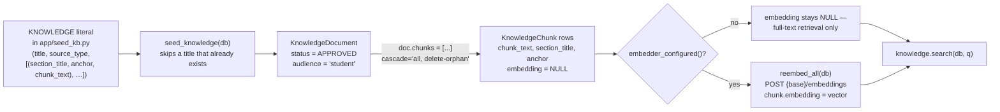
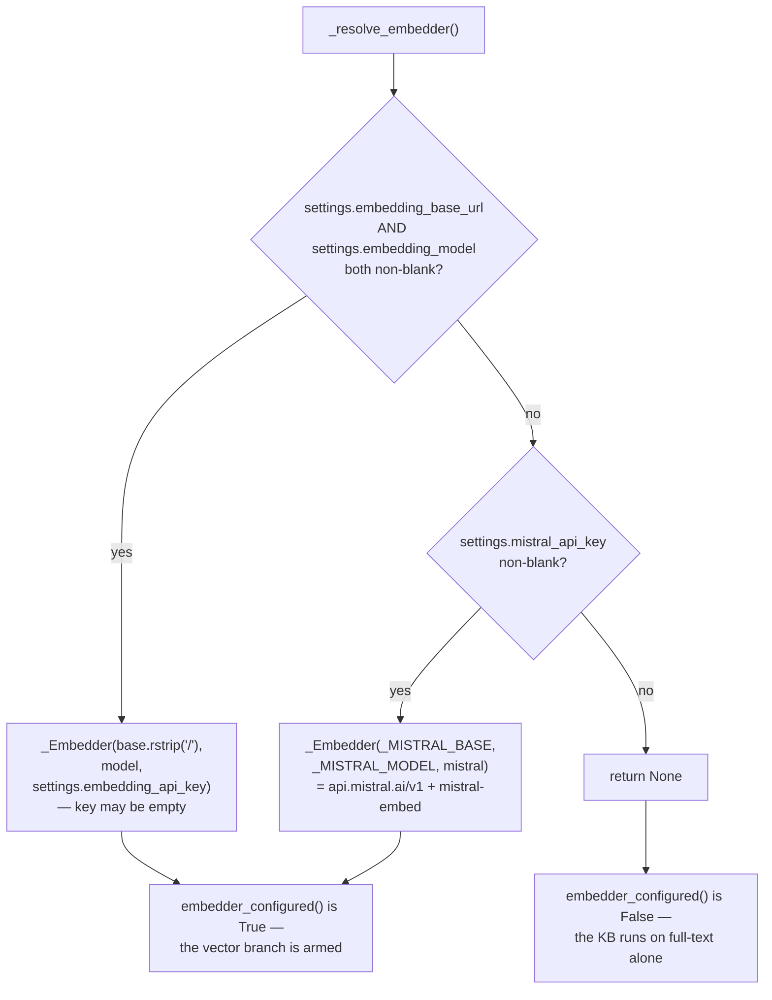
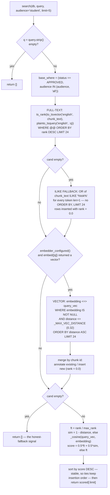

# Chapter 10 — Vector DB & the Knowledge Base: Hybrid Retrieval, pgvector and the Honest Fallback

When you finish this chapter you will be able to add a document to REEP's Knowledge Base and know exactly which SQL statements will find it; you will be able to read `search()` line by line and predict the score of any chunk it returns; you will know what an embedding actually is, why the vector column has no dimension, why the embedder swallows every error it meets, and why a machine with no embedding key still has a working Knowledge Base. Most importantly you will be able to answer the question the whole subsystem exists to answer — *how does REEP decide that it has found nothing good enough, and say so, instead of handing a student the least-bad paragraph it could find?* — and you will know precisely where that guarantee holds and where, today, it does not.

**In scope.** `apps/api-py/app/assistant/knowledge_base.py` (retrieval), `apps/api-py/app/ai/embeddings.py` (the embedder), `apps/api-py/app/seed_kb.py` (the corpus and the production-safe seed), the `embedding` column as retrieval uses it, and `apps/api-py/tests/test_knowledge.py`.

**Deferred.** Chapter 3 documents `knowledge_documents` and `knowledge_chunks` column by column — this chapter explains the *lifecycle* of a document and reads only the columns retrieval touches. Chapter 4 owns migration `b7e2f4a19c33` (the `ARRAY(Float)` → `vector` conversion) as a worked case study; it is cited here, never re-derived. Chapter 8 owns `app/ai/llm.py`, the Rule 1 egress gate and the whole orchestrator pipeline that *consumes* retrieval; this chapter names the seam (`assistant_tools.policy_search` → `knowledge.search`) and hands off. Chapter 1, §6 sets out the two inviolable rules that §1 below leans on.

**A note on the numbers.** Where this chapter states a cosine distance, a blended score or a match count, it was measured against the running `reep-postgres` container on the shipped seed (10 documents, 18 chunks, all 18 embedded) with the configured `mistral-embed` provider, by calling the real `knowledge.search()` and the real SQL. Those figures are labelled where they appear. Everything else is read off the code.

---

## 1. What the Knowledge Base is, and why it sits outside Rule 1

REEP's assistant answers two completely different kinds of question. "What is my attendance?" is a question about a *record* — one row, one student, authoritative, private. "How do I get a Power BI skill verified?" is a question about a *rule* — the same answer for everybody, published by the institution, and not private at all. The Knowledge Base is the store for the second kind, and the model file says so in its first sentence:

```python
"""REEP Knowledge Base — the "explain the rules" layer for the grounded assistant.

This is DELIBERATELY separate from every student-fact table. A KnowledgeDocument
holds APPROVED policy / FAQ / guidance text only — never a student's marks,
eligibility, attendance or any other live record. The grounded assistant reads
```
— [app/models/knowledge.py:1-5](apps/api-py/app/models/knowledge.py#L1-L5)

The sentence runs on into lines 6-7: "from here to *explain how REEP works*; a student's own numbers still come from the authenticated records view, never from this store."

That separation is not filing tidiness. It is the load-bearing premise of a deliberate exemption from the project's first rule. AGENTS.md Rule 1 says student data must not leave the machine unbidden, and `student_data_egress_allowed(base_url)` in [app/ai/llm.py:105-110](apps/api-py/app/ai/llm.py#L105-L110) enforces it: loopback is always permitted, anything else requires `LLM_ALLOW_REMOTE_STUDENT_DATA=true`. Every path that carries a student's private records calls the model with `carries_student_data=True` and is refused before the bytes leave the process.

The Knowledge Base is the one place the project deliberately ships content to a remote third party with no gate at all. The model file states the reasoning in the same docstring:

> **Why it is like this.** "Keeping the two apart is what lets the KB text be embedded and even sent to a remote embedder (it is public policy) while student PII stays behind the egress gate." — [app/models/knowledge.py:7-9](apps/api-py/app/models/knowledge.py#L7-L9)

The embedder repeats the position independently, in its own opening paragraph:

```python
The KB stores PUBLIC policy text, so embedding it and even sending it to a remote
embedding endpoint is fine — there is no student PII here (that is the whole point
of keeping knowledge separate from student facts). This module is therefore
DELIBERATELY simple and has NO hard dependency on any embedding provider:
```
— [app/ai/embeddings.py:3-6](apps/api-py/app/ai/embeddings.py#L3-L6)

and it closes the same docstring with "(The KB is public policy text, so this is outside the student-data egress gate — nothing private is embedded.)" ([embeddings.py:18-19](apps/api-py/app/ai/embeddings.py#L18-L19)). The settings file says it a third time, above the three `embedding_*` fields ([config.py:47-51](apps/api-py/app/config.py#L47-L51)), and AGENTS.md says it a fourth: "The KB is APPROVED public policy text, so embedding it is outside the student-data egress gate" ([AGENTS.md:82](AGENTS.md#L82)).

Is the position defensible? Yes, and precisely because of *how* it is argued. The claim is not "embedding is safe" — it is "*this table* contains nothing private, therefore embedding *this table* is safe". That is a claim about data, and it is structurally supported: `app/ai/embeddings.py` reads no student model, takes no `student_id`, and imports nothing from `app/ai/llm.py`; the only rows `reembed_all` ever loads are `KnowledgeChunk` rows ([embeddings.py:111](apps/api-py/app/ai/embeddings.py#L111), [embeddings.py:116](apps/api-py/app/ai/embeddings.py#L116)). The seed that populates the table declares the same contract — "Contains NO student facts and NO credentials" ([seed_kb.py:12-13](apps/api-py/app/seed_kb.py#L12-L13)) — and there is no admin UI or API endpoint anywhere in the backend that writes a `KnowledgeDocument`, so the seed is effectively the sole author of the corpus.

But be exact about what enforces it: **nothing at runtime does.** No code inspects a `chunk_text` for PII before embedding it, and no code inspects it before putting it in a prompt. The exemption is bought entirely by the discipline of what goes into the table. If a director ever pasted a student's marks into a KB document and approved it, both the embedder and the policy prompt would ship it to a remote provider without complaint, and nothing would log, error or fail. That is the standing rule this chapter contributes to the book's rulebook: **the KB's exemption from Rule 1 is an exemption for *approved public policy text* and nothing else. Putting a student fact into a `KnowledgeChunk` is a Rule 1 breach through the one door Rule 1 deliberately leaves open.**

---

## 2. From document to chunk: the lifecycle

Two tables, one relationship. A `KnowledgeDocument` is the unit of *approval* and *provenance*; a `KnowledgeChunk` is the unit of *retrieval*. Chapter 3 has the column-by-column reference; what matters here is what happens to a document as it travels from an author's mind to a student's screen.



**Chunk boundaries are authorial. There is no chunker in this codebase.** This is the single most surprising fact about the subsystem and the one most likely to be assumed wrong. There is no token counter, no sliding window, no overlap parameter, no splitter library. The corpus is a Python literal in which a human wrote the boundaries by hand:

```python
# Each entry: (title, source_type, [(section_title, anchor, chunk_text), ...]).
# Realistic REEP policy/FAQ/guidance covering the assistant's target use cases.
KNOWLEDGE: list[tuple[str, str, list[tuple[str, str, str]]]] = [
```
— [app/seed_kb.py:27-29](apps/api-py/app/seed_kb.py#L27-L29)

Each inner tuple becomes exactly one `KnowledgeChunk` row, its `chunk_text` stored verbatim. Parsing the literal gives 10 documents and 18 chunks; the chunks run 25 to 63 words (158 to 388 characters) — one tight paragraph each. A chunk boundary in REEP is therefore *a topic boundary a person chose*, which is why every chunk also carries a human-written `section_title` and a kebab-case `anchor`.

The metadata each chunk carries, and who reads it:

| Column | Set by the seed | Read by retrieval | Notes |
|---|---|---|---|
| `chunk_text` | yes | yes — indexed, matched, returned | the retrieval unit |
| `section_title` | yes ("How skill verification works"), [seed_kb.py:268](apps/api-py/app/seed_kb.py#L268) | **no** | written, never selected |
| `anchor` | yes (`verify-skill`) | yes — returned in every hit | the per-section deep-link handle |
| `embedding` | only via `reembed_all` | yes — filtered and ordered | dimensionless `vector`, nullable |
| `metadata_json` | yes (`{"source_type": …}`), [seed_kb.py:270](apps/api-py/app/seed_kb.py#L270) | **no** | no reader anywhere in `app/` or `tests/` |
| `document_id` | via the relationship | yes — join key | |

And on the parent document: `title`, `source_type` and `source_url` are read back into every hit; `status` and `audience` are the two filters. `version`, `published_at` and `owner_role` are written by the seed ([seed_kb.py:259](apps/api-py/app/seed_kb.py#L259), [:262](apps/api-py/app/seed_kb.py#L262), [:263](apps/api-py/app/seed_kb.py#L263)) and read by nothing. `created_at` is a separate case: the seed's constructor call ([seed_kb.py:256-264](apps/api-py/app/seed_kb.py#L256-L264)) never mentions it — it is filled by the database from `server_default=func.now()` ([models/knowledge.py:72](apps/api-py/app/models/knowledge.py#L72)) — and it is likewise never read.

**Approval is a state, and it is the retrieval gate.** `KnowledgeStatus` is the only true Postgres enum here — `DRAFT`, `APPROVED`, `ARCHIVED` ([models/knowledge.py:41-44](apps/api-py/app/models/knowledge.py#L41-L44)) — mapped with an explicit type name and a default that fails closed:

```python
    status: Mapped[KnowledgeStatus] = mapped_column(
        Enum(KnowledgeStatus, name="knowledge_status"),
        default=KnowledgeStatus.DRAFT,
        server_default="DRAFT",
    )
```
— [models/knowledge.py:63-67](apps/api-py/app/models/knowledge.py#L63-L67)

A document is invisible to retrieval until someone deliberately approves it. The seed overrides the default explicitly ([seed_kb.py:260](apps/api-py/app/seed_kb.py#L260)) — a seeded document that forgot to would exist in the database and answer nothing, a silent failure indistinguishable from an empty KB.

`audience` is the second filter and is *not* an enum: it is a plain `String` with the permitted set written in a comment above it ([models/knowledge.py:68-69](apps/api-py/app/models/knowledge.py#L68-L69)), exactly as `source_type` is ([models/knowledge.py:59-60](apps/api-py/app/models/knowledge.py#L59-L60)). That is a house convention worth naming: **a closed set that the database must enforce gets a SQLAlchemy `Enum` with an explicit lowercase `name=`; an open-ended vocabulary gets a `String` with its legal values documented in an inline comment.** The cost of the loose typing here is real — a caller passing a typo'd audience silently matches only documents whose audience is literally `'all'`.

The lifecycle end to end, then: an author adds a `(title, source_type, [(section_title, anchor, chunk_text), …])` tuple to `KNOWLEDGE`; `seed_knowledge` inserts one `KnowledgeDocument` with `status=APPROVED, audience="student"` and its chunks through the ORM relationship (which has `cascade="all, delete-orphan"`, [models/knowledge.py:74-78](apps/api-py/app/models/knowledge.py#L74-L78), so `db.add(doc)` persists parent and children together); `reembed_all` fills each chunk's `embedding` if a provider is configured; and from that moment `search()` can find the chunks. Flip the document to `DRAFT` and every chunk vanishes from every branch of retrieval at once — pinned by [test_knowledge.py:77-114](apps/api-py/tests/test_knowledge.py#L77-L114).

The journey has no reverse gear, and §8 documents the two traps that follow from that: because the seed's only key is the document *title*, editing a chunk changes nothing, and *renaming* a document inserts a second copy of it beside the first.

---

## 3. The embedder: `app/ai/embeddings.py`, end to end

### First, what an embedding actually is

Everything from here to §6 rests on one idea, so state it before the plumbing. **An embedding model takes a passage of text and returns a fixed-length list of floating-point numbers** — for Mistral's `mistral-embed`, 1024 of them ([embeddings.py:17](apps/api-py/app/ai/embeddings.py#L17)). Treat that list as coordinates: the passage becomes a point in a 1024-dimensional space, and what makes the model useful is that it was *trained* so that passages about the same subject come out pointing in similar directions from the origin, whatever words they happened to use. "Upload evidence and your mentor verifies the skill" and "prove to a recruiter that I really know a tool" share almost no words and point almost the same way.

"Pointing the same way" is measured as the **cosine of the angle** between the two lists: 1.0 when they point identically, 0 when they are at right angles (unrelated), −1 when they point opposite. Postgres's pgvector extension does not hand you the cosine directly; its `<=>` operator returns **cosine distance = 1 − cosine similarity**, which runs 0 (identical direction) to 2 (opposite). So for `<=>`, **small means related**.

That is the entire reason a question sharing no word with a chunk can still retrieve it; the entire reason a single float (`0.32`) can be a meaningful "close enough" cut-off; and the entire reason the phrase "semantically-related chunks" in `knowledge.py`'s own docstring ([knowledge.py:17-18](apps/api-py/app/assistant/knowledge_base.py#L17-L18)) means something mechanical rather than something aspirational. Keep the three facts together: `embedding` is a list of floats, `<=>` is an angle between two of them, and `_MAX_VEC_DISTANCE` is a cut-off on that angle.

### The module

132 lines, three public functions, and a docstring that states its own contract as a type signature:

```python
    embed(texts) -> list[list[float]] | None

Returns None when no embedder is configured; every caller then falls back to
Postgres full-text retrieval, so the KB works with zero embedding setup.
```
— [embeddings.py:8-11](apps/api-py/app/ai/embeddings.py#L8-L11)

### It mirrors the LLM adapter's shape, and diverges where the stakes differ

The docstring says the mirroring out loud: "Provider selection mirrors the universal LLM adapter (`app/ai/llm.py`): 'one set of keys, any provider, no code change'" ([embeddings.py:13-14](apps/api-py/app/ai/embeddings.py#L13-L14)). The shared DNA is a house pattern you will meet again: an explicit `<subsystem>_base_url` + `<subsystem>_model` + `<subsystem>_api_key` trio that *wins* when set; auto-selection from a bare per-provider key when it is not; an OpenAI-compatible wire protocol so any provider works without code change; `.strip()` on every settings read; `.rstrip("/")` on the base URL; `f"{base}/<endpoint>"` construction; lowercase `content-type` and conditional `authorization: Bearer` headers; `raise_for_status()`; and the identical timeout expression.

The divergences are the interesting part, and each has a reason readable off the code:

| | `app/ai/llm.py` | `app/ai/embeddings.py` |
|---|---|---|
| Egress gate | `carries_student_data` parameter, calls `student_data_egress_allowed` | none at all |
| Errors | propagate (`httpx.HTTPStatusError`, `LLMNotConfigured`, `StudentDataEgressRefused`) | swallowed to `None` |
| Auto-select providers | six ([llm.py:61-70](apps/api-py/app/ai/llm.py#L61-L70)) | one (Mistral) |
| Config carrier | two frozen dataclasses, `LLMConfig` / `Provider` | one `NamedTuple`, `_Embedder` |
| Explicit-path admission | `base and model and (key or is_loopback(base))` ([llm.py:88](apps/api-py/app/ai/llm.py#L88)) | `base and model` — key optional |
| Endpoint | `/chat/completions` | `/embeddings` |
| Streaming | `stream_chat` exists | none |

The error asymmetry follows from importance. A chat call *is* the feature, so its failure must surface. An embedding call is an optional enhancement to a retrieval path that has a working alternative, so its failure must be invisible. The key-optional admission test follows from deployment shape: an explicit base URL with no key is almost always a local embedding server (Ollama, LM Studio, a text-embeddings-inference container) that needs no auth, and the payload is public text either way.

### Resolution, quoted in full

```python
def _resolve_embedder() -> _Embedder | None:
    """Pick an embeddings provider from config, or None to fall back to full-text.

    Explicit LLM-style `embedding_*` wins; otherwise auto-select Mistral from
    `MISTRAL_API_KEY` (the KB is public text, so a remote embedder is fine)."""
    base = settings.embedding_base_url.strip()
    model = settings.embedding_model.strip()
    if base and model:
        return _Embedder(base.rstrip("/"), model, settings.embedding_api_key.strip())

    mistral = settings.mistral_api_key.strip()
    if mistral:
        return _Embedder(_MISTRAL_BASE, _MISTRAL_MODEL, mistral)

    return None
```
— [embeddings.py:45-59](apps/api-py/app/ai/embeddings.py#L45-L59)

Three arms, and the third is the one §4 is built on:



`_MISTRAL_BASE = "https://api.mistral.ai/v1"` and `_MISTRAL_MODEL = "mistral-embed"` are at [embeddings.py:35-36](apps/api-py/app/ai/embeddings.py#L35-L36). The three settings fields default to `""`, never `None` ([config.py:52-54](apps/api-py/app/config.py#L52-L54)) — which is why every read site can call `.strip()` unconditionally, a convention that runs through the whole config surface. `embedder_configured()` is then one line: `return _resolve_embedder() is not None` ([embeddings.py:64](apps/api-py/app/ai/embeddings.py#L64)).

One coupling worth naming: `MISTRAL_API_KEY` is also a *chat* provider key. The entry `Provider("mistral", "https://api.mistral.ai/v1", "mistral-small-latest", "mistral_api_key")` sits third in the LLM adapter's auto-select list, at [llm.py:66](apps/api-py/app/ai/llm.py#L66). A deployment that pastes the key purely to get a chat model silently turns on remote embedding of the entire Knowledge Base the next time `seed_knowledge` or `reembed_all` runs. Under the project's own trust position that is harmless — the KB is public — but one environment variable enabling two different outbound flows is a surprise worth documenting.

### The exact request

```python
        resp = httpx.post(
            f"{base}/embeddings",
            json={"model": model, "input": texts},
            headers=headers,
            timeout=max(1.0, settings.llm_timeout_ms / 1000),
        )
```
— [embeddings.py:86-91](apps/api-py/app/ai/embeddings.py#L86-L91)

The body is exactly two keys. `input` is a **list**, so one HTTP round-trip embeds the whole batch. There is no `encoding_format`, no `dimensions`, no `user`. `httpx.post` is the module-level convenience function: a fresh connection per call, no pooling, no retries, blocking and synchronous.

**The timeout is borrowed.** There is no `embedding_timeout_ms` anywhere in `config.py`; the expression reuses `llm_timeout_ms`, whose default is `300000` ([config.py:31](apps/api-py/app/config.py#L31)), floored at one second. It is textually identical to `_timeout_s()` in [llm.py:73-74](apps/api-py/app/ai/llm.py#L73-L74) but copied, not imported. The practical consequence: on default configuration an unresponsive embedding endpoint can hold a KB search open for five minutes.

What that actually costs needs the FastAPI mechanism spelled out, because "the event loop is safe" means nothing until you know there *is* one. FastAPI serves every request on a **single event loop** — one thread, cooperatively switching between requests — so a blocking call made directly on it stalls every other request in the process. FastAPI's escape hatch is that an endpoint declared with plain `def` rather than `async def` never runs on the loop at all; it is handed to a bounded pool of worker threads. `GET /api/agent/knowledge/search` is declared `def` ([api/legacy/text_assistant.py:411](apps/api-py/app/api/legacy/text_assistant.py#L411)), so a five-minute hang inside `embed()` occupies **one worker thread** and the event loop keeps serving everyone else. The pool is finite, though (AnyIO's default capacity is 40 threads), so a wedged embedding endpoint under sustained load can exhaust it — at which point every synchronous endpoint in the application starts queueing behind it. The blast radius is bounded, not zero.

### Response handling, and the one non-obvious correctness guard

```python
        data = resp.json()["data"]
        # OpenAI returns rows possibly out of order; sort by index to realign.
        rows = sorted(data, key=lambda r: r.get("index", 0))
        return [r["embedding"] for r in rows]
```
— [embeddings.py:93-96](apps/api-py/app/ai/embeddings.py#L93-L96)

> **Why it is like this.** The batch contract is positional: `embed(texts)[i]` must be the vector for `texts[i]`. A provider that returned rows in arbitrary order would attach every chunk's vector to the wrong chunk, and the result would be a Knowledge Base that retrieves confidently and wrongly, with nothing in any log to show for it. The `.get("index", 0)` default is defensive: a provider that omits `index` gives every row the same key, and Python's `sorted` is stable, so the original order survives rather than being scrambled.

Then the swallow:

```python
    except Exception:
        log.exception("embedding call failed (base=%s model=%s)", base, model)
        return None
```
— [embeddings.py:97-99](apps/api-py/app/ai/embeddings.py#L97-L99)

A bare `except Exception` catches everything: the `HTTPStatusError` from `raise_for_status`, connect errors, read timeouts, a JSON decode failure, and the `KeyError` from a response missing `data` or `embedding`. `log.exception` puts the full traceback in the log; the two format parameters name the base URL and model so an operator can tell an auth failure at Mistral from a 404 at a mistyped local endpoint. The API key is never logged. The docstring states the doctrine plainly: "the KB must never hard-fail just because an optional embedder is down" ([embeddings.py:72-73](apps/api-py/app/ai/embeddings.py#L72-L73)).

Note the consequence for callers: `None` means *both* "no embedder configured" and "the embedder is broken". Callers cannot distinguish the two, and — by design — do not need to. Both degrade identically.

### Dimensionality: why the column has none

`KnowledgeChunk.embedding` is declared with a bare `Vector()`:

```python
    # pgvector `vector` (dimensionless) — nullable so the KB works before any
    # embeddings exist. Retrieval orders by `embedding <=> :query_vec` in-DB.
    embedding: Mapped[list[float] | None] = mapped_column(Vector(), nullable=True)
```
— [models/knowledge.py:115-117](apps/api-py/app/models/knowledge.py#L115-L117)

`Vector` comes from pgvector-python, pinned at `pgvector==0.5.0` ([requirements.txt:24](apps/api-py/requirements.txt#L24)); in that package it is an alias for the SQLAlchemy type `VECTOR`. The type's `get_col_spec` branches on whether a dimension was supplied: with none, it emits the bare string `VECTOR`, and only otherwise `VECTOR(n)`. A bare `VECTOR` is a column with no typmod, which Postgres accepts at any dimension, row by row. (Those are properties of the installed wheel, which lives under `apps/api-py/.venv/` and is excluded from version control by [.gitignore:5](.gitignore#L5) and [apps/api-py/.gitignore:5](apps/api-py/.gitignore#L5) — hence the pinned version rather than a link into it.) The migration that created the column says why:

> **Why it is like this.** "The `vector` column is DIMENSIONLESS (no typmod): the KB is small and curated, so an exact cosine scan is instant and any provider's dimension fits without a schema change." — [migrations/versions/b7e2f4a19c33_kb_embedding_pgvector.py:16-18](apps/api-py/migrations/versions/b7e2f4a19c33_kb_embedding_pgvector.py#L16-L18)

The model docstring adds the invariant that makes it safe: "any embedding model's dimension fits without a schema change (all rows + the query share one provider, so `<=>` dims line up). `reembed_all` rewrites every row when the provider changes." ([models/knowledge.py:91-93](apps/api-py/app/models/knowledge.py#L91-L93)).

**What it buys.** Switching from `mistral-embed` to a 1536-dimension OpenAI model or a 384-dimension local one needs no `ALTER TABLE` and no new migration — a config change and a re-embed. **What it costs.** Postgres can no longer enforce dimension consistency, so the one-provider invariant is upheld only by `reembed_all` rewriting every row; and an approximate index (ivfflat, hnsw) cannot be built on a column with no fixed dimension, which is why `KnowledgeChunk.__table_args__` ([models/knowledge.py:96-106](apps/api-py/app/models/knowledge.py#L96-L106)) declares only the document-id index and the full-text GIN index, and no vector index at all. Every vector query is an exact scan with a per-row `<=>` computation — deliberate, and stated in `knowledge.py`'s own docstring: "The KB is small and curated, so an exact cosine scan needs no ivfflat/hnsw index." ([knowledge.py:28-29](apps/api-py/app/assistant/knowledge_base.py#L28-L29)).

---

## 4. The central design decision: no embedder means full-text only

### What Postgres full-text search actually does

Before the argument, the machinery — because the whole of §4 is a claim about what survives when the vector branch is switched off.

Postgres full-text search does not compare words. It runs both the stored text and the query through a language configuration (here, always the literal `'english'`) that discards stopwords and reduces every remaining word to a **root form**, called a *lexeme*. "Placements" and "placement" both reduce to `placement`; "verify" and "verified" both reduce to `verifi`; "documents" reduces to `document`. `to_tsvector('english', chunk_text)` is a chunk's bag of lexemes. `plainto_tsquery('english', q)` is the query's lexemes — **joined with AND**. The `@@` operator asks whether a chunk's bag satisfies the query; `ts_rank` scores how well.

The AND is the decisive detail, and it is easiest to see worked out. Measured against the running database:

```sql
select plainto_tsquery('english', 'what documents do I need before placements');
--  'document' & 'need' & 'placement'
```

A chunk must contain **all three** roots to match at all. On the shipped 18-chunk corpus, none does: the full-text branch — the one the module docstring calls PRIMARY — returns **zero rows** for that perfectly ordinary question. By contrast `plainto_tsquery('english','how do I verify a Power BI skill')` is `'verifi' & 'power' & 'bi' & 'skill'`, and exactly one chunk (`verify-skill`) satisfies it, at `ts_rank` 0.68906283.

Now the loss is precise. Full-text can only ever find text that shares *roots* with the question. A paraphrase that shares a meaning but no root is invisible to it: "prove my competency to a recruiter" reduces to `'prove' & 'compet' & 'recruit'` and matches **zero** approved chunks, even though the skill-verification document is obviously the right answer to it. Recovering exactly those matches is the whole payoff of the vector branch — and exactly what a machine with no embedder gives up.

### The degradation, traced

The claim is made in the retrieval docstring — "Without an embedder it degrades cleanly to full-text alone — the KB still works with zero embedding setup" ([knowledge.py:23-24](apps/api-py/app/assistant/knowledge_base.py#L23-L24)) — and the code matches it exactly. Trace it:

1. With `EMBEDDING_BASE_URL`/`EMBEDDING_MODEL` blank **and** `MISTRAL_API_KEY` blank, `_resolve_embedder()` falls through to `return None` ([embeddings.py:59](apps/api-py/app/ai/embeddings.py#L59)).
2. `embedder_configured()` therefore returns `False`.
3. In `search()`, the vector branch is guarded three times over:

```python
    query_vec: list[float] | None = None
    if embedder_configured():
        vecs = embed([q])
        if vecs:
            query_vec = vecs[0]
    if query_vec is not None:
```
— [knowledge.py:158-163](apps/api-py/app/assistant/knowledge_base.py#L158-L163)

`if vecs:` is truthiness, not `is not None`, so it rejects both `None` and an empty list. `if query_vec is not None:` then gates the *entire* pgvector SELECT — the `cosine_distance` expression, the `WHERE`s, the `db.execute`. With no embedder, none of that SQL is built and no query ever touches the `embedding` column.

4. The candidate map is therefore filled by the full-text branch alone (plus its ILIKE fallback).
5. In the blend, every candidate has `distance = None` and `query_vec is None`, so `sim` stays `None` and the score expression takes its `else` arm:

```python
        score = (
            (1 - _COSINE_WEIGHT) * ft + _COSINE_WEIGHT * sim if sim is not None else ft
        )
```
— [knowledge.py:209-211](apps/api-py/app/assistant/knowledge_base.py#L209-L211)

`score = ft` — the normalised full-text rank, alone. `_COSINE_WEIGHT` never applies.

**What quality is lost.** Precisely the paraphrase case set out above, and `test_semantic_query_with_no_shared_tokens_lands_on_the_right_doc` ([test_knowledge.py:128-136](apps/api-py/tests/test_knowledge.py#L128-L136)) exists to pin it. (§9 shows that on the shipped corpus that test does not in fact exercise the pgvector SELECT — but the *premise* it encodes is exactly this one.)

**Why "always works, sometimes worse" over "requires configuration".** Because the alternative is that a third-party embedding API's outage takes the assistant's only grounded source offline. The degradation is not a nice-to-have that happened to fall out of the design; it is defended at three separate layers — the nullable column ("nullable so the KB works before any embeddings exist", [models/knowledge.py:115-116](apps/api-py/app/models/knowledge.py#L115-L116)), the swallowing `embed()`, and the triple guard above — and it is documented as an operational promise in [docs/deployment-env.md:48](docs/deployment-env.md#L48): "KB retrieval falls back to Postgres full-text. Degrades answer quality; nothing breaks."

The test suite is built on the same premise. Only two tests carry the `requires_embedder` marker, so `test_knowledge.py` is green on a machine with no embedding provider at all:

```python
# pgvector semantic tests only mean anything when an embedder is configured and
# the chunks are embedded; without a provider the KB runs on full-text alone.
requires_embedder = pytest.mark.skipif(
    not embeddings.embedder_configured(),
    reason="no embedding provider configured (KB runs full-text only)",
)
```
— [test_knowledge.py:28-33](apps/api-py/tests/test_knowledge.py#L28-L33)

Every test in the file still carries `@requires_db` (lines 47, 57, 65, 76, 117, 126, 139, 153, 171, 182), so the embedder is the *second* precondition, not the only one; §9 returns to what a green run means when neither is present.

The marker is a naming convention in itself: **pytest environment gates are module-level marks named `requires_<precondition>`** — `requires_db` in [conftest.py:49](apps/api-py/tests/conftest.py#L49), `requires_embedder` here.

---

## 5. Hybrid retrieval, read end to end

`app/assistant/knowledge_base.py` is 224 lines and exports exactly one public function. It is a top-level module under `app/` — a sibling of `app/assistant/tools.py` and `app/seed_kb.py`, *not* under `app/ai/`, even though the embedder it depends on lives at `app/ai/embeddings.py`. There is no logging, no caching, no async.

### The three constants

```python
# How many candidates to pull per branch before the blended re-rank.
_CANDIDATE_POOL = 24
# Weight given to the embedding-cosine signal when blending (rest is full-text).
_COSINE_WEIGHT = 0.5
```
— [knowledge.py:42-45](apps/api-py/app/assistant/knowledge_base.py#L42-L45)

Read "per branch" literally: 24 is the `LIMIT` on the full-text select ([knowledge.py:130](apps/api-py/app/assistant/knowledge_base.py#L130)), on the ILIKE select ([knowledge.py:152](apps/api-py/app/assistant/knowledge_base.py#L152)) and on the vector select ([knowledge.py:187](apps/api-py/app/assistant/knowledge_base.py#L187)) *independently*. The ILIKE select, though, runs **only** when the full-text select came back empty (see below), so at most two branches ever contribute — the merged pool can hold at most 24 + 24 = 48 distinct chunk ids, and in practice far fewer, because the vector branch usually re-finds rows a text branch already put there. `_COSINE_WEIGHT = 0.5` makes the blend an exact 50/50. The third constant, `_MAX_VEC_DISTANCE`, gets its own section below.

The convention on display: **private module constants are leading-underscore SCREAMING_SNAKE, one per tunable, each with a rationale comment directly above it.** Private helpers are leading-underscore snake_case — `_audience_filter`, `_cosine`, and the nested closure `_row_fields`. And the module exposes exactly one verb, so callers read `knowledge.search(...)`, never `search_knowledge(...)`: **the module is the namespace.** The same shape holds for `embeddings.embed` / `embeddings.reembed_all` and `seed_kb.seed_knowledge`.

### Entry, and the two hard invariants

```python
def search(
    db: Session,
    query: str,
    audience: str = "student",
    limit: int = 5,
) -> list[dict]:
```
— [knowledge.py:74-79](apps/api-py/app/assistant/knowledge_base.py#L74-L79)

There is **no minimum-score parameter**. The only relevance gate anywhere in the function is `_MAX_VEC_DISTANCE`, and it applies to one branch. The first statement is the empty-query guard (`q = (query or "").strip()` / `if not q: return []`, [knowledge.py:86-88](apps/api-py/app/assistant/knowledge_base.py#L86-L88)), pinned by [test_knowledge.py:118-120](apps/api-py/tests/test_knowledge.py#L118-L120).

Then the whole of REEP's approval-and-audience enforcement, in four lines:

```python
    base_where = (
        KnowledgeDocument.status == KnowledgeStatus.APPROVED,
        _audience_filter(audience),
    )
```
— [knowledge.py:90-93](apps/api-py/app/assistant/knowledge_base.py#L90-L93)

with `_audience_filter` being one line: `return KnowledgeDocument.audience.in_([audience, "all"])` ([knowledge.py:59-60](apps/api-py/app/assistant/knowledge_base.py#L59-L60)). That single tuple is splatted as `.where(*base_where)` into all three selects — [knowledge.py:127](apps/api-py/app/assistant/knowledge_base.py#L127), [knowledge.py:150](apps/api-py/app/assistant/knowledge_base.py#L150), [knowledge.py:183](apps/api-py/app/assistant/knowledge_base.py#L183). There is no post-filter and no second layer. **The risk shape is worth naming: adding a fourth retrieval branch and forgetting the splat is a silent one-line regression that would hand a DRAFT chunk to the assistant as approved institutional policy.**

### The candidate map

```python
    # Candidates keyed by chunk id, carrying both signals: a full-text `rank`
    # (0 when only the vector branch found it) and a cosine `distance` (None when
    # only full-text found it). Merging by id lets a chunk strong on EITHER signal
    # survive to the blended re-rank below.
    cand: dict[str, dict] = {}
```
— [knowledge.py:105-109](apps/api-py/app/assistant/knowledge_base.py#L105-L109)

A closure, `_row_fields(row)` ([knowledge.py:95-103](apps/api-py/app/assistant/knowledge_base.py#L95-L103)), normalises a SQLAlchemy `Row` into six keys: `chunk_text`, `anchor`, `embedding`, `title`, `source_type`, `source_url`. It deliberately carries `embedding` through so the Python cosine fallback can use it later, and it uses the model-side name `title` — the rename to `document_title` happens exactly once, at output time.

**Nothing is ever removed from `cand` after insertion.** Hold that fact; §6 turns on it.

### The full-text branch

```python
    ts_vector = func.to_tsvector("english", KnowledgeChunk.chunk_text)
    ts_query = func.plainto_tsquery("english", bindparam("q", value=q, type_=String))
    rank = func.ts_rank(ts_vector, ts_query).label("rank")
```
— [knowledge.py:112-114](apps/api-py/app/assistant/knowledge_base.py#L112-L114)

The text-search configuration is the hard-coded string `'english'` in both halves. The rank is plain two-argument `ts_rank` — default weights, **no normalization argument** — so it is not divided by document length and is not comparable across corpora. It is only ever used relatively, divided by the batch maximum.

The statement matches with the `@@` operator, orders by rank descending and caps at the pool:

```python
        .where(ts_vector.op("@@")(ts_query))  # "@@" is the text-search match op
        .order_by(rank.desc())
        .limit(_CANDIDATE_POOL)
```
— [knowledge.py:128-130](apps/api-py/app/assistant/knowledge_base.py#L128-L130)

Rows land as `cand[r.id] = {**_row_fields(r), "rank": float(r.rank), "distance": None}` ([knowledge.py:132-133](apps/api-py/app/assistant/knowledge_base.py#L132-L133)).

The decisive property of this branch is the AND-conjunction worked out in §4: on an 18-chunk corpus a naturally-phrased question frequently satisfies *no* chunk, so the PRIMARY branch returns nothing and control drops to the fallback. Measured against the running database, of six representative queries only one natural question produces any `@@` match at all:

| Query | approved chunks matching `@@` |
|---|---|
| `how do I verify a Power BI skill` | 1 (`verify-skill`, `ts_rank` 0.68906283) |
| `what documents do I need before placements` | 0 |
| `prove my competency to a recruiter` | 0 |
| `how do I bake sourdough bread at home` | 0 |
| `photosynthesis chlorophyll stomata xylem` | 0 |
| `zqwxplorbnix vfgtrkzylophonic quzzmatic bxqptlwr` | 0 |

The GIN index that backs `@@` is declared twice on purpose — once in the model so metadata matches the database ([models/knowledge.py:101-105](apps/api-py/app/models/knowledge.py#L101-L105)) and once in the migration, which hand-writes it because Alembic cannot autogenerate an expression index. The migration states the reason immediately above the statement:

```python
    # Postgres full-text GIN index over the chunk text — backs the PRIMARY
    # retrieval path in app/assistant/knowledge_base.py (ts_rank over to_tsvector('english', ...)).
    # Hand-written because Alembic can't autogenerate a functional/expression index.
    op.execute(
        "CREATE INDEX ix_knowledge_chunk_fts "
        "ON knowledge_chunks USING gin (to_tsvector('english', chunk_text))"
    )
```
— [1aa19fa788e9_knowledge_base_documents_chunks.py:51-57](apps/api-py/migrations/versions/1aa19fa788e9_knowledge_base_documents_chunks.py#L51-L57)

The index expression must remain byte-identical to the query expression or it is silently unused — correctness unaffected, performance degraded to a sequential scan. At 18 rows Postgres chooses the sequential scan anyway; the index is insurance for a larger KB, and a drift between the two declarations would go unnoticed until the corpus grew.

### The ILIKE fallback, and what it actually does

```python
    if not cand:
        # FALLBACK: ILIKE over the raw tokens when ts produced nothing.
        tokens = [t for t in q.split() if len(t) > 1] or [q]
        ilike_clauses = [KnowledgeChunk.chunk_text.ilike(f"%{tok}%") for tok in tokens]
```
— [knowledge.py:135-138](apps/api-py/app/assistant/knowledge_base.py#L135-L138)

It runs only when full-text returned zero rows. The select is bound to the local `fallback` ([knowledge.py:139](apps/api-py/app/assistant/knowledge_base.py#L139)); it mirrors `ft_stmt` minus the rank column, applies `base_where` and `or_(*ilike_clauses)`, caps at 24 and — notably — has **no `ORDER BY`**, so both which rows survive truncation and the order they enter `cand` in are planner-dependent. Rows land with `rank = 0.0` ([knowledge.py:154-155](apps/api-py/app/assistant/knowledge_base.py#L154-L155)).

The docstring justifies the fallback as covering "a single rare token" ([knowledge.py:13-14](apps/api-py/app/assistant/knowledge_base.py#L13-L14)). The implementation is far broader: it ORs a *substring* match for every token of length ≥ 2, stopwords included. Replaying the tokenisation against the shipped corpus makes the breadth concrete — the substring `to` occurs in 14 of 18 chunks and `at` in 16:

| Query | ILIKE-matched chunks (of 18) |
|---|---|
| `how do I verify a Power BI skill` | 14 |
| `what documents do I need before placements` | 3 |
| `prove my competency to a recruiter` | 14 |
| `how do I bake sourdough bread at home` | **18** |
| `photosynthesis chlorophyll stomata xylem` | 0 |
| `zqwxplorbnix vfgtrkzylophonic quzzmatic bxqptlwr` | 0 |

The repo knows. It says so in exactly one place — a comment in a *different* test file:

> **Why it is like this.** "A query whose every token is gibberish matches no approved chunk, so the model is never consulted and the honest fallback is returned. (Target the policy branch directly: a stopword-laden question would ILIKE-match chunks.)" — [tests/test_orchestrator.py:154-156](apps/api-py/tests/test_orchestrator.py#L154-L156)

That parenthetical is the honest statement of the limitation. Nothing in `knowledge.py` records it.

### The vector branch

```python
        dist_expr = KnowledgeChunk.embedding.cosine_distance(query_vec)
        distance = dist_expr.label("distance")
```
— [knowledge.py:169-170](apps/api-py/app/assistant/knowledge_base.py#L169-L170)

`cosine_distance` is pgvector-python's SQLAlchemy comparator method; in the pinned `pgvector==0.5.0` it renders the operator `<=>`, which is cosine **distance** (`1 − cosine similarity`, range 0..2 — see §3), not similarity. The bind value is a plain Python `list[float]`; the type's bind processor serialises it to the `[a,b,c]` text form, and its result processor returns a plain `list[float]` back, not a numpy array — which is why `c["embedding"] is not None` later is a safe test and `list(c["embedding"])` is a cheap copy.

The statement adds three `WHERE`s and orders ascending — nearest first:

```python
            .where(*base_where)
            .where(KnowledgeChunk.embedding.isnot(None))
            .where(dist_expr <= _MAX_VEC_DISTANCE)
            .order_by(distance)
            .limit(_CANDIDATE_POOL)
```
— [knowledge.py:183-187](apps/api-py/app/assistant/knowledge_base.py#L183-L187)

The merge is annotate-or-insert:

```python
        for r in db.execute(vec_stmt).all():
            if r.id in cand:
                cand[r.id]["distance"] = float(r.distance)
            else:
                cand[r.id] = {**_row_fields(r), "rank": 0.0, "distance": float(r.distance)}
```
— [knowledge.py:189-193](apps/api-py/app/assistant/knowledge_base.py#L189-L193)

Then `if not cand: return []` ([knowledge.py:195-196](apps/api-py/app/assistant/knowledge_base.py#L195-L196)) — the only other exit that returns nothing.

### The blend, exactly

```python
    max_rank = max((c["rank"] for c in cand.values()), default=0.0) or 1.0
    scored: list[dict] = []
    for c in cand.values():
        ft = c["rank"] / max_rank  # 0..1 (0 for vector-only or ILIKE candidates)
        # Cosine similarity: prefer the DB distance; else compute from the vector.
        sim: float | None = None
        if c["distance"] is not None:
            sim = 1.0 - c["distance"]
        elif query_vec is not None and c["embedding"] is not None:
            sim = _cosine(query_vec, list(c["embedding"]))
        score = (
            (1 - _COSINE_WEIGHT) * ft + _COSINE_WEIGHT * sim if sim is not None else ft
        )
```
— [knowledge.py:199-211](apps/api-py/app/assistant/knowledge_base.py#L199-L211)

So: `score = 0.5 · ft + 0.5 · sim`, where `ft` is the ts_rank normalised by the maximum *in this result set* and `sim` is cosine similarity — falling back to `score = ft` when no similarity is available at all. The trailing `or 1.0` on `max_rank` is the divide-by-zero guard for the common case where every candidate has rank 0.0 (a vector-only or ILIKE-only pool); without it, `ZeroDivisionError` would be the *normal* outcome of a naturally-phrased question, not an edge case.

Two things about `ft` are easy to miss, and both matter for the ranking claims below. It is normalised **by the batch maximum**, so exactly one candidate — the highest-ranked full-text hit — gets `ft = 1.0` by construction, and every other full-text hit gets strictly less. And when the pool is entirely ILIKE- or vector-derived, `max_rank` is the guard's `1.0` and every `ft` is `0.0`.

`_cosine` ([knowledge.py:63-71](apps/api-py/app/assistant/knowledge_base.py#L63-L71)) is a plain Python cosine with three guards (empty input, length mismatch, zero norm), each returning `0.0`. Its range is −1..1, so a blended score can legitimately be negative. It exists because the DB-computed distance is available only for rows the *vector* SELECT returned; a chunk found by a text branch still needs a similarity, and this computes it from the embedding column every SELECT carries. **Crucially, `_cosine` applies no distance floor** — that asymmetry is §6's subject.

Each candidate is emitted as the six-key output dict, with the one rename and a fixed rounding:

```python
                "document_title": c["title"],
                …
                "score": round(float(score), 6),
```
— [knowledge.py:215-219](apps/api-py/app/assistant/knowledge_base.py#L215-L219)

and finally `scored.sort(key=lambda d: d["score"], reverse=True)` / `return scored[:limit]` ([knowledge.py:223-224](apps/api-py/app/assistant/knowledge_base.py#L223-L224)). Note the `limit` truncation happens **after** the blend, over the merged pool.

**How ties resolve: by insertion order, and by nothing else.** There is no secondary sort key. `scored.sort(...)` at [knowledge.py:223](apps/api-py/app/assistant/knowledge_base.py#L223) is Python's `list.sort`, which is stable, and `scored` was built by iterating `cand.values()` — a `dict`, so insertion-ordered. Equal-scoring rows therefore come out in the order they entered `cand`: the text branch first — either full-text rows, already rank-descending from `ORDER BY rank DESC`, *or*, when full-text returned nothing, ILIKE rows in whatever order the planner returned them from an un-`ORDER BY`ed select, never both, since `if not cand:` at [knowledge.py:135](apps/api-py/app/assistant/knowledge_base.py#L135) makes them mutually exclusive — and then vector-only rows in ascending distance. Note also that `round(float(score), 6)` at [knowledge.py:219](apps/api-py/app/assistant/knowledge_base.py#L219) is applied **before** the sort, so it can manufacture ties the unrounded float would have broken. On an 18-chunk corpus with a flat 0.5/0.5 blend that is not theoretical; §9 lists a shipped test that rides on it.

### How a one-sided row is treated

| Found by | `rank` | `sim` source | Score |
|---|---|---|---|
| full-text, embedder on, *not* returned by the vector select | real `ts_rank` | Python `_cosine`, **ungated** | `0.5·ft + 0.5·sim` |
| full-text **and** vector | real `ts_rank` | `1 − distance`, with `d ≤ 0.32` so `sim ≥ 0.68` | `0.5·ft + 0.5·sim` |
| **vector only** | `0.0` | `1 − distance` | exactly `0.5·(1 − d)`, so **between 0.34 and 0.50** — 0.34 for a row sitting exactly on the 0.32 floor, 0.50 for a perfect match at `d = 0` |
| ILIKE only, embedder on | `0.0` | Python `_cosine`, **ungated** | `0.5·sim` — no floor applies, so this can land anywhere up to 0.5, including well *below* 0.34 |
| ILIKE only, no embedder | `0.0` | none | exactly `0.0` for every such row |
| any row with `embedding IS NULL` | as found | none | `ft` (up to 1.0) |

Read the vector-only row carefully, because the floor bounds it from **below**, not above. `_MAX_VEC_DISTANCE` admits a row only when `d ≤ 0.32`, so `sim = 1 − d ≥ 0.68`, so `score = 0.5·sim ≥ 0.34`. Every semantic-only hit the shipped corpus can produce therefore clusters just above 0.34: measured, the off-topic botany query returns five vector-only rows scoring 0.343445 to 0.349784, and the Power BI query's second hit is 0.376907. A cluster of scores at or just *above* 0.34 is the fingerprint of the vector door; a cluster in the low 0.3s, *below* 0.34, is the fingerprint of the ILIKE door, where no floor applies.

Three consequences follow directly.

**First, the *top* full-text hit wins whenever its own cosine similarity is non-negative.** It is the one whose `ts_rank` sets `max_rank`, so `ft = 1.0` by construction, and its score is `0.5 + 0.5·sim` — measured, 0.92055 for `how do I verify a Power BI skill`, which is `0.5 + 0.5 × 0.8411`. A vector-only row cannot exceed 0.50, so the top text hit beats it whenever its own similarity is positive, and beats it outright at any similarity above zero. But the guarantee stops there. A *lower*-ranked full-text hit has `ft < 1` and carries no such protection: a text hit at `ft = 0.2` with `sim = 0.6` scores 0.40 and is legitimately overtaken by a vector-only row at `d = 0.10` scoring 0.45. That is the re-rank working as designed, not a defect.

**Second, a strong text hit can be dragged down by a poor cosine**, and a weaker text hit with better semantics can overtake it — again, the intended re-rank.

**Third, an asymmetry nobody enforces against: a chunk with a NULL embedding scores `ft` (up to 1.0) while an embedded chunk with the same ts_rank scores `0.5·ft + 0.5·sim`. If `sim < ft`, the unembedded chunk wins.** A partially embedded corpus systematically ranks its unembedded chunks first. `reembed_all` exists to keep the corpus uniform; nothing enforces that it has been run.

### The blend, measured

Every score below came from calling the shipped `knowledge.search(db, q)` against the running database with `mistral-embed` configured. The point of the table is that you can now derive each number from the rules above.

| Query | Scores returned | Where the candidates came from |
|---|---|---|
| `how do I verify a Power BI skill` | 0.92055, 0.376907, 0.353924, 0.351434, 0.346167 | one `@@` hit (`ft = 1.0`, `sim = 0.8411`) which is itself the nearest chunk, plus 6 further chunks inside the 0.32 floor — 7 candidates in all; the four trailing rows are vector-only, all inside [0.34, 0.5] exactly as predicted |
| `what documents do I need before placements` | 0.372754, 0.353218, 0.319921 | `@@` matched nothing; the ILIKE fallback supplied 3 rows, all `rank = 0.0`; the vector select admitted 2 of them (`d` = 0.2545 and 0.2936) and the third — 0.319921, i.e. `sim = 0.6398`, `d = 0.3602` — got its similarity from the **ungated** Python `_cosine` |
| `prove my competency to a recruiter` | 0.32972, 0.328441, 0.322022, 0.320309, 0.319671 | `@@` matched nothing; ILIKE matched 14; the vector select admitted **zero** rows (nearest chunk `d = 0.3406`, outside the floor) — so every score here is `0.5·sim` from the ungated Python cosine |
| `photosynthesis chlorophyll stomata xylem` | 0.349784, 0.349329, 0.347711, 0.347596, 0.343445 | `@@` 0, ILIKE 0 — a pure vector-only pool; 6 chunks fell inside the floor (nearest `d = 0.3004`) |
| `how do I bake sourdough bread at home` | 0.307475, 0.306269, 0.305538, 0.301419, 0.299301 | `@@` 0; ILIKE matched **all 18**; the vector select admitted zero (nearest `d = 0.3850`) — 18 rows scored purely on ungated Python cosine |
| `zqwxplorbnix vfgtrkzylophonic quzzmatic bxqptlwr` | `[]` | `@@` 0, ILIKE 0, nearest `d = 0.3488` so the vector select admitted zero — `cand` empty, honest fallback |

### Two naming traps worth stating for the rulebook

`title` on the model and inside `cand` becomes `document_title` in the output — the rename happens exactly once, at [knowledge.py:215](apps/api-py/app/assistant/knowledge_base.py#L215). And `distance` and `score` move in opposite directions: `distance` is lower-is-better and sorted ascending in `vec_stmt`; `score` is higher-is-better and sorted `reverse=True` at the end. Both are correct and they read as contradictory at a glance. The convention that makes them legible is consistent naming of the scoring locals: `rank` = raw ts_rank, `ft` = rank normalised 0..1, `sim` = similarity (higher better), `distance` = cosine distance (lower better), `score` = the blend. Result-column labels are always the same string as the local that holds them (`.label("rank")` read back as `r.rank`).

SQL-building locals name the artefact they build, and **two of the three branch statements take a `_stmt` suffix — `ft_stmt` ([knowledge.py:115](apps/api-py/app/assistant/knowledge_base.py#L115)) and `vec_stmt` ([knowledge.py:171](apps/api-py/app/assistant/knowledge_base.py#L171)) — while the ILIKE one does not: it is bound to `fallback` ([knowledge.py:139](apps/api-py/app/assistant/knowledge_base.py#L139)).** That is an inconsistency in the file, not a second convention. A fourth branch should follow `ft_stmt`/`vec_stmt`, not `fallback`. Reusable fragments keep bare names (`base_where`, `dist_expr`, `ilike_clauses`, `ts_vector`, `ts_query`).

### One retrieval, drawn



---

## 6. The distance floor: `_MAX_VEC_DISTANCE`

```python
# Relevance FLOOR for the vector branch: a chunk is admitted as a semantic match
# only when its cosine DISTANCE is at or below this. Vector KNN otherwise always
# returns *something* (the nearest chunks, however far), which would manufacture
# an answer for an off-topic or gibberish query and defeat the "no approved
# answer" honest fallback. Calibrated to the embedding model's floor: genuine
# matches sit at distance <= ~0.30 while unrelated text floors around ~0.35+, so
# this sits in the gap. Biased conservative on purpose — a borderline chunk with
# no full-text overlap is better dropped (fall back to "check with your mentor")
# than surfaced as if approved. Full-text remains the primary answer-existence
# signal, so this only gates the *extra* semantic-only candidates.
_MAX_VEC_DISTANCE = 0.32
```
— [knowledge.py:46-56](apps/api-py/app/assistant/knowledge_base.py#L46-L56)

The value is **0.32**, and it appears as executable code exactly once: `.where(dist_expr <= _MAX_VEC_DISTANCE)` at [knowledge.py:185](apps/api-py/app/assistant/knowledge_base.py#L185).

**What it protects against.** Nearest-neighbour search has no concept of "no result". Ask it for the five nearest vectors to a question about sourdough and it will return the five nearest chunks in the Knowledge Base, however distant, because five chunks are always nearer than the rest. Without a floor, `search()` would never return `[]`, the orchestrator's `if not hits:` branch would never fire, and every off-topic question would be answered confidently from an irrelevant approved document — with a citation chip vouching for it. The floor is what converts "the nearest thing I have" into "nothing good enough".

**A note on the calibration.** The "≤ ~0.30 genuine / ~0.35+ unrelated" figures are the author's stated rationale in a comment. There is no calibration script, dataset, notebook or numeric assertion anywhere in the repository that produces them, and the threshold is a per-provider quantity expressed as a single hard-coded module-level float with no per-model adjustment. Measuring the shipped corpus with the configured `mistral-embed` provider does not reproduce the stated gap:

| Query | nearest chunk | its distance | chunks within 0.32 |
|---|---|---|---|
| `how do I verify a Power BI skill` | `verify-skill` | 0.1589 | 7 |
| `what documents do I need before placements` | `placement-docs` | 0.2545 | 2 |
| `prove my competency to a recruiter` | `verify-skill-levels` | **0.3406** | **0** |
| `photosynthesis chlorophyll stomata xylem` | `timesheet` | **0.3004** | **6** |
| `how do I bake sourdough bread at home` | `leave-basics` | 0.3850 | 0 |
| `zqwxplorbnix vfgtrkzylophonic quzzmatic bxqptlwr` | `cert-upload` | 0.3488 | 0 |

Two rows contradict the comment directly. A botany question — about as unrelated to placement policy as anything could be — has its nearest chunk at 0.3004, *inside* the floor, and six chunks admitted; the comment predicts unrelated text at 0.35 and beyond. And a genuinely on-topic paraphrase ("prove my competency to a recruiter", which ought to retrieve the skill-verification document) has its nearest chunk at 0.3406, *outside* the floor; the comment predicts genuine matches at 0.30 or below. On this corpus with this provider the two populations overlap across roughly 0.30–0.35, and 0.32 falls inside the overlap rather than in a gap. Treat 0.32 as a constant tuned to one setting, not as a measured property of embedding space. Switching provider silently re-tunes the honest-fallback behaviour with nothing in the code to flag it. (See "Where this chapter is uncertain".)

### Does a full-text hit rescue a query the vector side rejected?

**Yes — and this is the most important structural fact in the module.** Work it from the code rather than the comment.

`cand` is populated by the text branches *first* ([knowledge.py:112-155](apps/api-py/app/assistant/knowledge_base.py#L112-L155)). The vector branch runs afterwards and only ever *annotates* an existing entry or *inserts* a new one ([knowledge.py:189-193](apps/api-py/app/assistant/knowledge_base.py#L189-L193)). Nothing is ever deleted from `cand` anywhere in `search()`. Therefore:

1. A query whose best vector distance exceeds 0.32 loses only its **semantic-only** candidates.
2. A strong full-text hit **absolutely survives** — it was already in `cand` before the vector SELECT ran. `if not cand: return []` at [knowledge.py:195-196](apps/api-py/app/assistant/knowledge_base.py#L195-L196) is reachable only when *both* text branches came back empty.
3. Such a surviving text hit is still handed a similarity, through `_cosine` at [knowledge.py:208](apps/api-py/app/assistant/knowledge_base.py#L208) — and `_cosine` applies **no floor at all**. Its distance may be 0.9 and it will be scored on that anyway.

So the floor is a gate on *entry to the candidate pool via the vector door only*. The comment's own final sentence says this correctly: "Full-text remains the primary answer-existence signal, so this only gates the *extra* semantic-only candidates."

The sentences above it — that the floor stops the system "manufacturing an answer for an off-topic or gibberish query" — hold only when the text branches are *also* empty. And here is where the ILIKE fallback matters, because **ILIKE is a text branch**, and it is extremely permissive. Replay `how do I bake sourdough bread at home`: `plainto_tsquery` matches zero chunks, so the fallback runs; its tokens include `do`, `at` and `how`; the substring OR matches **all 18 approved chunks**; `cand` is full before the vector branch is even consulted; the vector SELECT then admits **nothing at all** (nearest chunk 0.3850, outside the floor); and every one of those 18 rows nevertheless receives an ungated Python cosine. The floor did its job perfectly — it rejected every semantic candidate — and `search()` still returns five hits, scoring 0.299 to 0.307.

The practical boundary is therefore sharper than the comment implies. State it positively, because "clears the test" is ambiguous when the examples pull in opposite directions. **The honest fallback fires only when all three conditions hold at once:** no chunk satisfies the `plainto_tsquery` conjunction; no chunk contains any ≥2-character token of the query as a substring; and no chunk lies within 0.32. Measured on the shipped corpus:

- `photosynthesis chlorophyll stomata xylem` satisfies the first two — 0 lexeme matches, 0 substring matches — but **fails the third**: its nearest chunk sits at 0.3004, inside the floor, so the vector branch admits six chunks and `search()` returns five of them at 0.343–0.350.
- `how do I bake sourdough bread at home` is the mirror image: it **fails the second** (its stopwords substring-match all 18 chunks) while comfortably satisfying the third (nearest 0.3850). `search()` returns five hits at 0.299–0.307.
- Only genuine non-words satisfy all three — which is exactly, and only, the string the test suite uses.

This is not a criticism of the floor, which is correct and necessary. It is a statement of where the guarantee currently stops, and it is the single most useful thing in this chapter for anyone extending the KB.

### The seam to Chapter 8

`search()` has two callers. `app/assistant/tools.py:174-177` is a one-line pass-through:

```python
def policy_search(db: Session, query: str, audience: str = "student") -> list[dict]:
    """Retrieve APPROVED policy/FAQ/guidance chunks that ground an answer — the
    'explain the rules' layer. Never returns a live student fact."""
    return knowledge.search(db, query, audience=audience)
```
— [assistant/tools.py:174-177](apps/api-py/app/assistant/tools.py#L174-L177)

It is the only tool in that module without a `student_id` parameter — the trust boundary made visible in a signature. It does not forward `limit`, so the orchestrator always gets at most 5. The second caller is the endpoint at [api/legacy/text_assistant.py:429](apps/api-py/app/api/legacy/text_assistant.py#L429), `knowledge.search(db, q, audience="student", limit=5)`, behind a hand-rolled STUDENT-only 403 ([api/legacy/text_assistant.py:424-428](apps/api-py/app/api/legacy/text_assistant.py#L424-L428)) and a `KnowledgeHit` schema whose six fields mirror the result dict exactly ([api/legacy/text_assistant.py:397-403](apps/api-py/app/api/legacy/text_assistant.py#L397-L403)).

On the orchestrator side, emptiness is the *entire* signal:

```python
    hits = tools.policy_search(db, question, audience="student")
    if not hits:
        return {
            "answer": NO_POLICY_ANSWER,
```
— [orchestrator.py:451-454](apps/api-py/app/ai/orchestrator.py#L451-L454)

`NO_POLICY_ANSWER` is "I couldn't find an approved answer for that — please check with your mentor or the placement office." ([orchestrator.py:91-94](apps/api-py/app/ai/orchestrator.py#L91-L94)). **There is no score threshold anywhere downstream.** The only remaining defences are prompt text ([orchestrator.py:442-447](apps/api-py/app/ai/orchestrator.py#L442-L447): "never invent a policy, a number, or a step that is not in the sources") and a deterministic fallback that, when the model call fails or returns empty, emits `hits[0]["chunk_text"].strip()` verbatim ([orchestrator.py:475-481](apps/api-py/app/ai/orchestrator.py#L475-L481)). Every surviving hit is also stamped as a citation of a fixed type — `sources.append({"label": title, "type": "policy"})` ([orchestrator.py:490](apps/api-py/app/ai/orchestrator.py#L490)) — and that literal string, not any document title, is what the golden-set eval gate asserts on; §9 and §10 return to it. Chapter 8 owns the rest of the pipeline. The handoff point is exactly this: **`search()` returning `[]` is the honest-fallback contract, and nothing downstream re-checks relevance.**

---

## 7. `reembed_all` and the operational story

```python
def reembed_all(db) -> int:
    """Populate KnowledgeChunk.embedding for every chunk when a provider exists.

    No-op (returns 0) when no embedder is configured. Batches the chunk texts,
    calls embed(), and writes the vectors back. Safe to re-run — it simply
    overwrites with fresh vectors.
    """
```
— [embeddings.py:102-108](apps/api-py/app/ai/embeddings.py#L102-L108)

`db` is untyped, and the SQLAlchemy and model imports are function-local at [embeddings.py:109-111](apps/api-py/app/ai/embeddings.py#L109-L111). **No comment says why**, so read the intent off the effect rather than off a stated rationale: its only import-time third-party/internal dependencies are `httpx` and `..config` ([embeddings.py:27-29](apps/api-py/app/ai/embeddings.py#L27-L29)) — the rest of its module-scope imports are stdlib, `logging` and `typing.NamedTuple` ([embeddings.py:24-25](apps/api-py/app/ai/embeddings.py#L24-L25)) — and annotating `db` would drag a module-scope `sqlalchemy.orm` import in behind it.

Where the repo *does* explain a deferred import, it states the reason inline. `seed_kb.py` is the example to copy:

```python
    # Backfill pgvector embeddings when a provider is configured (idempotent —
    # overwrites with fresh vectors). No-op without a provider: retrieval then
    # runs on Postgres full-text alone. Import here so seeding never hard-depends
    # on the embeddings module.
    from .ai.embeddings import embedder_configured, reembed_all
```
— [seed_kb.py:280-284](apps/api-py/app/seed_kb.py#L280-L284)

So the honest statement of the convention is: **a deferred import should carry its reason in a comment — the reason sentence at [seed_kb.py:282-283](apps/api-py/app/seed_kb.py#L282-L283) does exactly that; [embeddings.py:109-111](apps/api-py/app/ai/embeddings.py#L109-L111) performs the same manoeuvre with no comment at all.** Treat the first as the pattern to follow and the second as the gap, not as two instances of one rule.

The body loads **every** chunk with no filter — not `WHERE embedding IS NULL`, not filtered on status ([embeddings.py:116](apps/api-py/app/ai/embeddings.py#L116)) — so it is a full rewrite, not an incremental top-up. Chunks belonging to DRAFT documents get embedded too, which is harmless because `search()` filters approval at the SQL level. Then:

```python
    updated = 0
    BATCH = 64
    for i in range(0, len(chunks), BATCH):
        batch = chunks[i : i + BATCH]
        vectors = embed([c.chunk_text for c in batch])
        if vectors is None or len(vectors) != len(batch):
            log.warning("reembed_all: embedder returned no/mismatched vectors, stopping")
            break
        for chunk, vec in zip(batch, vectors):
            chunk.embedding = vec
            updated += 1
        db.commit()
    return updated
```
— [embeddings.py:120-132](apps/api-py/app/ai/embeddings.py#L120-L132)

Note `break`, not `continue` — the first failed or short batch aborts the run — and note `db.commit()` **inside** the loop. Together those mean a mid-run failure leaves a **mixed** table: earlier batches carry fresh vectors, the rest carry whatever they had before (NULL, or vectors from a previous provider). With 18 chunks the whole corpus is a single batch today, so this is a scale-dependent hazard rather than a live one. Also worth naming: `BATCH = 64` is a function-local constant written in uppercase — the convention is that constants shout regardless of scope.

**Does anything run it automatically? No.** A repo-wide grep finds exactly two call sites and two documentation references:

| Site | What it is |
|---|---|
| [seed_kb.py:287](apps/api-py/app/seed_kb.py#L287) | inside `seed_knowledge`, i.e. `python -m app.seed_kb` |
| [tests/test_knowledge.py:44](apps/api-py/tests/test_knowledge.py#L44) | the `_ensure_kb` module fixture |
| [b7e2f4a19c33 migration:15](apps/api-py/migrations/versions/b7e2f4a19c33_kb_embedding_pgvector.py#L15) | prose reference only |
| [models/knowledge.py:93](apps/api-py/app/models/knowledge.py#L93) | prose reference only |

There is no router endpoint, no admin action, no FastAPI startup hook, no cron and no CI step. The Dockerfile runs only uvicorn. **Re-embedding is a manual operation, reachable in practice only by running `python -m app.seed_kb`** — or, indirectly, by any caller of `seed_knowledge(db)`, because the seed's own tail calls it (§8).

Two operational consequences follow, and they are the ones that bite:

- **A chunk added by any route other than the seed has `embedding = NULL`.** It is invisible to the vector branch (filtered by `.where(KnowledgeChunk.embedding.isnot(None))`, [knowledge.py:184](apps/api-py/app/assistant/knowledge_base.py#L184)) but fully retrievable by full-text — and, per §5, it will score `ft` while its embedded neighbours score `0.5·ft + 0.5·sim`, so it may well outrank them. That is a silent, partial degradation with no symptom other than odd ranking.
- **Changing the embedding provider without re-running the seed leaves stale vectors at the previous dimension.** Because the column has no typmod, Postgres will not stop you. `embedding <=> :query_vec` requires matching dimensions; nothing in `search()` guards the dimension and nothing wraps `db.execute` in a `try`. The failure would propagate out of `search()` and out of the endpoint — precisely defeating the "the KB must never hard-fail" posture that `embed()` maintains so carefully. Re-running a full `reembed_all` is the only fix, and it is the only thing upholding the invariant.

---

## 8. `app/seed_kb.py` — the production-safe seed

```python
"""Knowledge Base seed — the ONLY seed that is safe to run in production.

    python -m app.seed_kb

Split out of `app.seed` deliberately. That module creates demo accounts with
published passwords (director@bgscet.ac.in / director123 among them) and is now
refused outright when ENV=prod. But the KB is not demo data: it is the grounded
assistant's entire source of truth, and without it every "how do I verify a
skill?" falls back to ungrounded generation. Production needs this content and
must never need the accounts, so they no longer travel together.
```
— [seed_kb.py:1-10](apps/api-py/app/seed_kb.py#L1-L10)

> **Why it is like this.** The dev seed's guard is the highest-stakes `if` in the backend: `if settings.is_prod:` → a message to stderr → `raise SystemExit(1)`, placed *above* `db = SessionLocal()` so the refusal fires before a database handle exists ([seed.py:61-71](apps/api-py/app/seed.py#L61-L71)). Its comment states there is deliberately no escape hatch: "an escape hatch here would be found and used, and every path through it ends with director123 live on the internet" ([seed.py:58-60](apps/api-py/app/seed.py#L58-L60)). But production *does* need the Knowledge Base — without it the assistant has nothing to ground against — so the two were separated rather than the guard being softened. `tests/test_seed_guard.py:76-88` pins the other half of the design: running `app.seed_kb` with `ENV=prod` must **not** be refused.

Dev is not left out. `app/seed.py` imports the corpus rather than duplicating it — "# Single copy of the KB, shared with the production-safe `python -m app.seed_kb`." ([seed.py:53-54](apps/api-py/app/seed.py#L53-L54)) — and calls `seed_knowledge(db)` as the final step of its own session ([seed.py:557](apps/api-py/app/seed.py#L557)). So `app.seed ⊃ app.seed_kb` in dev; `app.seed_kb` alone in production; one copy of the text.

### What ships in it

Ten documents, eighteen chunks, four `source_type` values — all of them documented in the model's comment, none invented:

| Title | `source_type` | Anchors |
|---|---|---|
| Verifying a skill (e.g. Power BI) | `faq` | `verify-skill`, `verify-skill-levels` |
| Documents needed before placements | `placement_guide` | `placement-docs` |
| What placement clearance means | `policy` | `clearance`, `clearance-blocked` |
| How leaderboards are calculated | `policy` | `leaderboards`, `leaderboards-optout` |
| What to upload for a certification | `course_guide` | `cert-upload`, `cert-review` |
| Steps to apply for a job | `placement_guide` | `apply-steps`, `apply-match` |
| Placement process overview | `placement_guide` | `placement-overview` |
| Time-sheet and attendance rules | `policy` | `timesheet`, `attendance` |
| Using the Resume Builder | `course_guide` | `resume-builder`, `resume-current` |
| Mentor meetings and leave basics | `faq` | `mentor-basics`, `leave-basics` |

The content is documentation *of this product*, not generic careers advice — magic-byte validation on certificate uploads, cohort-scoped leaderboards, a 70% profile-completeness bar, a 75% attendance floor, the mentor verification loop. That is why it can ground answers about REEP at all.

The naming conventions the corpus establishes: **document titles are natural-language topic phrases in sentence case with no trailing punctuation; `section_title`s are short human headings; anchors are lowercase kebab-case slugs, with a sub-topic appended to its parent slug after a hyphen** (`verify-skill` → `verify-skill-levels`, `clearance` → `clearance-blocked`).

### Insertion, and exactly how idempotent it is

```python
    for title, source_type, chunks in KNOWLEDGE:
        if db.scalar(select(KnowledgeDocument).where(KnowledgeDocument.title == title)):
            continue
```
— [seed_kb.py:253-255](apps/api-py/app/seed_kb.py#L253-L255)

The deduplication key is the **document title**, checked with a read-before-write in application code. There is no unique constraint behind it — `knowledge_documents` declares only `ix_knowledge_doc_status_audience` and `ix_knowledge_doc_source_type` ([models/knowledge.py:52-55](apps/api-py/app/models/knowledge.py#L52-L55)), neither unique, and `title` ([models/knowledge.py:58](apps/api-py/app/models/knowledge.py#L58)) carries no index at all.

Surviving titles produce a document with `status=APPROVED`, `audience="student"`, `version="1"`, `published_at=now`, `owner_role="DIRECTOR"` ([seed_kb.py:256-264](apps/api-py/app/seed_kb.py#L256-L264)) and its chunks assigned through the relationship ([seed_kb.py:265-273](apps/api-py/app/seed_kb.py#L265-L273)), so `db.add(doc)` persists everything. One commit for the whole batch, guarded by `if added:` ([seed_kb.py:276-278](apps/api-py/app/seed_kb.py#L276-L278)) — a fully seeded database therefore produces no commit and no output from this half at all.

**`source_url` is never set**, so it is NULL for every seeded document even though retrieval selects it, returns it, and the API exposes it as `source_url: str | None`. Every citation the shipped KB can produce is link-less. `metadata_json={"source_type": …}` duplicates the parent's type onto each chunk and has no reader anywhere in `app/` or `tests/`; `owner_role`, `published_at` and `version` are likewise written and never read.

**The sharpest caveat, and it cuts both ways.** Because the key is only the title, re-running never duplicates anything — but **editing a chunk's text, anchor or section title in `KNOWLEDGE` and re-running changes nothing in the database.** The title still matches and the loop `continue`s before touching the row. There is no upsert and no version comparison (`version="1"` is written and never read).

**And the reverse, which is worse: renaming a document does not rename the row — it inserts a second one beside the first.** The old document keeps its original title, keeps `status=APPROVED`, keeps its chunks and their embeddings, and stays fully retrievable; the new one is simply added alongside it. Nothing prevents this, because `title` carries no unique constraint and no code path anywhere in the backend ever deletes a `KnowledgeDocument`. The corpus then holds two near-identical documents competing in every blend, and the stale one is still cited to students.

To publish either kind of change you must delete the `KnowledgeDocument` row first — the `ondelete="CASCADE"` foreign key ([models/knowledge.py:109-111](apps/api-py/app/models/knowledge.py#L109-L111)) plus `cascade="all, delete-orphan"` removes its chunks — and then re-run. **A rename is a delete-then-reseed, exactly like an edit.** Nothing in the repo automates or documents that step. This is the one real operational gap in the seed.

### The embedding tail

```python
    # Backfill pgvector embeddings when a provider is configured (idempotent —
    # overwrites with fresh vectors). No-op without a provider: retrieval then
    # runs on Postgres full-text alone. Import here so seeding never hard-depends
    # on the embeddings module.
    from .ai.embeddings import embedder_configured, reembed_all

    if embedder_configured():
        n = reembed_all(db)
```
— [seed_kb.py:280-287](apps/api-py/app/seed_kb.py#L280-L287)

This block sits **outside** the `if added:` guard. Re-running `python -m app.seed_kb` on an already-seeded database therefore adds zero documents and still re-embeds every chunk — which is exactly the supported "I changed embedding provider, re-embed everything" path. It also means every caller of `seed_knowledge(db)`, including the test fixtures in §9, silently performs a full re-embed whenever a provider is configured. The `embedder_configured()` check here is redundant with the one inside `reembed_all` ([embeddings.py:113](apps/api-py/app/ai/embeddings.py#L113)); it costs a resolve and buys the ability to skip the `print`.

The CLI wrapper is the repo's management-command shape — a `main()` that owns the session, and `if __name__ == "__main__": main()` ([seed_kb.py:294-303](apps/api-py/app/seed_kb.py#L294-L303)). `seed_knowledge(db)` itself takes a caller-owned session precisely so `app.seed` can call it inside its own transaction scope ([seed_kb.py:248-249](apps/api-py/app/seed_kb.py#L248-L249)). The convention: **the reusable, session-taking worker is a `verb_noun` function returning a count; the CLI wrapper is always `main()`.**

### The operator's order on a fresh production database

1. Postgres **on an image with pgvector available** — `pgvector/pgvector:pg17` ([docker-compose.yml:7](docker-compose.yml#L7)). The initdb hook creates `reep_py` and the extension as superuser, and explains why the migration cannot: "`vector.control` is not marked `trusted = true`, so CREATE EXTENSION needs superuser — which is exactly what this script runs as, and is why the KB migration cannot create it itself when the app connects as an unprivileged role" ([docker/initdb/01-create-reep-py.sh:10-13](docker/initdb/01-create-reep-py.sh#L10-L13)). That hook runs **only on an empty data directory**; an existing volume needs the two statements by hand once.
2. `alembic upgrade head` as a one-shot service that must exit 0 — never from the API entrypoint, because every replica would race the version table ([docs/deployment-env.md:103-105](docs/deployment-env.md#L103-L105)).
3. `python -m app.seed_kb` — **never `python -m app.seed`** ([docs/deployment-env.md:107-111](docs/deployment-env.md#L107-L111)).
4. API, then the voice worker.

Step 3 is manual and part of no container entrypoint. A production deploy that skips it leaves the assistant with an empty KB: `search()` returns `[]` for everything, every policy question degrades to the honest fallback, nothing errors, and the only symptom is a rising refusal rate on the director-facing metrics endpoint.

**One operational hazard to carry from FINDINGS.md, stated and not re-litigated:** `.github/workflows/ci.yml:26` provisions stock `postgres:17`, while migration `b7e2f4a19c33` executes `CREATE EXTENSION IF NOT EXISTS vector` ([b7e2f4a19c33:37](apps/api-py/migrations/versions/b7e2f4a19c33_kb_embedding_pgvector.py#L37)) — `IF NOT EXISTS` suppresses "already exists", never "extension is not available on this server". CI runs `alembic upgrade head` as a required step, so it fails there, before the seed step ever runs. `docker-compose.yml` and the initdb hook get it right. The consequence *for retrieval* is narrow and worth being precise about: on a server without the extension the vector branch is simply absent, and the failure surfaces at migration time, not at query time.

---

## 9. What the tests pin — and what they do not

`apps/api-py/tests/test_knowledge.py` is 189 lines and states its four goals in its own docstring ([test_knowledge.py:6-9](apps/api-py/tests/test_knowledge.py#L6-L9)). The module-scoped autouse fixture guarantees the corpus and, conditionally, its vectors:

```python
@pytest.fixture(scope="module", autouse=True)
def _ensure_kb():
    """Idempotently make sure the seeded KB is present for this module, and — when
    an embedder is configured — that its chunks carry embeddings (so the pgvector
    branch is actually exercised)."""
    with SessionLocal() as db:
        seed_knowledge(db)
        if embeddings.embedder_configured():
            embeddings.reembed_all(db)
```
— [test_knowledge.py:36-44](apps/api-py/tests/test_knowledge.py#L36-L44)

It mutates the shared dev database and never cleans up the embeddings it writes. (The explicit `reembed_all` is belt-and-braces: `seed_knowledge` already re-embeds when a provider is configured, per §8.) Test names are full sentences describing the guaranteed behaviour rather than the function under test, and endpoint tests take a `test_endpoint_` prefix — another convention this file establishes.

| Test | What it asserts | What it *actually* exercises |
|---|---|---|
| `test_skill_verification_query_lands_on_the_right_doc` ([:48](apps/api-py/tests/test_knowledge.py#L48)) | top hit is "Verifying a skill (e.g. Power BI)", and `"verified"` is in its text | the only *natural-language* question in the file that `@@` matches — the real `ts_rank` path (0.68906283) and `ft = 1.0` dominance, top score 0.92055 |
| `test_documents_query_lands_on_the_placement_docs_doc` ([:58](apps/api-py/tests/test_knowledge.py#L58)) | top hit is "Documents needed before placements" | full-text matches nothing; the ILIKE fallback supplies 3 candidates, all `rank = 0.0`. **With** an embedder, cosine does the ranking (measured 0.372754 / 0.353218 / 0.319921). **Without** one, all three score exactly 0.0 and the winner is decided by the un-`ORDER BY`ed fallback select's row order — see the gaps below |
| `test_offtopic_query_returns_nothing_or_a_weaker_match` ([:66](apps/api-py/tests/test_knowledge.py#L66)) | `not off_topic or off_top < on_top` | a deliberate **disjunction**, and each clause covers a different configuration. With an embedder the botany query returns five vector-only hits and it passes through the "strictly weaker" clause (measured top 0.349784 vs 0.92055). With no embedder that query matches no lexeme and no substring, `cand` stays empty, `search()` returns `[]` at [knowledge.py:195-196](apps/api-py/app/assistant/knowledge_base.py#L195-L196), and it passes through the "returns nothing" clause. The disjunction is what lets one test cover both builds |
| `test_only_approved_documents_are_returned` ([:77](apps/api-py/tests/test_knowledge.py#L77)) | a unique `zylophonic<hex>` token is found while APPROVED and gone once flipped to DRAFT | the only test of `base_where`. It is also a genuine `@@` match — verified in psql, `to_tsvector('english', 'This unique zylophonic… clause explains a temporary rule.') @@ plainto_tsquery('english','zylophonic…')` is true at `ts_rank` 0.06079271 — so `ft = 1.0`; and because the throwaway doc has no embedding, it is the only exercise of the `sim is None → score = ft` path |
| `test_empty_query_returns_empty` ([:118](apps/api-py/tests/test_knowledge.py#L118)) | `search(db, "   ") == []` | the strip guard |
| `test_semantic_query_with_no_shared_tokens_…` ([:128](apps/api-py/tests/test_knowledge.py#L128)), `@requires_embedder` | "prove my competency to a recruiter" surfaces the skill-verification doc | the premise holds at the *lexeme* level (0 `@@` matches) — but on the shipped corpus the **pgvector SELECT returns zero rows**: the nearest chunk is at distance 0.3406, outside the 0.32 floor. The candidate pool is all 14 ILIKE substring matches and every score comes from the ungated Python `_cosine`. The test is marked `@requires_embedder` and passes, but it never exercises `vec_stmt`'s output |
| `test_vector_threshold_preserves_the_honest_fallback` ([:141](apps/api-py/tests/test_knowledge.py#L141)), `@requires_embedder` | an all-gibberish query returns exactly `[]` | the **only** test of the honest fallback — and it needs all three conditions (no lexeme, no substring, nearest distance 0.3488 > 0.32) to hold simultaneously |
| `test_endpoint_returns_hits_for_a_student` ([:154](apps/api-py/tests/test_knowledge.py#L154)) | 200, right title, and the six-key contract | reuses the identical Power BI query string as the first test; see the nuance below |
| `test_endpoint_is_forbidden_for_a_mentor` ([:172](apps/api-py/tests/test_knowledge.py#L172)) | 403 | the STUDENT-only gate |
| `test_endpoint_requires_auth` ([:183](apps/api-py/tests/test_knowledge.py#L183)) | 401 | |

The six-key assertion is:

```python
    assert set(results[0]) == {
        "chunk_text", "document_title", "source_type", "source_url", "anchor", "score",
    }
```
— [test_knowledge.py:166-168](apps/api-py/tests/test_knowledge.py#L166-L168)

**The nuance that matters:** this asserts the keys of the *serialised response*, which are determined by the `KnowledgeHit` Pydantic model, not by `search()`'s dict. Pydantic v2 ignores unexpected constructor keyword arguments, so an **extra** key added to `search()`'s return would slip past silently; only a **missing** key would break (a `ValidationError` inside `KnowledgeHit(**h)` → 500). `search()`'s own dict shape is asserted nowhere.

### Coverage that lives outside this file

Two other suites exercise KB retrieval end to end, and the gap list below is drawn against all three.

- **`tests/test_assistant_eval.py`** runs the golden set through the *real* orchestrator against the seeded database. Three of its cases are POLICY cases ([app/eval/golden.py:84-104](apps/api-py/app/eval/golden.py#L84-L104)): `policy-verify-skill`, `policy-placement-docs` and `policy-leaderboards`. Each pins `expect_intent == "policy"`, `expect_resolved is True` and `expect_source_type == POLICY` (`POLICY = "policy"`, [golden.py:25](apps/api-py/app/eval/golden.py#L25)), checked at [test_assistant_eval.py:47-60](apps/api-py/tests/test_assistant_eval.py#L47-L60). Because `resolved: True` is reachable only when `policy_search` returned a non-empty list ([orchestrator.py:450-459](apps/api-py/app/ai/orchestrator.py#L450-L459)), this is a genuine end-to-end retrieval gate for three real questions: a content edit that stops any of them retrieving anything fails CI. Its `_ensure_kb` fixture ([test_assistant_eval.py:26-31](apps/api-py/tests/test_assistant_eval.py#L26-L31)) calls only `seed_knowledge(db)` — which, per §8, itself re-embeds when a provider is configured — so this suite does **not** pin the full-text-only path either.
- **`tests/test_orchestrator.py`** adds two. `test_policy_answer_is_grounded_and_cites_a_policy_source` ([:124-149](apps/api-py/tests/test_orchestrator.py#L124-L149)) pins that a grounded policy answer cites a `policy`-typed source and never a `student-record` one. `test_unanswerable_policy_falls_back_honestly` ([:152-166](apps/api-py/tests/test_orchestrator.py#L152-L166)) pins the honest fallback through `_policy` with `complete_chat` monkeypatched to return the string "made up policy" — proving the model is never consulted when `search()` returns `[]`. That is the strongest single guard the honest-fallback contract has, and it lives outside `test_knowledge.py`.

Every DB-backed test in both suites is also `@requires_db`, so the collection-error argument at the end of the gap list applies to them equally. (The two exceptions touch no database and carry no marker: `test_golden_set_is_reasonably_sized` at [test_assistant_eval.py:66](apps/api-py/tests/test_assistant_eval.py#L66) and the parametrized `test_intent_routing` at [test_orchestrator.py:52](apps/api-py/tests/test_orchestrator.py#L52).)

### Coverage gaps, enumerated

Every one of these is a branch that exists in `knowledge.py` or `embeddings.py` and is never asserted:

- **The ILIKE fallback returning rows is never tested as such.** It is silently exercised by three tests, all labelled as full-text or vector tests, so a regression there would present as a mysterious failure somewhere else.
- **`test_documents_query_lands_on_the_placement_docs_doc` silently requires an embedder.** Full-text matches nothing for that query, so with no provider all three ILIKE candidates carry `rank = 0.0`, `max_rank` becomes the guard's `1.0`, `ft = 0.0`, `sim` is `None`, and every score is exactly `0.0`. The stable sort then leaves the winner entirely to the order the un-`ORDER BY`ed fallback select ([knowledge.py:139-153](apps/api-py/app/assistant/knowledge_base.py#L139-L153)) happened to return. It currently returns `placement-docs` first, so the test passes — but that is planner-dependent, not deterministic, and the test carries only `@requires_db`, not `@requires_embedder`. It is a latent flake on exactly the configuration §4 declares fully supported.
- **The `@requires_embedder` semantic test does not exercise the pgvector SELECT** on the shipped corpus, as the table above records. Nothing in the file asserts that a chunk was ever admitted through the vector door with a real DB-computed distance — that path is exercised only incidentally, by the two tests that use the Power BI query.
- **`_CANDIDATE_POOL` truncation is unreachable** — 18 chunks is fewer than 24 — so the fallback select's missing `ORDER BY` has no observable effect on *truncation* today. It still decides tie order, as above.
- **`limit` is never varied.** `api/legacy/text_assistant.py:429` does pass it explicitly, but the value it passes is `5`, which is the default; `assistant_tools.policy_search` does not forward it at all. So no code path ever exercises a non-default limit, and `scored[:limit]` truncation is never asserted.
- **`audience` is never varied.** Every seeded document is `audience='student'` and both callers hard-code `"student"`, so `_audience_filter`'s `in_([audience, "all"])` disjunction is completely uncovered. The first mentor-audience document added will run a path nothing has ever run — and, since the two callers hard-code the audience, will not be reachable from the assistant at all.
- **`KnowledgeStatus.ARCHIVED` exclusion is untested** — only APPROVED → DRAFT.
- **`source_url` is NULL on every seeded document**, so the nullable field is never exercised with a value.
- **`_cosine` has no unit tests at all** — its empty-input, length-mismatch and zero-norm guards are entirely uncovered, and the Python-cosine path in the blend is exercised constantly but never asserted.
- **`embedder_configured() == True` with `embed()` returning `None`** — the configured-but-down case, the `if vecs:` guard at [knowledge.py:161](apps/api-py/app/assistant/knowledge_base.py#L161) — is untested.
- **The mixed embedded/unembedded corpus is never exercised**, because `_ensure_kb` re-embeds everything. The ranking asymmetry from §5 has no test.
- **The both-branches-hit merge** at [knowledge.py:190-191](apps/api-py/app/assistant/knowledge_base.py#L190-L191) is exercised but never asserted, and nothing checks that a chunk appears exactly once in the output.
- **The `max_rank … or 1.0` guard is exercised but not asserted**, as is the 6-decimal rounding; a negative score (possible when `sim < 0`) is untested.
- **Duplicate documents are untested.** Nothing asserts that a title appears at most once in the corpus, which is what would catch the rename hazard from §8.
- **With no embedder configured, the two semantic tests skip and nothing pins the pure-full-text ranking.** Combined with `requires_db`, a CI without both Postgres and an embedding key verifies nothing here at all — which is precisely the failure `conftest.py` sets out to make loud: "That convenience is a LIE IN CI… Set REEP_REQUIRE_DB=1 (CI does) and an unreachable database becomes a hard collection error instead of a silent skip." ([conftest.py:8-12](apps/api-py/tests/conftest.py#L8-L12)).

---

## 10. The retrieval rulebook

**Adding a document.** Append a `(title, source_type, [(section_title, anchor, chunk_text), …])` tuple to `KNOWLEDGE` in [app/seed_kb.py](apps/api-py/app/seed_kb.py). Keep chunks to one paragraph on one topic — 25 to 63 words is the shipped range. Give every chunk a unique kebab-case anchor, with sub-topics extending the parent slug. Use one of the four documented `source_type` values. Then run `python -m app.seed_kb` on every environment that needs it — the seed is manual and no entrypoint runs it.

**What titles are actually bound to.** Titles are the deduplication key, so make them unique and treat them as a contract — but be precise about which contract. They are asserted by name in exactly one file: `tests/test_knowledge.py` pins "Verifying a skill (e.g. Power BI)" at [:52](apps/api-py/tests/test_knowledge.py#L52), [:136](apps/api-py/tests/test_knowledge.py#L136) and [:164](apps/api-py/tests/test_knowledge.py#L164), and "Documents needed before placements" at [:62](apps/api-py/tests/test_knowledge.py#L62). The golden-set eval gate binds **no title at all**: its three policy cases assert only that the question routes to `policy`, resolves `True`, and cites a `policy`-*typed* source ([app/eval/golden.py:84-104](apps/api-py/app/eval/golden.py#L84-L104)), and that type is the literal string the orchestrator stamps on every policy citation ([orchestrator.py:490](apps/api-py/app/ai/orchestrator.py#L490)). So a rename turns `test_knowledge.py` red and *survives* the golden gate; a deletion, or a content edit that stops "How do I verify a Power BI skill?", "What documents do I need before placements?" or "How are leaderboards calculated?" retrieving anything, fails the golden gate too.

**Editing a document.** You cannot, by re-running the seed. The title guard skips the row. Delete the `KnowledgeDocument` (the cascade removes its chunks), then re-run. **Renaming is the same operation and is more dangerous if you get it wrong:** re-running the seed after a rename inserts a *second* document while the original stays APPROVED, embedded and retrievable, because nothing constrains `title` to be unique. Delete first, then re-run — for a rename exactly as for an edit.

**Re-embedding.** Run `python -m app.seed_kb`. It adds zero documents on an already-seeded database and re-embeds every chunk — which is the sanctioned migration path when the provider changes. Do it *whenever* the provider or model changes, because the dimensionless column will not stop you mixing dimensions and `<=>` will raise when you do.

**Choosing an embedding provider.** Set the explicit trio `EMBEDDING_BASE_URL` + `EMBEDDING_MODEL` (+ optional `EMBEDDING_API_KEY`) for any OpenAI-compatible `/embeddings` endpoint, local or remote; it wins over everything. Otherwise paste `MISTRAL_API_KEY` and `mistral-embed` is auto-selected — remembering that the same key also selects Mistral as a *chat* provider ([llm.py:66](apps/api-py/app/ai/llm.py#L66)). Set nothing and the KB runs full-text only, which is a supported configuration and not a broken one. Remember that `settings` is a single import-time singleton ([config.py:152](apps/api-py/app/config.py#L152)), so a key pasted into `apps/api-py/.env` does nothing until the API is genuinely restarted — and per AGENTS.md, `uvicorn --reload` is not to be trusted on this platform.

**Changing the floor.** `_MAX_VEC_DISTANCE` is provider-specific and, as §6 measures, currently sits inside the overlap between "genuinely related" and "unrelated" distances for `mistral-embed` on this corpus. If you change provider, model or corpus, re-measure it: embed a handful of genuinely-related and genuinely-unrelated questions, look at the nearest distances each produces, and pick a value in whatever gap exists. Nothing in the repo does this for you and no test will tell you it has drifted.

**When retrieval returns nothing.** Work down the list: is the KB seeded at all (`select count(*) from knowledge_documents`)? Are the documents `APPROVED` — the model default is `DRAFT`, and a document seeded without an explicit status is invisible? Does the `audience` match (`'student'` or `'all'`; both callers hard-code `'student'`)? Does `plainto_tsquery` produce a conjunction any chunk satisfies (`select plainto_tsquery('english', 'your question')`, then count the `&`s and check a chunk has every root)? If the answer is a genuine no on all counts, the empty list is the system working: emptiness *is* the honest-fallback signal.

**When retrieval returns something odd.** Check whether the chunks are embedded (`select count(*), count(embedding) from knowledge_chunks`). An unembedded chunk scores `ft` while its embedded neighbours score `0.5·ft + 0.5·sim` — a partially embedded corpus ranks its unembedded rows preferentially. Then check whether the full-text branch actually matched: if it did not, everything you are seeing arrived through the ILIKE door, `ft` is 0.0 for every row, and the ranking is pure cosine — computed in Python, with **no distance floor applied**. A block of results all scoring *below* 0.34 with no clear winner is the signature of that path; a block scoring at or above 0.34 is the vector door doing its job.

**Naming conventions established in these modules.**

| Convention | Examples |
|---|---|
| Private module constants: `_SCREAMING_SNAKE`, one per tunable, rationale comment above | `_CANDIDATE_POOL`, `_COSINE_WEIGHT`, `_MAX_VEC_DISTANCE`, `_MISTRAL_BASE`, `_MISTRAL_MODEL` |
| Private helpers and types: leading underscore, snake_case (PascalCase for types) | `_audience_filter`, `_cosine`, `_row_fields` (a closure), `_resolve_embedder`, `_Embedder`, `_uuid` |
| The module is the namespace; callers read `knowledge.search(...)`, never `search_knowledge(...)` | `knowledge.search`, `embeddings.embed`, `embeddings.reembed_all`, `seed_kb.seed_knowledge` |
| Boolean predicates naming a CONDITION read as adjectival phrases; predicates naming a TYPE TEST keep the `is_` prefix | `embedder_configured()`, `student_data_egress_allowed()` — versus `is_loopback()` ([llm.py:101](apps/api-py/app/ai/llm.py#L101)) and `settings.is_prod` ([config.py:101](apps/api-py/app/config.py#L101)) |
| SQL-building locals name the artefact; branch statements *should* take a `_stmt` suffix | `ts_vector`, `ts_query`, `rank`, `dist_expr`, `base_where`, `ilike_clauses`; `ft_stmt`, `vec_stmt` — **and `fallback` ([knowledge.py:139](apps/api-py/app/assistant/knowledge_base.py#L139)), the one branch statement that breaks the rule; do not copy it** |
| Result labels equal the local that holds them | `.label("rank")` → `r.rank`; `.label("distance")` → `r.distance` |
| Scoring locals are terse and directional | `rank` raw, `ft` normalised, `sim` higher-better, `distance` lower-better, `score` the blend |
| Output keys are the API contract and are document-qualified where the model name is ambiguous | `title` → `document_title`; `chunk_text`, `anchor`, `source_type`, `source_url`, `score` pass through |
| Section banners **inside** a long function: `# --- NAME ` followed by dashes padded to a common right margin (column 80) and closed with ` #` | `    # --- Blend + re-rank ---------------------------------------------------- #` ([knowledge.py:198](apps/api-py/app/assistant/knowledge_base.py#L198)); likewise [knowledge.py:111](apps/api-py/app/assistant/knowledge_base.py#L111) and [knowledge.py:157](apps/api-py/app/assistant/knowledge_base.py#L157). Module-level banners elsewhere open the same way but **omit** the trailing ` #` — [orchestrator.py:440](apps/api-py/app/ai/orchestrator.py#L440), [api/legacy/text_assistant.py:433](apps/api-py/app/api/legacy/text_assistant.py#L433) |
| Settings fields are snake_case mirrors of SCREAMING_SNAKE env vars, defaulting to `""` | `embedding_base_url` ← `EMBEDDING_BASE_URL`, `mistral_api_key` ← `MISTRAL_API_KEY` |
| ORM classes PascalCase singular with a `Knowledge` prefix; tables snake_case plural | `KnowledgeDocument` → `knowledge_documents`, `KnowledgeChunk` → `knowledge_chunks` |
| Index names `ix_<abbrev-table>_<what>`, declared in `__table_args__` *and* mirrored by the migration | `ix_knowledge_chunk_fts`, `ix_knowledge_doc_status_audience` |
| Tests named as full sentences; endpoint tests prefixed `test_endpoint_`; skip marks `requires_<precondition>` | `test_vector_threshold_preserves_the_honest_fallback`, `test_endpoint_is_forbidden_for_a_mentor`, `requires_embedder` |
| Logging handle is `log`, never `logger`; `log.exception` for diagnosable failures, `log.warning` for recoverable anomalies | `log = logging.getLogger(__name__)` ([embeddings.py:31](apps/api-py/app/ai/embeddings.py#L31)) |

**The standing rule.** A retrieval miss must produce an honest refusal, never a low-confidence answer. `search()` returns `[]` and the caller says "no approved answer" — it never returns the least-bad chunk with a caveat attached, and nothing downstream applies a score threshold, so emptiness is the *only* signal the honest fallback has. Three corollaries follow for anyone changing this code. First, **never add a retrieval branch without splatting `base_where` into it** — approval and audience are enforced in exactly one place and nowhere else. Second, **anything that makes `cand` easier to populate makes the honest fallback harder to reach.** The ILIKE fallback is the live demonstration: it was written for "a single rare token" and in practice admits any question containing a two-letter substring of the corpus, which launders arbitrarily distant chunks past a distance floor that correctly rejected every one of them. Third, **the floor gates one door only.** `_cosine` in the blend applies no floor, so any candidate that entered `cand` by some other route is scored on raw similarity however far away it is. If you widen retrieval, widen the refusal test in the same commit.

---

## Where this chapter is uncertain

- **The `_MAX_VEC_DISTANCE` calibration is stated in a comment; the measurements in §6 contradict it, but those measurements are one corpus, one provider, one run.** The "≤ ~0.30 genuine / ~0.35+ unrelated" figures at [knowledge.py:50-53](apps/api-py/app/assistant/knowledge_base.py#L50-L53) are the author's rationale; there is no calibration script, dataset or numeric assertion anywhere in the repository that produces them. The distances tabulated in §6 were measured for this chapter against the running `reep-postgres` container on the seeded 18-chunk corpus with the configured `mistral-embed` provider, and they show the two populations overlapping across roughly 0.30–0.35. That establishes that the stated gap does not hold *here*; it does not establish a better value, and it is not reproducible from anything in version control. Treat 0.32 as a tuned constant, and re-measure whenever provider, model or corpus changes.
- **The ILIKE-defeats-the-floor behaviour is verified; its intent is not.** The tokenisation, the substring counts and the resulting scores were all reproduced against the live database and are exact. Whether the behaviour is a known-and-accepted trade-off or an unnoticed defect is genuinely ambiguous: [tests/test_orchestrator.py:154-156](apps/api-py/tests/test_orchestrator.py#L154-L156) explicitly works around it, which argues "known", while `knowledge.py`'s own comments claim the floor protects the honest fallback for "an off-topic or gibberish query", which is false for any query containing a common two-letter substring and is recorded nowhere in that file. I found no design note either way.
- **The dimension-mismatch failure is reasoned, not executed.** That `embedding <=> :query_vec` raises a Postgres "different vector dimensions" error rather than returning a sentinel is pgvector semantics, not something I ran. What is verified from the code is that nothing prevents mixed-dimension rows: the column has no typmod, `reembed_all` commits per batch and `break`s on failure, and the vector `WHERE` clause filters only on `IS NOT NULL`. My related claim that `_cosine`'s `len(a) != len(b)` guard is unreachable in practice follows from the same reasoning and is likewise not executed.
- **That ivfflat/hnsw indexes require a fixed dimension** — my stated cost of the dimensionless column — is pgvector background, not asserted in this repo. What the repo asserts is only that no such index is *wanted*.
- **The FastAPI threadpool size** quoted in §3 (AnyIO's default capacity of 40 worker threads for `def` endpoints) is framework behaviour that this repo neither configures nor asserts. The repo-verifiable half of that claim is only that the endpoint is declared `def` ([api/legacy/text_assistant.py:411](apps/api-py/app/api/legacy/text_assistant.py#L411)) and that the borrowed timeout defaults to 300000 ms ([config.py:31](apps/api-py/app/config.py#L31)).
- **The pgvector type details** in §3 and §5 — `get_col_spec` emitting bare `VECTOR` when no dimension is given, `cosine_distance` rendering `<=>`, the result processor returning a plain `list[float]` — were read from the installed `pgvector==0.5.0` wheel under `apps/api-py/.venv/`, which is excluded from version control ([.gitignore:5](.gitignore#L5), [apps/api-py/.gitignore:5](apps/api-py/.gitignore#L5)). They are properties of that pinned release rather than of this codebase, and would need re-checking on an upgrade.
- **The `mistral-embed … 1024-dim` figure** at [embeddings.py:17](apps/api-py/app/ai/embeddings.py#L17) is the docstring's claim; nothing in the code or tests asserts a dimensionality, and I did not measure a returned vector's length.
- **I did not run the pytest suite.** `_ensure_kb` mutates the shared dev database, and `test_only_approved_documents_are_returned` creates and deletes a throwaway document. My statements about which branch each test exercises come from calling `knowledge.search()` and the underlying SQL directly against the same seeded database, and from replaying the tokenisation against the shipped corpus — not from instrumenting a pytest run.
- **The claim that `test_documents_query_lands_on_the_placement_docs_doc` is planner-dependent without an embedder is derived, not executed.** I confirmed that the un-`ORDER BY`ed fallback select currently returns `placement-docs` first on this database, and that all three rows would score exactly 0.0 with no embedder; I did not run the test with the embedder disabled.
- **Why only Mistral is in the embedder's auto-select list is not stated anywhere in the repo.** The plausible reason — that of the six chat providers in `_PROVIDERS`, Mistral is the one exposing an OpenAI-shaped `/embeddings` endpoint under the same base URL — is inference from provider APIs, not from a comment. The code says only that Mistral is "OpenAI-compatible".
- **The observation that the GIN index goes unused today** is a scale artefact of an 18-row table; I make no claim about the planner's choice at production scale, and none about a deployment whose corpus was extended by some route other than the seed (which would also invalidate the statement that `_CANDIDATE_POOL` truncation is unreachable).
