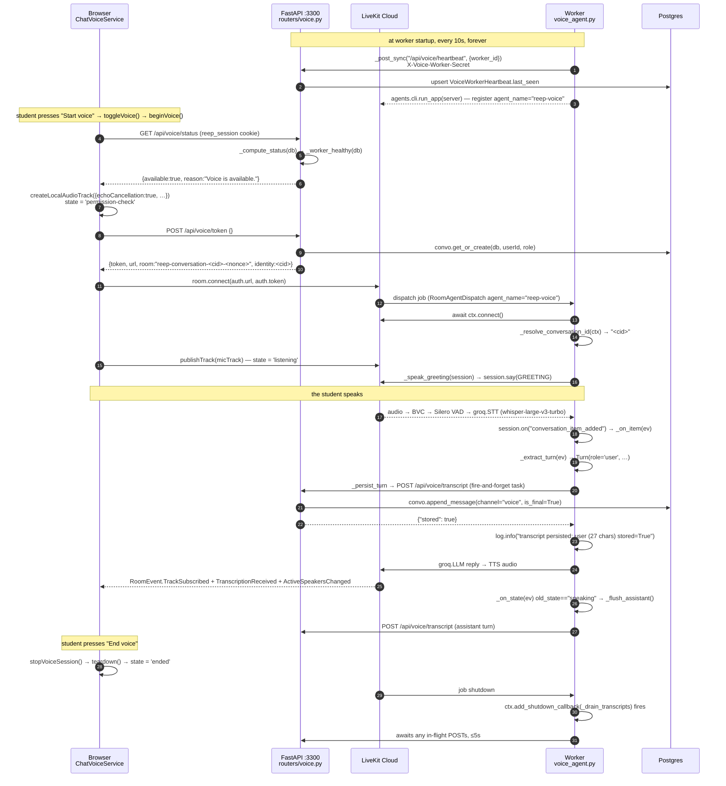
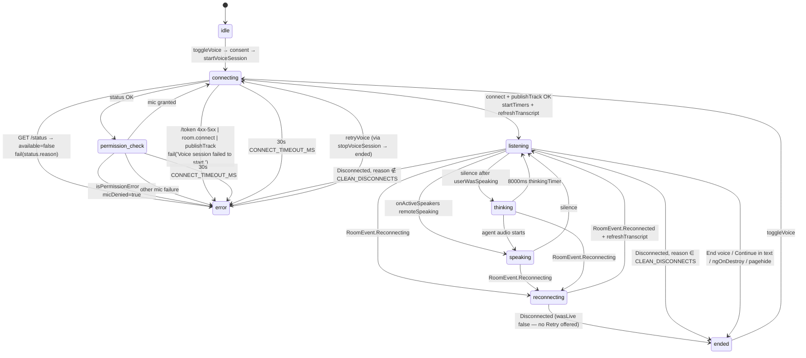

# Chapter 11 — The Voice Assistant: The Fourth Process, the State Machine, and the Silent Failure

After this chapter you will be able to start a REEP voice call from cold, name every
process it touches and every credential that crosses each hop, read the worker's log and
tell "misconfigured" from "server down" from "working perfectly", explain why a call can
sound flawless and leave the `messages` table empty, prove with one SQL query whether
transcripts are landing, and change either half of the voice stack without breaking the
agreement the two halves depend on.

**In scope.** The voice worker process (`apps/api-py/voice_agent.py`, 883 lines), the
LiveKit cascade it drives, the browser client (`apps/web/src/app/core/chat-voice.service.ts`,
841 lines) and the assistant screen that hosts it — its consent dialog, its live panel
markup, and its state labels — the consent flow on both sides, the two state machines, the
transcript pipeline end to end, the heartbeat, and the five test suites.

**Deferred.** Chapter 1 §2 and §3 own the four-process topology, the `/ready` view of it,
and the argument for a separate venv — this chapter cites those and goes to mechanism.
Chapter 3 documents `voice_worker_heartbeats`, `conversations` and `messages` column by
column. Chapter 7 §6 owns every `/api/voice/*` endpoint as an HTTP contract, including
the full status-code matrix; here the endpoints appear only as the far end of a wire.
Chapter 8 established that the voice channel never passes through Rule 1's egress gate —
that finding is built on, not re-derived. Chapter 9 owns the conversation model, the
`channel` enum and what the runbook query means about conversation state. Chapter 12 owns
the Angular bootstrap, routing and core-service conventions the voice client follows.

---

## 1. The four-party topology, concretely

### What LiveKit is, before anything else

Everything in this chapter sits on top of one third-party service, and the rest of the
chapter is unreadable without knowing what it does.

**LiveKit Cloud is a hosted real-time audio service.** Participants join a named **room**
over WebRTC. Each participant **publishes** its microphone into the room as a **track**;
every other participant **subscribes** to the tracks it wants to hear. LiveKit is a
**Selective Forwarding Unit** — an SFU: it *relays* each participant's audio to the others
rather than mixing everything into one stream. Practically that means the browser sends
one audio stream up and receives one down, and LiveKit does the fan-out. Each participant
carries a string **identity** it chose when it joined; REEP sets that identity to the
conversation id, which is how the worker later works out which Postgres row to write to.

The part that surprises people is where REEP's own voice logic lives. It is **not** a
service the FastAPI process calls. `voice_agent.py` is itself a **participant** — an
**agent** — that LiveKit places into the room. The worker connects to LiveKit once at
startup and waits; when a room needs it, LiveKit hands it a **job** (a **dispatch**), the
worker forks a process for that job, and that process joins the room like any other
participant, subscribes to the student's audio, and publishes synthesised speech back.

Two consequences follow immediately and shape every failure mode below:

- **The audio never touches FastAPI.** The API's whole involvement in a call is signing
  one JWT that authorises the join and asks for the agent by name. After that it is out of
  the loop until the worker POSTs a transcript back to it over ordinary HTTP.
- **The API and LiveKit Cloud never speak to each other.** There is no server-to-server
  channel. Whatever the API wants to happen in the room, it has to have written into that
  ten-minute token.

### The four parties

Four parties are involved in one voice call, and each hop is authenticated differently:
browser→API by the httpOnly `reep_session` cookie; browser→LiveKit and worker→LiveKit by
tokens derived from `LIVEKIT_API_KEY` / `LIVEKIT_API_SECRET`
([voice.py:283](apps/api-py/app/routers/voice.py#L283)); worker→API by the shared
`VOICE_WORKER_SECRET`, presented as the `X-Voice-Worker-Secret` header
([voice_agent.py:225-226](apps/api-py/voice_agent.py#L225)). Two of those are secrets
deliberately held on **both** ends — which is why a *mismatch*, not a leak, is the failure
§7 opens with.

| Party | Process | What it holds | What it talks to |
|---|---|---|---|
| Browser | Angular SPA on `:4200` (dev, proxied) | the httpOnly `reep_session` cookie | the API (same-origin `/api`), LiveKit Cloud (WebRTC) |
| API | FastAPI on `:3300` | `AUTH_SECRET`, `LIVEKIT_API_KEY`/`SECRET`, `VOICE_WORKER_SECRET`, Postgres | Postgres; nothing outbound for voice |
| LiveKit Cloud | hosted SFU at `LIVEKIT_URL` | validates the JWT the API signed | browser and worker |
| Worker | `voice_agent.py` in `.venv-voice` on Python 3.12 | `LIVEKIT_*`, `GROQ_API_KEY`, `VOICE_WORKER_SECRET` | LiveKit Cloud (job registration + media), the API over plain HTTP |

The API's only influence over the room is what it signed into that JWT. That is worth
holding on to, because it explains most of the failure modes later in this chapter: once
the token is minted, the API is out of the loop until the worker POSTs something back.

Three facts set the order of operations.

**The worker registers with LiveKit at startup, not per call.** `agents.cli.run_app(server)`
([voice_agent.py:883](apps/api-py/voice_agent.py#L883)) connects the worker to LiveKit and
waits for jobs. It registers under a *named* agent, `reep-voice`:

```python
@server.rtc_session(agent_name="reep-voice")
async def entrypoint(ctx: JobContext) -> None:
```
— [voice_agent.py:626-627](apps/api-py/voice_agent.py#L626)

**A named agent opts out of automatic dispatch.** An *unnamed* agent worker is dropped into
every room on the project automatically. Giving it a name turns that off: LiveKit will not
put a named agent into a room unless the room's configuration asks for it by that exact
name, so the API has to request it explicitly when it mints the token:

```python
.with_room_config(
    api.RoomConfiguration(
        agents=[api.RoomAgentDispatch(agent_name=VOICE_AGENT_NAME)]
    )
)
```
— [voice.py:307-311](apps/api-py/app/routers/voice.py#L307), with `VOICE_AGENT_NAME = "reep-voice"`
at [voice.py:58](apps/api-py/app/routers/voice.py#L58).

> **Why it is like this.** The comment above that constant records what happens when the
> two names drift: *"Without this the student joins, the worker sits idle with no job, and
> the call is silence with no error anywhere"* ([voice.py:53-57](apps/api-py/app/routers/voice.py#L53)).
> The token mints, the room opens, the microphone publishes, and both processes report
> themselves healthy. That is why the name is compile-time on both sides, why
> `.env.example` explicitly forbids making it an environment variable
> ([.env.example:97-101](apps/api-py/.env.example#L97)), and why a test asserts the two
> literals are equal (§10).

**The room name carries the conversation id, and a fresh nonce.**

```python
room = f"reep-conversation-{conversation.id}-{uuid.uuid4().hex[:8]}"
```
— [voice.py:280](apps/api-py/app/routers/voice.py#L280)

The nonce is not decoration. LiveKit applies a token's `RoomConfiguration` only when the
room is first *created*, and a room lingers after the last participant leaves
(`empty_timeout`, 300s by default). A stable per-conversation name would dispatch the
agent on the first call and silently drop it on any call that reused the still-live room
— *"an intermittent silent call that looks like a flaky provider"*
([voice.py:272-279](apps/api-py/app/routers/voice.py#L272)). The participant identity is
the bare conversation id (`.with_identity(conversation.id)`,
[voice.py:286](apps/api-py/app/routers/voice.py#L286)), so the conversation is still
resolvable either way.

### One complete call, button press to transcript row



Two arrows in that diagram deserve their names said out loud, because everything in §7
turns on them. The transcript POST is created as a task and never awaited by the event
handler; and the heartbeat runs on a thread that knows nothing about any call.

---

## 2. Why the worker is a separate process, and how it bootstraps

### The version constraint

AGENTS.md and `requirements-voice.txt` both pin the worker to a **Python 3.12** venv,
separate from the API's. The reason usually given is the `livekit-agents` Python floor and
ceiling, and it is worth being precise about it because the chapter's own §10 argument
rests on the consequence.

`livekit-agents` 1.6.10 declares `Requires-Python: <3.15,>=3.10`
(`.venv-voice/Lib/site-packages/livekit_agents-1.6.10.dist-info/METADATA`, line 23), and
the API's venv is Python 3.14.7 — which **formally satisfies** that specifier. So `<3.15`
is not by itself the reason a 3.12 venv is required. Nor does any other installed package
declare a ceiling: sweeping every `dist-info/METADATA` in `.venv-voice` turns up no
`Requires-Python` upper bound other than `livekit-agents`' own. The practical blocker is
almost certainly the transitive binary wheel set — `onnxruntime` (which Silero needs), `av`
and `numpy` all ship compiled wheels per interpreter ABI — but **I could not establish from
anything in this repo which dependency actually imposes the ceiling.** It is flagged again
in "Where this chapter is uncertain".

`requirements-voice.txt` opens by naming the split and the exact commands
([requirements-voice.txt:1-5](apps/api-py/requirements-voice.txt#L1)). Chapter 1 §3
develops the argument — heavy ML imports, a ~2 GB resident import set, and a different
interpreter — so it is not repeated here.

What is certain at runtime, and what actually matters, is the consequence: **the API test
suite runs on an interpreter that cannot import the worker.** That constraint shapes the
tests in §10 and is the reason one of them reads the worker's source as text instead of
running it.

### Reading the API's `.env` without importing the API's config

The worker must agree with the API on `LIVEKIT_URL`, `LIVEKIT_API_KEY`,
`LIVEKIT_API_SECRET`, `GROQ_API_KEY` and `VOICE_WORKER_SECRET`. It cannot import
`app.config` — that would pull SQLAlchemy and pydantic-settings into a process that is
forbidden to hold a database connection. So it reads the same file with the standard
library and nothing else:

```python
env_path = Path(__file__).resolve().parent / ".env"
try:
    text = env_path.read_text(encoding="utf-8")
except OSError:
    return  # no .env — rely entirely on the real environment
for line in text.splitlines():
    line = line.strip()
    if not line or line.startswith("#") or "=" not in line:
        continue
    key, _, value = line.partition("=")
    # Values may be bare or quoted (the file is shared with pydantic-settings).
    os.environ.setdefault(key.strip(), value.strip().strip('"').strip("'"))
```
— [voice_agent.py:100-111](apps/api-py/voice_agent.py#L100), called unconditionally at
import time at [voice_agent.py:114](apps/api-py/voice_agent.py#L114).

Three deliberate choices are packed into eleven lines. The path is pinned to
`Path(__file__).resolve().parent`, not the process CWD — *"a bare `.env` resolves against
the process CWD and would pick up the wrong file when the worker is started from the repo
root"* ([voice_agent.py:96-98](apps/api-py/voice_agent.py#L96)), the same reasoning
`app/config.py` uses (Chapter 1 §5). A missing file is not an error: the worker falls back
entirely to the real environment, which is how a container run works. And it is
`setdefault`, never assignment, so **a real environment variable always wins over the
file** — which is what makes `REEP_API_URL=http://api:3300 python voice_agent.py start`
work inside a container whose image bakes in a developer's `.env`.

### Every variable the worker reads by name

`voice_agent.py` calls `os.getenv` exactly eight times, at lines 127, 128, 129, 136, 142,
145, 147 and 151. This is the complete list:

| Env var | Constant | Default | Effect |
|---|---|---|---|
| `VOICE_TTS` | `VOICE_TTS` | `"edge"` | `"groq"` selects `groq.TTS`; anything else selects the in-file `EdgeTTS`. Normalised with `.strip().lower()` ([voice_agent.py:127](apps/api-py/voice_agent.py#L127)), so `VOICE_TTS="GROQ "` still selects Groq |
| `GROQ_TTS_MODEL` | `GROQ_TTS_MODEL` | `"canopylabs/orpheus-v1-english"` | Groq TTS model |
| `GROQ_TTS_VOICE` | `GROQ_TTS_VOICE` | `"autumn"` | Groq TTS voice |
| `EDGE_TTS_VOICE` | `EDGE_TTS_VOICE` | `"en-IN-PrabhatNeural"` | Edge TTS voice |
| `REEP_API_URL` | `API_BASE` | `"http://localhost:3300"` | where every POST goes; `.rstrip("/")` applied |
| `VOICE_WORKER_SECRET` | `WORKER_SECRET` | `""` | sent as `X-Voice-Worker-Secret`, **only when non-empty** |
| `VOICE_WORKER_ID` | `WORKER_ID` | `f"voice-agent-{uuid.uuid4().hex[:8]}"` | the heartbeat row's **unique `worker_id` column** — *not* the table's primary key, which is a separately generated `id` the worker never sees ([voice_worker.py:26-28](apps/api-py/app/models/voice_worker.py#L26)). Note the `or` form, `os.getenv("VOICE_WORKER_ID") or …` ([voice_agent.py:147](apps/api-py/voice_agent.py#L147)), so a **blank** value falls back to the random id too — a bare default argument would not |
| `VOICE_HEARTBEAT_INTERVAL_SECONDS` | `HEARTBEAT_INTERVAL_SECONDS` | `10` | seconds between beats |

— [voice_agent.py:127-151](apps/api-py/voice_agent.py#L127).

That `worker_id`-versus-`id` distinction is load-bearing later: the upsert in
`voice_heartbeat` selects on `worker_id`
([voice.py:134-138](apps/api-py/app/routers/voice.py#L134)), and the table's own primary
key is irrelevant to it.

Note what is *absent from those eight calls*: `GROQ_API_KEY`, `LIVEKIT_URL`,
`LIVEKIT_API_KEY` and `LIVEKIT_API_SECRET`. All four are **named** in the module docstring
([voice_agent.py:28-29](apps/api-py/voice_agent.py#L28)), and `GROQ_API_KEY` again in a
comment at [voice_agent.py:118](apps/api-py/voice_agent.py#L118) — so a grep finds them —
but the worker's own code never *reads* any of them. `_load_env_file()` puts them into
`os.environ`; the `livekit-plugins-groq` plugin and the LiveKit CLI read them from there
themselves. That is why a missing Groq key produces an SDK error rather than a REEP one.

Two fragilities follow from `int(...)` running at import. A non-numeric
`VOICE_HEARTBEAT_INTERVAL_SECONDS` raises `ValueError` during import and the worker never
starts; a value of `0` makes the inner wait loop's condition (`waited < 0`) false
immediately and turns the beat into an unthrottled POST loop. Neither is guarded.

**Four of the eight are undocumented in `.env.example`**: `VOICE_HEARTBEAT_INTERVAL_SECONDS`,
`GROQ_TTS_MODEL`, `GROQ_TTS_VOICE` and `EDGE_TTS_VOICE`. The file's voice block
([.env.example:67-101](apps/api-py/.env.example#L67)) documents `VOICE_TTS`,
`VOICE_WORKER_SECRET`, `VOICE_MAINTENANCE_MESSAGE`, and — commented out, under a header
that marks them as worker-only — `REEP_API_URL` and `VOICE_WORKER_ID`, and stops there. An
operator who wants a different Edge voice or a faster heartbeat has to read the worker's
source to learn the names.

### Database-free by construction

The worker holds no database session, imports nothing from `app/`, and carries no HTTP
client dependency. `requirements-voice.txt` closes by saying so and explaining the
absence: *"No HTTP client is listed: the worker talks to the FastAPI server with stdlib
urllib only (POST /api/voice/transcript + /api/voice/heartbeat), so it carries no DB deps
and no extra HTTP dependency"* ([requirements-voice.txt:62-64](apps/api-py/requirements-voice.txt#L62)).

This is not tidiness. It is the enforcement point for Rule 1 on the voice path, and §10
shows the test that keeps it true.

---

## 3. The cascade: four stages, three vendors

This is **not** native speech-to-speech. The module docstring draws the pipeline
explicitly ([voice_agent.py:7-15](apps/api-py/voice_agent.py#L7)):

```
student audio
  -> LiveKit BVC noise cancellation   (strips the agent's own echo)
  -> Silero VAD                       (local, decides when they stopped)
  -> Groq Whisper  whisper-large-v3-turbo      (speech -> text)
  -> Groq Llama    llama-3.3-70b-versatile     (text -> reply)
  -> Edge TTS (default) or Groq TTS   (reply -> speech)
-> student hears it
```

"VAD" is *voice activity detection*: a small local model that listens to the raw audio and
decides, moment to moment, whether someone is speaking. It is what tells the SDK the
student has stopped — which is the hinge the whole of the next section turns on.

Gemini Live was the original design and is gone: *"this Google project is denied access to
the Live API (WebSocket close 1008, 'project has been denied access'), confirmed by
connecting to Google directly with LiveKit out of the path"*
([voice_agent.py:17-20](apps/api-py/voice_agent.py#L17)). **`GEMINI_API_KEY` is not
required for voice.** One stale string survives in the client: `beginVoice()`'s fallback
message still reads *"Voice is not available yet — it needs LiveKit + Gemini credentials in
the backend."*
([assistant.component.ts:425](apps/web/src/app/features/assistant/assistant.component.ts#L425)).
It is only reached when `startVoiceSession()` throws *without* having set `voiceError`
([assistant.component.ts:421](apps/web/src/app/features/assistant/assistant.component.ts#L421)),
which the service almost always does set, so students rarely see it — but it names a
provider the cascade no longer uses, and it should go.

| Stage | Constant / call | Value | Where |
|---|---|---|---|
| Noise cancellation | `noise_cancellation.BVC()` | server-side, LiveKit | [voice_agent.py:861](apps/api-py/voice_agent.py#L861) |
| Turn detection | `_get_vad()` → `silero.VAD.load()` | local, no key | [voice_agent.py:617-623](apps/api-py/voice_agent.py#L617) |
| STT | `GROQ_STT_MODEL` | `"whisper-large-v3-turbo"` | [voice_agent.py:120](apps/api-py/voice_agent.py#L120) |
| LLM | `GROQ_LLM_MODEL` | `"llama-3.3-70b-versatile"`, `temperature=0.6`, `max_completion_tokens=220` | [voice_agent.py:121](apps/api-py/voice_agent.py#L121), [:686](apps/api-py/voice_agent.py#L686) |
| TTS (default) | `EDGE_TTS_VOICE` | `"en-IN-PrabhatNeural"` | [voice_agent.py:136](apps/api-py/voice_agent.py#L136) |
| TTS (default) sample rate | `EDGE_TTS_SAMPLE_RATE` | `24000` — edge-tts returns MPEG at 24 kHz mono and the emitter is told the same | [voice_agent.py:138](apps/api-py/voice_agent.py#L138), used at [:487](apps/api-py/voice_agent.py#L487) and [:520](apps/api-py/voice_agent.py#L520) |
| TTS (opt-in) | `GROQ_TTS_MODEL` / `GROQ_TTS_VOICE` | `"canopylabs/orpheus-v1-english"` / `"autumn"` | [voice_agent.py:128-129](apps/api-py/voice_agent.py#L128) |

Silero is loaded **once per process**, not per session, behind a lazy getter guarding the
`_VAD` global: *"Loading it inside the session added model-load time to every student's
first turn, and a worker handling concurrent calls paid it repeatedly for an identical
read-only model"* ([voice_agent.py:611-613](apps/api-py/voice_agent.py#L611)). "Lazy"
matters operationally — see §11: the load line does not appear at boot.

The Edge voice was chosen for latency as much as accent, and the measurements are in the
file: *"time-to-first-audio on this machine: Prabhat 0.75s, Neerja 1.30s, en-GB-Sonia
2.08s… a slower voice also starves the audio emitter mid-sentence — which is what 'the
voice keeps breaking' actually sounds like"* ([voice_agent.py:130-135](apps/api-py/voice_agent.py#L130)).
`edge-tts` has no official LiveKit plugin, so `EdgeTTS` / `EdgeChunkedStream`
([voice_agent.py:468-531](apps/api-py/voice_agent.py#L468)) implement the SDK's two-class
contract by hand. It is the default because it needs no account; both
`requirements-voice.txt` and `.env.example` warn it is an unofficial endpoint with no SLA
and no privacy terms that must not ship to students.

The reply cap has its own justification: *"A long answer is bad twice over in voice: the
student waits through synthesis they did not ask for, and the emitter is more likely to
starve part-way and stutter. The prompt asks for brevity; this enforces it even when the
model gets carried away"* ([voice_agent.py:682-685](apps/api-py/voice_agent.py#L682)).

### Endpointing: the 1.5-second wait, and the failure it prevents

"Endpointing" is the SDK deciding that a turn is over and *committing* it — freezing the
text and handing it to the LLM. This is the single most important configuration value in
the file. Quoted byte for byte from [voice_agent.py:688-697](apps/api-py/voice_agent.py#L688):

```python
        # Endpointing must outwait the STT round-trip. Whisper here is a NETWORK
        # call to Groq, not a local model, so the default min_delay of 0.5s
        # commits the turn before the transcript comes back — the SDK then logs
        # "transcript arrives after turn has been committed" and DISCARDS it.
        # The user's words vanish, no LLM call is made, and the agent answers
        # with silence: a total failure that looks like a dead microphone.
        # 1.5s comfortably covers the round-trip at the cost of a slightly
        # longer pause before the reply.
        turn_handling={
            "endpointing": {"min_delay": 1.5, "max_delay": 6.0},
```

`min_delay: 1.5` is the **floor**: how long the SDK waits after VAD reports silence before
committing. `max_delay: 6.0` is the matching **ceiling**: however long the transcript takes
to arrive, the SDK commits after six seconds rather than waiting forever, so a hung STT
call degrades into a late reply instead of a call that never answers at all.

The chain, step by step: Silero decides the student has stopped → the SDK waits
`min_delay` and then *commits* the turn → the Groq Whisper HTTP response arrives after
that → the SDK sees a transcript for an already-committed turn, logs it and throws it
away → no user text enters the chat context → no LLM call is made → nothing is spoken.
To the student, a working microphone, a connected room and a listening indicator produce
absolute silence. The root cause is named once more in the module docstring: *"Groq
Whisper is a BATCH call — it does not stream and carries no word alignment, which is why
endpointing must wait ~1.5s and why adaptive interruption is unavailable"*
([voice_agent.py:22-25](apps/api-py/voice_agent.py#L22)).

### Interruption: five keys, each a scar

```python
            "interruption": {
                "mode": "vad",
                "min_duration": 0.8,
                "resume_false_interruption": True,
                "false_interruption_timeout": 2.0,
                # …  (an eight-line comment, quoted in the callout below)
                "discard_audio_if_uninterruptible": False,
            },
```
— [voice_agent.py:723-737](apps/api-py/voice_agent.py#L723); the `# …` marks the comment
at [voice_agent.py:728-735](apps/api-py/voice_agent.py#L728), elided here and quoted in
full two paragraphs down.

"Interruption" here means barge-in: the student starts talking while the agent is
mid-sentence, and the SDK stops the agent so the student is heard. Each of the five keys
tunes when that is allowed to happen.

| Key | Value | What it does |
|---|---|---|
| `mode` | `"vad"` | decide barge-in from raw voice activity. The alternative, `"adaptive"`, decides from streaming transcript text — and is unavailable here (below) |
| `min_duration` | `0.8` | speech must last at least 0.8 s before it counts as an interruption. A cough, a chair scrape or a single syllable of feedback is under the bar and is ignored |
| `resume_false_interruption` | `True` | if an "interruption" turns out to have produced no words, pick the abandoned sentence back up instead of leaving the answer half-spoken |
| `false_interruption_timeout` | `2.0` | how long the SDK waits for words to arrive before concluding the interruption was false. Two seconds of no transcript after the barge-in ⇒ resume |
| `discard_audio_if_uninterruptible` | `False` | while the agent is speaking *uninterruptibly*, keep buffering the student's audio rather than throwing it away |

> **Why it is like this.** *"Why the agent kept breaking off mid-sentence: any detected
> speech counted as the student barging in, and on laptop speakers the loudest thing the
> microphone hears IS the agent. It interrupted itself. Coughs, chair scrapes and lab
> chatter did the same."* ([voice_agent.py:698-701](apps/api-py/voice_agent.py#L698))

Two of LiveKit's recommended mitigations are deliberately **absent**, and the reason is
the same in both cases. `mode` must be `"vad"`, never `"adaptive"`: adaptive interruption
gatekeeps by holding and flushing *streaming* transcripts, so the SDK requires
`stt.capabilities.streaming` **and** `aligned_transcript`, and Groq Whisper has neither.
Asking for adaptive logs *"interruption_detection … will be disabled"* and silently drops
the entire detector — *"which is how the first version of this fix shipped inert"*
([voice_agent.py:710-716](apps/api-py/voice_agent.py#L710)). `min_words` — described in
the same comment as *"the single most effective filter"* — is STT-gated the same way and
*"is omitted rather than left in as decoration"*
([voice_agent.py:718-719](apps/api-py/voice_agent.py#L718)). What actually protects
against self-interruption is named explicitly: `min_duration`,
`resume_false_interruption`, server-side BVC, and the browser's own echo cancellation.

`discard_audio_if_uninterruptible: False` gets its own paragraph, and it contradicts
LiveKit's general advice on purpose:

> **Why it is like this.** *"MUST be False here. LiveKit recommends True to stop buffered
> noise replaying at the agent, but the opening greeting is deliberately uninterruptible —
> so True silently DISCARDS everything the student says over it. Observed: a full spoken
> question arrived as 'at Foundations.' because the first three seconds were dropped under
> the greeting. Buffering instead costs a little stale audio; discarding costs the
> student's opening words and makes them repeat themselves."*
> ([voice_agent.py:728-735](apps/api-py/voice_agent.py#L728))

That coupling is real: the greeting is spoken with `allow_interruptions=False`
([voice_agent.py:563](apps/api-py/voice_agent.py#L563)), so changing one of these two
settings without the other reintroduces the bug.

### The greeting is verified, not just spoken

`_speak_greeting` ([voice_agent.py:544-580](apps/api-py/voice_agent.py#L544)) uses
`session.say(GREETING, allow_interruptions=False, add_to_chat_ctx=True)` rather than
`generate_reply()`, because *"an LLM asked to 'greet with Jai Shri Gurudev' will eventually
paraphrase, translate or skip it"*. It then awaits `handle.wait_for_playout()` and
**inspects the handle afterwards**, because *"A TTS failure inside the SDK's speech task is
caught by its own `@log_exceptions` decorator and the handle still resolves, so a bare
`await session.say(...)` returns cleanly having played NOTHING"*
([voice_agent.py:553-559](apps/api-py/voice_agent.py#L553)). Failures shout:
`log.exception("GREETING FAILED — the student heard no opening greeting")`,
`log.error("GREETING FAILED during playout: %r", exc)`, and
`log.error("GREETING was interrupted despite allow_interruptions=False")`
([voice_agent.py:576](apps/api-py/voice_agent.py#L576)) for the case that should be
unreachable.

No "you already greeted" instruction is added to the prompt, and the reason is a small
lesson in honesty: `say(add_to_chat_ctx=True)` appends the greeting to the chat context
*only when the speech actually produced text*, so *"Asserting it in the prompt instead
would lie to the model exactly when the greeting was missed, which is the one case that
needs recovering"* ([voice_agent.py:866-873](apps/api-py/voice_agent.py#L866)).

---

## 4. The agent's instructions — the actual privacy control

`BASE_INSTRUCTIONS` is one string constant, quoted here in full
([voice_agent.py:167-191](apps/api-py/voice_agent.py#L167)):

```python
BASE_INSTRUCTIONS = (
    "You are a helpful voice assistant. You are speaking with a student at "
    "BGS College of Engineering and Technology through the REEP dashboard, but "
    "you are a general assistant — answer whatever they ask, on any topic, "
    "exactly as a knowledgeable friend would. Do not deflect a question just "
    "because it is unrelated to college, placements or careers.\n"
    "\n"
    "You are SPEAKING, not writing. Keep replies short — usually one to three "
    "sentences. Use plain spoken language: no markdown, no bullet points, no "
    "headings, no emoji, no code blocks. Say numbers and dates the way a person "
    "would say them out loud. If something genuinely needs a long answer, give "
    "the short version first and offer to go deeper.\n"
    "\n"
    "Be direct and natural. Skip filler like 'That's a great question'. Ask a "
    "brief clarifying question when the request is ambiguous rather than "
    "guessing at length.\n"
    "\n"
    "You cannot see this student's marks, attendance, CGPA or any other record "
    "from their dashboard — those are not available to you. If they ask about "
    "their own figures, say plainly that you cannot see them here and point "
    "them to their records page or their mentor. Never invent them.\n"
    "\n"
    "This community greets with 'Jai Shri Gurudev'. If the student greets you "
    "with it, return the greeting warmly rather than treating it as a question."
)
```

**Paragraph 1 — general, not a placement bot.** The comment above the constant makes this
a scope decision rather than a personality one: *"A GENERAL assistant that happens to live
inside REEP — not a placement-only bot"*
([voice_agent.py:158-159](apps/api-py/voice_agent.py#L158)). Deflecting off-topic
questions was a worse experience without buying any safety, for the reason paragraph 4
makes structural.

**Paragraph 2 — spoken, not written.** Everything the text assistant may emit — markdown,
bullets, headings, code fences — is nonsense when read aloud by a TTS. "Say numbers and
dates the way a person would say them out loud" is aimed at the same target. The brevity
request is *asked* here and *enforced* in code by `max_completion_tokens=220`
([voice_agent.py:686](apps/api-py/voice_agent.py#L686)): the prompt sets the intent, the
parameter bounds the damage when the model ignores it.

**Paragraph 3 — no filler, clarify rather than guess.** A voice turn costs the student
real seconds; "That's a great question" is dead air.

**Paragraph 4 — the refusal to claim access.** This is the paragraph that matters most,
and Chapter 8's finding is the reason. The voice path builds its model directly from the
LiveKit plugin — `groq.STT(model=GROQ_STT_MODEL)` at
[voice_agent.py:681](apps/api-py/voice_agent.py#L681) and
`groq.LLM(model=GROQ_LLM_MODEL, …)` at [voice_agent.py:686](apps/api-py/voice_agent.py#L686)
— so it never calls `complete_chat`, never resolves `llm_config()`, and never consults
`student_data_egress_allowed`. **Voice sits outside Rule 1's enforcement mechanism
entirely.** That is not a live breach, and the file explains why in a comment that is the
clearest statement of the design in the repo:

> **Why it is like this.** *"The privacy guarantee is ARCHITECTURAL, not a matter of asking
> the model nicely: no student record is ever placed in this prompt, so there is nothing
> personal for the remote model to receive, memorise or leak. Widening what the assistant
> may TALK about therefore does not widen what REEP DISCLOSES. If a record-aware voice mode
> is ever added, that gate is the thing to reason about (AGENTS.md rule 1) — not this
> text."* ([voice_agent.py:161-166](apps/api-py/voice_agent.py#L161))

So paragraph 4 is not the security boundary — the empty prompt is. Paragraph 4 is what
stops the model *hallucinating* a CGPA when asked for one, which is a correctness problem
rather than a disclosure one. The two work together: nothing is in the prompt, and the
model is told so plainly enough that it says "I can't see that here" instead of inventing
a plausible number.

**Paragraph 5 — the community greeting.** `"Jai Shri Gurudev"` is a greeting at this
college, and without this paragraph the model treated it as a question to be answered. The
opening line is not left to the model at all:

```python
GREETING = "Jai Shri Gurudev! How can I help you today?"
```
— [voice_agent.py:196](apps/api-py/voice_agent.py#L196), *"a compulsory greeting must not
be paraphrased, translated or dropped because the model felt creative"*
([voice_agent.py:193-195](apps/api-py/voice_agent.py#L193)).

The entrypoint assigns the constant across with no modification whatsoever:

```python
    instructions = BASE_INSTRUCTIONS
```
— [voice_agent.py:645](apps/api-py/voice_agent.py#L645), consumed by
`agent = Agent(instructions=instructions)` at [voice_agent.py:843](apps/api-py/voice_agent.py#L843).

A test asserts on the *source text* that this stays true (§10). **If you take one rule
from this chapter, take this one: the moment anything concatenates or formats into that
prompt, a student record travels to Groq on a path with no gate in it.**

---

## 5. Consent: a disclosure, not a permission gate

### What the student agrees to

The disclosure is a modal on the assistant screen, shown before the first voice session
([assistant.component.html:39-80](apps/web/src/app/features/assistant/assistant.component.html#L39)).
Its body is three paragraphs, and each does a different job
([assistant.component.html:57-70](apps/web/src/app/features/assistant/assistant.component.html#L57)):

```html
        <p>
          Your speech is carried by <strong>LiveKit</strong> and transcribed and
          answered by <strong>Groq</strong>. Nothing from your student record —
          marks, attendance, USN — is sent to them.
        </p>
        <p class="consent__warn">
          Please don't share marks, attendance, medical information, passwords or other sensitive
          personal details by voice.
        </p>
        <p>
          Transcripts of the conversation are saved to your conversation and can be cleared any
          time with <strong>Clear conversation</strong>. For your own figures, open
          <a class="assist-note__link" routerLink="/student/records">your records</a>.
        </p>
```

**Paragraph 1 names the processors.** LiveKit carries the audio; Groq transcribes it and
writes the reply. It also states the architectural guarantee of §4: no record is in the
prompt, so no record reaches either.

**Paragraph 2 exists because of the gap paragraph 1 leaves.** Records do not reach Groq;
**the student's own speech does**, and if the student reads their marks aloud, those marks
reach Groq as audio and as a persisted transcript. Nothing gates that. The server's own
docstring says so: *"What DOES leave the machine is the student's speech and its
transcript — which this endpoint does not gate either"*
([voice.py:353-355](apps/api-py/app/routers/voice.py#L353)).

**Paragraph 3 is the only mention of persistence anywhere in the disclosure**, and it is
the one that ties this section to the rest of the chapter. It tells the student that what
they say is *stored* in the same conversation the text chat uses — which is the transcript
row §7 chases and the merged history §9 renders — and that **Clear conversation** removes
it. That last promise is not decoration either: clearing soft-deletes the conversation, and
the 404 handshake in §7 is precisely the mechanism that makes the promise true *during* a
live call, by refusing further writes and ending the call rather than quietly appending to
a thread the student believes they discarded. Chapter 9 owns the soft-delete itself.

The dialog is hand-rolled — `@angular/cdk` is not a dependency
([assistant.component.ts:162](apps/web/src/app/features/assistant/assistant.component.ts#L162))
— so its modality is implemented rather than merely declared. `role="dialog"`,
`aria-modal="true"`, `aria-labelledby`/`aria-describedby` on the wrapper; a `tabindex="-1"`
card that an `effect()` focuses when `showConsent()` flips
([assistant.component.ts:163-166](apps/web/src/app/features/assistant/assistant.component.ts#L163));
and `trapConsentTab` bound to both `(keydown.tab)` **and** `(keydown.shift.tab)`
([assistant.component.html:52-53](apps/web/src/app/features/assistant/assistant.component.html#L52)).
Cancelling returns focus to the control that opened the dialog rather than dropping it on
`<body>` ([assistant.component.ts:406-412](apps/web/src/app/features/assistant/assistant.component.ts#L406)).

> **Why it is like this.** *"Angular matches modifiers exactly, so `keydown.tab` does not
> fire when Shift is held — with only that binding, Shift+Tab from the first control walked
> straight out of the 'modal' dialog and back into the page behind it."*
> ([assistant.component.ts:173-176](apps/web/src/app/features/assistant/assistant.component.ts#L173))

### Where consent is recorded — two places, neither authoritative over the call

**Client cache.** `localStorage`, under a key that includes the user id:

```typescript
const CONSENT_KEY_PREFIX = 'reep-voice-consent:';
```
— [assistant.component.ts:51](apps/web/src/app/features/assistant/assistant.component.ts#L51),
read by `consentKey()` as `` `${CONSENT_KEY_PREFIX}${userId}` ``
([assistant.component.ts:371-374](apps/web/src/app/features/assistant/assistant.component.ts#L371)).

> **Why it is like this.** *"PER USER, not global. This was a single shared key, and REEP
> runs on shared lab PCs: once any one student accepted, every student who signed in on
> that machine afterwards had the disclosure silently suppressed and went straight into a
> live microphone session having never been shown what voice does with their audio."*
> ([assistant.component.ts:42-46](apps/web/src/app/features/assistant/assistant.component.ts#L42))

`hasConsent()` returns **false when there is no key at all** — no identified user means
show the disclosure, never inherit a previous student's acceptance — and false when
`localStorage` throws ([assistant.component.ts:376-386](apps/web/src/app/features/assistant/assistant.component.ts#L376)).
Both directions fail safe.

**Server record.** `POST /api/voice/consent` writes `conversation.consent_state` as the
literal `"voice"` or `"none"` and returns it
([voice.py:367-370](apps/api-py/app/routers/voice.py#L367)). Status codes: **200** with
`{consent_state}`; **403** `"Voice is a student feature."` for any non-STUDENT role
([voice.py:361-365](apps/api-py/app/routers/voice.py#L361)); **401** unauthenticated, via
`get_current_session` — pinned by `test_consent_requires_auth`
([test_voice.py:86-89](apps/api-py/tests/test_voice.py#L86)).

### What refuses to start without consent: nothing

This is the finding a reader must not miss, and the code says it in capitals:

> ⚠️ **NOT AN ENFORCED RUNTIME CONTROL — do not read it as one.**
>
> *"This writes consent_state ('voice' | 'none') and nothing else consumes it. The voice
> worker never fetches it: it runs the SAME general prompt either way, and revoking
> mid-call changes nothing. It is scaffolding for a record-aware voice mode that does not
> exist yet."* ([voice.py:344-349](apps/api-py/app/routers/voice.py#L344))

The worker agrees, from the other side: *"This worker defaults to GENERAL guidance and does
NOT pull the student's records into the prompt. (When a record-aware prompt is added later,
gate it on a server check of consent_state before seeding any student data here.)"*
([voice_agent.py:640-644](apps/api-py/voice_agent.py#L640)).

The client behaves consistently with that. `acceptConsent()` closes the panel, POSTs
consent, caches it — and if the server write **fails, it starts the call anyway**:

```typescript
    } catch {
      /* backend consent write failed — proceed; general voice needs no consent */
    }
    await this.beginVoice();
```
— [assistant.component.ts:399-402](apps/web/src/app/features/assistant/assistant.component.ts#L399)

What *does* refuse to start a call is readiness, not consent: `GET /api/voice/status`
returning `available: false`, which the client checks before it touches the microphone
(§9). Treat the consent panel as a disclosure notice with an audit trail, and read
`consent_state` as a TODO with a database column.

---

## 6. Two state machines, and who is in charge

### The client's nine states

`VoiceState` is a string union, documented state by state in the file
([chat-voice.service.ts:66-88](apps/web/src/app/core/chat-voice.service.ts#L66)):

| State | Panel status text | Button label | Visual |
|---|---|---|---|
| `idle` | *(panel closed)* | `Start voice` | grey `.voice__dot` |
| `permission-check` | Waiting for microphone permission | `Allow mic…` **(disabled)** | grey, no animation |
| `connecting` | Connecting to voice | `Connecting…` **(disabled)** | grey, no animation |
| `listening` | Listening | `Stop voice` | green, `pulse 1.4s` |
| `thinking` | Thinking | `Stop voice` | amber, `pulse 1s` |
| `speaking` | Assistant speaking | `Stop voice` | navy, no animation of its own; the `pulse 0.9s` comes from `.vpanel__pulse--live`, bound to `audioPlaying()` |
| `reconnecting` | Reconnecting | `Reconnecting…` (clickable) | amber, `pulse 0.7s` |
| `ended` | *(panel closed)* | `Start voice` | — |
| `error` | the `voiceError()` text, or `'Voice error'` when it is null ([assistant.component.ts:225](apps/web/src/app/features/assistant/assistant.component.ts#L225)) | `Start voice` | red, static; Retry appears |

Strings from `describe()` ([assistant.component.ts:208-229](apps/web/src/app/features/assistant/assistant.component.ts#L208));
labels from `voiceLabel()` ([assistant.component.ts:111-126](apps/web/src/app/features/assistant/assistant.component.ts#L111));
the button is disabled only in `connecting` and `permission-check`
([assistant.component.html:19](apps/web/src/app/features/assistant/assistant.component.html#L19));
colours from the `[data-state]` selectors at
[assistant.component.scss:170-191](apps/web/src/app/features/assistant/assistant.component.scss#L170),
which open with the comment `/* Colour + text together — never colour alone. */` at
[:170](apps/web/src/app/features/assistant/assistant.component.scss#L170) — the house rule
from AGENTS.md, honoured here.

**Three of `describe()`'s nine strings are unreachable.** The panel renders under
`@if (voicePanelOpen())` ([assistant.component.html:83](apps/web/src/app/features/assistant/assistant.component.html#L83)),
and `voicePanelOpen()` is `voiceActive() || voice() === 'error'`
([assistant.component.ts:108](apps/web/src/app/features/assistant/assistant.component.ts#L108)),
which is false in both `idle` and `ended` — so `'Idle'` and `'Voice ended'` can never be
displayed. The third is the `?? 'Voice error'` fallback on the `error` branch: the *only*
writer of `voiceState.set('error')` in the whole service is `fail(reason: string)`
([chat-voice.service.ts:760-764](apps/web/src/app/core/chat-voice.service.ts#L760)), which
sets `voiceError` to a non-null string on the line above, and every call site passes a
literal. `voiceError` is cleared in exactly one place —
[chat-voice.service.ts:397](apps/web/src/app/core/chat-voice.service.ts#L397), at the top
of `startVoiceSession()`, by which point the state is `idle`/`ended`/`error` on its way to
`connecting`, never observed as `error` with a null reason. So the fallback is defensive
and, by reading, dead. It is worth keeping: it costs nothing and it is the difference
between a blank status line and a legible one if a future path ever sets `'error'`
directly.



Only three states count as a live call:

```typescript
const LIVE_STATES: ReadonlySet<VoiceState> = new Set<VoiceState>([
  'listening',
  'thinking',
  'speaking',
]);
```
— [chat-voice.service.ts:90-94](apps/web/src/app/core/chat-voice.service.ts#L90)

`reconnecting` is deliberately excluded, and that exclusion is load-bearing twice.
`onActiveSpeakers` early-returns outside the set
([chat-voice.service.ts:685](apps/web/src/app/core/chat-voice.service.ts#L685)), which is
what stops the "speaking" pulse animating for the whole outage — the `Reconnecting` handler
says exactly that ([chat-voice.service.ts:640-644](apps/web/src/app/core/chat-voice.service.ts#L640)).
And `onDisconnected` uses it to decide whether a drop was mid-call
([chat-voice.service.ts:731](apps/web/src/app/core/chat-voice.service.ts#L731)).

**It has a third consequence, and this one is not intended.** A reconnect that never
succeeds arrives as `Disconnected` while the state is still `reconnecting`. `wasLive` is
therefore `false`, the `if` on line 734 does not fire, and the `else` branch sets `'ended'`
([chat-voice.service.ts:734-738](apps/web/src/app/core/chat-voice.service.ts#L734)): no
`voiceError`, no Retry button, panel closed. That is verbatim the experience the comment
directly above says was fixed — *"A student whose connection dropped mid-answer saw a call
that had apparently just ended normally, with no way to tell the difference and nothing to
press"* ([chat-voice.service.ts:724-728](apps/web/src/app/core/chat-voice.service.ts#L724))
— still reachable through the one state the fix does not cover. Derived by reading the
code; not observed in a browser. §10 records it alongside the other untested paths.

### The worker's states

The worker has no `VoiceState` enum; its state machine is the process lifecycle, and it is
worth naming because half of it runs when there is no call at all.

| Phase | Trigger | Observable effect |
|---|---|---|
| Booting | module import | `_load_env_file()`, constants, `AgentServer(...)` |
| Beating / idle | `_start_heartbeat_thread(server)` then `agents.cli.run_app(server)` | **one** `voice_worker_heartbeats` row per `WORKER_ID`, created on the first beat and thereafter upserted — `last_seen` refreshed every 10s, never a new row ([voice.py:134-143](apps/api-py/app/routers/voice.py#L134)); `/api/voice/status` reports available |
| Job accepted | LiveKit dispatch | a job process forks; `entrypoint(ctx)` runs |
| Connected | `await ctx.connect()` | `ctx.room.name` populated; `_resolve_conversation_id(ctx)` |
| Running | `session.start(...)` then `_speak_greeting(session)` | `_get_vad()` loads Silero on the first session; events fire; transcript POSTs are created |
| Conversation gone | any POST returns 404 | `_end_call_conversation_gone()` → `ctx.room.disconnect()` |
| Shutting down | job teardown | `_drain_transcripts` shutdown callback, ≤5s |
| Draining | SIGTERM → `server.draining` becomes true | beat loop exits, one `draining: true` POST deletes the row |

The one SDK state the worker actually reads is the agent's speaking state, and it reads
exactly one transition:

```python
    @session.on("agent_state_changed")
    def _on_state(ev: Any) -> None:
        # Leaving "speaking" means the utterance is complete and its text is
        # final. Flush the held assistant item now.
        if getattr(ev, "old_state", None) == "speaking":
            _flush_assistant()
```
— [voice_agent.py:801-806](apps/api-py/voice_agent.py#L801)

### Where authority lives, and what happens when the halves diverge

The two machines are not peers, and they are not synchronised. There is no message on any
wire that says "the worker is now in state X". The division is:

- **LiveKit is authoritative for transport.** Every client transition out of a live state
  is driven by a `RoomEvent`, never inferred: `Reconnecting`, `Reconnected`, `Disconnected`
  with its `reason` ([chat-voice.service.ts:638-654](apps/web/src/app/core/chat-voice.service.ts#L638)).
  The comment on `onDisconnected` is explicit about preferring the transport's opinion to a
  local guess: *"LiveKit tells us WHY, so use it rather than inferring from local state"*
  ([chat-voice.service.ts:730](apps/web/src/app/core/chat-voice.service.ts#L730)).
- **The server is authoritative for whether a call may begin**, via `_compute_status` —
  provider config, heartbeat freshness, and the maintenance kill switch.
- **The client is authoritative for its own UI**, and its speaking/listening/thinking
  distinction is derived purely from `ActiveSpeakersChanged` audio activity. Subscription
  is explicitly *not* the signal: *"a subscribed-but-silent track stays 'listening'"*
  ([chat-voice.service.ts:598-600](apps/web/src/app/core/chat-voice.service.ts#L598)).
- **Postgres is authoritative for the conversation.** If the row is gone, the call is over
  — a decision the server makes with a 404 and the worker executes with a disconnect.

**Divergence 1 — a stale room.** Handled by the API, before the divergence can exist: the
per-call nonce guarantees a new room every time, so a lingering room can never absorb a
call whose agent was never dispatched into it ([voice.py:272-280](apps/api-py/app/routers/voice.py#L272)).

**Divergence 2 — a worker that vanishes mid-call.** If the transport notices, LiveKit
raises `Disconnected` with a reason outside `CLEAN_DISCONNECTS` and the client lands in
`error` with a Retry button. If the transport does *not* notice — the worker is in the
room but no longer answering — **nothing detects it.** There is no client-side watchdog
for the agent participant: `ParticipantConnected` and `ParticipantDisconnected` are not
handled at all in `wireRoomEvents`
([chat-voice.service.ts:597-655](apps/web/src/app/core/chat-voice.service.ts#L597)). The
client stays `listening`, the duration timer counts up, the green pulse animates, and each
time the student speaks the machine cycles `listening → thinking → listening` (the 8000 ms
`thinkingTimer` at [chat-voice.service.ts:715-717](apps/web/src/app/core/chat-voice.service.ts#L715)
exists precisely so `thinking` is not a dead end). A dead agent is visually
indistinguishable from a student who simply has not spoken yet. This is the browser's twin
of the silent failure in §7.

**Divergence 3 — the conversation is cleared mid-call.** The only divergence the two
halves actually negotiate, and it is negotiated over the transcript POST, not over any
state channel. See §7.

---

## 7. The transcript pipeline, and the silent failure

### Why the writes are fire-and-forget

There are exactly two places a turn is sent, both inside the entrypoint's closure, and both
follow the identical three-line pattern:

```python
        task = asyncio.create_task(
            _persist_turn(
                conversation_id, turn.role, turn.text, turn.turn_id,
                on_conversation_gone=_end_call_conversation_gone,
            )
        )
        pending_writes.add(task)
        task.add_done_callback(pending_writes.discard)
```
— [voice_agent.py:834-841](apps/api-py/voice_agent.py#L834) for a final user turn, and
[voice_agent.py:758-765](apps/api-py/voice_agent.py#L758) inside `_flush_assistant`.

`_persist_turn` awaits `_post`, and `_post` is nothing but a thread hop:

```python
async def _post(path: str, payload: dict[str, Any]) -> PostResult:
    return await asyncio.to_thread(_post_sync, path, payload)
```
— [voice_agent.py:251-252](apps/api-py/voice_agent.py#L251)

Every call gets its own hop, because `_post` is a coroutine *function* — calling it makes a
fresh coroutine, which awaits a fresh `to_thread`. The blocking `urllib.request.urlopen`
therefore runs on a worker thread, so a POST that sits out its full ten-second timeout
([voice_agent.py:229](apps/api-py/voice_agent.py#L229)) costs the event loop nothing and
cannot delay the next turn. And `_post_sync` **never raises** — the docstring says so in
capitals:

```python
    """Blocking POST of JSON to the server. Runs off the event loop via
    asyncio.to_thread. NEVER raises — persistence/heartbeat must not kill the
    call — so failures come back as ok=False with the status when there is one."""
```
— [voice_agent.py:219-221](apps/api-py/voice_agent.py#L219)

The rule is sound: **a bad write must never kill a live call.** A dead API, a rotated
secret, a network blip — none of these should cut a student off mid-sentence.

The strong reference is not optional:

> **Why it is like this.** *"asyncio only holds a WEAK reference to a running task, so a
> bare create_task() can be garbage-collected mid-flight — the turn would vanish with no
> error, and transcripts would go missing under exactly the load that makes it hard to
> notice."* ([voice_agent.py:829-833](apps/api-py/voice_agent.py#L829))

`pending_writes` is per session, not process-wide, for a reason that only shows up under
load: *"A global set made one student's hang-up wait on writes belonging to every other
call in flight on this worker — unbounded cross-session coupling that got worse exactly
when the worker was busiest"* ([voice_agent.py:654-657](apps/api-py/voice_agent.py#L654)).

### The half-written sentence, and the assistant latch

User turns can be persisted the moment the event fires; assistant turns cannot.

> **Why it is like this.** *"An assistant ChatMessage is added to the context as soon as
> generation STARTS and is then filled in as the LLM streams, so reading text_content
> inside the event handler captures a half-written sentence — transcripts came out as 'Jai
> Shri Gurudev. How can I assist'. The item object is mutated in place, so the fix is to
> hold the reference and read it once the agent has stopped speaking. User turns need no
> such wait: their text comes from a committed STT transcript and is complete when the
> event fires."* ([voice_agent.py:741-747](apps/api-py/voice_agent.py#L741))

The latch is `pending_assistant: dict[str, Any] = {"item": None}`
([voice_agent.py:748](apps/api-py/voice_agent.py#L748)) — a dict rather than a `nonlocal`
so nested closures rebind the slot without a declaration. `_flush_assistant()` clears the
slot *before* re-extracting, making it idempotent, and re-reads the mutated object
(`turn = _extract_turn(item)  # re-read AFTER streaming finished`,
[voice_agent.py:755](apps/api-py/voice_agent.py#L755)). It is called from three places:
`_on_state` when the agent leaves `speaking`; `_on_item` when a *new* assistant item
arrives while one is still held (*"that utterance ended without a state change, so flush it
first rather than lose it"*, [voice_agent.py:817-818](apps/api-py/voice_agent.py#L817)); and
`_drain_transcripts` at shutdown.

### The shutdown callback — the file's biggest scar

```python
    ctx.add_shutdown_callback(_drain_transcripts)
```
— [voice_agent.py:799](apps/api-py/voice_agent.py#L799)

> **Why it is like this.** *"This MUST be a shutdown callback, not a `finally:` after
> session.start(). `AgentSession.start()` only sets the session up and returns — it awaits
> its RunResult solely when called with `capture_run=True`, which this is not — so a
> `finally:` there ran about two seconds into the call, right after the greeting. Every
> turn the student actually had was written by a fire-and-forget task created LATER,
> awaited by nothing and absent from `ctx._pending_tasks`; when the job process was torn
> down those writes died silently. The conversation looked fine on screen during the call
> and was missing its turns afterwards, with no error logged anywhere."*
> ([voice_agent.py:770-778](apps/api-py/voice_agent.py#L770))

The drain is bounded at 5 seconds (`_done, timed_out = await asyncio.wait(pending, timeout=5)`,
[voice_agent.py:795](apps/api-py/voice_agent.py#L795)) and that bound must stay strictly
under `AgentServer(shutdown_process_timeout=20.0)`
([voice_agent.py:598](apps/api-py/voice_agent.py#L598)), because *"the parent waits only
that long after sending ShuttingDown before SIGKILL, so an unbounded wait here would just
be killed mid-write"* ([voice_agent.py:783-785](apps/api-py/voice_agent.py#L783)). The call
site restates the trap: *"Deliberately NOT wrapped in try/finally… a `finally:` here would
fire while the student is still saying hello"*
([voice_agent.py:845-849](apps/api-py/voice_agent.py#L845)).

### The cost: silence where an error should be

Because `_post_sync` swallows every failure, a 401 or a 404 or an unreachable API produces
a call that is **perfect in the room and empty in the database**. The comment on
`_persist_turn`'s logging block states the trade-off exactly:

> **Why it is like this.** *"Persistence failures are otherwise completely invisible:
> _post_sync swallows errors so a bad write can never kill a live call, which means a
> misconfigured REEP_API_URL or a stray conversation id would silently drop every
> transcript while the call itself looks perfect."*
> ([voice_agent.py:335-339](apps/api-py/voice_agent.py#L335))

AGENTS.md calls this the worst failure mode in the stack. It is worst because every
instinct for diagnosing it is wrong: the student says the call worked; the browser shows a
transcript (LiveKit pushes those directly, §9); the worker is running; the API is up.
Only the database disagrees.

### The runbook query, and how to read it

```sql
select channel, count(*), max(created_at) from messages group by channel;
```

`messages.channel` is a per-turn `text`/`voice` marker
([conversation.py:116-118](apps/api-py/app/models/conversation.py#L116)) — Chapter 9 covers
the column and the conversation model. Read the output like this:

| Output after a test call | Meaning |
|---|---|
| a `voice` row whose `max(created_at)` is seconds old | working; nothing to diagnose |
| no `voice` row at all | no voice turn has *ever* been persisted on this database |
| a `voice` row with a stale `max(created_at)` | it used to work; something changed since |
| `text` rows fresh, `voice` rows stale | the API and Postgres are fine; the fault is on the worker link |

That last line is the useful one: it isolates the fault to the worker→API hop, because the
text chat writes to the same table through the same database session.

### The two causes, in order of likelihood

**1. `VOICE_WORKER_SECRET` differs between the API and the worker.** Every POST 401s. The
worker still connects to LiveKit, still runs Whisper and Llama, still speaks — the call is
flawless. The mismatch has two shapes, both silent: the worker sends the header **only
when its secret is non-empty** (`if WORKER_SECRET:`,
[voice_agent.py:225-226](apps/api-py/voice_agent.py#L225)), so a blank-secret worker
talking to a secret-configured API is rejected on every call, while a secret-carrying
worker talking to a blank-secret API is simply accepted — `require_voice_worker` returns
early in dev and never looks at the header
([voice.py:81-87](apps/api-py/app/routers/voice.py#L81)).

**2. `REEP_API_URL` is wrong.** Usually `localhost` from inside a container, where the
worker's own loopback has nothing listening. `.env.example` warns about exactly this: *"The
default is right when both run on one machine; in containers it MUST be the API's service
name, as the worker's own loopback has nothing listening."*
([.env.example:89-92](apps/api-py/.env.example#L89)). The POSTs never arrive; `_post_sync`
catches `URLError` and logs a warning at
[voice_agent.py:247](apps/api-py/voice_agent.py#L247) — a *warning*, with no status code,
because there is no status code to report.

### The log line that names the status code

```python
        log.error("POST %s -> HTTP %s: %s", path, exc.code, detail)
```
— [voice_agent.py:244](apps/api-py/voice_agent.py#L244)

That call supplies only the *message*. The record's prefix comes from
`logging.basicConfig(level=logging.INFO)` at
[voice_agent.py:83](apps/api-py/voice_agent.py#L83), which installs no `format=`, so
Python's default `BASIC_FORMAT` — `%(levelname)s:%(name)s:%(message)s` — applies, and the
logger is `logging.getLogger("reep-voice")`
([voice_agent.py:84](apps/api-py/voice_agent.py#L84)). A mismatched secret therefore
prints:

```
ERROR:reep-voice:POST /api/voice/transcript -> HTTP 401: {"detail":"Invalid voice worker secret."}
```

Match on the message half — `-> HTTP` — rather than the prefix when you grep for it: the
`livekit-agents` CLI may install a formatter of its own, which would change the prefix and
leave the message intact. (Whether it does is not established here; see "Where this chapter
is uncertain".)

It replaced a WARNING that folded every cause into one line. The comment above it explains
why both the level and the status code were changed:

> **Why it is like this.** *"MUST be caught before URLError (it is a subclass) and logged at
> ERROR, not WARNING. A rejected POST is the quietest serious failure in this stack: a 401
> from a VOICE_WORKER_SECRET mismatch, or a 404 on a conversation, produces a call that
> sounds completely normal to the student and writes ZERO rows to `messages`. The status
> code is the only thing that distinguishes 'misconfigured' from 'server down', and it was
> being folded into a generic warning nobody tails."*
> ([voice_agent.py:232-239](apps/api-py/voice_agent.py#L232))

The `HTTPError`-before-`URLError` ordering is a genuine Python trap: `HTTPError` subclasses
`URLError`, so reversing the two `except` clauses would swallow every status code and
restore the old, useless message. The body is truncated to 200 bytes
(`exc.read()[:200].decode("utf-8", "replace")`,
[voice_agent.py:241](apps/api-py/voice_agent.py#L241)) so a stack-trace HTML page cannot
flood the log.

`_persist_turn` then produces exactly one of three lines per turn
([voice_agent.py:350-366](apps/api-py/voice_agent.py#L350)):

| Condition | Level | Line |
|---|---|---|
| `result.ok` and a JSON body | INFO | `transcript persisted: user (27 chars) stored=True` |
| `result.status == 404` | WARNING | `conversation … no longer accepts writes (cleared mid-call) — ending the session` |
| anything else | WARNING | `transcript NOT persisted (user, 27 chars) — POST failed` |

Note `stored=False` on a **successful** POST: that is the server saying "I saw it and
deliberately did not append" (interim, or a dedup repeat), which is a completely different
diagnosis from a failed POST. Note also that only *lengths* appear in these lines, never
the text.

### The 404 handshake

The one failure the two processes negotiate rather than log is a cleared conversation. The
server refuses a missing **or soft-deleted** conversation with 404
([voice.py:454-458](apps/api-py/app/routers/voice.py#L454)) and explains the pairing:

> **Why it is like this.** *"404 rather than 409, deliberately: from the worker's side 'this
> thread no longer accepts writes' is one situation with one correct response, and the
> worker treats both by ENDING the call… That pairing is the whole design — a bare 404 with
> no worker change would silently discard every remaining turn of a live call, because the
> room and identity stay pinned to the dead conversation for the token's full TTL and the
> worker has no way to re-resolve."* ([voice.py:447-453](apps/api-py/app/routers/voice.py#L447))

This is the mechanism behind the consent dialog's third paragraph (§5): the student is
promised that **Clear conversation** removes what they said, and this handshake is what
keeps that promise true even while they are still speaking.

The worker's half is `_end_call_conversation_gone()`
([voice_agent.py:664-677](apps/api-py/voice_agent.py#L664)), guarded by a
`conversation_gone` flag so several in-flight writes cannot race to shut the room down, and
ending with `asyncio.create_task(ctx.room.disconnect())` — *"Deleting the room ends it for
the browser too, which surfaces as a normal end-of-call."*

**A defect worth flagging:** that `create_task` keeps no strong reference, which is
precisely the garbage-collection hazard the file warns about for transcript writes at
[voice_agent.py:829-833](apps/api-py/voice_agent.py#L829). Everywhere else the pattern is
`task = create_task(...); pending_writes.add(task); task.add_done_callback(...)`. In
principle the disconnect could be collected mid-flight; I have not observed it.

---

## 8. What the endpoint accepts, and the heartbeat

### The wire body

`_persist_turn` sends five fields ([voice_agent.py:340-349](apps/api-py/voice_agent.py#L340))
whose names are identical to the server's Pydantic model
([voice.py:388-395](apps/api-py/app/routers/voice.py#L388)) — snake_case on both sides, so
the wire format is greppable across two languages:

| Field | Type | Bound | Notes |
|---|---|---|---|
| `conversation_id` | `str` | 1–64 chars | `MAX_CONVERSATION_ID_CHARS` |
| `speaker` | `Literal["user","assistant"]` | — | anything else is a 422 |
| `text` | `str` | ≤ 4000 chars | `MAX_TRANSCRIPT_CHARS` |
| `is_final` | `bool` | — | worker hard-codes `True` |
| `provider_turn_id` | `str \| None` | ≤ 200 chars | the dedup key |

The 4000-char cap is not arbitrary: *"the text is replayed into later LLM prompts and
rendered in the UI, so unbounded input is both a storage and a prompt-injection surface"*
([voice.py:378-383](apps/api-py/app/routers/voice.py#L378)).

`is_final` is hard-coded `True` because `_extract_turn` only ever surfaces final turns to
that call ([voice_agent.py:325-327](apps/api-py/voice_agent.py#L325)), and `_on_item`
enforces it: `if turn is None or not turn.is_final: return  # interim / non-text items are
dropped; server never sees them` ([voice_agent.py:824-825](apps/api-py/voice_agent.py#L824)).

### Deduplication, and why the endpoint is forgiving

Policy lives on the server, not the worker
([voice.py:414-420](apps/api-py/app/routers/voice.py#L414)):

- **Interim is a no-op.** `if not body.is_final: return TranscriptOut(stored=False)` —
  checked *before* the conversation exists check, and the ordering is deliberate: *"Interim
  transcripts are high-frequency and inherently racy… Checking existence first would turn
  routine noise into a stream of 404s in the worker's log, burying the one 404 that carries
  meaning"* ([test_voice_transcript.py:193-198](apps/api-py/tests/test_voice_transcript.py#L193)).
- **Dedup is scoped per conversation**, on `(conversation_id, provider_turn_id)`, backed by
  the unique constraint `uq_message_provider_turn`
  ([conversation.py:104-109](apps/api-py/app/models/conversation.py#L104)). A global dedup
  would drop one student's turn because another student's concurrent call produced the same
  provider id.
- **A null `provider_turn_id` never dedups** — no key, no collapse.
- **Dedup is a no-op, not an update.** A re-emitted turn with revised wording leaves the
  stored text alone, so the saved history agrees with what the student read on screen.
- **The race is absorbed.** The read-then-insert is *"a CHECK, not a guarantee"*; an
  `IntegrityError` is rolled back and answered `stored=False`, because losing that race
  means the turn *is* stored, just by the other writer
  ([voice.py:460-478](apps/api-py/app/routers/voice.py#L460)).

Unknown conversation ids get 404 on a final turn and a quiet `stored=False` on an interim
one. Forgiving where noise is expected; loud exactly once, where the loudness carries the
instruction "end the call".

### The heartbeat

```python
HEARTBEAT_INTERVAL_SECONDS = int(os.getenv("VOICE_HEARTBEAT_INTERVAL_SECONDS", "10"))
```
— [voice_agent.py:151](apps/api-py/voice_agent.py#L151)

**The real default is 10 seconds.** Two comments in the repo still say 15 and are stale:
[voice_agent.py:38](apps/api-py/voice_agent.py#L38) (*"every ~15s"*) and
[voice.py:150](apps/api-py/app/routers/voice.py#L150) (*"already runs every 15s"*). The
change is itself recorded above the constant:

> **Why it is like this.** *"Was 15, which the server asks to be 'well inside' its 30s
> freshness window — and _post_sync blocks for up to 10s, so 15 + a slow POST already
> exceeded it and one stalled beat read as an outage."*
> ([voice_agent.py:148-150](apps/api-py/voice_agent.py#L148))

The arithmetic now closes: 10s of sleep + a 10s `urlopen` timeout
([voice_agent.py:229](apps/api-py/voice_agent.py#L229)) = 20s worst case, inside
`HEARTBEAT_FRESH_SECONDS = 30` ([voice.py:43](apps/api-py/app/routers/voice.py#L43)).

`_worker_healthy` is true when **any** row is fresher than the cutoff:

```python
def _worker_healthy(db: Session) -> bool:
    cutoff = _now() - timedelta(seconds=HEARTBEAT_FRESH_SECONDS)
    fresh = db.scalar(
        select(VoiceWorkerHeartbeat)
        .where(VoiceWorkerHeartbeat.last_seen >= cutoff)
        .limit(1)
    )
    return fresh is not None
```
— [voice.py:174-181](apps/api-py/app/routers/voice.py#L174)

**Any row, not the calling worker's** — and that single word is what makes the silent-save
failure of §7 possible in practice. Read §7's two causes carefully and you will notice both
faults also break the *heartbeat*: it is the same `_post_sync`, the same `API_BASE`, the
same header, and `require_voice_worker` guards `/heartbeat` and `/transcript` with one
dependency. In a **single-worker** deployment a secret mismatch therefore presents as
"Voice worker offline" and a 409 at `/token` — the student never gets into a call at all.
The silent-save presentation needs one more ingredient, and `_worker_healthy` supplies it:
a *second* correctly-configured heartbeat row — a stale dev instance, another developer
against the same database, an old container mid-redeploy — keeps readiness green while the
misconfigured worker wins the LiveKit dispatch and 401s every turn. A token minted before
the fault appeared has the same effect for `TOKEN_TTL` = 10 minutes
([voice.py:51](apps/api-py/app/routers/voice.py#L51)). **This is a place where the code is
more specific than AGENTS.md's runbook**, which does not mention the precondition; a reader
following the runbook literally may hunt for a 401 in a scenario where the call could not
have started.

The beat is a **daemon thread started before `run_app` takes the main thread**, and its
docstring is the densest rationale in the file:

> **Why it is like this.** *"This MUST NOT be tied to a session. GET /api/voice/status only
> reports `available` when a heartbeat is fresh, and POST /api/voice/token refuses to mint a
> token unless status is available. A session-scoped heartbeat is therefore a deadlock: no
> token without a session, no session without a token, no heartbeat without a session —
> voice never becomes available and the student is told 'Voice worker offline' forever, even
> though the worker is registered with LiveKit and idle-waiting for a job."*
> ([voice_agent.py:258-264](apps/api-py/voice_agent.py#L258))

A thread rather than an asyncio task, in the file's own words: *"A daemon thread rather than
an asyncio task: it must be beating before agents.cli.run_app() takes over the main thread,
i.e. while the worker sits idle with no event loop of its own to schedule onto"*
([voice_agent.py:266-268](apps/api-py/voice_agent.py#L266)). Hence the ordering in
`__main__` ([voice_agent.py:877-883](apps/api-py/voice_agent.py#L877)): heartbeat first,
`run_app` second. The first beat fires immediately, before any sleep
([voice_agent.py:299](apps/api-py/voice_agent.py#L299)), so readiness is established within
one POST of launch. The beat's result is **discarded entirely** — no retry, no backoff, no
state — so a failing heartbeat is visible only through `_post_sync`'s own logging.

Sleep happens in `DRAIN_POLL_SECONDS = 1.0` slices
([voice_agent.py:154](apps/api-py/voice_agent.py#L154), used at
[:303-305](apps/api-py/voice_agent.py#L303)) so a drain is noticed within a second, and on
drain the loop exits and posts once more:

```python
            _post_sync("/api/voice/heartbeat", {"worker_id": WORKER_ID, "draining": True})
```
— [voice_agent.py:312](apps/api-py/voice_agent.py#L312)

The server *deletes* the row rather than tombstoning it
([voice.py:125-132](apps/api-py/app/routers/voice.py#L125)), which is what makes that final
POST safe to send unconditionally: the beat loop has already exited, so nothing can race in
and recreate the row. Merely going quiet would leave readiness true for the whole 30-second
window while tokens kept being minted at a draining worker — *"students would join rooms no
agent ever joins."* Claimed effect: withdrawal drops from ~30s to ~1s, in-flight calls
untouched ([voice_agent.py:285-286](apps/api-py/voice_agent.py#L285)).

Because `WORKER_ID` defaults to a fresh random id per process, rows would otherwise
accumulate one per restart forever; the heartbeat opportunistically reaps anything older
than `HEARTBEAT_REAP_AFTER = 1 hour` on every beat
([voice.py:145-156](apps/api-py/app/routers/voice.py#L145)). Note what that reap does *not*
do: it never removes a row for a *live* worker, because `worker_id` keys an upsert rather
than an insert. One process, one row, refreshed — which is exactly what makes the runbook
query in §11 legible.

### The forged heartbeat, and when it actually bites

`require_voice_worker` fails **closed** in production: a blank `VOICE_WORKER_SECRET` with
`ENV=prod` returns 500 to every caller, including the real worker
([voice.py:81-87](apps/api-py/app/routers/voice.py#L81)). So the real production
consequence of a blank secret is *dead voice ingestion* — heartbeats 500, `worker_healthy`
goes false, `/token` returns 409 — not an open door. The forged-heartbeat abuse (anyone who
can reach the API POSTs `{"worker_id": "x"}` and makes voice look available, or writes
fabricated turns into a conversation whose id they can guess) requires `ENV=dev`, where the
dependency returns early. `app/main.py`'s lifespan check logs the condition loudly at boot
([main.py:48-54](apps/api-py/app/main.py#L48)) but its wording — *"are unauthenticated"* —
overstates the production effect; the function's own docstring gets it right two lines
above (*"require_voice_worker already fails closed at request time when ENV=prod"*,
[main.py:44-46](apps/api-py/app/main.py#L44)).

---

## 9. The browser half: `chat-voice.service.ts`

One root-provided service owns both the typed chat and the voice call
([chat-voice.service.ts:157-158](apps/web/src/app/core/chat-voice.service.ts#L157)). Its
header states the premise: *"The backend owns the conversation… The client never mints or
sends a session_id"* ([chat-voice.service.ts:17-28](apps/web/src/app/core/chat-voice.service.ts#L17)).
It is consumed by exactly one component, `AssistantComponent`.

That invariant is visible on the wire. The body of the token request is literally `{}`
([chat-voice.service.ts:460](apps/web/src/app/core/chat-voice.service.ts#L460)), and of the
five fields in `TokenOut` the client reads only two — `auth.url` and `auth.token`
([chat-voice.service.ts:468](apps/web/src/app/core/chat-voice.service.ts#L468)). `room`,
`identity` and `conversation_id` are never touched. **The browser genuinely never uses its
own conversation id.** It is not quite true that it never *receives* one: `HistoryResponse`
declares `conversation_id: string` alongside `turns`
([chat-voice.service.ts:122-125](apps/web/src/app/core/chat-voice.service.ts#L122)), and that
is the response type of both `loadHistory()` ([:220-222](apps/web/src/app/core/chat-voice.service.ts#L220))
and `refreshTranscript()` ([:550-552](apps/web/src/app/core/chat-voice.service.ts#L550)), so
the id is deserialised on every history fetch. It is simply never read — both methods take
only `res.turns`.

### The nine signals

| Signal | Type | Meaning |
|---|---|---|
| `chatHistory` | `ChatTurn[]` | the main chat log, structured payloads intact |
| `feedbackState` | `Record<string, FeedbackRating>` | ratings cast, keyed by `run_id` |
| `voiceState` | `VoiceState` | the state machine of §6 |
| `isAudioPlaying` | `boolean` | true while the agent's audio is producing sound |
| `micDenied` | `boolean` | the browser refused microphone permission |
| `micMuted` | `boolean` | local track muted |
| `callSeconds` | `number` | elapsed call duration, whole seconds |
| `voiceError` | `string \| null` | human-readable reason on `error`/`ended` |
| `voiceTranscript` | `ChatTurn[]` | the shared thread, mirrored verbatim from the server + live segments |

— [chat-voice.service.ts:162-183](apps/web/src/app/core/chat-voice.service.ts#L162). All are
`readonly` writable signals exposed directly, with no `.asReadonly()` wrapper; the component
re-exposes them under shorter aliases (`voice`, `history`, `audioPlaying`).

`voiceTranscript` is **not** a per-call transcript: `loadHistory()` seeds it with the entire
server conversation before any call exists
([chat-voice.service.ts:219-225](apps/web/src/app/core/chat-voice.service.ts#L219)), so the
panel's log shows typed turns too.

### The public methods

| Method | Signature | What it does |
|---|---|---|
| `loadHistory` | `(): Promise<void>` | GET `/api/agent/history`; **sets** both `chatHistory` and `voiceTranscript` |
| `sendMessage` | `(message: string): Promise<void>` | POST `/api/agent/chat`. **Dead code** — no caller anywhere in `src/app` |
| `ask` | `(message: string): Promise<void>` | the primary send path; POST `/api/agent/ask` via `fetch` for cancellability |
| `stop` | `(): void` | aborts the in-flight `/ask` |
| `retry` | `(message: string): Promise<void>` | pops trailing turns carrying any `status`, then re-asks |
| `sendFeedback` | `(runId, rating, note?): Promise<void>` | POST `/api/agent/feedback`, upper-casing the rating at the wire boundary |
| `clearConversation` | `(): Promise<void>` | DELETE `/api/agent/conversation`; empties all three local stores |
| `recordConsent` | `(consent: boolean): Promise<string>` | POST `/api/voice/consent` |
| `startVoiceSession` | `(): Promise<void>` | the whole start flow, below |
| `setMicMuted` | `(muted: boolean): Promise<void>` | mutes/unmutes the local track |
| `stopVoiceSession` | `(): Promise<void>` | `teardown()` then state `'ended'` |
| `refreshTranscript` | `(): Promise<void>` | re-fetch and **merge** |

`ask()` carries the client's most instructive scar:

> **Why it is like this.** *"Hold the OBJECT, not its index. refreshTranscript() rebuilds
> this array (a voice call ending mid-request is enough), and an index captured before that
> rebuild then pointed at whatever turn happened to land in the slot — so a failure marked
> some unrelated earlier message as failed while the real one looked fine."*
> ([chat-voice.service.ts:245-250](apps/web/src/app/core/chat-voice.service.ts#L245))

The mechanism is a reference comparison in `setStatus`:
`h.map((t) => (t === turn ? { ...t, status } : t))`
([chat-voice.service.ts:308](apps/web/src/app/core/chat-voice.service.ts#L308)). This is
what makes `mergeHistory`'s decision to prefer the local object *for every content match*
load-bearing rather than cosmetic.

### Obtaining a token and connecting

`startVoiceSession()` ([chat-voice.service.ts:369-508](apps/web/src/app/core/chat-voice.service.ts#L369))
runs thirteen steps. In order:

1. **Guard** — silently returns unless the state is `idle`, `ended` or `error`.
2. **`teardown()` first**, then `const gen = ++this.sessionGen`. The ordering is mandatory
   and commented: teardown itself bumps the generation, so capturing first would make every
   `cancelled()` check fire true.
3. **Register `pagehide`** — *"pagehide, NOT visibilitychange: tabbing away from a call is
   normal and must not end it"*
   ([chat-voice.service.ts:385-391](apps/web/src/app/core/chat-voice.service.ts#L385)).
4. Reset `voiceError`, `micDenied`, `micMuted`, `callSeconds`.
5. **Arm the 30-second timer**, because *"A wedged uvicorn — a documented failure mode on
   this platform — used to park the UI on 'Connecting…' indefinitely, with the header button
   disabled in that state, so the student had no way out but a page reload"*
   ([chat-voice.service.ts:402-405](apps/web/src/app/core/chat-voice.service.ts#L402)).
6. State `connecting`; **GET `/api/voice/status`**. If `!available`, `fail(status.reason)`
   and throw.
7. State `permission-check`; `createLocalAudioTrack({ echoCancellation: true,
   noiseSuppression: true, autoGainControl: true })`.
8. **Cancellation check**, stopping the microphone it just opened.
9. State `connecting`; **POST `/api/voice/token`** with `{}`.
10. `new Room({ adaptiveStream: true, dynacast: true })`, `wireRoomEvents(room)`,
    `await room.connect(auth.url, auth.token)`.
11. **Cancellation check that now disconnects explicitly** — *"teardown() already ran and
    dropped its reference, so nothing else will ever release it"*.
12. `publishTrack(this.micTrack)`, and the same check again.
13. Clear the timer, state `listening`, `startTimers()`, `void refreshTranscript()`.

> **Why it is like this.** Echo cancellation is not a nicety: *"on speakers the agent's own
> reply is picked up by the mic, transcribed, and fed back as a student turn — the assistant
> ends up answering itself and the shared transcript fills with turns the student never
> said."* ([chat-voice.service.ts:430-434](apps/web/src/app/core/chat-voice.service.ts#L430))
> This is the browser-side half of the same problem BVC and `min_duration` solve on the
> worker side.

The catch block guarantees a terminal state: *"The old condition listed the states it knew
about, so anything it had not anticipated — a cancel, a throw from 'permission-check' — left
the machine stuck in a non-terminal state with no button the student could press"*
([chat-voice.service.ts:494-497](apps/web/src/app/core/chat-voice.service.ts#L494)).

**Honesty note.** The client never reads the status code of `POST /api/voice/token`. It
gets its honest message from the `/status` pre-flight one step earlier and echoes the
server's `reason` string verbatim. The four strings a student can actually see all come
from `_compute_status`: `"Voice worker offline."`
([voice.py:201](apps/api-py/app/routers/voice.py#L201)) — the one that answers the missing
fourth process — plus the two "not configured" strings
([voice.py:197,199](apps/api-py/app/routers/voice.py#L197)) and the operator's own
`VOICE_MAINTENANCE_MESSAGE`. Consequently there is a real gap: readiness is checked *before*
the microphone prompt and the token minted *after* it, so if the worker goes stale in
between (up to 30 seconds), the 409/503 detail is discarded and the student is told the
generic `'Voice session failed to start.'`. The same swallowing hides the 403 a
mentor/director gets — `/status`, `/token` and `/consent` are STUDENT-only, but the assistant
screen is routed for all three roles
([app.routes.ts:124,142,157](apps/web/src/app/app.routes.ts#L124)) and the voice button
carries no role guard ([assistant.component.html:14-25](apps/web/src/app/features/assistant/assistant.component.html#L14)).
§10 names the four tests that pin those 403s and 401s server-side.

### The panel the student actually looks at

The service drives nine states; the template is where those states become something a
person — or a screen reader — can perceive. The whole live panel is
[assistant.component.html:82-156](apps/web/src/app/features/assistant/assistant.component.html#L82),
gated on `voicePanelOpen()`.

**The status region is the accessibility spine.** It carries the raw state as a data
attribute for CSS *and* announces the human phrase for assistive technology:

```html
      <div
        class="vpanel__status"
        [attr.data-state]="voice()"
        role="status"
        aria-live="polite"
      >
        <span class="vpanel__pulse" [class.vpanel__pulse--live]="audioPlaying()"></span>
        <span class="vpanel__state">{{ voiceStatusLabel() }}</span>
      </div>
```
— [assistant.component.html:86-94](apps/web/src/app/features/assistant/assistant.component.html#L86)

`voiceStatusLabel()` is `computed(() => this.describe(this.voice()))`
([assistant.component.ts:129](apps/web/src/app/features/assistant/assistant.component.ts#L129)),
so **every state transition rewrites the text inside a live region** and a screen reader
announces it. That is the mechanism behind the AGENTS.md rule the SCSS comment restates:
colour and text together, never colour alone. The colour is one signal for sighted users;
the announced phrase is the signal for everyone else, and it is the same nine strings §6
tabulates.

**Three controls exist while the call is live**, all under `@if (voiceActive())`
([assistant.component.html:101-117](apps/web/src/app/features/assistant/assistant.component.html#L101)):
**Mute** / **Unmute** (an `aria-pressed` toggle onto `setMicMuted`), **Continue in text**,
and **End voice**. **Two more appear on error** instead, under `@if (voice() === 'error')`
([assistant.component.html:118-125](apps/web/src/app/features/assistant/assistant.component.html#L118)):
**Retry** and **Continue in text**. This is why §6's `reconnecting → ended` finding bites —
`ended` closes the panel, so neither set is on screen, and a student whose reconnect failed
has nothing to press.

**Two mutually exclusive reason lines** sit under the bar. The general one renders
`voiceError() ?? 'Voice is not available right now.'` only when the error is *not* a
microphone denial ([assistant.component.html:129-133](apps/web/src/app/features/assistant/assistant.component.html#L129)).
The microphone case gets its own block, and it is the only place in the product that
explains how to unblock a mic:

```html
      <p class="vpanel__reason reep-body2" role="alert">
        Microphone access is blocked. Allow the mic for this site in your browser's address-bar
        permissions, then press Retry. You can always
        <button type="button" class="link-btn" (click)="continueInText()">continue in text</button>.
      </p>
```
— [assistant.component.html:136-140](apps/web/src/app/features/assistant/assistant.component.html#L136)

Both are `role="alert"`, so they are announced immediately rather than politely.

**The transcript region** is a live log, and it is where the merge behaviour below becomes
visible:

```html
      <div class="vpanel__transcript" role="log" aria-label="Voice transcript" aria-live="polite">
        @for (turn of voiceTranscript(); track $index) {
          <p class="vturn" [class.vturn--user]="turn.role === 'user'">
            <span class="vturn__who">{{ turn.role === 'user' ? 'You' : 'Agent' }}</span>
            <span class="vturn__text">{{
              turn.structured ? turn.structured.answer : turn.content
            }}</span>
          </p>
        }
      </div>
```
— [assistant.component.html:143-154](apps/web/src/app/features/assistant/assistant.component.html#L143)

That ternary is the decision point behind "a merged voice turn renders as a bare bubble"
below: a turn with a `structured` payload shows its `answer` field, and a turn without one
— which every voice turn is, because the server does not persist the payload — falls back
to plain `content`. Speaker attribution is textual (`You` / `Agent`), not colour-only, for
the same reason as the status region.

### Publishing, subscribing and surfacing state

`wireRoomEvents` registers exactly seven handlers
([chat-voice.service.ts:597-655](apps/web/src/app/core/chat-voice.service.ts#L597)):
`TrackSubscribed` (attach the agent's audio element to `document.body` and remember it),
`TrackUnsubscribed` (detach and remove), `ActiveSpeakersChanged` → `onActiveSpeakers`,
`TranscriptionReceived` → `applyTranscriptSegment` per segment, `Reconnecting`,
`Reconnected`, `Disconnected`.

`onActiveSpeakers` ([chat-voice.service.ts:683-721](apps/web/src/app/core/chat-voice.service.ts#L683))
is the whole speaking/listening/thinking derivation: remote speaking → `speaking`; local
speaking → `listening` and `userWasSpeaking = true`; silence after the user spoke →
`thinking` plus the 8-second fallback; silence while `speaking` → back to `listening`.

Live transcript arrives **pushed**, not polled, and revised in place by segment id:

> **Why it is like this.** *"The old 3-second timer re-fetched the ENTIRE conversation — up
> to 40 turns — every three seconds for the whole duration of every concurrent call, purely
> to notice turns the agent had just spoken into this very room. That is avoidable API and
> Postgres load that scales with concurrency, and it still showed the transcript a beat
> late."* ([chat-voice.service.ts:749-756](apps/web/src/app/core/chat-voice.service.ts#L749))

`this.transcriptTimer = null` at [chat-voice.service.ts:757](apps/web/src/app/core/chat-voice.service.ts#L757)
is the tombstone: nothing ever assigns it a real handle any more, so the `clearInterval`
branch in `teardown()` is permanently dead code.

### Handling a mid-call disconnect

```typescript
    const wasLive = this.room !== null && LIVE_STATES.has(this.voiceState());
    this.teardown();

    if (wasLive && reason !== undefined && !CLEAN_DISCONNECTS.has(reason)) {
      this.fail('The voice connection dropped. Press Retry to reconnect.');
    } else if (this.voiceState() !== 'error') {
      this.voiceState.set('ended');
    }
    void this.refreshTranscript();
```
— [chat-voice.service.ts:731-739](apps/web/src/app/core/chat-voice.service.ts#L731)

`wasLive` is captured **before** `teardown()` nulls the room. The classification set is
four values — `CLIENT_INITIATED`, `MIGRATION`, `ROOM_CLOSED`, `UNKNOWN_REASON` — and
everything else lands in `error`: *"the agent worker dying, the room being deleted, a signal
socket closing, a join that never completed"*
([chat-voice.service.ts:104-120](apps/web/src/app/core/chat-voice.service.ts#L104)).

> **Why it is like this.** *"Both branches used to set 'ended', which made the 'we were
> mid-call' branch dead code: voiceError stayed null, the panel vanished, and Retry —
> rendered only for voice() === 'error' — never appeared. A student whose connection dropped
> mid-answer saw a call that had apparently just ended normally, with no way to tell the
> difference and nothing to press."*
> ([chat-voice.service.ts:724-728](apps/web/src/app/core/chat-voice.service.ts#L724))

(§6 records the one state — `reconnecting` — from which that experience is still reachable.)

`teardown()` ([chat-voice.service.ts:779-824](apps/web/src/app/core/chat-voice.service.ts#L779))
is the most heavily annotated method in the client, and its ordering is not negotiable:
bump `sessionGen`; **null `this.room` before disconnecting** so nothing recurses;
`room.removeAllListeners()` **before** `room.disconnect()`, because otherwise *"the orphaned
room keeps its handlers, and its own Disconnected event — fired by the very call below —
lands in a service that has already started the NEXT session, tearing that one down instead.
Retry was the reliable way to hit it."* It exists at all because of a worse bug:
*"The student was left silently joined to a live LiveKit room — still billed, still holding
the agent's session open, and unreachable because nothing held the handle any more"*
([chat-voice.service.ts:771-775](apps/web/src/app/core/chat-voice.service.ts#L771)). It
deliberately does **not** set `voiceState` — every caller sets its own terminal state, which
is what lets `fail()` set the error *before* tearing down and have it survive.

The hot-mic guarantee needs two mechanisms because neither covers the other's case:
`ngOnDestroy` for route changes
([assistant.component.ts:451-453](apps/web/src/app/features/assistant/assistant.component.ts#L451))
and `pagehide` for tab close. The component's comment is unambiguous about the category of
bug: *"That is a privacy failure, not a leak of resources (AGENTS.md rule 1 is about student
data not leaving unbidden — a hot mic is the most literal form of it)."*
([assistant.component.ts:444-446](apps/web/src/app/features/assistant/assistant.component.ts#L444))

### Merging voice turns into the typed thread

`refreshTranscript()` replaces `voiceTranscript` wholesale but **merges** into
`chatHistory`:

> **Why it is like this.** *"`/api/agent/history` returns plain `{role, content}` — the
> server does not persist the structured payload — so assigning its result straight into
> `chatHistory` silently stripped the action cards, sources and feedback controls off every
> answer already on screen. A student who asked a question in text and then made a voice call
> watched their answer lose its 'why' the moment the call ended."*
> ([chat-voice.service.ts:537-545](apps/web/src/app/core/chat-voice.service.ts#L537))

`mergeHistory` ([chat-voice.service.ts:569-591](apps/web/src/app/core/chat-voice.service.ts#L569))
keys on `` `${turn.role}\u0000${turn.content}` ``
([chat-voice.service.ts:577,580](apps/web/src/app/core/chat-voice.service.ts#L577)) —
written in the source exactly as that escape, `\u0000`, i.e. an explicit **NUL** between
role and content, so a message whose text happens to contain the literal characters of a role name
cannot forge a key boundary. It then maps the server array through that map so **server
order wins but local objects are preferred**, and appends local turns the server does not
yet know about. A staleness guard (`transcriptSeq`) drops any response that lands after a
newer one ([chat-voice.service.ts:548,555](apps/web/src/app/core/chat-voice.service.ts#L548)).

This merge is only possible because the server projects every final message to
`{role, content}` regardless of `channel` — voice and text rows are indistinguishable on the
wire (Chapter 9). The visible consequence is that a merged voice turn has no `structured`
payload, so it renders as a bare bubble: no action cards, no source chips, no thumbs
controls, only "Copy". The panel's own ternary above shows the same fallback.

`refreshTranscript()` runs at exactly **three** moments: on reaching `listening`
([chat-voice.service.ts:491](apps/web/src/app/core/chat-voice.service.ts#L491)), on
`RoomEvent.Reconnected` ([:652](apps/web/src/app/core/chat-voice.service.ts#L652)), and in
`onDisconnected` ([:739](apps/web/src/app/core/chat-voice.service.ts#L739)).

The initial fill is a **different method**. `AssistantComponent.init()` calls
`loadHistory()` once ([assistant.component.ts:200-206](apps/web/src/app/features/assistant/assistant.component.ts#L200)),
and `loadHistory()` *sets* both signals wholesale rather than merging
([chat-voice.service.ts:219-225](apps/web/src/app/core/chat-voice.service.ts#L219)) — which
is safe only because nothing local exists yet at that point. Keeping the two apart matters:
the set-versus-merge distinction is the entire subject of the callout above, and it is why
`onDisconnected` is the *only* post-call reconcile in the service.

**Two reading-level defects worth recording, neither covered by any test.**

*The clean-stop reconcile gap.* `stopVoiceSession()` is exactly `teardown(); voiceState.set('ended')`
([chat-voice.service.ts:526-532](apps/web/src/app/core/chat-voice.service.ts#L526)) and does
not call `refreshTranscript()`. Because `teardown()` calls `room.removeAllListeners()` before
`room.disconnect()`, the deliberate-stop path never fires `RoomEvent.Disconnected`, so
`onDisconnected` — the only place a post-call reconcile is issued — never runs. Every
user-facing "end the call" route goes through `stopVoiceSession`: the header button, "End
voice", "Continue in text", `ngOnDestroy`, `pagehide`, and `retryVoice`. So after a normal
hang-up the spoken turns the worker persisted are not merged into `chatHistory`, and the
panel (with its transcript) disappears because `voicePanelOpen()` is false in `ended`. The
turns **are** in Postgres — this is a display gap, not data loss — but on screen it reads
exactly like the silent failure of §7 until the next `loadHistory()` or `startVoiceSession()`.
The `startTimers` comment's claim that *"A single reconciling fetch runs when the call ends
(onDisconnected)"* is therefore true only for transport-initiated disconnects. Derived by
reading; not observed in a browser.

*The merge reorder.* The trailing-append loop iterates **all** local turns, not just trailing
ones ([chat-voice.service.ts:586-589](apps/web/src/app/core/chat-voice.service.ts#L586)).
The server caps history at `HISTORY_LIMIT = 40` ([agent.py:55](apps/api-py/app/routers/agent.py#L55)),
so in a conversation longer than 40 turns the early local turns are absent from the server
response and get re-pushed onto the end, putting the oldest turns after the newest, and
growing with each refresh.

### Naming conventions established here

- **Client voice states** are lower-case kebab strings in a TypeScript union, never an enum,
  and are named for the UI state rather than the transport: `'permission-check'`,
  `'reconnecting'`.
- **Module constants** are `SCREAMING_SNAKE_CASE` with numeric separators for milliseconds:
  `LIVE_STATES`, `CONNECT_TIMEOUT_MS = 30_000`, `CLEAN_DISCONNECTS`,
  `CONSENT_KEY_PREFIX = 'reep-voice-consent:'`.
- **Signals** are bare nouns with no `$` suffix and no underscore: `voiceState`, `micMuted`,
  `callSeconds`.
- **Private helpers** are `on<Event>` for handlers (`onActiveSpeakers`, `onDisconnected`),
  bare verbs for lifecycle (`teardown`, `fail`, `wireRoomEvents`), and `clear<Name>Timer` for
  timer clears.
- **Monotonic guards** are `<thing>Seq` or `<thing>Gen`: `transcriptSeq`, `sessionGen`.
- **Live state reaches CSS through a `data-state` attribute** holding the raw `VoiceState`
  string, not a class per state: `[attr.data-state]="voice()"` selected as
  `.vpanel__status[data-state='listening'] .vpanel__pulse`.
- **CSS classes** are BEM with a compressed block name for the voice panel: `.vpanel`,
  `.vpanel__pulse--live`, `.vturn--user`, `.consent__card`, `.voice__dot--live`.
- **Component computed labels are `<subject><Thing>Label`**: `voiceLabel`,
  `voiceStatusLabel`, `durationLabel` — each a `computed()` over one signal, so the switch
  statements stay out of the template. The template is not logic-free (it still carries
  inline conditionals such as `{{ micMuted() ? 'Unmute' : 'Mute' }}` and
  `[disabled]="voice() === 'connecting' || voice() === 'permission-check'"`); what the
  computeds remove is the multi-branch mapping.
- **localStorage keys** are colon-namespaced and suffixed with the user id, never bare.
- **Ratings** are lower-case in the client and upper-case on the wire, converted only at the
  HTTP boundary (`rating.toUpperCase()`).

One deviation to know about: `chat-voice.service.ts` is the only **application** file in
`src/app` that hard-codes bare `'/api/...'` literals instead of the house
`` `${environment.apiBase}/...` `` pattern (Chapter 12) — its spec mirrors the same literals
in `http.expectOne('/api/agent/history')`
([chat-voice.service.spec.ts:36](apps/web/src/app/core/chat-voice.service.spec.ts#L36)), so a
`grep -rl "'/api/" src/app` returns two files, not one. `environment.apiBase` is `'/api'`
today ([environment.ts](apps/web/src/environments/environment.ts)) so the two are
equivalent, but changing it would break every agent and voice call while the rest of the app
kept working. The service also mixes `HttpClient` (with `withCredentials: true`) and `fetch`
(with `credentials: 'include'`) on purpose — `ask()` uses `fetch` solely to get an
`AbortController`.

---

## 10. What the tests pin

Five files, 1,449 lines: `test_voice.py` (422), `test_voice_gates.py` (426),
`test_voice_transcript.py` (252), `test_voice_worker_core.py` (236),
`test_voice_worker_source.py` (113). The split is by *facet*, not by module — a convention
the file names announce, and one that §10's last paragraph shows is not perfectly honoured.

**`test_voice_gates.py` — readiness and tokens.** A `voice_env` fixture configures the
provider so readiness turns on the *worker*, not the config, and `_beat(age_seconds)`
registers a heartbeat of a chosen age. It pins that `/status` names the missing LiveKit
config ([:92](apps/api-py/tests/test_voice_gates.py#L92)) and the missing Groq key
([:105](apps/api-py/tests/test_voice_gates.py#L105)) distinctly (with a test literally
titled *"GROQ, not Gemini"*), that a stale worker reads offline, that a beat *just inside*
the 30-second window still counts, that the maintenance message overrides a perfectly
healthy stack, that the token grants only the caller's own room (by decoding the JWT), that
it dispatches the named agent, that a client-supplied conversation id is ignored, that each
call gets a fresh room on the same conversation, and — the linking invariant —
`test_status_available_iff_token_succeeds`: *"`/status.available` must be true exactly when
`/token` returns 200."*

It also carries the four role-and-auth pins §9's honesty note depends on, and they are worth
naming individually because they are the server-side half of a gap the client hides:
`test_status_is_student_only` ([:178](apps/api-py/tests/test_voice_gates.py#L178), a MENTOR
gets 403), `test_status_requires_authentication` ([:186](apps/api-py/tests/test_voice_gates.py#L186), 401),
`test_token_is_student_only` ([:297](apps/api-py/tests/test_voice_gates.py#L297), a DIRECTOR
gets 403) and `test_token_requires_authentication` ([:305](apps/api-py/tests/test_voice_gates.py#L305)).
The assistant screen is routed for MENTOR and DIRECTOR and the voice button carries no role
guard, so staff *can* press it — these four tests are what guarantee the server says no, and
nothing tests what the student-facing message looks like when it does.

Heartbeat behaviour is pinned too: `test_heartbeat_upserts_rather_than_accumulating`
([:361](apps/api-py/tests/test_voice_gates.py#L361)), whose docstring is the plainest
statement of the mechanism in the repo — *"One row per worker, refreshed — not one row per
beat. At a beat every 10s, inserting instead of updating would add ~8,600 rows per worker
per day to the table that every /status call scans"* — plus a wrong secret 401ing (not
merely a missing one) and a blank worker id being rejected.

**`test_voice.py` — consent and ingest basics.** Consent flips `consent_state`, is
student-only, requires auth. Transcripts store once and dedup a repeat, ignore interim, 404
an unknown conversation, enforce the worker secret, **fail closed in production**, reject
oversized text, and refuse a cleared conversation. Two heartbeat tests cover the drain
protocol directly: `test_draining_heartbeat_withdraws_readiness_immediately` and
`test_heartbeat_draining_defaults_to_false` (*"Omitting the field must refresh the row, not
delete it"*).

Note that this is the least tidy of the five files. Three of its fifteen test functions are
not about voice at all — `test_readiness_reports_dependencies_separately`
([test_voice.py:240](apps/api-py/tests/test_voice.py#L240)),
`test_liveness_touches_no_dependencies` ([:251](apps/api-py/tests/test_voice.py#L251)) and
`test_database_url_preserves_sslmode` ([:260](apps/api-py/tests/test_voice.py#L260)) — and
cover `/ready`, `/health` and DSN parsing, which belong to Chapters 1–2. They are here only
because the readiness endpoint was first exercised alongside voice. So the headline "1,449
lines" overstates the voice-specific test mass, and the by-facet convention the other four
file names announce is not honoured in this one.

**`test_voice_transcript.py` — the dedup and one-memory contract.** The most valuable is
`test_voice_turns_join_the_conversation_the_text_chat_reads`: two spoken turns must come back
from `GET /api/agent/history` in order — *"If they did not, voice would be a parallel
transcript the assistant cannot see, and asking 'what did I just say?' after speaking would
draw a blank"* ([test_voice_transcript.py:41-47](apps/api-py/tests/test_voice_transcript.py#L41)).
Also pinned: a voice turn counts as activity (retention keys off `last_activity_at`); dedup
is scoped per conversation; a null `provider_turn_id` never dedups; a re-emitted turn keeps
the first text; an interim turn for an unknown conversation is a quiet no-op; unknown
speakers 422; a blank conversation id 422.

**`test_voice_worker_core.py` — the two parsing adapters.** The interesting machinery is the
`worker` fixture ([test_voice_worker_core.py:39-68](apps/api-py/tests/test_voice_worker_core.py#L39)),
which is how a Python 3.14 suite tests a Python 3.12 module it cannot install: six modules
(`edge_tts`, `livekit`, `livekit.agents`, `livekit.agents.voice`,
`livekit.agents.voice.room_io`, `livekit.plugins`) are replaced with `MagicMock()` in
`sys.modules`, `sys.modules["livekit"].agents` is wired up by hand *"because `from livekit
import agents` resolves through the package attribute"*, and the file is loaded by path with
`importlib.util.spec_from_file_location`. The teardown snapshots and restores `os.environ`
wholesale — *"`_load_env_file()` uses setdefault, so keys it CREATED would survive a plain
monkeypatch teardown and leak .env values (including a real GROQ key) into every test that
runs after this one."*

**Nine test functions, expanding to eighteen executed cases, cover `_extract_turn`**
(1 + 1 + 1 + 3 + 1 + 4 + 1 + 5 + 1). In order:

1. a normal final turn returns `("user", text, True, "turn-7")`
   ([:79-89](apps/api-py/tests/test_voice_worker_core.py#L79));
2. **a list-valued `.content` returns None** — *"that repr gets persisted as the student's
   spoken words"* ([:92-103](apps/api-py/tests/test_voice_worker_core.py#L92));
3. a `.text` attribute is ignored; only `.text_content` counts
   ([:106-108](apps/api-py/tests/test_voice_worker_core.py#L106));
4. whitespace-only text is dropped, over three parametrised blanks `["", "   ", "\n\t "]`
   ([:111-118](apps/api-py/tests/test_voice_worker_core.py#L111));
5. a missing `text_content` returns None ([:121-122](apps/api-py/tests/test_voice_worker_core.py#L121));
6. only `user` and `assistant` roles pass, over four rejected values
   `["system", "tool", "developer", None]` ([:125-131](apps/api-py/tests/test_voice_worker_core.py#L125));
7. an absent finality flag means final ([:134-139](apps/api-py/tests/test_voice_worker_core.py#L134));
8. the finality ladder over five parametrisations — `is_final` either way, `final: False`,
   and the `interim` inversion both ways
   ([:142-154](apps/api-py/tests/test_voice_worker_core.py#L142));
9. **a non-string `.id` is stringified**: `_item(id=12345)` yields `turn_id == "12345"`
   ([:157-160](apps/api-py/tests/test_voice_worker_core.py#L157)). That one is easy to skip
   over and should not be — `turn_id` becomes `provider_turn_id` on the wire, the server
   validates it as `str | None` ([voice.py:393-395](apps/api-py/app/routers/voice.py#L393)),
   and it is the dedup key. An int reaching that field would 422 the POST, and a 422 is
   swallowed by `_post_sync` exactly like a 401.

Four more tests cover `_resolve_conversation_id`: room name beats participant identity
([:174](apps/api-py/tests/test_voice_worker_core.py#L174)), the per-call nonce is stripped
([:185](apps/api-py/tests/test_voice_worker_core.py#L185)), a prefix-less room falls back to
identity ([:199](apps/api-py/tests/test_voice_worker_core.py#L199)), and a roomless context
returns `""` rather than raising ([:205](apps/api-py/tests/test_voice_worker_core.py#L205)).

The file's "Configuration the deployment depends on" section holds exactly **two** tests.
**One** configuration guard reads what the module *passed* to the mocked `AgentServer`,
carrying all four assertions in a single function —
`test_agent_server_bounds_the_drain_and_the_prefork_fan_out`
([:213-231](apps/api-py/tests/test_voice_worker_core.py#L213)): `drain_timeout == 900`,
`num_idle_processes == 1`, `shutdown_process_timeout > 5`, `job_memory_limit_mb > 0`. Its
docstring gives the numbers that make those bounds necessary: *"drain_timeout defaults to
3600 — an hour of waiting on SIGTERM… num_idle_processes defaults to 24 in prod; each child
carries this module's ~2 GB import set, so a container sized for a college cohort OOMs
during startup, before taking a single call."* **A second** test asserts
`GREETING.startswith("Jai Shri Gurudev")`
([:234-236](apps/api-py/tests/test_voice_worker_core.py#L234)), because *"The greeting is a
product requirement, not a nicety."*

### The unusual one: a test that reads source

`test_voice_worker_source.py` never imports the worker. It reads `voice_agent.py` as text
and asserts on the characters. The docstring explains both halves of why:

> **Why it is like this.** *"That property is invisible in any behavioural test — a worker
> that had quietly grown a `SELECT` would pass every one of them while streaming a student's
> record to a third party. So it is asserted against the SOURCE. These tests read the file
> as TEXT rather than importing it. Importing pulls in livekit-agents, onnxruntime and
> Silero, which live in a separate Python 3.12 venv that the API suite does not have — and
> would also run `_load_env_file()`, leaking real credentials into the pytest process."*
> ([test_voice_worker_source.py:9-16](apps/api-py/tests/test_voice_worker_source.py#L9))

Four things are enforced:

1. **No database access.** Five forbidden substrings — `SessionLocal`, `from app.`,
   `import app`, `sqlalchemy`, `psycopg` — checked against the file *minus its docstring*
   (`source.split('"""', 2)[-1]`), because the docstring legitimately describes the
   constraint. *"A direct session here would put every table — including `students` — one
   import away from a process that talks to a remote LLM."*
2. **Exactly two endpoints.** A regex over quoted `/api/` paths must equal
   `{"/api/voice/heartbeat", "/api/voice/transcript"}`. *"Calling something like
   /api/student/... would pull a student's own records into the worker process, one f-string
   away from the prompt."*
3. **The prompt is the constant verbatim.** `"instructions=BASE_INSTRUCTIONS"` must appear
   (whitespace-stripped), and neither `"BASE_INSTRUCTIONS +"` nor `"BASE_INSTRUCTIONS.format"`
   may. *"Assigning the constant straight across is what makes 'no student record reaches the
   model' checkable rather than aspirational."*
4. **The agent name matches.** It imports `VOICE_AGENT_NAME` from `app.routers.voice` and
   asserts `f'agent_name="{VOICE_AGENT_NAME}"'` is in the source — the only cross-process
   assertion in the suite, and the only defence against the silent no-agent failure of §1.

Blunt substring matching is deliberate: *"this test should fire on a plausible-looking
mistake, not just an exact one"*
([test_voice_worker_source.py:31-33](apps/api-py/tests/test_voice_worker_source.py#L31)).

### The frontend spec

`apps/web/src/app/core/chat-voice.service.spec.ts` is 168 lines, five tests, and one of only
two spec files in the entire Angular app (the other is `app.spec.ts`). Four pin transcript
merging: the structured payload survives a plain-text history; `voiceTranscript` mirrors the
server verbatim; a local turn the server has not caught up with survives; a history response
landing after a newer one is ignored. The fifth monkey-patches `globalThis.fetch` to reject,
lets a `refreshTranscript` rebuild the array mid-request, and asserts the *right* turn is
flagged failed — the object-identity fix.

The spec states its own boundary, and the reasoning is honest rather than apologetic:

> *"Only the parts reachable without a LiveKit room are covered here. The session state
> machine itself (cancellation, disconnect classification, mic release) is driven against a
> real call in the browser, because the failures worth catching there — a mic that stays
> live, a start that resurrects after cancel — are properties of the actual WebRTC objects,
> not of a mock."*
> ([chat-voice.service.spec.ts:10-19](apps/web/src/app/core/chat-voice.service.spec.ts#L10))

### Coverage gaps, stated plainly

Nothing anywhere tests:

- `_post_sync`, `_persist_turn`, `_flush_assistant`, `_drain_transcripts`, or the heartbeat
  loop in the worker — the entire transcript pipeline of §7 is unpinned on the worker side.
- The `turn_handling` dict: the 1.5s `min_delay`, the 6.0s `max_delay`, `mode: "vad"`, and
  `discard_audio_if_uninterruptible: False` — four settings whose regression the code
  documents as catastrophic — are held only by comments.
- The relationship `HEARTBEAT_INTERVAL_SECONDS + POST timeout < HEARTBEAT_FRESH_SECONDS`.
- The transcript request body's shape, from the worker's side.
- All nine client `VoiceState` values and every transition; `sessionGen` cancellation; the
  30s connect timeout; `CLEAN_DISCONNECTS` classification — including the `reconnecting →
  ended` case §6 shows it gets *wrong*, dropping a failed reconnect into a state with no
  error text and no Retry; `teardown()`'s ordering invariants; mic acquisition, mute and
  release; `applyTranscriptSegment`; `onActiveSpeakers`; the status/token HTTP flow and
  therefore every 409/503/403 message path as the student sees it; the consent flow, focus
  trap and per-user key.
- `AssistantComponent` in its entirety — there is no `assistant.component.spec.ts`, so the
  panel markup of §9 (the `role="status"` live region, the five controls, the mic-denied
  recovery copy) has no automated coverage at all.

The clean-stop reconcile gap, the merge reorder and the `reconnecting → ended` case described
in §§6 and 9 could not have been caught by the existing suite.

### Backend naming conventions established here

**Worker-side** (`voice_agent.py`, and the two test files that read it):

- **Worker constants** are `SCREAMING_SNAKE` prefixed by the subsystem, mirroring the env var
  that overrides them, with the `VOICE_` prefix usually dropped:
  `VOICE_WORKER_SECRET → WORKER_SECRET`, `REEP_API_URL → API_BASE`,
  `VOICE_HEARTBEAT_INTERVAL_SECONDS → HEARTBEAT_INTERVAL_SECONDS`.
- **Every non-public helper** is a single leading underscore plus `verb_noun`; nothing is
  exported: `_load_env_file`, `_post_sync`, `_start_heartbeat_thread`, `_persist_turn`,
  `_resolve_conversation_id`, `_extract_turn`, `_build_tts`, `_speak_greeting`, `_get_vad`.
- **Closures inside `entrypoint`** follow the same convention and are named for the *moment*
  they run, not the data they touch: `_end_call_conversation_gone`, `_flush_assistant`,
  `_drain_transcripts`, `_on_state`, `_on_item`.
- **Structured returns** are `typing.NamedTuple` classes in CapWords: `PostResult(ok, status,
  body)`, `Turn(role, text, is_final, turn_id)`. The documentation habit is only half kept —
  `PostResult` carries a docstring explaining why `status` has to exist at all
  ([voice_agent.py:205-211](apps/api-py/voice_agent.py#L205)), while `Turn` has none: four
  bare fields and one inline `# 'user' | 'assistant'` comment
  ([voice_agent.py:374-378](apps/api-py/voice_agent.py#L374)).
- **Module-level mutable singletons** carry a leading underscore and a lazy getter: `_VAD` /
  `_get_vad()`. `server` is the one deliberately public global.
- **Threads and loggers share one hyphenated name**: `logging.getLogger("reep-voice")`,
  `threading.Thread(name="reep-voice-heartbeat")`, `agent_name="reep-voice"`.
- **Log messages are lowercase phrases with `%`-style lazy interpolation; failures that must
  be grepped are SHOUTED**: `"transcript persisted: %s (%d chars) stored=%s"` versus
  `"GREETING FAILED — the student heard no opening greeting"`.
- **Version-sensitive SDK contact points carry a searchable tag**: `VERIFY (livekit-agents
  ~1.5)`, `VERIFIED against livekit-agents 1.6.10`.
- **Test files are `test_<subject>_<facet>.py` and test functions are full sentences**:
  `test_extract_turn_treats_an_absent_finality_flag_as_final`,
  `test_resolve_conversation_id_survives_a_roomless_context`.

**API-side** (`app/routers/voice.py`, 479 lines — the half of this chapter's backend scope
that the list above does not cover):

- **Pydantic schemas are `<Subject>In` / `<Subject>Out`**, one pair per endpoint, declared
  immediately above the handler that uses them: `HeartbeatIn`
  ([voice.py:101](apps/api-py/app/routers/voice.py#L101)), `StatusOut`
  ([:166](apps/api-py/app/routers/voice.py#L166)), `TokenOut`
  ([:233](apps/api-py/app/routers/voice.py#L233)), `ConsentIn` / `ConsentOut`
  ([:328,332](apps/api-py/app/routers/voice.py#L328)), `TranscriptIn` / `TranscriptOut`
  ([:388,398](apps/api-py/app/routers/voice.py#L388)). This pairing is what makes the
  cross-process grep work: the worker's JSON keys are literally the `In` model's field
  names, so `conversation_id` or `provider_turn_id` finds both ends of the wire in one
  search across two languages.
- **Auth dependencies carry the `require_*` prefix**, the same convention `app/identity.py` uses
  for user sessions: `require_voice_worker`
  ([voice.py:65](apps/api-py/app/routers/voice.py#L65)) is the process-to-process twin of
  `require_mentor` / `require_director`.
- **Module-private helpers are `_verb_noun`**, mirroring the worker: `_now`
  ([:61](apps/api-py/app/routers/voice.py#L61)), `_worker_healthy`
  ([:174](apps/api-py/app/routers/voice.py#L174)), `_compute_status`
  ([:184](apps/api-py/app/routers/voice.py#L184)).
- **Route handlers are subject-prefixed**, so the function name reads as the resource rather
  than the verb: `voice_heartbeat`, `voice_status`, `voice_token`, `voice_consent`,
  `voice_transcript` — never a bare `post` or `create`.
- **Validation bounds are `MAX_<THING>_CHARS` module constants**, never inline numbers in the
  `Field(...)`: `MAX_TRANSCRIPT_CHARS`, `MAX_CONVERSATION_ID_CHARS`,
  `MAX_PROVIDER_TURN_ID_CHARS` ([:383-385](apps/api-py/app/routers/voice.py#L383)).
- **Freshness and lifetime constants name the unit or carry a `timedelta`**:
  `HEARTBEAT_FRESH_SECONDS = 30`, `HEARTBEAT_REAP_AFTER = timedelta(hours=1)`,
  `TOKEN_TTL = timedelta(minutes=10)` ([:43-51](apps/api-py/app/routers/voice.py#L43)).
- **Database constraint names are `uq_<table-singular>_<columns>`**:
  `uq_message_provider_turn` on `(conversation_id, provider_turn_id)`
  ([conversation.py:106-108](apps/api-py/app/models/conversation.py#L106)) — matching the
  `ix_message_conversation_created` index one line above.

---

## 11. The voice runbook and rulebook

### Starting the worker

From `apps/api-py`, in its own venv, once:

```
py -3.12 -m venv .venv-voice
.venv-voice/Scripts/pip install -r requirements-voice.txt
```

Then, every time:

```
.venv-voice/Scripts/python voice_agent.py dev      # `start` in production
```

It reads `apps/api-py/.env` itself, so no credentials need re-entering.

**Expect exactly one line within a second of launch:**

```
INFO:reep-voice:heartbeat started (worker_id=voice-agent-1a2b3c4d -> http://localhost:3300)
```

— emitted at [voice_agent.py:882](apps/api-py/voice_agent.py#L882), immediately after
`_start_heartbeat_thread(server)`. Silence here means the beat thread never started, and
`/api/voice/status` will never turn available.

`loading silero VAD (once per worker process)` is **not** a boot line. `_get_vad()` is lazy
([voice_agent.py:617-623](apps/api-py/voice_agent.py#L617)) and is first called from inside
`entrypoint`, as the `AgentSession(vad=_get_vad(), …)` argument
([voice_agent.py:680](apps/api-py/voice_agent.py#L680)). Its absence at startup is therefore
*correct*, and its appearance is the first proof a job was actually dispatched to this
worker.

### Confirming it is healthy

```
curl -b cookies.txt http://127.0.0.1:3300/api/voice/status
```

You want `{"available": true, "reason": "Voice is available.", "worker_healthy": true,
"provider_ready": true, "maintenance_message": null}`. The endpoint is STUDENT-only, so use
a student session. If `worker_healthy` is false, the worker is not beating; if
`provider_ready` is false, credentials are missing; if `maintenance_message` is non-null,
someone pulled the kill switch.

At the database level:

```sql
select worker_id, last_seen, now() - last_seen as age from voice_worker_heartbeats order by last_seen desc;
```

**One fresh row per running worker process is normal** — the endpoint upserts on
`worker_id`, so a healthy single worker shows exactly one row whose `age` never exceeds the
beat interval. More than one fresh row means more than one worker process is running:
remember §8, that is the precondition for the silent-save failure.

### Proving transcripts are landing

Make a real call, say two sentences, hang up, then:

```sql
select channel, count(*), max(created_at) from messages group by channel;
```

A `voice` row whose `max(created_at)` is seconds old is the proof. No `voice` row, or a
stale timestamp, means turns are being dropped — go to the worker's log and grep for the
message half of the error line, `-> HTTP`, rather than the level/logger prefix:

```
grep -- '-> HTTP' worker.log
```

That matches `POST /api/voice/transcript -> HTTP 401: …` however the record is prefixed, and
it survives a formatter the `livekit-agents` CLI might install of its own.

### The three most common failures

| Symptom | Cause | Fix |
|---|---|---|
| "Voice worker offline." in the UI; `/token` 409 | the fourth process is not running (or its heartbeat is 401ing/unreachable) | start `voice_agent.py`; check `VOICE_WORKER_SECRET` and `REEP_API_URL` |
| The call works perfectly; no `voice` rows | transcript POSTs rejected — a `VOICE_WORKER_SECRET` mismatch (401) or a wrong `REEP_API_URL` — while some *other* heartbeat keeps readiness green | `grep -- '-> HTTP' worker.log`; the status code names the cause (401 = secret, 404 = conversation gone, connection error = wrong URL, which logs at WARNING with no status) |
| The room connects, the mic publishes, and nothing ever answers | the registered `agent_name` and `VOICE_AGENT_NAME` disagree, so no agent is dispatched | make them equal; `test_voice_worker_source.py` should have caught it |

A fourth, rarer one worth recognising: the agent hears you and answers with silence. That is
the endpointing failure of §3 — the turn was committed before Whisper's transcript arrived —
and the SDK log line to look for is *"transcript arrives after turn has been committed"*.

### The rules for anyone changing this code

1. **A transcript write must never break a call.** `_post_sync` must never raise; every POST
   must stay fire-and-forget from the event handler's point of view; every task must be held
   in a strong reference until it completes. And because the write is silent by design, the
   only compensating evidence is the ERROR log line carrying the status code — do not
   downgrade it, and do not drop the status code from it.
2. **Never put a student record in the voice prompt without routing it through the egress
   gate.** `instructions = BASE_INSTRUCTIONS` is assigned verbatim, the worker holds no
   database session, and it calls exactly two endpoints. Adding grounding to voice means
   adding a path that reaches Groq without ever consulting `student_data_egress_allowed`
   (Chapter 8) — route it through `complete_chat(..., carries_student_data=True)` on the API
   side, fetch `consent_state` before seeding anything, and update the consent panel's wording
   in the same commit, because *"Nothing from your student record — marks, attendance, USN —
   is sent to them"* would otherwise become a false statement shipped to students. The panel's
   third paragraph — *"Transcripts of the conversation are saved to your conversation and can
   be cleared any time"* — is under the same obligation.
3. **Keep the client and server state machines in agreement.** Concretely: the agent name is
   compile-time on both sides and must never become an env var; the conversation id must be
   parsed from the room name with the nonce stripped, and conversation ids must stay dash-free
   for that split to work; `HEARTBEAT_INTERVAL_SECONDS` plus a worst-case POST must stay
   strictly inside `HEARTBEAT_FRESH_SECONDS`; a 404 from `/transcript` must end the call on
   the worker side; the drain wait must stay strictly under `shutdown_process_timeout`; the
   in-flight drain must be a shutdown callback, never a `finally:` after `session.start()`;
   and on the client, `teardown()` must drop the room reference before disconnecting and
   unbind before disconnecting, and must never set `voiceState` itself.
4. **Do not "simplify" the endpointing or interruption settings.** `min_delay: 1.5`,
   `max_delay: 6.0`, `mode: "vad"`, the omission of `min_words`, and
   `discard_audio_if_uninterruptible: False` each encode a specific observed failure, and none
   of them is protected by a test.
5. **Re-run the SDK introspection on any `livekit-agents` bump.** The pinned contract lives in
   `requirements-voice.txt`'s VERIFIED block, and the pin is `==` rather than `~=` precisely
   because *"~=1.6 silently admits the whole 1.x series (that is how the earlier ~=1.5 pin let
   1.6.10 in unnoticed)"* ([requirements-voice.txt:20-21](apps/api-py/requirements-voice.txt#L20)).

---

## Where this chapter is uncertain

- **The real reason the worker needs Python 3.12 is not established by anything in this
  repo.** `livekit-agents` 1.6.10 declares `Requires-Python: <3.15,>=3.10`, which the API's
  3.14.7 venv satisfies, and no other package in `.venv-voice` declares an upper bound at
  all. AGENTS.md and `requirements-voice.txt` both assert the 3.12 requirement without
  naming the blocking dependency; my best inference is compiled-wheel availability
  (`onnxruntime`, `av`, `numpy`) for the cp314 ABI, but I did not attempt the install to
  confirm it. The *consequence* — the API suite runs on an interpreter that cannot import
  the worker — is certain either way, and is what §10 rests on.
- **The worker's log format is asserted from `logging` defaults, not observed.**
  `logging.basicConfig(level=logging.INFO)` at
  [voice_agent.py:83](apps/api-py/voice_agent.py#L83) passes no `format=`, so Python's
  `BASIC_FORMAT` (`%(levelname)s:%(name)s:%(message)s`) applies and records render
  `ERROR:reep-voice:POST … -> HTTP 401: …`. Whether the `livekit-agents` CLI installs a
  formatter of its own once `run_app` takes over is not stated anywhere in the repo and I did
  not run the worker to check. That is why §11 greps the message half (`-> HTTP`) rather than
  the prefix.
- **I did not run the worker or the LiveKit SDK.** Claims about SDK-side behaviour — that
  `cli.py` runs `server.drain()` with a 3600s default, that `AgentSession.start()` awaits its
  `RunResult` only with `capture_run=True`, that shutdown callbacks run after
  `session.aclose()`/`room.disconnect()`, that `AgentServer` exposes a `draining` attribute,
  and that the SDK logs *"transcript arrives after turn has been committed"* — are taken from
  the file's own comments and `requirements-voice.txt`'s VERIFIED block, not verified against
  installed source. `server.draining` in particular is **not** in that VERIFIED list; if a
  future version renames it, the `AttributeError` is raised inside the daemon thread, the
  thread dies, heartbeats stop, and voice goes unavailable ~30s later with no obvious cause.
- **The `agent_state_changed` payload contract is unverified.** `_on_state` compares
  `ev.old_state` to the literal string `"speaking"`
  ([voice_agent.py:805](apps/api-py/voice_agent.py#L805)). That payload is not in the VERIFIED
  list and no test covers it. If the SDK emits a non-string enum whose `__eq__` against
  `"speaking"` is false, assistant turns would only be flushed by the *next*
  `conversation_item_added` or by `_drain_transcripts`.
- **Three client findings are readings of the code, not observations.** The clean-stop
  reconcile gap (§9), the merge reorder past `HISTORY_LIMIT` (§9), and the
  `reconnecting → ended` case that drops a failed reconnect without a Retry button (§6) all
  follow unambiguously from the lines cited — but I could not run a live browser call against
  a real LiveKit room to watch any of them happen.
- **`_flush_assistant` does not check `turn.is_final`,** unlike the user path in `_on_item`.
  Today that is harmless because `livekit-agents` 1.6.10 `ChatMessage`s carry no finality flag
  at all, so `_extract_turn` assumes final; if a future SDK set `interim=True` on streaming
  assistant items, the assistant path would still POST them with `is_final=True` hard-coded.
- **The heartbeat thread starts only under `if __name__ == "__main__"`.** I am confident the
  parent worker process is therefore the only beater, but I did not verify how
  `livekit-agents`' forkserver/prewarm children import the module, so "job children do not
  spawn their own heartbeat" is inference.
- **`_persist_turn`'s success branch requires `result.body is not None`.** A 200 whose body is
  the JSON literal `null` would fall through to the "transcript NOT persisted" warning even
  though the server stored the turn. I judged this unreachable in practice (`TranscriptOut`
  always serialises an object) but did not prove it.
- **AGENTS.md's framing of the silent-save failure is narrower than the runbook implies**, and
  §8 states why: both named causes also break the heartbeat, so in a single-worker deployment
  they normally present as a 409 and no call at all. The silent-save presentation additionally
  requires a second fresh heartbeat row or a token minted before the fault appeared. I am
  confident in the mechanism and flag it because it contradicts the runbook's framing.
- **`logging.basicConfig(level=logging.INFO)` puts up to 60 characters of the student's actual
  speech into worker stdout** on every turn, via the `conversation_item_added` handler
  ([voice_agent.py:811-815](apps/api-py/voice_agent.py#L811)). Nothing in the file comments on
  this, and I could not determine whether it is intentional.
- **AGENTS.md says "Angular 20"** while `apps/web/package.json` pins `@angular/*` at
  `^22.1.0`. Noted here because this chapter cites client behaviour; resolving the discrepancy
  belongs to Chapter 12 or 16.
