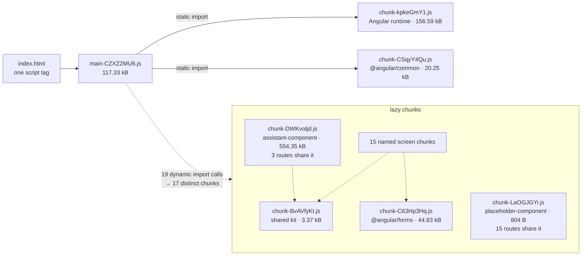
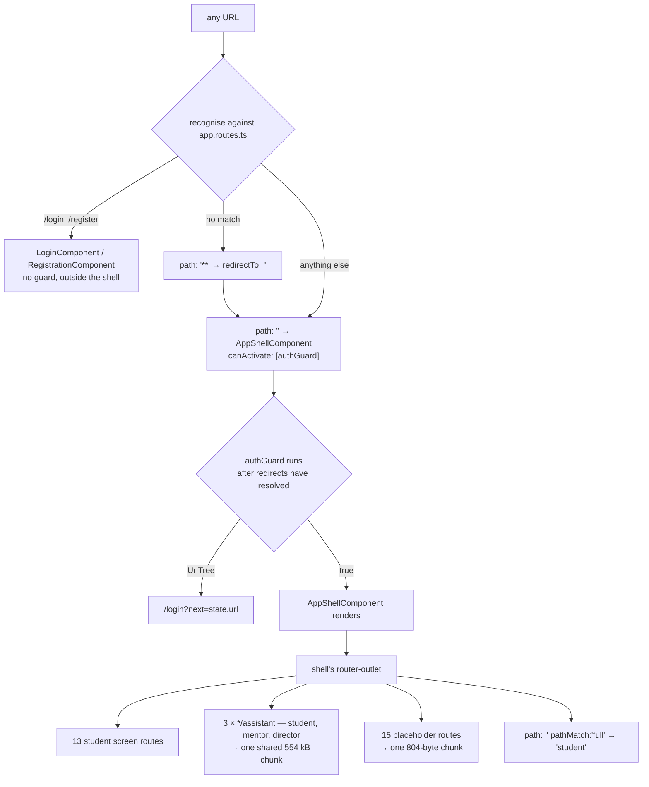
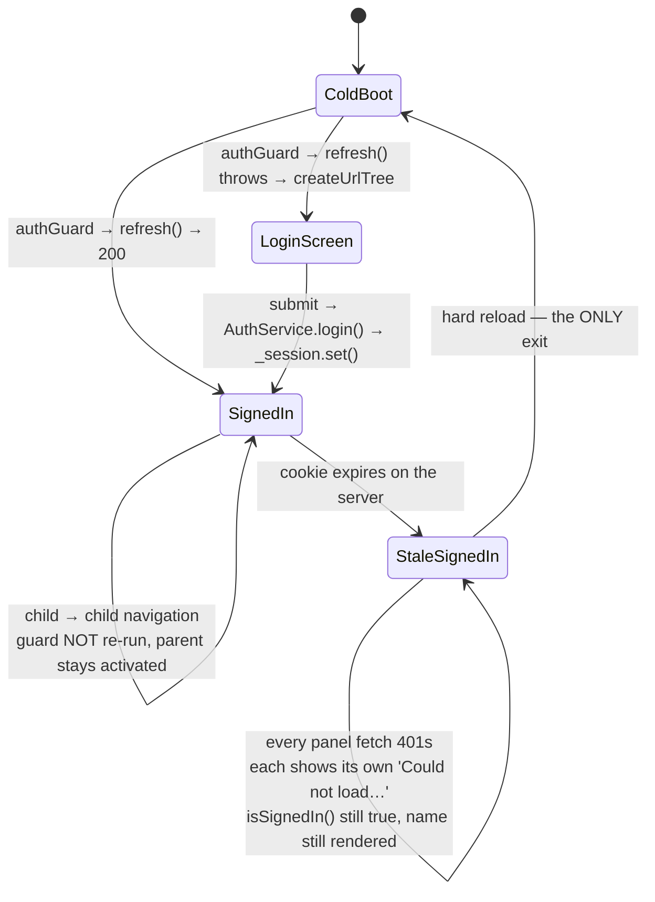

# Chapter 12 — Frontend Architecture: Bootstrap, Lazy Routes, Signals and the Shell

After this chapter you will be able to open `apps/web` and know exactly what happens between the browser fetching `index.html` and a student seeing their landing page: which six lines start the application, which three providers it registers and which it deliberately refuses, how every screen in the app is code-split behind a dynamic `import()` and what the production build does when one is not, how the client knows who is signed in when JavaScript is forbidden from reading the session cookie, and what shape a new feature component has to take to look like every other one. You will also be able to add a screen without breaking the bundle budget, and to recognise on sight the **eight** places where the code and the repo's own documentation disagree — three stale file headers naming "the NestJS backend", a guard citing an endpoint that does not exist, an error message pointing at the wrong port, and three claims in AGENTS.md and the CI comment that the measurements in §2 and §11 disprove.

**In scope:** the skeleton. `main.ts`, `app.config.ts`, `app.routes.ts`, everything under `src/app/core/` — including `core/chat-voice.service.ts`, the largest source file in the front end, documented in §5 — the shell in `src/app/layout/`, the shared atoms in `src/app/shared/`, the build and serve configuration, and the house patterns and naming rules every feature obeys.

**Deferred:** Chapter 13 owns the feature components themselves — what each screen fetches, renders and lets a student do. Chapter 14 owns `apps/web/src/styles/reep-v2.scss` and the design system; this chapter names which global classes components reuse and never documents their definitions. Chapter 5 owns the auth *mechanism* — scrypt hashing, the HS256 JWT, the `reep_session` cookie's flags — and this chapter cites it rather than re-deriving it, going deeper only on the client's own state handling. Chapter 1 §4 covers the request lifecycle and the same-origin proxy at architecture level; §11 here supplies the exact configuration values it summarises. The assistant *screen* (`features/assistant/`) and the resume builder's sub-components belong to Chapter 13; this chapter documents only the two root-provided services that back them, because they are the two exceptions to the house data-loading pattern and a reader who does not know they exist will over-generalise every rule in §9.

---

## 1. Bootstrap: six lines, three providers, and no NgModule anywhere

The entire entry point of the application is [apps/web/src/main.ts](apps/web/src/main.ts) — six lines, quoted in full because there is nothing to omit:

```ts
import { bootstrapApplication } from '@angular/platform-browser';
import { appConfig } from './app/app.config';
import { App } from './app/app';

bootstrapApplication(App, appConfig)
  .catch((err) => console.error(err));
```

That is the **standalone bootstrap API**. There is no `platformBrowserDynamic().bootstrapModule(AppModule)`, no `AppModule`, no `BrowserModule`. This is not a stylistic preference — it is verifiable absence. A grep for `NgModule` across `apps/web/src` returns zero hits; so does a grep for `BrowserModule`, `platformBrowserDynamic` and `bootstrapModule`. **There is no NgModule anywhere in this front end.**

The mechanism worth understanding is what that buys. In the NgModule world, a component's dependencies are declared by whichever module *declares* it, and modules import each other statically. That transitive static graph is precisely what defeats code-splitting: importing a module to get one component pulls in everything that module declares. In the standalone world each component carries its own `imports:` array listing only the directives, pipes and components its own template uses, and the only static edges are the ones a file actually writes. [AppShellComponent](apps/web/src/app/layout/app-shell.component.ts#L31) imports `[RouterLink, RouterLinkActive, RouterOutlet]` and nothing else; [CertificationsComponent](apps/web/src/app/features/student/certifications/certifications.component.ts#L61) imports `[DecimalPipe, DatePipe, RouterLink]`. Every one of the 37 `*.component.ts` files in the tree declares `standalone: true` explicitly. The single exception is the root component — whose file is `app.ts`, not `*.component.ts` — which omits it: harmless, because standalone is the default in this Angular version, but inconsistent (see §10).

### The root component is deliberately empty

[apps/web/src/app/app.ts](apps/web/src/app/app.ts) is twelve lines:

```ts
@Component({
  selector: 'app-root',
  imports: [RouterOutlet],
  templateUrl: './app.html',
  styleUrl: './app.scss'
})
export class App {
  protected readonly title = signal('web');
}
```

Its template, [apps/web/src/app/app.html](apps/web/src/app/app.html), is one line: `<router-outlet />`. Its stylesheet, `apps/web/src/app/app.scss`, is a **zero-byte file** — referenced by `styleUrl` and containing nothing, because all styling in this app is global (§11). The `title` signal is leftover `ng new` scaffold: it is `protected`, appears in no template, and is read nowhere. So the root component contributes exactly one thing to the running app — a router outlet. Everything a signed-in user sees is a *second* outlet, nested inside the shell (§7).

### The three providers, and what each one buys

[apps/web/src/app/app.config.ts:7-17](apps/web/src/app/app.config.ts#L7) is the whole configuration surface:

```ts
export const appConfig: ApplicationConfig = {
  providers: [
    provideBrowserGlobalErrorListeners(),
    // withComponentInputBinding binds a route's `data` (e.g. the placeholder
    // title) straight to a matching component @Input.
    provideRouter(routes, withComponentInputBinding()),
    // The client talks to the NestJS backend over HTTP; withFetch keeps it on
    // the platform fetch so withCredentials carries the session cookie.
    provideHttpClient(withFetch()),
  ],
};
```

**`provideBrowserGlobalErrorListeners()`** attaches listeners for the window's `unhandledrejection` and `error` events and forwards what they catch into Angular's `ErrorHandler`. Its name invites the guess that it has something to do with change detection or rendering; it does not. It is purely about making a rejected promise thrown outside Angular's call stack land somewhere the framework can see it.

**`provideRouter(routes, withComponentInputBinding())`** installs the router and one feature. `withComponentInputBinding()` makes the router bind a route's `data`, path params and query params to matching `@Input`s on the activated component, with no `ActivatedRoute` plumbing in the component. This one is load-bearing rather than decorative: the `placeholder()` route helper (§2) sets `data: { title }`, and [PlaceholderComponent](apps/web/src/app/features/placeholder/placeholder.component.ts#L38) declares

```ts
  /// Bound from the route's `data.title` via withComponentInputBinding().
  @Input() title = '';
```

Delete `withComponentInputBinding()` and all fifteen placeholder screens fall back to the literal string `'Being migrated'` ([placeholder.component.ts:15](apps/web/src/app/features/placeholder/placeholder.component.ts#L15)) and become indistinguishable from one another. Nothing fails to compile and no test catches it.

**`provideHttpClient(withFetch())`** provides `HttpClient` backed by the platform `fetch` rather than `XMLHttpRequest`. Note the comment says "the NestJS backend" — **that is stale.** The backend is FastAPI (`apps/api-py`); the same stale wording survives in the file headers of [core/auth.service.ts:6](apps/web/src/app/core/auth.service.ts#L6) and [core/session.ts:3](apps/web/src/app/core/session.ts#L3). Note also the irony of the provider: `HttpClient` is used by exactly four files in the whole tree — `app.config.ts`, `core/auth.service.ts`, `core/chat-voice.service.ts` and that service's spec. Every one of the twenty-odd feature components calls the platform `fetch` directly (§9).

### What is deliberately not provided

There are three providers and no more. There is no `provideAnimations`, no `provideZoneChangeDetection`, no `provideZonelessChangeDetection`, no `APP_INITIALIZER` / `provideAppInitializer`, and — the consequential one — **no HTTP interceptors at all**: a grep for `Interceptor` or `withInterceptors` across `apps/web/src` returns zero hits.

Two things follow, and both matter later in this chapter.

First, **nothing runs before the router.** There is no app-initialiser that fetches the session on boot. `AuthService` is `@Injectable({ providedIn: 'root' })`, which means Angular instantiates it lazily on the first `inject(AuthService)` — and the first `inject(AuthService)` in the whole application happens inside the route guard ([auth.guard.ts:16](apps/web/src/app/core/auth.guard.ts#L16)) or inside `LoginComponent`. Any mental model that says "the session is fetched at app load" is describing a mechanism this repo does not have. **The guard *is* the app-load fetch** (§6).

Second, **there is no cross-cutting place to translate a 401.** Every call site handles its own failures, by hand, with its own message (§9). The consequence of both facts together is the single most important behavioural gap in the client, and §6 traces it.

### Change detection, and why every piece of state here is a signal

To follow the rest of this chapter you need one mechanism that Angular newcomers usually meet only as vocabulary. **Angular has to be told when to re-run a template.** A template is compiled into a function that reads component fields and writes DOM; nothing in JavaScript notifies anyone when `this.rows` is reassigned, so the framework needs telling that something *might* have changed and the function should run again. That re-run is called **change detection**.

Historically `zone.js` did the telling. It monkey-patched the browser's asynchronous entry points — `setTimeout`, `addEventListener`, `Promise`, `XMLHttpRequest` — so that when any callback registered through them finished, Angular was told "an async task just completed" and re-checked every component's bindings for a changed value. It was blunt, but it meant a plain field mutation inside a `setTimeout` repainted correctly, because the *timeout*, not the mutation, triggered the check.

**This app ships no `zone.js` at all.** There is none in `node_modules`, no `polyfills` entry in `angular.json`, and no `NgZone` reference in `src/`. The built `index.html` emits exactly one script tag and no polyfills bundle (§11). So nothing does the blunt telling. What replaces it is the **signal graph**: reading a signal inside a template registers that template as a *consumer* of that signal, and calling `.set()` or `.update()` marks exactly those consumer views dirty and nothing else.

Three consequences, and every one of them shows up later:

- It is *why* `AuthService` holds the session in a `signal` rather than a plain field ([auth.service.ts:25-27](apps/web/src/app/core/auth.service.ts#L25)). A plain field mutation notifies nobody, and the shell's title bar would keep rendering the old name forever.
- It is why §9 Rule 4 is a rule at all: state the template must react to has to be a signal, and derived state has to be a `computed()`, because only a signal read establishes the dependency edge.
- It is why a third-party widget that expects a patched `setTimeout` to refresh the view will silently do nothing here. There is no patch.

One correction to a claim it is tempting to make: `AsyncPipe` is **not** a change-detection driver in this app, because it is not used. `AsyncPipe` ships in `CommonModule`, and a grep across `apps/web/src` for `AsyncPipe` returns zero hits, as does a grep for `| async` across every `.html` file. The drivers here are signal reads in templates, router events, and Angular's own event bindings.

---

## 2. The lazy-route rule

This is the front end's most consequential rule. It exists because of a measured failure, it is written into the top of the file it governs — and, as the measurements at the end of this section show, the build only catches the expensive half of it. The rest is on the reviewer.

[apps/web/src/app/app.routes.ts:6-24](apps/web/src/app/app.routes.ts#L6):

```
/**
 * Every nav destination in the shell needs a route, or clicking it goes nowhere
 * and navigation reads as broken. Built screens map to their component; the rest
 * map to a labelled PlaceholderComponent so each link navigates and highlights.
 * Migrating a screen is then a one-line swap: replace `placeholder(...)` with a
 * real `loadComponent`.
 *
 * ROUTES ARE LAZY (`loadComponent`, not `component`). A static `import` at the
 * top of this file pulls the component into the initial bundle no matter which
 * route the user visits — which is how every screen in the app ended up in one
 * 1.23 MB `main` chunk with no lazy chunks at all. A student on a phone was
 * downloading the mentor and director UIs, plus the resume builder and the
 * assistant, before the login form could paint.
 *
 * Only the two things needed to render the first frame stay eager: the shell
 * (every authenticated route lives inside it) and the guard. Adding a screen
 * here means adding a `loadComponent` — a plain `component:` reference silently
 * un-splits the bundle again and only shows up as a budget failure later.
 */
```

> **Why it is like this.** Every route was once statically imported. The result was a single 1.23 MB `main` chunk with no lazy chunks at all: a student opening the login form on a phone downloaded the mentor UI, the director UI, the resume builder and the LiveKit-backed assistant before the password field could paint. The fix was mechanical — turn every `component:` into a `loadComponent: () => import(...)` — and it took the reported initial bundle to ~142 kB.

Read the comment's mechanism precisely, because it is easy to get backwards. **It is the static `import` statement at the top of the file that defeats code-splitting, not the `component:` property itself.** `app.routes.ts` is reachable from `main.ts` via `app.config.ts`, so it is in the initial module graph unconditionally. Anything it names in a top-level `import` is therefore also in the initial graph, whether or not the route is ever visited. `component:` is merely the reason you would write such an import. A dynamic `import('./x')` inside an arrow function is a different thing entirely: the bundler treats it as a **split point**, emits the target as its own chunk, and the browser fetches that chunk only when the arrow is actually called — which the router does at activation time.

### The `placeholder()` helper, verbatim

[apps/web/src/app/app.routes.ts:25-32](apps/web/src/app/app.routes.ts#L25):

```ts
function placeholder(path: string, title: string): Route {
  return {
    path,
    loadComponent: () =>
      import('./features/placeholder/placeholder.component').then((m) => m.PlaceholderComponent),
    data: { title },
  };
}
```

Three things follow from it. First, every placeholder route shares **one identical dynamic import specifier**, so the bundler emits exactly one chunk for all fifteen of them — confirmed in the build output as an 804-byte `placeholder-component` chunk. Second, the label travels as route **data** (`data: { title }`), not as Angular's own `title:` route property. No route in this file sets Angular's `title`, so the browser tab reads `REEP Dashboard` from [src/index.html:5](apps/web/src/index.html#L5) on every single screen; the app never sets a per-route document title. Third, the data→input hop only works because of `withComponentInputBinding()` in `app.config.ts` (§1).

### A real lazy route, verbatim

[apps/web/src/app/app.routes.ts:50-56](apps/web/src/app/app.routes.ts#L50):

```ts
      {
        path: 'student',
        loadComponent: () =>
          import('./features/student/overview/student-overview.component').then(
            (m) => m.StudentOverviewComponent,
          ),
      },
```

All **eighteen** non-placeholder component routes follow exactly this shape: a `path` string and a `loadComponent` arrow returning `import(...).then((m) => m.XComponent)`. The arithmetic, so you can check it against the file: **fourteen student routes** (`loadComponent` on lines 52, 59, 66, 73, 78, 83, 88, 93, 100, 105, 112, 117, 125, 130), **two public routes** outside the shell — `login` (line 37) and `register` (line 41) — and **two staff assistant routes**, `mentor/assistant` (line 143) and `director/assistant` (line 158). Sixteen of the eighteen sit inside the shell. The file contains 22 textual occurrences of `loadComponent`: three inside the docstring, one inside the `placeholder()` helper, and these eighteen route properties.

There is no `loadChildren`, no route-level `providers`, no `resolve`, no `canDeactivate`, no `data` on any real-component route, and no child routing files. `app.routes.ts` is the only routing file in the application, 167 lines.

### The two sanctioned eager imports

[apps/web/src/app/app.routes.ts:3-4](apps/web/src/app/app.routes.ts#L3) statically imports `AppShellComponent` and `authGuard`, and they are consumed at [lines 45-47](apps/web/src/app/app.routes.ts#L45):

```ts
    path: '',
    component: AppShellComponent,
    canActivate: [authGuard],
```

That `component:` is the only one in the file and it is correct, not a violation. The shell is the frame every authenticated route renders inside, so it is needed for the first authenticated frame; the guard has to run before anything else can. Lazy-loading either would only add a round trip to the critical path.

### The chunk-sharing trick

[apps/web/src/app/app.routes.ts:120-122](apps/web/src/app/app.routes.ts#L120):

```
      // The three assistant routes share one dynamic import, so the bundler emits
      // a SINGLE chunk that all three reuse — a student who has already opened the
      // assistant does not re-download it under another role's path.
```

`student/assistant`, `mentor/assistant` and `director/assistant` all write `import('./features/assistant/assistant.component')` character for character. The build proves the claim directly: grepping the emitted `main` bundle for dynamic imports finds **nineteen `import()` statements** — the eighteen routes plus the one inside `placeholder()` — pointing at only **seventeen distinct chunks**, because `chunk-DWKvotjd.js` (the assistant) appears three times, and the placeholder chunk covers fifteen routes from a single statement.

That assistant chunk is by far the largest artefact in the application: **554.35 kB raw / 120.46 kB transfer**, dominated by `livekit-client` ([package.json:21](apps/web/package.json#L21)). Grepping it confirms the attribution beyond doubt — 152 occurrences of `livekit`, 157 of `RTCPeerConnection`, 4 of `SignalClient`. It is nearly four times the size of the reported initial bundle, which is why keeping the assistant lazy matters more than any other decision in this file.

### The budget, quoted exactly

[apps/web/angular.json:38-49](apps/web/angular.json#L38), under `projects.web.architect.build.configurations.production`:

```json
              "budgets": [
                {
                  "type": "initial",
                  "maximumWarning": "250kB",
                  "maximumError": "400kB"
                },
                {
                  "type": "anyComponentStyle",
                  "maximumWarning": "16kb",
                  "maximumError": "32kb"
                }
              ],
```

(Note the casing inconsistency as written — `kB` on the first, lowercase `kb` on the second. Angular parses both.) The budget is a gate only because [angular.json:58](apps/web/angular.json#L58) sets `"defaultConfiguration": "production"` on the build target, so a bare `ng build` — which is what CI runs — *is* the production build. Change that default to `development` and the budgets, which live only under `configurations.production`, never evaluate at all.

The historical numbers are recorded in [.github/workflows/ci.yml:145-153](.github/workflows/ci.yml#L145):

```
      # The real production build, not just a typecheck. It used to fail the
      # bundle budget (1.23 MB against a 1 MB cap) because every route was
      # statically imported, so this step could not be enforced. Routes are lazy
      # now — initial is ~142 kB — and the budget is set close enough to that
      # that a single `component:` slipped back into app.routes.ts fails here
      # rather than shipping the whole app to the login screen again.
      - name: Build (enforces the bundle budget)
        working-directory: apps/web
        run: npx ng build
```

The cap that comment names — 1 MB — was the original. `git log -p --follow -- apps/web/angular.json` shows the budgets introduced in commit `29e237d` at `500kB`/`1MB` and ratcheted to `250kB`/`400kB` in `809232d`, the current HEAD, once the app was actually lazy.

### The real numbers, measured

Running `npx ng build` in `apps/web` at this commit produces 21 lazy chunks. The named ones map one-to-one onto routes; the interesting part is the four **unnamed** ones, which the next subsection identifies by opening them.

| Artefact | Chunk file | Raw | Transfer |
|---|---|---|---|
| `main` (initial) | `main-CZXZ2MU6.js` | 117.33 kB | 30.22 kB |
| `styles` (initial) | `styles-OL4NFQKM.css` | 24.46 kB | 4.79 kB |
| **Reported "Initial total"** | | **141.80 kB** | **35.02 kB** |
| `assistant-component` | `chunk-DWKvotjd.js` | 554.35 kB | 120.46 kB |
| *(unnamed)* | `chunk-kpkeGmY1.js` | 156.59 kB | 46.39 kB |
| `resume-builder-component` | `chunk-BhA34J06.js` | 121.68 kB | 21.87 kB |
| *(unnamed)* | `chunk-C63Hp3Hq.js` | 44.83 kB | 9.67 kB |
| `jobs-component` | `chunk-BJtt-vPz.js` | 23.00 kB | 6.05 kB |
| `uploads-component` | `chunk-KHOlzir1.js` | 21.05 kB | 5.60 kB |
| `profile-component` | `chunk-CR2OO9pV.js` | 20.42 kB | 5.49 kB |
| *(unnamed)* | `chunk-CSqyY4Qu.js` | 20.25 kB | 6.31 kB |
| `student-overview-component` | `chunk-CJMShrjk.js` | 17.91 kB | 5.34 kB |
| `records-component` | `chunk-5vU_Ssvd.js` | 16.17 kB | 4.24 kB |
| `login-component` | `chunk-CgGlvOMw.js` | 15.60 kB | 4.68 kB |
| `offers-component` | `chunk-DWbAc4BM.js` | 14.81 kB | 3.94 kB |
| `academics-component` | `chunk-CCWTR7co.js` | 11.77 kB | 3.31 kB |
| `leaderboards-component` | `chunk-CvTPj77N.js` | 11.72 kB | 3.50 kB |
| `skilling-component` | `chunk-F_z3hz0P.js` | 10.12 kB | 3.09 kB |
| `time-log-component` | `chunk-C5ZEUu8a.js` | 9.56 kB | 3.38 kB |
| `registration-component` | `chunk-BnD_fSR1.js` | 7.83 kB | 2.54 kB |
| `certifications-component` | `chunk-CyeSnb62.js` | 7.04 kB | 2.48 kB |
| `courses-component` | `chunk-BfKvotXf.js` | 6.24 kB | 2.19 kB |
| *(unnamed)* | `chunk-BvAVfyKt.js` | 3.37 kB | 961 bytes |
| `placeholder-component` | `chunk-LaOGJGYi.js` | 804 bytes | 804 bytes |

### What the four unnamed chunks actually contain — opened, not inferred

These are **shared** chunks: code that more than one lazy route needs, hoisted out so it is downloaded once. The builder gives them no route name because they belong to no single route. Each was identified by grepping the emitted file in `apps/web/dist/web/browser/`.

| Chunk | Raw | What it is | Evidence |
|---|---|---|---|
| `chunk-kpkeGmY1.js` | 156.59 kB | **Angular's own core runtime** | Contains ``Symbol(`SIGNAL`)`` — the reactive-graph brand — plus the `NG0` error-code prefix, 45 `ɵ` framework symbols and 17 literal occurrences of `Angular`. Zero occurrences of `apexchart`, `dataLabels` or `livekit`. |
| `chunk-C63Hp3Hq.js` | 44.83 kB | **`@angular/forms`** | 17 occurrences of `ngModel`, 19 of `formControlName`. Imported by exactly the seven chunks whose screens carry a form: jobs, resume-builder, registration, academics, profile, login, offers. |
| `chunk-CSqyY4Qu.js` | 20.25 kB | **`@angular/common`** | The date/number formatting tables — `fullDate`, `shortTime`, `mediumDate`, `Percent`, `Scientific` — plus `ngTemplateOutlet` and the `Location`/`popstate` history plumbing. |
| `chunk-BvAVfyKt.js` | 3.37 kB | **the shared kit** (§8) | Carries the compiled `kit-page-intro`, `kit-section` and `kit-empty` selectors, their `.intro__title` / `.section__head` / `.empty__hint` class strings, and the `action` projection selector. Imported by exactly three chunks: `chunk-CCWTR7co.js` (academics), `chunk-DWbAc4BM.js` (offers) and `chunk-DWKvotjd.js` (assistant). |

Two conclusions follow, and both are stated as fact because the chunks were opened.

**No emitted chunk contains ApexCharts.** A case-insensitive grep for `apexchart` across every file in `dist/web/browser/` returns nothing. This confirms §8's finding from the other direction: because nothing in the `main.ts` import graph reaches `BarChartComponent`, `apexcharts` and `ng-apexcharts` contribute zero bytes to the shipped application despite being production dependencies.

**`kit-stat` and `kit-banner` reach no chunk either.** The shared-kit chunk carries three of the five kit selectors; grepping every emitted file for `kit-stat` or `kit-banner` returns nothing. The bundler dropped them because no template instantiates them.

### The number the build reports is not the number the browser downloads

This is the most important correction in the section, and it is checkable in one command.

`main-CZXZ2MU6.js` **begins with two static ES-module imports**:

```js
import{ ... }from"./chunk-kpkeGmY1.js";import{ ... }from"./chunk-CSqyY4Qu.js";
```

A static `import` at the top of an ES module is not optional and not deferred: the browser must fetch, parse and evaluate both files before a single line of `main` runs. Yet the builder lists both under **"Lazy chunk files"** and excludes them from **"Initial total"**, because its accounting is keyed on which chunks the *router* loads on demand, not on which files block the first frame.

So the true first-frame payload is:

| | Raw | Transfer |
|---|---|---|
| `main-CZXZ2MU6.js` | 117.33 kB | 30.22 kB |
| `chunk-kpkeGmY1.js` (Angular runtime, statically imported by main) | 156.59 kB | 46.39 kB |
| `chunk-CSqyY4Qu.js` (`@angular/common`, statically imported by main) | 20.25 kB | 6.31 kB |
| `styles-OL4NFQKM.css` | 24.46 kB | 4.79 kB |
| **Actual first-frame total** | **318.63 kB** | **87.71 kB** |

Against a reported 141.80 kB / 35.02 kB. The `~142 kB initial` figure cited by AGENTS.md and the CI comment is the builder's number and is accurate *as the builder defines it* — but a reader who takes it as "what a student on a phone downloads before the login form paints" is understating it by a factor of **2.50 on the wire** (87.71 / 35.02), and 2.25 raw (318.63 / 141.80). Worse, the built `index.html` emits no `<link rel="modulepreload">` for either chunk (§11), so nothing tells the browser about them until `main.js` has been parsed.

None of this weakens the lazy-route rule; it strengthens it. The shared framework floor is fixed and already large, so the real headroom is smaller than the reported number suggests.



### What actually happens when a route is re-eager-ed

Both directions were re-measured for this chapter by editing `app.routes.ts`, running `npx ng build`, and restoring the file with `git checkout --` afterwards. **Restore the file before trusting any subsequent build number** — a stale edit left behind silently invalidates every figure in this section.

**Heavy route.** Switching `student/assistant` to a top-of-file static import plus `component: AssistantComponent`, then `npx ng build`:

```
Initial chunk files | Names                      |  Raw size | Estimated transfer size
main-SIIRDQII.js    | main                       | 657.75 kB |               145.06 kB
styles-OL4NFQKM.css | styles                     |  24.46 kB |                 4.79 kB

                    | Initial total              | 682.22 kB |               149.86 kB

Application bundle generation failed.
▲ [WARNING] bundle initial exceeded maximum budget. Budget 250.00 kB was not met by 432.22 kB with a total of 682.22 kB.
X [ERROR] bundle initial exceeded maximum budget. Budget 400.00 kB was not met by 282.22 kB with a total of 682.22 kB.
```

Exit code **1**, which fails the `Build (enforces the bundle budget)` step. The mechanism is precise: the `maximumWarning` line produces the `▲ [WARNING]` and fails nothing; only `maximumError` produces the `X [ERROR]` and the non-zero exit.

The arithmetic reconciles, and it is worth walking because it shows what "absorbed into `main`" really means. `main` grows from 117.33 kB to 657.75 kB, **+540.42 kB** — not the assistant chunk's full 554.35 kB, because the shared split changes with it: the 3.37 kB `chunk-BvAVfyKt.js` disappears and a 19.51 kB unnamed chunk takes its place, the bundler having re-partitioned what is now shared between only academics and offers. The `assistant-component` name vanishes from the lazy list entirely. The two statically-imported framework chunks (156.59 kB and 20.25 kB) are unchanged and still excluded from `Initial total`, so the comparison between the two builds is like-for-like.

**Small route.** The same swap on `student/courses` (a 6.24 kB chunk):

```
Initial chunk files | Names                      |  Raw size | Estimated transfer size
main-WSFDVXGU.js    | main                       | 123.40 kB |                31.98 kB
styles-OL4NFQKM.css | styles                     |  24.46 kB |                 4.79 kB

                    | Initial total              | 147.86 kB |                36.77 kB
```

Exit code **0**. No error, no warning at all. `courses-component` simply disappears from the lazy chunk list and nothing announces it.

> **Correction to AGENTS.md and the CI comment.** Both state that "a single `component:` slipped back into `app.routes.ts` fails here". That is true for the heavy routes and false for the light ones. With 141.80 kB of reported initial against a 250 kB warning and a 400 kB error, there is roughly 108 kB of headroom to a warning and 258 kB to a failure. Re-eager-ing the assistant fails the build; re-eager-ing the resume builder (121.68 kB) would trip the warning but not the error; re-eager-ing a small screen slips through silently, as the `student/courses` run above proves. **The budget is a backstop against the catastrophic regression, not a per-route lint.** The rule is still absolute — it is simply enforced by review rather than by the compiler for anything under ~108 kB. The reliable tell is not the initial number growing: it is a **named chunk disappearing** from the lazy list (§11).

---

## 3. The route table in full

Three top-level routes and a wildcard. Everything authenticated is a child of the shell, so nothing authenticated is reachable without passing `authGuard` once.

| Path | Resolves to | Guard | Chunk |
|---|---|---|---|
| `login` | `LoginComponent` (lazy) | — | `login-component` |
| `register` | `RegistrationComponent` (lazy) | — | `registration-component` |
| `''` | `AppShellComponent` (**eager**) | `authGuard` | initial |
| `**` | `redirectTo: ''` | — | — |

Note the path/file/class skew on the second: the route path is `register`, the file is `features/register/registration.component.ts`, the class is `RegistrationComponent`.

### Children — the student screens

All fourteen are real, lazily-loaded components, all guarded by the parent, none carrying a `title`.

| Path | Component | In shell nav? |
|---|---|---|
| `student` | `StudentOverviewComponent` | yes (`Landing`) |
| `student/certifications` | `CertificationsComponent` | yes |
| `student/academics` | `AcademicsComponent` | **no** |
| `student/skilling` | `SkillingComponent` | yes |
| `student/time-log` | `TimeLogComponent` | yes (`Time Sheet`) |
| `student/courses` | `CoursesComponent` | yes |
| `student/records` | `RecordsComponent` | yes |
| `student/leaderboards` | `LeaderboardsComponent` | yes |
| `student/uploads` | `UploadsComponent` | yes |
| `student/resume` | `ResumeBuilderComponent` | yes (`Resume Builder`) |
| `student/jobs` | `JobsComponent` | yes |
| `student/offers` | `OffersComponent` | **no** |
| `student/assistant` | `AssistantComponent` | yes (`REEP Agent`) |
| `student/profile` | `ProfileComponent` | yes |

Two of these are orphans. [app-shell.component.html](apps/web/src/app/layout/app-shell.component.html) contains exactly twelve `routerLink`s — at lines 16, 19, 22, 25, 28, 33, 36, 39, 44, 47, 52 and 55 — and neither `/student/academics` nor `/student/offers` is among them; a grep across every `.html` file in `apps/web/src` finds no link to either from anywhere. Both routes exist and both components exist, but neither is reachable by clicking — only by typing the URL. This inverts the intent stated at [app.routes.ts:7-9](apps/web/src/app/app.routes.ts#L7): the invariant "every nav destination needs a route" was written and held, but its converse — every route needs a nav destination — was never closed. That matters more than it sounds: Chapter 13 documents contract defects in both of those exact screens (one of them the camelCase `Offer` interface dissected in §4), and they went unobserved precisely because nobody can click to them.

### Children — mentor and director

| Path | Resolves to | Title / label |
|---|---|---|
| `mentor` | `placeholder(...)` | Cohort |
| `mentor/student` | `placeholder(...)` | Students |
| `mentor/alerts` | `placeholder(...)` | Alerts |
| `mentor/uploads` | `placeholder(...)` | Verifications |
| `mentor/reports` | `placeholder(...)` | Reports |
| `mentor/leave` | `placeholder(...)` | Leave |
| `mentor/assistant` | **`AssistantComponent`** (lazy) | — |
| `mentor/settings` | `placeholder(...)` | Thresholds |
| `director` | `placeholder(...)` | Analytics |
| `director/registrations` | `placeholder(...)` | Registrations |
| `director/mentors` | `placeholder(...)` | Mentor assignment |
| `director/courses` | `placeholder(...)` | Courses |
| `director/certifications` | `placeholder(...)` | Certifications |
| `director/placement` | `placeholder(...)` | Placement |
| `director/jobs` | `placeholder(...)` | Jobs sheet |
| `director/assistant` | **`AssistantComponent`** (lazy) | — |
| `director/exports` | `placeholder(...)` | Exports |

**Say it plainly: the table above is the single most misleading artefact in the front end.** Every `mentor/*` and `director/*` route at [app.routes.ts:134-161](apps/web/src/app/app.routes.ts#L134) is a `placeholder(...)` except the two `*/assistant` routes, and a grep across `apps/web/src` for `/api/mentor` or `/api/director` returns zero hits. **The entire staff backend documented in Chapter 7 has no client.** All fifteen placeholders render the same 804-byte component, differing only in the `data.title` string.

Three independent facts confirm it and a reader should hold all three: the routes are placeholders; no client code calls a staff endpoint; and the shell's navigation contains no mentor or director link at all, so those placeholder routes are not even reachable by clicking. [HOME_FOR_ROLE](apps/web/src/app/core/session.ts#L21) sends `MENTOR → '/mentor'` and `DIRECTOR`/`ADMIN → '/director'` after sign-in, so a staff user lands on a page reading *"This screen is being ported to Angular"* beside a sidebar of twelve student links. The only genuinely functional staff screen in the whole application is the assistant. **Do not mistake the route table for a working UI.**

This is tracked as a project-state finding in [FINDINGS.md](docs/codebase-mahabharath/FINDINGS.md#L108) under *"The mentor and director UIs do not exist yet"*, which carries the same `app.routes.ts:134-161` anchor and the same zero-hit grep. Note in particular the point it adds and this chapter would otherwise miss: the lazy-route rationale is written in terms of staff UIs, **which reads as though those UIs exist**. They do not. Attribute the wording precisely, because FINDINGS.md does not: the phrase "the mentor and director UIs" is `app.routes.ts`'s own docstring ([app.routes.ts:17](apps/web/src/app/app.routes.ts#L17) — "A student on a phone was downloading the mentor and director UIs"), not AGENTS.md's. [AGENTS.md:44](AGENTS.md#L44) says "mentor and director **screens**", which is likewise generous but is a different string; [FINDINGS.md:127-129](docs/codebase-mahabharath/FINDINGS.md#L127) quotes "the mentor and director UIs" and credits it to AGENTS.md, and this chapter inherited that misattribution. The substantive point survives either way. What the 1.23 MB `main` chunk actually carried under those names was fifteen routing entries pointing at one placeholder screen — plus the resume builder and the assistant, which are real and are the bulk of the weight.

### The index redirect and the fallback

The last child is `{ path: '', pathMatch: 'full', redirectTo: 'student' }` ([app.routes.ts:163](apps/web/src/app/app.routes.ts#L163)). `pathMatch: 'full'` is mandatory: without it an empty-path child with a `redirectTo` matches every URL prefix and the router enters an infinite redirect. Note the behavioural consequence — this redirect is **not role-aware**. A director who navigates to `/` (rather than signing in fresh, where `HOME_FOR_ROLE` sends them to `/director`) lands on `/student`.

Outside the shell, `{ path: '**', redirectTo: '' }` ([app.routes.ts:166](apps/web/src/app/app.routes.ts#L166)) funnels every unmatched URL back through the index redirect. There is no 404 screen. So a typo'd URL ends at `/student` for a signed-in user, and at **`/login?next=/student`** for a signed-out one — *not* `/login?next=/`. The reason is the ordering of the router's phases: Angular applies `redirectTo` during **URL recognition**, before any `canActivate` runs, so by the time `authGuard` reads `state.url` the chain `**` → `''` → `student` has fully resolved. The mistyped path is already gone and cannot be preserved in `?next=`. §6 traces the same fact from the guard's side.



The branches partition rather than overlap: 13 + 3 + 15 = 31 child routes, plus the index redirect. `student/assistant` is counted once, under the assistant branch, not twice.

---

## 4. Session without a token

The session is an httpOnly cookie. JavaScript cannot read it — that is the entire point of `httpOnly`, and Chapter 5 owns why the cookie is shaped that way. So how does the SPA know who is signed in, and what does it actually hold?

It holds a payload the server hands it, in one signal, and nothing else. [apps/web/src/app/core/auth.service.ts:21-27](apps/web/src/app/core/auth.service.ts#L21):

```ts
@Injectable({ providedIn: 'root' })
export class AuthService {
  private readonly http = inject(HttpClient);

  private readonly _session = signal<SessionPayload | null>(null);
  readonly session = this._session.asReadonly();
  readonly isSignedIn = computed(() => this._session() !== null);
```

That is the complete client identity model. There is **no token field, no `localStorage`, no JWT decode, and no expiry tracking anywhere in the class.** The twelve-hour TTL lives only on the server — `SESSION_TTL_SECONDS = 60 * 60 * 12` at [apps/api-py/app/security.py:21](apps/api-py/app/security.py#L21), applied as the cookie's `max_age` at [routers/auth.py:75](apps/api-py/app/routers/auth.py#L75) and as the JWT's `exp` at [security.py:47](apps/api-py/app/security.py#L47). The client has no idea when its session lapses. `null` means "not known to be signed in" and is never distinguished from "known to be signed out".

### Three methods, and why the `firstValueFrom` wrapper is not sugar

The one-line version would be "all three wrap an `HttpClient` observable in `firstValueFrom` so the auth surface is promise-shaped". That names the mechanism and omits the half that matters.

`HttpClient` hands back a **cold observable**. Cold means the observable is a recipe, not a running process: `this.http.get(url)` on its own issues **no HTTP request whatsoever**. The request is made when something *subscribes*, and a second subscription makes a second request. `firstValueFrom` is what subscribes — it subscribes, resolves its promise with the first emitted value, and unsubscribes. So the wrapper is not a stylistic convenience. Drop it and the request never leaves the browser: no error, no network entry, no clue. This is the single most common way to write a no-op HTTP call in Angular.

**`login(email, password, next?)`** ([auth.service.ts:32-42](apps/web/src/app/core/auth.service.ts#L32)) POSTs `${environment.apiBase}/auth/login` with `{ email, password, next }` and `{ withCredentials: true }`, then does `this._session.set(session)` **before returning**. That ordering is load-bearing: the very next navigation hits `authGuard`, whose first line short-circuits on `isSignedIn()`, so signing in costs one round trip rather than two.

**`refresh()`** ([auth.service.ts:46-59](apps/web/src/app/core/auth.service.ts#L46)) GETs `${environment.apiBase}/auth/me` with credentials, sets the signal and returns it. Its failure path is worth reading exactly:

```ts
    } catch {
      this._session.set(null);
      return null;
    }
```

The `catch` is bare. A 401, a 500, a dead API, a CORS failure and a JSON parse error all take the identical path. No logging, no rethrow, no status inspection. The upside is that a network blip cannot leave the client believing in a session it cannot prove; the downside is that "your session expired" and "the API is down" are indistinguishable to everything downstream.

**`logout()`** ([auth.service.ts:61-66](apps/web/src/app/core/auth.service.ts#L61)) POSTs `/auth/logout` with an empty body, **awaits it**, then clears the signal. Note the ordering hazard: if the POST rejects, the `await` throws and `_session` is never cleared, so the SPA goes on believing it is signed in. Its only caller, [AppShellComponent.signOut()](apps/web/src/app/layout/app-shell.component.ts#L42), has no try/catch either, so a failed logout also never navigates and the button appears to do nothing.

### The session shape, and the one *sanctioned* camelCase island

[apps/web/src/app/core/session.ts:8-26](apps/web/src/app/core/session.ts#L8):

```ts
export type Role = 'STUDENT' | 'MENTOR' | 'DIRECTOR' | 'ADMIN';

export interface SessionPayload {
  userId: string;
  email: string;
  name: string;
  role: Role;
  /// Present for STUDENT, absent otherwise.
  studentId?: string;
  mentorId?: string;
}

/// Where each role lands after signing in — the port of HOME_FOR_ROLE.
export const HOME_FOR_ROLE: Record<Role, string> = {
  STUDENT: '/student',
  MENTOR: '/mentor',
  DIRECTOR: '/director',
  ADMIN: '/director',
};
```

`SessionPayload` is **camelCase**, and it is the only *sanctioned* camelCase wire shape in the client (§9 Rule 8 covers the snake_case rule everywhere else). Sanctioned means the server deliberately mirrors it and says why in the schema module's opening docstring ([apps/api-py/app/schemas/auth.py:1-2](apps/api-py/app/schemas/auth.py#L1)):

```python
"""Request/response models for auth. Field names mirror the Next.js session
payload (camelCase) so the Angular client is unchanged across the cutover."""
```

and then declares it that way ([schemas/auth.py:12-18](apps/api-py/app/schemas/auth.py#L12)):

```python
class SessionUser(BaseModel):
    userId: str
    email: str
    name: str
    role: str
    studentId: str | None = None
    mentorId: str | None = None
```

Chapter 5 §9.6 traces the chain and records the two mismatches (the server types `role` as a bare `str`, so a new backend role would fall silently outside this union; and `studentId`/`mentorId` arrive as JSON `null`, never as absent keys, so the `/// Present for STUDENT, absent otherwise.` comment is wrong about the wire).

**There are further camelCase wire shapes, and none of them is sanctioned.** The clearest is in `features/student/offers/offers.component.ts`, which declares [`interface Offer` at lines 23-41](apps/web/src/app/features/student/offers/offers.component.ts#L23) with **seventeen** fields, eleven of them camelCase — `roleType`, `jobTitle`, `joiningDate`, `workMode`, `ctcInr`, `fixedGrossInr`, `jobDescription`, `bondDetails`, `otherBenefits`, `decisionNote`, `createdAt`; the other six (`id`, `organisation`, `channel`, `bonuses`, `location`, `status`) are single words with no casing to get wrong — and asserts the raw response into it at [line 110](apps/web/src/app/features/student/offers/offers.component.ts#L110):

```ts
      this.offers.set((await res.json()) as Offer[]);
```

against `GET /student/offers`, whose `response_model` ([student.py:738](apps/api-py/app/routers/student.py#L738)) is snake_case ([apps/api-py/app/routers/student.py:674-684](apps/api-py/app/routers/student.py#L674)):

```python
class OfferOut(BaseModel):
    id: str
    role_type: str
    job_title: str
    organisation: str
    channel: str
    work_mode: str
    location: str | None
    ctc_inr: int
    fixed_gross_inr: int
    status: str
```

The proof that this is a defect rather than a convention is inside the repo itself: **a second file declares an interface of the same name for the same endpoint, correctly.** [jobs.component.ts:52-64](apps/web/src/app/features/student/jobs/jobs.component.ts#L52) reads

```ts
/** Row shape of GET /student/offers (snake_case, verbatim from OfferOut). */
interface Offer {
  id: string;
  role_type: RoleType;
  job_title: string;
  organisation: string;
  channel: string;
  work_mode: string;
  location: string | null;
  ctc_inr: number;
  fixed_gross_inr: number;
  status: string;
}
```

— ten fields, snake_case, matching `OfferOut` field for field, with the house doc comment naming the source schema. The offers screen's version has seventeen, of which only **five** can ever be populated at runtime: `id`, `organisation`, `channel`, `location` and `status` — precisely the five whose spelling `OfferOut` also declares. (`channel` survives by luck rather than care: the client types it `Channel = 'ON_CAMPUS' | 'OFF_CAMPUS' | 'POOL' | 'REFERRAL'` at [offers.component.ts:19](apps/web/src/app/features/student/offers/offers.component.ts#L19), and the server sends exactly that vocabulary — `channel: str` at [student.py:679](apps/api-py/app/routers/student.py#L679), filled from `o.channel.value` at [student.py:693](apps/api-py/app/routers/student.py#L693).) Every other read — including `bonuses`, which is single-word but has no counterpart in `OfferOut` at all — yields `undefined`. **`SessionPayload` is an island; `offers.component.ts`'s `Offer` is a break.** §3 named the orphan route that hides it, §9 Rule 8 explains why the compiler cannot see it, and Chapter 13 documents the runtime consequence.

`HOME_FOR_ROLE` is typed `Record<Role, string>` and that annotation is the enforcement mechanism: adding a member to `Role` without adding a key here is a compile error, which is what stops `navigateByUrl(undefined)` after login. `ADMIN` deliberately aliases the director home because ADMIN has no screens of its own. It is read in exactly one place, [login.component.ts:94](apps/web/src/app/features/login/login.component.ts#L94).

### The same break, again, in `academics.component.ts`

The offers screen is not the only one. [academics.component.ts:19-33](apps/web/src/app/features/student/academics/academics.component.ts#L19) declares three camelCase wire interfaces against `GET /student/academics` — `Qualification` with `maxMarks` ([line 26](apps/web/src/app/features/student/academics/academics.component.ts#L26)), `Gap` with `twelfthToGradMo` / `diplomaToGradMo` / `gradToPgMo` / `otherMo` ([line 31](apps/web/src/app/features/student/academics/academics.component.ts#L31)), and `Semester` with `closedBacklogs` / `liveBacklogs` ([line 32](apps/web/src/app/features/student/academics/academics.component.ts#L32)) — bundled into `AcademicsView` ([line 33](apps/web/src/app/features/student/academics/academics.component.ts#L33)) and asserted onto the raw response **twice**, at [line 80](apps/web/src/app/features/student/academics/academics.component.ts#L80) (`load()`) and [line 117](apps/web/src/app/features/student/academics/academics.component.ts#L117) (`save()`), both written `const v = (await res.json()) as AcademicsView;`.

The server's [`QualificationOut` / `AcademicGapOut` / `AcademicsOut` at student.py:461-484](apps/api-py/app/routers/student.py#L461) are snake_case: `max_marks`, `twelfth_to_grad_mo`, `diploma_to_grad_mo`, `grad_to_pg_mo`, `other_mo`. Worse than a casing skew, **`AcademicsOut` has no `semesters` key at all** — it declares only `qualifications` and `gap` — so `v.semesters` is always `undefined` and `this.semesters.set(v.semesters)` at line 83 stores it.

The same "a second file gets it right" proof applies here exactly as it did for offers. [records.component.ts:58-81](apps/web/src/app/features/student/records/records.component.ts#L58) declares the same shapes correctly, under the house doc comment `/** GET /student/academics (AcademicsOut). */`, with `max_marks`, `twelfth_to_grad_mo`, `diploma_to_grad_mo`, `grad_to_pg_mo`, `other_mo`, `total_mo`; so does [resume/sections/education.component.ts:25-50](apps/web/src/app/features/student/resume/sections/education.component.ts#L25). Two files spell the contract correctly and one does not — and the one that does not is, like offers, an **orphan route nobody can click to** (§3).

### Why every fetch must carry credentials

`environment.apiBase` is `'/api'` — a **relative** path ([environment.ts:11](apps/web/src/environments/environment.ts#L11)) — so every request the browser sees goes to the same origin as the page. But same-origin is not sufficient: `HttpClient` and `fetch` both omit cookies unless told otherwise, and this app has no cross-cutting configuration to tell them. So every single call site opts in **by hand**:

- `{ withCredentials: true }` on all **eleven** `HttpClient` calls — three in `auth.service.ts` (lines 37, 50, 63) and eight in `chat-voice.service.ts` (lines 221, 231, 327, 335, 355, 417, 460, 551);
- `credentials: 'include'` on all **43** platform-`fetch` calls. There are exactly 43 `fetch(` call sites in `apps/web/src` and exactly 43 occurrences of `credentials: 'include'` — 100% adherence, maintained purely by copying the pattern, because there is no interceptor to add it.

Omit it once and the request arrives with no `reep_session` cookie, the API's `get_current_session` dependency raises 401, and — because no data-loading component distinguishes 401 from any other failure — the screen shows a generic "Could not load…". **The bug presents as a data problem and is an auth problem.** That is the trap worth remembering.

### What happens on a 401 mid-session

Nothing, is the honest answer, and this is the client's real gap. Angular runs `canActivate` only for routes being *newly* activated. The guard sits on the parent `''` route; once that is activated, navigating between children (`/student` → `/student/jobs` → `/student/resume`) does not re-run it, because the parent stays activated. There is no interceptor to catch a 401 globally. So after the cookie expires: the shell keeps rendering with a stale `session()` signal showing the user's name and role, each panel independently 401s and shows its own error state, and there is no route back to `/login`.



Read the diagram for what it does **not** contain: no edge leaves `StaleSignedIn` for `LoginScreen`. Recovery requires a hard reload, which re-enters the guard's cold path, fails `refresh()`, and finally bounces to the login screen. Adding a single `HttpInterceptorFn` that mapped 401 to `auth.logout()` plus `router.navigate(['/login'])` would draw that edge; nothing in this repo does.

---

## 5. The other core service: `ChatVoiceService`

`src/app/core/` holds four small files and one large one. The small ones — `auth.service.ts` (67 lines), `session.ts` (26), `auth.guard.ts` (25) and `theme.service.ts` (36) — are quoted almost in full elsewhere in this chapter. [core/chat-voice.service.ts](apps/web/src/app/core/chat-voice.service.ts) is **841 lines**, the largest source file in the entire front end, and it is the reason several rules in §9 need a qualifier. It is documented here because a reader who has met only `AuthService` will over-generalise every core-service convention in the book.

Its own header states the design ([chat-voice.service.ts:17-28](apps/web/src/app/core/chat-voice.service.ts#L17)):

> One service drives both the text chat (POST /api/agent/chat) and the real-time voice session (LiveKit + a server-side Groq speech cascade; the browser only publishes a mic track and plays what comes back). The backend owns the conversation: it resolves the caller from the session cookie and keeps a single conversation memory across both text and voice. The client never mints or sends a session_id. State is exposed as native Angular signals for reactive templates.

Chapter 9 owns the conversation model on the server and Chapter 13 owns the assistant screen. What belongs here is the *shape* of the file and the four architectural facts it establishes.

### Its exported type surface

| Export | Line | Kind | What it is |
|---|---|---|---|
| `ChatRole` | [30](apps/web/src/app/core/chat-voice.service.ts#L30) | type | `'user' \| 'assistant'` |
| `AgentAction` | [33](apps/web/src/app/core/chat-voice.service.ts#L33) | interface | `label`, `route`, `reason` — a routed next-step rendered as an action card |
| `AgentSource` | [39](apps/web/src/app/core/chat-voice.service.ts#L39) | interface | `label`, `type: 'student-record' \| 'policy' \| 'general'` — tints the source chip |
| `FeedbackRating` | [44](apps/web/src/app/core/chat-voice.service.ts#L44) | type | `'helpful' \| 'not_helpful' \| 'report'` |
| `StructuredAnswer` | [47](apps/web/src/app/core/chat-voice.service.ts#L47) | interface | `answer`, `actions`, `sources`, `limitations`, `model`, `run_id?` |
| `ChatTurn` | [57](apps/web/src/app/core/chat-voice.service.ts#L57) | interface | `role`, `content`, optional `structured`, optional `status: 'failed' \| 'stopped'` |
| `VoiceState` | [79](apps/web/src/app/core/chat-voice.service.ts#L79) | type | nine-member union, documented below |
| `ChatVoiceService` | [158](apps/web/src/app/core/chat-voice.service.ts#L158) | class | the service itself |

Note the casing: `StructuredAnswer.run_id` is snake_case because it is a **wire** field of `/api/agent/ask`, following §9 Rule 8 correctly; `ChatTurn.status` is a purely client-side marker and is lowercase.

`VoiceState` is the clearest piece of self-documentation in the client ([chat-voice.service.ts:67-88](apps/web/src/app/core/chat-voice.service.ts#L67)):

```
 * Explicit lifecycle of a real-time voice session (Phase C). Driven from the
 * actual LiveKit flow — not inferred from mere track subscription:
 *   idle             no session
 *   permission-check requesting the microphone (browser permission prompt)
 *   connecting       joining the LiveKit room
 *   listening        connected, mic published, agent silent (or hearing the user)
 *   thinking         user finished speaking, agent has not started replying
 *   speaking         the agent's audio is actively producing sound
 *   reconnecting     transport dropped, LiveKit is re-establishing
 *   ended            the session closed cleanly
 *   error            the session failed to start or dropped unrecoverably
```

### Its nine public signals

All nine are declared as bare `readonly` fields on the class ([chat-voice.service.ts:162-183](apps/web/src/app/core/chat-voice.service.ts#L162)):

| Signal | Line | Type | What it holds |
|---|---|---|---|
| `chatHistory` | 162 | `ChatTurn[]` | the merged text conversation the assistant screen renders |
| `feedbackState` | 168 | `Record<string, FeedbackRating>` | per-run rating the student has cast, keyed by `run_id` |
| `voiceState` | 171 | `VoiceState` | the nine-state machine above |
| `isAudioPlaying` | 173 | `boolean` | true while the agent's remote audio is producing sound |
| `micDenied` | 175 | `boolean` | true when the browser refused microphone permission |
| `micMuted` | 177 | `boolean` | true while the local mic track is muted |
| `callSeconds` | 179 | `number` | elapsed call duration in whole seconds |
| `voiceError` | 181 | `string \| null` | human-readable reason attached to an error/ended state |
| `voiceTranscript` | 183 | `ChatTurn[]` | the server's transcript, mirrored verbatim (never merged) |

**None of them is wrapped in `asReadonly()`.** Any injector can call `.set()` on any of them. This is the counter-case to §9 Rule 5, and it is stated there explicitly.

### Its public methods

Twelve, of which eleven are `async`: `loadHistory` (219), `sendMessage` (228), `ask` (244), `stop` (291), `retry` (297), `sendFeedback` (316), `clearConversation` (333), `recordConsent` (350), `startVoiceSession` (369), `setMicMuted` (518), `stopVoiceSession` (526), `refreshTranscript` (547). Twelve private helpers sit behind them — `setStatus`, `clearConnectTimer`, `mergeHistory`, `wireRoomEvents`, `applyTranscriptSegment`, `onActiveSpeakers`, `onDisconnected`, `startTimers`, `fail`, `teardown`, `clearThinkingTimer`, `isPermissionError`.

### Four facts this file establishes

**1. It is the one place in the client using `HttpClient` for domain calls.** Eight of its nine domain requests go through `firstValueFrom(this.http.…)`: `GET /api/agent/history` (221), `POST /api/agent/chat` (231), `POST /api/agent/feedback` (327), `DELETE /api/agent/conversation` (335), `POST /api/voice/consent` (353), `GET /api/voice/status` (417), `POST /api/voice/token` (460), and a second `GET /api/agent/history` for `refreshTranscript()` (551).

**2. The ninth deliberately does not**, and the reason is a genuine mechanism. `ask()` uses the platform `fetch` ([chat-voice.service.ts:257](apps/web/src/app/core/chat-voice.service.ts#L257)) because it needs an `AbortController` so the student's Stop button can cancel an in-flight answer:

```ts
    const controller = new AbortController();
    this.askController = controller;
    try {
      const res = await fetch('/api/agent/ask', {
        method: 'POST',
        credentials: 'include',
        headers: { 'Content-Type': 'application/json' },
        body: JSON.stringify({ message }),
        signal: controller.signal,
      });
```

and the `catch` distinguishes the two failure meanings from the signal itself ([lines 281-284](apps/web/src/app/core/chat-voice.service.ts#L281)):

```ts
    } catch (err) {
      // A deliberate Stop aborts the signal; anything else is a real failure.
      this.setStatus(userTurn, controller.signal.aborted ? 'stopped' : 'failed');
      throw err;
```

**3. Its `livekit-client` import is why the `assistant-component` chunk is 554.35 kB.** The import at [chat-voice.service.ts:4-15](apps/web/src/app/core/chat-voice.service.ts#L4) is static, so `livekit-client` lands in whichever chunk reaches this service — and the only reacher is the assistant screen. Because the assistant is behind a `loadComponent`, the whole WebRTC stack stays out of the initial bundle (§2).

**4. It hard-codes URL literals instead of `environment.apiBase`.** Every one of the nine calls writes `'/api/agent/...'` or `'/api/voice/...'` directly. Today the two are equal (`apiBase` is `'/api'`), so nothing breaks — but this is the one file that would not follow a change to `apiBase`, and §10 lists it as a convention breach for exactly that reason.

> **Why it is like this — a component's lifetime is the wrong lifetime for a live call.** The assistant screen's `ngOnDestroy` states the whole design decision ([assistant.component.ts:437-453](apps/web/src/app/features/assistant/assistant.component.ts#L437)):
>
> *"ChatVoiceService is root-provided, so it OUTLIVES this component. Navigating from the assistant to any other route left the microphone published to a live LiveKit room with the panel gone: the student had no visible indication they were still being recorded and no control to stop it, and the room went on being billed. That is a privacy failure, not a leak of resources (AGENTS.md rule 1 is about student data not leaving unbidden — a hot mic is the most literal form of it). Tab close is handled separately, in the service's pagehide listener: this hook does not run then."*
>
> That is the honest justification for breaking the house pattern of §9 Rule 1. A LiveKit room outlives a component, so its owner must too — and the price is that someone has to remember to close it, which is what the `ngOnDestroy` and the service's own `pageHideHandler` are for.

### The second service, and why the rule needs two exceptions

There is one more state-holding service, outside `core/`: [features/student/resume/resume-builder.service.ts](apps/web/src/app/features/student/resume/resume-builder.service.ts), 131 lines, `@Injectable({ providedIn: 'root' })`. Its header states the same lifetime argument in a different key ([resume-builder.service.ts:1-17](apps/web/src/app/features/student/resume/resume-builder.service.ts#L1)):

> One root singleton holds the entire resume profile as an opaque section map (`data`: section-key -> object | array). The shell (resume-builder.component) calls `load()` once; each standalone section component reads its own slice via `section(key, fallback)` and writes it back via `patch(key, value)` — sections never fetch or PUT resume-profile themselves, they only mutate this signal and let the shell's "Save section" button flush the whole map with `save()`.

It exposes seven signals — `data`, `completeness`, `loaded`, `saving`, `savedAt`, `error`, `dirty` ([lines 26-42](apps/web/src/app/features/student/resume/resume-builder.service.ts#L26)) — again all bare `readonly`, again no `asReadonly()`. It uses the platform `fetch` against `environment.apiBase`, not `HttpClient`.

So the accurate statement of the house data-loading rule is: **every feature *screen* fetches for itself, except where state must span components.** Two places qualify — the assistant, because a LiveKit room outlives a component, and the resume builder, because sibling section components edit one shared document. §9 Rule 1 states it that way.

---

## 6. The route guard

[apps/web/src/app/core/auth.guard.ts:15-25](apps/web/src/app/core/auth.guard.ts#L15), the guard quoted in full:

```ts
export const authGuard: CanActivateFn = async (_route, state) => {
  const auth = inject(AuthService);
  const router = inject(Router);

  if (auth.isSignedIn()) return true;

  const session = await auth.refresh();
  if (session) return true;

  return router.createUrlTree(['/login'], { queryParams: { next: state.url } });
};
```

Twenty-five lines in the file, of which the first **eight** are the docstring (lines 1–8), three are imports (lines 10, 11 and 13), and **eleven** are the guard itself (lines 15–25). It is a **functional guard**, not a class — an exported `const` typed `CanActivateFn`. The first parameter is underscore-prefixed `_route` because it is unused: the route snapshot is never inspected, which is why **there is no role checking anywhere in this app.** Nothing stops a STUDENT session from navigating to `/director/exports`; it simply gets the placeholder.

### Why `inject()` is legal here, and where it is not

`inject()` is not a general-purpose lookup function. It is only legal while Angular is **actively constructing something on your behalf** — during a component's or service's field initialisers and constructor, inside a factory function, or, as here, while the router is invoking a guard. Angular calls that window an **injection context**. Outside it, `inject()` has no idea which injector to ask, and throws `NG0203: inject() must be called from an injection context`.

That single rule explains two things at once. It explains why this guard can write `inject(AuthService)` on its first line. And it explains the naming law in §10 — *"**Injection.** Always a field initialiser, never a constructor parameter: `private readonly auth = inject(AuthService);`"* — because a field initialiser runs during construction, which *is* an injection context, whereas the same call moved into `loadJobs()` or a `setTimeout` callback compiles cleanly and throws at runtime.

### Three branches

1. **`if (auth.isSignedIn()) return true;`** — a synchronous signal read, no HTTP. This is the warm path taken on every navigation after the first.
2. **`const session = await auth.refresh(); if (session) return true;`** — one GET `/api/auth/me`. This is the cold path: first load, or a hard refresh.
3. **`return router.createUrlTree(['/login'], { queryParams: { next: state.url } });`** — returns a **`UrlTree`**, not `false`. The router treats a returned `UrlTree` as a redirect: it cancels the current navigation and navigates to the tree, which is what makes the bounce happen in one navigation rather than a deny followed by a separate `navigate()`.

> **Doc/code drift, verified.** The guard's own header ([auth.guard.ts:5-7](apps/web/src/app/core/auth.guard.ts#L5)) says it "asks the backend to verify the session cookie (GET /api/auth/session)". No such endpoint exists — the auth router declares only `POST /login` ([routers/auth.py:43](apps/api-py/app/routers/auth.py#L43)), `GET /me` ([routers/auth.py:80](apps/api-py/app/routers/auth.py#L80)) and `POST /logout` ([routers/auth.py:85](apps/api-py/app/routers/auth.py#L85)) — and `AuthService.refresh()` correctly calls `/auth/me` ([auth.service.ts:44-49](apps/web/src/app/core/auth.service.ts#L44), whose own comment says "FastAPI exposes this as /auth/me"). The guard comment is stale migration-era wording.

### Boot, traced properly

```mermaid
sequenceDiagram
  autonumber
  participant B as Browser
  participant M as main.ts
  participant R as Router
  participant G as authGuard
  participant A as AuthService
  participant API as FastAPI /api
  participant S as AppShellComponent
  participant C as child component

  Note over B,C: COLD BOOT — first load or hard refresh of /student/jobs
  B->>M: GET index.html, main.js, chunk-kpkeGmY1.js
  M->>R: bootstrapApplication(App, appConfig)
  R->>R: recognise URL, apply redirectTo chain
  R->>G: canActivate on path ''
  G->>A: inject(AuthService) — first instantiation in the app
  G->>A: isSignedIn() → false
  G->>A: await refresh()
  A->>API: GET /api/auth/me, withCredentials
  alt 200 SessionPayload
    API-->>A: userId, email, name, role
    A->>A: _session.set(session)
    A-->>G: session
    G-->>R: true
    R->>S: construct AppShellComponent
    S->>A: read auth.session() — already populated
    R->>C: load chunk, construct JobsComponent
    C->>API: fetch /api/student/jobs with credentials include
  else 401, network error or parse error
    API-->>A: throw
    A->>A: _session.set(null)
    A-->>G: null
    G-->>R: createUrlTree /login with next=state.url
    R->>B: navigate to /login?next=/student/jobs
  end

  Note over B,C: WARM NAVIGATION — /student/jobs to /student/resume
  B->>R: routerLink click
  R->>R: parent '' already activated, guard NOT re-run
  R->>C: load chunk, construct ResumeBuilderComponent
  C->>API: fetch with credentials include
```

The natural question — *what does the guard do before the app-load session fetch has resolved?* — has a surprising answer: **that race is structurally impossible here, because there is no app-load session fetch.** The guard is the fetch. And because `authGuard` is `async`, it returns a `Promise<boolean | UrlTree>`, which Angular's router awaits before activating the route, before instantiating `AppShellComponent`, and before instantiating any child feature component. So for every route in the guarded subtree, `_session` is guaranteed populated — or the navigation has already been redirected — before a single component that reads `auth.session()` is constructed.



Three real races live on the other side of that first await.

**Race 1 — the unguarded routes have no reverse guard.** `/login` and `/register` sit outside the guarded subtree, so nothing ever calls `refresh()` on them. A user with a perfectly valid `reep_session` cookie who hard-refreshes on `/login` gets the login form, `_session` stays null, and nothing bounces them to their role home. They must sign in again (which succeeds) or type a guarded URL.

**Race 2 — the fast path never re-validates.** Once `isSignedIn()` is true, line 19 short-circuits on every subsequent activation forever. Combined with the absence of any interceptor, an expired cookie leaves the SPA permanently in a false "signed in" state that only a full page reload escapes. This is the same gap §4's state diagram described from the data side; here is its router-side cause.

**Race 3 — no in-flight de-duplication.** Two concurrent activations would each fire their own `/auth/me`; `AuthService` holds no in-flight promise. It cannot happen today because `canActivate` is attached to exactly one route and a single navigation activates it once — a grep for `canActivate`, `canMatch` or `canActivateChild` across `apps/web/src` finds that one hit. Both writes would land on the same signal with the same value, so it would be wasteful rather than wrong.

Because the guard can be trusted, components that read the session still defend anyway, and consistently: [AppShellComponent.roleLabel](apps/web/src/app/layout/app-shell.component.ts#L40) is `ROLE_LABEL[this.session()?.role ?? 'STUDENT'] ?? 'Student'` — optional chain, nullish coalesce, and a final `?? 'Student'` that is statically unreachable given a total `Record<Role, string>`. The failure mode that defence buys is a **silent lie** rather than a crash: if any route inside the shell were ever reachable without the guard, the title bar would read "REEP — Student" for a director. The shell's header comment names that as the deliberate choice (§7).

### The redirect round trip and its open-redirect guard

The guard sets `next` to `state.url` — the `RouterStateSnapshot`'s *resolved* URL, i.e. after redirect resolution. Since `**` → `''` → `student` resolution happens during URL recognition, before guards run, a signed-out visitor who mistypes a URL reaches `/login?next=/student` and their original path is lost, exactly as §3 describes. For a real route such as `/mentor/alerts` the path is preserved verbatim.

`LoginComponent` reads it back through a private getter ([login.component.ts:59-63](apps/web/src/app/features/login/login.component.ts#L59)):

```ts
  /// Same-origin paths only, matching the React page's `safeNext` check.
  private get safeNext(): string | undefined {
    const next = this.route.snapshot.queryParamMap.get('next');
    return next && next.startsWith('/') && !next.startsWith('//') ? next : undefined;
  }
```

Both clauses matter, and the second is the real protection. `startsWith('/')` rejects `https://evil.com`. `!startsWith('//')` rejects `//evil.com` — a **protocol-relative** URL, which a browser resolves as an absolute cross-origin address and which the first clause alone would wave straight through. Dropping that half turns `?next=//evil.com` into an open redirect fired the instant sign-in succeeds.

There is no server-side backstop: `LoginRequest` in [apps/api-py/app/schemas/auth.py:7-9](apps/api-py/app/schemas/auth.py#L7) declares only `email` and `password`, so Pydantic's default `extra='ignore'` silently discards the `next` the client sends in the body. The destination is decided entirely client-side at [login.component.ts:94](apps/web/src/app/features/login/login.component.ts#L94):

```ts
      await this.router.navigateByUrl(this.safeNext ?? HOME_FOR_ROLE[session.role]);
```

One more detail from that file worth carrying, because it is the house standard for error taxonomy (§9 Rule 2) ([login.component.ts:96-100](apps/web/src/app/features/login/login.component.ts#L96)):

```
      // Only a real 401 is a credential problem — and the message stays
      // deliberately vague there, as the React action's did, never revealing
      // whether the email exists. Anything else (the API down, the dev proxy
      // not forwarding /api) is a connection problem, and saying "wrong
      // password" for that sends the user hunting for the wrong fault.
```

The implementation branches on `err instanceof HttpErrorResponse ? err.status : 0` ([line 101](apps/web/src/app/features/login/login.component.ts#L101)) and shows `'Those credentials do not match an account.'` for 401 — matching the server, which raises one 401 for both a missing user and a bad password.

**The non-401 message is stale and wrong.** [login.component.ts:105](apps/web/src/app/features/login/login.component.ts#L105) reads `'Could not reach the sign-in service. Is the API running on :3200?'`, while the API runs on **3300** everywhere else in the repo: [environment.ts:8](apps/web/src/environments/environment.ts#L8) — the file every `apiBase` in the client comes from — carries the comment `/// The FastAPI API runs on 3300 (uvicorn).`, `proxy.conf.json` targets `http://localhost:3300` (§11), and AGENTS.md tells you to start uvicorn on `--port 3300`. Nothing in `login.component.ts` itself mentions 3300, and the component does not even import `environment` — it reaches the API through `AuthService` — so there is no local cue that the number is wrong. A student following that message debugs a port nothing listens on.

---

## 7. The shell, and the theme service that never runs

[AppShellComponent](apps/web/src/app/layout/app-shell.component.ts) is 46 lines and holds almost nothing:

```ts
@Component({
  selector: 'app-shell',
  standalone: true,
  imports: [RouterLink, RouterLinkActive, RouterOutlet],
  templateUrl: './app-shell.component.html',
  styleUrl: './app-shell.component.scss',
})
export class AppShellComponent {
  private readonly auth = inject(AuthService);
  private readonly router = inject(Router);

  readonly session = this.auth.session;
  readonly roleLabel = computed(() => ROLE_LABEL[this.session()?.role ?? 'STUDENT'] ?? 'Student');

  async signOut(): Promise<void> {
    await this.auth.logout();
    await this.router.navigate(['/login']);
  }
}
```

`ROLE_LABEL` is a module-private `Record<Role, string>` at [lines 21-26](apps/web/src/app/layout/app-shell.component.ts#L21) mapping the four roles to `'Student'`, `'Mentor'`, `'Director'`, `'Admin'` — the same total-lookup-table pattern as `HOME_FOR_ROLE`. `session` is re-exposed publicly but is referenced by nothing in the template; only `roleLabel()` is.

### The navigation model: there isn't one

[app-shell.component.html](apps/web/src/app/layout/app-shell.component.html) is 65 lines of **entirely static markup**. There is not one `@if`, `@for`, `@switch` or pipe in it. The nav is not data-driven: there is no `NavItem[]`, no role predicate, no filter. Every link is hand-written:

```html
        <a routerLink="/student" routerLinkActive="active" [routerLinkActiveOptions]="{ exact: true }">
          <span class="icon">home</span> Landing
        </a>
        <a routerLink="/student/jobs" routerLinkActive="active">
          <span class="icon">work</span> Jobs
        </a>
```

The structure is `.v2-stage` > `.desktop-frame` > (`.desktop-titlebar`, `.desktop-shell`), and `.desktop-shell` > (`nav.desktop-nav`, `main.desktop-main`). The title bar interpolates `REEP — {{ roleLabel() }}` and carries the only sign-out affordance in the app. The nav declares five ungrouped links, then three `.sec-label` groups — *Programme* (Certifications, Courses, Records), *Documents* (Uploads, Resume Builder), *More* (REEP Agent, Profile). Twelve links, all `/student/*`. Icons are raw `<span class="icon">ligature</span>` spans using Material Symbols ligature names in snake_case (`workspace_premium`, `upload_file`, `smart_toy`).

**How the role determines what is shown: it does not.** The file's own header says so ([app-shell.component.ts:6-8](apps/web/src/app/layout/app-shell.component.ts#L6)):

> The nav is the student navigation; it renders for every role for now (the task's foundation phase), so a non-STUDENT session still gets a working frame rather than a crash.

The role reaches exactly one pixel of the UI: the title bar string. That interpolation of `roleLabel()` is the only place in `apps/web/src` where `session.role` is consumed for rendering at all.

### Active-route highlighting

Highlighting is entirely `RouterLinkActive`: each anchor carries `routerLinkActive="active"`, which adds the class `active` while the current URL matches the link's URL tree. The default match is **prefix**, which is why `/student` — a prefix of every other student path — carries `[routerLinkActiveOptions]="{ exact: true }"` and the other eleven do not. Without that one option the "Landing" pill would stay lit on every screen simultaneously with the real one. None of the other eleven paths is a prefix of another, so prefix matching is both safe and forward-compatible: if any of them ever gained child routes, the parent would correctly stay lit.

The visual for `.active` is *not* in the component stylesheet — it is a global rule at [`apps/web/src/styles/reep-v2.scss:281`](apps/web/src/styles/reep-v2.scss#L281) (`.desktop-nav a.active`), which Chapter 14 owns. This is the general cascade fact worth internalising: global rules are unscoped and match a component's elements regardless of the `_ngcontent-*` attributes Angular stamps on them, while the reverse does not hold — a component stylesheet's rules are rewritten to *require* that attribute and therefore cannot reach outside their own component. That asymmetry is exactly why the shell's own stylesheet only styles what it renders itself.

### The outlet, and who owns scrolling

```html
      <main class="desktop-main">
        <router-outlet></router-outlet>
      </main>
```

The activated child is inserted as a **sibling** of the `<router-outlet>` comment anchor, inside `.desktop-main`. (Angular replaces the `<router-outlet>` element with a comment node at instantiation time and injects the activated component next to it — which is why `app.spec.ts` asserts against `innerHTML` rather than querying the tag; see §11.) The global rule for `.desktop-main` sets `overflow-y: auto`, so the **feature pane owns the vertical scrollbar, not the document**. The component's own stylesheet is deliberately tiny — 33 lines — and says why in its header ([app-shell.component.scss:1-4](apps/web/src/app/layout/app-shell.component.scss#L1)):

```
/* The v2 desktop shell. Every visual token for .desktop-frame, .desktop-nav,
   .desktop-main etc. lives globally in src/styles/reep-v2.scss; this file only
   centres the frame on the page (the prototype's .wrap, which reep-v2 omits) and
   styles the title-bar sign-out affordance. */
```

It defines four selector blocks and no more: `:host { display: block; }`, `.v2-stage` (`display: block; padding: 0; height: 100vh; overflow: hidden` — defined only here, nowhere in the global sheets), `.titlebar-logout`, and `.titlebar-logout:hover`.

### The theme service

[apps/web/src/app/core/theme.service.ts](apps/web/src/app/core/theme.service.ts) is 36 lines and mechanically simple:

```ts
type Mode = 'light' | 'dark';
const STORAGE_KEY = 'reep-theme';

@Injectable({ providedIn: 'root' })
export class ThemeService {
  readonly mode = signal<Mode>(this.initial());

  constructor() {
    // Apply on construction and on every change.
    effect(() => this.apply(this.mode()));
  }

  toggle(): void {
    this.mode.update((m) => (m === 'dark' ? 'light' : 'dark'));
  }

  private initial(): Mode {
    return localStorage.getItem(STORAGE_KEY) === 'dark' ? 'dark' : 'light';
  }

  private apply(mode: Mode): void {
    document.documentElement.setAttribute('data-theme', mode);
    localStorage.setItem(STORAGE_KEY, mode);
  }
}
```

The choice is a strict two-state flip — no `'system'`, no `prefers-color-scheme` fallback anywhere in the app. It is seeded by a *positive* test for the literal `'dark'`, so a missing key, an unknown value and a corrupted value all fall through to `'light'`. It is applied and persisted by **one function**: `apply()` writes `<html data-theme="…">` and `localStorage['reep-theme']` together, which is what keeps the DOM and the stored preference from drifting. The `effect()` in the constructor re-runs whenever `mode()` changes, and because effects run once on creation, construction alone applies the initial mode. What it toggles is the `data-theme` attribute that [`styles/reep-theme.scss:85`](apps/web/src/styles/reep-theme.scss#L85) keys its `:root[data-theme='dark']` palette off — the same attribute [index.html:2](apps/web/src/index.html#L2) hard-codes as `light`.

**And none of it ever runs.** A grep for `ThemeService` across `apps/web/src` returns exactly one hit: line 16 of the file itself, the class declaration. Nothing injects it. There is no theme toggle in the shell's title bar or on any screen.

The reason it contributes literally zero bytes is worth spelling out, because `providedIn: 'root'` reads like registration and is very nearly the opposite. **`providedIn: 'root'` does not register anything eagerly.** It means "*if* anything ever asks for this, create one singleton in the root injector". Nothing asks. And because nothing asks, no file's `import` graph reaches the class either — so the builder never links it into any chunk. That last step is **tree-shaking**: the bundler starts at `main.ts`, follows every `import` edge it can prove is reachable, and emits only what it lands on; code no edge reaches is discarded. So the constructor never runs, the effect never registers, and the class ships nowhere. **`ThemeService` is dead code, and the application is permanently, unconditionally light.**

Two consequences a reader must not miss. First, `styles/reep-theme.scss`'s complete `:root[data-theme='dark']` palette is unreachable CSS, and `BarChartComponent.dark()` — which reads the same attribute — always returns false. Second, and this is what makes reviving the toggle non-trivial: `styles/reep-v2.scss` declares its own unconditional `:root` token block at [line 19](apps/web/src/styles/reep-v2.scss#L19) with **no** `[data-theme='dark']` counterpart, and the current UI (`.desktop-frame`, `.desktop-nav`, `.card`, `.chip`) is built on those v2 tokens, not the older `--reep-*` ones. Flipping `data-theme="dark"` today would swap only the legacy palette and leave the entire shell in warm-cream light colours — a half-dark, unreadable screen. Chapter 14 owns those sheets; the fact that belongs here is that **the theming mechanism the service targets no longer matches the design system the app renders with.**

One latent hazard for the record: `initial()` is called from a field initialiser, so `localStorage.getItem` executes during construction with no `isPlatformBrowser` check and no try/catch. That would throw under SSR, and in browsers where storage is blocked. There is no SSR in this project — no `@angular/ssr`, no `platform-server`, `main.ts` bootstraps from `@angular/platform-browser` only — so it is a constraint any future SSR work inherits rather than a live bug.

---

## 8. The shared kit

Four files live under `src/app/shared/`: `kit/tone.ts`, `kit/kit.components.ts` (five components), `icon.component.ts` and `charts/bar-chart.component.ts`. Together they are the cross-feature atoms — and adoption is thinner than the directory name suggests. **Two of the five kit components (`kit-stat`, `kit-banner`) and both standalone shared components (`app-icon`, `app-bar-chart`) have zero consumers**, which is a documented fact rather than a defect to hide. §2 confirms it at the bundler level: no emitted chunk contains a `kit-stat` or `kit-banner` selector, and none contains ApexCharts at all.

### `shared/kit/tone.ts` — small and load-bearing

Seventeen lines, quoted in full because the whole file is the point:

```ts
/**
 * The one status vocabulary, ported from src/components/tone.ts and the TONE_INK
 * map in kit.tsx. Text needs more contrast than a bar fill, so these are the ink
 * steps — and in this theme the status .dark step equals .main, so a token does
 * for both.
 */

export type Tone = 'good' | 'warning' | 'critical' | 'info' | 'neutral' | 'accent';

export const TONE_INK: Record<Tone, string> = {
  good: 'var(--reep-success-main)',
  warning: 'var(--reep-warning-main)',
  critical: 'var(--reep-error-main)',
  info: 'var(--reep-secondary-main)',
  neutral: 'var(--reep-text-primary)',
  accent: 'var(--reep-secondary-main)',
};
```

The type is a six-member string-literal union. The `Record<Tone, string>` annotation is the enforcement: adding a member to `Tone` without adding a key is a compile error, and there is no index signature, so a typo'd key is a compile error too. Adding a tone without its ink therefore fails the build rather than feeding `undefined` into `[style.color]`, which would silently render a critical value in inherited colour.

The values are CSS `var()` **strings**, not resolved colours. They are handed to a style binding so the browser resolves them against whichever `:root` block is live, which is how one token serves both schemes with no JavaScript. The header explains the two design decisions: these are the *ink* steps because text needs more contrast than a bar fill, and in this palette the status `.dark` step equals `.main`, so one token covers both roles.

Two observations. `info` and `accent` are deliberate aliases — both resolve to `--reep-secondary-main`, so they are visually identical and exist only to let a call site express intent. And in the light scheme the palette is near-monochrome warm brown: `critical` and `neutral` are near-identical near-blacks. **That is precisely why "status is text plus colour, never colour alone" is not a nicety here — in this theme, colour alone genuinely cannot distinguish critical from neutral for anyone, colour-blind or not.** `kit-stat` makes the rule mechanical rather than aspirational: the label is a separate, always-rendered text node beside the tinted value, so the component is structurally incapable of communicating status by colour alone.

> **A correction the reader needs.** `TONE_INK` does **not** map to the global `.chip good/warn/risk/neutral` classes. It maps to `--reep-*` ink tokens and is consumed by exactly one binding, `[style.color]="ink"` in `kit-stat`. The chip vocabulary is a *separate, differently spelled* union — `'good' | 'warn' | 'risk' | 'neutral'` — that is re-declared by hand in three feature files ([jobs.component.ts:30](apps/web/src/app/features/student/jobs/jobs.component.ts#L30), [records.component.ts:22](apps/web/src/app/features/student/records/records.component.ts#L22), and as `ChipTone` at [student-overview.component.ts:132](apps/web/src/app/features/student/overview/student-overview.component.ts#L132)) rather than imported from one place. `kit-banner`'s inline `'info' | 'warning' | 'critical' | 'good'` is a third spelling. Nothing in the codebase converts between them. REEP has three tone vocabularies; the one every real screen uses is the chip one, and it lives nowhere central.

### `shared/kit/kit.components.ts` — five components, one file

The file header states the rationale and the exception ([kit.components.ts:1-11](apps/web/src/app/shared/kit/kit.components.ts#L1)):

> Boxless compositions — a section is a heading with room around it, a statistic is a number with a word under it. Every screen is built from these, which is what keeps the product reading as one thing. Props mirror the React kit so a screen ports almost line-for-line.
>
> Several small standalone components share this file because they are one conceptual unit and always imported together.

Its only imports are `{ Component, Input }` and `{ TONE_INK, type Tone }`. All five use inline `template:` and inline `styles: []`, all five use the `@Input()` decorator (none uses signal `input()`), and **none has a single `@Output()`, injected service or lifecycle hook.** The kit is purely presentational by rule; behaviour stays in the feature component and arrives through a projected `[action]` slot.

#### First, the mechanism: content projection

Four of these five components have a hole in their template that the *consumer* fills. That is **content projection**, and the rest of this section is unreadable without it.

A consumer writes children between the opening and closing tags:

```html
<kit-section title="Offers">
  <button action type="button">Add an offer</button>
  <p>…the section body…</p>
</kit-section>
```

Angular hands those child nodes to the component, and the component's own template decides where they land. `<ng-content select="[action]">` is a **slot with a CSS selector**: it claims only the projected children matching that selector — here, any element carrying an `action` attribute. A bare `<ng-content>` with no `select` is the catch-all and receives everything the selective slots did not claim. Each projected node is claimed by exactly one slot.

Two properties of *attribute* selectors, as opposed to named slots, matter downstream. Several elements can carry the same attribute and all of them land in the same slot — which is how the assistant screen puts two buttons side by side, `Clear conversation` and the voice toggle, both marked `action` ([assistant.component.html:5-25](apps/web/src/app/features/assistant/assistant.component.html#L5)). And projection is decided by selector, not by source order: Angular routes an `[action]` node to the selective slot no matter where the catch-all slot sits in the template.

#### The five components

| Selector | Class | Inputs | Projection |
|---|---|---|---|
| `kit-page-intro` | `PageIntroComponent` | `title = ''`, `subtitle?` | `select="[action]"` |
| `kit-section` | `SectionComponent` | `title?`, `subtitle?` | `select="[action]"` + default |
| `kit-stat` | `StatComponent` | `label = ''`, `value: string \| number = ''`, `hint?`, `tone: Tone = 'neutral'` | — |
| `kit-empty` | `EmptyComponent` | `title = ''`, `hint?` | `select="[action]"` |
| `kit-banner` | `BannerComponent` | `tone: 'info' \| 'warning' \| 'critical' \| 'good' = 'info'`, `title?` | default + `select="[action]"` |

**`kit-page-intro`** ([lines 18-60](apps/web/src/app/shared/kit/kit.components.ts#L18)) renders an `<h1 class="reep-h1 intro__title">` plus an optional subtitle capped at `68ch`, with the projected action pushed right inside a `.intro__action.no-print` div. It renders an `<h1>`, so a screen must not use two of them.

**`kit-section`** ([lines 63-116](apps/web/src/app/shared/kit/kit.components.ts#L63)) is "a titled block separated by a hairline, not a card" — the hairline is `border-bottom: 1px solid var(--reep-divider)` on `.section__head`. Note a genuine template trap, now that projection is understood:

```html
    <section class="section">
      @if (title) {
        <div class="section__head">
          …
          <div class="section__action no-print"><ng-content select="[action]"></ng-content></div>
        </div>
      }
      <ng-content></ng-content>
    </section>
```

The entire head block, **including the `<ng-content select="[action]">`**, sits inside `@if (title)`, while the catch-all `<ng-content>` sits outside it. A `kit-section` given an action but no title would therefore silently drop the action: the projected `[action]` node is claimed by the selective slot, that slot lives in an embedded view the `@if` never instantiates, and so the node renders nowhere — not even in the catch-all, because a node is claimed once. No current consumer passes an action without a title, so this is a live trap rather than a live bug. (I read the template carefully but did not write a runtime test to prove the drop; see the uncertainty section.)

**`kit-stat`** ([lines 119-162](apps/web/src/app/shared/kit/kit.components.ts#L119)) is the only kit component that touches the tone system, through a plain getter rather than a computed:

```ts
  get ink(): string {
    return TONE_INK[this.tone];
  }
```

consumed as `[style.color]="ink"` on `.stat__value`, which also carries the global `tabular` class so a row of statistics keeps its digits aligned.

**`kit-empty`** ([lines 165-200](apps/web/src/app/shared/kit/kit.components.ts#L165)) is a centred column with a `48ch` hint. Note one inconsistency: unlike the other three, its action wrapper is `<div class="empty__action">` with **no** `.no-print` ([line 174](apps/web/src/app/shared/kit/kit.components.ts#L174)), so an empty-state action would still print.

**`kit-banner`** ([lines 203-251](apps/web/src/app/shared/kit/kit.components.ts#L203)) surfaces its tone as a **data attribute** — `[attr.data-tone]="tone"` — which is the opposite technique from `kit-stat`'s inline colour. Its message is projected rather than an input. Only two tone rules exist in its styles, for `warning` and `critical` ([lines 239-244](apps/web/src/app/shared/kit/kit.components.ts#L239)); `info` and `good` are permitted values with no rule, so they render identically to each other and to the default. Its ordering is safe where `kit-section`'s is not: the catch-all `<ng-content>` appears *before* the selective one and neither is inside a conditional.

**Adoption is thin, and the header's premise is aspirational.** Only three feature components import from this file at all: the assistant ([assistant.component.ts:36](apps/web/src/app/features/assistant/assistant.component.ts#L36) — `PageIntroComponent` only), academics ([academics.component.ts:15](apps/web/src/app/features/student/academics/academics.component.ts#L15)) and offers ([offers.component.ts:15](apps/web/src/app/features/student/offers/offers.component.ts#L15)), the latter two taking all three of `PageIntroComponent`, `SectionComponent` and `EmptyComponent`. `kit-stat` and `kit-banner` have zero consumers anywhere. The other eleven student screens build their headings from the global `reep-v2.scss` classes directly. The build confirms the shape exactly: the shared-kit chunk `chunk-BvAVfyKt.js` is imported by precisely three chunks — academics, offers and assistant — and contains only three of the five selectors (§2). A reader must not infer from the docstring that the kit is the house style everywhere; it is the house style on the three screens that opted into it.

### `shared/icon.component.ts` — documented, correct, unused

```ts
@Component({
  selector: 'app-icon',
  standalone: true,
  template: `<span class="material-symbols-outlined" [style.font-size.px]="size">{{ name }}</span>`,
```

with `@Input() name = ''` (`/// The Material Symbols ligature name, e.g. "home", "work_outline".`) and `@Input() size = 20` — a number, bound through `[style.font-size.px]`, so callers pass `24`, not `'24px'` ([icon.component.ts:32-35](apps/web/src/app/shared/icon.component.ts#L32)). Its header records the effort it saved: MUI's `*Outlined` icons are the same glyphs Material Symbols Outlined draws, so rendering from the icon font gives the identical shape "without hand-transcribing two dozen SVG paths".

It has **zero consumers**: a grep for `app-icon` or `IconComponent` returns only the two lines inside the file. The v2 redesign replaced it — every icon in the app is now a raw `<span class="icon">ligature</span>` using a global rule. Note the fonts differ: the dead component asks for Material Symbols **Outlined**, the live global class asks for Material Symbols **Rounded**, and [index.html:14-18](apps/web/src/index.html#L14) loads both — the comment on line 14, the Outlined stylesheet on line 15, and the Rounded one (bundled with Inter 400–800) on line 18. The page currently pays for a render-blocking Google Fonts stylesheet whose only consumer is dead code.

(Its inline `:host` is `display: inline-flex`, not `display: block` — correctly, since an icon is an inline thing. §10's `:host` convention is stated over the nineteen `*.component.scss` files, not over inline `styles:` blocks.)

### `shared/charts/bar-chart.component.ts`

Not hand-rolled SVG: it delegates to **ApexCharts via `ng-apexcharts`** (`apexcharts ^6.8.0`, `ng-apexcharts ^3.0.0`). Selector `app-bar-chart`; it exports `interface BarDatum { label: string; value: number; }` at [lines 21-24](apps/web/src/app/shared/charts/bar-chart.component.ts#L21) alongside the component. Inputs are `data` (a getter/setter pair over a private signal), `unit = ''`, `scale: 'percentage' | 'count' = 'count'` and `height = 300`.

The setter/getter bridge is the interesting mechanic:

```ts
  private readonly _data = signal<BarDatum[]>([]);

  @Input() set data(value: BarDatum[]) {
    this._data.set(value ?? []);
  }
  get data(): BarDatum[] {
    return this._data();
  }
```

The `?? []` makes a null input degrade to empty rather than throw, and the getter is what makes the template's `data.length` a *tracked signal read* — without it the `@if` would read a plain field and never re-evaluate (§1). The whole template is wrapped in `@if (data.length > 0)` ([line 35](apps/web/src/app/shared/charts/bar-chart.component.ts#L35)), so a chart with no rows renders nothing at all — no axes, no message, no placeholder. That is defensive: ApexCharts with an empty series produces NaN axis ticks and console noise. The cost is that `:host` is `display: block` with no `min-height`, so an empty chart collapses to zero height and the caller owns its own empty state.

Two facts worth carrying. **All colours are hard-coded hex literals duplicated out of `reep-theme.scss`** — necessarily, because ApexCharts writes them into SVG presentation attributes where `var()` does not resolve. The two module constants that carry them are ([bar-chart.component.ts:26-28](apps/web/src/app/shared/charts/bar-chart.component.ts#L26)):

```ts
/// The accent at its light-scheme and dark-scheme steps (ACCENT in theme.ts).
const ACCENT_LIGHT = '#8a5a1e';
const ACCENT_DARK = '#d9a85f';
```

— the one accent hue at its two scheme steps, following §10's SCREAMING_SNAKE module-constant convention. (`fontFamily: 'var(--reep-font-stack)'` is the one `var()` that works, because that lands in an inline CSS `font-family` rather than an SVG attribute.) The cost is silent drift if the tokens are ever retuned; the file's own comment already points at `theme.ts`, a file that no longer exists.

And **`opts` is a `computed()`** ([line 77](apps/web/src/app/shared/charts/bar-chart.component.ts#L77)) **whose only tracked read is `this._data()`** — `this.unit`, `this.scale`, `this.height` and `this.dark()` are all untracked plain reads, so changing them on a mounted chart does not recompute it. This is currently unobservable, because the component has no consumers and `data-theme` never changes anyway.

Because nothing in the `src/main.ts` import graph reaches `BarChartComponent`, neither `apexcharts` nor `ng-apexcharts` reaches any emitted chunk — §2 verifies that by grepping every file in `dist/web/browser/` for `apexchart` and finding nothing. The file is still typechecked, because `tsconfig.app.json` includes `src/**/*.ts`, but it contributes zero bytes. That is a large part of why the initial budget is comfortable.

---

## 9. The house patterns

Nine rules. AGENTS.md names [jobs.component.ts](apps/web/src/app/features/student/jobs/jobs.component.ts) as the reference implementation, and it earns the title.

### Rule 1 — feature screens fetch for themselves, with credentials, against `apiBase`

There is no general HTTP service layer, no repository and no interceptor. Every feature *screen* calls the platform `fetch` from a private async method invoked in the constructor. The canonical read, [jobs.component.ts:187-202](apps/web/src/app/features/student/jobs/jobs.component.ts#L187):

```ts
  private async loadJobs(): Promise<void> {
    this.loading.set(true);
    this.error.set(null);
    try {
      const res = await fetch(`${environment.apiBase}/student/jobs`, { credentials: 'include' });
      if (!res.ok) {
        this.error.set('Could not load the jobs board.');
        return;
      }
      this.jobs.set((await res.json()) as JobRow[]);
    } catch {
      this.error.set('Could not reach the server.');
    } finally {
      this.loading.set(false);
    }
  }
```

Four invariant parts: the URL is always `${environment.apiBase}/...`, never an absolute origin; `credentials: 'include'` on every call (§4); the JSON is **cast, never validated**; and `finally` clears the pending flag on every exit path. The fifth — the two distinct error branches — is important enough to be Rule 2.

A write adds three lines and nothing else — `method: 'POST'`, `headers: { 'Content-Type': 'application/json' }`, `body: JSON.stringify({...})` ([jobs.component.ts:287](apps/web/src/app/features/student/jobs/jobs.component.ts#L287)). The multipart variant drops the `Content-Type` header so the browser can set the boundary.

**Two exceptions, both justified by lifetime.** The assistant does not fetch in its constructor: its state and transport live in [core/chat-voice.service.ts](apps/web/src/app/core/chat-voice.service.ts) because a LiveKit room outlives a component (§5). The resume builder does not either: its section components share one document through [resume-builder.service.ts](apps/web/src/app/features/student/resume/resume-builder.service.ts). Both are `providedIn: 'root'` singletons. Every other screen follows the rule; those two are the whole exception list, and neither is a lapse.

### Rule 2 — `!res.ok` and `catch` are different failures and get different messages

This is the house error taxonomy, and it is the reason a student can tell an API fault from a dead dev proxy. In `loadJobs()` above, `!res.ok` sets `'Could not load the jobs board.'` and the `catch` sets `'Could not reach the server.'`. They are never merged. *A response arrived* and *no response arrived* are different diagnoses, and collapsing them sends the user hunting for the wrong fault — the rationale [login.component.ts:96-100](apps/web/src/app/features/login/login.component.ts#L96) spells out in full (§6).

When the server sends a reason, the house extractor reads FastAPI's key and tolerates a non-JSON body ([jobs.component.ts:348](apps/web/src/app/features/student/jobs/jobs.component.ts#L348)):

```ts
        const detail = ((await res.json().catch(() => ({}))) as { detail?: string }).detail;
        this.formError.set(detail ?? 'Could not save the offer.');
```

The inner `.catch(() => ({}))` is there because an error body is not guaranteed to be JSON — a 502 from a proxy is HTML, and an unguarded `res.json()` would throw *inside the error handler*, replacing a useful message with an unhandled rejection.

### Rule 3 — optimistic mutations revert immutably

`apply()` flips the chip before the server confirms, with a **new object** rather than a mutation ([jobs.component.ts:285](apps/web/src/app/features/student/jobs/jobs.component.ts#L285)):

```ts
    this.jobs.update((rows) => rows.map((r) => (r.id === row.id ? { ...r, applied: true } : r)));
```

and reverses exactly that update in its `catch`. Immutability is not stylistic here: a signal's default equality is reference equality, so mutating `row.applied = true` in place would leave the array reference unchanged and the template would never repaint (§1). The revert is silent — no message — which is the weaker form of the pattern: the student sees the button un-press itself and is told nothing.

### Rule 4 — state is signals; derived state is `computed()`

Every feature component's state is a block of `readonly x = signal<T>(init)` fields at the top of the class, grouped by concern with `// --- section ---` comment rules. `readonly` applies to the **signal**, not its value: you mutate through `.set()` / `.update()`.

Anything derived is a `computed()` and never stored. `jobs.component.ts` alone declares **eleven** (lines 127, 132, 139, 156, 161, 164, 165, 166, 167, 169, 175): client-side filtering (`levelRows`, `locations`, `opportunityRows`, `anyFilter`, `appliedRows`), counts (`oppCount`, `eligibleCount`, `appliedCount`, `offerCount` — the whole right-hand summary column is computed client-side from two feeds, never fetched), and derived strings (`offerBreakdown`, `appliedBreakdown`). `student-overview.component.ts` declares **ten** — `firstName` (196), `stageLabel` (201), `topActions` (209), `stagePct` (231), `donutStyle` (238), `swocBoxes` (298), `mockCounts` (335), `mockSummary` (347), `hasMocks` (367), `streakChip` (402) — most of them shaping raw rows into ready-to-render view models so the template does no work.

### Rule 5 — `asReadonly()` is an `AuthService` convention, not a universal one

State this precisely, because the shape is easy to over-generalise. A grep for `asReadonly` across `apps/web/src` returns **exactly one hit** — [auth.service.ts:26](apps/web/src/app/core/auth.service.ts#L26):

```ts
  private readonly _session = signal<SessionPayload | null>(null);
  readonly session = this._session.asReadonly();
  readonly isSignedIn = computed(() => this._session() !== null);
```

`asReadonly()` returns a `Signal<T>` view with no `.set()` on its type, so no consumer can write to it — the write path stays inside the owning class.

**The other two services do not do this.** `ChatVoiceService` exposes nine writable signals as bare `readonly` fields ([chat-voice.service.ts:162-183](apps/web/src/app/core/chat-voice.service.ts#L162)) and `ResumeBuilderService` exposes seven ([resume-builder.service.ts:26-42](apps/web/src/app/features/student/resume/resume-builder.service.ts#L26)) — sixteen writable public signals against one encapsulated pair. By volume, the dominant service pattern in this codebase is the *opposite* of the one this rule names. Read it as a convention `AuthService` follows and the newer services did not, not as a rule the codebase enforces.

The feature-layer equivalent of encapsulation is simpler and is universal: a plain `private readonly` signal with no public projection at all, as in `private readonly rows = signal<CertRow[] | null>(null)` ([certifications.component.ts:66](apps/web/src/app/features/student/certifications/certifications.component.ts#L66)). Encapsulation is by TypeScript visibility, not by the readonly wrapper.

One deliberate exception to "all state is a signal": mutable **form models** are plain objects, because `[(ngModel)]` two-way-binds into them. [jobs.component.ts:124](apps/web/src/app/features/student/jobs/jobs.component.ts#L124) is `form = this.blankForm();`, reset by reassigning a fresh literal from a private `blankForm()` factory. Where a `<select>` must be backed by a signal, the codebase uses the explicit pair `[ngModel]="filterElig()" (ngModelChange)="filterElig.set($event)"` rather than mixing the two.

### Rule 6 — `null` means "this card has not resolved", `[]` means "resolved, nothing there"

This is the sentinel convention, and it is documented in the code ([uploads.component.ts:81-82](apps/web/src/app/features/student/uploads/uploads.component.ts#L81)):

```ts
  /** null while loading; an array (possibly empty) once the fetch resolves. */
  readonly rows = signal<UploadRow[] | null>(null);
```

A null data signal renders the loading state; an empty array renders the empty state; and the two must render *different* UI, because "you have no certifications yet" and "the server is down" are different messages to a student. Nullability propagates through derived state too — `certifications.component.ts`'s `view` computed opens with `if (!list) return null;`.

`student-overview.component.ts` gives the second meaning: `// Action-led sections (null = section failed to load → per-card error state).` ([line 185](apps/web/src/app/features/student/overview/student-overview.component.ts#L185)). Its shared helper collapses both failure kinds into the same sentinel, deliberately ([lines 456-466](apps/web/src/app/features/student/overview/student-overview.component.ts#L456)):

```ts
  /// One shape for every read: null on any non-OK response or network error, so
  /// a missing sub-endpoint becomes a per-card empty state, never a crash.
  private async getJson<T>(path: string): Promise<T | null> {
    try {
      const res = await fetch(`${environment.apiBase}${path}`, { credentials: 'include' });
      if (!res.ok) return null;
      return (await res.json()) as T;
    } catch {
      return null;
    }
  }
```

That screen fires **ten** endpoints through one `Promise.all` ([lines 424-434](apps/web/src/app/features/student/overview/student-overview.component.ts#L424)) and treats exactly one of them as fatal — if `/student/dashboard` is null the whole screen shows an error ([lines 437-441](apps/web/src/app/features/student/overview/student-overview.component.ts#L437)); the other nine each degrade to their own card's empty state.

A competing idiom exists and is equally house-legal: an explicit union. [courses.component.ts:52](apps/web/src/app/features/student/courses/courses.component.ts#L52) is `readonly state = signal<LoadState>('loading')` over `type LoadState = 'loading' | 'ready' | 'error'`, and `records.component.ts` carries three of them because that screen fires three independent fetches.

### Rule 7 — the three-state ladder in the template

Templates use Angular's built-in control-flow blocks exclusively: a grep for `*ngIf`, `*ngFor`, `NgIf`, `NgFor` or `CommonModule` across `apps/web/src` returns **zero hits**, and every `@for` carries a `track`. The canonical ladder puts data first and loading last as the bare `@else`, so "no state set yet" degrades to "loading" ([certifications.component.html:11-85](apps/web/src/app/features/student/certifications/certifications.component.html#L11), body elided — the `@if` opens at line 11 and the `@else if` / `@else` tail runs 81-85):

```html
  @if (view(); as list) {
    …
  } @else if (error()) {
    <div class="card err">{{ error() }}</div>
  } @else {
    <div class="card">Loading…</div>
  }
```

The `; as` alias is the house idiom for narrowing a nullable signal once. The `LoadState` variant is an explicit four-branch chain ([courses.component.html:13-24](apps/web/src/app/features/student/courses/courses.component.html#L13)) whose empty copy is a full sentence explaining who fills the gap — *"You are not enrolled in any courses yet. They appear here once the office registers you for the semester."* — never the word "None". Empties inside a list use `@empty`. Pending states on actions swap the button label from the same signal that disables it: `{{ saving() ? 'Saving…' : 'Save offer' }}`.

### Rule 8 — DTO interfaces mirror the server's snake_case verbatim

There is no camelCase conversion layer: no interceptor, no mapper, no helper. **The interface *is* the wire contract**, and the convention is to say so in a doc comment naming the endpoint and the source schema ([jobs.component.ts:35-50](apps/web/src/app/features/student/jobs/jobs.component.ts#L35)):

```ts
/** Row shape of GET /student/jobs (snake_case, verbatim from JobRowOut). */
interface JobRow {
  id: string;
  title: string;
  company: string;
  degree_level: Level;
  location: string | null;
  apply_url: string | null;
  required_skills: string[];
  match_percent: number;
  eligible: boolean;
  reasons: string[];
  applied: boolean;
  closes_on: string | null;
  posted_on: string | null;
}
```

The interface name is usually the server's Pydantic class minus the `Out` suffix. Purely local view models keep camelCase precisely *because* they never cross the wire — `interface DeadlineInfo { tone; icon; label; closed }` — so the casing tells you which side of the boundary a type belongs to.

There is exactly one **sanctioned** camelCase wire shape: `SessionPayload` (§4), which the server mirrors deliberately and documents in [apps/api-py/app/schemas/auth.py:1-2](apps/api-py/app/schemas/auth.py#L1). There is more than one **unsanctioned** one. The best-known is the `Offer` interface in [offers.component.ts:23-41](apps/web/src/app/features/student/offers/offers.component.ts#L23), camelCase against a snake_case `OfferOut`; but [academics.component.ts:19-33](apps/web/src/app/features/student/academics/academics.component.ts#L19) breaks the same rule three times over — `Qualification.maxMarks`, `Gap.twelfthToGradMo`/`diplomaToGradMo`/`gradToPgMo`/`otherMo`, and a `Semester` shape the endpoint does not return at all — against a snake_case `AcademicsOut`. §4 dissects both in full, including the fact that in each case a *second* file in this repo declares the very same contract correctly: `jobs.component.ts` for `OfferOut`, and `records.component.ts` plus `resume/sections/education.component.ts` for `AcademicsOut`. Those are the contract breaks §3's orphan-route note alludes to and Chapter 13 documents.

Understand why this is an invariant rather than a preference: **TypeScript will not catch a violation.** `apps/web/tsconfig.json` does not set `"strict": true`, so `strictNullChecks` is off, and `angularCompilerOptions` does not set `strictTemplates`. Every `| null` in a DTO is decorative documentation and every `(await res.json()) as T` is an assertion the compiler will never test. That is precisely how the offers screen shipped: seventeen declared fields against ten snake_case ones, twelve of them unreachable, green build, silent `undefined`s.

### Rule 9 — status is text plus colour, and every lookup has a total fallback

Stated in the code at [student-overview.component.ts:153-155](apps/web/src/app/features/student/overview/student-overview.component.ts#L153):

```ts
/** Status-label → chip tone + icon. TEXT is always the label itself, so colour
 *  is never the only signal. Unknown labels fall back to a neutral chip. */
const STATUS_CHIPS: Record<string, StatusChip> = {
```

Implemented as `MAP[key] ?? { cls: 'warn', icon: 'help', label: key }`, so an unmapped server enum renders the raw key rather than an empty chip. §8's note on the near-monochrome light palette explains why this is a correctness rule here and not an accessibility nicety.

### The copy-paste skeleton for a new feature component

```ts
/**
 * <Screen> — one sentence on what a student does here, and which endpoints
 * back it. Note any global classes reused and any deliberate local override.
 */

import { Component, computed, signal } from '@angular/core';

import { environment } from '../../../../environments/environment';

/** Row shape of GET /student/<thing> (snake_case, verbatim from <Thing>Out). */
interface ThingRow {
  id: string;
  display_name: string;
  status: string;
}

@Component({
  selector: 'app-student-<thing>',
  standalone: true,
  imports: [],
  templateUrl: './<thing>.component.html',
  styleUrl: './<thing>.component.scss',
})
export class ThingComponent {
  /** null while loading; an array (possibly empty) once the fetch resolves. */
  readonly rows = signal<ThingRow[] | null>(null);
  readonly error = signal<string | null>(null);

  readonly doneCount = computed(
    () => this.rows()?.filter((r) => r.status === 'COMPLETED').length ?? 0,
  );

  constructor() {
    void this.load();
  }

  private async load(): Promise<void> {
    this.error.set(null);
    try {
      const res = await fetch(`${environment.apiBase}/student/things`, {
        credentials: 'include',
      });
      if (!res.ok) {
        this.error.set('Could not load your things.');
        return;
      }
      this.rows.set((await res.json()) as ThingRow[]);
    } catch {
      this.error.set('Could not reach the server.');
    }
  }
}
```

(The `void` on `this.load()` is deliberate: a constructor cannot be `async`, so the promise is fired and explicitly discarded. Because the guard has already resolved the session before any child component is constructed (§6), there is nothing to await it for.)

With the matching template ladder:

```html
@if (rows(); as list) {
  @if (list.length === 0) {
    <div class="card">Nothing here yet. Rows appear once the office uploads them.</div>
  } @else {
    @for (row of list; track row.id) { <!-- … --> }
  }
} @else if (error()) {
  <div class="card err">{{ error() }}</div>
} @else {
  <div class="card">Loading…</div>
}
```

and the route entry — **`loadComponent`, never `component`**:

```ts
      {
        path: 'student/things',
        loadComponent: () =>
          import('./features/student/things/things.component').then((m) => m.ThingsComponent),
      },
```

and, if it is to be reachable by clicking, an anchor in [app-shell.component.html](apps/web/src/app/layout/app-shell.component.html) — the step whose omission stranded `/student/academics` and `/student/offers`.

---

## 10. The frontend naming rulebook

Chapter 15 collects these; this section establishes them in context.

**Files.** Every routed screen is a triplet in its own directory: `features/<area>/<screen>/<screen>.component.ts` + `.html` + `.scss`, wired with `templateUrl: './x.component.html'` and `styleUrl: './x.component.scss'` — the **singular** `styleUrl`, used everywhere; there is no `styleUrls` array in the repo. Small shared components skip the triplet and inline `template:` + `styles: []`. Services are `<name>.service.ts`; guards are `<name>.guard.ts`; pure type/constant modules in `core/` drop the suffix entirely (`core/session.ts`). Specs are `<name>.spec.ts` beside the file they test. The **root application files** are the one exception to everything: `app.ts`, `app.html`, `app.scss`, `app.spec.ts`, `app.config.ts`, `app.routes.ts` — the modern Angular scaffold style, used only there.

**Classes.** PascalCase ending in `Component`, matching the file: `jobs.component.ts` → `JobsComponent`, `app-shell.component.ts` → `AppShellComponent`, `resume-builder.component.ts` → `ResumeBuilderComponent`. The **root class `App` is the only component in the codebase without the suffix**, and the only one that omits `standalone: true`. `kit.components.ts` is the only plural filename, holding five classes.

**Selectors.** `app-` prefixed, driven by `"prefix": "app"` at [angular.json:18](apps/web/angular.json#L18), with the area folded in: `app-root`, `app-shell`, `app-login`, `app-placeholder`, `app-student-jobs`, `app-student-overview`, `app-student-offers`, `app-bar-chart`, `app-icon`. **Two families break the configured prefix deliberately**: the shared kit uses `kit-` (`kit-page-intro`, `kit-section`, `kit-stat`, `kit-empty`, `kit-banner`) and the seventeen resume-builder sub-components use `rb-` (`rb-basic`, `rb-education`, `rb-preview`). Nothing catches it — there is no ESLint config in `apps/web` at all, only `.prettierrc`.

**Signals.** A private writable signal takes a leading underscore and its public read-only projection drops it, produced by `.asReadonly()` — an `AuthService` convention with exactly one instance in the whole app (`_session` / `session`); §9 Rule 5 records that the other two services do not follow it. Purely local UI signals are plain lowerCamelCase with no underscore. Derived values are `computed()` on a `readonly` field with a noun name, never `get*`: counts end in `Count`, derived text ends in `Label`/`Text`/`Summary`/`Breakdown`, filtered lists end in `Rows`. Derived booleans read as predicates: `isSignedIn`, `anyFilter`, `hasGap`, `hasMocks`.

**State signal names.** `loading` / `loaded` / `state` for pending; `error` for the primary failure surface, `<noun>Error` for a second one (`offersError`, `formError`, `uploadError`, `voiceError`); `saving` / `saved` / `savedAt` for mutations; plural nouns for collections; `<x>Id` for a targeted row (`removingId`, `replaceTargetId`).

**Injection.** Always a field initialiser, never a constructor parameter: `private readonly auth = inject(AuthService);`. This works because field initialisers run inside an injection context (§6); moving the same call into a method compiles and then throws `NG0203` at runtime. Every service is `@Injectable({ providedIn: 'root' })`.

**Guards.** A lowerCamelCase exported `const` with a `Guard` suffix, typed as the functional-guard type, with unused parameters underscore-prefixed: `export const authGuard: CanActivateFn = async (_route, state) => …`.

**Interfaces.** Wire shapes mirror the endpoint's own casing and carry a doc comment naming the endpoint and the source schema; local view models are camelCase. Domain unions are string-literal unions, SCREAMING_SNAKE where they mirror a backend enum value (`type Role`, `type Level = 'UG' | 'PG'`, `type RoleType = 'FULL_TIME' | …`) and lowercase where purely client-side (`type Mode = 'light' | 'dark'`, `type LoadState`, `type VoiceState`).

**Constants.** Module-scope constants are SCREAMING_SNAKE_CASE. Role- or enum-keyed lookup tables are typed `Record<K, V>` so a missing key is a compile error, and named `<THING>_FOR_ROLE` or `<DIMENSION>_<THING>`: `HOME_FOR_ROLE`, `ROLE_LABEL`, `TONE_INK`, `STATUS_CHIPS`, `STATUS_LABEL`, `STORAGE_KEY`, `DEMO_PASSWORD`, `CONSENT_KEY_PREFIX` ([assistant.component.ts:51](apps/web/src/app/features/assistant/assistant.component.ts#L51)), `CONNECT_TIMEOUT_MS`, `CLEAN_DISCONNECTS`, `LIVE_STATES`, and the two chart accents `ACCENT_LIGHT` / `ACCENT_DARK` ([bar-chart.component.ts:27-28](apps/web/src/app/shared/charts/bar-chart.component.ts#L27)). Their readers always apply a fallback.

**Routes.** Paths are lowercase kebab-case segments namespaced by role (`student/time-log`, `director/registrations`), with no path parameters anywhere — the entire route table is static strings. The nav **label is allowed to diverge from the path segment**: `student/time-log` is labelled "Time Sheet", `student/assistant` is "REEP Agent", `student` is "Landing". Route metadata is `data: { title }` consumed by an identically-named `@Input() title`; Angular's own `title:` route property is never used.

**Doc comments.** An unusual but consistent house style: a `/** … */` block header on every file explaining **why** (usually naming the React original it was ported from and what bit them), and Rust/Dart-style `///` triple-slash for member-level notes — `/// Same-origin paths only, matching the React page's `safeNext` check.`, `/// Where each role lands after signing in — the port of HOME_FOR_ROLE.`

**Templates.** Built-in blocks only — `@if` / `@else if` / `@else`, `@for … track`, `@empty`, the `; as` narrowing alias, and `@let` for calling a per-row helper once (`@let dl = deadline(row);`).

**CSS.** Component-scoped classes use BEM-ish double-underscore elements under a single-word block that matches the component's concept and never repeats the selector prefix: `.intro__title`, `.section__head`, `.stat__value`, `.up-card--skeleton`, `.field--filled`. Every component stylesheet opens with a `:host` rule, and **eighteen of the nineteen** use `display: block` — Angular components are inline by default and the v2 grid needs a block. The one exception is [assistant.component.scss:1-6](apps/web/src/app/features/assistant/assistant.component.scss#L1), which says why in its own comment:

```scss
:host {
  /* Fill the scroll area of .desktop-main so the chat sizes to the space that's
     actually available, instead of a brittle 100vh magic number. */
  display: flex;
  flex-direction: column;
  height: 100%;
}
```

Component-local colour is always a token, never a literal (the two chart accents above are the sanctioned exception, and §8 gives the reason). Global classes are reused, not redefined, and a deliberate override carries a comment saying why; `uploads.component.scss:1-4` is the model statement of the rule. `localStorage` keys are kebab-case with a `reep-` prefix, with per-user keys appending an id after a colon: `'reep-theme'` ([theme.service.ts:13](apps/web/src/app/core/theme.service.ts#L13)), `'reep-voice-consent:' + userId` ([assistant.component.ts:51,373](apps/web/src/app/features/assistant/assistant.component.ts#L51)).

**Where the conventions are broken.** Collected here rather than scattered through the chapter, there are **seven**:

1. The root `App` class has no `Component` suffix and no explicit `standalone: true`.
2. `kit-*` and `rb-*` selectors ignore the configured `app` prefix.
3. `features/register/registration.component.ts` / `RegistrationComponent` sits at the path `register` — three different spellings of one screen.
4. `features/student/overview/` holds `student-overview.component.ts`; directory and file stem disagree.
5. `core/chat-voice.service.ts` hard-codes `'/api/agent/chat'`-style literals in all nine of its calls instead of using `environment.apiBase` (§5).
6. `login.component.ts`, `academics.component.ts` and `offers.component.ts` carry dead imports or stale strings — including the `:3200` message of §6 and the camelCase `Offer` of §4.
7. Inline `style="…"` attributes survive in eleven templates, including the shell's own title bar, despite the reuse-the-global-classes rule.

---

## 11. Build and serve

### The dev proxy and the same-origin property

[apps/web/proxy.conf.json](apps/web/proxy.conf.json), in full:

```json
{
  "/api": {
    "target": "http://localhost:3300",
    "secure": false,
    "changeOrigin": true,
    "ws": true
  }
}
```

Field by field: `target` is the uvicorn FastAPI process; `secure: false` disables upstream TLS validation (irrelevant over plain http, harmless boilerplate); `changeOrigin: true` rewrites the outgoing `Host` header to `localhost:3300` so FastAPI sees a host it recognises rather than `localhost:4200`; and **`ws: true`** proxies WebSocket upgrades, which matters because the assistant and voice paths use streaming transports under `/api`. Dropping `ws` produces the most maddening kind of partial failure: plain HTTP keeps working and only the live features break.

It is wired at [angular.json:71-73](apps/web/angular.json#L71) on the `serve` target's **`options`** block, not inside a configuration, so it applies to both the `development` and `production` serve configurations.

The same-origin property, though, is not a property of the proxy — it is a property of `apiBase` being **relative**. Because every call site writes `${environment.apiBase}/...` and `apiBase` is `'/api'`, the browser sees every request as going to `http://localhost:4200/api/...`, the same origin as the page. The dev server, not the browser, does the crossing. So there is no CORS preflight, no `Access-Control-Allow-Credentials` negotiation, and the httpOnly cookie is first-party and rides along automatically. Make `apiBase` an absolute origin and the whole cookie design collapses: the cookie becomes third-party, its `SameSite=Lax` stops it being sent, and you would need `SameSite=None` plus a credentialed CORS allowlist that does not exist in this repo. Chapter 1 §4 covers this at architecture level. The point specific to this chapter is that the same-origin property survives into production **for free**, provided the SPA and the API are served from one origin.

### `ng serve`

`serve` uses `@angular/build:dev-server` with `"defaultConfiguration": "development"` ([angular.json:70](apps/web/angular.json#L70)), mapping to `web:build:development` — optimization off, `extractLicenses` off, source maps on, **and no budgets**, since budgets live only under `configurations.production`. So a bundle regression is invisible locally.

### `ng build`

The build target uses `@angular/build:application` — the esbuild-based builder, not the legacy webpack `browser` builder — with `browser: "src/main.ts"`, `tsConfig: "tsconfig.app.json"`, `inlineStyleLanguage: "scss"` (which is what lets the kit's inline `styles: []` blocks be SCSS), assets globbed from `public`, and one global stylesheet: `src/styles.scss` ([angular.json:20-35](apps/web/angular.json#L20)). Production adds `"outputHashing": "all"` and the budgets. Conspicuously absent: `polyfills`, `scripts`, any `server`/`ssr`/`prerender` block, and `fileReplacements`.

The single global stylesheet is three `@use` lines in a deliberate order with the reasons written down ([src/styles.scss:8-17](apps/web/src/styles.scss#L8)): `./styles/reep-theme` first (the tokens ported from the retired Next.js `theme.ts`), then `./styles/reep-v2` — *"Loaded after reep-theme so the v2 body/typography rules win where the two overlap"* — then `./styles/reep-v2-resume`, *"Loaded LAST so it wins on equal specificity."* Chapter 14 owns the contents; the **load order** is a build-configuration fact and belongs here, because the two later sheets depend on winning at equal specificity.

`ng build` enforces two things. The **initial** budget (250 kB warn / 400 kB error) is the lazy-route backstop of §2 — and, as §2 measures, it is applied to the builder's `Initial total`, which excludes the two framework chunks `main` statically imports. The **`anyComponentStyle`** budget (16 kb warn / 32 kb error) caps any single component stylesheet; the largest today is `assistant.component.scss` at 13,209 bytes, inside the warning threshold but not by much.

### `index.html` and the built output

[apps/web/src/index.html](apps/web/src/index.html) sets `<html lang="en" data-theme="light">` (the hook §7 describes), `<title>REEP Dashboard</title>`, `<base href="/">`, a favicon served from `public/`, and three Google Fonts stylesheets — Inter 400/500/600 (line 13), Material Symbols Outlined (line 15), and a combined Inter 400–800 + Material Symbols Rounded (line 18) — each with a rationale comment. The body is `<app-root></app-root>` and nothing else: **there is no loading spinner or skeleton**, so the page is blank until `main.js` executes and the guard's `/auth/me` round trip resolves.

The `<base href="/">` plus the router's default path-based URLs means a production host **must** rewrite unknown paths to `index.html`, or a deep-link refresh 404s. Nothing in this repo does that: there is no web Dockerfile, no nginx config and no `web` service in `docker-compose.yml`. In dev the Angular dev server handles it silently. This is an unaddressed gap, not a configured behaviour.

In the built `dist/web/browser/index.html` the builder inlines every `@font-face` and the critical CSS into `<style>` tags, converts the stylesheet link to the async `media="print" onload="this.media='all'"` trick with a `<noscript>` fallback, and appends exactly **one** script tag: `<script src="main-CZXZ2MU6.js" type="module"></script>`. There is no polyfills script — further confirmation of the zoneless build (§1). There is also **no `<link rel="modulepreload">`**, which is what leaves the two statically-imported framework chunks of §2 undiscoverable until `main.js` is parsed. The inlined `@font-face` rules still point at `fonts.gstatic.com`, so the app retains a hard runtime dependency on Google Fonts even in production.

### TypeScript configuration

`tsconfig.json` is a solution-style root — `"files": []` with references to `./tsconfig.app.json` and `./tsconfig.spec.json`. Its `compilerOptions` are the strict-*ish* scaffold set: `noImplicitOverride`, `noPropertyAccessFromIndexSignature`, `noImplicitReturns`, `noFallthroughCasesInSwitch`, `skipLibCheck`, `isolatedModules`, `experimentalDecorators`, `importHelpers`, `target: "ES2022"`, `module: "preserve"`. **`"strict": true` is not present**, and `angularCompilerOptions` contains only `enableI18nLegacyMessageIdFormat: false`, `strictInjectionParameters: true` and `strictInputAccessModifiers: true` — **no `strictTemplates`**. So the front end is not in full strict mode despite looking like a current scaffold, which is the mechanism behind §9 Rule 8's warning. `tsconfig.app.json` sets `"types": []` (no ambient Node or Jasmine types leak into app code), includes `src/**/*.ts` and excludes `src/**/*.spec.ts`; `tsconfig.spec.json` sets `"types": ["vitest/globals"]` and includes `src/**/*.d.ts` plus `src/**/*.spec.ts`.

### The spec files, and what they cover

There are exactly **two** spec files in the whole application: `src/app/app.spec.ts` and `src/app/core/chat-voice.service.spec.ts`. There is no spec for `AuthService`, none for `authGuard`, none for `ThemeService`, none for `LoginComponent`, none for `AppShellComponent`, none for `ResumeBuilderService`, none for any kit component and none for any feature component.

#### `app.spec.ts` — two tests

It asserts only that the root component constructs and provides an outlet, with two genuinely instructive comments. `provideRouter([])` is supplied because *"App imports RouterOutlet, which needs a router to activate against"* ([app.spec.ts:21](apps/web/src/app/app.spec.ts#L21)), and the outlet assertion queries `innerHTML` for the string `'router-outlet'` because *"Angular replaces `<router-outlet>` with a comment anchor once it is instantiated, so query the directive rather than the tag name."* ([app.spec.ts:35-36](apps/web/src/app/app.spec.ts#L35)). But its header is the highest-value content in the file:

> **Why it is like this.** *"This file previously carried the `ng new` scaffold, which asserted an `<h1>` containing "Hello, web" against a template that has never had one. `ng test` therefore failed on a fresh checkout, which is worse than having no test: a suite that is always red is a suite nobody reads, and a real regression would have arrived as one more failure in an already-failing run."* ([app.spec.ts:11-15](apps/web/src/app/app.spec.ts#L11))

The same failure is documented independently on the CI side, as the justification for the `Unit tests` step being enforceable at all ([ci.yml:136-140](.github/workflows/ci.yml#L136)). A permanently-red gate is not a gate; replacing the scaffold spec is what turned it into one.

#### `chat-voice.service.spec.ts` — two describe blocks, five tests

This is the only behavioural test in the front end, and every one of its cases is a regression test for a shipped bug. Both `describe` blocks build the service through `TestBed` with `provideHttpClient()` + `provideHttpClientTesting()`, so the eight `HttpClient` calls of §5 can be intercepted by `HttpTestingController`, and both call `http.verify()` in `afterEach` so an unasserted request fails the test.

| Describe block | Test | What it pins |
|---|---|---|
| `ChatVoiceService — transcript merging` ([line 21](apps/web/src/app/core/chat-voice.service.spec.ts#L21)) | *keeps the structured payload when the server sends back plain text* | The server does not persist `structured`, so assigning `res.turns` straight into `chatHistory` stripped the action cards and sources off an answer the moment a voice call refreshed the transcript — *"a student who asked a question and then made a voice call watched their answer lose its 'why'."* |
| | *mirrors the server verbatim into voiceTranscript* | `voiceTranscript` **is** a faithful copy of the server; only `chatHistory` merges. Two signals, two contracts. |
| | *keeps a local turn the server has not caught up with* | An in-flight or `status: 'failed'` turn must survive a refresh, *"otherwise an in-flight or failed turn vanishes and reappears."* |
| | *ignores a history response that lands after a newer one* | The `transcriptSeq` guard: a stale `/history` response arriving after a newer one must be discarded, not applied. |
| `ChatVoiceService — ask() failure marking` ([line 116](apps/web/src/app/core/chat-voice.service.spec.ts#L116)) | *marks the turn it actually sent, even after a refresh rebuilds the array* | `ask()` used to capture `length - 1` as an **index**; a refresh landing mid-request rebuilt the array and shifted every index, so *"an unrelated earlier message was flagged failed while the real one looked fine."* It now holds the turn **object** ([chat-voice.service.ts:245-251](apps/web/src/app/core/chat-voice.service.ts#L245)). The test stubs `globalThis.fetch` to reject, because `ask()` deliberately uses `fetch` rather than `HttpClient` (§5). |

> **Why it is like this — and why the voice state machine is deliberately *not* unit-tested.** The file's own header ([chat-voice.service.spec.ts:10-20](apps/web/src/app/core/chat-voice.service.spec.ts#L10)):
>
> *"Regression tests for the two transcript bugs that were invisible from the outside: both produced a UI that looked correct while quietly losing or mislabelling the student's own turns.*
>
> *Only the parts reachable without a LiveKit room are covered here. The session state machine itself (cancellation, disconnect classification, mic release) is driven against a real call in the browser, because the failures worth catching there — a mic that stays live, a start that resurrects after cancel — are properties of the actual WebRTC objects, not of a mock."*
>
> That is a defensible line and worth internalising as a testing rule rather than an excuse. Transcript merging is pure array logic over data a test can fabricate, so a unit test catches real bugs cheaply — and did, twice. A mock `Room` that reports itself disconnected proves only that the mock reports itself disconnected; the hot-mic failure of §5 is a property of a real `LocalAudioTrack` and would pass a mocked suite while still shipping.

#### The runner

The runner is the `@angular/build:unit-test` builder with no options block ([angular.json:75-77](apps/web/angular.json#L75)), backed by `vitest` and `jsdom`; there is no `karma.conf` and no `vitest.config` on disk. `npx ng test --watch=false` reports **2 test files, 7 tests, all passing** — `app.spec.ts`'s two plus the five service cases.

### How a developer verifies a change did not break the budget

CI ([.github/workflows/ci.yml:116-153](.github/workflows/ci.yml#L116)) pins Node 22 with `cache: npm` keyed on `apps/web/package-lock.json` and runs, in order: `npm ci` → `npx tsc --noEmit -p tsconfig.app.json` → `npx ng test --watch=false` → `npx ng build`. Note the typecheck targets the **app** tsconfig only, so spec files are not typechecked in CI; they are compiled by the test builder.

Locally, the answer is: run the same last command. `ng serve` will never tell you, because the development configuration declares no budgets.

```bash
cd apps/web && npx ng build
```

Read the `Initial total` line — it should sit at 141.80 kB raw / 35.02 kB transfer — and then read the lazy-chunk list. The tell for a re-eager-ed route is not only the initial number growing: it is a **named chunk disappearing** from the lazy list, because its bytes have been absorbed into `main`. A missing `assistant-component` or `resume-builder-component` is the loudest possible signal, and it shows up whether or not the budget actually failed — as the `student/courses` experiment in §2 demonstrates, where the build exited 0 with no warning and the only evidence was `courses-component` no longer being listed.

If you edited `app.routes.ts` to run such an experiment, restore it with `git checkout -- apps/web/src/app/app.routes.ts` before quoting any number. A stale edit left in the tree silently poisons every subsequent measurement.

### Versions, and a correction to AGENTS.md

| | Declared in `package.json` | Installed |
|---|---|---|
| `@angular/core` (and common/compiler/forms/platform-browser/router) | `^22.1.0` | **22.1.1** |
| `@angular/build`, `@angular/cli` | `^22.1.3` | 22.1.3 |
| `typescript` | `~6.0.2` | **6.0.3** |
| `rxjs` | `~7.8.0` | 7.8.2 |
| `apexcharts` / `ng-apexcharts` | `^6.8.0` / `^3.0.0` | 6.8.0 / 3.0.0 |
| `livekit-client` | `^2.21.0` | 2.21.0 |
| `vitest` (dev) | `^4.0.8` | **4.1.10** |
| `jsdom` (dev) | `^28.0.0` | 28.1.0 |
| `prettier` (dev) | `^3.8.1` | 3.9.6 |

> **Correction.** AGENTS.md describes the front end as an *"Angular 20 SPA (standalone components, signals, ReactiveForms)"*. Two of those three claims are wrong. The repo is on **Angular 22.1.1** with **TypeScript 6.0.3**. And the forms are **template-driven, not reactive**: `LoginComponent` and `RegistrationComponent` both import `FormsModule` and bind `[(ngModel)]` against plain string fields, and a grep for `ReactiveFormsModule`, `FormGroup` or `FormControl` in those features finds nothing. "Standalone components" and "signals" are accurate.

Notable absences from the dependency list, all of which shape the patterns in §9: **no `@angular/animations`, no `zone.js`, no UI component library** (the design system is hand-written SCSS), **no state-management library** (state is signals plus component-local `fetch`), and **no ESLint** — only Prettier, configured with `printWidth: 100`, `singleQuote: true` and `parser: 'angular'` for `.html`.

---

## Where this chapter is uncertain

- **`environment.production` is hard-coded `false`.** `src/environments/` contains only `environment.ts`, and `angular.json` declares no `fileReplacements`, so `environment.production` is `false` even in a production build. I found no consumer of it anywhere in `src/`, so it is inert rather than broken today — but it is a live trap for anyone who adds an `if (environment.production)` branch, and I could not determine whether a prod environment file was deliberately omitted or simply never added.
- **The `kit-section` action-drop.** I claim that a `kit-section` with an `[action]` but no `title` silently drops the projected node, reasoning from Angular assigning projected content to a matching `<ng-content>` slot whose embedded view is never instantiated inside a false `@if`. I read the template carefully but did not write a runtime test, and no current consumer exercises the case.
- **`state.url` after a redirect chain.** That a signed-out visitor mistyping a URL reaches the guard with `state.url` already rewritten to `/student` is reasoned from Angular's recognise-then-guard ordering, not observed by running the app. §3 and §6 now state this consistently; if the router in fact passes the pre-redirect URL, both would need correcting together and the `?next=` would preserve the mistyped path.
- **Guard re-entry semantics.** That an activation guard does not re-run when navigating between two children of an already-activated parent is standard Angular behaviour and no `runGuardsAndResolvers` is configured anywhere in `app.routes.ts` — but I verified this by reading the configuration, not by observing navigation. The §4 state diagram depends on it.
- **The first-frame cost.** That `main` statically imports `chunk-kpkeGmY1.js` and `chunk-CSqyY4Qu.js` is read directly out of the emitted bundle, and the absence of `modulepreload` from the built `index.html` is likewise verified, so the 318.63 kB raw / 87.71 kB transfer figure is arithmetic over measured sizes. What I did **not** do is load the built app in a browser and time the fetches, so the claim that this is a *serial* waterfall is inferred from the module graph and the missing preload hints rather than observed in a network trace.
- **Doc/code drift I verified but cannot explain.** The `app.config.ts`, `auth.service.ts` and `session.ts` headers all still name "the NestJS backend"; `auth.guard.ts` names `GET /api/auth/session`, an endpoint that does not exist (`apps/api-py/app/routers/auth.py` declares only `/login`, `/me` and `/logout`). Both discrepancies are confirmed; whether they are intentional historical notes or simply un-updated, I cannot tell.
- **The `:3200` message.** `login.component.ts:105` tells a user "Is the API running on :3200?" while `environment.ts:8` and `proxy.conf.json` both say 3300. This looks like a plain copy-paste bug rather than a subtlety, but I did not change it and have not confirmed with the author.
- **The React originals** cited in nearly every file header — `src/components/kit.tsx`, `src/components/tone.ts`, `src/components/reep-charts.tsx`, `src/theme.ts`, `app-shell.tsx` — are all deleted from the repo. Every "ported verbatim" and "props mirror the React kit" claim in this chapter is reported as a claim the code makes about itself, not as a fact I could check against a source.
- **`ChatVoiceService`'s voice half is documented structurally, not behaviourally.** §5 covers its type surface, its signals, its transport choices and the lifetime argument that justifies its existence. It does not trace the LiveKit connection flow, the `wireRoomEvents` handlers, the disconnect classification in `CLEAN_DISCONNECTS`, or the transcript-segment de-duplication in `applyTranscriptSegment` — those are voice-feature behaviour and belong with Chapter 13 or a dedicated voice chapter. The service's own spec explicitly declines to test that half (§11), so there is no test to read it off either.
- **`login.component.scss` and `registration.component.scss`** were read only in the sections relevant to session, error and form mechanics. Chapter 14 owns the design system and Chapter 13 owns the feature components, so I deliberately stopped at naming which classes are reused.
- **How the built SPA is served in production is not answerable from this repo.** There is no web Dockerfile, no nginx or SPA-rewrite configuration and no `web` service in `docker-compose.yml`. The `<base href="/">` deep-link requirement in §11 is therefore stated as an unmet requirement, not a described deployment.
- **The absence of `"strict": true` and `strictTemplates`** in `tsconfig.json` is confirmed, but I cannot tell whether it was a deliberate loosening during the migration or an oversight. Given that §9 Rule 8 depends on reviewer discipline precisely because of it — and that the `offers.component.ts` contract break is exactly the failure it permits — someone should decide.
