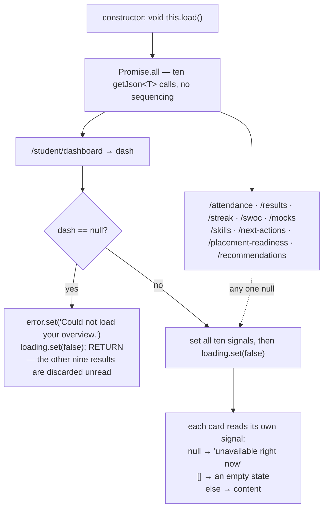
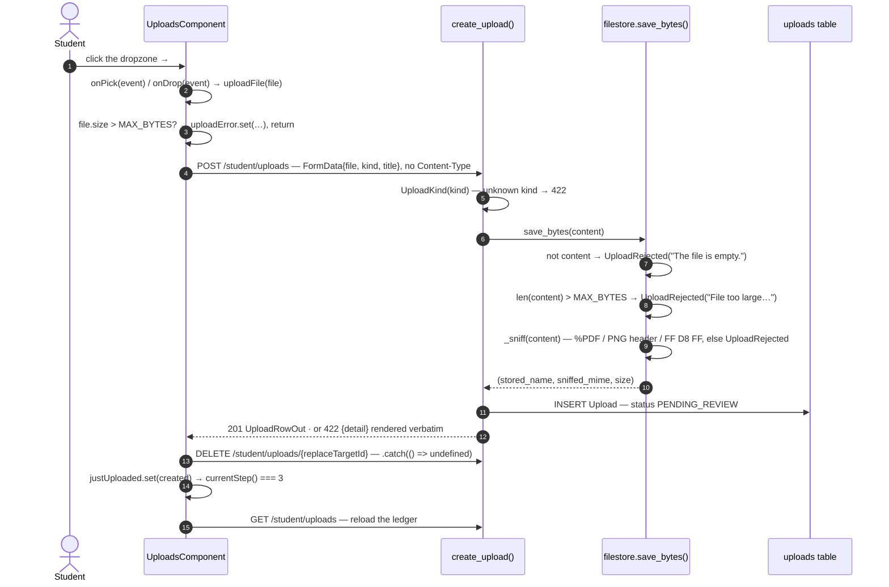
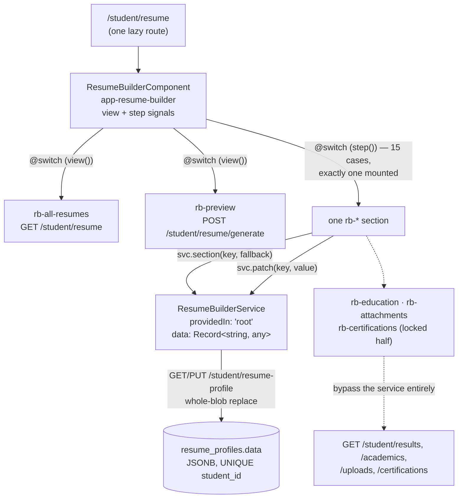
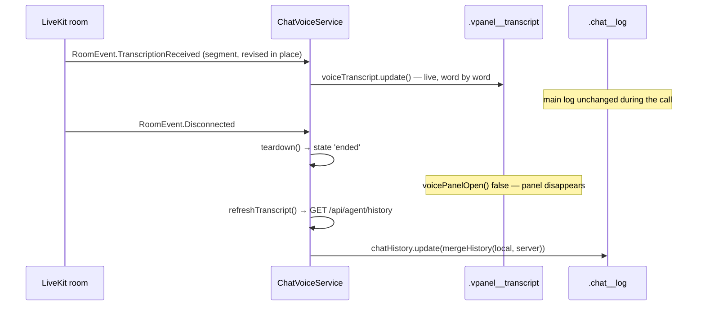

# Chapter 13 — Frontend Features: Every Screen a Student Actually Uses

When you finish this chapter you will be able to open any screen in REEP, name the file
that draws it before you look, predict which endpoints it will hit and in what order,
know what it shows while loading and what it shows when that endpoint is down, and say
whether the number on the screen was decided by the server or re-derived in the browser.
You will also know — precisely, with file and line — every place where a screen departs
from the house pattern Chapter 12 established, which is the list you want in front of you
the first time one of these screens misbehaves.

**In scope.** Every component under `apps/web/src/app/features/`: the student dashboard,
records, academics, jobs, offers, certifications, courses, uploads, skilling,
leaderboards, time-log, profile, the twenty-eight-file resume builder, the assistant UI, login,
registration, and the placeholder that stands in for every staff screen.

**Deferred.** Chapter 12 owns bootstrap, the route table's mechanics, the guard, the
`core/` services, the shared `kit-*` components and the nine house patterns — this
chapter cites them and reports deviations rather than restating the rules. Chapter 11
owns `core/chat-voice.service.ts` in full; §8 documents only the assistant's *UI* over
it. Chapter 14 owns `apps/web/src/styles/*.scss`, so global class names are named here
but never defined — but *component-local* class names are this chapter's territory and
§1 states their convention. Chapter 6 owns the student endpoints and their rule engines;
where a screen's number and the server's number disagree, this chapter states the
disagreement and points at Chapter 6 for the authoritative rule. Chapter 2 owns
`filestore.py`'s real upload limits, which §5 compares the client's against.

**Which tree this describes.** Every line number here is read from the committed tree.
That matters in exactly one place: the three files of
`apps/web/src/app/features/assistant/` carry an **uncommitted** rewrite in the working
directory, which replaces the general REEP Agent surface documented in §8 with a
realtime "Mock interview" screen (`git diff HEAD` shows 436 changed lines of template,
648 of TypeScript). §8 documents the committed component — 476 lines of TypeScript and
371 of template — because that is the version the rest of the repo, the route table and
the shell nav are wired against. If the working-tree rewrite lands, §8 is the section to
rewrite first.

---

## 1. The feature layer at a glance

### The folder convention

`apps/web/src/app/features/` holds one directory per screen, and the directory is named
for the screen, not for the class. Inside it lives the triplet Chapter 12 §10 describes:
`<screen>.component.ts` alongside `<screen>.component.html` and `<screen>.component.scss`,
wired with `templateUrl: './x.component.html'` and `styleUrl: './x.component.scss'`.
Angular accepts two spellings for that second one: `styleUrls: [...]`, an **array**, which
is the older form and lets a component pull in several sheets, and the **singular**
`styleUrl` added in v17, which takes one string. Every component in `features/` uses the
singular, because the folder convention gives each screen exactly one stylesheet — if you
find yourself reaching for the array, the thing you want is probably a global class
(Chapter 14) rather than a second component sheet. Student screens nest one level deeper
under `features/student/`, so the full path of the jobs board is
`features/student/jobs/jobs.component.ts`.

The class is PascalCase ending in `Component`; the selector is `app-` plus the kebab
feature name with the area folded in — `JobsComponent` / `app-student-jobs`,
`RecordsComponent` / `app-student-records`. Two families deliberately break the `app-`
prefix: the shared kit uses `kit-`, and the seventeen resume-builder sub-components use
`rb-` (§7).

Not every screen keeps the triplet. Twelve of the fifteen resume sections inline their
`template:` string, and `PlaceholderComponent` inlines both `template:` and `styles:` —
it is forty lines and has one input.

### The naming conventions this layer follows

Chapter 15 collects the repo's conventions; four of them are established here, and they
are worth stating because every quote in this chapter obeys them and nothing enforces
them mechanically.

**Verb prefixes on methods.** A method's first word tells you what kind of thing it is.

| Prefix | Means | Examples in `features/` |
|---|---|---|
| `load*` | a fetcher, always `private async`, always invoked from the constructor with `void` | thirteen bare `load()`s plus ten suffixed ones: `loadJobs`, `loadOffers` ([jobs.component.ts:187](apps/web/src/app/features/student/jobs/jobs.component.ts#L187), [:204](apps/web/src/app/features/student/jobs/jobs.component.ts#L204)), `loadResults`, `loadAttendance`, `loadAcademics` ([records.component.ts:148](apps/web/src/app/features/student/records/records.component.ts#L148)), `loadSkills`, `loadClaims`, `loadCatalogue` ([skilling.component.ts:132](apps/web/src/app/features/student/skilling/skilling.component.ts#L132)), `loadIdentity` ([basic.component.ts:218](apps/web/src/app/features/student/resume/sections/basic.component.ts#L218)), `loadHistory` (assistant) |
| `on*` | a DOM event handler, bound from the template | `onPick`, `onDrop`, `onDragOver`, `onDragLeave` ([uploads.component.ts:163](apps/web/src/app/features/student/uploads/uploads.component.ts#L163)), `onClaimFile` ([skilling.component.ts:143](apps/web/src/app/features/student/skilling/skilling.component.ts#L143)), `onPhotoFile`, `onEdit` |
| `set*` | a state mutator that may do more than assign | `setTab`, `setSubtab`, `setLevel`, `setKind`, `setHidden`, `setHours`, `setField`, `setBaseline`, `setEmail`, `setItem`, `setLinkType`, `setLinkUrl`, `setState` |
| `toggle*` | a binary flip | `toggleForm`, `toggleHistory`, `togglePassword` |

**Signal naming.** Signals are `readonly` and camelCase, and three suffixes carry meaning:
`*State` for a `LoadState` partner to a data signal (`resultsState`, `attendanceState`,
`academicsState` — all three in `records.component.ts`); `*Error` for a *per-panel* error
string, which is how one dead endpoint degrades one card rather than the page
(`offersError`, `uploadError`, `claimError`, `claimsError`, `skillsError`, `actionError`,
`formError`, `saveError`, `photoError`, `historyError` — ten of them across the layer);
and `*Id` for an armed or selected target (`replaceTargetId`, `removingId`, `photoId`,
`claimSkillId`, `defaultId`).

**Private helpers carry no underscore.** The TypeScript side uses the `private` keyword
and a bare name: `private clampH`, `private skillIcon`, `private getJson`,
`private joinSwoc`. A grep for `private _` across `features/` returns nothing. This is the exact
opposite of the Python side, where privacy is spelled with a leading underscore
(`_offer_out`, `_readiness_band`, `_section_filled`). The book documents both languages,
so it is worth knowing that the same intent has two spellings depending on which half of
the repo you are in, and that translating a helper across the boundary means renaming it.

**Component-local CSS classes are BEM-ish; global classes are flat.** Inside a component
stylesheet, a class is a *block* named for the region it paints, `__` for an element
inside that block, `--` for a modifier: `.chat__log`, `.msg__col`, `.msg--user`,
`.vpanel__status`, `.checklist__head`, `.brand-strip__name`, `.assist-note__link`,
`.up-card--busy`, `.field--invalid`. The feature stylesheets hold **113 distinct
`block__element` names and 28 `block--modifier` names**. The global REEP v2 classes
Chapter 14 owns are the opposite shape — flat single words, no block prefix: `.card`,
`.chip`, `.dt-table`, `.badge`, `.stepper`. That difference *is* the rule: a flat name in
a component stylesheet is a name that can collide with a global, and every collision in
§10 (rows 18, 19 and 20 — `.stepper`, `.dt-btn`, `.badge`, `.fld`) is a local class that
skipped the block prefix. Prefix the block and the collision cannot happen.

### How a screen becomes a route

Every screen is registered in [app.routes.ts](apps/web/src/app/app.routes.ts) with
`loadComponent`, never a static `component:` reference. Chapter 12 §2 explains the
mechanism and the bundle budget that enforces it; the shape is always the same
([app.routes.ts:110-114](apps/web/src/app/app.routes.ts#L110)):

```ts
      {
        path: 'student/jobs',
        loadComponent: () =>
          import('./features/student/jobs/jobs.component').then((m) => m.JobsComponent),
      },
```

The file's own doc comment states the invariant in one direction — "Every nav destination
in the shell needs a route, or clicking it goes nowhere and navigation reads as broken"
([app.routes.ts:6-9](apps/web/src/app/app.routes.ts#L6)) — and nothing enforces the
converse. That asymmetry has consequences. The shell's nav
([app-shell.component.html:16-57](apps/web/src/app/layout/app-shell.component.html#L16))
lists exactly twelve student destinations: Landing, Jobs, Skilling, Leaderboards, Time
Sheet, then a **Programme** group of Certifications, Courses, Records, then a
**Documents** group of Uploads and Resume Builder, then a **More** group of REEP Agent
and Profile. The route table registers **fourteen** student paths. The two extras —
`student/academics` ([app.routes.ts:64-70](apps/web/src/app/app.routes.ts#L64)) and
`student/offers` ([app.routes.ts:115-119](apps/web/src/app/app.routes.ts#L115)) — have no
nav link. You reach them by typing the URL, or, for academics, by clicking a card the AI
agent emits: the `_FACTOR_ACTION` map at
[orchestrator.py:85-88](apps/api-py/app/ai/orchestrator.py#L85) sends the readiness
factors *CGPA*, *Live backlogs* and *Attendance* to the route `/student/academics`. Both
orphan screens are broken against the current API (§3, §4), and that is not a
coincidence: **an unlinked screen is a screen nobody notices rotting.**

That nav list is also the whole nav list. Lines 13-58 of the shell template contain no
`@if`, no `@for` and no `@switch` — the twelve `<a routerLink="/student/…">` elements are
static markup, and the only role-dependent thing anywhere in the header is the label
`REEP — {{ roleLabel() }}`
([app-shell.component.html:5](apps/web/src/app/layout/app-shell.component.html#L5)). A
mentor signing in gets the student nav; so does a director. Every one of the fifteen
`mentor/*` and `director/*` placeholder routes below is therefore unlinked as well, which
means the rotting-screen rule applies to the **entire staff surface**, not just to the two
student orphans — the difference is only that the staff screens have nothing in them yet
to rot.

> **Why it is like this.** The route table's comment records the failure that made
> laziness non-negotiable: "A static `import` at the top of this file pulls the component
> into the initial bundle no matter which route the user visits — which is how every
> screen in the app ended up in one 1.23 MB `main` chunk with no lazy chunks at all. A
> student on a phone was downloading the mentor and director UIs, plus the resume builder
> and the assistant, before the login form could paint."
> ([app.routes.ts:13-18](apps/web/src/app/app.routes.ts#L13))

### The index — every feature component

Sizes are `.ts` lines + `.html` lines where a separate template exists.

**How to read the endpoint column.** Paths are written the way the component writes them,
and every one is prefixed at runtime with `environment.apiBase`, which is the string
`'/api'` ([environment.ts:11](apps/web/src/environments/environment.ts#L11)). So the
literal `'/student/dashboard'` in the source reaches the server as `/api/student/dashboard`.
Nothing in the browser knows the API's host or port: `proxy.conf.json` forwards `/api` to
`http://localhost:3300` in development, which is what keeps the app **same-origin** so
the httpOnly `reep_session` cookie rides along without CORS. The environment file states
the reason in its own comment: "The dev proxy (proxy.conf.json) forwards /api ->
http://localhost:3300 so this stays same-origin in the browser and the http-only session
cookie is carried without CORS friction."

One row is written differently on purpose. The assistant's paths appear below **with** the
`/api` prefix because `ChatVoiceService` hard-codes the literal string — `fetch('/api/agent/ask', …)`
([chat-voice.service.ts:257](apps/web/src/app/core/chat-voice.service.ts#L257)),
`this.http.get('/api/agent/history', …)`
([:221](apps/web/src/app/core/chat-voice.service.ts#L221)) — rather than composing it from
`environment.apiBase` the way `AuthService`
([auth.service.ts:35](apps/web/src/app/core/auth.service.ts#L35)) and every feature screen
do. The two spellings resolve to the same URL today; they would stop doing so the moment
`apiBase` changed for a deployment, and only the hard-coded half would break. Chapter 12
owns `core/`, so this chapter only records the fact that the table is quoting two
different conventions.

| Component | Selector | Route | Endpoints consumed | Size |
|---|---|---|---|---|
| `StudentOverviewComponent`<br>`student/overview/student-overview.component.ts` | `app-student-overview` | `/student` | GET `/student/dashboard`, `/attendance`, `/results`, `/streak`, `/swoc`, `/mocks`, `/skills`, `/next-actions`, `/placement-readiness`, `/recommendations` | 467 + 236 |
| `RecordsComponent`<br>`student/records/records.component.ts` | `app-student-records` | `/student/records` | GET `/student/results`, `/attendance`, `/academics` | 220 + 250 |
| `AcademicsComponent`<br>`student/academics/academics.component.ts` | `app-student-academics` | `/student/academics` *(no nav link)* | GET `/student/academics`; PUT `/student/academics` **(no such route)** | 125 + 97 |
| `CertificationsComponent`<br>`student/certifications/certifications.component.ts` | `app-student-certifications` | `/student/certifications` | GET `/student/certifications` | 117 + 86 |
| `CoursesComponent`<br>`student/courses/courses.component.ts` | `app-student-courses` | `/student/courses` | GET `/student/courses` | 106 + 86 |
| `JobsComponent`<br>`student/jobs/jobs.component.ts` | `app-student-jobs` | `/student/jobs` | GET `/student/jobs`, `/student/offers`; POST `/student/jobs/{id}/apply`, `/student/offers` | 360 + 309 |
| `OffersComponent`<br>`student/offers/offers.component.ts` | `app-student-offers` | `/student/offers` *(no nav link)* | GET `/student/offers`; POST `/student/offers`, `/student/offers/{id}/submit` | 181 + 104 |
| `UploadsComponent`<br>`student/uploads/uploads.component.ts` | `app-student-uploads` | `/student/uploads` | GET `/student/uploads`; POST `/student/uploads`; DELETE `/student/uploads/{id}`; image GET `/student/uploads/{id}/file` | 303 + 231 |
| `SkillingComponent`<br>`student/skilling/skilling.component.ts` | `app-student-skilling` | `/student/skilling` | GET `/student/skills`, `/student/skill-claims`, `/student/skills/catalogue`; POST `/student/uploads`, `/student/skill-claims` | 216 + 109 |
| `LeaderboardsComponent`<br>`student/leaderboards/leaderboards.component.ts` | `app-student-leaderboards` | `/student/leaderboards` | GET `/student/leaderboards?board=`; PUT `/student/leaderboard-visibility` | 195 + 121 |
| `TimeLogComponent`<br>`student/time-log/time-log.component.ts` | `app-student-time-log` | `/student/time-log` | GET `/student/timesheet?days=1`; POST `/student/timesheet` ×5 | 229 + 100 |
| `ProfileComponent`<br>`student/profile/profile.component.ts` | `app-student-profile` | `/student/profile` | GET `/student/profile`, `/student/dashboard`; PUT `/student/profile` | 394 + 211 |
| `ResumeBuilderComponent` + 15 sections + 2 views + 1 service<br>`student/resume/**` | `app-resume-builder`, `rb-*` | `/student/resume` | GET/PUT `/student/resume-profile`; GET `/student/results`, `/academics`, `/uploads`, `/certifications`, `/resume`, `/dashboard`; POST `/student/uploads`, `/student/resume/generate`; GET `/student/resume/{id}/pdf` | 28 files (19 `.ts`, 6 `.html`, 3 `.scss`), 3,612 `.ts` lines |
| `AssistantComponent`<br>`assistant/assistant.component.ts` | `app-assistant` | `/student/assistant`, `/mentor/assistant`, `/director/assistant` | via `ChatVoiceService`: GET `/api/agent/history`; POST `/api/agent/ask`, `/api/agent/feedback`; DELETE `/api/agent/conversation`; POST `/api/voice/consent`; GET `/api/voice/status`; POST `/api/voice/token` | 476 + 371 |
| `LoginComponent`<br>`login/login.component.ts` | `app-login` | `/login` (unguarded) | via `AuthService`: POST `/auth/login`; a plain `<a href>` to `/api/auth/sso/google` | 111 + 157 |
| `RegistrationComponent`<br>`register/registration.component.ts` | `app-registration` | `/register` (unguarded) | POST `/register` | 123 + 102 |
| `PlaceholderComponent`<br>`placeholder/placeholder.component.ts` | `app-placeholder` | 15 `mentor/*` and `director/*` routes | none | 40 (inline) |

Two facts fall out of that table. First, **every real screen in the product is a student
screen, plus login, register and the assistant.** Fifteen of the seventeen `mentor/*` and
`director/*` routes resolve to `PlaceholderComponent` — seven mentor paths and eight
director ones, all registered through the `placeholder(...)` helper
([app.routes.ts:135-161](apps/web/src/app/app.routes.ts#L135)). The other two are the
staff entrances to the assistant: `mentor/assistant`
([app.routes.ts:141-145](apps/web/src/app/app.routes.ts#L141)) and `director/assistant`
([app.routes.ts:156-160](apps/web/src/app/app.routes.ts#L156)) `loadComponent` the very
same `AssistantComponent` the student route does. No client code calls `/api/mentor` or
`/api/director` at all. Second, **there is no HTTP service layer, no repository, no
interceptor** — every screen calls `fetch` for itself, with four exceptions that fall into
three kinds.

*Two screens never call `fetch` at all.* The placeholder issues no request of any sort — it
is a static forty-line component. And `LoginComponent` contains zero occurrences of
`fetch(`; it calls `this.auth.login(this.email, this.password, this.safeNext)`
([login.component.ts:93](apps/web/src/app/features/login/login.component.ts#L93)) and goes
through `HttpClient` via `AuthService`. That is a deliberate trade documented in §9: only
`HttpClient` gives it an `HttpErrorResponse` to type-narrow on, which is what lets it tell
a real 401 apart from a dead API.

*Two more delegate their reads to a root-provided service* — the assistant
(`ChatVoiceService`) and the resume builder (`ResumeBuilderService`) — because their state
must outlive the component: a live voice call and an unflushed autosave both have to
survive navigation. Everything else fetches for itself.

Adherence to the cookie rule across all of it is total and hand-maintained: **43 `fetch(`
call sites** under `apps/web/src` and **43 occurrences of `credentials: 'include'`**, with
no interceptor enforcing the match.

---

## 2. The student dashboard — `student-overview.component.ts`

This is the landing screen, the most-visited surface in the product, and the one place
where the design of the whole app is legible in a single method. Its header comment
states the running order it is built around
([student-overview.component.ts:1-15](apps/web/src/app/features/student/overview/student-overview.component.ts#L1)):
next actions, placement readiness, recommendations, SWOC, skill badges, and only then the
historical analytics. "Every card is independent — when its endpoint is missing, empty or
errors, the card shows its own state and the rest of the screen is unaffected."

### The fetch orchestration

The constructor is one line, `void this.load();`
([:190-192](apps/web/src/app/features/student/overview/student-overview.component.ts#L190)),
and `load()` is the whole network story
([:422-441](apps/web/src/app/features/student/overview/student-overview.component.ts#L422)):

```ts
  private async load(): Promise<void> {
    const [dash, att, res, streak, swoc, mocks, skills, actions, readiness, recos] =
      await Promise.all([
        this.getJson<Dashboard>('/student/dashboard'),
        this.getJson<AttendanceSummary>('/student/attendance'),
        this.getJson<SemesterResult[]>('/student/results'),
        this.getJson<Streak>('/student/streak'),
        this.getJson<SwocBoard>('/student/swoc'),
        this.getJson<MockAttempt[]>('/student/mocks'),
        this.getJson<StudentSkill[]>('/student/skills'),
        this.getJson<{ actions: NextAction[] }>('/student/next-actions'),
        this.getJson<PlacementReadiness>('/student/placement-readiness'),
        this.getJson<{ items: Recommendation[] }>('/student/recommendations'),
      ]);

    if (dash == null) {
      this.error.set('Could not load your overview.');
      this.loading.set(false);
      return;
    }
```

Ten reads, fully parallel, no sequencing and no dependency between them; the results are
destructured positionally, so **the order of that array is load-bearing** — insert an
eleventh read at position three without inserting a matching name and every name after the
insertion point binds to its neighbour's payload. There is no `catch` around the
`Promise.all`, and none is needed, because of the helper every element goes through
([:456-466](apps/web/src/app/features/student/overview/student-overview.component.ts#L456)):

```ts
  /// One shape for every read: null on any non-OK response or network error, so
  /// a missing sub-endpoint becomes a per-card empty state, never a crash.
  private async getJson<T>(path: string): Promise<T | null> {
    try {
      const res = await fetch(`${environment.apiBase}${path}`, { credentials: 'include' });
      if (!res.ok) return null;
      return (await res.json()) as T;
    } catch {
      return null;
    }
  }
```

`getJson` never rejects, so `Promise.all` never rejects. That is the mechanism behind the
header comment's promise. It is also the screen's single largest departure from the house
pattern, and §10 records it as such: Chapter 12 §9 Rule 2 says `!res.ok` and `catch` are
different diagnoses and must get different messages, and `getJson` deliberately collapses
them — and the status code with them. **The dashboard cannot tell a 401 from a 500 from
an offline browser**, and nine of its ten endpoints have no distinguishable failure
message at all. The trade is stated honestly in the comment, and for nine cards it is the
right trade; for the tenth it is why a logged-out session renders as "Could not load your
overview" instead of a redirect.

Here is the whole shape, and the one branch that aborts it:



Only `/student/dashboard` is load-bearing. When it returns null the method returns
*before any other signal is set*, so nine successful responses are thrown away and the
template renders only its error branch
([student-overview.component.html:3-6](apps/web/src/app/features/student/overview/student-overview.component.html#L3)):
a `.dt-header` reading "Landing" with the error as its sub-line, plus a card reading
"We couldn't reach your record. Please try again shortly." Any of the other nine failing
sets its own signal to `null` and leaves the rest of the page untouched.

Before either of those, there is a third state the student sees first. While the ten reads
are in flight the template renders one line — a `.dt-header` whose title is "Landing" and
whose sub-line is "Loading your overview…"
([student-overview.component.html:1-2](apps/web/src/app/features/student/overview/student-overview.component.html#L1)).
No skeletons, no per-card spinners, no progressive fill. That follows directly from the
`Promise.all`: `loading` is cleared exactly once, after all ten settle, so **one slow
endpoint holds the entire first paint** even though nine of the ten have already answered.
The per-card independence the header comment promises begins only after that single gate
opens.

Two responses are unwrapped rather than stored raw
([:450-452](apps/web/src/app/features/student/overview/student-overview.component.ts#L450)):

```ts
    this.nextActions.set(actions ? actions.actions : null);
    this.readiness.set(readiness);
    this.recommendations.set(recos ? recos.items : null);
```

because `NextActionsOut` and `RecommendationsOut` are envelopes — `{actions: [...]}` and
`{items: [...]}` — while `PlacementReadinessOut` is a bare object. The ternary is what
preserves the null-versus-empty distinction through the unwrap.

### State: twelve signals, and what `null` means

Two control signals — `loading = signal(true)` and `error = signal<string | null>(null)`
([:174-175](apps/web/src/app/features/student/overview/student-overview.component.ts#L174))
— then ten data signals, all `T | null`. The action-led three carry an explicit comment
naming the convention
([:185-188](apps/web/src/app/features/student/overview/student-overview.component.ts#L185)):

```ts
  // Action-led sections (null = section failed to load → per-card error state).
  readonly nextActions = signal<NextAction[] | null>(null);
  readonly readiness = signal<PlacementReadiness | null>(null);
  readonly recommendations = signal<Recommendation[] | null>(null);
```

This is Chapter 12 §9 Rule 6 — `null` means "not resolved", `[]` means "resolved, nothing
there" — and the template honours it card by card. `nextActions() === null` renders "Your
next actions are unavailable right now."
([html:23-24](apps/web/src/app/features/student/overview/student-overview.component.html#L23));
an empty array renders a celebratory `chip good` "You're all caught up" plus "Nothing
needs your attention right now — great work."
([html:44-47](apps/web/src/app/features/student/overview/student-overview.component.html#L44)).
Recommendations do the same, and skill badges go three ways: null → "Skill badges are
unavailable right now.", empty → "No skills recorded yet — upload a certificate to claim
one.", else the badge row
([html:179-197](apps/web/src/app/features/student/overview/student-overview.component.html#L179)).
One card breaks the rule in the opposite direction. SWOC's `@else` branch renders "No SWOC
inputs yet — your mentor and the placement cell add these."
([html:121-123](apps/web/src/app/features/student/overview/student-overview.component.html#L121))
— empty-state wording — but that branch fires **only on a failed load**. `swocBoxes`
([:298-327](apps/web/src/app/features/student/overview/student-overview.component.ts#L298))
returns `null` if and only if `this.swoc()` is null, which happens only when `getJson`
returned null. A genuinely empty board is a 200: `my_swoc`
([student.py:263-288](apps/api-py/app/routers/student.py#L263)) always constructs a
`SwocBoardOut` and never 404s, so four empty lists come back, `swocBoxes` returns its four
boxes, and `joinSwoc`
([:329-331](apps/web/src/app/features/student/overview/student-overview.component.ts#L329))
prints "No entries yet" inside each one. The two states do produce different text — but the
one the student sees when the endpoint is down reads as though their mentor simply has not
written anything yet.

### The cards, and how the numbers are made

**The header strip.** Above every card sits one `.dt-header`
([student-overview.component.html:8-18](apps/web/src/app/features/student/overview/student-overview.component.html#L8))
built from four values: `firstName()`, which splits the first whitespace-delimited token
off `dashboard()?.name` and yields `''` rather than "undefined" when the name is missing
([:196-199](apps/web/src/app/features/student/overview/student-overview.component.ts#L196));
`stageLabel()`, which looks the stage key up in `STAGES` and **falls back to the raw enum
key** before falling back to `''`
([:201-204](apps/web/src/app/features/student/overview/student-overview.component.ts#L201)),
so an unknown stage prints `EXCEL_ADVANCED` rather than nothing; and `d.current_semester`
and `d.usn` interpolated straight from the dashboard payload, the USN guarded by a
ternary so a student without one does not get a dangling separator. Worth noting where the
streak chip lives: it is rendered **here, in the header**, not in the Login-streak card at
the bottom of the page. The card at the bottom draws the seven-cell strip; the header draws
the one-line verdict. Two surfaces, one `streakChip()`/`streak()` pair behind them.

**Next actions.** `topActions` is the whole client-side logic
([:208-209](apps/web/src/app/features/student/overview/student-overview.component.ts#L208)):

```ts
  /** Show the most urgent few; the endpoint already sorts by priority asc. */
  readonly topActions = computed(() => this.nextActions()?.slice(0, 4) ?? []);
```

The comment is true — [student.py:2006-2007](apps/api-py/app/routers/student.py#L2006)
does `actions.sort(key=lambda a: a.priority)` then `return NextActionsOut(actions=actions[:5])`.
The server hands over five and the client shows four, so **the fifth action is
permanently invisible.** Each row prints the title, the reason, a status chip, an optional
deadline chip, and a `routerLink` to the server-supplied `cta_route`.

The status chip is the codebase's model statement of the colour rule
([:153-162](apps/web/src/app/features/student/overview/student-overview.component.ts#L153)):

```ts
/** Status-label → chip tone + icon. TEXT is always the label itself, so colour
 *  is never the only signal. Unknown labels fall back to a neutral chip. */
const STATUS_CHIPS: Record<string, StatusChip> = {
  Overdue: { cls: 'risk', icon: 'warning' },
  'In progress': { cls: 'warn', icon: 'schedule' },
  Missing: { cls: 'risk', icon: 'error' },
  Incomplete: { cls: 'warn', icon: 'pending' },
  'Pending review': { cls: 'neutral', icon: 'hourglass_top' },
  Unverified: { cls: 'warn', icon: 'help' },
};
```

Those six keys are the six literal status strings `next_actions` emits, verified
one-for-one against the handler at
[student.py:1837-2007](apps/api-py/app/routers/student.py#L1837). The
lookup is total — `STATUS_CHIPS[status] ?? { cls: 'neutral', icon: 'info' }`
([:211-213](apps/web/src/app/features/student/overview/student-overview.component.ts#L211))
— and the template prints `{{ a.status }}` beside the chip, so a renamed server string
degrades to a grey chip with the right words rather than crashing or blanking. It does
lose the urgency colour silently, which is the cost of a total fallback.

**Placement readiness.** The client displays `r.score` out of 100, the band, the summary
and the six weighted factors. It never derives the band from the score; it maps the
server's band string to a tone
([:223-227](apps/web/src/app/features/student/overview/student-overview.component.ts#L223)):

```ts
  bandChip(band: string): ChipTone {
    if (band === 'Ready' || band === 'On track') return 'good';
    if (band === 'Developing') return 'warn';
    return 'risk';
  }
```

`_readiness_band` emits exactly `Not ready` / `Developing` / `On track` / `Ready`
([student.py:2024-2031](apps/api-py/app/routers/student.py#L2024)), so the mapping is
correct today. Note the failure mode is asymmetric: an added or renamed band falls into
the `else` and paints red. That is a hard-coded copy of the server's vocabulary, not a
recomputation — an important distinction §10 returns to.

**Recommendations.** The third of the three action-led sections, and the one with the
least client-side logic of any card on the screen: there is no `computed` behind it at
all, the template reads `recommendations()` directly. Each row prints three server-supplied
fields and nothing else
([student-overview.component.html:85-103](apps/web/src/app/features/student/overview/student-overview.component.html#L85)):
`rec.title` as the headline, `rec.why` beneath it as a `.dt-sub` sub-line explaining the
nudge, and an `<a class="dt-btn sm" [routerLink]="rec.cta_route">{{ rec.cta_label }}</a>`
— so both the destination and the wording of the button are decided by
`/student/recommendations`, and adding a recommendation type needs no frontend change at
all. That is the same contract next actions uses, and it is why these two cards never
diverge from the server.

One hazard is worth naming because it is invisible until it bites. The loop is
`@for (rec of recommendations(); track rec.title)`
([:90](apps/web/src/app/features/student/overview/student-overview.component.html#L90)) — a
**content-keyed track**, not `track $index`. `track` is Angular's identity key: it tells
the framework which rendered node belongs to which item so nodes are reused across
re-renders instead of being torn down and rebuilt. Keying on content is usually the better
choice, but it makes the key's uniqueness a contract: two recommendations that happen to
share a `title` are two items claiming one identity, and the framework can no longer tell
their nodes apart. Nothing on the server guarantees titles are distinct, and nothing on
this screen would show you that they were not.

The empty branch is the model the rest of the app should copy, and rule 6 in §11 asks for
exactly this: instead of "None", it says what will fill the card — "Recommendations appear
once you start a certification or claim a skill — take your first action above and check
back."
([:101](apps/web/src/app/features/student/overview/student-overview.component.html#L101)).
The failed branch, one line above, is a different sentence for a different situation:
"Recommendations are unavailable right now."

**The stage donut.** `stagePct`
([:231-236](apps/web/src/app/features/student/overview/student-overview.component.ts#L231))
finds the current stage's index in the module table `STAGES`
([:138-143](apps/web/src/app/features/student/overview/student-overview.component.ts#L138)),
whose four keys — `REBOOT`, `EXCEL`, `EXCEL_ADVANCED`, `ELEVATE` — match the `Stage` enum
exactly ([models/user.py:30-36](apps/api-py/app/models/user.py#L30), docstring "The REEP
developmental stages, in order."). It then returns
`Math.round(((idx + 1) / STAGES.length) * 100)`
([:235](apps/web/src/app/features/student/overview/student-overview.component.ts#L235)) —
25 / 50 / 75 / 100 for the four stages that exist today, and 0 for an unknown key. Read the
divisor rather than the number: it is `STAGES.length`, not a literal `4`, so adding a fifth
stage to the table rescales the donut to 20 / 40 / 60 / 80 / 100 with no other edit. Writing
`/ 4` there would have made the table a lie the first time the programme changed. `donutStyle`
turns the percentage into a
`conic-gradient(var(--amber-600) 0% ${p}%, var(--line) ${p}% 100%)` bound as
`[style.background]`. This is a pure client invention — no server field corresponds to it
— so it cannot diverge from anything.

**Attendance and marks bars.** `attendanceBars` prefers the per-course breakdown, taking
six courses and labelling each with its code and rounded percentage; when there is no
breakdown it falls back to a single "Overall" bar built from the dashboard's
`attendance_percent`, with the comment "Fall back to the single overall % the dashboard
always carries." `marksBars` maps each semester to `r.cgpa ?? r.sgpa`, drops nulls with a
type-guard filter, and scales a 10-point GPA to a percentage. Both feed the shared height
guard ([:416-420](apps/web/src/app/features/student/overview/student-overview.component.ts#L416)):

```ts
  /// Keep a non-zero value visible (min 6%) while clamping to the chart height.
  private clampH(v: number): number {
    if (v <= 0) return 3;
    return Math.max(6, Math.min(100, Math.round(v)));
  }
```

Zero maps to 3, a visible stub rather than nothing — so an empty bar is distinguishable
from a missing bar.

**SWOC** becomes four fixed boxes — Strength, Weakness, Opportunity, Challenge — built by
`swocBoxes`
([:298-327](apps/web/src/app/features/student/overview/student-overview.component.ts#L298)),
whose items are flattened to a single string by `joinSwoc`
([:329-331](apps/web/src/app/features/student/overview/student-overview.component.ts#L329)):
`items.map((i) => i.text).join(' · ')`, or the literal `'No entries yet'` for an empty
list. Each box also carries a *framing* sentence that turns an analysis into an
instruction — "Leverage this in your applications and interviews.", "Recommended activity
— turn this into a skilling goal.", "Act before the window closes — check the jobs board
and deadlines.", "Plan a prep task now to get ahead of this." Those four strings are
client-side copy with no server counterpart, which is why they can be trusted to stay put:
there is nothing for them to diverge from.

**Mocks.** The analytics run ends with a card the header comment names but the fetch list
makes easy to lose track of: `/student/mocks` returns a flat `MockAttempt[]`, and three
chained `computed`s turn it into a chart. `mockCounts`
([:335-345](apps/web/src/app/features/student/overview/student-overview.component.ts#L335))
tallies attempts into `{ GD, INTERVIEW, APTITUDE }`, ignoring any `type` outside those
three, and returns `null` — not a zeroed object — when the fetch failed, which is how the
null-versus-empty distinction survives the aggregation. `mockSummary`
([:347-351](apps/web/src/app/features/student/overview/student-overview.component.ts#L347))
is the one-line read-out `GD: 2 · Interview: 1 · Aptitude: 0`. `mockBars`
([:353-365](apps/web/src/app/features/student/overview/student-overview.component.ts#L353))
maps `MOCK_TYPES`
([:147-151](apps/web/src/app/features/student/overview/student-overview.component.ts#L147))
into the same `Bar` shape attendance and marks use, but with its **own** scaling rule
rather than `clampH`: the tallest bar is `Math.max(GD, INTERVIEW, APTITUDE, 1)`, each bar
is that fraction floored at 10 %, and a zero count drops to 3. So the mocks chart is
*relative* — three attempts and thirty attempts draw the same full-height bar — while the
attendance and marks charts beside it are absolute percentages. Two charts, two scales, no
axis on either.

`hasMocks()`
([:367-370](apps/web/src/app/features/student/overview/student-overview.component.ts#L367))
gates the whole card, and it is false both when `mockCounts` is `null` (the endpoint
failed) and when all three counts are zero (a student who has taken none). Both render the
same sentence — "No mock assessments taken yet."
([student-overview.component.html:201-218](apps/web/src/app/features/student/overview/student-overview.component.html#L201))
— which is the SWOC problem again in a milder form: a failed load is worded as an empty
history. It is milder only because a student with no mocks is the common case and a
student who has taken some will notice them missing.

**Badges.** `badges`
([:374-387](apps/web/src/app/features/student/overview/student-overview.component.ts#L374))
does four things, and each has a reason. It copies the array before sorting — `[...rows]`
— because `Array.prototype.sort` mutates in place, and mutating the array inside a signal
would change the value without changing its identity, which is precisely the class of bug
that leaves a screen showing stale data. It sorts verified-first with
`Number(b.verified) - Number(a.verified)`, so a student's *proven* skills take the visible
slots before any unverified claim does — the row is a reward surface, and an unverified
claim earning the same prominence as a mentor-verified one would hollow that out. It then
`slice(0, 8)`s, because the badge row is a single line of a fixed-width card and a ninth
badge would wrap it. And for every unverified skill it emits a locked badge whose `title`
spells out the way out — "Verify a {category} skill to unlock this badge" — rather than
simply greying the tile, so the affordance explains itself on hover. The icon comes from
`skillIcon`
([:389-398](apps/web/src/app/features/student/overview/student-overview.component.ts#L389)),
a private regex ladder over `` `${s.slug} ${s.name} ${s.category}` `` lowercased, mapping
`excel|spreadsheet` to `calculate` and `sql|database|python|java|code|program|develop` to
`terminal`, and defaulting to `verified` — a total lookup, per the same rule the status
chips follow.

**Streak.** `streakChip`
([:402-407](apps/web/src/app/features/student/overview/student-overview.component.ts#L402))
returns `null` when the endpoint failed — so the header chip simply does not render, rather
than claiming a zero streak — a warn chip "No active streak" at a genuine zero, else a good
chip "{n}-day login streak". `streakCells`
([:409-412](apps/web/src/app/features/student/overview/student-overview.component.ts#L409))
is two statements, and the first is where the saturation happens:

```ts
    const on = Math.min(this.streak()?.current ?? 0, 7);
    return Array.from({ length: 7 }, (_, i) => i < on);
```

Seven cells, always; the `Math.min` caps the count at the strip's width. A forty-day streak
and a seven-day streak render identically. The chip beside it carries the real number,
which is the only reason that is acceptable — it is the text-plus-colour rule doing real
work, because here the graphic genuinely cannot express the value.

---

## 3. Records and academics — the same data, two philosophies

### `records.component.ts` — three independent loads, no aggregation

Records is the read-only screen the REEP Agent points at, and its header comment states
both its architecture and its DTO discipline in one paragraph
([records.component.ts:1-15](apps/web/src/app/features/student/records/records.component.ts#L1)):

> **Why it is like this.** "One read-only screen that aggregates a student's academic
> records from three independent endpoints, each of which loads, empties and fails on its
> own so a single unreachable section never blanks the page… Interfaces are snake_case,
> verbatim from student.py's *Out models — no client remapping. STATUS is always text +
> colour together (the .chip tones), never colour alone."

There is no aggregate loader. The constructor fires three void-ed methods
([:142-146](apps/web/src/app/features/student/records/records.component.ts#L142)) and each
owns a signal pair — `results`/`resultsState`, `attendance`/`attendanceState`,
`academics`/`academicsState` — typed with the local
`type LoadState = 'loading' | 'ready' | 'error'`
([:21](apps/web/src/app/features/student/records/records.component.ts#L21)). All three
loaders are byte-for-byte the same shape apart from the URL and the signal names
([:148-160](apps/web/src/app/features/student/records/records.component.ts#L148)):

```ts
  private async loadResults(): Promise<void> {
    try {
      const res = await fetch(`${environment.apiBase}/student/results`, { credentials: 'include' });
      if (!res.ok) {
        this.resultsState.set('error');
        return;
      }
      this.results.set((await res.json()) as SemesterResult[]);
      this.resultsState.set('ready');
    } catch {
      this.resultsState.set('error');
    }
  }
```

Note what that costs relative to the house pattern: because the state is a three-value
enum rather than an error *string*, `!res.ok` and `catch` produce the identical outcome.
Records is the mirror image of the dashboard's over-generalisation — twelve lines
triplicated instead of one helper — and both end up losing the same distinction. §10
records it.

Its interfaces are the ones to copy. `SubjectMark`/`SemesterResult`
([:25-42](apps/web/src/app/features/student/records/records.component.ts#L25)) match
`SubjectMarkOut`/`SemesterResultOut`, `CourseAttendance`/`AttendanceSummary`
([:45-56](apps/web/src/app/features/student/records/records.component.ts#L45)) match their
`*Out` models, and `Qualification`/`AcademicGap`/`Academics`
([:59-81](apps/web/src/app/features/student/records/records.component.ts#L59)) match
[student.py:461-484](apps/api-py/app/routers/student.py#L461) field for field including
the server-computed `percent` and `total_mo`. **Records is the only one of the two
academics-consuming screens outside the resume builder that is correct against the API.**

The template opens with a four-tile headline strip gated on
`resultsState() === 'ready' && results().length`
([records.component.html:9-30](apps/web/src/app/features/student/records/records.component.html#L9)):
Latest CGPA, Semesters on record, Live backlogs, Overall attendance. The last tile is a
cross-panel read — it prints an em dash when attendance failed — so an attendance outage
shows a dash inside a strip that otherwise rendered fine. Each of the three sections below
is a four-way ladder: `loading` → a `.card.c-note` "Loading your semester results…";
`error` → "We could not load your semester results just now. Please refresh in a moment.";
empty → "No semester results yet. They appear here once the examination office imports
your VTU marks."; else the content. Attendance's empty test is stricter than a null check
— `!attendance() || attendance()!.total === 0` — so a student with a summary row and zero
classes gets the empty message rather than "0%".

The attendance panel is the most accessible markup on any student screen: a
`role="progressbar"` meter carrying `[attr.aria-valuenow]`, `aria-valuemin`,
`aria-valuemax` and an `aria-label`, with the fill tinted *and* the number printed beside
it ([records.component.html:139-147](apps/web/src/app/features/student/records/records.component.html#L139)).

Two derived values on this screen are recomputations of server rules, and §10 lists them
as divergences. `attendanceChip` hard-codes 85 and 75
([:194-206](apps/web/src/app/features/student/records/records.component.ts#L194)) while
the server reads `crit.min_attendance_pct` off the active `PlacementCriteria`, defaulting
to `75.0` when there is none ([student.py:2051](apps/api-py/app/routers/student.py#L2051))
against a model default of `85` ([placement_criteria.py:27](apps/api-py/app/models/placement_criteria.py#L27)).
And `latestCgpa` ([:127-134](apps/web/src/app/features/student/records/records.component.ts#L127))
scans the results array backwards for the first *non-null* CGPA, whereas the server's
`_latest_cgpa` takes the **highest semester row and returns its `cgpa`, null included**
([student.py:1782-1789](apps/api-py/app/routers/student.py#L1782)).

### `academics.component.ts` — the screen that cannot work

Academics is the editable counterpart: qualifications and gap months are student-owned,
semester CGPA and backlogs are staff-imported and read-only. Its header states why that
split is not negotiable
([academics.component.ts:1-9](apps/web/src/app/features/student/academics/academics.component.ts#L1)):

> **Why it is like this.** "The student edits their qualifications and gap months;
> per-semester CGPA and backlogs are staff-imported and shown read-only, so they cannot
> mark their own backlogs cleared to slip past an eligibility gate."

The copy carries the same argument to the student: the page subtitle explains "Placement
eligibility reads your CGPA, live backlogs and total gap — so keeping this accurate is
what puts you on the right side of a drive's cut-off"
([academics.component.html:3](apps/web/src/app/features/student/academics/academics.component.html#L3)),
the semester section is labelled "Imported by the office — your CGPA and backlogs.
Read-only.", and the gap section says "A gap over a drive's limit disqualifies — record it
honestly." Those numbers match the model defaults: `max_live_backlogs` is 0 and
`max_gap_months` is 24 ([placement_criteria.py:30-31](apps/api-py/app/models/placement_criteria.py#L30)).

The design is sound. The wiring is not, in three independent ways.

**1. It reads a key the endpoint does not send.** The header also records the provenance —
"Ported from pod.ai's /academics" — and the interfaces are the Prisma-era camelCase shape,
never re-targeted at FastAPI
([:31-33](apps/web/src/app/features/student/academics/academics.component.ts#L31)):

```ts
interface Gap { twelfthToGradMo: number; diplomaToGradMo: number; gradToPgMo: number; otherMo: number }
interface Semester { semester: number; cgpa: number | null; closedBacklogs: number; liveBacklogs: number }
interface AcademicsView { qualifications: Qualification[]; gap: Gap; semesters: Semester[] }
```

`AcademicsOut` ([student.py:482-485](apps/api-py/app/routers/student.py#L482)) declares
only `qualifications` and `gap`, in snake_case, and there is no alias generator anywhere in
`apps/api-py`. So `load()`'s `this.semesters.set(v.semesters)`
([:83](apps/web/src/app/features/student/academics/academics.component.ts#L83)) stores
`undefined`, and the template's first branch after `@if (loaded())` is
`@if (semesters().length === 0)`
([academics.component.html:10](apps/web/src/app/features/student/academics/academics.component.html#L10))
— a `.length` read on `undefined` during change detection. `this.gap = v.gap` assigns the
snake_case object, so every `[(ngModel)]="gap.twelfthToGradMo"` binding reads `undefined`
and the "Total gap" caption evaluates to `NaN`. Chapter 12 §9 Rule 8 explains why
`ng build` stays green: the cast `(await res.json()) as AcademicsView` is an assertion the
compiler never tests, and `strict` is off.

**2. It saves to a route that does not exist.** `save()` PUTs to `/student/academics`
([:107-112](apps/web/src/app/features/student/academics/academics.component.ts#L107)). The
backend exposes exactly one academics route,
`@router.get("/academics", response_model=AcademicsOut)`
([student.py:487](apps/api-py/app/routers/student.py#L487)) — a repo-wide grep for
`academics` across `app/routers/` returns exactly three source hits, and they are that one
route: the model import `from ..models.academics import SemesterResult`
([student.py:17](apps/api-py/app/routers/student.py#L17)), the `get` decorator above, and
the handler it decorates, `def my_academics(`
([student.py:488](apps/api-py/app/routers/student.py#L488)). There is no second decorator
and no `@router.put("/academics")` anywhere in the backend. Every save
is a 405, so the student sees "Could not save your academics." unconditionally. The
editable half of the screen — five level buttons, an eight-field qualification grid, four
gap inputs and a Save button — cannot persist anything.

**3. A `computed()` with no signal in it.** This one is worth studying because it is a
trap any Angular codebase can fall into
([:60-66](apps/web/src/app/features/student/academics/academics.component.ts#L60)):

```ts
  quals = signal<Qualification[]>([]);
  gap: Gap = { twelfthToGradMo: 0, diplomaToGradMo: 0, gradToPgMo: 0, otherMo: 0 };
  semesters = signal<Semester[]>([]);

  readonly totalGap = computed(() =>
    this.gap.twelfthToGradMo + this.gap.diplomaToGradMo + this.gap.gradToPgMo + this.gap.otherMo,
  );
```

`gap` is a plain mutable property, not a signal. `computed()` is lazy and memoises against
its *producer set*; with no producers it can never be invalidated, so "Total gap: N
months." is frozen at first read and never moves as the student types. By contrast
`liveBacklogs` on the very next line reads `this.semesters()`, a real signal, and is
properly reactive.

The corrective pattern already exists two directories away:
[resume/sections/education.component.ts:288-303](apps/web/src/app/features/student/resume/sections/education.component.ts#L288)
fetches `/student/results` **and** `/student/academics` in a `Promise.all` precisely
because academics carries no semesters, and guards with `academics.qualifications ?? []`.
Records reads `academics()!.gap.total_mo` directly rather than re-summing it. Two screens
consume this contract correctly; the orphan does not.

### Certifications and courses — the two well-behaved progress screens

Both were built later and both are textbook. `CertificationsComponent` holds a private
`rows = signal<CertRow[] | null>(null)` and exposes a `view` computed that decorates each
row with a chip, a bar tone and a human due read-out
([certifications.component.ts:70-101](apps/web/src/app/features/student/certifications/certifications.component.ts#L70)).
`dueReadout` turns `days_until_due` into "Overdue by 3 days" / "Due today" / "Due in 5
days" with a matching tone — colour and text together, per the rule, and the method's own
comment says so: "never colour-only". The template's ladder is
`@if (view(); as list)` → empty → grid, `@else if (error())`, `@else` "Loading…"
([certifications.component.html:11-86](apps/web/src/app/features/student/certifications/certifications.component.html#L11)),
and the progress bar is a real `role="progressbar"` with an `aria-label` naming the
certification.

`CoursesComponent` uses the other loading idiom — `courses = signal<Course[]>([])` plus
`state = signal<LoadState>('loading')`
([courses.component.ts:51-52](apps/web/src/app/features/student/courses/courses.component.ts#L51))
— and a four-way template ladder with a genuinely useful empty state: "You are not
enrolled in any courses yet. They appear here once the office registers you for the
semester." Its only client-side derivations are cosmetic: `stageLabel` title-cases the
enum (`EXCEL_ADVANCED` → "Excel Advanced") and `lecturesLeft` is
`Math.max(0, c.lectures_total - c.lectures_attended)`
([courses.component.ts:103-105](apps/web/src/app/features/student/courses/courses.component.ts#L103)).
Both files' headers note that all the real shaping — `progress_pct`, `next_task`,
`unlocks` — is computed server-side, rule-based, no LLM. These two are the closest thing
in the repo to a template for a new screen.

### The shape of a screen, in full

`courses.component.ts` is 106 lines, and the middle third of it is the entire house
pattern with nothing else in the way. Every rule in §11 is visible in these thirty-five
lines ([courses.component.ts:43-77](apps/web/src/app/features/student/courses/courses.component.ts#L43)):

```ts
@Component({
  selector: 'app-student-courses',
  standalone: true,
  imports: [RouterLink],
  templateUrl: './courses.component.html',
  styleUrl: './courses.component.scss',
})
export class CoursesComponent {
  readonly courses = signal<Course[]>([]);
  readonly state = signal<LoadState>('loading');

  readonly completedCount = computed(
    () => this.courses().filter((c) => c.status === 'COMPLETED').length,
  );
  readonly inProgressCount = computed(
    () => this.courses().filter((c) => c.status === 'IN_PROGRESS').length,
  );

  constructor() {
    void this.load();
  }

  private async load(): Promise<void> {
    try {
      const res = await fetch(`${environment.apiBase}/student/courses`, { credentials: 'include' });
      if (!res.ok) {
        this.state.set('error');
        return;
      }
      this.courses.set((await res.json()) as Course[]);
      this.state.set('ready');
    } catch {
      this.state.set('error');
    }
  }
```

Read it as a checklist. `standalone: true` and an explicit `imports` array — this codebase
has no NgModules, so a component declares its own dependencies and `RouterLink` is there
because the template uses `[routerLink]`. `templateUrl` plus the singular `styleUrl`, the
triplet convention. A data signal and a state signal, the `LoadState` idiom, both
`readonly` and both camelCase. Two `computed`s whose only sources are signals, so both stay
reactive. A constructor that does exactly one thing: `void this.load()` — the `void` is
there because `load()` returns a `Promise` that nobody awaits and the operator says so
deliberately rather than leaving a floating promise. And the loader itself: `private
async`, `credentials: 'include'`, an explicit `!res.ok` branch that returns, the
`(await res.json()) as Course[]` cast that makes the DTO convention load-bearing, and a
`catch` that cannot be reached by a non-2xx response — `fetch` rejects only on a network
or CORS failure, which is exactly why the `!res.ok` branch has to exist separately. Copy it
with one amendment: because both branches here set the same `'error'` value, this screen
loses the distinction between "the server said no" and "there was no server", the defect
§10 row 12 records against `records.component.ts`. The canonical loader in §11 asks for two
different *messages*, which means an error signal holding a string rather than an enum.

Above it sits the other half of the pattern — `interface Course` at
[:17-33](apps/web/src/app/features/student/courses/courses.component.ts#L17), fourteen
snake_case fields copied verbatim from the endpoint with a comment marking which of them
the progress-plan enrichment added; `type LoadState = 'loading' | 'ready' | 'error'` at
[:35](apps/web/src/app/features/student/courses/courses.component.ts#L35); and below it two
presentation helpers, `stageLabel` and `statusChip`, that map server enums onto words and
tones and nothing more. When §11 says "use the canonical loader" or "name the DTO after the
Pydantic model", this file is what it means.

---

## 4. Jobs and offers — the reference implementation, and its broken twin

### `jobs.component.ts` — why AGENTS.md names this file

AGENTS.md points new contributors at this file for "the house pattern", and it earns
that. The constructor fires two independent loaders with no `Promise.all` and no
interdependence
([jobs.component.ts:182-185](apps/web/src/app/features/student/jobs/jobs.component.ts#L182)),
and each is the canonical shape Chapter 12 §9 describes — an explicit `!res.ok` branch
with its own human-readable message, a `catch` with a *different* message, and a `finally`
that clears the loading flag
([:187-202](apps/web/src/app/features/student/jobs/jobs.component.ts#L187)):

```ts
  private async loadJobs(): Promise<void> {
    this.loading.set(true);
    this.error.set(null);
    try {
      const res = await fetch(`${environment.apiBase}/student/jobs`, { credentials: 'include' });
      if (!res.ok) {
        this.error.set('Could not load the jobs board.');
        return;
      }
      this.jobs.set((await res.json()) as JobRow[]);
    } catch {
      this.error.set('Could not reach the server.');
    } finally {
      this.loading.set(false);
    }
  }
```

Its DTOs are the other half of the reference. A **DTO** here means a TypeScript
`interface` that describes the JSON coming back off one endpoint and nothing else — no
methods, no constructor, no behaviour; it exists purely to give the response a shape the
compiler and the reader can check against. Both of this screen's carry a comment naming
their source —
"Row shape of GET /student/jobs (snake_case, verbatim from JobRowOut)"
([:35](apps/web/src/app/features/student/jobs/jobs.component.ts#L35)) — and both are
literally that. `JobRow`'s thirteen fields
([:36-50](apps/web/src/app/features/student/jobs/jobs.component.ts#L36)) match `JobRowOut`
one for one, and `Offer`'s ten
([:53-64](apps/web/src/app/features/student/jobs/jobs.component.ts#L53)) match `OfferOut`
([student.py:674-684](apps/api-py/app/routers/student.py#L674)). **This is the convention:
name the interface after the Pydantic model with `Out` dropped, and copy its snake_case
field names byte for byte.** Because the response is consumed through an unchecked
`(await res.json()) as T` cast, that convention is the *only* thing standing between the
client and a screen full of `undefined` — the second half of this section is what happens
when it is ignored.

### The filter chain

State is **thirteen** signals: the two feeds (`jobs`, `offers`), the three status signals
(`loading`, `error`, `offersError`), the `subtab` and degree `level`, three `filter*`
signals (`filterElig`, `filterLocation`, `filterDeadline`), and the create-offer trio
(`formOpen`, `saving`, `formError`) — all thirteen declared between
[jobs.component.ts:105 and :123](apps/web/src/app/features/student/jobs/jobs.component.ts#L105).

Beneath them sits one deliberate non-signal. `form = this.blankForm()`
([:124](apps/web/src/app/features/student/jobs/jobs.component.ts#L124)) is a plain mutable
object driven by `[(ngModel)]`, and that is the right call here for a reason worth
generalising: **nothing computes over it.** A signal earns its cost when something has to
recompute when it changes; the create-offer form is read once, in `createOffer()`, at the
moment the student presses Save. Login and registration make the same choice for the same
reason (§9). The opposite mistake — a plain property that something *does* compute over —
is the frozen `totalGap` on the academics screen (§3, and §10 row 3). The rule is not
"always use a signal"; it is "if a `computed` or an `effect` will read it, it must be a
signal, and if nothing will, a plain property is honest about that."

Everything visible is a `computed` over the thirteen. `levelRows` narrows to the active
degree level;
`locations` builds a `Set` over `levelRows` and sorts with `localeCompare`, so **the
location dropdown only ever offers locations that exist at the current level**; and
`opportunityRows` applies all three filters in one pass
([:138-154](apps/web/src/app/features/student/jobs/jobs.component.ts#L138)). The deadline
filter is the interesting clause — `soon` excludes rows with no deadline *and* rows
already closed, so "closing soon" never shows something that has closed.

`setLevel` carries a rationale worth copying
([:222-227](apps/web/src/app/features/student/jobs/jobs.component.ts#L222)):

```ts
  setLevel(l: Level): void {
    this.level.set(l);
    // A location valid for UG may not exist for PG — reset to keep the filter honest.
    if (this.filterLocation() !== 'all' && !this.locations().includes(this.filterLocation()))
      this.filterLocation.set('all');
  }
```

It reads `this.locations()` *after* setting the level, so the computed has already
recomputed against the new list — a small ordering dependency that is correct and easy to
break.

The right column's four counts (`oppCount`, `eligibleCount`, `appliedCount`, `offerCount`,
[:163-167](apps/web/src/app/features/student/jobs/jobs.component.ts#L163)) are computed in
the browser, but they are counts of booleans the *server* decided, not re-derivations of a
rule. That distinction matters and §10 keeps it.

### The deadline chip

`deadline(row)` is a six-way ladder over `daysLeft`
([:255-269](apps/web/src/app/features/student/jobs/jobs.component.ts#L255)): no deadline →
neutral "No deadline"; negative → risk "Closed" with `closed: true`; zero → "Closes
today"; ≤ 3 days → risk with a day count; ≤ 7 → warn; otherwise a neutral formatted date.
Every branch returns a tone *and* a label, so the chip is never colour alone.

### The eligibility surface

Before the CTA, each opportunity row renders four pieces of eligibility information, and
the split between "server decided this" and "the client tinted it" runs right down the
middle of them.

The **verdict chip** is a two-branch `@if` on `row.eligible`
([jobs.component.html:123-127](apps/web/src/app/features/student/jobs/jobs.component.html#L123)):
`<span class="chip good">` with a `verified` icon and the word "Eligible", or
`<span class="chip risk">` with a `block` icon and "Not eligible". Text and colour
together, per the rule — and the text is a verdict the server reached, not a threshold the
browser applied.

The **reasons list** renders only when the student is *not* eligible and the server
actually sent reasons — `@if (!row.eligible && row.reasons.length)`
([:137-143](apps/web/src/app/features/student/jobs/jobs.component.html#L137)) — and prints
one `<li>` per reason as "Why: {reason}". The strings are the server's, verbatim; the only
thing the client contributes is the word "Why:" and an `info` icon. That is what makes the
copy useful: when the eligibility rule changes on the server, the explanation changes with
it and nothing in the frontend needs touching.

The **match bar** is the one client-side judgement in the group
([:130-135](apps/web/src/app/features/student/jobs/jobs.component.html#L130)). The width is
the server's number bound straight through — `[style.width.%]="row.match_percent"` — and the
label beside it prints `{{ row.match_percent }}% skill match`, so the *value* is never
re-derived. Only the **tint** is a local decision, from `matchTone`
([jobs.component.ts:274-279](apps/web/src/app/features/student/jobs/jobs.component.ts#L274)):
70 and above is `good`, 40 and above is `warn`, below that `risk`. Two hard-coded
thresholds — but unlike the attendance thresholds in §10 row 4, there is no server-side
counterpart for them to disagree with, so this is presentation, not recomputation. The
number is always printed beside the colour, which is what keeps the distinction harmless.

The **disabled CTA** completes it. When `!row.eligible` the button renders disabled with
`[attr.title]="row.reasons.join('; ')"`
([jobs.component.html:151](apps/web/src/app/features/student/jobs/jobs.component.html#L151)),
so hovering a dead control tells you why it is dead. That is §11's rule 8 in its exact
intended form: a colour-only or state-only affordance gets a `title` carrying the words.

All four render values the server decided. The only thing the browser adds is one tint and
one preposition.

### Apply, and who actually enforces eligibility

`apply()` is the most consequential method on the screen
([:282-297](apps/web/src/app/features/student/jobs/jobs.component.ts#L282)):

```ts
  async apply(row: JobRow): Promise<void> {
    if (row.applied || !row.eligible) return;
    if (row.apply_url) window.open(row.apply_url, '_blank', 'noopener');
    this.jobs.update((rows) => rows.map((r) => (r.id === row.id ? { ...r, applied: true } : r)));
```

The optimistic update is textbook signals idiom — an immutable `map` producing a new array,
never a mutation — and the `catch` reverts exactly that row. Two things about the ordering
are worth naming. The external recruiter tab opens *before* the POST, so a failed POST
leaves the student on a recruiter page with the chip reverted behind them. And the two
guards on the first line are the *only* guards in the system.

> **The rule that lives only in the browser.** `POST /student/jobs/{id}/apply` resolves the
> student, 404s an unknown job, dedupes against an existing `JobApplication`, inserts, and
> returns — there is no eligibility test and no `closes_on` test anywhere in the handler
> ([student.py:638-658](apps/api-py/app/routers/student.py#L638)). The eligibility
> *verdict* is server-computed and correct (per-posting `min_cgpa` / `max_live_backlogs`
> override the active `PlacementCriteria`, with the comment "A null CGPA is unassessed
> (not blocking); only an actual below-cutoff blocks",
> [student.py:594-624](apps/api-py/app/routers/student.py#L594)) and the client only ever
> *displays* `row.eligible` and `row.reasons`. But the decision to let the student press
> Apply is made at [jobs.component.ts:283](apps/web/src/app/features/student/jobs/jobs.component.ts#L283)
> and in the disabled-CTA ladder at
> [jobs.component.html:145-159](apps/web/src/app/features/student/jobs/jobs.component.html#L145).
> A crafted POST applies to a closed, ineligible posting. The
> `UNIQUE(student_id, job_id)` constraint is the only server-side integrity rule in play.

The Applications tab has a smaller version of the same problem in the opposite direction.
Every applied row renders `<span class="chip warn">…Under review</span>`, hard-coded
([jobs.component.html:191](apps/web/src/app/features/student/jobs/jobs.component.html#L191)).
`JobApplication` has no status column, so nothing in the system will ever move that chip.
It is a fabricated status presented as fact.

### Create Offer — the correct write path

`createOffer` is the model for a form POST
([:324-359](apps/web/src/app/features/student/jobs/jobs.component.ts#L324)): a client-side
required-field check before committing to a request, trimmed strings, `location` nulled
when blank, `Number(x) || 0` on both money fields (guarding the empty-string-from-a-number-
input case), and — the part most often got wrong —

```ts
        const detail = ((await res.json().catch(() => ({}))) as { detail?: string }).detail;
        this.formError.set(detail ?? 'Could not save the offer.');
```

`detail` is what FastAPI's `HTTPException` produces, so `create_offer`'s 422 "Invalid
role_type / channel / work_mode."
([student.py:703-716](apps/api-py/app/routers/student.py#L703)) reaches the student
verbatim. On success the form closes and `loadOffers()` is awaited — the server's truth is
re-read rather than an optimistic row being invented.

### `offers.component.ts` — a second implementation of the same feature, wholly broken

`/student/offers` is a second screen for the same feature, orphaned from the nav (§1) and
ported from the pre-migration app: "Ported field-for-field from the pod.ai offer form
decoded in docs/pod-ai-decode.md"
([offers.component.ts:1-9](apps/web/src/app/features/student/offers/offers.component.ts#L1)).
Its `Offer` interface is camelCase and seventeen fields wide
([:23-41](apps/web/src/app/features/student/offers/offers.component.ts#L23)) —
`roleType`, `jobTitle`, `ctcInr`, `bonuses`, `decisionNote`, `createdAt` — against an
`OfferOut` that returns ten snake_case fields and none of the extras. Nothing on the
server camelises anything.

The consequences are entirely predictable once you know the cast is unchecked, but they
are *not* uniform, and that is the part worth getting right. A camelCase interface over a
snake_case payload does not blank every field; it blanks the fields whose names actually
differ. Set the two declarations side by side —
`OfferOut` ([student.py:674-684](apps/api-py/app/routers/student.py#L674)) against
`Offer` ([offers.component.ts:23-41](apps/web/src/app/features/student/offers/offers.component.ts#L23))
— and the seventeen client fields fall into three groups:

| Group | Fields | What renders |
|---|---|---|
| **Spelled identically on both sides** (5) | `id`, `organisation`, `channel`, `location`, `status` | the real value |
| **Renamed by the camelCase port** (5) | `roleType` ← `role_type`, `jobTitle` ← `job_title`, `workMode` ← `work_mode`, `ctcInr` ← `ctc_inr`, `fixedGrossInr` ← `fixed_gross_inr` | `undefined` |
| **Never sent by `OfferOut` at all** (7) | `joiningDate`, `bonuses`, `jobDescription`, `bondDetails`, `otherBenefits`, `decisionNote`, `createdAt` | `undefined` |

So the row on screen is not blank and it is not right. It shows the company, the channel,
the location and a **correct status badge**, and it is missing the job title, the CTC, the
fixed gross, the work mode, the joining date and every one of the seven extras. That is the
single most confusing possible failure, because a half-populated row reads as a real row
with gaps in the data rather than as a broken screen. Specifically:

- `{{ o.jobTitle }}` renders empty while `{{ o.organisation }}` renders the employer —
  **the company name appears and the role does not.**
- `lpa(o.ctcInr)` ([:133-135](apps/web/src/app/features/student/offers/offers.component.ts#L133))
  receives `undefined`; `undefined > 0` is false; **every offer reads "—" for CTC.**
  `fixedGrossInr` and `workMode` fail identically.
- `roleLabel[o.roleType]` indexes `ROLE_LABEL` with `undefined` and prints nothing —
  `OfferOut` sends the field as `role_type`
  ([student.py:676](apps/api-py/app/routers/student.py#L676)). This is the **only** one of
  the screen's two label lookups that breaks.
- `statusLabel[o.status]` resolves correctly and prints "Draft" / "Awaiting approval" /
  "Approved" / "Rejected"
  ([offers.component.ts:48-53](apps/web/src/app/features/student/offers/offers.component.ts#L48),
  rendered at [offers.component.html:83](apps/web/src/app/features/student/offers/offers.component.html#L83)),
  because `OfferOut` declares `status: str`
  ([student.py:684](apps/api-py/app/routers/student.py#L684)) and `_offer_out` fills it
  from `o.status.value` ([student.py:698](apps/api-py/app/routers/student.py#L698)) — the
  literal string `"DRAFT"` for a new draft. The `[attr.data-status]` badge colours resolve
  off the same value.
- Therefore `@if (o.status === 'DRAFT')`
  ([offers.component.html:92](apps/web/src/app/features/student/offers/offers.component.html#L92))
  **is** true for every draft, the "Submit for approval" button **does** appear, and
  `submitOffer` ([:174-180](apps/web/src/app/features/student/offers/offers.component.ts#L174))
  is live, reachable code. Drafts genuinely exist to press it on, because the *Jobs*
  screen's `createOffer` posts a correct snake_case body and `create_offer` inserts with
  `status=OfferStatus.DRAFT` ([student.py:730](apps/api-py/app/routers/student.py#L730)).
  What `submitOffer` cannot do is tell the student when it failed — see the unchecked
  `res.ok` below.

The lesson generalises past this screen, and it is the reason the DTO rule in §11 is
phrased as "copy the field names byte for byte" rather than "match the shape": a
name-for-name collision is the *only* thing checking your work, and it checks each field
independently. Five fields here got lucky.

The write path fails earlier. `saveDraft` spreads the camelCase form straight into the body
([:149-155](apps/web/src/app/features/student/offers/offers.component.ts#L149)), so
`OfferIn`'s required `role_type` and `job_title` are simply absent and FastAPI returns 422
unconditionally — and the error is then read off `.message`
([:157](apps/web/src/app/features/student/offers/offers.component.ts#L157)) while FastAPI
writes `.detail`, so the student always sees the generic "Could not save." Three more
deviations sit in the same forty lines: the `try`/`finally` has **no `catch`**, so a
network failure is an unhandled rejection with nothing shown; the submit legs
([:161-166](apps/web/src/app/features/student/offers/offers.component.ts#L161),
[:174-180](apps/web/src/app/features/student/offers/offers.component.ts#L174)) fire POSTs
and never inspect `res.ok`, so a 409 "Only a draft offer can be submitted."
([student.py:761-764](apps/api-py/app/routers/student.py#L761)) is swallowed and the row
simply re-renders unchanged; and `inject` is imported and never used
([:11](apps/web/src/app/features/student/offers/offers.component.ts#L11)).

### What the broken twin still teaches

It carries the clearest statement in the frontend of an invariant the backend really does
enforce, and the copy is aimed at the student, not the developer
([:5-8](apps/web/src/app/features/student/offers/offers.component.ts#L5)):

> **Why it is like this.** "A draft is editable; Submit routes it to a director and locks
> it (the backend refuses edits after, so a report never reads a figure changed
> post-approval)."

`submit_offer` ([student.py:751-768](apps/api-py/app/routers/student.py#L751)) 404s an
offer belonging to another student, 409s anything not in `DRAFT`, and otherwise moves
`DRAFT → PENDING_APPROVAL`. There is no student-facing offer-update endpoint at all. The
lock is real; only this screen's wiring is not.

One styling note for §10: the status badge here is driven by a data attribute
(`[attr.data-status]`) with colours at
[offers.component.scss:35-41](apps/web/src/app/features/student/offers/offers.component.scss#L35),
a different convention from the `.chip good/warn/risk` system every other screen uses —
and the local `.badge` collides by name with the global skill-badge `.badge`
([reep-v2.scss:548](apps/web/src/styles/reep-v2.scss#L548)).

> **The mechanism behind every style collision in this chapter.** Angular compiles each
> component's stylesheet under `ViewEncapsulation.Emulated`, which is the default and which
> nothing in `features/` overrides. Emulated encapsulation is not the shadow DOM and not a
> sandbox. At build time Angular stamps every element rendered by a component's template
> with a generated attribute — `_ngcontent-ng-c123456789` — and rewrites every selector in
> that component's own stylesheet to require it. The rule you wrote as `.badge { … }` is
> shipped as `.badge[_ngcontent-ng-c123456789] { … }`.
>
> Two consequences follow, and both matter. **First, containment:** the rewritten selector
> cannot match an element the component did not render, so a local `.badge` never repaints
> a badge on another screen. **Second — the one that bites — specificity:** a class plus an
> attribute selector outranks a bare class, so the component's rule beats the global
> `.badge` in `reep-v2.scss` on every element the component renders. It beats it *silently*.
> There is no build warning, no console message, and no failed test: the global rule is not
> overridden so much as quietly outranked. And because CSS resolves property by property,
> a *partial* redefinition wins only the properties it declares and lets the rest of the
> global rule cascade straight in — which is exactly the leak §10 row 18 records on the
> uploads screen's `.stepper`.
>
> That is why §11's rule 7 says "do not redefine a global in a component" and why §1's
> BEM-ish block prefix is the fix rather than a style preference: a name like
> `.offer-badge` or `.offers__badge` cannot collide, so the question of which rule wins
> never comes up.

The local one therefore wins, and the offers badge renders as its author intended — but the
name is a live collision, and the next person to change the global `.badge` will change it
on every screen except this one, with nothing to tell them why.

---

## 5. Uploads and skilling — files leaving the browser

### The upload flow, end to end

Four actors, one ordering invariant, and a validation that happens twice on two different
criteria. The picture first, because the *order* of the last two steps is the whole point
of the design:



Read steps 12 and 13 together, because their order is the design. The replaced document is
deleted **after** the replacement is confirmed stored, never before, and the delete's
failure is swallowed — so the worst case is a duplicate row, never a student left holding
nothing. Reverse those two and a rejected replacement destroys the document it was meant to
replace. Note also where the two size checks sit: the client's at step 3, which saves a
10 MB round trip, and the server's at step 8, which is the one that actually enforces
anything.

`UploadsComponent` walks the student through three visible steps, and the step number is
*derived*, never stored
([uploads.component.ts:108-112](apps/web/src/app/features/student/uploads/uploads.component.ts#L108)):

```ts
  readonly currentStep = computed(() => {
    if (this.uploading()) return 2;
    if (this.justUploaded()) return 3;
    return 1;
  });
```

There are two ways in and they converge. The dropzone is a real `<button>` whose click
forwards to a hidden `<input #picker type="file">` declared at the template's root scope
([uploads.component.html:105-111](apps/web/src/app/features/student/uploads/uploads.component.html#L105))
— root scope specifically so that the per-row Replace button, nested two structural blocks
deep inside the `@for`, can still resolve the ref. `onPick` takes `files[0]`, uploads, then
clears the input
([:170-175](apps/web/src/app/features/student/uploads/uploads.component.ts#L170)):

```ts
    if (file) void this.uploadFile(file);
    input.value = ''; // allow re-picking the same file
```

> **Why it is like this.** Without that line a student who fixes a rejected file and
> re-picks the *same filename* gets no `change` event and therefore no reaction from the
> page at all — a silently dead control. The skilling screen repeats the fix in its
> `finally` block ([skilling.component.ts:187](apps/web/src/app/features/student/skilling/skilling.component.ts#L187)).

`onDrop` reads `event.dataTransfer?.files?.[0]` and calls the same `uploadFile`
([:163-168](apps/web/src/app/features/student/uploads/uploads.component.ts#L163)).
`uploadFile` posts `FormData` with exactly three parts — `file`, `kind`, `title` (the
filename) — and deliberately sets **no** `Content-Type` header so the browser writes the
multipart boundary
([:190-198](apps/web/src/app/features/student/uploads/uploads.component.ts#L190)). Note
what it does not send: `create_upload` also accepts a `cert_code` form field, so a
`CERTIFICATE_PROOF` uploaded from this screen is never linked to a certification.

The failure branch is the screen's best decision
([:199-205](apps/web/src/app/features/student/uploads/uploads.component.ts#L199)):

```ts
        const detail = await res.json().catch(() => null);
        this.uploadError.set(
          detail?.detail ?? 'Upload failed. Only PDF, PNG or JPEG up to 10 MB are accepted.',
        );
```

The server's rejection message is shown *verbatim*, with the local string as a fallback —
which is what makes the client's looser validation (below) safe rather than confusing.

### Client validation versus the server's real limits

Chapter 2 documents `filestore.py`'s real limits. Here is the client's validation set
against them, check by check.

| Check | Client | Server | Verdict |
|---|---|---|---|
| Max size | `MAX_BYTES = 10 * 1024 * 1024`, tested `file.size > MAX_BYTES` ([:69](apps/web/src/app/features/student/uploads/uploads.component.ts#L69), [:183](apps/web/src/app/features/student/uploads/uploads.component.ts#L183)) | `MAX_BYTES = 10 * 1024 * 1024`, tested `len(content) > MAX_BYTES` ([filestore.py:30](apps/api-py/app/filestore.py#L30), [:54](apps/api-py/app/filestore.py#L54)) | **Exactly equal.** Same expression, same strict `>`. 10 485 760 bytes passes both; one byte more is refused by both, and the client refuses it without a round trip. |
| Empty file | none — `0 > MAX_BYTES` is false and an empty `File` is truthy | `if not content: raise UploadRejected("The file is empty.")` ([filestore.py:52](apps/api-py/app/filestore.py#L52)) | Client more permissive; the 422 is surfaced verbatim, so it degrades honestly. |
| File type | **none in code.** Only the HTML `accept="application/pdf,image/png,image/jpeg"` ([uploads.component.html:108](apps/web/src/app/features/student/uploads/uploads.component.html#L108)) and the copy "Accepted: PDF, PNG, JPEG · up to 10 MB" ([:82](apps/web/src/app/features/student/uploads/uploads.component.html#L82)) | `_sniff()` against three magic-byte signatures — `%PDF`, the 8-byte PNG header, `FF D8 FF` ([filestore.py:24-41](apps/api-py/app/filestore.py#L24)) | Client strictly more permissive, three ways over. |

The size limit is the reassuring row; the type row is the one to understand. `accept`
governs only the file-picker dialog's default filter, and **drag-and-drop bypasses it
entirely** — `onDrop` inspects neither `type` nor extension. Dropping a `.docx` burns a
round trip and returns a 422 the student can read. The more confusing case is the reverse:
a file *named* `x.pdf` whose bytes are HTML passes `accept` and the size check and is
refused on magic bytes, so the student sees a type error on a file whose extension is in
the accepted list. That is precisely the case the store was built for
([filestore.py:1-15](apps/api-py/app/filestore.py#L1)):

> **Why it is like this.** "The type is decided by MAGIC BYTES, not the client-sent name or
> Content-Type. A '.pdf' that is actually an executable is rejected; the recorded mime is
> what the bytes actually are."

Nothing tests that the two `10 * 1024 * 1024` constants stay equal. There is no shared
constant, no frontend test — the guarantee is two comments pointing at each other
("10 MB — matches the server cap" / "Max 10 MB, matching the UI copy").

### Replace, remove, and two latent defects

`replace(row, picker)` sets the kind from the old row, arms `replaceTargetId`, and opens
the picker
([:224-232](apps/web/src/app/features/student/uploads/uploads.component.ts#L224)). The
delete of the old row happens *after* the new one is confirmed stored, and its failure is
swallowed so a botched cleanup cannot undo a good upload
([:206-212](apps/web/src/app/features/student/uploads/uploads.component.ts#L206)):

```ts
      const created = (await res.json()) as UploadRow;
      // A true replace: drop the old document now the new one is safely stored.
      const oldId = this.replaceTargetId();
      if (oldId) {
        await this.deleteUpload(oldId).catch(() => undefined);
```

Reversing that order would mean a rejected replacement leaves the student with no document
at all. But the invariant is under-protected in the other direction, and this is **latent
defect one**: `replaceTargetId` is cleared by exactly two things — a successful upload, and
`setKind()` ([:143-149](apps/web/src/app/features/student/uploads/uploads.component.ts#L143)).
`replace()` sets the kind signal *directly* rather than going through `setKind()`, so
cancelling the OS file dialog leaves the replace armed with no visible indication anywhere
in the template. The student's next unrelated upload silently deletes the row they armed.

**Latent defect two** is in the checklist
([:114-121](apps/web/src/app/features/student/uploads/uploads.component.ts#L114)):
`present: list.some((u) => u.kind === r.kind)` never looks at `u.status`. A **REJECTED**
resume therefore renders the green tick and the word "Added", drops `missingCount()` to
zero, and flips the header to a `chip good` reading "All in" — for a student whose
placement-critical documents were all bounced by a mentor.

`remove()` is the only `window.confirm` in the feature layer — a native modal rather than a
design-system dialog — and it treats a 404 from the DELETE as success ("already gone").

### `skilling.component.ts` — a docstring that outlived its code

The header says the claim dropzone is inert
([skilling.component.ts:4-6](apps/web/src/app/features/student/skilling/skilling.component.ts#L4)):
"Left: 'Claim a skill' — a dropzone placeholder. Binary file upload is not built
server-side yet, so it renders inert with a 'file upload coming soon' note rather than
posting anything." **That is no longer true.** The component implements a working two-step
claim and the template's dropzone is live. The dead CSS from that era survives —
`.dropzone--soon` and `.soon-note` at
[skilling.component.scss:45-57](apps/web/src/app/features/student/skilling/skilling.component.scss#L45),
with their own now-false comment — and neither class appears in the template. It is the
clearest example in this layer of a comment outliving its code, and a reader trusting the
docstring would conclude the screen does nothing.

Three independent GETs run from the constructor, each with its own error signal
([:126-130](apps/web/src/app/features/student/skilling/skilling.component.ts#L126)).
`loadCatalogue` is the odd one out: it swallows failure entirely behind
`catch { /* the claim form just stays empty */ }`
([:132-141](apps/web/src/app/features/student/skilling/skilling.component.ts#L132)), so a
catalogue outage leaves the skill `<select>` showing only its placeholder and the dropzone
permanently disabled with no error text anywhere.

### The two-step claim, and what it costs

`onClaimFile` is two sequential, non-transactional writes
([:143-189](apps/web/src/app/features/student/skilling/skilling.component.ts#L143)):
first POST the certificate to `/student/uploads` as `CERTIFICATE_PROOF` — the same
multipart shape and the same magic-byte validation as the uploads screen — then POST
`{skill_id, upload_id, claimed_level}` to `/student/skill-claims`. **If step one succeeds
and step two fails, the upload row is already committed and there is no cleanup**: an
orphan certificate appears on the Uploads screen with no claim behind it.

The error handling is asymmetric in a way worth fixing. Step one surfaces the server's
`detail` ([:165](apps/web/src/app/features/student/skilling/skilling.component.ts#L165));
step two discards it for a flat "Could not file the claim. Please try again."
([:177](apps/web/src/app/features/student/skilling/skilling.component.ts#L177)), so the
server's specific 404s — "Skill not found." and "Evidence upload not found."
([student.py:1489](apps/api-py/app/routers/student.py#L1489),
[:1494](apps/api-py/app/routers/student.py#L1494)) — never reach the student. That second
one exists for a reason the handler states outright: "Never let a claim point at someone
else's upload."

On success the screen reloads only the *claims*, not the skills
([:180-182](apps/web/src/app/features/student/skilling/skilling.component.ts#L180)) — which
is correct, because a claim does not grant the skill until a mentor verifies it.

One ordering contract is worth knowing before you touch either side. `groups()` builds its
category headings from `Map` insertion order and says so
([:100-101](apps/web/src/app/features/student/skilling/skilling.component.ts#L100)): "the
server already sorts by (category, -level), so the first-seen order is category-sorted and
strongest-first". `my_skills` does exactly that, on its last line and with its own comment
saying so ([student.py:353-354](apps/api-py/app/routers/student.py#L353)):
`# Grouped by category, strongest first within each.` /
`return sorted(out, key=lambda s: (s.category, -s.level))`. Remove that `sorted(...)` and
the card silently renders duplicate category headings interleaved in arrival order — the
client does no sorting of its own.

---

## 6. Leaderboards, time-log and profile

### Board switching, and the field nobody reads

Five boards are a hard-coded table of `{key, label, scored}`
([leaderboards.component.ts:57-63](apps/web/src/app/features/student/leaderboards/leaderboards.component.ts#L57)).
`setTab` early-returns on an unchanged key and otherwise refetches
([:112-116](apps/web/src/app/features/student/leaderboards/leaderboards.component.ts#L112));
there is no refresh control, so `load()` runs on construction, on a genuine tab change, and
after a visibility flip — nothing else. `load()` writes three signals and, on failure,
blanks the rows and cohort size but **leaves `optedOut` at its previous value**
([:137-162](apps/web/src/app/features/student/leaderboards/leaderboards.component.ts#L137)).
The template's branch order is `loading` → `optedOut` → `error` → board, so an opted-out
student never sees a network error: the opt-out panel wins.

Two fields on the server's row shape have no counterpart in the client's interface. Do they
still cross the wire to the student's browser? They do — and this is the screen where that
matters most, because every row is a *classmate*.

`LeaderRow` ships **seven** fields per cohort peer — `rank`, `student_id`, `name`,
`initials`, `value`, `value_label`, `is_me`
([student.py:1674-1681](apps/api-py/app/routers/student.py#L1674)). The Angular `LbEntry`
declares **five**
([leaderboards.component.ts:24-31](apps/web/src/app/features/student/leaderboards/leaderboards.component.ts#L24)):

```ts
/** One ranked cohort peer — matches the FastAPI LeaderRow. */
interface LbEntry {
  rank: number;
  initials: string;
  name: string;
  is_me: boolean;
  value_label: string;
}
```

A grep of the entire leaderboards feature directory for `student_id` returns zero hits.
**Confirmed: `student_id` and the raw numeric `value` cross the wire to every student's
browser for every visible cohort peer and are never read, never rendered, never
referenced.** The interface is a structural subset of the payload, so TypeScript raises
nothing and the comment claiming it "matches the FastAPI LeaderRow" is not accurate. The
practical consequence is an invisible over-share: opening this screen hands a student the
internal database id of every classmate who has not opted out. Nothing on this screen
exploits it — and every per-student route defends itself with an ownership check — but the
ids are now in the client's hands, and the fix is one line: drop them from `LeaderRow`.

### The opt-out — what it says, and what it does

The control is a checkbox in the header captioned "Hide me from leaderboards"
([leaderboards.component.html:16](apps/web/src/app/features/student/leaderboards/leaderboards.component.html#L16)),
and when it is on the entire board is replaced by a panel that makes two promises
([:46-63](apps/web/src/app/features/student/leaderboards/leaderboards.component.html#L46)):

> "You don't appear on any board and, in turn, you don't see peer rankings."
>
> "Your mentors and placement staff can always see your records — the opt-out only hides
> you from classmates on these boards."

Both are accurate, and each is honoured by a *different* mechanism in the same handler. The
caller's own opt-out short-circuits before any roster query runs
([student.py:1709-1710](apps/api-py/app/routers/student.py#L1709)), and separately the
cohort roster is filtered against the set of every opted-out `student_id`
([:1711-1724](apps/api-py/app/routers/student.py#L1711)) so the student appears on nobody
else's board either. The bidirectionality is deliberate: an opted-out student watching a
board they are absent from is the asymmetry the design rejects. The privacy note is true by
construction — the flag is read by this one endpoint and no `require_mentor` or
`require_director` path ever consults it.

Three things the copy does not say.

1. **`cohort_size` is not the cohort.** It is `len(rows)`
   ([student.py:1741](apps/api-py/app/routers/student.py#L1741)) — the count of *visible*
   ranked peers after opted-out students are removed. The Pydantic field comment is honest
   ("number of ranked students on the board"), but the UI prints it as "Rank {N} of {n}"
   and repeats `of {{ cohortSize() }}` on every single row
   ([leaderboards.component.html:115](apps/web/src/app/features/student/leaderboards/leaderboards.component.html#L115)).
   Every student who opts out silently shrinks everyone else's denominator.
2. **There are two controls for this one column.** The Profile screen's privacy card writes
   the same `StudentProfile.leaderboard_opt_out` through `PUT /student/profile`
   ([profile.component.ts:371](apps/web/src/app/features/student/profile/profile.component.ts#L371)).
   Two screens, two endpoints, one column, and neither mentions the other.
3. **Failure is invisible on the control itself.** The checkbox is `[checked]="optedOut()"`
   with `(change)="setHidden(...)"`. When the PUT fails, `optedOut` is never updated, so the
   bound value does not change, so Angular does not rewrite the DOM property the user's
   click already flipped. The checkbox stays visually flipped while the message beside it
   reads "Could not update your visibility. Please try again."
   ([:177-179](apps/web/src/app/features/student/leaderboards/leaderboards.component.ts#L177))
   — the control and the message disagree.

### Two board labels that do not match the server

The explainer renders `Ranked by ${activeTab().scored}. Updates as records change.`
([:103-106](apps/web/src/app/features/student/leaderboards/leaderboards.component.ts#L103)),
and two of the five `scored` phrases are wrong against the rule engine Chapter 6 owns.

- **Skills** is described as "verified and held skills"
  ([:59](apps/web/src/app/features/student/leaderboards/leaderboards.component.ts#L59)), but
  `_board_values` counts every `StudentSkill` with **no filter on `verified`**
  ([student.py:1626-1633](apps/api-py/app/routers/student.py#L1626)). The explainer tells
  the student the board rewards verification when it does not.
- **Streak** is the tab's label, but the board counts *distinct `LoginDay` rows* — total
  lifetime active days, labelled "{n} active days"
  ([student.py:1658-1669](apps/api-py/app/routers/student.py#L1658)) — not the consecutive
  run that `GET /student/streak` computes. The `scored` string ("active-day count") is
  honest; the tab label is not.

Two mechanics complete the picture. Every roster member is ranked even at zero, so an
untouched cohort produces a full board of zeros rather than an empty state; and ranking is
positional (`enumerate(sorted(...))`,
[student.py:1724-1740](apps/api-py/app/routers/student.py#L1724)), not competition-ranked,
so two students on three certificates each see "Rank 4" and "Rank 5" with the tie broken by
query order.

### `time-log.component.ts` — an advisory invariant

**There is no check-in / check-out on this screen, and nothing in `features/` records a
clock-in event at all.** It is worth saying plainly, because "Time Sheet" invites the
expectation. A grep of the whole time-log directory for `check-in`, `checkin` and `clock`
returns nothing. What the screen actually is: five hour-buckets for one calendar day,
typed in as numbers and posted in a single batch behind one Save button. The nearest thing
in the product to an attendance ping is the `LoginDay` row that feeds the streak board
(§6), and the backend writes that itself on a successful sign-in
([auth.py:63](apps/api-py/app/routers/auth.py#L63)) — not anything a student presses.

Five fixed buckets mirror the `DayActivity` enum
([time-log.component.ts:44-50](apps/web/src/app/features/student/time-log/time-log.component.ts#L44)),
each carrying its own icon and swatch. Two mechanisms here are worth copying wholesale.

**The day key is local, deliberately**
([:58-64](apps/web/src/app/features/student/time-log/time-log.component.ts#L58)):

```ts
/// Local calendar day as YYYY-MM-DD — the backend `day` is a date, not an instant.
function todayKey(): string {
  const d = new Date();
  const m = String(d.getMonth() + 1).padStart(2, '0');
  const day = String(d.getDate()).padStart(2, '0');
  return `${d.getFullYear()}-${m}-${day}`;
}
```

> **Why it is like this.** `toISOString()` would roll a late-evening entry in IST into
> tomorrow's date. The sheet then loads back empty, the student re-enters it, and one day's
> work becomes two days of data. The read side matches: `days=1` means today only, because
> the window is `since = date.today() - timedelta(days=window - 1)`
> ([student.py:437-438](apps/api-py/app/routers/student.py#L437)) — the `- 1` is what makes
> one mean one.

**The bar has one scale that stretches.** `denom()` is `max(24, total)` and `markerPct()`
is `min(100, 24 / denom * 100)`
([:107-119](apps/web/src/app/features/student/time-log/time-log.component.ts#L107)), so the
segments always sum to the track and the dashed 24-hour mark sits at the right edge until
the day runs over, then slides left. That shows overflow without a second axis.

Input handling is deliberately loose: `setHours` updates the signal only when the parsed
value is finite and non-negative, "so the field is not fought while typing"
([:180-192](apps/web/src/app/features/student/time-log/time-log.component.ts#L180)). The
cost is that clearing a box leaves the old number in the signal while the box reads empty,
and a save persists the old number.

Saving fires five parallel POSTs, one row per `(day, activity)`, each clamped
([:212](apps/web/src/app/features/student/time-log/time-log.component.ts#L212)):

```ts
              minutes: Math.min(1440, Math.max(0, Math.round((h[b.activity] || 0) * 60))),
```

which exactly matches the server's `minutes: int = Field(ge=0, le=1440)`
([student.py:866](apps/api-py/app/routers/student.py#L866)) — the clamp is what prevents a
Pydantic 422. Success is `results.every((r) => r.ok)`; a partial failure sets "Some buckets
did not save — please try again.", does not reload, does not name the failing bucket, and
leaves `dirty` true so the button stays live.

**The 24-hour invariant is advisory.** `overDay()` flags a total above 24 and the template
renders a `chip risk` "Over a full day — check your hours", but the Save button's disabled
expression never consults it
([time-log.component.html:10](apps/web/src/app/features/student/time-log/time-log.component.html#L10)):
`[disabled]="saving() || loading() || (!dirty() && !!savedAt())"`. A student can save 24
hours in all five buckets. The per-bucket clamp caps each bucket independently and never
the sum. The screen tells the truth — "These five buckets cover one 24-hour day, so they
shouldn't overlap" — and then lets the student ignore it.

### `profile.component.ts` — the most careful form in the app

At 394 lines this is the third-largest non-resume screen — behind the assistant's 476 and
the dashboard's 467 — and almost all of it is validation and state.

**First, the one legitimate camelCase remapping in the app, and why it is not a violation
of the DTO rule.** §11's rule 3 says to copy the API's snake_case field names byte for
byte, and §10 rows 1 lists two screens that broke it. Profile appears to break it too, and
does not. Its **wire** DTO is snake_case verbatim — `interface ProfileOut` at
[profile.component.ts:29-47](apps/web/src/app/features/student/profile/profile.component.ts#L29),
sixteen fields including `linkedin_url`, `career_summary`, `interested_in_jobs`,
`leaderboard_opt_out`, with the comment "GET/PUT /student/profile — exact snake_case shape
from ProfileOut." Beside it, and *separately*, sits a second interface that is not a wire
shape at all
([:56-67](apps/web/src/app/features/student/profile/profile.component.ts#L56)):

```ts
/** The editable scalar values, snapshotted to detect unsaved changes. */
interface Snapshot {
  phone: string;
  email: string;
  linkedinUrl: string;
  githubUrl: string;
  portfolioUrl: string;
  city: string;
  careerSummary: string;
  interestedInJobs: boolean;
  interestedInInternships: boolean;
  leaderboardOptOut: boolean;
}
```

`Snapshot` is a **local form model**: the ten editable values, camelCase to match the
signal names and the `FieldKey` union
([:70](apps/web/src/app/features/student/profile/profile.component.ts#L70)), used for the
dirty comparison and nothing else. The translation between the two happens in exactly two
hand-written places — `apply()`
([:314](apps/web/src/app/features/student/profile/profile.component.ts#L314)), which reads
the server's snake_case row into the camelCase signals, and the PUT body
([:361-372](apps/web/src/app/features/student/profile/profile.component.ts#L361)), which
writes them back out field by field: `linkedin_url: this.trimmed(this.linkedinUrl())`, and
so on for all ten.

That is the distinction the rule is actually protecting. Academics and offers **renamed the
wire shape itself** and then cast the JSON to it unchecked, so nothing ever executed the
translation and every renamed field arrived `undefined`. Profile kept the wire shape honest
and wrote an explicit boundary, so a mistranslation is a line of code you can read, grep for
and get wrong loudly. Remapping is permitted; remapping *by declaration* is what kills a
screen. Profile is the only place in `features/` that does it correctly, which is why it is
also the only camelCase-facing screen that works.

Four module-level validators each return `null` for acceptable and a short sentence
otherwise, and each treats **empty as valid**
([:72-125](apps/web/src/app/features/student/profile/profile.component.ts#L72)) — "these
fields are optional, so blank means 'not provided', never 'invalid'". `validateSiteUrl`
is the one to study
([:97-111](apps/web/src/app/features/student/profile/profile.component.ts#L97)): it
prepends `https://` when there is no scheme, parses with `new URL`, lowercases the host and
requires `host === site || host.endsWith('.' + site)` — so `linkedin.com.evil.example` is
refused while `www.linkedin.com` is not.

Error *display* is two-stage, which is what stops the form shouting at a student mid-type.
`errors()` recomputes on every keystroke, but `showError(field)` returns true only once the
field has been blurred **or** a save has been attempted
([:183-188](apps/web/src/app/features/student/profile/profile.component.ts#L183)), and
`save()` sets `triedSave` *before* checking validity
([:351-352](apps/web/src/app/features/student/profile/profile.component.ts#L351)) — which
is what makes every outstanding error appear at once on the first Save press. `touch()`
replaces the `Set` immutably (`new Set(s).add(field)`) so the signal actually changes
identity.

The save-state machine runs off a `baseline` snapshot. `dirty()` is a shallow key-by-key
comparison against it
([:220-225](apps/web/src/app/features/student/profile/profile.component.ts#L220));
`setBaseline()` is called on every successful load *and* at the end of every successful
save, so a save resets the form to clean. `saveStatus()` resolves in strict priority —
saving → error → unsaved → saved → clean — and returns an icon and text with each, rendered
as one pill with `role="status" aria-live="polite"`
([:228-238](apps/web/src/app/features/student/profile/profile.component.ts#L228)).
`canSave()` is `loaded && !saving && !anyError && dirty`, so an invalid form disables the
button outright.

The completion meter counts seven items and refuses to count a filled-but-invalid one
([:250-268](apps/web/src/app/features/student/profile/profile.component.ts#L250)) — "A
filled-but-invalid field does not count as complete". Note that two of the seven are
booleans that count only when **true**, so a student who genuinely is not interested in
internships can never reach 100%.

Two behaviours deserve to be flagged rather than admired.

**The 404 branch mislabels a new student.** `GET /student/profile` 404s when no
`StudentProfile` row exists, and the component treats that as success so the first save
creates the row
([:296-301](apps/web/src/app/features/student/profile/profile.component.ts#L296)). But
`apply()` never runs on that path, so `placementEligible` stays at its initialiser `false`
and the screen shows a red `chip risk` "Not cleared" as though the placement office had
actively barred them.

**These four validators are the only validation in the system.** `ProfileUpdateIn`
([student.py:793-807](apps/api-py/app/routers/student.py#L793)) declares fourteen fields
with no constraints on any of them — seven bare `str | None` (`phone`, `email`,
`linkedin_url`, `github_url`, `portfolio_url`, `city`, `career_summary`), three
`bool | None` (`interested_in_jobs`, `interested_in_internships`, `leaderboard_opt_out`)
and four untyped `list | None` (`education`, `experience`, `projects`, `achievements`) —
and `update_profile`
([student.py:810-827](apps/api-py/app/routers/student.py#L810)) does an unconditional
attribute splat ([:823-824](apps/api-py/app/routers/student.py#L823)):

```py
    for field, value in body.model_dump(exclude_unset=True).items():
        setattr(prof, field, value)
```

A `curl` PUT with `phone: "not a phone"` is accepted and stored. Two properties of that
line are load-bearing in the other direction: `exclude_unset=True` is why this screen,
which sends ten scalars and never the four JSON list fields, does not null out `education`,
`experience`, `projects` and `achievements` on every save; and `placement_eligible`'s
absence from `ProfileUpdateIn` — "admin-set and intentionally absent from the editable set"
— is the only thing stopping a student clearing themselves for placements. The UI mirrors
it honestly: "Placement clearance is set by the placement office and can't be changed
here."

Finally, the error surface: every non-OK status becomes the single string "Could not save
your profile. Please try again."
([:375](apps/web/src/app/features/student/profile/profile.component.ts#L375)). The
FastAPI `detail` is thrown away, so a 403 "Not a student account." and a 500 are
indistinguishable — the opposite of the uploads screen's choice, in the same codebase.

---

## 7. The resume builder — the largest feature in the app

`features/student/resume/` holds **28 files: 19 TypeScript modules** (one shell, one
service, fifteen sections, two views), six HTML templates and three stylesheets, totalling
3,612 lines of TypeScript. Only `basic`, `contact` and `family` keep a separate `.html`;
the other twelve sections inline their `template:`. Only the shell and the two views keep a
`.scss`. Everything else is painted by the global stylesheet Chapter 14 owns.

### The architecture in one picture



Navigation is **two nested `@switch` blocks, not routing.** The shell owns
`view = signal<View>('builder')` over `'builder' | 'resumes' | 'preview'` and
`step = signal<string>('basic')` over the fifteen section keys, and the template mounts
exactly one section at a time. Sections are therefore *destroyed and recreated on every
step change*, which is why each one re-seeds its local model in its constructor — and why
an inline add/edit form left open is silently discarded when the student clicks another
step. Only data already flushed through `svc.patch(...)` survives.

The fifteen steps live in five groups in one module constant
([resume-builder.component.ts:62-66](apps/web/src/app/features/student/resume/resume-builder.component.ts#L62)):
**Identity** (basic, contact, family), **Academics** (education, attachments),
**Experience** (experience, internship, projects), **Achievement** (publications, seminars,
certifications, por), **Final** (other, references, policy). Each `Step` is
`{key, label, title, sub}` — the comment notes that `title`/`sub` come from the mockup's
meta map and differ from the shorter stepper `label` for publications and seminars. Those
fifteen keys are exactly the fifteen `data-p` panel ids in
`docs/design-v2/resume-builder.html`, and the three `View` values are its three
`data-view` ids.

### The slice protocol — the whole section-to-state contract

`ResumeBuilderService` is `providedIn: 'root'`, so its state outlives navigation away from
the builder within a page session. Its docblock states the rule
([resume-builder.service.ts:6-12](apps/web/src/app/features/student/resume/resume-builder.service.ts#L6)):

> **Why it is like this.** "sections never fetch or PUT resume-profile themselves, they
> only mutate this signal and let the shell's 'Save section' button flush the whole map
> with `save()`. Read-only sections that mirror another domain (education / attachments /
> certifications) ignore this map and fetch their own endpoint instead."

Two methods are the entire contract
([:69-83](apps/web/src/app/features/student/resume/resume-builder.service.ts#L69)):

```ts
  /** Read one section's slice, or `fallback` when it has never been set. */
  section(key: string, fallback: any): any {
    return this.data()[key] ?? fallback;
  }

  /**
   * Replace one section's slice, leaving every other section untouched.
   * Marks the profile dirty and schedules a debounced autosave so typing is
   * not lost even if the student never presses Save.
   */
  patch(key: string, value: any): void {
    this.data.update((d) => ({ ...d, [key]: value }));
    this.dirty.set(true);
    this.scheduleAutosave();
  }
```

The docblock on `patch` states the invariant the next three paragraphs unpack, so it is
worth reading before the code: *leaving every other section untouched*, and *not lost even
if the student never presses Save*. Both are properties of three lines.

`patch` replaces one key and spreads the rest, so a section can never clobber another
section's slice — and a key the server holds that this client version does not know about
survives a round trip untouched. That spread is load-bearing in a second way: it produces a
*new object identity*, which is what makes `stepStates` recompute and `dirty` flip. Mutate
a field in place instead and the save bar would read "Saved" over unsaved edits.

**The rule that follows from `PUT` being a whole-blob replace.** `put_resume_profile` does
`row.data = body.data` — no merge, no `If-Match`, no version column
([student.py:1570-1590](apps/api-py/app/routers/student.py#L1570)) — and the client always
sends `this.data()` entire and never re-reads after the initial `load()`. Two tabs open on
the builder will each save their own snapshot and the later save silently deletes whatever
the other added. The mitigation is that `patch()` spreads, so keys loaded at startup but
never edited do survive; the hazard is strictly across concurrent clients.

### Autosave, and the hole in it

`patch()` schedules a debounced flush; the timer is re-armed on every edit so "the last edit
within the window wins"
([:85-94](apps/web/src/app/features/student/resume/resume-builder.service.ts#L85)):

```ts
    this.autosaveTimer = setTimeout(() => {
      this.autosaveTimer = null;
      // Only fire when there is still something to save and no save is running;
      // a manual Save mid-window clears dirty and this becomes a no-op.
      if (this.dirty() && !this.saving()) void this.save();
    }, this.AUTOSAVE_MS);
```

`save()` clears any pending timer first, then does something that reads wrong and is right
([:105-108](apps/web/src/app/features/student/resume/resume-builder.service.ts#L105)):

```ts
    // Snapshot the payload and optimistically clear dirty; edits made while the
    // PUT is in flight re-set dirty (and re-arm autosave) so nothing is lost.
    this.dirty.set(false);
    const payload = JSON.stringify({ data: this.data() });
```

Clearing `dirty` *before* the request is what lets an edit made during the flight re-set it;
both failure branches set it back to `true`. The `!this.saving()` guard prevents overlapping
PUTs whose ordering would decide the winner. But it leaves a hole the code does not close:
if a patch lands during a PUT that outlasts the 1500 ms window, the re-armed timer fires
while `saving()` is still true, hits the guard, **nulls itself and is never re-armed.** That
edit then sits `dirty` until the next `patch()` or a manual Save. Not fatal — the sticky bar
does read "Unsaved changes" — but it is a real gap in the autosave promise, and no test
covers it.

### The stepper dots and the save bar

`stepStates` opens by reading `this.svc.data()` purely to register the dependency ("touch
the map so this recomputes on every patch/load",
[resume-builder.component.ts:234-245](apps/web/src/app/features/student/resume/resume-builder.component.ts#L234))
and then runs `countLeaves` over every step's slice. The leaf rule is explicit
([:278-306](apps/web/src/app/features/student/resume/resume-builder.component.ts#L278)): a
string counts as filled when non-blank, "booleans and numbers always count as filled (a
deliberate choice)", `null`/`undefined` contribute nothing. The verdict is one line
([:241](apps/web/src/app/features/student/resume/resume-builder.component.ts#L241)):

```ts
        out[s.key] = filled === 0 ? 'empty' : total > 0 && filled >= total ? 'done' : 'partial';
```

The `total > 0 &&` guard is not decoration. `countLeaves` over a section that has never
been written returns `{filled: 0, total: 0}`, and `0 >= 0` is true — without the guard, an
untouched section would satisfy `filled >= total` and light up as **done**. It is caught
only because the first branch fires first for `filled === 0`; the guard is what keeps the
expression correct if that ordering ever changes. The result is rendered as a coloured
`.step-dot` **plus an `[attr.title]`** of "Complete" / "Partly filled" / "Not started" —
colour and text together, as the house rule requires even for a three-pixel dot.

`saveState` resolves in priority order — saving → unsaved → saved → clean
([:247-256](apps/web/src/app/features/student/resume/resume-builder.component.ts#L247)) —
and its comment states the rule verbatim: "Text + colour together — never colour alone —
are chosen from this in the template." `savedLabel` says "Saved just now" under a minute and
"Saved at HH:MM" after
([:258-268](apps/web/src/app/features/student/resume/resume-builder.component.ts#L258)); note
it reads `Date.now()`, which is not a signal, so the label does not decay to a clock time on
its own — it only re-evaluates when `savedAt` changes.

> **A promise the backend does not keep.** On the `education` step the footbar swaps "Save
> section" for an approval-styled "Update & request approval" button. The shell's own
> docblock admits the seam
> ([:15-16](apps/web/src/app/features/student/resume/resume-builder.component.ts#L15)):
> "The 'education' step swaps Save section for an approval-styled button, because academic
> edits route to a mentor (both paths call save() at this layer)." Since `RbEducationComponent`
> never writes to the shared map at all, pressing it re-PUTs an unchanged blob. There is no
> approval endpoint and no mentor notification anywhere in `apps/api-py/app/routers/`. This
> is UI vocabulary running ahead of implementation.

### The fifteen sections, by family

**The three HTML-templated identity sections** — `basic`, `contact`, `family` — share a
hydration idiom. Each keeps a plain mutable model (`m`), a `private hydrated = false` latch,
and an effect that seeds once
([basic.component.ts:118-122](apps/web/src/app/features/student/resume/sections/basic.component.ts#L118)):

```ts
    effect(() => {
      if (this.svc.loaded() && !this.hydrated) {
        this.hydrated = true;
        this.m = untracked(() => this.normalize(this.svc.section('basic', {})));
```

The `untracked()` is essential, not decorative: `svc.section()` reads `data()`, so without
it the effect would re-run on **every patch** and overwrite the student's in-progress typing
with the last-flushed value. That is the classic edit-loses-keystrokes bug, and this line is
the fix. Each flushes with `push()`, which deep-clones
([:191-193](apps/web/src/app/features/student/resume/sections/basic.component.ts#L191)):
`this.svc.patch('basic', JSON.parse(JSON.stringify(this.m)))`.

`basic` is also the only section in the builder that uploads a file: a multipart POST to
`/student/uploads` with `kind='PROFILE_PHOTO'`, whose returned id is stored in
`m.photo_upload_id` *and* mirrored into a private `photoId` signal whose only stated purpose
is "so photoUrl recomputes after upload" — a plain field would not be reactive. Its locked
fields tell the truth about what is missing: USN comes from a best-effort
`GET /student/dashboard`, first and last name are split from the session, and Course and
specialization render `disabled` and **empty** with a "SYNCED" badge, because per the
docblock "Course and specialization have no client-visible source yet, so they show as
locked and empty rather than inventing a value."

**The three read-only mirrors** — `education`, `attachments`, and the programme half of
`certifications` — never inject the service. `education` fires
`Promise.all([fetch('/student/results'), fetch('/student/academics')])` and guards with
`?? []`, precisely because `AcademicsOut` carries no semesters (§3). Its aggregate row takes
the **last** row with a non-null CGPA, which is correct only because `my_results` orders by
semester ascending — a silent ordering contract. `attachments` is a ledger whose notice is
the strongest rationale in the feature: "This screen is a read-only ledger. Each file is
uploaded from the section it belongs to, so a document can never be attached to the wrong
record." Its "Other documents" dropzone is an inert `<div>` for exactly that reason.

**The six repeatable-entry sections** — `experience`, `internship`, `projects`,
`publications`, `seminars`, `por` — are one template copy-pasted six times rather than an
abstraction, and the shape is worth learning once
([experience.component.ts:143-146](apps/web/src/app/features/student/resume/sections/experience.component.ts#L143)):

```ts
  readonly entries = computed(() => this.svc.section(KEY, []) as ExperienceEntry[]);
  readonly editing = signal<number | null>(null);

  draft: ExperienceEntry = blank();
```

`editing` encodes three states in one signal: `null` = no form open, `-1` = adding, `n ≥ 0`
= editing row *n*. Because `entries` is a `computed` over the service, these six need no
hydration latch at all — they are fully reactive by construction. `commit()` is the entire
validation story
([:171-179](apps/web/src/app/features/student/resume/sections/experience.component.ts#L171)):
`if (!this.draft.title.trim()) return;`, mirrored as `[disabled]` on the Save button, then a
copied array and one `patch`. One real defect: `remove(i)` clears `editing` only when the
removed row *is* the one being edited, so deleting row 0 while editing row 1 leaves the form
pointing at what is now row 0.

`experience` and `internship` have **identical** record shapes and are kept apart
deliberately — "recruiters weigh internships differently", repeated to the student in the
section's own description. All dates in all six are free-text inputs with placeholders like
"Dec 2023 or Present": no `type="date"`, no parsing, no ordering.

**The three inline-templated final sections** — `other`, `references`, `policy` — use the
other hydration idiom: a `private seeded = this.svc.loaded()` field initialiser plus an
effect that seeds once
([other.component.ts:208-218](apps/web/src/app/features/student/resume/sections/other.component.ts#L208)),
and they flush the **live object reference** (`this.svc.patch('other', this.model)`,
[:256](apps/web/src/app/features/student/resume/sections/other.component.ts#L256)) rather
than a deep clone. Nothing is currently lost — every mutator calls `push()` — but the
asymmetry is a latent trap, and the deep-cloning half of the codebase is the correct model.

Three content notes from this family. `other` carries the builder's best micro-rationale on
its tag input: "Press Enter after each skill. A comma- or space-separated string is stored
as one skill, which is almost never what you want." `references` hard-codes a mentor
suggestion — "Rakesh Iyer", offered to every student in the system — and is honest that it
is "not part of the saved model". And `policy` claims that setting *Eligible for placements:
No* "removes you from all recruiter shortlists immediately" and notifies your mentor. It
does neither: `placement_eligible`, `interested_in_jobs` and `interested_in_internships` are
`StudentProfile` columns edited by a **different screen** through `PUT /student/profile`
(§6), while `data.policy` is a JSONB key nothing on the server reads.

`certifications` is the one hybrid, and it produces the feature's neatest bug. External
certifications live under the map key **`external_certs`**
([certifications.component.ts:172](apps/web/src/app/features/student/resume/sections/certifications.component.ts#L172)),
which is not one of the fifteen step keys and not one of the twelve `_RESUME_SECTIONS`. So
the certifications stepper dot reads the never-written `certifications` key and is
**permanently "empty"** no matter how many external certs the student adds, and those certs
contribute **nothing** to completeness. It is also the only place in the whole builder that
surfaces a validation *message* ("A certification name is required.") rather than silently
disabling a button.

### Completeness — server-computed, over twelve of fifteen

```py
_RESUME_SECTIONS = [
    "basic", "contact", "family", "experience", "internship", "projects",
    "publications", "seminars", "por", "other", "references", "policy",
]
```

([student.py:1521-1524](apps/api-py/app/routers/student.py#L1521); the comment above it
explains the omission — "Education / certifications / attachments are shown by the builder
too but come from their own endpoints, so they don't count here.") `_section_filled`
([:1527-1535](apps/api-py/app/routers/student.py#L1527)) treats `None`, `''`, `[]` and `{}`
as unfilled and recurses `any(...)` over dict values. The meter itself is two lines
([:1541-1542](apps/api-py/app/routers/student.py#L1541)):

```py
    filled = sum(1 for k in _RESUME_SECTIONS if _section_filled(data.get(k)))
    return round(100 * filled / len(_RESUME_SECTIONS))
```

Read the divisor, not the number. It is `len(_RESUME_SECTIONS)` — twelve today — so **the
meter moves in steps of 8 or 9 and can never show a value between them**, and adding a
thirteenth entry to that list silently re-scales every stored profile's percentage without
touching a single row in the database. That is the intended behaviour and it is why the
divisor is derived: the meter means "fraction of the sections we currently ask for", not
"progress against a fixed target". A literal `/ 12` would have quietly frozen the meter to
the section list of the day it was written. Two divergences follow from the client
computing dots by a different rule: `contact`'s `normalize()` seeds `country: 'India'` and
`permanent_same: true`, and `policy` is seeded `eligible: true`, so merely touching either
section awards a full server-side section while the client dot still reads "partial".

The 70 % figure the builder quotes in prose is a real server threshold, in three unrelated
rules: the resume next-action fires below it, the placement-readiness factor is
`met = (resume_pct >= 70)`, and a recommendation fires below 100. Chapter 6 owns those.

### Generation, the egress gate, and the PDF

`rb-preview` is the only screen in the app that triggers a model call on student data. It
does **not** auto-run on mount — each POST creates a new `Resume` row, so generation is an
explicit action, and the server computes `version = max(...) + 1` and inserts every time
([student.py:983-996](apps/api-py/app/routers/student.py#L983)).

Server-side, the gate is one condition
([student.py:958-981](apps/api-py/app/routers/student.py#L958)):

```py
    cfg = llm_config()
    if cfg is not None and student_data_egress_allowed(cfg.base_url):
```

If it passes, `complete_chat(..., carries_student_data=True, max_tokens=1500)` polishes the
deterministic draft, and **any** exception keeps that draft with
`note = f"AI polish failed ({exc}); kept the deterministic draft."`. If it does not pass,
the note is the long actionable string beginning "AI generation skipped: the resume carries
student data and the configured model runs off this machine." — AGENTS.md rule 1, in the
response body.

The UI's job is to present that as a *success*, and it does. The Generation trace card
renders `used_ai ? (model ?? generated_by) : 'Deterministic draft'` followed by "polished by
a model" or "composed on this machine", then the server's `note` if present, and otherwise
— when `!used_ai` — the line "Student data never left the building — every line is drawn
straight from your saved records." The component's docblock states the intent: "That is a
normal, successful result here — the Generation trace card surfaces the note rather than
treating it as an error." `error()` is set only on a non-2xx or a network throw. This is the
best example in the frontend of a privacy rule being *explained* rather than hidden.

Two rendering caveats. The preview parses the markdown itself into `title | section | bullet
| para` blocks with a bold-only inline splitter, while the PDF is rendered server-side by
ReportLab in `resume_pdf.py`. They diverge: `###` is a heading to the client and literal
body text to the PDF; `* ` bullets are bullets to the PDF and literal text to the client;
blank lines are structural in the PDF and discarded by the client. None of that bites the
deterministic composer, which emits only `#`, `##`, `- ` and paragraphs — it bites only when
the AI-polish path ran and the model chose other syntax. And `download()` is
`window.open('/api/student/resume/{id}/pdf')`, relying on the session cookie riding a
top-level navigation; the button is disabled until `result()` exists, so a student with
resumes from a previous session must go to All Resumes to fetch one.

### The finding that matters most about this feature

**The fifteen sections the student spends the most time filling in do not reach the
generated resume.** `generate_resume` never loads `ResumeProfile`. A repo-wide grep finds
`ResumeProfile` at exactly three call sites: `get_resume_profile`, `put_resume_profile`, and
`_resume_pct` ([student.py:1817-1819](apps/api-py/app/routers/student.py#L1817)), which only
feeds the completeness percentage. What `_compose_resume_markdown` is actually handed is the
session `name`, the `StudentProfile` row, the `Skill`/`StudentSkill` join, the latest
`SemesterResult` CGPA and the `AcademicQualification` rows
([student.py:901-916](apps/api-py/app/routers/student.py#L901)) — and it emits exactly a
name heading, an optional career summary, an optional contact line, `## Skills`, and
`## Academics`.

So experience, internships, projects, publications, seminars, positions of responsibility,
references, external certifications, the career objective, key expertise, achievements,
awards and activities affect **one** thing: an integer percentage. The preview's "What
would strengthen this" card, which names exactly those value-add sections, is therefore
materially misleading — filling them changes not one line of the generated document. Anyone
maintaining this feature should know that before they optimise anything else in it.

### Six buttons that do nothing

Both views declare `readonly navigate = output<ResumeView>()` with the comment "Inert until
the shell binds it"
([preview.component.ts:107-108](apps/web/src/app/features/student/resume/views/preview.component.ts#L107),
[all-resumes.component.ts:60](apps/web/src/app/features/student/resume/views/all-resumes.component.ts#L60)),
and the shell mounts both with no binding —
[`<rb-all-resumes />`](apps/web/src/app/features/student/resume/resume-builder.component.html#L17)
and [`<rb-preview />`](apps/web/src/app/features/student/resume/resume-builder.component.html#L20).
All Resumes' "Edit profile", "Generate new", "Generate your first resume" and per-card
"View", plus Preview's "Edit profile" and "Complete those sections", are therefore inert.
The student's only working route between the three views is the `.rb-tabs` row at the top.
The docblock at
[all-resumes.component.ts:16-19](apps/web/src/app/features/student/resume/views/all-resumes.component.ts#L16)
names the cause outright — "The current shell mounts this component without binding it, so
those requests are inert until the shell wires the output — this component cannot reach the
shell's private `view` signal, and the shell is out of scope" — parallel authorship that agreed on
selectors but not on wiring. The same archaeology explains the class-name split: `Rb*Component`
for nine sections, `*Section` for the six repeatable ones, and `*View` for the two views,
which paper over it with `export { PreviewView as RbPreviewComponent }`.

All Resumes is at least honest about its other fiction: "Default" has no backing column,
`makeDefault()` only re-points a local signal, and a `.local-note` under the grid says so —
while the footbar three inches below still asserts "Only one resume can be default at a
time". Delete is permanently disabled with an accurate `title`: there is no endpoint.

---

## 8. The assistant UI

> **A note on which version this is.** The three files of `features/assistant/` carry an
> uncommitted rewrite in the working tree that replaces this screen with a realtime mock
> interview. This section documents the **committed** component — `assistant.component.ts`
> at 476 lines, `assistant.component.html` at 371 — because that is what `app.routes.ts`,
> the shell nav and `ChatVoiceService` are wired against, and what every line number below
> refers to.

### There is no streaming on this screen

Nothing on this screen streams, despite the vocabulary suggesting otherwise — no token
appears before the whole answer does. A grep of the entire Angular source tree
for `getReader`, `ReadableStream`, `TextDecoder`, `EventSource` and `text/event-stream`
returns **zero hits**. The backend does expose `POST /api/agent/chat/stream`, which yields
`data: {"delta": …}` frames, but no client code calls it — and `/ask`'s own metrics comment
records that it is non-streaming, so `avg_duration_ms` is "the compose-latency proxy (full
request duration), not TTFT".

The single send path is `ChatVoiceService.ask()`, one `await fetch('/api/agent/ask')`
followed by one `res.json()`. **The whole assistant bubble appears at once.** What the
student sees during the wait is a three-dot typing bubble gated on `sending()`, animated by
a `blink` keyframe with a 0.2 s / 0.4 s stagger. `/api/agent/chat` and `/api/agent/chat/stream`
are dead server surface with respect to this UI.

### A component that is a pure view over a service

`AssistantComponent` injects exactly two things — `ChatVoiceService` and `AuthService`, the
latter "Only used to scope the consent cache to the signed-in student" — and performs
**zero network I/O of its own**. It never imports `environment`. That is its largest
departure from the house pattern, and it is deliberate: state that must survive a live voice
call cannot live in a component. Chapter 11 owns the service; this section owns the surface
over it.

Sixteen signals sit on the component: nine are straight re-exports of service signals
(`history`, `voice`, `audioPlaying`, `micDenied`, `micMuted`, `callSeconds`, `voiceError`,
`voiceTranscript`, `feedbackState`), aliased so the template stays terse; seven are locally
owned (`showConsent`, `draft`, `sending`, `error`, `copiedIndex`, `reportOpenIndex`,
`reportNote`). Five are `computed`, of which one shapes everything else:
`voicePanelOpen = voiceActive() || voice() === 'error'` — so the state `'ended'` hides the
panel entirely, which matters in a moment.

### How a conversation is rendered

The log is `<div #scroller class="chat__log" role="log" aria-live="polite">`, and each turn
is one `.msg` whose `.msg--user` modifier flips the flex justification, with `.msg__col`
capped at 82 % width. The bubble prints
([assistant.component.html:184](apps/web/src/app/features/assistant/assistant.component.html#L184)):

```html
              {{ turn.role === 'assistant' && turn.structured ? turn.structured.answer : turn.content }}
```

That ternary is redundant — `ask()` sets `content` and `structured.answer` from the same
response field — but it is harmless. What matters is what the bubble *is not*: there is no
Markdown parser, no `innerHTML`, no `DomSanitizer` anywhere in the feature. The only
rendering an answer gets is Angular interpolation plus `white-space: pre-wrap`, so model
output is escaped by construction and a model that emits `**bold**` shows literal asterisks.
That is the right trade for a surface whose content is model-authored, and it should not be
"fixed" without a sanitizer.

An empty history renders a centred block plus four one-tap starter chips ("What should I
complete this week?", "Am I placement-ready?", "Show jobs I qualify for", "How do I verify a
skill?"). A user turn that carries a `status` gets a `role="alert"` strip reading
"Couldn't answer" or "Stopped" with a Retry button
([:187-205](apps/web/src/app/features/assistant/assistant.component.html#L187)).

Scroll pinning is one effect that reads `history()` purely for the dependency and then
`queueMicrotask(() => (el.scrollTop = el.scrollHeight))`
([assistant.component.ts:149-154](apps/web/src/app/features/assistant/assistant.component.ts#L149))
— the microtask defers the measurement until Angular has flushed the new DOM. There is no
"user has scrolled up" detection, so an arriving turn always yanks the view down.

### Sources, actions and limitations

A structured answer can carry three decorations, each rendered only when non-empty.

**Action cards** are an `role="list"` of `<a class="card" [routerLink]="action.route">` with
a label and an optional reason, tracked by `action.route + action.label` — the only
content-keyed track in the file
([:209-215](apps/web/src/app/features/assistant/assistant.component.html#L209)). Every route
they can contain is a `/student/*` route, and that holds for a structural reason worth
stating: only the six deterministic student-data builders in `orchestrator.py` emit actions
at all, and those are gated on `is_student = (role == 'STUDENT') and bool(student_id)`.
Every other branch — the non-student refusal, the exception fallback, policy, general —
returns `"actions": []`. Since the same component serves `/mentor/assistant` and
`/director/assistant`, that gate is what stops a director being handed a card into a
student-only screen.

**Source chips** interpolate the server's string straight into a class:
`class="source source--{{ source.type }}"`. Only two values are ever produced —
`student-record` (labelled "… (your record)") and `policy` — so the `.source--general` rule
is dead CSS and the `'general'` member of the client union is unreachable. The chip prints
the literal word "Source:" before the label, so the tint is never the only signal.

**Limitations** render as a `role="note"` callout. There are exactly four strings a student
can see, and they are the assistant's honesty surface: "Personalised tools are
student-only.", "The assistant hit an unexpected error answering this.", "No approved
knowledge source matched.", and "General guidance — not drawn from your records or an
approved policy source." A *grounded* policy answer returns none, so chips without a caveat
means the answer was grounded.

> **What the standing disclaimer gets wrong.** Under the page intro sits: "The REEP Agent is
> a general helper — it does not see your private records, marks or attendance."
> ([assistant.component.html:28-32](apps/web/src/app/features/assistant/assistant.component.html#L28))
> That is accurate for `/api/agent/chat`. It is not accurate for `/api/agent/ask`, which is
> the path this screen actually uses: the orchestrator reads the student's records through
> read-only tools for six intents and labels the result "(your record)" in a chip on the very
> same card. What the note is *really* asserting is that those records are composed
> deterministically and never sent to a remote model unless the egress gate allows it. The
> claim is reassuring and literally wrong; Chapter 8 owns the gate that makes the underlying
> promise true.

### The feedback control

Both feedback blocks are gated on `@if (turn.structured?.run_id; as runId)`
([:250](apps/web/src/app/features/assistant/assistant.component.html#L250),
[:289](apps/web/src/app/features/assistant/assistant.component.html#L289)) — two separate
`@if`s with the same alias, because one block cannot span the `.msg__tools` boundary. Inside
sit thumbs-up, thumbs-down and Report, each with `aria-label`, `title`, `aria-pressed` and an
`aria-hidden` emoji, plus an `aria-expanded` on Report. `vote()` swallows a transient failure
silently ("the student can try again"); `submitReport()` returns early on failure so the note
field stays open with the text intact, and closes only on success
([assistant.component.ts:316-326](apps/web/src/app/features/assistant/assistant.component.ts#L316)).

**Feedback is only ever available on answers produced in the current tab session.**
`GET /api/agent/history` returns plain `{role, content}` turns — the server does not persist
the structured payload — so nothing restored from history carries a `run_id`, and therefore
no restored answer shows action cards, source chips, limitations or thumbs. That is a
deliberate consequence of a server contract, not an oversight, but it surprises everyone who
meets it. It also produces a real inconsistency: `refreshTranscript()` was rewritten to
*merge* server history into the local array precisely so a voice call ending would not strip
the structured payload off answers already on screen, but `loadHistory()` still does a
wholesale `set` — and `loadHistory()` is what the component's constructor calls. **Re-entering
the assistant route reproduces exactly the loss the merge exists to prevent.**

One index-coupling hazard is worth walking through slowly, because it is the same
mechanism as the `track` note in §2 and it decides real behaviour here.

`@for` needs an **identity key** to work — that is what `track` is. When the array behind a
loop changes, Angular has to decide, for each rendered DOM node, whether the item it was
showing is still present. `track` supplies the answer: two items with the same track value
are "the same item", so the node is kept and updated in place; a value that has vanished
means that node is destroyed.

The conversation log tracks by position — `@for (turn of history(); track $index; let ti = $index)`
([assistant.component.html:177](apps/web/src/app/features/assistant/assistant.component.html#L177))
— which says "the third bubble is whatever is third right now". `copiedIndex` and
`reportOpenIndex` are stored under that same assumption: they hold the *position* of the
turn the student clicked Copy or Report on. So when `mergeHistory` inserts a server turn
and pushes everything down one place, the open report field stays anchored to position *n*
while the answer it belonged to has moved to *n+1*. The student is now typing a report
about a different message than the one on screen next to the box.

The action cards in the same template avoid this exactly, and it is the only place in the
file that does — `@for (action of turn.structured.actions; track action.route + action.label)`
([:211](apps/web/src/app/features/assistant/assistant.component.html#L211)) keys on
*content* rather than position, so a card's identity survives any reordering of the list
around it. The fix for the two indices is the same idea one level up: key the open-report
state on something about the turn, not on where the turn currently sits.

### Send, stop, retry

The composer sends on Enter and newlines on Shift+Enter
([assistant.component.ts:235-241](apps/web/src/app/features/assistant/assistant.component.ts#L235)),
and the hint under it says so. `send()` clears the draft *before* awaiting, so the box empties
instantly. The Send button swaps in place for a Stop button while `sending()`. All three
paths run through one helper
([:329-344](apps/web/src/app/features/assistant/assistant.component.ts#L329)):

```ts
    } catch (err) {
      // A deliberate Stop is not an error; the failed-turn affordance covers it.
      if (!this.isAbort(err)) {
        this.error.set(
          "The assistant couldn't answer right now. It needs an LLM provider key set in the backend (apps/api-py/.env).",
        );
      }
```

The abort suppression is right. **The message is wrong for the endpoint it guards.**
`/api/agent/ask` cannot fail for a missing provider key: a `None` config yields
`model_label = "deterministic"` and the orchestrator wraps every branch in a fallback, so
the realistic causes of `!res.ok` are a 401 from an expired session or a proxy failure. A
student whose cookie lapsed is told to go and edit a backend `.env` file they cannot reach.
It is a leftover from the `/chat` era, where a missing provider genuinely does raise 503.

### The voice panel, embedded inline

There is no separate voice component: the panel is `<section class="vpanel">` in the same
template, opened by `voicePanelOpen()`. Chapter 11 owns the state machine; the UI mapping is
this. `permission-check` → "Waiting for microphone permission" with the header button reading
"Allow mic…" and **disabled**; `connecting` → "Connecting to voice", also disabled;
`listening` → green pulse at 1.4 s; `thinking` → amber at 1 s; `speaking` → primary tint,
unanimated, with a separate `--live` pulse driven by `audioPlaying()`; `reconnecting` → amber
at 0.7 s, button *not* disabled; `error` → the panel stays open, the control row swaps to
Retry plus "Continue in text", and a `role="alert"` paragraph prints `voiceError()`. The
status wrapper is `role="status" aria-live="polite"` with a `[attr.data-state]` attribute
driving the tint, and the SCSS carries the house rule as a comment — "Colour + text together
— never colour alone" — satisfied because `.vpanel__state` always spells the state in words.

`micDenied` gets its own branch, and the generic error paragraph is suppressed when it is set
so the two never stack: "Microphone access is blocked. Allow the mic for this site in your
browser's address-bar permissions, then press Retry. You can always [continue in text]" —
with the link being a real `<button>` mid-sentence.

Voice turns reach the screen on two surfaces with different timings, and the handoff is the
mechanism to picture:



Because `loadHistory()` seeds `voiceTranscript` with the whole *text* conversation, pressing
Start voice makes the panel appear already populated with every prior typed turn, relabelled
"You" / "Agent".

### Consent, focus, and the hot mic

Three of the highest-value comments in the frontend live in this file, and all three record
a real incident.

> **Why the consent cache is keyed per user**
> ([assistant.component.ts:39-50](apps/web/src/app/features/assistant/assistant.component.ts#L39)).
> "PER USER, not global. This was a single shared key, and REEP runs on shared lab PCs: once
> any one student accepted, every student who signed in on that machine afterwards had the
> disclosure silently suppressed and went straight into a live microphone session having
> never been shown what voice does with their audio. Keying by user id means the disclosure
> follows the person. Still only a CACHE — the server records consent per conversation. A
> cleared browser just shows the notice again, which is the safe direction to fail."

The key is `'reep-voice-consent:' + userId`, and `hasConsent()` returns **false** when there
is no user id — no identified user means show the disclosure, never assume the previous
student's acceptance covers this one.

> **Why the focus trap is hand-rolled**
> ([:156-162](apps/web/src/app/features/assistant/assistant.component.ts#L156)). The dialog
> is `aria-modal="true"`, "which tells a screen reader the rest of the page is inert — but
> that is only a promise about focus, not a mechanism. Without this, focus stayed on the
> voice button behind the dialog and a keyboard or screen-reader user was tabbing through a
> page the markup claimed was unavailable, with no way to reach the two buttons that dismiss
> it. @angular/cdk is not a dependency here, so this is hand-rolled."

And the trap itself is bound to **both** `(keydown.tab)` and `(keydown.shift.tab)`, because
"Angular matches modifiers exactly, so `keydown.tab` does not fire when Shift is held — with
only that binding, Shift+Tab from the first control walked straight out of the 'modal' dialog
and back into the page behind it"
([:169-177](apps/web/src/app/features/assistant/assistant.component.ts#L169)). The wrap
condition includes `active === card`, which is what makes the very first Shift+Tab work from
the freshly-focused `tabindex="-1"` card. One gap: `cancelConsent()` restores focus to
wherever it came from, and `acceptConsent()` does not — so accepting drops focus to `<body>`,
the outcome the cancel path exists to prevent.

> **Why `ngOnDestroy` ends the call**
> ([:437-450](apps/web/src/app/features/assistant/assistant.component.ts#L437)).
> "ChatVoiceService is root-provided, so it OUTLIVES this component. Navigating from the
> assistant to any other route left the microphone published to a live LiveKit room with the
> panel gone: the student had no visible indication they were still being recorded and no
> control to stop it, and the room went on being billed. That is a privacy failure, not a
> leak of resources (AGENTS.md rule 1 is about student data not leaving unbidden — a hot mic
> is the most literal form of it). Tab close is handled separately, in the service's pagehide
> listener: this hook does not run then."

That is the sharpest tie between the frontend and AGENTS.md rule 1 anywhere in the app, and
it is the direct consequence of this component being a pure view over a root singleton. The
architecture that makes the assistant work across navigation is the architecture that
required this hook.

The consent dialog's own body text names LiveKit and Groq and tells the student not to speak
marks, attendance, medical information or passwords. Note that `beginVoice()`'s fallback
error string names "LiveKit + Gemini credentials" instead — a stale provider name in the same
file, and the second of two stale strings this screen carries.

---

## 9. Login and registration — the two unguarded screens

These are the only two routes that render outside the app shell and outside the auth guard
([app.routes.ts:36-43](apps/web/src/app/app.routes.ts#L36)). Registration says why in its
own docblock: "the applicant is not a user yet, so this renders on its own route
(/register) with no auth guard and no app shell".

### `login.component.ts`

It breaks two house conventions on purpose. It is the only screen using true two-way
`[(ngModel)]` against plain class properties — `email = ''` and `password = ''` are
unwrapped strings while `showPassword`, `error` and `pending` are signals
([login.component.ts:53-57](apps/web/src/app/features/login/login.component.ts#L53)) — and
it is the only screen that goes through `HttpClient`, via `AuthService`, rather than
`fetch`. The second deviation buys something specific: it is what lets the error branch
type-narrow on `err instanceof HttpErrorResponse` and read a real status code.

The `?next=` handling is a security control in three tokens
([:59-63](apps/web/src/app/features/login/login.component.ts#L59)):

```ts
  /// Same-origin paths only, matching the React page's `safeNext` check.
  private get safeNext(): string | undefined {
    const next = this.route.snapshot.queryParamMap.get('next');
    return next && next.startsWith('/') && !next.startsWith('//') ? next : undefined;
  }
```

The second clause is the load-bearing one: `//evil.example` is a protocol-relative absolute
URL that `startsWith('/')` alone would happily accept, turning the login page into an open
redirect. On success the router goes to `safeNext` or the role's home from `HOME_FOR_ROLE`.

The error branch carries the most valuable comment on the screen
([:96-106](apps/web/src/app/features/login/login.component.ts#L96)):

> **Why it is like this.** "Only a real 401 is a credential problem — and the message stays
> deliberately vague there, as the React action's did, never revealing whether the email
> exists. Anything else (the API down, the dev proxy not forwarding /api) is a connection
> problem, and saying 'wrong password' for that sends the user hunting for the wrong
> fault."

Two failures are encoded in one `if`: user enumeration through a specific "no such account"
message, and the debugging dead-end where a dead API reads as a bad password. **And the
non-401 message re-introduces the second one it warns about**: it reads "Could not reach the
sign-in service. Is the API running on :3200?" The API runs on **3300** — a grep of the
whole `apps/web/src` and `apps/api-py/app` trees for `3200` returns exactly that one line,
while the registration screen's equivalent string
([registration.component.ts:99](apps/web/src/app/features/register/registration.component.ts#L99))
correctly says 3300.

**The demo-account panel is dead.** Four buttons fill credentials for `ananya.r@`, `aditi.k@`,
`rakesh.iyer@` and `s.manjunath@bgscet.ac.in` with the password `reep2026`
([:29-36](apps/web/src/app/features/login/login.component.ts#L29)), and the technote below
them asserts "The demo accounts above are seed data for this review build"
([login.component.html:152](apps/web/src/app/features/login/login.component.html#L152)).
Grepping every `.py` file under `apps/api-py/app` for any of those names or that password
returns zero hits. `app/seed.py` creates exactly three logins —
`director@bgscet.ac.in`, `student@bgscet.ac.in` and `mentor@bgscet.ac.in`, the ones AGENTS.md
documents. Every demo button therefore fills credentials no seeded database contains, the
POST 401s, and the student is told "Those credentials do not match an account." The vague
message is doing its job, which is exactly what makes this failure opaque.

One deviation on this screen is correctly reasoned: the Google SSO control is a plain
`<a href="/api/auth/sso/google">`, not a fetch, with a comment explaining that "the OAuth
flow needs a real redirect" and that it is inert until the client credentials are set.

### `registration.component.ts`

Plain properties with `[(ngModel)]`, three signals, one computed
(`approved() = result()?.status === 'AUTO_APPROVED'`), and **exactly one client-side
validation check**
([registration.component.ts:74-77](apps/web/src/app/features/register/registration.component.ts#L74)):
name and college email must be non-blank. No email format check, no USN format check, no
phone check.

The POST body carries five fields
([:85-91](apps/web/src/app/features/register/registration.component.ts#L85)): `name`,
`email`, `usn || null`, `phone || null`, `degree_level`. The form collects **seven** —
`personalEmail` and `linkedin` are bound, typed into, and dropped on the floor. The CV
dropzone's "Choose file" button is hard-`disabled` under a note reading "CV auto-fill is
coming soon"
([registration.component.html:36-40](apps/web/src/app/features/register/registration.component.html#L36))
— directly beneath a sub-heading that promises "Fill the form yourself, or upload your CV
and we'll auto-fill what we can read from it"
([:4](apps/web/src/app/features/register/registration.component.html#L4)). The docblock is
honest about the placeholders; the student-facing copy is not.

Error display is the model to copy from this screen
([:106-116](apps/web/src/app/features/register/registration.component.ts#L106)):

```ts
      const body = (await res.json()) as { detail?: unknown };
      if (typeof body?.detail === 'string') return body.detail;
```

The **type guard is the point**. FastAPI's own request-validation errors put an *array* on
`detail`, so without that check a 422 would render `[object Object]` in a banner aimed at an
applicant. Uploads takes the same risk with a bare `detail?.detail ?? …` and survives only
because `create_upload`'s 422s always carry a plain string.

**The eligibility rules the applicant is never shown.** `_pick_rule` takes the lowest
`priority` among enabled matching rules, ties broken by `created_at` "so a rule added later
can't silently outrank an equal"
([registration.py:48-61](apps/api-py/app/routers/registration.py#L48)). `_rule_matches`
treats an empty condition as a wildcard and requires every populated one to hold — and the
USN clause is the decisive one
([registration.py:38-45](apps/api-py/app/routers/registration.py#L38)):

```py
    if rule.usn_pattern:
        if not usn or not re.search(rule.usn_pattern, usn):
            return False
```

The seeded rule set is an auto-admit at priority 10 requiring the college domain **and**
`^1BG2[0-9]MBA[0-9]{3}$` **and** `degree_level=PG`, plus a domain-only route-to-review rule
at priority 100 ([seed.py:484-485](apps/api-py/app/seed.py#L484)). A blank USN can never
satisfy a rule that declares a `usn_pattern`, so **an applicant who leaves the
optional-looking USN field empty always falls through to manual review.** Nothing on the
form says so: the field has no required marker and no hint beyond a placeholder.

**And the auto-approved banner promises an account that is never created.** On
`approved()` the screen renders a green panel reading "Domain matched — auto-approved."
plus the server's `decision_reason`, and a primary button "Continue to sign in" pointing at
`/login`. But `submit()` creates a `Registration` **row and nothing else** — no `User`, no
`Student`, no password
([registration.py:110-155](apps/api-py/app/routers/registration.py#L110)) — and the
director's `decide()` path says outright that "Student provisioning is a separate follow-up
step." A repo-wide grep for `approved_student_id` finds it only in the model, the migration
and the read-side schema; **no code ever assigns it.** An AUTO_APPROVED applicant is told
their account is active immediately, handed a button to the sign-in page, and has no
credentials to sign in with.

---

## 10. Where the house pattern is broken

One honest inventory. Chapter 12 §9 defines the patterns; this is every place in
`features/` that departs from them, with the file and line. Rows are ordered by how much
they hurt. Six classes of deviation are represented: a DTO that does not match its
endpoint, a request to a route that does not exist, an error path that loses information,
a client re-deciding a server rule, a style that collides with a global, and state that is
not a signal.

| # | Deviation | Where | Consequence |
|---|---|---|---|
| 1 | **DTOs in camelCase against a snake_case API**, consumed through an unchecked `as T` cast | [academics.component.ts:19-33](apps/web/src/app/features/student/academics/academics.component.ts#L19), [offers.component.ts:23-41](apps/web/src/app/features/student/offers/offers.component.ts#L23) | Every *renamed* field reads `undefined` at runtime while `ng build` stays green — blank job titles, "—" salaries, a blank role label, and a `.length` read on `undefined`. The fields that happen to collide (`id`, `organisation`, `channel`, `location`, `status`) render correctly, which is what makes the failure read as missing data rather than a broken screen |
| 2 | **A PUT to a path that only exposes GET** | [academics.component.ts:107-112](apps/web/src/app/features/student/academics/academics.component.ts#L107) vs [student.py:487](apps/api-py/app/routers/student.py#L487) | Every save is a 405; the editable half of the screen cannot persist anything |
| 3 | **A `computed()` with no signal in its body** | [academics.component.ts:60-66](apps/web/src/app/features/student/academics/academics.component.ts#L60) — `gap` is a plain property | "Total gap: N months" is frozen at first read and never moves as the student types |
| 4 | **A client re-deciding a server rule**: hard-coded 85/75 attendance thresholds | [records.component.ts:194-206](apps/web/src/app/features/student/records/records.component.ts#L194) vs `crit.min_attendance_pct` ([student.py:2051](apps/api-py/app/routers/student.py#L2051)) | Set `min_attendance_pct` to 80 and Records calls 78 % "Watch" (amber) while placement-readiness marks the factor unmet |
| 5 | **Two different definitions of "latest CGPA"** | [records.component.ts:127-134](apps/web/src/app/features/student/records/records.component.ts#L127) (first non-null, scanning back) vs [student.py:1782-1789](apps/api-py/app/routers/student.py#L1782) (highest semester row, null included) | The headline tile reads 8.1 while the eligibility gate treats the student as unassessed |
| 6 | **Live backlogs summed client-side, twice** | [records.component.ts:136-138](apps/web/src/app/features/student/records/records.component.ts#L136), [academics.component.ts:67](apps/web/src/app/features/student/academics/academics.component.ts#L67) vs `_live_backlogs` | Same formula today; a second and third implementation of an eligibility input |
| 7 | **A total recomputed when the API already ships it** | [academics.component.ts:64-66](apps/web/src/app/features/student/academics/academics.component.ts#L64) recomputes `total_mo`; [records.component.html:228](apps/web/src/app/features/student/records/records.component.html#L228) reads `gap.total_mo` correctly | The recomputation is how the frozen-computed bug and the camelCase bug both stayed invisible |
| 8 | **A hard-coded status with no server field behind it** | [jobs.component.html:191](apps/web/src/app/features/student/jobs/jobs.component.html#L191) — "Under review" on every application | `JobApplication` has no status column; nothing will ever move that chip |
| 9 | **`try`/`finally` with no `catch`** | [academics.component.ts:106-123](apps/web/src/app/features/student/academics/academics.component.ts#L106), [offers.component.ts:143-171](apps/web/src/app/features/student/offers/offers.component.ts#L143) | A network failure is an unhandled rejection and the user sees nothing |
| 10 | **A POST whose response is never inspected** | [offers.component.ts:161-166](apps/web/src/app/features/student/offers/offers.component.ts#L161), [:174-180](apps/web/src/app/features/student/offers/offers.component.ts#L174) | A 409 "Only a draft offer can be submitted." is swallowed and the row re-renders unchanged |
| 11 | **Reading `.message` off a FastAPI error body** | [offers.component.ts:157](apps/web/src/app/features/student/offers/offers.component.ts#L157) — FastAPI writes `.detail` ([jobs.component.ts:348](apps/web/src/app/features/student/jobs/jobs.component.ts#L348) gets it right) | The student always sees the generic fallback |
| 12 | **HTTP failure and network failure collapsed into one outcome** | [student-overview.component.ts:456-466](apps/web/src/app/features/student/overview/student-overview.component.ts#L456) (`getJson` → `null`); [records.component.ts:148-188](apps/web/src/app/features/student/records/records.component.ts#L148) (`!res.ok` and `catch` both set `'error'`) | The dashboard cannot tell a 401 from a 500 from an offline browser; a logged-out session reads as "Could not load your overview" |
| 13 | **A server `detail` discarded where the same codebase surfaces it** | [profile.component.ts:375](apps/web/src/app/features/student/profile/profile.component.ts#L375), [skilling.component.ts:177](apps/web/src/app/features/student/skilling/skilling.component.ts#L177) — cf. [uploads.component.ts:199-203](apps/web/src/app/features/student/uploads/uploads.component.ts#L199) | A 403 and a 500 are indistinguishable to the student |
| 14 | **A stale error string naming the wrong port** | [login.component.ts:105](apps/web/src/app/features/login/login.component.ts#L105) — ":3200"; the API is on 3300 | Sends a student debugging a down API to the wrong port, the exact fault the comment above it warns about |
| 15 | **A stale provider name** | [assistant.component.ts:425](apps/web/src/app/features/assistant/assistant.component.ts#L425) says "Gemini"; the consent dialog and AGENTS.md say Groq | Two names for one dependency in one file |
| 16 | **A docstring that outlived its code** | [skilling.component.ts:4-6](apps/web/src/app/features/student/skilling/skilling.component.ts#L4) claims the dropzone is inert; it is live | A reader trusting the header concludes the screen does nothing |
| 17 | **Dead CSS for a feature that shipped** | [skilling.component.scss:45-57](apps/web/src/app/features/student/skilling/skilling.component.scss#L45) — `.dropzone--soon`, `.soon-note`, neither in the template | — |
| 18 | **A global class redefined in a component** | [uploads.component.scss:11](apps/web/src/app/features/student/uploads/uploads.component.scss#L11) redefines `.stepper` (global at [reep-v2-resume.scss:64](apps/web/src/styles/reep-v2-resume.scss#L64)); [:381-398](apps/web/src/app/features/student/uploads/uploads.component.scss#L381) redefines `.dt-btn` under a header comment ([:1-4](apps/web/src/app/features/student/uploads/uploads.component.scss#L1)) that names `.dt-btn` as one of the globals it does *not* redefine. (`.chip.neutral` at [:401-404](apps/web/src/app/features/student/uploads/uploads.component.scss#L401) is not a case of this: `reep-v2.scss` defines only `.chip`, `.chip.good`, `.chip.warn` and `.chip.risk` ([reep-v2.scss:184-201](apps/web/src/styles/reep-v2.scss#L184)) — there is no global `neutral` tone to collide with, and the same header comment discloses the local one.) | The local `.stepper` rule sets no `width`/`background`/`border-right`, so those cascade in from a stylesheet named for the Resume Builder |
| 19 | **A local class colliding with a global name** | [offers.component.scss:35-41](apps/web/src/app/features/student/offers/offers.component.scss#L35) `.badge` vs the global skill-badge `.badge` ([reep-v2.scss:548](apps/web/src/styles/reep-v2.scss#L548)) | Encapsulation specificity makes the local one win; the name is still a live collision |
| 20 | **A form-field class copy-pasted instead of shared** | `.fld` / `.fld__label` / `.fld__input` defined twice, near-identically, in [academics.component.scss:21-28](apps/web/src/app/features/student/academics/academics.component.scss#L21) and [offers.component.scss:6-14](apps/web/src/app/features/student/offers/offers.component.scss#L6) — every declaration matches except `.fld__input`'s `background`, `var(--reep-bg-default)` in academics against `var(--reep-bg-paper)` in offers, so the two inputs already differ; `.reqp` defined three times, in [basic](apps/web/src/app/features/student/resume/sections/basic.component.ts#L84), [contact](apps/web/src/app/features/student/resume/sections/contact.component.ts#L57) and [policy](apps/web/src/app/features/student/resume/sections/policy.component.ts#L31) | A colour change must be made in two or three files or the screens drift |
| 21 | **A class used that does not exist** | `reep-h6` at [assistant.component.html:55](apps/web/src/app/features/assistant/assistant.component.html#L55); the ported scale stops at `.reep-h4` | The consent dialog's title inherits the browser's default `<h2>` size |
| 22 | **A wholesale `set` where a merge is required** | `loadHistory()` replaces `chatHistory` while `refreshTranscript()` merges | Re-entering the assistant route strips action cards, sources and feedback from every prior turn — the exact loss the merge was written to prevent |
| 23 | **An `output()` nothing binds** | [preview.component.ts:108](apps/web/src/app/features/student/resume/views/preview.component.ts#L108), [all-resumes.component.ts:60](apps/web/src/app/features/student/resume/views/all-resumes.component.ts#L60) | Six visible buttons in the resume builder do nothing at all |
| 24 | **A slice key in neither registry** | `external_certs` is not a step key and not in `_RESUME_SECTIONS` | External certifications never light the stepper dot and never move the completeness meter |
| 25 | **A live object reference passed to `patch()`** | [other.component.ts:256](apps/web/src/app/features/student/resume/sections/other.component.ts#L256) and the same in `references` / `policy`, versus the deep clone in [basic.component.ts:192](apps/web/src/app/features/student/resume/sections/basic.component.ts#L192) | Nothing is lost today; a future mutation without a `push()` would ride into the next save without marking the profile dirty |
| 26 | **Fields shipped to every browser and never read** | `LeaderRow.student_id` and `.value` ([student.py:1674-1681](apps/api-py/app/routers/student.py#L1674)) vs `LbEntry` ([leaderboards.component.ts:24-31](apps/web/src/app/features/student/leaderboards/leaderboards.component.ts#L24)) | Every student's browser receives the database id of every visible classmate |
| 27 | **An unused import** | `inject` at line 11 of both [offers.component.ts](apps/web/src/app/features/student/offers/offers.component.ts#L11) and [academics.component.ts](apps/web/src/app/features/student/academics/academics.component.ts#L11) | — |
| 28 | **Asymmetric loading fidelity on one screen** | `loadJobs` sets a loading flag, `loadOffers` does not ([jobs.component.ts:204-216](apps/web/src/app/features/student/jobs/jobs.component.ts#L204)) | The offers table flashes "No offers yet" before data lands, and a failed offers load is only visible inside one `@empty` cell |
| 29 | **A shared kit that almost nothing uses** | Only three components import `shared/kit/kit.components`: [assistant.component.ts:36](apps/web/src/app/features/assistant/assistant.component.ts#L36), [academics.component.ts:15](apps/web/src/app/features/student/academics/academics.component.ts#L15), [offers.component.ts:15](apps/web/src/app/features/student/offers/offers.component.ts#L15) — and those three templates are the only ones in `apps/web/src` containing a `kit-*` element. `kit-stat` ([kit.components.ts:120](apps/web/src/app/shared/kit/kit.components.ts#L120)) and `kit-banner` ([:204](apps/web/src/app/shared/kit/kit.components.ts#L204)) have **no caller anywhere** | Fourteen of the seventeen screens hand-roll their own `.dt-header` / `.card` page structure, so a change to `kit-page-intro` reaches three screens — and two of those three are the orphaned, broken academics and offers screens this chapter tells you not to copy. The shared component whose whole purpose is consistency is the least consistent thing in the layer |
| 30 | **Component state held in a plain property rather than a signal** | [academics.component.ts:61](apps/web/src/app/features/student/academics/academics.component.ts#L61) (`gap` — the one that is actually broken, hence row 3), [jobs.component.ts:124](apps/web/src/app/features/student/jobs/jobs.component.ts#L124) (`form`), [login.component.ts:53-54](apps/web/src/app/features/login/login.component.ts#L53) (`email`, `password`), [registration.component.ts:53-59](apps/web/src/app/features/register/registration.component.ts#L53) (seven form properties), and the resume sections' `m` / `draft` models | Harmless — arguably correct — while nothing computes over it, and instantly fatal the moment something does. Only the academics case has crossed that line; the rest are listed so the next `computed()` added to any of these screens is written knowingly |
| 31 | **The last decorator-based input in `features/`** | `@Input() title = ''` at [placeholder.component.ts:39](apps/web/src/app/features/placeholder/placeholder.component.ts#L39) — the only `@Input`/`@Output` decorator left in the whole feature tree; everything else uses the `input()` / `output()` functions ([preview.component.ts:108](apps/web/src/app/features/student/resume/views/preview.component.ts#L108)) | Works fine — `withComponentInputBinding()` feeds it from the route's `data.title` — but it is the one component a reader could copy the old API from |

Three things this table does **not** contain, deliberately. Jobs' `eligibleCount` /
`appliedCount` / `offerCount` are counts of booleans the server decided — a count is not a
recomputation. The overview's `bandChip` mapping and its `stagePct`
(`Math.round(((idx + 1) / STAGES.length) * 100)`) are pure presentation over
server-supplied values, with no server counterpart to diverge from. And `matchTone`'s 70/40
thresholds — which live in [jobs.component.ts:274-279](apps/web/src/app/features/student/jobs/jobs.component.ts#L274),
not on the overview — tint a bar whose *value* and *label* both come straight from
`row.match_percent`, so there is nothing there for the server to disagree with either.

One statistic in the other direction, because it is genuinely good: there are **43 `fetch(`
call sites** under `apps/web/src/app` and **43 occurrences of `credentials: 'include'`**.
Adherence to the cookie rule is total and hand-maintained, with no interceptor enforcing it.

---

## 11. The feature-screen rulebook

Everything above, as the checklist to run when you add a screen.

**1. Put the folder where the screen lives.** `features/<area>/<screen>/` — student screens
nest under `features/student/`. Files are `<screen>.component.ts` plus a sibling `.html` and
`.scss`. Class is `PascalCase` + `Component`; selector is `app-` plus the kebab name with
the area folded in (`app-student-jobs`). Inline the template only for something genuinely
small — the placeholder does, and so do twelve of the resume sections, but a 300-line inline
string is a maintenance tax.

**2. Register the route lazily.** Add it to `app.routes.ts` with `loadComponent`, never a
static `component:`. Chapter 12 §2 explains the bundle budget that fails CI if you forget.
**Then add the nav link.** The route table's own comment enforces one direction only —
"every nav destination needs a route" — and nothing enforces the converse. Both orphan
screens in this app (`/student/academics`, `/student/offers`) are broken against the current
API, and that is not a coincidence: an unlinked screen is a screen nobody notices rotting.

**3. Name the DTO after the Pydantic model with `Out` dropped, and copy its snake_case
fields verbatim.** `JobRowOut` → `interface JobRow`. Put the source in a comment, as
[jobs.component.ts:35](apps/web/src/app/features/student/jobs/jobs.component.ts#L35) does.
This is not style: the response is consumed through an unchecked `as T` cast, so the
convention *is* the type check, and it checks each field independently — the offers screen
in §4 shows five fields passing and ten failing under one cast. Deviations 1 and 2 in §10
are both this rule being broken, and both compile cleanly.

*If you want camelCase in your component, keep it out of the wire shape.* Profile is the
one screen that camelCases and still works, and the reason is structural: `ProfileOut`
([profile.component.ts:29-47](apps/web/src/app/features/student/profile/profile.component.ts#L29))
stays snake_case verbatim, and a **separate** local interface, `Snapshot`
([:56-67](apps/web/src/app/features/student/profile/profile.component.ts#L56)), holds the
camelCase form model, with the translation written out by hand in `apply()` and in the PUT
body ([:361-372](apps/web/src/app/features/student/profile/profile.component.ts#L361)). An
explicit boundary you can grep is allowed; renaming the wire shape by declaration and
trusting a cast to do the translation is what is not (§6).

**4. Use the canonical loader.** Private `async load<Thing>()`, invoked from the constructor
with `void`. Inside: `fetch(`${environment.apiBase}/…`, { credentials: 'include' })`, an
explicit `!res.ok` branch with a message naming *this* screen, a `catch` with a different
message ("Could not reach the server."), and a `finally` clearing the loading flag. Give
each independent panel its own error signal so one dead endpoint degrades one card.

**5. Show the server's `detail` when the server bothered to write one.** Uploads and Create
Offer get this right; Profile and the skilling claim throw it away. If the payload might be
a validation error, guard the type as
[registration.component.ts:109](apps/web/src/app/features/register/registration.component.ts#L109)
does — FastAPI puts an array there.

**6. Encode loading, empty and error distinctly.** Either `T[] | null` (null = still
loading, `[]` = loaded and empty) or an explicit `LoadState = 'loading' | 'ready' | 'error'`
pair. Both idioms are in use and both are fine; what is not fine is wording a *failure* as
an empty state, the way the dashboard's SWOC card does — its `@else` fires only when
`/student/swoc` did not load, and it says "No SWOC inputs yet". Empty states should say what will fill them
("They appear here once the examination office imports your VTU marks"), not just "None".

**7. Reuse the kit and the global classes — and know that you are joining a minority.**
`kit-page-intro`, `kit-section`, `kit-empty` for structure; `.card`, `.dt-table`,
`.chip good/warn/risk/neutral`, `.dense-*` for surface. Chapter 14 owns the global classes,
and adherence to *those* is near-total. Adherence to the kit is not: **three of the
seventeen components import it** (§10 row 29), and two of the three are the broken orphans.
`kit-stat` and `kit-banner` have no caller at all. So treat the kit as the direction of
travel rather than the established pattern — if you use it you are the fourth, and if you
hand-roll a `.dt-header` instead you are the fifteenth and nobody will notice. The reason
to use it anyway is that fifteen hand-rolled page headers are fifteen places a spacing
change has to be made.

Do not redefine a global in a component `.scss`. Angular's emulated encapsulation
(mechanism in §4) rewrites your `.badge` to `.badge[_ngcontent-…]`, which outranks the
global rule on specificity, so your redefinition *wins silently* rather than erroring — and
a partial redefinition (uploads' `.stepper`) wins only the properties it declares and lets
the rest of the global rule cascade in invisibly. Name component-local classes with the
BEM-ish block prefix §1 describes and the collision cannot arise. If you genuinely need a
new shared class, put it in the global stylesheet, not in three components — `.fld` is in
two and has already drifted (§10 row 20).

**8. Status is text plus colour, always.** Every chip returns `{cls, icon, label}` and every
template prints the label. Give a colour-only affordance an `[attr.title]`, as the resume
stepper dots do. Make lookup tables total with a neutral fallback so an unknown server
string degrades to grey-with-the-right-words rather than blank.

**9. Optimistic writes revert, and never invent server state.** `jobs.apply()` is the model:
an immutable `update`, a revert in the `catch`. Do not render a status the API does not have
(the "Under review" chip), and do not open an external tab before the write you are betting
on.

**10. The standing rule: a student screen never recomputes a rule the API already
decided.** Display `eligible`, `reasons`, `band`, `score`, `total_mo`, `percent`,
`value_label` — do not re-derive them. Mapping a server-decided *string* to a tone is fine.
Counting server-decided *booleans* is fine. Re-implementing a threshold, a sum, or a
"latest" definition is not, because the server's copy is configurable and yours is a
constant, and the two will diverge without a single test failing. Every entry in §10's rows
4 to 7 is this rule broken, and each one shows a student a number that the eligibility
engine disagrees with.

**11. If the rule genuinely must be enforced, enforce it on the server too.** The
jobs-eligibility and deadline gates exist only in the browser. A client-side guard is a
usability affordance, never a security control.

---

## Where this chapter is uncertain

- **§8 documents a component the working tree is in the middle of replacing.** The three
  files under `apps/web/src/app/features/assistant/` are modified but uncommitted;
  `git diff HEAD` shows the template shrinking from 371 lines to 201 and the TypeScript from
  476 to 410, with the general REEP Agent surface replaced by a realtime "Mock interview"
  screen backed by new, untracked files (`app/routers/interview.py`,
  `core/interview.service.ts`). Every §8 line number, and the assistant rows in §1's index
  and §10, are read from the **committed** files. Nothing else in `features/` differs
  between the working tree and `HEAD`. If that rewrite lands, §8 and four rows of §10 need
  redoing from scratch — this chapter does not describe it, and I did not document it,
  because an in-flight edit is not yet a contract.
- **One citation outside `features/` has the same problem.** `_FACTOR_ACTION` in
  `apps/api-py/app/ai/orchestrator.py` is cited at lines 85-88, which is where it sits in
  the working tree; an uncommitted six-line insertion above it means the committed file has
  the same map at 79-82. The content cited is identical either way.
- **Nothing here was executed.** Every claim is read from source. The runtime consequences I
  describe for `academics.component.ts` — a `TypeError` on `semesters().length`, `NaN` in the
  gap total — follow from `AcademicsOut` having no `semesters` key and `gap` being
  snake_case, but the precise Angular 20 behaviour (whether the whole view aborts or only
  that embedded view) is inferred from change-detection semantics, not observed.
- **The `.stepper` cascade leak on Uploads** (§10, row 18) is established by reading both
  rule sets and applying emulated-encapsulation specificity: the local rule wins only for the
  properties it declares, so `width: 250px`, the paper background and the right border should
  cascade in from `reep-v2-resume.scss`. I did not confirm it in devtools.
- **Whether the leaderboards checkbox visually stays flipped after a failed PUT** rests on
  Angular skipping a DOM property write when the bound value is referentially unchanged. That
  is standard behaviour and the binding is unambiguous, but it is inference.
- **Why `offers.component.ts` and `academics.component.ts` are still routed** is not
  recorded anywhere. Both have routes, neither has a nav link, both are camelCase against a
  snake_case API, and both headers say "Ported from pod.ai". "Ported and never re-targeted
  after the FastAPI migration" is my reading of that evidence, not a documented statement,
  and I did not consult git history to date the drift.
- **The claim that AUTO_APPROVED registration never provisions a login** rests on `submit()`
  creating only a `Registration` row, `decide()` explicitly deferring provisioning, and
  `approved_student_id` having zero write sites in the `apps/api-py` tree. I did not
  exhaustively rule out a CLI script, a data migration or an out-of-band admin tool.
  `models/registration.py` also mentions single-use email confirmation links, which I did not
  chase; if such a flow exists elsewhere it might be the intended path.
- **The login screen's four demo accounts** are absent from every `.py` file under
  `apps/api-py/app`. I did not check whether a non-Python fixture or a manual insert created
  them during a review build. As the repo stands, `python -m app.seed` does not produce them.
- **`RbAttachmentsComponent.verifiedCount` and the education panel's inert `visibility`
  buttons** look like dead code, but the comments do not say whether they are oversights or
  placeholders for planned work.
- **The autosave hole** — an edit made during a PUT that outlasts the 1500 ms window leaving
  its timer fired and not re-armed — is my reading of the control flow. The paths are short
  and I am confident, but no test covers it and I did not run it.
- **The dark-mode contrast defects in the assistant's stylesheet** (a user bubble that
  resolves to white-on-white, a consent card hard-coded to `#fff`) are arithmetic on the token
  values declared in `reep-theme.scss` against the component rules, not observed rendering.
  The code path is live: `core/theme.service.ts` does set `data-theme="dark"`. Chapter 14
  owns the tokens and should be treated as authoritative on the palette.
- **Component stylesheets were surveyed for class-name inventories and for global
  collisions, not read line by line.** A purely cosmetic rule in an unread stretch of
  `login.component.scss` (383 lines) or `uploads.component.scss` (453 lines) would not have
  surfaced here. The counts in §1 — 113 `block__element` names, 28 `block--modifier` names
  — are distinct selector *names* extracted by pattern from the `.scss` files under
  `features/` in the committed tree, not a count of rules; a name that appears in two
  stylesheets is counted once.
- **`ProfileOut` declares four JSON list fields the profile screen never sends, plus
  `skills`, which `ProfileUpdateIn` does not accept at all.** I read both models and the
  PUT body and am confident about which fields cross in which direction, but I did not
  trace what writes `StudentProfile.skills`, so "the profile screen cannot null it out" is
  established and "nothing else can" is not.
