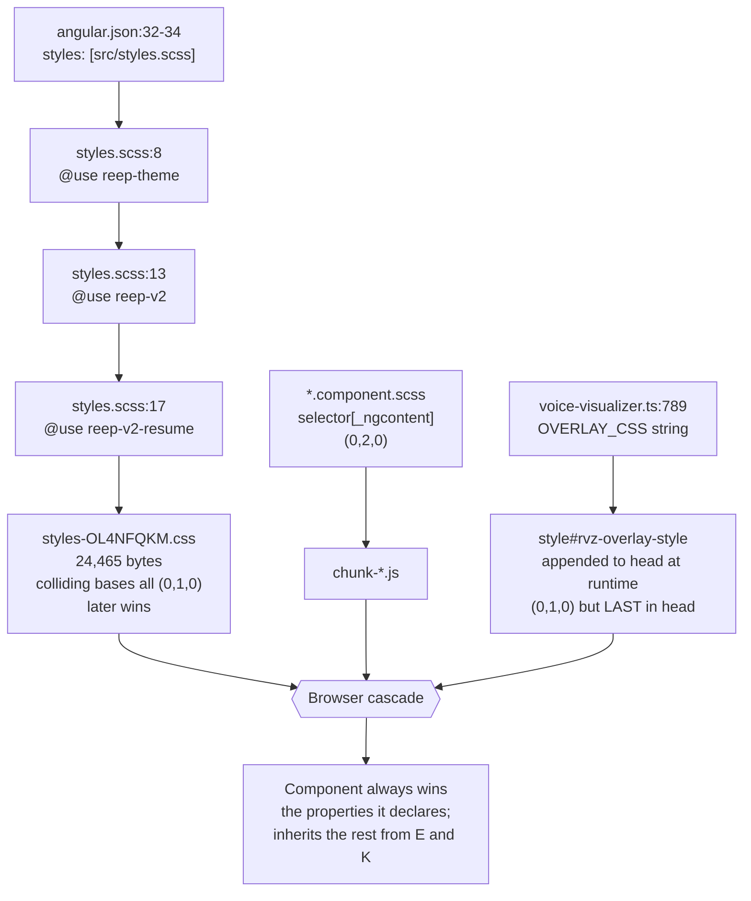
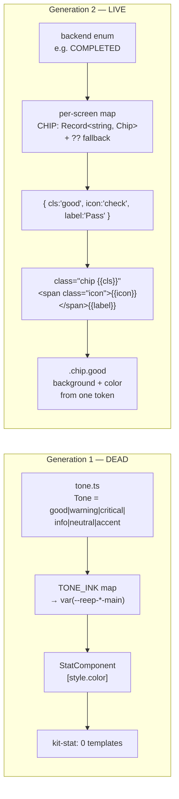

# Chapter 14 — The Design System: `reep-v2`, the Tone Vocabulary, and the Colour-Plus-Text Rule

> After this chapter you should be able to open a blank component, write markup that looks
> native to REEP without inventing a single new CSS class, and — given any class name you
> find in a template — say immediately which of the **five** stylesheet layers owns it and who
> wins when two of them disagree. You should also be able to state, and defend, the one
> accessibility rule the whole visual layer exists to enforce: **status is always text and
> colour together, never colour alone.**

**In scope:** the five stylesheet layers (`styles.scss` and the three sheets it loads, Angular's
per-component layer, and one stylesheet that is injected into `document.head` at runtime), every
CSS custom property, every global class, the print and motion rules, the resume stylesheet, and a
line-by-line audit of the two claims AGENTS.md makes about this layer.

**Deferred:** the *code* of the shared kit — `tone.ts`, `kit.components.ts`,
`icon.component.ts`, `bar-chart.component.ts` — belongs to
[Chapter 12, §8](12-frontend-architecture.md). This chapter cites their API and goes deep on
the CSS instead. Which screen uses which class is [Chapter 13](13-frontend-features.md). The
PDF renderer's *mechanics* are [Chapter 2](02-backend-core.md); §7 here compares only its
**layout** against the on-screen preview. The lazy-route rule and the bundle budget are
[Chapter 12, §2](12-frontend-architecture.md); §6 here asks only whether the CSS honours the
constraint that motivated them.

**One orientation note before you start.** `/student/assistant` is no longer a text chat with a
LiveKit voice panel bolted on. It is the **realtime AI mock interviewer** — a WebSocket to
`/api/interview` carrying 24 kHz PCM both ways
([assistant.component.ts:1-10](apps/web/src/app/features/assistant/assistant.component.ts#L1-L10)),
documented in [docs/interview-assistant.md](../interview-assistant.md) and in
[Chapter 13](13-frontend-features.md). The sidebar still labels it *"REEP Agent"*
([app-shell.component.html:52-54](apps/web/src/app/layout/app-shell.component.html#L52-L54)),
which is stale. This matters here because that screen is the largest component stylesheet in the
app, the only screen mixing both token generations, and the subject of the chapter's most
instructive motion finding (§9).

---

## 1. The stylesheet map

### One entry point, three sheets, a fourth layer nobody registers, and a fifth nobody expects

The Angular build registers exactly **one** global stylesheet
([apps/web/angular.json:32-34](apps/web/angular.json#L32-L34)):

```json
"styles": [
  "src/styles.scss"
]
```

`src/styles.scss` is 17 lines of which three do any work — it is a manifest, not a stylesheet
([apps/web/src/styles.scss:8-17](apps/web/src/styles.scss#L8-L17)):

```scss
@use './styles/reep-theme';

/* REEP v2 design system — the exact tokens and component classes from
 * docs/design-v2/student-app.html, global and unscoped. Loaded after
 * reep-theme so the v2 body/typography rules win where the two overlap. */
@use './styles/reep-v2';

/* Resume Builder component classes (docs/design-v2/resume-builder.html) that
 * reep-v2 does not already define. Loaded LAST so it wins on equal specificity. */
@use './styles/reep-v2-resume';
```

Sass emits `@use`d files in load order, so the concatenated global sheet is
**reep-theme → reep-v2 → reep-v2-resume**, and it ships as one file:
`dist/web/browser/styles-OL4NFQKM.css`, 24,465 bytes minified.

Read those two comments again, because they are not decoration. They say the load order is a
**deliberate conflict-resolution mechanism**. The *colliding bases* — `.btn`, `.ctrl`,
`.chip.neutral`, `.card`, `.stepper`, `.preview`, `.empty`, `.meter` — are all bare single-class
selectors at specificity `(0,1,0)`, so when two sheets name the same class nothing decides the
winner except which one Sass emitted last. (The sheets do also contain higher-specificity
selectors — `.chip.good` and `.dt-btn.primary` are `(0,2,0)`, `.card h4` is `(0,1,1)`,
`.desktop-nav a.active` and `.field input:focus` are `(0,2,1)`, and the dead
`.vpanel__status[data-state] .vpanel__pulse` in the reduced-motion block is `(0,3,0)` — but none
of those participates in a cross-sheet collision.) The comments are the design intent; source
order is the enforcement; nothing tests it.

| Sheet | Lines | Transcribed from | Role |
|---|---:|---|---|
| [`styles/reep-theme.scss`](apps/web/src/styles/reep-theme.scss) | 285 | the deleted Next.js app's `src/theme.ts` (MUI) | Generation 1. `--reep-*` tokens, the `.reep-*` type scale, `.btn--*`, the universal focus ring, the only `@media print` block in `apps/web/src` |
| [`styles/reep-v2.scss`](apps/web/src/styles/reep-v2.scss) | 706 | `docs/design-v2/student-app.html` | Generation 2, current. The `--ink/--paper/--amber` tokens, the base reset, `.card`, `.chip`, `.dt-*`, the shell, the CSS charts |
| [`styles/reep-v2-resume.scss`](apps/web/src/styles/reep-v2-resume.scss) | 638 | `docs/design-v2/resume-builder.html` | Generation 2, second half. `.btn`, `.ctrl`, `.chip.neutral`, `.meter`, `.empty`, `.entry`, `.tbl`, `.preview` |

The split is by **provenance, not by scope**. Every selector in all three files is a bare
global class. `reep-v2-resume.scss` is *not* a resume-only stylesheet — it happens to be the
half of the v2 system that was transcribed from the second mockup, and two of the most
load-bearing bases in the entire app live in it. `class="btn"` appears in **23 files, twelve of
them outside `resume/`**: assistant, login, registration, academics, certifications, courses,
jobs, offers, overview, profile, time-log and uploads. The other eleven are `resume-builder`,
`all-resumes`, `preview` and eight `resume/sections/*.component.ts` inline templates.
`class="ctrl"` appears **106 times across 16 files**, fifteen of them under
`app/features/student/resume/` and the sixteenth `jobs.component.html`, whose filter inputs are
therefore styled by the resume stylesheet.

A reader who follows AGENTS.md literally and greps `reep-v2.scss` for `.btn` will find only a
box-shadow decoration ([reep-v2.scss:439-442](apps/web/src/styles/reep-v2.scss#L439-L442)) and an
`:active` transform ([:443-447](apps/web/src/styles/reep-v2.scss#L443-L447)) — never the rule that
sets its padding, colour or ground.

> **Why it is like this — and why the file that says so is now wrong.** The very first comment a
> newcomer meets is [styles.scss:1-6](apps/web/src/styles.scss#L1-L6):
> *"The design system lives in reep-theme.scss — the exact tokens ported from the Next.js app's
> src/theme.ts, so a component here reads the identical CSS variable an MUI component read there.
> Everything visual is built on those tokens; nothing hard-codes a colour."*
> That was true on the day the migration landed and is the single most misleading sentence in the
> styles layer today. The design system lives in `reep-v2.scss` + `reep-v2-resume.scss`;
> `reep-theme.scss` is the retired generation that four screens are still pinned to (below); and
> the "nothing hard-codes a colour" clause is false in the globals themselves (§10, R2). It
> survives because **nothing tests a comment**. Read it as history, not instruction.

### The fourth layer: view encapsulation beats all three

No component in the repo **sets** the `encapsulation:` property — the word occurs exactly once in
the whole of `app/`, and it is a comment explaining why the default matters
([assistant.component.scss:17-22](apps/web/src/app/features/assistant/assistant.component.scss#L17-L22)).
So every component runs on Angular's default `ViewEncapsulation.Emulated`. Angular rewrites each
simple selector in a component stylesheet by appending an attribute, which you can read out of the
shipped chunks (`dist/web/browser/chunk-xUm2lb-g.js`, the assistant's chunk):

```
stage__dot[_ngcontent-%COMP%]{width:10px;height:10px;border-radius:50%;background:var(--%NS%reep-text-disabled)}
```

Two things in that line surprise people. The `[_ngcontent-%COMP%]` attribute is a **placeholder**
substituted per component instance at runtime; and Angular also rewrites `var(--reep-…)` to
`var(--%NS%reep-…)` in component stylesheets, so grepping a chunk for the literal string
`var(--reep-` finds nothing. Search for `%NS%reep-` instead.

The attribute is not cosmetic. A component rule `.card { … }` compiles to `.card[_ngcontent-x]`,
specificity `(0,2,0)`, which unconditionally outranks the global `.card` at `(0,1,0)` — no
matter which sheet defined it and no matter what order the sheets loaded in. This is the
mechanism that makes "globals define, components tweak" work at all. It is also the mechanism
behind **every duplication defect in §5** — twenty-four redefinitions of a global class name
across ten files — because a component that *accidentally* reuses a global name
wins silently, and inherits every property it did not declare.

### The fifth layer: a stylesheet injected into `document.head` at runtime

Sass and Angular are not the only writers of CSS. `shared/voice-visualizer.ts` builds a
`<style id="rvz-overlay-style">` element and appends it to `document.head` the first time an orb
is constructed ([voice-visualizer.ts:1683-1691](apps/web/src/app/shared/voice-visualizer.ts#L1683-L1691)):

```ts
/** Inject the overlay stylesheet once per document. */
function injectOverlayStyle(): void {
  if (typeof document === 'undefined') return;
  if (document.getElementById(OVERLAY_STYLE_ID)) return;
  const el = document.createElement('style');
  el.id = OVERLAY_STYLE_ID;
  el.textContent = OVERLAY_CSS;
  document.head.appendChild(el);
}
```

Its payload is unencapsulated, global, and unlike anything else in the app
([voice-visualizer.ts:787-800](apps/web/src/app/shared/voice-visualizer.ts#L787-L800)):

```ts
/** Overlay CSS, injected once per document. */
const OVERLAY_STYLE_ID = 'rvz-overlay-style';
const OVERLAY_CSS = `
.rvz-overlay{position:fixed;inset:0;z-index:1000;display:grid;place-items:center;
 background:radial-gradient(120% 90% at 50% 42%,rgba(14,32,38,.72),rgba(5,10,16,.94) 70%);
 backdrop-filter:blur(28px) saturate(130%);-webkit-backdrop-filter:blur(28px) saturate(130%);
 opacity:0;transform:translateY(1.5%) scale(1.045);pointer-events:none;
 transition:opacity .42s cubic-bezier(.22,.61,.36,1),transform .42s cubic-bezier(.22,.61,.36,1);
 will-change:opacity,transform;}
.rvz-overlay.is-open{opacity:1;transform:none;pointer-events:auto;}
.rvz-overlay.is-settled{will-change:auto;}
.rvz-overlay canvas{display:block;width:100%;height:100%;}
@media (prefers-reduced-motion: reduce){.rvz-overlay{transition-duration:.01ms;}}
`;
```

Everything about that is exceptional for this codebase. It is a **full-screen fixed modal at
`z-index: 1000`**. It is the app's only live `backdrop-filter`. Its ground is cool blue-black
(`rgba(14,32,38,.72)`), and the palette it hosts — `STATE_STYLE` at
[voice-visualizer.ts:439-451](apps/web/src/app/shared/voice-visualizer.ts#L439-L451), with
`core: [236, 255, 248], mid: [118, 232, 196], edge: [46, 132, 206]` for the Listening state — is
the only cool colour shipped anywhere in REEP. It carries its own reduced-motion rule, and it
lands in `<head>` **after** the build's `<link>`, so on an equal-specificity tie it beats all
three global sheets.

The assistant screen has to fight it, and the fight is documented — this is the best "why it is
like this" comment in the front end
([assistant.component.scss:1-29](apps/web/src/app/features/assistant/assistant.component.scss#L1-L29)):

> **Why it is like this.** *"VoiceVisualizer injects a global stylesheet (id `rvz-overlay-style`)
> whose `.rvz-overlay` rule makes its host a FULL-SCREEN FIXED MODAL with a backdrop-filter,
> because that is what the standalone interview page wanted. REEP wants an inline orb on a normal
> page, so: the template wraps the canvas in a div that ALREADY carries `.rvz-overlay`, which
> makes the constructor ADOPT that parent instead of wrapping the canvas in a full-screen div of
> its own, and the rules below re-lay it out.*
> *The specificity is deliberate and load-bearing. Angular's emulated encapsulation rewrites
> `.orb.rvz-overlay` to `.orb.rvz-overlay[_ngcontent-x]` = (0,3,0), which beats both the injected
> `.rvz-overlay` (0,1,0) and the `.rvz-overlay.is-open` (0,2,0) that show() adds. Writing the
> override as `.rvz-overlay` alone would tie with `.is-open` and lose to source order."*

That is the whole cascade of this chapter in one paragraph, written by the author who had to make
it work. A reader who finds `class="orb rvz-overlay"` at
[assistant.component.html:113](apps/web/src/app/features/assistant/assistant.component.html#L113)
cannot answer "which sheet owns this?" from the three global files alone — it is owned by a
TypeScript template literal.



### Is `reep-theme.scss` legacy? Yes — and it cannot be deleted

It is unambiguously the older generation: its header calls itself a transcription of a file
that no longer exists in this repo
([reep-theme.scss:1-18](apps/web/src/styles/reep-theme.scss#L1-L18)), and the v2 sheets do not
reference a single one of its tokens. But it still carries live surface that nothing else
supplies:

- **`*:focus-visible`** ([reep-theme.scss:178-184](apps/web/src/styles/reep-theme.scss#L178-L184)) — the app's *only* universal focus ring. Delete the file and keyboard focus disappears everywhere except the handful of controls that re-specify it.
- **`body { font-size: 0.9375rem; line-height: 1.6 }`** ([:165-172](apps/web/src/styles/reep-theme.scss#L165-L172)) — reep-v2 sets neither, so the document's base type size is still the MUI-era 15px/1.6 (see §8).
- **`.btn` / `.btn--primary` / `.btn--outlined` / `.btn--small`** ([:208-247](apps/web/src/styles/reep-theme.scss#L208-L247)) — used by login, assistant, academics and offers.
- **`.reep-h1` … `.reep-caption`, `.tabular`, `.no-print`** and **seventeen** `--reep-*` tokens that are read outside this file (sixteen from the `:25-83` block plus `--reep-font-stack` from `:144`), consumed by those four screens plus `shared/kit/` and `tone.ts`.

Four screens still render principally on generation 1: `login`, `assistant`, `academics`,
`offers`. Two of those — academics and offers — are routed but absent from the sidebar
([app-shell.component.html:16-57](apps/web/src/app/layout/app-shell.component.html#L16-L57)
lists twelve destinations and neither is among them), which is the most plausible reason
they were never converted. The assistant is no longer a *pure* gen-1 island: it makes 53
`var(--reep-*)` references and exactly one gen-2 reference, `var(--shadow-soft)` at
[assistant.component.scss:192](apps/web/src/app/features/assistant/assistant.component.scss#L192),
inside the orb's box-shadow.

The file *could* be reduced to roughly a third: the glass, neumorphic, bloom and cell-well
token groups are dead (§2), the entire `:root[data-theme='dark']` block is unreachable (§3),
and `.reep-h2`, `.reep-body1`, `.reep-subtitle2`, `.reep-glass`, `.reep-neu`, `.reep-ambient`
and `.skip-link` have zero usages in `app/`. But that is a refactor, not a deletion. **A
stylesheet nobody can delete is worth documenting as such** — treat `reep-theme.scss` as
frozen legacy that four screens are pinned to, not as dead weight.

---

## 2. The token layer

Two generations of custom property coexist. Their names are disjoint, so nothing overrides
anything — they simply both exist, and each screen reads whichever set its class vocabulary
belongs to.

### Generation 2 — `reep-v2.scss`, the one to use in new code

The whole token block is 29 lines
([reep-v2.scss:19-47](apps/web/src/styles/reep-v2.scss#L19-L47)):

```scss
:root {
  --ink-900: #1c1810;
  --ink-800: #2a231a;
  --ink-700: #443c2d;
  --ink-500: #5a5142;
  --ink-400: #847a67;
  --paper-0: #efe9dd;
  --paper-1: #f8f4ec;
  --paper-2: #fffdf8;
  --amber-700: #6b4413;
  --amber-600: #8a5a1e;
  --amber-500: #a8752f;
  --amber-400: #c99a4e;
  --amber-300: #e8c48c;
  --line: rgba(28, 24, 16, 0.12);
  --good: #5c7a3a;
  --warn: #a8752f;
  --risk: #8b3a2e;
  --radius-lg: 20px;
  --radius-md: 14px;
  --radius-sm: 10px;
  --shadow-lift: 0 4px 10px rgba(28, 24, 16, 0.08), 0 16px 40px rgba(28, 24, 16, 0.1);
  /* tactile depth (v2 full-bleed) — soft warm shadow, edge highlight, pressed well, focus ring */
  --shadow-soft: 0 1px 2px rgba(28, 24, 16, 0.05), 0 2px 8px rgba(28, 24, 16, 0.04);
  --edge-hi: inset 0 1px 0 rgba(255, 253, 248, 0.6);
  --press: inset 0 1px 3px rgba(28, 24, 16, 0.1);
  --ring: 0 0 0 3px rgba(168, 117, 47, 0.18);
  --font: 'Inter', system-ui, -apple-system, 'Segoe UI', sans-serif;
}
```

Everything above the comment on line 41 is a verbatim transcription of the `:root` block in
`docs/design-v2/student-app.html`. **The four tokens the comment names — `--shadow-soft`,
`--edge-hi`, `--press`, `--ring` — are the one deliberate extension**, the "tactile depth" set
that gives the full-bleed Angular shell its carved-in inputs and lifted buttons (§9). Note that a
fifth declaration also sits below the comment: `--font` on line 46 is *not* an extension — it is
verbatim mockup, present at
[docs/design-v2/student-app.html:19](docs/design-v2/student-app.html#L19), where it is likewise the
last declaration in `:root`. It sits below the comment only because the four new tokens were
inserted above it.

| Token | Value | Group | Used by |
|---|---|---|---|
| `--ink-900` | `#1c1810` | colour · text | body colour, `.dt-btn.primary`, `.btn.primary`, `.desktop-titlebar`, `.lb-row.me`, `.taginput .chipx`, `.step-item.active`, `.ctrl` text |
| `--ink-800` | `#2a231a` | colour · text | 2 references (`courses.component.scss:73`, `profile.component.scss:185`); the `.desktop-nav a.active` gradient uses the literal `#2a231a` instead |
| `--ink-700` | `#443c2d` | colour · text | `.entry .org`, `.entry .desc`, `.check` |
| `--ink-500` | `#5a5142` | colour · text | the universal secondary ink — `.dt-sub`, `.dense-stat .lbl`, `.dt-table th`, `.chip.neutral`, `.empty`, `.step-item` |
| `--ink-400` | `#847a67` | colour · text | `.sec-label`, `.step-group`, `.badge.locked .ico`, `.entry .tools button` |
| `--paper-0` | `#efe9dd` | colour · surface | page ground (`body`), `.dt-table th`, `.tbl th`, `.chip.neutral`, `.ctrl:disabled`, `.tag`, `.field .lock` |
| `--paper-1` | `#f8f4ec` | colour · surface | default card/control surface, and the *text* colour on every dark fill |
| `--paper-2` | `#fffdf8` | colour · surface | raised surfaces — `.card` gradient top stop, `.reg-frame`, `.entry`, `.taginput`, `.tbl`, `.iconbtn`, `.btn`, `.preview` |
| `--amber-700` | `#6b4413` | colour · accent | `.badge .ico` gradient end, `.meter i` fill end, `.notice.info` ink |
| `--amber-600` | `#8a5a1e` | colour · accent | the accent — `.donut` arc, `.streak-day.on`, `.psec`, `.addlink`, `.btn.accent`, `.btn.ghost`, `.res-card.default` border |
| `--amber-500` | `#a8752f` | colour · accent | focus border on controls, `.lb-avatar`, `.step-dot.partial`, `.meter i` fill start |
| `--amber-400` | `#c99a4e` | colour · accent | `.bar-chart .bar` gradient start, `.badge .ico` gradient start, `.empty .icon` |
| `--amber-300` | `#e8c48c` | colour · accent | 1 reference — the Leisure segment in [time-log.component.ts:46](apps/web/src/app/features/student/time-log/time-log.component.ts#L46) |
| `--line` | `rgba(28,24,16,0.12)` | colour · hairline | every border and divider in the v2 system, plus the "empty" state of `.streak-day`, `.step-dot`, `.match-bar` and `.meter` |
| `--good` | `#5c7a3a` | colour · status | `.chip.good`, `.swoc-s`, `.match-fill`, `.step-dot.done`, `.tag.evi`, `.notice.evi`, `.evi-tag`, `.autofill-note` |
| `--warn` | `#a8752f` | colour · status | `.chip.warn`, `.swoc-o`, `.reg-approval.flag` — identical in value to `--amber-500` |
| `--risk` | `#8b3a2e` | colour · status | `.chip.risk`, `.swoc-w`, `.field label .req`, `.iconbtn:hover` |
| `--radius-lg` | `20px` | radius | **zero references** — dead |
| `--radius-md` | `14px` | radius | 4 references: `.dropzone` ([reep-v2.scss:144](apps/web/src/styles/reep-v2.scss#L144)), `.card` ([:403](apps/web/src/styles/reep-v2.scss#L403)), `leaderboards.component.scss:47`, `uploads.component.scss:294` |
| `--radius-sm` | `10px` | radius | 2 references, both `time-log.component.scss` (`:14`, `:27`) |
| `--shadow-lift` | `0 4px 10px …, 0 16px 40px …` | shadow | 2 references: `.reg-frame` ([reep-v2.scss:100](apps/web/src/styles/reep-v2.scss#L100)) and `.cv-callout:hover` ([jobs.component.scss:37](apps/web/src/app/features/student/jobs/jobs.component.scss#L37)) |
| `--shadow-soft` | `0 1px 2px …, 0 2px 8px …` | shadow | `.card`, `.dt-btn`, `.btn`, plus `leaderboards`, `courses` and the assistant's orb plate |
| `--edge-hi` | `inset 0 1px 0 rgba(255,253,248,0.6)` | shadow | the warm top highlight on `.card`, `.dt-btn`, `.btn` |
| `--press` | `inset 0 1px 3px rgba(28,24,16,0.1)` | shadow | the carved well inside every form control; also the `:active` button state |
| `--ring` | `0 0 0 3px rgba(168,117,47,0.18)` | shadow | the control focus ring |
| `--font` | `'Inter', system-ui, -apple-system, 'Segoe UI', sans-serif` | typography | `body`, `button`, `.field input`, `.ctrl` (via the element normaliser), `.ts-cell input` |

There is **no motion token at all** — no duration, no easing variable. Every motion value in the
codebase is a literal (§9).

> **Naming convention.** Gen-2 tokens are short, unprefixed, and organised as *named ramps
> with numeric steps*: `--ink-*`, `--paper-*`, `--amber-*`. Note that the ramps do not run in
> the same direction: `--ink-900` is the **darkest** ink and `--ink-400` the lightest, but
> `--paper-0` is the **darkest** paper and `--paper-2` the lightest, while `--amber-700` is
> darkest again. There is deliberately no `--ink-600`, `--ink-300` or `--paper-3` — the ramps
> carry only the steps the design actually uses. Semantic one-offs (`--line`, `--good`,
> `--warn`, `--risk`, `--font`) have no numeric step at all.

### Generation 1 — `reep-theme.scss`, `--reep-*`

Get the arithmetic straight first, because three different totals float around this file:

- **41** `--reep-*` properties are declared in the light `:root` block, [reep-theme.scss:25-83](apps/web/src/styles/reep-theme.scss#L25-L83).
- That same block declares **one** non-prefixed property, `--font-inter` ([:26](apps/web/src/styles/reep-theme.scss#L26)) — 42 declarations in total.
- A second, later `:root` adds `--reep-font-stack` ([:143-145](apps/web/src/styles/reep-theme.scss#L143-L145)).
- So the file defines **43 custom properties: 42 `--reep-*` and one `--font-inter`.**

Everything is transcribed from the deleted `theme.ts`. The palette group:

| Token | Light value | Note |
|---|---|---|
| `--reep-primary-main` / `-light` / `-dark` / `-contrast` | `#1c1810` / `#443c2d` / `#100d08` / `#f8f4ec` | primary is *ink*, not a brand hue |
| `--reep-secondary-main` / `-light` / `-dark` / `-contrast` | `#8a5a1e` / `#a8752f` / `#6b4413` / `#f8f4ec` | the accent; `-main` is also the focus-ring colour |
| `--reep-success-main` | `#8b5f1c` | **a brown** |
| `--reep-warning-main` | `#62471f` | **a brown** |
| `--reep-error-main` | `#3a301f` | **a brown** |
| `--reep-info-main` | `#8a5a1e` | identical to `--reep-secondary-main`; zero references |
| `--reep-bg-default` / `-paper` | `#efe9dd` / `#f8f4ec` | |
| `--reep-text-primary` / `-secondary` / `-disabled` | `#1c1810` / `#5a5142` / `#6d6353` | |
| `--reep-divider` | `rgba(28,24,16,0.12)` | |
| `--reep-action-hover` / `-selected` | `rgba(28,24,16,0.04)` / `rgba(138,90,30,0.10)` | `-selected` has exactly one consumer, [login.component.scss:338](apps/web/src/app/features/login/login.component.scss#L338) |
| `--reep-radius` / `-control` / `-chip` | `8px` / `7px` / `6px` | all three unreferenced |
| `--font-inter` | `'Inter'` | consumed by `--reep-font-stack` ([:144](apps/web/src/styles/reep-theme.scss#L144)) |

### The surface groups nobody documents, in full

The chapter's scope line promises *every* custom property, and the eighteen tokens below are
usually skipped because they are all dead. They are also the most instructive values in the file:
they are the complete record of a visual language — frosted glass, neumorphism, ambient bloom —
that the v2 rewrite deleted without deleting its tokens
([reep-theme.scss:60-82](apps/web/src/styles/reep-theme.scss#L60-L82), grouped under one heading
that calls them *"surface tokens · light (verbatim from theme.ts)"*).

| Token | Line | Light value | What it was for |
|---|---:|---|---|
| `--reep-glass-bg` | 61 | `rgba(252, 249, 242, 0.58)` | the translucent panel fill behind a `backdrop-filter` |
| `--reep-glass-solid` | 62 | `#faf7f0` | the opaque substitute — **the only live token in these four groups**, read twice, by its own `@supports` and `prefers-reduced-transparency` fallbacks ([:254](apps/web/src/styles/reep-theme.scss#L254), [:259](apps/web/src/styles/reep-theme.scss#L259)) |
| `--reep-glass-border` | 63 | `rgba(255, 252, 245, 0.75)` | the lit rim of a frosted panel |
| `--reep-glass-shadow` | 64 | `0 10px 34px rgba(58, 48, 31, 0.10)` | its drop shadow |
| `--reep-glass-highlight` | 65 | `inset 0 1px 0 rgba(255, 253, 247, 0.9)` | its top edge highlight — the ancestor of gen 2's `--edge-hi` |
| `--reep-neu-bg` | 67 | `linear-gradient(145deg, #faf7f0, #eae3d4)` | the extruded surface |
| `--reep-neu-flat` | 68 | `#efe9dd` | its flat variant |
| `--reep-neu-shadow` | 69 | `7px 7px 16px rgba(58, 48, 31, 0.13), -7px -7px 16px rgba(255, 252, 244, 0.92)` | **the whole neumorphic idea in one declaration**: a warm shadow one way, a near-white "light" the other |
| `--reep-neu-shadow-lift` | 70 | `10px 10px 22px rgba(58, 48, 31, 0.16), -10px -10px 22px rgba(255, 253, 247, 1)` | the hovered/raised step |
| `--reep-neu-inset` | 71 | `inset 2px 2px 5px rgba(58, 48, 31, 0.16), inset -2px -2px 5px rgba(255, 252, 244, 0.9)` | the pressed step — the ancestor of gen 2's `--press` |
| `--reep-bloom-a` | 73 | `rgba(176, 124, 44, 0.20)` | ambient background glow, warm |
| `--reep-bloom-b` | 74 | `rgba(138, 90, 30, 0.14)` | second glow stop |
| `--reep-bloom-c` | 75 | `rgba(212, 161, 85, 0.11)` | third glow stop |
| `--reep-chip-good` | 77 | `#83591b` | the "good" chip ink |
| `--reep-chip-accent` | 78 | `#83591b` | the "accent" chip ink — **byte-identical to `-good`** |
| `--reep-cell-well` | 80 | `#f1ece1` | a sunken table cell |
| `--reep-cell-well-hover` | 81 | `#ece5d7` | its hover |
| `--reep-cell-well-inset` | 82 | `inset 1px 1px 2px rgba(58, 48, 31, 0.07), inset -1px -1px 2px rgba(255, 252, 244, 0.7)` | its carve |

Two of those rows are arguments, not trivia. `--reep-neu-shadow` and `--reep-neu-inset` are
recognisably the ancestors of gen 2's `--edge-hi` and `--press`: the tactile-depth extension in
`reep-v2.scss` re-invented, at lower intensity, exactly what generation 1 already had names for.
And `--reep-chip-good` being *the same hex* as `--reep-chip-accent` is the second independent
instance of the argument §3 builds its case on — **generation 1 has no green.**

**Twenty-four of the forty-two `--reep-*` tokens have zero `var()` references anywhere in
`apps/web/src`** — every glass token **except `--reep-glass-solid`**, every neu, bloom and
cell-well token, both chip tokens, all three radii, `--reep-info-main`, `--reep-primary-dark`,
`--reep-primary-light` and `--reep-secondary-light`. (4 + 5 + 3 + 3 + 2 + 3 + 4 = 24.) The
glass/neumorphic/bloom visual language did not survive the v2 rewrite; the classes that would have
consumed it (`.reep-glass`, `.reep-neu`, `.reep-ambient`) appear in no template.

### Which generation to use

**Generation 2, always.** The rule is not aesthetic preference — it is that gen 1 has no green
and no red (see §3), so a status built on `--reep-error-main` renders as near-black brown.
Concretely, in new code:

- reach for `--ink-*` / `--paper-*` / `--amber-*` / `--line`, never `--reep-*`;
- reach for `--good` / `--warn` / `--risk`, never `--reep-success-main` and friends;
- if you are editing `login`, `assistant`, `academics` or `offers`, you are inside the gen-1
  island and should follow its local convention rather than mixing the two mid-file.

### Two traps in the gen-1 island

**Trap one: two tokens that are read and never defined.**
`assistant.component.scss` reads two custom properties that **exist nowhere in the repo**:

| Token | Read at | Fallback that therefore always paints |
|---|---|---|
| `--reep-surface` | [:105](apps/web/src/app/features/assistant/assistant.component.scss#L105) | `#fff` |
| `--reep-surface` | [:339](apps/web/src/app/features/assistant/assistant.component.scss#L339) | `var(--reep-action-hover)` |
| `--reep-warning-bg` | [:121](apps/web/src/app/features/assistant/assistant.component.scss#L121) | `rgba(178, 106, 0, 0.1)` |

Three uses, two tokens, and every one supplies a fallback — so nothing is broken, but nothing is
themeable either. Two of the three fallbacks are benign. The third is not: `rgba(178, 106, 0, 0.1)`
is a **cool orange that belongs to no REEP palette**, painted onto the consent dialog's warning
strip inside a warm-brown app. Whether it is a leftover from another design system or a token
someone meant to add, I could not determine.

**Trap two: a navy that is on both sides of the stack.** The same file hard-codes `#1a3c5e` —
a mid navy — **nine times**, always as the fallback of `var(--reep-primary-main, #1a3c5e)`:
lines [47](apps/web/src/app/features/assistant/assistant.component.scss#L47),
[53](apps/web/src/app/features/assistant/assistant.component.scss#L53), 66, 74, 133, 153, 240,
365 and 421. Because `--reep-primary-main` *is* defined (`#1c1810`), none of those fallbacks ever
paints — they are inert. But the same hex is the PDF renderer's section colour and name rule
([resume_pdf.py:41](apps/api-py/app/resume_pdf.py#L41) and
[:78](apps/api-py/app/resume_pdf.py#L78)), which §7 flags as *"a navy that appears nowhere in the
REEP token set"*. It appears in exactly two places, on opposite sides of the stack, and in neither
is it a REEP colour. Read it as the fingerprint of a third design system both files were adapted
from, not as a REEP token that went missing.

---

## 3. The warm paper palette

### How the theme is constructed

REEP is a **warm monochrome with one accent family**. There is no blue and no cool grey in the
shipped *token set* — with one deliberate, documented exception, the orb, which the end of this
section covers. The construction has three moves:

1. **Ink is brown-black, not black.** `--ink-900: #1c1810` is a very dark warm brown. Every
   lighter ink step keeps the same warmth, so text never reads as a cold slate against paper.
2. **Paper is off-white, and inverted from the usual convention.** The page ground
   (`--paper-0: #efe9dd`) is the *darkest* of the three, and surfaces get lighter as they rise:
   cards sit on `--paper-1: #f8f4ec` / `--paper-2: #fffdf8`. A REEP card does not have a
   shadow because it is floating over white — it is genuinely lighter than what is behind it,
   and the shadow only sharpens the edge.
3. **The accent is a single amber ramp**, `--amber-700` through `--amber-300`, doing every job
   a brand colour would: active states, chart fills, meter fills, section rules, links.

### The surface hierarchy

| Level | Token | Hex | Where it appears |
|---|---|---|---|
| Page ground | `--paper-0` | `#efe9dd` | `body` background; `.desktop-frame`; the bottom stop of `.desktop-main`'s gradient; table headers (`.dt-table th`, `.tbl th`) — i.e. a header is *sunken* relative to its own table body |
| Default surface | `--paper-1` | `#f8f4ec` | `.dense-stat`, `.dt-table`, `.lb-row:not(.me)`, `.ts-cell`, `.stepper`, `.main-head`, `.footbar`, `.res-card`, and the `background` of every form control |
| Raised surface | `--paper-2` | `#fffdf8` | `.reg-frame`, `.entry`, `.taginput`, `.tbl`, `.iconbtn`, `.btn`, `.preview`, `.completeness`, `.swoc-c`, and the top stop of the `.card` gradient |
| Sunken | `var(--press)` | `inset 0 1px 3px rgba(28,24,16,0.1)` | not a colour — the "sunken" level is expressed as an inset shadow on every `.ctrl` and `.field input`, so a control reads as carved into its card rather than painted on it |

The `.card` is the clearest statement of the hierarchy
([reep-v2.scss:400-407](apps/web/src/styles/reep-v2.scss#L400-L407)):

```scss
.card {
  background: linear-gradient(180deg, var(--paper-2), var(--paper-1));
  border: 1px solid rgba(28, 24, 16, 0.08);
  border-radius: var(--radius-md);
  padding: 18px;
  margin-bottom: 16px;
  box-shadow: var(--shadow-soft), var(--edge-hi);
}
```

A vertical gradient from the raised paper to the default paper, a border that is *lighter than
the general hairline* (0.08 alpha against `--line`'s 0.12) so cards do not draw as hard as
tables, and two shadows: a soft warm drop plus `--edge-hi`, an inset white line along the top
edge that simulates light catching a raised lip. That is the entire "REEP looks like paper"
effect, in six declarations.

### Swatches

| Swatch | Hex | Semantic role |
|---|---|---|
| ⬛ | `#1c1810` | `--ink-900` — primary text; the "dark fill" for active/selected surfaces |
| ⬛ | `#2a231a` | `--ink-800` — second stop of the active nav gradient |
| ⬛ | `#443c2d` | `--ink-700` — body prose inside entry cards |
| ⬛ | `#5a5142` | `--ink-500` — secondary text, labels, table headers, neutral chips |
| ⬛ | `#847a67` | `--ink-400` — micro-labels, disabled/locked glyphs |
| ⬜ | `#efe9dd` | `--paper-0` — page ground, sunken header cells |
| ⬜ | `#f8f4ec` | `--paper-1` — default surface; also the text colour on any dark fill |
| ⬜ | `#fffdf8` | `--paper-2` — raised surface |
| 🟫 | `#6b4413` | `--amber-700` — deepest accent (gradient ends, notice ink) |
| 🟫 | `#8a5a1e` | `--amber-600` — the accent proper |
| 🟧 | `#a8752f` | `--amber-500` — focus borders, avatars, partial state |
| 🟧 | `#c99a4e` | `--amber-400` — chart fills, empty-state glyphs |
| 🟨 | `#e8c48c` | `--amber-300` — lightest accent |
| 🟩 | `#5c7a3a` | `--good` — olive green; pass, verified, complete, on-track |
| 🟧 | `#a8752f` | `--warn` — amber; watch, pending, partial (identical to `--amber-500`) |
| 🟥 | `#8b3a2e` | `--risk` — brick red; fail, ineligible, below threshold, destructive |

### The one real divergence between the generations

Set the two palettes side by side and they are the *same colours under two names* — with one
exception that matters enormously:

| Gen 2 | Gen 1 | Shared hex |
|---|---|---|
| `--paper-0` | `--reep-bg-default` | `#efe9dd` |
| `--paper-1` | `--reep-bg-paper`, `--reep-primary-contrast`, `--reep-secondary-contrast` | `#f8f4ec` |
| `--ink-900` | `--reep-primary-main`, `--reep-text-primary` | `#1c1810` |
| `--ink-700` | `--reep-primary-light` | `#443c2d` |
| `--ink-500` | `--reep-text-secondary` | `#5a5142` |
| `--amber-700` / `-600` / `-500` | `--reep-secondary-dark` / `-main` / `-light` | `#6b4413` / `#8a5a1e` / `#a8752f` |
| `--line` | `--reep-divider` | `rgba(28,24,16,0.12)` |
| **`--good` / `--warn` / `--risk`** | **`--reep-success-main` / `--reep-warning-main` / `--reep-error-main`** | **`#5c7a3a` / `#a8752f` / `#8b3a2e`** vs **`#8b5f1c` / `#62471f` / `#3a301f`** |

Gen 1's three "semantic" colours are **three browns**. Measured against each other with the
WCAG 2.x relative-luminance formula, success-vs-warning is **1.54:1**, warning-vs-error
**1.50:1**, success-vs-error **2.31:1**. Against the paper they read fine individually (5.10,
7.84 and 11.80:1) — but against *one another* they are the same colour. Status in generation 1
was encoded by ink *weight*, not hue. `--reep-chip-good` and `--reep-chip-accent` being the same
hex (§2) says the same thing a second time.

This is the single strongest argument in the codebase for why the colour-plus-text rule is
load-bearing rather than decorative: on four screens, the colour channel is carrying almost no
information at all, and only the text is keeping the status legible.

### The one place the warm palette was consciously abandoned

`shared/voice-visualizer.ts` renders the interview orb, and its `STATE_STYLE` table
([:439-451](apps/web/src/app/shared/voice-visualizer.ts#L439-L451)) is cool blue-green-white —
`core: [236, 255, 248], mid: [118, 232, 196], edge: [46, 132, 206]` for Listening. That is the
only non-warm colour REEP ships. It was not an oversight, and the reasoning is worth having
because it is the honest limit of a design system
([assistant.component.scss:23-28](apps/web/src/app/features/assistant/assistant.component.scss#L23-L28)):

> **Why it is like this.** *"The orb's palette (STATE_STYLE in shared/voice-visualizer.ts) is a
> cool blue/green/white designed to glow ADDITIVELY over a dark backdrop, and REEP v2 is warm
> amber on paper. Retheming it means re-deriving the alphas of nine gradient stops, so the plate
> below is a deliberate dark warm-tinted stage instead. The consequence is stated in the template:
> the orb is decoration, and every word of status lives in the pill and caption beneath it."*

The "plate" is the compromise: the orb keeps its cool palette, and the surface it composites over
is warm-dark rather than paper
([assistant.component.scss:189-192](apps/web/src/app/features/assistant/assistant.component.scss#L189-L192)):

```scss
  /* Warm-dark stage. The orb's own passes composite with 'lighter', so it needs
     something dark beneath it or the glow has nothing to glow against. */
  background: radial-gradient(120% 90% at 50% 42%, #1d2226 0%, #12100d 72%);
  box-shadow: inset 0 1px 0 rgba(255, 253, 248, 0.06), var(--shadow-soft);
```

Note the escape route the comment builds: because the orb is declared decoration, the colour
system does not have to reach it. That is the colour-plus-text rule (§4) being spent as currency.

### Dark mode: defined, and unreachable

`reep-theme.scss` contains a complete dark palette
([:85-136](apps/web/src/styles/reep-theme.scss#L85-L136)) under `:root[data-theme='dark']` —
inverted ink, `--reep-bg-default: #14120d`, and every glass/neu/bloom token flipped. The file
header explains the design ([:15-17](apps/web/src/styles/reep-theme.scss#L15-L17)): the
attribute is *"the same attribute MUI's own variables switch on, so a theme toggle flips both the
palette and the effect tokens together exactly as it does today."*

**None of it can run.** Three independent facts each individually kill it:

1. [`index.html:2`](apps/web/src/index.html#L2) hardcodes `<html lang="en" data-theme="light">`.
2. The only writer of that attribute is
   [`core/theme.service.ts:33`](apps/web/src/app/core/theme.service.ts#L33), and grepping
   `ThemeService` across `app/` returns **only its own declaration** — nothing injects it, no UI
   calls `toggle()`. (Chapter 12, §7 documents the service itself.)
3. Even if the attribute flipped, `reep-v2.scss` defines `--ink-*`, `--paper-*`, `--amber-*`,
   `--line`, `--good`, `--warn` and `--risk` **once, on bare `:root`, with no dark
   counterpart**. Those tokens drive essentially every shipped screen. Flipping the attribute
   today would darken login, assistant, academics and offers, and leave the shell, cards,
   chips, tables and the resume builder on warm paper — a half-dark app.

So: **REEP is a light-only product.** Say so plainly in any new component; do not write
`@media (prefers-color-scheme: dark)` blocks against tokens that have no dark values.

---

## 4. The colour-plus-text rule

### Why the rule exists

AGENTS.md states it in one line: *"Status is always shown as **text + colour together**, never
colour alone."* The reasons are specific to this product, not generic accessibility boilerplate:

- **Colour-vision deficiency.** Roughly one in twelve male students has a red-green deficiency.
  REEP's own `--good` `#5c7a3a` and `--warn` `#a8752f` sit **1.22:1** apart in luminance —
  for a deuteranope they are near-identical swatches. A student who cannot distinguish "Pass"
  from "Watch" cannot use the dashboard for the one thing it exists for.
- **Monochrome printing.** A student prints their records page for a mentor meeting. Browsers
  default to `print-color-adjust: economy` and drop background paint unless the user ticks
  "Background graphics" — and the repo contains no `print-color-adjust: exact` anywhere. Every
  chip tint vanishes. The word must survive.
- **Screenshots in a placement report.** A director pastes an attendance panel into a
  departmental report that is photocopied, faxed, or rendered at 30% width in a slide deck. The
  chip is 12px tall. Its hue is gone; its label is not.

The stylesheet argues the same case in its own words, in the longest rationale comment in the
repo — the header of the reduced-motion block at
[reep-v2.scss:680-698](apps/web/src/styles/reep-v2.scss#L680-L698):

> **Why it is like this.** *"The assistant's voice panel runs several INFINITE pulse
> animations (live dot, status pulse, typing indicator). An indefinitely looping animation is a
> vestibular-disorder trigger and, for some users, a migraine one; the whole point of
> prefers-reduced-motion is that it must not be re-litigated per component. […] This costs no
> information: REEP always states status as text AND colour together (never colour alone, and
> never motion alone), so removing the animation removes decoration only."*

Read that carefully: the codebase uses the colour-plus-text invariant as the **justification
for being allowed to delete an animation**. If the invariant is false anywhere, the
reduced-motion rule stops being lossless there. (That block has since rotted for an unrelated
reason — every selector it names now matches nothing. §9 is the full autopsy.)

### The mechanism: `.chip`

The rule is implemented structurally in five rules — twenty-four source lines
([reep-v2.scss:184-207](apps/web/src/styles/reep-v2.scss#L184-L207)), quoted here byte-for-byte:

```scss
.chip {
  display: inline-flex;
  align-items: center;
  gap: 5px;
  padding: 5px 10px;
  border-radius: 8px;
  font-size: 12px;
  font-weight: 700;
}
.chip.good {
  background: rgba(92, 122, 58, 0.12);
  color: var(--good);
}
.chip.warn {
  background: rgba(168, 117, 47, 0.14);
  color: var(--warn);
}
.chip.risk {
  background: rgba(139, 58, 46, 0.12);
  color: var(--risk);
}
.chip .icon {
  font-size: 14px;
}
```

Three properties of that snippet do the work.

**First, the base rule declares no colour and no background.** A chip with no tone modifier — or
with a *misspelled* one — renders as plain bold text on the surface behind it. The degradation
is silent and harmless: you lose the hue, you keep the word. This is the codebase's only
structural safeguard on the whole rule, and it is arguably accidental.

**Second, each tone sets `background` and `color` from the same hue.** The tint is the ink at
12–14% alpha. It is therefore impossible to apply a tone as a background wash without also
recolouring the text inside it — the two channels cannot drift apart at the class level.

**Third, `.chip .icon { font-size: 14px }` exists**, which tells you the expected markup
contains a glyph. The house pattern is three redundant channels — hue, glyph shape, and word —
in one element ([jobs.component.html:111-115](apps/web/src/app/features/student/jobs/jobs.component.html#L111-L115)):

```html
                @if (row.applied) {
                  <span class="chip good"><span class="icon">check_circle</span>Applied</span>
                } @else {
                  <span class="chip neutral"><span class="icon">radio_button_unchecked</span>Not applied</span>
                }
```

Note that the two chips are *branches of a conditional*, not siblings — the screen shows one or
the other, and each branch carries its own word.

The fourth tone, `.chip.neutral`, is **not** in `reep-v2.scss` — it lives in the last-loaded
sheet ([reep-v2-resume.scss:518-522](apps/web/src/styles/reep-v2-resume.scss#L518-L522)) under a
comment naming the gap. This is the direct cause of the first duplication defect in §5.

### How a domain value becomes a tone

There are two paths. **Only one of them ships.**

**The `tone.ts` path — dead.** [`shared/kit/tone.ts`](apps/web/src/app/shared/kit/tone.ts) is
**seventeen** lines and declares the *other* status vocabulary
([tone.ts:8-17](apps/web/src/app/shared/kit/tone.ts#L8-L17)):

```ts
export type Tone = 'good' | 'warning' | 'critical' | 'info' | 'neutral' | 'accent';

export const TONE_INK: Record<Tone, string> = {
  good: 'var(--reep-success-main)',
  warning: 'var(--reep-warning-main)',
  critical: 'var(--reep-error-main)',
  info: 'var(--reep-secondary-main)',
  neutral: 'var(--reep-text-primary)',
  accent: 'var(--reep-secondary-main)',
};
```

Six names, five distinct colours (`info` and `accent` are the same token), all pointing at the
gen-1 browns. Its only consumer is `kit.components.ts`, which uses it in `StatComponent` to set
an inline `[style.color]` — never a class. And `kit-stat` appears in **zero templates**;
grepping `app/` for it returns only its own declaration. `TONE_INK` is imported by no other
file. **`tone.ts` is dead code in the shipped app**, and Chapter 12, §8 documents its API for
completeness rather than because anything reads it. (Its sibling `kit-empty` *is* live — three
usages, in `academics` ×2 and `offers`.)

**The live path is a hand-written string literal per screen**, interpolated straight into the
class attribute ([records.component.html:135-137](apps/web/src/app/features/student/records/records.component.html#L135-L137)):

```html
        <span class="chip {{ chip.cls }}">
          <span class="icon">{{ chip.icon }}</span>{{ chip.label }}
        </span>
```

Because `tone.ts` is unused, **the union is re-declared locally on nine screens, in three
different shapes**: `type Tone = 'good' | 'warn' | 'risk' | 'neutral'` in `jobs.component.ts`
and `records.component.ts`; `interface Chip { cls; icon; label }` in `certifications`,
`courses`, `records` and `all-resumes`; `interface StatusChip` in `jobs`, `overview` and
`skilling`; `interface StatusMeta` with the field named `tone` rather than `cls` in `uploads`
and `attachments`. Two of them (`courses.component.ts:38`, `skilling.component.ts:40`) widen
`cls` to bare `string`, so a typo compiles.



> **Naming convention.** The tone field is called `cls` when it will be interpolated into a
> `class=` attribute and `tone` when it will not. Status maps are frozen `Record<string, Chip>`
> constants keyed by the backend's SCREAMING_SNAKE enum, and **every lookup terminates in a
> `?? fallback`** that supplies a valid tone and a human label — e.g.
> `CHIP[r.status] ?? { cls: 'warn', icon: 'help', label: r.status }`. Tone-deriving methods are
> nouns ending in `Chip` or `Tone`: `attendanceChip(percent)` returns the whole
> `{cls, icon, label}`, `attendanceTone(percent)` returns just the class string for a bar fill,
> and the two share one threshold ladder so a bar and its chip can never disagree.

### The audit: where colour carries meaning alone

I grepped every template under `app/features` and `app/layout` for `class="chip`, and inspected
every primitive whose only state channel is a colour. The rule is **kept far more often than it
is broken** — but it is broken, in **four** places, and one of them is on the highest-traffic
student workflow in the product.

#### Violation 1 — the resume-builder step dots

[resume-builder.component.html:41-59](apps/web/src/app/features/student/resume/resume-builder.component.html#L41-L59):

```html
          <div
            class="step-item"
            [class.active]="step() === s.key"
            (click)="step.set(s.key)"
          >
            <span
              class="step-dot"
              [class.done]="stepStates()[s.key] === 'done'"
              [class.partial]="stepStates()[s.key] === 'partial'"
              [attr.title]="
                stepStates()[s.key] === 'done'
                  ? 'Complete'
                  : stepStates()[s.key] === 'partial'
                    ? 'Partly filled'
                    : 'Not started'
              "
            ></span>
            {{ s.label }}
          </div>
```

The CSS ([reep-v2-resume.scss:134-146](apps/web/src/styles/reep-v2-resume.scss#L134-L146)) makes
`.step-dot` an 8px circle whose only modifiers are `background: var(--good)` and
`background: var(--amber-500)`. Three states — Complete / Partly filled / Not started —
encoded in eight pixels by **hue alone**. The visible text beside the dot is the section *name*,
not its state. There is no glyph difference, no size difference, no `role`, no `aria-label`; the
`title` is hover-only, unreachable on touch, and not reliably announced on a non-interactive
`<span>`. Measured: done-vs-partial **1.22:1**; done-vs-empty **3.50:1**.

There *is* a fourth channel, but only for one row: `.step-item.active .step-dot` adds
`outline: 2px solid rgba(248, 244, 236, 0.25)`
([reep-v2-resume.scss:147-149](apps/web/src/styles/reep-v2-resume.scss#L147-L149)) — which marks
the *selected* section, not its completion, so it does not help.

What makes this the worst case is that the state is computed with real care —
`stepStates()` classifies each of fifteen sections `done`/`partial`/`empty` by counting filled
leaves — and then every non-colour channel is discarded at the point of display.

#### Violation 2 — the login-streak cells

[student-overview.component.html:225-230](apps/web/src/app/features/student/overview/student-overview.component.html#L225-L230):

```html
      <div class="streak-row">
        @for (on of streakCells(); track $index) {
          <div class="streak-day" [class.on]="on"></div>
        }
      </div>
      <div class="dt-sub" style="margin-top:10px">Current {{ s.current }} day{{ s.current === 1 ? '' : 's' }} · Longest {{ s.longest }} · {{ s.days_active }} active days</div>
```

Seven empty divs; `--line` versus `--amber-600` (**4.23:1**, at least a visible difference) with
no text, title, glyph or ARIA per cell. Mitigating: the aggregate *is* stated in the `.dt-sub`
line immediately below, and again in a header chip. The widget is decorative and asserts less
than it appears to — `streakCells()` carries no per-day date — but an individual day's on/off
state is conveyed by colour alone.

#### Violation 3 — the time-sheet stacked bar

[time-log.component.html:54-65](apps/web/src/app/features/student/time-log/time-log.component.html#L54-L65)
is a `role="img"` bar whose segments carry only `[style.background]="s.color"`, decoded by a
legend of 10px swatches at
[:67-73](apps/web/src/app/features/student/time-log/time-log.component.html#L67-L73). The five
colours ([time-log.component.ts:44-50](apps/web/src/app/features/student/time-log/time-log.component.ts#L44-L50))
are `--ink-400`, `--amber-300`, `--amber-400`, `--amber-600` and `--good`. All ten pairs:

| Pair | Contrast |
|---|---:|
| amber-300 / amber-600 | 3.57:1 |
| amber-300 / good | 2.95:1 |
| ink-400 / amber-300 | 2.56:1 |
| amber-400 / amber-600 | 2.31:1 |
| amber-400 / good | 1.91:1 |
| amber-400 / ink-400 | 1.66:1 |
| amber-300 / amber-400 | 1.55:1 |
| amber-600 / ink-400 | 1.39:1 |
| **amber-600 / good** (Coursework vs Skilling) | **1.21:1** |
| **ink-400 / good** (Sleeping vs Skilling) | **1.15:1** |

**Six of the ten pairs fall under 2:1**, and three of the five swatches — `--ink-400`,
`--amber-600` and `--good` — are mutually within 1.4:1, i.e. functionally one colour. The two the
screen most wants a student to compare are 1.15:1 apart. Mitigating: the legend states every value
in words and hours (`Sleeping · 8h`), so no *number* is lost; what is lost is the mapping from a
visual segment back to its activity. And note that the same file gets the harder case right — the
24-hour boundary marker is a firm ink line, not a colour change, with a comment saying so
([time-log.component.scss:44](apps/web/src/app/features/student/time-log/time-log.component.scss#L44)).

#### Violation 4 — the sidebar's current page

Every nav item is `<a routerLink="…" routerLinkActive="active">`
([app-shell.component.html:16-57](apps/web/src/app/layout/app-shell.component.html#L16-L57)), and
`.desktop-nav a.active` ([reep-v2.scss:281-285](apps/web/src/styles/reep-v2.scss#L281-L285)) is a
dark-fill inversion and nothing else. **Grepping the whole of `app/` for `aria-current` and
`ariaCurrentWhenActive` returns zero occurrences.** Angular's `routerLinkActive` does not emit
`aria-current` unless you pass `ariaCurrentWhenActive`. So a screen-reader user gets no
indication of which of twelve destinations they are on, and a sighted user gets only a
background inversion. This is the most structural colour-only state in the app, and the cheapest
to fix.

#### The interview stage dot — a compliance example, not a violation

An earlier draft of this chapter listed the assistant's live-audio dot as a fifth violation. That
markup no longer exists: the screen was rewritten as the mock interviewer, and the replacement is
the strongest *positive* example in the app of why the rule is written the way it is.

The stage encodes **six** states — `connecting`, `ready`, `listening`, `thinking`, `speaking`,
`error` — on a 10px `.stage__dot`, by colour and animation speed only
([assistant.component.scss:220-244](apps/web/src/app/features/assistant/assistant.component.scss#L220-L244)).
On its own that would be indefensible, because the five colours it uses are the gen-1 browns:

| State | Token | Hex |
|---|---|---|
| idle (no `data-state` match) | `--reep-text-disabled` | `#6d6353` |
| `connecting`, `thinking` | `--reep-warning-main` | `#62471f` |
| `ready`, `listening` | `--reep-success-main` | `#8b5f1c` |
| `speaking` | `--reep-primary-main` | `#1c1810` |
| `error` | `--reep-error-main` | `#3a301f` |

The widest pair among those is `--reep-success-main` vs `--reep-primary-main` at **3.16:1**; the
narrowest, and the one that matters most, is **idle vs ready at 1.05:1** — two colours a sighted
user cannot tell apart at 10 pixels. (`--reep-text-disabled` vs `--reep-error-main` is 2.19:1;
`--reep-warning-main` vs `--reep-error-main` 1.50:1.)

The markup is compliant anyway, because the dot never carries the state alone
([assistant.component.html:113-122](apps/web/src/app/features/assistant/assistant.component.html#L113-L122)):

```html
  <div class="orb rvz-overlay" aria-hidden="true">
    <canvas #orbCanvas class="orb__canvas"></canvas>
  </div>

  <div class="stage__status" [attr.data-state]="state()" role="status" aria-live="polite">
    <span class="stage__dot"></span>
    <span class="stage__label">{{ statusLabel() }}</span>
  </div>

  <p class="stage__caption reep-body2">{{ statusCaption() }}</p>
```

A dot, a label, a caption, all inside `role="status" aria-live="polite"` — three channels, one of
which is announced. The canvas is `aria-hidden`. **Copy this shape.** Three separate comments in
the same feature say why:
[assistant.component.ts:20-21](apps/web/src/app/features/assistant/assistant.component.ts#L20-L21)
(*"Status as TEXT AND COLOUR, never colour alone (AGENTS.md, frontend conventions). The orb is
decoration; the pill beside it carries the words."*),
[assistant.component.ts:79-80](apps/web/src/app/features/assistant/assistant.component.ts#L79-L80)
(*"The pill's wording. The pill carries colour; this carries meaning, and both are always set
together — colour alone is never a status in this repo."*), and
[voice-visualizer.ts:34-35](apps/web/src/app/shared/voice-visualizer.ts#L34-L35).

#### Minor: icon-only chips, and tone-without-meaning

[preview.component.html:153-156](apps/web/src/app/features/student/resume/views/preview.component.html#L153-L156)
renders four evidence rows — **three as `chip good` / `check` and one as `chip warn` /
`remove`** — with the sentence *outside* the chip:

```html
        <div><span class="chip good"><span class="icon">check</span></span> Composed only from your saved REEP records</div>
        <div><span class="chip good"><span class="icon">check</span></span> Academic &amp; certification data pulled from source</div>
        <div><span class="chip good"><span class="icon">check</span></span> Nothing invented — every claim is grounded</div>
        <div><span class="chip warn"><span class="icon">remove</span></span> Self-reported items awaiting verification are excluded</div>
```

This is the only place in the app a `.chip` ships with no text. The glyph differs and the prose
states the polarity, so it reads; but the Material Symbols ligature is literal DOM text with no
`aria-hidden`, so a screen reader may announce the strings "check" and "remove".

The inverse failure also exists.
[profile.component.html:193](apps/web/src/app/features/student/profile/profile.component.html#L193)
renders each of a student's skills as `<span class="chip good">{{ s }}</span>` — a green
"good" chip on a plain skill name that has no status at all. That dilutes the vocabulary: a
reader who has learned green = verified will read a mere skill name as verified. Similarly,
[certifications.component.html:73](apps/web/src/app/features/student/certifications/certifications.component.html#L73)
uses `chip warn` for the neutral fact "Unlocks: …" while
[courses.component.html:79](apps/web/src/app/features/student/courses/courses.component.html#L79)
renders the same concept as `chip neutral`, and
[all-resumes.component.html:52](apps/web/src/app/features/student/resume/views/all-resumes.component.html#L52)
uses `chip warn` for "Default", which is a good state.

#### Where the rule is honoured — the pattern to copy

Every progress meter pairs its fill with a number **and** an ARIA progressbar
([records.component.html:139-148](apps/web/src/app/features/student/records/records.component.html#L139-L148)):

```html
      <div
        class="meter"
        role="progressbar"
        [attr.aria-valuenow]="att.overall_percent"
        aria-valuemin="0"
        aria-valuemax="100"
        aria-label="Overall attendance"
      >
        <div class="meter__fill {{ attendanceTone(att.overall_percent) }}" [style.width.%]="att.overall_percent"></div>
      </div>
```

The same pattern repeats in `courses`, `certifications`, `profile` and the assistant's mic level
meter. The overview's CSS bar charts label every bar **twice** (a value caption above, a category
label below). The donut carries its percentage as text inside the hole. Locked skill badges add a
visible `<span class="icon">lock</span>Locked` caption. The leaderboard's inverted "this is you"
row adds a literal `You` pill. Jobs and Leaderboards wrap their `.tabs-row` in `role="tablist"`
with `role="tab"` and `[attr.aria-selected]` on every button — so **the app knows the right
pattern**; the resume builder's tabs and step rows simply do not use it.

#### Verdict on the AGENTS.md claim

**Substantially true, and worth keeping — but enforced by nothing mechanical.** There is no lint
rule, no type, no test and no build check. The rule propagates by *comment*: at least ten files
restate it in prose —
[records.component.ts:12](apps/web/src/app/features/student/records/records.component.ts#L12),
[student-overview.component.ts:153](apps/web/src/app/features/student/overview/student-overview.component.ts#L153),
[certifications.component.ts:44](apps/web/src/app/features/student/certifications/certifications.component.ts#L44)
and [:92](apps/web/src/app/features/student/certifications/certifications.component.ts#L92),
[resume-builder.component.html:102](apps/web/src/app/features/student/resume/resume-builder.component.html#L102),
[resume-builder.component.ts:247](apps/web/src/app/features/student/resume/resume-builder.component.ts#L247),
[profile.component.scss:35](apps/web/src/app/features/student/profile/profile.component.scss#L35),
[time-log.component.scss:44](apps/web/src/app/features/student/time-log/time-log.component.scss#L44),
[voice-visualizer.ts:34-35](apps/web/src/app/shared/voice-visualizer.ts#L34-L35),
[assistant.component.ts:20](apps/web/src/app/features/assistant/assistant.component.ts#L20), and
[reep-v2.scss:691](apps/web/src/styles/reep-v2.scss#L691). The assistant adds three more in its
stylesheet — [:150-151](apps/web/src/app/features/assistant/assistant.component.scss#L150-L151)
(*"Tone is carried by the border AND by the words in .banner__text — the text is always written to
stand on its own, so colour is never the only signal."*),
[:285](apps/web/src/app/features/assistant/assistant.component.scss#L285) and
[:374](apps/web/src/app/features/assistant/assistant.component.scss#L374).

**And the comments and the violations coexist in the same file, twice over.**
`resume-builder.component.html` carries the rule at line 102 and breaks it at line 41;
`resume-builder.component.ts` restates it at line 247. That is a sharper finding than "the
violating files carry no comment", because it shows the failure mode: the rule is remembered where
a *chip* is being written and forgotten where a *dot* is. The rule propagates exactly as far as
the primitive the author had in mind.

Provenance matters for the two worst cases: `docs/design-v2/student-app.html` and
`docs/design-v2/resume-builder.html` contain the `.streak-day` and `.step-dot` colour-only
patterns verbatim, while the mockups' own *chips* are compliant. The pattern is consistent —
wherever the Angular port invented markup it applied the rule and often added ARIA the mockup
lacked; wherever it transcribed the mockup literally, the decoration came along unchanged.

---

## 5. The component class vocabulary

This is the reference. Every global class, what it renders, its modifiers, the markup it
expects. Unless stated otherwise, everything here is in `reep-v2.scss`; §7 covers the resume
sheet's additions in the same detail. If you only want to know *which sheet owns a name*, skip to
the alphabetical index at the end of this section.

> **Naming convention.** Global v2 classes are **flat, lowercase, hyphenated and
> area-prefixed** — the prefix names a screen family or widget family, never an Angular
> component: `reg-*` (registration), `desktop-*` (shell), `dt-*` (page furniture),
> `dense-*` (compact stats), `ts-*` (time sheet), `lb-*` (leaderboard), `swoc-*`, `reco-*`,
> `bar-*`, `res-*`. **Modifiers are separate co-classes on the base, never BEM double-hyphen**:
> `.chip.good`, `.dt-btn.primary`, `.lb-row.me`, `.badge.locked`, `.streak-day.on`,
> `.tabs-row button.active`. Generation-1 globals do the opposite — namespace prefix or BEM
> modifier: `.reep-h1`, `.btn--primary`, `.btn--small`. And **component-local** classes inside
> encapsulated sheets use full BEM: `.stage__dot`, `.tline__who`, `.field__label`,
> `.intro__title`. So BEM survives at component scope while the global layer is flat.
>
> *What `dt-` stands for is not written down anywhere.* Neither sheet nor mockup expands it, and
> `.desktop-*` already exists as a separate family, which cuts against the obvious guess. Treat
> it as an opaque prefix meaning "page furniture" and do not invent an expansion in a comment.

### The base reset, which nothing else mentions

Three element rules at the top of `reep-v2.scss` are load-bearing and easy to miss because they
are not classes:

```scss
* {
  box-sizing: border-box;
}
```
— [reep-v2.scss:49-51](apps/web/src/styles/reep-v2.scss#L49-L51). This is what makes the uploads
`.preview` collision in §7 fatal rather than merely ugly: with `border-box`, inherited padding
eats the content box instead of growing the element.

```scss
html,
body {
  min-height: 100%;
}
```
— [:53-56](apps/web/src/styles/reep-v2.scss#L53-L56).

```scss
button {
  font-family: var(--font);
  cursor: pointer;
  border: none;
  background: none;
}
```
— [:87-92](apps/web/src/styles/reep-v2.scss#L87-L92). **This is the reason `.tabs-row button` and
`.dt-btn` can omit `background` and `cursor` entirely**, and why a bare `<button>` in REEP already
looks like text rather than a chrome button. If you write a component-local button rule, you are
starting from *this* baseline, not from the browser's.

`h1, h2, h3, h4, p { margin: 0 }` ([:79-85](apps/web/src/styles/reep-v2.scss#L79-L85)) completes
the reset and is the reason §8 can say semantic level and visual size are fully decoupled.

### `.card` — the single most-used class

Counting `card` as a whitespace-delimited class token across every `*.html` and every inline
`template:` string, **`class="card"` appears 100 times**: 72 bare, 12 `card c-note`, 4
`card lb-empty`, and twelve one-offs (`card opp`, `card err`, `card empty`, `card checklist`,
`card cert-card`, `card sem-card`, `card qual-card`, `card plan-card`, `card gap-card`,
`card cv-callout`, `card completion-card`, `card upload-panel`). There are no `[class.card]` or
`ngClass` bindings. (A `\bcard\b` grep returns 105 because it also matches `up-card`, `res-card`
and `lb-me-card`, which are different classes.)

Defined at [reep-v2.scss:400-407](apps/web/src/styles/reep-v2.scss#L400-L407) (quoted in §3). Its
one child rule is the reason so much markup looks the way it does
([:408-414](apps/web/src/styles/reep-v2.scss#L408-L414)):

```scss
.card h4 {
  font-size: 13.5px;
  font-weight: 700;
  margin-bottom: 12px;
  display: flex;
  justify-content: space-between;
}
```

The card heading is a **flex row with `space-between`**, which is why templates write a heading
and a trailing chip in one element and get the chip pushed to the right edge for free:

```html
      <h4>Skills <span class="chip warn"><span class="icon">lock</span>From Skilling</span></h4>
```
— [profile.component.html:189](apps/web/src/app/features/student/profile/profile.component.html#L189)

**Modifiers:** none globally. Screens add their own as co-classes — `.card.opp` /
`.card.opp.ineligible` (jobs), `.card.err` (certifications). The resume sheet adds two child
rules, `.card > h3` and `.card > .desc`, using the **child combinator** deliberately so they
cannot fight the descendant `.card h4` (§7).

**Markup contract:** a block element, usually `<div>`, optionally opening with an `<h4>` (v2
screens) or `<h3>` (resume screens). `margin-bottom: 16px` is built in — do not add your own
vertical rhythm between stacked cards.

### `.chip` and its tones

Covered mechanically in §4. Reference form:

| Class | Background | Ink | Meaning |
|---|---|---|---|
| `.chip` | none | inherited | base: inline-flex pill, 12px/700, 5px gap |
| `.chip.good` | `rgba(92,122,58,0.12)` | `--good` | pass, verified, applied, complete, eligible |
| `.chip.warn` | `rgba(168,117,47,0.14)` | `--warn` | watch, pending, under review, partial |
| `.chip.risk` | `rgba(139,58,46,0.12)` | `--risk` | fail, ineligible, below threshold |
| `.chip.neutral` | `--paper-0` | `--ink-500` | informational, no polarity — **defined in [reep-v2-resume.scss:519](apps/web/src/styles/reep-v2-resume.scss#L519)** |
| `.chip .icon` | — | — | shrinks the 20px global glyph to 14px |

Measured contrast at 12px/700 (which is *not* WCAG "large text" — that needs 18.66px bold — so
the threshold is 4.5:1), tint composited over `--paper-1`:

| Tone | Ink on composited tint | Ratio | AA at 12px/700 |
|---|---|---:|---|
| `.chip.good` | `#5c7a3a` on `#e5e5d7` | 3.84:1 | ✗ |
| `.chip.warn` | `#a8752f` on `#ede2d2` | 3.13:1 | ✗ |
| `.chip.risk` | `#8b3a2e` on `#ebded5` | 5.81:1 | ✓ |
| `.chip.neutral` | `#5a5142` on `#efe9dd` | 6.46:1 | ✓ |

The two most common tones fail AA. This does not break the colour-plus-text rule — the words are
still there — but it means the colour channel on `good` and `warn` is the *weakest* of the three
channels, not the strongest.

### `.dt-*` — the page-furniture family

These are the classes most routed screens open with.

| Class | Lines | Renders |
|---|---|---|
| `.dt-header` | [305-310](apps/web/src/styles/reep-v2.scss#L305-L310) | flex row, `space-between`, `align-items:center`, 18px bottom — title block left, toolbar right |
| `.dt-title` | [311-314](apps/web/src/styles/reep-v2.scss#L311-L314) | 19px/800 — the page H1 |
| `.dt-sub` | [315-319](apps/web/src/styles/reep-v2.scss#L315-L319) | `--ink-500`, 13px, 3px top — the universal secondary line, and the house empty-state text |
| `.dt-toolbar` | [320-323](apps/web/src/styles/reep-v2.scss#L320-L323) | flex, 8px gap — the right-hand button cluster |
| `.dt-btn` | [168-178](apps/web/src/styles/reep-v2.scss#L168-L178) | `9px 16px`, radius 8, `1px solid var(--line)`, `--paper-1`, 13px/600, inline-flex with 6px gap |
| `.dt-btn.primary` | [179-183](apps/web/src/styles/reep-v2.scss#L179-L183) | the dark fill: `--ink-900` ground, `--paper-1` text, matching border |
| `.dt-table` | [348-357](apps/web/src/styles/reep-v2.scss#L348-L357) | 100% width, `border-collapse: collapse`, `--paper-1`, bordered, radius 10 with `overflow:hidden` so the radius clips the header, 12.6px |
| `.dt-table th` | [358-367](apps/web/src/styles/reep-v2.scss#L358-L367) | left-aligned `9px 13px` on `--paper-0`, `--ink-500`, 700, 10.8px, uppercase, `.04em` |
| `.dt-table td` | [368-372](apps/web/src/styles/reep-v2.scss#L368-L372) | `9px 13px`, `border-top: 1px solid var(--line)`, `vertical-align: middle` |

Note the `td` rule uses `border-top`, so the **first** row has no rule above it — the header cell
supplies that separation. `.dt-table` expects a real `<table>`; there is no div-grid variant.

There is **no `.dt-btn.sm`** in the global sheet, which is why four screens invented one (see the
duplication table). And `.dt-btn` has **no `:hover` and no `:focus-visible`** globally, which is
why three screens re-add a focus ring — in three mutually different ways (§9).

### `.chip`-adjacent status widgets

| Class | Lines | Renders | Markup |
|---|---|---|---|
| `.match-bar` | [598-607](apps/web/src/styles/reep-v2.scss#L598-L607) | 60×6 pill on `--line`, `inline-block`, `overflow:hidden`, `vertical-align:middle` | wraps `.match-fill` |
| `.match-fill` | [608-611](apps/web/src/styles/reep-v2.scss#L608-L611) | `height:100%`, `background: var(--good)` | width set inline by the template |
| `.streak-row` / `.streak-day` / `.streak-day.on` | [585-597](apps/web/src/styles/reep-v2.scss#L585-L597) | 6px-gap flex of 26px squares, radius 7, `--line` → `--amber-600` | bare `<div>`s (see §4 violation 2) |
| `.badge-row` / `.badge` / `.badge .ico` / `.badge.locked .ico` | [543-568](apps/web/src/styles/reep-v2.scss#L543-L568) | wrapping row of 64px tiles; each `.ico` is a 52px rounded square with an amber `135deg` gradient and a `#fff` glyph; `.locked` flattens it to `--line`/`--ink-400` | `<div class="badge"><div class="ico"><span class="icon">…</span></div>Label</div>` |
| `.reco-row` / `.reco-rank` | [569-584](apps/web/src/styles/reep-v2.scss#L569-L584) | hairline-separated 12.5px rows, `:last-child` drops the rule; the rank is a 20px 800-weight amber column | **`.reco-rank` has zero template usages** |
| `.lb-row` / `.lb-row.me` / `.lb-row:not(.me)` / `.lb-rank` / `.lb-avatar` | [612-644](apps/web/src/styles/reep-v2.scss#L612-L644) | leaderboard rows; `.me` inverts to `--ink-900`/`--paper-1`, everything else gets `--paper-1` + hairline; a 22px centred rank and a 30px amber initials square | the inversion is positional, and the template adds a literal `You` pill |

**On dead classes, stated precisely.** I checked every one of the 98 top-level class selectors in
the three sheets against every template and inline `template:` string. `.reco-rank` is the only
dead *component* class in `reep-v2.scss`. It is **not** the only dead selector in that file: the
reduced-motion block at [:699-706](apps/web/src/styles/reep-v2.scss#L699-L706) names four
selectors — `.voice__dot--live`, `.vpanel__pulse`,
`.vpanel__status[data-state] .vpanel__pulse`, `.msg__bubble--typing span` — and **not one of them
matches anything anywhere in `apps/web/src`**. Grepping those three fragments across the whole
source tree returns only lines 700–703 of the sheet that declares them. §9 explains how that
happened. The resume sheet's dead classes are `.rail` (and its three descendants),
`.btn.ghost`, `.preview .psub` and `.evi-tag`.

### `.dense-*` — the compact statistic strip

```scss
.dense-grid {
  display: grid;
  grid-template-columns: repeat(4, 1fr);
  gap: 12px;
  margin-bottom: 18px;
}
.dense-stat {
  background: var(--paper-1);
  border: 1px solid var(--line);
  border-radius: 10px;
  padding: 14px;
}
.dense-stat .lbl {
  font-size: 11px;
  color: var(--ink-500);
  font-weight: 600;
  text-transform: uppercase;
  letter-spacing: 0.04em;
}
.dense-stat .val {
  font-size: 22px;
  font-weight: 800;
  margin-top: 4px;
}
```
— [reep-v2.scss:324-347](apps/web/src/styles/reep-v2.scss#L324-L347)

Markup is `<div class="dense-grid"><div class="dense-stat"><div class="lbl">…</div><div class="val">…</div></div>…</div>`.
Four fixed columns, no breakpoint (§6). `.lbl` and `.val` are generic child names and only work
*inside* `.dense-stat`.

### Form controls

There are **two** control vocabularies, and they are not interchangeable.

`.field` is the registration/profile form ([reep-v2.scss:119-141](apps/web/src/styles/reep-v2.scss#L119-L141)):
a `margin-bottom: 14px` wrapper; `.field label` is 12px/700 `--ink-500` uppercase with `.03em`
tracking, `display:block`; and `.field input, .field textarea, .field select` get full width,
`10px 12px`, radius 8, `1px solid var(--line)`, `--paper-1`, 13.5px.

`.ctrl` is the resume-builder / jobs-filter control — a single class applied *directly to the
input*, defined at [reep-v2-resume.scss:276-294](apps/web/src/styles/reep-v2-resume.scss#L276-L294)
with `.ctrl:disabled` and `textarea.ctrl { min-height: 88px; resize: vertical }`. It appears in a
`class` attribute 106 times across 16 files — fifteen of them under
`app/features/student/resume/`, plus `jobs.component.html`, whose filter inputs are therefore
styled by the resume stylesheet.

Both get the same carved-in treatment from the tactile-depth block (§9). Use `.field` when you
need a labelled form row; use `.ctrl` when the control is bare or lives in a table cell.

`.dropzone` ([:142-156](apps/web/src/styles/reep-v2.scss#L142-L156)) is a `2px dashed var(--line)`
centred well at `--radius-md`, whose `.icon` child is enlarged to 28px `--amber-600` and set to
`display: block` so it stacks above the label. The resume sheet adds `.dropzone small` as a
trailing hint line.

`.autofill-note` ([:157-167](apps/web/src/styles/reep-v2.scss#L157-L167)) is a green inline
success banner; `.reg-approval` with `.ok` / `.flag` ([:208-224](apps/web/src/styles/reep-v2.scss#L208-L224))
is the registration verdict block, tinted green or amber.

### The shell

Documented as markup in Chapter 12, §7; here is what each class *paints*.

| Class | Lines | Key declarations |
|---|---|---|
| `.desktop-frame` | [227-238](apps/web/src/styles/reep-v2.scss#L227-L238) | `width:100%; max-width:none; height:100vh; border:none; border-radius:0; box-shadow:none; overflow:hidden`, flex column. The four `none`/`0` values are explicit *resets* of the mockup's framed-window look — the visible history of the full-bleed conversion |
| `.desktop-titlebar` | [239-249](apps/web/src/styles/reep-v2.scss#L239-L249) | `flex: 0 0 auto`, `--ink-900` ground with `--paper-1` text, 12px, and `box-shadow: inset 0 -1px 0 rgba(255,253,248,0.06), 0 2px 6px rgba(28,24,16,0.16)` — note the **negative** Y offset on the inset, so the hairline is on the **bottom** inner edge, plus a drop shadow below |
| `.desktop-shell` | [250-254](apps/web/src/styles/reep-v2.scss#L250-L254) | `display:flex; flex:1; min-height:0` — the `min-height:0` is what lets the inner column scroll instead of stretching the parent |
| `.desktop-nav` | [255-262](apps/web/src/styles/reep-v2.scss#L255-L262) | hard `flex: 0 0 220px`, own `overflow-y:auto`, vertical paper gradient, right hairline, and `inset -1px 0 0` — a highlight on the **right** inner edge |
| `.desktop-nav .brand` | [263-267](apps/web/src/styles/reep-v2.scss#L263-L267) | 16px/800, `padding: 6px 10px 18px` — the "REEP" wordmark above the first nav group |
| `.desktop-nav a` / `a.active` | [268-285](apps/web/src/styles/reep-v2.scss#L268-L285) | 12px-gap flex rows at 13px/600; active is `linear-gradient(180deg, var(--ink-900), #2a231a)` with a carved inset shadow. **There are no `:hover` rules on nav links anywhere** |
| `.desktop-nav .sec-label` | [286-293](apps/web/src/styles/reep-v2.scss#L286-L293) | 10.5px/700 uppercase `.08em` `--ink-400` — the nav group headers |
| `.desktop-main` | [294-301](apps/web/src/styles/reep-v2.scss#L294-L301) | `flex:1; min-width:0; height:100%; overflow-y:auto`, and the app's only responsive mechanism: `padding: clamp(24px,3vw,40px) clamp(30px,7vw,180px)` |
| `.panel` | [302-304](apps/web/src/styles/reep-v2.scss#L302-L304) | `display: block` — deliberately inert |

> **Why it is like this.** The file header ([reep-v2.scss:14-16](apps/web/src/styles/reep-v2.scss#L14-L16))
> explains `.panel`: *"The prototype toggled panels with `display:none` / `.panel.active`;
> Angular's router renders exactly one screen at a time, so the toggle is gone."* Re-porting the
> mockup's `.panel` rules would have hidden every routed screen.

**Should a new screen open with `.panel`?** The codebase does not agree with itself, so this
chapter has to pick. `.panel` has seven usages: six as a screen root — `certifications`,
`jobs`, `leaderboards`, `profile`, `skilling`, `time-log` (four of them carrying a vestigial
`data-p="…"` attribute from the prototype's tab switcher) — and one in `login`, where it means
something else entirely (the brand column, which login redefines to `display:none`). Meanwhile
`records.component.html:1` and `courses.component.html:1` open straight into `<div class="dt-header">`.
**The canonical screen opens with `.dt-header` containing a `.dt-title` + `.dt-sub` block and an
optional `.dt-toolbar`, and omits `.panel`.** `.panel` is `display: block` — a no-op left over
from the prototype — and every `data-p` attribute on it is dead. Copy `records.component.html`,
not `jobs.component.html`.

Line 282 carries the **one hard-coded hex in this sheet that duplicates an existing token** —
`#2a231a`, where `var(--ink-800)` holds exactly that value. It is not the only literal colour in
the file: `color: #fff` appears at [:559](apps/web/src/styles/reep-v2.scss#L559) (`.badge .ico`)
and [:638](apps/web/src/styles/reep-v2.scss#L638) (`.lb-avatar`), `.card`'s border is a literal
`rgba(28,24,16,0.08)` at [:402](apps/web/src/styles/reep-v2.scss#L402), and every tone tint and
box-shadow alpha is a hand-expanded `rgba()`. Those are deliberate (§10, R2); line 282 is the one
that is simply a missed token.

### Tabs

```scss
.tabs-row {
  display: flex;
  gap: 6px;
  margin-bottom: 16px;
  border-bottom: 1px solid var(--line);
}
.tabs-row button {
  padding: 10px 14px;
  font-size: 13px;
  font-weight: 700;
  color: var(--ink-500);
  border-bottom: 2px solid transparent;
}
.tabs-row button.active {
  color: var(--ink-900);
  border-color: var(--ink-900);
}
```
— [reep-v2.scss:373-389](apps/web/src/styles/reep-v2.scss#L373-L389)

The child selector is `button`, not `a` — tabs must be buttons, and they inherit their transparent
ground from the `button` reset above. The compliant usage adds ARIA
([jobs.component.html:9-15](apps/web/src/app/features/student/jobs/jobs.component.html#L9-L15)):

```html
  <div class="tabs-row" role="tablist" aria-label="Jobs sections">
    <button
      role="tab"
      [attr.aria-selected]="subtab() === 'opportunities'"
      [class.active]="subtab() === 'opportunities'"
      (click)="setSubtab('opportunities')"
    >Opportunities</button>
```

Copy that, not the bare version.

### Charts, entirely in CSS

The section is commented, without irony, `/* fake charts */`
([reep-v2.scss:453](apps/web/src/styles/reep-v2.scss#L453)). The ApexCharts component documented
in Chapter 12, §8 renders nowhere; **all shipped charts are these primitives.**

- **`.bar-chart`** ([454-476](apps/web/src/styles/reep-v2.scss#L454-L476)) — a 120px flex row aligned to `flex-end`. Each `.bar` is `flex:1` with a `180deg` `--amber-400`→`--amber-600` gradient and a top-only radius; its height comes from the template as `[style.height.%]`. `.bar span` is absolutely positioned at `top:-18px`, full width, centred — the value caption floating above each bar.
- **`.bar-labels`** ([477-487](apps/web/src/styles/reep-v2.scss#L477-L487)) — a *parallel* flex row of `flex:1` centred 10px labels. The axis is a second element that must repeat the same list in the same order, which is why the overview iterates its data twice with two `@for` loops.
- **`.donut`** ([488-508](apps/web/src/styles/reep-v2.scss#L488-L508)) — a 110px circle whose default `conic-gradient(var(--amber-600) 0% 62%, var(--line) 62% 100%)` is a mockup placeholder; templates override it wholesale via `[style.background]`. `.donut span` is a 74px `--paper-1` disc centred inside — the hole — carrying the percentage as 16px/800 text.
- **`.swoc-grid` / `.swoc-box`** ([509-542](apps/web/src/styles/reep-v2.scss#L509-L542)) — a 2×2 grid of tinted 12px boxes with a `.swoc-box b` block heading at 11px uppercase. Four tones: `.swoc-s` (green/`--good`), `.swoc-w` (red/`--risk`), `.swoc-o` (amber/`--warn`), `.swoc-c` (`--paper-2` + `--ink-500` + hairline). SWOC = Strengths / Weaknesses / Opportunities / Challenges.

Every bar in `.bar-chart` uses the **same** gradient. That is a design rule, not an oversight:
one hue, magnitude does the work, so no series is ever distinguished by colour. It is also the
reason the bar chart is compliant with §4 for free.

### Time sheet

`.ts-grid` is `repeat(5, 1fr)`; `.ts-cell` is a `--paper-1` card at radius 12 with 14px padding
and centred text; `.ts-cell .icon` is a 24px amber block glyph; `.ts-cell input` is a 60px
centred numeric field; `.ts-cell small` is an 11px caption
([reep-v2.scss:645-678](apps/web/src/styles/reep-v2.scss#L645-L678)). Note `.ts-cell input`
appears in the tactile-depth selector lists, so it is one of the four control types that get the
carved well and the amber focus ring.

### Registration frame

`.reg-frame` is an 820px `max-width:100%` `--paper-2` card at radius 16 with `--shadow-lift` and
40px padding; `.reg-frame h2` is 22px/800; `.reg-sub` is the 13.5px `--ink-500` deck; `.reg-grid`
is a fixed two-column grid ([reep-v2.scss:95-118](apps/web/src/styles/reep-v2.scss#L95-L118)).
This is the standalone, shell-less frame used by the registration screen.

### Empty states, badges, notices — and one skeleton

`.empty` lives in the resume sheet
([reep-v2-resume.scss:433-446](apps/web/src/styles/reep-v2-resume.scss#L433-L446)) — centred,
`44px 20px`, `--ink-500`, with a 34px `--amber-400` block `.icon` and a 13px `<p>`.

**It is not the general empty state its position suggests.** Its consumers are: ten
`resume/sections/*.component.ts` inline templates (`attachments`, `certifications`, `education`,
`experience`, `internship`, `por`, `projects`, `publications`, `references`, `seminars`),
[all-resumes.component.html](apps/web/src/app/features/student/resume/views/all-resumes.component.html),
[preview.component.html](apps/web/src/app/features/student/resume/views/preview.component.html),
one use in [uploads.component.html:161](apps/web/src/app/features/student/uploads/uploads.component.html#L161)
(`class="card empty"`, which *also* overrides it locally), and
[kit.components.ts:169](apps/web/src/app/shared/kit/kit.components.ts#L169) — which likewise
redefines `.empty` in its own inline `styles` array at
[:179](apps/web/src/app/shared/kit/kit.components.ts#L179), so it is an override rather than a
consumer.

The revealing part is what the *other* screens did. Three of them needed an empty state and each
invented a private one: `leaderboards` uses `class="card lb-empty"` (four times), `records` uses
`class="rec-empty-row"`, and the assistant uses `.tscript__empty` and `.convo__empty`. Nobody
reached for the global — because it is in a file called `reep-v2-resume.scss` and AGENTS.md tells
you the design system is in `reep-v2.scss`. **That is the provenance-versus-scope split costing
real reuse**, and it is a better argument for moving `.empty` than any style critique.

`.notice` with `.info` / `.evi` is covered in §7; note there is **no `.notice.risk`**, which is
why the resume preview renders a genuine fetch failure inside `<div class="notice info">` — an
error painted amber.

**Skeletons: none in the three global sheets — and exactly one in the app.** No `.skeleton`, no
shimmer, no placeholder primitive exists in `reep-theme.scss`, `reep-v2.scss` or
`reep-v2-resume.scss`. One screen invented its own:
[uploads.component.scss:428-453](apps/web/src/app/features/student/uploads/uploads.component.scss#L428-L453)
defines `.up-card--skeleton`, `.sk`, `.sk--thumb`, `.sk--lines` and `@keyframes sk-shimmer`,
rendered at [uploads.component.html:228-229](apps/web/src/app/features/student/uploads/uploads.component.html#L228-L229):

```scss
.sk {
  background: linear-gradient(90deg, var(--paper-0), var(--paper-2), var(--paper-0));
  background-size: 200% 100%;
  animation: sk-shimmer 1.2s ease-in-out infinite;
  border-radius: 8px;
}
```

It is an **infinite animation with no `prefers-reduced-motion` guard in that stylesheet**, which
makes it an R8 violation and a live example of exactly the failure mode §9 exists to teach.
Everywhere else, loading is expressed as text — the `.dt-sub` three-state ladder documented in
Chapter 12, §9, Rule 7.

### The duplication defects — twenty-four of them

The design system is meant to be defined once. It is not. I diffed all 98 top-level global class
names against every component stylesheet, matching a **bare redefinition of the same selector**
(`^\s*\.name\s*[,{]`), and found **twenty rule sites in nine component stylesheets**. Adding the
three copies of the `.chip.neutral` *modifier* and one inline-`styles` copy of `.empty` in
`shared/kit/kit.components.ts` gives **twenty-four sites across ten files**. All of them work only
because emulated encapsulation makes the local copy `(0,2,0)` against the global's `(0,1,0)`.

| Global class | Owned by | Redefined at | Divergence |
|---|---|---|---|
| `.meter` | [reep-v2-resume.scss:96](apps/web/src/styles/reep-v2-resume.scss#L96) (7px, radius 4) | [records:86](apps/web/src/app/features/student/records/records.component.scss#L86), [courses:50](apps/web/src/app/features/student/courses/courses.component.scss#L50), [profile:134](apps/web/src/app/features/student/profile/profile.component.scss#L134), [assistant:292](apps/web/src/app/features/assistant/assistant.component.scss#L292) | **the most-redefined class in the app.** Four different geometries — 10px/radius 6 + `--press`; 8px/radius 5 + `--press`; 9px/radius 999 on `--paper-0` with a border; and in the assistant a bare `display: inline-flex` for a **mic level meter — an unrelated widget**, a total name collision like `.badge`'s |
| `.chip.neutral` | [reep-v2-resume.scss:519](apps/web/src/styles/reep-v2-resume.scss#L519) (`--paper-0`) | [courses:123](apps/web/src/app/features/student/courses/courses.component.scss#L123), [records:278](apps/web/src/app/features/student/records/records.component.scss#L278), [uploads:401](apps/web/src/app/features/student/uploads/uploads.component.scss#L401) | courses and records use `rgba(28,24,16,0.06)`; global and uploads use `var(--paper-0)`. **Two different greys for one tone.** All three local comments claim the global does not exist |
| `.btn` (+ `.btn--primary`) | three sheets, see below | [login:217](apps/web/src/app/features/login/login.component.scss#L217), [:234](apps/web/src/app/features/login/login.component.scss#L234) | a deliberate gen-1 island that accidentally repairs a global bug — see "The `.btn` cascade defect" |
| `.panel` | [reep-v2.scss:302](apps/web/src/styles/reep-v2.scss#L302) (`display:block`) | [login:52](apps/web/src/app/features/login/login.component.scss#L52), [login:380](apps/web/src/app/features/login/login.component.scss#L380) | login makes it `display:none` and reveals it at `min-width:1200px`. A *different concept* under the same name |
| `.field` | [reep-v2.scss:119](apps/web/src/styles/reep-v2.scss#L119) | [login:130](apps/web/src/app/features/login/login.component.scss#L130) | part of the same gen-1 island |
| `.card` | [reep-v2.scss:400](apps/web/src/styles/reep-v2.scss#L400) | [certifications:9](apps/web/src/app/features/student/certifications/certifications.component.scss#L9) | adds `color: var(--ink-500)` and `font-size: 13px` to every card on that screen |
| `.icon` | [reep-v2.scss:71](apps/web/src/styles/reep-v2.scss#L71) | [certifications:135](apps/web/src/app/features/student/certifications/certifications.component.scss#L135) | redefines the *global glyph size* to 15px for a whole screen |
| `.badge` | [reep-v2.scss:548](apps/web/src/styles/reep-v2.scss#L548) (64px achievement tile) | [offers:35](apps/web/src/app/features/student/offers/offers.component.scss#L35) | a small `[data-status]` status pill — **a total name collision** |
| `.dt-btn` | [reep-v2.scss:168](apps/web/src/styles/reep-v2.scss#L168) | [uploads:381](apps/web/src/app/features/student/uploads/uploads.component.scss#L381) | adds `cursor`, `font-family`, `:disabled` and a `.danger` tone — and contradicts that file's own header (§7) |
| `.stepper` | [reep-v2-resume.scss:64](apps/web/src/styles/reep-v2-resume.scss#L64) (250px sidebar) | [uploads:11](apps/web/src/app/features/student/uploads/uploads.component.scss#L11) | accidental collision with live visual consequences — §7 |
| `.preview` | [reep-v2-resume.scss:603](apps/web/src/styles/reep-v2-resume.scss#L603) (28px-padded resume surface) | [uploads:255](apps/web/src/app/features/student/uploads/uploads.component.scss#L255) | accidental collision that renders a 0×0 image — §7 |
| `.empty` | [reep-v2-resume.scss:433](apps/web/src/styles/reep-v2-resume.scss#L433) | [uploads:407](apps/web/src/app/features/student/uploads/uploads.component.scss#L407), [kit.components.ts:179](apps/web/src/app/shared/kit/kit.components.ts#L179) | uploads turns the centred block into a horizontal flex row; kit re-centres it with different padding |
| `.grid2` | [reep-v2-resume.scss:247](apps/web/src/styles/reep-v2-resume.scss#L247) (`1fr 1fr`) | [offers:5](apps/web/src/app/features/student/offers/offers.component.scss#L5) | rewritten to `repeat(auto-fit, minmax(220px, 1fr))` — the only auto-fit grid in the app, and invisible to anyone reading §6's "every grid is a fixed track count" |
| `.tabular` | [reep-theme.scss:174](apps/web/src/styles/reep-theme.scss#L174) | [profile:20](apps/web/src/app/features/student/profile/profile.component.scss#L20) | byte-identical restatement — harmless, and a perfect illustration of the author not knowing the global existed |
| `.reep-h1` | [reep-theme.scss:147](apps/web/src/styles/reep-theme.scss#L147) | [login:110](apps/web/src/app/features/login/login.component.scss#L110) | adds `margin: 0` and a colour |
| `.ts-grid` | [reep-v2.scss:645](apps/web/src/styles/reep-v2.scss#L645) | [time-log:140](apps/web/src/app/features/student/time-log/time-log.component.scss#L140) | inside a `max-width: 620px` query — the one redefinition that is unambiguously correct practice |

Alongside those, four screens **invent** the same missing modifier, which is a different defect —
a gap in the global sheet rather than a shadowing of it. `.dt-btn.sm` exists at
[jobs:18](apps/web/src/app/features/student/jobs/jobs.component.scss#L18),
[overview:18](apps/web/src/app/features/student/overview/student-overview.component.scss#L18),
[courses:116](apps/web/src/app/features/student/courses/courses.component.scss#L116) and
[certifications:129](apps/web/src/app/features/student/certifications/certifications.component.scss#L129),
in **three different sizes**: `5px 10px`/11.5px (twice), `7px 12px`/12px, `6px 12px`/12px.

Two of the comments deserve quoting, because they are fingerprints of the load-order fragility:

```scss
// Neutral chip tone, in case the global sheet load order changes.
.chip.neutral {
  background: rgba(28, 24, 16, 0.06);
  color: var(--ink-500);
}
```
— [records.component.scss:277-281](apps/web/src/app/features/student/records/records.component.scss#L277-L281)

```scss
/* Visual language comes from the global reep-v2 classes (.panel, .dt-*, .card,
 * .chip, .dt-btn, .icon). Only the progress-plan layout and the progress bar —
 * which have no global equivalent (.meter is not defined globally) — are scoped
 * here. Colours reuse the shared reep-v2 tokens. */
```
— [certifications.component.scss:1-4](apps/web/src/app/features/student/certifications/certifications.component.scss#L1-L4)

`.meter` **is** defined globally, at
[reep-v2-resume.scss:96](apps/web/src/styles/reep-v2-resume.scss#L96). Both comments are stale in
the same way, and for the same reason: the author looked in `reep-v2.scss`, as AGENTS.md tells
them to, and did not look in the third sheet. That single misdirection explains `.meter` ×4,
`.chip.neutral` ×3 and `.empty` ×2 — nine of the twenty-four.

#### Verdict on the AGENTS.md claim

AGENTS.md says the design system is *"global CSS classes in `apps/web/src/styles/reep-v2.scss`
(`.card`, `.dt-table`, `.chip good/warn/risk/neutral`, `.dense-*`, …) — reuse them; don't
redefine globals in a component."*

**The intent is right and it is the dominant practice.** Ten component stylesheets open with an
explicit contract restating it — [uploads:1-4](apps/web/src/app/features/student/uploads/uploads.component.scss#L1-L4),
[registration:1-7](apps/web/src/app/features/register/registration.component.scss#L1-L7),
[app-shell:1-4](apps/web/src/app/layout/app-shell.component.scss#L1-L4),
[student-overview:1-4](apps/web/src/app/features/student/overview/student-overview.component.scss#L1-L4),
[certifications:1-4](apps/web/src/app/features/student/certifications/certifications.component.scss#L1-L4),
[profile:1-2](apps/web/src/app/features/student/profile/profile.component.scss#L1-L2),
[resume-builder:1-3](apps/web/src/app/features/student/resume/resume-builder.component.scss#L1-L3),
[all-resumes:1-4](apps/web/src/app/features/student/resume/views/all-resumes.component.scss#L1-L4),
[preview:1-3](apps/web/src/app/features/student/resume/views/preview.component.scss#L1-L3) and
[skilling:1-4](apps/web/src/app/features/student/skilling/skilling.component.scss#L1-L4) — plus a
family-level comment in [jobs:5-6](apps/web/src/app/features/student/jobs/jobs.component.scss#L5-L6)
and the resume sheet's own global header. **Eight of those ten headers are accurate.** The two
that are not are `certifications` (which redefines `.card` and `.icon`, and mis-states where
`.meter` lives) and `uploads` (§7). The redefinitions that occur elsewhere are mostly *additive
modifiers on a global base*, which is the intended pattern.

**But the sentence is materially incomplete, and the claim has drifted twenty-four times.** Two
corrections belong in AGENTS.md:

1. **The system spans three sheets, not one.** `.btn`, `.ctrl`, `.chip.neutral`, `.meter`,
   `.empty`, `.tbl`, `.entry`, `.notice`, `.grid2` and `.preview` are all in
   `reep-v2-resume.scss`. The parenthetical in AGENTS.md even lists `.chip … neutral` as a
   `reep-v2.scss` class — it is not. Nine of the twenty-four redefinitions are downstream of that
   one sentence.
2. **Nothing enforces "don't redefine".** There is no linter, no CSS-module boundary, no naming
   prefix on component-local classes. Encapsulation means a redefinition always wins locally and
   drifts silently; you only find out by comparing two screens side by side.

### The `.btn` cascade defect

This one is verified in the shipped bundle, and it is the strongest possible argument for the
rulebook in §10.

`.btn` is declared **three times globally**: [reep-theme.scss:208](apps/web/src/styles/reep-theme.scss#L208)
(the MUI port), [reep-v2.scss:439-442](apps/web/src/styles/reep-v2.scss#L439-L442) (a box-shadow
decoration), and [reep-v2-resume.scss:211-222](apps/web/src/styles/reep-v2-resume.scss#L211-L222)
(a completely different button). All are `(0,1,0)`. The last one wins, per property. Here is the
**complete** run of `.btn` rules from `dist/web/browser/styles-OL4NFQKM.css`, in file order,
selectors as shipped:

```css
.btn{display:inline-flex;align-items:center;justify-content:center;gap:8px;min-height:38px;padding:0 16px;font-family:var(--reep-font-stack);font-size:.9375rem;font-weight:500;text-decoration:none;border:1px solid transparent;border-radius:7px;background:transparent;color:var(--reep-text-primary);cursor:pointer;transition:background-color .12s ease,border-color .12s ease}
.btn:hover{background:var(--reep-action-hover)}
.btn:disabled{opacity:.55;cursor:default}
.btn--primary{background:var(--reep-secondary-main);color:var(--reep-secondary-contrast)}
.btn--primary:hover:not(:disabled){background:var(--reep-secondary-dark)}
.btn--outlined{border-color:var(--reep-divider)}
.btn--small{min-height:32px;padding:0 12px;font-size:.8125rem}
.dt-btn,.btn{box-shadow:var(--shadow-soft),var(--edge-hi)}
.dt-btn:active,.btn:active{transform:translateY(1px);box-shadow:var(--press)}
.dt-btn.primary,.btn.primary{box-shadow:var(--shadow-soft),inset 0 1px #ffffff14}
.btn{padding:9px 15px;border-radius:9px;border:1px solid var(--line);background:var(--paper-2);font-size:12.8px;font-weight:600;display:inline-flex;align-items:center;gap:6px;color:var(--ink-900)}
.btn .icon{font-size:16px}
.btn.primary{background:var(--ink-900);color:var(--paper-1);border-color:var(--ink-900)}
.btn.accent{background:var(--amber-600);color:#fff;border-color:var(--amber-600)}
.btn.ghost{background:transparent;border-color:transparent;color:var(--amber-600)}
.btn:disabled{opacity:.45;cursor:not-allowed}
```

Four separate casualties fall out of that order:

1. **`class="btn btn--primary"` renders with `--paper-2` (near-white) and `--ink-900` text at
   rest**, not the amber fill the modifier asks for — the last `.btn` sets both `background` and
   `color` and comes later on equal specificity.
2. **…and then goes amber on hover.** `.btn--primary:hover:not(:disabled)` is `(0,3,0)` — one
   class plus two class-level pseudo-classes — so it *beats* the resume sheet's `.btn` at
   `(0,1,0)` and the background flips to `--reep-secondary-dark` `#6b4413`. The `color` is not in
   that rule, so the text stays `--ink-900` `#1c1810`. **`#1c1810` on `#6b4413` measures 2.07:1**
   — a primary action that is near-white until you point at it and then illegible. This is the
   more visible half of the bug and the easier one to reproduce.
3. **`.btn--outlined` is fully defeated.** It sets only `border-color`; the later `.btn` sets the
   `border` **shorthand**, which resets `border-color` to `var(--line)`. The outlined variant is
   indistinguishable from the base on every screen that uses it.
4. **`.btn--small` loses its padding and font-size** (only `min-height: 32px` survives), and
   `.btn:disabled` loses `opacity:.55` to `opacity:.45`.

Who is affected: `academics.component.html`, `offers.component.html` and
`assistant.component.html` all use `btn--primary` / `btn--outlined` / `btn--small`, and none of
their stylesheets declares `.btn`. (The assistant does escape one case: its End-interview button
carries `.stage__cta--end`, which at `(0,2,0)` after encapsulation restores a real fill —
[assistant.component.scss:83-86](apps/web/src/app/features/assistant/assistant.component.scss#L83-L86).)

**`login.component.scss` is the only component in the repo that redefines `.btn` locally**
([:217-245](apps/web/src/app/features/login/login.component.scss#L217-L245)), re-declaring
`.btn--primary` with the amber fill — which, being encapsulated at `(0,2,0)`, restores it for
login and login only. I could not determine whether that block was written as a deliberate fix or
is simply screen styling that happens to mask the bug. Note also that login's `.btn` declares no
`background` and only `padding-inline`, so a *non-primary* login button still picks up
`--paper-2` and 9px vertical padding from the resume sheet.

### The alphabetical index — which sheet owns which class

§5 and §7 organise by family, which is right for learning and wrong for lookup. This is the
lookup. Every top-level class selector in the three global sheets, alphabetically, with the sheet
that owns it and the line its **first** rule starts on. `T` = `reep-theme.scss`,
`V2` = `reep-v2.scss`, `R` = `reep-v2-resume.scss`.

| Class | Sheet | Line | | Class | Sheet | Line |
|---|---|---:|---|---|---|---:|
| `.addlink` | R | 320 | | `.icon` | V2 | 71 |
| `.autofill-note` | V2 | 157 | | `.iconbtn` | R | 337 |
| `.badge` | V2 | 548 | | `.inline` | R | 295 |
| `.badge-row` | V2 | 543 | | `.lb-avatar` | V2 | 633 |
| `.bar-chart` | V2 | 454 | | `.lb-rank` | V2 | 628 |
| `.bar-labels` | V2 | 477 | | `.lb-row` | V2 | 612 |
| `.body` | R | 189 | | `.main` | R | 160 |
| `.btn` | **T 208 / V2 440 / R 211** | — | | `.main-head` | R | 166 |
| `.btn--outlined` | T | 240 | | `.match-bar` | V2 | 598 |
| `.btn--primary` | T | 233 | | `.match-fill` | V2 | 608 |
| `.btn--small` | T | 243 | | `.meter` | R | 96 |
| `.card` | V2 | 400 | | `.notice` | R | 525 |
| `.check` | R | 561 | | `.panel` | V2 | 302 |
| `.chip` | V2 | 184 | | `.preview` | R | 603 |
| `.chip.neutral` | R | 519 | | `.radio-row` | R | 549 |
| `.completeness` | R | 72 | | `.rail` | R | 33 |
| `.ctrl` | **V2 417 / R 276** | — | | `.reco-rank` | V2 | 580 |
| `.dense-grid` | V2 | 324 | | `.reco-row` | V2 | 569 |
| `.dense-stat` | V2 | 330 | | `.reep-body1` … `.reep-h4` | T | 147–155 |
| `.desktop-frame` | V2 | 227 | | `.reg-approval` | V2 | 208 |
| `.desktop-main` | V2 | 294 | | `.reg-frame` | V2 | 95 |
| `.desktop-nav` | V2 | 255 | | `.reg-grid` | V2 | 114 |
| `.desktop-shell` | V2 | 250 | | `.reg-sub` | V2 | 109 |
| `.desktop-titlebar` | V2 | 239 | | `.res-actions` | R | 595 |
| `.donut` | V2 | 488 | | `.res-card` | R | 576 |
| `.dropzone` | V2 | 142 | | `.res-grid` | R | 571 |
| `.dropzone small` | R | 357 | | `.right` | R | 353 |
| `.dt-btn` | V2 | 168 | | `.rowline` | R | 328 |
| `.dt-header` | V2 | 305 | | `.skip-link` | T | 186 |
| `.dt-sub` | V2 | 315 | | `.step-dot` | R | 134 |
| `.dt-table` | V2 | 348 | | `.step-group` | R | 150 |
| `.dt-title` | V2 | 311 | | `.step-item` | R | 115 |
| `.dt-toolbar` | V2 | 320 | | `.stepper` | R | 64 |
| `.empty` | R | 433 | | `.streak-day` | V2 | 589 |
| `.entry` | R | 364 | | `.streak-row` | V2 | 585 |
| `.evi-tag` | R | 630 | | `.swoc-box` | V2 | 514 |
| `.field` | V2 | 119 | | `.swoc-grid` | V2 | 509 |
| `.field .lock` | R | 266 | | `.swoc-c/-o/-s/-w` | V2 | 526–538 |
| `.field label .req` | R | 263 | | `.tabs-row` | V2 | 373 |
| `.footbar` | R | 194 | | `.tabular` | T | 174 |
| `.grid-2` | V2 | 395 | | `.tag` | R | 413 |
| `.grid-3` | V2 | 390 | | `.taginput` | R | 449 |
| `.grid2` | R | 247 | | `.tbl` | R | 486 |
| `.grid3` | R | 252 | | `.ts-cell` | V2 | 651 |
| `.grid4` | R | 257 | | `.ts-grid` | V2 | 645 |
| `.head-actions` | R | 184 | | | | |

Three names in that table are the ones to memorise, because they are the ones a reader will look
for in the wrong file: **`.btn`, `.ctrl` and `.meter` are not in `reep-v2.scss`.**

---

## 6. Layout and responsiveness

### There are no global breakpoints

Grep `src/styles/` for `@media` and you get exactly **three hits, none of them dimensional**:

| File:line | Query |
|---|---|
| [reep-theme.scss:257](apps/web/src/styles/reep-theme.scss#L257) | `(prefers-reduced-transparency: reduce)` |
| [reep-theme.scss:267](apps/web/src/styles/reep-theme.scss#L267) | `print` |
| [reep-v2.scss:699](apps/web/src/styles/reep-v2.scss#L699) | `(prefers-reduced-motion: reduce)` |

Global responsiveness is carried by exactly **two** declarations. The first
([reep-v2.scss:58-69](apps/web/src/styles/reep-v2.scss#L58-L69)):

```scss
body {
  margin: 0;
  font-family: var(--font);
  background: var(--paper-0);
  color: var(--ink-900);
  -webkit-font-smoothing: antialiased;
  /* Only the horizontal axis is locked (setting overflow-x makes overflow-y
     compute to auto). The full-bleed shell contains its OWN vertical scroll via
     .v2-stage/.desktop-main; pages OUTSIDE the shell (login, register) must
     still scroll the document, so we must not hide the body's vertical axis. */
  overflow-x: hidden;
}
```

> **Why it is like this.** That comment records a real breakage. Hiding *both* axes on `body`
> broke scrolling on the two shell-less screens — login and register — which are not inside
> `.desktop-main` and therefore have no inner scroller of their own. The comment also names the
> non-obvious CSS fact that makes the one-axis version work: setting `overflow-x` forces
> `overflow-y` to compute to `auto` rather than staying `visible`.

The second is the fluid gutter on the content column
([reep-v2.scss:300](apps/web/src/styles/reep-v2.scss#L300)):

```scss
  padding: clamp(24px, 3vw, 40px) clamp(30px, 7vw, 180px);
```

At 1000px viewport the horizontal gutter is 70px; at 1600px it is 112px; above ~2570px it pins at
180px. That is the entire adaptive behaviour of the shipped layout.

### Every grid is a fixed track count — with one exception nobody can see

| Class | Tracks | Collapses? |
|---|---|---|
| `.dense-grid` | `repeat(4, 1fr)` | no |
| `.grid-3` | `1fr 1fr 1fr` | no |
| `.grid-2` | `1.4fr 1fr` (asymmetric, main column left) | no |
| `.reg-grid` | `1fr 1fr` | no |
| `.ts-grid` | `repeat(5, 1fr)` | only under `time-log.component.scss:140`'s `max-width: 620px` |
| `.swoc-grid` | `1fr 1fr` | no |
| `.grid2` / `.grid3` / `.grid4` (resume sheet) | equal `1fr` × 2/3/4 | no |
| `.res-grid` | `1fr 1fr` | no |

The exception: [offers.component.scss:5](apps/web/src/app/features/student/offers/offers.component.scss#L5)
redefines `.grid2` as `repeat(auto-fit, minmax(220px, 1fr))` — the only intrinsically responsive
grid in the codebase, hidden inside a component override of a global name (§5). If you want one
screen to reflow, that is the technique; it just should not be spelled by shadowing a global.

And `.desktop-nav` is a hard `flex: 0 0 220px`. **The design is desktop-only by construction.
There is no mobile layout.**

### The six ad-hoc breakpoints

Every dimensional media query in the front end is component-local. There are **seven query blocks
across five files, using six distinct values**:

| File:line | Query | Purpose |
|---|---|---|
| [assistant.component.scss:380](apps/web/src/app/features/assistant/assistant.component.scss#L380) | `(max-width: 560px)` | collapses the live transcript's `6.5rem 1fr` two-column line to one column |
| [assistant.component.scss:431](apps/web/src/app/features/assistant/assistant.component.scss#L431) | `(max-width: 560px)` | the same collapse for the saved-conversation turns |
| [login.component.scss:364](apps/web/src/app/features/login/login.component.scss#L364) | `(min-width: 600px)` | MUI's `sm` |
| [login.component.scss:376](apps/web/src/app/features/login/login.component.scss#L376) | `(min-width: 1200px)` | MUI's `lg` — reveals the dark brand panel |
| [time-log.component.scss:139](apps/web/src/app/features/student/time-log/time-log.component.scss#L139) | `(max-width: 620px)` | drops `.ts-grid` to two columns |
| [records.component.scss:283](apps/web/src/app/features/student/records/records.component.scss#L283) | `(max-width: 640px)` | |
| [preview.component.scss:25](apps/web/src/app/features/student/resume/views/preview.component.scss#L25) | `(max-width: 900px)` | collapses the preview's `1.55fr 1fr` grid to one column |

**560 / 600 / 620 / 640 / 900 / 1200** — six values, no shared scale, no Sass mixin, no variables,
two directions. `560` is the only value that repeats, and it repeats *within one file* because the
same collapse had to be written twice for two near-identical grids — which is the argument for a
mixin in miniature. Login's header explains its two:
*"measurements are the MUI original: 8px spacing unit, lg 1200px, sm 600px"*
([login.component.scss:1-2](apps/web/src/app/features/login/login.component.scss#L1-L2)). The
other four are one-offs.

### Desktop-first or mobile-first? Answered from the code

**Neither, strictly — but functionally desktop-only.** A mobile-first system writes base rules
for the narrow case and adds `min-width` queries; a desktop-first system writes base rules for
the wide case and adds `max-width` queries. REEP writes base rules for the wide case and adds
**almost no queries at all**: **five of the seven are `max-width`** (desktop-first) and two are
`min-width` (mobile-first), and they live on different screens. There is no house direction to
follow because there is no house pattern.

### The student-on-a-phone constraint, and whether the CSS honours it

Chapter 12, §2 documents the lazy-route rule and the failure that produced it: every screen once
landed in a single 1.23 MB `main` chunk, so *"a student on a phone was downloading the mentor and
director UIs, plus the resume builder and the assistant, before the login form could paint."*
The production budget ([angular.json:38-49](apps/web/angular.json#L38-L49)) now enforces the
result: `initial` at 250 kB warn / 400 kB error, and `anyComponentStyle` at 16 kb warn / 32 kb
error.

Does the CSS honour it?

**On weight, yes, comfortably.** The global bundle is 24,465 bytes minified. There is no
`bundle`-type budget on it — it counts only inside `initial` — but at 24 kB it is not the
constraint. The largest component stylesheet is `assistant.component.scss` at **10,921 bytes of
raw Sass** (second is `uploads.component.scss` at 8,416), so roughly 5 kB below the 16 kb warning.
One caveat on how to read that number: `anyComponentStyle` measures the **emitted, minified** CSS
for a component, not the `.scss` source, and Sass source is usually the larger of the two — so
raw byte counts are a conservative proxy, not the figure the budget checks.

**On layout, no.** The student who prompted the lazy-route rule downloads a fast bundle and then
sees a 220px fixed sidebar plus a four-column stat grid on a 390px screen. The two constraints
were solved independently — one by the build config, one not at all. That is a legitimate product
decision if REEP is a desktop product; it is worth stating plainly rather than leaving a reader to
infer that the responsiveness matches the performance work.

---

## 7. The resume stylesheet

### Why 638 lines

The honest answer is **not** that the resume needs a private visual language. It is that the v2
design system was transcribed from two mockup files, and this sheet is the second one. Its header
is explicit, and is quoted here in full because §7 audits every clause of it
([reep-v2-resume.scss:1-22](apps/web/src/styles/reep-v2-resume.scss#L1-L22)):

```scss
/**
 * REEP v2 Resume Builder — global component classes.
 *
 * A port of the resume-builder-specific rules in the `<style>` block of
 * docs/design-v2/resume-builder.html. Loaded AFTER reep-v2.scss (see
 * src/styles.scss) so, where the two touch, these win on equal specificity.
 *
 * Only the classes that reep-v2.scss does NOT already define live here. The
 * shared token :root, base body/icon/typography, .card, .chip (good/warn/risk),
 * .dropzone and .field/.field-label bases already exist globally and are not
 * duplicated. Deliberate skips to avoid regressing other screens:
 *   - `.field` and `.field label` base rules are left to reep-v2 (registration
 *     depends on them). Only the genuinely new `.field label .req` and
 *     `.field .lock` are added here.
 *   - `.frame` / `.titlebar` / `.shell` / `.meta-*` demo chrome is omitted — the
 *     Angular builder renders inside the app-shell, and the view tabs are styled
 *     locally in resume-builder.component.scss.
 *   - `.panel` stays a plain block (reep-v2 already made it one); no display
 *     toggle is reintroduced.
 * New additions layered on top of existing globals: `.chip.neutral`,
 * `.card > h3`, `.card > .desc`, `.dropzone small`, `.right`.
 */
```

> **Why it is like this.** Each "deliberate skip" names a regression it was avoiding. Porting the
> mockup's full `.field` rules would have re-skinned the **registration form**, which depends on
> reep-v2's versions. Porting `.panel` would have hidden every routed screen. Porting the
> `.frame`/`.titlebar` chrome would have double-framed the app inside the shell. The port was
> surgically thinned rather than pasted, and the header is the record of that reasoning.

I audited the no-duplication claim by diffing the top-level class selectors of all three sheets.
**It holds for every class the header names** — `.card`, `.chip`, `.dropzone`, `.field` and
`.field label`: those overlaps are genuinely additive, and `.card > h3` / `.card > .desc` use a
child combinator specifically so they cannot fight reep-v2's descendant `.card h4`.

There is one overlap the header does not name and one it should have. `.ctrl` is declared here at
[:276-294](apps/web/src/styles/reep-v2-resume.scss#L276-L294) and also appears in two reep-v2
selector lists — the tactile-depth well at
[reep-v2.scss:417-423](apps/web/src/styles/reep-v2.scss#L417-L423) and the focus ring at
[:430-438](apps/web/src/styles/reep-v2.scss#L430-L438) — which is additive and almost certainly
intended, but means `.ctrl` is a *two-sheet* class and the resume file quietly owns its base. And
**the claim fails outright for `.btn`**, the one three-way collision (§5), which the header does
not mention at all.

### The complete class inventory

Beyond the bases already covered (`.btn`, `.ctrl`, `.chip.neutral`, `.empty`, `.meter`):

**Element normaliser** ([25-29](apps/web/src/styles/reep-v2-resume.scss#L25-L29)) —
`input, select, textarea { font-family: var(--font) }`, the only element-level rule in the file,
because "the mockup's `.ctrl` carries no font-family of its own".

**App rail** ([33-61](apps/web/src/styles/reep-v2-resume.scss#L33-L61)) — `.rail`, `.rail .brand`,
`.rail a`, `.rail a.active`: a 56px icon column. **Zero usages**, and the file says why: *"in the
spec class list; the Angular shell uses `.desktop-nav`, kept global for parity with the mockup"*.

**Stepper sidebar** ([64-157](apps/web/src/styles/reep-v2-resume.scss#L64-L157)) — `.stepper`
(250px, `--paper-1`, right hairline, `flex:0 0 auto`, own `overflow:auto`); `.completeness` with
`.top` / `.pct` / `.lbl` / `small`; `.meter` + `.meter i`; `.step-item` with `:hover` and
`.active`; `.step-dot` with `.done` / `.partial` and a light outline when the row is active;
`.step-group`.

**Main column** ([160-208](apps/web/src/styles/reep-v2-resume.scss#L160-L208)) — `.main`,
`.main-head` (+ `h2`, `.sub`), `.head-actions`, `.body`, `.footbar` (+ `.hint`).

**Buttons** ([211-244](apps/web/src/styles/reep-v2-resume.scss#L211-L244)) — `.btn` and
`.btn .icon` / `.btn.primary` / `.btn.accent` (amber fill, `#fff` text) / `.btn.ghost`
(transparent, amber ink — **zero usages**) / `.btn:disabled`.

**Form primitives** ([247-302](apps/web/src/styles/reep-v2-resume.scss#L247-L302)) — `.grid2` /
`.grid3` / `.grid4`; `.field label .req` (`color: var(--risk)`, the required asterisk);
`.field .lock`, which must reset `letter-spacing: 0` because reep-v2's `.field label` sets
uppercase + `.03em` that would otherwise bleed into the 10px badge; `.ctrl` family; `.inline` and
`.inline .code` (the 110px country-code slot).

**Card head and row helpers** ([305-361](apps/web/src/styles/reep-v2-resume.scss#L305-L361)) —
`.card > h3`, `.card > .desc`, `.addlink` ("+ Add another"), `.rowline` + `.rowline .ctrl`,
`.iconbtn` with a destructive `:hover` to `--risk`, `.right { margin-left: auto }` (the file's one
utility class), `.dropzone small`.

**Entry cards** ([364-446](apps/web/src/styles/reep-v2-resume.scss#L364-L446)) — `.entry`
(`position: relative`, which is load-bearing: `.entry .tools` is absolutely positioned inside it),
`.entry .tools` + `button` + `:hover`, `.entry h4` / `.org` / `.meta` / `.desc`; `.tag` with
`.tag.evi` and `.tag.lock`; `.empty` + `.icon` + `p`.

**Tag input** ([449-483](apps/web/src/styles/reep-v2-resume.scss#L449-L483)) — `.taginput`,
`.taginput .chipx`, `.chipx .icon`, `.taginput input`. **Note the name `chipx`** — an `x` suffix
deliberately chosen so a removable tag pill does not inherit the global tone-chip's rules.

**Tables** ([486-516](apps/web/src/styles/reep-v2-resume.scss#L486-L516)) — `.tbl`, a second table
style on a `--paper-2` ground (against `.dt-table`'s `--paper-1`), with `.tbl td .ctrl` tightened
for in-cell editing and `.tbl .num { width: 110px }`. Both are live: `<table class="tbl">` appears
in [attachments.component.ts:83](apps/web/src/app/features/student/resume/sections/attachments.component.ts#L83)
and [education.component.ts:102](apps/web/src/app/features/student/resume/sections/education.component.ts#L102),
and `class="num"` nine times inside the latter's semester table.

**Notices** ([525-546](apps/web/src/styles/reep-v2-resume.scss#L525-L546)) — `.notice` +
`.notice .icon` + `.notice.info` (amber) + `.notice.evi` (green). **There is no risk tone.**

**Radio / check** ([549-568](apps/web/src/styles/reep-v2-resume.scss#L549-L568)) — three rules
that no `*.html`-only grep will find, because both consumers are inline templates in `.ts` files:
`.radio-row` (flex, 20px gap) and `.radio-row label` (flex, 8px gap, 13.3px/600) are used at
[policy.component.ts:54](apps/web/src/app/features/student/resume/sections/policy.component.ts#L54);
`.check` (flex, 8px gap, 12.8px/600, `--ink-700`) is used once, at
[contact.component.html:164](apps/web/src/app/features/student/resume/sections/contact.component.html#L164).

**Resume list** ([571-600](apps/web/src/styles/reep-v2-resume.scss#L571-L600)) — `.res-grid`,
`.res-card`, `.res-card.default` (amber border plus `box-shadow: 0 0 0 1px var(--amber-600) inset`,
a doubled ring), `.res-card h4` / `.meta`, `.res-actions`.

**The resume surface** ([603-638](apps/web/src/styles/reep-v2-resume.scss#L603-L638)) — `.preview`
(`--paper-2`, 28px padding, 12.4px/1.6), `.preview h2` (19px), `.preview .psub` (**zero usages**),
`.preview .psec`, `.evi-tag` (**zero usages** — the only references anywhere are two comments, at
[preview.component.html:2](apps/web/src/app/features/student/resume/views/preview.component.html#L2)
and [preview.component.scss:2](apps/web/src/app/features/student/resume/views/preview.component.scss#L2),
both claiming the class is reused).

### The two accidental collisions

Both are in `uploads.component.scss`, whose header
([:1-4](apps/web/src/app/features/student/uploads/uploads.component.scss#L1-L4)) asserts:

```scss
/* Screen-specific tweaks only. Layout primitives (.card, .dropzone, .chip,
   .dt-btn, .dt-header) come from the global reep-v2.scss and are not redefined
   — these rules only add the uploads flow (stepper, checklist, dropzone states,
   preview, document cards) and a local `neutral` chip tone. */
```

Read the whole thing before judging it. The first clause is **true of four of its five names** —
`.card`, `.dropzone`, `.chip` and `.dt-header` are untouched — and **false for `.dt-btn`**, which
is redefined 377 lines later at
[:381-398](apps/web/src/app/features/student/uploads/uploads.component.scss#L381-L398) with
`cursor`, `font-family`, a `:disabled` state and a `.danger` tone. The second clause is the
interesting one: it *names* `stepper`, `preview` and the neutral chip as things this file adds.
The author was not hiding the collisions — the author did not know those three words were already
taken by a global sheet they had been told not to look in. That is a sharper and more sympathetic
finding than "the header is false", and it is the same misdirection that produced nine of the
twenty-four redefinitions in §5.

**`.stepper`.** [uploads.component.html:9](apps/web/src/app/features/student/uploads/uploads.component.html#L9)
writes `<ol class="stepper" aria-label="Upload steps">` and
[uploads.component.scss:11-19](apps/web/src/app/features/student/uploads/uploads.component.scss#L11-L19)
restyles it as a horizontal wrapping row. It declares `list-style`, `display`, `align-items`,
`gap`, `margin`, `padding` and `flex-wrap` — but **not** `width`, `background`, `border-right`,
`flex` or `overflow`. Those five inherit from the resume sheet's 250px sidebar, so the uploads
step row is a 250px-wide `--paper-1` band with a stray right-hand hairline.

**`.preview`.** [uploads.component.scss:255-266](apps/web/src/app/features/student/uploads/uploads.component.scss#L255-L266)
reuses the name for a 46×46 upload thumbnail and never declares `padding`. With
`* { box-sizing: border-box }` ([reep-v2.scss:49-51](apps/web/src/styles/reep-v2.scss#L49-L51)),
the inherited 28px padding on all sides plus a 1px border exceeds the 46px width, so the content
box floors at zero — and `.preview__img { width:100%; height:100% }` resolves to 0×0.
**An image upload's success thumbnail renders as an empty rounded square.** (The PDF branch still
paints, because `.preview__icon` is flex-centred and clipped only at the padding edge.)

Neither would exist if the resume sheet's generic names — `.main`, `.body`, `.right`, `.tag`,
`.check`, `.inline`, `.entry`, `.notice`, `.tbl`, `.empty`, `.meter`, `.preview`, `.stepper` —
were prefixed. They are not, and each is a dormant landmine for the next component author who
picks an obvious word.

### Print rules: there are none for the resume

I grepped `apps/web/src` and `docs` for `@media print`, `@page`, `page-break`, `break-inside`,
`break-after`, `print-color-adjust` and `window.print`.

- **`@media print`: two rules**, and only one of them ships —
  [reep-theme.scss:267-285](apps/web/src/styles/reep-theme.scss#L267-L285) in the app, and
  [docs/prototype/index.html:773](docs/prototype/index.html#L773)
  (`@media print { .no-print, .proto-note { display: none !important; } }`) in a static prototype
  that is not part of the build. **Within `apps/web/src` there is exactly one.**
- **`@page`: zero. `page-break-*`: zero. `break-inside` / `break-after`: zero. `print-color-adjust`: zero. `window.print`: zero.** In both directories.

The one shipped print block hides `.no-print`, sets `body { background: #fff }`, and flattens
`.reep-glass` / `.reep-neu` / `.reep-ambient`. **Three of those four hooks have zero usages
anywhere in `app/`**; `.no-print` appears in four places
([academics.component.html:34](apps/web/src/app/features/student/academics/academics.component.html#L34)
and three inside `shared/kit/kit.components.ts`), none of them on a resume screen. For the
resume path the block is effectively inert — only `body { background: #fff }` applies.

So what happens when a student presses Ctrl+P on the preview? The resume renders inside a
fixed-viewport, overflow-clipped flex frame: `.desktop-frame` is `height: 100vh; overflow: hidden`,
`.desktop-main` is `height: 100%; overflow-y: auto`, and `.body` inside the resume view is
`flex: 1; overflow: auto`. Consequences, all traceable to those declarations:

- the 220px sidebar and the dark titlebar print on every page;
- the two `100vh` / `overflow:hidden` ancestors bound the output to roughly one viewport rather than paginating the document, so content below the fold is clipped;
- nothing carries `.no-print`, so the generate bar, title input, head-action buttons and footbar all print;
- there is no `@page`, so the browser default (Letter or A4 with ~0.5in margins) applies, which does not match the PDF's A4 / 18 mm × 16 mm geometry;
- there is no `break-inside: avoid` on `.psec`, `.pline`, `.card` or `.entry`, so nothing protects a section heading from being orphaned;
- with backgrounds off by default and no `print-color-adjust: exact`, every white-on-ink surface loses its ground and keeps its near-white text: `.step-item.active`, `.btn.primary`, `.taginput .chipx`, `.desktop-nav a.active`, `.desktop-titlebar`, `.lb-row.me` all become invisible `#f8f4ec` text on white paper.

**The intended print path is not the browser page.** `download()` opens
`/student/resume/{id}/pdf` in a new tab, which returns `Content-Disposition: inline`, so the PDF
opens in the browser's own viewer where Ctrl+P prints the ReportLab geometry faithfully. Nothing
in the UI tells the student that printing the page and printing the PDF are different acts.

### Where the preview and the PDF can diverge

Both renderers consume **the same string** — the markdown composed by `_compose_resume_markdown`,
persisted on the `Resume` row, returned in the JSON body *and* re-read by the PDF endpoint. So
**section order and content cannot diverge.** Chapter 2 owns the rendering mechanics; here is the
layout comparison.

| | On screen (`reep-v2-resume.scss` + `preview.component.scss`) | In the PDF ([resume_pdf.py:32-48](apps/api-py/app/resume_pdf.py#L32-L48)) |
|---|---|---|
| Typeface | Inter, via `var(--font)` | ReportLab's built-in Helvetica — **there is no `registerFont` / `TTFont` anywhere in `apps/api-py/app`** (grep returns 0) |
| Body | 12.4px / 1.6 on `--paper-2` | 10pt / 14 leading (`ResumeBody`, [:46](apps/api-py/app/resume_pdf.py#L46)) |
| Page | a bordered 12px-radius card, 28px padding, **no page geometry at all** | A4, `leftMargin=rightMargin=18*mm`, `topMargin=bottomMargin=16*mm` ([:97-105](apps/api-py/app/resume_pdf.py#L97-L105)) |
| `# Name` | `.preview h2`, 19px, inherited `--ink-900`, **no rule beneath** | `ResumeName` (20pt, `TA_LEFT` because ReportLab's `Title` is centred by default, [:34-36](apps/api-py/app/resume_pdf.py#L34-L36)) followed by an `HRFlowable` in `#1a3c5e` ([:78](apps/api-py/app/resume_pdf.py#L78)) |
| `## Section` | `.psec` — **10.6px, weight 800, UPPERCASE, `.07em` tracking, `--amber-600`, with a bottom hairline** | `ResumeSection` — **12pt, title case, `#1a3c5e` navy ([:41](apps/api-py/app/resume_pdf.py#L41)), no rule** |
| Bullets | `.pline` flex rows with a literal `•` in `--amber-600` | `ListFlowable(bulletType='bullet', start='•', leftIndent=12)` |

Two things stand out. First, **`#1a3c5e` is a navy that appears nowhere in the REEP token set** —
`reep-v2.scss`'s `:root` has no blue at all. It appears in exactly two files in the whole repo:
here, twice, where it paints; and nine times in `assistant.component.scss`, where it is an inert
fallback (§2). Second, `text-transform: uppercase` does not change the DOM text, so a heading
reads **SKILLS** on screen and **Skills** in the PDF.

And the parsers disagree on specific inputs — which matters because the LLM-polish branch can
emit arbitrary markdown:

| Input | Angular `parseMarkdown()` | `render_resume_pdf` |
|---|---|---|
| `### Heading` | [preview.component.ts:82](apps/web/src/app/features/student/resume/views/preview.component.ts#L82) maps it to `kind: 'section'` — an amber `.psec` | only `# ` and `## ` are tested ([resume_pdf.py:75](apps/api-py/app/resume_pdf.py#L75) and [:80](apps/api-py/app/resume_pdf.py#L80)), so it falls through and prints **`### Heading` literally as 10pt body text** |
| `* item` | only `- ` is matched ([preview.component.ts:83](apps/web/src/app/features/student/resume/views/preview.component.ts#L83)) — renders as a paragraph starting with `*` | `line.lstrip().startswith(("- ", "* "))` ([:83](apps/api-py/app/resume_pdf.py#L83)) — a proper bullet |
| unpaired `**` | splits on `**` and bolds odd runs, swallowing the stray delimiter | `re.sub(r"\*\*(.+?)\*\*")` needs a closing pair — shows the literal `**` |
| empty markdown | `blocks()` is `[]` → a blank `.preview` card | guards at [:90-93](apps/api-py/app/resume_pdf.py#L90-L93) insert the fallback title and `"No resume content."` |

There is no shared fixture and no contract test between the two — `tests/test_resume_pdf.py` has
three tests, all pure-logic, and none asserts layout, section order or parity. Also worth flagging:
`.psec` is the only heading with a rule under it on screen, and the PDF puts its rule under the
*name* instead; `resume_pdf.py` sets no `KeepTogether` and no `keepWithNext`, so a `## Section`
heading can land at the foot of one page with its bullets on the next — and the on-screen card,
having no page boundary, cannot show a student where that break will fall.

---

## 8. Typography

### The stack, and what happens with no webfont

```scss
--font: 'Inter', system-ui, -apple-system, 'Segoe UI', sans-serif;  /* reep-v2.scss:46 */
--reep-font-stack: var(--font-inter), system-ui, -apple-system, 'Segoe UI', sans-serif;  /* reep-theme.scss:144 */
```

They are the same stack under two names (`--font-inter` is `'Inter'`). `body` resolves to `--font`
because reep-v2 loads later. If Inter fails to load the app falls back to `system-ui` — Segoe UI on
Windows, San Francisco on macOS — which is a graceful, near-invisible degradation.

**The icon font is a different story.** `.icon`
([reep-v2.scss:71-77](apps/web/src/styles/reep-v2.scss#L71-L77)):

```scss
.icon {
  font-family: 'Material Symbols Rounded';
  font-variation-settings: 'opsz' 24, 'wght' 400, 'FILL' 0, 'GRAD' 0;
  font-size: 20px;
  line-height: 1;
  vertical-align: middle;
}
```

**No fallback stack, and the glyphs are ligature-substituted** — the DOM literally contains the
words. A `<span class="icon">…</span>` appears **260 times** across the templates (e.g.
`<span class="icon">check_circle</span>`, which is 10 of those 260). If the font is blocked,
offline, or simply not yet loaded, buttons read "download Download PDF", the trace chip reads
"bolt Deterministic draft", and the icon-only evidence chips from §4 become coloured pills reading
"check" and "remove". This also means screen readers may announce the raw ligature — none of these
spans carries `aria-hidden`.

`index.html` loads **three** Google Fonts stylesheets behind **two** `preconnect` hints — five
`<link>` elements in total ([index.html:11-18](apps/web/src/index.html#L11-L18)):

| Line | Element |
|---:|---|
| 11 | `<link rel="preconnect" href="https://fonts.googleapis.com">` |
| 12 | `<link rel="preconnect" href="https://fonts.gstatic.com" crossorigin>` |
| 13 | Inter 400–600 |
| 15 | Material Symbols **Outlined** |
| 18 | Inter 400–800 + Material Symbols **Rounded** |

Links 13 and 18 overlap and 18 supersedes — v2 needs 700 and 800 for `.dt-title`, `.card h4`,
`.dense-stat .val` and `.chip`. The comment on line 10 (*"The weight range stops at 600, exactly as
theme.ts specifies"*) is therefore stale, contradicted eight lines below it. And the **Outlined**
face exists solely for `shared/icon.component.ts`, which no template uses (Chapter 12, §8) — so
the app pays for two icon fonts and renders one.

At build time Angular's critters inlines the Google CSS into `dist/web/browser/index.html` as
`@font-face` blocks; the woff2 files still fetch from `fonts.gstatic.com`. The global
`styles-*.css` bundle contains **zero** `@font-face` rules. Note that `ng serve` defaults to the
development configuration with `optimization: false`, so in dev the raw `<link>` tags are used
and fonts can render differently from production.

### The scale

There are **two** scales, and they do not share a unit.

**Generation 1 is rem-based**, a class-per-variant ladder
([reep-theme.scss:147-155](apps/web/src/styles/reep-theme.scss#L147-L155)):

| Class | Size | Weight | Tracking | Line height |
|---|---|---|---|---|
| `.reep-h1` | 1.625rem | 600 | −0.021em | 1.25 |
| `.reep-h2` | 1.3125rem | 600 | −0.017em | 1.3 |
| `.reep-h3` | 1.0625rem | 600 | −0.011em | 1.4 |
| `.reep-h4` | 0.9375rem | 600 | −0.006em | inherited |
| `.reep-subtitle1` / `2` | 0.9375 / 0.8125rem | 500 | — | — |
| `.reep-body1` / `2` | 0.9375 / 0.8125rem | — | — | 1.6 |
| `.reep-caption` | 0.75rem | — | — | 1.5 |

> **Why it is like this.** *"Kept as classes rather than element selectors: MUI's Typography maps
> variant to element by config, not by tag, so `h1` here is the visual scale, applied wherever the
> React app wrote `variant="h1"`."*
> ([reep-theme.scss:139-141](apps/web/src/styles/reep-theme.scss#L139-L141)) — the classes are a
> *visual* scale decoupled from the semantic tag, exactly as MUI decoupled them.

Three of the nine are dead in `app/` (`.reep-h2`, `.reep-body1`, `.reep-subtitle2`); the rest are
live, and the assistant — the newest screen in the app — leans on `.reep-body2` throughout, so this
ladder is not going away.

**There is no `.reep-h5` and no `.reep-h6`.** The ladder stops at `h4`. Two elements on the
assistant screen nevertheless carry `class="… reep-h6"` —
[assistant.component.html:67](apps/web/src/app/features/assistant/assistant.component.html#L67) and
[:152](apps/web/src/app/features/assistant/assistant.component.html#L152) — and I confirmed
against the shipped `styles-OL4NFQKM.css` that no such rule exists in the bundle. Both are `<h2>`
tags, so they render at the browser's default `h2` size **plus** whatever `.reep-h4`-adjacent
sizing the author expected and did not get. The class is a no-op that looks deliberate, which is
the worst kind: a typo in a class name fails silently in every stylesheet system, and this one
proves it in the newest file in the app.

**Generation 2 is fractional-pixel and per-class.** There is no scale variable, no `rem`, no ladder
— every class carries its own literal, and the fractions are the fingerprint of a verbatim mockup
port: 22px (`.reg-frame h2`, `.dense-stat .val`, `.completeness .pct`), 20px (`.main-head h2`,
`.icon`), 19px (`.dt-title`, `.preview h2`), 16px (`.desktop-nav .brand`, `.donut span`), 14px
(`.entry h4`, `.res-card h4`, `.card > h3`), 13.5px (`.reg-sub`, `.field input`, `.card h4`),
13.3px (`.ctrl`), 13px (`.dt-btn`, `.dt-sub`), 12.8px (`.btn`, `.step-item`), 12.6px (`.dt-table`,
`.tbl`), 12.5px, 12.4px, 12.3px, 12px, 11.8px, 11.5px, 11px, 10.8px, 10.6px, 10.5px, 10px, 9.6px.

**How headings map to hierarchy.** They largely do not — the v2 system styles by *class*, and
`h1, h2, h3, h4, p { margin: 0 }` at
[reep-v2.scss:79-85](apps/web/src/styles/reep-v2.scss#L79-L85) strips the tags of visual weight of
their own. The mapping is by convention: `.dt-title` is the page heading (usually on a `<div>`),
`.card h4` is the card heading, `.card > h3` is the resume card heading (14px/800 — *larger* than
the `h4` it sits alongside, which is confusing but consistent within its own screen), `.preview h2`
is the resume subject's name. Semantic level and visual size are decoupled; pick the tag for the
document outline and the class for the look.

### Base type, and the one thing reep-theme still wins

reep-v2's `body` block sets `font-family`, `background` and `color` but **not** `font-size` or
`line-height`. Those survive from reep-theme
([:165-172](apps/web/src/styles/reep-theme.scss#L165-L172)): **`0.9375rem` (15px) at
`line-height: 1.6`**. So the document's base type is still MUI-era, on every screen, including the
v2 ones. Note also that reep-v2 uses the `background` *shorthand*, which resets reep-theme's
`background-color` too.

> **Naming convention.** Uppercase micro-labels always pair `text-transform: uppercase` with an
> explicit `letter-spacing`, and the tracking value encodes the label's rank: `.03em` on
> `.field label`; `.04em` on `.dense-stat .lbl`, `.dt-table th` and `.swoc-box b`; `.05em` on
> `.completeness .lbl` and `.tbl th`; `.07em` on `.preview .psec`; `.08em` on `.sec-label` and
> `.step-group`. Never write an uppercase label without tracking — at 10–12px it becomes
> unreadable.

---

## 9. Motion and state

### Motion

**The global layer contains exactly one transition and one transform.**

The transition is generation 1's: `.btn { transition: background-color 120ms ease, border-color 120ms ease }`
([reep-theme.scss:224](apps/web/src/styles/reep-theme.scss#L224)). Because `reep-v2-resume.scss`
never declares `transition`, this survives on every v2 button — one of several properties the
newer `.btn` inherits from the older one (§5).

The transform is the tactile-depth press
([reep-v2.scss:443-447](apps/web/src/styles/reep-v2.scss#L443-L447)):

```scss
.dt-btn:active,
.btn:active {
  transform: translateY(1px);
  box-shadow: var(--press);
}
```

A button drops 1px and swaps its lift for the pressed inset. **There is no `transition` on it, so
it snaps.** That is arguably correct — a press should feel instantaneous — but it is worth knowing
it is not an oversight you should "fix" by adding easing.

**All keyframe animation lives in components. There are six `@keyframes` across five stylesheets
and eight `infinite` declarations:**

| Keyframes | Declared | Driven by | Reduced-motion guard in that sheet? |
|---|---|---|---|
| `stage-pulse` | [assistant.component.scss:246](apps/web/src/app/features/assistant/assistant.component.scss#L246) | three `.stage__dot` rules at `:228`, `:233`, `:237` (1.2s / 1.6s / 1s, all `infinite`) | **yes** — `:255-259` |
| `reep-spin` | [login.component.scss:257](apps/web/src/app/features/login/login.component.scss#L257) | `:255`, 0.7s `infinite` | **no** |
| `profile-spin` | [profile.component.scss:98](apps/web/src/app/features/student/profile/profile.component.scss#L98) | `:96`, 0.9s `infinite` | **yes** — `:103-107` |
| `rb-spin` | [resume-builder.component.scss:69](apps/web/src/app/features/student/resume/resume-builder.component.scss#L69) | `:67`, 0.9s `infinite` | **yes** — `:74-78` |
| `dz-spin` | [uploads.component.scss:208](apps/web/src/app/features/student/uploads/uploads.component.scss#L208) | `:203`, 0.9s `infinite` | **no** |
| `sk-shimmer` | [uploads.component.scss:446](apps/web/src/app/features/student/uploads/uploads.component.scss#L446) | `:434`, 1.2s `infinite` | **no** |

**Three infinite animations ship with no reduced-motion protection at all** — login's sign-in
spinner and both of uploads' (the dropzone busy spinner and the card skeleton). They are also not
named by the global block, which names four selectors that no longer exist. That is R8's whole
case, in one table.

There is also a JavaScript motion consumer. `VoiceVisualizer` reads the preference *live* rather
than once, and says why
([voice-visualizer.ts:888-890](apps/web/src/app/shared/voice-visualizer.ts#L888-L890)):

> **Why it is like this.** *"LIVE, not frozen at construction: the injected stylesheet carries a
> live `@media (prefers-reduced-motion: reduce)` rule, so a one-shot read left a user who toggled
> the OS setting with a half-updated widget (CSS honouring it, JS not)."*

The listener is at [:911-917](apps/web/src/app/shared/voice-visualizer.ts#L911-L917). That is the
correct pattern for any canvas or `requestAnimationFrame` work in this codebase, and the only
place it appears.

### Hover

**`reep-v2.scss` contains zero `:hover` rules.** None. `.card`, `.dt-btn`, `.chip`, `.dt-table tr`
and the entire sidebar have no hover affordance by default. `reep-theme.scss` has **two**
(`.btn:hover` at [:226](apps/web/src/styles/reep-theme.scss#L226) and
`.btn--primary:hover:not(:disabled)` at [:237](apps/web/src/styles/reep-theme.scss#L237); its
`.skip-link:focus` at [:200](apps/web/src/styles/reep-theme.scss#L200) is a focus rule, not a
hover) and `reep-v2-resume.scss` has three (`.step-item:hover`, `.iconbtn:hover` → `--risk`,
`.entry .tools button:hover`). Ten more are component-local.

The practical consequence: hovering any **`.btn`** — not `.dt-btn`, which has no hover at all —
swaps its `--paper-2` ground for `var(--reep-action-hover)`, a token from the retired MUI palette,
because that is the surviving `.btn:hover` rule. Nothing in the v2 sheets replaced it. And if the
button also carries `btn--primary`, the higher-specificity gen-1 hover fires instead and takes it
to `#6b4413` under `#1c1810` text at 2.07:1 (§5).

### Focus

The app has one universal focus ring
([reep-theme.scss:178-184](apps/web/src/styles/reep-theme.scss#L178-L184)):

```scss
/* One focus ring, everywhere — the accent at 2px with a 2px offset, exactly as
   the React app's `*:focus-visible` rule draws it. */
*:focus-visible {
  outline: 2px solid var(--reep-secondary-main);
  outline-offset: 2px;
  z-index: 1;
}
```

reep-v2 then carves out form controls
([:430-438](apps/web/src/styles/reep-v2.scss#L430-L438)):

```scss
.ctrl:focus,
.field input:focus,
.field select:focus,
.field textarea:focus,
.ts-cell input:focus {
  outline: none;
  border-color: var(--amber-500);
  box-shadow: var(--press), var(--ring);
}
```

Two things to notice. It is **`:focus`, not `:focus-visible`** — so a mouse click raises the ring
too, not just keyboard focus. And its specificity (`.field input:focus` is `(0,2,1)`) outranks
`*:focus-visible` at `(0,1,0)`, so the `outline: none` genuinely removes the universal ring on
controls and replaces it with a 3px, 18%-alpha amber glow — a materially **weaker** cue than the
2px solid outline it displaces.

Because `.dt-btn` has no global focus treatment, three screens re-add one locally — and **all
three do it differently**, which is the real finding:

```scss
/* visible keyboard focus on the interactive CTA */
.dt-btn:focus-visible {
  outline: none;
  border-color: var(--amber-500);
  box-shadow: var(--press), var(--ring);
}
```
— [certifications.component.scss:139-144](apps/web/src/app/features/student/certifications/certifications.component.scss#L139-L144):
the house pattern, matching the global control rule exactly.

```scss
// Visible keyboard focus on the interactive Continue control.
.dt-btn:focus-visible {
  outline: none;
  box-shadow: var(--shadow-soft), var(--edge-hi), var(--ring);
}
```
— [courses.component.scss:132-136](apps/web/src/app/features/student/courses/courses.component.scss#L132-L136):
the ring stacked on the button's own lift instead of on the pressed well, and no border change.

```scss
/* Visible keyboard focus for every interactive control on this screen. */
.pref-row input:focus-visible,
.dt-btn:focus-visible {
  outline: 2px solid var(--amber-600);
  outline-offset: 2px;
}
```
— [profile.component.scss:202-207](apps/web/src/app/features/student/profile/profile.component.scss#L202-L207):
does not remove the outline at all — it re-declares the *universal* ring with a gen-2 token that
happens to hold the identical hex to the gen-1 one it shadows (`--amber-600` and
`--reep-secondary-main` are both `#8a5a1e`), so this one is a no-op by luck.

The assistant adds three more of its own, on links and text buttons
([:52](apps/web/src/app/features/assistant/assistant.component.scss#L52),
[:73](apps/web/src/app/features/assistant/assistant.component.scss#L73),
[:132](apps/web/src/app/features/assistant/assistant.component.scss#L132)).

**If you write a control that sets `outline: none`, you must supply a replacement, and
`box-shadow: var(--press), var(--ring)` is the house one** — the certifications form. Better
still: leave `*:focus-visible` alone and write nothing.

### `prefers-reduced-motion` — a global block that now targets nothing

This is the most instructive rot in the front end, and it is worth walking through slowly, because
the lesson is not the one the earlier drafts of this chapter drew.

The block ships. Verbatim from `dist/web/browser/styles-OL4NFQKM.css` (note the minifier removes
the space after `@media` that the source has):

```css
@media(prefers-reduced-motion:reduce){.voice__dot--live,.vpanel__pulse,.vpanel__status[data-state] .vpanel__pulse,.msg__bubble--typing span{animation:none}}
```

Its source is [reep-v2.scss:699-706](apps/web/src/styles/reep-v2.scss#L699-L706), under
[the longest rationale comment in the repo](apps/web/src/styles/reep-v2.scss#L680-L698): infinite
animation as a vestibular and migraine trigger, scoped globally *"so the next component with a
pulse is covered before anyone remembers to think about it"*, and an explicit, well-argued
rejection of `animation: none !important` on `*` because that would also kill the finite
transitions reduced-motion users generally still want.

**Every selector in it is dead.** `grep -rn "voice__dot\|vpanel\|msg__bubble" apps/web/src` returns
four lines, and all four are lines 700–703 of the sheet that declares them. The block was written
for the LiveKit voice panel that used to live on `/student/assistant`; that component was replaced
by the mock interviewer, its BEM names went with it, and **nothing failed**. No build error, no
test, no lint — a global allow-list of component-scoped class names simply stopped matching, and
the only way to notice was to grep.

That is the finding. The specificity analysis below is still worth having, because it is the reason
the *pattern* was never sound, not merely the reason this instance rotted:

| Global selector | Specificity | The component rule it would have to beat | Specificity | Winner |
|---|---|---|---|---|
| `.voice__dot--live` | (0,1,0) | `.voice__dot--live[_ngcontent-x]` | (0,2,0) | component |
| `.vpanel__pulse` | (0,1,0) | `.vpanel__pulse[_ngcontent-x]` | (0,2,0) | component |
| `.vpanel__status[data-state] .vpanel__pulse` | (0,3,0) | same + two `[_ngcontent-x]` | (0,5,0) | component |
| `.msg__bubble--typing span` | (0,1,1) | same + two `[_ngcontent-x]` | (0,3,1) | component |

**A media query adds no specificity.** Under emulated encapsulation a component's own rule always
carries one more attribute selector than the global that names the same class, so a global
reduced-motion allow-list could never have won a single pairing even while the classes existed. It
was doubly futile: wrong on specificity, and then out of date.

The replacement is already in place and correct. The assistant defends itself **locally**, in the
same encapsulated sheet as the animation it cancels, so both the `@media` rule and the `animation`
it disables carry the same `[_ngcontent]` attribute and the pairing is a genuine tie broken by
source order ([assistant.component.scss:255-259](apps/web/src/app/features/assistant/assistant.component.scss#L255-L259)):

```scss
@media (prefers-reduced-motion: reduce) {
  .stage__dot {
    animation: none !important;
  }
}
```

It ships as `@media(prefers-reduced-motion:reduce){.stage__dot[_ngcontent-%COMP%]{animation:none!important}}`
in `chunk-xUm2lb-g.js`. A second block in the same file kills the mic meter's width transition
([:319-323](apps/web/src/app/features/assistant/assistant.component.scss#L319-L323)), and
`resume-builder` and `profile` each do the same for their own spinner, against their own class
name:

```scss
@media (prefers-reduced-motion: reduce) {
  .save-chip .icon.spin {
    animation: none;
  }
}
```
— [resume-builder.component.scss:74-78](apps/web/src/app/features/student/resume/resume-builder.component.scss#L74-L78);
`profile.component.scss` writes `.save-state .icon.spin`
([:103-107](apps/web/src/app/features/student/profile/profile.component.scss#L103-L107)).

The naming there is worth a note of its own, because it is subtler than "one concept, two names".
The builder uses **both**: `.save-state` is the wrapper at
[resume-builder.component.html:101](apps/web/src/app/features/student/resume/resume-builder.component.html#L101)
and `.save-chip` is the chip inside it (`:105`, `:110`, `:115`, `:120`). Profile uses `.save-state`
for the **chip itself**
([profile.component.html:12](apps/web/src/app/features/student/profile/profile.component.html#L12)).
So the same name means "wrapper" on one screen and "chip" on the other, and the chip has two names
across two screens. Component-local BEM prevents a *cascade* collision; it does not prevent a
*vocabulary* collision.

Counting all of it: **four `@media (prefers-reduced-motion: reduce)` blocks in component
stylesheets** (assistant ×2, profile, resume-builder), **one inside the runtime-injected sheet**
([voice-visualizer.ts:799](apps/web/src/app/shared/voice-visualizer.ts#L799)), **one live
`matchMedia` listener in JS** ([:911-917](apps/web/src/app/shared/voice-visualizer.ts#L911-L917)),
and **one global block that matches nothing**.

**What to do with the global block.** Do not delete the comment — it is the best-reasoned
accessibility rationale in the repo and it should move somewhere a reader will find it (this
chapter, or a header in `reep-v2.scss`). Do delete or rewrite the selector list: as shipped it is
four dead selectors in the critical-path stylesheet of every page, and its existence actively
misleads the next author into thinking reduced motion is handled centrally. It is not, and by
construction it cannot be.

### Transparency and print preferences (generation 1 only)

```scss
/* Translucency is a preference, not a requirement — the same fallbacks the
   React app declares, so a browser that cannot blur, or a reader who asked it
   not to, gets an opaque surface rather than unreadable text. */
@supports not ((backdrop-filter: blur(1px)) or (-webkit-backdrop-filter: blur(1px))) {
  .reep-glass {
    background: var(--reep-glass-solid) !important;
  }
}
@media (prefers-reduced-transparency: reduce) {
  .reep-glass {
    background: var(--reep-glass-solid) !important;
    backdrop-filter: none !important;
    -webkit-backdrop-filter: none !important;
  }
  .reep-ambient {
    display: none;
  }
}
```
— [reep-theme.scss:249-266](apps/web/src/styles/reep-theme.scss#L249-L266)

Excellent reasoning, entirely inert: `.reep-glass`, `.reep-neu` and `.reep-ambient` have zero
usages in `app/`. (These two blocks are also the *only* consumers of `--reep-glass-solid`, which is
why §2 counts it as live.)

**And there is one live `backdrop-filter` in the app that these rules do not cover.** The injected
`.rvz-overlay` carries `backdrop-filter: blur(28px) saturate(130%)`
([voice-visualizer.ts:792](apps/web/src/app/shared/voice-visualizer.ts#L792)). It is not
`.reep-glass`, so neither the `@supports` fallback nor the reduced-transparency block touches it.
On the assistant screen the component override cancels it —
`backdrop-filter: none` at
[assistant.component.scss:197-198](apps/web/src/app/features/assistant/assistant.component.scss#L197-L198),
part of the "undo the injected modal" run — so today nothing blurs. Any future caller that uses
`VoiceVisualizer` in its default full-screen mode gets an unguarded blur.

The v2 sheets add no transparency and no print rules at all, so v2 screens print with their
gradients and shadows intact.

---

## 10. The design-system rulebook

The standing rules of this layer, each with the mechanism that enforces it (or the admission that
nothing does) and the failure it prevents.

### R1 — Reuse a global class; never redefine one in a component

*Enforced by:* convention plus header comments in ten component sheets. **No linter, no test, no
CSS-module boundary.**
*Breaks if violated:* emulated encapsulation makes the local copy `(0,2,0)` against the global's
`(0,1,0)`, so a redefinition always wins locally and drifts invisibly. **Already happened twenty-four
times across ten files** (§5), including two silent rendering bugs in `uploads` (§7) and two
total name collisions (`.badge` in offers, `.meter` in the assistant) where the same word means two
unrelated widgets.
*Root cause worth fixing at the source:* nine of the twenty-four are downstream of one sentence in
AGENTS.md that points readers at `reep-v2.scss` only. `.meter`, `.chip.neutral` and `.empty` all
live in `reep-v2-resume.scss`, and three of the comments left beside those copies —
[records:277](apps/web/src/app/features/student/records/records.component.scss#L277),
[courses:122](apps/web/src/app/features/student/courses/courses.component.scss#L122),
[certifications:1-4](apps/web/src/app/features/student/certifications/certifications.component.scss#L1-L4)
— state in writing that the global does not exist.
*What you may do instead:* add **modifier co-classes on a global base** (`.dt-btn.sm`,
`.card.err`, `.chip.unlocks`) and screen-specific layout. That is the intended pattern and it is
the dominant practice. A redefinition inside a media query — `time-log`'s `.ts-grid` — is also
fine; that is responsive tuning, not shadowing.

### R2 — Never put a colour literal in a component stylesheet

*Enforced by:* convention. [styles.scss:5-6](apps/web/src/styles.scss#L5-L6) asserts *"Everything
visual is built on those tokens; nothing hard-codes a colour."*
*Honest status:* the claim is already false in the globals themselves. `reep-v2.scss` hard-codes
`#2a231a` at [:282](apps/web/src/styles/reep-v2.scss#L282) where `var(--ink-800)` holds that exact
value (the one genuine miss), `color: #fff` at [:559](apps/web/src/styles/reep-v2.scss#L559) and
[:638](apps/web/src/styles/reep-v2.scss#L638), `.card`'s border as `rgba(28,24,16,0.08)` at
[:402](apps/web/src/styles/reep-v2.scss#L402), and eleven tint literals plus every box-shadow
alpha. The assistant hard-codes `rgba(28, 24, 16, 0.24)` and two gradient stops for the orb plate.
Some of that is unavoidable — CSS has no `color-mix()` in this codebase's baseline — but "nothing
hard-codes a colour" should read "nothing hard-codes a colour that a token already holds".
*And a deeper caveat:* **every tone tint is a hand-expanded `rgba()` of a token's hex, not a
reference.** `.chip.good`'s `rgba(92,122,58,0.12)` is `--good` `#5c7a3a` written out by hand; the
same is true of `.chip.warn`, `.chip.risk`, `.swoc-s/w/o`, `.reg-approval.ok/.flag`,
`.autofill-note`, `.notice.info/.evi`, `.tag.evi`, `.evi-tag` and `.iconbtn:hover`. **Change a hex
in `:root` and every tint keeps the old hue, silently, with no build error.** If you retune a
status colour, grep for its rgb triple and retune the tints in the same commit.

### R3 — Always pair colour with text

*Enforced by:* the `.chip.{tone}` rules structurally (each sets `background` and `color` from one
token, so a tone can never be a background-only wash) plus markup convention. Nothing automated.
*The concrete standard:* a status element must contain a human-readable label; a meter must carry a
number **and** `role="progressbar"` with `aria-valuenow` / `aria-valuemin` / `aria-valuemax` /
`aria-label`; a tab or step must carry `role="tab"` + `aria-selected` or `aria-current`; a live
state indicator belongs inside `role="status" aria-live="polite"` with the words next to the dot.
Copy [records.component.html:135-148](apps/web/src/app/features/student/records/records.component.html#L135-L148),
[jobs.component.html:9-15](apps/web/src/app/features/student/jobs/jobs.component.html#L9-L15) and
[assistant.component.html:117-122](apps/web/src/app/features/assistant/assistant.component.html#L117-L122).
*A hover-only `title` is not a substitute for visible text.*
*Corollary — do not use a tone where there is no status.* A skill name in a `chip good` teaches the
reader that green means nothing.

### R4 — Load order is load-bearing; never reorder `styles.scss`

*Enforced by:* three `@use` lines and two comments. Nothing else.
*Breaks if violated:* reep-theme's `body` font-family and background would beat v2's, and
`reep-v2-resume`'s `.btn`, `.ctrl`, `.chip.neutral`, `.card > h3` and `.card > .desc` would lose to
whatever came after — flipping the look of every button in 23 files.
[records.component.scss:277](apps/web/src/app/features/student/records/records.component.scss#L277)
already hedges against exactly this, in a comment.
*Corollary:* keep `angular.json`'s `styles` array at **one** entry. A second entry introduces a
second, independently ordered block.
*And know the layer the array does not control:* the `.rvz-overlay` stylesheet is appended to
`<head>` at runtime and therefore sits after everything Angular emitted, so it wins every
equal-specificity tie against all three sheets (§1).

### R5 — Naming

- **Global class:** flat, lowercase, hyphenated, area-prefixed — `dt-*`, `desktop-*`, `reg-*`, `dense-*`, `ts-*`, `lb-*`, `res-*`. Modifiers are separate co-classes (`.chip.good`), never `--`.
- **Component-local class:** full BEM — `block__element--modifier` — e.g. `.stage__dot`, `.tline--partial`, `.field--invalid`, `.intro__title`. The BEM shape is itself the signal that a class is component-scoped, which is the closest thing this codebase has to a namespace. It prevents cascade collisions; it does **not** prevent vocabulary collisions — `.save-chip` versus `.save-state` (§9) is the proof.
- **Never reuse a global name for a different thing.** `.stepper`, `.preview`, `.badge`, `.meter`, `.main`, `.body`, `.right`, `.tag`, `.check`, `.empty`, `.notice`, `.inline`, `.num`, `.meta`, `.desc`, `.grid2`, `.panel` are all taken. Grep the alphabetical index in §5 before you name a component-local class with an ordinary English word — or, better, give it a BEM block name so the question cannot arise.
- **Angular selectors:** `app-` for app components, `kit-` for the shared kit, `rb-` for resume-builder pieces. **Stylesheet files:** kebab-case under `src/styles/`, named `reep-<generation>[-<scope>].scss`; a component's sheet mirrors its component filename.
- **Icon glyphs** are Material Symbols ligature names written as element text content, snake_case: `check_circle`, `radio_button_unchecked`, `hourglass_top`, `workspace_premium`.
- **Check the class you are typing exists.** `.reep-h6` is used twice and defined nowhere (§8). Nothing catches this.

### R6 — Tokens: use generation 2

`--ink-*`, `--paper-*`, `--amber-*`, `--line`, `--good/--warn/--risk`, `--radius-*`,
`--shadow-soft`, `--edge-hi`, `--press`, `--ring`, `--font`. Do not introduce a new `--reep-*`
token; do not use one in a v2 screen. Do not read a token that is not declared anywhere just
because a fallback makes it look harmless — `--reep-surface` and `--reep-warning-bg` (§2) are two
un-themeable colours dressed as tokens. And do not write a dark-mode block — the v2 tokens have no
dark values (§3).

### R7 — When a new global class is justified, and where it goes

A class earns global status when **three or more unrelated screens** need the identical thing and
it is a *primitive* rather than a layout. `.chip`, `.card`, `.dt-btn`, `.empty` and `.ctrl` all
qualify. A two-column grid for one screen does not — that is component-local.

**Where it goes:** `styles/reep-v2.scss`, in the section its family belongs to. Do **not** add to
`reep-v2-resume.scss` — that file's charter is "the resume-builder mockup's rules that reep-v2 does
not already define", and it is already the source of the `.btn` collision, the two `uploads`
collisions, and nine of the twenty-four redefinitions in §5. Do **not** add to `reep-theme.scss`,
which is frozen legacy.

**The page skeleton for a brand-new screen** (the codebase disagrees with itself, so this is the
ruling): open with `.dt-header` containing a `.dt-title` and a `.dt-sub`, plus an optional
`.dt-toolbar` on the right; then your content. **Omit `.panel`** — it is `display: block`, a
prototype leftover, and the `data-p="…"` attributes four screens still carry on it are dead.
`records.component.html` is the model.

**Checklist for adding a global class:**

1. **Grep all three sheets and every component `.scss` for the name** — or read the alphabetical index in §5. If anything already defines it, you are extending, not adding: use a modifier co-class or a child combinator.
2. **Check the modifier form.** Bare adjective as a second class (`.thing.good`), never `--`.
3. **Every colour is a `var(--token)`.** If you need a tint, write the token's rgb triple with alpha *and* leave a comment naming the token it derives from.
4. **If it encodes status, it must have room for a label** — no bare coloured dots, bars or squares. Add the glyph slot (`.thing .icon { font-size: … }`) if the family carries icons.
5. **Give it a state that is not colour** if it has states: a glyph, a weight, an outline, a size.
6. **Declare a focus treatment** if it is interactive, or leave `*:focus-visible` alone — do not write a bare `outline: none`.
7. **Do not add a `@media (min-width:)`** unless you are also willing to add the missing five. There is no breakpoint scale to join.
8. **Write the section comment.** Most families in these sheets are introduced by a `/* --- name --- */` line and the files are navigable because of it. (Not all: `/* fake charts */` at [reep-v2.scss:453](apps/web/src/styles/reep-v2.scss#L453) has no dashes, and the resume sheet's `/* --- chip: neutral tone (reep-v2 has good/warn/risk only) --- */` at [:518](apps/web/src/styles/reep-v2-resume.scss#L518) carries a whole explanation. Match the dashed form; the explanation is a bonus.)
9. **Re-run `ng build`** and check both budgets — `initial` (250 kB warn) and `anyComponentStyle` (16 kb warn).

### R8 — Motion and reduced motion

**If you add a looping animation to a component, add the `@media (prefers-reduced-motion: reduce)`
block to that same component stylesheet.** Not to `reep-v2.scss`.

The global block there cannot work and no longer even matches: under emulated encapsulation a
component's rule always carries one more attribute selector than a global naming the same class,
and a media query adds no specificity — so a central allow-list loses every pairing; and because it
names *component-scoped* class names from outside the component, it silently stops matching
anything the moment that component is rewritten. Both failures have now happened to the same eight
lines (§9).

Three infinite animations ship today with no guard —
[login.component.scss:255](apps/web/src/app/features/login/login.component.scss#L255),
[uploads.component.scss:203](apps/web/src/app/features/student/uploads/uploads.component.scss#L203)
and [uploads.component.scss:434](apps/web/src/app/features/student/uploads/uploads.component.scss#L434).
Adding three small blocks fixes them; nothing else will.

If your animation is driven from JavaScript rather than CSS, read the preference **live** with a
`matchMedia` change listener, not once at construction — `VoiceVisualizer` explains why at
[voice-visualizer.ts:888-890](apps/web/src/app/shared/voice-visualizer.ts#L888-L890).

And do not rely on the argument that removing motion is lossless unless the state is *also* stated
in text. That argument is only true because R3 is true.

### R9 — The design references are references, not sources of truth

`docs/design-v2/student-app.html` and `docs/design-v2/resume-builder.html` are what these
stylesheets were transcribed from; where the port deviated it says so in a comment. **A third
generation exists and is not implemented**: [docs/design-v3/index.html:17-31](docs/design-v3/index.html#L17-L31)
defines a cooler, higher-contrast palette — `--bg: #faf9f7`, `--surface: #ffffff`, `--ink: #1b1a17`,
`--accent: #b45309`, `--good: #2e7d32`, `--warn: #b45309`, `--risk: #b3261e`, `--line: #e9e6e0`,
paired with `*-soft` tints. Grepping `design-v3` across `apps/web/src` returns nothing.

**Note the hazard:** v3 reuses the names `--line`, `--good`, `--warn` and `--risk` at *different
values* (only `--font` is byte-identical to v2's). Adopting any part of it piecemeal — a single
copied `:root` line — would silently recolour every v2 screen. If v3 is ever adopted, it must be adopted wholesale, with the
tone vocabulary and the tint literals migrated together.

---

## Where this chapter is uncertain

- **The working tree is the baseline, not `HEAD`.** `apps/web/src/app/features/assistant/*` and
  `apps/web/src/app/shared/voice-visualizer.ts` are modified/untracked as of this writing, and the
  assistant screen was rewritten from a LiveKit voice panel into the realtime mock interviewer.
  Every assistant claim here was re-verified against the files on disk and against
  `apps/web/dist/` (built 19 Aug, after the rewrite). If you are reading this against an older
  commit, §2's undefined-token table, §4's stage-dot section, §6's breakpoint list and all of §9
  will not match.
- **Every contrast ratio here I computed myself** from the literal hex and rgba values in the
  stylesheets, using the WCAG 2.x relative-luminance formula, compositing semi-transparent tints
  over `--paper-1` `#f8f4ec` (the light stop of the `.card` gradient). Over `--paper-2` the ratios
  are marginally better and over `--paper-0` marginally worse. The `.chip.good` 3.84:1 and
  `.chip.warn` 3.13:1 figures are approximate but not close to the 4.5:1 threshold in either
  direction. **The 2.07:1 hovered-primary-button figure** is computed the same way from
  `#1c1810` on `#6b4413`, i.e. from what the cascade resolves to, not from a screenshot. I did not
  measure anything in a browser.
- **The reduced-motion analysis is part observation, part derivation.** That the four global
  selectors match nothing is observed — a grep of `apps/web/src` and of every file in
  `apps/web/dist/` returns only the declaration itself. That the block *would* have lost on
  specificity even when the classes existed is derived: I read `[_ngcontent-%COMP%]` selectors out
  of the shipped chunks and applied the specificity rules. I did not force
  `prefers-reduced-motion: reduce` in a live browser.
- **The print behaviour in §7 is inferred from the CSS.** The CSS facts are verified (two
  `100vh`/`overflow:hidden` ancestors, zero `@page` / `page-break` / `print-color-adjust` rules
  anywhere, no `.no-print` on any resume element). How aggressively a given engine clips a
  fixed-height overflow-hidden ancestor when printing varies by browser; treat "clipped to roughly
  one viewport" as expected rather than measured.
- **I could not determine intent for the `.btn` / `.btn--primary` collision.** The cascade outcome
  is verified in the shipped bundle, including the `.btn--primary:hover:not(:disabled)` rule that
  makes the hover state diverge from the rest state. Whether `login.component.scss`'s local
  `.btn--primary` was written as a deliberate fix or is coincidental screen styling that masks the
  bug, nothing in the repo says. I did not screenshot academics, offers or assistant.
- **The uploads `.preview` box maths** (46px width, 28px inherited padding, `border-box` → zero-width
  content box → a 0×0 `.preview__img`) is derived from the CSS spec and the two rules as written. I
  am confident the image is squeezed to zero; I did not verify the element's exact painted size.
- **`--reep-surface` and `--reep-warning-bg` are read in `assistant.component.scss` and defined
  nowhere.** I verified both halves by grep of `apps/web/src` in the working tree. (An earlier
  draft of this chapter also listed `--reep-success-bg`; that token does not occur anywhere in the
  repo today.) I could not tell whether the two survivors are leftovers from a different design
  system or tokens someone intended to add. The same goes for `#1a3c5e`, which appears on both
  sides of the stack and in neither is a REEP colour.
- **`anyComponentStyle` measures emitted CSS, not `.scss` source.** The 10,921-byte figure for
  `assistant.component.scss` is the raw Sass on disk. It is the right *ranking* (it is the largest
  component sheet; `uploads` is second at 8,416) and a conservative bound, but it is not the number
  the budget checks. I did not extract per-component emitted sizes from the chunks.
- **The dead-code and redefinition claims rest on grep** of `apps/web/src` for class names,
  selectors and `var()` references, including inline `template:` and `styles:` strings in `.ts`
  files — which matters, because `.radio-row`, `.check`, `.tbl` and `.empty` are all live *only*
  in inline templates and an `*.html`-only search would call them dead. The redefinition count of
  twenty-four is twenty bare base-class rules matching `^\s*\.name\s*[,{]` in component `.scss`
  files, plus three `.chip.neutral` modifier copies and one inline-`styles` `.empty`. A
  redefinition written as a descendant, with a leading combinator, or in another inline `styles:`
  array would not be caught, so twenty-four is a floor. A class applied
  dynamically through a string-built binding would also be missed, though nothing in this codebase
  does that beyond the `class="chip {{ cls }}"` interpolation pattern, which I accounted for.
- **I did not read `docs/design-v2/*.html` or `docs/design-v3/index.html` in full** — I diffed the
  v2 `:root` block against `reep-v2.scss` (which is how the `--font` provenance in §2 was settled)
  and read v3's token block. My provenance claims cover those specific patterns and are not an
  exhaustive mockup-versus-shipped diff. One deviation I did notice and have not chased: the mockup
  sets `body { background: #d8d0bd }` while the port sets `var(--paper-0)` `#efe9dd`.
- **Whether `reep-theme.scss` should be deleted** depends on a judgement I can state but not
  decide: four screens plus `shared/kit/` still consume it, and two of those four are unlinked from
  the sidebar. If the intent is to finish migrating academics and offers to v2, the answer changes.
  I found no plan document stating that intent.
