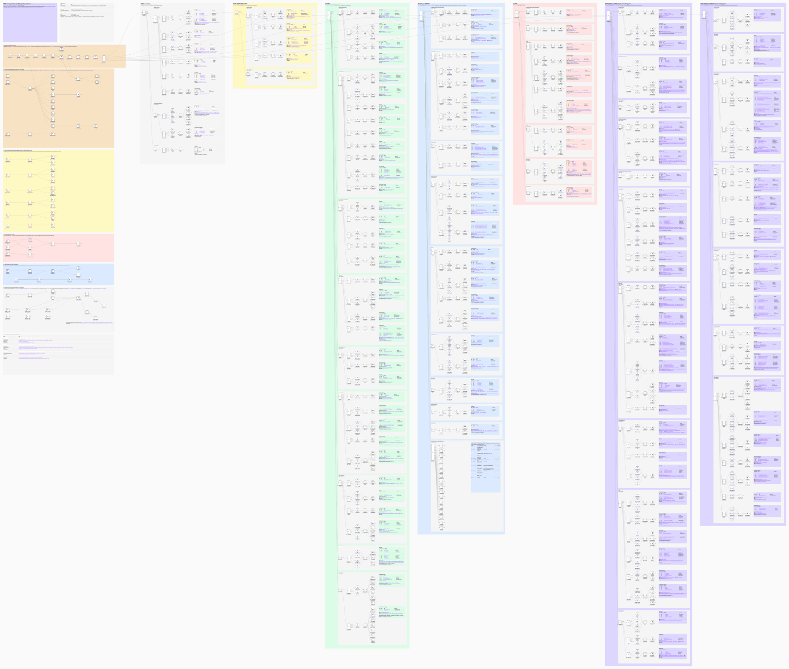
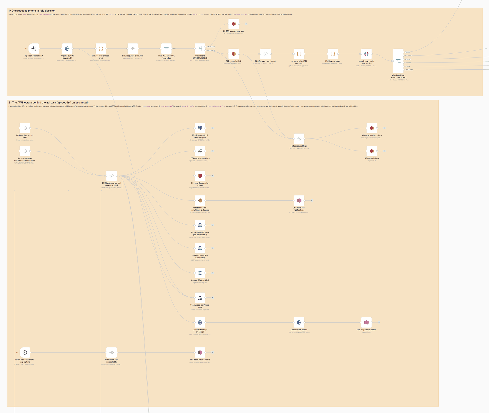
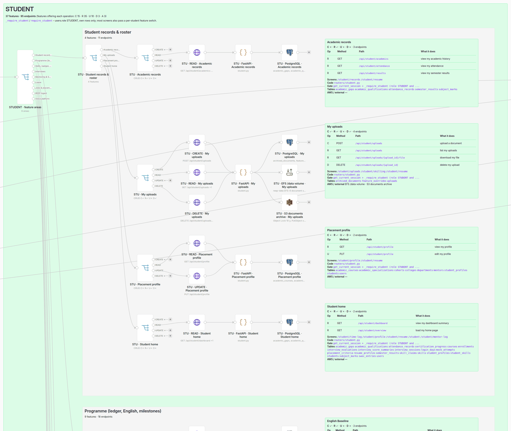

# Every role, feature and CRUD operation, as an n8n workflow

`reep-roles-features-crud.n8n.json` is an **importable n8n workflow** that draws
the whole product end to end. It shows every role, every feature that role has,
and every CRUD operation on that feature, with the API call, the FastAPI handler,
the RDS tables and the AWS services behind it. Beside the roles it shows the request path
from the phone to the role decision, and the AWS estate the API runs on.

It is a **diagram, not an automation**:

- It imports inactive.
- Every credential it names is a stub with no secret behind it.
- Every URL points at the dev stack (`http://localhost:4200`, where `ng serve` proxies `/api` to FastAPI on `:3300`), never at production.

## Open it

1. In n8n, go to **Workflows → Import from File** (or paste the file's contents
   onto an empty canvas).
2. Press **1** (zoom to fit) and zoom into a lane.

It was imported and rendered on n8n 2.41.6 with zero node warnings. Every node
type it uses ships with core n8n, so nothing needs installing. At about 1,200
nodes the canvas takes a few seconds to open. Clicking a node shows the full
detail: the URL, the SQL comment listing the tables per operation, and the
handler file, function and line.

## On a phone

`reep-roles-features-crud.html` is the same map as one self-contained page that
works at phone width, in light and dark. Open it in any browser; it needs no
n8n and no network beyond the web fonts, which fall back to system fonts.

- There is one tab per role, and every feature is a row showing its C/R/U/D. Tap a row to open its endpoints, screens, code, gate, tables and AWS services.
- The search box filters the current tab by feature name, path, table or service.
- **Stack & AWS** walks the request path, then lists the AWS estate, schedules, backups, voice platform, deploy pipeline and every table.

The page is built from the same inventory, with the same lane rules, as the
workflow. Its Stack & AWS tab is read out of the generated workflow itself, so
regenerate the workflow first:

```bash
python tools/diagrams/render_n8n_workflow.py
python tools/diagrams/render_roles_crud_page.py
```

`reep-roles-features-crud.pdf` is the same page printed to A4, with every feature
open and the n8n renders at the end. Use it wherever an `.html` file would be
shown as source code, for example in a phone's file viewer or on GitHub. To
reprint it, run Playwright's Chromium after `npm ci` at the root:

```bash
node tools/diagrams/print_roles_crud_pdf.cjs
```

## What it looks like

These are renders from n8n 2.41.6 of the whole canvas, the request path and the
AWS estate, and the top of the Student lane:





## How to read it

The **top left** is one request, from phone to role decision:

1. Angular SPA, then the `reep-sw.js` service worker.
2. DNS, then the WAF web ACL.
3. CloudFront: the default behaviour serves the SPA from S3, and `/api/*` goes to the ALB.
4. The ECS Fargate api task, running uvicorn and FastAPI.
5. The middleware chain.
6. `security.py`, which verifies the `reep_session` JWT and `token_version`.
7. The **Who is calling?** switch, whose six outputs feed the role lanes.

**Each role lane** (the coloured columns) is a tree that reads left to right:

| Column | n8n node | Means |
|---|---|---|
| 1 | Switch | the role's feature areas |
| 2 | Switch | the features in one area |
| 3 | Switch | **the feature**: its outputs are always `CREATE · READ · UPDATE · DELETE` (+ `ACTION` for sign-ins, codes, sockets, asking the agent). An output written `DELETE ✗` is an operation **this role is not offered** |
| 4 | HTTP Request | one offered operation: the method and path of its first endpoint; the subtitle says how many more |
| 5 | Code | the FastAPI handler(s): file, function, line, and the gate they run |
| 6 | Postgres / S3 / SES / DynamoDB / SQS / Lambda / Read-Write Files / HTTP | the RDS tables per operation, and every AWS or third-party service the feature reaches (EFS is the Read/Write Files node; Bedrock, Google, SSM and CloudWatch are HTTP nodes on their real endpoints) |
| 7 | Sticky note | **the feature's card**: the C/R/U/D flags, every endpoint with its method, path and what it does, the screens that call it, the code, the gate, the tables and the AWS services. A `†` marks an endpoint that no screen in that role's navigation calls (API, or a typed URL, only). `C/U` marks an upsert |

The lanes are:

| Lane | Colour | Gate | Feature areas | Features | Endpoints drawn |
|---|---|---|---|---|---|
| PUBLIC | grey | no session | 3 | 9 | 29 |
| EVERY SIGNED-IN ACCOUNT | yellow | any session | 2 | 5 | 13 |
| STUDENT | green | `require_student` | 9 | 37 | 95 |
| FACULTY (role MENTOR) | blue | `require_mentor` + rule 2 | 9 (+ granted) | 25 (+ 17 grantable capabilities) | 75 (+ 137 by grant or as a delegate) |
| ALUMNI | pink | `require_alumni` | 6 | 11 | 28 |
| MAIN ADMIN (role ADMIN) | purple, two columns | `require_admin` / baseline capabilities | 17 | 62 | 245 |

Three rules decide which lane an endpoint is drawn in:

- **Any signed-in role.** If any signed-in role can call an endpoint, it is drawn in *each* human lane, because applying for leave or asking the REEP Agent is that role's feature. Account features (session, sign-out, password, linked Google, notification preferences) are the exception: they are drawn once, in the ACCOUNT lane.
- **Granted console screens.** A console screen that a faculty member reaches *only* through a Governance grant of an `admin.*` capability is drawn once, as the Faculty lane's **Granted by the Main Admin** branch, with a table mapping each capability to the Main Admin features it opens. The admin console is not copied into the Faculty lane, because those are the same endpoints the Main Admin lane already draws.
- **Faculty-only instruments.** `mentor.mentees`, `mentor.notebook`, `mentor.verifications` and `mentor.upskilling` are outside the Main Admin's baseline (`_FACULTY_ONLY` in `app/governance.py`). So the Mentee Log, the notebook, claim verification and the upskilling shelf appear in the Faculty lane and **not** in the Main Admin lane, which is how the product behaves.

The **left-hand column** below the request path has seven sections:

1. **The AWS estate.** What the api task talks to. Every arrow leaves through the NAT instance; there are no VPC endpoints.
2. **The nightly schedules** (EventBridge Scheduler, then ECS RunTask), in IST and in the order that matters: the identity ledger, the dump and the archive sweep all run before retention, the one scheduled destructor.
3. **Backups and DR.**
4. **The voice-platform ingest.** The queue worker is drawn deactivated because nothing deploys it.
5. **The GitHub Actions pipeline.**
6. **The ops-task menu.**
7. **The data model:** every table, by domain.

## Where the data comes from

`reep-feature-inventory.json` is the source of truth the diagram is drawn from.
It holds one row per endpoint the app serves: 379 method+path pairs, including the
three WebSockets and the `/api/v1/auth` aliases. Each row has:

- the role(s) that can call it, and how a faculty member reaches it (`NONE`, `ALWAYS`, `MENTOR_GROUP`, `GRANT` or `OWN_ONLY`)
- the CRUD operation
- the gate and capability
- the tables and external systems it touches
- the Angular routes that call it
- the handler's file, function and line

The inventory also carries the Angular routes, every table, the scheduled and
operator jobs, the GitHub workflows and the AWS resources. The route table was
read from the running app (`app.routes`), not from a grep. Each handler was
classified from its source, and then re-checked against the same guards by a
second, independent pass that tried to refute it. That second pass applied 25
corrections, for example a role that was missing or a table the close path also
writes. A third review compared the finished diagram with the screens, the
navigation and AGENTS.md, and applied 20 more corrections. For example, it:

- gave upserts both C and U;
- moved a faculty member's own leave PDF out of the granted branch;
- renamed cards to the office's sidebar words.

The inventory was taken at the commit named in its `about` block.

## Keeping it true

Regenerate the workflow from the inventory:

```bash
python tools/diagrams/render_n8n_workflow.py
```

Node ids are uuid5 of the node name, so a regeneration diffs cleanly.

To check whether the inventory has drifted from the code, run this with
`apps/api-py`'s venv:

```bash
python tools/diagrams/render_n8n_workflow.py --check-routes
```

It lists every route the app serves that the inventory does not draw, and every
drawn route the app no longer serves. It exits 1 on any difference. A new
endpoint needs a row in `reep-feature-inventory.json`, in the same vocabulary,
before the diagram can show it. The check is not a CI job on purpose: a diagram
must not block a pull request.
